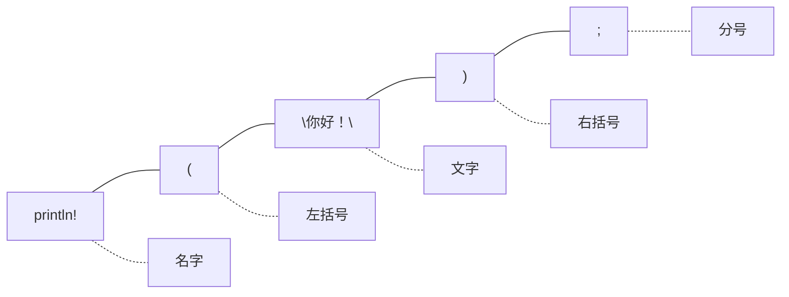

# 第一个程序：从零开始

## 学习目标

学完本章后，你将能够：
- 写出一个最简单的 Rust 程序
- 在屏幕上打印带变量的文字
- 使用 `let` 声明变量
- 使用 `{}` 占位符拼接文字和变量
- 给变量标注类型

---

## 一、从空壳开始

打开 `src/main.rs`，写上最少的代码：

```rust
fn main() {

}
```

这就是一个"什么也不做"的 Rust 程序。它运行，然后立刻退出，什么也不打印。

- `fn` = function（函数），你可以理解为"定义一个功能"
- `main` = 这个功能的名字
- `()` = 参数列表，目前是空的
- `{}` = 函数的主体，里面是要执行的代码（现在是空的）

运行 `cargo run`，你会看到：

```
    Finished dev [unoptimized + debuginfo] target(s) in 0.00s
     Running `target/debug/my_project`
```

没有输出任何文字 — 因为我们的 `{}` 里面什么都没写！

---

## 二、让程序"开口说话"

在 `{}` 中间加一行代码：

```rust
fn main() {
    println!("你好！");
}
```

运行 `cargo run`，输出：

```
你好！
```

成功了！让我们把这句话拆开：



- `println!` — 打印命令（带 `!` 说明它是宏）
- `"你好！"` — 要打印的文字，**双引号里的叫字符串**
- `;` — 分号，表示这句话结束了

**规则**：字符串必须用双引号 `""` 包起来，单引号不行。

试试改一下文字：

```rust
fn main() {
    println!("早上好！");
}
```

再试试：

```rust
fn main() {
    println!("我有{}岁。", 18);
}
```

看到了吗？`{}` 被替换成了 `18`！这就是占位符的作用。

---

## 三、引入变量：给数据起名字

### 3.1 最简单的变量

```rust
fn main() {
    let name = "小明";
    println!("你好，{}", name);
}
```

输出：

```
你好，小明
```

`let name = "小明"` 这句话的意思是：**把"小明"这两个字存起来，并且给它起名叫 `name`**。

你可以把 `let` 理解为"让我们有一个"：
- 让我们有一个名字叫 `name`，它的内容是"小明"
- 让我们有一个名字叫 `age`，它的内容是 18

### 3.2 多个变量

```rust
fn main() {
    let name = "小明";
    let age = 18;
    println!("我叫{}，今年{}岁。", name, age);
}
```

输出：

```
我叫小明，今年18岁。
```

注意：占位符 `{}` 是按顺序替换的 — 第一个 `{}` 替换成 `name`，第二个 `{}` 替换成 `age`。

### 3.3 占位符也可以编号

```rust
fn main() {
    let x = 10;
    let y = 20;
    println!("{0} + {1} = {2}", x, y, x + y);
}
```

输出：

```
10 + 20 = 30
```

`{0}` 对应第一个参数 `x`，`{1}` 对应 `y`，`{2}` 对应 `x + y`。

---

## 四、什么是类型？

到目前为止，我们写变量的方式都是：

```rust
let name = "小明";
let age = 18;
```

Rust 会自动猜出变量是什么类型：
- `"小明"` 是字符串 → `name` 的类型是 `&str`
- `18` 是整数 → `age` 的类型是 `i32`

但有时候，我们需要明确告诉 Rust："这个变量就是这个类型，不要猜了"。

### 4.1 类型标注

```rust
fn main() {
    let name: &str = "小明";
    let age: i32 = 18;
    println!("我叫{}，今年{}岁。", name, age);
}
```

格式是：

```
let 变量名 : 类型 = 值;
```

就像在说：**创建一个变量叫 name，它的类型是 &str，值是"小明"**。

常见的类型（先记住这几种）：

| 代码 | 中文 | 能存什么 | 例子 |
|------|------|----------|------|
| `i32` | 整数 | 像 1, 2, 100, -5 | `let x: i32 = 42;` |
| `f64` | 小数 | 像 3.14, -0.5 | `let pi: f64 = 3.14;` |
| `bool` | 真假 | true 或 false | `let ok: bool = true;` |
| `char` | 单个字符 | 像 'A', '中' | `let c: char = '好';` |
| `&str` | 字符串 | 像 "你好" | `let s: &str = "hello";` |

注意：
- 字符串用**双引号** `"你好"`
- 单个字符用**单引号** `'好'`
- 整数和小数不要加引号

---

## 五、程序进化：从简到繁

让我们从一个最简单的程序开始，一步一步增加功能。

### 步骤1：打印一句话

```rust
fn main() {
    println!("Rust 学习笔记");
}
```

### 步骤2：加入变量

```rust
fn main() {
    let subject = "Rust";
    println!("{} 学习笔记", subject);
}
```

### 步骤3：加入更多变量

```rust
fn main() {
    let subject = "Rust";
    let chapter = 2;
    println!("{} 学习笔记 — 第{}章", subject, chapter);
}
```

### 步骤4：加入类型标注

```rust
fn main() {
    let subject: &str = "Rust";
    let chapter: i32 = 2;
    println!("{} 学习笔记 — 第{}章", subject, chapter);
}
```

### 步骤5：加入计算

```rust
fn main() {
    let subject: &str = "Rust";
    let current: i32 = 2;
    let total: i32 = 14;
    let remaining = total - current;
    println!("{} 学习笔记 — 第{}章，还剩{}章", subject, current, remaining);
}
```

输出：

```
Rust 学习笔记 — 第2章，还剩12章
```

每一步都很小，但把它们组合在一起，程序就越来越"有用了"。

---

## 六、变量的"不变"特性

试试这段代码：

```rust
fn main() {
    let x = 5;
    x = 6;        // 想改成6
    println!("{}", x);
}
```

编译器会告诉你：

```
error: cannot assign twice to immutable variable `x`
```

翻译：**不能给"不可变"的变量 `x` 赋值两次。**

在 Rust 中，`let` 创建的变量默认是**不可变的**（immutable）。就像你用笔写在纸上，不能擦掉重写。

如果你真的需要改变它，加上 `mut`：

```rust
fn main() {
    let mut x = 5;
    x = 6;        // 可以改了
    println!("{}", x);   // 输出 6
}
```

`mut` 是 `mutable` 的缩写，意思是"可变的"。这听起来像是个限制，但实际上它是 Rust 保护你的方式 — 大多数时候你不需要改变变量，这能让你的程序更安全。

---

## 七、数字运算

在打印语句中可以直接做计算：

```rust
fn main() {
    let a = 10;
    let b = 3;

    println!("加法：{} + {} = {}", a, b, a + b);
    println!("减法：{} - {} = {}", a, b, a - b);
    println!("乘法：{} × {} = {}", a, b, a * b);
    println!("除法：{} ÷ {} = {}", a, b, a / b);
    println!("余数：{} % {} = {}", a, b, a % b);
}
```

输出：

```
加法：10 + 3 = 13
减法：10 - 3 = 7
乘法：10 × 3 = 30
除法：10 ÷ 3 = 3
余数：10 % 3 = 1
```

注意整数除法：`10 / 3 = 3`，不是 `3.333...`。整数除以整数得到整数（小数部分被截断）。

如果要做精确除法，用小数类型：

```rust
fn main() {
    let a: f64 = 10.0;
    let b: f64 = 3.0;
    println!("{} ÷ {} = {}", a, b, a / b);  // 输出 3.333...
}
```

---

## 八、注释：写给人类看的文字

```rust
fn main() {
    // 这是单行注释，编译器会忽略它
    let name = "小明";  // 注释也可以写在代码后面

    /*
    这是多行注释
    可以用来写
    比较长的说明
    */
    println!("{}", name);
}
```

注释是写给自己或队友看的，计算机完全不理会它。

---

## 九、常见错误与解决

### 错误1：忘记分号

```rust
fn main() {
    let x = 5    // 缺少分号！
    println!("{}", x);
}
```

编译器会报错，告诉你期望一个分号。

### 错误2：字符串用单引号

```rust
fn main() {
    let s = '你好';  // 错误！单引号是 char 类型
}
```

改成 `"你好"`（双引号）即可。

### 错误3：类型不匹配

```rust
fn main() {
    let x: i32 = "hello";  // 错误！字符串不能放进整数变量
}
```

类型标注和值必须一致。

---

## 本章小结

在这一章中你学到了 Rust 程序的基本结构：

- `fn main() {}` 是程序的骨架
- `println!` 用来在屏幕上显示文字
- `let` 用来创建变量
- `{}` 是占位符，可以把变量内容填进去
- 类型标注用 `:` 号，如 `let x: i32 = 5;`
- Rust 变量默认不可变，需要改变时加 `mut`
- 注释用 `//` 或 `/* */`

你已经从"什么也不做的空壳"写到了"能打印、能计算、能拼接文字"的程序。接下来，我们要学习更多关于变量的知识。

[[03-变量与数据]]

---

## 章节考查

> **总分100分**：概念考查40分 + 判断正误20分 + 代码分析15分 + 编程大题15分 + 填空题5分 + 代码补全5分

### 一、概念考查（每题4分，共40分）

**1. `fn main() {}` 中 `fn` 是什么意思？**
- A. 结束
- B. 函数/功能
- C. 文件名
- D. 错误号

<details><summary>点击查看答案</summary>

**B**。`fn` 是 function 的缩写，表示定义一个函数（功能块）。

</details>

**2. 声明变量的关键字是？**
- A. `var`
- B. `let`
- C. `const`
- D. `define`

<details><summary>点击查看答案</summary>

**B**。Rust 使用 `let` 来声明变量，如 `let x = 5;`。这在 Rust 中是不可变的默认声明方式。

</details>

**3. `println!("{}", 42)` 中 `{}` 的作用是？**
- A. 表示空值
- B. 占位符，会被后面的值替换
- C. 打印花括号
- D. 创建变量

<details><summary>点击查看答案</summary>

**B**。`{}` 是占位符，`println!` 会把参数按顺序填入 `{}` 的位置。

</details>

**4. 在 Rust 中，变量默认是？**
- A. 可变的
- B. 不可变的
- C. 私有的
- D. 临时的

<details><summary>点击查看答案</summary>

**B**。`let` 创建的变量默认不可变（immutable），需要改变时要用 `let mut`。

</details>

**5. `let x: i32 = 10;` 中 `i32` 表示什么？**
- A. 变量的名字
- B. 变量的值
- C. 变量的类型
- D. 变量的地址

<details><summary>点击查看答案</summary>

**C**。`: i32` 是类型标注，告诉编译器 `x` 是 32 位有符号整数类型。

</details>

**6. 字符串在 Rust 中必须用什么符号包裹？**
- A. 单引号
- B. 双引号
- C. 反引号
- D. 圆括号

<details><summary>点击查看答案</summary>

**B**。字符串字面量用双引号 `"..."`，单个字符用单引号 `'...'`。

</details>

**7. 整数除法 `5 / 2` 的结果是？**
- A. 2.5
- B. 2
- C. 3
- D. 2.0

<details><summary>点击查看答案</summary>

**B**。整数除法会截断小数部分，结果为 2。要做精确除法需要用浮点数 `5.0 / 2.0`。

</details>

**8. Rust 中单行注释的写法是？**
- A. `/* 注释 */`
- B. `<!-- 注释 -->`
- C. `// 注释`
- D. `# 注释`

<details><summary>点击查看答案</summary>

**C**。`//` 是 Rust 的单行注释，`/* */` 是多行注释。

</details>

**9. `let mut x = 5;` 中 `mut` 的作用是？**
- A. 让变量变成整数
- B. 让变量可以改变值
- C. 让变量变成全局的
- D. 删除变量

<details><summary>点击查看答案</summary>

**B**。`mut` 是 mutable 的缩写，表示变量是可变的，可以重新赋值。

</details>

**10. `println!("{0}和{1}", a, b)` 中 `{0}` 引用的是？**
- A. 第一个参数 a
- B. 第二个参数 b
- C. 数字 0
- D. 空值

<details><summary>点击查看答案</summary>

**A**。带编号的占位符 `{0}` 表示第一个参数，`{1}` 表示第二个参数，以此类推。

</details>

### 二、判断正误（每题2分，共20分）

**1. `let x = 5;` 之后可以写 `x = 6;` 来改值。**
<details><summary>点击查看答案</summary>

**错误**。没有 `mut` 的变量是不可变的，不能重新赋值。

</details>

**2. `println!` 是普通函数。**
<details><summary>点击查看答案</summary>

**错误**。`println!` 是宏，结尾的 `!` 号表明不是普通函数。

</details>

**3. `let s = '你好';` 是正确的 Rust 代码。**
<details><summary>点击查看答案</summary>

**错误**。单引号只能包含单个字符，且"你好"是两个字符。应该用双引号。

</details>

**4. 类型标注是可选的，Rust 通常能自动推断类型。**
<details><summary>点击查看答案</summary>

**正确**。大多数情况下 Rust 的类型推断能自动确定类型，但你也可以手动标注。

</details>

**5. `println!` 每次调用都会自动换行。**
<details><summary>点击查看答案</summary>

**正确**。`println!` 末尾自动加换行。如果不想换行，可以用 `print!`。

</details>

**6. `fn main() {}` 中 `()` 可以省略。**
<details><summary>点击查看答案</summary>

**错误**。`()` 是函数签名的必要部分，即使没有参数也不能省略。

</details>

**7. `let x: i32 = 3.14;` 不会报错。**
<details><summary>点击查看答案</summary>

**错误**。`i32` 是整数类型，`3.14` 是小数，类型不匹配，编译器会报错。

</details>

**8. `let a = 10; let b = 3; let c = a / b;` 中 c 的值是 3.333。**
<details><summary>点击查看答案</summary>

**错误**。整数除法结果也是整数，c = 3。

</details>

**9. `//` 后面的内容在编译时会被忽略。**
<details><summary>点击查看答案</summary>

**正确**。注释是给人看的，编译器完全忽略它们。

</details>

**10. 代码 `let name = "小明";` 中 `name` 的类型由 Rust 自动推断。**
<details><summary>点击查看答案</summary>

**正确**。Rust 会根据赋予的值 `"小明"` 推断出 `name` 的类型为 `&str`。

</details>

### 三、代码分析（每题3分，共15分）

**1. 下面代码的输出是什么？**

```rust
fn main() {
    let x = 5;
    let y = 3;
    println!("结果 = {}", x + y * 2);
}
```

- A. 结果 = 16
- B. 结果 = 11
- C. 结果 = 13
- D. 结果 = 8

<details><summary>点击查看答案</summary>

**B**。按照先乘除后加减的规则，`y * 2 = 6`，然后 `5 + 6 = 11`。如果期望先加后乘，需要括号：`(x + y) * 2`。

</details>

**2. 下面代码有什么问题？**

```rust
fn main() {
    let subject = "Rust";
    println!(subject);
}
```

- A. 没有问题
- B. `println!` 的参数必须是字符串字面量，不能是变量
- C. 缺少 `fn` 关键字
- D. 缺少 `{}` 占位符

<details><summary>点击查看答案</summary>

**D**。`println!` 第一个参数必须是格式字符串（含占位符），不能直接传变量。正确写法：`println!("{}", subject);`。

</details>

**3. 下面代码的输出是什么？**

```rust
fn main() {
    let x = 10;
    let y = 20;
    let x = x + y;
    println!("x = {}", x);
}
```

- A. x = 10
- B. x = 20
- C. x = 30
- D. 编译错误

<details><summary>点击查看答案</summary>

**C**。第二个 `let x` 是变量遮蔽（shadowing），创建了一个新的同名变量。新 x = 10 + 20 = 30。

</details>

**4. 下面代码的输出是什么？**

```rust
fn main() {
    let a = 7;
    let b = 3;
    println!("{}", a % b);
}
```

- A. 2.333...
- B. 1
- C. 2
- D. 0

<details><summary>点击查看答案</summary>

**B**。`%` 是取余运算符，`7 ÷ 3 = 2 余 1`，所以结果是 1。

</details>

**5. 下面代码有什么错误？**

```rust
fn main() {
    let x: i32 = "42";
    println!("{}", x);
}
```

- A. 变量名不能用 x
- B. 类型标注错误：`i32` 不能存字符串
- C. `println!` 缺少参数
- D. 没有错误

<details><summary>点击查看答案</summary>

**B**。`x` 的类型标注为 `i32`（整数），但赋的值是字符串 `"42"`，类型不匹配。应该用 `let x: i32 = 42;`。

</details>

### 四、编程大题（15分）

**题目：** 编写一个 Rust 程序，实现以下功能：
1. 创建变量 `name`，值为你的名字
2. 创建变量 `birth_year`，值为出生年份
3. 创建变量 `current_year`，值为当前年份
4. 计算年龄：`current_year - birth_year`
5. 打印：`我叫[名字]，今年[年龄]岁。`

<details><summary>点击查看答案</summary>

```rust
fn main() {
    let name = "小明";
    let birth_year = 2000;
    let current_year = 2026;
    let age = current_year - birth_year;
    println!("我叫{}，今年{}岁。", name, age);
}
```

**评分标准**：
- 正确声明所有变量（4分）
- 正确计算年龄（4分）
- 正确使用 `println!`（3分）
- 代码完整无错误（2分）
- 分号使用正确（2分）

</details>

### 五、填空题（每题1分，共5分）

**1. 声明变量的关键字是 `______`。**

<details><summary>点击查看答案</summary>

**let**。Rust 用 `let` 声明变量。

</details>

**2. 让变量可变的修饰符是 `______`。**

<details><summary>点击查看答案</summary>

**mut**。`let mut x = 5;` 创建可变变量。

</details>

**3. 打印不换行用 `______!`，换行用 `______!`。**

<details><summary>点击查看答案</summary>

**print** 和 **println**。`print!` 不换行，`println!` 自动换行。

</details>

**4. 整数类型中最常用的是 `______`。**

<details><summary>点击查看答案</summary>

**i32**。i32 是 Rust 默认的整数类型，也是大多数场景中的最佳选择。

</details>

**5. `______` 是宏的标志，表明它不是普通函数。**

<details><summary>点击查看答案</summary>

**!**。如 `println!` 中的 `!`。

</details>

### 六、代码补全（共5分）

**1. 补全变量声明，使程序输出 "年龄：25"（2分）**

```rust
fn main() {
    let age: _____ = 25;
    println!("年龄：{}", age);
}
```

<details><summary>点击查看答案</summary>

```rust
let age: i32 = 25;
```

</details>

**2. 补全 println! 调用，使其输出 "5 + 3 = 8"（2分）**

```rust
fn main() {
    let a = 5;
    let b = 3;
    println!("_____", a, b, a + b);
}
```

<details><summary>点击查看答案</summary>

```rust
println!("{} + {} = {}", a, b, a + b);
```

</details>

**3. 补全可变变量声明（1分）**

```rust
fn main() {
    let _____ count = 0;
    count = 1;
    println!("{}", count);
}
```

<details><summary>点击查看答案</summary>

```rust
let mut count = 0;
```

</details>

---

> **计分：概念40 + 判断20 + 代码分析15 + 编程15 + 填空5 + 补全5 = 总分100分**
