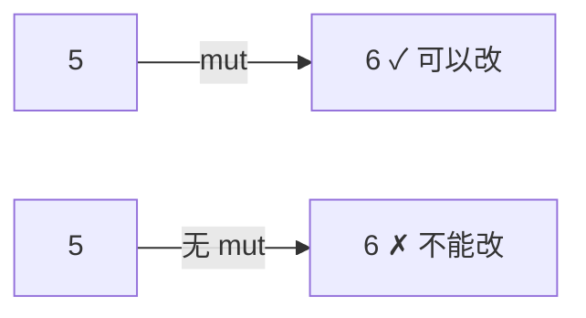
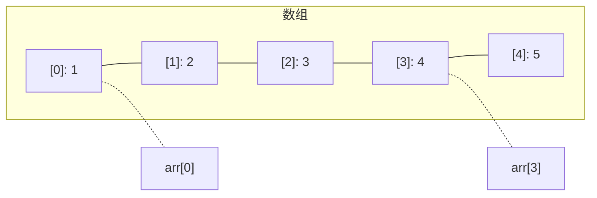

# 变量与数据

## 学习目标

学完本章后，你将能够：
- 理解和区分 Rust 中所有的基本数据类型
- 使用整数、浮点数、布尔值和字符
- 创建和使用元组（tuple）与数组（array）
- 区分可变与不可变变量
- 知道什么时候该用什么类型

---

## 一、从最简单的变量开始

还记得上一章的 `let x = 5;` 吗？这就是声明变量的最简单方式：

```rust
fn main() {
    let x = 5;
    println!("x = {}", x);
}
```

输出：

```
x = 5
```

`let x = 5;` 做了三件事：
1. 在内存中开辟了一小块空间
2. 把数字 `5` 存进去
3. 给这块空间贴上标签 `x`

之后提到 `x`，计算机就知道你要找那个存了 `5` 的空间。

---

## 二、不可变：Rust 的保护机制

### 2.1 变量默认不可变

```rust
fn main() {
    let x = 5;
    x = 6;  // 编译错误！
}
```

Rust 的规矩是：**你声明一个变量之后，它的值就不能随便改。**

为什么？想象你在做数学题：

```
第一步：设 x = 5
第二步：计算 x + 3  ← 这当然等于 8
第三步：设 y = x    ← y 肯定是 5
```

如果第一步后 x 偷偷变成了 6，结果就全乱了。Rust 帮你把这个"偷偷变"的可能消除了。

### 2.2 mut：我能改变它吗？可以！

如果你真的需要改变一个变量，用 `mut`：

```rust
fn main() {
    let mut x = 5;
    x = 6;
    println!("x = {}", x);  // x = 6
}
```



**经验法则**：能不动就不动。如果发现确实需要改变，再加 `mut`。

---

## 三、整数的世界

### 3.1 最简单的整数

```rust
fn main() {
    let age = 18;
    let year = 2026;
    let count = -5;    // 负数也可以
    println!("年龄：{}，年份：{}，计数：{}", age, year, count);
}
```

在 Rust 里，如果不标注类型，整数默认是 `i32`。

### 3.2 整数家族

Rust 提供了很多种整数类型，区别在于**能存多大的数字**和**能不能存负数**。

| 类型 | 含义 | 范围（约） | 比喻 |
|------|------|-----------|------|
| `i8` | 8位有符号 | -128 ~ 127 | 一个车牌号 |
| `i16` | 16位有符号 | -32768 ~ 32767 | 一座城市的人口 |
| `i32` | 32位有符号 | -21亿 ~ 21亿 | 中国的人口 |
| `i64` | 64位有符号 | 超大 | 银河系的星星数 |
| `i128` | 128位有符号 | 超级大 | 用不完 |

| 类型 | 含义 | 范围 | 比喻 |
|------|------|------|------|
| `u8` | 8位无符号 | 0 ~ 255 | 一天的小时数 |
| `u16` | 16位无符号 | 0 ~ 65535 | 端口号 |
| `u32` | 32位无符号 | 0 ~ 42亿 | IP地址 |
| `u64` | 64位无符号 | 超大 | 硬盘容量 |
| `u128` | 128位无符号 | 超级大 | |
| `usize` | 指针大小 | 看系统 | 数组索引 |

**命名规则**：
- `i` 开头：有符号（能表示正和负，就像 `i32`）
- `u` 开头：无符号（只有正数，就像 `u32`）
- 数字代表占用多少位

**大多数人 99% 的时间只用一个类型：`i32`。**

```rust
fn main() {
    let a: i8 = 100;
    let b: u8 = 200;
    let c: i64 = 9000000000;
    println!("a={}, b={}, c={}", a, b, c);
}
```

### 3.3 选哪种整数？

| 场景 | 推荐类型 |
|------|----------|
| 普通整数 | `i32` |
| 年龄、计数 | `i32` 或 `u32` |
| 数组索引 | `usize` |
| 特殊小范围 | `u8`（如颜色值 0-255） |
| 超大数字 | `i64` 或 `u64` |

---

## 四、小数：浮点数

```rust
fn main() {
    let pi = 3.14159;
    let e = 2.71828;
    let half = 0.5;
    println!("π={}, e={}, 一半={}", pi, e, half);
}
```

浮点数有两种：

| 类型 | 名称 | 精度 | 用途 |
|------|------|------|------|
| `f32` | 单精度 | 约7位小数 | 一般计算 |
| `f64` | 双精度 | 约15位小数 | 科学计算（默认） |

默认是 `f64`：

```rust
fn main() {
    let a: f32 = 3.14;   // 明确标注 f32
    let b = 3.14;        // 默认 f64
    let c = 2.5_f32;     // 后缀写法：也是 f32
    println!("a={}, b={}, c={}", a, b, c);
}
```

注意：浮点数直接比较时可能有精度问题，不过现在先不管，后面会讲到。

---

## 五、布尔：真还是假？

```rust
fn main() {
    let is_raining = true;
    let is_sunny = false;

    println!("下雨了吗？{}", is_raining);
    println!("天晴了吗？{}", is_sunny);
}
```

输出：

```
下雨了吗？true
天晴了吗？false
```

布尔类型只有两个值：`true`（真）和 `false`（假）。就像电灯开关 — 要么开，要么关。

布尔在条件判断中大量使用，下一章就会见到更多。

```rust
fn main() {
    let has_ticket: bool = true;   // 有门票
    let is_vip: bool = false;      // 不是VIP
    println!("有票：{}，VIP：{}", has_ticket, is_vip);
}
```

---

## 六、字符：不仅仅是一个字母

```rust
fn main() {
    let letter = 'A';
    let digit = '7';
    let emoji = '😊';
    let chinese = '好';

    println!("字母：{}，数字：{}，表情：{}，中文：{}", letter, digit, emoji, chinese);
}
```

Rust 的 `char` 类型很强大 — 它能存任何 Unicode 字符！英文、中文、日文、表情符号，都没问题。

注意区分：
- `'A'` — 单引号 = 单个字符（char）
- `"A"` — 双引号 = 字符串（str）

---

## 七、复合类型：把数据打包

### 7.1 元组（Tuple）—— 固定大小的"打包袋"

```rust
fn main() {
    let t = (1, "hello", 3.14);
    println!("整数：{}，文字：{}，小数：{}", t.0, t.1, t.2);
}
```

元组像是一个小袋子，可以把不同类型的数据装在一起：
- `t.0` — 访问第一个元素
- `t.1` — 访问第二个元素
- `t.2` — 访问第三个元素

```rust
fn main() {
    // 解构：一次取出所有元素
    let (x, y, z) = (10, 20, 30);
    println!("x={}, y={}, z={}", x, y, z);

    // 带有类型的元组
    let person: (&str, i32, bool) = ("小明", 18, true);
    println!("名字：{}，年龄：{}，在线：{}", person.0, person.1, person.2);
}
```

元组的特点：
- 大小固定，创建后不能增减元素
- 可以装不同类型
- 用 `.数字` 访问

### 7.2 数组（Array）—— 排成一排的相同类型

```rust
fn main() {
    // 最简单的数组
    let arr = [1, 2, 3, 4, 5];
    println!("第一个：{}，第三个：{}", arr[0], arr[2]);
}
```

输出：

```
第一个：1，第三个：3
```

注意：数组索引从 `0` 开始！



数组的特点：
- 所有元素必须是**相同类型**
- 大小固定，创建后不能变
- 用方括号 `[ ]` 定义
- 用 `[索引]` 访问

```rust
fn main() {
    // 声明类型和大小
    let arr: [i32; 5] = [1, 2, 3, 4, 5];

    // 另一种写法：创建 100 个 0
    let zeros = [0; 100];

    println!("第50个零：{}", zeros[49]);  // 索引从0开始，所以49就是第50个
    println!("数组长度：{}", arr.len());
}
```

### 7.3 元组 vs 数组

| | 元组 (Tuple) | 数组 (Array) |
|------|-------------|-------------|
| 写法 | `(1, "a", 3.14)` | `[1, 2, 3, 4, 5]` |
| 访问 | `.0, .1, .2` | `[0], [1], [2]` |
| 元素类型 | 可以不同 | 必须相同 |
| 大小 | 固定 | 固定 |
| 长度 | 类型的一部分 | 类型的一部分 |

---

## 八、类型转换

有时候需要把一种类型变成另一种：

```rust
fn main() {
    let a: i32 = 42;
    let b: i64 = a as i64;    // i32 转 i64（安全的，变大）
    let c: i8 = a as i8;      // i32 转 i8（注意：如果超出范围会截断）

    println!("a={}, b={}, c={}", a, b, c);

    let f: f64 = 3.14;
    let i: i32 = f as i32;    // 小数转整数，丢掉小数部分
    println!("f={}, i={}", f, i);  // i = 3
}
```

---

## 九、常量：永远不变的值

```rust
fn main() {
    const MAX_PLAYERS: u32 = 100;
    const PI: f64 = 3.1415926535;
    const GREETING: &str = "你好";

    println!("最多{}个玩家", MAX_PLAYERS);
    println!("圆周率约：{}", PI);
    println!("{}", GREETING);
}
```

`const` 和 `let` 的区别：

| | `let` | `const` |
|------|-------|---------|
| 可变性 | 默认不可变，可加 `mut` | 永远不可变 |
| 类型标注 | 可省略 | **必须标注** |
| 值 | 可以在运行时计算 | 必须在编译时确定 |
| 命名 | 任意 | 通常全大写 |

---

## 本章小结

这一章我们学习了 Rust 的数据类型：

- **整数**：`i8` 到 `i128`（有符号），`u8` 到 `u128`（无符号），默认 `i32`
- **浮点数**：`f32` 和 `f64`（默认），表示小数
- **布尔**：`bool`，只有 `true` 和 `false`
- **字符**：`char`，能表示任何单个字符
- **元组**：`(a, b, c)`，固定大小，类型可不同
- **数组**：`[a, b, c]`，固定大小，类型相同
- 变量默认不可变，加 `mut` 可变
- 常量用 `const`，类型必须标注

掌握了数据，就像工匠知道了有哪些材料。接下来，我们要学习如何"做决策"。

[[04-做决策：条件与循环]]

---

## 章节考查

> **总分100分**：概念考查40分 + 判断正误20分 + 代码分析15分 + 编程大题15分 + 填空题5分 + 代码补全5分

### 一、概念考查（每题4分，共40分）

**1. Rust 中整数默认是哪种类型？**
- A. i8
- B. i32
- C. i64
- D. u32

<details><summary>点击查看答案</summary>

**B**。`i32` 是 Rust 默认的整数类型，在绝大多数场景中是性能和范围的平衡选择。

</details>

**2. 下面哪一个是合法的 `char` 类型值？**
- A. "A"
- B. 'A'
- C. "好"
- D. 123

<details><summary>点击查看答案</summary>

**B**。`char` 类型用单引号包裹，`"A"` 是字符串类型。

</details>

**3. 元组 `let t = (1, "hi", 3.14);`，访问 3.14 的写法是？**
- A. `t[2]`
- B. `t.2`
- C. `t.3`
- D. `t->2`

<details><summary>点击查看答案</summary>

**B**。元组用 `.索引` 访问，索引从 0 开始，所以第三个元素是 `t.2`。

</details>

**4. `let arr = [10; 5];` 创建的数组是什么？**
- A. [10, 5]
- B. [10, 10, 10, 10, 10]
- C. [5, 5, 5, 5, 5, 5, 5, 5, 5, 5]
- D. 编译错误

<details><summary>点击查看答案</summary>

**B**。`[值; 重复次数]` 语法表示重复创建，`[10; 5]` = 5个10。

</details>

**5. `u8` 类型的范围是？**
- A. -128 ~ 127
- B. 0 ~ 255
- C. -255 ~ 255
- D. 0 ~ 127

<details><summary>点击查看答案</summary>

**B**。`u8` 是无符号 8 位整数，只能是 0 到 255（即 2⁸-1）。

</details>

**6. 要让变量可以改变值，需要加什么关键字？**
- A. `var`
- B. `mut`
- C. `ref`
- D. `change`

<details><summary>点击查看答案</summary>

**B**。`mut` 是 mutable 的缩写，`let mut x = 5;` 表示 x 可被重新赋值。

</details>

**7. `const` 和 `let` 的一个重要区别是？**
- A. `const` 可变，`let` 不可变
- B. `const` 必须标注类型，`let` 可以不标注
- C. `const` 可以在运行时赋值
- D. 没有区别

<details><summary>点击查看答案</summary>

**B**。常量必须显式标注类型，如 `const X: i32 = 5;`。而 `let x = 5;` 可以自动推断。

</details>

**8. 数组和元组的共同点是？**
- A. 元素类型必须相同
- B. 大小固定
- C. 元素类型可以不同
- D. 都使用 `[]` 访问

<details><summary>点击查看答案</summary>

**B**。数组和元组的大小在创建时就固定了，不能改变。但元素类型规则不同。

</details>

**9. `let x: f64 = 5;` 会怎样？**
- A. 正常编译，5 变成 5.0
- B. 编译错误，类型不匹配
- C. x 最终是整数 5
- D. 运行时出错

<details><summary>点击查看答案</summary>

**A**。编译器会进行隐式类型转换（类型可以安全转换时），但这不是好的编码习惯。更好的写法是 `5.0`。

</details>

**10. 浮点数默认类型是？**
- A. f32
- B. f64
- C. f128
- D. 没有默认类型，必须标注

<details><summary>点击查看答案</summary>

**B**。与整数默认 `i32` 类似，浮点数默认是 `f64`（双精度）。

</details>

### 二、判断正误（每题2分，共20分）

**1. `let x = 5; let x = x + 1;` 会编译错误。**
<details><summary>点击查看答案</summary>

**错误**。这是变量遮蔽（shadowing），是合法的。第二个 `let x` 创建了一个新的同名变量。

</details>

**2. 数组 `let a = [1, 2, 3];` 可以通过 `a[3]` 访问到元素 3。**
<details><summary>点击查看答案</summary>

**错误**。索引从 0 开始，`a[2]` 才能访问到 3。`a[3]` 越界了。

</details>

**3. `i32` 可以存正数和负数。**
<details><summary>点击查看答案</summary>

**正确**。`i` 开头表示有符号（signed），可以存负数。

</details>

**4. Rust 的 `char` 只能存英文字母。**
<details><summary>点击查看答案</summary>

**错误**。Rust 的 `char` 可以存任何 Unicode 字符，包括中文、日文、表情符号等。

</details>

**5. `let a: u32 = -5;` 是合法的。**
<details><summary>点击查看答案</summary>

**错误**。`u32` 是无符号类型，不能存负数。

</details>

**6. `let t = (1, 2, 3);` 中 `t` 的类型是元组。**
<details><summary>点击查看答案</summary>

**正确**。三个整数也是元组，类型为 `(i32, i32, i32)`。

</details>

**7. 元组可以通过 `t.0` 访问元素，也可以通过 `t[0]` 访问。**
<details><summary>点击查看答案</summary>

**错误**。元组只能用 `.索引`（如 `.0`）访问，不能用 `[索引]`。

</details>

**8. `let x = 3.14;` 中 x 的类型是 f32。**
<details><summary>点击查看答案</summary>

**错误**。浮点数默认是 `f64`。

</details>

**9. `let zeros = [0; 1000];` 创建了 1000 个零的数组。**
<details><summary>点击查看答案</summary>

**正确**。`[值; 数量]` 是创建重复值的数组的语法。

</details>

**10. `const` 可以用在函数内部。**
<details><summary>点击查看答案</summary>

**正确**。`const` 可以在任何作用域中使用，包括函数内部。

</details>

### 三、代码分析（每题3分，共15分）

**1. 下面代码的输出是什么？**

```rust
fn main() {
    let t = (10, "hello", 3.14);
    println!("{}", t.1);
}
```

- A. 10
- B. hello
- C. 3.14
- D. 编译错误

<details><summary>点击查看答案</summary>

**B**。元组索引从 0 开始，`t.1` 是第二个元素 `"hello"`。

</details>

**2. 下面代码的输出是什么？**

```rust
fn main() {
    let arr = [1, 2, 3, 4, 5];
    println!("{}", arr[1] + arr[3]);
}
```

- A. 4
- B. 6
- C. 7
- D. 5

<details><summary>点击查看答案</summary>

**B**。`arr[1] = 2`，`arr[3] = 4`，`2 + 4 = 6`。

</details>

**3. 下面代码有什么问题？**

```rust
fn main() {
    let mut x: i32 = 100;
    let y: i8 = x as i8;
    println!("y = {}", y);
}
```

- A. 什么都不输出
- B. 输出可能不是 100
- C. 编译错误
- D. 没有错误

<details><summary>点击查看答案</summary>

**B**。`i32` 转 `i8` 可能会丢失数据。如果 x 是 100，i8 能存下（范围 -128~127），所以这次没问题。但如果 x 是 200，转换后结果就不是 200 了。这是潜在的数据截断风险。

</details>

**4. 下面代码的输出是什么？**

```rust
fn main() {
    let (a, b) = (5, 10);
    println!("a={}, b={}", a, b);
}
```

- A. a=0, b=0
- B. a=5, b=10
- C. 编译错误
- D. a=10, b=5

<details><summary>点击查看答案</summary>

**B**。这是元组解构（destructuring）：`a` 取到 5，`b` 取到 10。

</details>

**5. 下面代码有什么错误？**

```rust
fn main() {
    let x = 3.14;
    let y: i32 = x;
    println!("{}", y);
}
```

- A. y 会是 3
- B. 编译错误，不能把 f64 直接赋给 i32
- C. 缺少 mut
- D. 没有错误

<details><summary>点击查看答案</summary>

**B**。Rust 不做隐式类型转换，必须显式用 `as`：`let y: i32 = x as i32;`。

</details>

### 四、编程大题（15分）

**题目：** 写一个程序，包含：
1. 一个不可变的整数变量 `a = 10`
2. 一个可变的整数变量 `b = 20`
3. 把 `b` 改成 `30`
4. 一个浮点数 `pi = 3.14159`
5. 一个布尔 `is_done = true`
6. 一个字符 `grade = 'A'`
7. 一个元组 `info` 包含你的名字和年龄
8. 打印以上所有内容

<details><summary>点击查看答案</summary>

```rust
fn main() {
    let a = 10;
    let mut b = 20;
    b = 30;
    let pi = 3.14159;
    let is_done = true;
    let grade = 'A';
    let info = ("小明", 18);

    println!("a = {}, b = {}", a, b);
    println!("pi = {:.2}", pi);  // .2 表示保留两位小数
    println!("完成了？{}", is_done);
    println!("等级：{}", grade);
    println!("名字：{}，年龄：{}", info.0, info.1);
}
```

**评分标准**：
- 不可变变量 a（2分）
- 可变变量 b（3分）
- 浮点数 pi（2分）
- 布尔 is_done（2分）
- 字符 grade（2分）
- 元组 info（2分）
- 打印语句（2分）

</details>

### 五、填空题（每题1分，共5分）

**1. Rust 中数组的索引从 `______` 开始。**

<details><summary>点击查看答案</summary>

**0**。和大多数编程语言一样，Rust 数组索引从 0 开始。

</details>

**2. `______` 类型的值只能是 `true` 或 `false`。**

<details><summary>点击查看答案</summary>

**bool**。布尔类型是 Rust 的逻辑类型。

</details>

**3. 创建 10 个值为 0 的数组：`let a = [______; ______];`**

<details><summary>点击查看答案</summary>

**0** 和 **10**。`let a = [0; 10];` 创建 10 个 0。

</details>

**4. `______` 是无符号整数前缀，如 `______` 范围是 0~255。**

<details><summary>点击查看答案</summary>

**u** 和 **u8**。`u` 表示无符号（unsigned），`u8` 是 8 位无符号整数。

</details>

**5. 元组用 `______` 括起来，数组用 `______` 括起来。**

<details><summary>点击查看答案</summary>

**小括号 ()** 和 **方括号 []**。`(1, 2)` 是元组，`[1, 2]` 是数组。

</details>

### 六、代码补全（共5分）

**1. 补全类型标注（2分）**

```rust
fn main() {
    let count: ______ = 42;
    let price: ______ = 19.99;
    println!("数量：{}，价格：{}", count, price);
}
```

<details><summary>点击查看答案</summary>

```rust
let count: i32 = 42;
let price: f64 = 19.99;
```
（整数用 i32 或 u32 均可，浮点数用 f64 或 f32 均可）

</details>

**2. 补全元组解构（2分）**

```rust
fn main() {
    let t = ("Rust", 2026);
    let (name, year) = ______;
    println!("{} 发布于 {}", name, year);
}
```

<details><summary>点击查看答案</summary>

```rust
let (name, year) = t;
```

</details>

**3. 补全数组访问（1分）**

```rust
fn main() {
    let arr = [100, 200, 300];
    println!("第二个元素：{}", arr[______]);
}
```

<details><summary>点击查看答案</summary>

```rust
println!("第二个元素：{}", arr[1]);
```
（索引从 0 开始，第二个是索引 1）

</details>

---

> **计分：概念40 + 判断20 + 代码分析15 + 编程15 + 填空5 + 补全5 = 总分100分**
