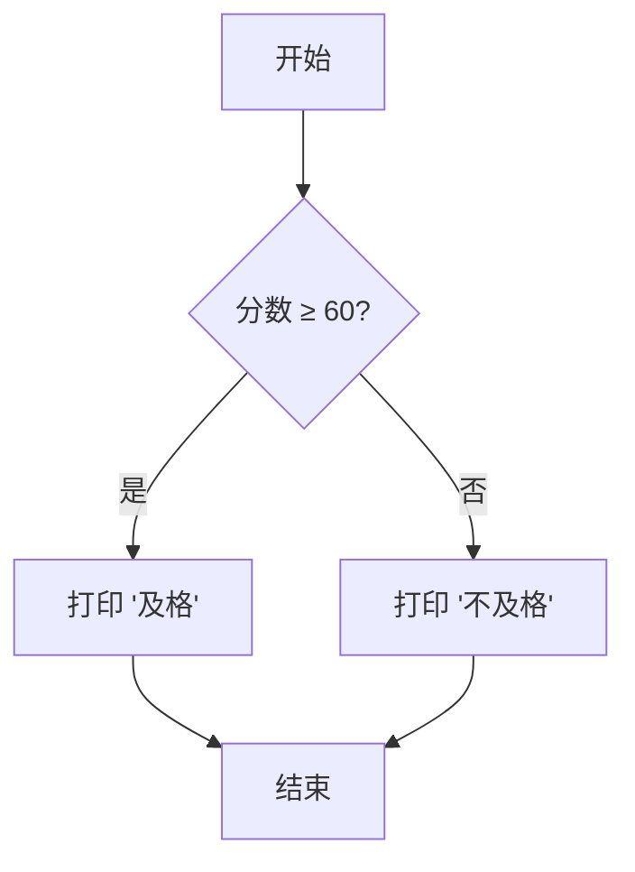
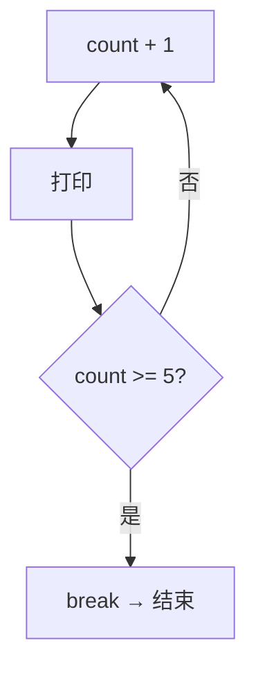

# 做决策：条件与循环

## 学习目标

学完本章后，你将能够：
- 使用 `if`/`else` 让程序根据不同条件做不同的事
- 使用 `loop`、`while`、`for` 重复执行代码
- 理解 `break`（跳出）和 `continue`（跳过）的作用
- 写出带条件和循环的实用小程序

---

## 一、条件判断：让程序自己"想"

### 1.1 最简单的 if

程序不是只能从上往下傻傻地执行 — 它可以"做决策"。

```rust
fn main() {
    if true {
        println!("这句话会显示！");
    }

    if false {
        println!("这句话永远不会显示...");
    }
}
```

输出：

```
这句话会显示！
```

`if` 后面跟一个条件，条件为 `true` 就执行 `{}` 里的代码，为 `false` 就跳过。

### 1.2 用变量做条件

```rust
fn main() {
    let age = 20;

    if age >= 18 {
        println!("你是成年人");
    }
}
```

输出：

```
你是成年人
```

`>=` 表示"大于等于"。常用的比较符号：

| 符号 | 含义 | 例子 | 结果 |
|------|------|------|------|
| `==` | 等于 | `5 == 5` | true |
| `!=` | 不等于 | `5 != 3` | true |
| `>` | 大于 | `10 > 5` | true |
| `<` | 小于 | `3 < 8` | true |
| `>=` | 大于等于 | `5 >= 5` | true |
| `<=` | 小于等于 | `4 <= 7` | true |

注意：**等于用两个等号 `==`**，一个等号 `=` 是赋值用的。

### 1.3 else：不满足条件时的"备选方案"

```rust
fn main() {
    let score = 55;

    if score >= 60 {
        println!("及格！");
    } else {
        println!("不及格，继续加油！");
    }
}
```

输出：

```
不及格，继续加油！
```

程序检查条件：
- 分数 ≥ 60 → 打印"及格"
- 否则 → 打印"不及格"

**程序执行的路线：**



### 1.4 else if：多个条件

```rust
fn main() {
    let score = 85;

    if score >= 90 {
        println!("优秀");
    } else if score >= 75 {
        println!("良好");
    } else if score >= 60 {
        println!("及格");
    } else {
        println!("不及格");
    }
}
```

输出：

```
良好
```

程序从上往下检查：
1. 90 以上？不 → 下一个
2. 75 以上？是！ → 打印"良好" → 结束

找到第一个满足的条件就执行，后面的不再检查。

---

## 二、多重条件组合

### 2.1 &&：且（两个条件都要满足）

```rust
fn main() {
    let age = 25;
    let has_ticket = true;

    if age >= 18 && has_ticket {
        println!("可以进场");
    } else {
        println!("不能进场");
    }
}
```

`&&` 就像说"既要...又要..."。两个条件都是 `true`，整个才是 `true`。

| 左条件 | 右条件 | 结果 |
|--------|--------|------|
| true | true | **true** |
| true | false | false |
| false | true | false |
| false | false | false |

### 2.2 ||：或（满足任一即可）

```rust
fn main() {
    let is_weekend = true;
    let is_holiday = false;

    if is_weekend || is_holiday {
        println!("今天是休息日！");
    }
}
```

`||` 就像说"要么...要么..."。只要有一个满足，整个就是 `true`。

| 左条件 | 右条件 | 结果 |
|--------|--------|------|
| true | true | true |
| true | false | **true** |
| false | true | **true** |
| false | false | false |

### 2.3 !：取反

```rust
fn main() {
    let is_raining = false;

    if !is_raining {
        println!("没下雨，出去玩！");
    }
}
```

`!` 把 `true` 变成 `false`，把 `false` 变成 `true`。

---

## 三、if 是表达式（可以返回值）

这是 Rust 的独特之处 — `if` 可以**产生一个值**：

```rust
fn main() {
    let score = 85;
    let grade = if score >= 90 {
        "A"
    } else if score >= 80 {
        "B"
    } else if score >= 70 {
        "C"
    } else {
        "F"
    };

    println!("你的等级：{}", grade);
}
```

输出：

```
你的等级：B
```

注意：每个分支返回的值类型必须相同（这里都是 `&str`）。

---

## 四、循环：让程序重复干活

计算机最大的优势之一就是：不厌其烦地重复做一件事。

### 4.1 loop：最简单的循环

```rust
fn main() {
    let mut count = 0;

    loop {
        count = count + 1;
        println!("第{}次", count);

        if count >= 5 {
            break;  // 跳出循环
        }
    }

    println!("循环结束！");
}
```

输出：

```
第1次
第2次
第3次
第4次
第5次
循环结束！
```

`loop` 会一直重复执行 `{}` 里的代码，直到遇到 `break`。如果没有 `break`，程序就永远停不下来了（死循环）。

**流程：**



### 4.2 loop 也可以返回值

```rust
fn main() {
    let mut counter = 0;

    let result = loop {
        counter += 1;  // 等价于 counter = counter + 1

        if counter == 10 {
            break counter * 2;  // 跳出并返回值
        }
    };

    println!("结果：{}", result);
}
```

输出：

```
结果：20
```

`break 值;` 可以带一个值跳出循环，这个值会成为整个 `loop` 的结果。

---

## 五、while：带条件的循环

```rust
fn main() {
    let mut number = 5;

    while number > 0 {
        println!("倒计时：{}", number);
        number -= 1;  // 等价于 number = number - 1
    }

    println!("发射！");
}
```

输出：

```
倒计时：5
倒计时：4
倒计时：3
倒计时：2
倒计时：1
发射！
```

`while` 的格式：

```
while 条件 {
    循环体
}
```

只要条件为 `true`，就一直执行循环体。一旦条件变成 `false`，就退出。

**while 和 loop 的区别**：
- `loop`：无条件循环，靠 `break` 退出
- `while`：每次循环前检查条件

`while` 就是一个自带条件检查的 `loop`。

### 5.1 while 的常见用法

```rust
fn main() {
    // 数字越来越大
    let mut num = 1;
    while num < 1000 {
        num = num * 2;
    }
    println!("第一个超过1000的值：{}", num);
}
```

---

## 六、for：最常用的循环

当你需要遍历一个范围或集合时，`for` 是最好的朋友。

### 6.1 数字范围

```rust
fn main() {
    for i in 0..5 {
        println!("i = {}", i);
    }
}
```

输出：

```
i = 0
i = 1
i = 2
i = 3
i = 4
```

`0..5` 代表从 0 到 4（包含 0，**不包含** 5）。

| 写法 | 范围 | 元素个数 |
|------|------|----------|
| `0..5` | 0, 1, 2, 3, 4 | 5 个 |
| `0..=5` | 0, 1, 2, 3, 4, 5 | 6 个 |
| `1..10` | 1, 2, 3, 4, 5, 6, 7, 8, 9 | 9 个 |
| `1..=10` | 1, 2, 3, 4, 5, 6, 7, 8, 9, 10 | 10 个 |

**记忆方法**：
- `..` = "到，但不包括"
- `..=` = "到，并且包括"

### 6.2 遍历数组

```rust
fn main() {
    let names = ["小明", "小红", "小刚"];

    for name in names {
        println!("同学：{}", name);
    }
}
```

输出：

```
同学：小明
同学：小红
同学：小刚
```

`for ... in ...` 会依次取出数组里的每个元素来用。

### 6.3 获取索引和值

```rust
fn main() {
    let names = ["小明", "小红", "小刚"];

    for (index, name) in names.iter().enumerate() {
        println!("第{}号：{}", index + 1, name);
    }
}
```

输出：

```
第1号：小明
第2号：小红
第3号：小刚
```

`enumerate()` 给每个元素配一个编号（从 0 开始）。

### 6.4 for 实战：计算总和

```rust
fn main() {
    let numbers = [10, 20, 30, 40, 50];
    let mut sum = 0;

    for n in numbers {
        sum = sum + n;
    }

    println!("总和：{}", sum);
}
```

输出：

```
总和：150
```

### 6.5 反转遍历

```rust
fn main() {
    for i in (1..=5).rev() {
        println!("{}", i);
    }
}
```

输出：

```
5
4
3
2
1
```

`.rev()` 表示反转方向。

---

## 七、break 和 continue

### 7.1 break：立刻停止

```rust
fn main() {
    for i in 1..=10 {
        if i == 5 {
            break;  // 遇到5就停止
        }
        println!("{}", i);
    }
}
```

输出：

```
1
2
3
4
```

一遇到 `break`，循环立刻结束。

### 7.2 continue：跳过本次

```rust
fn main() {
    for i in 1..=10 {
        if i % 2 == 0 {   // 如果是偶数
            continue;     // 跳过，不打印
        }
        println!("{}", i);
    }
}
```

输出：

```
1
3
5
7
9
```

`continue` 的意思是"本次不做了，继续下一次循环"。

**break vs continue 的比喻：**

```
你在吃一盒巧克力（循环遍历每一颗）：
- break    = "不好吃！全扔了，不吃了！"（完全退出）
- continue = "这颗不好吃，跳过，尝下一颗。"（跳过当前）
```

---

## 八、综合示例：猜数字游戏骨架

```rust
fn main() {
    let secret = 7;
    let mut attempts = 0;

    // 模拟三次尝试
    let guesses = [5, 8, 7];

    for guess in guesses {
        attempts += 1;

        if guess == secret {
            println!("猜对了！数字是 {}，你用了 {} 次。", secret, attempts);
            break;
        } else if guess > secret {
            println!("第{}次：{} — 太大了！", attempts, guess);
        } else {
            println!("第{}次：{} — 太小了！", attempts, guess);
        }
    }
}
```

输出：

```
第1次：5 — 太小了！
第2次：8 — 太大了！
猜对了！数字是 7，你用了 3 次。
```

---

## 本章小结

这一章你学会了让程序"自己做决定"和"反复干一件事"：

- `if` / `else if` / `else`：条件判断，按不同情况走不同分支
- `&&`（且）、`||`（或）、`!`（非）：组合条件
- `if` 是表达式，可以返回值
- `loop`：最简单的无限循环，靠 `break` 退出
- `while`：带条件的循环，条件为真就继续
- `for .. in`：最常用的遍历，适合已知范围的场景
- `break`：跳出循环，`continue`：跳过本次
- `..`（不含末尾）和 `..=`（含末尾）：范围语法

[[05-盒子与标签：所有权入门]]

---

## 章节考查

> **总分100分**：概念考查40分 + 判断正误20分 + 代码分析15分 + 编程大题15分 + 填空题5分 + 代码补全5分

### 一、概念考查（每题4分，共40分）

**1. `if` 后面的条件必须是哪种类型？**
- A. i32
- B. bool
- C. String
- D. 任意类型

<details><summary>点击查看答案</summary>

**B**。Rust 中 `if` 的条件必须是 `bool` 类型，不能是其他类型（不像 C 语言可以用整数）。

</details>

**2. `0..5` 代表的范围是？**
- A. 0 到 5（包含 5）
- B. 0 到 4（不包含 5）
- C. 1 到 5
- D. 0 到 5（随机）

<details><summary>点击查看答案</summary>

**B**。`a..b` 表示从 a 到 b-1，包含左端点，不包含右端点。

</details>

**3. 哪个关键字用于立即退出循环？**
- A. `exit`
- B. `stop`
- C. `break`
- D. `return`

<details><summary>点击查看答案</summary>

**C**。`break` 用于立即退出当前循环。

</details>

**4. `continue` 的作用是？**
- A. 结束整个程序
- B. 跳过本次循环，继续下一次
- C. 重新开始循环
- D. 进入下一个条件

<details><summary>点击查看答案</summary>

**B**。`continue` 跳过本次循环剩余代码，直接进入下一次循环。

</details>

**5. `let grade = if score >= 60 { "及格" } else { "不及格" };` 中 `if` 作为什么使用？**
- A. 语句
- B. 表达式
- C. 循环
- D. 函数

<details><summary>点击查看答案</summary>

**B**。在 Rust 中 `if` 是表达式，可以返回值。这里根据条件返回不同的字符串。

</details>

**6. `&&` 运算符的含义是？**
- A. 或
- B. 且
- C. 非
- D. 异或

<details><summary>点击查看答案</summary>

**B**。`&&` 是逻辑"且"（AND），两个条件都满足才为 `true`。

</details>

**7. 要包含末尾值的范围写法是？**
- A. `0..5`
- B. `0..=5`
- C. `0...5`
- D. `0->5`

<details><summary>点击查看答案</summary>

**B**。`..=` 是闭区间范围，包含两端。`0..=5` 包含 5。

</details>

**8. `while` 循环和 `loop` 循环的区别是？**
- A. `while` 更快
- B. `while` 必须用 `break` 退出
- C. `while` 自带退出条件
- D. 没区别

<details><summary>点击查看答案</summary>

**C**。`while` 在每次循环前检查条件，条件为假则自动退出。`loop` 无条件循环，必须手动 `break`。

</details>

**9. `for i in 1..=3` 会循环几次？**
- A. 2次
- B. 3次
- C. 4次
- D. 无限次

<details><summary>点击查看答案</summary>

**B**。`1..=3` 包含 1、2、3，共 3 次循环。

</details>

**10. `==` 和 `=` 的区别是？**
- A. 没区别
- B. `==` 是比较，`=` 是赋值
- C. `==` 是赋值，`=` 是比较
- D. `==` 用于字符串，`=` 用于数字

<details><summary>点击查看答案</summary>

**B**。`==` 判断是否相等（返回 `bool`），`=` 用于赋值。

</details>

### 二、判断正误（每题2分，共20分）

**1. `if` 可以没有 `else`。**
<details><summary>点击查看答案</summary>

**正确**。`if` 可以单独使用，`else` 是可选的。

</details>

**2. `loop` 不写 `break` 会一直运行下去。**
<details><summary>点击查看答案</summary>

**正确**。`loop` 是无限循环，必须用 `break` 退出。

</details>

**3. `for i in 0..5` 中 i 的值包括 5。**
<details><summary>点击查看答案</summary>

**错误**。`0..5` 不包含 5，i 取值为 0、1、2、3、4。

</details>

**4. `if 1 { ... }` 是合法的 Rust 代码。**
<details><summary>点击查看答案</summary>

**错误**。Rust 中 `if` 的条件必须是 `bool` 类型，`1` 是整数，不是布尔值。

</details>

**5. `break` 只能在 `loop` 中使用。**
<details><summary>点击查看答案</summary>

**错误**。`break` 在 `loop`、`while`、`for` 中都可以使用。

</details>

**6. `||` 运算符表示"或"。**
<details><summary>点击查看答案</summary>

**正确**。`||` 是逻辑"或"（OR），任一条件满足即为 `true`。

</details>

**7. `for name in names` 中 `names` 必须是数组。**
<details><summary>点击查看答案</summary>

**错误**。任何实现了 `IntoIterator` trait 的类型都可以用 `for .. in`，包括 Vec、HashSet 等集合类型。

</details>

**8. `let x = if true { 5 } else { "hello" };` 是合法的。**
<details><summary>点击查看答案</summary>

**错误**。`if` 表达式每个分支返回的值类型必须相同。5 是 i32，"hello" 是 &str，类型不匹配。

</details>

**9. `number += 1;` 等价于 `number = number + 1;`。**
<details><summary>点击查看答案</summary>

**正确**。`+=` 是加值赋值的简写，类似的有 `-=`、`*=`、`/=`。

</details>

**10. `.rev()` 方法可以反转范围。**
<details><summary>点击查看答案</summary>

**正确**。`(1..=5).rev()` 会生成 5、4、3、2、1。

</details>

### 三、代码分析（每题3分，共15分）

**1. 下面代码的输出是什么？**

```rust
fn main() {
    let x = 10;
    if x > 5 {
        println!("大于");
    } else if x > 8 {
        println!("大于8");
    }
}
```

- A. 大于
- B. 大于8
- C. 大于 大于8
- D. 编译错误

<details><summary>点击查看答案</summary>

**A**。程序从上往下检查条件，`x > 5` 为真，执行 `println!("大于")`，然后跳过所有 `else if`。只输出"大于"。

</details>

**2. 下面代码的输出是什么？**

```rust
fn main() {
    let mut sum = 0;
    for i in 1..4 {
        sum += i;
    }
    println!("{}", sum);
}
```

- A. 3
- B. 4
- C. 6
- D. 10

<details><summary>点击查看答案</summary>

**C**。`1..4` 是 1、2、3，sum = 0+1+2+3 = 6。

</details>

**3. 下面代码会执行多少次 `println!`？**

```rust
fn main() {
    let mut x = 5;
    while x > 0 {
        println!("{}", x);
        x -= 2;
    }
}
```

- A. 2次
- B. 3次
- C. 4次
- D. 5次

<details><summary>点击查看答案</summary>

**B**。x 的变化：5→3→1→(-1)。输出 5、3、1，共 3 次。

</details>

**4. 下面代码的输出是什么？**

```rust
fn main() {
    for i in 0..5 {
        if i == 3 {
            continue;
        }
        println!("{}", i);
    }
}
```

- A. 0 1 2 4
- B. 0 1 2 3 4
- C. 0 1 2
- D. 0 1 2 3

<details><summary>点击查看答案</summary>

**A**。当 i=3 时执行 `continue`，跳过了 `println!`，所以输出 0、1、2、4。

</details>

**5. 下面代码的输出是什么？**

```rust
fn main() {
    let result = loop {
        let x = 5;
        break x * 2;
    };
    println!("{}", result);
}
```

- A. 5
- B. 10
- C. 2
- D. 编译错误

<details><summary>点击查看答案</summary>

**B**。`break x * 2;` 跳出循环并返回值 10，`result` 得到 10。

</details>

### 四、编程大题（15分）

**题目：** 编写一个程序，要求：
1. 定义一个数组 `scores = [88, 45, 67, 92, 55, 73]`
2. 遍历数组，对每个分数做判断：
   - ≥90：打印"[分数]分：优秀"
   - ≥70 且 <90：打印"[分数]分：良好"
   - ≥60 且 <70：打印"[分数]分：及格"
   - <60：打印"[分数]分：不及格"
3. 统计及格的人数并输出

<details><summary>点击查看答案</summary>

```rust
fn main() {
    let scores = [88, 45, 67, 92, 55, 73];
    let mut pass_count = 0;

    for score in scores {
        if score >= 90 {
            println!("{}分：优秀", score);
            pass_count += 1;
        } else if score >= 70 {
            println!("{}分：良好", score);
            pass_count += 1;
        } else if score >= 60 {
            println!("{}分：及格", score);
            pass_count += 1;
        } else {
            println!("{}分：不及格", score);
        }
    }

    println!("及格人数：{}", pass_count);
}
```

**评分标准**：
- 数组定义（2分）
- 使用 `for` 遍历（3分）
- 条件分支完整正确（5分）
- 统计及格人数（3分）
- 打印格式正确（2分）

</details>

### 五、填空题（每题1分，共5分）

**1. `______` 关键字用于跳过当前循环进入下一次循环。**

<details><summary>点击查看答案</summary>

**continue**。`continue` 跳过本次循环剩余代码。

</details>

**2. `______` 运算符表示"且"，`______` 运算符表示"或"。**

<details><summary>点击查看答案</summary>

**&&** 和 **||**。分别对应逻辑与和逻辑或。

</details>

**3. `for i in 1..______` 会循环 5 次（i 取值 1 到 5）。**

<details><summary>点击查看答案</summary>

**=5** 或写为 `1..=5`。如果不加 `=`，写成 `1..6` 也可以实现 5 次循环。

</details>

**4. Rust 中 `______` 是表达式，可以返回值赋给变量。**

<details><summary>点击查看答案</summary>

**if**。`let x = if ... { ... } else { ... };` 这种用法只在 Rust 等少数语言中存在。

</details>

**5. `______` 循环是无条件无限循环，需要手动 `break`。**

<details><summary>点击查看答案</summary>

**loop**。`loop { }` 会永远执行，直到遇到 `break`。

</details>

### 六、代码补全（共5分）

**1. 补全条件判断，当 temperature > 30 时打印"炎热"（2分）**

```rust
fn main() {
    let temperature = 35;
    if temperature _____ 30 {
        println!("炎热");
    }
}
```

<details><summary>点击查看答案</summary>

```rust
if temperature > 30 {
```

</details>

**2. 补全 for 循环，遍历数组并打印每个元素（2分）**

```rust
fn main() {
    let fruits = ["苹果", "香蕉", "橙子"];
    for fruit _____ fruits {
        println!("{}", fruit);
    }
}
```

<details><summary>点击查看答案</summary>

```rust
for fruit in fruits {
```

</details>

**3. 补全 break 跳出循环（1分）**

```rust
fn main() {
    let mut n = 0;
    loop {
        n += 1;
        if n == 100 {
            ______;
        }
    }
}
```

<details><summary>点击查看答案</summary>

```rust
break;
```

</details>

---

> **计分：概念40 + 判断20 + 代码分析15 + 编程15 + 填空5 + 补全5 = 总分100分**
