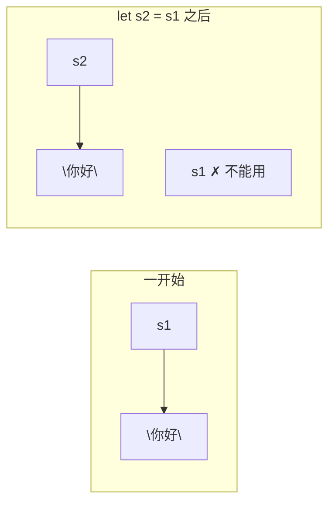

# 盒子与标签：所有权入门

## 学习目标

学完本章后，你将能够：
- 用"盒子与标签"的比喻理解所有权
- 理解 `move`（移动）— 为什么变量有时会"失效"
- 区分 `Copy` 类型和 `Move` 类型
- 理解 `clone` 的含义
- 看懂简单的所有权示意图

---

## 一、盒子与标签：一个比喻

想象你有一个盒子，盒子里装着一张写着"你好"的纸条。盒子上贴了一个标签 `s1`。

```rust
fn main() {
    let s1 = String::from("你好");
    println!("{}", s1);
}
```

```mermaid
graph TD
    s1["s1 (标签/变量名)"] --> box["盒子: \"你好\" (数据)"]
```

- 数据 "你好" 存在内存的某个地方（盒子）
- `s1` 是贴在这个盒子上的标签

---

## 二、标签会移动

现在，我们做一件事：把标签从旧盒子上撕下来，贴到另一个盒子上... 不对，在 Rust 中，是**把标签转移到另一个变量**。

```rust
fn main() {
    let s1 = String::from("你好");
    let s2 = s1;   // s2 接管了盒子

    println!("{}", s1);  // 编译错误！
}
```

这段代码**无法编译**！错误信息：

```
error: borrow of moved value: `s1`
```

翻译：**s1 已经把东西给了别人，s1 现在是"空的"，不能再用了。**

让我们用盒子图来看：



`s1` 的标签被撕下来，转移到了 `s2` 上。从这之后，只有 `s2` 能访问"你好"这个盒子，`s1` 已经"废了"。

这就是 Rust 的**所有权转移**（Move）。核心规则：

> **一个盒子同一时间只能有一个标签。**

---

## 三、为什么要有这个规则？

考虑没有这个规则会怎样：

```mermaid
graph TD
    s1["s1"] --> box["盒子: \"你好\" (同一块内存)"]
    s2["s2"] --> box
    box --> X["函数结束时:<br/>s1 清理一次 ✓<br/>s2 再清理 ✗ 崩溃!"]
```

Rust 的所有权规则就是为了防止这种"两个人同时清理同一个盒子"的情况。**一个盒子只有一个拥有者。** 拥有者消失时，盒子自动清理。

---

## 四、但数字为什么没这个问题？

```rust
fn main() {
    let x = 5;
    let y = x;       // x 的值给 y
    println!("x={}, y={}", x, y);  // 两个都能用！
}
```

输出：

```
x=5, y=5
```

为什么 `String` 会"失效"，而数字不会？

| 类型 | 行为 | 类比 |
|------|------|------|
| 像 String 这样的**大东西** | 移动（move），旧的不能用 | 把一本书给你（我没了） |
| 像 i32 这样的**小东西** | 复制（copy），旧的还能用 | 借你看看笔记（我记一份，你也记一份） |

### Copy 类型：自动复制

以下类型在被赋值时会自动复制：

| 类型 | 例子 |
|------|------|
| 整数类型 | `i32`, `i64`, `u32`, `usize` 等 |
| 浮点数类型 | `f32`, `f64` |
| 布尔类型 | `bool` |
| 字符类型 | `char` |
| 以上类型的元组 | `(i32, i32)`, `(char, bool)` 等 |
| 不可变引用 | `&T`（下一章讲） |

这些类型都实现了 `Copy` trait（可以自动复制）。它们很小、存储在栈上，复制的成本非常低。

---

## 五、克隆：我要自己另买一个

如果你又想让 `s2` 拥有自己的数据，又不想让 `s1` 失效，怎么办？用 `clone`：

```rust
fn main() {
    let s1 = String::from("你好");
    let s2 = s1.clone();  // 复制一份全新的

    println!("s1 = {}, s2 = {}", s1, s2);  // 两个都能用！
}
```

```mermaid
graph LR
    subgraph "clone 之前"
        s1_b["s1"] --> box_b["\"你好\""]
    end
    subgraph "clone 之后"
        s1_a["s1"] --> box1_a["\"你好\""]
        s2_a["s2"] --> box2_a["\"你好\" (副本)"]
    end
```

`clone` 不是"把标签移过去"，而是**造了一个全新的盒子，里面放了同样的东西**。这样两个盒子互不影响。

**代价**：`clone` 需要复制数据，对于大的数据可能比较慢。

---

## 六、函数调用也会传递所有权

所有权不仅发生在变量赋值时，函数调用也一样：

```rust
fn main() {
    let s = String::from("你好");

    print_string(s);  // s 的所有权转移给函数

    println!("{}", s);  // 编译错误！s 已经被移走了
}

fn print_string(text: String) {
    println!("{}", text);
    // text 在这里被释放
}
```

再看数字的版本：

```rust
fn main() {
    let x = 5;

    print_number(x);  // x 被复制一份传入

    println!("{}", x);  // 还能用！5 是 Copy 类型
}

fn print_number(n: i32) {
    println!("{}", n);
}
```

**函数参数的所有权规则**：

| 参数类型 | 传入函数后 | 原来的变量还能用吗？ |
|----------|-----------|-------------------|
| Copy 类型（i32, bool 等） | 复制一份传入 | ✅ 能用 |
| 非 Copy 类型（String, Vec 等） | 所有权移入函数 | ❌ 不能用了 |

---

## 七、返回值归还所有权

函数可以"把所有权还回来"：

```rust
fn main() {
    let s = String::from("你好");

    let s = return_string(s);  // 接收返回的所有权

    println!("{}", s);  // 可以用了！
}

fn return_string(text: String) -> String {
    println!("处理：{}", text);
    text  // 把所有权还回去
}
```

但这样写很啰嗦 — 又要把所有权传进去，又要还回来。下一章我们会学一个更好的办法：**引用**。

---

## 八、所有权的三条铁律

1. **每个值有且只有一个所有者**（一次只有一个标签）
2. **所有者离开作用域时，值被自动清理**
3. **赋值/传参时，非 Copy 类型会发生所有权转移**

```rust
fn main() {
    // 铁律1：一个所有者
    let s1 = String::from("你好");

    // 铁律3：转移所有权
    let s2 = s1;

    // 铁律2：s2 在 } 时被自动清理
}
```

**作用域**：变量从 `let` 声明开始，到最近的 `}` 结束。

```rust
fn main() {
    let s = String::from("你好");
    println!("{}", s);    // s 在这里还活着
}  // ← s 在这里被自动清理（释放内存）
```

---

## 九、动手练习：追踪所有权

### 练习1：这段代码有什么问题？

```rust
fn main() {
    let a = String::from("Rust");
    let b = a;
    let c = a;  // ?
}
```

第三行报错！因为 `a` 已经在第二行把所有权转给了 `b`，不能再转给 `c`。

### 练习2：这个呢？

```rust
fn main() {
    let a = 42;
    let b = a;
    let c = a;
    println!("{} {} {}", a, b, c);  // 全部正常！
}
```

`i32` 是 Copy 类型，每次赋值都是复制一份新的。

### 练习3：混合类型

```rust
fn main() {
    let x = 10;            // Copy 类型
    let y = String::from("hi");  // 非 Copy 类型

    let x2 = x;   // x 被复制，x 还能用
    let y2 = y;   // y 被移动，y 不能用了

    println!("{}", x);   // 正常
    println!("{}", y);   // 错误！
}
```

---

## 十、元组的所有权

元组包含 Copy 类型时，整个元组是 Copy 的吗？

```rust
fn main() {
    let t1 = (1, 2, 3);     // 全是 i32 → 整个元组是 Copy
    let t2 = t1;
    println!("{:?}", t1);   // 能用

    let t3 = (1, String::from("hi"));  // 包含 String → 不是 Copy
    let t4 = t3;
    println!("{:?}", t3);   // 错误！t3 被移走了
}
```

元组要所有元素都是 Copy 类型，整个元组才是 Copy。

---

## 本章小结

所有权是 Rust 最独特也最重要的概念：

- 数据是"盒子"，变量名是"标签"
- 一个盒子一次只能有一个标签（一个所有者）
- `let s2 = s1;` 是**移动**，s1 失效
- 小东西（i32 等）会自动复制（Copy）
- 大东西（String 等）不会自动复制，需要的话用 `.clone()`
- 函数调用也会转移所有权
- 所有者离开作用域时，数据自动清理

刚开始可能觉得麻烦，但正是这套规则让 Rust 不需要"垃圾回收器"也能自动管理内存。下一章，我们学习如何在不转移所有权的情况下"借用"数据。

[[06-借东西：引用与借用]]

---

## 章节考查

> **总分100分**：概念考查40分 + 判断正误20分 + 代码分析15分 + 编程大题15分 + 填空题5分 + 代码补全5分

### 一、概念考查（每题4分，共40分）

**1. Rust 所有权规则中，一个值在同一时间有最多几个所有者？**
- A. 0个
- B. 1个
- C. 2个
- D. 无限个

<details><summary>点击查看答案</summary>

**B**。Rust 的所有权规则：每个值有且只有一个所有者。

</details>

**2. 下面哪个类型是 Copy 类型？**
- A. `String`
- B. `Vec<i32>`
- C. `i32`
- D. 所有类型

<details><summary>点击查看答案</summary>

**C**。`i32` 等基本类型是 Copy 的，赋值时会自动复制。`String` 和 `Vec` 不是。

</details>

**3. `let s2 = s1;` 之后如果 s1 是 String 类型，s1 会怎样？**
- A. s1 的值变成空字符串
- B. s1 仍然可用，和 s2 指向同一数据
- C. s1 失效，不能再使用
- D. s1 自动复制一份

<details><summary>点击查看答案</summary>

**C**。String 不是 Copy 类型，所有权从 s1 移动到 s2，s1 失效。

</details>

**4. `.clone()` 方法的作用是？**
- A. 转移所有权
- B. 深拷贝数据，创建新的独立副本
- C. 删除数据
- D. 把变量变成 Copy 类型

<details><summary>点击查看答案</summary>

**B**。`clone()` 创建数据的完整独立副本，原始变量不失效。但代价是额外的内存和时间。

</details>

**5. 变量在什么时候被自动清理？**
- A. 程序结束时
- B. 离开作用域时
- C. 被重新赋值时
- D. 永远不会

<details><summary>点击查看答案</summary>

**B**。当一个变量离开其作用域（即包含它的 `{}` 结束时），它的值被自动释放。

</details>

**6. 下面代码中，`s` 的作用域在哪里结束？**

```rust
fn main() {     // 1
    let s = String::from("hi");  // 2
    println!("{}", s);           // 3
}                // 4
```

- A. 第1行
- B. 第2行
- C. 第3行
- D. 第4行

<details><summary>点击查看答案</summary>

**D**。`s` 的作用域从声明开始到包含它的 `}` 结束。这里是 main 函数结束的地方。

</details>

**7. 如果你想把一个 String 传给函数，又不希望失去所有权，最好的办法是？**
- A. 用 `.clone()` 传一份副本
- B. 用引用（下一章学）
- C. 不传，用全局变量
- D. 以上都行

<details><summary>点击查看答案</summary>

**A**（在本章范围内）和 **B**（最推荐）。在本章知识范围内，`.clone()` 可以解决。但更好的办法是下一章学的引用。

</details>

**8. 元组 `(i32, i32)` 是 Copy 类型吗？**
- A. 是
- B. 不是
- C. 取决于值的大小
- D. 不确定

<details><summary>点击查看答案</summary>

**A**。如果元组的所有元素都是 Copy 类型，那么整个元组也是 Copy 的。

</details>

**9. 所有权转移（move）的触发时机不包括？**
- A. 变量赋值给另一个变量
- B. 变量传给函数参数
- C. 函数返回变量
- D. 打印变量

<details><summary>点击查看答案</summary>

**D**。打印变量不会转移所有权（因为 `println!` 接受的是引用）。赋值、传参、返回都可能触发转移。

</details>

**10. "栈" 和 "堆" 的区别，对应 Rust 中什么概念？**
- A. `i32` vs `f64`
- B. Copy 类型（栈）vs 非 Copy 类型（堆上的数据）
- C. `mut` vs `const`
- D. `if` vs `loop`

<details><summary>点击查看答案</summary>

**B**。Copy 类型大小固定，存在栈上，复制成本低。String 等类型数据在堆上，复制成本高。

</details>

### 二、判断正误（每题2分，共20分）

**1. 一个值可以同时有多个所有者。**
<details><summary>点击查看答案</summary>

**错误**。所有权规则：一个值一次只能有一个所有者。

</details>

**2. `bool` 类型是 Copy 的。**
<details><summary>点击查看答案</summary>

**正确**。所有的基本标量类型都是 Copy 的，包括 `bool`。

</details>

**3. `clone` 只会复制引用，不复制实际数据。**
<details><summary>点击查看答案</summary>

**错误**。`clone` 是深度复制，会复制底层数据。

</details>

**4. 函数参数如果是 String，调用后原变量仍然可用。**
<details><summary>点击查看答案</summary>

**错误**。String 传入函数时所有权转移，原变量失效。

</details>

**5. 函数可以返回所有权。**
<details><summary>点击查看答案</summary>

**正确**。函数可以通过返回值把所有权还回来。

</details>

**6. `let x = 5; let y = x;` 之后，x 不能再使用。**
<details><summary>点击查看答案</summary>

**错误**。i32 是 Copy 类型，赋值时自动复制，x 仍然可用。

</details>

**7. 离开作用域后，变量的内存总是被释放。**
<details><summary>点击查看答案</summary>

**正确**。这是 Rust 的核心机制，所有者离开作用域时自动释放内存。

</details>

**8. 元组 `(String, i32)` 是 Copy 类型。**
<details><summary>点击查看答案</summary>

**错误**。元组中只要有一个元素不是 Copy 的，整个元组就不是 Copy 的。

</details>

**9. Clone 和 Copy 是一回事。**
<details><summary>点击查看答案</summary>

**错误**。Copy 是编译器自动的按位复制（仅限小类型）。Clone 是需要显式调用的深拷贝。

</details>

**10. 所有权机制让 Rust 不需要垃圾回收器（Garbage Collector）。**
<details><summary>点击查看答案</summary>

**正确**。所有权机制在编译时确定何时释放内存，不需要运行时垃圾回收。

</details>

### 三、代码分析（每题3分，共15分）

**1. 下面代码能否编译通过？**

```rust
fn main() {
    let a = String::from("hello");
    let b = a;
    println!("a = {}", a);
    println!("b = {}", b);
}
```

- A. 能，输出 a = hello, b = hello
- B. 能，但输出顺序不确定
- C. 不能，`a` 的所有权已移给 `b`
- D. 不能，`println!` 不能打印 String

<details><summary>点击查看答案</summary>

**C**。`let b = a;` 之后 `a` 失效，不能再被使用。编译器会报错。

</details>

**2. 下面代码的输出是什么？**

```rust
fn main() {
    let x = 100;
    let y = x;
    let z = x;
    println!("{}", x + y + z);
}
```

- A. 100
- B. 200
- C. 300
- D. 编译错误

<details><summary>点击查看答案</summary>

**C**。`i32` 是 Copy 类型，所有三个变量都能用，100+100+100=300。

</details>

**3. 下面代码有什么问题？**

```rust
fn greet(name: String) {
    println!("你好，{}", name);
}

fn main() {
    let my_name = String::from("小明");
    greet(my_name);
    greet(my_name);  // 第二次调用
}
```

- A. 没有任何问题
- B. 第二次调用时 `my_name` 已经失效
- C. `greet` 函数签名错误
- D. `String::from` 用法错误

<details><summary>点击查看答案</summary>

**B**。第一次 `greet(my_name)` 把 `my_name` 的所有权移入了函数，第二次调用时 `my_name` 已经不可用。

</details>

**4. 下面代码的输出是什么？**

```rust
fn main() {
    let s = String::from("Rust");
    let s = do_something(s);
    println!("{}", s);
}

fn do_something(text: String) -> String {
    println!("处理中...");
    text
}
```

- A. 编译错误
- B. Rust
- C. 处理中...
- D. 空字符串

<details><summary>点击查看答案</summary>

**B**。变量遮蔽 + 所有权返还：函数接收所有权后又返回，第二个 `let s` 接收返回的所有权。

</details>

**5. 下面的代码有什么错误？**

```rust
fn main() {
    let t1 = (1, String::from("hello"));
    let t2 = t1;
    println!("{:?}", t1);
}
```

- A. 元组语法错误
- B. 元组不能包含不同类型
- C. t1 被移走了，不能再打印
- D. `{:?}` 写法错误

<details><summary>点击查看答案</summary>

**C**。t1 含有 String（非 Copy），整个元组不是 Copy。`let t2 = t1;` 后 t1 失效。

</details>

### 四、编程大题（15分）

**题目：** 编写一段程序，展示以下所有权概念：
1. 创建一个 String 变量 `s1`，值为 `"所有权测试"`
2. 使用 `clone` 创建 `s2`，让两个变量都能使用
3. 创建一个 i32 变量 `n1 = 42`
4. 赋值给 `n2`，展示两个都能用（Copy 行为）
5. 编写一个函数 `take_ownership`，接收 String，打印后不返回
6. 编写一个函数 `give_back`，接收 String，打印后返回
7. 展示调用 `take_ownership` 后的变量状态
8. 展示调用 `give_back` 后如何接收所有权

<details><summary>点击查看答案</summary>

```rust
fn main() {
    // 1. 创建 String
    let s1 = String::from("所有权测试");

    // 2. 使用 clone
    let s2 = s1.clone();
    println!("s1 = {}, s2 = {}", s1, s2);  // 两个都能用

    // 3-4. Copy 类型
    let n1 = 42;
    let n2 = n1;
    println!("n1 = {}, n2 = {}", n1, n2);  // 两个都能用

    // 5-7. take_ownership 不会返回
    let s3 = String::from("会被拿走");
    take_ownership(s3);
    // println!("{}", s3);  // 取消注释会编译错误！

    // 6-8. give_back 会返回
    let s4 = String::from("会还回来");
    let s4 = give_back(s4);  // 接收返回的所有权
    println!("拿回来：{}", s4);
}

fn take_ownership(text: String) {
    println!("拿走了：{}", text);
}

fn give_back(text: String) -> String {
    println!("借用了：{}，还给你", text);
    text
}
```

**评分标准**：
- String 创建和 clone 使用（3分）
- Copy 类型示范（2分）
- take_ownership 函数定义（3分）
- give_back 函数定义（3分）
- 调用和所有权展示（4分）

</details>

### 五、填空题（每题1分，共5分）

**1. String 类型赋值时发生 ______（移动/复制），旧变量 ______（能/不能）继续使用。**

<details><summary>点击查看答案</summary>

**移动** 和 **不能**。String 不是 Copy 类型，赋值时所有权转移。

</details>

**2. `let s2 = s1.______();` 可以让 s1 和 s2 都拥有独立的数据。**

<details><summary>点击查看答案</summary>

**clone**。`.clone()` 方法创建独立副本。

</details>

**3. Rust 所有权规则：每个值有且只有 ______ 个所有者。**

<details><summary>点击查看答案</summary>

**一** 或 **1**。这是所有权规则的核心。

</details>

**4. 变量离开 ______ 时，其拥有的值会被自动释放。**

<details><summary>点击查看答案</summary>

**作用域** 或 包含它的 `{}`。离开作用域时 Rust 自动调用 `drop`。

</details>

**5. `______` trait 的类型在赋值时会自动复制，不会转移所有权。**

<details><summary>点击查看答案</summary>

**Copy**。实现了 Copy trait 的类型在赋值时自动按位复制。

</details>

### 六、代码补全（共5分）

**1. 补全 clone 调用，使 s1 和 s2 都能使用（2分）**

```rust
fn main() {
    let s1 = String::from("你好");
    let s2 = s1.______();
    println!("{}, {}", s1, s2);
}
```

<details><summary>点击查看答案</summary>

```rust
let s2 = s1.clone();
```

</details>

**2. 补全函数，使其接收所有权并返回所有权（2分）**

```rust
fn process(text: ______) -> ______ {
    println!("处理：{}", text);
    text
}
```

<details><summary>点击查看答案</summary>

```rust
fn process(text: String) -> String {
```

</details>

**3. 补全注释中被注释的代码会报错的原因（1分）**

```rust
fn main() {
    let s = String::from("测试");
    consume(s);
    // println!("{}", s);  // 这里会报错，因为 ______
}

fn consume(s: String) {
    println!("{}", s);
}
```

<details><summary>点击查看答案</summary>

因为 `s` 的所有权已经移动到 `consume` 函数中，原变量已失效。

</details>

---

> **计分：概念40 + 判断20 + 代码分析15 + 编程15 + 填空5 + 补全5 = 总分100分**
