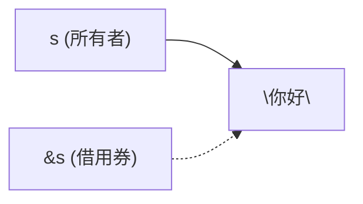
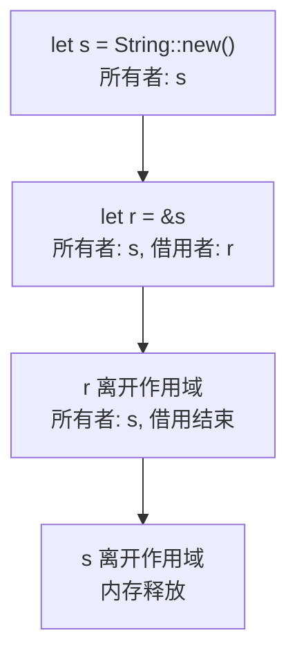

# 借东西：引用与借用

## 学习目标

学完本章后，你将能够：
- 理解"借用"的概念：不拿走所有权，只看一下或用一下
- 区分不可变引用 `&T` 和可变引用 `&mut T`
- 理解借用的核心规则
- 在函数中使用引用传参
- 避免常见的借用错误

---

## 一、问题：所有权太"霸道"了

上一章我们学了一个烦恼：把 String 传给函数后，原来的变量就不能用了。

```rust
fn main() {
    let s = String::from("你好");
    print_it(s);
    println!("{}", s);  // 报错！s 已经被移走了
}

fn print_it(text: String) {
    println!("{}", text);
}
```

解决方案之一是 `clone`，但如果字符串很长，复制很浪费。

有没有办法"借来看看就还"，不必拿走所有权？

有！这就是**引用（reference）**。

---

## 二、最简单的借用：&

加一个 `&` 号就行：

```rust
fn main() {
    let s = String::from("你好");
    print_it(&s);        // 把 s 的引用传进去
    println!("{}", s);   // s 还能用！
}

fn print_it(text: &String) {  // 参数类型是 &String
    println!("{}", text);
}
```

输出：

```
你好
你好
```

`&` 就是"借来看看"的意思：



- `&s`：创建了一个指向 `s` 的引用（借用券）
- `&String`：这是"指向 String 的引用"类型
- 函数结束后，借用券自动作废，`s` 还是 `s` 的主人

---

## 三、引用是什么？

引用就像一个**地址标签**，上面写着"你要找的东西在那里"。

```rust
fn main() {
    let s = String::from("你好");
    let r = &s;  // r 是 s 的引用

    println!("通过 s 看：{}", s);
    println!("通过 r 看：{}", r);  // *自动解引用*，也能打印
}
```

```mermaid
graph LR
    r["r = &s (借用者)"] -.-> data["\"你好\" (所有者: s)"]
```

- `r` 不是数据的拥有者
- `r` 只是"指着"数据
- `r` 离开作用域时，数据不会被清理（因为 `s` 还是主人）

**关键区别：**

| | 所有权 | 引用 |
|------|--------|------|
| 创建 | `let s = String::from("hi");` | `let r = &s;` |
| 类型 | `String` | `&String` |
| 是否拥有数据 | 是 | 否 |
| 离开作用域时的效果 | 释放数据 | 什么也不做 |
| 类比 | 买了这本书 | 借了这本书 |

---

## 四、不可变引用：只能读，不能改

```rust
fn main() {
    let s = String::from("你好");
    let r = &s;

    println!("{}", r);  // 可以读

    r.push_str("世界");  // 编译错误！不能通过不可变引用修改
}
```

`&` 创建的是**不可变引用**（也叫共享引用）。用它只能看，不能改。

你可以有多个不可变引用同时存在：

```rust
fn main() {
    let s = String::from("你好");
    let r1 = &s;
    let r2 = &s;
    let r3 = &s;  // 多个借用券都可以用

    println!("{} {} {}", r1, r2, r3);  // 正常
}
```

规则一：**可以同时有多个人借同一本书读。**（多个不可变引用可以共存）

---

## 五、可变引用：&mut

如果你想通过引用修改数据，用 `&mut`：

```rust
fn main() {
    let mut s = String::from("你好");
    let r = &mut s;      // 可变引用

    r.push_str("世界");   // 通过引用修改
    println!("{}", r);   // 输出：你好世界
}
```

注意：`s` 也必须是 `mut` 的！你不能借出一个可变的引用给不可变的数据。

```rust
fn main() {
    let s = String::from("你好");  // 不是 mut
    let r = &mut s;  // 编译错误！s 不可变，不能借出可变引用
}
```

规则二：**一次只能有一个人借走这本书去修改。**（同一时间只能有一个可变引用）

```rust
fn main() {
    let mut s = String::from("你好");
    let r1 = &mut s;
    let r2 = &mut s;  // 编译错误！已经有一个可变引用了

    println!("{}", r1);
}
```

---

## 六、引用的铁律

这两条规则记在心里，就掌握了 Rust 的引用精髓：

| 规则 | 含义 | 类比 |
|------|------|------|
| **可以有多个不可变引用** | `let r1 = &s; let r2 = &s;` 可以 | 很多人可以同时读一本书 |
| **只能有一个可变引用** | `let r = &mut s;` 只能有一个 | 一个人改了，别人就不能再看了 |

而且：**不可变引用和可变引用不能同时存在。**

```rust
fn main() {
    let mut s = String::from("你好");

    let r1 = &s;       // 不可变引用
    let r2 = &mut s;   // 编译错误！已经有不可变引用了

    println!("{}", r1);
}
```

为什么？防止这种情况：

```
r1 读到："你好"
r2 修改为："你好世界"  ← r1 还以为它是"你好"！
r1 继续用之前的数据...出 bug 了
```

Rust 在编译时就阻止了这种问题。

---

## 七、引用在函数中的使用

### 7.1 不可变引用作参数

```rust
fn main() {
    let s = String::from("你好世界");
    let len = get_length(&s);  // 把引用传进去

    println!("\"{}\" 的长度是 {}", s, len);
}

fn get_length(text: &String) -> usize {
    text.len()  // 通过引用读取长度
}
```

`usize` 是一种特殊的整数类型，用来表示内存大小（可以理解为"和指针一样大的整数"）。

### 7.2 可变引用作参数

```rust
fn main() {
    let mut s = String::from("你好");
    add_world(&mut s);       // 传可变引用

    println!("{}", s);       // 输出：你好世界
}

fn add_world(text: &mut String) {
    text.push_str("世界");
}
```

### 7.3 字符串切片：&str

你可能注意到之前我们用过 `&str` 类型：

```rust
fn main() {
    let greeting: &str = "你好";  // &str 是字符串切片的引用
    println!("{}", greeting);
}
```

`&str` 和 `&String` 是两个不同的类型，但现在你可以这样理解：

| 类型 | 说明 |
|------|------|
| `String` | 拥有所有权的字符串，可修改 |
| `&String` | 对 String 的不可变引用 |
| `&str` | 对字符串数据（切片）的引用（更通用） |
| `&mut String` | 对 String 的可变引用 |

`&str` 通常比 `&String` 更灵活，因为它可以引用任意来源的字符串数据。

---

## 八、解引用：*

如果引用是一个地址标签，那么 `*` 就是"按地址找过去"：

```rust
fn main() {
    let x = 5;
    let r = &x;

    println!("r = {}", r);    // 自动解引用，输出 5
    println!("*r = {}", *r);  // 手动解引用，输出 5
}
```

大多数情况下 Rust 会自动帮你解引用（比如打印时），所以不需要总是写 `*`。

---

## 九、常见借用错误

### 错误1：存在不可变引用时创建可变引用

```rust
fn main() {
    let mut s = String::from("你好");
    let r1 = &s;
    let r2 = &mut s;  // 错误！
}
```

**修复**：确保 `r1` 不再使用后再创建 `r2`，或者把 `r1` 的使用范围缩小。

```rust
fn main() {
    let mut s = String::from("你好");
    let r1 = &s;
    println!("{}", r1);  // r1 最后使用

    let r2 = &mut s;     // r1 已经用完了，可以创建 r2
    r2.push_str("世界");
    println!("{}", r2);
}
```

### 错误2：引用比数据活得久（悬垂引用）

```rust
fn dangle() -> &String {
    let s = String::from("你好");
    &s  // 错误！s 在这里被释放，返回的引用指向已释放的内存
}
```

Rust 编译器会阻止这种情况，给出清晰错误。

### 错误3：不可变变量借出可变引用

```rust
fn main() {
    let s = String::from("你好");
    let r = &mut s;  // 错误！s 不是 mut 的
}
```

**修复**：`let mut s = ...;`

---

## 十、借用总结表



---

## 本章小结

引用让你可以在不转移所有权的情况下使用数据：

- `&s` 创建不可变引用（共享借用）— 能读不能写
- `&mut s` 创建可变引用（独占借用）— 能读也能写
- 可以有多个不可变引用，但只能有一个可变引用
- 不可变引用和可变引用不能同时存在
- 引用不拥有数据，离开作用域不影响数据本身
- 用引用传参，原来的变量还能继续使用

这章的内容是 Rust 最核心的特性之一。习惯了之后，你会发现自己写的代码既安全又高效。接下来，我们要学习如何定义自己的数据类型。

[[07-自定义类型：结构体]]

---

## 章节考查

> **总分100分**：概念考查40分 + 判断正误20分 + 代码分析15分 + 编程大题15分 + 填空题5分 + 代码补全5分

### 一、概念考查（每题4分，共40分）

**1. 引用用哪个符号创建？**
- A. `*`
- B. `&`
- C. `$`
- D. `#`

<details><summary>点击查看答案</summary>

**B**。`&` 创建引用，`&s` 是变量 `s` 的引用。

</details>

**2. 可变引用用哪个符号创建？**
- A. `&`
- B. `&mut`
- C. `*mut`
- D. `mut&`

<details><summary>点击查看答案</summary>

**B**。`&mut s` 创建可变引用，需要通过它修改数据。

</details>

**3. 同一时间，最多可以有几个可变引用指向同一个数据？**
- A. 0个
- B. 1个
- C. 2个
- D. 没有限制

<details><summary>点击查看答案</summary>

**B**。可变引用是独占的，同一时间只能有一个可变引用。

</details>

**4. 引用不拥有数据，这意味着什么？**
- A. 引用永远不能访问数据
- B. 引用离开作用域时，数据不会被释放
- C. 引用可以无限复制
- D. 引用比数据大

<details><summary>点击查看答案</summary>

**B**。引用只是"借用"，不拥有所有权，离开作用域时不会释放数据。

</details>

**5. `let r = &mut s;` 要求 `s` 必须是？**
- A. String 类型
- B. 任何类型
- C. 可变（mut）
- D. 不可变

<details><summary>点击查看答案</summary>

**C**。要创建 `&mut s`，`s` 本身必须是可变的（`let mut s = ...;`）。

</details>

**6. 不可变引用和可变引用可以同时存在吗？**
- A. 可以，没有任何限制
- B. 不可以，它们是互斥的
- C. 可以，但只能有一个可变引用
- D. 视数据类型而定

<details><summary>点击查看答案</summary>

**B**。不可变引用和可变引用不能同时存在，这是 Rust 借用规则的核心。

</details>

**7. 函数参数 `text: &String` 中的 `&String` 表示什么？**
- A. 参数是 String 的所有者
- B. 参数是 String 的引用
- C. 参数是一个新创建的 String
- D. 参数是可变的 String

<details><summary>点击查看答案</summary>

**B**。`&String` 是一个对 String 的不可变引用类型。

</details>

**8. 解引用操作用哪个符号？**
- A. `&`
- B. `*`
- C. `!`
- D. `?`

<details><summary>点击查看答案</summary>

**B**。`*r` 是解引用操作，通过引用访问实际的值。

</details>

**9. "悬垂引用"（dangling reference）指的是什么？**
- A. 引用指向了空地址
- B. 引用指向的数据已经被释放
- C. 引用指向了整数
- D. 引用指向了另一个引用

<details><summary>点击查看答案</summary>

**B**。悬垂引用是指引用指向的数据已经被释放，引用本身失效。Rust 编译时会阻止这种情况。

</details>

**10. `&str` 和 `&String` 的关系是？**
- A. 完全相同
- B. `&str` 更通用，可以引用任意来源的字符串数据
- C. `&String` 更通用
- D. 它们不能相互转换

<details><summary>点击查看答案</summary>

**B**。`&str` 是字符串切片引用，`String` 可以通过 `&` 自动转为 `&str`。`&str` 更灵活和通用。

</details>

### 二、判断正误（每题2分，共20分）

**1. 引用创建后，原变量的所有权会转移给引用。**
<details><summary>点击查看答案</summary>

**错误**。引用只是"借用"，不转移所有权。原变量仍然是数据的所有者。

</details>

**2. 对同一个变量，可以创建多个不可变引用。**
<details><summary>点击查看答案</summary>

**正确**。不可变引用（共享借用）可以共存。

</details>

**3. `let r = &s; r.push_str("hi");` 可以编译通过。**
<details><summary>点击查看答案</summary>

**错误**。不可变引用不能修改数据。

</details>

**4. 不可变引用和可变引用可以同时存在。**
<details><summary>点击查看答案</summary>

**错误**。它们互斥，编译器不允许同时存在。

</details>

**5. 引用离开作用域时，它指向的数据会被释放。**
<details><summary>点击查看答案</summary>

**错误**。引用不拥有数据，离开作用域时不影响原数据。

</details>

**6. `&mut` 引用可以修改原数据。**
<details><summary>点击查看答案</summary>

**正确**。可变引用允许通过它修改指向的数据。

</details>

**7. 不可变变量可以借出可变引用。**
<details><summary>点击查看答案</summary>

**错误**。不可变变量只能借出不可变引用。必须 `let mut x = value;` 才能 `&mut x`。

</details>

**8. `&String` 可以通过自动解引用转为 `&str`。**
<details><summary>点击查看答案</summary>

**正确**。`String` 实现了 `Deref<Target=str>`，可以自动转为 `&str`。

</details>

**9. 借用规则只在编译时起作用。**
<details><summary>点击查看答案</summary>

**正确**。借用检查在编译时完成，不影响运行时性能。

</details>

**10. `let s = String::from("hi"); let r = &s;` 之后，s 会失效。**
<details><summary>点击查看答案</summary>

**错误**。创建引用不影响所有权，s 仍然有效。

</details>

### 三、代码分析（每题3分，共15分）

**1. 下面代码能否编译通过？**

```rust
fn main() {
    let s = String::from("hello");
    let r = &s;
    println!("{}", s);
    println!("{}", r);
}
```

- A. 能，输出两行 hello
- B. 不能，s 被移走了
- C. 能，但只输出 r
- D. 不能，引用和原变量不能同时使用

<details><summary>点击查看答案</summary>

**A**。创建不可变引用不影响原变量的使用，两者共存。

</details>

**2. 下面代码能否编译通过？**

```rust
fn main() {
    let mut s = String::from("hello");
    let r1 = &mut s;
    let r2 = &mut s;
    println!("{}, {}", r1, r2);
}
```

- A. 能，输出 hello hello
- B. 不能，不能有两个可变引用
- C. 能，`mut s` 允许多个可变引用
- D. 不能，`println!` 不能打印 `&mut String`

<details><summary>点击查看答案</summary>

**B**。同一时间只能有一个可变引用，`r2` 创建时 `r1` 还存在，编译器报错。

</details>

**3. 下面代码的输出是什么？**

```rust
fn main() {
    let x = 10;
    let r = &x;
    let y = *r + 5;
    println!("{}", y);
}
```

- A. 10
- B. 15
- C. 5
- D. 编译错误

<details><summary>点击查看答案</summary>

**B**。`*r` 解引用得到 10，10 + 5 = 15。

</details>

**4. 下面代码的输出是什么？**

```rust
fn main() {
    let mut s = String::from("你好");
    change(&mut s);
    println!("{}", s);
}

fn change(text: &mut String) {
    text.push_str("世界");
}
```

- A. 你好
- B. 世界
- C. 你好世界
- D. 编译错误

<details><summary>点击查看答案</summary>

**C**。`change` 通过可变引用追加了"世界"，所以输出"你好世界"。

</details>

**5. 下面代码有什么问题？**

```rust
fn main() {
    let s = String::from("hello");
    let r1 = &s;
    let r2 = &mut s;  // 这一行
    println!("{}", r1);
}
```

- A. 没有问题
- B. 不可变引用 r1 和可变引用 r2 不能共存
- C. s 不是 mut 的，不能 &mut
- D. B 和 C 都是问题

<details><summary>点击查看答案</summary>

**D**。两个问题：（1）`s` 不是 `mut` 不能借出 `&mut`（2）即使 `s` 是 `mut`，不可变引用和可变引用也不能共存。

</details>

### 四、编程大题（15分）

**题目：** 编写程序，演示"借用"的概念：
1. 定义一个函数 `get_length`，接收 `&String`，返回字符串长度
2. 定义一个函数 `append_exclamation`，接收 `&mut String`，在后面加"！"
3. 在 main 中创建一个 String，先调用 `get_length`，再调用 `append_exclamation`
4. 打印修改前后的内容

<details><summary>点击查看答案</summary>

```rust
fn main() {
    let mut s = String::from("你好");

    println!("修改前：{}，长度：{}", s, get_length(&s));

    append_exclamation(&mut s);

    println!("修改后：{}，长度：{}", s, get_length(&s));
}

fn get_length(text: &String) -> usize {
    text.len()
}

fn append_exclamation(text: &mut String) {
    text.push_str("！");
}
```

**输出**：
```
修改前：你好，长度：6
修改后：你好！，长度：9
```

**评分标准**：
- `get_length` 定义（3分）
- `append_exclamation` 定义（3分）
- main 中正确调用（3分）
- 可变变量声明（2分）
- 打印前后对比（4分）

</details>

### 五、填空题（每题1分，共5分）

**1. `______` 创建不可变引用，`______` 创建可变引用。**

<details><summary>点击查看答案</summary>

**&** 和 **&mut**。`&s` 是不可变引用，`&mut s` 是可变引用。

</details>

**2. 引用不拥有数据，所以引用离开作用域时，数据 ______（会/不会）被释放。**

<details><summary>点击查看答案</summary>

**不会**。引用是借用，不影响原所有者的生命周期。

</details>

**3. 借用规则：可以 ______ 个不可变引用，或 ______ 个可变引用。**

<details><summary>点击查看答案</summary>

**多** 和 **一**。可以有多个不可变引用，或仅一个可变引用。

</details>

**4. 对不可变变量 `let s = String::from("hi");` 不能创建 `______`。**

<details><summary>点击查看答案</summary>

**&mut s**。只有 `mut` 变量才能借出可变引用。

</details>

**5. 解引用操作用 `______` 符号。**

<details><summary>点击查看答案</summary>

**\***。`*r` 通过引用访问实际值。

</details>

### 六、代码补全（共5分）

**1. 补全函数参数类型（2分）**

```rust
fn main() {
    let s = String::from("Rust");
    let len = str_len(_____);
    println!("长度：{}", len);
}

fn str_len(text: _____) -> usize {
    text.len()
}
```

<details><summary>点击查看答案</summary>

```rust
let len = str_len(&s);
fn str_len(text: &String) -> usize {
```

</details>

**2. 补全可变引用操作（2分）**

```rust
fn main() {
    let mut s = String::from("Hello");
    add_suffix(_____);
    println!("{}", s);
}

fn add_suffix(text: _____) {
    text.push_str(" World");
}
```

<details><summary>点击查看答案</summary>

```rust
add_suffix(&mut s);
fn add_suffix(text: &mut String) {
```

</details>

**3. 补全解引用（1分）**

```rust
fn main() {
    let x = 42;
    let r = &x;
    let y = _____ + 1;
    println!("{}", y);  // 应输出 43
}
```

<details><summary>点击查看答案</summary>

```rust
let y = *r + 1;
```

</details>

---

> **计分：概念40 + 判断20 + 代码分析15 + 编程15 + 填空5 + 补全5 = 总分100分**
