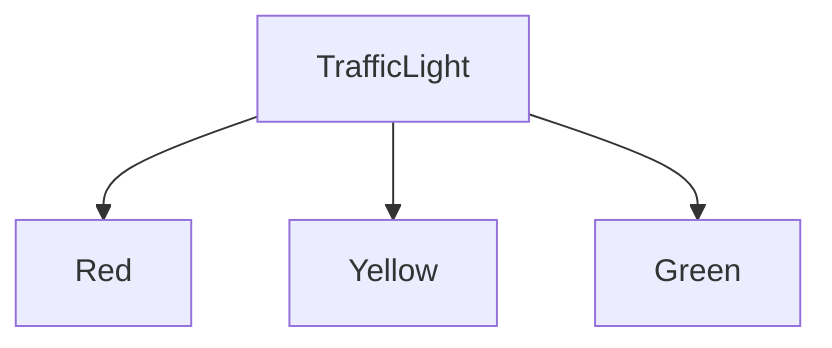
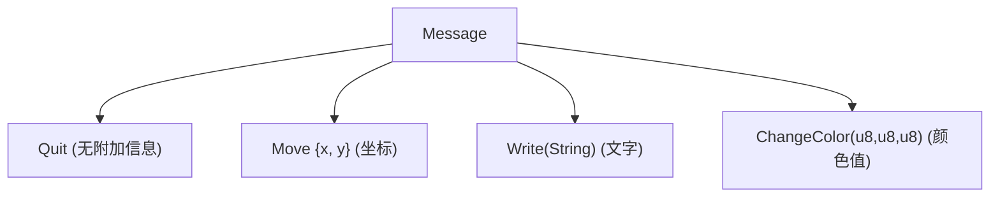

# 多种选择：枚举与匹配

## 学习目标

学完本章后，你将能够：
- 用 `enum` 定义多选一的数据类型
- 使用 `match` 对枚举进行全面的模式匹配
- 理解 `Option<T>` 以及它是如何替代 null 的
- 使用 `if let` 简化单分支匹配
- 为枚举定义方法

---

## 一、问题：结构体不够用

上一章的结构体能表示"一个有 X 和 Y 的东西"。但生活中很多概念是"多项选一项"的：

- 交通灯：红 / 黄 / 绿（只能是其中之一）
- 考试结果：及格 / 不及格 / 免考
- 网络状态：连接中 / 在线 / 离线

这些场景，用**枚举（enum）**最合适。

---

## 二、最简单的枚举：交通灯

```rust
enum TrafficLight {
    Red,
    Yellow,
    Green,
}

fn main() {
    let light = TrafficLight::Red;
}
```

这是最基本的枚举 — 每个变体（variant）只是一个标记，没有数据。



交通灯只能是这三样之一，不会有"又红又绿"的情况。

---

## 三、match：对枚举做"全面检查"

有了三个选项，我们需要根据选项做不同的事。`match` 就是干这个的：

```rust
enum TrafficLight {
    Red,
    Yellow,
    Green,
}

fn main() {
    let light = TrafficLight::Yellow;

    let action = match light {
        TrafficLight::Red => "停车",
        TrafficLight::Yellow => "注意，减速",
        TrafficLight::Green => "通行",
    };

    println!("{}", action);
}
```

输出：

```
注意，减速
```

`match` 的格式：

```
match 变量 {
    模式1 => 结果1,
    模式2 => 结果2,
    模式3 => 结果3,
}
```

`match` 就像是一个"多路开关"：检查变量匹配哪个模式，执行对应的结果。

**关键特性：match 是穷尽的。** 你必须覆盖所有可能的情况，否则编译不通过。

试试漏掉一种：

```rust
match light {
    TrafficLight::Red => "停车",
    TrafficLight::Yellow => "注意",
    // 忘了写 Green！
}
```

编译器会报错：`non-exhaustive patterns: 'Green' not covered` — 翻译："你没写 Green 的情况！"

这个特性太棒了 — 编译器帮你确保你没有遗漏任何情况。

---

## 四、带数据的枚举：让变体更"有料"

枚举的每个变体可以携带不同的数据：

```rust
enum Message {
    Quit,                        // 没有数据
    Move { x: i32, y: i32 },     // 带一个结构体
    Write(String),               // 带一个 String
    ChangeColor(i32, i32, i32),  // 带三个 i32
}

fn main() {
    let m1 = Message::Quit;
    let m2 = Message::Move { x: 10, y: 20 };
    let m3 = Message::Write(String::from("你好"));
    let m4 = Message::ChangeColor(255, 0, 0);

    // 稍后用 match 处理它们
}
```

这就像是：



---

## 五、match 配合带数据的枚举

```rust
enum Message {
    Quit,
    Move { x: i32, y: i32 },
    Write(String),
    ChangeColor(i32, i32, i32),
}

fn main() {
    let messages = vec![
        Message::Write(String::from("开始运行...")),
        Message::Move { x: 10, y: 20 },
        Message::ChangeColor(255, 0, 0),
        Message::Write(String::from("完成！")),
        Message::Quit,
    ];

    for msg in messages {
        match msg {
            Message::Quit => {
                println!("收到退出指令，程序结束");
                break;
            }
            Message::Move { x, y } => {
                println!("移动到位置 ({}, {})", x, y);
            }
            Message::Write(text) => {
                println!("输出文字：{}", text);
            }
            Message::ChangeColor(r, g, b) => {
                println!("更换颜色：R={}, G={}, B={}", r, g, b);
            }
        }
    }
}
```

输出：

```
输出文字：开始运行...
移动到位置 (10, 20)
更换颜色：R=255, G=0, B=0
输出文字：完成！
收到退出指令，程序结束
```

注意 match 如何**拆开**每个变体拿到里面的数据：
- `Message::Move { x, y }` 把坐标拆出来了
- `Message::Write(text)` 把文字拆出来了
- `Message::ChangeColor(r, g, b)` 把三个颜色值拆出来了

---

## 六、Option：Rust 对 "空值" 的解决方案

很多编程语言用 `null` 表示"没有东西"。但 `null` 很容易出 bug — 你忘了检查它有没有值，直接用了，程序就崩溃了。

Rust 没有 `null`！它用的是 `Option<T>`，一个内置的枚举：

```rust
enum Option<T> {
    Some(T),  // 有东西！
    None,     // 没有东西
}
```

- `T` 是泛型（后面会详细讲），你可以理解为"任意类型"
- `Some(5)` 表示"有个数字 5"
- `None` 表示"什么都没有"

```rust
fn main() {
    let has_value: Option<i32> = Some(42);
    let no_value: Option<i32> = None;

    println!("has_value 是 Some：{}", has_value.is_some());
    println!("no_value 是 None：{}", no_value.is_none());
}
```

### 6.1 Option 必须用 match 处理

你不能直接把 Option 当里面的值来用：

```rust
let x: Option<i32> = Some(5);
let y = x + 1;  // 编译错误！不能把 Option<i32> 当 i32 用
```

必须先把值"解包"出来：

```rust
fn main() {
    let x: Option<i32> = Some(5);

    let result = match x {
        Some(n) => n + 1,  // 有值就加 1
        None => 0,         // 没有就默认 0
    };

    println!("结果：{}", result);
}
```

输出：

```
结果：6
```

### 6.2 Option 的常用方法

Option 自带了很多好用的方法：

```rust
fn main() {
    let x = Some(5);

    // unwrap：取出值，如果是 None 就 panic
    println!("{}", x.unwrap());  // 5

    // unwrap_or：如果是 None 就用默认值
    let y: Option<i32> = None;
    println!("{}", y.unwrap_or(0));  // 0

    // is_some / is_none：判断是否有值
    println!("x 有值吗？{}", x.is_some());  // true
    println!("y 有值吗？{}", y.is_some());  // false
}
```

---

## 七、if let：更简洁的单分支匹配

有时候你只想处理某一种情况，这时 `if let` 比 `match` 更简洁：

```rust
fn main() {
    let x = Some(5);

    // 用 match（3 行）
    match x {
        Some(n) => println!("值是：{}", n),
        _ => (),  // _ 表示"其他所有情况"，() 表示什么也不做
    }

    // 用 if let（1 行）
    if let Some(n) = x {
        println!("值是：{}", n);
    }
}
```

格式：`if let 模式 = 变量 { ... }`

如果变量匹配这个模式，就执行 `{}` 中的代码；否则什么也不做。

### 7.1 if let + else

```rust
fn main() {
    let x: Option<i32> = None;

    if let Some(n) = x {
        println!("有值：{}", n);
    } else {
        println!("没有值");
    }
}
```

### 7.2 if let 也能用于其他枚举

```rust
enum Coin {
    Penny,
    Nickel,
    Dime,
    Quarter,
}

fn main() {
    let coin = Coin::Dime;

    if let Coin::Quarter = coin {
        println!("是 25 美分！");
    } else {
        println!("不是 25 美分");
    }
}
```

---

## 八、match 中的 `_` 通配符

有时你不需要处理所有变体，可以用 `_` 来匹配"其他所有"：

```rust
fn main() {
    let number = 7;

    let description = match number {
        1 => "一",
        2 => "二",
        3 => "三",
        _ => "太多了，数不清",  // _ 匹配任何值
    };

    println!("{}", description);
}
```

`_` 就像一个"垃圾桶"模式，什么都匹配，什么都不做（或返回默认值）。

---

## 九、为枚举定义方法

和结构体一样，枚举也可以用 `impl`：

```rust
enum TrafficLight {
    Red,
    Yellow,
    Green,
}

impl TrafficLight {
    fn duration(&self) -> u32 {
        match self {
            TrafficLight::Red => 60,
            TrafficLight::Yellow => 5,
            TrafficLight::Green => 45,
        }
    }

    fn next(&self) -> TrafficLight {
        match self {
            TrafficLight::Red => TrafficLight::Green,
            TrafficLight::Yellow => TrafficLight::Red,
            TrafficLight::Green => TrafficLight::Yellow,
        }
    }
}

fn main() {
    let light = TrafficLight::Red;
    println!("红灯持续 {} 秒", light.duration());
    println!("下个灯是：{:?}", light.next());  // 需要 #[derive(Debug)]
}
```

注意：枚举的方法也会用到 `match self`，非常自然。

---

## 十、综合示例：简单计算器

```rust
enum Operation {
    Add(i32, i32),
    Subtract(i32, i32),
    Multiply(i32, i32),
    Divide(i32, i32),
}

impl Operation {
    fn calculate(&self) -> Option<i32> {
        match self {
            Operation::Add(a, b) => Some(a + b),
            Operation::Subtract(a, b) => Some(a - b),
            Operation::Multiply(a, b) => Some(a * b),
            Operation::Divide(a, b) => {
                if *b == 0 {
                    None  // 除数为零，返回 None
                } else {
                    Some(a / b)
                }
            }
        }
    }
}

fn main() {
    let ops = vec![
        Operation::Add(10, 5),
        Operation::Subtract(10, 5),
        Operation::Multiply(10, 5),
        Operation::Divide(10, 0),
        Operation::Divide(10, 3),
    ];

    for op in ops {
        match op.calculate() {
            Some(result) => println!("结果：{}", result),
            None => println!("计算错误！"),
        }
    }
}
```

---

## 本章小结

枚举让你能表示"多种选择之一"的数据：

- `enum Name { A, B, C }` 定义简单枚举
- 变体可以携带数据：`Variant(Type)` 或 `Variant { field: Type }`
- `match` 是穷尽的模式匹配，编译器确保你处理了所有情况
- `Option<T>` 是 Rust 对"可能没有值"的优雅解决方案
- `if let` 是单分支匹配的简洁写法
- `_` 通配符匹配"其他所有情况"
- 枚举可以有自己的方法（`impl`）

枚举 + match 是 Rust 最强大的组合之一。接下来我们学习如何存多个值。

[[09-装东西的容器：集合]]

---

## 章节考查

> **总分100分**：概念考查40分 + 判断正误20分 + 代码分析15分 + 编程大题15分 + 填空题5分 + 代码补全5分

### 一、概念考查（每题4分，共40分）

**1. 以下哪个不是 Rust 的枚举变体？**
- A. 无数据变体
- B. 带命名字段的变体
- C. 带元组的变体
- D. 带函数的变体

<details><summary>点击查看答案</summary>

**D**。枚举变体可以有：无数据、命名字段（类似结构体）、元组式。但不能直接包含函数。

</details>

**2. `match` 表达式的关键特性是？**
- A. 可以跳过分支
- B. 必须穷尽所有可能
- C. 只能用于整数
- D. 运行时随机选择一个分支

<details><summary>点击查看答案</summary>

**B**。`match` 必须是穷尽的，所有可能情况都要被处理，否则编译错误。

</details>

**3. `Option<T>` 的 `Some(T)` 变体表示什么？**
- A. 错误
- B. 存在一个值
- C. 空值
- D. 未知状态

<details><summary>点击查看答案</summary>

**B**。`Some(T)` 表示"有值"，`None` 表示"没有值"。Rust 没有 null。

</details>

**4. `if let Some(x) = value { ... }` 等价于什么？**
- A. 只匹配 None 的分支
- B. 只匹配 Some 且忽略其他情况的 match
- C. 完整的三分支 match
- D. 普通的 if 语句

<details><summary>点击查看答案</summary>

**B**。`if let` 是 match 的一种简写，只关注一种模式，其他情况忽略。

</details>

**5. match 中 `_` 通配符代表什么？**
- A. 空值
- B. 匹配所有未被其他模式匹配的值
- C. 只匹配数字 0
- D. 匹配字符串

<details><summary>点击查看答案</summary>

**B**。`_` 是"通配符"，匹配任何值。通常放在 match 最后，处理"其他所有情况"。

</details>

**6. `let x: Option<i32> = Some(5); let y = x + 1;` 能编译吗？**
- A. 能
- B. 不能，Option<i32> 不能直接做算术
- C. 能，但 y = 6
- D. 运行时错误

<details><summary>点击查看答案</summary>

**B**。`Option<i32>` 是一个"容器"类型，不是 `i32` 本身。需要先"解包"（unwrap 或 match）。

</details>

**7. `unwrap()` 对 `None` 调用会怎样？**
- A. 返回 0
- B. 返回 None
- C. 程序 panic（崩溃）
- D. 编译错误

<details><summary>点击查看答案</summary>

**C**。`unwrap()` 在 `None` 上调用会导致 panic。安全用法是用 `match` 或 `unwrap_or()`。

</details>

**8. 枚举能否有 `impl` 块？**
- A. 能，和结构体一样
- B. 不能，只有结构体能有方法
- C. 只能有关联函数
- D. 只能有默认实现

<details><summary>点击查看答案</summary>

**A**。枚举和结构体一样，都可以有 `impl` 块定义方法。

</details>

**9. `Result<T, E>` 是一个？**
- A. 结构体
- B. 枚举
- C. trait
- D. 模块

<details><summary>点击查看答案</summary>

**B**。`Result<T, E>` 是标准库中类似于 `Option` 的枚举，用于错误处理。有两个变体：`Ok(T)` 和 `Err(E)`。

</details>

**10. 枚举变体携带的数据在 match 中如何取出？**
- A. 用括号
- B. 在模式中声明变量名
- C. 用 `var.get()`
- D. 不能取出

<details><summary>点击查看答案</summary>

**B**。在 match 分支的模式中声明变量名即可取出：`Message::Write(text) => println!("{}", text)`。

</details>

### 二、判断正误（每题2分，共20分）

**1. `match` 分支必须穷尽所有可能的情况。**
<details><summary>点击查看答案</summary>

**正确**。Rust 编译器会检查 match 是否覆盖了所有可能值。

</details>

**2. `if let` 可以替代所有 `match` 的用法。**
<details><summary>点击查看答案</summary>

**错误**。`if let` 只适合单分支情况，如果有多分支还是需要 `match`。

</details>

**3. Rust 有 null 值。**
<details><summary>点击查看答案</summary>

**错误**。Rust 没有 null，用 `Option<T>` 的 `None` 变体来表示"无值"。

</details>

**4. `Option::Some` 和 `Result::Ok` 的功能完全一样。**
<details><summary>点击查看答案</summary>

**错误**。`Some` 表示"有值"，`Ok` 表示"成功"。`Result` 的 `Err` 携带错误信息。

</details>

**5. 枚举变体的类型都必须是相同的。**
<details><summary>点击查看答案</summary>

**错误**。每个变体可以携带不同类型的数据：`enum E { A(i32), B(String), C { x: f64 } }` 是合法的。

</details>

**6. `_` 可以出现在 match 的任何位置。**
<details><summary>点击查看答案</summary>

**错误**。`_` 只能作为完整匹配模式的通配符，不能部分匹配。

</details>

**7. `if let` 不能带 `else`。**
<details><summary>点击查看答案</summary>

**错误**。`if let` 可以带 `else`：`if let Some(x) = opt { ... } else { ... }`。

</details>

**8. 枚举可以用来实现"要么有这个，要么有那个"的语义。**
<details><summary>点击查看答案</summary>

**正确**。这正是枚举的设计目的：多选一。

</details>

**9. `unwrap_or` 对 `Some` 会返回默认值。**
<details><summary>点击查看答案</summary>

**错误**。`unwrap_or` 只在 `None` 时返回默认值。对 `Some` 返回内部的值。

</details>

**10. match 分支可以用 `|` 组合多个模式。**
<details><summary>点击查看答案</summary>

**正确**。`1 | 2 | 3 => "小数字"` 匹配 1、2 或 3 中的任何一个。

</details>

### 三、代码分析（每题3分，共15分）

**1. 下面代码的输出是什么？**

```rust
fn main() {
    let x = Some(4);
    let y = match x {
        Some(n) if n > 5 => "大",
        Some(_) => "小",
        None => "无",
    };
    println!("{}", y);
}
```

- A. 大
- B. 小
- C. 无
- D. 编译错误

<details><summary>点击查看答案</summary>

**B**。`if n > 5` 是 match 守卫（guard）。4 不大于 5，所以匹配 `Some(_)`，返回"小"。

</details>

**2. 下面代码的输出是什么？**

```rust
enum Color {
    Rgb(i32, i32, i32),
    Named(&'static str),
}

fn main() {
    let c = Color::Rgb(255, 100, 50);
    match c {
        Color::Rgb(_, g, _) if g > 100 => println!("偏绿"),
        Color::Rgb(r, _, _) if r > 200 => println!("偏红"),
        Color::Named(name) => println!("颜色：{}", name),
        _ => println!("其他"),
    }
}
```

- A. 偏绿
- B. 偏红
- C. 颜色：...
- D. 其他

<details><summary>点击查看答案</summary>

**A**。第一个分支：`g = 100`，守卫 `g > 100` 为 false。第二个分支：`r = 255`，守卫 `r > 200` 为 true？不对，实际上 match 从上往下，先匹配到 `Rgb(_, 100, _)` 但 `100 > 100` 为 false，然后看第二个分支 `Rgb(255, _, _)` 且 `255 > 200` 为 true，输出"偏红"。等等让我重新分析...

第一分支匹配 `Rgb(_, g, _)`，g=100，守卫 `g > 100` 为 false。
第二分支匹配 `Rgb(r, _, _)`，r=255，守卫 `r > 200` 为 true。输出"偏红"。

正确答案是 B。

</details>

**3. 下面代码的输出是什么？**

```rust
fn main() {
    let x: Option<i32> = None;
    let y = x.unwrap_or(10) + 5;
    println!("{}", y);
}
```

- A. 5
- B. 10
- C. 15
- D. 程序 panic

<details><summary>点击查看答案</summary>

**C**。`x` 是 None，`unwrap_or(10)` 返回 10，10 + 5 = 15。

</details>

**4. 下面代码有什么问题？**

```rust
fn main() {
    let x = 5;
    match x {
        1 => println!("一"),
        2 => println!("二"),
    }
}
```

- A. 没有 {} 包裹
- B. 没有穷尽匹配
- C. x 不是枚举
- D. println! 不能用在 match 中

<details><summary>点击查看答案</summary>

**B**。`x` 是 i32，有无数可能值。match 只处理了 1 和 2，没有通配分支，编译错误。

</details>

**5. 下面代码的 `if let` 等价于哪种 match？**

```rust
if let Some(10) = x {
    println!("正好十！");
}
```

- A. `match x { Some(n) => println!(...), _ => () }`
- B. `match x { Some(10) => println!(...), _ => () }`
- C. `match x { Some(10) => println!(...), None => () }`
- D. B 和 C 都对

<details><summary>点击查看答案</summary>

**D**。`if let Some(10) = x` 只匹配 `Some(10)` 这一种具体模式，其他都忽略。

</details>

### 四、编程大题（15分）

**题目：** 设计一个 `Shape` 枚举，能表示三种形状：
1. `Circle`：半径
2. `Rectangle`：宽度和高度
3. `Triangle`：三条边长

为 `Shape` 实现方法：
- `area`：计算并返回面积（Option<f64>，三角形不合理边长返回 None）
- `describe`：返回描述字符串，如"半径为5的圆形"

在 main 中创建三种形状并打印信息和面积。

<details><summary>点击查看答案</summary>

```rust
enum Shape {
    Circle(f64),
    Rectangle(f64, f64),
    Triangle(f64, f64, f64),
}

impl Shape {
    fn area(&self) -> Option<f64> {
        match self {
            Shape::Circle(r) => Some(std::f64::consts::PI * r * r),
            Shape::Rectangle(w, h) => Some(w * h),
            Shape::Triangle(a, b, c) => {
                // 三角形不等式检查
                if a + b > c && a + c > b && b + c > a {
                    let s = (a + b + c) / 2.0;
                    Some((s * (s - a) * (s - b) * (s - c)).sqrt())
                } else {
                    None
                }
            }
        }
    }

    fn describe(&self) -> String {
        match self {
            Shape::Circle(r) => format!("半径为{}的圆形", r),
            Shape::Rectangle(w, h) => format!("宽{}高{}的矩形", w, h),
            Shape::Triangle(a, b, c) => format!("三边为{},{},{}的三角形", a, b, c),
        }
    }
}

fn main() {
    let shapes = vec![
        Shape::Circle(5.0),
        Shape::Rectangle(4.0, 6.0),
        Shape::Triangle(3.0, 4.0, 5.0),
        Shape::Triangle(1.0, 2.0, 10.0),  // 无效三角形
    ];

    for shape in shapes {
        match shape.area() {
            Some(a) => println!("{}，面积={:.2}", shape.describe(), a),
            None => println!("{}，无法构成三角形", shape.describe()),
        }
    }
}
```

**评分标准**：
- 枚举定义（3分）
- area 方法（5分，含三角形验证 2分）
- describe 方法（3分）
- main 测试（4分）

</details>

### 五、填空题（每题1分，共5分）

**1. 定义枚举用关键字 `______`。**

<details><summary>点击查看答案</summary>

**enum**。`enum Name { A, B, C }`。

</details>

**2. `Option<T>` 的两个变体是 `______` 和 `______`。**

<details><summary>点击查看答案</summary>

**Some(T)** 和 **None**。有值用 Some，无值用 None。

</details>

**3. `______` 表达式要求对所有可能值进行穷尽匹配。**

<details><summary>点击查看答案</summary>

**match**。match 必须穷尽所有可能。

</details>

**4. `______` 通配符用于匹配所有其他未被特定模式匹配的值。**

<details><summary>点击查看答案</summary>

**_**（下划线）。`_` 是 match 中的万能通配符。

</details>

**5. `if ______ = value { ... }` 是一种简洁的模式匹配语法。**

<details><summary>点击查看答案</summary>

**let 模式**。`if let 模式 = 值 { ... }`。

</details>

### 六、代码补全（共5分）

**1. 补全枚举定义（2分）**

```rust
______ Weather {
    Sunny,
    Rainy(i32),  // 降雨量
    Cloudy { coverage: u8 },
}
```

<details><summary>点击查看答案</summary>

```rust
enum Weather {
```

</details>

**2. 补全 match 分支（2分）**

```rust
fn main() {
    let x = 10;
    let result = match x {
        0 => "零",
        1..=9 => "个位数",
        ______ => "其他",
    };
    println!("{}", result);
}
```

<details><summary>点击查看答案</summary>

```rust
_ => "其他",
```

</details>

**3. 补全 if let 语句（1分）**

```rust
fn main() {
    let opt: Option<i32> = Some(42);
    if ______ = opt {
        println!("有值：{}", n);
    }
}
```

<details><summary>点击查看答案</summary>

```rust
if let Some(n) = opt {
```

</details>

---

> **计分：概念40 + 判断20 + 代码分析15 + 编程15 + 填空5 + 补全5 = 总分100分**
