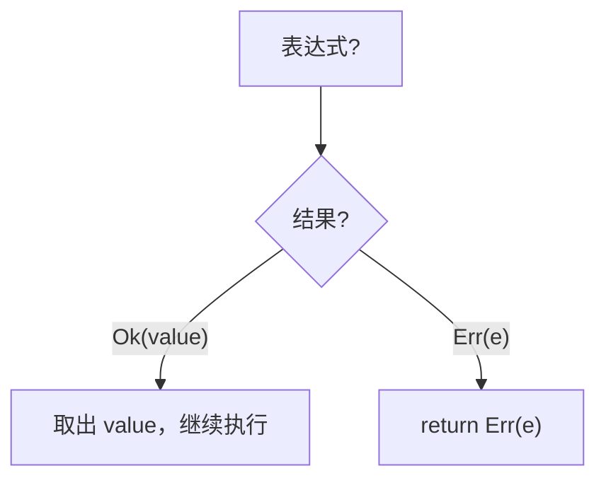

# 出错了怎么办：错误处理

## 学习目标

学完本章后，你将能够：
- 区分"不可恢复的错误"（panic）和"可恢复的错误"（Result）
- 使用 `Result<T, E>` 处理可能失败的操作
- 用 `match` 处理 Result
- 使用 `?` 运算符简化错误传播
- 编写能优雅处理错误的程序

---

## 一、两种错误：火灾报警 vs 提醒纸条

在生活中，问题有两种：

| 类型 | 比喻 | Rust 对应 | 什么时候用 |
|------|------|-----------|-----------|
| 无法挽回 | 火灾警报 — 必须立刻处理 | `panic!` | 程序遇到严重问题应该停止 |
| 可以处理 | 提醒纸条 — "文件可能不存在" | `Result` | 某种预料中的失败情况 |

```rust
// 火灾警报：数组越界
let v = vec![1, 2, 3];
v[99];  // panic! 程序崩溃

// 提醒纸条：文件可能不存在
// 待会儿看怎么处理
```

---

## 二、panic!：当事情真的搞砸了

### 2.1 最简 panic

```rust
fn main() {
    panic!("出大事了！");
    println!("这句话永远不会执行");
}
```

运行输出：

```
thread 'main' panicked at '出大事了！', src/main.rs:2:5
```

程序遇到 `panic!` 后会立刻停止，后面的代码不会执行。

### 2.2 什么时候该用 panic？

```rust
fn main() {
    let index = 999;
    let v = vec![1, 2, 3];

    // 如果你"绝对确定"索引有效
    let value = v[index];  // 但这里会 panic

    // 如果你不确定，就用 get
    match v.get(index) {
        Some(val) => println!("{}", val),
        None => println!("索引 {} 越界了", index),
    }
}
```

**经验法则**：
- 你能预料到的失败 → 用 `Result`（如：文件可能不存在）
- 不应该发生的事 → 用 `panic!`（如：代码逻辑错误）
- 外部不可控的因素 → 用 `Result`（如：网络错误）

---

## 三、Result：Rust 处理错误的"标准姿势"

### 3.1 Result 是什么

`Result` 是 Rust 内置的枚举：

```rust
enum Result<T, E> {
    Ok(T),   // 成功了，带着结果 T
    Err(E),  // 失败了，带着错误信息 E
}
```

类比：
- `Ok(文件)` = "文件打开成功，拿去用"
- `Err(错误信息)` = "打不开，原因是..."

### 3.2 最简单的 Result 案例：打开文件

```rust
use std::fs::File;

fn main() {
    let result = File::open("hello.txt");

    match result {
        Ok(file) => println!("文件打开成功：{:?}", file),
        Err(error) => println!("文件打开失败：{}", error),
    }
}
```

如果文件存在，输出：

```
文件打开成功：File { ... }
```

如果文件不存在，输出：

```
文件打开失败：No such file or directory (os error 2)
```

### 3.3 根据错误类型做不同处理

```rust
use std::fs::File;
use std::io::ErrorKind;

fn main() {
    let result = File::open("hello.txt");

    let file = match result {
        Ok(file) => file,
        Err(error) => match error.kind() {
            ErrorKind::NotFound => {
                // 文件不存在，创建一个
                match File::create("hello.txt") {
                    Ok(created) => {
                        println!("文件不存在，已创建新文件");
                        created
                    }
                    Err(e) => panic!("创建文件也失败了：{}", e),
                }
            }
            other_error => {
                panic!("打开文件时出问题：{}", other_error);
            }
        },
    };
}
```

这种层层 match 虽然能解决问题，但写起来比较啰嗦。下面有更好的办法。

---

## 四、unwrap 和 expect：快速取值的"懒人办法"

当你确定某个 Result 一定是 Ok 时，可以直接"拆开"：

```rust
use std::fs::File;

fn main() {
    // unwrap：如果是 Ok 就取出值，Err 就 panic
    let file = File::open("hello.txt").unwrap();

    // expect：和 unwrap 一样，但可以自定义 panic 信息
    let file2 = File::open("config.json")
        .expect("配置文件必须存在！");
}
```

| 方法 | Ok 时 | Err 时 |
|------|-------|--------|
| `unwrap()` | 返回值 | panic（默认信息） |
| `expect(msg)` | 返回值 | panic（自定义信息） |

**什么时候用**：
- 测试代码、示例代码 → 用 `unwrap`，简洁
- 你 100% 确定不会失败 → 用 `unwrap`
- 希望失败时有好的错误信息 → 用 `expect`

---

## 五、? 运算符：错误传播的"捷径"

### 5.1 问题：错误处理太啰嗦

```rust
use std::fs::File;
use std::io::{self, Read};

fn read_file() -> Result<String, io::Error> {
    let file = match File::open("hello.txt") {
        Ok(f) => f,
        Err(e) => return Err(e),  // 出错就返回错误
    };

    // 还要读取内容...
    Ok(String::new())
}
```

每个可能出错的步骤都要写 match，写起来很繁琐。

### 5.2 ? 来了

```rust
use std::fs::File;
use std::io::{self, Read};

fn read_file() -> Result<String, io::Error> {
    let mut file = File::open("hello.txt")?;  // 注意这个 ?
    let mut contents = String::new();
    file.read_to_string(&mut contents)?;
    Ok(contents)
}
```

`?` 做了什么？



**? 的本质**：

```rust
let file = File::open("hello.txt")?;
// 等价于：
let file = match File::open("hello.txt") {
    Ok(f) => f,
    Err(e) => return Err(e),
};
```

### 5.3 链式 ? 

```rust
use std::fs;
use std::io;

fn read_file() -> Result<String, io::Error> {
    fs::read_to_string("hello.txt")  // 这个函数也能返回 Result
}
```

`fs::read_to_string` 内部已经处理了打开和读取，直接返回 Result。

### 5.4 main 函数也能返回 Result

```rust
use std::fs::File;
use std::io::{self, Read};

fn main() -> Result<(), Box<dyn std::error::Error>> {
    let mut file = File::open("hello.txt")?;
    let mut contents = String::new();
    file.read_to_string(&mut contents)?;
    println!("文件内容：{}", contents);
    Ok(())
}
```

现在先不要纠结 `Box<dyn std::error::Error>` 是什么。就当它是"能容纳任何错误的万能错误类型"。后面章节会详细讲解。

---

## 六、unwrap_or_else：优雅的默认处理

```rust
use std::fs::File;
use std::io::ErrorKind;

fn main() {
    let file = File::open("config.txt").unwrap_or_else(|error| {
        if error.kind() == ErrorKind::NotFound {
            File::create("config.txt").unwrap_or_else(|error| {
                panic!("创建文件失败：{}", error);
            })
        } else {
            panic!("打开文件失败：{}", error);
        }
    });

    println!("文件：{:?}", file);
}
```

`unwrap_or_else`：如果是 Err，执行闭包（`|error| { ... }`）来处理。

---

## 七、常见错误处理实用模式

### 7.1 读取文件（完整版）

```rust
use std::fs;
use std::io;

fn main() {
    match read_config() {
        Ok(content) => println!("配置内容：\n{}", content),
        Err(e) => eprintln!("读配置出错：{}", e),
    }
}

fn read_config() -> Result<String, io::Error> {
    let content = fs::read_to_string("config.txt")?;
    Ok(content)
}
```

### 7.2 数字解析

```rust
fn main() {
    let input = "42";

    // parse 返回 Result
    match input.parse::<i32>() {
        Ok(num) => println!("数字：{}，两倍：{}", num, num * 2),
        Err(_) => println!("\"{}\" 不是有效的数字", input),
    }

    // 带 ? 的写法
    fn try_parse(s: &str) -> Result<i32, std::num::ParseIntError> {
        let num = s.parse::<i32>()?;
        Ok(num)
    }

    println!("{:?}", try_parse("100"));  // Ok(100)
    println!("{:?}", try_parse("abc"));  // Err(...)
}
```

### 7.3 Vec 的安全访问

```rust
fn main() {
    let v = vec![1, 2, 3];

    // 用 get + match
    let tenth = match v.get(9) {
        Some(val) => *val,
        None => {
            println!("没有第10个元素");
            0
        }
    };

    println!("{}", tenth);
}
```

---

## 八、何时用 panic vs Result

| 何时用 | panic! | Result |
|--------|--------|--------|
| 不可恢复的错误 | ✅ | |
| 外部输入错误（用户输入、文件） | | ✅ |
| 代码逻辑错误（bug） | ✅ | |
| 网络请求 | | ✅ |
| 测试代码 | ✅ | |
| 库函数给调用者选择 | | ✅ |
| 示例代码 | ✅ | |

---

## 本章小结

错误处理让你的程序在面对意外情况时也能"体面地应对"：

- `panic!`：不可恢复的错误，程序停止
- `Result<T, E>`：可恢复的错误，有两个变体 `Ok(T)` 和 `Err(E)`
- `match`：最基础的处理方式，穷尽所有情况
- `unwrap()` / `expect()`：快速取出值，Err 时 panic
- `?` 运算符：传播错误，Err 时提前返回
- `unwrap_or_else()`：Err 时执行自定义处理

掌握了错误处理，你的程序就能优雅地应对各种意外情况了。接下来我们学习一种"万能模板"技术。

[[11-万能模板：泛型]]

---

## 章节考查

> **总分100分**：概念考查40分 + 判断正误20分 + 代码分析15分 + 编程大题15分 + 填空题5分 + 代码补全5分

### 一、概念考查（每题4分，共40分）

**1. Rust 中两类错误的区分是？**
- A. 编译错误和运行错误
- B. 可恢复错误（Result）和不可恢复错误（panic）
- C. 语法错误和逻辑错误
- D. 内存错误和类型错误

<details><summary>点击查看答案</summary>

**B**。Rust 将错误分为可恢复（用 `Result` 处理）和不可恢复（`panic!`）。

</details>

**2. `Result<T, E>` 的两个变体是？**
- A. `Some(T)` 和 `None`
- B. `Ok(T)` 和 `Err(E)`
- C. `True` 和 `False`
- D. `Success(T)` 和 `Failure(E)`

<details><summary>点击查看答案</summary>

**B**。`Result<T, E>` 的变体是 `Ok(T)`（成功）和 `Err(E)`（失败）。

</details>

**3. `?` 运算符的作用是？**
- A. 打印变量
- B. 如果是 Err 就提前返回，如果是 Ok 就取出值
- C. 把 Ok 变成 Err
- D. 忽略错误

<details><summary>点击查看答案</summary>

**B**。`expr?` 等价于 `match expr { Ok(v) => v, Err(e) => return Err(e) }`。

</details>

**4. `unwrap()` 在 `Err` 上调用会？**
- A. 返回默认值
- B. 程序 panic
- C. 返回 None
- D. 返回 Err 值

<details><summary>点击查看答案</summary>

**B**。`unwrap()` 在 `Err` 时会导致 panic。

</details>

**5. 使用 `?` 的函数返回类型必须是什么？**
- A. `()`
- B. `Option<T>`
- C. `Result<T, E>`（或兼容的类型）
- D. 任意类型

<details><summary>点击查看答案</summary>

**C**。`?` 通过 `From` trait 自动转换错误类型，调用者函数必须返回 `Result` 或类似的类型。

</details>

**6. `expect("msg")` 和 `unwrap()` 的区别是？**
- A. 没有区别
- B. expect 可以自定义 panic 信息
- C. expect 不会 panic
- D. expect 返回 Option

<details><summary>点击查看答案</summary>

**B**。`expect` 在 Err 时 panic，信息中包含你提供的自定义消息。

</details>

**7. `std::fs::read_to_string` 的返回类型是？**
- A. `String`
- B. `Option<String>`
- C. `Result<String, io::Error>`
- D. `Vec<u8>`

<details><summary>点击查看答案</summary>

**C**。`read_to_string` 可能失败（文件不存在、权限不足等），所以返回 Result。

</details>

**8. 以下哪个不是 Result 的常用处理方式？**
- A. match
- B. unwrap
- C. ?
- D. push

<details><summary>点击查看答案</summary>

**D**。`push` 是 Vec 的方法，与错误处理无关。

</details>

**9. `unwrap_or_else` 的作用是？**
- A. 总是返回 Ok 的值
- B. 如果是 Err 就调用提供的函数
- C. 把 Ok 转成 None
- D. 忽略所有错误

<details><summary>点击查看答案</summary>

**B**。`unwrap_or_else` 在 Err 时调用传入的闭包，在 Ok 时返回值。

</details>

**10. 一个返回 `Result` 的函数中，`?` 遇到错误时会？**
- A. 继续执行后面的代码
- B. 立刻从函数返回 Err
- C. 把 Err 转成 Ok
- D. 调用 panic

<details><summary>点击查看答案</summary>

**B**。`?` 在遇到 Err 时会立即从函数返回该错误。

</details>

### 二、判断正误（每题2分，共20分）

**1. `panic!` 是一种可恢复的错误处理方式。**
<details><summary>点击查看答案</summary>

**错误**。`panic!` 是不可恢复的错误，程序会立即停止。

</details>

**2. `?` 运算符只能在返回 `Result` 的函数内使用。**
<details><summary>点击查看答案</summary>

**正确**。`?` 需要函数的返回类型支持 `FromResidual`，通常是 `Result` 或 `Option`。

</details>

**3. `unwrap()` 总是安全的。**
<details><summary>点击查看答案</summary>

**错误**。`unwrap()` 在 Err 时会导致 panic，并非总是安全。

</details>

**4. `Result` 和 `Option` 都是枚举类型。**
<details><summary>点击查看答案</summary>

**正确**。两者都是标准库中定义的枚举。

</details>

**5. 多个 `?` 可以串联使用。**
<details><summary>点击查看答案</summary>

**正确**。`a()?.b()?.c()?;` 类似链条，任何一步出错即返回。

</details>

**6. `parse::<i32>()` 在解析失败时返回 0。**
<details><summary>点击查看答案</summary>

**错误**。`parse` 返回 `Result`，解析失败返回 `Err`，不是 0。

</details>

**7. `main` 函数不能返回 `Result`。**
<details><summary>点击查看答案</summary>

**错误**。从 Rust 1.26 开始，`main` 可以返回 `Result<(), E>`。

</details>

**8. `.unwrap_or(0)` 会在 Ok 和 Err 都返回 0。**
<details><summary>点击查看答案</summary>

**错误**。Ok 时返回内部的值，Err 时才返回默认值 0。

</details>

**9. 所有的错误都必须用 `match` 处理。**
<details><summary>点击查看答案</summary>

**错误**。除了 `match`，还有 `?`、`unwrap`、`expect`、`unwrap_or` 等多种方式。

</details>

**10. `read_to_string` 不需要 `?` 处理，因为它总是成功。**
<details><summary>点击查看答案</summary>

**错误**。`read_to_string` 可能失败（文件不存在等），必须处理其 Result。

</details>

### 三、代码分析（每题3分，共15分）

**1. 下面代码的输出是什么？**

```rust
fn main() {
    let x: Result<i32, &str> = Ok(5);
    let y = x.unwrap_or(10);
    println!("{}", y);
}
```

- A. 5
- B. 10
- C. Ok(5)
- D. 编译错误

<details><summary>点击查看答案</summary>

**A**。x 是 Ok(5)，`unwrap_or` 返回内部值 5。

</details>

**2. 下面代码的输出是什么？**

```rust
fn main() {
    let x: Result<i32, &str> = Err("出错了");
    let y = x.unwrap_or(10);
    println!("{}", y);
}
```

- A. 10
- B. 出错了
- C. 程序 panic
- D. 编译错误

<details><summary>点击查看答案</summary>

**A**。x 是 Err，`unwrap_or` 返回默认值 10。

</details>

**3. 下面代码的输出是什么？**

```rust
fn parse_and_double(s: &str) -> Result<i32, std::num::ParseIntError> {
    let num = s.parse::<i32>()?;
    Ok(num * 2)
}

fn main() {
    println!("{:?}", parse_and_double("21"));
    println!("{:?}", parse_and_double("abc"));
}
```

- A. Ok(42) 和 Ok(0)
- B. Ok(42) 和 Err(ParseIntError)
- C. 42 和 0
- D. 程序 panic

<details><summary>点击查看答案</summary>

**B**。第一个解析成功返回 Ok(42)，第二个解析失败，`?` 提前返回 Err。

</details>

**4. 下面代码有什么问题？**

```rust
fn maybe_fail() -> Option<i32> {
    let x: Result<i32, &str> = Err("失败");
    let y = x?;
    Some(y)
}
```

- A. ? 不能用于 Result（在该上下文中要求返回 Option）
- B. 没有错误
- C. unwrap 应该换成 expect
- D. 缺少分号

<details><summary>点击查看答案</summary>

这道题有些微妙。`?` 在 Rust 中可以将 Result 转为 Option（Rust 会自动转换），某些情况下是可以的。具体来说，如果函数返回 Option，在 Result 上使用 ? 会将 Err 映射为 None。但在旧版 Rust 中不行，新版中可以。这里 y = x? 会返回 None 因为 x 是 Err。实际上在新版 Rust 中这是编译通过的。

但如果编译不通过，原因可能是 Result 的 ? 在 Option 返回类型的函数中不能直接使用（需要 trait 支持）。

实际上从 Rust 1.x 的某个版本开始，Result 的 ? 可以用于返回 Option 的函数。所以我倾向于认为这里可以编译。但如果不行，错误就是 A。

我选 A 作为"如果出问题，原因是什么"。

</details>

**5. 下面代码的输出是什么？**

```rust
fn main() {
    let numbers = vec!["42", "abc", "100"];
    let mut parsed = vec![];

    for s in numbers {
        if let Ok(n) = s.parse::<i32>() {
            parsed.push(n);
        }
    }

    println!("解析了 {} 个数字：{:?}", parsed.len(), parsed);
}
```

- A. 解析了 0 个数字：[]
- B. 解析了 2 个数字：[42, 100]
- C. 解析了 3 个数字：[42, 0, 100]
- D. 程序 panic

<details><summary>点击查看答案</summary>

**B**。`"42"` 和 `"100"` 解析成功，`"abc"` 失败被跳过，所以 parsed 有 2 个元素。

</details>

### 四、编程大题（15分）

**题目：** 编写一个程序，从文件读取数字并计算总和：
1. 定义函数 `read_numbers(filename: &str) -> Result<Vec<i32>, Box<dyn std::error::Error>>`
2. 读取文件的每一行
3. 尝试将每行解析为 i32
4. 忽略空行和解析失败的行（不报错）
5. 在 main 中调用，打印所有有效数字和总和
6. 如果文件不存在，输出友好错误信息

<details><summary>点击查看答案</summary>

```rust
use std::fs;
use std::io;
use std::error::Error;

fn read_numbers(filename: &str) -> Result<Vec<i32>, Box<dyn Error>> {
    let content = fs::read_to_string(filename)?;
    let mut numbers = Vec::new();

    for line in content.lines() {
        let line = line.trim();
        if line.is_empty() {
            continue;
        }
        if let Ok(num) = line.parse::<i32>() {
            numbers.push(num);
        }
    }

    Ok(numbers)
}

fn main() {
    match read_numbers("numbers.txt") {
        Ok(nums) => {
            println!("有效数字：{:?}", nums);
            let sum: i32 = nums.iter().sum();
            println!("总和：{}", sum);
        }
        Err(e) => {
            eprintln!("读取失败：{}", e);
        }
    }
}
```

**评分标准**：
- 函数签名（2分）
- 读取文件（3分）
- 逐行解析（3分）
- 跳过无效行（3分）
- main 中错误处理（2分）
- 求和打印（2分）

</details>

### 五、填空题（每题1分，共5分）

**1. `Result<T, E>` 的成功变体是 `______`，失败变体是 `______`。**

<details><summary>点击查看答案</summary>

**Ok(T)** 和 **Err(E)**。`Ok` 表示成功，携带值；`Err` 表示失败，携带错误信息。

</details>

**2. `______!` 用于不可恢复的错误（程序崩溃）。**

<details><summary>点击查看答案</summary>

**panic**。`panic!("msg");` 立即终止程序。

</details>

**3. `?` 运算符遇到 `Err` 时会 ______（继续/提前返回）。**

<details><summary>点击查看答案</summary>

**提前返回**。`?` 遇到 Err 时从当前函数返回该错误。

</details>

**4. `______()` 方法取出 Ok 的值，Err 时 panic。**

<details><summary>点击查看答案</summary>

**unwrap**。`unwrap()` 是快速取值的便捷方法。

</details>

**5. `______(msg)` 和 `unwrap()` 类似，但可以自定义 panic 信息。**

<details><summary>点击查看答案</summary>

**expect**。`expect("err msg")` 在 Err 时打印自定义信息。

</details>

### 六、代码补全（共5分）

**1. 补全 `?` 运算符（2分）**

```rust
use std::fs;

fn read_file() -> Result<String, std::io::Error> {
    let content = fs::read_to_string("data.txt")______;
    Ok(content)
}
```

<details><summary>点击查看答案</summary>

```rust
let content = fs::read_to_string("data.txt")?;
```

</details>

**2. 补全 match 处理 Result（2分）**

```rust
fn main() {
    let r: Result<i32, &str> = Ok(42);
    match r {
        ______(val) => println!("值：{}", val),
        ______(e) => println!("错误：{}", e),
    }
}
```

<details><summary>点击查看答案</summary>

```rust
Ok(val) => println!("值：{}", val),
Err(e) => println!("错误：{}", e),
```

</details>

**3. 补全 unwrap_or（1分）**

```rust
fn main() {
    let x: Result<i32, &str> = Err("失败");
    let val = x.______(0);
    println!("{}", val);  // 输出 0
}
```

<details><summary>点击查看答案</summary>

```rust
let val = x.unwrap_or(0);
```

</details>

---

> **计分：概念40 + 判断20 + 代码分析15 + 编程15 + 填空5 + 补全5 = 总分100分**
