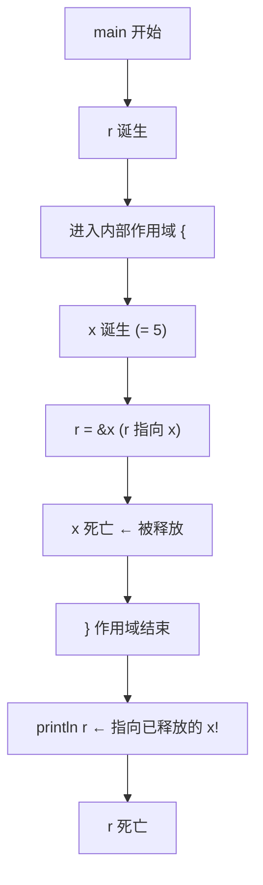

# 引用有效期：生命周期入门

## 学习目标

学完本章后，你将能够：
- 理解"生命周期"就是"引用有效的时间"
- 看懂简单的生命周期标注 `'a`
- 理解为什么需要生命周期：防止悬垂引用
- 在函数签名中写出基本的生命周期标注
- 区分结构体中的自有数据和引用数据

---

## 一、一个"不该存在"的引用

想想这个场景：你写了一个便条，上面写着"去 3 号柜子拿东西"，然后把柜子拆了。便条上的信息还有效吗？当然不！

代码里也会出现同样的问题：

```rust
fn main() {
    let r;

    {
        let x = 5;
        r = &x;       // r 指向 x
    }                 // x 在这里被释放了

    println!("{}", r);  // 编译错误！r 指向的东西不存在了
}
```

编译器报错：

```
error: `x` does not live long enough
```

用图来看：



Rust 编译器发现的正是这种"引用比数据活得久"的问题。这叫**悬垂引用**（dangling reference）。

---

## 二、编译器是如何发现这个问题的？

Rust 编译器给每个引用和每个变量都标注了一个"生命周期"（lifetime）—— 就是从诞生到死亡的这段时间。

```mermaid
gantt
    title 变量生命周期
    dateFormat X
    axisFormat %s
    section x
    x 存活期     :active, x1, 1, 3
    section r
    r 存活期     :active, r1, 2, 5
    section 问题
    x 已死但 r 还在 :crit, p1, 3, 5
```



"生命周期"这个名字听起来很深奥，其实就是一个简单的概念：**这个东西在内存里存活了多久。**

大多数情况下，Rust 能自动推断生命周期，不需要你写。但有些情况需要你"帮助"编译器。

---

## 三、函数中的生命周期：longest

看这个问题：

```rust
fn longest(x: &str, y: &str) -> &str {
    if x.len() > y.len() {
        x
    } else {
        y
    }
}
```

这个函数接收两个引用，返回其中一个。编译器会报错：

```
error: expected named lifetime parameter
```

**编译器的困惑**：返回的引用是来自 `x` 还是 `y`？我们不知道（取决于 if 的结果），编译器也不知道。所以编译器无法确定返回的引用应该活多久。

我们需要加上**生命周期标注**（lifetime annotation）：

```rust
fn longest<'a>(x: &'a str, y: &'a str) -> &'a str {
    if x.len() > y.len() {
        x
    } else {
        y
    }
}
```

`'a` 读作"生命周期 a"。你可以把它理解为"给这段生命周期起了个名字叫 a"。

这个签名的意思是：

```
fn longest<'a>(x: &'a str, y: &'a str) -> &'a str
           ↑       ↑          ↑          ↑
      声明生命周期    x 活至少 'a 这么久   返回的东西也活 'a 这么久
```

用通俗的话说：

> 函数的返回值和两个参数"同生共死"——返回的引用不会比参数活得更久。

---

## 四、最简单的生命周期标注示例

```rust
fn main() {
    let s1 = String::from("你好");
    let s2 = String::from("世界你好");

    let result = longest(&s1, &s2);
    println!("长的是：{}", result);
}

fn longest<'a>(x: &'a str, y: &'a str) -> &'a str {
    if x.len() > y.len() {
        x
    } else {
        y
    }
}
```

输出：

```
长的是：世界你好
```

**生命周期标注做了什么？**

1. **它不改变任何东西的存活时间。** 它只是告诉编译器："这些引用之间有生命周期的关系"。
2. **它是编译时的检查工具。** 运行时没有任何影响。
3. **它是编译器和你之间的"协议"。** 你向编译器承诺："返回值的生命周期和输入参数有关"，编译器帮你验证这个承诺。

---

## 五、不同的生命周期参数

有些情况下不同参数有不同的生命周期：

```rust
// x 和 y 可以有不同的生命周期
// 但函数体里只用到了 x，所以只要 x 活得够久就行
fn first<'a>(x: &'a str, y: &str) -> &'a str {
    x  // 只返回 x，不关 y 的事
}

fn main() {
    let s1 = String::from("hello");
    {
        let s2 = String::from("world");
        let result = first(&s1, &s2);
        println!("{}", result);  // OK，result 和 s1 一样久
    }
    // s2 在这里死亡了，但没关系，result 不依赖 s2
}
```

如果 `y` 也参与返回值的选择，那就必须给 `y` 也标注生命周期。

---

## 六、结构体中的生命周期

当结构体中包含引用时，必须标注生命周期：

```rust
// 这个结构体包含一个引用
// 必须标注生命周期：结构体实例不能比它引用的数据活得更久
struct Excerpt<'a> {
    part: &'a str,
}

fn main() {
    let novel = String::from("从前有座山，山里有座庙...");
    let first_sentence = novel.split('。').next().expect("没有句号");

    let excerpt = Excerpt {
        part: first_sentence,
    };

    println!("摘要：{}", excerpt.part);
}
```

`Excerpt<'a>` 的意思是："这个结构体里有一个引用，那个引用必须至少活 `'a` 这么久。"

这样编译器就能保证：`Excerpt` 实例不会比它引用的数据活得更久。

---

## 七、生命周期省略规则

好消息是：大多数情况下你不需要写生命周期！

Rust 有三条"生命周期省略规则"，满足这些规则时编译器可以自动推断：

1. **每个引用参数都自动获得一个生命周期**：`fn foo(x: &str)` → `fn foo<'a>(x: &'a str)`
2. **如果只有一个输入生命周期，返回值自动获得相同生命周期**：`fn foo(x: &str) -> &str` → `fn foo<'a>(x: &'a str) -> &'a str`
3. **如果有多个输入，但其中一个是 `&self`，返回值获得 self 的生命周期**：适用于方法

所以这些函数不需要你写生命周期：

```rust
fn first_word(s: &str) -> &str { ... }     // 规则1 + 规则2
fn method(&self, other: &str) -> &str { ... }  // 规则1 + 规则3
```

你需要写生命周期的情况：
- 函数有多个引用参数，返回值的生命周期不能由规则确定
- 结构体包含引用字段
- 某些复杂的泛型和 trait 组合

---

## 八、实战：生命周期让代码更安全

看一个完整的例子：

```rust
struct Config<'a> {
    path: &'a str,
    mode: &'a str,
}

fn parse_config<'a>(args: &'a str) -> Config<'a> {
    let parts: Vec<&str> = args.split_whitespace().collect();
    Config {
        path: parts[0],
        mode: parts.get(1).unwrap_or(&"default"),
    }
}

fn main() {
    let input = String::from("/home/user read");
    let config = parse_config(&input);

    println!("路径：{}，模式：{}", config.path, config.mode);
    // input 和 config 的生命周期正确关联
}
```

输出：

```
路径：/home/user，模式：read
```

---

## 九、生命周期速查表

| 场景 | 是否需标注 | 示例 |
|------|-----------|------|
| 函数，一个引用参数 | 否（自动推断） | `fn foo(x: &str) -> &str` |
| 函数，多个引用参数 | 视情况 | `fn longest<'a>(x: &'a str, y: &'a str) -> &'a str` |
| 方法，`&self` | 通常不需要 | `fn get(&self) -> &T` |
| 结构体含引用 | 是 | `struct Wrap<'a> { r: &'a str }` |
| 枚举含引用 | 是 | `enum Ref<'a> { Borrowed(&'a str) }` |

---

## 本章小结

生命周期是 Rust 保障内存安全的最后一道防线：

- 生命周期就是"引用有效的时间范围"
- 悬垂引用 = 引用指向了已经释放的数据，Rust 不允许
- `'a` 是生命周期标注："它们活一样久"
- 生命周期标注不改变代码逻辑，只帮编译器检查
- 大多数情况 Rust 自动推断，少数复杂场景需要手动标注
- 结构体包含引用时必须标注生命周期
- 生命周期和所有权一起，构成了 Rust 零成本内存安全的基础

这一章可能是入门篇中最抽象的一章。没关系，先理解"它是什么、为什么要它"就行。随着写代码越来越多，你会慢慢熟悉的。

[[14-组织代码：模块与包]]

---

## 章节考查

> **总分100分**：概念考查40分 + 判断正误20分 + 代码分析15分 + 编程大题15分 + 填空题5分 + 代码补全5分

### 一、概念考查（每题4分，共40分）

**1. "生命周期"在 Rust 中指什么？**
- A. 程序的运行时间
- B. 变量或引用在内存中有效的范围
- C. 函数的执行时间
- D. 编译时间

<details><summary>点击查看答案</summary>

**B**。生命周期是引用（或变量）从创建到被释放的时间范围。

</details>

**2. 生命周期标注 `'a` 会改变引用存活时间吗？**
- A. 会，延长了引用的生命
- B. 会，缩短了引用的生命
- C. 不会，只是帮助编译器推理
- D. 会，取决于怎么写

<details><summary>点击查看答案</summary>

**C**。生命周期标注只是编译时的"合同"，不改变任何运行时的行为。

</details>

**3. "悬垂引用"指的是什么？**
- A. 引用指向了另一个引用
- B. 引用指向的内存已被释放
- C. 引用自始至终没被使用
- D. 引用指向了整数

<details><summary>点击查看答案</summary>

**B**。悬垂引用指向已经无效（被释放）的内存，使用它会导致未定义行为。

</details>

**4. `fn longest<'a>(x: &'a str, y: &'a str) -> &'a str` 中，返回值的生命周期和什么关联？**
- A. 只和 x
- B. 只和 y
- C. 和 x、y 中活得较短的那个
- D. 和整个程序

<details><summary>点击查看答案</summary>

**C**。当多个参数标注了相同的生命周期，返回值的生命周期是它们中较短的那个（交集）。

</details>

**5. 结构体包含引用字段时必须？**
- A. 用 Box 包裹
- B. 标注生命周期
- C. 实现 Clone
- D. 放在函数里

<details><summary>点击查看答案</summary>

**B**。含引用的结构体必须标注生命周期，编译器需要知道这些引用的有效范围。

</details>

**6. Rust 生命周期省略规则有几条？**
- A. 1条
- B. 2条
- C. 3条
- D. 5条

<details><summary>点击查看答案</summary>

**C**。Rust 有 3 条生命周期省略规则（输入生命周期、输出生命周期、self 特殊规则）。

</details>

**7. `fn foo(x: &str) -> &str` 为什么不用写生命周期？**
- A. 因为它不会编译
- B. 因为编译器根据省略规则自动推断
- C. 因为 str 没有生命周期
- D. 因为 foo 是特殊名称

<details><summary>点击查看答案</summary>

**B**。只有一个引用参数时，返回值的生命周期自动与参数相同。

</details>

**8. `'a` 这个符号读作什么？**
- A. 撇 a
- B. 生命周期 a
- C. 引用 a
- D. 泛型 a

<details><summary>点击查看答案</summary>

**B**。"tick a" 或 "生命周期 a"，它是生命周期参数的命名。

</details>

**9. 生命周期标注在代码的什么位置？**
- A. 在函数体里
- B. 在尖括号 `<>` 里，和泛型参数放在一起
- C. 在 struct 的字段里
- D. 在注释里

<details><summary>点击查看答案</summary>

**B**。生命周期参数在 `<>` 中声明，如 `fn foo<'a>(...)`、`struct Bar<'a> { ... }`。

</details>

**10. 以下哪个可以没有生命周期标注也能编译通过？**
- A. `fn longest(x: &str, y: &str) -> &str`
- B. `struct Container { data: &str }`
- C. `fn first(x: &str) -> &str`
- D. 以上都需要

<details><summary>点击查看答案</summary>

**C**。`fn first(x: &str) -> &str` 只有单个引用参数，编译器可自动推断生命周期。

</details>

### 二、判断正误（每题2分，共20分）

**1. 生命周期是运行时的概念。**
<details><summary>点击查看答案</summary>

**错误**。生命周期是编译时的检查和标注，运行时完全不存在。

</details>

**2. 生命周期标注可以改变程序的行为。**
<details><summary>点击查看答案</summary>

**错误**。生命周期标注只用于编译检查，不影响运行时行为。

</details>

**3. 每个引用都必须显式标注生命周期。**
<details><summary>点击查看答案</summary>

**错误**。很多情况下编译器可以自动推断，不需要显式标注。

</details>

**4. `'static` 表示数据在整个程序运行期间都有效。**
<details><summary>点击查看答案</summary>

**正确**。`'static` 是最长的生命周期，程序启动到结束。字符串字面量就是 `'static` 的。

</details>

**5. 结构体中的引用字段总是需要生命周期标注。**
<details><summary>点击查看答案</summary>

**正确**。只要结构体字段不是 `'static` 引用，就需要标注。

</details>

**6. `fn foo<'a>(x: &'a str, y: &str) -> &'a str` 中 y 的生命周期可以比 x 短。**
<details><summary>点击查看答案</summary>

**正确**。y 没有标注 `'a`，可以与返回值有不同的生命周期。

</details>

**7. 生命周期标注 `'a` 和泛型 `T` 不能同时出现在同一个函数里。**
<details><summary>点击查看答案</summary>

**错误**。可以一起用：`fn foo<'a, T>(x: &'a T) -> &'a T`。

</details>

**8. 生命周期参数的名字只能是单个小写字母。**
<details><summary>点击查看答案</summary>

**错误**。通常用单字母（`'a`, `'b`），但可以更长（`'input`）。惯例是短小。

</details>

**9. `'a` 表示"恰好一样长"。**
<details><summary>点击查看答案</summary>

**错误**。`'a` 表示"至少活这么久"，实际可以更长。

</details>

**10. 生命周期是 Rust 独有的概念。**
<details><summary>点击查看答案</summary>

**错误**。其他语言也有类似概念（如 C 语言的悬垂指针问题），但 Rust 在编译时强制执行检查。

</details>

### 三、代码分析（每题3分，共15分）

**1. 下面代码能否编译通过？**

```rust
fn main() {
    let r;
    {
        let x = 5;
        r = &x;
    }
    println!("{}", r);
}
```

- A. 能，输出 5
- B. 不能，x 活得不够长
- C. 能，但输出不确定
- D. 不能，但没有报错

<details><summary>点击查看答案</summary>

**B**。`x` 在内部作用域结束时被释放，`r` 指向了失效的内存，编译器拒绝编译。

</details>

**2. 下面代码的输出是什么？**

```rust
fn longest<'a>(x: &'a str, y: &'a str) -> &'a str {
    if x.len() > y.len() { x } else { y }
}

fn main() {
    let a = "hello";
    let b = "world!";
    println!("{}", longest(a, b));
}
```

- A. hello
- B. world!
- C. 编译错误
- D. 随机

<details><summary>点击查看答案</summary>

**B**。"hello" 长度 5，"world!" 长度 6，"world!" 更长。

</details>

**3. 下面代码有什么问题？**

```rust
fn return_ref() -> &str {
    let s = String::from("hello");
    &s
}
```

- A. 没有错误
- B. 返回的引用指向了局部变量，将产生悬垂引用
- C. String 不能转 &str
- D. 函数签名缺少生命周期

<details><summary>点击查看答案</summary>

**B**（也是 D）。函数返回 `&str` 时，引用指向局部变量 `s`。当函数返回后 `s` 被释放，引用悬空了。编译器会拒绝编译。

</details>

**4. 下面代码能否编译通过？**

```rust
struct Container<'a> {
    value: &'a str,
}

fn main() {
    let s = String::from("hello");
    let c = Container { value: &s };
    println!("{}", c.value);
}
```

- A. 能
- B. 不能，Container 缺少生命周期
- C. 不能，&s 活不够长
- D. 不能，String 不能放 Container

<details><summary>点击查看答案</summary>

**A**。`c` 和 `s` 在同一个作用域，`c.value` 引用的 `s` 在 `c` 使用期间一直有效。

</details>

**5. 下面代码有什么问题？**

```rust
fn first<'a>(x: &'a str, y: &str) -> &'a str {
    y  // 有 bug：想要返回 y 但标注是 'a
}
```

- A. 没有错误
- B. 返回的 y 和标注的 'a 不一致
- C. y 没有生命周期
- D. 不能用 str

<details><summary>点击查看答案</summary>

**B**。函数签名承诺返回值的生命周期和 `x`（`'a`）绑定，但实际返回了 `y`（没有 `'a` 标注）。编译器根据签名认为返回值的生命周期不能超过 `'a`，但 `y` 的生命周期是未知的另一个。编译器会报错：返回值的生命周期与输入不匹配。

</details>

### 四、编程大题（15分）

**题目：** 编写代码展示生命周期概念：
1. 定义函数 `pick_first`：接收两个 `&str`，返回第一个（只标注必要的生命周期）
2. 定义函数 `longer`：接收两个 `&str`，返回较长者（标注必要的生命周期）
3. 定义结构体 `Sentence`：包含一个 `&str` 字段（标注生命周期）
4. 实现方法 `words_count`：统计句子中的单词数
5. 在 main 中测试以上所有功能

<details><summary>点击查看答案</summary>

```rust
struct Sentence<'a> {
    content: &'a str,
}

impl<'a> Sentence<'a> {
    fn words_count(&self) -> usize {
        self.content.split_whitespace().count()
    }
}

fn pick_first<'a>(x: &'a str, _y: &str) -> &'a str {
    x
}

fn longer<'a>(x: &'a str, y: &'a str) -> &'a str {
    if x.len() > y.len() { x } else { y }
}

fn main() {
    let a = "短";
    let b = "比较长";

    println!("第一个：{}", pick_first(a, b));
    println!("较长者：{}", longer(a, b));

    let sentence = Sentence { content: "Rust 是一门 好语言" };
    println!("句子：\"{}\"，单词数：{}", sentence.content, sentence.words_count());
}
```

**评分标准**：
- pick_first 函数（2分）
- longer 函数（3分）
- Sentence 结构体（2分）
- words_count 方法（3分）
- impl 正确标注（3分）
- main 测试（2分）

</details>

### 五、填空题（每题1分，共5分）

**1. 生命周期在 `______` 括号中声明，如 `fn foo<'a>(...)`。**

<details><summary>点击查看答案</summary>

**<>**（尖括号）。生命周期参数和泛型一样写在 `<>` 中。

</details>

**2. `______` 生命周期表示数据在整个程序运行期间有效。**

<details><summary>点击查看答案</summary>

**'static**。如字符串字面量 `"hello"` 就是 `'static` 生命周期。

</details>

**3. 生命周期标注 ______（会/不会）影响运行时性能。**

<details><summary>点击查看答案</summary>

**不会**。生命周期是纯编译时的概念，运行时零开销。

</details>

**4. 结构体包含引用字段时，必须在结构体名后加 `______`。**

<details><summary>点击查看答案</summary>

**<'a>**（生命周期参数）。`struct Name<'a> { field: &'a str }`。

</details>

**5. 当引用指向的内存已经被释放时，这个引用被称为 `______` 引用。**

<details><summary>点击查看答案</summary>

**悬垂**（dangling）。悬垂引用指向无效内存，Rust 在编译时阻止。

</details>

### 六、代码补全（共5分）

**1. 补全生命周期标注（2分）**

```rust
fn get_message<______>(msg: &'a str) -> &______ str {
    msg
}
```

<details><summary>点击查看答案</summary>

```rust
fn get_message<'a>(msg: &'a str) -> &'a str {
```

</details>

**2. 补全结构体生命周期（2分）**

```rust
struct Reader<______> {
    data: &'a str,
}
```

<details><summary>点击查看答案</summary>

```rust
struct Reader<'a> {
```

</details>

**3. 补全 impl 生命周期（1分）**

```rust
impl<______> Reader<'a> {
    fn read(&self) -> &str {
        self.data
    }
}
```

<details><summary>点击查看答案</summary>

```rust
impl<'a> Reader<'a> {
```

</details>

---

> **计分：概念40 + 判断20 + 代码分析15 + 编程15 + 填空5 + 补全5 = 总分100分**
