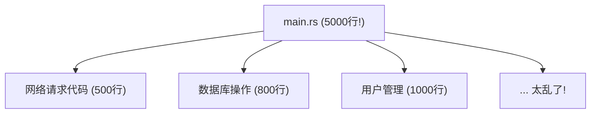
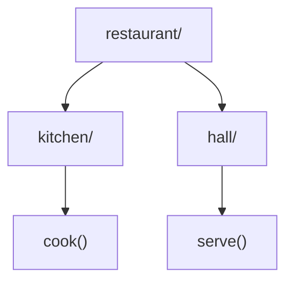
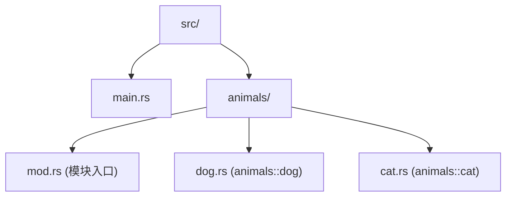
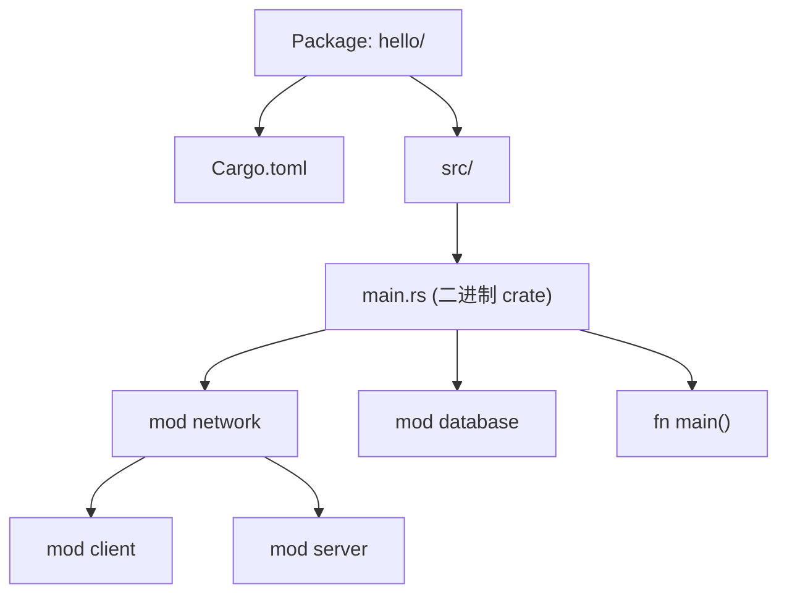
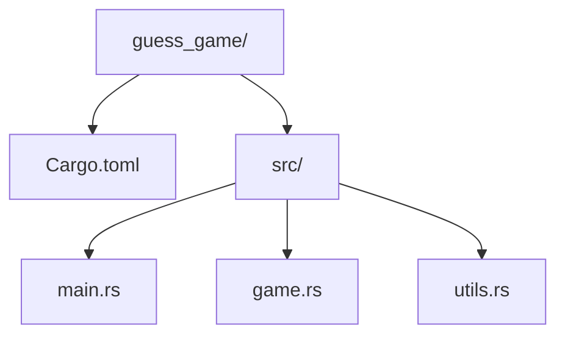

# 组织代码：模块与包

## 学习目标

学完本章后，你将能够：
- 用 `mod` 将代码组织成模块
- 使用 `pub` 控制代码的可见性
- 用 `use` 简化路径
- 将模块拆分到不同文件
- 在 Cargo.toml 中添加外部依赖
- 理解 crate、包、模块的区别

---

## 一、问题：所有代码写在一个文件里？

到目前为止，我们的代码都写在 `src/main.rs` 一个文件里。如果项目越来越大，一个文件会长得吓人。



Rust 的**模块系统**让你把代码拆成小块，像图书馆里的书架一样井井有条。

---

## 二、最简单的模块：mod

在同一个文件里定义模块：

```rust
// 定义一个模块
mod my_module {
    pub fn hello() {   // pub 表示"公开的"，外面能调用
        println!("你好，来自模块内部！");
    }
}

fn main() {
    my_module::hello();  // 用 :: 访问模块里的内容
}
```

输出：

```
你好，来自模块内部！
```

拆解：

```
mod my_module { ... }     ← 定义一个"房间"
pub fn hello() { ... }    ← 房间里有一个"公开的"功能
my_module::hello()        ← 用路径访问房间里的功能
```

---

## 三、pub：公开还是私有？

默认情况下，模块里的东西是**私有的**（只有模块内部能访问）。

```rust
mod kitchen {
    fn secret_recipe() {  // 没有 pub，私有
        println!("秘密配方...");
    }

    pub fn order_pizza() {
        println!("做披萨中...");
        secret_recipe();  // 内部可以调用私有函数
    }
}

fn main() {
    kitchen::order_pizza();  // OK，是公开的
    // kitchen::secret_recipe();  // 编译错误！私有的
}
```

| 修饰符 | 可见性 |
|--------|--------|
| 不加 `pub` | 私有（默认），只有当前模块及子模块能访问 |
| `pub` | 公开，外部可以访问 |
| `pub(crate)` | 仅当前 crate 内可见 |
| `pub(super)` | 仅父模块可见 |

---

## 四、嵌套模块

模块可以套模块，像文件夹一样：

```rust
mod restaurant {
    pub mod kitchen {
        pub fn cook() {
            println!("厨房：做菜！");
        }
    }

    pub mod hall {
        pub fn serve() {
            println!("餐厅：上菜！");
        }
    }
}

fn main() {
    restaurant::kitchen::cook();
    restaurant::hall::serve();
}
```

输出：

```
厨房：做菜！
餐厅：上菜！
```

这就像一个目录结构：



---

## 五、use：简化路径

老是写全路径很烦人。`use` 可以把函数"引入当前作用域"：

```rust
mod restaurant {
    pub mod kitchen {
        pub fn cook() {
            println("做菜！");
        }
    }
}

// 方法1：引入完整路径
use restaurant::kitchen::cook;

// 方法2：引入到模块级别
use restaurant::kitchen;

fn main() {
    cook();             // 直接用（方法1）
    kitchen::cook();    // 用模块名调用（方法2）
}
```

**常用 use 模式：**

```rust
// 引入单个函数
use std::collections::HashMap;

// 引入多个
use std::io::{self, Read, Write};  // self 指 std::io 本身

// 引入所有公开内容（谨慎使用）
use std::collections::*;

// 别名（解决命名冲突）
use std::io::Result as IoResult;
use std::fmt::Result as FmtResult;
```

---

## 六、把模块拆分到文件

当一个模块代码太多时，就应该把模块移出到单独的文件。

### 原始代码（全在 main.rs）

```rust
// main.rs
mod animals {
    pub struct Dog {
        pub name: String,
    }

    impl Dog {
        pub fn bark(&self) {
            println!("{} 说：汪汪！", self.name);
        }
    }
}

fn main() {
    let dog = animals::Dog { name: String::from("旺财") };
    dog.bark();
}
```

### 拆分后

**src/main.rs**：

```rust
mod animals;  // 告诉 Rust："animals 模块在另一个文件里"

fn main() {
    let dog = animals::Dog { name: String::from("旺财") };
    dog.bark();
}
```

**src/animals.rs**：

```rust
pub struct Dog {
    pub name: String,
}

impl Dog {
    pub fn bark(&self) {
        println!("{} 说：汪汪！", self.name);
    }
}
```

注意：
- `mod animals;` 告诉 Rust 去找 `animals.rs` 或 `animals/mod.rs`
- 文件里的内容会自动作为 `animals` 模块的内容
- 要在外面用的，都加 `pub`

### 更深的嵌套



**src/main.rs**：

```rust
mod animals;

fn main() {
    animals::dog::create();
    animals::cat::create();
}
```

**src/animals/mod.rs**：

```rust
pub mod dog;
pub mod cat;
```

**src/animals/dog.rs**：

```rust
pub fn create() {
    println!("创建了一只狗");
}
```

**src/animals/cat.rs**：

```rust
pub fn create() {
    println!("创建了一只猫");
}
```

---

## 七、Cargo.toml：使用外部库

写程序不可能一切从头造轮子。外部库（crate）就是别人写好的代码，你拿来用。

### 7.1 添加依赖

编辑 `Cargo.toml`，在 `[dependencies]` 下添加：

```toml
[package]
name = "my_project"
version = "0.1.0"
edition = "2021"

[dependencies]
rand = "0.8"        # 随机数库
```

然后 `cargo build`，Cargo 会自动下载 `rand` 库。

### 7.2 使用外部 crate

```rust
use rand::Rng;  // 引入随机数 trait

fn main() {
    let secret_number = rand::thread_rng().gen_range(1..=100);
    println!("秘密数字：{}", secret_number);
}
```

### 7.3 常用库速览

| 库名 | 用途 | Cargo.toml |
|------|------|-----------|
| `rand` | 随机数 | `rand = "0.8"` |
| `serde` | 序列化/反序列化 | `serde = { version = "1.0", features = ["derive"] }` |
| `regex` | 正则表达式 | `regex = "1"` |
| `chrono` | 日期时间 | `chrono = "0.4"` |
| `reqwest` | HTTP 请求 | `reqwest = "0.11"` |
| `clap` | 命令行参数解析 | `clap = "4.0"` |

---

## 八、crate、package、module 的关系

这三个概念容易混淆，用一个简化的对比帮你分清：

| 概念 | 是什么 | 举例 |
|------|--------|------|
| **Package（包）** | 一个完整的项目，有 Cargo.toml | 你的整个 `hello` 项目 |
| **Crate（箱）** | 编译单元，生成一个库或可执行文件 | `src/main.rs`（二进制 crate）或一个库 |
| **Module（模块）** | 代码的组织单元 | `mod animals { ... }` |

**关系图**：



---

## 九、完整项目实例

让我们来做一个完整的小项目，用上模块和外部库：



**Cargo.toml**：

```toml
[package]
name = "guess_game"
version = "0.1.0"
edition = "2021"

[dependencies]
rand = "0.8"
```

**src/main.rs**：

```rust
mod game;
mod utils;

use std::io;

fn main() {
    println!("=== 猜数字游戏 ===");
    let secret = utils::generate_secret();
    game::play(secret);

    println!("再见！");
}
```

**src/utils.rs**：

```rust
use rand::Rng;

pub fn generate_secret() -> i32 {
    rand::thread_rng().gen_range(1..=100)
}

pub fn read_guess() -> i32 {
    use std::io;
    let mut input = String::new();
    io::stdin().read_line(&mut input).expect("读取失败");
    input.trim().parse().expect("请输入有效数字")
}
```

**src/game.rs**：

```rust
use crate::utils;

pub fn play(secret: i32) {
    loop {
        println!("请输入你猜的数字（1-100）：");
        let guess = utils::read_guess();

        if guess < secret {
            println!("太小了！");
        } else if guess > secret {
            println!("太大了！");
        } else {
            println!("猜对了！数字就是 {}！", secret);
            break;
        }
    }
}
```

---

## 本章小结

模块系统让你的代码井井有条：

- `mod 名字 { ... }` 创建模块
- `pub` 控制可见性（默认私有）
- `use` 引入路径，简化调用
- 模块可拆分到文件：`mod x;` → `x.rs` 或 `x/mod.rs`
- `Cargo.toml` 的 `[dependencies]` 管理外部库
- Package > Crate > Module 的层次关系

这是入门篇的最后一章。恭喜你完成了 Rust 入门的完整旅程！

---

## 入门总复习

你学习了这 14 章的内容后，已经掌握了 Rust 的核心基础：

1. [[01-认识Rust：你好世界]] — 安装、Cargo、第一个程序
2. [[02-第一个程序：从零开始]] — 变量、打印、类型标注
3. [[03-变量与数据]] — 全部基本类型、元组、数组
4. [[04-做决策：条件与循环]] — if/else、loop/while/for
5. [[05-盒子与标签：所有权入门]] — 所有权、移动、复制
6. [[06-借东西：引用与借用]] — 引用、&、&mut、借用规则
7. [[07-自定义类型：结构体]] — struct、impl、方法
8. [[08-多种选择：枚举与匹配]] — enum、match、Option
9. [[09-装东西的容器：集合]] — Vec、String、HashMap
10. [[10-出错了怎么办：错误处理]] — panic、Result、?
11. [[11-万能模板：泛型]] — 泛型函数、结构体、枚举
12. [[12-共享行为：Trait入门]] — trait 定义和实现、derive
13. [[13-引用有效期：生命周期入门]] — 生命周期标注、悬垂引用
14. [[14-组织代码：模块与包]] — mod、pub、use、外部依赖

### 自检清单

- [ ] 我能在终端中创建和运行 Rust 项目吗？
- [ ] 我能用 `let` 和 `let mut` 声明变量吗？
- [ ] 我能用 `if/else` 和循环写逻辑吗？
- [ ] 我理解"所有权"和"借用"的基本概念吗？
- [ ] 我能定义结构体和枚举吗？
- [ ] 我能用 `match` 处理多种情况吗？
- [ ] 我能用 `Vec`、`String`、`HashMap` 存储数据吗？
- [ ] 我能用 `Result` 和 `?` 处理错误吗？
- [ ] 我理解泛型和 trait 的基本用法吗？
- [ ] 我能把代码组织到模块和文件中吗？

如果以上大部分你都做到了，恭喜你 — 你已经不再是 Rust 初学者了！

### 下一步

入门篇到此结束。接下来，你可以：
- 做一个小项目练手（如：命令行工具、小游戏）
- 进入 [[../深入/01-内存本质：从比特到指针]] 深入理解 Rust 的内部原理
- 阅读 [Rust 官方书目](https://doc.rust-lang.org/book/) 获得更全面的理解

---

## 章节考查

> **总分100分**：概念考查40分 + 判断正误20分 + 代码分析15分 + 编程大题15分 + 填空题5分 + 代码补全5分

### 一、概念考查（每题4分，共40分）

**1. `mod` 关键字用于什么？**
- A. 修改变量
- B. 创建模块
- C. 定义循环
- D. 导入外部库

<details><summary>点击查看答案</summary>

**B**。`mod` 用于定义模块，是 Rust 代码组织的基本单元。

</details>

**2. 默认情况下，模块中的函数是？**
- A. 公开的
- B. 私有的
- C. 全局的
- D. 外部可访问的

<details><summary>点击查看答案</summary>

**B**。Rust 中所有内容默认私有（private），需要加 `pub` 才能对外可见。

</details>

**3. `use` 关键字的作用是？**
- A. 使用外部库
- B. 将路径引入当前作用域
- C. 声明使用变量
- D. 创建模块别名

<details><summary>点击查看答案</summary>

**B**。`use` 将模块路径引入作用域，之后可直接用简短名称。

</details>

**4. `pub` 修饰符的作用是？**
- A. 让函数运行更快
- B. 让项变成公开可访问
- C. 声明变量
- D. 标记函数为入口

<details><summary>点击查看答案</summary>

**B**。`pub` 使模块内的项对外部可见（默认私有）。

</details>

**5. `mod animals;` 这行代码（末尾带分号）是什么意思？**
- A. 定义内联模块
- B. 声明 "animals 模块的定义在另一个文件中"
- C. 导入外部库
- D. 语法错误

<details><summary>点击查看答案</summary>

**B**。`mod name;`（带分号）告诉编译器到 `name.rs` 或 `name/mod.rs` 找模块内容。

</details>

**6. Cargo.toml 中 `[dependencies]` 部分的作用是？**
- A. 定义项目名称
- B. 声明项目的二进制目标
- C. 列出项目依赖的外部库
- D. 配置文件结构

<details><summary>点击查看答案</summary>

**C**。`[dependencies]` 小块列出了项目所需的外部 crate 及其版本。

</details>

**7. `cargo build` 下载的依赖存放在哪里？**
- A. src/ 目录
- B. 项目的根目录
- C. Cargo 的全局缓存目录
- D. target/ 目录（源码形式）

<details><summary>点击查看答案</summary>

**C**。Cargo 会将下载的 crate 存储在 `~/.cargo/registry/` 的全局缓存中，避免重复下载。

</details>

**8. 一个 Package 可以包含几个二进制 Crate？**
- A. 只能 1 个
- B. 只能 2 个
- C. 可以有多个
- D. 必须是 0 个

<details><summary>点击查看答案</summary>

**C**。一个 Package 可以有多个二进制 crate（放在 `src/bin/` 下）和一个库 crate。

</details>

**9. `use std::io::{self, Read}` 中 `self` 指的是？**
- A. 当前文件
- B. 当前模块
- C. `std::io` 本身
- D. 标准库

<details><summary>点击查看答案</summary>

**C**。`self` 指代 `std::io` 这个路径本身，所以之后可以直接用 `io::` 前缀。

</details>

**10. 以下哪个不是模块系统的组成部分？**
- A. mod
- B. use
- C. pub
- D. fn

<details><summary>点击查看答案</summary>

**D**。`fn` 用于定义函数，不是模块系统的一部分。`mod`、`use`、`pub` 是模块系统的三大关键字。

</details>

### 二、判断正误（每题2分，共20分）

**1. Rust 模块默认是公开的。**
<details><summary>点击查看答案</summary>

**错误**。模块内容默认私有，需要 `pub` 才能对外可见。

</details>

**2. `use` 可以给引入的路径起别名（`as`）。**
<details><summary>点击查看答案</summary>

**正确**。`use std::io::Result as IoResult;` 是常见的避免命名冲突的方法。

</details>

**3. 一个文件只能定义一个模块。**
<details><summary>点击查看答案</summary>

**错误**。一个文件可以包含多个 `mod` 定义，模块也可以引用其他文件中的模块定义。

</details>

**4. `Cargo.lock` 记录了项目的依赖配置。**
<details><summary>点击查看答案</summary>

**错误**。`Cargo.toml` 是配置，`Cargo.lock` 是锁定精确版本的文件。

</details>

**5. `pub(crate)` 使项在整个 crate 内可见。**
<details><summary>点击查看答案</summary>

**正确**。`pub(crate)` 限制了项仅在同一 crate 内公开，对外部 crate 不可见。

</details>

**6. `mod foo;` 必须和 `mod foo { ... }` 同时存在。**
<details><summary>点击查看答案</summary>

**错误**。两者是互斥的：要么内联定义，要么指向外部文件。

</details>

**7. 外部 crate 在 Cargo.toml 中声明后，直接在代码中用即可。**
<details><summary>点击查看答案</summary>

**错误**。还需要在代码中用 `use` 引入。某些 crate 的宏可能需要 `#[macro_use]`。

</details>

**8. 模块系统不影响编译后的性能。**
<details><summary>点击查看答案</summary>

**正确**。模块是纯编译时的代码组织工具，不影响最终二进制文件。

</details>

**9. 所有外部 crate 都在 crates.io 上。**
<details><summary>点击查看答案</summary>

**错误**。crate 可以来自 crates.io、私有 registry、Git 仓库、本地路径等。

</details>

**10. `use std::*;` 可以一次性引入标准库所有内容。**
<details><summary>点击查看答案</summary>

**错误**。星号引入只能用于模块，`std` 不是单个模块，不能全量引入。

</details>

### 三、代码分析（每题3分，共15分）

**1. 下面代码的输出是什么？**

```rust
mod greet {
    pub fn hello() {
        println!("你好！");
    }

    fn bye() {
        println!("再见！");
    }
}

fn main() {
    greet::hello();
    greet::bye();  // 这一行
}
```

- A. 你好！
- B. 你好！再见！
- C. 编译错误，bye 是私有的
- D. 运行错误

<details><summary>点击查看答案</summary>

**C**。`bye` 没有 `pub`，是私有函数，外部不能调用。

</details>

**2. 下面代码实现的效果是？**

```rust
use std::collections::HashMap as Map;

fn main() {
    let mut m = Map::new();
    m.insert("a", 1);
    println!("{:?}", m);
}
```

- A. 编译错误
- B. 创建了一个叫 `Map` 的新类型
- C. 用别名 `Map` 使用 `HashMap`
- D. 导入了整个 collections 模块

<details><summary>点击查看答案</summary>

**C**。`as` 给引入的类型起了别名 `Map`，代码中可用 `Map` 代替 `HashMap`。

</details>

**3. 下面代码有什么问题？**

```rust
mod database {
    struct Connection {
        host: String,
    }

    pub fn connect() -> Connection {
        Connection { host: String::from("localhost") }
    }
}

fn main() {
    let conn = database::connect();
    println!("{}", conn.host);
}
```

- A. 没有错误
- B. connect 不能返回 Connection（Connection 是私有的）
- C. host 字段是私有的
- D. B 和 C 都是问题

<details><summary>点击查看答案</summary>

**D**。两个问题：（1）`Connection` 结构体是私有的，不能从公开函数返回（2）即使拿到 Connection 实例，`host` 字段也没有 `pub`，外部无法访问。`pub` 需要加在结构体和字段上。

</details>

**4. 下面代码的输出是什么？**

```rust
mod a {
    pub mod b {
        pub fn f() -> i32 { 42 }
    }
}

use a::b::f;

fn main() {
    println!("{}", f());
}
```

- A. 42
- B. 编译错误
- C. 0
- D. 运行时错误

<details><summary>点击查看答案</summary>

**A**。`use a::b::f` 将 `f` 引入作用域，`f()` 返回 42。

</details>

**5. 下面代码有什么问题？**

```rust
fn main() {
    use rand::Rng;
    let n = rand::thread_rng().gen_range(1..10);
    println!("{}", n);
}
```

- A. 没有错误
- B. 需要在 Cargo.toml 添加 rand 依赖
- C. gen_range 用法错误
- D. B 和 C 都是

<details><summary>点击查看答案</summary>

**B**（在当前假设 Cargo.toml 中未添加 rand 的情况下）。`rand` 是外部 crate，必须先添加到 Cargo.toml 的 `[dependencies]` 中。

</details>

### 四、编程大题（15分）

**题目：** 创建一个小型项目结构：
1. 创建 `school` 模块（在 `school.rs` 或 `school/mod.rs`）
2. school 模块包含两个子模块：`student` 和 `teacher`
3. student 模块：结构体 `Student`（name, grade），方法 `new`、`introduce`
4. teacher 模块：结构体 `Teacher`（name, subject），方法 `new`、`teach`
5. 所有结构体和必要方法设为公开
6. 在 main.rs 中用 `use` 引入，创建并调用方法

<details><summary>点击查看答案</summary>

**src/main.rs**：

```rust
mod school;

use school::student::Student;
use school::teacher::Teacher;

fn main() {
    let s = Student::new(String::from("小明"), 3);
    s.introduce();

    let t = Teacher::new(String::from("李老师"), String::from("数学"));
    t.teach();
}
```

**src/school/mod.rs**：

```rust
pub mod student;
pub mod teacher;
```

**src/school/student.rs**：

```rust
pub struct Student {
    name: String,
    grade: u32,
}

impl Student {
    pub fn new(name: String, grade: u32) -> Self {
        Student { name, grade }
    }

    pub fn introduce(&self) {
        println!("我叫{}，读{}年级", self.name, self.grade);
    }
}
```

**src/school/teacher.rs**：

```rust
pub struct Teacher {
    name: String,
    subject: String,
}

impl Teacher {
    pub fn new(name: String, subject: String) -> Self {
        Teacher { name, subject }
    }

    pub fn teach(&self) {
        println!("{}老师教{}", self.name, self.subject);
    }
}
```

**评分标准**：
- 模块文件结构（3分）
- Student 结构体和方法（3分）
- Teacher 结构体和方法（3分）
- main.rs 引入和调用（3分）
- pub 正确使用（3分）

</details>

### 五、填空题（每题1分，共5分）

**1. 定义模块用 `______` 关键字，引入路径用 `______` 关键字。**

<details><summary>点击查看答案</summary>

**mod** 和 **use**。`mod` 定义模块，`use` 引入路径。

</details>

**2. 默认是私有的，加 `______` 才能让外部访问。**

<details><summary>点击查看答案</summary>

**pub**。`pub fn foo()` 使函数公开。

</details>

**3. `mod animals;` 会寻找 `animals.______` 或 `animals/______` 文件。**

<details><summary>点击查看答案</summary>

**rs** 和 **mod.rs**。分别是 `animals.rs` 和 `animals/mod.rs`。

</details>

**4. Cargo.toml 中外部依赖写在 `[______]` 下。**

<details><summary>点击查看答案</summary>

**dependencies**。`[dependencies]` 后跟 `库名 = "版本"`。

</details>

**5. `______` 是项目整体，包含 `______` 和多个 `______`。**

<details><summary>点击查看答案</summary>

**Package（包）**、**Cargo.toml** 和 **Crate（箱）**。层次：Package > Crate > Module。

</details>

### 六、代码补全（共5分）

**1. 补全模块声明（2分）**

```rust
______ network {
    ______ fn connect() {
        println!("连接中...");
    }
}

fn main() {
    network::connect();
}
```

<details><summary>点击查看答案</summary>

```rust
mod network {
    pub fn connect() {
```

</details>

**2. 补全 use 语句（2分）**

```rust
______ std::collections::______;

fn main() {
    let mut map = HashMap::new();
    map.insert("key", "value");
}
```

<details><summary>点击查看答案</summary>

```rust
use std::collections::HashMap;
```

</details>

**3. 补全文件模块引用（1分）**

```rust
// 当前目录下存在文件 shapes.rs
______ shapes;

fn main() {
    shapes::circle::draw();
}
```

<details><summary>点击查看答案</summary>

```rust
mod shapes;
```

</details>

---

> **计分：概念40 + 判断20 + 代码分析15 + 编程15 + 填空5 + 补全5 = 总分100分**
