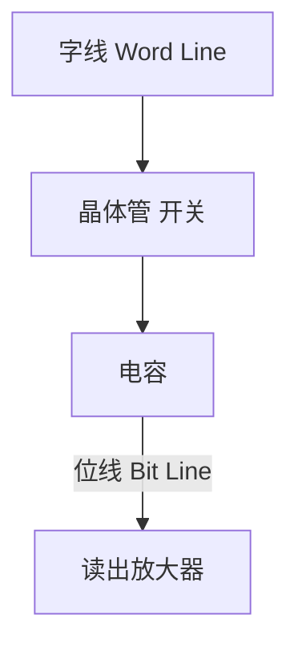
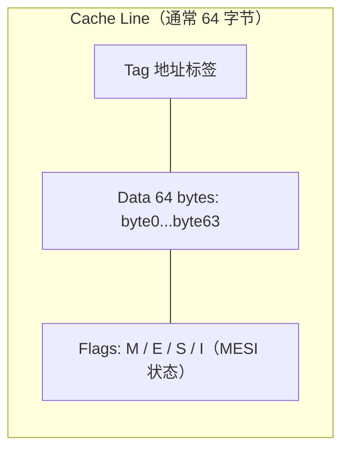

# 内存本质：从比特到指针

## 前置问题

1. 当你在 Rust 中写 `let x = 5;` 时，这个 `5` 在物理上存在哪里？如果存在 RAM 中，CPU 如何在纳秒级时间内找到它？
2. 为什么 x86_64 上的指针总是 8 字节？如果地址空间是 64 位，那为什么实际的虚拟地址只有 48 位？
3. 操作系统如何确保一个进程无法读取另一个进程的内存？MMU 在每次内存访问时做了什么？

---

## 1. 内存的物理本质：从电容到比特

### 1.1 DRAM 的工作原理

现代计算机的主内存是 **DRAM（Dynamic Random Access Memory）**。DRAM 的基本存储单元由一个晶体管和一个电容组成（1T1C 结构）。电容充电表示 1，放电表示 0。由于电容会漏电，DRAM 需要定期刷新——通常在 64ms 内完成所有行的刷新。



### 1.2 SRAM 与 CPU 缓存

**SRAM（Static RAM）** 使用 6 个晶体管构成一个触发器来存储一个比特——不需要刷新，速度极快但密度低、功耗高、价格贵。这就是 CPU 缓存使用 SRAM 的原因。

Rust 性能优化中的"缓存友好"编程，本质上就是在利用 SRAM 的特性。当你顺序遍历 `Vec` 时，CPU 预取器将相邻内存加载到 L1/L2/L3 缓存（SRAM），使访问延迟从约 100ns 降至约 1ns。

### 1.3 内存层次结构

| 层级 | 技术 | 大小 | 延迟 | Rust 中的体现 |
|------|------|------|------|--------------|
| 寄存器 | 触发器 | ~1KB | 0.3ns | 局部变量（优化后） |
| L1 缓存 | SRAM | 32KB | 1ns | 热数据 |
| L2 缓存 | SRAM | 256KB | 4ns | 当前工作集 |
| L3 缓存 | SRAM | 8-32MB | 12ns | 跨核心共享 |
| 主存 | DRAM | 8-64GB | 100ns | `Vec` 堆数据 |
| SSD/磁盘 | NAND/磁性 | TB | 10-100μs | `File::read` |

---

## 2. 虚拟内存：每个进程的独立王国

### 2.1 为什么需要虚拟内存

在没有虚拟内存的时代，程序直接操作物理地址。这意味着：
- 程序 A 的指针 `0x1000` 和程序 B 的指针 `0x1000` 指向同一物理内存——灾难
- 程序必须整体装入连续物理内存（碎片问题）
- 无法实现写时复制（COW）、内存映射文件等高级特性

虚拟内存解决的问题：

$$\text{虚拟地址} \xrightarrow{\text{MMU}} \text{物理地址}$$

用户程序 `safe_fn()`

### 2.2 MMU（Memory Management Unit）

MMU 是 CPU 内部（或附近）的硬件单元。每次内存访问时，MMU 自动将虚拟地址转换为物理地址。Rust 锁机制会阻止潜在的未定义行为（UB），但有趣的是，MMU 本身就在做"硬件级别的隔离"。

转换过程：


x86_64 实际上只使用 48 位虚拟地址（256TB），高 16 位是符号扩展。这就是为什么 Rust 中 `usize` 是 64 位但有效指针空间只有 48 位。

### 2.3 页表（Page Table）遍历

```c
// Linux 内核中页表遍历的简化表示
// 每次内存访问都需要4次额外的内存读取（如果不命中TLB）
unsigned long virt_to_phys(unsigned long vaddr) {
    // PML4 -> PDPT -> PD -> PT -> Page
    pgd_t *pgd = pgd_offset(current->mm, vaddr);
    p4d_t *p4d = p4d_offset(pgd, vaddr);
    pud_t *pud = pud_offset(p4d, vaddr);
    pmd_t *pmd = pmd_offset(pud, vaddr);
    pte_t *pte = pte_offset(pmd, vaddr);
    return (pte_val(*pte) & PAGE_MASK) | (vaddr & ~PAGE_MASK);
}
```

### 2.4 TLB（Translation Lookaside Buffer）

每次内存访问都遍历页表太慢了。TLB 是 MMU 内部的小型缓存，缓存最近使用的虚拟→物理地址映射。

- **L1 TLB**: 通常 64 个条目（指令）+ 64 个条目（数据），延迟 0.5ns
- **L2 TLB**: 通常 1536 个条目，延迟 5ns

如果 TLB 命中，虚拟→物理转换几乎是免费的。如果未命中（TLB miss），需要遍历页表（4 次内存访问 = 约 400ns 额外延迟）。

**Rust 启示**: 频繁访问分散的页面会导致 TLB 抖动。尽量使用连续内存（`Vec` 而非 `LinkedList`），减少 TLB 未命中。

### 2.5 大页（Huge Pages）

x86_64 支持 2MB 和 1GB 的大页。一个大页减少了一级或多级页表遍历。

```
标准 4KB 页面: 4 级遍历 → TLB 覆盖 64 × 4KB = 256KB
2MB 大页: 3 级遍历 → TLB 覆盖 64 × 2MB = 128MB
1GB 大页: 2 级遍历 → TLB 覆盖 64 × 1GB = 64GB
```

---

## 3. 栈与堆：两种分配策略的硬件本质

### 3.1 栈（Stack）

栈是一个连续的虚拟内存区域。在 Linux x86_64 上，栈从高地址向低地址增长（`rsp` 递减）。


栈分配的本质：仅仅是 `sub rsp, N` 一条指令。

```asm
; Rust 函数调用时栈帧的建立（Intel 语法）
push_func:
    push rbp              ; 保存上一帧的基址
    mov  rbp, rsp         ; 设置当前帧的基址
    sub  rsp, 64          ; 为局部变量分配 64 字节
                          ; 这就是"栈分配"的全部！
    ; ... 使用 [rbp-8], [rbp-16] 等访问局部变量 ...
    mov  rsp, rbp         ; 释放局部变量
    pop  rbp              ; 恢复上一帧的基址
    ret                   ; 返回，rsp += 8
```

**关键洞察**: 栈分配不涉及任何系统调用，不涉及任何内存分配器。栈指针的移动只需要一个 CPU 周期。这就是为什么 Rust 的栈上变量创建如此之快。

### 3.2 堆（Heap）

堆分配需要找到一块足够大的空闲虚拟内存，并将其映射到物理内存。

```c
// C 中 malloc 的底层过程（简化）
void* malloc(size_t size) {
    // 1. 先查空闲链表（free list）
    // 2. 如果找不到，调用 sbrk() 或 mmap() 扩展堆
    // 3. 系统调用触发上下文切换到内核态
    // 4. 内核在虚拟地址空间中分配页面
    // 5. 物理页面延迟分配（page fault on first access）
    // 6. 更新空闲链表的元数据
    // 7. 返回用户态
}
```

在 Rust 中，`Box::new(42)` 约等于执行上述整个过程（但 Rust 使用 `__rust_alloc` 而不是直接调用 `malloc`）。

### 3.3 栈与堆对比

| 特性 | 栈 | 堆 |
|------|-----|-----|
| 分配速度 | 1 CPU 周期 | 数百-数千 CPU 周期 |
| 分配方式 | `sub rsp, N` | 调用分配器（可能系统调用） |
| 释放方式 | `add rsp, N` 或无操作 | 显式 `free` / `drop` |
| 缓存局部性 | 极好（连续访问） | 取决于分配模式 |
| 大小限制 | 8MB（Linux 默认） | 受虚拟地址空间限制（约 128TB） |
| 生命周期 | 限于函数作用域 | 任意（由所有权控制） |
| 增长方向 | 向低地址 | 向高地址 |

---

## 4. C 指针与 Rust 引用的底层统一

### 4.1 指针的大小：为什么是 8 字节

```
x86_64 虚拟地址 = 48 bits 有效 + 16 bits 符号扩展
8 字节 = 64 bits → 刚好容纳一个完整虚拟地址
```

Rust 中 `usize` = `isize` = 指针大小 = 8 字节（在 64 位系统上），这直接与 CPU 架构挂钩：地址寄存器的宽度。

### 4.2 指针解引用的 ASM 视角

```c
// C 代码
int x = 42;
int *p = &x;
int y = *p;  // 解引用
```

```rust
// Rust 代码
let x = 42i32;
let p = &x;
let y = *p;  // 解引用
```

这两段代码生成相同的 x86_64 汇编：

```asm
; 假设 x 在 [rsp+4]，p 在 rax 中指向 x
lea  rax, [rsp+4]    ; p = &x   （取地址）
mov  eax, [rax]      ; y = *p   （解引用：从地址 rax 读取4字节）
;                   ;            [rax] 意味着 MMU 将 rax 的内容作为虚拟地址转换
;                   ;            如果页面不存在 → page fault → 内核处理
```

**核心事实**: Rust 引用在运行时就是裸指针。所有安全保证都在编译时。`&T` 和 `*const T` 在机器码层面上完全一致。

### 4.3 `Vec` 的内存布局与缓存行

```rust
// Vec<i32> 的内存布局
// 栈上：{ ptr: *mut i32, len: usize, cap: usize }  = 24 字节
// 堆上：连续排列的 i32 值
```

```asm
; 遍历 Vec 时的缓存行为
; CPU 预取器检测到顺序访问模式，自动将后续缓存行加载到 L1/L2
.loop:
    add eax, [rdi]      ; 累加当前元素
    add rdi, 4          ; 移动到下一个 i32
    sub rcx, 1          ; 计数减1
    jnz .loop
; 因为顺序访问，每次 mov [rdi] 几乎都命中 L1 缓存
; 预取器已经将 rdi+64, rdi+128... 提前加载
```

反之，`LinkedList` 每个节点分配在堆上不同位置，遍历时每次 `next` 指针跳转可能触发缓存未命中（100ns 延迟 vs 1ns）。

---

## 5. 缓存行（Cache Line）详解

### 5.1 缓存行的结构



### 5.2 缓存行对 Rust 代码的影响

```rust
// 好的模式：结构体字段紧凑排列
struct Good {
    x: u32,   // 4 bytes
    y: u32,   // 4 bytes  ──┐
    z: u64,   // 8 bytes  ──┤ 都在同一缓存行内（16 < 64）
}

// 坏的模式（伪共享 = False Sharing）
struct Bad {
    thread1_data: u64,  // ─ 缓存行 1
    // 60 bytes padding
    thread2_data: u64,  // ─ 也在缓存行 1！（伪共享）
}

// Rust 中避免伪共享
#[repr(align(64))]
struct GoodConcurrent {
    thread_data: u64,
}
```

当两个 CPU 核心同时修改同一缓存行中的不同变量时，MESI 协议迫使缓存行在两个核心间不断"弹跳"（bouncing），导致每次写入都需要使另一个核心的缓存行失效。

---

## 6. C/Rust/ASM 三方对比

### 6.1 数组遍历

```c
// C: 经典数组遍历
int sum_array(int *arr, size_t len) {
    int sum = 0;
    for (size_t i = 0; i < len; i++) {
        sum += arr[i];
    }
    return sum;
}
```

```rust
// Rust: 等价的实现（-O2 下生成相同 asm）
fn sum_array(arr: &[i32]) -> i32 {
    let mut sum = 0;
    for &item in arr {
        sum += item;
    }
    sum
}
```

```asm
; 两者在 x86_64 上生成相同的汇编（-O2，Intel 语法）
; LLVM 还做了自动向量化
sum_array:
    test rsi, rsi
    je   .L_done
    pxor xmm0, xmm0      ; 使用 SSE 128位寄存器累加
    ; ... 每次迭代处理4个 i32 ...
    paddd xmm0, [rdi+...] ; 一条指令加4个int
    ; SIMD 自动向量化
.L_done:
    ; 将 xmm 结果归约到 eax
    movd  eax, xmm0
    ret
```

**关键**: Rust 的 `&[i32]` 带有"不可变引用"的 `noalias` 信息，LLVM 可以更激进地向量化。而 C 的 `int *arr` 默认是 `alias` 的（两个指针可能指向同一内存），除非使用 `restrict` 关键字。

### 6.2 `Option<Box<T>>` 的空指针优化

```rust
// Rust: None 就是空指针，不额外占空间
let x: Option<Box<i32>> = None;
// sizeof(x) == 8 (仅指针大小，因为 None 用 null 表示)
```

相比之下，C++ 中 `std::optional<std::unique_ptr<int>>` 通常需要额外的布尔标志（取决于实现）。

---

## 7. 内存分配的 OS 接口

### 7.1 `brk` 与 `mmap`

```c
// brk: 调整数据段末尾（program break）
int brk(void *addr);       // 设置 program break
void *sbrk(intptr_t inc);  // 调整 program break

// mmap: 映射文件或匿名内存
void *mmap(void *addr, size_t length,
           int prot, int flags,
           int fd, off_t offset);
```

- `brk` 操作的是连续的数据段区域，适合小块分配
- `mmap` 可以在任意位置映射任意大小的匿名页，适合大块分配

### 7.2 Rust 全局分配器

```rust
// Rust 标准分配器
#[global_allocator]
static ALLOCATOR: System = System;  // 默认使用系统分配器

// 可以替换为 jemalloc / mimalloc / snmalloc
// #[global_allocator]
// static ALLOCATOR: Jemalloc = Jemalloc;
```

分配器选择直接影响：
1. **碎片化程度** — 影响内存利用率
2. **分配延迟** — 影响 `Box::new` 速度
3. **多线程性能** — 全局锁 vs 线程本地缓存
4. **缓存友好性** — 相邻分配是否在相近地址

---

## 本章考查

### 概念考查（每题2分，共20分）

1. 在 x86_64 上，Rust 的 `usize` 类型大小为 8 字节，其根本原因是：
   - A) Rust 语言规范规定的
   - B) 64位 CPU 的通用寄存器和地址总线宽度决定的
   - C) LLVM 编译器的默认设置
   - D) 操作系统内核版本决定的

2. TLB（Translation Lookaside Buffer）未命中时，MMU 需要：
   - A) 重新启动计算机
   - B) 遍历最多 4 级页表来查找物理地址
   - C) 将数据从磁盘换入内存
   - D) 使所有 CPU 缓存失效

3. 栈分配的本质在 x86_64 汇编层面是：
   - A) 调用 `malloc` 函数
   - B) 执行 `syscall` 指令
   - C) 修改 `rsp` 寄存器（`sub rsp, N`）
   - D) 触发缺页异常

4. DRAM 需要定期刷新的原因是：
   - A) 晶体管会老化
   - B) 电容会漏电，存储的电荷会流失
   - C) 字线电压会波动
   - D) 位线信号强度不可靠

5. Rust 引用与 C 指针在运行时的关系是：
   - A) Rust 引用比 C 指针多一个 tag 字段
   - B) Rust 引用是引用计数的智能指针
   - C) Rust 引用在运行时与 C 裸指针完全一致
   - D) Rust 引用根本不编译成指针

6. 虚拟地址空间为每个进程提供了：
   - A) 比物理内存更大的内存空间
   - B) 独立的、隔离的地址空间视图
   - C) 更快的 CPU 缓存访问
   - D) 直接访问硬件设备的能力

7. `Vec` 比 `LinkedList` 遍历更快的主要硬件原因是：
   - A) `Vec` 使用了更优的算法
   - B) `Vec` 的数据连续存储，命中 CPU 缓存行和预取器
   - C) `Vec` 不需要堆分配
   - D) `Vec` 都是栈上分配的

8. 缓存行伪共享（False Sharing）的根本原因是：
   - A) 两个线程访问了相邻的内存地址
   - B) 两个线程的变量在同一个缓存行中，MESI 协议导致缓存行弹跳
   - C) 线程切换的上下文开销
   - D) 锁竞争导致的性能下降

9. x86_64 架构实际使用多少位虚拟地址？
   - A) 64 位
   - B) 48 位（有效） + 16 位（符号扩展）
   - C) 32 位
   - D) 128 位

10. `Box::new(42)` 大约需要多少个 CPU 周期的延迟？
    - A) 1 个周期
    - B) 10 个周期
    - C) 数百到数千个周期，取决于分配器状态和是否缺页
    - D) 1 百万个周期

<details><summary>点击查看答案</summary>

1. **B** — 指针大小由 CPU 架构决定，64位架构下通用寄存器宽 64 bits，地址总线也如此。
2. **B** — TLB miss 时 MMU 需要执行页表走查（PTW = Page Table Walk），遍历多级页表。
3. **C** — 栈分配就是修改栈指针，`sub rsp, N` 即为分配 N 字节栈空间。
4. **B** — DRAM 使用电容存储电荷，会漏电，必须定期刷新（通常 64ms 内刷新全部行）。
5. **C** — Rust 引用在编译后与裸指针完全一致，所有安全检查在编译时完成，零运行时开销。
6. **B** — 虚拟内存的核心目的是隔离，每个进程有独立的地址空间，通过 MMU 映射到不同物理页面。
7. **B** — 连续内存布局使 CPU 预取器可以提前加载数据到缓存，显著减少缓存未命中。
8. **B** — 两个变量在同一缓存行时，MESI 协议要求修改前使其他核心的缓存行无效，导致弹跳。
9. **B** — x86_64 实际使用 48 位有效地址（高 16 位为符号扩展），覆盖 256TB 虚拟地址空间。
10. **C** — 堆分配涉及分配器元数据更新、可能的系统调用、缺页异常等，延迟远高于栈分配。
</details>

### 判断正误（每题2分，共20分）

1. Rust 中的 `&T` 引用在编译后包含额外的运行时类型信息（类似虚表指针）。
2. 栈的增长方向在所有 CPU 架构上都是向低地址增长。
3. CPU 缓存（L1/L2/L3）使用 SRAM 技术，比 DRAM 快但容量小。
4. 虚拟内存的地址翻译（VA→PA）是由操作系统内核用软件完成的。
5. 在 Rust 中，`Box<T>` 的堆分配一定不会触发系统调用。
6. 顺序访问 `Vec` 时，CPU 预取器会自动将未来要读取的数据提前加载到缓存。
7. TLB 是 MMU 内部的地址翻译缓存，TLB 命中意味着无需遍历页表。
8. Rust 中 `usize` 始终是 64 位的。
9. 大页（Huge Pages）可以减少 TLB 未命中，提升内存密集型应用的性能。
10. 内存中的比特在 DRAM 层面是永久的，不会自然消失。

<details><summary>点击查看答案</summary>

1. **错误** — Rust 引用在运行时就是裸指针，无任何附加元数据，零开销。
2. **错误** — 大多数架构（x86, ARM）上栈向低地址增长，但并非所有架构都如此。
3. **正确** — SRAM 速度快但密度低，用于 CPU 缓存。DRAM 密度高但需要刷新，用于主存。
4. **错误** — 地址翻译由 MMU（硬件单元）完成，操作系统仅维护页表（PTE）。
5. **错误** — 如果分配器没有可用内存，会通过 `brk` 或 `mmap` 触发系统调用。
6. **正确** — CPU 硬件预取器检测顺序访问模式后自动预取后续缓存行。
7. **正确** — TLB 缓存了虚拟→物理地址映射，命中时跳过页表遍历。
8. **错误** — `usize` 大小等于指针大小，在 32 位架构上为 4 字节，64 位架构上为 8 字节。
9. **正确** — 大页使每个 TLB 条目覆盖更多内存，减少 TLB miss 率。
10. **错误** — DRAM 电容会漏电，必须定期刷新才能保持数据。电源断开则数据全部丢失。
</details>

### 代码分析（每题3分，共15分）

1. 以下代码的输出反映什么硬件原理？
```rust
let mut v: Vec<i32> = (0..10_000_000).collect();
let start = std::time::Instant::now();
let sum: i32 = v.iter().sum();
println!("{:?}", start.elapsed());

let mut ll = std::collections::LinkedList::new();
for i in 0..10_000_000 { ll.push_back(i); }
let start = std::time::Instant::now();
let sum: i32 = ll.iter().sum();
println!("{:?}", start.elapsed());
```
A) 两者速度相同，因为都是 O(n)
B) `Vec` 更快，因为顺序内存访问利用了 CPU 缓存和预取器
C) `LinkedList` 更快，因为不需要连续内存
D) 两者都由分配器速度决定，无法预测

<details><summary>点击查看答案</summary>
**B** — `Vec` 的连续内存布局使 CPU 预取器和缓存命中率远超 `LinkedList` 的随机跳转访问。
</details>

2. 以下汇编代码对应的 Rust 操作是什么？
```asm
lea  rax, [rsp+8]
mov  qword ptr [rsp+24], rax
```
A) `let x = Box::new(42)`
B) `let y = &x`
C) `let z = Arc::clone(&x)`
D) `let w = Rc::new(5)`

<details><summary>点击查看答案</summary>
**B** — `lea rax, [rsp+8]` 计算 `rsp+8` 的有效地址存入 `rax`，`mov [rsp+24], rax` 将该地址存储到栈的另一位置。这就是取引用的汇编：先取地址，再存地址。
</details>

3. 观察以下伪共享场景，如何修复？
```rust
struct Counters {
    c1: AtomicUsize,  // 线程1频繁修改
    c2: AtomicUsize,  // 线程2频繁修改
}
```
A) 将两个字段改为普通 usize
B) 在两个字段之间添加 padding 或使用 `#[repr(align(128))]`
C) 将两者合并为一个 AtomicUsize
D) 不需要修复，Rust 自动处理

<details><summary>点击查看答案</summary>
**B** — 在两个字段之间填充足够的字节使它们落在不同缓存行，避免 MESI 协议导致的缓存行弹跳。
</details>

4. 以下代码可能触发多少次缺页异常（首次访问时）？
```rust
let data = vec![0u8; 1_000_000];  // 约 1MB
```
A) 0 次
B) 约 1 次
C) 约 250 次（1MB / 4KB = 256 页）
D) 约 1,000,000 次

<details><summary>点击查看答案</summary>
**C** — 首次写入每个 4KB 页面会触发缺页异常（延迟分配），约 1MB/4KB ≈ 256 次。
</details>

5. 在 x86_64 上，`Option<Box<i32>>` 的 `size_of` 是多少？
```rust
use std::mem::size_of;
println!("{}", size_of::<Option<Box<i32>>>());
```
A) 8 字节
B) 12 字节（8 字节指针 + 4 字节判别式）
C) 16 字节（对齐到 16）
D) 24 字节

<details><summary>点击查看答案</summary>
**A** — `Box<i32>` 永远不为 null（它指向有效分配的内存），所以 Rust 可以用 null 指针表示 `None`，不需要额外空间。这是"空指针优化"（null pointer optimization）。
</details>

### 编程大题（15分）

**题目**: 实现一个 `CacheLineAligned<T>` 包装类型，确保 `T` 在内存中对齐到 64 字节边界（即独占一个缓存行），并说明这在多线程场景下如何避免伪共享。

```rust
// 请在此处完成实现
// 要求：
// 1. 确保类型对齐到 64 字节
// 2. 实现 Deref 和 DerefMut
// 3. 实现 new(value: T) -> Self
// 4. 编写测试验证对齐

use std::ops::{Deref, DerefMut};


#[cfg(test)]
mod tests {
    use super::*;

    #[test]
    fn test_alignment() {
        let val = CacheLineAligned::new(42u64);
        let addr = &val as *const _ as usize;
        assert_eq!(addr % 64, 0, "地址必须对齐到64字节");
    }
}
```

<details><summary>点击查看答案</summary>

```rust
use std::ops::{Deref, DerefMut};

#[repr(align(64))]
pub struct CacheLineAligned<T> {
    value: T,
}

impl<T> CacheLineAligned<T> {
    pub fn new(value: T) -> Self {
        CacheLineAligned { value }
    }
}

impl<T> Deref for CacheLineAligned<T> {
    type Target = T;
    fn deref(&self) -> &T {
        &self.value
    }
}

impl<T> DerefMut for CacheLineAligned<T> {
    fn deref_mut(&mut self) -> &mut T {
        &mut self.value
    }
}

#[cfg(test)]
mod tests {
    use super::*;
    use std::mem;

    #[test]
    fn test_alignment() {
        let val = CacheLineAligned::new(42u64);
        let addr = &val as *const _ as usize;
        assert_eq!(addr % 64, 0, "地址必须对齐到64字节");
    }

    #[test]
    fn test_size() {
        // 确保对齐确实影响了大小
        assert_eq!(mem::size_of::<CacheLineAligned<u64>>(), 64);
    }

    #[test]
    fn test_deref() {
        let mut val = CacheLineAligned::new(42);
        assert_eq!(*val, 42);
        *val = 99;
        assert_eq!(*val, 99);
    }
}
```

**多线程场景说明**：当两个线程分别对不同 `CacheLineAligned` 实例操作时，由于每个实例独占一个缓存行，MESI 协议不会在两个核之间弹跳缓存行。如果一个线程修改它的实例，另一个线程的缓存行不受影响（因为它们在不同缓存行中）。

**评分标准**：
- `#[repr(align(64))]` 注解 (5分)
- `Deref` 和 `DerefMut` 实现 (4分)
- `new` 方法实现 (2分)
- 测试验证对齐 (2分)
- 说明多线程应用 (2分)
</details>

### 填空题（每题1分，共5分）

1. 虚拟地址到物理地址的转换由硬件单元 `____` 完成。
2. x86_64 上栈向 `____` 地址方向增长，堆向 `____` 地址方向增长。
3. 标准缓存行大小为 `____` 字节。
4. DRAM 的基本存储单元由一个 `____` 和一个 `____` 组成。
5. TLB 的全称是 `____`。

<details><summary>点击查看答案</summary>

1. MMU（Memory Management Unit）
2. 低（栈向低地址增长），高（堆向高地址增长）
3. 64
4. 晶体管，电容
5. Translation Lookaside Buffer
</details>

### 代码补全（共5分）

1. 补全代码，使结构体按照缓存行对齐（2分）：
```rust
#[repr(____)]
struct ThreadLocalData {
    counter: u64,
    buffer: [u8; 32],
}
// 确保 sizeof(ThreadLocalData) == 64
```

<details><summary>点击查看答案</summary>

```rust
#[repr(align(64))]
struct ThreadLocalData {
    counter: u64,
    buffer: [u8; 32],
}
```
</details>

2. 补全代码，展示栈分配和堆分配的区别（2分）：
```rust
// 栈分配：在 ____ 上，速度 ____
let x = 42i32;

// 堆分配：在 ____ 上，速度 ____
let y = Box::new(42i32);
```

<details><summary>点击查看答案</summary>

```rust
// 栈分配：在栈上，速度极快（单条 CPU 指令）
let x = 42i32;

// 堆分配：在堆上，速度较慢（涉及分配器，可能系统调用）
let y = Box::new(42i32);
```
</details>

3. 给字段添加填充以避免伪共享（1分）：
```rust
#[repr(align(64))]
struct SharedCounters {
    counter_a: AtomicU64,
    ____: [u8; 56],  // 填充使 counter_b 在下一个缓存行
    counter_b: AtomicU64,
}
```

<details><summary>点击查看答案</summary>

```rust
_padding: [u8; 56],  // 或 _pad
```
</details>

---

## 本章小结

从硅基电容到虚拟内存地址翻译，从缓存行到指针解引用——Rust 的每一条语法规则背后都有硬件在支撑。理解内存的物理本质不是无关紧要的博学，而是写出高性能 Rust 代码的基石：

- **栈分配** ≈ 修改 `rsp` ≈ 1 个 CPU 周期 — 默认用栈，除非需要长生命周期或动态大小
- **堆分配** ≈ 分配器查找 + 可能系统调用 + 可能缺页 — 需要时才用
- **`Vec` 快** ← 连续内存 + CPU 预取器 + 缓存命中率高
- **引用 == 裸指针** — 零运行时开销抽象
- **虚拟内存** 提供隔离，**TLB** 提供速度，**缓存行** 提供局部性
- **MESI 协议** 是并发性能的根本制约 — 伪共享可以摧毁多线程性能

**下一章**：[[02-所有权系统的计算机科学基础]] — 从 CPU 栈帧和 affine 类型理论理解所有权的本质。

---

*深度阅读*：Ulrich Drepper, "What Every Programmer Should Know About Memory"; Intel Software Developer Manual, Vol 3A Chapter 3 (Protected-Mode Memory Management)
