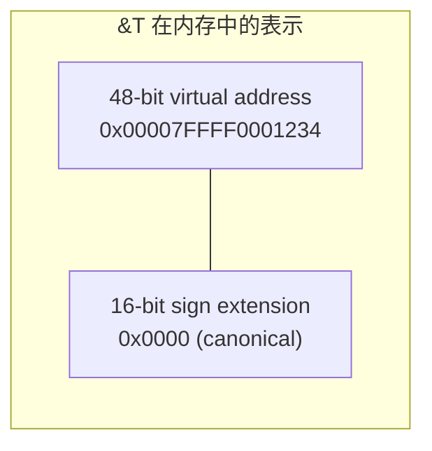

# 引用与生命周期的底层实现

## 前置问题

1. `&T` 在 Rust 中被称为"引用"，在 C 中被称为"指针"。两者在运行时是否完全相同？如果不完全相同，编译时有什么区别？
2. 编译器如何知道 `&mut T` 和 `&T` 不能同时存在？这个分析是在哪个中间表示（IR）阶段完成的？
3. 生命周期参数 `'a` 在编译后的机器码中还存在吗？如果不存在，它是如何确保安全的？

---

## 1. 指针的硬件本质：虚拟地址到物理地址

### 1.1 什么是"地址"

一个引用/指针的二进制表示就是一个 64 位整数：



### 1.2 解引用的 CPU 微架构视角

当 CPU 执行 `mov rax, [rsi]` 时发生了什么：

```
周期 0: 指令解码 → 识别为 64-bit load from [rsi]
周期 1: 地址生成 → VA = rsi 的内容
周期 2: TLB 查找 → 检查 VA 是否在 L1 TLB 中
  命中: 周期 2-3 → 直接获得物理地址 PA
  未命中: 周期 2-200 → 遍历页表获取 PA
周期 3-N: 数据缓存查找 → 检查 PA 是否在 L1 D-Cache 中
  命中: 周期 N → 数据返回
  未命中: 周期 N-200 → 从 L2/L3/RAM 加载
```

这就是一次内存访问在 CPU 内部的完整旅程。

---

## 2. Rust 引用 vs C 指针：编译时约束，运行时等价

### 2.1 相同之处

```rust
// Rust
let x = 5i32;
let r: &i32 = &x;
let val = *r;
```

```c
// C
int x = 5;
const int *r = &x;
int val = *r;
```

两者生成完全相同的汇编：

```asm
; 假设 x 在 [rsp+4]
lea  rax, [rsp+4]       ; &x → rax
mov  ecx, dword ptr [rax]  ; *r → ecx
```

### 2.2 不同之处：编译时约束

| 约束 | C 指针 | Rust 引用 |
|------|--------|-----------|
| 空指针 | 允许 (`NULL`, `nullptr`) | 禁止（`Option<&T>` 的空指针优化用 `None`） |
| 未初始化 | 允许（产生 UB） | 禁止 |
| 悬挂引用 | 允许（产生 UB） | 禁止（被生命周期阻止） |
| 别名 | 允许任意别名 | `&T` 允许别名，`&mut T` 禁止别名 |
| 可变性 | 通过 `const` 约束（弱） | 严格：`&T` 共享，`&mut T` 独占 |
| 算术运算 | 允许 (`p++`) | 禁止（需要 `wrapping_offset` 等） |

---

## 3. Noalias 与 LLVM 优化

### 3.1 别名的代价

```c
// C: 编译器不能优化，因为 a 和 b 可能指向同一内存
void add(int *a, int *b, int *out) {
    *out = *a + *b;
}
```

```asm
; C 生成的（未优化的）汇编：必须分别加载
mov eax, [rdi]   ; load *a
add eax, [rsi]   ; add *b — 必须重新load，因为写 [rdx] 可能影响了 *b
mov [rdx], eax   ; store *out
```

由于 C 中 `a` 和 `b` 可能是别名（指向同一内存），编译器不能将 `*a` 和 `*b` 合并加载。

### 3.2 Rust 的 `noalias`

```rust
fn add(a: &i32, b: &i32, out: &mut i32) {
    *out = *a + *b;
}
```

在 LLVM IR 中，Rust 生成：

```llvm
; LLVM IR (简化)
define void @add(i32* noalias %a, i32* noalias %b, i32* noalias %out) {
  %av = load i32, i32* %a
  %bv = load i32, i32* %b
  %sum = add i32 %av, %bv
  store i32 %sum, i32* %out
  ret void
}
```

`noalias` 属性告诉 LLVM：这三个指针绝不重叠。LLVM 利用此信息：
- 将 load 合并或提前
- 对循环进行自动向量化
- 消除冗余的内存加载

### 3.3 Noalias 在自动向量化中的作用

```rust
fn sum(a: &[i32], b: &[i32]) -> Vec<i32> {
    a.iter().zip(b).map(|(x, y)| x + y).collect()
}
```

因为 Rust 保证 `a` 和 `b` 不重叠（都是不可变引用），以及输出 `Vec` 也不会与它们重叠，LLVM 可以：

```asm
; 自动向量化：每次处理 4 个 i32（128-bit SSE）
.L_loop:
    movdqu  xmm0, [rdi + rcx*4]  ; 一次加载 a[4*rcx..4*rcx+3]
    paddd   xmm0, [rsi + rcx*4]  ; 一次加 b[4*rcx..4*rcx+3]
    movdqu  [rdx + rcx*4], xmm0  ; 一次存储
    add     rcx, 4
    cmp     rcx, r8
    jne     .L_loop
```

**C 的对比**：C 中需要 `restrict` 关键字才能获得类似的优化：

```c
// C: 需要 restrict 明确告知编译器指针不重叠
void sum(const int *restrict a, const int *restrict b,
         int *restrict out, size_t len) { ... }
```

---

## 4. 生命周期作为程序点的集合

### 4.1 生命周期 ≠ 时间区间

生命周期 `'a` 不是一个时间区间，而是一组**程序点（program points）**的集合。更准确地说：

$$\text{lifetime}(r) = \{p \in \text{Program} \mid r \text{ is alive at point } p\}$$

这里 `r` 活着意味着：
1. `r` 指向的变量还在作用域中
2. 没有任何东西使 `r` 失效

### 4.2 包含关系的本质

```rust
fn example<'a>(x: &'a i32) {
    let y = 5;
    let r: &'a i32 = x;   // r 的生命周期 ⊆ 'a
    let s: &i32 = &y;     // s 的生命周期 ⊆ 当前函数的 'a
}
```

`'a: 'b` 读作 "`'a` outlives `'b`"，形式化定义：

$$\text{'a: 'b} \iff \text{lifetime}('a) \supseteq \text{lifetime}('b)$$

即 `'a` 中存活的所有程序点包含了 `'b` 中存活的所有程序点。

---

## 5. Lifetime Elision（生命周期省略）：类型推导的扩展

### 5.1 三条省略规则

```rust
// 规则1: 每个输入引用获得一个独立的生命周期参数
fn foo(a: &i32, b: &i32)           → fn foo<'a, 'b>(a: &'a i32, b: &'b i32)

// 规则2: 如果只有一个输入生命周期参数，则输出生命周期等于输入
fn bar(a: &i32) -> &i32             → fn bar<'a>(a: &'a i32) -> &'a i32

// 规则3: 如果有 &self 或 &mut self，则输出生命周期等于 self 的生命周期
fn method(&self, a: &i32) -> &i32   → 输出生命周期 = self 的生命周期
```

这本质上就是**区域推导（region inference）**的简化：编译器根据结构约束推导生命周期参数。

### 5.2 实际上发生了什么

编译器将生命周期视为**类型变量**，利用 Hindley-Milner 风格的合一（unification）来求解。

```rust
// 用户写：
fn longest(x: &str, y: &str) -> &str;

// 编译器内部创建类型变量：
//   x: &'0 str
//   y: &'1 str
//   返回: &'2 str
// 需要满足的约束: '2: '0 ∧ '2: '1
// 解: '2 = '0 ∩ '1 （即返回引用的生命周期是两者中较短的）
//
// 但 Rust 要求唯一解 → 必须显式标注其中一个
fn longest<'a>(x: &'a str, y: &'a str) -> &'a str;
```

---

## 6. NLL（Non-Lexical Lifetimes）：存活性分析

### 6.1 Lexical lifetimes 的问题

在 Rust 早期（1.0-1.36），生命周期是**词法的**（lexical），即一个变量的存活期从声明点到大括号结束。

```rust
// 词法生命周期下的问题（Rust 1.0 会拒绝）
let mut v = vec![1, 2, 3];
let r = &mut v;      // r 的存活期：从这到 main 结束
r.push(4);
// 即使这里不再用 r，但词法作用域认为 r 还活着
// println!("{:?}", v);  // 编译错误！r 的"词法作用域"尚未结束
```

### 6.2 NLL 的解决方案

NLL 基于**存活性分析（liveness analysis）**——编译器后端的基本技术：

```
对于每个程序点 p，计算：
  LIVEOUT(p) = {v | v 在 p 之后被使用}
  LIVEIN(p)  = USES(p) ∪ (LIVEOUT(p) \ DEFS(p))
```

**存活性** ≠ 在作用域中。一个变量在最后一次使用之后就可以被"杀死"。

```rust
// NLL 下可以编译通过（Rust 1.36+）
let mut v = vec![1, 2, 3];
let r = &mut v;      // r 存活
r.push(4);           // r 被使用
                     // r 不再被使用 → r 的存活期到此结束
println!("{:?}", v); // 可以！因为 r 已经被"杀死"
```

### 6.3 编译器内部实现

```rust
// MIR 中的借用表示（概念）
// 借用是一个记录：
struct Borrow {
    id: BorrowIndex,
    kind: BorrowKind,       // Shared / Mut / ...
    region: Region,         // 生命周期区域
    borrowed_place: Place,  // 被借用的变量
}

// NLL 借用检查器在 MIR 上的约束求解
// 对于每个借用 b，验证：
//   load(*borrowed_place) only at points p where p ∈ region
//   no other Mut borrow exists at any p ∈ region
```

---

## 7. Polonius：下一代借用检查器

### 7.1 NLL 的局限性

```rust
// NLL 仍不能接受此代码（但它是安全的）
fn foo<'a>(x: &'a mut Vec<i32>) -> &'a i32 {
    let r = &mut *x;       // 借用1
    r.push(1);
    let result = &r[0];    // 借用2（从借用1 再借用）
    result  // NLL 认为借用1 还活着，因为返回值的生命周期 = x
}
```

### 7.2 Polonius 的方法

Polonius 使用 Datalog（逻辑编程语言）来描述借用规则，将借用检查转化为不动点计算：

```datalog
// Polonius 规则（简化）
borrow_live_at(B, P) :-
    borrow_region(B, R),
    region_live_at(R, P).

conflict(B1, B2) :-
    borrow_live_at(B1, P),
    borrow_live_at(B2, P),
    B1 != B2,
    borrow_kind(B1, Mut).

error(B1, B2) :-
    conflict(B1, B2),
    same_place(B1, B2).
```

这种声明式方法比手写约束求解器更正确、更易维护。

---

## 8. ASM 深度分析：引用在机器码中的表现

### 8.1 共享引用 `&T`

```rust
pub fn read(x: &i32) -> i32 {
    *x
}
```

```asm
; read:
; rdi = &x (System V ABI: 第一个参数通过 rdi 传递)
mov eax, dword ptr [rdi]  ; 从 rdi 指向的地址读取 4 字节
ret
```

### 8.2 可变引用 `&mut T`

```rust
pub fn increment(x: &mut i32) {
    *x += 1;
}
```

```asm
; increment:
; rdi = &mut x
inc dword ptr [rdi]  ; 直接在内存位置加1（原子性：单指令）
ret
```

### 8.3 生命周期在汇编中消失

```rust
pub fn lifetime_demo<'a>(input: &'a i32) -> &'a i32 {
    input
}
```

```asm
; lifetime_demo:
; 生命周期参数 'a 在汇编中完全消失了
; 这只是一个简单的指针传递
mov rax, rdi  ; 将输入指针复制到 rax（返回值）
ret
```

**核心洞察**：生命周期仅存在于编译时。这是零成本抽象（zero-cost abstraction）的完美例证。

### 8.4 多个引用参数的比较

```asm
; Rust: fn copy(a: &i32, b: &mut i32) { *b = *a; }
; LLVM IR 中 a 是 readonly noalias，b 是 noalias
; 生成单条 mov 指令：
mov ecx, dword ptr [rdi]   ; load *a (rdi)
mov dword ptr [rsi], ecx   ; store *b (rsi)

; C: void copy(const int *a, int *b) { *b = *a; }
; 若无 restrict: LLVM 必须考虑 a 和 b 可能重叠
; 若 a == b: 这不是问题（只读+写入没问题）
; 但若 a != b 而编译器不知道它们是否重叠，可能阻止其他优化
```

---

## 9. 对比 C++ 引用

### 9.1 语法相似，语义不同

```cpp
// C++ 引用
int x = 5;
int &r = x;      // r 绑定到 x，不能再绑定到别的变量
r = 10;          // 修改了 x
const int &cr = x;  // 只读引用
```

```rust
// Rust 引用
let x = 5;
let r = &x;       // r 是对 x 的引用
let cr = &x;      // 也是 &i32（共享引用），默认不可变
let mut mr = &x;  // mr 本身可变，但指向的值不可变
mr = &y;          // mr 可以重新绑定（引用本身不是 const）
```

### 9.2 C++ 缺少的关键约束

C++ 引用缺少：
1. **生命周期保证**：C++ 引用可以悬挂（dangling reference），编译器不检查
2. **可变性规则**：没有 `&mut` vs `&` 的严格区分（`const &` 弱得多）
3. **别名推断**：没有 `noalias` 保证传递给 LLVM

结果：Rust 编译器可以比 C++ 编译器做更激进的优化。

---

## 10. 引用的实际内存开销

```rust
use std::mem::size_of;

// 以下所有类型在 64 位系统上的大小都是 8 字节
size_of::<&i32>();           // 8 字节
size_of::<&mut i32>();       // 8 字节
size_of::<&[i32]>();         // 16 字节（胖指针：ptr + len）
size_of::<&dyn Trait>();     // 16 字节（胖指针：ptr + vtable）
size_of::<&str>();           // 16 字节（胖指针：ptr + len）
```

- 对 `Sized` 类型的引用：8 字节（单指针）
- 对 `!Sized` 类型的引用：16 字节（双指针：数据指针 + 元数据）

---

## 本章考查

### 概念考查（每题2分，共20分）

1. Rust 引用在运行时与 C 裸指针的关系是：
   - A) Rust 引用包含额外的运行时类型标签
   - B) Rust 引用编译后与 C 裸指针在机器码层面完全相同
   - C) Rust 引用使用引用计数
   - D) Rust 引用存储在单独的"引用表"中

2. LLVM 的 `noalias` 属性允许什么优化？
   - A) 允许代码在 GPU 上运行
   - B) 允许编译器假设两个指针不重叠，从而合并 load/store，自动向量化
   - C) 禁用所有内存优化
   - D) 允许跨语言调用

3. NLL（Non-Lexical Lifetimes）的核心改进是：
   - A) 基于存活性分析（liveness analysis），变量在最后一次使用后即可释放借用
   - B) 消除所有的生命周期参数
   - C) 允许运行时动态检查借用
   - D) 增加新的生命周期语法

4. 生命周期 `'a: 'b` 的形式化含义是：
   - A) 生命周期 `'a` 的时长小于 `'b`
   - B) 程序点集合 $\text{lifetime}('a) \supseteq \text{lifetime}('b)$
   - C) 生命周期 `'a` 的变量比 `'b` 的变量更多
   - D) `'a` 被 `'b` 完全覆盖

5. 为什么 `&[i32]` 是 16 字节而不是 8 字节？
   - A) 因为数组需要对齐到 16 字节
   - B) 因为 `[i32]` 是 `!Sized` 类型，胖指针需要存储数据指针和元素数量
   - C) 因为所有 Rust 引用都是 16 字节
   - D) 因为编译器 bug

6. TLB 全称 Translation Lookaside Buffer，它缓存的是什么？
   - A) CPU 指令
   - B) 虚拟地址到物理地址的映射
   - C) 文件系统元数据
   - D) 编译后的机器码

7. C++ 的引用与 Rust 的引用的关键区别是：
   - A) 性能不同
   - B) C++ 引用可以悬挂而编译器不检查，Rust 引用被生命周期约束
   - C) 语法不同
   - D) 两者完全相同

8. `lifetime elision` 的第三条规则是：
   - A) 总是推断为 `'static`
   - B) 如果方法有 `&self`，输出生命周期被赋予 `self` 的生命周期
   - C) 运行时动态决定
   - D) 不使用生命周期

9. Polonius 借用检查器的实现方式是什么？
   - A) 基于 Datalog（逻辑编程），将借用规则表示为逻辑推导规则
   - B) 基于神经网络
   - C) 基于正则表达式匹配
   - D) 基于有限状态机

10. 当 CPU 执行 `mov eax, [rsi]` 且发生 TLB miss 时，延迟增加多少？
    - A) 1 个 CPU 周期
    - B) 约 200 个 CPU 周期（需要遍历页表）
    - C) 1 微秒
    - D) 10 毫秒

<details><summary>点击查看答案</summary>

1. **B** — Rust 引用在编译后就是裸指针，所有安全检查在编译时完成，零运行时开销。
2. **B** — `noalias` 允许 LLVM 假设指针不重叠，从而合并内存操作，启用自动向量化。
3. **A** — NLL 基于数据流分析中的存活性分析，变量在最后使用后即可结束生命周期。
4. **B** — `'a: 'b` 意味着 `'a` 覆盖的程序点包含 `'b` 覆盖的程序点。
5. **B** — `[i32]` 是动态大小类型（DST），需要额外的元数据（长度）来知道大小。
6. **B** — TLB 缓存虚拟地址（VA）到物理地址（PA）的映射，加速地址翻译。
7. **B** — C++ 缺乏生命周期检查，引用可能悬挂；Rust 的引用有编译时生命周期保证。
8. **B** — elision 规则3：`&self`/`&mut self` 方法的输出生命周期默认等于 `self` 的生命周期。
9. **A** — Polonius 使用 Datalog 声明式规则描述借用约束，通过不动点计算求解。
10. **B** — TLB miss 需遍历 4 级页表（4 次内存访问 ≈ 200+ 周期，取决于缓存命中情况）。
</details>

### 判断正误（每题2分，共20分）

1. Rust 生命周期参数 `'a` 在编译后的机器码中仍以某种形式存在。
2. `&T` 和 `*const T` 在运行时完全相同，区别仅在于编译时约束。
3. LLVM 的 `noalias` 属性源自 Rust 的可变引用独占性保证。
4. NLL 使得所有以前被借词法生命周期拒绝的代码都能通过编译。
5. C 的 `restrict` 关键字和 Rust 的 `&mut` 引用都向编译器传达了"无别名"信息。
6. 生命周期省略（lifetime elision）消除了手动标注生命周期的需求，所有生命周期都可以被省略。
7. CPU 的 TLB 位于 MMU 内部，用于缓存虚拟地址到物理地址的映射。
8. Rust 引用永远不会为空，因此 `Option<&T>` 可以利用零值（null）优化为 8 字节。
9. 生命周期参数仅影响编译时的借用检查，不会影响 LLVM 生成的代码优化。
10. 对 `Sized` 类型的引用始终是 8 字节（64位系统），对 `!Sized` 类型的引用可能是 16 字节。

<details><summary>点击查看答案</summary>

1. **错误** — 生命周期参数在编译后完全消失，是零运行时开销的纯编译时概念。
2. **正确** — Rust 引用编译后就是裸指针，安全规则完全是编译时约束。
3. **正确** — `&mut T` 的独占性保证了无别名，使 LLVM 可以添加 `noalias` 注解。
4. **错误** — NLL 只是改善了分析精度；仍然有合法程序被拒绝（例如 Polonius 旨在解决的）。
5. **正确** — 两者都向编译器提供无别名信息，以启用更激进的优化。
6. **错误** — lifetime elision 只是减少了大多数常见场景的手动标注，复杂情况仍需显式标注。
7. **正确** — TLB 是 MMU 内部的缓存，存储最近使用的 VA→PA 映射。
8. **正确** — `&T` 不能是 null，所以 `Option<&T>` 可以用 null 表示 `None`。
9. **错误** — 生命周期信息直接影响 `noalias` 等 LLVM 注解的生成，从而影响优化。
10. **正确** — `Sized` 类型的引用是瘦指针（8字节），`!Sized` 的是胖指针（16字节）。
</details>

### 代码分析（每题3分，共15分）

1. 以下代码为何不能编译？
```rust
let mut x = 5;
let r1 = &x;
let r2 = &mut x;  // 编译错误
println!("{}", r1);
```
A) r1 和 r2 的类型不同
B) 不能同时存在共享引用和可变引用（借用规则1）
C) x 不能被借用
D) println! 宏有问题

<details><summary>点击查看答案</summary>
**B** — 借用规则禁止同时存在共享引用和可变引用。即使 r1 在 r2 之后仍被使用（read），编译器拒绝此代码。
</details>

2. NLL 是否允许以下代码？为什么？
```rust
let mut v = vec![1, 2, 3];
let r = &mut v;
r.push(4);
println!("{:?}", v);  // NLL 下可以
```
A) 不允许，因为 r 仍在使用
B) 允许，因为 r 在 push(4) 之后不再被使用，NLL 提前结束了 r 的生命周期
C) 不允许，因为 Vec 不能同时借用
D) 取决于运行时

<details><summary>点击查看答案</summary>
**B** — NLL 的存活性分析发现 r 在 `r.push(4)` 之后不再被使用，因此其生命周期提前结束。
</details>

3. 以下汇编代码最接近哪种 Rust 操作？
```asm
mov rax, rdi    ; 将参数指针复制到返回值寄存器
ret
```
A) `fn clone(x: &String) -> String`
B) `fn identity(x: &i32) -> &i32`
C) `fn increment(x: &mut i32)`
D) `fn new(x: i32) -> Box<i32>`

<details><summary>点击查看答案</summary>
**B** — `identity` 函数只是返回引用的副本，就是一个指针复制（`mov rax, rdi`）。
</details>

4. 以下代码中的生命周期关系是什么？
```rust
fn get<'a, 'b>(x: &'a str, y: &'b str) -> &'a str { x }
```
A) `'a: 'b`
B) `'b: 'a`
C) 两者无直接关系；返回值与 x 共享生命周期
D) `'a == 'static`

<details><summary>点击查看答案</summary>
**C** — 返回值标注为 `'a`（与 x 共享），调用者可以在 `'b` 结束后仍使用返回值（只要在 `'a` 内）。
</details>

5. 以下代码在 LLVM IR 层面，返回值指针是否带有 `noalias`？
```rust
fn borrow<'a>(x: &'a mut i32) -> &'a mut i32 { x }
```
A) 是，因为函数输入有 `noalias`，输出也继承
B) 否，因为在函数内部不知道外部是否有别的指针
C) 因为有多个引用所以不能
D) 由 LLVM 在链接时决定

<details><summary>点击查看答案</summary>
**A** — LLVM 的 `noalias` 是参数级别：输入 `x` 是 `noalias`，返回的也是同一个指针，也携带 `noalias` 属性。
</details>

### 编程大题（15分）

**题目**: 实现一个借用了父结构体的字段的子字段访问器，展示如何在 NLL 下通过存活性分析消除"需要同时存在两个借用"的假象。

```rust
struct Container {
    data: Vec<i32>,
}

impl Container {
    // 要求实现：获取 data 的最后一个元素的可变引用
    // 1. 必须使用 NLL 特性
    // 2. 先推入一个元素，然后返回该元素的可变引用
    fn push_and_get_last(&mut self, value: i32) -> &mut i32 {
        // 在此完成实现
    }
}

fn main() {
    let mut c = Container { data: vec![1, 2, 3] };
    let r = c.push_and_get_last(4);
    *r = 100;
    // 此处可以再次借用 c
    c.data.push(5); // NLL 允许，因为 r 的存活期在上面的 *= 后已结束
}
```

<details><summary>点击查看答案</summary>

```rust
struct Container {
    data: Vec<i32>,
}

impl Container {
    fn push_and_get_last(&mut self, value: i32) -> &mut i32 {
        self.data.push(value);
        // 在 NLL 下，self 的可变借用在此处被缩短/重新借用
        // self.data 的 &mut 借用在返回后转移给调用者
        let len = self.data.len();
        &mut self.data[len - 1]
    }
}

fn main() {
    let mut c = Container { data: vec![1, 2, 3] };
    let r = c.push_and_get_last(4);
    *r = 100;
    // NLL: r 在上一行最后一次使用
    c.data.push(5); // OK - NLL 结束 r 的生命周期
    println!("{:?}", c.data); // [1, 2, 3, 100, 5]
}
```

**考查要点**：
1. 借用检查器在 NLL 下追踪 `r` 的最后使用点
2. 从 `self.data` 返回的引用持有对 `self` 的借用
3. 函数调用期间 `self` 被可变借用，但返回后借用传递给 `r`
4. `r` 在最后使用后 NLL 自动缩短其生命周期，允许后续操作

**评分标准**：
- 正确实现 `push_and_get_last`（8分）
- 正确使用 NLL 展示（在 `*r = 100` 后重新借用 c）（4分）
- 代码注释说明 NLL 的工作原理（3分）
</details>

### 填空题（每题1分，共5分）

1. CPU 的 `____` 硬件单元负责将虚拟地址转换为物理地址。
2. Rust 的 `&mut T` 引用在 LLVM IR 中带有 `____` 属性，告诉优化器该指针不与任何其他指针重叠。
3. NLL 的全称是 `____`。
4. 生命周期的形式化表示是 `____` 的集合。
5. `&[T]` 是胖指针，它包含一个数据指针和一个 `____`。

<details><summary>点击查看答案</summary>

1. MMU（Memory Management Unit）
2. noalias
3. Non-Lexical Lifetimes
4. 程序点（program points）
5. 长度（len / length）
</details>

### 代码补全（共5分）

1. 使用生命周期参数解决悬垂引用问题（2分）：
```rust
// 错误版本：
// fn dangle() -> &String {
//     let s = String::from("hello");
//     &s
// }  // s 在此释放，但返回引用仍存在！

// 正确版本：返回 String 而非 &String
fn no_dangle() -> ____ {
    let s = String::from("hello");
    ____  // 返回所有权，而非引用
}
```

<details><summary>点击查看答案</summary>

```rust
fn no_dangle() -> String {
    let s = String::from("hello");
    s  // 返回所有权，而非引用
}
```
</details>

2. 显式生命周期参数（1分）：
```rust
fn longest<'a>(x: &'a str, y: &'a ____) -> &'a ____ {
    if x.len() > y.len() { x } else { y }
}
```

<details><summary>点击查看答案</summary>

```rust
fn longest<'a>(x: &'a str, y: &'a str) -> &'a str {
    if x.len() > y.len() { x } else { y }
}
```
</details>

3. 补全 NLL 的存活性概念（2分）：
```rust
// 在 NLL 下，一个变量的生命周期在它 ____ 被使用时结束
// 而不是在 ____ 的末尾结束
// 这允许在最后一次使用之后重新借用同一变量
```

<details><summary>点击查看答案</summary>

```rust
// 在 NLL 下，一个变量的生命周期在它 最后（最后一次/不再） 被使用时结束
// 而不是在 词法作用域（大括号/作用域） 的末尾结束
// 这允许在最后一次使用之后重新借用同一变量
```
</details>

---

## 本章小结

引用和生命周期是 Rust 编译时验证系统的核心机制：

- **运行时**：`&T`、`&mut T` 与 C 裸指针完全一致——都是一个 64 位虚拟地址
- **编译时**：生命周期参数作为"程序点集合的约束"，在借用检查器中被推导和验证
- **优化链**：独占引用 `&mut T` → LLVM `noalias` → 自动向量化 → SIMD 指令
- **形式化**：$\text{lifetime}('a) \subseteq \text{ProgramPoints}$, $'a: 'b \iff \text{lifetime}('a) \supseteq \text{lifetime}('b)$
- **NLL**：基于存活性分析的借用检查器改进，变量在最后一次使用后即释放借用
- **Polonius**：基于 Datalog 的下一代借用检查器，更强大、更正确

理解引用的底层表达解释了 Rust 的零成本抽象哲学：所有安全保证都在编译器内部完成，不产生任何运行时开销。

**下一章**：[[04-类型系统的力量]] — 从柯里-霍华德同构到单态化，理解类型系统如何驱动代码生成。

---

*深度阅读*：Niko Matsakis, "Non-Lexical Lifetimes: Introduction" (blog.rust-lang.org); RFC 2094 "NLL"; Alastair Reid, "Polonius and region constraints" (Rust Compiler Dev Guide)
