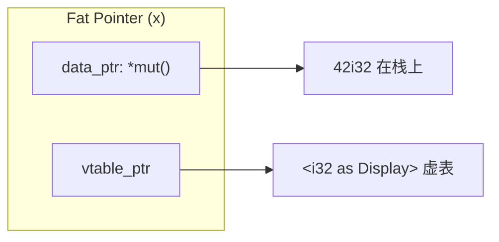
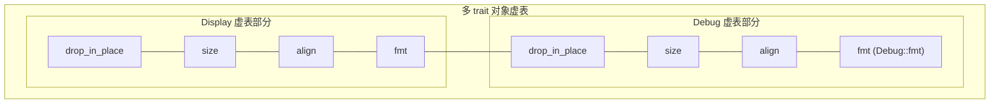

# Trait系统的计算机科学

## 前置问题

1. 当你调用 `obj.method()` 时，CPU 如何"找到"正确的函数？如果 `obj` 是 `dyn Trait`，`call [rax+24]` 这条间接跳转指令在微架构层面发生了什么？
2. Haskell 的类型类（typeclass）和 Rust 的 trait 有什么深层联系？为什么两者都放在编译时解析而不像 Java interface 那样纯粹运行时？
3. "孤儿规则"（orphan rule）阻止你为外部类型实现外部 trait。这个限制的数学依据是什么？它解决什么问题？

---

## 1. Trait 作为类型类（Typeclass）

### 1.1 Haskell 的起源

Trait 系统源自 Haskell 的类型类：

```haskell
-- Haskell 类型类
class Eq a where
    (==) :: a -> a -> Bool

instance Eq Int where
    x == y = x `intEq` y
```

```rust
// Rust 的对应
trait Eq {
    fn eq(&self, other: &Self) -> bool;
}

impl Eq for i32 {
    fn eq(&self, other: &i32) -> bool {
        self == other
    }
}
```

### 1.2 类型类 vs OOP 接口

| 维度 | Java/C# Interface | Haskell Typeclass | Rust Trait |
|------|------------------|-------------------|------------|
| 定义时机 | 类型定义时 | 类型定义后（单独 impl） | 类型定义后 |
| 编译/运行时 | 纯运行时（虚表） | 纯编译时（默认） | 编译时（静态）/ 运行时（dyn）可选 |
| 多态 | 子类型多态 | 参数多态 | 参数多态 + 可选动态分发 |
| 扩展性 | 不能为已有类添加接口 | 可以为已有类型添加实例 | 可以为已有类型添加 trait |
| 孤儿规则 | 无（命名空间作用） | 有 | 有 |

---

## 2. 静态分发：单态化的直接调用

### 2.1 零成本的泛型

```rust
fn call_display<T: Display>(x: &T) {
    println!("{}", x);
}

// 调用端
call_display(&42i32);
call_display(&"hello");
```

编译后的等价代码：

```rust
// 编译器生成的单态副本
fn call_display_i32(x: &i32) {
    println!("{}", x);  // 直接调用 <i32 as Display>::fmt
}

fn call_display_str(x: &&str) {
    println!("{}", x);  // 直接调用 <&str as Display>::fmt
}
```

### 2.2 静态分发的 ASM

```asm
; 调用 call_display(&42i32) 的生成代码
lea  rdi, [rsp+4]        ; &42i32
call <i32 as Display>::fmt  ; 直接调用——目标地址在编译时已知
                            ; 此调用可以被内联
```

静态分发的优势：
- **直接调用**：`call 0x...`，单条指令
- **可内联**：编译器看到完整实现，可以跨函数优化
- **无虚表**：不需要加载/存储函数指针
- **分支预测友好**：直接跳转，无间接跳转的预测惩罚

---

## 3. 动态分发：虚表的生成和使用

### 3.1 胖指针的结构

```rust
let x: &dyn Display = &42i32;
```



### 3.2 虚表布局

每个 `impl Trait for Type` 产生一个虚表（静态常量数据）：

```rust
// 虚表的结构（简化）
struct DisplayVTable {
    drop_in_place: unsafe fn(*mut ()),           // 析构函数
    size: usize,                                  // 数据大小
    align: usize,                                 // 对齐
    fmt: unsafe fn(*const (), &mut Formatter),    // Display::fmt
}
```

```asm
; 虚表在只读数据段 (.rodata) 中
.L__vtable_i32_Display:
    .quad <i32 as Display>::drop_in_place  ; +0
    .quad 4                                 ; +8  (size)
    .quad 4                                 ; +16 (align)
    .quad <i32 as Display>::fmt             ; +24
```

### 3.3 动态分发的 ASM 走查

```asm
; let x: &dyn Display = &42i32;
; x: [rsp+8]  = data_ptr  → rsp+4
;     [rsp+16] = vtable_ptr → .L__vtable_i32_Display

; x.fmt(formatter)
; 假设 x 在栈上，formatter 在 rdi
mov  rdi, [rsp+16]       ; formatter 参数
mov  rsi, [rsp+8]        ; data_ptr
mov  rax, [rsp+16]       ; vtable_ptr
call [rax + 24]          ; 间接调用：从虚表偏移 24 处加载 fmt 函数指针
                          ; CPU 执行：
                          ;   1. 从 [rax+24] 加载 8 字节
                          ;   2. 预测目标地址 ← 可能预测失败！
                          ;   3. 跳转到目标
                          ;   4. 如果没有预测到，流水线冲洗
```

**间接跳转惩罚**：
- 直接调用 `call 0x...`：分支预测器始终正确
- 间接调用 `call [rax+24]`：ITLB（指令 TLB）+ BTB（Branch Target Buffer）查找，5-10% 概率预测失败 → 20-cycle 惩罚

---

## 4. Object Safety：虚表对类型的约束

### 4.1 为什么有些 trait 不能做 trait 对象

```rust
trait Clone {
    fn clone(&self) -> Self;  // 返回 Self
}
// Clone 不能作为 dyn Clone 使用，因为：
// 编译器不知道 Self 的具体大小！
// fn clone(&self) -> Self 在虚表中无法存储返回类型的大小信息
```

### 4.2 Object Safety 的规则

一个 trait 是 object-safe 的当且仅当：

1. **无 `Self: Sized`** — 所有方法都不能要求 `Self: Sized`
2. **无泛型参数** — 方法不能有未绑定的类型参数
3. **无返回 `Self`** — 不能返回 `Self`（因为调用者不知道大小）
4. **无关联常量**在方法签名中（具体限制见 RFC 255）

```rust
// Object-unsafe
trait Unsafe {
    fn new() -> Self;                 // 规则3: 返回 Self
    fn generic<T>(&self, x: T) -> T;  // 规则2: 有泛型参数
}

// Object-safe
trait Safe {
    fn method(&self) -> i32;          // OK: 无 Self 返回
    fn with_arg(&self, x: i32);       // OK: 具体参数类型
}
```

---

## 5. 关联类型 vs 泛型参数

### 5.1 语义区分

```rust
// 泛型参数：每个 T 对应不同的 impl（多重实现可能）
trait Add<Rhs> {
    type Output;
    fn add(self, rhs: Rhs) -> Self::Output;
}

// 关联类型：每个 Self 对应唯一的 Output（唯一实现）
trait Iterator {
    type Item;
    fn next(&mut self) -> Option<Self::Item>;
}
```

关联类型是**类型家族（type family）**概念的体现——对于给定的 `Self`，`Item` 被唯一确定。

### 5.2 调用端差异

```rust
// 泛型参数：调用者选择
fn add<T: Add<U>, U>(a: T, b: U) -> T::Output { a.add(b) }

// 关联类型：实现者确定
fn sum<I: Iterator>(iter: I) -> Option<I::Item> { ... }
```

### 5.3 形式化：函数依赖

关联类型 `type Item` 意味着函数依赖（functional dependency）：

$$\text{Self} \to \text{Item}$$

即对于给定的 `Self`，`Item` 被唯一确定。这类似于关系数据库中的函数依赖。

---

## 6. 孤儿规则：一致性的数学基础

### 6.1 规则定义

**孤儿规则**：
> 如果你想为类型 `T` 实现 trait `Tr`，那么 `T` 或者 `Tr` 中至少有一个是在本地 crate 中定义的。

```rust
// 违反孤儿规则（假设两者都是外部定义）
// impl std::fmt::Display for Vec<i32> { }  // 编译错误！

// 遵守孤儿规则：
// - 本地 trait + 外部类型 ✓
// - 外部 trait + 本地类型 ✓
// - 本地 trait + 本地类型 ✓
```

### 6.2 为什么需要孤儿规则

假设没有孤儿规则，两个 crate 分别定义了：

```
crate A: impl MyTrait for std::Vec<i32> { ... }
crate B: impl MyTrait for std::Vec<i32> { ... }  // 冲突！
```

当程序同时依赖 A 和 B 时，编译器不知道使用哪个实现：
- 是一致性问题（coherence）：全局类型系统必须唯一
- 类似于钻石依赖问题但发生在类型维度

### 6.3 新类型模式（Newtype Pattern）

```rust
// 绕过孤儿规则的标准做法
struct MyVec(Vec<i32>);  // 本地包装类型（newtype）

impl fmt::Display for MyVec {  // OK: MyVec 是本地类型
    fn fmt(&self, f: &mut fmt::Formatter) -> fmt::Result {
        write!(f, "{:?}", self.0)
    }
}
```

---

## 7. Trait 约束的推导与求解

### 7.1 Chalk：Rust 的 trait 求解器

Chalk 是 Rust 重构的 trait 求解引擎，它将 trait 约束求解转化为逻辑编程问题：

```rust
// 需要证明的约束：
// Vec<T>: Clone  where T: Clone

// Chalk 的推导：
// 1. impl<T: Clone> Clone for Vec<T>  ← 找到 impl
// 2. 需要满足的前提: T: Clone        ← 前提条件
// 3. 前提存在 → 证明成功！
```

Chalk 基于 Prolog 风格的逻辑推导：将 trait 视为谓词，impl 视为推导规则。

### 7.2 高阶 trait bounds (HRTB)

```rust
fn apply<F>(f: F) where F: for<'a> Fn(&'a str) -> &'a str {
    let s = String::from("hello");
    f(&s)
}
```

`for<'a>` 读作"对于所有生命周期 `'a`"。这是**高阶多态（higher-rank polymorphism）**——生命周期被抽象到函数约束内部。

对应类型论中的谓词逻辑：

$$\forall \text{'a}. \text{Fn}(&'\text{a str}) \to \&'\text{a str}$$

---

## 8. 零大小类型的 trait 优化

### 8.1 常量传播

```rust
// 标记 trait：没有方法
trait MyTrait {}
impl MyTrait for i32 {}
impl MyTrait for String {}

// 由于 trait 无方法，编译器可以完全删除相关代码
fn require_trait<T: MyTrait>(x: T) -> T { x }
```

```asm
; require_trait::<i32>: 就是一个恒等函数
mov eax, edi
ret
```

### 8.2 Trait 的编译时消除

当一个 trait 只在编译时有意义（如 `Send`, `Sync`, `Sized`），编译后的机器码中不保留任何证据：

- `T: Send` — 不产生任何机器码（纯编译时约束）
- `T: Sized` — 影响栈分配/堆分配决策，但不产生代码

---

## 9. 多 trait 约束与虚表合并

### 9.1 多 trait 对象

```rust
fn process(x: &(dyn Display + Debug)) {
    println!("{} {:?}", x, x);
}
```

多 trait 对象的虚表是多个单 trait 虚表的拼接：



---

## 章考查

### 概念考查（每题2分，共20分）

1. Rust 的 trait 系统最早源自哪个语言的哪个概念？
   - A) Java 的 Interface
   - B) C++ 的抽象类
   - C) Haskell 的 Typeclass
   - D) Python 的元类

2. 静态分发（static dispatch）在 CPU 层面等价于：
   - A) 间接跳转 `call [rax+offset]`
   - B) 直接调用 `call 0x...`，编译时已知目标地址
   - C) 系统调用 `syscall`
   - D) 中断处理

3. 动态分发的虚表存放在内存的哪个区域？
   - A) 栈
   - B) 堆
   - C) 只读数据段（.rodata），静态分配
   - D) 寄存器

4. 孤儿规则（orphan rule）解决的核心问题是：
   - A) 性能优化
   - B) 类型系统的一致性（coherence）——防止同一类型的同一 trait 有多个互不兼容的 impl
   - C) 语法简洁性
   - D) 跨语言互操作

5. 关联类型 `type Item` 表达了一个函数依赖，其形式为：
   - A) `Item → Self`
   - B) `Self → Item`（Self 唯一确定 Item）
   - C) `Self ↔ Item`
   - D) 没有函数依赖

6. 为什么 `Clone` trait 不能作为 trait 对象（dyn Clone）？
   - A) 因为 Clone 是标记 trait
   - B) 因为 `fn clone(&self) -> Self` 返回 Self，虚表调用者不知道返回值的大小
   - C) 因为 Clone 涉及系统调用
   - D) 因为 Clone 的实现太多

7. `for<'a> Fn(&'a str) -> &'a str` 中的 `for<'a>` 表示：
   - A) 对某个特定的生命周期
   - B) 对任意生命周期（高阶多态 / higher-rank polymorphism）
   - C) 生命周期不可省略
   - D) 运行时动态决定

8. 标记 trait（如 `Send`, `Sync`）在机器码中的表现是：
   - A) 每个值附加一个 1 字节标志
   - B) 存储在虚表中
   - C) 完全不产生任何机器码（纯编译时约束）
   - D) 作为函数参数传递

9. 静态分发相对于动态分发的主要优势是：
   - A) 更少的代码行数
   - B) 允许内联优化和直接调用，无间接跳转惩罚；生成更多代码但执行更快
   - C) 运行时更灵活
   - D) 支持更晚的绑定

10. Chalk trait 求解器使用的方法论是什么？
    - A) 基于 Prolog 风格逻辑推导，将 trait 视为谓词、impl 视为推导规则
    - B) 基于随机算法
    - C) 基于神经网络
    - D) 基于暴力穷举

<details><summary>点击查看答案</summary>

1. **C** — Rust 的 trait 系统直接源自 Haskell 的类型类（typeclass）。
2. **B** — 静态分发 = 单态化 = 编译时确定调用目标 = 直接 `call` 指令。
3. **C** — 虚表是静态常量数据，存储在可执行文件的只读数据段。
4. **B** — 孤儿规则确保 impl 的一致性，防止钻石问题。
5. **B** — 关联类型 = 函数依赖 `Self → Item`（给定 Self，Item 唯一确定）。
6. **B** — `clone` 返回 `Self`，在虚表调用场景下，调用者不知道 `Self` 的具体大小。
7. **B** — `for<'a>` 是全称量化（universal quantification），对任意生命周期参数都适用。
8. **C** — Send/Sync 等标记 trait 是纯编译时约束，不产生任何机器码。
9. **B** — 静态分发允许内联、直接调用，生成更多代码但执行更快。
10. **A** — Chalk 基于 Prolog 风格推导，将 trait 求解转化为逻辑推导问题。
</details>

### 判断正误（每题2分，共20分）

1. 虚表（vtable）是动态分配的，每个对象实例有独立的虚表副本。
2. 间接跳转 `call [rax+24]` 在 CPU 级别有预测惩罚，平均惩罚约 20 周期。
3. 孤儿规则允许你为任何外部类型实现任何外部 trait。
4. 关联类型和泛型参数可以互换使用，语义上没有区别。
5. 静态分发下，编译器内联泛型函数后可以进行进一步的优化（如常量折叠、死代码消除）。
6. `for<'a>` 语法只能用于生命周期参数，不能用于类型参数。
7. 多 trait 对象 `dyn TraitA + TraitB` 的虚表是多个 trait 虚表的拼接。
8. 通过新类型模式（newtype pattern）可以合法地绕过孤儿规则的限制。
9. 所有的 trait 都可以作为 trait 对象使用（`dyn Trait`）。
10. Haskell 的类型类和 Rust trait 在基本设计上一致，但 Haskell 默认使用类型擦除而 Rust 默认单态化。

<details><summary>点击查看答案</summary>

1. **错误** — 虚表是静态常量，每个类型一份（不是每个对象一份），存储在 .rodata。
2. **正确** — 间接跳转的预测失败惩罚约 20 周期（根据微架构不同）。
3. **错误** — 孤儿规则禁止为外部类型实现外部 trait，两者都必须是本地的。
4. **错误** — 关联类型（Self→Item 函数依赖）和泛型参数（调用方选择）语义不同。
5. **正确** — 静态分发 + 内联 = 更多优化机会。
6. **错误** — `for<T>` 也可以用于类型参数（高阶类型参数）。虽不常见但支持。
7. **正确** — 多 trait 对象的虚表是各部分拼接起来的。
8. **正确** — Newtype 创建本地类型，合法地满足孤儿规则。
9. **错误** — 非 object-safe 的 trait（如 Clone）不能用作 trait 对象。
10. **正确** — Haskell 默认 boxing + vtable，Rust 默认 monomorphization。
</details>

### 代码分析（每题3分，共15分）

1. 以下代码为何编译错误？
```rust
trait MyTrait { fn make() -> Self; }
fn use_dyn(x: &dyn MyTrait) { }
```
A) trait 不能有 `Self` 参数
B) `MyTrait` 不是 object-safe，因为 `fn make() -> Self` 返回 Self
C) `dyn Trait` 语法错误
D) 需要 `where` 约束

<details><summary>点击查看答案</summary>
**B** — `fn make() -> Self` 返回 Self，调用者不知道返回值大小，因此 trait 不 object-safe。
</details>

2. 以下代码中，`clone_box` 中发生了什么？
```rust
trait Cloneable { fn clone_box(&self) -> Box<dyn Cloneable>; }
```
A) 从 trait 对象克隆自身（一种已知模式：将返回 Self 的方法包装为返回 Box<dyn Trait>）
B) 编译错误
C) 这是自动 trait
D) 调用系统调用

<details><summary>点击查看答案</summary>
**A** — 这是绕过 `Clone` 不 object-safe 的常见技巧：将 `Self` 装箱为 `Box<dyn Trait>`。
</details>

3. 以下代码中调用的是静态分发还是动态分发？
```rust
fn process<T: Display>(x: &T) {
    println!("{}", x);  // ?
}
process(&42i32);
```
A) 动态分发（虚表）
B) 静态分发（直接调用）
C) 混合
D) 无法确定

<details><summary>点击查看答案</summary>
**B** — `process` 接受 `&T` 而非 `&dyn Display`，T 在编译时被单态化为 i32，调用是静态的。
</details>

4. 以下代码中 `x` 的大小是多少？
```rust
use std::mem::size_of;
let x: &dyn std::fmt::Display = &42i32;
println!("{}", size_of_val(x));  // ?
```
A) 8 字节
B) 16 字节
C) 24 字节
D) 不固定

<details><summary>点击查看答案</summary>
**B** — `&dyn Trait` 是胖指针：8 字节数据指针 + 8 字节虚表指针 = 16 字节。
</details>

5. 以下代码中编译器生成了几份 `clone` 代码？
```rust
fn clone_twice<T: Clone>(x: &T) -> (T, T) { (x.clone(), x.clone()) }
clone_twice(&42i32);
clone_twice(&42i64);
clone_twice(&42i32);  // 第二次调用 i32
```
A) 1 份
B) 2 份
C) 3 份
D) 4 份

<details><summary>点击查看答案</summary>
**B** — 2 份：`clone_twice::<i32>` 和 `clone_twice::<i64>`。同一具体类型多次调用共享同一份单态代码。
</details>

### 编程大题（15分）

**题目**: 实现一个 trait `Serializer`，展示关联类型与泛型参数的选择。同时实现静态分发和动态分发两种调用方式。

```rust
// 要求：
// 1. 定义 Serializer trait，使用关联类型 Error
// 2. 实现一个最简单的 StringSerializer
// 3. 编写两个函数：一个使用静态分发（泛型），一个使用动态分发（dyn）
// 4. 两个函数完成相同的功能：序列化一个 bool

pub trait Serializer {
    type Error;
    fn serialize_bool(&mut self, v: bool) -> Result<(), Self::Error>;
    fn finish(self) -> Result<String, Self::Error>;
}

pub struct StringSerializer {
    output: String,
}

// TODO: 实现 Serializer for StringSerializer

// TODO: 实现静态分发版本 serialize_static
// pub fn serialize_static(/* ??? */) -> Result<String, ???> { }

// TODO: 实现动态分发版本 serialize_dynamic
// pub fn serialize_dynamic(/* ??? */) -> Result<String, ???> { }
```

<details><summary>点击查看答案</summary>

```rust
pub trait Serializer {
    type Error;
    fn serialize_bool(&mut self, v: bool) -> Result<(), Self::Error>;
    fn finish(self) -> Result<String, Self::Error>;
}

pub struct StringSerializer {
    output: String,
}

impl StringSerializer {
    pub fn new() -> Self {
        StringSerializer { output: String::new() }
    }
}

impl Serializer for StringSerializer {
    type Error = std::convert::Infallible;

    fn serialize_bool(&mut self, v: bool) -> Result<(), Self::Error> {
        self.output.push_str(if v { "true" } else { "false" });
        Ok(())
    }

    fn finish(self) -> Result<String, Self::Error> {
        Ok(self.output)
    }
}

// 静态分发
pub fn serialize_static<S: Serializer>(serializer: &mut S) -> Result<(), S::Error> {
    serializer.serialize_bool(true)
}

// 动态分发
pub fn serialize_dynamic(serializer: &mut dyn Serializer<Error = std::convert::Infallible>)
    -> Result<(), std::convert::Infallible>
{
    serializer.serialize_bool(true)
}
```

**评分标准**：
- 正确使用关联类型 Error（3分）
- 正确实现 StringSerializer（4分）
- 正确实现静态分发版本（4分）
- 正确实现动态分发版本（4分）
</details>

### 填空题（每题1分，共5分）

1. `dyn Trait` 的胖指针由 `____` 和 `____` 组成。
2. 孤儿规则确保 Rust trait 系统的 `____` 性。
3. 关联类型建立了从 `____` 到关联类型的 `____` 依赖。
4. 动态分发通过 `____` 实现间接函数调用。
5. `for<'a>` 语法表示 `____` 量化。

<details><summary>点击查看答案</summary>

1. 数据指针（data pointer），虚表指针（vtable pointer）
2. 一致性（coherence）
3. Self，函数（functional）
4. 虚表（vtable）
5. 全称（universal）
</details>

### 代码补全（共5分）

1. 实现一个 object-safe 的 trait（2分）：
```rust
// 不能作为 trait 对象
trait Bad {
    fn clone(&self) -> Self;  // 返回 Self，不 object-safe
}

// 可以：所有方法都是 object-safe 的
trait Good {
    fn describe(&self) -> String;
    // fn new() -> Self;  ← 如果加这个就不 object-safe
}
```

<details><summary>点击查看答案</summary>

```rust
trait Good {
    fn describe(&self) -> String;
}
// 所有方法都不返回 Self 且无泛型参数 = object-safe
```
</details>

2. 使用 newtype 模式绕过孤儿规则（2分）：
```rust
use std::fmt;

struct ____(Vec<String>);  // newtype 包装

impl fmt::Display for ____ {
    fn fmt(&self, f: &mut fmt::Formatter) -> fmt::Result {
        write!(f, "{}", self.0.join(", "))
    }
}
```

<details><summary>点击查看答案</summary>

```rust
struct StringList(Vec<String>);
// (名字任意，只要是一个本地定义的类型即可)
```
</details>

3. 静态 vs 动态分发的选择（1分）：
```rust
// 当需要存储不同类型但实现相同 trait 的值时，使用 ____
let values: Vec<Box<dyn Display>> = vec![Box::new(1), Box::new("hi")];

// 当只需要一个具体类型但尽可能优化时，使用 ____
fn show<T: Display>(x: &T) { }
```

<details><summary>点击查看答案</summary>

```rust
// 当需要存储不同类型但实现相同 trait 的值时，使用 dyn Trait（动态分发）
// 当只需要一个具体类型但尽可能优化时，使用 泛型 + trait bound（静态分发）
```
</details>

---

## 本章小结

Trait 是 Rust 类型系统的核心抽象机制，它以 Haskell 类型类为蓝本但扩展到支持零成本静态分发和可选动态分发：

- **静态分发** = 单态化 → 直接 `call`，可内联，零开销，但增加代码体积
- **动态分发** = 虚表 → 间接 `call [rax+N]`，有惩罚，但代码小巧
- **关联类型** = 函数依赖 `Self → Type`，由实现者确定
- **孤儿规则** = 一致性保证，防止多个不兼容的 impl
- **Object safety** = 虚表布局约束，限制什么 trait 可以动态使用
- **Chalk** = 逻辑推导引擎，将 trait 求解转化为可证明的推导

理解 trait 在编译器和硬件层面的实现，是在静态分发和动态分发之间做出正确性能决策的前提。

**下一章**：[[06-智能指针的内存管理原理]] — 从 malloc/free 到 Arc 的原子操作，全面深入内存管理。

---

*深度阅读*：Rust Compiler Dev Guide — Trait Resolution; Aaron Turon, "Specialization, coherence, and the orphan rule"; Wadler & Blott, "How to make ad-hoc polymorphism less ad hoc"
