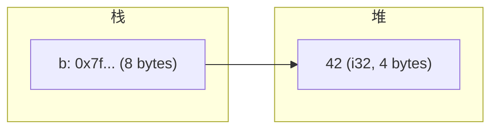
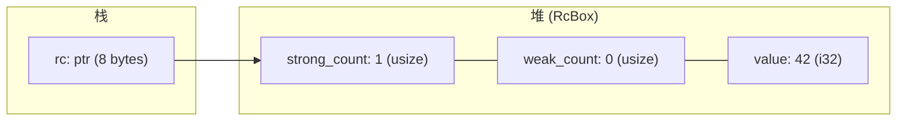

# 智能指针的内存管理原理

## 前置问题

1. 当你写 `Box::new(42)` 时，操作系统内核做了哪些事情？`brk` 和 `mmap` 系统调用各自处理什么样的分配请求？
2. `Arc::clone` 在 x86_64 上生成的原子递增指令 `lock inc [rax+8]` 中的 `lock` 前缀在 CPU 层面做了什么？为什么需要内存屏障？
3. `RefCell` 为什么在运行时检查借用？它和编译器借用检查器有什么根本区别？`UnsafeCell` 在 CPU 指令层面做了什么？

---

## 1. 堆分配的 OS 接口

### 1.1 `brk` 系统调用

```c
// brk: 调整进程的数据段末尾
int brk(void *addr);
void *sbrk(intptr_t increment);
```

`brk` 操作进程的 program break——数据段之后的第一个未分配地址。它适合小块内存的连续分配。


### 1.2 `mmap` 系统调用

```c
// mmap: 映射文件或匿名内存到进程地址空间
void *mmap(void *addr, size_t length, int prot, int flags,
           int fd, off_t offset);
```

对于大块内存（通常 > 128KB），glibc 的 `malloc` 使用 `mmap`（MAP_ANONYMOUS）来分配：

```c
// 等效于 Rust 中分配大 Vec
void *large = mmap(NULL, 1024 * 1024, PROT_READ | PROT_WRITE,
                   MAP_PRIVATE | MAP_ANONYMOUS, -1, 0);
```

### 1.3 实际分配器的工作流程

```c
// glibc malloc 的简化工作流程
void* malloc(size_t size) {
    if (size <= 128 * 1024) {
        // 小分配 → 使用 brk 区域
        // 从空闲链表中找到合适的 chunk（或扩展 brk）
        // 有 bins: fastbin, smallbin, largebin（类似 SLAB）
    } else {
        // 大分配 → 使用 mmap
        // 直接映射新页面，munmap 时直接释放回内核
    }
}
```

---

## 2. `Box<T>`：单所有者的堆分配

### 2.1 内存布局

```rust
let b: Box<i32> = Box::new(42);
```



### 2.2 ASM 全程追踪

```rust
pub fn make_box() -> Box<i32> {
    Box::new(42)
}
```

```asm
; make_box:
    push rbp
    mov  rbp, rsp

    ; 1. 分配 4 字节堆空间
    mov  edi, 4               ; size = 4 bytes
    mov  esi, 4               ; align = 4
    call __rust_alloc         ; 调用 Rust 全局分配器
                              ; rax = 分配到的堆指针（或 null）
    test rax, rax
    je   .L_alloc_failed      ; 如果 null → panic

    ; 2. 在堆上写入 42
    mov  dword ptr [rax], 42  ; *(rax) = 42

    ; 3. 返回堆指针（就是 Box<i32>）
    pop  rbp
    ret

.L_alloc_failed:
    ; 调用分配错误处理（通常 abort）
    call alloc::alloc::handle_alloc_error
```

```rust
// Box 离开作用域时的 drop
fn drop_box(b: Box<i32>) {
    // 自动插入：
    // 1. 获取堆指针（Box 转 *mut i32）
    // 2. 调用 __rust_dealloc(ptr, 4, 4)
}
```

```asm
; drop_box:
    ; b = 堆指针（在 rdi 中）
    mov  rdi, rdi             ; ptr
    mov  esi, 4               ; size
    mov  edx, 4               ; align
    call __rust_dealloc
    ret
```

---

## 3. `Rc<T>`：引用计数的编译时追踪

### 3.1 内存布局

```rust
let rc: Rc<i32> = Rc::new(42);
```



`RcBox<T>` 的内部结构：

```rust
struct RcBox<T: ?Sized> {
    strong: Cell<usize>,
    weak: Cell<usize>,
    value: T,
}
```

### 3.2 ASM: `Rc::clone` 非原子递增

```rust
let rc1 = Rc::new(42);
let rc2 = Rc::clone(&rc1);
```

```asm
; Rc::clone(&rc1):
    ; rdi = &rc1 → rc1.ptr（堆指针）
    mov  rax, [rdi]                  ; 获得堆指针
    inc  qword ptr [rax]             ; strong_count += 1（非原子！）
    ; 注意：Rc 不是线程安全的，所以不需要 lock 前缀
    ; 但这是什么保证？Rc 是 !Send + !Sync，编译器保证单线程使用
    mov  rax, [rdi]                  ; 返回新的 Rc（同一堆指针）
    ret
```

### 3.3 ASM: `Rc::drop`

```asm
; Rc::drop(&mut self):
    mov  rax, [rdi]                  ; 堆指针
    dec  qword ptr [rax]             ; strong_count -= 1
    cmp  qword ptr [rax], 0
    jne  .L_no_drop                  ; 如果 strong > 0，不释放
    ; strong_count == 0: 需要释放 T
    ; 调用 T 的 drop_in_place
    ; 然后释放 RcBox 的内存
    mov  rdi, rax                    ; 堆指针
    call __rust_dealloc
.L_no_drop:
    ret
```

---

## 4. `Arc<T>`：原子引用计数

### 4.1 与 `Rc` 的差异

`Arc<T>` 使用 `AtomicUsize` 替代 `Cell<usize>`：

```rust
struct ArcInner<T: ?Sized> {
    strong: AtomicUsize,  // 原子引用计数
    weak: AtomicUsize,    // 原子弱引用计数
    value: T,
}
```

### 4.2 `Arc::clone` 的 ASM — `lock` 前缀

```asm
; Arc::clone(&self):
    mov  rax, [rdi]                  ; 堆指针

    ; 原子递增 strong_count
    lock inc qword ptr [rax]         ; 关键：lock 前缀！
    ; lock inc = 读-修改-写 的原子操作
    ; CPU 在操作期间锁定内存总线（或缓存行）
    ; 确保没有其他核心可以同时修改此内存位置

    mov  rax, [rdi]                  ; 返回新的 Arc（同一堆指针）
    ret
```

### 4.3 `lock` 前缀的 CPU 行为

```
lock inc [mem] 在 x86 上的 MESI 操作：

1. CPU 发出 "read for ownership" 请求（RFO）
2. 缓存行从其他核心移入本核心，状态 → E（Exclusive）
3. 本核心执行 inc（读取 + 增加 + 写回）
   - 整个操作期间，缓存行被锁定
   - 阻止任何其他核心同时操作此缓存行
4. 缓存行状态：M（Modified）
5. 其他核心如果访问此地址 → cache miss → 等待本核心写回
```

### 4.4 内存排序（Memory Ordering）

```rust
// Arc::clone 使用 Relaxed 排序
// Arc::drop 使用 Release 排序
```

```c
// C++ 等价
std::atomic<size_t> strong{1};

// clone: relaxed 递增（只需要原子性，不需要排序）
strong.fetch_add(1, std::memory_order_relaxed);

// drop: release 递减（确保 T 的析构在释放内存之前）
if (strong.fetch_sub(1, std::memory_order_release) == 1) {
    std::atomic_thread_fence(std::memory_order_acquire);
    // 调用 T 的析构 + 释放内存
}
```

---

## 5. `RefCell<T>`：运行时借用检查

### 5.1 `UnsafeCell` 的底层原理

```rust
// UnsafeCell<T> 的核心语义：
// 通过 &UnsafeCell<T> 可以获取 *mut T
// 这是 Rust 中唯一允许从不可变引用获取可变指针的机制
```

在 LLVM IR 层面，`UnsafeCell<T>` 阻止了 `noalias` 属性的生成。没有 `UnsafeCell` 的 `&T` → LLVM 可以假设指向的内容不改变（noalias + readonly）；包含 `UnsafeCell` 的 `&T` → LLVM 不能做此假设。

### 5.2 `RefCell` 的运行时借用检查

```rust
pub struct RefCell<T: ?Sized> {
    borrow: Cell<BorrowFlag>,  // 借用计数器
    value: UnsafeCell<T>,
}

type BorrowFlag = isize;
// 0     = 无借用
// n > 0 = n 个不可变借用
// -1    = 1 个可变借用
```

```asm
; RefCell::borrow(&self):
    ; 当前 borrow 值在 [rdi + offset]
    mov  eax, [rdi + 0]         ; 读取 borrow 标志
    test eax, eax
    js   .L_already_mut_borrowed  ; 如果 < 0 → 存在可变借用 → panic
    inc  dword ptr [rdi + 0]    ; borrow += 1
    ; 返回 Ref 包装
    ret
```

```
RefCell::borrow_mut(&self):
    ; 当前 borrow 值在 [rdi + offset]
    mov  eax, [rdi + 0]         ; 读取 borrow 标志
    test eax, eax
    jne  .L_already_borrowed    ; 如果 != 0 → 存在任何借用 → panic
    mov  dword ptr [rdi + 0], -1  ; borrow = -1（可变借用独占）
    ; 返回 RefMut 包装
    ret
```

### 5.3 RefCell vs 编译时借用检查

| 维度 | 编译时借用检查 | RefCell 运行时检查 |
|------|-------------|------------------|
| 开销 | 零 | 每次 borrow/borrow_mut 开销：读-改-写 borrow 标志 |
| 检测时间 | 编译时 | 运行时（panic） |
| 灵活性 | 受 NLL 等限制 | 更灵活（绕过编译时限制） |
| 安全保证 | 静态 | 动态（panic） |
| 线程安全 | 是（通过 Send/Sync） | 否（RefCell 是 !Sync） |

---

## 6. `Cow<T>`：写时复制

### 6.1 OS 层面的 COW

`Cow` (Copy-on-Write) 模型与操作系统的 COW 语义共享哲学：

```
OS fork() COW 机制：
1. fork() 创建子进程
2. 两个进程的页表指向相同的物理页面
3. 页面被标记为"只读"（写保护）
4. 当任一进程尝试写入 → 缺页异常 → 内核复制页面 → 更新页表 → 两个进程各自独立
```

### 6.2 Rust 的 Cow 实现

```rust
pub enum Cow<'a, B: ?Sized + 'a> where B: ToOwned {
    Borrowed(&'a B),        // 持有引用，无分配
    Owned(<B as ToOwned>::Owned),  // 持有自有数据
}

impl<B: ToOwned> Cow<'_, B> {
    pub fn to_mut(&mut self) -> &mut B::Owned {
        match self {
            Cow::Borrowed(borrowed) => {
                // COW: 延迟分配——仅在需要修改时才 clone
                *self = Cow::Owned(borrowed.to_owned());
                match self { Cow::Owned(ref mut o) => o, _ => unreachable!() }
            }
            Cow::Owned(ref mut owned) => owned,
        }
    }
}
```

---

## 7. 循环引用与弱引用

### 7.1 为什么 Rust 不检测循环

```rust
// 循环引用：A → B → A
let a: Rc<RefCell<Option<Rc<...>>>> = ...;  // 会产生循环

// Rust 不自动检测循环，因为：
// 1. 没有 GC，无法追踪对象图
// 2. Rc 仅计数强引用（无循环检测）
// 3. Rust 的类型系统无法在编译时检测运行时循环
```

### 7.2 `Weak` 的解决方案

```rust
struct Node {
    parent: RefCell<Weak<Node>>,   // 弱引用 → 打破循环
    children: RefCell<Vec<Rc<Node>>>,
}
```

`Weak` 不增加强引用计数，只增加弱引用计数。当 `strong_count == 0` 时，值被销毁，但 `RcBox` 保留直到 `weak_count` 也归零。

---

## 8. 智能指针的 C++ 对比

### 8.1 Box ≈ std::unique_ptr

```cpp
// C++ unique_ptr
auto p = std::make_unique<int>(42);
// p 离开作用域自动 delete

// 对应的 Rust
let p = Box::new(42);
// p 离开作用域自动 drop
```

### 8.2 Rc/Arc vs shared_ptr

| 维度 | std::shared_ptr | Arc<T> |
|------|----------------|--------|
| 引用计数 | 原子（始终） | 原子 |
| 弱引用 | weak_ptr | Weak<T> |
| 循环检测 | 否 | 否 |
| 控制块 | 独立分配（可能） | 内嵌在同一个分配中 |
| 创建方式 | make_shared（单分配） | Arc::new（也是单分配） |
| 自定义删除器 | 支持 | 不支持（用 Drop） |

### 8.3 RefCell vs mutable/const_cast

```cpp
// C++: 绕过 const 是未定义行为（UB）
const int x = 42;
const_cast<int&>(x) = 10;  // UB!（如果 x 本身是 const）

// Rust: RefCell 在内部用 UnsafeCell 安全地实现
let x = RefCell::new(42);
*x.borrow_mut() = 10;  // 安全：RefCell 在运行时检查借用规则
```

---

## 本章考查

### 概念考查（每题2分，共20分）

1. glibc 的 `malloc` 对于超过 128KB 的分配使用什么系统调用？
   - A) `brk`
   - B) `mmap` (MAP_ANONYMOUS)
   - C) `fork`
   - D) `sbrk`

2. `lock inc [rax]` 中的 `lock` 前缀在 CPU 层面的作用是：
   - A) 禁用中断
   - B) 锁住内存总线/缓存行，确保原子读-修改-写操作不被其他核心干扰
   - C) 进入内核态
   - D) 刷新 TLB

3. `Rc::clone` 不使用 `lock` 前缀是因为：
   - A) `Rc` 被标记为 `!Send + !Sync`，编译器确保它只在单线程中使用
   - B) `Rc` 的计数存在寄存器中
   - C) `Rc` 使用特殊的硬件支持
   - D) `lock` 前缀对 `Rc` 不适用

4. `UnsafeCell<T>` 在 LLVM IR 中的关键作用是：
   - A) 阻止 LLVM 给指针添加 `noalias` 属性，允许通过不可变引用进行内部可变性
   - B) 实现自动内存分配
   - C) 启用 SIMD 优化
   - D) 触发垃圾回收

5. `RefCell` 的运行时借用检查如何检测冲突？
   - A) 遍历引用计数链表
   - B) 用一个整数计数器：0=无借用, >0=多个不可变, -1=可变借用
   - C) 使用系统调用检查
   - D) 查询全局借用注册表

6. `Arc::drop` 使用 memory_order_release 的原因是：
   - A) 为了加速
   - B) 确保 T 的析构效果在释放内存之前对所有线程可见（happens-before 关系）
   - C) 为了满足 C 标准
   - D) 与性能无关

7. OS fork 的写时复制（COW）机制与 Rust 的 `Cow` 共享的哲学是：
   - A) 立即复制
   - B) 延迟复制直到实际需要修改时
   - C) 永远不复制
   - D) 使用引用计数

8. `Weak<T>` 的存在是为了解决什么问题？
   - A) 提升性能
   - B) 打破 `Rc`/`Arc` 的循环引用问题
   - C) 更好的缓存利用率
   - D) 减少内存使用

9. C++ `std::shared_ptr` 和 Rust `Arc` 的一个关键区别是：
   - A) shared_ptr 不计数
   - B) Arc 的引用计数和值在同一个堆分配中（共享控制块 + 值）
   - C) Arc 使用非原子操作
   - D) 没有区别

10. `Box<T>` 在汇编层面的释放对应：
    - A) 直接回收栈帧
    - B) 调用 `__rust_dealloc` (或不使用 jemalloc 时的对应释放函数)
    - C) 系统调用 `munmap`
    - D) 零操作（编译器消除）

<details><summary>点击查看答案</summary>

1. **B** — glibc 对大于 128KB 的分配使用 `mmap`，更小的使用 `brk`/`sbrk`。
2. **B** — `lock` 前缀确保原子性，通过锁缓存行/总线防止其他核心同时访问。
3. **A** — `Rc` 被标记为 `!Send + !Sync`，编译器利用类型系统确保只在单线程内使用。
4. **A** — `UnsafeCell` 阻止 LLVM 生成 `noalias` 属性，允许内部可变性。
5. **B** — 用一个 `isize` 计数器（BorrowFlag）：0/正数/负数来追踪借用状态。
6. **B** — release 确保之前的所有操作（析构等）在所有线程看到内存释放前完成。
7. **B** — 两者都是"懒复制"策略——在真正需要修改前共享数据。
8. **B** — `Weak` 不增加 strong count，避免循环导致的内存泄漏。
9. **B** — `Arc` 的引用计数和目标值在同一个分配中，`shared_ptr` 的独立（用 make_shared 时间样）。
10. **B** — `Box` 的 drop 转换为对 `__rust_dealloc` 的调用。
</details>

### 判断正误（每题2分，共20分）

1. `Box<T>` 在栈上存储 T 的数据，指针指向栈。
2. `lock` 前缀在 x86_64 上可以被省略（对 `Rc`），因为它只是编译器的提示。
3. `RefCell` 的借用检查在编译时完成，因此零运行时开销。
4. `Arc<Mutex<T>>` 模式的必要性：`Arc` 提供共享所有权（多线程共享），`Mutex` 提供内部可变性（互斥访问）。
5. `Rc<T>` 可以在多线程间安全共享。
6. `Cow` 的 `to_mut` 方法在已有自有数据时不会 clone。
7. `Weak::upgrade` 返回 `Option<Rc<T>>`，因为强引用计数可能已归零。
8. `UnsafeCell` 使得 `&T` 上的 `noalias` 优化失效。
9. C++ 的 `const_cast` 和 Rust 的 `RefCell` 是等价的、同样安全。
10. 在 `Arc<T>` 中，值的析构发生在 `strong_count` 变为 0 时，但 RcBox 的释放等到 `weak_count` 也为 0。

<details><summary>点击查看答案</summary>

1. **错误** — `Box` 指向堆，栈上只存储指针。
2. **错误** — `lock` 前缀是 x86 的原子性保证机制，不以任何形式可省略。
3. **错误** — `RefCell` 在运行时检查（用计数器），`&T`/`&mut T` 在编译时检查。
4. **正确** — `Arc` 提供共享所有权，`Mutex` 提供内部可变性和互斥，两者解决不同问题。
5. **错误** — `Rc<T>` 是 `!Send + !Sync`，不能在多线程间共享。
6. **正确** — 如果已经是 `Cow::Owned`，`to_mut` 直接返回可变引用不执行 clone。
7. **正确** — `Weak::upgrade` 返回 `Option`，因为 strong 可能已归零使值被释放。
8. **正确** — `UnsafeCell` 阻止 LLVM 的 `noalias` + `readonly` 优化。
9. **错误** — C++ 的 `const_cast` 去掉 const 后写入可能触发 UB；RefCell 在运行时检查安全性。
10. **正确** — strong=0 时销毁值，weak=0 时释放整个 RcBox 分配。
</details>

### 代码分析（每题3分，共15分）

1. 以下代码会打印什么？
```rust
let rc = Rc::new(1);
let rc2 = Rc::clone(&rc);
let weak = Rc::downgrade(&rc);
drop(rc);
drop(rc2);
println!("{}", weak.upgrade().is_some());
```
A) true
B) false
C) 编译错误
D) panic

<details><summary>点击查看答案</summary>
**B** — 所有 strong 引用被释放后，值被销毁。`Weak::upgrade` 返回 `None`（strong_count=0）。
</details>

2. 以下 `RefCell` 代码会发生什么？
```rust
let c = RefCell::new(42);
let r1 = c.borrow_mut();
let r2 = c.borrow();
```
A) 通过编译，正常运行
B) 编译错误
C) 编译通过，但运行时 panic（borrow_mut 和 borrow 冲突）
D) 未定义行为

<details><summary>点击查看答案</summary>
**C** — RefCell 的运行时检查检测到可变借用和不可变借用冲突，触发 panic。
</details>

3. 在 x86_64 上，`lock inc [rax]` 和 `inc [rax]`（无 lock）的区别是：
A) 前者是原子操作（读-改-写不可被其他核心打断），后者不是
B) 完全一样
C) 前者更慢但不决定原子性
D) 后者不能用于整数

<details><summary>点击查看答案</summary>
**A** — `lock` 前缀使操作原子化，`inc [rax]` 可被其他 CPU 核心的交错访问破坏。
</details>

4. 以下代码中 `x` 是否还可用？
```rust
let x = Box::new(42);
let y = x;
println!("{}", x);
```
A) 可用，输出 42
B) 可用，但输出随机值
C) 不可用：编译错误——x 已被移动
D) 可用，输出 0

<details><summary>点击查看答案</summary>
**C** — `Box<T>` 不实现 `Copy`，`let y = x` 移动所有权。
</details>

5. 以下代码生成的汇编中 `lock` 前缀会出现几次？
```rust
let a = Arc::new(42);
let b = Arc::clone(&a);
let c = Arc::clone(&a);
```
A) 0 次
B) 2 次（每次 clone 用一个 lock inc）
C) 3 次
D) 1 次

<details><summary>点击查看答案</summary>
**B** — 每次 `Arc::clone` 使用 `lock inc` 原子递增 strong_count，两次 clone 共 2 次。
</details>

### 编程大题（15分）

**题目**: 实现一个简化版的 `Rc<T>`（名为 `MyRc<T>`），展示引用计数的基本原理。要求手动管理内存分配和引用计数。

```rust
use std::ptr::NonNull;
use std::ops::Deref;
use std::cell::Cell;

struct MyRcInner<T> {
    strong_count: Cell<usize>,
    value: T,
}

pub struct MyRc<T> {
    inner: NonNull<MyRcInner<T>>,
}

impl<T> MyRc<T> {
    pub fn new(value: T) -> Self {
        // TODO: 在堆上分配 MyRcInner，设置 strong_count = 1
        // 提示：使用 Box::new + Box::into_raw 或直接 unsafe 分配
    }
}

impl<T> Clone for MyRc<T> {
    fn clone(&self) -> Self {
        // TODO: 递增 strong_count，返回新的 MyRc
    }
}

impl<T> Drop for MyRc<T> {
    fn drop(&mut self) {
        // TODO: 递减 strong_count，如果归零则释放
    }
}

impl<T> Deref for MyRc<T> {
    type Target = T;
    fn deref(&self) -> &T {
        // TODO
    }
}
```

<details><summary>点击查看答案</summary>

```rust
use std::ptr::NonNull;
use std::ops::Deref;
use std::cell::Cell;
use std::alloc::{alloc, dealloc, Layout};

struct MyRcInner<T> {
    strong_count: Cell<usize>,
    value: T,
}

pub struct MyRc<T> {
    inner: NonNull<MyRcInner<T>>,
}

impl<T> MyRc<T> {
    pub fn new(value: T) -> Self {
        let layout = Layout::new::<MyRcInner<T>>();
        let ptr = unsafe {
            let raw = alloc(layout) as *mut MyRcInner<T>;
            (*raw).strong_count = Cell::new(1);
            std::ptr::write(&mut (*raw).value, value);
            NonNull::new_unchecked(raw)
        };
        MyRc { inner: ptr }
    }
}

impl<T> Clone for MyRc<T> {
    fn clone(&self) -> Self {
        unsafe {
            let inner = self.inner.as_ptr();
            let count = (*inner).strong_count.get();
            (*inner).strong_count.set(count + 1);
        }
        MyRc { inner: self.inner }
    }
}

impl<T> Drop for MyRc<T> {
    fn drop(&mut self) {
        unsafe {
            let inner = self.inner.as_ptr();
            let count = (*inner).strong_count.get();
            if count == 1 {
                // 最后一个引用 → 释放
                std::ptr::drop_in_place(&mut (*inner).value);
                let layout = Layout::new::<MyRcInner<T>>();
                dealloc(inner as *mut u8, layout);
            } else {
                (*inner).strong_count.set(count - 1);
            }
        }
    }
}

impl<T> Deref for MyRc<T> {
    type Target = T;
    fn deref(&self) -> &T {
        unsafe { &(*self.inner.as_ptr()).value }
    }
}
```

**评分标准**：
- 正确实现 `new`（堆分配 + 初始化 counts）（5分）
- 正确实现 `Clone`（非原子递增）（3分）
- 正确实现 `Drop`（倒计数 + 释放）（5分）
- 正确实现 `Deref`（2分）
</details>

### 填空题（每题1分，共5分）

1. `malloc` 对于小于 `____` 字节的分配通常使用 `____` 系统调用来扩展堆，大分配使用 `____`。
2. `lock inc [mem]` 中的 `lock` 前缀在 CPU 层面通过锁 `____` 或 `____` 实现原子性。
3. `RefCell` 的运行时借用标志值 `____` 表示无借用，`____` 表示有可变借用。
4. `Rc` 被标记为 `____` 和 `____`，确保它只在单线程中使用。
5. OS fork 的写时复制通过将共享页面标记为 `____` 实现，写入时触发 `____` 异常。

<details><summary>点击查看答案</summary>

1. 128K, brk/sbrk, mmap
2. 内存总线（memory bus）, 缓存行（cache line）
3. 0, -1
4. !Send, !Sync
5. 只读（read-only）, 缺页（page fault）
</details>

### 代码补全（共5分）

1. 使用 `Arc` 在多线程间共享数据（2分）：
```rust
use std::sync::____;
use std::thread;

let data = ____::new(vec![1, 2, 3]);
let data_clone = ____::clone(&data);
thread::spawn(move || {
    println!("{:?}", data_clone);
}).join().unwrap();
```

<details><summary>点击查看答案</summary>

```rust
use std::sync::Arc;
let data = Arc::new(vec![1, 2, 3]);
let data_clone = Arc::clone(&data);
```
</details>

2. 使用 `RefCell` 实现内部可变性（2分）：
```rust
use std::cell::____;

let data = ____::new(42);
*data.____() += 1;  // borrow_mut
assert_eq!(*data.____(), 43);  // borrow
```

<details><summary>点击查看答案</summary>

```rust
use std::cell::RefCell;

let data = RefCell::new(42);
*data.borrow_mut() += 1;
assert_eq!(*data.borrow(), 43);
```
</details>

3. `Cow` 的使用场景（1分）：
```rust
use std::borrow::____;

// 当不需要修改时，以引用形式使用（零分配）
let cow = ____::Borrowed("hello");

// 需要修改时才 clone（延迟分配）
// let mut cow = cow;
// cow.____()  // 触发 clone
```

<details><summary>点击查看答案</summary>

```rust
use std::borrow::Cow;

let cow = Cow::Borrowed("hello");
// cow.to_mut()  // 触发 clone
```
</details>

---

## 本章小结

智能指针将编译器不可见的堆管理转化为强类型的所有权规则：

- **Box** = 单所有者堆分配，分配/释放通过 `__rust_alloc`/`__rust_dealloc`
- **Rc** = 非原子引用计数，`!Send + !Sync` 确保单线程使用
- **Arc** = 原子引用计数，`lock inc/dec` 确保多线程安全
- **RefCell** = 运行时借用检查（BorrowFlag 计数器），利用 `UnsafeCell` 取消 `noalias` 限制
- **Cow** = 写时复制语义，与 OS fork 共享哲学
- **Weak** = 弱引用打破循环，不增加 strong count

理解每个智能指针在 CPU 和内存层面的行为，是写出高性能 Rust 的关键。

**下一章**：[[07-并发的硬件基础]] — 从 CPU 核心到 MESI 协议，理解并发的本质。

---

*深度阅读*：Mara Bos, "Rust Atomics and Locks"; Intel SDM Vol 3A Ch 8 (Multiple-Processor Management); glibc malloc 源码
