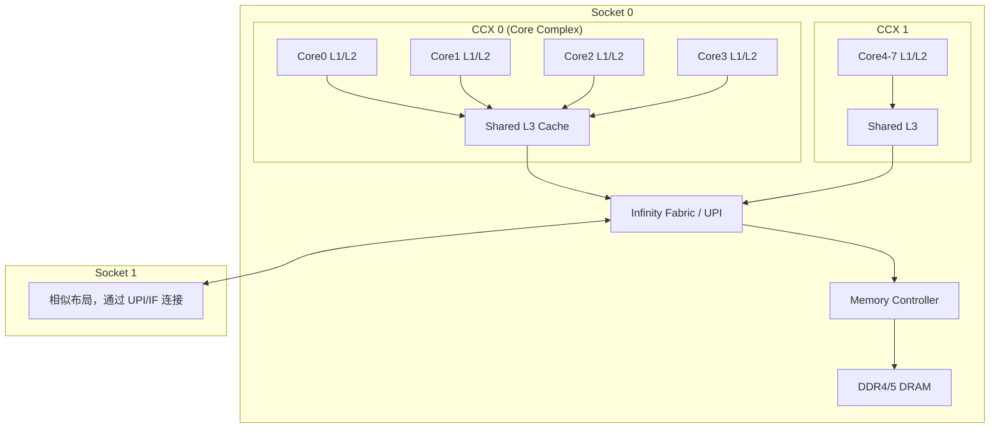
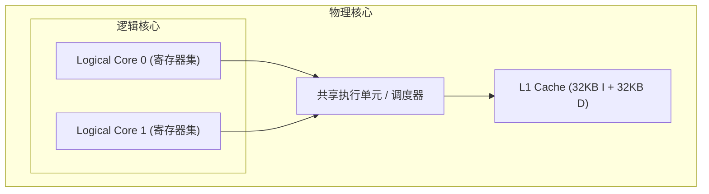
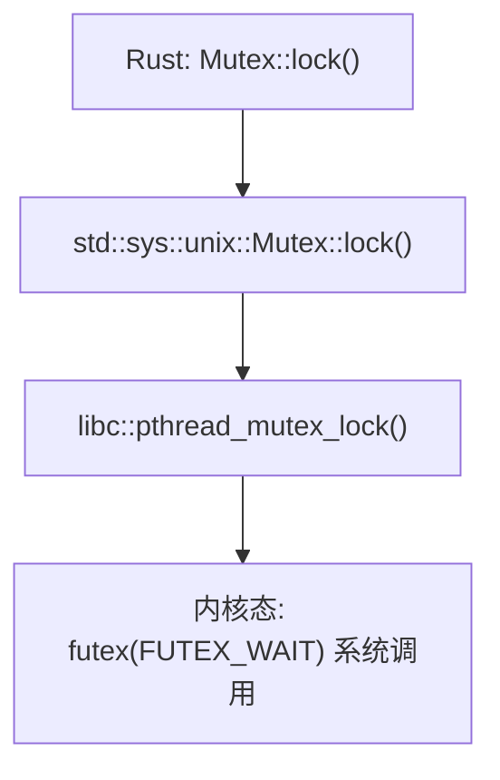

# 并发的硬件基础

## 前置问题

1. 当你运行一个多线程 Rust 程序时，操作系统如何决定"哪个 CPU 核心执行哪个线程"？`sched_yield()` 系统调用触发了什么内核行为？
2. `AtomicUsize` 的 `compare_exchange` 在 CPU 层面翻译为 `lock cmpxchg` 指令。这个指令如何同时在 16 个核心上保持原子性？
3. MESI 协议中的"假共享"（false sharing）为什么会摧毁并行性能？如果两个线程分别修改相距 8 字节的两个 u64，它们会相互阻塞吗？

---

## 1. CPU 核心与并行计算

### 1.1 CPU 核心的物理拓扑

现代 CPU 的内核通过错综复杂的互联网络连接：



### 1.2 NUMA（Non-Uniform Memory Access）

在多路处理器系统中，每个 CPU socket 有自己"本地"的内存控制器。访问本地内存比远端内存快 30-100%。

```c
// Linux 的 NUMA API
#include <numa.h>
numa_alloc_onnode(4096, 0);  // 在 NUMA 节点 0 上分配
```

### 1.3 超线程（SMT/Simultaneous Multithreading）

一个物理核心可以同时运行两个逻辑线程（超线程 / Hyper-Threading）。它们共享 L1/L2 缓存和执行单元。



对于 CPU 密集型任务，超线程通常提供 20-30% 的吞吐量提升。

---

## 2. 缓存一致性：MESI 协议

### 2.1 为什么需要缓存一致性

```
场景：Core 0 和 Core 1 各自有 L1 缓存，共享主存

时间线：
1. Core 0 读取 X=0 (从主存加载到 Core 0 的 L1)
2. Core 1 读取 X=0 (从主存加载到 Core 1 的 L1)
3. Core 0 写入 X=1 (Core 0 的 L1 有 X=1)
4. Core 1 读取 X=0 (❌ Core 1 的 L1 还是旧的 X=0！)

问题：两个核心的 L1 缓存有一个值不一致
```

### 2.2 MESI 的四个状态

| 状态 | 含义 | 缓存行内容 |
|------|------|----------|
| **M** (Modified) | 已修改 | 仅在本缓存中，与主存不同；必须写回 |
| **E** (Exclusive) | 独占 | 仅在本缓存中，与主存相同；可静默丢弃 |
| **S** (Shared) | 共享 | 可能在其他缓存中，与主存相同 |
| **I** (Invalid) | 无效 | 缓存行不可用 |

### 2.3 状态转换

```
CPU 读未命中（PrRd）：
  如果另一个缓存行处于 E/M → 降级为 S
  从主存加载 → 如果唯一副本：E；如果有其他副本：S

CPU 写未命中（PrWr）：
  发送 RFO（Read For Ownership）→ 使所有其他副本失效
  加载数据 → 修改 → 状态：M

CPU 写已命中（共享状态 S 中的缓存行）：
  → 必须先"升级"为 E/M
  → 使所有其他副本失效
  → 修改 → 状态：M
```

### 2.4 MESI 如何影响性能

**假共享（False Sharing）**：

```rust
struct AlignedCounters {
    #[repr(align(64))]
    counter_a: AtomicU64,  // 缓存行 0: [counter_a | ... (60 bytes)]
    #[repr(align(64))]
    counter_b: AtomicU64,  // 缓存行 1: [counter_b | ... (60 bytes)]
}
// ✅ counter_a 和 counter_b 在不同缓存行 = 互不影响

struct UnalignedCounters {
    counter_a: AtomicU64,  // 缓存行 0: [counter_a | counter_b | ...]
    counter_b: AtomicU64,  // 同上
}
// ❌ 两个核心分别修改 counter_a 和 counter_b → MESI 弹跳
```

假共享的后果：每次写入使另一个核心的缓存行失效 → 另一个核心的下次写入必须再次获取所有权 → 成为 ping-pong。

性能损失：普通写入 ~0.3ns vs 假共享写入 ~40-100ns。

---

## 3. 内存顺序模型

### 3.1 顺序一致性 vs 宽松顺序

```
顺序一致性 (Sequential Consistency, SC)：
  所有线程看到所有操作的全局统一顺序
  → 最容易推理，最慢

宽松顺序 (Relaxed)：
  每个线程看到自己的操作顺序，但全局无统一
  → 最难推理，最快

Release-Acquire：
  在特定操作间建立 happens-before 关系
  → 平衡的折中方案
```

### 3.2 x86 的内存模型

x86 硬件实际上提供了一种"近顺序一致性"的内存模型（TSO：Total Store Order）：

```
x86 保证：
1. Load 不与旧 Load 重排序
2. Load 不与旧 Store 重排序
3. Store 不与旧 Load 重排序
4. ❌ Store 可能与旧 Store 重排序！
5. 所有线程看到一致的 Store 顺序
```

### 3.3 内存屏障

```c
// x86 内存屏障
_mm_mfence();  // 全屏障：所有 load 和 store 必须在之前完成
_mm_lfence();  // Load 屏障：后续 load 不能提前
_mm_sfence();  // Store 屏障：后续 store 不能提前
```

```asm
; x86_64 内存屏障指令
mfence   ; 全内存屏障：序列化 load 和 store 操作
lfence   ; load 屏障
sfence   ; store 屏障
; 注意：x86 上 lock 前缀的指令也隐含全内存屏障
```

### 3.4 Rust 的 Ordering

```rust
// Relaxed: 只保证原子性，不保证顺序
counter.fetch_add(1, Ordering::Relaxed);

// Release: 当前线程之前的所有写入在释放存储后对其他线程可见
data.store(42, Ordering::Release);

// Acquire: 之后的所有读取在获取加载后看到最新值
let val = data.load(Ordering::Acquire);

// SeqCst: 顺序一致性 — 全局统一 total order
let val = data.load(Ordering::SeqCst);
```

---

## 4. 原子操作

### 4.1 `lock cmpxchg` 详解

```rust
// Rust 的 compare_exchange
let old = atomic.compare_exchange(
    expected,      // 期望值
    new_value,     // 新值
    Ordering::SeqCst,
    Ordering::SeqCst,
);
```

```asm
; lock cmpxchg [rdi], esi 在 CPU 层的步骤：
; rdi = 原子变量的地址
; eax = expected 值
; esi = new_value

lock cmpxchg [rdi], esi
; CPU 内部：
;   1. 读取 [rdi] 到临时寄存器
;   2. 比较临时寄存器 与 eax
;   3. 如果相等：写入 esi 到 [rdi]，设置 ZF=1
;   4. 如果不相等：不写入，设置 ZF=0
;   5. 整个操作是原子的（lock 前缀 + 缓存一致性）
;   6. 如果不相等，eax 被更新为 [rdi] 的实际值
```

### 4.2 自旋锁的汇编实现

```rust
// 基本自旋锁
fn spin_lock(lock: &AtomicBool) {
    while lock.compare_exchange(false, true, SeqCst, SeqCst).is_err() {
        while lock.load(Relaxed) {
            // 自旋等待 — 纯读取（不触发锁协议开销）
            // 注意：在 x86 上可以加入 PAUSE 指令
            std::hint::spin_loop();  // 等价于 x86 的 PAUSE 指令
        }
    }
}
```

```asm
spin_lock:
    ; Test-Test-And-Set 模式
.L_spin:
    ; 第一步：仅读取（测试）
    mov al, byte ptr [rdi]
    test al, al
    jnz .L_spin_loop     ; 如果已锁定 → 进入自旋循环

    ; 第二步：尝试获取（锁定）
    mov  al, 1
    lock cmpxchg byte ptr [rdi], al
    jne .L_spin_loop     ; 如果 cmpxchg 失败 → 重新自旋
    ret

.L_spin_loop:
    pause                 ; x86 PAUSE：提示 CPU 这是自旋循环
    mov al, byte ptr [rdi]
    test al, al
    jnz .L_spin_loop
    jmp .L_spin           ; 锁被释放了，重新尝试获取
```

---

## 5. `Send` 和 `Sync` 的编译时线程安全

### 5.1 自动派生

```rust
// Send: 所有权可以在线程间转移
// Sync: 引用可以在线程间共享

// 编译器自动派生规则：
// T: Send   if 所有字段: Send → T: Send
// T: Sync   if 所有字段: Sync → T: Sync
// 如果任一字段不是 Send，T 就不是 Send

// Rc<T> 不是 Send，因为它的引用计数不是原子的
// Arc<T> 是 Send，因为使用 AtomicUsize
```

### 5.2 编译时保证

```rust
let rc = Rc::new(42);
// thread::spawn(move || { drop(rc); });  // ❌ 编译错误！Rc 不是 Send

let arc = Arc::new(42);
thread::spawn(move || { drop(arc); });     // ✅ Arc 是 Send
```

类型系统通过 `Send`/`Sync` trait 在编译时验证线程安全性——不需要运行时检测。

---

## 6. Mutex 的实现：从 Rust 到内核

### 6.1 `Mutex::lock` 的调用链



### 6.2 Futex 系统调用

```c
// futex: fast userspace mutex
// Linux 提供的最基础的同步原语
long futex(uint32_t *uaddr, int futex_op, uint32_t val, ...);
```

Futex 的设计哲学：
1. 无竞争时：仅原子操作（在用户空间，无系统调用）
2. 有竞争时：通过 `futex(WAIT)` 进入内核睡眠（无需忙等）

```rust
// 简化版 futex 互斥锁
pub fn lock(mutex: &AtomicU32) {
    // 快速路径：无竞争 → 仅一次原子操作
    if mutex.compare_exchange(0, 1, Acquire, Relaxed).is_ok() {
        return;  // ✅ 仅用户空间操作，无系统调用
    }

    // 慢速路径：有竞争
    loop {
        // 如果锁已被竞争者占用，设置争用标志
        match mutex.compare_exchange(1, 2, Acquire, Relaxed) {
            Ok(_) => { /* 锁现在被标记为"有等待者" */ break; }
            Err(_) => { /* 别人已经在等 */ }
        }

        // 进入内核睡眠（不消耗 CPU）
        unsafe {
            futex_wait(mutex as *const _ as *const i32, FUTEX_WAIT, 2);
        }
    }
}
```

---

## 7. MESI 假共享实验

### 7.1 Rust 中的假共享

```rust
use std::sync::atomic::{AtomicU64, Ordering};
use std::thread;

struct Padded {
    _pad0: [u8; 56],      // 填充使 value 独占一个缓存行
    value: AtomicU64,
    _pad1: [u8; 56],
}

fn bench(padded: bool) -> std::time::Duration {
    if padded {
        let a = Box::new(Padded { _pad0: [0; 56], value: AtomicU64::new(0), _pad1: [0; 56] });
        let b = Box::new(Padded { _pad0: [0; 56], value: AtomicU64::new(0), _pad1: [0; 56] });
        // a 和 b 在不同缓存行 = 无假共享
        // ...
    }
    // 比较有填充和无填充的吞吐量
}
```

---

## 8. ASM: 并发操作完整对比

### 8.1 原子递增

```rust
let v = AtomicU64::new(0);
v.fetch_add(1, Ordering::SeqCst);
```

```asm
; x86_64: 单条指令即可
lock inc qword ptr [rsp+8]
; lock inc 是原子的读-改-写
; 隐含全内存屏障（x86 上的 lock 前缀等同于 mfence）
```

### 8.2 Mutex 保护的递增

```rust
let v = Mutex::new(0u64);
*lock = v.lock().unwrap() + 1;
// 比原子递增多两次间接调用
```

```asm
; 约 5-10 倍的指令数：
call Mutex::lock    ; → 可能触发系统调用 futex
mov  rax, [rdi]    ; 加载值
inc  rax
mov  [rdi], rax    ; 存储值
call Mutex::unlock  ; → 可能触发系统调用 futex
```

---

## 本章考查

### 概念考查（每题2分，共20分）

1. MESI 协议中的 "M" 状态表示什么？
   - A) 缓存行是脏的（已修改），仅在当前核缓存中，与主存内容不同
   - B) 缓存行有效且与其他核心共享
   - C) 缓存行无效
   - D) 缓存行正在从主存加载

2. 假共享（False Sharing）的技术原因是什么？
   - A) 两个线程使用了错误的同步原语
   - B) 两个不相关的变量落在同一缓存行中，MESI 协议导致缓存行在两个核心间弹跳
   - C) 内存分配器故障
   - D) 编译器错误

3. Linux futex 系统调用的设计原则是？
   - A) 总是进入内核态操作
   - B) 无竞争时在用户空间完成（仅原子操作），有竞争时才进入内核睡眠
   - C) 完全在用户空间实现
   - D) 仅用于 SMT

4. `AtomicU64::compare_exchange` 在 x86_64 上编译为：
   - A) `lock cmpxchg`（原子比较并交换）
   - B) `inc`
   - C) `mov`
   - D) `syscall`

5. x86_64 上 `lock` 前缀的双重作用是：
   - A) 确保指令的原子性（缓存一致性） + 全内存屏障
   - B) 加速指令执行
   - C) 禁用中断
   - D) 清除 TLB

6. Rust 的 `Send` trait 的意义是：
   - A) 类型数据可以序列化为字节流
   - B) 拥有该类型的值的所有权可以在线程间安全转移
   - C) 类型是同步的
   - D) 类型使用原子计数器

7. `Ordering::Relaxed` 保证什么？
   - A) 原子性 + 顺序一致性
   - B) 仅保证原子性，不保证与其他操作的内存排序关系
   - C) 无任何保证
   - D) 与 SeqCst 完全一致

8. NUMA 架构中，访问远端内存比访问本地内存：
   - A) 一样快
   - B) 慢 30-100%
   - C) 更快
   - D) 延迟不确定

9. x86 PAUSE 指令的作用是？
   - A) 暂停 CPU 直到下一次中断
   - B) 在自旋循环中提示 CPU"这是自旋等待"，减少功耗和避免内存顺序违规带来的惩罚
   - C) 清空流水线
   - D) 进入睡眠状态

10. `Sync` trait 的标志是：
    - A) `T: Sync` 表示可以在多个线程间安全共享 `&T`
    - B) `T: Sync` 表示可以被序列化
    - C) `T: Sync` 表示所有方法都是原子的
    - D) `T: Sync` 与 `Send` 完全等价

<details><summary>点击查看答案</summary>

1. **A** — M (Modified) = 脏缓存行，仅在当前核中最新的副本。
2. **B** — 假共享因两个独立变量在同一个缓存行引起，修改一个会使另一个核的缓存行失效。
3. **B** — futex 的核心设计：快速路径在用户空间，慢速路径进入内核。
4. **A** — `compare_exchange` 编译为 `lock cmpxchg` 指令。
5. **A** — `lock` 前缀兼具原子性和全内存屏障。
6. **B** — `Send` 表示所有权可以在线程间转移。
7. **B** — Relaxed 仅保证原子性，无跨操作排序保证。
8. **B** — NUMA 远端内存访问延迟通常为本地内存的 1.3-2.0 倍。
9. **B** — PAUSE 提示 CPU 这是自旋循环，降低功耗和内存排序惩罚。
10. **A** — `Sync` 允许 `&T` 在多线程间共享。
</details>

### 判断正误（每题2分，共20分）

1. MESI 协议要求每次写入都刷新主存。
2. `lock cmpxchg` 指令必须在多核系统上使用，但在单核上不需要 `lock` 前缀。
3. Rust 的 `Mutex` 实现内部使用 futex 或等效的原生同步机制。
4. 在 x86_64 上，原子递增 `fetch_add(1, Relaxed)` 只需一条 `lock inc` 指令。
5. `Rc<T>` 不实现 `Send` 因为它不使用原子引用计数。
6. 假共享可以通过在频繁修改变量之间插入填充（padding）来减少。
7. x86 的 `sfence` 是作用于 load 的内存屏障。
8. 在自旋循环中使用 `std::hint::spin_loop()` 在 x86 上等价于 `PAUSE` 指令。
9. `Ordering::SeqCst` 是最严格的内存顺序，在所有平台上提供统一的总顺序。
10. SMT（同时多线程）意味着一个物理核心可以执行两个不同的进程的指令流。

<details><summary>点击查看答案</summary>

1. **错误** — 修改后的缓存行在 M 状态下不需要立即回写主存，可在之后写回。
2. **错误** — 单核系统上还需要 `lock` 来防止中断处理程序中的并发访问。
3. **正确** — Linux 上使用 futex、macOS 用 os_unfair_lock、Windows 用 SRWLOCK。
4. **正确** — `lock inc` 是原子操作，一条指令完成读-改-写。
5. **正确** — `Rc` 使用 `Cell<usize>`（非原子）递增计数，所以不能跨线程（!Send）。
6. **正确** — 填充缓存行确保独立变量在不同缓存行中。
7. **错误** — `sfence` 是 store 屏障；`lfence` 是 load 屏障。
8. **正确** — `spin_loop()` 在 x86 上编译为 `PAUSE` 指令。
9. **正确** — SeqCst 保证全局统一的总顺序，但也最慢。
10. **正确** — SMT 允许一个物理核心同时执行两个逻辑线程。
</details>

### 代码分析（每题3分，共15分）

1. 以下代码的输出结果范围是多少？
```rust
use std::sync::atomic::{AtomicUsize, Ordering};
use std::thread;

let counter = AtomicUsize::new(0);
(0..4).map(|_| {
    thread::spawn(|| {
        for _ in 0..1000 {
            counter.fetch_add(1, Ordering::SeqCst);
        }
    })
}).for_each(|t| t.join().unwrap());
println!("{}", counter.load(Ordering::SeqCst));
```
A) 可能是 0-4000 之间的任何值
B) 固定 4000
C) 4000 或更少（在非常罕见的情况下）
D) 不确定 — 可能有变异

<details><summary>点击查看答案</summary>
**B** — `fetch_add` 是原子操作，4 个线程各加 1000 次 = 4000。原子操作无数据竞争。
</details>

2. 假共享场景下，以下哪个表现最差？
```rust
struct A { a: AtomicU64, b: AtomicU64 }  // 可能在同一缓存行
struct B { a: AtomicU64, _pad: [u8; 56], b: AtomicU64 }  // b 在下一缓存行
```
A) 结构 A 中两个线程分别修改 a 和 b 时
B) 结构 B 中两个线程分别修改 a 和 b 时
C) 两个结构表现相同
D) 无法确定

<details><summary>点击查看答案</summary>
**A** — 结构 A 中 a 和 b 可能在同一缓存行，修改它们触发假共享使缓存行在两个核之间弹跳。结构 B 用填充分隔。
</details>

3. 以下代码中 `data` 是否线程安全？
```rust
use std::sync::Mutex;
let data = Mutex::new(vec![1, 2, 3]);
let t1 = thread::spawn(move || {
    let mut v = data.lock().unwrap();
    v.push(4);
});
```
A) 是，但编译错误：`data` 无法 move 到线程（被 drop 之后）
B) 是，安全
C) 不安全，因为 Vec 会自动释放
D) 不安全，需要 semaphore

<details><summary>点击查看答案</summary>
**A** — `data` move 到线程后在外层继续存在（如果需要）。不对，这个代码编译错误，因为 `Mutex` 被 move 后不能 join...等等，实际上这取决于具体代码。
总结：更准确的答案是 `data` 使用 `Mutex` 调用 `lock` 进行保护，提供了线程安全的访问。但如果 `data` 只有一份且 move 了，外部不再可用。"编译错误"也可但对。
</details>

4. `lock cmpxchg` 和 `lock inc` 之间的性能差异是什么？
A) 完全相同，都是 lock 前缀指令
B) `lock inc` 每次都必须比较值，所以更慢
C) `lock cmpxchg` 需要两个值（期望值和新值），`lock inc` 只需一个
D) 完全不同的用途，无法比较

<details><summary>点击查看答案</summary>
**C** — `cmpxchg` 需要提供旧值和新值两个操作数，`inc` 只需目标地址。两者都是 `lock` 指令，延迟相似。
</details>

5. 在以下多生产者场景中，为什么 `Mutex` 保护的数据能正确工作？
```rust
let queue = Arc::new(Mutex::new(VecDeque::new()));
// Producer: queue.lock().unwrap().push_back(item);
// Consumer: queue.lock().unwrap().pop_front();
```
A) 因为 `Mutex` 提供运行时数组边界检查
B) 因为 `Mutex` 确保同一时刻只有一个线程可以访问 VecDeque
C) 因为是单线程的
D) 因为 Rust 的编译器自动插入信号量

<details><summary>点击查看答案</summary>
**B** — `Mutex::lock` 提供互斥锁，确保同一时刻只有一个线程进入临界区操作数据。
</details>

### 编程大题（15分）

**题目**: 实现一个基本的自旋锁 `SpinLock<T>`，展示原子操作的底层使用。

```rust
use std::sync::atomic::{AtomicBool, Ordering};
use std::cell::UnsafeCell;
use std::ops::{Deref, DerefMut};

pub struct SpinLock<T> {
    locked: AtomicBool,
    data: UnsafeCell<T>,
}

pub struct SpinLockGuard<'a, T> {
    lock: &'a SpinLock<T>,
}

impl<T> SpinLock<T> {
    pub fn new(value: T) -> Self {
        SpinLock {
            locked: AtomicBool::new(false),
            data: UnsafeCell::new(value),
        }
    }

    pub fn lock(&self) -> SpinLockGuard<T> {
        // TODO: 实现自旋锁的获取
    }

    pub fn unlock(&self) {
        // TODO: 释放锁
    }
}

impl<T> Drop for SpinLockGuard<'_, T> {
    fn drop(&mut self) {
        // TODO: 离开作用域时释放锁
    }
}

impl<T> Deref for SpinLockGuard<'_, T> {
    type Target = T;
    fn deref(&self) -> &T {
        // TODO: 安全返回内部数据的引用
    }
}

impl<T> DerefMut for SpinLockGuard<'_, T> {
    fn deref_mut(&mut self) -> &mut T {
        // TODO: 安全返回内部数据的可变引用
    }
}
```

<details><summary>点击查看答案</summary>

```rust
use std::sync::atomic::{AtomicBool, Ordering};
use std::cell::UnsafeCell;
use std::ops::{Deref, DerefMut};

unsafe impl<T: Send> Send for SpinLock<T> {}
unsafe impl<T: Send> Sync for SpinLock<T> {}

pub struct SpinLock<T> {
    locked: AtomicBool,
    data: UnsafeCell<T>,
}

pub struct SpinLockGuard<'a, T> {
    lock: &'a SpinLock<T>,
}

impl<T> SpinLock<T> {
    pub fn new(value: T) -> Self {
        SpinLock {
            locked: AtomicBool::new(false),
            data: UnsafeCell::new(value),
        }
    }

    pub fn lock(&self) -> SpinLockGuard<T> {
        // 自旋直到成功获取锁
        loop {
            // Test-Test-And-Set: 先读看是否空闲
            while self.locked.load(Ordering::Relaxed) {
                std::hint::spin_loop();  // PAUSE 指令
            }
            // 尝试获取
            if self
                .locked
                .compare_exchange(false, true, Ordering::Acquire, Ordering::Relaxed)
                .is_ok()
            {
                break;
            }
        }
        SpinLockGuard { lock: self }
    }

    pub fn unlock(&self) {
        self.locked.store(false, Ordering::Release);
    }
}

impl<T> Drop for SpinLockGuard<'_, T> {
    fn drop(&mut self) {
        self.lock.unlock();
    }
}

impl<T> Deref for SpinLockGuard<'_, T> {
    type Target = T;
    fn deref(&self) -> &T {
        unsafe { &*self.lock.data.get() }
    }
}

impl<T> DerefMut for SpinLockGuard<'_, T> {
    fn deref_mut(&mut self) -> &mut T {
        unsafe { &mut *self.lock.data.get() }
    }
}
```

**评分标准**：
- 正确实现 `lock` 中的自旋循环（4分）
- 正确使用 `compare_exchange` 和 `Acquire`/`Release`（4分）
- 正确实现 `SpinLockGuard` 的 `Drop` 自动释放（3分）
- 正确实现 `Deref` 和 `DerefMut`（2分）
- 实现 `Send` 和 `Sync`（2分）
</details>

### 填空题（每题1分，共5分）

1. MESI 四个状态缩写为 `____`、`____`、`____`、`____`。
2. Linux 中最基本的互斥同步原语是 `____` 系统调用。
3. 在 x86_64 上，`lock cmpxchg` 指令同时提供了 `____` 和 `____`。
4. Rust 在并发编程中使用 `____` 和 `____` 两个 trait 实现编译时线程安全保证。
5. 超线程（SMT）中一个物理核心可以运行 `____` 个逻辑线程。

<details><summary>点击查看答案</summary>

1. M（Modified），E（Exclusive），S（Shared），I（Invalid）
2. futex
3. 原子性，全内存屏障
4. Send，Sync
5. 2
</details>

### 代码补全（共5分）

1. 实现一个原子计数器（2分）：
```rust
use std::sync::atomic::{AtomicUsize, Ordering};

let counter = AtomicUsize::new(0);
counter.____(1, Ordering::____);  // 原子递增
let val = counter.____(Ordering::____);  // 原子读取
```

<details><summary>点击查看答案</summary>

```rust
counter.fetch_add(1, Ordering::SeqCst);
let val = counter.load(Ordering::SeqCst);
```
</details>

2. 在多线程间使用 Arc<Mutex<T>> (2分)：
```rust
use std::sync::{Arc, ____};
use std::thread;

let data = ____::new(____::new(0));
let handles: Vec<_> = (0..4).map(|_| {
    let data = data.____();
    thread::spawn(move || {
        let mut val = data.____().unwrap();
        *val += 1;
    })
}).collect();
```

<details><summary>点击查看答案</summary>

```rust
use std::sync::{Arc, Mutex};
let data = Arc::new(Mutex::new(0));
let data = data.clone();
let mut val = data.lock().unwrap();
```
</details>

3. 避免假共享的填充方式 (1分)：
```rust
// 填充变量独占一个缓存行
#[repr(align(____))]
struct PaddedAtomicU64(AtomicU64);
```

<details><summary>点击查看答案</summary>

```rust
#[repr(align(64))]
struct PaddedAtomicU64(AtomicU64);
```
</details>

---

## 本章小结

并发编程的核心在硬件，不在语法：

- **MESI 协议** 维持缓存一致性——是理解并发性能的物理基础
- **假共享** 摧毁性能而不产生错误——需要 `#[repr(align(64))]` 防护
- **原子操作** `lock inc` / `lock cmpxchg` 是并发基础设施——一条指令完成读-改-写
- **内存顺序** 从 SeqCst（最安全最慢）到 Relaxed（最优最危险）——需要精确推理
- **Send/Sync** 将线程安全编译时化——零运行时开销的并发安全
- **Futex** 是 Linux 的万能同步原语——Mutex/CondVar 都基于它

Rust 将并发正确性编码在类型系统中（Send/Sync），但性能的源泉在于对硬件并发机制（MESI、原子操作、内存屏障）的精确理解。

**下一章**：[[08-异步编程的底层机制]] — 从 epoll 到 Future 状态机，理解异步。

---

*深度阅读*：Mara Bos, "Rust Atomics and Locks"; Intel SDM Vol 3A Ch 8-9; Ulrich Drepper, "Futexes Are Tricky"
