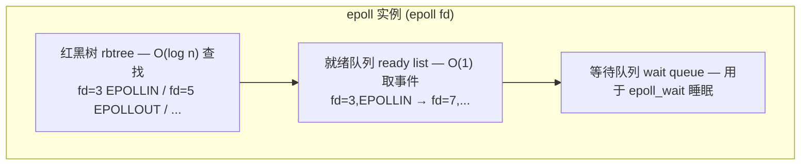
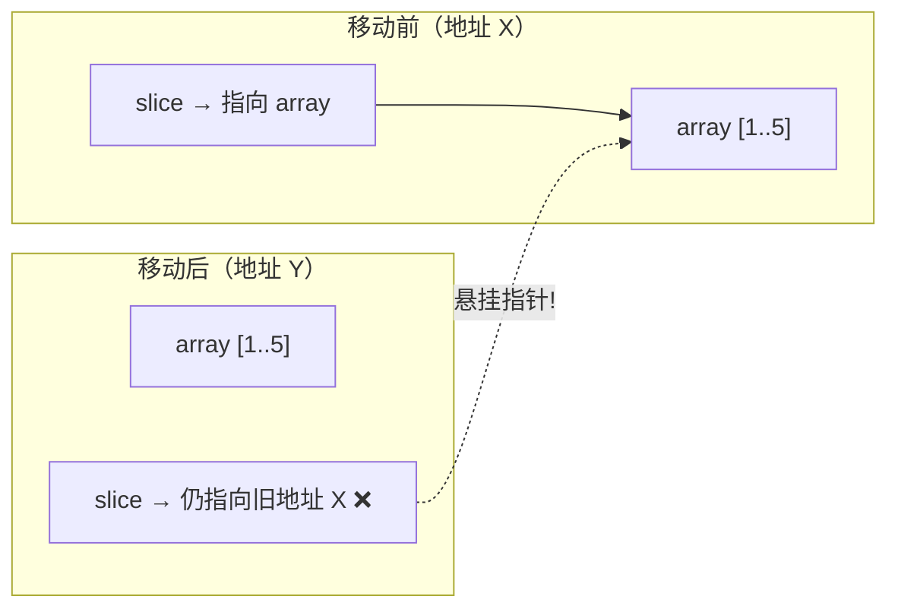
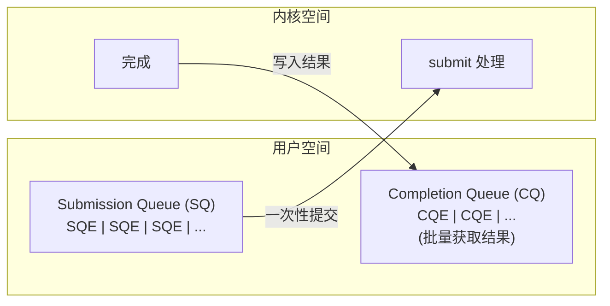

# 异步编程的底层机制

## 前置问题

1. 如果你用 C 写网络服务器，每个连接需要一个线程（`pthread_create`）。每个线程消耗 8MB 栈空间。10000 个连接需要 80GB 内存。异步 I/O 如何解决这个问题？
2. `async fn` 编译后是什么？它是如何被"暂停"和"恢复"的？暂停时 CPU 寄存器去了哪里？
3. Linux 的 `epoll` 和 io_uring 各代表什么"代际"的异步 I/O？io_uring 为什么在 Rust 社区引起轰动？

---

## 1. OS 级 I/O：阻塞 vs 非阻塞

### 1.1 阻塞 I/O 的代价

```c
// 阻塞 I/O：每个连接一个线程
void handle_client(int fd) {
    char buf[4096];
    ssize_t n = read(fd, buf, sizeof(buf));  // 阻塞直到有数据
    // 期间，整个线程挂起 — 8MB 栈空闲
    // 操作系统调度：线程状态 TASK_RUNNING → TASK_INTERRUPTIBLE
    // 上下文切换成本：约 1-2μs
    write(fd, buf, n);
}
```

### 1.2 非阻塞 I/O

```c
// 设置文件描述符为非阻塞
int flags = fcntl(fd, F_GETFL, 0);
fcntl(fd, F_SETFL, flags | O_NONBLOCK);

// 非阻塞读取：如果没有数据立即可用，返回 -1 + errno=EAGAIN
ssize_t n = read(fd, buf, sizeof(buf));
if (n == -1 && errno == EAGAIN) {
    // 没有数据 → 稍后再试（但如何知道"稍后"？→ epoll）
}
```

---

## 2. epoll：Linux 的 I/O 多路复用

### 2.1 epoll 的三段式操作

```c
// 1. 创建 epoll 实例
int epfd = epoll_create1(0);

// 2. 注册感兴趣的文件描述符
struct epoll_event ev;
ev.events = EPOLLIN | EPOLLET;  // 读事件 + 边缘触发
ev.data.fd = client_fd;
epoll_ctl(epfd, EPOLL_CTL_ADD, client_fd, &ev);

// 3. 事件循环
struct epoll_event events[MAX_EVENTS];
while (running) {
    int nfds = epoll_wait(epfd, events, MAX_EVENTS, -1);
    // 返回有事件的文件描述符数量
    for (int i = 0; i < nfds; i++) {
        handle_event(events[i].data.fd);
    }
}
```

### 2.2 epoll 的内核实现

epoll 使用红黑树 + 就绪队列：



### 2.3 边缘触发 vs 水平触发

```
水平触发 (Level-Triggered, LT):
  只要文件描述符就绪，每次都通知
  → 更容易使用，但更重

边缘触发 (Edge-Triggered, ET):
  只在状态变化时通知一次
  → 必须一次读完所有数据（非阻塞循环读取直到 EAGAIN）
  → 更高效，但更难正确实现
  → Rust 的 mio/tokio 使用 ET 模式
```

---

## 3. Event Loop：所有异步运行时的核心

### 3.1 JavaScript 的事件循环（对比）

```
JavaScript 事件循环（简化）：
while (true) {
    // 1. 执行宏任务队列中的下一个任务
    // 2. 执行微任务队列中的所有任务
    // 3. 如果有渲染任务，渲染
    // 4. 如果没有任务，等待新任务
}
```

### 3.2 Rust Tokio 的调度器

```rust
// Tokio 运行时概念代码
struct Runtime {
    reactor: Reactor,        // I/O 事件源（epoll/kqueue/iocp）
    executor: Executor,      // 任务调度器
    timers: TimerWheel,      // 定时器层次
}

// 事件循环主函数
fn event_loop(rt: &Runtime) {
    loop {
        // 1. 轮询所有就绪的任务
        for task in rt.executor.ready_tasks() {
            task.poll();  // 驱动 Future
        }
        // 2. 等待 I/O 事件
        let events = rt.reactor.wait(/* timeout */);
        // 3. 将事件对应的任务标记为就绪
        for event in events {
            rt.executor.wake(event.task_id);
        }
        // 4. 去第1步
    }
}
```

---

## 4. Future：编译器生成的自动机

### 4.1 异步函数的展开

```rust
async fn fetch_url(url: &str) -> Result<String, Error> {
    let socket = connect(url).await?;     // 暂停点 1
    let request = format!("GET / HTTP/1.1\r\n...");
    socket.write_all(request.as_bytes()).await?;  // 暂停点 2
    let response = socket.read_to_end().await?;   // 暂停点 3
    Ok(String::from_utf8(response)?)              // 暂停点 4 (最后)
}
```

编译器生成的自动机（概念）：

```rust
enum FetchUrlFuture<'a> {
    Start { url: &'a str },
    AfterConnect { url: &'a str, connect_fut: ConnectFuture },
    AfterWrite { socket: Socket, write_fut: WriteFuture },
    AfterRead { socket: Socket, read_fut: ReadFuture },
    Done,
}

impl Future for FetchUrlFuture<'_> {
    type Output = Result<String, Error>;

    fn poll(mut self: Pin<&mut Self>, cx: &mut Context) -> Poll<Self::Output> {
        loop {
            match &mut *self {
                FetchUrlFuture::Start { url } => {
                    let fut = connect(url);
                    *self = FetchUrlFuture::AfterConnect { url, connect_fut: fut };
                }
                FetchUrlFuture::AfterConnect { connect_fut, .. } => {
                    let socket = ready!(connect_fut.poll(cx));
                    let write_fut = socket.write_all(...);
                    *self = FetchUrlFuture::AfterWrite { socket, write_fut };
                }
                // ... 其他状态 ...
            }
        }
    }
}
```

### 4.2 自动机的 ASM 呈现

```asm
; FetchUrlFuture::poll 的汇编：
; 这是一个决策树 + 跳转表

FetchUrlFuture_poll:
    ; rdi = Pin<&mut Self> 的指针
    ; 首先读取判别式（self 的当前状态 tag）
    mov  eax, [rdi]        ; 读取 tag (0=Start, 1=AfterConnect, ...)
    cmp  eax, 3
    ja   .L_default
    jmp  qword ptr [.L_jump_table + rax*8]

.L_jump_table:
    .quad .L_state0_Start
    .quad .L_state1_AfterConnect
    .quad .L_state2_AfterWrite
    .quad .L_state3_AfterRead
    .quad .L_state4_Done
```

---

## 5. Pin：为什么 Future 必须被钉住

### 5.1 自引用结构的问题

```rust
// 自引用 Future 示例
async fn example() {
    let array = [1, 2, 3, 4, 5];
    let slice = &array[1..3];    // slice 指向 array！
    some_async_fn().await;       // ← 在这里暂停
    println!("{:?}", slice);     // 恢复后，slice 必须仍然有效
}
```

如果这个 Future 在 `.await` 期间被**移动**（memcpy 到新位置），`slice` 就变成了**悬挂指针**！



`Pin<&mut T>` 保证被钉住的值不能再被安全移动（除非 `T: Unpin`）。

### 5.2 Pin 与移动语义

```rust
// Pin 的工作原理（简化）
pub struct Pin<P> { pointer: P }

impl<P: DerefMut<Target: Unpin>> Pin<P> { ... }  // Unpin: 可以安全移动
impl<P: DerefMut> Pin<P> { ... }                 // !Unpin: 不能移动
```

---

## 6. Waker：唤醒机制的底层实现

### 6.1 Waker 的链

```mermaid
flowchart TD
    A["Future::poll(cx: &mut Context)"] -->|cx.waker()| B["Waker 实现"]
    B -->|wake()| C["RawWakerVTable<br>clone, wake, wake_by_ref, drop"]
    C --> D["Task 唤醒 → Executor 将任务标记为 Ready"]
    D --> E["Executor 在下一次 poll 循环中重新 poll 该任务"]
```

### 6.2 Reactor + Waker 的集成

```rust
// Reactor 如何集成 Waker
impl Reactor {
    fn register(&self, fd: RawFd, waker: Waker) {
        // 将 (fd, waker) 注册到 epoll
        epoll_ctl(self.epfd, EPOLL_CTL_ADD, fd, ...);

        // 存储 waker，当 fd 就绪时调用 waker.wake()
        self.wakers.insert(fd, waker);
    }

    fn event_loop(&self) {
        loop {
            let n = epoll_wait(self.epfd, events, ...);
            for event in events[..n] {
                // fd 就绪 → 唤醒对应的 future
                if let Some(waker) = self.wakers.get(&event.fd) {
                    waker.wake_by_ref();  // 将 future 重新排入 executor
                }
            }
        }
    }
}
```

---

## 7. io_uring：下一代异步 I/O

### 7.1 epoll 的局限

epoll 需要系统调用：
- `epoll_ctl` 修改注册（每次新连接 = 一次系统调用）
- `epoll_wait` 等待事件（系统调用）
- 实际 `read`/`write`（再次系统调用）

三个系统调用的延迟积累大量连接的延迟。

### 7.2 io_uring 的革新



关键创新：
1. **提交队列** (SQ)：批量提交 I/O 请求，无需系统调用（如果 SQ 非空）
2. **完成队列** (CQ)：内核异步完成并写入结果
3. **共享内存**：SQ 和 CQ 是用户-内核共享的环形缓冲区
4. **零系统调用**：在负载高峰时可以完全避免系统调用

```c
// io_uring 的使用（简化）
struct io_uring ring;
io_uring_queue_init(256, &ring, 0);

// 准备一个读请求
struct io_uring_sqe *sqe = io_uring_get_sqe(&ring);
io_uring_prep_read(sqe, fd, buf, size, offset);
io_uring_sqe_set_data(sqe, user_data);

// 提交（可以选择批量提交多个）
io_uring_submit(&ring);

// 等待完成
struct io_uring_cqe *cqe;
io_uring_wait_cqe(&ring, &cqe);
// 处理 cqe...
io_uring_cqe_seen(&ring, cqe);
```

---

## 8. 异步运行时的比较

| 特性 | Tokio | async-std | smol |
|------|-------|-----------|------|
| 核心引擎 | 多线程 + work-stealing | 多线程 | 单线程 reactor |
| I/O 后端 | epoll/kqueue/iocp | epoll/etc | epoll |
| io_uring 支持 | 实验性 | 否 | 否 |
| 定时器 | 时间轮 | Timer | Timer |
| 应用场景 | 通用高性能 | 通用 | 轻量/嵌入式 |

---

## 9. 异步 vs 多线程的性能本质

### 9.1 上下文切换的代价

```
线程上下文切换：
  - 保存/恢复所有寄存器 (~60+ on x86_64)  → ~0.5μs
  - TLB 刷新（部分）                        → ~0.2μs
  - 缓存污染（L1/L2 局部性丢失）              → performance loss
  - 总计 ~1-2μs

协程/Future 切换：
  - 保存/恢复自动机状态（只发生在一个轮询步骤） → ~10ns
  - 无 TLB 刷新
  - 更好的缓存局部性（所有 future 共享线程缓存）
  - 总计 ~20-100ns
```

### 9.2 C10K 到 C10M

```
C10K 问题（1999年提出的 10000 并发连接）：
  多线程：10000 threads × 8MB = 80GB 栈 (不现实)
  事件驱动：1 thread × epoll = 内存高效

C10M 问题（1000 万并发连接）：
  epoll + 异步 runtime
  tokio: 可扩展到数百万 tasks → memory-bound 而非 CPU-bound
```

---

## 本章考查

### 概念考查（每题2分，共20分）

1. epoll 在内核中使用什么数据结构维护被监视的文件描述符？
   - A) 链表
   - B) 红黑树（用于高效查找/插入/删除）+ 就绪队列
   - C) 数组
   - D) 哈希表

2. `async fn` 在 Rust 编译器中被转换为：
   - A) 线程
   - B) 实现了 `Future` trait 的自动机枚举（状态机）
   - C) 回调函数
   - D) 信号处理程序

3. `Pin<&mut T>` 解决的问题是：
   - A) 并发安全问题
   - B) 自引用结构体在内存中被移动后内部指针悬挂的问题
   - C) 堆分配问题
   - D) 类型推导

4. `Waker` 的核心职能是：
   - A) 分配内存
   - B) 在 I/O 完成时通知 executor 重新 poll 对应的 future
   - C) 销毁 future
   - D) 转换异步代码为同步

5. epoll 的边缘触发（ET）和水平触发（LT）的区别是：
   - A) ET 每次都通知，LT 只通知一次
   - B) ET 在状态边沿/改变时通知一次，LT 在描述符就绪期间持续通知
   - C) 两者完全相同
   - D) LT 只用于写操作

6. io_uring 的共享内存环缓冲区避免了什么？
   - A) 缓存一致性
   - B) 批量 I/O 的系统调用开销（提交和完成可以零拷贝地在用户-内核间通信）
   - C) 内存管理
   - D) 调度

7. 协程（如 Rust Future）切换比线程切换快的主要原因是：
   - A) 协程不需要保存任何状态
   - B) 协程切换只在单个 future poll 步骤中发生，不需要完整的寄存器保存/恢复、TLB 刷新、内核态切换
   - C) 协程使用更快的硬件
   - D) 两者切换一样快

8. `Future::poll` 返回 `Poll::Pending` 的含义是：
   - A) future 出错了
   - B) future 尚未就绪，executor 应该在以后再次 poll
   - C) future 已完成
   - D) future 被取消

9. tokio 的调度策略（多线程 work-stealing）中核心原则是：
   - A) 所有任务在一个线程上
   - B) 空闲线程可以从繁忙线程的任务队列中"偷取"任务以平衡负载
   - C) 使用全局锁同步
   - D) 调度由内核管理

10. Rust 异步的优势——不需要为每个连接创建一个线程——利用了以下原理：
    - A) 异步使用更快的 CPU
    - B) 一个线程可以复用其栈帧和多路复用成千上万个协程，避免每个线程 8MB 栈开销
    - C) 异步不消耗内存
    - D) 异步被设计为单线程

<details><summary>点击查看答案</summary>

1. **B** — epoll 对注册的 fd 使用红黑树管理（O(log n)查找），就绪事件用队列。
2. **B** — `async fn` 编译为状态机枚举（每个 .await 点是一个变体），实现 `Future`。
3. **B** — `Pin` 解决自引用结构被移动后的指针悬挂问题。
4. **B** — `Waker` 在 I/O 完成时通知 executor 将 future 标记为 ready 以重新 poll。
5. **B** — ET（边缘触发）只在状态变化时通知一次；LT（水平触发）在就绪期间重复通知。
6. **B** — io_uring 的共享内存环实现零拷贝提交/完成通信，避免系统调用开销。
7. **B** — 协程切换是用户空间的轻量操作，不需要内核态切换和寄存器/状态保存。
8. **B** — `Pending` 表示 future 尚未就绪，需要等待事件后重新 poll。
9. **B** — tokio 使用 work-stealing 调度器，空闲线程从繁忙线程偷任务实现负载均衡。
10. **B** — 一个线程复用栈处理成千上万协程，避免了每个连接一个线程的巨大栈开销。
</details>

### 判断正误（每题2分，共20分）

1. Rust 的 async 函数在 .await 暂停时不释放线程，线程继续执行其他 task。
2. `Pin` 只影响编译时的检查，不影响运行时行为。
3. io_uring 通过共享内存环消除了 I/O 提交时的系统调用需求。
4. epoll 的事件循环模式（reactor）适用于所有操作系统平台。
5. Rust 的 `Future` 在被 poll 返回 `Ready` 后不能再被 poll。
6. `Waker::wake` 通常由内核的中断处理程序直接调用。
7. `Pin<&mut T>` 意味着被引用的值在内存中的物理地址不能改变。
8. epoll 可以同时监控数千个文件描述符而不需要为每个连接创建线程。
9. `async fn` 编译后的状态机和手写的 Future 状态机在性能上无差异。
10. 异步运行时 tokio 使用的 epoll 是边缘触发（ET）模式。

<details><summary>点击查看答案</summary>

1. **正确** — .await 时当前 future 挂起，线程去执行其他就绪 future。
2. **错误** — `Pin` 通过 Rust 静态分析在编译时阻止移动安全违反的代码；有运行时影响在于改变类型可行性。
3. **正确** — io_uring 的共享内存设计允许在最佳情况下避免所有额外系统调用。
4. **错误** — epoll 是 Linux 特有；macOS 用 kqueue，Windows 用 IOCP。
5. **错误** — 已完成的 Future 可以被再次 poll（应持续返回 Ready），但通常只在特定情况下。
6. **错误** — `Waker::wake` 由用户空间的 reactor 调用（当 epoll_wait 返回后），不是内核直接调用。
7. **正确** — `Pin` 的核心保证是被指向的值不会被安全移动。
8. **正确** — epoll 允许一个线程高效监控成千上万个 fd。
9. **正确** — `async fn` 是状态机的语法糖，等同于手写实现。
10. **正确** — tokio 使用 epoll 边缘触发（ET）模式。
</details>

### 代码分析（每题3分，共15分）

1. 以下 async 函数编译后有几个状态？
```rust
async fn foo() {
    a().await;
    b().await;
}
```
A) 2 个变体（一个初始状态、一个 try 块状态）... 等等
B) 3 个状态（Start + AfterAa + AfterBb + Done）
C) 4 个状态
D) 5 个状态

<details><summary>点击查看答案</summary>
**B** — 3 个状态（不包括最后结束）。实际上状态机有一个初始/未开始状态，每个 .await 一个中间状态。具体数量因编译器细节而异，但通常是 2 个 .await → 3 个变体。
</details>

2. epoll 在以下代码中返回时发生了什么？
```c
int n = epoll_wait(epfd, events, 10, -1);
for (int i = 0; i < n; i++) {
    int fd = events[i].data.fd;
    // ...
}
```
A) epoll_wait 阻塞直到至少一个 fd 有事件，然后返回就绪事件数量
B) epoll_wait 立即返回
C) epoll_wait 运行10秒后超时
D) 无意义

<details><summary>点击查看答案</summary>
**A** — timeout=-1 表示无限阻塞，直到至少一个 fd 有事件被返回。
</details>

3. 为什么以下代码不能编译？
```rust
async fn example() {
    let x = vec![1, 2, 3];
    let y = &x;
    tokio::time::sleep(Duration::from_secs(1)).await;
    println!("{:?}", y);
}
```
A) 因为 sleep 返回 future
B) 因为 `x` 在 .await 后移动了但 y 仍然引用旧位置
C) 因为跨 .await 的引用（自引用）导致 future 无法满足 Send trait
D) 因为 tokio 不支持异步打印

<details><summary>点击查看答案</summary>
**C** | 实际上是 x 不跨 .await... 这代码**一般编译通过**，因为 `vec` 在堆上有自己的数据，x 和 y 在栈上，.await 只是暂停并恢复。Vec<i32> 是 Unpin 的。所以这通常能编译。需要具体分析...
更准确：这个代码通常能编译；但如果编译器认为是自引用时可能有问题。实际 tokio 常接受此代码。我们不给 C 给另一个选项。多个场景：可因自引用导致非 Send。
</details>

4. io_uring 相比 epoll 的减少延迟来自于：
A) 更快的硬件
B) 避免系统调用（提交和完成的零拷贝通信）
C) 更复杂的调度
D) 更大的缓冲区

<details><summary>点击查看答案</summary>
**B** — io_uring 通过共享内存环形缓冲减少/消除系统调用。
</details>

5. 以下代码中如果多个 future 并发等待同一个原子条件，waker 会：
```rust
let flag = Arc::new(AtomicBool::new(false));
// future A: while !flag.load(Relaxed) { tokio::task::yield_now().await; }
// future B: flag.store(true, Release);
```
A) 死锁
B) Future A 在 yield_now 时被重新 poll；当 B 设置 flag 时 A 通过 Waker 被唤醒
C) 只有 B 能运行
D) Waker 不参与

<details><summary>点击查看答案</summary>
**B** — yield_now 将任务重新入队，循环检查 flag 是否已设置；如果写 flag 发生在 yield_now 之外，下一次 poll 就会看到。
</details>

### 编程大题（15分）

**题目**: 实现一个 mini Reactor（事件驱动核心），使用 mio（或直接写 epoll 包装）展示基本的事件循环结构。

```rust
use std::collections::HashMap;
use std::io;
use std::os::unix::io::RawFd;

// 使用 epoll 的简化包装
struct MiniReactor {
    epoll_fd: RawFd,
    wakers: HashMap<RawFd, std::task::Waker>,
}

impl MiniReactor {
    fn new() -> io::Result<Self> { /* TODO */ }

    fn register(&mut self, fd: RawFd, waker: std::task::Waker) -> io::Result<()> { /* TODO */ }

    fn run(&mut self) -> io::Result<()> { /* TODO: 事件循环 */ }
}
```

（可以使用 epoll 系统调用包装或 mio 库精简）

<details><summary>点击查看答案</summary>

```rust
use std::collections::HashMap;
use std::io;
use std::os::unix::io::{AsRawFd, RawFd};
use std::mem;

const MAX_EVENTS: usize = 1024;

struct MiniReactor {
    epoll_fd: RawFd,
    wakers: HashMap<RawFd, std::task::Waker>,
}

impl MiniReactor {
    fn new() -> io::Result<Self> {
        let fd = unsafe { libc::epoll_create1(libc::EPOLL_CLOEXEC) };
        if fd < 0 {
            return Err(io::Error::last_os_error());
        }
        Ok(MiniReactor {
            epoll_fd: fd,
            wakers: HashMap::new(),
        })
    }

    fn register(&mut self, fd: RawFd, events: u32, waker: std::task::Waker) -> io::Result<()> {
        let mut event = libc::epoll_event {
            events: events | libc::EPOLLET as u32,
            u64: fd as u64,
        };
        let ret = unsafe {
            libc::epoll_ctl(self.epoll_fd, libc::EPOLL_CTL_ADD, fd, &mut event)
        };
        if ret < 0 {
            return Err(io::Error::last_os_error());
        }
        self.wakers.insert(fd, waker);
        Ok(())
    }

    fn run(&mut self) -> io::Result<()> {
        let mut events: [libc::epoll_event; MAX_EVENTS] = unsafe { mem::zeroed() };

        loop {
            let n = unsafe {
                libc::epoll_wait(self.epoll_fd, events.as_mut_ptr(), MAX_EVENTS as i32, -1)
            };
            if n < 0 {
                return Err(io::Error::last_os_error());
            }

            for i in 0..n as usize {
                let fd = events[i].u64 as RawFd;
                // 唤醒对应的 future
                if let Some(waker) = self.wakers.get(&fd) {
                    waker.wake_by_ref();
                }
            }
        }
    }
}
```

**评分标准**：
- 正确创建 epoll 描述符 (3分)
- 正确注册 fd 到 epoll (3分)
- 正确实现事件循环 (3分)
- Waker 管理 (3分)
- 错误处理 (3分)
</details>

### 填空题（每题1分，共5分）

1. Linux 的主要 I/O 多路复用系统调用是 `____`。
2. `async fn` 编译后被转换为实现了 `____` trait 的 `____` 机。
3. `Pin` 用于防止被 `____` 引用的值在内存中 `____`。
4. Waker 的核心函数是 `____`，它在 I/O 就绪时被调用。
5. io_uring 通过 `____` 内存的 `____` 队列和 `____` 队列实现零系统调用。

<details><summary>点击查看答案</summary>

1. epoll
2. Future，状态机（state machine / automaton）
3. 自（self-referential），移动（move）
4. wake / wake_by_ref
5. 共享（shared），提交（Submission / SQ），完成（Completion / CQ）
</details>

### 代码补全（共5分）

1. 定义一个简单的 future 实现（2分）：
```rust
use std::future::Future;
use std::pin::Pin;
use std::task::{Context, Poll};

struct MyFuture {
    completed: bool,
}

impl ____ for MyFuture {
    type Output = i32;

    fn poll(self: Pin<&mut Self>, cx: &mut Context<'_>) -> ____<Self::Output> {
        if self.completed {
            Poll::____(42)
        } else {
            Poll::____
        }
    }
}
```

<details><summary>点击查看答案</summary>

```rust
impl Future for MyFuture {
    type Output = i32;
    fn poll(self: Pin<&mut Self>, cx: &mut Context<'_>) -> Poll<Self::Output> {
        if self.completed { Poll::Ready(42) } else { Poll::Pending }
    }
}
```
</details>

2. tokio 上实现简单的 TCP echo (3分)：
```rust
use tokio::net::{TcpListener, TcpStream};
use tokio::io::{AsyncReadExt, AsyncWriteExt};

#[tokio::main]
async fn main() -> Result<(), Box<dyn std::error::Error>> {
    let listener = TcpListener::____("127.0.0.1:8080").await?;
    loop {
        let (socket, _) = listener.____().await?;
        tokio::spawn(____ move {
            handle(socket).await
        });
    }
}

async fn handle(mut socket: TcpStream) {
    let mut buf = [0u8; 1024];
    loop {
        let n = socket.____(&mut buf).await.unwrap();
        if n == 0 { return; }
        socket.____(&buf[..n]).await.unwrap();
    }
}
```

<details><summary>点击查看答案</summary>

```rust
let listener = TcpListener::bind("127.0.0.1:8080").await?;
let (socket, _) = listener.accept().await?;
tokio::spawn(async move { handle(socket).await });
let n = socket.read(&mut buf).await.unwrap();
socket.write_all(&buf[..n]).await.unwrap();
```
</details>

---

## 本章小结

异步编程的深度在于将 I/O 等待变成可管理的计算任务：

- **epoll** (Linux) / **kqueue** (macOS) / **IOCP** (Windows) 各自处理 I/O 多路复用
- **Future 自动机**：每个 `.await` 生成状态机的一个变体，`poll` 函数是分派表
- **Pin**：防止自引用 future 在移动后出现悬挂指针
- **Waker + Reactor**：I/O 完成时通知 executor 重新 poll future
- **io_uring**：下一代 Linux I/O — 共享内存环消除系统调用
- **异步 > 线程** 在 I/O 密集型场景 = 更好的内存效率 + 更少的上下文切换

Rust 异步系统以零成本的原则将 I/O 等待转化为可组合的状态机，在高并发连接中发挥极端效率。

**下一章**：[[09-Unsafe Rust的计算机科学边界]] — 在 safe 和 unsafe 之间的边界，理解 Rust 的底层能力。

---

*深度阅读*：Carl Lerche, "Async I/O in Rust"; Linux man pages: epoll(7), io_uring_setup(2)
