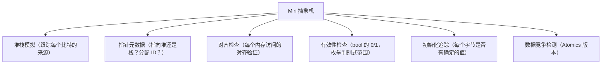
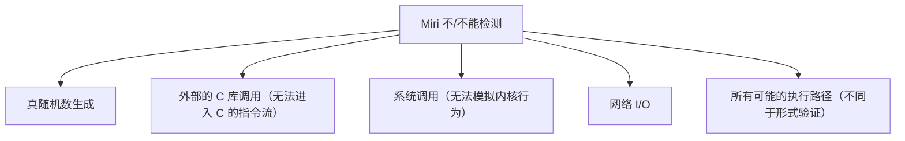

# Unsafe Rust的计算机科学边界

## 前置问题

1. Rust 声称是"内存安全的语言"。既然 safe Rust 已经很安全了，为什么还需要 `unsafe`？究竟什么操作"安全 Rust 无法表达但硬件可以执行"？
2. 当你在 unsafe 块中解引用一个裸指针时，CPU 只是执行一条 `mov` 指令。为什么这是 unsafe？`mov` 指令在硬件层面可能产生什么后果？
3. C 的未定义行为（UB）长期以来是系统编程的噩梦。Rust 的 UB 列表与 C 有何不同？Miri 如何检测 UB？

---

## 1. 安全与不安全的边界

### 1.1 理论基础：定理与公理

将 safe Rust 类比为一个**形式定理**，而不安全代码是这个定理的**公理**：

```
安全 Rust = (类型系统 + 借用规则 + 生命周期) 可以证明的所有内存安全性
Unsafe Rust = 你可以打破规则，但必须坚持不变式（安全的前提条件）

形式化类比：
  Theorem: "所有 safe Rust 程序都是内存安全的"
  Axioms:  unsafe 块中程序员断言的安全性不变式
  Proof:   编译器验证 all accesses satisfy invariants
```

### 1.2 什么操作需要 unsafe

| 操作 | 为什么需要 unsafe |
|------|------------------|
| 解引用裸指针 | 指针可能悬挂/无效，编译器无法检查 |
| 调用 unsafe 函数 | 被调用函数可能违反安全不变式 |
| 访问或修改可变静态变量 | 数据竞争和重入问题 |
| 实现 unsafe trait（Send/Sync） | 程序员断言线程安全 |
| 访问 union 的字段 | union 类型的表示不确定 |
| 操作未初始化内存 | 编译器假设所有值都被初始化 |

---

## 2. 裸指针：回归 C 的层级

### 2.1 裸指针与 Rust 引用的对比

```rust
// Rust 引用：编译时检查所有约束
let x = 5i32;
let r: &i32 = &x;        // 不能被悬挂
let mr: &mut i32 = &mut x;  // 独占

// 裸指针：无任何编译时检查
let p: *const i32 = &x as *const i32;
let mp: *mut i32 = &mut x as *mut i32;
// 可以任意移动、修改、甚至悬挂
```

### 2.2 裸指针的 ASM

```rust
unsafe {
    let x = 42i32;
    let p: *const i32 = &x;  // &x 产生 LEA 指令
    let val = *p;            // *p 产生 MOV 指令
}
```

```asm
; 裸指针解引用 = 普通 mov 指令
lea  rax, [rsp+4]      ; p = &x
mov  eax, [rax]        ; val = *p — 与普通引用解引用完全一致
```

**核心**：裸指针在机器码层面与引用完全相同。区别纯粹在于*编译器是否信任这个指针有效*。

### 2.3 指针算术运算

```rust
unsafe {
    let arr: [i32; 4] = [10, 20, 30, 40];
    let base: *const i32 = arr.as_ptr();
    // ptr::add 生成更多指令：包括潜在的溢出检查（取决于编译配置）
    let third = *base.add(2);  // = 30

    // 直接用偏移（更底层）
    let third = *base.offset(2);  // 旧的 API，不检查溢出
}
```

```asm
; base.add(2) 等效：
lea  rax, [rdi + 8]    ; rdi = base, 2 * sizeof(i32) = 8
mov  eax, [rax]
```

---

## 3. `MaybeUninit`：与未初始化内存共处

### 3.1 为什么需要它

Rust 的内存模型假设：如果值存在，那么它是有效的。这包括 `bool` 必须是 0 或 1，枚举判别式必须在有效范围内等。

```rust
// 这个代码是未定义行为（如果被实际编译和使用）
// let x: bool;  // 未初始化，读它是 UB
// println!("{}", x);
```

`MaybeUninit` 允许暂时持有未初始化的值：

```rust
use std::mem::MaybeUninit;

let mut buf: [MaybeUninit<u8>; 1024] = unsafe {
    MaybeUninit::uninit().assume_init()  // 安全的未初始化数组
};
```

### 3.2 应用场景：性能关键的数据结构

```rust
// Vec 的内部分配（简化）
fn allocate_vec<T>(capacity: usize) -> Vec<T> {
    unsafe {
        let layout = Layout::array::<T>(capacity).unwrap();
        let ptr = alloc(layout) as *mut T;
        // 此时，分配的内存是未初始化的
        // Vec 用 len 追踪哪些元素已初始化
        Vec { buf: RawVec::from_raw_parts(ptr, capacity), len: 0 }
    }
}
```

### 3.3 MMIO 中的未初始化访问

在驱动开发中，硬件寄存器映射到特定物理地址。这些寄存器的值不是由程序初始化的一一它们由硬件写入：

```rust
// 内存映射 I/O（MMIO）
const GPIO_BASE: *mut u32 = 0x4002_0000 as *mut u32;
unsafe {
    let val = ptr::read_volatile(GPIO_BASE.add(3));  // 读取硬件寄存器
}
```

---

## 4. `repr(C)` 的精确控制

### 4.1 为什么需要 repr(C)

Rust 默认的结构体布局是**未指定的**（编译可以选择任何高效布局）。但在 FFI 场景中，布局必须与 C 兼容：

```rust
#[repr(C)]
struct RustStruct {
    a: u8,
    b: u32,  // 插入 3 字节填充以保证 C 兼容
    c: u64,
}

// 对应 C 结构：
// struct CStruct {
//     uint8_t a;
//     // 3 bytes padding
//     uint32_t b;
//     uint64_t c;
// };
// sizeof == 16, alignof == 8
```

### 4.2 repr(C) 的 ASM 效应

```rust
#[repr(C)]
struct Foo { a: u8, b: u32 }

// 访问 b：偏移量固定为 4（C ABI 保证）
fn get_b(f: &Foo) -> u32 { f.b }
```

```asm
; get_b:
; &f 在 rdi 中
mov  eax, [rdi + 4]    ; b 始终在偏移 4 处（固定布局）
ret
```

### 4.3 repr(align) 和 repr(packed)

```rust
#[repr(align(64))]
struct AlignedTo64 {
    data: u32,
}  // sizeof = 64

#[repr(packed)]
struct Packed {
    a: u8,
    b: u32,  // 无对齐填充！
}  // sizeof = 5，但访问 b 可能触发未对齐访问异常
```

---

## 5. Rust 的未定义行为列表

### 5.1 未定义行为

| UB | 描述 | C 对应的 UB |
|----|------|------------|
| 数据竞争 | 两个线程同时访问同一位置，至少一个写，无同步 | 相同 |
| 悬挂/空指针解引用 | 读/写无效的指针 | 相同 |
| 未对齐指针解引用 | 读/写未对齐的指针（除 repr(packed)） | 相同 |
| 无效的 bool 值 | bool 值不是 0 或 1 | 不同的表示 |
| 无效的枚举判别式 | enum 的判别式值超出有效范围 | 类似（C union 也有此 UB） |
| 产生悬挂引用 | 创建一个悬垂引用（即使不立即使用也是 UB） | C 无此层级 |
| 错误的函数指针调用 | 通过类型不匹配的 fn 指针调用 | 相同 |
| 违反别名规则 | 通过两个可变指针访问同一内存 | 类似 C 的 strict aliasing |
| 未初始化的内存读 | 读未初始化的内存（除 `MaybeUninit`） | C 相同 |
| 类型不匹配 | transmute 到无效类型 | C 相同 |

### 5.2 Rust 特有的 UB

```rust
// Rust UB: 仅通过创建悬垂引用就是 UB
unsafe {
    let dangling_ref: &i32 = std::mem::zeroed();  // UB! 创建了无效引用
    // 即使不访问 *dangling_ref，仅仅是创建它也是 UB
}

// Rust UB: 无效的 bool
let bad_bool: bool = unsafe { std::mem::transmute(3u8) };
// bool 必须是 0 或 1；任何其他值都是 UB
```

---

## 6. Miri：未定义行为探测器

### 6.1 什么是抽象解释

Miri (Mid-level IR Interpreter) 是 Rust 编译器提供的 UB 探测器。它使用**抽象解释**在编译时虚拟执行程序：



### 6.2 Miri 的局限性



### 6.3 使用 Miri

```bash
# 将 Miri 作为组件安装
rustup component add miri

# 运行 Miri
cargo miri test
cargo miri run
```

---

## 7. Unsafe 的最佳实践

### 7.1 安全抽象层

```rust
// 安全抽象模式：将 unsafe 封装在安全接口中
pub struct MyBuffer {
    ptr: *mut u8,
    len: usize,
    cap: usize,
}

impl MyBuffer {
    /// 安全：检查边界
    pub fn get(&self, index: usize) -> Option<u8> {
        if index < self.len {
            Some(unsafe { *self.ptr.add(index) })
        } else {
            None
        }
    }

    /// 安全：检查容量
    pub fn push(&mut self, value: u8) {
        assert!(self.len < self.cap, "buffer full");
        unsafe {
            self.ptr.add(self.len).write(value);
        }
        self.len += 1;
    }
}
```

### 7.2 unsafe 代码的合约

```rust
/// # Safety
///
/// `ptr` 必须对齐到 `T` 的对齐要求。
/// `ptr` 必须在 `T` 的大小范围内有效以读。
/// `ptr` 必须指向正确初始化的 `T` 值。
pub unsafe fn read_from_ptr<T>(ptr: *const T) -> T {
    ptr::read(ptr)
}
```

---

## 8. 与 C 的 unsafe 比较

### 8.1 C 整体是不安全的

```c
// C 中没有任何标记阻止这些操作
char *p = NULL;
*p = 'a';         // UB（空指针解引用）

int *q;
*q = 10;          // UB（未初始化指针解引用）

char buf[4];
buf[10] = 'x';    // UB（缓冲区溢出）

int x = 42;
free(&x);         // UB（释放非堆内存）
```

### 8.2 Rust 的 unsafe 有边界

```rust
// Rust: unsafe 块清晰地标记了危险区域
fn main() {
    // buf[10] = 'x';  // ❌ 编译错误：safe Rust 不允许越界
    unsafe {
        // 只有这部分可以违反安全规则
        let p: *mut u8 = std::ptr::null_mut();
        // *p = 42;  // 程序员的责任：如果这样做是 UB
    }
    // 回到安全区域
}
```

---

## 9. FFI 中的 unsafe

### 9.1 调用 C 函数

```rust
extern "C" {
    fn abs(input: i32) -> i32;
}

fn main() {
    unsafe {
        println!("Absolute value of -3 according to C: {}", abs(-3));
    }
}
```

调用过程（汇编）：

```asm
; unsafe { abs(-3) }:
mov  edi, -3        ; 第一个参数在 edi
call abs            ; 直接调用 C 函数（无任何包装）
mov  [rsp+4], eax   ; 存储返回值
; Rust 和 C 使用相同的 System V AMD64 ABI
```

---

## 本章考查

### 概念考查（每题2分，共20分）

1. Rust 中 unsafe 的关键含义是什么？
   - A) 编译器不检查内存安全，由程序员负责验证安全不变式
   - B) 代码不能编译
   - C) 代码运行更慢
   - D) 必须使用汇编

2. 裸指针解引用 (`*const T`) 在汇编层面等价于：
   - A) `syscall` 指令
   - B) `mov` 指令（从地址加载数据）
   - C) `jmp` 指令
   - D) 虚表分发

3. Miri 使用什么技术来检测未定义行为？
   - A) 暴力测试
   - B) 抽象解释（在抽象机上虚拟执行 MIR，追踪每个值的来源和状态）
   - C) 运行在真实硬件上
   - D) 形式化验证

4. `MaybeUninit<T>` 的用途是？
   - A) 自动初始化内存
   - B) 表示可能未被初始化的内存，允许以受控的方式延迟初始化
   - C) 强制内存分配
   - D) 替代 Box

5. `#[repr(C)]` 的作用是？
   - A) 使 Rust 代码编译为 C 代码
   - B) 为结构体提供与 C 语言兼容的精确内存布局
   - C) 标记为 C 风格声明
   - D) 自动生成 C 的 typedef

6. 为什么在 safe Rust 中创建悬挂引用（即使不访问它）也是未定义行为？
   - A) 只是一个设计缺陷
   - B) Rust 的语义将引用本身定义为"必须有效"——存在即意味着可被安全解引用
   - C) 因为编译器会崩溃
   - D) 没有原因

7. `extern "C"` 块声明一个函数时，Rust 如何调用它？
   - A) 通过系统调用
   - B) 使用与 C 相同的 ABI（如 x86_64 System V ABI），直接 `call` 指令
   - C) 通过 Rust 包装层
   - D) 通过套接字

8. 在 unsafe Rust 中，数据竞争被视为：
   - A) 允许的行为
   - B) 未定义行为（UB），即使用 unsafe 也不能违反
   - C) 编译器警告
   - D) 逻辑错误但安全

9. `std::mem::transmute` 可以在 safe Rust 中使用吗？
   - A) 是，因为它是安全的
   - B) 否，因为它可以将任意类型转换为任何其他类型，可能违反类型安全（需要 unsafe）
   - C) 只在 debug 模式安全
   - D) 只能在 const 上下文中使用

10. unsafe 代码的作者必须遵守的"合约"是：
    - A) 与编译器无关
    - B) 必须在 unsafe 块内维持所有 Rust 安全不变式（例如引用有效、对齐正确、无数据竞争）
    - C) 只是注释而已
    - D) 只有 Rust 团队需要关心

<details><summary>点击查看答案</summary>

1. **A** — unsafe 表示程序员负责维护安全不变式。
2. **B** — 裸指针解引用就是一条 `mov` 指令。
3. **B** — Miri 使用抽象解释在 MIR 上检测 UB。
4. **B** — `MaybeUninit` 允许持有未初始化的内存，用于延迟初始化。
5. **B** — `#[repr(C)]` 保证 C 兼容的精确布局。
6. **B** — Rust 的语义要求引用存在即有效，创建悬挂引用本身就是 UB。
7. **B** — 使用与 C 相同的 ABI 直接 `call` 目标函数。
8. **B** — 数据竞争在 safe 和 unsafe Rust 中都始终是 UB。
9. **B** — `transmute` 需要 unsafe 因为它可以绕过所有类型检查。
10. **B** — unsafe 代码作者必须手动维护所有安全不变式。
</details>

### 判断正误（每题2分，共20分）

1. Unsafe 代码允许违反 Rust 的所有规则，包括类型安全和内存安全。
2. `MaybeUninit<u8>` 的解引用在 safe Rust 中就是安全的。
3. Miri 可以检测所有可能的内存错误。
4. `#[repr(packed)]` 结构体可能产生未对齐的字段访问，从而在某些架构上引发硬件异常。
5. 裸指针解引用在汇编层面比 Rust 引用更快。
6. 数据竞争在 unsafe Rust 中也是 UB。
7. FFI 使用 `extern "C"` 时需要确保 C 侧和 Rust 侧的布局完全一致。
8. `std::mem::transmute::<bool, u8>(true)` 在 safe Rust 中安全可用。
9. unsafe 函数的调用者也必须在 unsafe 块中调用它。
10. Rust 的 UB 列表比 C 的 UB 列表更大（包含更多情况）。

<details><summary>点击查看答案</summary>

1. **错误** — unsafe 允许解引用裸指针、调用 unsafe 函数等特定操作，但不允许违反所有规则（如数据竞争仍然 UB）。
2. **错误** — `MaybeUninit` 的读取需要 unsafe，因为读未初始化内存是 UB。
3. **错误** — Miri 只检测执行的路径，不检测所有可能的路径。
4. **正确** — packed 结构体可能产生未对齐指针，某些架构会触发总线错误。
5. **错误** — 裸指针和引用在汇编层面完全相同（都是 `mov` 指令）。
6. **正确** — 数据竞争是未被允许的 UB，即使在 unsafe 中。
7. **正确** — FFI 的契约要求两侧的布局和 ABI 完全匹配。
8. **错误** — `transmute` 是 unsafe 函数，必须在 unsafe 块中使用。
9. **正确** — unsafe 函数的调用者必须在 unsafe 块中调用（这是 unsafe 的传播规则）。
10. **错误** — Rust 的 UB 列表比 C 更小且更精确，因为很多 UB 已被类型系统消除。
</details>

### 代码分析（每题3分，共15分）

1. 以下代码有什么问题？
```rust
let v = vec![1, 2, 3];
unsafe {
    let p: *const i32 = v.as_ptr();
    drop(v);
    println!("{}", *p);  // ?
}
```
A) 没有，一切安全
B) 编译错误
C) UB：v 被释放后 p 变成悬挂指针，解引用悬挂指针
D) 只会在运行时 panic

<details><summary>点击查看答案</summary>
**C** — `drop(v)` 释放了 Vec 的堆内存，`p` 变成悬挂指针，解引用是 UB。
</details>

2. 以下代码是否安全？
```rust
let x: bool = unsafe { std::mem::transmute(3u8) };
```
A) 安全，3 大于 1，自动转为 true
B) 不安全：bool 的值必须是 0 或 1，3 是无效的 bool 值→UB
C) 安全，编译器自动处理
D) 取决于上下文

<details><summary>点击查看答案</summary>
**B** — bool 只有两个有效值（0=false, 1=true）。3 是无效值，transmute 到无效 bool 是 UB。
</details>

3. 以下 FFI 定义有什么风险？
```rust
extern "C" {
    fn get_value() -> i32;
}
```
A) 没有风险
B) 不安全：C 侧的返回类型可能不匹配或函数不存在
C) 运行时自动检查类型
D) Rust 会自动处理

<details><summary>点击查看答案</summary>
**B** — FFI 定义是 unsafe，Rust 无法验证 C 侧的实现是否正确。返回类型不一致会导致 UB。
</details>

4. 以下 Miri 检测的结果是什么？
```rust
let mut x = 5;
let r1 = &x as *const i32;
let r2 = &mut x as *mut i32;
unsafe {
    *r2 = 10;
    println!("{}", *r1);
}
```
A) 通过
B) 运行时 panic
C) Miri 可能报告 UB：同时存在 *const 和 *mut 裸指针可导致别名冲突
D) 编译错误

<details><summary>点击查看答案</summary>
**C** — 创建 `*const T` 和 `*mut T` 同时存在可能导致 LLVM 的 `noalias` 分析错误。Rust 规范中为裸指针的别名规则更宽松，但创建过程中产生了借用，可能引发 UB。
关于这个题: 事实上，在 Rust 中，通过 `&x` 创建的 `*const i32` 和通过 `&mut x` 创建的 `*mut i32`，在 unsound 时可能违反 Rust 的 Stacked Borrows 规则（Miri 会检测到）。所以 Miri 会报告错误。
</details>

5. 以下代码为什么需要用 unsafe？
```rust
let mut v = vec![1, 2, 3];
let ptr = v.as_mut_ptr();
unsafe {
    ptr.add(2).write(10);
}
```
A) 不需要 unsafe
B) 需要 unsafe，因为直接操作裸指针绕过了借用检查和边界检查
C) 需要 unsafe 因为 Vec 不支持修改
D) 因为编译器优化

<details><summary>点击查看答案</summary>
**B** — 操作裸指针需要 unsafe 因为它绕过了所有安全检查（借用检查、边界检查等）。
</details>

### 编程大题（15分）

**题目**: 使用 unsafe 实现 `split_at_mut`——将一个可变切片分割为两个不重叠的可变子切片。

```rust
// 要求：
// 1. 使用裸指针和 unsafe 实现 fn split_at_mut<T>(slice: &mut [T], mid: usize) -> (&mut [T], &mut [T])
// 2. 在 unsafe 内部做边界检查（确保 mid <= slice.len()）
// 3. 使用 ptr::slice_from_raw_parts_mut 返回两个子切片
// 4. 编写初步测试

pub fn split_at_mut<T>(slice: &mut [T], mid: usize) -> (&mut [T], &mut [T]) {
    // TODO
}

#[cfg(test)]
mod tests {
    use super::*;

    #[test]
    fn test_split() {
        let mut arr = [1, 2, 3, 4, 5];
        let (left, right) = split_at_mut(&mut arr, 3);
        assert_eq!(left, &[1, 2, 3]);
        assert_eq!(right, &[4, 5]);
        left[0] = 10;
        right[1] = 20;
        assert_eq!(arr, [10, 2, 3, 4, 20]);
    }

    #[test]
    #[should_panic]
    fn test_bad_split() {
        let mut arr = [1, 2, 3];
        split_at_mut(&mut arr, 10);
    }
}
```

<details><summary>点击查看答案</summary>

```rust
pub fn split_at_mut<T>(slice: &mut [T], mid: usize) -> (&mut [T], &mut [T]) {
    let len = slice.len();
    assert!(mid <= len, "split index out of bounds");

    let ptr = slice.as_mut_ptr();
    unsafe {
        (
            std::slice::from_raw_parts_mut(ptr, mid),
            std::slice::from_raw_parts_mut(ptr.add(mid), len - mid),
        )
    }
}

#[cfg(test)]
mod tests {
    use super::*;

    #[test]
    fn test_split() {
        let mut arr = [1, 2, 3, 4, 5];
        let (left, right) = split_at_mut(&mut arr, 3);
        assert_eq!(left, &[1, 2, 3]);
        assert_eq!(right, &[4, 5]);
        left[0] = 10;
        right[1] = 20;
        assert_eq!(arr, [10, 2, 3, 4, 20]);
    }

    #[test]
    #[should_panic]
    fn test_bad_split() {
        let mut arr = [1, 2, 3];
        split_at_mut(&mut arr, 10);
    }
}
```

**评分标准**：
- 正确实现边界检查（4分）
- 正确使用 `as_mut_ptr` 和 `ptr.add`（3分）
- 正确使用 `from_raw_parts_mut` 创建两个不重叠的子切片（4分）
- unsafe 块最小化（仅包围必须的操作）（2分）
- 测试完备性（2分）
</details>

### 填空题（每题1分，共5分）

1. Rust 的 unsafe 能力包括：解引用 `____`、调用 `____` 函数、访问 `____` 变量、实现 `____` trait。
2. Miri 通过 `____` 技术在 `____` IR 上执行程序以检测 UB。
3. `#[repr(C)]` 保证结构体的 `____` 和 `____` 与 C 一致。
4. Rust 的 UB 包括：`____`、`____`、`____`（列出三个便可）。
5. 在 unsafe 块中，程序员负责维护所有 Rust `____`。

<details><summary>点击查看答案</summary>

1. 裸指针（raw pointer），unsafe 函数，可变静态（mutable static），unsafe trait
2. 抽象解释（abstract interpretation），MIR
3. 布局（layout），对齐（alignment）
4. 数据竞争（data race），悬挂引用解引用（dangling dereference），无效的 bool 值（incorrect bool）
5. 安全不变式（safety invariants）
</details>

### 代码补全（共5分）

1. 通过 unsafe 实现零分配的字符串到字节数组转换（2分）：
```rust
// 将 String 转为字节数组（零拷贝，使用 Vec 的底层指针）
fn string_to_bytes(s: String) -> Vec<u8> {
    unsafe {
        let mut s = std::mem::ManuallyDrop::new(s);
        let ptr = s.____();
        let len = s.____();
        let cap = s.____();
        ____::from_raw_parts(ptr, len, cap)
    }
}
```

<details><summary>点击查看答案</summary>

```rust
let ptr = s.as_mut_ptr();
let len = s.len();
let cap = s.capacity();
Vec::from_raw_parts(ptr, len, cap)
```
</details>

2. FFI 调用 C 标准库函数（2分）：
```rust
extern "____" {
    fn strlen(s: *const ____) -> usize;
}

fn main() {
    let s = "hello\0";
    unsafe {
        assert_eq!(____(s.as_ptr() as *const i8), 5);
    }
}
```

<details><summary>点击查看答案</summary>

```rust
extern "C" {
    fn strlen(s: *const i8) -> usize;
}
assert_eq!(strlen(s.as_ptr() as *const i8), 5);
```
</details>

3. 安全抽象中的 unsafe 边界（1分）：
```rust
// unsafe 代码只在该模块内使用
mod internal {
    pub unsafe fn dangerous() { /* ... */ }
}

mod public {
    use super::internal;
    pub fn safe_api() {
        // 调用内部 unsafe 函数
        ____ {
            internal::dangerous();
        }
    }
}
```

<details><summary>点击查看答案</summary>

```rust
unsafe {
    internal::dangerous();
}
```
</details>

---

## 本章小结

Unsafe Rust 是 Rust 安全模型的基石——它是连接"安全的理论"和"硬件的现实"的桥梁：

- **unsafe 是公理**：safe Rust = 可证明安全；unsafe = 程序员提供安全 invariant
- **裸指针** = C 指针 = `mov` 指令；编译器不保护，程序员负责
- **MaybeUninit** 维护初始化状态，延迟初始化，避免不必要的零填充
- **repr(C)** 精确控制布局，用于 FFI 和硬件交互
- **UB 列表**比 C 更小更精确——Rust 消除了常见的 UB（如 strict aliasing）
- **Miri** 用抽象解释在 MIR 上检测 UB——不是形式化验证但有独特的价值

使用 unsafe 的核心原则：最小化 unsafe 块，在安全接口中封装 unsafe，编写清晰的 `# Safety` 文档，用 Miri 验证。

**下一章**：[[10-编译器如何理解你的代码]] — 跟随代码走完 rustc 编译管线。

---

*深度阅读*：Ralf Jung, "The Rust Reference: Unsafety"; Rustonomicon; Miri documentation
