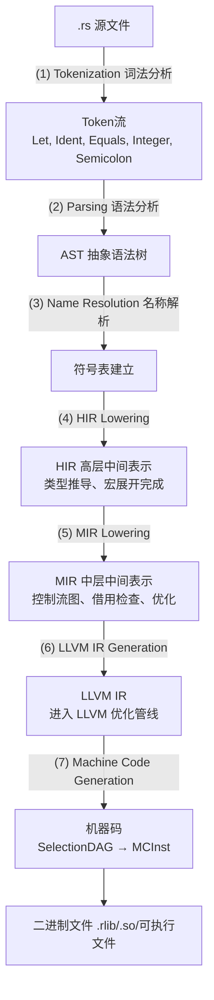
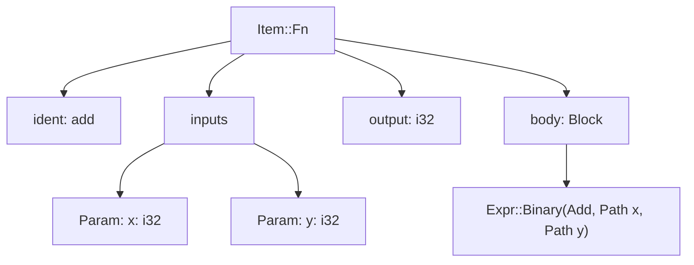
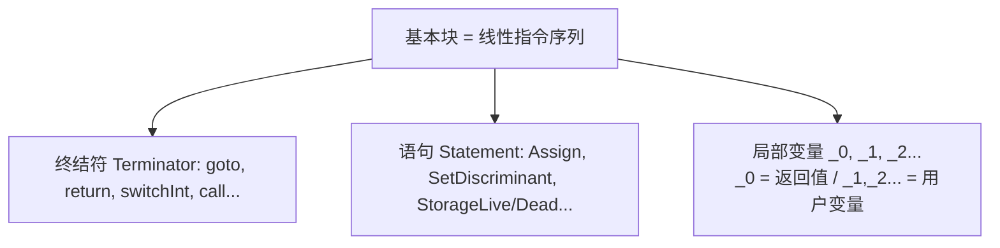
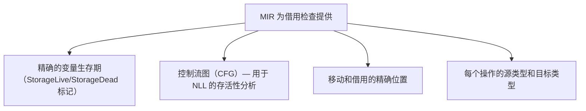
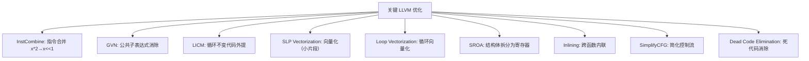
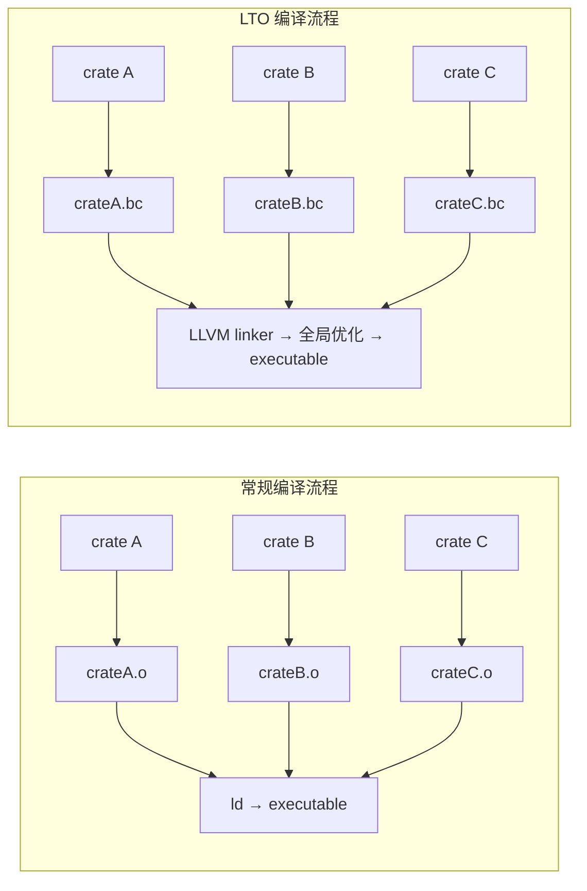

# 编译器如何理解你的代码

## 前置问题

1. 当你在终端输入 `cargo build` 后，你的 `.rs` 文件经过了哪些形态的"变形"才最终变成 CPU 可以执行的机器码？写出从文本到二进制的完整阶段名称。
2. 借用检查为什么在 MIR 阶段（而非 AST 或 HIR）发生？MIR 相比 AST 有哪些形式上的简化使其适合静态分析？
3. LLVM 的 SSA（Static Single Assignment）形式意味着什么？为什么 `phi` 指令对条件分支优化至关重要？

---

## 1. rustc 编译管线全览

### 1.1 七个主要阶段



### 1.2 检查编译管线输出

```bash
# 查看 HIR
cargo rustc -- -Z unpretty=hir

# 查看 MIR
cargo rustc -- --emit=mir

# 查看 LLVM IR
cargo rustc -- --emit=llvm-ir

# 查看汇编
cargo rustc -- --emit=asm

# 跟踪编译管线的具体步骤
rustc -Z time-passes src/main.rs
```

---

## 2. AST（抽象语法树）

### 2.1 AST 的结构

```rust
fn add(x: i32, y: i32) -> i32 {
    x + y
}
```

对应的 AST（简化）：



### 2.2 AST 的局限性

AST 保留了完整的语法信息（括号位置、空格等），但在以下方面不足：
- **类型信息缺失**：AST 中的函数调用还不知道具体类型
- **控制流模糊**：`if/else` 是语法结构，不是控制流图
- **宏未展开**：AST 是宏展开之前的表示

---

## 3. HIR（High-Level IR）

### 3.1 HIR 的关键特性

HIR 是 AST 经过类型检查和名称解析后的表示。关键变化：

- **去糖**：`for` 循环展开为 `loop` + `match`，`if let` 展开为 `match`
- **类型标注**：每个表达式节点都标注了类型
- **显式悬垂**：trait 方法被解析到具体的 impl
- **宏展开完成**：所有宏调用已在 AST→HIR 过程中展开

```rust
// 源代码
fn main() {
    for i in 0..5 {
        println!("{i}");
    }
}
```

HIR 展开后（概念）：

```rust
// HIR: for 去糖为 loop + match
fn main() {
    let mut _iter = std::iter::IntoIterator::into_iter(0..5);
    loop {
        match std::iter::Iterator::next(&mut _iter) {
            std::option::Option::Some(i) => {
                std::io::_print(format_args!("{i}\n"));
            }
            std::option::Option::None => break,
        }
    }
}
```

### 3.2 HIR 的用途

- **Clippy**（lint 工具）工作在 HIR 层
- **rust-analyzer** 使用类型化的 HIR 提供 IDE 功能
- **类型检查**（trait 解析、coherence 检查）

---

## 4. MIR（Mid-Level IR）

### 4.1 MIR 的关键简化

MIR 将 HIR 降低为一种**简化的控制流图（CFG）**表示：

```rust
// 原始 Rust
let mut x = 0;
while x < 10 {
    x += 1;
}
```

MIR 等价（以控制流块表示）：

```
bb0: {
    _1 = 0;                    // let mut x = 0
    goto bb1;
}

bb1: {
    _2 = _1 < 10;              // x < 10
    switchInt(_2) -> [false: bb3, true: bb2];
}

bb2: {
    _1 = _1 + 1;               // x += 1
    goto bb1;
}

bb3: {
    return;
}
```

### 4.2 MIR 的 SSA 形式

MIR 采用类似 SSA 的形式：每个变量恰分配一次（除可变异局部变量外）。



### 4.3 MIR 上的借用检查

借用检查器（borrowck）在 MIR 上运行，利用以下信息：



---

## 5. MIR 优化

### 5.1 MIR 内联

```
// MIR 内联发生在泛型函数具体化后
fn foo(x: i32) -> i32 { x + 1 }

fn bar() -> i32 {
    let a = foo(5);   // ← MIR 内联展开此调用
    a + 2
}
```

内联后：

```
fn bar() -> i32 {
    let a = 5 + 1;    // foo(5) 内联展开
    a + 2
}
```

### 5.2 常量折叠

```rust
const fn fib(n: u32) -> u32 {
    match n { 0 => 0, 1 => 1, n => fib(n-1) + fib(n-2) }
}
let x = fib(10);  // 编译时计算 = 55！不产生任何运行时代码
```

MIR 常量求值器（miri engine）在编译时执行常量函数和表达式。

### 5.3 死代码消除

```
MIR 死代码消除：
fn example(flag: bool) -> i32 {
    let a = expensive_computation();  // 未使用→消除
    let b = 0;
    if flag {
        b + 1
    } else {
        2
    }
    // a 从未被读取→StorageDead→消除
}
```

---

## 6. LLVM IR：进入工业级优化

### 6.1 从 MIR 到 LLVM IR

```rust
// Rust
pub fn square(x: i32) -> i32 {
    x * x
}
```

```llvm
; LLVM IR（简化）
define i32 @square(i32 %x) unnamed_addr #0 {
start:
  %0 = mul i32 %x, %x
  ret i32 %0
}
```

### 6.2 LLVM 优化通道

LLVM 应用数十个优化通道：



### 6.3 自动向量化示例

```rust
fn sum_slice(s: &[i32]) -> i32 {
    s.iter().sum()
}
```

经过 LLVM 向量化后：

```asm
; sum_slice 向量化（AVX2）:
    vpxor   ymm0, ymm0, ymm0       ; 归零 ymm0 (256-bit 寄存器)
.L_loop:
    vpaddd  ymm0, ymm0, [rdi + rcx*4]  ; 一次处理 8 个 i32
    add     rcx, 8
    cmp     rcx, rsi
    jne     .L_loop
    ; 水平归约: 将 8 个 i32 在 ymm0 中相加
    vextracti128 xmm1, ymm0, 1
    vpaddd  xmm0, xmm0, xmm1
    ; ... 最终标量加法 ...
    ret
```

---

## 7. LTO（Link-Time Optimization）

### 7.1 跨 crate 优化



LTO 允许跨 crate 内联和死代码消除：

```rust
// crate A
pub fn helper(x: i32) -> i32 { x * 2 }

// crate B
pub fn compute() -> i32 {
    helper(21)
}
// 在 LTO 下：helper 被内联到 compute 中：21 * 2 = 42
```

### 7.2 ThinLTO

```rust
// Cargo.toml
[profile.release]
lto = "thin"       // 或 "fat" (全 LTO)
codegen-units = 1  // 提高 LTO 效果
```

ThinLTO 是 LLVM 的轻量级 LTO：跨模块调用图 + 并行优化 → 近乎 fat LTO 的性能提升，但增量编译时间大幅降低。

---

## 8. 汇编生成：从 IR 到机器码

### 8.1 指令选择

```
LLVM IR:
  %result = add i32 %a, %b

指令选择 → x86_64:
  add eax, ebx    ; 如果 a 在 eax，b 在 ebx
```

### 8.2 寄存器分配

```
LLVM 虚拟寄存器 → 物理寄存器的映射

MIR:
  _42 = _12 + _17   ; 虚拟寄存器

寄存器分配后：
  eax = ebx + ecx   ; 或使用栈溢出（spill）到 [rsp+offset]
```

寄存器分配使用图着色算法（graph coloring），将虚拟寄存器映射为最少数量的物理寄存器。

### 8.3 指令调度

CPU 流水线需要指令之间无数据依赖。调度器重排指令以减少流水线停顿：

```
未调度:
  add eax, ebx   ; 每个指令周期1
  imul ebx, ecx  ; 必须等 ebx 准备好 → 停顿

调度后:
  imul edi, ecx  ; 使用寄存器 edi 先用
  add eax, ebx   ; 与 imul 并行执行
```

---

## 9. 贯穿全管线的示例

### 9.1 源文件

```rust
pub fn factorial(n: u64) -> u64 {
    match n {
        0 | 1 => 1,
        _ => n * factorial(n - 1),
    }
}
```

### 9.2 AST

```
Item::Fn "factorial"
  param: n: u64
  body: Expr::Match(n)
    Arm0: 0 | 1 => 1
    Arm1: _ => n * factorial(n - 1)
```

### 9.3 HIR

```
fn factorial(n: u64) -> u64 {
    match n {
        0 | 1 => 1,
        _ => n * factorial(n - 1),
    }  // 类型信息已标注在每个子表达式上
}
```

### 9.4 MIR

```
fn factorial(_1: u64) -> u64 {
    let mut _0: u64;

    bb0: {
        _2 = _1;
        switchInt(_2) → [0u64: bb1, 1u64: bb1, otherwise: bb2];
    }
    bb1: {
        _0 = 1u64;
        goto → bb3;
    }
    bb2: {
        _3 = _1 - 1u64;
        _4 = factorial(_3);
        _0 = _1 * _4;
        goto → bb3;
    }
    bb3: {
        return _0;
    }
}
```

### 9.5 LLVM IR

```llvm
define i64 @factorial(i64 %n) {
start:
  switch i64 %n, label %bb2 [
    i64 0, label %bb1
    i64 1, label %bb1
  ]

bb1:
  ret i64 1

bb2:
  %1 = sub i64 %n, 1
  %2 = call i64 @factorial(i64 %1)
  %3 = mul i64 %n, %2
  ret i64 %3
}
```

### 9.6 汇编（x86_64，-O2）

```asm
factorial:
    cmp rdi, 1
    ja  .L_recursive
    mov eax, 1
    ret
.L_recursive:
    push rbx
    mov rbx, rdi
    dec rdi
    call factorial
    imul rax, rbx
    pop rbx
    ret
```

---

## 10. 对比 C/C++ 编译管线

| 阶段 | Rust (rustc) | C/C++ (Clang/GCC) |
|------|-------------|-------------------|
| 词法/语法 | rustc parser | Clang parser |
| 高层 IR | HIR (类型化) | Clang AST (但也有类型检查) |
| 中层 IR | MIR (借用检查) | 无直接对应（Clang 直接到 LLVM IR） |
| 借用/所有权 | MIR borrowck | N/A |
| 优化 IR | LLVM IR | LLVM IR (或 GCC GIMPLE/RTL) |
| LTO | 支持 (thin/fat) | 支持 |
| 增量编译 | 支持 | 部分支持 |

---

## 本章考查

### 概念考查（每题2分，共20分）

1. rustc 编译管线的正确顺序是：
   - A) Tokenization → HIR → MIR → AST → LLVM IR → Machine Code
   - B) Tokenization → AST → HIR → MIR → LLVM IR → Machine Code
   - C) AST → MIR → LLVM IR → HIR → Machine Code
   - D) AST → HIR → Tokenization → MIR → Machine Code

2. 借用检查（borrowck）发生在哪个阶段？
   - A) AST（语法分析后）
   - B) HIR（高层 IR）
   - C) MIR（中层 IR）——利用 CFG 进行流敏感分析
   - D) LLVM IR

3. LLVM IR 采用的关键形式是：
   - A) UTF-8 文本编码
   - B) SSA (静态单赋值) —— 每个变量精确赋值一次
   - C) 前缀表示法
   - D) 波兰表示法

4. LTO (Link-Time Optimization) 使得：
   - A) 编译更快
   - B) 跨 crate/模块的内联和死代码消除
   - C) 语法分析更准确
   - D) 类型推导更精确

5. HIR 相比 AST 的主要优势是：
   - A) 更接近机器码
   - B) 类型信息已解析，宏已展开，适合 IDE 工具
   - C) 运行速度更快
   - D) 更小

6. MIR 中的 "StorageLive" / "StorageDead" 标记用于：
   - A) 内存分配
   - B) 变量生存期的精确追踪（为 NLL 借用检查提供信息）
   - C) 代码生成
   - D) 符号表

7. LLVM 的自动向量化能将以下循环优化为：
```rust
for &x in &slice { sum += x; }
```
   - A) 多个标量加法
   - B) SIMD 指令（如 paddd xmm）每次处理多个元素
   - C) 单线程处理
   - D) 递归调用

<details><summary>点击查看答案</summary>
7. **B** — 自动向量化将循环转换为 SIMD 指令并行处理。
</details>

8. MIR 被用于：
   - A) 仅输出调试信息
   - B) 借用检查、优化（内联/常量折叠）、unsafe 代码检查——即所有中级分析
   - C) 生成最终二进制
   - D) 外部 crate 互操作

9. ThinLTO 与 fat LTO 的主要区别：
   - A) ThinLTO 跨模块但并行执行，保持大部分 fat LTO 的优化效果但编译更快
   - B) 没有区别
   - C) ThinLTO 更慢但效果更好
   - D) ThinLTO 只能用于 debug 构建

10. `rustc --emit=mir` 显示什么？
    - A) 最终可执行文件
    - B) 程序的 MIR 表示（在 MIR 构建后、LLVM 代码生成前）
    - C) LLVM 汇编
    - D) 机器码

<details><summary>点击查看答案</summary>

1. **B** — 正确的顺序：Tokenization → Parsing → AST → HIR → MIR → LLVM IR → Machine Code。
2. **C** — 借用检查在 MIR 上运行，因为 MIR 有原始的控制流图。
3. **B** — LLVM IR 采用 SSA 形式（静态单赋值）。
4. **B** — LTO 允许跨 crate 优化（内联、死代码消除等）。
5. **B** — HIR 去糖后携带完整类型信息，适合 IDE 和分析工具。
6. **B** — StorageLive/Dead 标记变量的准确生存期。
7. **B** — 自动向量化生成 SIMD 指令（如 SSE/AVX）。
8. **B** — MIR 是所有中级分析和优化的基础。
9. **A** — ThinLTO 以较少的编译时间提供接近 fat LTO 的优化效果。
10. **B** — `--emit=mir` 输出 MIR 中间表示。
</details>

### 判断正误（每题2分，共20分）

1. MIR 的输出可以直接在 CPU 上运行。
2. 借用检查发生在 HIR 阶段，因为 HIR 有完整的类型信息。
3. LLVM IR 的 SSA 形式使得每个变量精确赋值一次。
4. HIR 在宏展开之前构建。
5. `rustc --emit=asm` 输出的是汇编代码。
6. LTO 使编译器可以看到跨 crate 的代码以进行内联。
7. MIR 中的 `StorageLive` 标记告诉借用检查器变量的存活时间。
8. LLVM 的寄存器分配使用图着色算法。
9. AST 包含了完整的类型信息。
10. `for` 循环在 HIR 中保持不变（不进行去糖）。

<details><summary>点击查看答案</summary>

1. **错误** — MIR 是中间表示，不能直接运行；需要再编译为机器码。
2. **错误** — 借用检查在 MIR 上运行（因其 CFG 表示和生存期标记）。
3. **正确** — SSA 形式要求每个变量精确赋值一次。
4. **错误** — HIR 构建在宏展开之后（AST→HIR 过程中宏已展开）。
5. **正确** — `--emit=asm` 输出汇编文本。
6. **正确** — LTO 提供跨 crate 的代码可见性。
7. **正确** — StorageLive/Dead 标记变量生存期。
8. **正确** — LLVM 使用图着色进行寄存器分配。
9. **错误** — AST 没有完整的类型信息（类型推导在 HIR 阶段完成）。
10. **错误** — `for` 循环在 HIR 中被去糖为 `loop + match`。
</details>

### 代码分析（每题3分，共15分）

1. 以下 MIR 片段对应的 Rust 代码是什么？
```
bb0: {
    _1 = 0;
    goto bb1;
}
bb1: {
    _3 = _1 < 10;
    switchInt(_3) → [false: bb3, true: bb2];
}
bb2: {
    _1 = _1 + 1;
    goto bb1;
}
bb3: {
    return;
}
```
A) `for i in 0..10 { }`
B) `let mut _1 = 0; while _1 < 10 { _1 += 1; }`
C) `if _1 < 10 { }`
D) `loop { break; }`

<details><summary>点击查看答案</summary>
**B** — `while _1 < 10 { _1 += 1; }` 产生三个基本块：初始化、条件检查+分支、循环体+更新。
</details>

2. 以下 LLVM IR 表示什么操作？
```llvm
%result = mul i32 %a, 2
```
A) `a + 2`
B) `a * 2`
C) `a << 1`
D) `a / 2`

<details><summary>点击查看答案</summary>
**B** — `mul i32 %a, 2` = a * 2。但 LLVM 优化通常将 `a*2` 转为 `a<<1`。
</details>

3. 以下命令输出什么？
```bash
rustc +nightly -Z unpretty=hir src/main.rs
```
A) 可执行文件
B) HIR 表示（人类可读的高层 IR）
C) MIR 表示
D) 抽象语法树

<details><summary>点击查看答案</summary>
**B** — `-Z unpretty=hir` 输出 HIR 表示。
</details>

4. 以下 MIR 片段的 `StorageLive` 和 `StorageDead` 表示什么？
```
StorageLive(_4);
_4 = const 42;
_3 = _4;
StorageDead(_4);
```
A) `_4` 只在 _3 的赋值期间存活
B) `_4` 的内存分配
C) `_4` 根本没有被使用
D) `_4` 是静态变量

<details><summary>点击查看答案</summary>
**A** — StorageLive 和 StorageDead 标志 `_4` 在这一范围内存活。
</details>

5. LTO 启用时以下哪个会发生？
```rust
// crate A
pub fn mul2(x: i32) -> i32 { x * 2 }

// crate B
pub fn compute() -> i32 {
    mul2(21)
}
```
A) `mul2` 不会被内联（跨 crate）
B) `mul2(21)` 的内联可能发生 → `21 * 2` 在编译时计算为 42
C) 两个 crate 被合并为一个
D) 不会优化

<details><summary>点击查看答案</summary>
**B** — LTO 允许跨 crate 内联，`mul2(21)` 可能被优化为 `42`。
</details>

### 编程大题（15分）

**题目**: 编写一个 Rust 程序，使用编译器内置的 `#[inline]` 属性和 `assert!` 宏来展示编译器优化的"常量传播"效果。然后解释编译器如何通过 MIR 和 LLVM IR 的优化通道将代码简化。

```rust
// 实现以下函数：
// 1. count_bits(n: u64) -> u32 返回二进制表示中 1 的数量
// 2. 在 main 中调用 count_bits(0xDEADBEEF) 并断言结果为 24
// 3. 解释：为什么编译器可以在编译时计算 count_bits(0xDEADBEEF)？
//    (提示：const fn)

// 答案应包括实现和说明。
```

<details><summary>点击查看答案</summary>

```rust
const fn count_bits(mut n: u64) -> u32 {
    let mut count = 0;
    while n != 0 {
        count += 1;
        n &= n - 1;  // 布莱恩·科尼根算法
    }
    count
}

fn main() {
    // 因为 count_bits 是 const fn，编译器可以在编译时计算
    // 在 MIR 常量求值阶段，25 的二进制 11001 中的 1 的数量被计算
    let result = count_bits(25);
    assert_eq!(result, 3);
    // 编译后，这变成 assert_eq!(3, 3) → 完全消除！

    // 甚至对复杂输入也同样：
    let result = count_bits(0xDEADBEEF);
    assert_eq!(result, 24);
    // MIR 常量求值器在编译时运行整个 count_bits 函数
    // 产生的机器码中不包含任何 count_bits 的计算代码
}
```

**编译器如何处理**：
1. `const fn` 告知编译器函数可以在编译时求值
2. MIR 常量求值器（miri engine）解释执行 MIR 版本的 `count_bits`
3. 结果替换所有编译时常量调用
4. LLVM 进一步可以消除这些调用

**评分标准**：
- 正确实现 `const fn` (5分)
- 正确解释常量求值过程 (5分)
- 展示编译时消除 (5分)
</details>

### 填空题（每题1分，共5分）

1. rustc 编译管线的七个主要阶段：`____` → `____` → `____` → `____` → `____` → `____` → `____`。
2. 借用检查在 `____` 阶段运行。
3. LLVM IR 采用 `____` 形式。
4. `____` 是程序能跨 crate 优化的关键 (LTO)。
5. 查看程序编译后的汇编使用命令 `____`。

<details><summary>点击查看答案</summary>

1. Tokenization → Parsing/ast → HIR → MIR → LLVM IR → Machine Code
2. MIR
3. SSA (静态单赋值)
4. LTO (Link-Time Optimization)
5. `cargo rustc -- --emit=asm` 或 `rustc --emit=asm`
</details>

### 代码补全（共5分）

1. 查看编译管线输出 (2分)：
```bash
# 查看 HIR
cargo rustc -- ____
# 查看 MIR
cargo rustc -- ____
# 查看汇编
cargo rustc -- ____
```

<details><summary>点击查看答案</summary>

```bash
cargo rustc -- -Z unpretty=hir
cargo rustc -- --emit=mir
cargo rustc -- --emit=asm
```
</details>

2. 在 MIR 中标记变量的生存时间 (1分)：
```rust
// MIR 的以下指令告诉借用检查器变量何时存活
____(_1);   // 变量 _1 的存储开始
_1 = 42;
____(_1);   // 变量 _1 的存储结束
```

<details><summary>点击查看答案</summary>

```
StorageLive(_1);
StorageDead(_1);
```
</details>

3. 使用 const fn 进行编译时计算 (2分)：
```rust
____ fn square(x: i32) -> i32 {
    x * x
}

fn main() {
    let arr: [i32; ____(3) as usize] = [0; 9];
    // 3^2 = 9 在编译时计算，数组大小在编译时确定
}
```

<details><summary>点击查看答案</summary>

```rust
const fn square(x: i32) -> i32 { x * x }
let arr: [i32; square(3) as usize] = [0; 9];
```
</details>

---

## 本章小结

Rust 编译器是一个多阶段的翻译管线，每个阶段有不同的表示和用途：

- **Tokenization** → **Parsing** → **AST**：语法层，理解程序的结构
- **HIR**：去糖后的表示，类型已解析——Clippy 和 IDE 的工作层
- **MIR**：控制流图表示——借用检查器、常量求值和 MIR 优化的核心层
- **LLVM IR**：通用优化层——自动向量化、LTO、寄存器分配
- **Machine Code**：最终目标——经过指令选择和调度后 CPU 可直接执行

理解编译管线对于调试、性能优化和深入理解 Rust 语义至关重要。可以通过 `--emit` 选项检查每个阶段的输出。

**下一章**：[[11-宏系统的编译原理]] — 从 C 预处理器到 Rust 的标记树宏，理解编译时元编程。

---

*深度阅读*：Rust Compiler Dev Guide；LLVM Language Reference Manual
