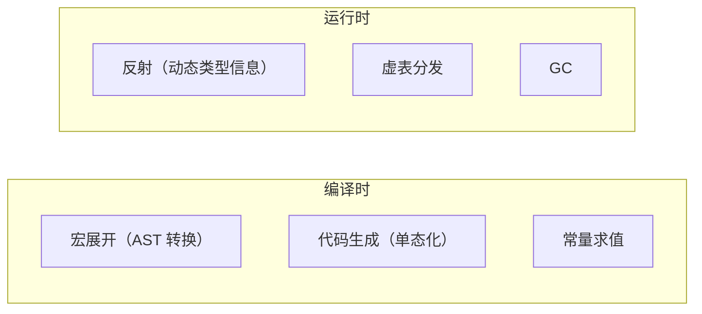
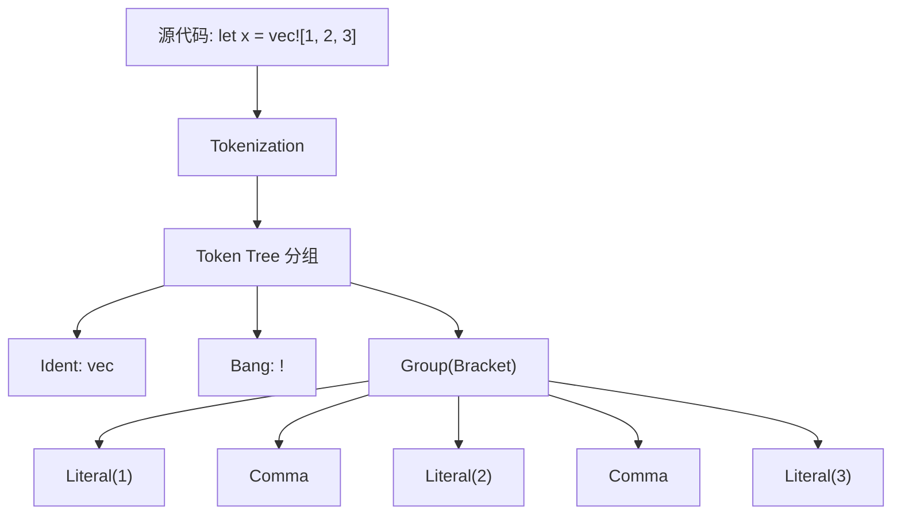
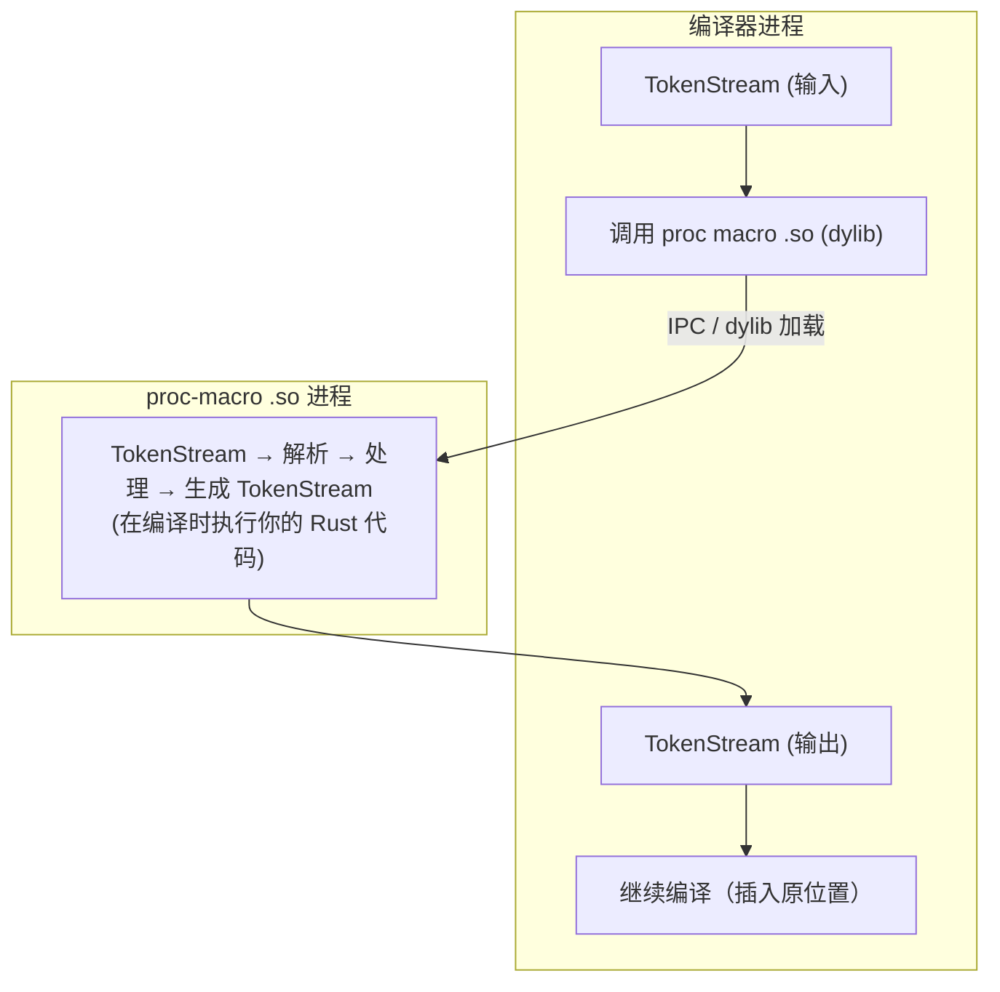
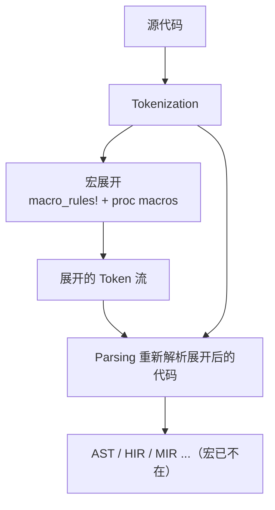
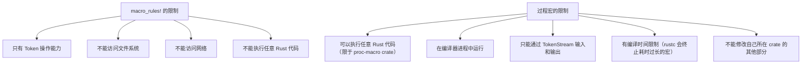

# 宏系统的编译原理

## 前置问题

1. C 的 `#define MAX(a,b) ((a)>(b)?(a):(b))` 和 Rust 的 `macro_rules!` 都是在"编译时"替换文本。但为什么 C 的宏多次求值参数会引发 bug，而 Rust 的宏却不会？
2. Lisp 的宏直接操作 S 表达式（AST），Rust 的宏操作"标记树（Token Trees）"。标记树与 AST 有什么区别？这种设计如何避免宏的语法混乱？
3. 过程宏（procedural macros）在编译时运行你的 Rust 代码。这意味着什么？编译器如何动态加载你的 `.so` 文件来扩展宏？

---

## 1. 编译时元编程 vs 运行时反射

### 1.1 宏属于编译时



宏在程序运行前完成所有工作——零运行时开销。这是 Rust 保持零成本抽象的基石之一。

### 1.2 对比：C 预处理器（文本级）

```
C 预处理器：工作于 Token 之前的纯文本层
```

```c
// C 预处理器宏：纯文本替换，无结构理解
#define DOUBLE(x) x * 2

int a = DOUBLE(1 + 2);  // 展开: 1 + 2 * 2 = 5 而不是 6！
// 修复: #define DOUBLE(x) ((x) * 2)  ← 本质是文本技巧，不是语义操作
```

| 维度 | C 预处理器 | Rust 宏 |
|------|-----------|---------|
| 操作对象 | 原始文本 | 标记流 (Token Tree) |
| 语法理解 | 无 | 部分（语法族） |
| 卫生性 | 无 | 有（语法上下文） |
| 多次求值 | 容易发生 | 编译时处理一次 |
| 类型安全 | 无 | 内嵌在类型系统中 |
| 错误消息 | 差（在展开后的代码中） | 好（指向原始宏） |

---

## 2. 标记树（Token Trees）

### 2.1 什么是 Token Tree



Token Tree 是递归结构：一个 Token Tree 可以包含子 Token Tree（括号嵌套）。

### 2.2 Token Tree 的优势

Token Tree 介于纯文本和 AST 之间：
- **比文本更强**：理解括号匹配，不会产生 C 宏那样的优先级错误
- **比 AST 更简单**：不需要完整的语法/类型检查，宏可以在类型检查之前运行
- **允许灵活语法**：宏可以操作尚未定义的语法（如自定义 DSL）

---

## 3. `macro_rules!`：声明宏

### 3.1 基于模式匹配的标记替换

```rust
macro_rules! vec {
    // 模式：匹配 $(...),* 形式的标记
    ($($x:expr),* $(,)?) => {
        {
            let mut temp_vec = Vec::new();
            $(
                temp_vec.push($x);
            )*
            temp_vec
        }
    };
}

// 调用
let v = vec![1, 2, 3];

// 编译器内部展开为：
let v = {
    let mut temp_vec = Vec::new();
    temp_vec.push(1);
    temp_vec.push(2);
    temp_vec.push(3);
    temp_vec
};
```

### 3.2 模式匹配语法

```
macro_rules! 的标记模式语言：

$name:expr    — 匹配一个表达式
$name:ty      — 匹配一个类型
$name:ident   — 匹配一个标识符
$name:literal — 匹配一个字面值
$name:tt      — 匹配任意单个 Token Tree
$name:pat     — 匹配一个模式
$name:stmt    — 匹配一个语句

$(...)`*`     — 零次或多次重复
$(...)`+`     — 一次或多次重复
$(...)`?`     — 零次或一次
```

### 3.3 编译器内部：macro_rules 的展开

```
macro_rules! 的编译时执行流程：

1. Tokenization: 将源代码分割为 Token 流
2. 当遇到 macro_name!() 调用时：
   a. 查找 macro_rules! 定义
   b. 尝试每个 arm（模式）的匹配
   c. 如果匹配：用捕获的片段替换模板中的元变量
   d. 展开结果重新插入 Token 流（在当前位置）
   e. 继续解析（可能触发更多宏展开）
3. 递归展开直到没有更多宏调用
```

### 3.4 递归宏

```rust
macro_rules! count {
    () => { 0usize };
    ($head:tt $($tail:tt)*) => {
        1usize + count!($($tail)*)
    };
}

// count!(a b c d) 在编译时展开为：
// 1 + count!(b c d)
// 1 + (1 + count!(c d))
// 1 + (1 + (1 + count!(d)))
// 1 + (1 + (1 + (1 + count!())))
// 1 + (1 + (1 + (1 + 0)))
// = 4
// 常量折叠后：4
```

宏的递归最终由编译器在编译时完成计算。

---

## 4. 卫生性（Hygiene）

### 4.1 变量名冲突问题

```c
// C 宏的卫生问题
#define SWAP(a, b) { int temp = a; a = b; b = temp; }

int temp = 42;     // ← 外面的 temp！
SWAP(x, y);         // 宏展开: { int temp = x; ... } ← 隐藏了外面的 temp
```

### 4.2 Rust 的解决方案：语法上下文

```rust
macro_rules! swap {
    ($a:ident, $b:ident) => {
        let temp = $a;  // temp 在宏的语法上下文中定义
        $a = $b;
        $b = temp;
    };
}

fn main() {
    let temp = 42;    // temp 在 main 的语法上下文中
    let mut x = 1;
    let mut y = 2;
    swap!(x, y);
    // temp 仍然等于 42！宏内部的 temp 不会与外部冲突
}
```

### 4.3 语法上下文（Syntax Context）

```
每个标识符在编译器中带有一个 SyntaxContext（整数 ID）：

SyntaxContext 0: 外部作用域
SyntaxContext 1: 宏展开创建的新作用域

let temp;  // SyntaxContext 0 → main 的 temp
// 在 swap! 展开中：
let temp;  // SyntaxContext 1 → 宏的 temp

// 两个 temp 有不同的 SyntaxContext → 不同的变量！
// 编译器通过混合（mixing）SyntaxContext 来防止意外捕获
```

### 4.4 卫生性的失效：`$crate`

有时需要卫生性失效——例如引用宏所在 crate 的项：

```rust
// 在 my_crate 中定义的宏
macro_rules! my_macro {
    () => {
        // $crate 解析为 my_crate（使用宏的 crate 而非调用者的 crate）
        $crate::helper_function()
    };
}
```

---

## 5. 过程宏（Procedural Macros）

### 5.1 编译时运行 Rust 代码

```rust
// 在 proc-macro crate 中
use proc_macro::TokenStream;

#[proc_macro]
pub fn make_answer(_item: TokenStream) -> TokenStream {
    // 这段代码在编译器进程中运行！
    // 可以执行任何 Rust 代码：文件 I/O、网络请求、计算等
    "fn answer() -> u32 { 42 }".parse().unwrap()
}
```

```rust
// 使用端
use my_macro::make_answer;

make_answer!();

fn main() {
    assert_eq!(answer(), 42);
}
```

### 5.2 proc_macro 桥接

编译器与过程宏之间的接口：



### 5.3 三种过程宏

```rust
// 1. 函数式宏（Function-like）
#[proc_macro]
pub fn sql(input: TokenStream) -> TokenStream { ... }
// 使用: sql!(SELECT * FROM users);

// 2. 派生宏（Derive）
#[proc_macro_derive(MyTrait, attributes(my_attr))]
pub fn derive_my_trait(input: TokenStream) -> TokenStream { ... }
// 使用: #[derive(MyTrait)] struct Foo;

// 3. 属性宏（Attribute）
#[proc_macro_attribute]
pub fn my_attr(attr: TokenStream, item: TokenStream) -> TokenStream { ... }
// 使用: #[my_attr] fn foo() { }
```

---

## 6. 对比三大宏系统

### 6.1 三种宏系统一览

| 特性 | C 预处理器 | Lisp 宏 | Rust 宏 |
|------|-----------|---------|---------|
| 操作对象 | 原始文本 | AST（S 表达式） | Token Tree |
| 语言图灵完备 | 否 | 是（同一语言） | 过程宏：是；macro_rules!：有限 |
| 卫生性 | 无 | 部分（现代 Lisps） | 完整 |
| 类型安全 | 无 | 否（Lisp 无静态类型） | 内嵌于类型系统 |
| 副作用 | 可能出现 | 可能出现 | 受限（限于 proc-macro） |
| 编译时开销 | 低 | 低 | 低（macro_rules!）/ 中等（proc macros） |
| 表达力 | 最低 | 最高 | 高 |

### 6.2 为什么不是 Lisp 风格

```
Lisp 宏：直接操作 AST
(defmacro when (condition &body body)
  `(if ,condition (progn ,@body)))

Rust 不能用 Lisp 风格因为：
1. Rust 语法复杂（多分隔符、运算符优先级、作用域规则）
2. Lisp 的 S 表达式是语法和 AST 的统一表示
3. Token Tree 是折中：在文本和 AST 之间提供安全但灵活的操作层
```

### 6.3 具体展开示例对比

```
源代码: vec![1+2, 3+4]

C 预处理器（如果是宏）:
  → { let mut v = Vec::new(); v.push(1+2); v.push(3+4); }
  但：无法处理括号嵌套

Lisp 宏（如果 Rust 是 Lisp）:
  → (let ((v (Vec::new)))
      (do (v.push (+ 1 2))
          (v.push (+ 3 4))
          v))
  直接操作 AST，语法统一

Rust macro_rules!:
  → { let mut v = Vec::new(); v.push(1+2); v.push(3+4); }
  基于标记树匹配，被保证的语义正确性
```

---

## 7. 宏展开的 ASM：零运行时开销

### 7.1 宏展开在编译时消除

```rust
macro_rules! const_answer {
    () => { 42 };
}

fn main() {
    let x = const_answer!();
    // 编译器将 const_answer!() 替换为 42
    // 后续编译步骤看到的就是 let x = 42;
}
```

```asm
; const_answer!() 的调用在编译前被消除
; 最终生成的代码：
mov dword ptr [rsp+4], 42  ; let x = 42;
```

### 7.2 宏展开在编译管线中的位置



---

## 8. 宏调试与检查

### 8.1 展开宏

```bash
# 查看宏展开后的代码
cargo rustc -- -Z unpretty=expanded

# 或使用 cargo expand（社区工具）
cargo install cargo-expand
cargo expand
```

### 8.2 trace_macros!

```rust
#![feature(trace_macros)]

trace_macros!(true);

macro_rules! each {
    ($arg:ident) => { println!("{}", $arg); };
}

each!(x);  // 编译器输出每个宏展开步骤
// 输出：
// each! { x }
// 展开为：
// println! { "{}" , x }
// println! { "{}" , x }
```

---

## 9. 宏的安全约束

### 9.1 权限分离



### 9.2 宏展开的终止

编译器限制宏展开以终止宏定义中的无界递归：

```
macro_rules! infinite {
    () => { infinite!() };
}

// 编译器在达到递归限制（默认 128）后终止展开
// 可配置: #![recursion_limit = "256"]
```

---

## 本章考查

### 概念考查（每题2分，共20分）

1. Rust 宏操作的基本单元是？
   - A) 原始文本
   - B) Token Tree（标记树）——递归的标记分组结构
   - C) 完整的 AST
   - D) 直接的机器指令

2. 宏的卫卫生性（Hygiene）由什么机制实现？
   - A) 宏定义中的显式前缀
   - B) 语法上下文（Syntax Context）——编译器给不同作用域的标识符分配不同的 Context ID
   - C) 运行时验证
   - D) 文件系统的隔离

3. 过程宏在何时运行？
   - A) 程序运行时
   - B) 编译时（在编译器进程内，宏 crate 被加载为 dylib）
   - C) 链接时
   - D) 程序启动时

4. `macro_rules!` 中的 `$x:expr` 匹配什么？
   - A) 任意文本
   - B) 一个有效的 Rust 表达式
   - C) 一个类型
   - D) 一个字符串

5. C 预处理器宏和 Rust 宏的关键区别是：
   - A) C 宏更快
   - B) C 宏是纯文本替换，Rust 宏基于标记树且具有卫生性
   - C) C 宏也是标记树级别的
   - D) 完全相同

6. `#[proc_macro_derive]` 用于什么场景？
   - A) 创建函数
   - B) 自动为结构体/枚举生成 trait 实现的代码
   - C) 调用系统 API
   - D) 链接外部库

7. Token Tree 与 AST 的关系是：
   - A) Token Tree 是 AST 的一种文本表示
   - B) Token Tree 是介于纯文本和 AST 之间的中间层——有结构但尚未进行语法分析
   - C) Token Tree 和 AST 完全相同
   - D) AST 是 Token Tree 的子集

8. 宏在编译管线中的位置是：
   - A) 在 LLVM 优化之后
   - B) 在 tokenization 之后、parsing 之前（或集成在 parsing 中）
   - C) 在机器码生成后
   - D) 在链接时

9. 为什么 Rust 宏能保证"零运行时开销"？
   - A) 宏会在运行时被解释
   - B) 宏在编译时完全展开为常规 Rust 代码，后续编译阶段（如内联、优化）与手写代码相同
   - C) 宏不生成任何代码
   - D) 宏被转换为 C 代码

10. `$crate` 在宏中用于：
    - A) 引用 C 语言库
    - B) 引用定义宏的 crate，避免卫生性失效导致的路径解析错误
    - C) 分配内存
    - D) 触发编译错误

<details><summary>点击查看答案</summary>

1. **B** — Token Tree 是递归的标记分组结构。
2. **B** — 语法上下文（Syntax Context）为标识符提供卫生性。
3. **B** — 过程宏在编译时运行（作为 dylib 加载到编译器进程）。
4. **B** — `$x:expr` 匹配有效的 Rust 表达式。
5. **B** — C 宏是文本替换，Rust 宏是 Token Tree 级别且卫生。
6. **B** — `#[proc_macro_derive]` 自动生成 trait 实现的代码。
7. **B** — Token Tree 是介于文本和 AST 之间的中间层。
8. **B** — 宏在 tokenization 后、parsing 前（或集成在解析中）。
9. **B** — 宏编译时展开为常规代码，无运行时开销。
10. **B** — `$crate` 引用定义宏的 crate 来防止路径解析错误。
</details>

### 判断正误（每题2分，共20分）

1. Rust 的 `macro_rules!` 可以直接访问文件系统。
2. 宏展开发生于编译时，因此不会增加运行时开销。
3. Token Tree 是 AST 的另一名称。
4. 过程宏可以在编译时运行任意 Rust 代码（受限于 proc-macro API）。
5. 卫生性确保宏内部定义的变量不会与外部变量发生名称冲突。
6. C 预处理器宏和 Rust `macro_rules!` 同样具有卫生性。
7. 递归宏在编译时被展开，如超出递归限制编译器会报错终止。
8. `#[proc_macro]` 宏的输出必须是有效的 Rust 语法片段（Token Stream 可解析）。
9. 声明宏（macro_rules!）可以定义新的语法规则（如自定义运算符）。
10. `cargo expand` 可以查看宏展开后的代码。

<details><summary>点击查看答案</summary>

1. **错误** — macro_rules! 只能操作 Token Tree，不能访问文件系统。
2. **正确** — 宏在编译时完全展开，无运行时开销。
3. **错误** — Token Tree 是中间层表示，不是 AST。
4. **正确** — 过程宏可以执行任意 Rust 代码（在 proc-macro crate 内）。
5. **正确** — 卫生性通过 Syntax Context 防止变量名冲突。
6. **错误** — C 预处理器完全不卫生（纯文本替换）。
7. **正确** — 编译器有 recursion_limit 防止无限展开。
8. **正确** — 过程宏的输出必须是有效的 TokenStream。
9. **错误** — macro_rules! 只能匹配和生成现有语法族，不能定义新语法规则。
10. **正确** — `cargo expand` 显示宏展开后的代码。
</details>

### 代码分析（每题3分，共15分）

1. 以下宏展开是什么？
```rust
macro_rules! my_macro {
    ($a:expr, $b:expr) => { $a + $b };
}
let x = my_macro!(1+2, 3);
```
A) 编译错误（展开超出范围）
B) `let x = 1+2 + 3;`（= 6）——精确替换捕获的内容
C) `let x = 1 + 2 * 3;`
D) `let x = (1+2) + 3;`

<details><summary>点击查看答案</summary>
**B** — `my_macro!(1+2, 3)` 展开为 `1+2 + 3`，结果是 6。因为 $a 捕获的是表达式 `1+2`，$b 是 `3`。
</details>

2. 以下宏展开的卫生性含义是什么？
```rust
macro_rules! create_var {
    ($name:ident) => {
        let $name = 42;
    };
}

fn main() {
    let x = 0;
    create_var!(x);  // 这会覆盖 main 的 x 吗？
}
```
A) 会，x 变成 42
B) 不会，这是编译错误（重复定义）
C) 会报错因为 create_var 创建了与外部 x 不同 Syntax Context 的 x
D) 不会，因为 x 被移动了

<details><summary>点击查看答案</summary>
**C** — 编译错误！宏内的 `$name` 被替换为外部传入的 `x`，但 `let x = 42` 使用的是调用点的 Syntax Context，所以它们冲突。注意：卫生性并不意味着任意替换都可以；当宏通过参数接收到标识符并直接使用它时，标识符保留了其原始的 Syntax Context。
</details>

3. 以下代码的输出是？
```rust
macro_rules! count {
    () => (0);
    ($x:tt $($rest:tt)*) => (1 + count!($($rest)*));
}

fn main() {
    let x = count!(a b c d e);
    println!("{}", x);  // ?
}
```
A) 0
B) 5
C) 4
D) 编译错误

<details><summary>点击查看答案</summary>
**B** — `count!(a b c d e)` → 1 + count!(b c d e) → ... → 1+1+1+1+1+0 = 5。
</details>

4. 以下代码为什么报错？
```rust
#[proc_macro]
pub fn identity(input: TokenStream) -> TokenStream {
    println!("compiling your code...");
    input
}
```
A) proc_macro 不能打印
B) 实际上不报错——过程宏可以执行 I/O
C) proc_macro 只能返回一个项
D) 没有定义 main

<details><summary>点击查看答案</summary>
**B** — 过程宏在编译时运行，可以打印（输出到编译器的 stderr）。具体来说，你的 proc macro 代码在 rustc 进程中执行，`println!` 在编译器的 stderr 中输出"compiling your code..."。
</details>

5. 在以下宏中，`$crate` 的作用是什么？
```rust
macro_rules! my_call {
    ($fn:ident) => {
        $crate::helper::$fn()
    };
}
```
A) 引用标准库
B) 引用 C 语言
C) 引用定义此宏的 crate，确保在宏被使用时 helper 被正确找到
D) 创建新的 crate

<details><summary>点击查看答案</summary>
**C** — `$crate` 展开为定义此宏的 crate，确保路径解析正确（无论调用者在哪个 crate）。
</details>

### 编程大题（15分）

**题目**: 实现一个 `hash_map!` 宏，使以下代码正常工作：

```rust
// 要求：
// 1. 宏名: hash_map!
// 2. 语法: hash_map! { key1 => value1, key2 => value2, ... }
// 3. 返回类型: std::collections::HashMap
// 4. 支持尾随逗号
// 5. 类型正确推导

// 使用示例：
// let map = hash_map! {
//     "one" => 1,
//     "two" => 2,
//     "three" => 3,
// };
// assert_eq!(map["one"], 1);
// assert_eq!(map.len(), 3);
```

<details><summary>点击查看答案</summary>

```rust
macro_rules! hash_map {
    // 空 map
    () => {
        std::collections::HashMap::new()
    };

    // 单个或多个键值对，支持尾随逗号
    ($($key:expr => $value:expr),* $(,)?) => {
        {
            let mut map = std::collections::HashMap::new();
            $(
                map.insert($key, $value);
            )*
            map
        }
    };
}

fn main() {
    let map = hash_map! {
        "one" => 1,
        "two" => 2,
        "three" => 3,
    };
    assert_eq!(map["one"], 1);
    assert_eq!(map.len(), 3);

    // 测试尾随逗号
    let map2 = hash_map! {
        "a" => 1,
        "b" => 2,  // 尾随逗号 OK
    };
    assert_eq!(map2.len(), 2);
}
```

**评分标准**：
- 宏语法正确（5分）
- 支持尾随逗号（3分）
- 支持空 map（2分）
- 展开后代码正确（3分）
- 测试示例（2分）
</details>

### 填空题（每题1分，共5分）

1. 宏的操作对象是 `____`（Token Tree），而非原始文本。
2. 宏卫生性由 `____` 机制实现。
3. 三种过程宏：`____`、`____`、`____`。
4. 宏在编译器管线中位于 `____` 之后、`____` 之前。
5. `$crate` 变量用于引用 `____`。

<details><summary>点击查看答案</summary>

1. 标记树（Token Tree）
2. 语法上下文（Syntax Context）
3. 函数式宏（proc_macro）、派生宏（proc_macro_derive）、属性宏（proc_macro_attribute）
4. 词法分析（Tokenization），语法分析（Parsing/AST）
5. 定义宏的 crate
</details>

### 代码补全（共5分）

1. 定义一个简单的宏（2分）：
```rust
macro_rules! say_hello {
    () => {
        ____!("Hello, world!");
    };
}
```

<details><summary>点击查看答案</summary>

```rust
println!("Hello, world!");
```
</details>

2. 使用模式匹配（1分）：
```rust
macro_rules! add {
    ($a:____, $b:____) => {
        $a + $b
    };
}
```

<details><summary>点击查看答案</summary>

```rust
($a:expr, $b:expr)
```
</details>

3. 编写一个带说明的派生宏结构 (2分)：
```rust
// 定义一个派生宏，自动实现 trait
use ____::TokenStream;

#[proc_macro_derive(____)]
pub fn derive_hello(____: TokenStream) -> TokenStream {
    // 生成代码
    "impl Hello for ... {}".parse().unwrap()
}
```

<details><summary>点击查看答案</summary>

```rust
use proc_macro::TokenStream;

#[proc_macro_derive(Hello)]
pub fn derive_hello(input: TokenStream) -> TokenStream {
    "impl Hello for ... {}".parse().unwrap()
}
```
</details>

---

## 本章小结

宏系统是 Rust 编译时元编程的核心设施，它实现了零运行时开销的代码生成：

- **Token Tree** = 编译时操作的最小结构单元——介于文本和 AST 之间
- **macro_rules!** = 声明式宏，基于模式匹配替换 Token Tree
- **卫生性（Hygiene）** = 通过 SyntaxContext 避免变量捕获
- **过程宏** = 在编译时运行 Rust 代码，加载为 dylib 直接操作 TokenStream
- **零运行时开销** = 宏完全在编译时展开，展开后的代码与手写代码同样被优化
- **对比**：C 预处理器（文本级） < Rust 宏（Token Tree 级） < Lisp 宏（AST 级）——在安全性和灵活性之间的折中

理解宏系统意味着理解 Rust 编译时与运行时的边界：宏发生在编译管线的最早阶段，但它的输出通过后续所有优化阶段。

---

*系列完结* — [[01-内存本质：从比特到指针]] ← 回到系列起点

*深度阅读*：Daniel Keep, "The Little Book of Rust Macros"; Rust Reference: Macros; proc_macro API 文档
