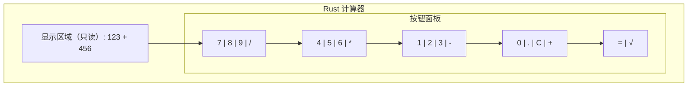

# 简易计算器：从零到GUI

## 我们要做什么

在本教程中，你将亲手构建一个**图形界面计算器**。最终效果是：打开一个窗口，上面有一排数字按钮（0-9）和运算按钮（+、-、\*、/），点击按钮会显示在屏幕上方的文本区域，按等号算出结果。和你在 Windows 自带计算器或手机计算器上看到的类似，但这是我们自己用 Rust 写的！

窗口大致是这样的：



你将学到：GUI 基本概念、egui 立即模式框架的使用、Rust 事件处理、表达式求值。

## 前置知识

你需要先阅读以下章节：
- [[../入门/01-环境搭建与第一个程序]]
- [[../入门/02-变量与基本类型]]
- [[../入门/03-函数与控制流]]
- [[../入门/04-所有权与借用]]
- [[../入门/05-结构体与枚举]]
- [[../深入/01-错误处理]]

---

## 第 1 步：创建项目

打开终端（Terminal），输入以下命令来创建一个新的 Rust 项目：

```bash
cargo new calculator
cd calculator
```

**解释：** `cargo new` 是 Rust 的包管理工具 Cargo 的命令，用于创建一个新项目。它会生成一个名为 `calculator` 的文件夹，里面包含基础的 Rust 项目结构。

**你应该看到：**
```
Created binary (application) `calculator` package
```

进入项目目录后，用 `ls` 查看文件结构：

```bash
ls
```

**你应该看到：**
```
Cargo.toml  src
```

其中 `Cargo.toml` 是项目配置文件，`src/` 目录下有 `main.rs`。

---

## 第 2 步：添加依赖

用你喜欢的编辑器打开 `Cargo.toml`，在 `[dependencies]` 下面添加 `eframe`：

```toml
[package]
name = "calculator"
version = "0.1.0"
edition = "2021"

[dependencies]
eframe = "0.27"
```

**解释：** `eframe` 是 `egui` 官方提供的框架，它帮助你创建窗口、处理系统事件（如鼠标点击、键盘输入），并把 `egui` 的绘图内容渲染到屏幕上。`0.27` 是版本号。

**你应该看到：** 保存文件后，运行 `cargo build`，Cargo 会自动下载 `eframe` 及其所有依赖。首次构建可能需要几分钟，因为要下载和编译很多库。

```bash
cargo build
```

**你应该看到：** 大量编译输出，最后显示 `Finished dev [unoptimized + debuginfo] target(s) ...`

---

## 第 3 步：理解 GUI、CLI、立即模式和保留模式

在写代码之前，我们先搞清楚几个重要概念。

### GUI vs CLI

- **CLI（Command Line Interface，命令行界面）**：你通过打字与程序交互。例如 `git commit -m "..."`。程序输出文字，你输入文字。
- **GUI（Graphical User Interface，图形用户界面）**：你通过鼠标点击、拖动、键盘与程序交互。有窗口、按钮、文本框等视觉元素。

### 立即模式 vs 保留模式

这是 GUI 框架的两种设计理念：

- **保留模式（Retained Mode）**：你先"创建"界面组件（如按钮），把它们存起来。框架帮你管理它们的状态。例如：`Button b = new Button("点击我");`，之后你只需要处理点击事件。典型代表：Qt、GTK、Windows Forms。

- **立即模式（Immediate Mode）**：你在每一帧中直接"描述"界面。没有持久的组件对象。例如：`if ui.button("点击我").clicked() { ... }`，每一帧都会调用这行代码。典型代表：egui、Dear ImGui。

**立即模式的优点：**
- 代码简单直观，不需要管理组件生命周期
- 非常适合工具、编辑器、调试界面
- 状态管理由你自己的变量决定，没有"框架魔法"

**立即模式的缺点：**
- 每一帧都在重新布局，CPU 占用略高
- 不适合做复杂动画

对于计算器来说，立即模式再合适不过——界面简单，状态就是那几个变量。

---

## 第 4 步：创建一个空窗口

把 `src/main.rs` 的内容替换为以下代码。这是创建一个 egui 窗口的**最小骨架**：

```rust
use eframe::egui;

fn main() -> Result<(), eframe::Error> {
    let options = eframe::NativeOptions {
        viewport: egui::ViewportBuilder::default()
            .with_inner_size([320.0, 420.0]),
        ..Default::default()
    };
    eframe::run_native(
        "Rust 计算器",
        options,
        Box::new(|_cc| Ok(Box::new(CalculatorApp::default()))),
    )
}

#[derive(Default)]
struct CalculatorApp {
    // 稍后添加状态字段
}

impl eframe::App for CalculatorApp {
    fn update(&mut self, ctx: &egui::Context, _frame: &mut eframe::Frame) {
        egui::CentralPanel::default().show(ctx, |ui| {
            ui.heading("欢迎使用 Rust 计算器！");
        });
    }
}
```

**逐行解释：**

1. `use eframe::egui;` — 引入 egui 库。`eframe` 是窗口框架，`egui` 是界面库。
2. `fn main() -> Result<(), eframe::Error>` — main 函数返回一个 Result，因为窗口创建可能失败。
3. `NativeOptions` — 窗口配置。`inner_size` 设置窗口内尺寸为 320×420 像素。
4. `eframe::run_native(...)` — 启动原生窗口。参数依次是：窗口标题、配置、应用工厂闭包。
5. `CalculatorApp` — 我们的应用程序状态结构体。`#[derive(Default)]` 自动生成一个全零/全空的默认值。
6. `impl eframe::App for CalculatorApp` — 实现 `eframe::App` 这个 trait，必须提供 `update` 方法。
7. `update` 方法 — 每一帧调用一次。`ctx` 是 egui 上下文，`_frame` 是窗口帧（前面加 `_` 表示暂时不用）。
8. `CentralPanel::default().show(...)` — 创建一个占据整个窗口的面板。
9. `ui.heading(...)` — 在面板中显示一个标题文字。

**运行看看：**

```bash
cargo run
```

**你应该看到：** 弹出一个窗口，标题为"Rust 计算器"，窗口内显示"欢迎使用 Rust 计算器！"。你可以拖动窗口、调整大小、点击关闭按钮。

---

## 第 5 步：添加显示区域

现在我们把欢迎文字替换为计算器的显示区域。修改 `main.rs`：

```rust
use eframe::egui;

fn main() -> Result<(), eframe::Error> {
    let options = eframe::NativeOptions {
        viewport: egui::ViewportBuilder::default()
            .with_inner_size([320.0, 420.0]),
        ..Default::default()
    };
    eframe::run_native(
        "Rust 计算器",
        options,
        Box::new(|_cc| Ok(Box::new(CalculatorApp::default()))),
    )
}

#[derive(Default)]
struct CalculatorApp {
    display: String,   // 显示区域的文字
}

impl eframe::App for CalculatorApp {
    fn update(&mut self, ctx: &egui::Context, _frame: &mut eframe::Frame) {
        egui::CentralPanel::default().show(ctx, |ui| {
            // 显示区域：一个大的、只读的文本标签，靠右对齐
            ui.add_enabled(
                false,
                egui::TextEdit::singleline(&mut self.display)
                    .font(egui::TextStyle::Heading)
                    .desired_width(f32::INFINITY),
            );
        });
    }
}
```

**新内容解释：**

- `display: String` — 存储当前显示的文字。
- `ui.add_enabled(false, ...)` — 把内部的组件设为禁用状态（只读），用户不能直接在上面打字。
- `TextEdit::singleline(...)` — 一个单行文本编辑框。绑定到 `self.display`，内容改变时自动更新。
- `.font(egui::TextStyle::Heading)` — 使用标题字体，让文字更大。
- `.desired_width(f32::INFINITY)` — 宽度尽可能大。

**运行：**

```bash
cargo run
```

**你应该看到：** 窗口上方有一个大的灰色文本区域。虽然看起来像输入框，但你无法在上面打字（因为我们禁用了它）。

---

## 第 6 步：添加数字按钮（0-9）

现在添加数字按钮。我们将使用 `ui.horizontal()` 和 `ui.button()` 来布局。

```rust
use eframe::egui;

fn main() -> Result<(), eframe::Error> {
    let options = eframe::NativeOptions {
        viewport: egui::ViewportBuilder::default()
            .with_inner_size([320.0, 420.0]),
        ..Default::default()
    };
    eframe::run_native(
        "Rust 计算器",
        options,
        Box::new(|_cc| Ok(Box::new(CalculatorApp::default()))),
    )
}

#[derive(Default)]
struct CalculatorApp {
    display: String,
}

impl eframe::App for CalculatorApp {
    fn update(&mut self, ctx: &egui::Context, _frame: &mut eframe::Frame) {
        egui::CentralPanel::default().show(ctx, |ui| {
            // 显示区域
            ui.add_enabled(
                false,
                egui::TextEdit::singleline(&mut self.display)
                    .font(egui::TextStyle::Heading)
                    .desired_width(f32::INFINITY),
            );

            ui.add_space(10.0);

            // 数字按钮区域
            ui.horizontal(|ui| {
                ui.button("7");
                ui.button("8");
                ui.button("9");
            });
            ui.horizontal(|ui| {
                ui.button("4");
                ui.button("5");
                ui.button("6");
            });
            ui.horizontal(|ui| {
                ui.button("1");
                ui.button("2");
                ui.button("3");
            });
            ui.horizontal(|ui| {
                ui.button("0");
                ui.button(".");
            });
        });
    }
}
```

**新内容解释：**

- `ui.add_space(10.0)` — 添加 10 像素的垂直间距。
- `ui.horizontal(|ui| { ... })` — 创建一个水平布局。里面的组件从左到右排列。
- `ui.button("7")` — 创建一个按钮，上面写着"7"。返回一个 `Response` 对象，可以用来检测是否被点击（我们现在还没用到返回值）。

**运行：**

```bash
cargo run
```

**你应该看到：** 显示区域下方出现了 4 行按钮，排列成计算器的数字区。点击按钮，什么也不会发生（因为我们还没有处理点击事件）。

---

## 第 7 步：添加运算按钮

在数字按钮旁边添加运算按钮。我们需要把布局改成类似计算器的 4×4 网格。

```rust
use eframe::egui;

fn main() -> Result<(), eframe::Error> {
    let options = eframe::NativeOptions {
        viewport: egui::ViewportBuilder::default()
            .with_inner_size([320.0, 420.0]),
        ..Default::default()
    };
    eframe::run_native(
        "Rust 计算器",
        options,
        Box::new(|_cc| Ok(Box::new(CalculatorApp::default()))),
    )
}

#[derive(Default)]
struct CalculatorApp {
    display: String,
}

impl eframe::App for CalculatorApp {
    fn update(&mut self, ctx: &egui::Context, _frame: &mut eframe::Frame) {
        egui::CentralPanel::default().show(ctx, |ui| {
            // 显示区域
            ui.add_enabled(
                false,
                egui::TextEdit::singleline(&mut self.display)
                    .font(egui::TextStyle::Heading)
                    .desired_width(f32::INFINITY),
            );

            ui.add_space(10.0);

            // 按钮网格
            ui.horizontal(|ui| {
                ui.button("7");
                ui.button("8");
                ui.button("9");
                ui.button("/");
            });
            ui.horizontal(|ui| {
                ui.button("4");
                ui.button("5");
                ui.button("6");
                ui.button("*");
            });
            ui.horizontal(|ui| {
                ui.button("1");
                ui.button("2");
                ui.button("3");
                ui.button("-");
            });
            ui.horizontal(|ui| {
                ui.button("0");
                ui.button(".");
                ui.button("C");
                ui.button("+");
            });
            ui.horizontal(|ui| {
                ui.button("=");
            });
        });
    }
}
```

**新内容解释：**

- 运算按钮 `/`、`*`、`-`、`+` 被放在每行的最右侧。
- `C` 是清除按钮（Clear），还没实现功能。
- `=` 是计算按钮，单独占一行。

**运行：**

```bash
cargo run
```

**你应该看到：** 一个完整的计算器按钮布局。所有按钮都可见，但点击没有任何反应。

---

## 第 8 步：让按钮点击更新显示

现在是最关键的一步——让按钮点击生效。思路是：当按钮被点击时，把对应的字符追加到 `display` 字符串中。

```rust
use eframe::egui;

fn main() -> Result<(), eframe::Error> {
    let options = eframe::NativeOptions {
        viewport: egui::ViewportBuilder::default()
            .with_inner_size([320.0, 420.0]),
        ..Default::default()
    };
    eframe::run_native(
        "Rust 计算器",
        options,
        Box::new(|_cc| Ok(Box::new(CalculatorApp::default()))),
    )
}

#[derive(Default)]
struct CalculatorApp {
    display: String,
}

impl eframe::App for CalculatorApp {
    fn update(&mut self, ctx: &egui::Context, _frame: &mut eframe::Frame) {
        egui::CentralPanel::default().show(ctx, |ui| {
            // 显示区域
            ui.add_enabled(
                false,
                egui::TextEdit::singleline(&mut self.display)
                    .font(egui::TextStyle::Heading)
                    .desired_width(f32::INFINITY),
            );

            ui.add_space(10.0);

            // 按钮网格
            ui.horizontal(|ui| {
                if ui.button("7").clicked() { self.display.push('7'); }
                if ui.button("8").clicked() { self.display.push('8'); }
                if ui.button("9").clicked() { self.display.push('9'); }
                if ui.button("/").clicked() { self.display.push('/'); }
            });
            ui.horizontal(|ui| {
                if ui.button("4").clicked() { self.display.push('4'); }
                if ui.button("5").clicked() { self.display.push('5'); }
                if ui.button("6").clicked() { self.display.push('6'); }
                if ui.button("*").clicked() { self.display.push('*'); }
            });
            ui.horizontal(|ui| {
                if ui.button("1").clicked() { self.display.push('1'); }
                if ui.button("2").clicked() { self.display.push('2'); }
                if ui.button("3").clicked() { self.display.push('3'); }
                if ui.button("-").clicked() { self.display.push('-'); }
            });
            ui.horizontal(|ui| {
                if ui.button("0").clicked() { self.display.push('0'); }
                if ui.button(".").clicked() { self.display.push('.'); }
                if ui.button("C").clicked() { self.display.clear(); }
                if ui.button("+").clicked() { self.display.push('+'); }
            });
            ui.horizontal(|ui| {
                if ui.button("=").clicked() {
                    // 第 9 步会实现计算
                }
            });
        });
    }
}
```

**新内容解释：**

- `ui.button("7").clicked()` — 返回 `true` 表示按钮在本帧被点击了。
- `self.display.push('7')` — 把字符 `'7'` 追加到显示字符串末尾。
- `.clear()` — 清空字符串，实现清除功能。

**运行：**

```bash
cargo run
```

**你应该看到：** 点击数字按钮和运算按钮，显示区域会实时更新。例如依次点击 `1`、`2`、`+`、`4`、`5`，显示区域会显示 `12+45`。点击 `C` 会清空所有文字。

---

## 第 9 步：实现计算逻辑

当用户点击 `=` 时，我们需要解析 `display` 中的表达式并计算结果。一个简单的方式是：按运算符分割字符串，提取两个数字，做对应运算。

```rust
use eframe::egui;

fn main() -> Result<(), eframe::Error> {
    let options = eframe::NativeOptions {
        viewport: egui::ViewportBuilder::default()
            .with_inner_size([320.0, 420.0]),
        ..Default::default()
    };
    eframe::run_native(
        "Rust 计算器",
        options,
        Box::new(|_cc| Ok(Box::new(CalculatorApp::default()))),
    )
}

#[derive(Default)]
struct CalculatorApp {
    display: String,
}

impl CalculatorApp {
    fn evaluate(&self) -> Option<f64> {
        // 找到运算符的位置
        let expr = &self.display;
        let op_pos = expr.find(|c: char| c == '+' || c == '-' || c == '*' || c == '/')?;

        let left: f64 = expr[..op_pos].trim().parse().ok()?;
        let right: f64 = expr[op_pos + 1..].trim().parse().ok()?;
        let op = expr.chars().nth(op_pos)?;

        let result = match op {
            '+' => left + right,
            '-' => left - right,
            '*' => left * right,
            '/' => {
                if right == 0.0 {
                    return None;
                }
                left / right
            }
            _ => return None,
        };
        Some(result)
    }
}

impl eframe::App for CalculatorApp {
    fn update(&mut self, ctx: &egui::Context, _frame: &mut eframe::Frame) {
        egui::CentralPanel::default().show(ctx, |ui| {
            ui.add_enabled(
                false,
                egui::TextEdit::singleline(&mut self.display)
                    .font(egui::TextStyle::Heading)
                    .desired_width(f32::INFINITY),
            );

            ui.add_space(10.0);

            ui.horizontal(|ui| {
                if ui.button("7").clicked() { self.display.push('7'); }
                if ui.button("8").clicked() { self.display.push('8'); }
                if ui.button("9").clicked() { self.display.push('9'); }
                if ui.button("/").clicked() { self.display.push('/'); }
            });
            ui.horizontal(|ui| {
                if ui.button("4").clicked() { self.display.push('4'); }
                if ui.button("5").clicked() { self.display.push('5'); }
                if ui.button("6").clicked() { self.display.push('6'); }
                if ui.button("*").clicked() { self.display.push('*'); }
            });
            ui.horizontal(|ui| {
                if ui.button("1").clicked() { self.display.push('1'); }
                if ui.button("2").clicked() { self.display.push('2'); }
                if ui.button("3").clicked() { self.display.push('3'); }
                if ui.button("-").clicked() { self.display.push('-'); }
            });
            ui.horizontal(|ui| {
                if ui.button("0").clicked() { self.display.push('0'); }
                if ui.button(".").clicked() { self.display.push('.'); }
                if ui.button("C").clicked() { self.display.clear(); }
                if ui.button("+").clicked() { self.display.push('+'); }
            });
            ui.horizontal(|ui| {
                if ui.button("=").clicked() {
                    if let Some(result) = self.evaluate() {
                        self.display = result.to_string();
                    } else {
                        self.display = "错误".to_string();
                    }
                }
            });
        });
    }
}
```

**逐行解释 `evaluate` 方法：**

1. `find(|c: char| ...)` — 在字符串中查找第一个运算符的位置。如果没有运算符，返回 `None`。
2. `expr[..op_pos].trim().parse().ok()?` — 取运算符左边的子串，去掉空白，尝试解析为 `f64`。失败则返回 `None`。
3. `expr[op_pos + 1..].trim().parse().ok()?` — 同上，取右边。
4. `expr.chars().nth(op_pos)?` — 取出运算符字符。
5. `match op { ... }` — 根据运算符执行对应运算。除法时检查除数是否为零。

**运行：**

```bash
cargo run
```

**你应该看到：** 输入 `12+5` 然后按 `=`，显示区域变成 `17`。输入 `10/3` 按 `=`，显示 `3.3333333333333335`。输入 `5/0` 按 `=`，显示 `错误`。

---

## 第 10 步：处理边界情况

当前代码有几个问题需要处理：

1. 连续按两次运算符（如 `1++2`）会导致解析失败
2. 空表达式按 `=` 会出错
3. 点击 `=` 后显示结果，但用户可能想继续计算
4. 结果应去掉多余的小数位（如 `3.0` 而不是 `3.0000000000`）

```rust
use eframe::egui;

fn main() -> Result<(), eframe::Error> {
    let options = eframe::NativeOptions {
        viewport: egui::ViewportBuilder::default()
            .with_inner_size([320.0, 420.0]),
        ..Default::default()
    };
    eframe::run_native(
        "Rust 计算器",
        options,
        Box::new(|_cc| Ok(Box::new(CalculatorApp::default()))),
    )
}

#[derive(Default)]
struct CalculatorApp {
    display: String,
    last_was_result: bool,  // 记录上次是否按了等号
}

impl CalculatorApp {
    fn evaluate(&self) -> Option<f64> {
        let expr = &self.display;

        // 尝试找到第一个运算符（跳过开头的负号，但我们的简单计算器不支持）
        // 按优先级处理：先乘除后加减
        // 简化版：按第一个出现的 + 或 - 分割（先处理加减）
        // 更健壮的方式：按顺序查找
    
        // 方法：先找 + 或 -（非第一个字符位置的，因为可能是负号）
        // 对于简单计算器，我们只支持 a op b 的形式。
        // 但如果用户输入了 1+2*3，简单做法是不支持。
        // 我们做个简单检测：如果有多个运算符，只取第一个。

        let mut op_pos: Option<usize> = None;
        let mut op_char: char = '?';

        for (i, c) in expr.char_indices() {
            if i == 0 && c == '-' {
                // 第一个字符的减号可能是负号，跳过
                continue;
            }
            if c == '+' || c == '-' || c == '*' || c == '/' {
                if op_pos.is_some() {
                    // 已经有一个运算符了，不支持多运算符表达式
                    return None;
                }
                op_pos = Some(i);
                op_char = c;
            }
        }

        let op_pos = op_pos?;

        let left: f64 = expr[..op_pos].trim().parse().ok()?;
        let right: f64 = expr[op_pos + 1..].trim().parse().ok()?;

        let result = match op_char {
            '+' => left + right,
            '-' => left - right,
            '*' => left * right,
            '/' => {
                if right == 0.0 {
                    return None;
                }
                left / right
            }
            _ => return None,
        };
        Some(result)
    }

    fn push_input(&mut self, c: char) {
        if self.last_was_result {
            // 上次按了等号，现在输入新内容，清空旧结果
            if c.is_ascii_digit() || c == '.' {
                self.display.clear();
            }
            self.last_was_result = false;
        }
        self.display.push(c);
    }
}

impl eframe::App for CalculatorApp {
    fn update(&mut self, ctx: &egui::Context, _frame: &mut eframe::Frame) {
        egui::CentralPanel::default().show(ctx, |ui| {
            ui.add_enabled(
                false,
                egui::TextEdit::singleline(&mut self.display)
                    .font(egui::TextStyle::Heading)
                    .desired_width(f32::INFINITY),
            );

            ui.add_space(10.0);

            ui.horizontal(|ui| {
                if ui.button("7").clicked() { self.push_input('7'); }
                if ui.button("8").clicked() { self.push_input('8'); }
                if ui.button("9").clicked() { self.push_input('9'); }
                if ui.button("/").clicked() { self.push_input('/'); }
            });
            ui.horizontal(|ui| {
                if ui.button("4").clicked() { self.push_input('4'); }
                if ui.button("5").clicked() { self.push_input('5'); }
                if ui.button("6").clicked() { self.push_input('6'); }
                if ui.button("*").clicked() { self.push_input('*'); }
            });
            ui.horizontal(|ui| {
                if ui.button("1").clicked() { self.push_input('1'); }
                if ui.button("2").clicked() { self.push_input('2'); }
                if ui.button("3").clicked() { self.push_input('3'); }
                if ui.button("-").clicked() { self.push_input('-'); }
            });
            ui.horizontal(|ui| {
                if ui.button("0").clicked() { self.push_input('0'); }
                if ui.button(".").clicked() { self.push_input('.'); }
                if ui.button("C").clicked() {
                    self.display.clear();
                    self.last_was_result = false;
                }
                if ui.button("+").clicked() { self.push_input('+'); }
            });
            ui.horizontal(|ui| {
                if ui.button("=").clicked() {
                    if self.display.is_empty() {
                        // 什么都不做
                    } else if let Some(result) = self.evaluate() {
                        // 去掉多余的 .0 或 .0000
                        self.display = format_result(result);
                        self.last_was_result = true;
                    } else {
                        self.display = "错误".to_string();
                        self.last_was_result = true;
                    }
                }
            });
        });
    }
}

fn format_result(num: f64) -> String {
    if num.fract() == 0.0 && num.is_finite() {
        format!("{:.0}", num)
    } else {
        // 最多保留 10 位小数，去掉末尾多余的零
        let s = format!("{:.10}", num);
        let s = s.trim_end_matches('0');
        let s = s.trim_end_matches('.');
        s.to_string()
    }
}
```

**新内容解释：**

- `last_was_result: bool` — 标记用户上次是否按了 `=`。如果是，下次输入数字时自动清空。
- `push_input` — 封装的输入方法，处理结果后的自动清空。
- `format_result` — 把 `3.0000000000` 变成 `3`，把 `3.1400000000` 变成 `3.14`。
- 多运算符检测：遍历字符，如果找到第二个运算符则返回错误。
- 空表达式检测：`self.display.is_empty()` 时不做任何事。

**运行：**

```bash
cargo run
```

**你应该看到：** 计算 `3+2` 得 `5`，再按 `7` 开始新输入，显示 `7`。计算结果 `4/2` 得 `2`（不是 `2.0`）。输入 `1+2+3` 按 `=` 得 `错误`。

---

## 第 11 步：GUI 调试技巧

GUI 程序的调试比 CLI 程序更困难，因为 `println!` 的输出没有人会去看。但其实 `println!` 还是有效的！下面是几种调试方法。

### 方法 1：使用 `println!` 和终端

在代码中添加 `println!`：

```rust
if ui.button("7").clicked() {
    println!("按钮 7 被点击，当前 display: {}", self.display);
    self.push_input('7');
}
```

然后从终端启动程序（不要双击图标）：

```bash
cargo run
```

**你应该看到：** 在终端中会打印出调试信息，每次点击都能看到。

### 方法 2：使用 `dbg!` 宏

`dbg!` 是一个超级有用的调试宏，它会打印文件名、行号和变量的值：

```rust
if ui.button("=").clicked() {
    let result = self.evaluate();
    dbg!(&result);  // 打印 result 的值
    if let Some(val) = result {
        self.display = format_result(val);
        self.last_was_result = true;
    }
}
```

**输出示例：**
```
[src/main.rs:85:13] &result = Some(42.0)
```

### 方法 3：在 GUI 中显示调试信息

你可以直接在界面上加一个调试标签：

```rust
ui.label(format!("调试：display='{}', last_was_result={}", 
    self.display, self.last_was_result));
```

这会在窗体内显示实时状态信息，非常直观。

### 方法 4：使用 egui 的 `egui::Window`

创建一个悬浮调试窗口（不会被正式界面遮挡）：

```rust
egui::Window::new("调试").show(ctx, |ui| {
    ui.label(format!("display: {:?}", self.display));
    ui.label(format!("last_was_result: {:?}", self.last_was_result));
});
```

---

## 第 12 步：添加新功能——平方根按钮

现在你已经理解了整个架构。我们来看看如何添加一个 `√`（平方根）按钮。这需要两个改动：

1. 在界面上添加按钮
2. 在等号处理中增加平方根逻辑

下面是完整代码（包含平方根按钮）：

```rust
use eframe::egui;

fn main() -> Result<(), eframe::Error> {
    let options = eframe::NativeOptions {
        viewport: egui::ViewportBuilder::default()
            .with_inner_size([320.0, 420.0]),
        ..Default::default()
    };
    eframe::run_native(
        "Rust 计算器",
        options,
        Box::new(|_cc| Ok(Box::new(CalculatorApp::default()))),
    )
}

#[derive(Default)]
struct CalculatorApp {
    display: String,
    last_was_result: bool,
}

impl CalculatorApp {
    fn evaluate(&self) -> Option<f64> {
        let expr = &self.display;

        let mut op_pos: Option<usize> = None;
        let mut op_char: char = '?';

        for (i, c) in expr.char_indices() {
            if i == 0 && c == '-' {
                continue;
            }
            if c == '+' || c == '-' || c == '*' || c == '/' {
                if op_pos.is_some() {
                    return None;
                }
                op_pos = Some(i);
                op_char = c;
            }
        }

        let op_pos = op_pos?;

        let left: f64 = expr[..op_pos].trim().parse().ok()?;
        let right: f64 = expr[op_pos + 1..].trim().parse().ok()?;

        let result = match op_char {
            '+' => left + right,
            '-' => left - right,
            '*' => left * right,
            '/' => {
                if right == 0.0 {
                    return None;
                }
                left / right
            }
            _ => return None,
        };
        Some(result)
    }

    fn push_input(&mut self, c: char) {
        if self.last_was_result {
            if c.is_ascii_digit() || c == '.' {
                self.display.clear();
            }
            self.last_was_result = false;
        }
        self.display.push(c);
    }
}

impl eframe::App for CalculatorApp {
    fn update(&mut self, ctx: &egui::Context, _frame: &mut eframe::Frame) {
        egui::CentralPanel::default().show(ctx, |ui| {
            ui.add_enabled(
                false,
                egui::TextEdit::singleline(&mut self.display)
                    .font(egui::TextStyle::Heading)
                    .desired_width(f32::INFINITY),
            );

            ui.add_space(10.0);

            ui.horizontal(|ui| {
                if ui.button("7").clicked() { self.push_input('7'); }
                if ui.button("8").clicked() { self.push_input('8'); }
                if ui.button("9").clicked() { self.push_input('9'); }
                if ui.button("/").clicked() { self.push_input('/'); }
            });
            ui.horizontal(|ui| {
                if ui.button("4").clicked() { self.push_input('4'); }
                if ui.button("5").clicked() { self.push_input('5'); }
                if ui.button("6").clicked() { self.push_input('6'); }
                if ui.button("*").clicked() { self.push_input('*'); }
            });
            ui.horizontal(|ui| {
                if ui.button("1").clicked() { self.push_input('1'); }
                if ui.button("2").clicked() { self.push_input('2'); }
                if ui.button("3").clicked() { self.push_input('3'); }
                if ui.button("-").clicked() { self.push_input('-'); }
            });
            ui.horizontal(|ui| {
                if ui.button("0").clicked() { self.push_input('0'); }
                if ui.button(".").clicked() { self.push_input('.'); }
                if ui.button("C").clicked() {
                    self.display.clear();
                    self.last_was_result = false;
                }
                if ui.button("+").clicked() { self.push_input('+'); }
            });
            ui.horizontal(|ui| {
                if ui.button("=").clicked() {
                    if self.display.is_empty() {
                        // 什么都不做
                    } else if let Some(result) = self.evaluate() {
                        self.display = format_result(result);
                        self.last_was_result = true;
                    } else {
                        self.display = "错误".to_string();
                        self.last_was_result = true;
                    }
                }
                // 新增：平方根按钮
                if ui.button("√").clicked() {
                    if let Ok(num) = self.display.trim().parse::<f64>() {
                        if num >= 0.0 {
                            self.display = format_result(num.sqrt());
                            self.last_was_result = true;
                        } else {
                            self.display = "错误：负数不能开平方".to_string();
                            self.last_was_result = true;
                        }
                    }
                }
            });
        });
    }
}

fn format_result(num: f64) -> String {
    if num.fract() == 0.0 && num.is_finite() {
        format!("{:.0}", num)
    } else {
        let s = format!("{:.10}", num);
        let s = s.trim_end_matches('0');
        let s = s.trim_end_matches('.');
        s.to_string()
    }
}
```

**新内容：**
- `parse::<f64>()` — 把显示内容解析为数字。`sqrt()` 只需要一个数字，不需要运算符。
- `num.sqrt()` — `f64` 自带的平方根方法。
- 负数检测：负数不能开平方（在实数范围内），显示错误信息。

**运行：**

```bash
cargo run
```

**你应该看到：** 输入 `9` 然后按 `√`，显示 `3`。输入 `2` 按 `√`，显示 `1.4142135624`。输入 `-4` 按 `√`，显示 `错误：负数不能开平方`。

---

## 第 13 步：最终美化

最后，我们给计算器做一点美化——设置颜色、调整窗口标题等。

```rust
use eframe::egui;

fn main() -> Result<(), eframe::Error> {
    let options = eframe::NativeOptions {
        viewport: egui::ViewportBuilder::default()
            .with_inner_size([320.0, 420.0]),
        ..Default::default()
    };
    eframe::run_native(
        "Rust 计算器",
        options,
        Box::new(|_cc| Ok(Box::new(CalculatorApp::default()))),
    )
}

#[derive(Default)]
struct CalculatorApp {
    display: String,
    last_was_result: bool,
}

impl CalculatorApp {
    fn evaluate(&self) -> Option<f64> {
        let expr = &self.display;

        let mut op_pos: Option<usize> = None;
        let mut op_char: char = '?';

        for (i, c) in expr.char_indices() {
            if i == 0 && c == '-' {
                continue;
            }
            if c == '+' || c == '-' || c == '*' || c == '/' {
                if op_pos.is_some() {
                    return None;
                }
                op_pos = Some(i);
                op_char = c;
            }
        }

        let op_pos = op_pos?;

        let left: f64 = expr[..op_pos].trim().parse().ok()?;
        let right: f64 = expr[op_pos + 1..].trim().parse().ok()?;

        let result = match op_char {
            '+' => left + right,
            '-' => left - right,
            '*' => left * right,
            '/' => {
                if right == 0.0 {
                    return None;
                }
                left / right
            }
            _ => return None,
        };
        Some(result)
    }

    fn push_input(&mut self, c: char) {
        if self.last_was_result {
            if c.is_ascii_digit() || c == '.' {
                self.display.clear();
            }
            self.last_was_result = false;
        }
        self.display.push(c);
    }
}

impl eframe::App for CalculatorApp {
    fn update(&mut self, ctx: &egui::Context, _frame: &mut eframe::Frame) {
        // 设置全局样式
        let mut style = (*ctx.style()).clone();
        style.text_styles.insert(
            egui::TextStyle::Button,
            egui::FontId::new(24.0, egui::FontFamily::Proportional),
        );
        ctx.set_style(style);

        egui::CentralPanel::default().show(ctx, |ui| {
            // 标题
            ui.heading("简易计算器");
            ui.add_space(5.0);

            // 显示区域
            ui.add_enabled(
                false,
                egui::TextEdit::singleline(&mut self.display)
                    .font(egui::TextStyle::Heading)
                    .desired_width(f32::INFINITY),
            );

            ui.add_space(10.0);

            let button_size = egui::vec2(60.0, 50.0);

            ui.horizontal(|ui| {
                if ui.add_sized(button_size, egui::Button::new("7")).clicked() { self.push_input('7'); }
                if ui.add_sized(button_size, egui::Button::new("8")).clicked() { self.push_input('8'); }
                if ui.add_sized(button_size, egui::Button::new("9")).clicked() { self.push_input('9'); }
                if ui.add_sized(button_size, egui::Button::new("/")).clicked() { self.push_input('/'); }
            });
            ui.horizontal(|ui| {
                if ui.add_sized(button_size, egui::Button::new("4")).clicked() { self.push_input('4'); }
                if ui.add_sized(button_size, egui::Button::new("5")).clicked() { self.push_input('5'); }
                if ui.add_sized(button_size, egui::Button::new("6")).clicked() { self.push_input('6'); }
                if ui.add_sized(button_size, egui::Button::new("*")).clicked() { self.push_input('*'); }
            });
            ui.horizontal(|ui| {
                if ui.add_sized(button_size, egui::Button::new("1")).clicked() { self.push_input('1'); }
                if ui.add_sized(button_size, egui::Button::new("2")).clicked() { self.push_input('2'); }
                if ui.add_sized(button_size, egui::Button::new("3")).clicked() { self.push_input('3'); }
                if ui.add_sized(button_size, egui::Button::new("-")).clicked() { self.push_input('-'); }
            });
            ui.horizontal(|ui| {
                if ui.add_sized(button_size, egui::Button::new("0")).clicked() { self.push_input('0'); }
                if ui.add_sized(button_size, egui::Button::new(".")).clicked() { self.push_input('.'); }
                if ui.add_sized(button_size, egui::Button::new("C")).clicked() {
                    self.display.clear();
                    self.last_was_result = false;
                }
                if ui.add_sized(button_size, egui::Button::new("+")).clicked() { self.push_input('+'); }
            });
            ui.horizontal(|ui| {
                let double_width = egui::vec2(button_size.x * 2.0 + ui.spacing().item_spacing.x, button_size.y);
                if ui.add_sized(double_width, egui::Button::new("=")).clicked() {
                    if self.display.is_empty() {
                        // 什么都不做
                    } else if let Some(result) = self.evaluate() {
                        self.display = format_result(result);
                        self.last_was_result = true;
                    } else {
                        self.display = "错误".to_string();
                        self.last_was_result = true;
                    }
                }
                if ui.add_sized(button_size, egui::Button::new("√")).clicked() {
                    if let Ok(num) = self.display.trim().parse::<f64>() {
                        if num >= 0.0 {
                            self.display = format_result(num.sqrt());
                            self.last_was_result = true;
                        } else {
                            self.display = "错误：负数不能开平方".to_string();
                            self.last_was_result = true;
                        }
                    }
                }
            });
        });
    }
}

fn format_result(num: f64) -> String {
    if num.fract() == 0.0 && num.is_finite() {
        format!("{:.0}", num)
    } else {
        let s = format!("{:.10}", num);
        let s = s.trim_end_matches('0');
        let s = s.trim_end_matches('.');
        s.to_string()
    }
}
```

**新内容解释：**

- `ctx.style()` 获取当前样式，克隆后修改，再用 `ctx.set_style()` 设置回去。这里把按钮字体设置为 24 号。
- `ui.add_sized(button_size, egui::Button::new("7"))` — 使用 `add_sized` 设置按钮的固定大小（60×50 像素），让所有按钮一样大。
- `double_width` — 等号按钮占两格宽度，就像真正的计算器一样。

**运行：**

```bash
cargo run
```

**你应该看到：** 一个美观的、功能完整的计算器窗口。所有按钮大小一致，等号按钮是双倍宽度，字体清晰可读。你可以用它做日常的简单计算了！

---

## 章节考查（共 100 分）

### 选择题（每题 10 分，共 40 分）

**1. egui 属于哪种 GUI 模式？**

A. 保留模式（Retained Mode）
B. 立即模式（Immediate Mode）
C. MVC 模式
D. MVVM 模式

<details>
<summary>答案</summary>

**B. 立即模式（Immediate Mode）**

egui 是立即模式 GUI 框架，每一帧直接描述界面，不维护持久的组件对象。
</details>

**2. 以下哪个 crate 用于在 egui 中创建原生窗口？**

A. `egui`
B. `eframe`
C. `egui-winit`
D. `egui-wgpu`

<details>
<summary>答案</summary>

**B. `eframe`**

`eframe` 是 egui 官方提供的框架 crate，负责创建原生窗口、处理系统事件、驱动渲染循环。
</details>

**3. `ui.button("7").clicked()` 的返回值表示什么？**

A. 按钮是否被按下（按住状态）
B. 按钮是否在本帧被点击（从"未按下"变为"按下"）
C. 按钮是否存在
D. 按钮的颜色

<details>
<summary>答案</summary>

**B. 按钮是否在本帧被点击**

`clicked()` 在按钮被点击的那一帧返回 `true`，之后返回 `false`，即使按住不放也不会连续触发。
</details>

**4. 在计算器的 `evaluate` 方法中，如果用户输入 `1+2+3` 并点击 `=`，会发生什么？**

A. 计算 `1+2+3=6`
B. 计算 `1+2=3`（只处理第一个运算符）
C. 显示"错误"
D. 程序崩溃

<details>
<summary>答案</summary>

**C. 显示"错误"**

我们的代码检测到多个运算符时返回 `None`（第 74 行附近），然后在 `update` 中处理为显示"错误"。
</details>

### 填空题（每题 10 分，共 30 分）

**5. `egui::CentralPanel::default().show(ctx, |ui| { ... })` 中，`|ui|` 参数的类型是 `______`。**

<details>
<summary>答案</summary>

**`&mut egui::Ui`**

`ui` 是 `egui::Ui` 的可变引用，所有界面元素的添加都通过它进行。
</details>

**6. 在立即模式 GUI 中，`update` 方法被调用的频率通常是 `______`（提示：每秒多少次）。**

<details>
<summary>答案</summary>

**每秒 60 次（或显示器刷新率）**

立即模式 GUI 的 `update` 方法在每一帧都被调用，通常与显示器刷新率同步（如 60 FPS）。当有用户交互（鼠标移动、点击）时也会触发重绘。
</details>

**7. 当我们想在 GUI 中添加一个垂直间距时，使用的代码是 `______`。**

<details>
<summary>答案</summary>

**`ui.add_space(10.0);`**

`ui.add_space(f32)` 在布局中添加指定像素数的空白间距。
</details>

### 实践题（共 30 分）

**8. （30 分）请在已完成的计算机基础上，添加以下功能之一：**

A. 添加 `%`（取模/求余）运算按钮
B. 添加 `x²`（平方）运算按钮
C. 添加退格按钮（删除最后一个字符）
D. 让计算器支持连续运算（如 `1+2=` 得 3 后，再按 `+5=` 得 8）

<details>
<summary>参考实现（选择 C：退格按钮）</summary>

添加一个退格按钮：

```rust
// 在按钮布局中添加（例如 C 旁边）
if ui.add_sized(button_size, egui::Button::new("⌫")).clicked() {
    self.display.pop();
}
```

`String::pop()` 会移除最后一个字符。如果字符串为空，`pop()` 返回 `None`，不会出错。

如果选择 D（连续运算），思路是：在 `last_was_result` 为真时，如果按了运算符，不清空结果，而是把运算符追加到结果后面。例如在 `push_input` 中修改判断条件即可。
</details>

---

**完成本章后，你已经掌握了：**
- GUI vs CLI 的概念
- 立即模式 vs 保留模式
- egui/eframe 的基本使用
- 状态管理和事件处理
- 简单表达式求值
- GUI 程序调试技巧

**下一步：** [[02-学生管理系统：命令行工具]]
