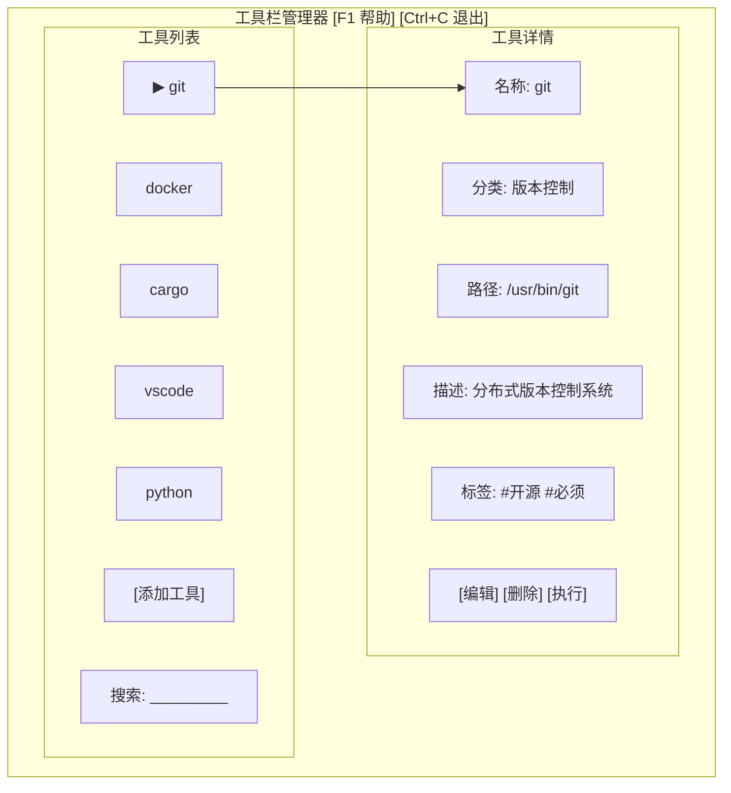

# 工具栏管理工具：TUI入门

## 我们要做什么

在本教程中，你将构建一个**终端用户界面（TUI）工具栏管理工具**。这是一个运行在终端中的交互式程序，左栏显示工具列表，右栏显示选中工具的详细信息，可以用键盘浏览和操作。

最终效果大致是这样的（在终端中渲染）：



你将学到：TUI 基本概念、ratatui 框架使用、事件循环、键盘处理、终端渲染原理。

## 前置知识

你需要先阅读以下章节：
- [[../入门/01-环境搭建与第一个程序]]
- [[../入门/02-变量与基本类型]]
- [[../入门/03-函数与控制流]]
- [[../入门/04-所有权与借用]]
- [[../入门/05-结构体与枚举]]
- [[../深入/01-错误处理]]
- [[02-学生管理系统：命令行工具]]

---

## 第 1 步：创建项目并添加依赖

```bash
cargo new tool_manager
cd tool_manager
```

打开 `Cargo.toml`：

```toml
[package]
name = "tool_manager"
version = "0.1.0"
edition = "2021"

[dependencies]
ratatui = "0.26"
crossterm = "0.27"
serde = { version = "1.0", features = ["derive"] }
serde_json = "1.0"
```

**依赖解释：**

| Crate | 版本 | 作用 |
|-------|------|------|
| `ratatui` | 0.26 | TUI 框架。提供布局（Layout）、组件（List、Paragraph、Block、Tabs）和渲染能力。`ratatui` 是 `tui-rs` 的社区 fork，更加活跃。 |
| `crossterm` | 0.27 | 跨平台终端操控库。处理键盘输入、鼠标事件、终端清理、光标控制等。`ratatui` 依赖它作为后端。 |
| `serde` + `serde_json` | 1.0 | 和我们上一章一样，用于 JSON 序列化。用来保存工具列表。 |

### 什么是 TUI？

**TUI（Terminal User Interface，终端用户界面）** 是运行在终端中的交互式界面。与 GUI 不同，TUI 不需要图形系统——它使用 ANSI 转义序列在终端中绘制文本和颜色。

**TUI vs GUI：**

| 特性 | TUI | GUI |
|------|-----|-----|
| 运行环境 | 终端（SSH 也支持） | 图形桌面 |
| 输入方式 | 键盘为主 | 鼠标为主 |
| 渲染方式 | 文本 + ANSI 转义序列 | 像素/矢量图形 |
| 开发复杂度 | 中等 | 中等到高 |
| 资源占用 | 极低 | 较高 |
| 远程使用 | 天然支持（SSH） | 需要 VNC/RDP |
| 示例 | vim、htop、lazygit | VS Code、Chrome |

### 终端渲染原理

终端本质上是一个字符网格（如 80×24 或 120×40）。`ratatui` 的工作原理是：

1. **接收事件**：通过 `crossterm` 监听键盘/鼠标事件
2. **构建界面**：用 Layout 划分区域，用组件填充内容
3. **渲染**：生成整个屏幕的字符矩阵，对比上一帧找出差异，只更新变化的部分
4. **循环**：重复以上步骤

`ratatui` 的事件循环伪代码：
```
loop {
    等待键盘事件
    处理事件（更新应用状态）
    渲染（构建界面、绘制到终端）
}
```

---

## 第 2 步：创建基本 TUI 应用骨架

创建 `src/main.rs`：

```rust
use crossterm::{
    event::{self, DisableMouseCapture, EnableMouseCapture, Event, KeyCode},
    execute,
    terminal::{disable_raw_mode, enable_raw_mode, EnterAlternateScreen, LeaveAlternateScreen},
};
use ratatui::{
    backend::{Backend, CrosstermBackend},
    Terminal,
};
use std::{error::Error, io};

fn main() -> Result<(), Box<dyn Error>> {
    // 步骤 1：设置终端
    enable_raw_mode()?;
    let mut stdout = io::stdout();
    execute!(stdout, EnterAlternateScreen, EnableMouseCapture)?;
    let backend = CrosstermBackend::new(stdout);
    let mut terminal = Terminal::new(backend)?;

    // 步骤 2：运行应用
    let result = run_app(&mut terminal);

    // 步骤 3：恢复终端
    disable_raw_mode()?;
    execute!(
        terminal.backend_mut(),
        LeaveAlternateScreen,
        DisableMouseCapture
    )?;
    terminal.show_cursor()?;

    // 步骤 4：处理结果
    if let Err(err) = result {
        println!("错误: {:?}", err);
    }

    Ok(())
}

fn run_app<B: Backend>(terminal: &mut Terminal<B>) -> io::Result<()> {
    loop {
        // 绘制界面
        terminal.draw(|f| {
            let size = f.size();
            let block = ratatui::widgets::Block::default()
                .title("工具栏管理器")
                .borders(ratatui::widgets::Borders::ALL);
            f.render_widget(block, size);
        })?;

        // 处理输入
        if event::poll(std::time::Duration::from_millis(100))? {
            if let Event::Key(key) = event::read()? {
                if key.code == KeyCode::Char('q') {
                    break;
                }
            }
        }
    }
    Ok(())
}
```

**逐行解释：**

1. `enable_raw_mode()` — 启用原始模式。在普通模式下，终端会缓冲整行输入并处理 Ctrl+C 等组合键。原始模式下，每个按键立即传送给程序，Ctrl+C 也不会中断程序。
2. `EnterAlternateScreen` — 进入备用屏幕。终端"保存"当前屏幕内容，切换到一个干净的屏幕。退出程序时恢复。
3. `CrosstermBackend::new(stdout)` — 创建 crossterm 后端，ratatui 通过它操作终端。
4. `Terminal::new(backend)` — 创建 ratatui 终端对象。
5. `terminal.draw(|f| { ... })` — 核心渲染方法。`f` 是 `Frame` 对象，用于布局和绘制。
6. `f.size()` — 获取终端可用区域（Rect）。
7. `Block::default().title(...).borders(...)` — 创建一个带边框和标题的矩形区域。
8. `f.render_widget(block, size)` — 在指定区域渲染组件。
9. `event::poll(Duration)` — 等待键盘事件（最多 100 毫秒），超时后继续循环以处理重绘。
10. `event::read()` — 读取一个事件。
11. 按 `q` 退出循环。
12. `disable_raw_mode()` + `LeaveAlternateScreen` — 恢复终端的正常状态。

**运行：**

```bash
cargo run
```

**你应该看到：** 整个终端被清空，出现一个带有"工具栏管理器"标题的边框。按 `q` 退出。退出后终端恢复正常，之前的内容也回来了。

如果终端看起来乱码，重新打开一个终端窗口即可。

---

## 第 3 步：定义数据结构

现在我们定义工具（Tool）的数据结构：

```rust
use crossterm::{
    event::{self, DisableMouseCapture, EnableMouseCapture, Event, KeyCode, KeyEventKind},
    execute,
    terminal::{disable_raw_mode, enable_raw_mode, EnterAlternateScreen, LeaveAlternateScreen},
};
use ratatui::{
    backend::{Backend, CrosstermBackend},
    layout::{Constraint, Direction, Layout},
    style::{Color, Modifier, Style},
    text::{Line, Span},
    widgets::{Block, Borders, List, ListItem, Paragraph},
    Terminal,
};
use serde::{Deserialize, Serialize};
use std::{error::Error, io};

#[derive(Debug, Clone, Serialize, Deserialize)]
struct Tool {
    name: String,
    category: String,
    path: String,
    description: String,
    tags: Vec<String>,
}

impl Tool {
    fn new(name: &str, category: &str, path: &str, description: &str) -> Self {
        Self {
            name: name.to_string(),
            category: category.to_string(),
            path: path.to_string(),
            description: description.to_string(),
            tags: Vec::new(),
        }
    }
}

struct App {
    tools: Vec<Tool>,
    selected_index: usize,
    should_quit: bool,
}

impl App {
    fn new() -> Self {
        Self {
            tools: vec![
                Tool::new("git", "版本控制", "/usr/bin/git", "分布式版本控制系统"),
                Tool::new("docker", "容器", "/usr/bin/docker", "容器化平台"),
                Tool::new("cargo", "构建工具", "/usr/bin/cargo", "Rust 包管理器和构建系统"),
                Tool::new("vscode", "编辑器", "/usr/bin/code", "微软出品的代码编辑器"),
                Tool::new("python", "编程语言", "/usr/bin/python3", "Python 解释器"),
            ],
            selected_index: 0,
            should_quit: false,
        }
    }

    fn next(&mut self) {
        if !self.tools.is_empty() {
            self.selected_index = (self.selected_index + 1) % self.tools.len();
        }
    }

    fn previous(&mut self) {
        if !self.tools.is_empty() {
            if self.selected_index == 0 {
                self.selected_index = self.tools.len() - 1;
            } else {
                self.selected_index -= 1;
            }
        }
    }

    fn selected_tool(&self) -> Option<&Tool> {
        self.tools.get(self.selected_index)
    }
}

fn main() -> Result<(), Box<dyn Error>> {
    enable_raw_mode()?;
    let mut stdout = io::stdout();
    execute!(stdout, EnterAlternateScreen, EnableMouseCapture)?;
    let backend = CrosstermBackend::new(stdout);
    let mut terminal = Terminal::new(backend)?;

    let app = App::new();
    let result = run_app(&mut terminal, app);

    disable_raw_mode()?;
    execute!(
        terminal.backend_mut(),
        LeaveAlternateScreen,
        DisableMouseCapture
    )?;
    terminal.show_cursor()?;

    if let Err(err) = result {
        println!("错误: {:?}", err);
    }

    Ok(())
}

fn run_app<B: Backend>(terminal: &mut Terminal<B>, mut app: App) -> io::Result<()> {
    loop {
        terminal.draw(|f| {
            let size = f.size();
            let block = Block::default()
                .title("工具栏管理器")
                .borders(Borders::ALL);
            f.render_widget(block, size);
        })?;

        if app.should_quit {
            break;
        }

        if event::poll(std::time::Duration::from_millis(100))? {
            if let Event::Key(key) = event::read()? {
                if key.kind == KeyEventKind::Press {
                    match key.code {
                        KeyCode::Char('q') => app.should_quit = true,
                        KeyCode::Up | KeyCode::Char('k') => app.previous(),
                        KeyCode::Down | KeyCode::Char('j') => app.next(),
                        _ => {}
                    }
                }
            }
        }
    }
    Ok(())
}
```

**新内容解释：**

- `Tool` 结构体 — 表示一个工具，包含名称、分类、路径、描述和标签。
- `App` 结构体 — 应用程序状态：工具列表、当前选中索引、是否退出。
- `next()` / `previous()` — 移动选中项，使用 `%` 取模实现循环滚动。
- `selected_tool()` — 返回当前选中的工具（如果存在）。
- `KeyEventKind::Press` — 区分"按下"和"释放"事件，我们只处理按下。

---

## 第 4 步：左侧列表面板

现在使用 ratatui 的 Layout 和 List 组件，把界面分为左右两栏：

```rust
use crossterm::{
    event::{self, DisableMouseCapture, EnableMouseCapture, Event, KeyCode, KeyEventKind},
    execute,
    terminal::{disable_raw_mode, enable_raw_mode, EnterAlternateScreen, LeaveAlternateScreen},
};
use ratatui::{
    backend::{Backend, CrosstermBackend},
    layout::{Constraint, Direction, Layout},
    style::{Color, Modifier, Style},
    text::{Line, Span},
    widgets::{Block, Borders, List, ListItem, Paragraph},
    Terminal,
};
use serde::{Deserialize, Serialize};
use std::{error::Error, io};

#[derive(Debug, Clone, Serialize, Deserialize)]
struct Tool {
    name: String,
    category: String,
    path: String,
    description: String,
    tags: Vec<String>,
}

impl Tool {
    fn new(name: &str, category: &str, path: &str, description: &str) -> Self {
        Self {
            name: name.to_string(),
            category: category.to_string(),
            path: path.to_string(),
            description: description.to_string(),
            tags: Vec::new(),
        }
    }
}

struct App {
    tools: Vec<Tool>,
    selected_index: usize,
    should_quit: bool,
}

impl App {
    fn new() -> Self {
        Self {
            tools: vec![
                Tool::new("git", "版本控制", "/usr/bin/git", "分布式版本控制系统"),
                Tool::new("docker", "容器", "/usr/bin/docker", "容器化平台"),
                Tool::new("cargo", "构建工具", "/usr/bin/cargo", "Rust 包管理器和构建系统"),
                Tool::new("vscode", "编辑器", "/usr/bin/code", "微软出品的代码编辑器"),
                Tool::new("python", "编程语言", "/usr/bin/python3", "Python 解释器"),
            ],
            selected_index: 0,
            should_quit: false,
        }
    }

    fn next(&mut self) {
        if !self.tools.is_empty() {
            self.selected_index = (self.selected_index + 1) % self.tools.len();
        }
    }

    fn previous(&mut self) {
        if !self.tools.is_empty() {
            if self.selected_index == 0 {
                self.selected_index = self.tools.len() - 1;
            } else {
                self.selected_index -= 1;
            }
        }
    }

    fn selected_tool(&self) -> Option<&Tool> {
        self.tools.get(self.selected_index)
    }
}

fn main() -> Result<(), Box<dyn Error>> {
    enable_raw_mode()?;
    let mut stdout = io::stdout();
    execute!(stdout, EnterAlternateScreen, EnableMouseCapture)?;
    let backend = CrosstermBackend::new(stdout);
    let mut terminal = Terminal::new(backend)?;

    let app = App::new();
    let result = run_app(&mut terminal, app);

    disable_raw_mode()?;
    execute!(
        terminal.backend_mut(),
        LeaveAlternateScreen,
        DisableMouseCapture
    )?;
    terminal.show_cursor()?;

    if let Err(err) = result {
        println!("错误: {:?}", err);
    }

    Ok(())
}

fn run_app<B: Backend>(terminal: &mut Terminal<B>, mut app: App) -> io::Result<()> {
    loop {
        terminal.draw(|f| {
            // 把整个区域分成左右两栏
            let chunks = Layout::default()
                .direction(Direction::Horizontal)
                .constraints([Constraint::Percentage(30), Constraint::Percentage(70)])
                .split(f.size());

            // 左侧：工具列表
            let list_items: Vec<ListItem> = app
                .tools
                .iter()
                .enumerate()
                .map(|(i, tool)| {
                    let style = if i == app.selected_index {
                        Style::default()
                            .fg(Color::Yellow)
                            .add_modifier(Modifier::BOLD)
                    } else {
                        Style::default()
                    };
                    ListItem::new(Line::from(Span::styled(
                        format!("  {}  ({})", tool.name, tool.category),
                        style,
                    )))
                })
                .collect();

            let list = List::new(list_items)
                .block(Block::default().title("工具列表").borders(Borders::ALL))
                .highlight_style(
                    Style::default()
                        .bg(Color::DarkGray)
                        .add_modifier(Modifier::BOLD),
                );

            f.render_widget(list, chunks[0]);

            // 右侧：工具详情
            let detail_block = Block::default()
                .title("工具详情")
                .borders(Borders::ALL);

            f.render_widget(detail_block, chunks[1]);
        })?;

        if app.should_quit {
            break;
        }

        if event::poll(std::time::Duration::from_millis(100))? {
            if let Event::Key(key) = event::read()? {
                if key.kind == KeyEventKind::Press {
                    match key.code {
                        KeyCode::Char('q') => app.should_quit = true,
                        KeyCode::Up | KeyCode::Char('k') => app.previous(),
                        KeyCode::Down | KeyCode::Char('j') => app.next(),
                        _ => {}
                    }
                }
            }
        }
    }
    Ok(())
}
```

**新内容解释：**

- `Layout::default().direction(Direction::Horizontal).constraints([...])` — 创建水平布局，左栏占 30% 宽度，右栏占 70%。
- `chunks` — 一个包含两个 `Rect` 的数组，表示左右两个区域。
- `List::new(...)` — 创建一个列表组件。
- `ListItem` — 列表中的每一项。
- `Span::styled(text, style)` — 带样式的文本片段。这里选中项用黄色加粗显示。
- `highlight_style` — 高亮样式，选中行有深灰色背景。

**运行：**

```bash
cargo run
```

**你应该看到：** 屏幕分成左右两栏。左栏列出 5 个工具（git、docker、cargo、vscode、python），当前选中的 git 是黄色的。用上下方向键（或 `j`/`k`）可以移动选择。右栏目前是空的。

---

## 第 5 步：右侧详情面板

现在填充右侧面板，显示选中工具的详细信息：

```rust
use crossterm::{
    event::{self, DisableMouseCapture, EnableMouseCapture, Event, KeyCode, KeyEventKind},
    execute,
    terminal::{disable_raw_mode, enable_raw_mode, EnterAlternateScreen, LeaveAlternateScreen},
};
use ratatui::{
    backend::{Backend, CrosstermBackend},
    layout::{Constraint, Direction, Layout},
    style::{Color, Modifier, Style},
    text::{Line, Span},
    widgets::{Block, Borders, List, ListItem, Paragraph, Wrap},
    Terminal,
};
use serde::{Deserialize, Serialize};
use std::{error::Error, io};

#[derive(Debug, Clone, Serialize, Deserialize)]
struct Tool {
    name: String,
    category: String,
    path: String,
    description: String,
    tags: Vec<String>,
}

impl Tool {
    fn new(name: &str, category: &str, path: &str, description: &str) -> Self {
        Self {
            name: name.to_string(),
            category: category.to_string(),
            path: path.to_string(),
            description: description.to_string(),
            tags: Vec::new(),
        }
    }
}

struct App {
    tools: Vec<Tool>,
    selected_index: usize,
    should_quit: bool,
}

impl App {
    fn new() -> Self {
        Self {
            tools: vec![
                Tool::new("git", "版本控制", "/usr/bin/git", "分布式版本控制系统，用于跟踪文件变化和协作开发。"),
                Tool::new("docker", "容器", "/usr/bin/docker", "容器化平台，用于构建、共享和运行容器应用。"),
                Tool::new("cargo", "构建工具", "/usr/bin/cargo", "Rust 的官方包管理器和构建系统。"),
                Tool::new("vscode", "编辑器", "/usr/bin/code", "微软出品的轻量级代码编辑器，支持丰富的插件生态。"),
                Tool::new("python", "编程语言", "/usr/bin/python3", "Python 编程语言的解释器。"),
            ],
            selected_index: 0,
            should_quit: false,
        }
    }

    fn next(&mut self) {
        if !self.tools.is_empty() {
            self.selected_index = (self.selected_index + 1) % self.tools.len();
        }
    }

    fn previous(&mut self) {
        if !self.tools.is_empty() {
            if self.selected_index == 0 {
                self.selected_index = self.tools.len() - 1;
            } else {
                self.selected_index -= 1;
            }
        }
    }

    fn selected_tool(&self) -> Option<&Tool> {
        self.tools.get(self.selected_index)
    }
}

fn main() -> Result<(), Box<dyn Error>> {
    enable_raw_mode()?;
    let mut stdout = io::stdout();
    execute!(stdout, EnterAlternateScreen, EnableMouseCapture)?;
    let backend = CrosstermBackend::new(stdout);
    let mut terminal = Terminal::new(backend)?;

    let app = App::new();
    let result = run_app(&mut terminal, app);

    disable_raw_mode()?;
    execute!(
        terminal.backend_mut(),
        LeaveAlternateScreen,
        DisableMouseCapture
    )?;
    terminal.show_cursor()?;

    if let Err(err) = result {
        println!("错误: {:?}", err);
    }

    Ok(())
}

fn run_app<B: Backend>(terminal: &mut Terminal<B>, mut app: App) -> io::Result<()> {
    loop {
        terminal.draw(|f| {
            let chunks = Layout::default()
                .direction(Direction::Horizontal)
                .constraints([Constraint::Percentage(30), Constraint::Percentage(70)])
                .split(f.size());

            // 左侧：工具列表
            let list_items: Vec<ListItem> = app
                .tools
                .iter()
                .enumerate()
                .map(|(i, tool)| {
                    let style = if i == app.selected_index {
                        Style::default()
                            .fg(Color::Yellow)
                            .add_modifier(Modifier::BOLD)
                    } else {
                        Style::default()
                    };
                    ListItem::new(Line::from(Span::styled(
                        format!("  {}  ({})", tool.name, tool.category),
                        style,
                    )))
                })
                .collect();

            let list = List::new(list_items)
                .block(Block::default().title("工具列表").borders(Borders::ALL))
                .highlight_style(
                    Style::default()
                        .bg(Color::DarkGray)
                        .add_modifier(Modifier::BOLD),
                );

            f.render_widget(list, chunks[0]);

            // 右侧：工具详情
            let detail_text = if let Some(tool) = app.selected_tool() {
                vec![
                    Line::from(vec![
                        Span::styled("名称: ", Style::default().fg(Color::Cyan)),
                        Span::styled(&tool.name, Style::default().add_modifier(Modifier::BOLD)),
                    ]),
                    Line::from(""),
                    Line::from(vec![
                        Span::styled("分类: ", Style::default().fg(Color::Cyan)),
                        Span::raw(&tool.category),
                    ]),
                    Line::from(""),
                    Line::from(vec![
                        Span::styled("路径: ", Style::default().fg(Color::Cyan)),
                        Span::raw(&tool.path),
                    ]),
                    Line::from(""),
                    Line::from(vec![
                        Span::styled("描述: ", Style::default().fg(Color::Cyan)),
                        Span::raw(&tool.description),
                    ]),
                    Line::from(""),
                    Line::from(vec![
                        Span::styled("标签: ", Style::default().fg(Color::Cyan)),
                        Span::raw(if tool.tags.is_empty() {
                            "无".to_string()
                        } else {
                            tool.tags.join(", ")
                        }),
                    ]),
                ]
            } else {
                vec![Line::from("没有工具被选中")]
            };

            let detail = Paragraph::new(detail_text)
                .block(Block::default().title("工具详情").borders(Borders::ALL))
                .wrap(Wrap { trim: true });

            f.render_widget(detail, chunks[1]);
        })?;

        if app.should_quit {
            break;
        }

        if event::poll(std::time::Duration::from_millis(100))? {
            if let Event::Key(key) = event::read()? {
                if key.kind == KeyEventKind::Press {
                    match key.code {
                        KeyCode::Char('q') => app.should_quit = true,
                        KeyCode::Up | KeyCode::Char('k') => app.previous(),
                        KeyCode::Down | KeyCode::Char('j') => app.next(),
                        _ => {}
                    }
                }
            }
        }
    }
    Ok(())
}
```

**新内容解释：**

- `Paragraph::new(detail_text)` — 创建一个段落组件，显示多行文本。
- `Line::from(vec![...])` — 一行可以由多个 `Span`（文本片段）组成，每个 Span 可以有不同的样式。
- `Span::styled("名称: ", Style::default().fg(Color::Cyan))` — 字段名用青色显示，更清晰。
- `.wrap(Wrap { trim: true })` — 自动换行，长文本不会超出边界。

**运行：**

```bash
cargo run
```

**你应该看到：** 右侧面板显示了当前选中工具的详细信息：名称（粗体）、分类、路径、描述、标签。用方向键切换工具，右侧内容会实时更新。

---

## 第 6 步：添加操作功能——添加工具（弹窗）

在 TUI 中模拟"弹窗"需要使用额外的状态。我们添加一个输入模式：

```rust
use crossterm::{
    event::{self, DisableMouseCapture, EnableMouseCapture, Event, KeyCode, KeyEventKind},
    execute,
    terminal::{disable_raw_mode, enable_raw_mode, EnterAlternateScreen, LeaveAlternateScreen},
};
use ratatui::{
    backend::{Backend, CrosstermBackend},
    layout::{Constraint, Direction, Layout, Rect},
    style::{Color, Modifier, Style},
    text::{Line, Span},
    widgets::{Block, Borders, Clear, List, ListItem, Paragraph, Wrap},
    Terminal,
};
use serde::{Deserialize, Serialize};
use std::{error::Error, io};

#[derive(Debug, Clone, Serialize, Deserialize)]
struct Tool {
    name: String,
    category: String,
    path: String,
    description: String,
    tags: Vec<String>,
}

impl Tool {
    fn new(name: &str, category: &str, path: &str, description: &str) -> Self {
        Self {
            name: name.to_string(),
            category: category.to_string(),
            path: path.to_string(),
            description: description.to_string(),
            tags: Vec::new(),
        }
    }
}

enum InputMode {
    Normal,
    Adding { input: String, field: AddField, step: u8 },
}

#[derive(Clone)]
enum AddField {
    Name,
    Category,
    Path,
    Description,
}

struct App {
    tools: Vec<Tool>,
    selected_index: usize,
    should_quit: bool,
    input_mode: InputMode,
}

impl App {
    fn new() -> Self {
        Self {
            tools: vec![
                Tool::new("git", "版本控制", "/usr/bin/git", "分布式版本控制系统，用于跟踪文件变化和协作开发。"),
                Tool::new("docker", "容器", "/usr/bin/docker", "容器化平台，用于构建、共享和运行容器应用。"),
                Tool::new("cargo", "构建工具", "/usr/bin/cargo", "Rust 的官方包管理器和构建系统。"),
                Tool::new("vscode", "编辑器", "/usr/bin/code", "微软出品的轻量级代码编辑器，支持丰富的插件生态。"),
                Tool::new("python", "编程语言", "/usr/bin/python3", "Python 编程语言的解释器。"),
            ],
            selected_index: 0,
            should_quit: false,
            input_mode: InputMode::Normal,
        }
    }

    fn next(&mut self) {
        if !self.tools.is_empty() {
            self.selected_index = (self.selected_index + 1) % self.tools.len();
        }
    }

    fn previous(&mut self) {
        if !self.tools.is_empty() {
            if self.selected_index == 0 {
                self.selected_index = self.tools.len() - 1;
            } else {
                self.selected_index -= 1;
            }
        }
    }

    fn selected_tool(&self) -> Option<&Tool> {
        self.tools.get(self.selected_index)
    }

    fn start_adding(&mut self) {
        self.input_mode = InputMode::Adding {
            input: String::new(),
            field: AddField::Name,
            step: 0,
        };
    }
}

fn main() -> Result<(), Box<dyn Error>> {
    enable_raw_mode()?;
    let mut stdout = io::stdout();
    execute!(stdout, EnterAlternateScreen, EnableMouseCapture)?;
    let backend = CrosstermBackend::new(stdout);
    let mut terminal = Terminal::new(backend)?;

    let app = App::new();
    let result = run_app(&mut terminal, app);

    disable_raw_mode()?;
    execute!(
        terminal.backend_mut(),
        LeaveAlternateScreen,
        DisableMouseCapture
    )?;
    terminal.show_cursor()?;

    if let Err(err) = result {
        println!("错误: {:?}", err);
    }

    Ok(())
}

fn run_app<B: Backend>(terminal: &mut Terminal<B>, mut app: App) -> io::Result<()> {
    // 用于暂存添加过程中的字段
    let mut temp_name = String::new();
    let mut temp_category = String::new();
    let mut temp_path = String::new();
    let mut temp_description = String::new();

    loop {
        terminal.draw(|f| {
            let size = f.size();
            let chunks = Layout::default()
                .direction(Direction::Horizontal)
                .constraints([Constraint::Percentage(30), Constraint::Percentage(70)])
                .split(size);

            // 左侧：工具列表
            let list_items: Vec<ListItem> = app
                .tools
                .iter()
                .enumerate()
                .map(|(i, tool)| {
                    let style = if i == app.selected_index {
                        Style::default()
                            .fg(Color::Yellow)
                            .add_modifier(Modifier::BOLD)
                    } else {
                        Style::default()
                    };
                    ListItem::new(Line::from(Span::styled(
                        format!("  {}  ({})", tool.name, tool.category),
                        style,
                    )))
                })
                .collect();

            let list = List::new(list_items)
                .block(
                    Block::default()
                        .title("工具列表 (按 'a' 添加)")
                        .borders(Borders::ALL),
                )
                .highlight_style(
                    Style::default()
                        .bg(Color::DarkGray)
                        .add_modifier(Modifier::BOLD),
                );

            f.render_widget(list, chunks[0]);

            // 右侧：工具详情
            let detail_text = if let Some(tool) = app.selected_tool() {
                vec![
                    Line::from(vec![
                        Span::styled("名称: ", Style::default().fg(Color::Cyan)),
                        Span::styled(&tool.name, Style::default().add_modifier(Modifier::BOLD)),
                    ]),
                    Line::from(""),
                    Line::from(vec![
                        Span::styled("分类: ", Style::default().fg(Color::Cyan)),
                        Span::raw(&tool.category),
                    ]),
                    Line::from(""),
                    Line::from(vec![
                        Span::styled("路径: ", Style::default().fg(Color::Cyan)),
                        Span::raw(&tool.path),
                    ]),
                    Line::from(""),
                    Line::from(vec![
                        Span::styled("描述: ", Style::default().fg(Color::Cyan)),
                        Span::raw(&tool.description),
                    ]),
                    Line::from(""),
                    Line::from(vec![
                        Span::styled("标签: ", Style::default().fg(Color::Cyan)),
                        Span::raw(if tool.tags.is_empty() {
                            "无".to_string()
                        } else {
                            tool.tags.join(", ")
                        }),
                    ]),
                    Line::from(""),
                    Line::from("按 'd' 删除 | 按 'a' 添加新工具 | 按 'q' 退出"),
                ]
            } else {
                vec![Line::from("没有工具被选中")]
            };

            let detail = Paragraph::new(detail_text)
                .block(Block::default().title("工具详情").borders(Borders::ALL))
                .wrap(Wrap { trim: true });

            f.render_widget(detail, chunks[1]);

            // 弹窗：添加工具
            if let InputMode::Adding { ref input, ref field, step } = app.input_mode {
                let popup_area = centered_rect(50, 30, size);

                let field_name = match field {
                    AddField::Name => "工具名称",
                    AddField::Category => "分类",
                    AddField::Path => "路径",
                    AddField::Description => "描述",
                };

                let title = format!("添加工具 — 步骤 {}/4: {}", step + 1, field_name);
                let popup_text = vec![
                    Line::from(Span::styled(
                        format!("请输入{}:", field_name),
                        Style::default().fg(Color::Yellow),
                    )),
                    Line::from(""),
                    Line::from(Span::styled(
                        format!("> {}", input),
                        Style::default().fg(Color::White),
                    )),
                    Line::from(""),
                    Line::from(Span::styled(
                        "按 Enter 确认，按 Esc 取消",
                        Style::default().fg(Color::DarkGray),
                    )),
                ];

                let popup = Paragraph::new(popup_text)
                    .block(Block::default().title(title).borders(Borders::ALL))
                    .style(Style::default().bg(Color::Rgb(30, 30, 50)));

                f.render_widget(Clear, popup_area);
                f.render_widget(popup, popup_area);
            }
        })?;

        if app.should_quit {
            break;
        }

        if event::poll(std::time::Duration::from_millis(100))? {
            if let Event::Key(key) = event::read()? {
                if key.kind == KeyEventKind::Press {
                    match &mut app.input_mode {
                        InputMode::Normal => match key.code {
                            KeyCode::Char('q') => app.should_quit = true,
                            KeyCode::Up | KeyCode::Char('k') => app.previous(),
                            KeyCode::Down | KeyCode::Char('j') => app.next(),
                            KeyCode::Char('a') => {
                                temp_name = String::new();
                                temp_category = String::new();
                                temp_path = String::new();
                                temp_description = String::new();
                                app.start_adding();
                            }
                            KeyCode::Char('d') => {
                                if !app.tools.is_empty() {
                                    let idx = app.selected_index;
                                    app.tools.remove(idx);
                                    if !app.tools.is_empty() && idx >= app.tools.len() {
                                        app.selected_index = app.tools.len() - 1;
                                    }
                                }
                            }
                            _ => {}
                        },
                        InputMode::Adding { input, field, step } => match key.code {
                            KeyCode::Esc => {
                                app.input_mode = InputMode::Normal;
                            }
                            KeyCode::Enter => {
                                match field {
                                    AddField::Name => {
                                        temp_name = input.clone();
                                        *field = AddField::Category;
                                    }
                                    AddField::Category => {
                                        temp_category = input.clone();
                                        *field = AddField::Path;
                                    }
                                    AddField::Path => {
                                        temp_path = input.clone();
                                        *field = AddField::Description;
                                    }
                                    AddField::Description => {
                                        temp_description = input.clone();
                                        // 所有字段填写完毕，创建工具
                                        if !temp_name.is_empty() {
                                            let tool = Tool {
                                                name: temp_name.clone(),
                                                category: temp_category.clone(),
                                                path: temp_path.clone(),
                                                description: temp_description.clone(),
                                                tags: Vec::new(),
                                            };
                                            app.tools.push(tool);
                                            app.selected_index = app.tools.len() - 1;
                                        }
                                        app.input_mode = InputMode::Normal;
                                    }
                                }
                                input.clear();
                                *step += 1;
                            }
                            KeyCode::Backspace => {
                                input.pop();
                            }
                            KeyCode::Char(c) => {
                                input.push(c);
                            }
                            _ => {}
                        },
                    }
                }
            }
        }
    }
    Ok(())
}

fn centered_rect(percent_x: u16, percent_y: u16, r: Rect) -> Rect {
    let popup_layout = Layout::default()
        .direction(Direction::Vertical)
        .constraints([
            Constraint::Percentage((100 - percent_y) / 2),
            Constraint::Percentage(percent_y),
            Constraint::Percentage((100 - percent_y) / 2),
        ])
        .split(r);

    Layout::default()
        .direction(Direction::Horizontal)
        .constraints([
            Constraint::Percentage((100 - percent_x) / 2),
            Constraint::Percentage(percent_x),
            Constraint::Percentage((100 - percent_x) / 2),
        ])
        .split(popup_layout[1])[1]
}
```

**新内容解释：**

- `InputMode` 枚举 — 表示当前输入状态。`Normal` 是正常模式，`Adding` 是添加模式。
- `AddField` 枚举 — 表示正在填写的字段。
- `temp_*` 变量 — 暂存用户在弹窗中输入的值。
- `centered_rect` — 计算弹出窗口的位置（居中，占指定百分比）。
- `Clear` 组件 — 先清除弹窗区域（避免背景穿透）。
- `Backspace` 处理 — 按退格键删除最后一个字符。
- `Char(c)` 处理 — 按普通字符追加到输入字符串。

**运行：**

```bash
cargo run
```

**你应该看到：** 
1. 按 `a` 键弹出一个居中的蓝色背景窗口
2. 按提示输入工具名称 → Enter
3. 输入分类 → Enter  
4. 输入路径 → Enter
5. 输入描述 → Enter
6. 新工具出现在列表中并被选中
7. 按 `d` 键删除当前选中的工具
8. 按 `Esc` 随时取消添加

---

## 第 7 步：持久化——JSON 文件读写

现在添加 JSON 持久化，和上一章类似。在 `run_app` 函数前后加上加载和保存：

```rust
// (完整代码合集，以下是关键修改部分)

// main 函数中：
fn main() -> Result<(), Box<dyn Error>> {
    // ... 终端设置 ...

    let mut app = App::new();
    app.load_from_file(); // 新增：从文件加载

    let result = run_app(&mut terminal, app);

    // 保存到文件（在恢复终端之前）
    // 这里需要在 run_app 返回 app 的所有权
    // 所以我们修改 run_app 的签名来返回 app

    // ... 终端恢复 ...
}

// 修改 run_app 的签名，让它返回 App：
fn run_app<B: Backend>(terminal: &mut Terminal<B>, mut app: App) -> io::Result<App> {
    // ... 循环 ...
    Ok(app)
}

// 在 App 上添加方法：
impl App {
    fn load_from_file(&mut self) {
        if let Ok(contents) = std::fs::read_to_string("tools.json") {
            if let Ok(tools) = serde_json::from_str::<Vec<Tool>>(&contents) {
                self.tools = tools;
            }
        }
    }

    fn save_to_file(&self) {
        if let Ok(json) = serde_json::to_string_pretty(&self.tools) {
            let _ = std::fs::write("tools.json", json);
        }
    }
}
```

完整代码整合后如下（这是最终版本，包含所有功能）：

```rust
use crossterm::{
    event::{self, DisableMouseCapture, EnableMouseCapture, Event, KeyCode, KeyEventKind},
    execute,
    terminal::{disable_raw_mode, enable_raw_mode, EnterAlternateScreen, LeaveAlternateScreen},
};
use ratatui::{
    backend::{Backend, CrosstermBackend},
    layout::{Constraint, Direction, Layout, Rect},
    style::{Color, Modifier, Style},
    text::{Line, Span},
    widgets::{Block, Borders, Clear, List, ListItem, Paragraph, Wrap},
    Terminal,
};
use serde::{Deserialize, Serialize};
use std::{error::Error, fs, io};

#[derive(Debug, Clone, Serialize, Deserialize)]
struct Tool {
    name: String,
    category: String,
    path: String,
    description: String,
    tags: Vec<String>,
}

impl Tool {
    fn new(name: &str, category: &str, path: &str, description: &str) -> Self {
        Self {
            name: name.to_string(),
            category: category.to_string(),
            path: path.to_string(),
            description: description.to_string(),
            tags: Vec::new(),
        }
    }
}

enum InputMode {
    Normal,
    Adding { input: String, field: AddField, step: u8 },
}

#[derive(Clone)]
enum AddField {
    Name,
    Category,
    Path,
    Description,
}

struct App {
    tools: Vec<Tool>,
    selected_index: usize,
    should_quit: bool,
    input_mode: InputMode,
}

impl App {
    fn new() -> Self {
        Self {
            tools: Vec::new(),
            selected_index: 0,
            should_quit: false,
            input_mode: InputMode::Normal,
        }
    }

    fn load_from_file(&mut self) {
        if let Ok(contents) = fs::read_to_string("tools.json") {
            if let Ok(tools) = serde_json::from_str::<Vec<Tool>>(&contents) {
                self.tools = tools;
                return;
            }
        }
        // 文件不存在或解析失败，使用默认数据
        self.tools = vec![
            Tool::new("git", "版本控制", "/usr/bin/git", "分布式版本控制系统，用于跟踪文件变化和协作开发。"),
            Tool::new("docker", "容器", "/usr/bin/docker", "容器化平台，用于构建、共享和运行容器应用。"),
            Tool::new("cargo", "构建工具", "/usr/bin/cargo", "Rust 的官方包管理器和构建系统。"),
            Tool::new("vscode", "编辑器", "/usr/bin/code", "微软出品的轻量级代码编辑器，支持丰富的插件生态。"),
            Tool::new("python", "编程语言", "/usr/bin/python3", "Python 编程语言的解释器。"),
        ];
    }

    fn save_to_file(&self) {
        if let Ok(json) = serde_json::to_string_pretty(&self.tools) {
            let _ = fs::write("tools.json", json);
        }
    }

    fn next(&mut self) {
        if !self.tools.is_empty() {
            self.selected_index = (self.selected_index + 1) % self.tools.len();
        }
    }

    fn previous(&mut self) {
        if !self.tools.is_empty() {
            if self.selected_index == 0 {
                self.selected_index = self.tools.len() - 1;
            } else {
                self.selected_index -= 1;
            }
        }
    }

    fn selected_tool(&self) -> Option<&Tool> {
        self.tools.get(self.selected_index)
    }

    fn start_adding(&mut self) {
        self.input_mode = InputMode::Adding {
            input: String::new(),
            field: AddField::Name,
            step: 0,
        };
    }
}

fn main() -> Result<(), Box<dyn Error>> {
    enable_raw_mode()?;
    let mut stdout = io::stdout();
    execute!(stdout, EnterAlternateScreen, EnableMouseCapture)?;
    let backend = CrosstermBackend::new(stdout);
    let mut terminal = Terminal::new(backend)?;

    let mut app = App::new();
    app.load_from_file();

    let result = run_app(&mut terminal, app);

    disable_raw_mode()?;
    execute!(
        terminal.backend_mut(),
        LeaveAlternateScreen,
        DisableMouseCapture
    )?;
    terminal.show_cursor()?;

    if let Err(err) = result {
        println!("错误: {:?}", err);
    }

    Ok(())
}

fn run_app<B: Backend>(terminal: &mut Terminal<B>, mut app: App) -> io::Result<App> {
    let mut temp_name = String::new();
    let mut temp_category = String::new();
    let mut temp_path = String::new();
    let mut temp_description = String::new();

    loop {
        terminal.draw(|f| {
            let size = f.size();
            let chunks = Layout::default()
                .direction(Direction::Horizontal)
                .constraints([Constraint::Percentage(30), Constraint::Percentage(70)])
                .split(size);

            // 左侧：工具列表
            let list_items: Vec<ListItem> = app
                .tools
                .iter()
                .enumerate()
                .map(|(i, tool)| {
                    let style = if i == app.selected_index {
                        Style::default()
                            .fg(Color::Yellow)
                            .add_modifier(Modifier::BOLD)
                    } else {
                        Style::default()
                    };
                    ListItem::new(Line::from(Span::styled(
                        format!("  {}  ({})", tool.name, tool.category),
                        style,
                    )))
                })
                .collect();

            let list = List::new(list_items)
                .block(
                    Block::default()
                        .title("工具列表 (a=添加 d=删除 q=退出)")
                        .borders(Borders::ALL),
                )
                .highlight_style(
                    Style::default()
                        .bg(Color::DarkGray)
                        .add_modifier(Modifier::BOLD),
                );

            f.render_widget(list, chunks[0]);

            // 右侧：工具详情
            let detail_text = if let Some(tool) = app.selected_tool() {
                vec![
                    Line::from(vec![
                        Span::styled("名称: ", Style::default().fg(Color::Cyan)),
                        Span::styled(&tool.name, Style::default().add_modifier(Modifier::BOLD)),
                    ]),
                    Line::from(""),
                    Line::from(vec![
                        Span::styled("分类: ", Style::default().fg(Color::Cyan)),
                        Span::raw(&tool.category),
                    ]),
                    Line::from(""),
                    Line::from(vec![
                        Span::styled("路径: ", Style::default().fg(Color::Cyan)),
                        Span::raw(&tool.path),
                    ]),
                    Line::from(""),
                    Line::from(vec![
                        Span::styled("描述: ", Style::default().fg(Color::Cyan)),
                        Span::raw(&tool.description),
                    ]),
                    Line::from(""),
                    Line::from(vec![
                        Span::styled("操作: ", Style::default().fg(Color::Cyan)),
                        Span::raw("j/k 导航 | a 添加 | d 删除 | q 退出"),
                    ]),
                ]
            } else {
                vec![Line::from("没有工具被选中")]
            };

            let detail = Paragraph::new(detail_text)
                .block(Block::default().title("工具详情").borders(Borders::ALL))
                .wrap(Wrap { trim: true });

            f.render_widget(detail, chunks[1]);

            // 弹窗：添加工具
            if let InputMode::Adding { ref input, ref field, step } = app.input_mode {
                let popup_area = centered_rect(50, 30, size);

                let field_name = match field {
                    AddField::Name => "工具名称",
                    AddField::Category => "分类",
                    AddField::Path => "路径",
                    AddField::Description => "描述",
                };

                let title = format!("添加工具 — 步骤 {}/4: {}", step + 1, field_name);
                let popup_text = vec![
                    Line::from(Span::styled(
                        format!("请输入{}:", field_name),
                        Style::default().fg(Color::Yellow),
                    )),
                    Line::from(""),
                    Line::from(Span::styled(
                        format!("> {}", input),
                        Style::default().fg(Color::White),
                    )),
                    Line::from(""),
                    Line::from(Span::styled(
                        "Enter=确认 Esc=取消",
                        Style::default().fg(Color::DarkGray),
                    )),
                ];

                let popup = Paragraph::new(popup_text)
                    .block(Block::default().title(title).borders(Borders::ALL))
                    .style(Style::default().bg(Color::Rgb(30, 30, 50)));

                f.render_widget(Clear, popup_area);
                f.render_widget(popup, popup_area);
            }
        })?;

        if app.should_quit {
            app.save_to_file();
            return Ok(app);
        }

        if event::poll(std::time::Duration::from_millis(100))? {
            if let Event::Key(key) = event::read()? {
                if key.kind == KeyEventKind::Press {
                    match &mut app.input_mode {
                        InputMode::Normal => match key.code {
                            KeyCode::Char('q') => app.should_quit = true,
                            KeyCode::Up | KeyCode::Char('k') => app.previous(),
                            KeyCode::Down | KeyCode::Char('j') => app.next(),
                            KeyCode::Char('a') => {
                                temp_name = String::new();
                                temp_category = String::new();
                                temp_path = String::new();
                                temp_description = String::new();
                                app.start_adding();
                            }
                            KeyCode::Char('d') => {
                                if !app.tools.is_empty() {
                                    let idx = app.selected_index;
                                    app.tools.remove(idx);
                                    if !app.tools.is_empty() && idx >= app.tools.len() {
                                        app.selected_index = app.tools.len() - 1;
                                    }
                                }
                            }
                            _ => {}
                        },
                        InputMode::Adding { input, field, step } => match key.code {
                            KeyCode::Esc => {
                                app.input_mode = InputMode::Normal;
                            }
                            KeyCode::Enter => {
                                match field {
                                    AddField::Name => {
                                        temp_name = input.clone();
                                        *field = AddField::Category;
                                    }
                                    AddField::Category => {
                                        temp_category = input.clone();
                                        *field = AddField::Path;
                                    }
                                    AddField::Path => {
                                        temp_path = input.clone();
                                        *field = AddField::Description;
                                    }
                                    AddField::Description => {
                                        temp_description = input.clone();
                                        if !temp_name.is_empty() {
                                            let tool = Tool {
                                                name: temp_name.clone(),
                                                category: temp_category.clone(),
                                                path: temp_path.clone(),
                                                description: temp_description.clone(),
                                                tags: Vec::new(),
                                            };
                                            app.tools.push(tool);
                                            app.selected_index = app.tools.len() - 1;
                                        }
                                        app.input_mode = InputMode::Normal;
                                    }
                                }
                                input.clear();
                                *step += 1;
                            }
                            KeyCode::Backspace => {
                                input.pop();
                            }
                            KeyCode::Char(c) => {
                                input.push(c);
                            }
                            _ => {}
                        },
                    }
                }
            }
        }
    }
}

fn centered_rect(percent_x: u16, percent_y: u16, r: Rect) -> Rect {
    let popup_layout = Layout::default()
        .direction(Direction::Vertical)
        .constraints([
            Constraint::Percentage((100 - percent_y) / 2),
            Constraint::Percentage(percent_y),
            Constraint::Percentage((100 - percent_y) / 2),
        ])
        .split(r);

    Layout::default()
        .direction(Direction::Horizontal)
        .constraints([
            Constraint::Percentage((100 - percent_x) / 2),
            Constraint::Percentage(percent_x),
            Constraint::Percentage((100 - percent_x) / 2),
        ])
        .split(popup_layout[1])[1]
}
```

**新内容解释：**

- `run_app` 现在返回 `io::Result<App>`，把 `app` 的所有权还给 `main`。
- `app.load_from_file()` — 启动时从 `tools.json` 加载数据。
- `app.save_to_file()` — 退出时保存数据到 `tools.json`。
- 默认数据只在文件加载失败时使用（首次运行）。

**运行：**

```bash
cargo run
# 添加几个工具，按 q 退出
ls tools.json  # 确认文件被创建
cargo run      # 再次启动，数据还在！
```

---

## 第 8-12 步：功能扩展思路

### 第 8 步：搜索/过滤功能

添加搜索模式（类似于 vim 的 `/` 搜索）：
```rust
enum InputMode {
    Normal,
    Adding { ... },
    Searching { query: String },
}
```
按 `/` 进入搜索模式，输入关键词，实时高亮匹配项。

### 第 9 步：分类标签页

添加 `Tabs` 组件，按分类筛选工具：
```rust
let titles = vec!["全部", "版本控制", "容器", "构建工具", "编辑器", "编程语言"];
let tabs = Tabs::new(titles)
    .select(selected_tab)
    .block(Block::default().title("分类").borders(Borders::ALL));
```

### 第 10 步：编辑工具

类似于添加工具，但预填现有值：
```rust
enum InputMode {
    Normal,
    Adding { ... },
    Editing { index: usize, input: String, field: EditField, step: u8 },
}
```

### 第 11 步：帮助页面

按 `F1` 显示按键帮助：
```rust
KeyCode::F(1) => {
    app.show_help = !app.show_help;
}
```

### 第 12 步：命令执行

为每个工具添加"执行"功能，调用 `std::process::Command` 启动该工具。

---

## 章节考查（共 100 分）

### 选择题（每题 10 分，共 40 分）

**1. ratatui 是什么？**

A. 一个 GUI 框架
B. 一个 TUI（终端用户界面）框架
C. 一个游戏引擎
D. 一个数据库库

<details>
<summary>答案</summary>

**B. 一个 TUI（终端用户界面）框架**

ratatui 是 Rust 中最流行的 TUI 库之一，用于在终端中构建交互式文本界面。
</details>

**2. `enable_raw_mode()` 的作用是什么？**

A. 让终端显示更清晰
B. 禁用终端的行缓冲和特殊键处理，使每个按键立即可用
C. 启用图形模式
D. 切换到备用屏幕

<details>
<summary>答案</summary>

**B. 禁用终端的行缓冲和特殊键处理**

原始模式让程序能立即接收每个按键事件，而不是等用户按 Enter 后一次性发送整行。同时也让 Ctrl+C 等信号失效，由程序自行处理。
</details>

**3. 在 ratatui 的 `terminal.draw(|f| { ... })` 回调中，`f` 是什么类型？**

A. `&mut Frame`
B. `&mut Terminal`
C. `&mut Window`
D. `&mut Canvas`

<details>
<summary>答案</summary>

**A. `&mut Frame`**

`Frame` 是 ratatui 的核心渲染对象，通过它你可以获取终端大小、分割布局、渲染组件。
</details>

**4. 在 ratatui 中，用什么组件分割屏幕区域？**

A. `Splitter`
B. `Divider`
C. `Layout`
D. `Grid`

<details>
<summary>答案</summary>

**C. `Layout`**

`Layout::default().direction(Direction::Horizontal).constraints([...])` 是最常用的分割方式，可以创建水平或垂直分割，按百分比或固定大小分配空间。
</details>

### 填空题（每题 10 分，共 30 分）

**5. 在 ratatui 中，文本样式通过 `Style` 结构体设置。设置文字颜色的方法是 `.fg(` ______ `)`，设置背景颜色的方法是 `.bg(` ______ `)`。**

<details>
<summary>答案</summary>

**`.fg(Color::...)` 和 `.bg(Color::...)`**

例如 `Style::default().fg(Color::Red).bg(Color::Black)` 设置红色文字和黑色背景。
</details>

**6. `crossterm` 的 `event::poll(Duration)` 方法，参数 `Duration` 的作用是 `______`。**

<details>
<summary>答案</summary>

**设置等待事件的超时时间**

`event::poll(Duration::from_millis(100))` 表示最多等待 100 毫秒。如果没有事件发生，返回 `false`，程序继续循环。这保证了即使没有用户输入，界面也能定期重绘。
</details>

**7. 在 TUI 程序中，退出时需要执行的恢复操作包括：`______`、`______`、`______`。**

<details>
<summary>答案</summary>

**`disable_raw_mode()`、`LeaveAlternateScreen`、`DisableMouseCapture`、`show_cursor()`**

这些操作确保退出后终端恢复为正常状态。如果忘记这些，终端可能看起来"坏掉"（乱码、光标不显示等）。
</details>

### 实践题（共 30 分）

**8. （30 分）请在工具栏管理器中添加以下功能之一：**

A. 搜索过滤功能（按 `/` 进入搜索，实时筛选列表）
B. 编辑功能（按 `e` 编辑选中工具）
C. 确认删除对话框（按 `d` 后弹出确认窗口）

<details>
<summary>参考思路（选择 C：确认删除对话框）</summary>

添加一个新的 `InputMode` 状态：
```rust
enum InputMode {
    Normal,
    Adding { ... },
    ConfirmDelete { index: usize },
}
```

当按 `d` 时，不直接删除，而是进入 `ConfirmDelete` 模式。显示一个弹窗问"确定要删除 XXX 吗？(y/n)"。按 `y` 执行删除，按 `n` 或 `Esc` 取消。这避免了误操作。
</details>

---

**完成本章后，你已经掌握了：**
- TUI vs GUI vs CLI 的区别
- 终端渲染原理（原始模式、备用屏幕、ANSI 转义序列）
- ratatui 布局系统（Layout、Constraint）
- ratatui 组件使用（List、Paragraph、Block、Clear）
- 键盘事件处理（crossterm event）
- TUI 弹窗实现
- 状态机和模式切换

**下一步：** [[04-音乐流媒体播放器]]
