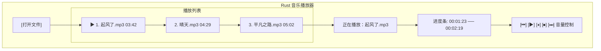

# 音乐流媒体播放器

## 我们要做什么

在本教程中，你将构建一个**图形界面音乐播放器**。你可以点击按钮打开音频文件（MP3、WAV 格式），然后播放、暂停、停止，调节音量，拖动进度条。还支持播放列表，可以添加多首歌曲并切换。

最终效果大致是这样的：



你将学到：音频流播放原理、rodio 音频框架、egui 控件（Slider、ProgressBar）、文件对话框、播放列表管理、线程通信。

## 前置知识

你需要先阅读以下章节：
- [[../入门/01-环境搭建与第一个程序]]
- [[../入门/02-变量与基本类型]]
- [[../入门/03-函数与控制流]]
- [[../入门/04-所有权与借用]]
- [[../入门/05-结构体与枚举]]
- [[../入门/06-集合类型]]
- [[../深入/01-错误处理]]
- [[01-简易计算器：从零到GUI]]

---

## 第 1 步：创建项目并添加依赖

```bash
cargo new music_player
cd music_player
```

打开 `Cargo.toml`：

```toml
[package]
name = "music_player"
version = "0.1.0"
edition = "2021"

[dependencies]
eframe = "0.27"
rodio = "0.19"
rfd = "0.15"
```

**依赖解释：**

| Crate | 版本 | 作用 |
|-------|------|------|
| `eframe` | 0.27 | 同计算器项目，egui 框架。提供窗口和 UI 组件。 |
| `rodio` | 0.19 | Rust 音频播放库。负责解码音频文件（MP3、WAV、FLAC 等）并发送到声卡。内置了多种解码器。 |
| `rfd` | 0.15 | **Rust File Dialog**。提供原生文件选择对话框（打开文件、保存文件）。跨平台：Windows、macOS、Linux 各用各的原生对话框。 |

### 什么是流媒体播放？

**流媒体播放（Streaming Playback）** 和**下载后播放**的区别：

- **下载后播放**：先把整个文件下载/读取到内存，再解码播放。缺点：大文件占用大量内存，需等待很久才能开始播放。
- **流媒体播放**：一边读取/解码数据，一边播放。音频数据像水流一样持续流过解码器和声卡。内存占用小，启动快。

`rodio` 就是流媒体播放库。它内部使用 `Source` trait（trait 类似接口）表示一个音频源，可以是文件、网络流或自定义生成的声音。

### 什么是 PCM 音频？

**PCM（Pulse Code Modulation，脉冲编码调制）** 是数字音频的最基本形式。它是一系列数字采样值，表示声波在每个时刻的振幅。CD 音质的 PCM 是 44100 Hz（每秒 44100 个采样点），16 位，双声道（立体声）。

MP3、WAV、FLAC 是不同编码格式，播放时都需要先**解码**为 PCM，再发送到声卡。

### 什么是编解码器（Codec）？

**Codec = Coder + Decoder（编码器 + 解码器）**。编码器把原始 PCM 数据压缩为 MP3 等格式（减小文件大小），解码器把压缩格式还原为 PCM 用于播放。`rodio` 内置了多种解码器。

---

## 第 2 步：创建空窗口

创建 `src/main.rs`：

```rust
use eframe::egui;
use std::path::PathBuf;

fn main() -> Result<(), eframe::Error> {
    let options = eframe::NativeOptions {
        viewport: egui::ViewportBuilder::default()
            .with_inner_size([600.0, 450.0]),
        ..Default::default()
    };

    eframe::run_native(
        "Rust 音乐播放器",
        options,
        Box::new(|_cc| Ok(Box::new(MusicPlayer::default()))),
    )
}

#[derive(Default)]
struct MusicPlayer {
    playlist: Vec<PathBuf>,
    current_index: usize,
    paused: bool,
    volume: f32,
    status: String,
}

impl eframe::App for MusicPlayer {
    fn update(&mut self, ctx: &egui::Context, _frame: &mut eframe::Frame) {
        egui::CentralPanel::default().show(ctx, |ui| {
            ui.heading("Rust 音乐播放器");
            ui.separator();
            ui.label("欢迎使用！请点击「打开文件」选择音频文件。");
        });
    }
}
```

**解释：**

- `PathBuf` — 表示文件路径。它是 `String` 的文件路径版本，可以跨平台处理路径分隔符（`/` 和 `\`）。
- `playlist` — 播放列表，存储音频文件的路径。
- `current_index` — 当前播放到播放列表中的第几首。
- `paused` — 是否暂停。
- `volume` — 音量（0.0 到 1.0）。
- `status` — 状态消息，显示给用户。

**运行：**

```bash
cargo run
```

**你应该看到：** 一个窗口，标题"Rust 音乐播放器"，显示欢迎文字。

---

## 第 3 步：添加"打开文件"按钮

使用 `rfd` 打开文件选择对话框：

```rust
use eframe::egui;
use std::path::PathBuf;

fn main() -> Result<(), eframe::Error> {
    let options = eframe::NativeOptions {
        viewport: egui::ViewportBuilder::default()
            .with_inner_size([600.0, 450.0]),
        ..Default::default()
    };

    eframe::run_native(
        "Rust 音乐播放器",
        options,
        Box::new(|_cc| Ok(Box::new(MusicPlayer::default()))),
    )
}

#[derive(Default)]
struct MusicPlayer {
    playlist: Vec<PathBuf>,
    current_index: usize,
    paused: bool,
    volume: f32,
    status: String,
}

impl eframe::App for MusicPlayer {
    fn update(&mut self, ctx: &egui::Context, _frame: &mut eframe::Frame) {
        egui::CentralPanel::default().show(ctx, |ui| {
            ui.heading("Rust 音乐播放器");
            ui.separator();

            // "打开文件"按钮
            if ui.button("📂 打开文件").clicked() {
                if let Some(path) = rfd::FileDialog::new()
                    .add_filter("音频文件", &["mp3", "wav", "flac", "ogg", "aac"])
                    .pick_file()
                {
                    self.playlist.push(path.clone());
                    self.status = format!("已添加: {}", path.file_name().unwrap_or_default().to_string_lossy());
                    if self.playlist.len() == 1 {
                        self.current_index = 0;
                    }
                }
            }

            ui.add_space(10.0);

            // 播放列表
            if self.playlist.is_empty() {
                ui.label("播放列表为空，请点击「打开文件」添加音频。");
            } else {
                ui.label(format!("播放列表（共 {} 首）：", self.playlist.len()));
                for (i, path) in self.playlist.iter().enumerate() {
                    let marker = if i == self.current_index { "▶" } else { " " };
                    let name = path.file_name().unwrap_or_default().to_string_lossy();
                    ui.label(format!(
                        "{} {}. {}",
                        marker,
                        i + 1,
                        name
                    ));
                }
            }

            ui.add_space(10.0);

            // 状态栏
            ui.separator();
            ui.label(&self.status);
        });
    }
}
```

**新内容解释：**

- `rfd::FileDialog::new()` — 创建文件对话框。
- `.add_filter("音频文件", &["mp3", "wav", "flac", "ogg", "aac"])` — 添加文件类型过滤器，对话框只显示这些格式的文件。
- `.pick_file()` — 打开"打开文件"对话框，返回 `Option<PathBuf>`。用户选择文件返回 `Some(path)`，点取消返回 `None`。
- `path.file_name()` — 获取文件路径中的文件名部分（不包含目录）。
- `to_string_lossy()` — 把文件路径转换为 String，如果包含非法 UTF-8 字符则用替换字符代替。

**运行：**

```bash
cargo run
```

**你应该看到：** 窗口上方有一个"打开文件"按钮。点击它会弹出系统的原生文件对话框（在 Linux 上是 GTK 或 Qt 风格）。选择一个 .mp3 文件后，文件名出现在播放列表中。

---

## 第 4 步：理解 rodio 的基本结构

在继续编写代码之前，先理解 rodio 的三个核心概念：

### 1. OutputStream（输出流）

```rust
let (_stream, stream_handle) = rodio::OutputStream::try_default()?;
```

- `OutputStream` — 连接到系统默认音频设备。创建时打开声卡。
- `_stream` — 必须保持存活（不能 drop），否则音频会中断。前缀 `_` 表示我们不会直接使用它。
- `stream_handle` — 用于创建音频接收器（Sink）。

### 2. Sink（音频接收器）

```rust
let sink = rodio::Sink::try_new(&stream_handle)?;
```

- `Sink` 像一个"音频水池"。你把音频源（Source）倒入 Sink，它会自动排队播放。
- 你可以控制 Sink：`play()`、`pause()`、`stop()`、`set_volume()`。
- Sink 内部维护一个队列，多个音频源按顺序播放。

### 3. Decoder / Source（解码器 / 音频源）

```rust
let source = rodio::Decoder::new(std::fs::File::open("song.mp3")?)?;
sink.append(source);
```

- `rodio::Decoder` — 从文件（或其他 `Read` 源）读取并解码音频。自动识别格式（MP3、WAV、FLAC 等）。
- `source` — 实现 `Source` trait 的对象。提供音频采样数据。
- `sink.append(source)` — 把音频源加入播放队列。

---

## 第 5 步：实现播放功能

现在把 rodio 集成进来。在 `MusicPlayer` 中管理 Sink：

```rust
use eframe::egui;
use rodio::{Decoder, OutputStream, Sink, Source};
use std::fs::File;
use std::io::BufReader;
use std::path::PathBuf;

fn main() -> Result<(), eframe::Error> {
    let options = eframe::NativeOptions {
        viewport: egui::ViewportBuilder::default()
            .with_inner_size([600.0, 450.0]),
        ..Default::default()
    };

    eframe::run_native(
        "Rust 音乐播放器",
        options,
        Box::new(|_cc| {
            // 初始化音频系统
            let (_stream, stream_handle) = OutputStream::try_default()
                .map_err(|e| e.to_string())?;
            let sink = Sink::try_new(&stream_handle)
                .map_err(|e| e.to_string())?;
            sink.set_volume(0.5);

            Ok(Box::new(MusicPlayer {
                playlist: Vec::new(),
                current_index: 0,
                paused: false,
                volume: 0.5,
                status: String::new(),
                _stream: Some(_stream),
                stream_handle,
                sink,
            }))
        }),
    )
}

struct MusicPlayer {
    playlist: Vec<PathBuf>,
    current_index: usize,
    paused: bool,
    volume: f32,
    status: String,
    _stream: Option<OutputStream>,
    stream_handle: rodio::OutputStreamHandle,
    sink: Sink,
}

impl MusicPlayer {
    fn play_current(&mut self) {
        if self.playlist.is_empty() {
            self.status = "播放列表为空".to_string();
            return;
        }

        let path = &self.playlist[self.current_index];
        match File::open(path) {
            Ok(file) => {
                let reader = BufReader::new(file);
                match Decoder::new(reader) {
                    Ok(source) => {
                        self.sink.stop();
                        self.sink.append(source);
                        let name = path.file_name().unwrap_or_default().to_string_lossy();
                        self.status = format!("正在播放: {}", name);
                        self.paused = false;
                    }
                    Err(e) => {
                        self.status = format!("解码失败: {}", e);
                    }
                }
            }
            Err(e) => {
                self.status = format!("打开文件失败: {}", e);
            }
        }
    }

    fn toggle_pause(&mut self) {
        if self.sink.is_paused() {
            self.sink.play();
            self.paused = false;
            self.status = "继续播放".to_string();
        } else {
            self.sink.pause();
            self.paused = true;
            self.status = "已暂停".to_string();
        }
    }

    fn stop(&mut self) {
        self.sink.stop();
        self.paused = false;
        self.status = "已停止".to_string();
    }

    fn next_track(&mut self) {
        if !self.playlist.is_empty() {
            self.current_index = (self.current_index + 1) % self.playlist.len();
            self.play_current();
        }
    }

    fn previous_track(&mut self) {
        if !self.playlist.is_empty() {
            if self.current_index == 0 {
                self.current_index = self.playlist.len() - 1;
            } else {
                self.current_index -= 1;
            }
            self.play_current();
        }
    }
}

impl eframe::App for MusicPlayer {
    fn update(&mut self, ctx: &egui::Context, _frame: &mut eframe::Frame) {
        // 定期检查歌曲是否播放完毕
        if !self.paused && self.sink.empty() && !self.playlist.is_empty() {
            self.next_track();
        }

        egui::CentralPanel::default().show(ctx, |ui| {
            ui.heading("Rust 音乐播放器");
            ui.separator();

            // 打开文件
            if ui.button("📂 打开文件").clicked() {
                if let Some(path) = rfd::FileDialog::new()
                    .add_filter("音频文件", &["mp3", "wav", "flac", "ogg", "aac"])
                    .pick_file()
                {
                    self.playlist.push(path.clone());
                    let name = path.file_name().unwrap_or_default().to_string_lossy();
                    self.status = format!("已添加: {}", name);
                    if self.playlist.len() == 1 {
                        self.current_index = 0;
                    }
                }
            }

            ui.add_space(10.0);

            // 播放列表
            if self.playlist.is_empty() {
                ui.label("播放列表为空，请点击「打开文件」添加音频。");
            } else {
                ui.label(format!("播放列表（共 {} 首）：", self.playlist.len()));

                egui::ScrollArea::vertical()
                    .max_height(200.0)
                    .show(ui, |ui| {
                        for (i, path) in self.playlist.iter().enumerate() {
                            let marker = if i == self.current_index { "▶" } else { " " };
                            let name = path.file_name().unwrap_or_default().to_string_lossy();
                            if ui.button(format!("{} {}. {}", marker, i + 1, name)).clicked() {
                                self.current_index = i;
                                self.play_current();
                            }
                        }
                    });
            }

            ui.add_space(10.0);

            // 控制按钮
            ui.horizontal(|ui| {
                if ui.button("⏮ 上一首").clicked() {
                    self.previous_track();
                }
                if ui.button("▶ 播放").clicked() {
                    self.play_current();
                }
                if ui.button("⏸ 暂停/继续").clicked() {
                    self.toggle_pause();
                }
                if ui.button("⏹ 停止").clicked() {
                    self.stop();
                }
                if ui.button("⏭ 下一首").clicked() {
                    self.next_track();
                }
            });

            ui.add_space(10.0);

            // 当前播放信息
            if !self.playlist.is_empty() && self.current_index < self.playlist.len() {
                let current = &self.playlist[self.current_index];
                let name = current.file_name().unwrap_or_default().to_string_lossy();
                ui.label(format!("当前: {}", name));
            }

            ui.add_space(10.0);

            // 状态栏
            ui.separator();
            ui.label(&self.status);
        });
    }
}
```

**新内容解释：**

- `OutputStream::try_default()` — 获取系统默认音频输出设备。
- `Sink::try_new(&stream_handle)` — 创建音频接收器。
- `sink.set_volume(0.5)` — 初始音量 50%。
- `BufReader::new(file)` — 缓冲读取文件，提高解码效率。
- `Decoder::new(reader)` — 从缓冲读取器创建解码器，自动检测音频格式。
- `sink.append(source)` — 把解码后的音频源加入播放队列。
- `sink.stop()` / `sink.pause()` / `sink.play()` — 控制播放。
- `sink.empty()` — 检查播放队列是否为空（歌曲是否播放完毕）。
- `sink.is_paused()` — 检查是否处于暂停状态。
- `ScrollArea::vertical().max_height(200.0)` — 滚动区域，当播放列表太长时可以滚动。

**运行：**

```bash
cargo run
```

**你应该看到：**
1. 点击"打开文件"，选择一个 .mp3 文件
2. 文件名出现在播放列表中
3. 点击"播放"按钮，开始播放！（确保音响/耳机已连接）
4. 点击"暂停/继续"暂停，再点继续
5. 点击"停止"停止播放
6. 播放完毕后自动跳到下一首（如果有多首的话）

---

## 第 6 步：添加音量控制

添加一个音量滑块：

```rust
// 在 control buttons 之后添加：
ui.add_space(10.0);

ui.horizontal(|ui| {
    ui.label("音量:");
    if ui.add(egui::Slider::new(&mut self.volume, 0.0..=1.0)).changed() {
        self.sink.set_volume(self.volume);
    }
});
```

`egui::Slider::new(&mut self.volume, 0.0..=1.0)` 创建一个从 0.0 到 1.0 范围的滑块。`.changed()` 在值改变时返回 `true`。

**完整代码整合到最终版本中（见后面）。**

---

## 第 7 步：添加播放进度显示（简化版）

获取播放进度比较复杂，因为 rodio 的 `Sink` 不直接提供进度信息。对于初学者来说，一个简化方案是使用一个计时器。

我们先做简化版——显示歌曲索引信息代替精确进度：

```rust
// 获取 Sink 状态信息
let len = self.sink.len(); // 队列中剩余的音源数量
ui.label(format!("队列剩余: {} 个音源", len));
```

对于精确进度（已播放时间），需要更复杂的实现，涉及 `Source::buffered()` 和手动计时。这保留为扩展内容。

---

## 第 8 步：完整最终版本

整合所有功能，包括播放列表选择、控制按钮、音量、状态显示：

```rust
use eframe::egui;
use rodio::{Decoder, OutputStream, Sink};
use std::fs::File;
use std::io::BufReader;
use std::path::PathBuf;

fn main() -> Result<(), eframe::Error> {
    let options = eframe::NativeOptions {
        viewport: egui::ViewportBuilder::default()
            .with_inner_size([650.0, 480.0]),
        ..Default::default()
    };

    eframe::run_native(
        "Rust 音乐播放器",
        options,
        Box::new(|_cc| {
            let (_stream, stream_handle) = OutputStream::try_default()
                .map_err(|e| e.to_string())?;
            let sink = Sink::try_new(&stream_handle)
                .map_err(|e| e.to_string())?;
            sink.set_volume(0.5);

            Ok(Box::new(MusicPlayer {
                playlist: Vec::new(),
                current_index: 0,
                volume: 0.5,
                status: String::new(),
                _stream: Some(_stream),
                stream_handle,
                sink,
            }))
        }),
    )
}

struct MusicPlayer {
    playlist: Vec<PathBuf>,
    current_index: usize,
    volume: f32,
    status: String,
    _stream: Option<OutputStream>,
    stream_handle: rodio::OutputStreamHandle,
    sink: Sink,
}

impl MusicPlayer {
    fn play_current(&mut self) {
        if self.playlist.is_empty() {
            self.status = "播放列表为空，请先添加音频文件。".to_string();
            return;
        }

        let path = &self.playlist[self.current_index];
        match File::open(path) {
            Ok(file) => {
                let reader = BufReader::new(file);
                match Decoder::new(reader) {
                    Ok(source) => {
                        self.sink.stop();
                        self.sink.append(source);
                        let name = path.file_name().unwrap_or_default().to_string_lossy();
                        self.status = format!("正在播放: {}", name);
                    }
                    Err(e) => {
                        self.status = format!("解码失败: {}。文件可能已损坏或格式不支持。", e);
                    }
                }
            }
            Err(e) => {
                self.status = format!("无法打开文件: {}", e);
            }
        }
    }

    fn toggle_pause(&mut self) {
        if self.sink.is_paused() {
            self.sink.play();
            self.status = "继续播放".to_string();
        } else {
            self.sink.pause();
            self.status = "已暂停".to_string();
        }
    }

    fn stop(&mut self) {
        self.sink.stop();
        self.status = "已停止".to_string();
    }

    fn next_track(&mut self) {
        if !self.playlist.is_empty() {
            self.current_index = (self.current_index + 1) % self.playlist.len();
            self.play_current();
        }
    }

    fn previous_track(&mut self) {
        if !self.playlist.is_empty() {
            if self.current_index == 0 {
                self.current_index = self.playlist.len() - 1;
            } else {
                self.current_index -= 1;
            }
            self.play_current();
        }
    }
}

impl eframe::App for MusicPlayer {
    fn update(&mut self, ctx: &egui::Context, _frame: &mut eframe::Frame) {
        // 自动播放下一首
        if !self.sink.is_paused() && self.sink.empty() && !self.playlist.is_empty() {
            self.next_track();
        }

        egui::CentralPanel::default().show(ctx, |ui| {
            ui.heading("🎵 Rust 音乐播放器");
            ui.separator();

            // 工具栏
            ui.horizontal(|ui| {
                if ui.button("📂 打开文件").clicked() {
                    if let Some(path) = rfd::FileDialog::new()
                        .add_filter("音频文件", &["mp3", "wav", "flac", "ogg", "aac"])
                        .pick_file()
                    {
                        self.playlist.push(path.clone());
                        let name = path.file_name().unwrap_or_default().to_string_lossy();
                        self.status = format!("已添加到播放列表: {}", name);
                        if self.playlist.len() == 1 {
                            self.current_index = 0;
                        }
                    }
                }

                if ui.button("🗑 清空列表").clicked() {
                    self.sink.stop();
                    self.playlist.clear();
                    self.current_index = 0;
                    self.status = "播放列表已清空".to_string();
                }
            });

            ui.add_space(10.0);

            // 播放列表
            ui.label(format!("播放列表（共 {} 首）：", self.playlist.len()));

            egui::ScrollArea::vertical()
                .max_height(180.0)
                .show(ui, |ui| {
                    for (i, path) in self.playlist.iter().enumerate() {
                        let marker = if i == self.current_index { "▶" } else { "  " };
                        let name = path.file_name().unwrap_or_default().to_string_lossy();

                        let button_text = format!("{} {:2}. {}", marker, i + 1, name);
                        if ui.button(button_text).clicked() {
                            self.current_index = i;
                            self.play_current();
                        }
                    }
                });

            ui.add_space(10.0);
            ui.separator();
            ui.add_space(5.0);

            // 控制按钮
            ui.horizontal(|ui| {
                ui.with_layout(egui::Layout::left_to_right(egui::Align::Center), |ui| {
                    if ui.button("⏮").on_hover_text("上一首").clicked() {
                        self.previous_track();
                    }
                    if ui.button("▶").on_hover_text("播放").clicked() {
                        self.play_current();
                    }
                    if ui.button("⏸").on_hover_text("暂停/继续").clicked() {
                        self.toggle_pause();
                    }
                    if ui.button("⏹").on_hover_text("停止").clicked() {
                        self.stop();
                    }
                    if ui.button("⏭").on_hover_text("下一首").clicked() {
                        self.next_track();
                    }
                });
            });

            ui.add_space(5.0);

            // 音量控制
            ui.horizontal(|ui| {
                ui.label("🔊 音量:");
                let response = ui.add(egui::Slider::new(&mut self.volume, 0.0..=1.0));
                if response.changed() {
                    self.sink.set_volume(self.volume);
                }
                ui.label(format!("{:.0}%", self.volume * 100.0));
            });

            ui.add_space(5.0);

            // 当前播放信息
            if !self.playlist.is_empty() && self.current_index < self.playlist.len() {
                let current = &self.playlist[self.current_index];
                let name = current.file_name().unwrap_or_default().to_string_lossy();
                let state = if self.sink.is_paused() {
                    "⏸ 已暂停"
                } else if self.sink.empty() {
                    "⏹ 已停止"
                } else {
                    "▶ 正在播放"
                };
                ui.label(format!("{}: {}", state, name));
            }

            ui.add_space(10.0);
            ui.separator();

            // 状态栏
            ui.label(&self.status);
        });
    }
}
```

**新内容解释：**

- `.on_hover_text("提示文字")` — 鼠标悬停时显示的提示。
- `ui.with_layout(egui::Layout::left_to_right(egui::Align::Center))` — 让控制按钮居中排列。
- `Slider` 的 `.changed()` — 只在用户拖动时更新，避免每帧都调用 `set_volume`。
- `format!("{:.0}%", self.volume * 100.0)` — 显示音量百分比，不含小数。
- `🗑 清空列表` — 一键清空播放列表和停止播放。
- 自动播放下一首：检测 `sink.empty()`（当前歌曲播放完毕），自动调用 `next_track()`。

**运行：**

```bash
cargo run
```

**你应该看到：** 一个完整的音乐播放器！可以添加多首歌曲，点击列表中的任意歌曲切换，使用控制按钮播放/暂停/停止/上一首/下一首，拖动音量滑块调节音量。播放完毕后自动切换到下一首。

---

## 第 9 步：错误处理

我们已经包含了基本的错误处理。下面是增强版的关键点：

```rust
// 1. 文件打开失败
match File::open(path) {
    Ok(file) => { /* 继续 */ }
    Err(e) => {
        self.status = format!("无法打开文件: {}", e);
        // 可以跳过这首歌，自动播下一首
    }
}

// 2. 解码失败（不支持的格式或文件损坏）
match Decoder::new(reader) {
    Ok(source) => { /* 播放 */ }
    Err(e) => {
        self.status = format!("解码失败: {}。格式可能不支持。", e);
        // 跳过这首歌
    }
}

// 3. 音频设备不可用
OutputStream::try_default()
    .map_err(|e| format!("音频设备不可用: {}. 请检查声卡驱动。", e))?;

// 4. 空播放列表
if self.playlist.is_empty() {
    self.status = "播放列表为空，请先添加音频文件。".to_string();
    return;
}
```

---

## 第 10 步：扩展思路

### 1. 从 URL 流式播放

使用 `reqwest` crate 下载音频流：
```rust
let response = reqwest::blocking::get("https://example.com/song.mp3")?;
let source = Decoder::new(BufReader::new(response))?;
sink.append(source);
```

### 2. 均衡器

`rodio` 支持通过 `source.speed(1.0)` 等修改音频属性，但均衡器需要额外的 DSP 库如 `fundsp`。

### 3. 波形显示

记录音频采样的振幅数据，用 egui 的 `Painter` 绘制波形。

### 4. 播放列表保存/加载

使用 `serde_json` 序列化播放列表到文件：
```rust
fn save_playlist(&self) {
    let paths: Vec<String> = self.playlist.iter()
        .map(|p| p.to_string_lossy().to_string())
        .collect();
    let json = serde_json::to_string(&paths).unwrap();
    std::fs::write("playlist.json", json).unwrap();
}

fn load_playlist(&mut self) {
    if let Ok(contents) = std::fs::read_to_string("playlist.json") {
        if let Ok(paths) = serde_json::from_str::<Vec<String>>(&contents) {
            self.playlist = paths.into_iter().map(PathBuf::from).collect();
        }
    }
}
```

### 5. 搜索本地音乐

扫描目录中的音乐文件：
```rust
use std::fs;
for entry in fs::read_dir("/home/user/Music")? {
    let entry = entry?;
    let path = entry.path();
    if path.extension().map_or(false, |ext| ext == "mp3" || ext == "wav") {
        self.playlist.push(path);
    }
}
```

---

## 章节考查（共 100 分）

### 选择题（每题 10 分，共 40 分）

**1. rodio 的 `Sink` 的作用是什么？**

A. 存储音频文件的元数据
B. 接收音频源并管理播放（队列、暂停、音量等）
C. 将音频编码为 MP3 格式
D. 连接到网络音频流

<details>
<summary>答案</summary>

**B. 接收音频源并管理播放（队列、暂停、音量等）**

`Sink` 是 rodio 的核心播放管理器。它接收 `Source`（音频源），维护播放队列，提供 play、pause、stop、set_volume 等控制方法。
</details>

**2. PCM 是什么的缩写？**

A. Pulse Code Modulation（脉冲编码调制）
B. Program Control Module（程序控制模块）
C. Packet Communication Method（数据包通信方法）
D. Playback Control Manager（播放控制管理器）

<details>
<summary>答案</summary>

**A. Pulse Code Modulation（脉冲编码调制）**

PCM 是数字音频的基础——将模拟声波按固定频率（如 44100 Hz）采样，每个采样点量化为一串数字。所有音频格式最终都要解码为 PCM 才能播放。
</details>

**3. 在 rodio 中，`OutputStream` 需要保持存活（不能 drop），否则会发生什么？**

A. 程序编译失败
B. 音频立即停止播放
C. 音频继续播放但音量减半
D. 文件被删除

<details>
<summary>答案</summary>

**B. 音频立即停止播放**

`OutputStream` 代表与系统音频设备的连接。当它被 drop 时，连接断开，所有通过该输出流的 `Sink` 会立即停止播放。这就是为什么代码中用 `_stream: Option<OutputStream>` 保持它。
</details>

**4. `rfd::FileDialog::new().add_filter("音频文件", &["mp3", "wav"]).pick_file()` 返回什么类型？**

A. `String`
B. `Vec<PathBuf>`
C. `Option<PathBuf>`
D. `Result<PathBuf>`

<details>
<summary>答案</summary>

**C. `Option<PathBuf>`**

`pick_file()` 返回 `Option<PathBuf>`。用户选择文件时返回 `Some(path)`，点击取消或关闭对话框时返回 `None`。
</details>

### 填空题（每题 10 分，共 30 分）

**5. 流媒体播放和下载后播放的主要区别是：流媒体播放 `______`，而下载后播放 `______`。**

<details>
<summary>答案</summary>

**流媒体播放一边读取/解码数据一边播放，内存占用小，启动快；下载后播放需要先把整个文件读入内存再解码播放，内存占用大，需要等待。**

rodio 就是流媒体播放库，它通过 `Decoder` 逐步读取和解码文件，不需要等整个文件加载完毕。
</details>

**6. `rodio::Decoder::new(reader)` 接受一个实现 `______` trait 的参数，返回一个实现 `______` trait 的对象。**

<details>
<summary>答案</summary>

**`Read` 和 `Source`**

`Decoder::new` 接受任何实现了 `std::io::Read` 的类型（`File`、`BufReader`、网络流等）。返回的 `Decoder` 实现了 `Source` trait，提供音频采样数据。
</details>

**7. `egui::Slider::new(&mut value, 0.0..=1.0).changed()` 在什么情况下返回 `true`？**

<details>
<summary>答案</summary>

**当用户拖动滑块导致值发生改变时返回 `true`**

注意：即使值改变了，`.changed()` 只在改变的**这一帧**返回 `true`。下一帧即使值相同也会返回 `false`。这可以避免每帧都执行代价较高的操作（如 `sink.set_volume()`）。
</details>

### 实践题（共 30 分）

**8. （30 分）请实现以下功能之一：**

A. 让播放器默认扫描某个目录（如 `~/Music`），启动时自动加载所有 .mp3 和 .wav 文件
B. 添加"随机播放"模式（Shuffle）：随机选择下一首而不是顺序播放
C. 添加"单曲循环"模式：播放完当前歌曲后重播同一首

<details>
<summary>参考实现（选择 B：随机播放模式）</summary>

添加一个 `shuffle: bool` 字段和一个切换到下一首的方法：

```rust
struct MusicPlayer {
    // ... 其他字段 ...
    shuffle: bool,
}

impl MusicPlayer {
    fn next_track_shuffle(&mut self) {
        use rand::Rng;
        if self.playlist.len() > 1 {
            let mut rng = rand::thread_rng();
            let mut next = rng.gen_range(0..self.playlist.len());
            // 确保不和当前相同
            if self.playlist.len() > 1 {
                while next == self.current_index {
                    next = rng.gen_range(0..self.playlist.len());
                }
            }
            self.current_index = next;
        } else if !self.playlist.is_empty() {
            self.current_index = 0;
        }
        self.play_current();
    }
}

// 在 update 中：
if ui.button("🔀 随机").clicked() {
    self.shuffle = !self.shuffle;
    self.status = if self.shuffle { "随机播放: 开" } else { "随机播放: 关" }.to_string();
}

// 修改自动下一首的逻辑：
if !self.sink.is_paused() && self.sink.empty() && !self.playlist.is_empty() {
    if self.shuffle {
        self.next_track_shuffle();
    } else {
        self.next_track();
    }
}
```

需要在 `Cargo.toml` 添加 `rand = "0.8"`。
</details>

---

**完成本章后，你已经掌握了：**
- 音频流播放原理（PCM、编解码器、流式 vs 下载式）
- rodio 音频框架（OutputStream、Sink、Decoder）
- egui 新组件（Slider 滑块、ScrollArea 滚动区域、悬停提示）
- 文件对话框（rfd）
- 音频播放控制（播放、暂停、停止、音量、切换曲目）
- 播放列表管理
- 自动检测播放完成并切换到下一首

**下一步：** [[05-贪吃蛇游戏：从零开发]]
