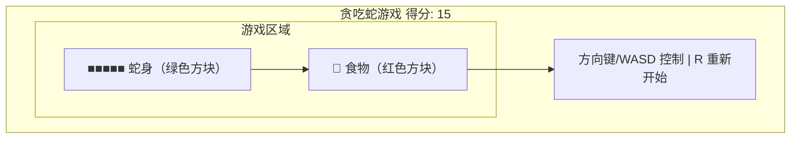
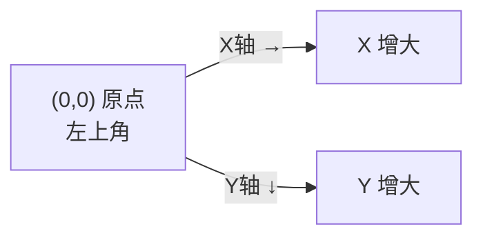

# 贪吃蛇游戏：从零开发

## 我们要做什么

在本教程中，你将构建经典的**贪吃蛇游戏**。在窗口中，一条蛇在网格上移动，吃食物会变长，撞到墙壁或自己的身体则游戏结束。可以用方向键或 WASD 控制方向。

最终效果大致是这样的：



你将学到：游戏循环、帧率控制、键盘输入处理、2D 坐标系统、碰撞检测、游戏状态管理。

## 前置知识

你需要先阅读以下章节：
- [[../入门/01-环境搭建与第一个程序]]
- [[../入门/02-变量与基本类型]]
- [[../入门/03-函数与控制流]]
- [[../入门/04-所有权与借用]]
- [[../入门/05-结构体与枚举]]
- [[../入门/06-集合类型]]
- [[../深入/01-错误处理]]
- [[01-简易计算器：从零到GUI]]

---

## 第 1 步：创建项目并添加依赖

```bash
cargo new snake_game
cd snake_game
```

打开 `Cargo.toml`：

```toml
[package]
name = "snake_game"
version = "0.1.0"
edition = "2021"

[dependencies]
macroquad = "0.4"
rand = "0.8"
```

**依赖解释：**

| Crate | 版本 | 作用 |
|-------|------|------|
| `macroquad` | 0.4 | 简单好用的 2D 游戏框架。提供窗口创建、绘制图形（矩形、圆形、文字）、键盘/鼠标输入、随机数等功能。无需复杂的生命周期和借用——大多数资源自动管理。 |
| `rand` | 0.8 | Rust 标准随机数库。用于随机生成食物位置。 |

### 什么是游戏循环？

**游戏循环（Game Loop）** 是每个游戏的核心。它是一个无限循环，每次迭代称为一"帧"：

```
loop {
    处理输入（键盘、鼠标）    // 用户做了什么？
    更新游戏状态              // 蛇移动、碰撞检测、生成食物
    渲染画面                  // 画出蛇、食物、UI
    等待下一帧                // 控制帧率（如 60 FPS）
}
```

帧率（FPS = Frames Per Second）决定游戏速度。贪吃蛇通常以 8-15 FPS 运行——太快了人类反应不过来，太慢了游戏显得卡顿。

### 坐标系统

macroquad 使用 2D 坐标系统：
- 原点 (0, 0) 在屏幕左上角
- X 轴向右增加
- Y 轴向下增加



在我们的贪吃蛇中，蛇和食物都在一个逻辑网格上移动。例如，网格单元格大小是 30 像素，则蛇在格子 (5, 3) 意味着它的实际像素位置是 (5 × 30, 3 × 30) = (150, 90)。

---

## 第 2 步：打开一个窗口并设置背景色

创建 `src/main.rs`：

```rust
use macroquad::prelude::*;

const CELL_SIZE: f32 = 30.0;
const GRID_WIDTH: usize = 20;
const GRID_HEIGHT: usize = 16;

fn window_conf() -> Conf {
    Conf {
        window_title: "贪吃蛇游戏".to_string(),
        window_width: (GRID_WIDTH as f32 * CELL_SIZE) as i32,
        window_height: (GRID_HEIGHT as f32 * CELL_SIZE + 60.0) as i32,
        ..Default::default()
    }
}

#[macroquad::main(window_conf)]
async fn main() {
    loop {
        clear_background(DARKGRAY);
        next_frame().await;
    }
}
```

**逐行解释：**

1. `use macroquad::prelude::*;` — 引入 macroquad 的所有常用类型和函数。
2. `CELL_SIZE` — 每个网格单元格的大小（像素）。30 像素足够大，方便看到。
3. `GRID_WIDTH` / `GRID_HEIGHT` — 网格的列数和行数。
4. `window_conf()` — 窗口配置函数。设置窗口标题和大小。高度多加 60 像素用于显示分数和提示。
5. `#[macroquad::main(window_conf)]` — macroquad 的入口点宏。`window_conf` 指定窗口配置函数。
6. `async fn main()` — macroquad 的主函数必须是 async。`next_frame().await` 是异步的帧等待。
7. `clear_background(DARKGRAY)` — 清空屏幕并填充深灰色背景。
8. `next_frame().await` — 等待下一帧。这会自动处理事件、交换缓冲区、保持帧率稳定。

**运行：**

```bash
cargo run
```

**你应该看到：** 一个深灰色背景的窗口，宽度为 20×30=600 像素，高度为 16×30+60=540 像素。标题为"贪吃蛇游戏"。

---

## 第 3 步：在网格中画一个矩形（蛇头）

在屏幕中央画一个绿色矩形代表蛇头：

```rust
use macroquad::prelude::*;

const CELL_SIZE: f32 = 30.0;
const GRID_WIDTH: usize = 20;
const GRID_HEIGHT: usize = 16;

fn window_conf() -> Conf {
    Conf {
        window_title: "贪吃蛇游戏".to_string(),
        window_width: (GRID_WIDTH as f32 * CELL_SIZE) as i32,
        window_height: (GRID_HEIGHT as f32 * CELL_SIZE + 60.0) as i32,
        ..Default::default()
    }
}

#[macroquad::main(window_conf)]
async fn main() {
    // 蛇的初始位置（网格坐标）
    let mut head_x: i32 = (GRID_WIDTH as i32) / 2;
    let mut head_y: i32 = (GRID_HEIGHT as i32) / 2;

    loop {
        clear_background(DARKGRAY);

        // 绘制网格背景
        for x in 0..GRID_WIDTH {
            for y in 0..GRID_HEIGHT {
                let px = x as f32 * CELL_SIZE;
                let py = y as f32 * CELL_SIZE;
                draw_rectangle_lines(px, py, CELL_SIZE, CELL_SIZE, 1.0, Color::new(0.2, 0.2, 0.2, 1.0));
            }
        }

        // 绘制蛇头
        let snake_px = head_x as f32 * CELL_SIZE;
        let snake_py = head_y as f32 * CELL_SIZE;
        draw_rectangle(snake_px, snake_py, CELL_SIZE, CELL_SIZE, GREEN);

        // 绘制分数
        draw_text(
            &format!("贪吃蛇游戏   位置: ({}, {})", head_x, head_y),
            10.0,
            20.0,
            30.0,
            WHITE,
        );

        next_frame().await;
    }
}
```

**新内容解释：**

- `head_x` / `head_y` — 蛇头在网格中的坐标（整数）。
- `draw_rectangle_lines(x, y, w, h, thickness, color)` — 绘制矩形边框。用于画网格线。
- `Color::new(r, g, b, a)` — 创建自定义颜色，值范围 0.0~1.0。这里创建了一个暗色（0.2, 0.2, 0.2）。
- `draw_rectangle(x, y, w, h, color)` — 绘制填充矩形。用于画蛇的方块。
- `snake_px = head_x * CELL_SIZE` — 将网格坐标转换为像素坐标。
- `draw_text(text, x, y, font_size, color)` — 绘制文字。macroquad 自带一个默认字体。

**运行：**

```bash
cargo run
```

**你应该看到：** 深灰色背景上有网格线（暗色），屏幕中央有一个绿色方块（蛇头）。上方显示蛇的当前网格坐标。

---

## 第 4 步：让矩形响应方向键移动

添加键盘输入处理，让蛇头移动：

```rust
use macroquad::prelude::*;

const CELL_SIZE: f32 = 30.0;
const GRID_WIDTH: usize = 20;
const GRID_HEIGHT: usize = 16;
const MOVE_INTERVAL: f64 = 0.15; // 每 0.15 秒移动一次

fn window_conf() -> Conf {
    Conf {
        window_title: "贪吃蛇游戏".to_string(),
        window_width: (GRID_WIDTH as f32 * CELL_SIZE) as i32,
        window_height: (GRID_HEIGHT as f32 * CELL_SIZE + 60.0) as i32,
        ..Default::default()
    }
}

#[derive(Clone, Copy, PartialEq)]
enum Direction {
    Up,
    Down,
    Left,
    Right,
}

#[macroquad::main(window_conf)]
async fn main() {
    let mut head_x: i32 = (GRID_WIDTH as i32) / 2;
    let mut head_y: i32 = (GRID_HEIGHT as i32) / 2;
    let mut direction = Direction::Right;
    let mut last_move = get_time();

    loop {
        clear_background(DARKGRAY);

        // 处理键盘输入
        if is_key_pressed(KeyCode::Up) || is_key_pressed(KeyCode::W) {
            if direction != Direction::Down {
                direction = Direction::Up;
            }
        }
        if is_key_pressed(KeyCode::Down) || is_key_pressed(KeyCode::S) {
            if direction != Direction::Up {
                direction = Direction::Down;
            }
        }
        if is_key_pressed(KeyCode::Left) || is_key_pressed(KeyCode::A) {
            if direction != Direction::Right {
                direction = Direction::Left;
            }
        }
        if is_key_pressed(KeyCode::Right) || is_key_pressed(KeyCode::D) {
            if direction != Direction::Left {
                direction = Direction::Right;
            }
        }

        // 按时移动蛇
        if get_time() - last_move >= MOVE_INTERVAL {
            last_move = get_time();
            match direction {
                Direction::Up => head_y -= 1,
                Direction::Down => head_y += 1,
                Direction::Left => head_x -= 1,
                Direction::Right => head_x += 1,
            }
        }

        // 绘制网格
        for x in 0..GRID_WIDTH {
            for y in 0..GRID_HEIGHT {
                let px = x as f32 * CELL_SIZE;
                let py = y as f32 * CELL_SIZE;
                draw_rectangle_lines(px, py, CELL_SIZE, CELL_SIZE, 1.0, Color::new(0.15, 0.15, 0.15, 1.0));
            }
        }

        // 绘制蛇头
        let snake_px = head_x as f32 * CELL_SIZE;
        let snake_py = head_y as f32 * CELL_SIZE;
        draw_rectangle(snake_px, snake_py, CELL_SIZE, CELL_SIZE, GREEN);

        // 绘制信息
        draw_text("贪吃蛇游戏", 10.0, 25.0, 28.0, WHITE);
        draw_text("方向键/WASD 控制", 10.0, 50.0, 20.0, LIGHTGRAY);

        next_frame().await;
    }
}
```

**新内容解释：**

- `Direction` 枚举 — 表示蛇的移动方向。`#[derive(Clone, Copy, PartialEq)]` 让它可以在比较和赋值时复制值而不是移动所有权。
- `direction != Direction::Down` — 防止蛇反向移动（例如向右移动时不能立即向左转）。
- `MOVE_INTERVAL` — 0.15 秒。蛇不每帧都移动（那太快了），而每隔固定时间移动一次。
- `get_time()` — macroquad 提供的函数，返回自程序启动以来的秒数（f64）。
- `last_move` — 上次移动的时间。比较当前时间和上次时间，决定是否移动。
- `is_key_pressed(key)` — 检测按键是否被按下。返回 `true` 仅在本帧第一次检测到按键时（不是持续按住产生多个事件）。

**运行：**

```bash
cargo run
```

**你应该看到：** 绿色方块——按方向键或 WASD，它会移动！注意蛇不能反向移动（向右走时按左键无效）。移动速度是每 0.15 秒一格。

---

## 第 5 步：创建蛇的身体

蛇由多个方块组成——头加上身体部分。用一个 Vec 存储身体每一段的位置：

```rust
use macroquad::prelude::*;

const CELL_SIZE: f32 = 30.0;
const GRID_WIDTH: usize = 20;
const GRID_HEIGHT: usize = 16;
const MOVE_INTERVAL: f64 = 0.15;
const INITIAL_LENGTH: usize = 3;

fn window_conf() -> Conf {
    Conf {
        window_title: "贪吃蛇游戏".to_string(),
        window_width: (GRID_WIDTH as f32 * CELL_SIZE) as i32,
        window_height: (GRID_HEIGHT as f32 * CELL_SIZE + 60.0) as i32,
        ..Default::default()
    }
}

#[derive(Clone, Copy, PartialEq)]
enum Direction {
    Up,
    Down,
    Left,
    Right,
}

#[macroquad::main(window_conf)]
async fn main() {
    // 蛇的身体：Vec 中的每个元素是 (x, y) 坐标
    // body[0] 是蛇头，body[1..] 是身体
    let start_x = GRID_WIDTH as i32 / 2;
    let start_y = GRID_HEIGHT as i32 / 2;
    let mut body: Vec<(i32, i32)> = (0..INITIAL_LENGTH)
        .map(|i| (start_x - i as i32, start_y))
        .collect();

    let mut direction = Direction::Right;
    let mut last_move = get_time();

    loop {
        clear_background(DARKGRAY);

        // 处理键盘输入
        if is_key_pressed(KeyCode::Up) || is_key_pressed(KeyCode::W) {
            if direction != Direction::Down {
                direction = Direction::Up;
            }
        }
        if is_key_pressed(KeyCode::Down) || is_key_pressed(KeyCode::S) {
            if direction != Direction::Up {
                direction = Direction::Down;
            }
        }
        if is_key_pressed(KeyCode::Left) || is_key_pressed(KeyCode::A) {
            if direction != Direction::Right {
                direction = Direction::Left;
            }
        }
        if is_key_pressed(KeyCode::Right) || is_key_pressed(KeyCode::D) {
            if direction != Direction::Left {
                direction = Direction::Right;
            }
        }

        // 按时移动蛇
        if get_time() - last_move >= MOVE_INTERVAL {
            last_move = get_time();

            // 计算新蛇头位置
            let (head_x, head_y) = body[0];
            let new_head = match direction {
                Direction::Up => (head_x, head_y - 1),
                Direction::Down => (head_x, head_y + 1),
                Direction::Left => (head_x - 1, head_y),
                Direction::Right => (head_x + 1, head_y),
            };

            // 插入新蛇头
            body.insert(0, new_head);

            // 移除蛇尾（保持长度不变——稍后吃食物时改为不移除）
            body.pop();
        }

        // 绘制网格
        for x in 0..GRID_WIDTH {
            for y in 0..GRID_HEIGHT {
                let px = x as f32 * CELL_SIZE;
                let py = y as f32 * CELL_SIZE;
                draw_rectangle_lines(px, py, CELL_SIZE, CELL_SIZE, 1.0, Color::new(0.12, 0.12, 0.12, 1.0));
            }
        }

        // 绘制蛇
        for (i, &(bx, by)) in body.iter().enumerate() {
            let px = bx as f32 * CELL_SIZE;
            let py = by as f32 * CELL_SIZE;
            let color = if i == 0 {
                DARKGREEN  // 蛇头用深绿色
            } else {
                GREEN      // 身体用绿色
            };
            draw_rectangle(px, py, CELL_SIZE, CELL_SIZE, color);
        }

        draw_text("贪吃蛇游戏", 10.0, 25.0, 28.0, WHITE);
        draw_text("方向键/WASD 控制", 10.0, 50.0, 20.0, LIGHTGRAY);

        next_frame().await;
    }
}
```

**新内容解释：**

- `body: Vec<(i32, i32)>` — 存储蛇身体的每一段坐标。`body[0]` 是蛇头，`body[1]`、`body[2]`...是身体。
- `(0..INITIAL_LENGTH).map(|i| (start_x - i, start_y))` — 创建初始蛇身：头在 `(start_x, start_y)`，身体向左延伸。`0..3` 分别生成 (10, 8), (9, 8), (8, 8)，所以蛇初始面向右。
- `body.insert(0, new_head)` — 在 Vec 开头插入新蛇头。
- `body.pop()` — 移除最后一个元素（蛇尾），保持长度不变。吃食物时会改为不 pop。
- `iter().enumerate()` — 获取索引 i 和值 (bx, by)。i==0 是蛇头，用深绿色；其他用浅绿色。

**运行：**

```bash
cargo run
```

**你应该看到：** 一条长度为 3 的蛇出现在屏幕中央！它能正常移动，头和身体颜色不同。你看不到"移动的痕迹"（因为没有残留方块），因为每帧都清屏重绘。

---

## 第 6 步：添加食物

随机放置一个红色方块作为食物：

```rust
use macroquad::prelude::*;
use rand::Rng;

const CELL_SIZE: f32 = 30.0;
const GRID_WIDTH: usize = 20;
const GRID_HEIGHT: usize = 16;
const MOVE_INTERVAL: f64 = 0.15;
const INITIAL_LENGTH: usize = 3;

fn window_conf() -> Conf {
    Conf {
        window_title: "贪吃蛇游戏".to_string(),
        window_width: (GRID_WIDTH as f32 * CELL_SIZE) as i32,
        window_height: (GRID_HEIGHT as f32 * CELL_SIZE + 60.0) as i32,
        ..Default::default()
    }
}

#[derive(Clone, Copy, PartialEq)]
enum Direction {
    Up,
    Down,
    Left,
    Right,
}

fn spawn_food(body: &[(i32, i32)]) -> (i32, i32) {
    let mut rng = rand::thread_rng();
    loop {
        let x = rng.gen_range(0..GRID_WIDTH as i32);
        let y = rng.gen_range(0..GRID_HEIGHT as i32);
        if !body.contains(&(x, y)) {
            return (x, y);
        }
    }
}

#[macroquad::main(window_conf)]
async fn main() {
    let start_x = GRID_WIDTH as i32 / 2;
    let start_y = GRID_HEIGHT as i32 / 2;
    let mut body: Vec<(i32, i32)> = (0..INITIAL_LENGTH)
        .map(|i| (start_x - i as i32, start_y))
        .collect();

    let mut direction = Direction::Right;
    let mut last_move = get_time();
    let mut food = spawn_food(&body);
    let mut score: u32 = 0;
    let mut game_over = false;

    loop {
        clear_background(DARKGRAY);

        // 处理键盘输入（仅在非游戏结束状态）
        if !game_over {
            if is_key_pressed(KeyCode::Up) || is_key_pressed(KeyCode::W) {
                if direction != Direction::Down {
                    direction = Direction::Up;
                }
            }
            if is_key_pressed(KeyCode::Down) || is_key_pressed(KeyCode::S) {
                if direction != Direction::Up {
                    direction = Direction::Down;
                }
            }
            if is_key_pressed(KeyCode::Left) || is_key_pressed(KeyCode::A) {
                if direction != Direction::Right {
                    direction = Direction::Left;
                }
            }
            if is_key_pressed(KeyCode::Right) || is_key_pressed(KeyCode::D) {
                if direction != Direction::Left {
                    direction = Direction::Right;
                }
            }
        }

        // 按时移动蛇
        if !game_over && get_time() - last_move >= MOVE_INTERVAL {
            last_move = get_time();

            let (head_x, head_y) = body[0];
            let new_head = match direction {
                Direction::Up => (head_x, head_y - 1),
                Direction::Down => (head_x, head_y + 1),
                Direction::Left => (head_x - 1, head_y),
                Direction::Right => (head_x + 1, head_y),
            };

            body.insert(0, new_head);

            // 判断是否吃到食物
            if new_head == food {
                score += 1;
                food = spawn_food(&body);
                // 不移除蛇尾 → 蛇变长
            } else {
                body.pop();
            }
        }

        // 绘制网格
        for x in 0..GRID_WIDTH {
            for y in 0..GRID_HEIGHT {
                let px = x as f32 * CELL_SIZE;
                let py = y as f32 * CELL_SIZE;
                draw_rectangle_lines(px, py, CELL_SIZE, CELL_SIZE, 1.0, Color::new(0.12, 0.12, 0.12, 1.0));
            }
        }

        // 绘制食物
        let food_px = food.0 as f32 * CELL_SIZE;
        let food_py = food.1 as f32 * CELL_SIZE;
        draw_rectangle(food_px, food_py, CELL_SIZE, CELL_SIZE, RED);

        // 绘制蛇
        for (i, &(bx, by)) in body.iter().enumerate() {
            let px = bx as f32 * CELL_SIZE;
            let py = by as f32 * CELL_SIZE;
            let color = if i == 0 {
                DARKGREEN
            } else {
                GREEN
            };
            draw_rectangle(px, py, CELL_SIZE, CELL_SIZE, color);
        }

        draw_text(&format!("贪吃蛇游戏   得分: {}", score), 10.0, 25.0, 28.0, WHITE);
        draw_text("方向键/WASD 控制", 10.0, 50.0, 20.0, LIGHTGRAY);

        next_frame().await;
    }
}
```

**新内容解释：**

- `spawn_food(&body)` — 随机生成食物位置。循环生成随机坐标，直到找到一个不在蛇身上的位置。
- `rand::thread_rng()` — 获取线程本地的随机数生成器。
- `rng.gen_range(0..GRID_WIDTH)` — 在 0 到 GRID_WIDTH-1 之间生成随机整数。
- `body.contains(&(x, y))` — 检查蛇身是否占据该坐标，避免食物和蛇重叠。
- `new_head == food` — 检测蛇头是否碰到食物。
- `score += 1` — 得分加一。
- 吃食物时不执行 `body.pop()` — 蛇尾不删除，蛇的长度增加 1。
- `game_over` 布尔值 — 游戏结束标志。后面步骤会设置。

**运行：**

```bash
cargo run
```

**你应该看到：** 网格中有一个红色方块（食物）。控制蛇去吃它——蛇身会变长，食物消失并在新位置重新出现，分数增加 1。

---

## 第 7 步：碰撞检测——墙壁碰撞

检测蛇头是否超出网格边界：

```rust
// 在移动蛇之后，检查碰撞：

// 碰撞检测：墙壁
let (head_x, head_y) = body[0];
if head_x < 0 || head_x >= GRID_WIDTH as i32 || head_y < 0 || head_y >= GRID_HEIGHT as i32 {
    game_over = true;
}

// 碰撞检测：自身（第 8 步会讲）
let head = body[0];
for segment in body.iter().skip(1) {
    if *segment == head {
        game_over = true;
        break;
    }
}
```

完整代码整合到下面。

---

## 第 8 步：碰撞检测——自身碰撞

检测蛇头是否碰到了自己的身体：

```rust
// 碰撞墙壁
let (head_x, head_y) = body[0];
if head_x < 0 || head_x >= GRID_WIDTH as i32 || head_y < 0 || head_y >= GRID_HEIGHT as i32 {
    game_over = true;
}

// 碰撞自身（跳过第一个元素也就是蛇头自己）
let head = body[0];
if body.iter().skip(1).any(|&seg| seg == head) {
    game_over = true;
}
```

`body.iter().skip(1).any(|&seg| seg == head)` 从蛇身第二个元素开始检查，是否有任何一段和蛇头位置相同。

---

## 第 9 步：添加游戏结束画面和重启功能

当游戏结束时，显示"游戏结束"文字和按键提示：

```rust
if game_over {
    let center_x = (GRID_WIDTH as f32 * CELL_SIZE) / 2.0;
    let center_y = (GRID_HEIGHT as f32 * CELL_SIZE) / 2.0;

    // 半透明遮罩
    draw_rectangle(0.0, 0.0, GRID_WIDTH as f32 * CELL_SIZE, GRID_HEIGHT as f32 * CELL_SIZE, Color::new(0.0, 0.0, 0.0, 0.7));

    // "游戏结束" 文字
    let text = "游戏结束!";
    let text_size = 60.0;
    let text_width = measure_text(text, None, text_size as u16, 1.0).width;
    draw_text(text, center_x - text_width / 2.0, center_y - 30.0, text_size, RED);

    // 分数
    let score_text = format!("最终得分: {}", score);
    let score_width = measure_text(&score_text, None, 40, 1.0).width;
    draw_text(&score_text, center_x - score_width / 2.0, center_y + 20.0, 40.0, WHITE);

    // 提示
    let hint = "按 R 键重新开始";
    let hint_width = measure_text(hint, None, 25, 1.0).width;
    draw_text(hint, center_x - hint_width / 2.0, center_y + 70.0, 25.0, LIGHTGRAY);

    // 处理重启
    if is_key_pressed(KeyCode::R) {
        // 重置游戏状态
        body = (0..INITIAL_LENGTH)
            .map(|i| (start_x - i as i32, start_y))
            .collect();
        direction = Direction::Right;
        food = spawn_food(&body);
        score = 0;
        game_over = false;
        last_move = get_time();
    }
}
```

**新内容解释：**

- `measure_text(text, font, font_size, scale)` — 测量文字在屏幕上的宽度（像素），用于居中显示。
- `Color::new(0.0, 0.0, 0.0, 0.7)` — 半透明黑色，作为游戏结束的遮罩层。
- `is_key_pressed(KeyCode::R)` — 按 R 键重启游戏。所有变量重置为初始值。

---

## 第 10 步：完整最终版本

```rust
use macroquad::prelude::*;
use rand::Rng;

const CELL_SIZE: f32 = 30.0;
const GRID_WIDTH: usize = 20;
const GRID_HEIGHT: usize = 16;
const MOVE_INTERVAL: f64 = 0.15;
const INITIAL_LENGTH: usize = 3;

fn window_conf() -> Conf {
    Conf {
        window_title: "贪吃蛇游戏".to_string(),
        window_width: (GRID_WIDTH as f32 * CELL_SIZE) as i32,
        window_height: (GRID_HEIGHT as f32 * CELL_SIZE + 60.0) as i32,
        ..Default::default()
    }
}

#[derive(Clone, Copy, PartialEq)]
enum Direction {
    Up,
    Down,
    Left,
    Right,
}

fn spawn_food(body: &[(i32, i32)]) -> (i32, i32) {
    let mut rng = rand::thread_rng();
    loop {
        let x = rng.gen_range(0..GRID_WIDTH as i32);
        let y = rng.gen_range(0..GRID_HEIGHT as i32);
        if !body.contains(&(x, y)) {
            return (x, y);
        }
    }
}

#[macroquad::main(window_conf)]
async fn main() {
    let start_x = GRID_WIDTH as i32 / 2;
    let start_y = GRID_HEIGHT as i32 / 2;
    let mut body: Vec<(i32, i32)> = (0..INITIAL_LENGTH)
        .map(|i| (start_x - i as i32, start_y))
        .collect();

    let mut direction = Direction::Right;
    let mut last_move = get_time();
    let mut food = spawn_food(&body);
    let mut score: u32 = 0;
    let mut game_over = false;

    loop {
        clear_background(DARKGRAY);

        // 处理键盘输入
        if !game_over {
            if is_key_pressed(KeyCode::Up) || is_key_pressed(KeyCode::W) {
                if direction != Direction::Down {
                    direction = Direction::Up;
                }
            }
            if is_key_pressed(KeyCode::Down) || is_key_pressed(KeyCode::S) {
                if direction != Direction::Up {
                    direction = Direction::Down;
                }
            }
            if is_key_pressed(KeyCode::Left) || is_key_pressed(KeyCode::A) {
                if direction != Direction::Right {
                    direction = Direction::Left;
                }
            }
            if is_key_pressed(KeyCode::Right) || is_key_pressed(KeyCode::D) {
                if direction != Direction::Left {
                    direction = Direction::Right;
                }
            }
        }

        // 按时移动蛇
        if !game_over && get_time() - last_move >= MOVE_INTERVAL {
            last_move = get_time();

            let (head_x, head_y) = body[0];
            let new_head = match direction {
                Direction::Up => (head_x, head_y - 1),
                Direction::Down => (head_x, head_y + 1),
                Direction::Left => (head_x - 1, head_y),
                Direction::Right => (head_x + 1, head_y),
            };

            body.insert(0, new_head);

            if new_head == food {
                score += 1;
                food = spawn_food(&body);
            } else {
                body.pop();
            }

            // 碰撞检测：墙壁
            let (head_x, head_y) = body[0];
            if head_x < 0 || head_x >= GRID_WIDTH as i32 || head_y < 0 || head_y >= GRID_HEIGHT as i32 {
                game_over = true;
            }

            // 碰撞检测：自身
            let head = body[0];
            if body.iter().skip(1).any(|&seg| seg == head) {
                game_over = true;
            }
        }

        // 绘制网格
        for x in 0..GRID_WIDTH {
            for y in 0..GRID_HEIGHT {
                let px = x as f32 * CELL_SIZE;
                let py = y as f32 * CELL_SIZE;
                draw_rectangle_lines(px, py, CELL_SIZE, CELL_SIZE, 1.0, Color::new(0.12, 0.12, 0.12, 1.0));
            }
        }

        // 绘制食物
        let food_px = food.0 as f32 * CELL_SIZE;
        let food_py = food.1 as f32 * CELL_SIZE;
        draw_rectangle(food_px, food_py, CELL_SIZE, CELL_SIZE, RED);

        // 绘制蛇（使用不同的绿色渐变）
        for (i, &(bx, by)) in body.iter().enumerate() {
            let px = bx as f32 * CELL_SIZE;
            let py = by as f32 * CELL_SIZE;
            let t = i as f32 / body.len().max(1) as f32; // 从 0 到 1
            let color = Color::new(0.0, 0.6 + 0.4 * (1.0 - t), 0.0, 1.0);
            draw_rectangle(px, py, CELL_SIZE, CELL_SIZE, color);
        }

        // 头部装饰（眼睛）
        if !body.is_empty() {
            let (hx, hy) = body[0];
            let hpx = hx as f32 * CELL_SIZE;
            let hpy = hy as f32 * CELL_SIZE;
            let eye_size = 4.0;
            // 眼睛位置根据方向调整
            let (eye1_x, eye1_y, eye2_x, eye2_y) = match direction {
                Direction::Right => (
                    hpx + CELL_SIZE - 8.0, hpy + 6.0,
                    hpx + CELL_SIZE - 8.0, hpy + CELL_SIZE - 10.0,
                ),
                Direction::Left => (
                    hpx + 8.0, hpy + 6.0,
                    hpx + 8.0, hpy + CELL_SIZE - 10.0,
                ),
                Direction::Up => (
                    hpx + 6.0, hpy + 8.0,
                    hpx + CELL_SIZE - 10.0, hpy + 8.0,
                ),
                Direction::Down => (
                    hpx + 6.0, hpy + CELL_SIZE - 8.0,
                    hpx + CELL_SIZE - 10.0, hpy + CELL_SIZE - 8.0,
                ),
            };
            draw_circle(eye1_x, eye1_y, eye_size, WHITE);
            draw_circle(eye2_x, eye2_y, eye_size, WHITE);
        }

        // 顶部信息栏
        draw_text(&format!("贪吃蛇游戏   得分: {}", score), 10.0, 25.0, 28.0, WHITE);
        draw_text("方向键/WASD 控制   R 重新开始", 10.0, 50.0, 20.0, LIGHTGRAY);

        // 游戏结束画面
        if game_over {
            let center_x = (GRID_WIDTH as f32 * CELL_SIZE) / 2.0;
            let center_y = (GRID_HEIGHT as f32 * CELL_SIZE) / 2.0;

            draw_rectangle(0.0, 0.0, GRID_WIDTH as f32 * CELL_SIZE, GRID_HEIGHT as f32 * CELL_SIZE, Color::new(0.0, 0.0, 0.0, 0.7));

            let text = "游戏结束!";
            let text_size = 60.0;
            let text_width = measure_text(text, None, text_size as u16, 1.0).width;
            draw_text(text, center_x - text_width / 2.0, center_y - 30.0, text_size, RED);

            let score_text = format!("最终得分: {}", score);
            let score_width = measure_text(&score_text, None, 40, 1.0).width;
            draw_text(&score_text, center_x - score_width / 2.0, center_y + 20.0, 40.0, WHITE);

            let hint = "按 R 键重新开始";
            let hint_width = measure_text(hint, None, 25, 1.0).width;
            draw_text(hint, center_x - hint_width / 2.0, center_y + 70.0, 25.0, LIGHTGRAY);

            if is_key_pressed(KeyCode::R) {
                body = (0..INITIAL_LENGTH)
                    .map(|i| (start_x - i as i32, start_y))
                    .collect();
                direction = Direction::Right;
                food = spawn_food(&body);
                score = 0;
                game_over = false;
                last_move = get_time();
            }
        }

        next_frame().await;
    }
}
```

**新增内容（美化）：**

- **颜色渐变**：`Color::new(0.0, 0.6 + 0.4 * (1.0 - t), 0.0, 1.0)` — 蛇头最亮，越靠近尾巴越暗，产生渐隐效果。
- **蛇眼**：`draw_circle` 在蛇头上画两个白色小圆点，并根据方向调整眼睛位置（面朝移动方向）。
- 游戏结束画面上使用 `measure_text` 精确居中文字。

**运行：**

```bash
cargo run
```

**你应该看到：** 一个完整的贪吃蛇游戏！滑动身体有渐变色，蛇头有眼睛会根据方向旋转（始终面朝前进方向）。撞墙或撞到自己则游戏结束，显示半透明遮罩和最终得分。按 R 重新开始。

---

## 第 11 步：声音效果（概念讲解）

在游戏中添加声音需要额外的 crate，如 `macroquad` 的 `audio` 模块或 `rodio`。对于贪吃蛇，典型的声音需求是：

- **吃食物音效**：短促的"叮"声
- **游戏结束音效**：低沉的"嗡"声

macroquad 的 `audio` 模块使用方式：
```rust
// 在 Cargo.toml 中不需要额外依赖，macroquad 内置音频支持

// 加载音效
let eat_sound = load_sound("eat.wav").await.unwrap();

// 播放音效
play_sound_once(eat_sound);
```

这需要准备 `.wav` 文件，超出了本教程的入门范围，但作为扩展练习很有价值。

---

## 第 12 步：扩展思路

### 1. 加速机制

随得分提高加快蛇的移动速度：
```rust
let move_interval = MOVE_INTERVAL / (1.0 + score as f64 * 0.05);
```

### 2. 障碍物

添加不动的障碍物方块，碰到也会死亡：
```rust
let mut obstacles: Vec<(i32, i32)> = vec![(5, 5), (7, 8), (12, 3)];
// 在碰撞检测中增加对 obstacles 的检测
```

### 3. 穿墙模式

蛇穿过墙壁从对面出现（不死亡）：
```rust
let new_head = (
    (head_x + GRID_WIDTH as i32) % GRID_WIDTH as i32,
    (head_y + GRID_HEIGHT as i32) % GRID_HEIGHT as i32,
);
```

### 4. 暂停功能

按 `P` 或 `Space` 暂停/恢复游戏：
```rust
let mut paused = false;
// ...
if is_key_pressed(KeyCode::Space) || is_key_pressed(KeyCode::P) {
    paused = !paused;
}
// 在移动逻辑前检查 paused
```

### 5. 持久化最高分

把最高分保存到文件：
```rust
fn load_high_score() -> u32 {
    std::fs::read_to_string("highscore.txt")
        .ok()
        .and_then(|s| s.trim().parse().ok())
        .unwrap_or(0)
}

fn save_high_score(score: u32) {
    let _ = std::fs::write("highscore.txt", score.to_string());
}
```

---

## 章节考查（共 100 分）

### 选择题（每题 10 分，共 40 分）

**1. 游戏循环（Game Loop）的典型三个步骤是什么？**

A. 加载 → 保存 → 退出
B. 处理输入 → 更新状态 → 渲染画面
C. 初始化 → 网络通信 → 清理
D. 编译 → 运行 → 调试

<details>
<summary>答案</summary>

**B. 处理输入 → 更新状态 → 渲染画面**

这是游戏循环的标准步骤：先检查玩家做了什么（按键、鼠标），然后据此更新游戏世界状态（移动、碰撞），最后把当前状态绘制到屏幕上。
</details>

**2. 贪吃蛇中，为什么使用 `body.insert(0, new_head)` 然后 `body.pop()`？**

A. 随机打乱蛇身
B. 移动蛇：新头插入，旧尾移除，保持长度不变
C. 反转蛇的方向
D. 删除所有身体段

<details>
<summary>答案</summary>

**B. 移动蛇：新头插入，旧尾移除，保持长度不变**

这是贪吃蛇移动的核心算法。新蛇头插入到 Vec 开头，然后移除最后一个元素（蛇尾），整体效果是整条蛇向前移动了一格。如果吃到食物，则不执行 `pop()`，蛇就变长了。
</details>

**3. `is_key_pressed()` 和 `is_key_down()` 的区别是什么？**

A. 没有区别
B. `is_key_pressed` 只在按键按下的第一帧返回 true；`is_key_down` 在按键持续按住期间每帧都返回 true
C. `is_key_pressed` 检测大写字母；`is_key_down` 检测小写字母
D. `is_key_pressed` 用于键盘；`is_key_down` 用于鼠标

<details>
<summary>答案</summary>

**B.**

`is_key_pressed` 只在按键从"未按下"变为"按下"的那一帧返回 true，之后即使按住也不触发。`is_key_down` 在按键持续按住期间每帧都返回 true。对于方向控制，`is_key_pressed` 更合适（按一次转一次）；对于持续移动（如赛车游戏），`is_key_down` 更合适。
</details>

**4. 在 macroquad 的坐标系统中，Y 轴的正方向是什么？**

A. 向上
B. 向下
C. 向左
D. 向右

<details>
<summary>答案</summary>

**B. 向下**

macroquad（和大多数图形库）的坐标系原点在左上角，X 向右，Y 向下。这与数学中的笛卡尔坐标系不同（Y 向上）。所以在贪吃蛇中，`Direction::Down` 意味着 Y 坐标增加。
</details>

### 填空题（每题 10 分，共 30 分）

**5. 贪吃蛇的碰撞检测包括三种情况：`______`、`______`、`______`。**

<details>
<summary>答案</summary>

**墙壁碰撞（蛇头超出网格边界）、自身碰撞（蛇头碰到自己身体）、食物碰撞（蛇头碰到食物——这不是"死亡"碰撞，而是"得分"碰撞）**

三种碰撞的处理方式不同：墙壁和自身碰撞导致游戏结束；食物碰撞增加得分和蛇身长度。
</details>

**6. 控制蛇移动速度的关键变量是 `______`，它与 `______` 函数配合使用。**

<details>
<summary>答案</summary>

**`MOVE_INTERVAL` 和 `get_time()`**

通过计算 `get_time() - last_move >= MOVE_INTERVAL` 来控制移动频率。例如 `MOVE_INTERVAL = 0.15` 意味着每秒约 6.67 次移动。无论显示器刷新率多高，蛇的移动速度保持一致。
</details>

**7. `rand::thread_rng().gen_range(0..GRID_WIDTH as i32)` 生成的范围是 `______`（包含/不包含边界）。**

<details>
<summary>答案</summary>

**包含下界（0），不包含上界（GRID_WIDTH），即 [0, GRID_WIDTH)**

`gen_range(0..10)` 生成 0 到 9（不含 10）。`gen_range(0..=10)` 生成 0 到 10（含 10）。在我们的代码中，网格坐标范围是 0 到 GRID_WIDTH-1。
</details>

### 实践题（共 30 分）

**8. （30 分）请实现以下功能之一：**

A. 当得分超过 10 时，食物变成金色，吃一个得 3 分（奖励食物）
B. 添加暂停功能（按 Space 暂停/恢复）
C. 穿墙模式（蛇从一边出去后从对面进来）

<details>
<summary>参考实现（选择 B：暂停功能）</summary>

添加暂停状态变量和切换逻辑：

```rust
let mut paused = false;

// 在键盘输入部分：
if is_key_pressed(KeyCode::Space) || is_key_pressed(KeyCode::P) {
    paused = !paused;
}

// 在移动逻辑的条件中加上暂停判断：
if !game_over && !paused && get_time() - last_move >= MOVE_INTERVAL {
    // ... 移动逻辑 ...
}

// 在渲染中显示暂停提示：
if paused {
    let center_x = (GRID_WIDTH as f32 * CELL_SIZE) / 2.0;
    let center_y = (GRID_HEIGHT as f32 * CELL_SIZE) / 2.0;

    draw_rectangle(0.0, 0.0, GRID_WIDTH as f32 * CELL_SIZE, GRID_HEIGHT as f32 * CELL_SIZE, Color::new(0.0, 0.0, 0.0, 0.5));

    let text = "已暂停";
    let text_width = measure_text(text, None, 50, 1.0).width;
    draw_text(text, center_x - text_width / 2.0, center_y - 15.0, 50.0, YELLOW);

    let hint = "按 Space 继续";
    let hint_width = measure_text(hint, None, 25, 1.0).width;
    draw_text(hint, center_x - hint_width / 2.0, center_y + 30.0, 25.0, LIGHTGRAY);
}
```
</details>

---

**完成本章后，你已经掌握了：**
- 游戏循环的概念和实现（输入 → 更新 → 渲染）
- 2D 坐标系统和网格对齐
- macroquad 绘制功能（矩形、圆形、文字）
- 键盘输入处理（`is_key_pressed`、`is_key_down`）
- 基于时间步长的游戏速度控制
- 碰撞检测（墙壁、自身、食物）
- 游戏状态管理（游戏中、游戏结束、重新开始）
- 随机数生成（`rand` crate）

**下一步：** [[06-实践总结与进阶指南]]
