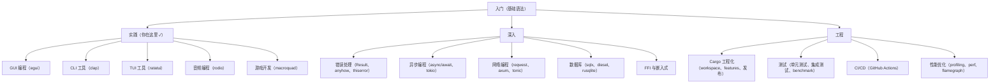

# 实践总结与进阶指南

## 我们要做什么

这是实践部分的终章。我们将回顾 5 个项目的核心收获，对比它们涉及的技术领域，为你指明下一步的学习方向。

## 前置知识

- 完成 [[01-简易计算器：从零到GUI]]
- 完成 [[02-学生管理系统：命令行工具]]
- 完成 [[03-工具栏管理工具：TUI入门]]
- 完成 [[04-音乐流媒体播放器]]
- 完成 [[05-贪吃蛇游戏：从零开发]]

---

## 五个项目回顾

### 1. 简易计算器：从零到GUI

**核心概念：GUI 编程、立即模式、事件处理、表达式求值**

用 `egui` + `eframe` 构建了一个图形界面计算器。你学到了：

- **立即模式 vs 保留模式**：立即模式中界面每帧重建，代码更直观
- **GUI 事件处理**：`button.clicked()` 检测点击，`changed()` 检测值变化
- **布局系统**：`ui.horizontal()` 水平排列，`ui.add_sized()` 固定大小
- **状态管理**：结构体字段存储应用状态（display、last_was_result）
- **表达式求值**：字符串解析 → 运算符查找 → 数学运算
- **调试技巧**：`println!`、`dbg!`、GUI 内嵌调试标签

**关键代码量**：约 350 行

---

### 2. 学生管理系统：命令行工具

**核心概念：CLI 设计、序列化/反序列化、文件 I/O、错误处理**

用 `clap` + `serde` + `serde_json` 构建了一个命令行学生管理工具。你学到了：

- **CLI 架构**：使用 `clap` 的 `#[derive(Parser)]` 自动生成帮助文本和参数解析
- **子命令设计**：`enum Commands { Add, List, Search, Delete, Update }` 组织功能
- **JSON 序列化**：`serde_json::to_string_pretty()` / `from_str()` 实现持久化
- **文件 I/O**：`fs::read_to_string()` / `fs::write()` 读写文件
- **迭代器链式操作**：`iter().filter().collect()`、`iter_mut().find()`、`retain()`
- **输入验证**：检查姓名非空、年龄范围、成绩范围
- **彩色输出**：`colored` crate 提供的 `.red()`、`.green()`、`.bold()` 等方法

**关键代码量**：约 400 行

---

### 3. 工具栏管理工具：TUI 入门

**核心概念：TUI 编程、终端渲染、状态机、事件循环**

用 `ratatui` + `crossterm` 构建了一个终端内的交互式工具栏管理器。你学到了：

- **TUI vs GUI vs CLI**：TUI 在终端中用文本渲染界面，天然支持 SSH
- **原始模式（Raw Mode）**：`enable_raw_mode()` 禁用行缓冲，每个按键立即传递
- **备用屏幕（Alternate Screen）**：程序退出后恢复原始终端内容
- **ratatui 布局系统**：`Layout::default().constraints([...])` 分割区域
- **ratatui 组件**：`List`（列表）、`Paragraph`（段落）、`Block`（边框）、`Clear`（清除区域）
- **键盘事件处理**：`event::poll()` + `Event::Key` + `KeyCode`
- **状态机模式**：`InputMode` 枚举（Normal / Adding / Searching）管理界面状态
- **弹窗实现**：用 `Clear` 组件 + 居中 `Layout` 实现弹窗效果

**关键代码量**：约 500 行

---

### 4. 音乐流媒体播放器

**核心概念：音频流播放、解码器、播放控制、文件对话框**

用 `rodio` + `egui` + `rfd` 构建了一个图形界面音乐播放器。你学到了：

- **流媒体 vs 下载播放**：流式播放边读边播，内存占用小
- **PCM 音频**：数字音频的基本形式——采样率 × 位深度 × 声道数
- **编解码器（Codec）**：MP3/WAV/FLAC 等格式的编码和解码
- **rodio 三件套**：`OutputStream`（声卡连接）、`Sink`（播放管理器）、`Decoder`（格式解码）
- **播放控制**：`sink.play()` / `sink.pause()` / `sink.stop()` / `sink.set_volume()`
- **文件对话框**：`rfd::FileDialog::new().add_filter().pick_file()` 调用原生对话框
- **egui 新组件**：`Slider`（音量滑块）、`ScrollArea`（可滚动播放列表）
- **自动播放下一首**：检测 `sink.empty()` 自动切换

**关键代码量**：约 320 行

---

### 5. 贪吃蛇游戏：从零开发

**核心概念：游戏循环、2D 渲染、碰撞检测、帧率控制**

用 `macroquad` 构建了一个完整的贪吃蛇游戏。你学到了：

- **游戏循环三步骤**：输入处理 → 状态更新 → 画面渲染
- **帧率控制**：`get_time()` + `MOVE_INTERVAL` 控制蛇速，与显示器刷新率解耦
- **2D 坐标系统**：网格坐标（逻辑）→ 像素坐标（渲染）的转换
- **蛇移动算法**：`body.insert(0, new_head)` + `body.pop()` 实现前进
- **碰撞检测三种情况**：墙壁碰撞、自身碰撞、食物碰撞
- **游戏状态管理**：`game_over` / `paused` 标志 + R 键重置
- **随机数生成**：`rand::thread_rng().gen_range()` 随机放置食物
- **视觉美化**：颜色渐变（蛇身）、`draw_circle`（蛇眼）、半透明遮罩（游戏结束画面）

**关键代码量**：约 360 行

---

## 技术对比总表

| 项目 | GUI | TUI | CLI | 文件 I/O | 网络 | 音频 | 游戏 | 状态管理 |
|------|:---:|:---:|:---:|:--------:|:---:|:---:|:---:|:--------:|
| 计算器（egui） | ✓ | - | - | - | - | - | - | struct + enum |
| 学生管理（clap） | - | - | ✓ | ✓ | - | - | - | Vec<Student> |
| 工具管理（ratatui） | - | ✓ | - | ✓ | - | - | - | enum + InputMode |
| 音乐播放（rodio） | ✓ | - | - | ✓ | - | ✓ | - | Sink + playlist |
| 贪吃蛇（macroquad） | ✓ | - | - | - | - | - | ✓ | Vec + game_over flag |

### 使用的库一览

| 库 | 用途 | 出现在 |
|----|------|--------|
| `egui` / `eframe` | 立即模式 GUI | 计算器、音乐播放器 |
| `clap` | 命令行参数解析 | 学生管理 |
| `serde` / `serde_json` | JSON 序列化 | 学生管理、工具管理 |
| `colored` | 彩色终端输出 | 学生管理 |
| `ratatui` | TUI 框架 | 工具管理 |
| `crossterm` | 终端操控 | 工具管理 |
| `rodio` | 音频播放 | 音乐播放器 |
| `rfd` | 文件对话框 | 音乐播放器 |
| `macroquad` | 2D 游戏框架 | 贪吃蛇 |
| `rand` | 随机数 | 贪吃蛇 |

---

## 调试技巧总结

在五个项目中，我们接触了多种调试方法：

### 1. `println!` 大法（所有项目适用）

最简单有效的调试方法：

```rust
println!("当前状态: display={}, last_was_result={}", self.display, self.last_was_result);
```

对于 GUI/TUI 程序，从终端启动（`cargo run`）而不是双击图标，这样 `println!` 的输出会显示在终端中。

### 2. `dbg!` 宏

打印文件名、行号和值：

```rust
let result = self.evaluate();
dbg!(&result);
// 输出: [src/main.rs:85:13] &result = Some(42.0)
```

### 3. 分散 panic（缩小问题范围）

当不确定某段代码是否被执行时：

```rust
if ui.button("X").clicked() {
    panic!("按钮 X 被点击了！");
}
```

### 4. 类型标注（让编译器帮你）

当类型推断失败时，显式标注类型：

```rust
let results: Vec<&Student> = students.iter().filter(...).collect();
//               ^^^^^^^^^^^ 显式标注，编译器能给出更好的错误提示
```

### 5. 检查所有权和借用

遇到"borrow checker"错误时：
- 先 `clone()` 来确认逻辑正确，然后优化
- 使用 `dbg!` 查看变量的所有权链
- 考虑是否需要 `&`、`&mut` 还是所有权转移

### 6. TUI 调试技巧

在 TUI 中，可以创建一个悬浮窗口显示调试信息：

```rust
egui::Window::new("Debug").show(ctx, |ui| {
    ui.label(format!("State: {:?}", self));
});
```

或在 ratatui 中使用 footer 区域显示状态：

```rust
let footer = Paragraph::new(format!("Debug: selected={}", app.selected_index));
f.render_widget(footer, bottom_chunk);
```

---

## 如何继续学习

### Rust 进阶路径



### 推荐学习资源

1. **Rust 官方教程**：https://doc.rust-lang.org/book/
2. **Rust by Example**：https://doc.rust-lang.org/rust-by-example/
3. **egui 官方示例**：https://www.egui.rs/
4. **ratatui 官方示例**：https://ratatui.rs/
5. **macroquad 示例**：https://github.com/not-fl3/macroquad/tree/master/examples

### 练习建议

1. **不要只看不写**：每个教程都应该亲自敲一遍代码
2. **修改参数**：改变颜色、大小、速度，观察效果
3. **添加功能**：每个项目都提供了扩展思路，选一个实现
4. **组合技术**：例如把 TUI 工具管理的搜索功能移植到学生管理系统中
5. **阅读源码**：看懂 `egui`、`ratatui` 的官方示例代码

---

## 扩展每个项目的创意

### 计算器扩展

- [ ] 支持更多运算：`%`（取模）、`x²`（平方）、`1/x`（倒数）
- [ ] 运算历史记录面板
- [ ] 键盘输入支持（直接按数字键输入）
- [ ] 主题切换（暗色模式/亮色模式）
- [ ] 表达式求值器重构（支持括号、优先级）

### 学生管理系统扩展

- [ ] 交互式 REPL 模式（不用每次 `cargo run -- add`）
- [ ] 课程管理（每门课有独立的成绩记录）
- [ ] CSV 导入/导出功能
- [ ] 成绩统计（平均分、排名、分布图——用 ASCII art）
- [ ] SQLite 数据库替代 JSON 文件

### 工具栏管理器扩展

- [ ] 搜索过滤（按 `/` 进入搜索模式）
- [ ] 分类切换（用 Tabs 组件）
- [ ] 命令执行（选中工具后按 Enter 启动）
- [ ] 标签管理（添加/移除标签）
- [ ] 配置文件导入/导出

### 音乐播放器扩展

- [ ] 播放进度条（使用 `Decoder::total_duration()`）
- [ ] 随机播放和循环模式
- [ ] 自动扫描音乐目录
- [ ] 网络流媒体播放（URL 输入）
- [ ] 均衡器

### 贪吃蛇扩展

- [ ] 加速机制（得分越高移动越快）
- [ ] 障碍物模式
- [ ] 双人模式（WASD + 方向键分别控制两条蛇）
- [ ] 穿墙模式
- [ ] 最高分持久化
- [ ] 炫酷粒子效果（吃食物时）

---

## 如何发布你的项目

### 方法 1：crates.io 发布

`crates.io` 是 Rust 的官方包注册中心。

```bash
# 1. 注册 crates.io 账号（通过 GitHub 登录）
# https://crates.io/

# 2. 登录
cargo login <你的 API Token>

# 3. 确保 Cargo.toml 填写完整
# 必须字段：name, version, edition, description, license

# 4. 发布
cargo publish
```

发布后会得到一个地址如 `https://crates.io/crates/your-package`，别人可以用 `cargo install your-package` 安装。

### 方法 2：GitHub Releases

对于 GUI 程序或 TUI 程序，提供编译好的二进制文件更方便用户。

```bash
# 1. 编译 release 版本
cargo build --release

# 2. 可执行文件路径
# Linux: target/release/your_project
# macOS: target/release/your_project
# Windows: target/release/your_project.exe

# 3. 在 GitHub 创建 Release，上传二进制文件
# 用 gh CLI:
gh release create v0.1.0 target/release/your_project --title "首次发布" --notes "第一个版本"
```

### 方法 3：cargo-binstall

如果你的包在 crates.io 上且支持 `cargo-binstall`，用户可以更快安装：

```bash
cargo binstall your-package
```

需要在项目中添加对 `cargo-binstall` 的支持配置。

---

## 常见问题排查

| 问题 | 可能原因 | 解决方案 |
|------|---------|---------|
| `error: linking with cc failed` | 缺少系统编译器 | Linux: `sudo apt install build-essential` |
| `note: /usr/bin/ld: cannot find -lX11` | 缺少图形库 | Linux: `sudo apt install libx11-dev libxi-dev libgl-dev` |
| `音频没有声音` | 声卡未连接或音量过低 | 检查系统音量，确认耳机插好 |
| `cargo run 下载依赖很慢` | 默认源在国内慢 | 换用镜像源（如 ustc） |
| `终端退出后乱码` | TUI 程序未正确恢复终端 | 检查是否正确调用 `disable_raw_mode()` 和 `LeaveAlternateScreen` |
| `macroquad 窗口空白` | 可能 GPU 驱动问题 | Linux: 确认 `libgl1-mesa-dev` 已安装 |
| `编译时间过长` | 首次编译需要下载编译所有依赖 | 正常现象，后续增量编译会很快 |

---

## 章节考查（共 100 分）

### 选择题（每题 10 分，共 40 分）

**1. 以下哪个 crate 用于构建终端用户界面（TUI）？**

A. `egui`
B. `macroquad`
C. `ratatui`
D. `rodio`

<details>
<summary>答案</summary>

**C. `ratatui`**

`ratatui` 是 Rust 的 TUI 框架，用于在终端中创建交互式文本界面。`egui` 是 GUI 框架，`macroquad` 是游戏框架，`rodio` 是音频库。
</details>

**2. 贪吃蛇游戏中，控制移动速度不依赖帧率的方法是？**

A. 使用 `std::thread::sleep`
B. 使用 `get_time()` 计算时间差，超过间隔才移动
C. 每帧移动固定像素
D. 使用 `tokio::time::sleep`

<details>
<summary>答案</summary>

**B. 使用 `get_time()` 计算时间差，超过间隔才移动**

基于时间步长（delta time）的速度控制是游戏开发的标准做法。无论显示器是 60Hz 还是 144Hz，蛇都以固定速度移动。`std::thread::sleep` 会阻塞整个线程，不适合游戏。
</details>

**3. `serde` 的 `#[derive(Serialize, Deserialize)]` 宏的作用是什么？**

A. 自动实现 Debug 和 Clone trait
B. 自动生成 JSON/二进制等格式的序列化和反序列化代码
C. 自动生成命令行参数解析代码
D. 自动生成数据库 SQL 查询代码

<details>
<summary>答案</summary>

**B. 自动生成序列化和反序列化代码**

`serde` 的 derive 宏自动为结构体实现 `Serialize` 和 `Deserialize` trait，这样 `serde_json` 等格式库就可以将结构体与 JSON/二进制等格式互相转换。
</details>

**4. 在 rodio 中，`Sink::empty()` 返回 `true` 表示什么？**

A. Sink 没有被创建
B. 播放队列为空且当前无音频在播放
C. 音量被设为 0
D. 音频设备不可用

<details>
<summary>答案</summary>

**B. 播放队列为空且当前无音频在播放**

`Sink::empty()` 用于检测是否所有音频都已播放完毕（队列空且当前没有播放中的音频）。在我们的音乐播放器中，用这个来触发自动播放下一首。
</details>

### 填空题（每题 10 分，共 20 分）

**5. 在 Rust 中，要发布一个库到 crates.io，需要使用的命令是 `______`。**

<details>
<summary>答案</summary>

**`cargo publish`**

先通过 `cargo login` 登录，然后 `cargo publish` 将包发布到 https://crates.io/。发布前确保 `Cargo.toml` 填写了 name、version、description、license 等必要字段。
</details>

**6. 立即模式 GUI（如 egui）和保留模式 GUI（如 Qt）的核心区别是：立即模式中 `______`，而保留模式中 `______`。**

<details>
<summary>答案</summary>

**立即模式中每一帧直接描述界面（`if ui.button("OK").clicked() {...}`），不维护持久的组件对象；保留模式中先创建组件对象并存储在框架中（`Button btn = new Button("OK");`），框架管理组件生命周期。**

立即模式的优点是代码直观，没有隐藏状态；缺点是每帧都要重建界面，CPU 占用较高。保留模式的优点是布局计算一次即可，适合复杂动画；缺点是需要管理组件生命周期。
</details>

### 问答题（每题 20 分，共 40 分）

**7. （20 分）你参与开发的五个项目中，哪个项目让你觉得最有收获？请具体说明你学到了什么（至少列出三点），以及你计划如何改进它（至少列出两点）。**

<details>
<summary>参考答案要点</summary>

这是一个开放式问题，合格的回答应该包含：
- 明确选择了一个项目
- 至少列出三点学到的知识（技术概念、编程技巧、设计模式）
- 至少列出两点改进计划（功能扩展、性能优化、UI 改进等）

示例（选择贪吃蛇）：
- 学到的：游戏循环概念、碰撞检测算法、基于时间的速度控制、macroquad 绘图 API、随机数生成
- 改进计划：添加道具系统（加速道具、减速道具）、添加排行榜功能（本地 JSON 存储）
</details>

**8. （20 分）如果你想开发一个"Linux 进程管理器"（类似 Windows 的任务管理器），你会选择 GUI、TUI 还是 CLI？请说明理由（至少两条），并列出你需要使用的 3 个主要 crate 和它们的作用。**

<details>
<summary>参考答案要点</summary>

推荐选择 **TUI**（类似 `htop`）：
- 理由 1：进程管理器需要实时刷新，TUI 天然支持逐帧更新
- 理由 2：可以在 SSH 远程会话中使用（GUI 做不到）

三个主要 crate：
1. `ratatui` — TUI 框架，渲染界面
2. `crossterm` — 终端操控和后端
3. `sysinfo` — 系统信息库，获取 CPU、内存、进程列表等

也可以选 CLI，但交互体验不如 TUI。
</details>

---

## 结束语

通过这五个实践项目，你已经从一个 Rust 语法学习者变成了能够独立开发应用的 Rust 程序员。你掌握了：

- **三种界面范式**：CLI（命令行）、TUI（终端界面）、GUI（图形界面）
- **四种应用领域**：工具开发、音频处理、游戏开发、数据管理
- **十种以上 Rust crate**：egui、clap、serde、ratatui、rodio、macroquad 等
- **通用编程技巧**：状态管理、事件驱动、错误处理、调试方法

下一步建议：
1. 选一个你最感兴趣的项目，深度扩展它
2. 开始阅读 [[../工程/01-Cargo工程化与企业级构建]]，了解如何发布和维护正式项目
3. 尝试用 Rust 解决你日常遇到的小问题（自动化脚本、数据处理、小工具）

**编程之路，唯手熟尔。** 继续写代码吧！

---

**全部六个实践项目的链接：**
- [[01-简易计算器：从零到GUI]]
- [[02-学生管理系统：命令行工具]]
- [[03-工具栏管理工具：TUI入门]]
- [[04-音乐流媒体播放器]]
- [[05-贪吃蛇游戏：从零开发]]
- [[06-实践总结与进阶指南]]（本文）
