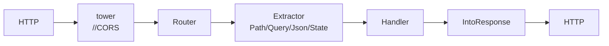

# 07 - axum Web 

## 

### axum 

axum  tokio  Web  `tower` 
 tokiotower/tower-httphyperHTTP ——
 Rust  Web  Spring Boot 
axum + tokio  Spring Boot +  Tomcat axum """"
——

### 

|  |  |  |  |
|------|--------|------|---------|
| **axum** | tokio  | extractor tower  | API  |
| actix-web | actix  |  |  |
| rocket | rocket  | API  |  |
| warp | seanmonstar |  filter  |  |

 axum——
 actix-web warp  filter 


### 



axum 

1. ****
2. **Router  method + path  handler**
3. **handler  extractor**""
4. ** `IntoResponse`**

---

## 

### Cargo.toml 

```toml
[package]
name = "todo-api"
version = "0.1.0"
edition = "2021"

[dependencies]
axum = "0.7"                                   # Web 
tokio = { version = "1", features = ["full"] } # Web 
serde = { version = "1", features = ["derive"] } # Json extractor 
serde_json = "1"
tower-http = { version = "0.5", features = ["trace", "fs", "cors"] } # 
tracing = "0.1"
tracing-subscriber = { version = "0.3", features = ["env-filter"] }  # 
```

### Hello World

```rust
use axum::{routing::get, Router};

// handler  async fn IntoResponse 
async fn hello() -> &'static str {
    "Hello, RootStack!"
}

#[tokio::main] //  main  tokio 
async fn main() {
    // Router path -> handler 
    let app = Router::new().route("/", get(hello));

    // bind + serve 0.0.0.0:3000
    let listener = tokio::net::TcpListener::bind("0.0.0.0:3000")
        .await
        .unwrap();
    axum::serve(listener, app).await.unwrap();
}
```

`cargo run`  `http://localhost:3000` 

###  ExtractorPath / Query / Json

extractor  axum ——**handler **

```rust
use axum::{
    extract::{Path, Query},
    routing::get,
    Json, Router,
};
use serde::Deserialize;
use std::collections::HashMap;

// ---------- Path /users/42 ----------
//  "/users/{id}"0.7 
async fn get_user(Path(id): Path<u64>) -> String {
    // id  u64 400
    format!(" id={id}")
}

// ---------- Query ?key=value&...  ----------
// derive Deserialize
#[derive(Deserialize)]
struct Pagination {
    page: Option<u32>,   // Option 
    size: Option<u32>,
}

async fn list_users(Query(p): Query<Pagination>) -> String {
    let page = p.page.unwrap_or(1);   // 
    let size = p.size.unwrap_or(10);
    format!(" {page}  {size} ")
}

// ---------- Json JSON ----------
#[derive(Deserialize)]
struct CreateUserReq {
    username: String,
    email: String,
}

async fn create_user(Json(req): Json<CreateUserReq>) -> Json<serde_json::Value> {
    //  400 + 
    Json(serde_json::json!({
        "code": 0,
        "data": { "username": req.username, "email": req.email }
    }))
}

let app = Router::new()
    .route("/users/{id}", get(get_user))
    .route("/users", get(list_users).post(create_user));
```


1. **Json **——body 
2. extractor  bodyJson/String/BytesPath/Query/State/Header
3.  extractor  `FromRequestParts` trait impl 

---

## 

### State 

handler  `State` 


```rust
use axum::extract::State;
use std::sync::{Arc, RwLock};

// Arc<RwLock<T>>  Todo 
// RwLock Arc 
type SharedTodos = Arc<RwLock<HashMap<u64, Todo>>>;

//  sqlx PgPool
//  Clone 
// type DbPool = sqlx::PgPool;

#[derive(Clone)] // State  Clone Arc 
struct AppState {
    todos: SharedTodos,
}

//  handler  State<...> 
async fn stats(State(state): State<AppState>) -> String {
    let n = state.todos.read().unwrap().len(); // 
    format!(" {n}  todo")
}
```

 `RwLock`
 await `tokio::sync::RwLock`

### AppError

 `unwrap` `IntoResponse`
 `?`  HTTP 

```rust
use axum::{
    http::StatusCode,
    response::{IntoResponse, Response},
    Json,
};
use serde_json::json;

// 
enum AppError {
    NotFound(String),        //  -> 404
    BadRequest(String),      //  -> 400
    Internal(anyhow::Error), //  -> 500
}

// IntoResponse  HTTP 
impl IntoResponse for AppError {
    fn into_response(self) -> Response {
        let (status, msg) = match self {
            AppError::NotFound(m) => (StatusCode::NOT_FOUND, m),
            AppError::BadRequest(m) => (StatusCode::BAD_REQUEST, m),
            // 
            AppError::Internal(e) => {
                tracing::error!("internal error: {e:#}");
                (StatusCode::INTERNAL_SERVER_ERROR, "internal error".into())
            }
        };
        (status, Json(json!({ "code": status.as_u16(), "msg": msg }))).into_response()
    }
}

//  anyhow::Error  ?  AppError::Internal
impl From<anyhow::Error> for AppError {
    fn from(e: anyhow::Error) -> Self {
        AppError::Internal(e)
    }
}
```

 handler  `-> Result<impl IntoResponse, AppError>`
 `?` —— Spring  `@ControllerAdvice + @ExceptionHandler` 

### tower  trace 

tower "" `Layer` tower-http 

```rust
use tower_http::{
    cors::CorsLayer,
    services::ServeDir,
    trace::TraceLayer,
};
use tracing_subscriber::{layer::SubscriberExt, util::SubscriberInitExt, EnvFilter};

#[tokio::main]
async fn main() {
    //  tracing RUST_LOG  RUST_LOG=debug
    tracing_subscriber::registry()
        .with(EnvFilter::try_from_default_env().unwrap_or_else(|_| "info".into()))
        .with(tracing_subscriber::fmt::layer())
        .init();

    let app = Router::new()
        .route("/", get(hello))
        // layer 
        .layer(
            TraceLayer::new_for_http() //  span method/path/status/
        )
        .layer(CorsLayer::permissive()) // CORS permissive
        // fallback ./public 
        .fallback_service(ServeDir::new("public"));

    let listener = tokio::net::TcpListener::bind("0.0.0.0:3000").await.unwrap();
    axum::serve(listener, app).await.unwrap();
}
```


1. `.layer()` ****
2.  `.layer()` 
3. SPA  `ServeDir`  `not_found_service`  index.html

### POST JSON CRUD Todo API

HashMap  +  ID +  REST 

```rust
use std::{
    collections::HashMap,
    sync::{Arc, RwLock},
};

use axum::{
    extract::{Path, State},
    http::StatusCode,
    routing::{get, post},
    Json, Router,
};
use serde::{Deserialize, Serialize};

// ----------  ----------

/// 
#[derive(Debug, Clone, Serialize)]
struct Todo {
    id: u64,
    title: String,
    done: bool,
}

/// POST /todos  id  done
#[derive(Debug, Deserialize)]
struct CreateTodo {
    title: String,
}

/// PATCH /todos/{id} ""
#[derive(Debug, Deserialize)]
struct UpdateTodo {
    title: Option<String>,
    done: Option<bool>,
}

/// 
#[derive(Serialize)]
struct ApiResponse<T: Serialize> {
    code: u16,
    msg: &'static str,
    data: T,
}

impl<T: Serialize> ApiResponse<T> {
    fn ok(data: T) -> Self {
        Self { code: 0, msg: "ok", data }
    }
}

// ----------  ----------

/// Arc RwLock 
#[derive(Clone)]
struct AppState {
    inner: Arc<RwLock<TodoDb>>,
}

struct TodoDb {
    next_id: u64,               // 
    map: HashMap<u64, Todo>,    //  -> 
}

// ---------- handlers ----------

/// 
async fn create_todo(
    State(state): State<AppState>,
    Json(req): Json<CreateTodo>,
) -> (StatusCode, Json<ApiResponse<Todo>>) {
    //  ID 
    let mut db = state.inner.write().unwrap();
    let id = db.next_id;
    db.next_id += 1;

    let todo = Todo { id, title: req.title, done: false };
    db.map.insert(id, todo.clone());

    // 201 Created 
    (StatusCode::CREATED, Json(ApiResponse::ok(todo)))
}

/// 
async fn get_todo(
    State(state): State<AppState>,
    Path(id): Path<u64>,
) -> Result<Json<ApiResponse<Todo>>, StatusCode> {
    //  404
    let db = state.inner.read().unwrap();
    match db.map.get(&id) {
        Some(todo) => Ok(Json(ApiResponse::ok(todo.clone()))),
        None => Err(StatusCode::NOT_FOUND),
    }
}

/// 
async fn list_todos(State(state): State<AppState>) -> Json<ApiResponse<Vec<Todo>>> {
    let db = state.inner.read().unwrap();
    //  id 
    let mut todos: Vec<Todo> = db.map.values().cloned().collect();
    todos.sort_by_key(|t| t.id);
    Json(ApiResponse::ok(todos))
}

/// 
async fn update_todo(
    State(state): State<AppState>,
    Path(id): Path<u64>,
    Json(req): Json<UpdateTodo>,
) -> Result<Json<ApiResponse<Todo>>, StatusCode> {
    let mut db = state.inner.write().unwrap();
    match db.map.get_mut(&id) {
        Some(todo) => {
            if let Some(title) = req.title {
                todo.title = title; //  title 
            }
            if let Some(done) = req.done {
                todo.done = done;   //  done 
            }
            Ok(Json(ApiResponse::ok(todo.clone())))
        }
        None => Err(StatusCode::NOT_FOUND),
    }
}

/// 
async fn delete_todo(
    State(state): State<AppState>,
    Path(id): Path<u64>,
) -> StatusCode {
    let removed = state.inner.write().unwrap().map.remove(&id);
    match removed {
        Some(_) => StatusCode::NO_CONTENT, // 204
        None => StatusCode::NOT_FOUND,
    }
}

// ----------  ----------

#[tokio::main]
async fn main() {
    tracing_subscriber::fmt()
        .with_env_filter("info")
        .init();

    let state = AppState {
        inner: Arc::new(RwLock::new(TodoDb { next_id: 1, map: HashMap::new() })),
    };

    let app = Router::new()
        .route("/todos", post(create_todo).get(list_todos))
        .route("/todos/{id}", get(get_todo).patch(update_todo).delete(delete_todo))
        .with_state(state); //  Router State extractor 

    let listener = tokio::net::TcpListener::bind("0.0.0.0:3000").await.unwrap();
    tracing::info!("todo api listening on :3000");
    axum::serve(listener, app).await.unwrap();
}
```

 curl `curl -X POST localhost:3000/todos -H 'content-type: application/json' -d '{"title":" axum"}'` GET/PATCH/DELETE 

 Spring BootRouter  `@RestController + @RequestMapping``State`  Bean`serde`  Jackson——

### 

 `AppState`  HashMap 
axum  `State`  handler  SQL

 sqlx—— SQL
[[rust/4/13-sqlx|sqlx ]]

###  distroless Dockerfile

```bash
# release 
cargo build --release
./target/release/todo-api
```

distroless  shell  libc
 Rust 

```dockerfile
# ----  ----
FROM rust:1-slim AS builder
WORKDIR /app
#  Docker 
COPY Cargo.toml Cargo.lock ./
RUN mkdir src && echo 'fn main() {}' > src/main.rs \
    && cargo build --release && rm -rf target/release/deps/todo-api*
# 
COPY src ./src
RUN cargo build --release

# ---- distroless/cc  glibc staticlibc  ----
FROM gcr.io/distroless/cc-debian12
COPY --from=builder /app/target/release/todo-api /usr/local/bin/todo-api
EXPOSE 3000
ENTRYPOINT ["todo-api"]
```

```bash
docker build -t todo-api .
docker run -p 3000:3000 todo-api
```

 20-30 MB Rust  1 GB+

---

## 

- **extractor**Path/Query/Json Json 
- **State**`Arc<RwLock>` 
- **** AppError + impl IntoResponse`?` 
- ****tower-http TraceLayer/CorsLayer/ServeDir`.layer()` 
- ****`--release` + distroless 

 [[rust/4/13-sqlx|sqlx ]]
