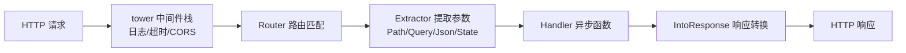

# 07 - axum Web 服务开发

## 原理

### axum 是什么

axum 是 tokio 团队出品的 Web 框架，基于 `tower` 中间件生态构建。它没有自造路由和抽象体系，
而是直接复用 tokio（异步运行时）、tower/tower-http（中间件）、hyper（HTTP 实现）——
这套组合目前是 Rust 社区 Web 开发的事实新标准。如果你有 Spring Boot 背景：
axum + tokio 的关系大致相当于 Spring Boot + 内嵌 Tomcat，但 axum 走的是"库"而非"框架"路线
——没有注解、没有反射、没有运行时魔法，一切通过函数签名和类型系统表达。

### 选型对比

| 框架 | 出品方 | 特点 | 适用场景 |
|------|--------|------|---------|
| **axum** | tokio 团队 | extractor 设计优雅、tower 生态、文档好 | 新项目首选，API 服务 |
| actix-web | actix 社区 | 性能标杆之一、成熟稳定 | 高吞吐场景、存量项目 |
| rocket | rocket 社区 | API 人性化、语法糖多 | 快速原型、小项目 |
| warp | seanmonstar | 基于 filter 组合子、类型密集 | 函数式爱好者 |

选型建议：不确定就选 axum——社区活跃度、招聘需求、教程数量都在第一梯队；
已有 actix-web 项目不必迁移，两者性能同一档次；warp 的 filter 链在复杂路由下
错误信息可读性差，新手不推荐。

### 核心心智模型



理解这张图，axum 就通了：

1. **请求从外到内穿过中间件栈**（洋葱模型）；
2. **Router 按 method + path 找到 handler**；
3. **handler 的每个参数都是一个 extractor**，按顺序从请求中"提取"数据；
4. **返回值只需实现 `IntoResponse`**，框架负责序列化。

---

## 语法

### Cargo.toml 依赖

```toml
[package]
name = "todo-api"
version = "0.1.0"
edition = "2021"

[dependencies]
axum = "0.7"                                   # Web 框架本体
tokio = { version = "1", features = ["full"] } # 异步运行时，Web 服务必依赖
serde = { version = "1", features = ["derive"] } # 序列化框架，Json extractor 的底层
serde_json = "1"
tower-http = { version = "0.5", features = ["trace", "fs", "cors"] } # 中间件集
tracing = "0.1"
tracing-subscriber = { version = "0.3", features = ["env-filter"] }  # 日志门面与实现
```

### Hello World

```rust
use axum::{routing::get, Router};

// handler 就是一个普通 async fn，返回实现 IntoResponse 的类型
async fn hello() -> &'static str {
    "Hello, RootStack!"
}

#[tokio::main] // 宏把 main 变成异步入口，内部启动 tokio 运行时
async fn main() {
    // Router：声明 path -> handler 的映射
    let app = Router::new().route("/", get(hello));

    // bind + serve：监听 0.0.0.0:3000
    let listener = tokio::net::TcpListener::bind("0.0.0.0:3000")
        .await
        .unwrap();
    axum::serve(listener, app).await.unwrap();
}
```

`cargo run` 后访问 `http://localhost:3000` 即可看到响应。

### 三大 Extractor：Path / Query / Json

extractor 是 axum 最核心的设计——**handler 参数即提取逻辑**，类型即文档。

```rust
use axum::{
    extract::{Path, Query},
    routing::get,
    Json, Router,
};
use serde::Deserialize;
use std::collections::HashMap;

// ---------- Path：从路径段提取，如 /users/42 ----------
// 路由注册为 "/users/{id}"（0.7 写法），元组或单个值均可
async fn get_user(Path(id): Path<u64>) -> String {
    // id 已自动解析为 u64，解析失败由框架返回 400
    format!("查询用户 id={id}")
}

// ---------- Query：从 ?key=value&... 提取 ----------
// 定义一个结构体描述查询串的形状，derive Deserialize
#[derive(Deserialize)]
struct Pagination {
    page: Option<u32>,   // Option 表示可以缺省
    size: Option<u32>,
}

async fn list_users(Query(p): Query<Pagination>) -> String {
    let page = p.page.unwrap_or(1);   // 缺省给默认值
    let size = p.size.unwrap_or(10);
    format!("第 {page} 页，每页 {size} 条")
}

// ---------- Json：读取请求体为 JSON ----------
#[derive(Deserialize)]
struct CreateUserReq {
    username: String,
    email: String,
}

async fn create_user(Json(req): Json<CreateUserReq>) -> Json<serde_json::Value> {
    // 反序列化失败自动 400 + 错误信息；成功则进入函数体
    Json(serde_json::json!({
        "code": 0,
        "data": { "username": req.username, "email": req.email }
    }))
}

let app = Router::new()
    .route("/users/{id}", get(get_user))
    .route("/users", get(list_users).post(create_user));
```

规则备忘：

1. **Json 必须是最后一个参数**——它要消费请求体，body 只能读一次；
2. extractor 最多一个消费 body（Json/String/Bytes），其余（Path/Query/State/Header）不限个数；
3. 所有 extractor 都实现了 `FromRequestParts` trait，自定义提取逻辑就是 impl 它。

---

## 实践

### State 共享状态

handler 是无关联的独立函数，共享数据（配置、连接池、内存缓存）要通过 `State` 注入。
两种典型形态：

```rust
use axum::extract::State;
use std::sync::{Arc, RwLock};

// 形态一：Arc<RwLock<T>> 包裹内存态数据（本章 Todo 示例采用）
// RwLock 保证多读单写；Arc 让所有权被多个任务共享
type SharedTodos = Arc<RwLock<HashMap<u64, Todo>>>;

// 形态二：数据库连接池（如 sqlx PgPool）
// 池内部自带并发安全连接管理，直接 Clone 即可，无需再套锁
// type DbPool = sqlx::PgPool;

#[derive(Clone)] // State 要求状态类型实现 Clone（浅拷贝 Arc 指针，开销极低）
struct AppState {
    todos: SharedTodos,
}

// 在 handler 参数中用 State<...> 提取
async fn stats(State(state): State<AppState>) -> String {
    let n = state.todos.read().unwrap().len(); // 读锁统计条数
    format!("当前共 {n} 条 todo")
}
```

选择依据：内存可变数据用 `RwLock`；外部资源句柄（池、客户端）自身已线程安全，直接放。
若持锁期间有 await，改用 `tokio::sync::RwLock`（异步锁），避免阻塞运行时线程。

### 自定义错误处理：AppError

生产服务不能处处 `unwrap`。惯用法是定义统一错误枚举并实现 `IntoResponse`，
让 `?` 把下层错误一路传播成规范的 HTTP 响应：

```rust
use axum::{
    http::StatusCode,
    response::{IntoResponse, Response},
    Json,
};
use serde_json::json;

// 统一业务错误枚举
enum AppError {
    NotFound(String),        // 资源不存在 -> 404
    BadRequest(String),      // 参数非法 -> 400
    Internal(anyhow::Error), // 兜底内部错误 -> 500
}

// IntoResponse 决定每种错误如何变成 HTTP 响应
impl IntoResponse for AppError {
    fn into_response(self) -> Response {
        let (status, msg) = match self {
            AppError::NotFound(m) => (StatusCode::NOT_FOUND, m),
            AppError::BadRequest(m) => (StatusCode::BAD_REQUEST, m),
            // 内部错误只记日志，对外隐藏细节，避免信息泄露
            AppError::Internal(e) => {
                tracing::error!("internal error: {e:#}");
                (StatusCode::INTERNAL_SERVER_ERROR, "internal error".into())
            }
        };
        (status, Json(json!({ "code": status.as_u16(), "msg": msg }))).into_response()
    }
}

// 让 anyhow::Error 能用 ? 自动转成 AppError::Internal
impl From<anyhow::Error> for AppError {
    fn from(e: anyhow::Error) -> Self {
        AppError::Internal(e)
    }
}
```

之后所有 handler 统一签名 `-> Result<impl IntoResponse, AppError>`，
业务代码里 `?` 一路到底，错误出口收敛在一处——等价于 Spring 里 `@ControllerAdvice + @ExceptionHandler` 的角色。

### tower 中间件与 trace 日志

tower 是"服务抽象"，中间件即 `Layer`。最常用的是 tower-http 提供的一组现成中间件：

```rust
use tower_http::{
    cors::CorsLayer,
    services::ServeDir,
    trace::TraceLayer,
};
use tracing_subscriber::{layer::SubscriberExt, util::SubscriberInitExt, EnvFilter};

#[tokio::main]
async fn main() {
    // 初始化 tracing：根据 RUST_LOG 环境变量控制级别，如 RUST_LOG=debug
    tracing_subscriber::registry()
        .with(EnvFilter::try_from_default_env().unwrap_or_else(|_| "info".into()))
        .with(tracing_subscriber::fmt::layer())
        .init();

    let app = Router::new()
        .route("/", get(hello))
        // layer 应用于其上方所有已注册的路由（洋葱模型外层）
        .layer(
            TraceLayer::new_for_http() // 每个请求打一条 span 日志：method/path/status/耗时
        )
        .layer(CorsLayer::permissive()) // CORS：生产环境应配置白名单而非 permissive
        // fallback：未匹配任何路由时走静态文件服务 ./public 目录
        .fallback_service(ServeDir::new("public"));

    let listener = tokio::net::TcpListener::bind("0.0.0.0:3000").await.unwrap();
    axum::serve(listener, app).await.unwrap();
}
```

要点：

1. `.layer()` 只影响**它之前**注册的路由，所以中间件写在路由后面；
2. 多个 `.layer()` 后写的在外层（先执行）；
3. SPA 项目常给 `ServeDir` 配 `not_found_service` 回退到 index.html。

### POST JSON CRUD：完整内存版 Todo API

下面是一个可直接运行的完整示例：HashMap 内存存储 + 自增 ID + 全套 REST 接口。

```rust
use std::{
    collections::HashMap,
    sync::{Arc, RwLock},
};

use axum::{
    extract::{Path, State},
    http::StatusCode,
    routing::{get, post},
    Json, Router,
};
use serde::{Deserialize, Serialize};

// ---------- 数据模型 ----------

/// 单条待办事项
#[derive(Debug, Clone, Serialize)]
struct Todo {
    id: u64,
    title: String,
    done: bool,
}

/// POST /todos 的请求体（不需要客户端传 id 和 done）
#[derive(Debug, Deserialize)]
struct CreateTodo {
    title: String,
}

/// PATCH /todos/{id} 的请求体：可选字段表示"没传就不改"
#[derive(Debug, Deserialize)]
struct UpdateTodo {
    title: Option<String>,
    done: Option<bool>,
}

/// 统一响应包装
#[derive(Serialize)]
struct ApiResponse<T: Serialize> {
    code: u16,
    msg: &'static str,
    data: T,
}

impl<T: Serialize> ApiResponse<T> {
    fn ok(data: T) -> Self {
        Self { code: 0, msg: "ok", data }
    }
}

// ---------- 共享状态 ----------

/// 内存存储：Arc 提供跨任务共享，RwLock 提供读写互斥
#[derive(Clone)]
struct AppState {
    inner: Arc<RwLock<TodoDb>>,
}

struct TodoDb {
    next_id: u64,               // 自增主键
    map: HashMap<u64, Todo>,    // 主键 -> 待办
}

// ---------- handlers ----------

/// 创建待办
async fn create_todo(
    State(state): State<AppState>,
    Json(req): Json<CreateTodo>,
) -> (StatusCode, Json<ApiResponse<Todo>>) {
    // 加写锁，生成自增 ID 并插入
    let mut db = state.inner.write().unwrap();
    let id = db.next_id;
    db.next_id += 1;

    let todo = Todo { id, title: req.title, done: false };
    db.map.insert(id, todo.clone());

    // 201 Created 表示资源创建成功
    (StatusCode::CREATED, Json(ApiResponse::ok(todo)))
}

/// 查询单条
async fn get_todo(
    State(state): State<AppState>,
    Path(id): Path<u64>,
) -> Result<Json<ApiResponse<Todo>>, StatusCode> {
    // 加读锁查询；不存在返回 404
    let db = state.inner.read().unwrap();
    match db.map.get(&id) {
        Some(todo) => Ok(Json(ApiResponse::ok(todo.clone()))),
        None => Err(StatusCode::NOT_FOUND),
    }
}

/// 列表全量查询
async fn list_todos(State(state): State<AppState>) -> Json<ApiResponse<Vec<Todo>>> {
    let db = state.inner.read().unwrap();
    // 收集并按 id 排序，保证输出稳定
    let mut todos: Vec<Todo> = db.map.values().cloned().collect();
    todos.sort_by_key(|t| t.id);
    Json(ApiResponse::ok(todos))
}

/// 更新待办（部分更新语义）
async fn update_todo(
    State(state): State<AppState>,
    Path(id): Path<u64>,
    Json(req): Json<UpdateTodo>,
) -> Result<Json<ApiResponse<Todo>>, StatusCode> {
    let mut db = state.inner.write().unwrap();
    match db.map.get_mut(&id) {
        Some(todo) => {
            if let Some(title) = req.title {
                todo.title = title; // 传了 title 才改
            }
            if let Some(done) = req.done {
                todo.done = done;   // 传了 done 才改
            }
            Ok(Json(ApiResponse::ok(todo.clone())))
        }
        None => Err(StatusCode::NOT_FOUND),
    }
}

/// 删除待办
async fn delete_todo(
    State(state): State<AppState>,
    Path(id): Path<u64>,
) -> StatusCode {
    let removed = state.inner.write().unwrap().map.remove(&id);
    match removed {
        Some(_) => StatusCode::NO_CONTENT, // 204：删除成功无响应体
        None => StatusCode::NOT_FOUND,
    }
}

// ---------- 组装与启动 ----------

#[tokio::main]
async fn main() {
    tracing_subscriber::fmt()
        .with_env_filter("info")
        .init();

    let state = AppState {
        inner: Arc::new(RwLock::new(TodoDb { next_id: 1, map: HashMap::new() })),
    };

    let app = Router::new()
        .route("/todos", post(create_todo).get(list_todos))
        .route("/todos/{id}", get(get_todo).patch(update_todo).delete(delete_todo))
        .with_state(state); // 把状态交给 Router，所有 State extractor 从这里取

    let listener = tokio::net::TcpListener::bind("0.0.0.0:3000").await.unwrap();
    tracing::info!("todo api listening on :3000");
    axum::serve(listener, app).await.unwrap();
}
```

用 curl 验证：`curl -X POST localhost:3000/todos -H 'content-type: application/json' -d '{"title":"学完 axum"}'`，其余 GET/PATCH/DELETE 同理。

对照 Spring Boot：Router 组装相当于 `@RestController + @RequestMapping`，`State` 相当于注入的单例 Bean，`serde` 相当于 Jackson——但全程编译期检查，无运行时反射。

### 持久化预告

内存态重启即失。生产中把 `AppState` 里的 HashMap 换成数据库连接池即可平滑升级：
axum 侧代码几乎不变（仍是 `State` 注入），只是 handler 内改为调用 SQL。

持久层方案推荐 sqlx——异步原生、编译期校验 SQL，详见
[[rust/4工程/13-sqlx数据库操作|sqlx 数据库操作章]]。

### 发布构建与 distroless Dockerfile

```bash
# release 构建：开优化、去调试符号，二进制体积和性能都面向生产
cargo build --release
./target/release/todo-api
```

distroless 镜像不含 shell 和包管理器，只保留运行必需的 libc，
攻击面最小、镜像最小，是 Rust 服务的理想载体：

```dockerfile
# ---- 构建阶段 ----
FROM rust:1-slim AS builder
WORKDIR /app
# 先拷贝依赖清单，利用 Docker 层缓存加速依赖编译
COPY Cargo.toml Cargo.lock ./
RUN mkdir src && echo 'fn main() {}' > src/main.rs \
    && cargo build --release && rm -rf target/release/deps/todo-api*
# 再拷贝真实源码做增量构建
COPY src ./src
RUN cargo build --release

# ---- 运行阶段：distroless/cc 含 glibc，非 staticlibc 也能跑 ----
FROM gcr.io/distroless/cc-debian12
COPY --from=builder /app/target/release/todo-api /usr/local/bin/todo-api
EXPOSE 3000
ENTRYPOINT ["todo-api"]
```

```bash
docker build -t todo-api .
docker run -p 3000:3000 todo-api
```

最终镜像约 20-30 MB（对比完整 Rust 基础镜像的 1 GB+），冷启动毫秒级。

---

## 小结

- **extractor**：Path/Query/Json 类型即提取逻辑，Json 必须是最后一个参数；
- **State**：`Arc<RwLock>` 存内存态，连接池直接注入；
- **错误处理**：自定义 AppError + impl IntoResponse，`?` 一路传播；
- **中间件**：tower-http TraceLayer/CorsLayer/ServeDir，`.layer()` 洋葱模型；
- **发布**：`--release` + distroless 多阶段构建。

持久化升级与生产集成，见 [[rust/4工程/13-sqlx数据库操作|sqlx 数据库操作章]]。
