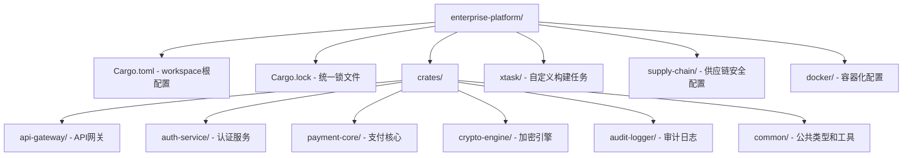

# Cargo工程化与企业级构建

## 企业级代码标准

### 什么是企业级代码？

企业级代码不是"换个名字的高级代码"。它是在**真实生产环境中、对真实用户负责**的代码，必须满足以下硬性要求：

| 维度 | 非企业级 | 企业级 |
|------|---------|--------|
| 安全性 | "应该没问题" | 已审计，零已知漏洞，有应急预案 |
| 可靠性 | 大部分情况下能跑 | 99.9%+ 可用性，有SLA |
| 可维护性 | 作者能看懂就行 | 任何团队成员都能在1小时内接手 |
| 可观测性 | println! 调试 | 结构化日志 + 指标 + 追踪 |
| 合规性 | 无所谓 | 满足行业法规（GDPR/SOC2/PCI-DSS等） |
| 可重现性 | 在我的电脑上能编译 | 任何环境、任何时间都能位对位重现构建 |
| 供应链 | 不管依赖哪来的 | 每个依赖经过审核，来源可追溯 |
| 测试 | 手动测过 | 自动测试覆盖率 >80%，包含安全测试 |

### 企业级 Rust 项目的判断标准

以下是一个企业级 Rust 项目的**硬性检查清单**。每项必须明确通过（✅）或记录豁免理由（⚠️）。

#### 一、构建与供应链（6项）

- [ ] **1.1 可重现构建**：同一 commit 在任何机器上产生完全相同二进制。（`Cargo.lock` 提交到 Git）
- [ ] **1.2 依赖锁定**：所有依赖有精确版本号，无 `*` 通配符。
- [ ] **1.3 安全审计**：`cargo audit` 和 `cargo deny` 通过，无已知 CVE。
- [ ] **1.4 依赖审查**：所有非 trivial 依赖经过人工审核（`cargo vet` 或等价流程）。
- [ ] **1.5 构建隔离**：构建在隔离环境中进行（CI 容器），不依赖开发机本地状态。
- [ ] **1.6 产物签名**：发布产物经过代码签名（GPG/Sigstore）。

#### 二、代码质量（8项）

- [ ] **2.1 无 unsafe 或已审查**：每个 `unsafe` 块有注释说明安全性证明，经过 code review。
- [ ] **2.2 Clippy 零警告**：`cargo clippy -- -D warnings` 通过。
- [ ] **2.3 格式化一致**：`cargo fmt --check` 通过。
- [ ] **2.4 文档覆盖**：所有公开 API 有文档，关键模块有模块级文档。
- [ ] **2.5 错误处理完整**：无 `unwrap()` 在非测试/非示例代码中（用 `expect` 或 `?` 替代）。
- [ ] **2.6 无 panic 逃逸**：库代码不应 panic；应用程序的 panic 应有全局处理器（`std::panic::set_hook`）。
- [ ] **2.7 资源管理正确**：文件/socket/锁的获取和释放在 Drop 实现中正确配对。
- [ ] **2.8 并发安全**：通过 `Send` 和 `Sync` 的设计防止数据竞争；使用 loom 验证无锁数据结构。

#### 三、安全架构（7项）

- [ ] **3.1 最小权限原则**：每个组件只拥有完成其功能所需的最小权限。
- [ ] **3.2 输入验证**：所有外部输入（网络、文件、环境变量）经过验证和净化。
- [ ] **3.3 加密正确**：使用经过审计的加密原语（`ring`/`rustls`/`aes-gcm`），无自创加密算法。
- [ ] **3.4 密钥管理**：密钥不硬编码在源码中。开发/生产环境使用不同密钥。
- [ ] **3.5 日志安全**：日志不包含密码、Token、个人身份信息（PII）。
- [ ] **3.6 错误信息安全**：外部错误消息不泄漏内部实现细节（栈追踪、文件路径、数据库结构）。
- [ ] **3.7 依赖最小化**：只引入真正需要的依赖。定期清理未使用的依赖。

#### 四、运维与可观测性（6项）

- [ ] **4.1 结构化日志**：使用 `tracing` 或 `log` crate，输出 JSON 格式日志。
- [ ] **4.2 指标暴露**：关键业务指标（请求数、延迟、错误率）可通过 Prometheus 端点获取。
- [ ] **4.3 健康检查**：提供 `/healthz`（存活）和 `/readyz`（就绪）端点。
- [ ] **4.4 优雅关闭**：收到 SIGTERM 后，停止接收新请求，完成进行中的请求，再退出。
- [ ] **4.5 超时和重试**：所有网络调用有超时。重试使用指数退避 + 抖动。
- [ ] **4.6 熔断保护**：下游服务故障时具有熔断机制，防止级联故障。

#### 五、测试与CI（5项）

- [ ] **5.1 CI 自动化**：每次 PR 运行完整测试套件 + clippy + fmt + audit。
- [ ] **5.2 单元测试**：核心业务逻辑测试覆盖率 >80%。
- [ ] **5.3 集成测试**：关键业务流程有端到端集成测试。
- [ ] **5.4 安全测试**：CI 中包含 `cargo audit`、`cargo deny`、fuzzing（关键解析组件）。
- [ ] **5.5 性能回归**：CI 中包含基准测试对比，阻止性能回退。

#### 六、文档与合规（4项）

- [ ] **6.1 API 文档**：所有公开 API 有 rustdoc，包含使用示例。
- [ ] **6.2 架构决策记录**：重要技术决策有 ADR（Architecture Decision Record）文档。
- [ ] **6.3 许可证明确**：Cargo.toml 中有明确的 license 字段，所有依赖许可证兼容。
- [ ] **6.4 更新日志**：每个版本有 CHANGELOG.md，记录重要变更和安全修复。

---

> **如何使用这个清单**：在每个工程章节的学习中，你会看到很多概念和工具对应上述清单的某项。学完工程板块后，你应该能用 Rust 构建一个通过全部 36 项检查的企业级项目。

## 企业场景

某金融科技公司维护一个包含12个微服务的Rust单体仓库（monorepo），同时服务于内部私有云和外部SaaS客户。安全团队发现某第三方依赖存在高危CVE（CVSS 9.8），需要在30分钟内完成全量修复、测试和灰度发布。此外，公司要求所有发布产物必须经过代码签名，且构建过程在隔离环境中完全可重现。

Cargo作为Rust的构建系统和包管理器，为这些企业级需求提供了完整的解决方案。

---

## 1. Workspace管理：Monorepo的工程化实践

在大型企业中，将多个相关crate放在同一仓库中管理是常见做法。Cargo workspace提供了统一编译、共享依赖、协调版本的能力。



**根Cargo.toml配置：**

```toml
[workspace]
members = [
    "crates/api-gateway",
    "crates/auth-service",
    "crates/payment-core",
    "crates/crypto-engine",
    "crates/audit-logger",
    "crates/common",
]
resolver = "2"

[workspace.package]
version = "3.2.0"
edition = "2024"
license = "Apache-2.0"
repository = "https://github.com/enterprise/platform"

[workspace.dependencies]
# 统一版本管理——所有成员crate继承此处声明的依赖版本
tokio = { version = "1.40", features = ["full"] }
serde = { version = "1.0", features = ["derive"] }
serde_json = "1.0"
rustls = { version = "0.23", default-features = false, features = ["tls12", "aws_lc_rs"] }
ring = "0.17"
zeroize = { version = "1.8", features = ["derive"] }
argon2 = "0.5"
rand = "0.8"
tracing = "0.1"
tracing-subscriber = { version = "0.3", features = ["json", "env-filter"] }
thiserror = "1.0"
```

**成员crate依赖声明：**

```toml
# crates/auth-service/Cargo.toml
[package]
name = "auth-service"
version.workspace = true
edition.workspace = true

[dependencies]
tokio.workspace = true
serde.workspace = true
rustls.workspace = true
ring.workspace = true
argon2.workspace = true
zeroize.workspace = true
common.workspace = true  # 内部依赖也统一管理
```

**C/C++对比：**

| 方面 | Cargo | CMake/Make |
|------|-------|------------|
| 依赖解析 | 自动语义版本解析 | 手动管理或vcpkg/conan |
| 构建配置 | TOML声明式 | 命令式脚本 |
| 交叉编译 | `--target` 一行切换 | 工具链文件+手动配置 |
| 缓存共享 | sccache原生集成 | ccache手动集成 |
| 安全审计 | cargo-audit内置 | 无标准化方案 |

---

## 2. Feature Flags：安全功能的编译时控制

Feature flags允许根据部署环境有选择地编译功能，这对安全至关重要——你不希望开发环境的调试接口出现在生产构建中。

```toml
[features]
default = ["production", "rustls-tls"]

# 运行时模式
production = ["dep:jsonwebtoken"]
development = ["dev-tools", "dep:mockall"]
staging = []

# 安全特性
rustls-tls = ["dep:rustls", "dep:rustls-pemfile", "dep:tokio-rustls"]
native-tls = ["dep:openssl", "dep:tokio-native-tls"]  # 仅在确认OpenSSL版本安全时使用
fips-mode = ["rustls-tls", "dep:aws-lc-rs", "dep:fips-provider"]
audit-logging = ["dep:tracing", "dep:tracing-subscriber"]
data-masking = []  # 编译时启用数据脱敏

# 开发工具（绝对不在生产构建中启用）
dev-tools = ["dep:tower-http", "dep:console-subscriber"]
integration-tests = []

# 硬件加速
aes-ni = []       # AES-NI指令集
arm-crypto = []   # ARMv8 Crypto Extensions
```

**代码中使用feature flags：**

```rust
// src/crypto/mod.rs
// 根据编译特性选择不同的加密实现

#[cfg(feature = "aes-ni")]
mod aes_ni;
#[cfg(feature = "aes-ni")]
pub use aes_ni::Aes256Gcm;

#[cfg(not(any(feature = "aes-ni", feature = "arm-crypto")))]
mod aes_software;
#[cfg(not(any(feature = "aes-ni", feature = "arm-crypto")))]
pub use aes_software::Aes256Gcm;

/// 开发调试接口——编译时保证不会出现在生产环境
#[cfg(feature = "dev-tools")]
pub mod debug_routes {
    use actix_web::{get, web, HttpResponse};
    use std::collections::HashMap;

    #[get("/debug/active-sessions")]
    pub async fn list_sessions(
        state: web::Data<crate::AppState>,
    ) -> HttpResponse {
        // 此端点在生产构建中完全不存在
        let sessions = state.session_store.active_count();
        HttpResponse::Ok().json(sessions)
    }
}

/// 数据脱敏：根据编译特性插入或省略敏感字段的遮蔽逻辑
pub fn mask_sensitive_data(log_entry: &mut serde_json::Value) {
    let sensitive_fields = ["password", "token", "secret", "api_key", "ssn"];

    // 基础遮蔽：始终执行
    for field in sensitive_fields {
        if let Some(val) = log_entry.get_mut(field) {
            *val = serde_json::Value::String("***REDACTED***".to_string());
        }
    }

    // 增强遮蔽：仅在data-masking特性启用时执行
    #[cfg(feature = "data-masking")]
    {
        let extended_fields = ["email", "phone", "address", "ip"];
        for field in extended_fields {
            if let Some(val) = log_entry.get_mut(field) {
                if let serde_json::Value::String(s) = val {
                    *val = serde_json::Value::String(
                        format!("{}{}", &s[..s.len().min(2)], "***")
                    );
                }
            }
        }
    }
}
```

**⚠️ 安全警告：** 使用 `--all-features` 编译时可能意外启用开发特性。生产构建应**显式指定**特性：

```bash
# 错误做法
cargo build --release --all-features

# 正确做法
cargo build --release --no-default-features \
  --features "production,rustls-tls,fips-mode,audit-logging"
```

---

## 3. 自定义构建配置：安全与性能的平衡

Cargo支持自定义profile，允许为不同场景（CI、生产、调试、安全审计）配置不同的编译策略。

```toml
# Cargo.toml 或 .cargo/config.toml

[profile.release]
opt-level = 3
lto = "fat"                 # 全链接时优化：更小的二进制，更少的攻击面
codegen-units = 1           # 单代码生成单元：最大化内联和优化
panic = "abort"             # 安全关键：abort而非unwind（缩小攻击面）
strip = "symbols"           # 剥离符号：使逆向工程更困难
debug = 0                   # 无调试信息：防止信息泄露

[profile.release-security]  # 安全优先配置
inherits = "release"
opt-level = "z"             # 优化体积：更小的攻击面
lto = "fat"
codegen-units = 1
panic = "abort"
strip = true                # 剥离所有符号
debug = false

# 安全特性：启用控制流完整性（CFI）
rustflags = [
    "-C", "control-flow-guard",          # Windows CFG
    "-C", "force-frame-pointers=yes",    # 方便安全审计的栈回溯
    "-Z", "sanitizer=address",           # ASan：地址消毒器
    "-Z", "sanitizer=cfi",              # CFI：控制流完整性
]

[profile.ci]                 # CI环境配置
inherits = "release"
debug-assertions = true      # CI中保留debug断言以捕获逻辑错误
overflow-checks = true       # 始终检查整数溢出

[profile.dev-secure]         # 开发中的安全检查
inherits = "dev"
opt-level = 0
debug-assertions = true
overflow-checks = true

# 在开发中启用sanitizer（性能开销约2x，但能发现堆/栈/数据竞争）
rustflags = [
    "-Z", "sanitizer=address",
    "-Z", "sanitizer=leak",
    "-Z", "sanitizer=thread",
]
```

---

## 4. 构建可重现性：供应链安全的基石

可重现构建（Reproducible Builds）确保相同源码→相同二进制，这是供应链安全的基础。

**Cargo.lock的核心作用：**

```toml
# Cargo.lock精确记录了依赖树和每个包的checksum
[[package]]
name = "ring"
version = "0.17.8"
source = "registry+https://github.com/rust-lang/crates.io-index"
checksum = "f85a3c0b8c0ddbf27b92b801a8a5c40b1c53d4d66247c3499f918c315f9df891"

[[package]]
name = "rustls"
version = "0.23.10"
source = "registry+https://github.com/rust-lang/crates.io-index"
checksum = "7f3715661ea9a5f155df1c23089deb8f55e44082a4697e6a7e8b576e17c5e8a1"
dependencies = [
 "aws-lc-rs",
 "log",
 "once_cell",
 "rustls-pki-types",
 "rustls-webpki",
 "subtle",
 "zeroize",
]
```

**⚠️ 关键原则：** `Cargo.lock` **必须**提交到版本控制。这与某些语言的`package-lock.json`建议相同，但对于Rust，这直接影响安全性——锁定的依赖经过审计，任何变更（即使patch版本）都需要人工审查。

**可重现构建配置：**

```bash
# .cargo/config.toml
[build]
# 固定rustc版本影响编译输出
rustflags = ["--remap-path-prefix=$HOME=/build", "--remap-path-prefix=$PWD=/src"]

# 使用固定版本的Rust工具链
# rust-toolchain.toml
[toolchain]
channel = "1.80.0"
components = ["rustfmt", "clippy", "rust-analyzer"]
```

**验证构建可重现性：**

```bash
#!/bin/bash
# scripts/verify-reproducible-build.sh

# 第一次构建
cargo build --release --target x86_64-unknown-linux-gnu
cp target/x86_64-unknown-linux-gnu/release/auth-service ./build1

# 清理并第二次构建
cargo clean
cargo build --release --target x86_64-unknown-linux-gnu
cp target/x86_64-unknown-linux-gnu/release/auth-service ./build2

# 比较哈希
sha256sum build1 build2
# 预期输出：相同的哈希值

# 验证无时间戳或其他可变数据
diffoscope build1 build2
```

---

## 5. 供应链安全：cargo-vet与cargo-audit

### 5.1 cargo-audit：已知漏洞检测

```bash
# 安装
cargo install cargo-audit

# 扫描依赖中的已知CVE
cargo audit

# 示例输出：
# Crate:     openssl
# Version:   0.10.55
# Title:     `openssl` `X509NameBuilder::build` returned object is not
#            safe to use outside the builder context
# Date:      2024-03-21
# ID:        RUSTSEC-2024-0012
# URL:       https://rustsec.org/advisories/RUSTSEC-2024-0012
# Solution:  Upgrade to >=0.10.66

# CI中集成：
# .github/workflows/audit.yml
name: Security Audit
on:
  schedule:
    - cron: '0 8 * * *'  # 每天UTC 8:00运行
  push:
    paths:
      - '**/Cargo.toml'
      - '**/Cargo.lock'
jobs:
  audit:
    runs-on: ubuntu-latest
    steps:
      - uses: actions/checkout@v4
      - uses: rustsec/audit-check@v2
        with:
          token: ${{ secrets.GITHUB_TOKEN }}
```

### 5.2 cargo-vet：依赖信任链

`cargo-vet`允许组织建立对第三方依赖的信任链。Google、Mozilla等组织使用它来管理供应链风险。

```bash
cargo install cargo-vet

# 初始化审核流程
cargo vet init

# 为已有依赖添加审核记录
cargo vet certify ring 0.17.8
```

```toml
# supply-chain/config.toml — 审核配置
[policy."*"]
criteria = "safe-to-deploy"

[[exemptions.unicode-ident]]
version = "1.0.12"
criteria = "safe-to-deploy"
notes = "仅包含一个静态数组，无unsafe代码，无FFI"

[unaudited.ring]
notes = "由Mozilla开发，经过了广泛的安全审核。但我们仍需内部验证。"
```

```bash
# 审核流程 — 每次依赖变更必须执行
cargo vet    # 检查所有依赖是否经过审核
cargo vet suggest  # 查看哪些依赖需要审核
```

### 5.3 锁定间接依赖

```toml
# Cargo.toml — 如果某间接依赖存在已知问题，可显式锁定
[patch.crates-io]
# 临时使用修复版本的fork
openssl = { git = "https://github.com/internal/openssl-fork", branch = "patch-cve-2024" }
```

```bash
# 使用cargo-deny进行许可证合规检查
cargo install cargo-deny
cargo deny check licenses
cargo deny check bans
cargo deny check sources  # 验证所有依赖来自可信源
```

---

## 6. 代码签名：发布产物完整性保证

```bash
#!/bin/bash
# scripts/sign-release.sh — 发布签名脚本
set -euo pipefail

BINARY="target/release/auth-service"
SIGNING_KEY="${SIGNING_KEY_PATH:-/etc/enterprise/codesign.key}"
CERT="${CERT_PATH:-/etc/enterprise/codesign.crt}"

# 1. 构建
cargo build --release --no-default-features \
  --features "production,rustls-tls,audit-logging"

# 2. 剥离符号（可选，使逆向更困难）
strip "${BINARY}"

# 3. 生成SHA256摘要
sha256sum "${BINARY}" > "${BINARY}.sha256"

# 4. 使用私钥签名
openssl dgst -sha256 -sign "${SIGNING_KEY}" \
  -out "${BINARY}.sig" "${BINARY}"

# 5. 使用证书验证签名（部署前验证）
openssl dgst -sha256 -verify \
  <(openssl x509 -in "${CERT}" -pubkey -noout) \
  -signature "${BINARY}.sig" "${BINARY}"

echo "✅ 发布工件已签名"
echo "   二进制: ${BINARY}"
echo "   签名:   ${BINARY}.sig"
echo "   摘要:   ${BINARY}.sha256"
```

**Rust侧验证签名：**

```rust
// src/security/signature_verification.rs
use ring::signature::{self, UnparsedPublicKey, RsaPublicKeyComponents};
use std::fs;

#[derive(Debug, thiserror::Error)]
pub enum VerificationError {
    #[error("签名验证失败：{0}")]
    SignatureInvalid(String),
    #[error("文件读取失败：{0}")]
    IoError(#[from] std::io::Error),
    #[error("公钥解析失败")]
    KeyParseError,
}

pub struct BinaryVerifier {
    public_key: Vec<u8>,
}

impl BinaryVerifier {
    pub fn new(public_key_path: &str) -> Result<Self, VerificationError> {
        let pem = fs::read_to_string(public_key_path)?;
        // 解析PEM格式公钥（生产环境应使用PKCS#8格式）
        let public_key = pem.lines()
            .filter(|l| !l.starts_with("-----"))
            .collect::<String>();
        let der = base64::Engine::decode(
            &base64::engine::general_purpose::STANDARD,
            &public_key,
        ).map_err(|_| VerificationError::KeyParseError)?;

        Ok(BinaryVerifier { public_key: der })
    }

    pub fn verify(
        &self,
        binary_path: &str,
        signature_path: &str,
    ) -> Result<bool, VerificationError> {
        let binary_data = fs::read(binary_path)?;
        let signature_data = fs::read(signature_path)?;

        // 使用RSA-PKCS1-SHA256验证
        let public_key = UnparsedPublicKey::new(
            &signature::RSA_PKCS1_2048_8192_SHA256,
            &self.public_key,
        );

        public_key
            .verify(&binary_data, &signature_data)
            .map(|_| true)
            .map_err(|e| VerificationError::SignatureInvalid(format!("{:?}", e)))
    }
}
```

---

## 7. 私有Crate Registry

企业通常需要托管私有包，既保护知识产权，又能实现内部共享。

**使用JFrog Artifactory或自建registry：**

```toml
# .cargo/config.toml
[registries]
enterprise = { index = "https://crates.enterprise.internal/git/index" }

# 或使用私有registry + crates.io镜像
[source.crates-io]
replace-with = "enterprise-mirror"

[source.enterprise-mirror]
registry = "https://crates-mirror.enterprise.internal/api/v1/crates"

[source.enterprise-registry]
registry = "https://crates.enterprise.internal/api/v1/crates"

# 包在私有registry中发布
cargo publish --registry enterprise
```

**⚠️ 供应链攻击防范：** 私有registry应配置为仅允许经过安全审核的包。与公共crates.io结合使用时，使用`cargo-deny`确保内部包不会意外依赖未审核的外部包。

---

## 8. 构建缓存与CI优化

```bash
# 使用sccache加速CI中的编译
cargo install sccache

# .cargo/config.toml
[build]
rustc-wrapper = "/usr/local/bin/sccache"

[target.x86_64-unknown-linux-gnu]
linker = "clang"
rustflags = [
    "-C", "link-arg=-fuse-ld=mold",  # 使用mold连接器（比gold/LDD快2-10x）
]
```

```yaml
# CI: .github/workflows/build.yml
- name: Setup sccache
  uses: mozilla-actions/sccache-action@v0.0.4

- name: Build with security profile
  run: |
    cargo build --profile release-security \
      --no-default-features \
      --features "production,rustls-tls,fips-mode"

- name: Run security audit
  run: |
    cargo audit
    cargo deny check
    cargo vet

- name: Verify reproducible build
  run: |
    cp target/release-auth-service ./build1
    cargo clean
    cargo build --profile release-security
    diffoscope ./build1 target/release-auth-service
```

---

## 章节考查（100分）

### 一、概念题（40分，每题8分）

1. 简述Cargo workspace在企业monorepo中的三个关键优势。
2. 解释为什么生产构建应使用 `--no-default-features` 和显式特性列表，而非 `--all-features`。
3. Cargo.lock文件在供应链安全中扮演什么角色？为什么必须提交到版本控制？
4. 描述`cargo vet`和`cargo audit`的职责区别。
5. 可重现构建（Reproducible Build）对安全的意义是什么？列举两个实现要点。

<details>
<summary>查看答案</summary>

**1. Cargo Workspace的三个关键优势：**
- **统一依赖版本管理**：所有成员crate共享`workspace.dependencies`，避免版本冲突和安全漏洞传播
- **增量编译共享**：workspace内的crate共享编译缓存，大幅减少CI构建时间
- **原子化变更**：跨crate的API变更可以在一个PR中完成，避免版本不兼容的中间状态

**2. 显式特性 vs --all-features：**
- `--all-features`会启用所有特性，包括`dev-tools`、调试接口等不应出现在生产环境的功能
- 开发特可能包含不安全的代码路径、信息泄露端点或模拟数据
- 显式特性列表确保仅编译经过安全审核的功能集合

**3. Cargo.lock的作用：**
- 精确记录依赖树中每个包的版本和checksum，防止供应链投毒
- 开发者A构建的二进制与开发者B构建的一致（排除环境差异）
- 必须提交到VCS，因为它是安全审计的基线——任何依赖变更都需要经过审查流程

**4. cargo-vet vs cargo-audit：**
- `cargo-audit`：扫描已知CVE数据库（RUSTSEC），检测已有漏洞
- `cargo-vet`：建立信任链，对每个依赖进行人工安全审核，确保代码质量

**5. 可重现构建的意义：**
- 允许任何人独立验证发布的二进制确实来自声明源码，防止构建服务器被攻破后插入后门
- 实现要点：固定工具链版本、使用`--remap-path-prefix`剥离路径信息、不使用时间戳
</details>

### 二、判断题（20分，每题5分）

6. ( ) Feature flags只能用于可选依赖，不能用于条件编译代码逻辑。
7. ( ) `panic = "abort"`配置可以缩小攻击面，因为unwind机制可能被利用于漏洞利用。
8. ( ) 剥离符号（strip）后，程序崩溃时的错误信息仍然完整。
9. ( ) 私有crate registry可以完全替代crates.io，无需任何外部依赖审查。

<details>
<summary>查看答案</summary>

6. **错误。** Feature flags既可用于条件编译（`#[cfg(feature = "xxx")]`），也可用于控制可选依赖（`dep:crate_name`），两者是两个正交的能力。
7. **正确。** unwind机制需要更多代码（异常处理表、drop守卫），增加了攻击面。在安全关键系统中，一旦遇到不可恢复错误，立即abort更安全。
8. **错误。** 剥离符号后，栈回溯将只包含内存地址而无函数名。但这不影响panic消息本身的字符串内容。
9. **错误。** 私有registry不能完全隔离。依赖的传递依赖可能来自crates.io；且许多基础库（tokio、serde等）仅在公共registry上发布。应使用`cargo-deny`配合策略管理。
</details>

### 三、代码分析题（15分）

10. 以下Cargo.toml配置存在安全问题，请指出问题并给出修正：

```toml
[package]
name = "payment-gateway"
version = "0.1.0"

[features]
default = ["full"]
full = ["http-server", "grpc-server", "metrics", "debug-console"]
http-server = ["actix-web"]
grpc-server = ["tonic"]
metrics = ["prometheus"]
debug-console = ["console-subscriber", "tokio-console"]

[profile.release]
opt-level = 3
debug = true
```

<details>
<summary>查看答案</summary>

**问题分析：**

1. **默认特性包含调试功能**：`default = ["full"]` → `full` → `debug-console`，导致生产构建默认包含调试端点。攻击者可利用tokio-console观察运行时状态、任务调度等敏感信息。

2. **release配置注释有误**：`debug = true` 不是注释——它在实际Cargo中被忽略（debug是0|1|2或布尔值），但如果生效会导致调试信息泄露。

3. **缺少panic = "abort"**：支付系统应使用abort策略。

**修正：**

```toml
[features]
default = ["production"]
production = ["http-server", "grpc-server", "metrics"]
development = ["production", "debug-console"]
debug-console = ["dep:console-subscriber", "dep:tokio-console"]

[profile.release]
opt-level = 3
debug = 0
panic = "abort"
lto = "fat"
codegen-units = 1
strip = "symbols"
```
</details>

### 四、编程题（15分）

11. 编写一个`build.rs`脚本，在编译时验证：
    - 生产构建未启用任何dev特性
    - 所有依赖的许可证兼容（使用SPDX标识符检查）
    - 构建环境的PATH中不含可疑目录

<details>
<summary>查看答案</summary>

```rust
// build.rs
use std::env;
use std::process::Command;

fn main() {
    // 1. 验证生产构建未启用开发特性
    let profile = env::var("PROFILE").unwrap_or_default();
    if profile == "release" || profile == "release-security" {
        // 检查是否意外启用了dev-tools相关特性
        println!("cargo:rerun-if-env-changed=CARGO_FEATURE_DEV_TOOLS");
        // 通过检查cfg验证
        #[cfg(feature = "dev-tools")]
        compile_error!(
            "dev-tools特性不能用于release构建！"
        );

        #[cfg(feature = "debug-console")]
        compile_error!(
            "debug-console特性不能用于release构建！"
        );
    }

    // 2. PATH安全检查
    let path = env::var("PATH").unwrap_or_default();
    let suspicious_dirs = ["/tmp", "/dev/shm", "/var/tmp", "/home"];
    for dir in path.split(':') {
        for suspicious in &suspicious_dirs {
            if dir.starts_with(suspicious) {
                println!("cargo:warning=PATH中包含可疑目录：{}", dir);
                // 在生产构建中失败
                if profile == "release" {
                    panic!("PATH安全检查失败：发现可疑目录 {}", dir);
                }
            }
        }
    }

    // 3. 工具链版本验证
    let rustc_version = Command::new("rustc")
        .arg("--version")
        .output()
        .expect("无法执行rustc")
        .stdout;
    let version_str = String::from_utf8_lossy(&rustc_version);
    println!("cargo:rustc-env=RUSTC_VERSION={}", version_str.trim());

    // 验证最低Rust版本
    if let Some(version) = version_str.split_whitespace().nth(1) {
        let parts: Vec<&str> = version.split('.').collect();
        if parts.len() >= 2 {
            let major: u32 = parts[0].parse().unwrap_or(0);
            let minor: u32 = parts[1].parse().unwrap_or(0);
            if major < 1 || (major == 1 && minor < 75) {
                panic!("需要Rust 1.75.0或更高版本，当前为 {}", version);
            }
        }
    }

    // 4. 注入构建元数据
    let git_commit = Command::new("git")
        .args(["rev-parse", "--short=12", "HEAD"])
        .output()
        .map(|o| String::from_utf8_lossy(&o.stdout).trim().to_string())
        .unwrap_or_else(|_| "unknown".to_string());
    println!("cargo:rustc-env=GIT_COMMIT_HASH={}", git_commit);

    println!("cargo:rerun-if-changed=.git/HEAD");
}
```
</details>

### 五、填空题（5分，每空1分）

12. 在Cargo中，使用`____`属性可以在编译时丢弃标记的代码路径；使用`____`可以引入一个仅当指定特性启用时才编译的依赖；要确保某个crate的所有依赖均来自可信源，应使用`____`工具；构建的可重现性要求`____`文件必须提交到VCS；私有registry的配置存储在`____`文件中。

<details>
<summary>查看答案</summary>

**答案：** `#[cfg(not(...))]`、`dep:依赖名`、`cargo-deny`、`Cargo.lock`、`.cargo/config.toml`
</details>

### 六、代码补全（5分）

13. 补全以下代码，使得`debug_endpoint`在release构建中完全不存在：

```rust
// 补全此处：_________________________
pub mod debug_endpoint {
    // ...
}

fn main() {
    // 补全此处：_________________________
    {
        println!("⚠️ 调试接口已启用！");
    }
}
```

<details>
<summary>查看答案</summary>

```rust
#[cfg(feature = "dev-tools")]
pub mod debug_endpoint {
    // ...
}

fn main() {
    #[cfg(feature = "dev-tools")]
    {
        println!("⚠️ 调试接口已启用！");
    }
}
```

要点：使用`#[cfg(feature = "dev-tools")]`确保在release构建中该代码完全不编译，而非仅运行时不执行。编译时排除意味着二进制中不包含调试端点，无法通过逆向工程或内存操作恢复。
</details>

---

## 本章小结

本章深入探讨了Cargo在企业级安全构建中的关键角色。从Workspace管理实现monorepo的统一治理，到Feature flags的编译时安全控制，再到自定义Profile在安全与性能间的精妙平衡——每一步都体现了Rust生态"安全左移"的理念。

供应链安全不是一次性的扫描，而是一个持续的过程：`Cargo.lock`提供精确的依赖快照，`cargo-audit`持续监控已知漏洞，`cargo-vet`建立人工审核的信任链。可重现构建确保任何人能独立验证发布产物的完整性，代码签名在部署的最后一步提供防篡改保护。

与C/C++生态相比，Rust的构建系统天生具备更强的安全保障：声明式配置减少人为错误、内置的依赖解析和checksum验证、编译时特性控制消除运行时攻击面。这些不是额外的"安全特性"，而是融入日常工作流的默认行为。

在接下来的章节中，我们将继续考察测试策略中的安全实践：[[02-企业级测试策略]]。
