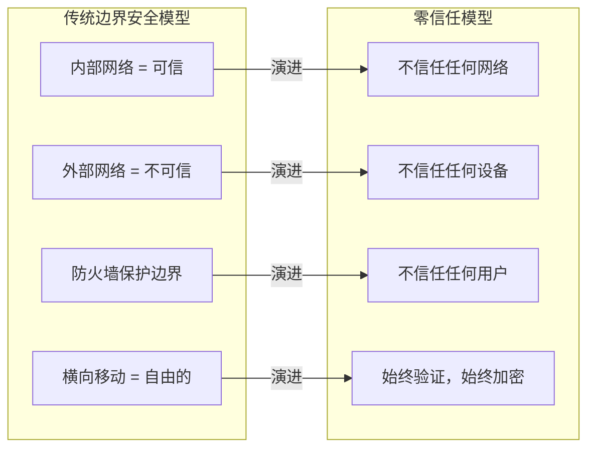

# 网络安全：零信任架构

## 企业场景

某金融SaaS平台的微服务原本运行在同一Kubernetes命名空间中，通过内部DNS互相调用。安全团队在一次渗透测试中发现：攻击者一旦获得任何一个Pod的Shell（通过供应链漏洞），就能在内部网络中自由横向移动——因为所有服务间通信都使用HTTP明文，无认证无加密。

更严重的是，一个退役开发者的个人笔记本仍持有有效的mTLS客户端证书，半年来持续从家庭网络连接到生产环境的gRPC服务。

安全团队决定实施零信任架构：所有通信必须TLS加密、所有请求必须认证授权、每个微服务独立身份。

---

## 1. 零信任网络原则与Rust实现

### 1.1 零信任核心原则



零信任五大支柱：
1. 网络分段 + 微分段（micro-segmentation）
2. 身份认证（mTLS + SPIFFE）
3. 授权（每次请求独立验证）
4. 加密（所有通信TLS，所有数据encrypted）
5. 持续监控（行为异常检测）

### 1.2 Rust实现的零信任中间件

```rust
use std::sync::Arc;
use tokio_rustls::rustls::{self, ServerConfig, ClientConfig};
use x509_parser::prelude::*;

/// 零信任配置
#[derive(Clone)]
pub struct ZeroTrustConfig {
    /// TLS配置（服务端）
    pub tls_server_config: Arc<ServerConfig>,
    /// TLS配置（客户端/mTLS）
    pub tls_client_config: Arc<ClientConfig>,
    /// JWT公钥（用于请求级认证）
    pub jwt_public_key: jsonwebtoken::DecodingKey,
    /// SPIFFE信任域
    pub spiffe_trust_domain: String,
    /// 授权策略引擎
    pub authorizer: Arc<dyn Authorizer>,
}

#[async_trait::async_trait]
pub trait Authorizer: Send + Sync {
    async fn authorize(&self, identity: &Identity, action: &Action) -> Result<bool, AuthzError>;
}

#[derive(Debug, Clone, Serialize, Deserialize)]
pub struct Identity {
    /// SPIFFE ID: spiffe://trust-domain/ns/default/sa/service-name
    pub spiffe_id: String,
    pub service_name: String,
    pub namespace: String,
    /// JWT claims（请求级认证）
    pub claims: Option<serde_json::Value>,
}

#[derive(Debug)]
pub struct Action {
    pub method: String,
    pub path: String,
    pub resource: String,
}
```

---

## 2. TLS Everywhere: rustls纯Rust实现

### 2.1 为什么选择rustls而非OpenSSL？

| 特性 | rustls | OpenSSL (openssl crate) |
|------|--------|-------------------------|
| 实现语言 | 纯Rust | C |
| 内存安全 | Rust保证 | 手动管理（年约50+CVE） |
| 供应链风险 | 低（Rust crate） | 高（Linux核心库，历史攻击目标） |
| 证书验证 | 内置`webpki` | 依赖OpenSSL验证 |
| FIPS认证 | 通过AWS-LC | 通过OpenSSL FIPS |
| 编译依赖 | 无系统依赖 | 需要libssl-dev |
| Heartbleed类Bug | 不可能（Rust安全保证） | 可能（C内存安全） |

### 2.2 服务端TLS配置

```rust
use rustls::{
    ServerConfig, ServerConnection,
    pki_types::{CertificateDer, PrivateKeyDer, PrivatePkcs8KeyDer},
};
use tokio_rustls::TlsAcceptor;
use std::sync::Arc;

pub struct TlsServerBuilder;

impl TlsServerBuilder {
    /// 构建零信任TLS配置
    pub fn build() -> Result<ServerConfig, TlsError> {
        // 从安全的密钥存储加载证书和私钥
        // ⚠️ 生产环境中，私钥不应在磁盘上明文存储
        let certs = Self::load_certificates()?;
        let key = Self::load_private_key()?;

        let mut config = ServerConfig::builder()
            .with_no_client_auth()  // 暂时无客户端认证（稍后启用mTLS）
            .with_single_cert(certs, key.into())
            .map_err(|e| TlsError::ConfigError(e.to_string()))?;

        // 安全配置
        config.alpn_protocols = vec![
            b"h2".to_vec(),    // HTTP/2
            b"http/1.1".to_vec(),
        ];

        // 仅允许安全的加密套件
        // rustls默认已禁用不安全的套件（RC4, 3DES等）
        // 我们显式指定以增加信心
        // 默认已包括：TLS13_AES_256_GCM_SHA384, TLS13_CHACHA20_POLY1305_SHA256

        // 设置会话缓存（可选）
        config.ticketer = rustls::crypto::aws_lc_rs::Ticketer::new()
            .map_err(|e| TlsError::ConfigError("Ticketer失败".to_string()))?;

        // 密钥日志（仅调试，生产禁用）
        // config.key_log = Arc::new(rustls::KeyLogFile::new());

        Ok(config)
    }

    fn load_certificates() -> Result<Vec<CertificateDer<'static>>, TlsError> {
        // 从安全的密钥管理服务加载（HashiCorp Vault, AWS KMS, etc）
        // 示例：从文件加载（仅开发环境）
        let cert_path = std::env::var("TLS_CERT_PATH")
            .unwrap_or_else(|_| "/etc/tls/server.crt".to_string());

        let cert_pem = std::fs::read_to_string(&cert_path)
            .map_err(|e| TlsError::IoError(format!("读取证书失败: {}", e)))?;

        let certs = rustls_pemfile::certs(&mut cert_pem.as_bytes())
            .collect::<Result<Vec<_>, _>>()
            .map_err(|e| TlsError::ConfigError(format!("解析证书失败: {}", e)))?;

        if certs.is_empty() {
            return Err(TlsError::ConfigError("未找到证书".to_string()));
        }

        Ok(certs)
    }

    fn load_private_key() -> Result<PrivateKeyDer<'static>, TlsError> {
        let key_path = std::env::var("TLS_KEY_PATH")
            .unwrap_or_else(|_| "/etc/tls/server.key".to_string());

        let key_pem = std::fs::read_to_string(&key_path)
            .map_err(|e| TlsError::IoError(format!("读取私钥失败: {}", e)))?;

        let mut keys = rustls_pemfile::pkcs8_private_keys(&mut key_pem.as_bytes())
            .collect::<Result<Vec<_>, _>>()
            .map_err(|e| TlsError::ConfigError(format!("解析私钥失败: {}", e)))?;

        keys.pop()
            .map(PrivateKeyDer::Pkcs8)
            .ok_or(TlsError::ConfigError("未找到PKCS8私钥".to_string()))
    }
}

/// 构建TLS服务
pub fn build_tls_server(config: ServerConfig) -> TlsAcceptor {
    TlsAcceptor::from(Arc::new(config))
}

#[derive(Debug, thiserror::Error)]
pub enum TlsError {
    #[error("TLS配置错误: {0}")]
    ConfigError(String),
    #[error("IO错误: {0}")]
    IoError(String),
}
```

### 2.3 服务端使用示例

```rust
use tokio::net::TcpListener;
use tokio_rustls::TlsAcceptor;

async fn start_secure_server() -> Result<(), Box<dyn std::error::Error>> {
    let tls_config = TlsServerBuilder::build()?;
    let tls_acceptor = TlsAcceptor::from(Arc::new(tls_config));

    let listener = TcpListener::bind("0.0.0.0:8443").await?;
    println!("🔒 TLS Server listening on 0.0.0.0:8443");

    loop {
        let (stream, peer_addr) = listener.accept().await?;

        // 接收TCP连接后，在TLS握手时检查客户端IP
        // 可在此处添加IP白名单检查
        if !is_ip_allowed(&peer_addr) {
            tracing::warn!("拒绝来自未授权IP的连接: {}", peer_addr);
            continue;
        }

        let acceptor = tls_acceptor.clone();
        tokio::spawn(async move {
            match acceptor.accept(stream).await {
                Ok(tls_stream) => {
                    // TLS握手成功
                    handle_secure_connection(tls_stream).await;
                }
                Err(e) => {
                    tracing::warn!("TLS握手失败: {} (来源: {})", e, peer_addr);
                }
            }
        });
    }
}
```

---

## 3. mTLS（双向TLS）实现

### 3.1 mTLS服务端配置

```rust
use rustls::{
    server::WebPkiClientVerifier,
    RootCertStore,
};

pub struct MTlsConfig;

impl MTlsConfig {
    pub fn build_mutual_tls_server() -> Result<ServerConfig, TlsError> {
        let certs = TlsServerBuilder::load_certificates()?;
        let key = TlsServerBuilder::load_private_key()?;

        // 加载受信任的客户端CA证书
        let mut client_ca_store = RootCertStore::empty();
        let ca_certs = Self::load_ca_certificates()?;
        for ca_cert in ca_certs {
            client_ca_store.add(ca_cert)
                .map_err(|e| TlsError::ConfigError(
                    format!("添加CA证书失败: {}", e)
                ))?;
        }

        // 构建客户端证书验证器
        let client_verifier = WebPkiClientVerifier::builder(
            Arc::new(client_ca_store)
        )
        .allow_unauthenticated()  // 可选：允许无证书（但记录为匿名）
        .build()
        .map_err(|e| TlsError::ConfigError(
            format!("构建客户端验证器失败: {}", e)
        ))?;

        let config = ServerConfig::builder()
            .with_client_cert_verifier(client_verifier)
            .with_single_cert(certs, key.into())
            .map_err(|e| TlsError::ConfigError(e.to_string()))?;

        Ok(config)
    }

    fn load_ca_certificates() -> Result<Vec<CertificateDer<'static>>, TlsError> {
        let ca_path = std::env::var("MTLS_CA_PATH")
            .unwrap_or_else(|_| "/etc/tls/ca.crt".to_string());

        let ca_pem = std::fs::read_to_string(&ca_path)
            .map_err(|e| TlsError::IoError(e.to_string()))?;

        rustls_pemfile::certs(&mut ca_pem.as_bytes())
            .collect::<Result<Vec<_>, _>>()
            .map_err(|e| TlsError::ConfigError(format!("解析CA证书失败: {}", e)))
    }
}
```

### 3.2 提取客户端证书信息

```rust
use rustls::server::ClientCertVerifier;
use x509_parser::certificate::X509Certificate;
use x509_parser::prelude::*;

/// 从TLS握手中提取客户端身份
pub fn extract_client_identity(
    conn: &ServerConnection,
) -> Result<Identity, IdentityError> {
    // 获取客户端证书链
    let peer_certs = conn.peer_certificates()
        .ok_or(IdentityError::NoClientCertificate)?;

    let client_cert = peer_certs.first()
        .ok_or(IdentityError::NoClientCertificate)?;

    // 解析X.509证书
    let (_, x509) = X509Certificate::from_der(client_cert.as_ref())
        .map_err(|e| IdentityError::CertificateParseError(e.to_string()))?;

    // 提取主题CN（Common Name）
    let cn = x509.subject()
        .iter_common_name()
        .next()
        .and_then(|cn| cn.as_str().ok())
        .unwrap_or("unknown");

    // 提取SAN（Subject Alternative Name）中的SPIFFE ID
    let spiffe_id = x509.subject_alternative_name()
        .ok_or(IdentityError::NoSpiffeId)?
        .filter_map(|san| match san {
            X509Name::URI(uri) if uri.starts_with("spiffe://") => Some(uri.to_string()),
            _ => None,
        })
        .next()
        .ok_or(IdentityError::NoSpiffeId)?;

    // 验证SPIFFE信任域
    let spiffe_parts: Vec<&str> = spiffe_id.split('/').collect();
    if spiffe_parts.len() < 4 {
        return Err(IdentityError::InvalidSpiffeId(spiffe_id));
    }

    Ok(Identity {
        spiffe_id,
        service_name: cn.to_string(),
        namespace: spiffe_parts.get(3).unwrap_or(&"unknown").to_string(),
        claims: None, // mTLS层不包含JWT claims
    })
}

#[derive(Debug, thiserror::Error)]
pub enum IdentityError {
    #[error("未提供客户端证书")]
    NoClientCertificate,
    #[error("证书解析失败: {0}")]
    CertificateParseError(String),
    #[error("未找到SPIFFE ID")]
    NoSpiffeId,
    #[error("无效的SPIFFE ID: {0}")]
    InvalidSpiffeId(String),
}
```

### 3.3 证书固定（Certificate Pinning）

```rust
use ring::digest::{digest, SHA256};
use rustls::crypto::CryptoProvider;

/// 证书固定管理器
///
/// 在TLS握手成功后，额外验证服务器证书的哈希
/// 防止中间CA被攻破后签发伪造证书
pub struct CertificatePinner {
    allowed_pins: Vec<[u8; 32]>,  // SHA256哈希列表
}

impl CertificatePinner {
    pub fn new() -> Self {
        Self {
            allowed_pins: Vec::new(),
        }
    }

    /// 添加允许的证书固定值
    pub fn pin(&mut self, cert_der: &[u8]) {
        let hash = digest(&SHA256, cert_der);
        let mut pin = [0u8; 32];
        pin.copy_from_slice(hash.as_ref());
        self.allowed_pins.push(pin);
    }

    /// 验证证书是否被固定
    pub fn verify(&self, cert_der: &[u8]) -> Result<(), PinError> {
        let hash = digest(&SHA256, cert_der);
        let hash_bytes = hash.as_ref();

        if self.allowed_pins.iter().any(|pin| pin == hash_bytes) {
            Ok(())
        } else {
            // ⚠️ 不要泄露哈希值到错误消息
            tracing::error!(
                security_event = true,
                event_type = "certificate_pin_failure",
                "证书固定验证失败——可能的中间人攻击"
            );
            Err(PinError::CertificateNotPinned)
        }
    }
}

#[derive(Debug, thiserror::Error)]
pub enum PinError {
    #[error("证书未在固定列表中")]
    CertificateNotPinned,
    #[error("证书哈希不匹配")]
    HashMismatch,
}

// 使用示例：在TLS握手后验证
async fn verify_with_pin(
    tls_stream: &tokio_rustls::server::TlsStream<tokio::net::TcpStream>,
    pinner: &CertificatePinner,
) -> Result<(), PinError> {
    let (_, session) = tls_stream.get_ref();
    if let Some(certs) = session.peer_certificates() {
        for cert in certs {
            pinner.verify(cert.as_ref())?;
        }
    }
    Ok(())
}
```

---

## 4. 请求认证：JWT与OAuth2

### 4.1 JWT验证实现

```rust
use jsonwebtoken::{decode, DecodingKey, Validation, Algorithm};
use serde::{Deserialize, Serialize};

#[derive(Debug, Serialize, Deserialize)]
pub struct Claims {
    pub sub: String,         // 用户ID
    pub exp: usize,          // 过期时间
    pub iat: usize,          // 签发时间
    pub iss: String,         // 签发者
    pub aud: String,         // 受众
    pub scope: String,       // 权限范围
    pub roles: Vec<String>,  // 角色列表
}

pub struct JwtValidator {
    decoding_key: DecodingKey,
    validation: Validation,
    issuer: String,
    audience: String,
}

impl JwtValidator {
    pub fn new(public_key_pem: &str, issuer: &str, audience: &str) -> Result<Self, JwtError> {
        let decoding_key = DecodingKey::from_rsa_pem(public_key_pem.as_bytes())
            .map_err(|e| JwtError::KeyError(e.to_string()))?;

        let mut validation = Validation::new(Algorithm::RS256);
        validation.set_issuer(&[issuer]);
        validation.set_audience(&[audience]);
        validation.leeway = 30; // 30秒时钟偏差容忍
        // ⚠️ 安全：不验证exp和nbf
        validation.validate_exp = true;
        validation.validate_nbf = true;

        Ok(Self {
            decoding_key,
            validation,
            issuer: issuer.to_string(),
            audience: audience.to_string(),
        })
    }

    pub fn validate(&self, token: &str) -> Result<Claims, JwtError> {
        let token_data = decode::<Claims>(
            token,
            &self.decoding_key,
            &self.validation,
        ).map_err(|e| {
            // ⚠️ 不给客户端暴露具体错误原因
            // (不要区分"过期"vs"签名无效"→防止指纹识别)
            tracing::warn!(
                security_event = true,
                event_type = "jwt_validation_failure",
                error = %e,
                "JWT验证失败"
            );
            match e.kind() {
                jsonwebtoken::errors::ErrorKind::ExpiredSignature => {
                    JwtError::TokenExpired
                }
                _ => JwtError::InvalidToken,
            }
        })?;

        // 额外安全检查
        let claims = token_data.claims;

        // 检查签发时间是否在未来（防止时钟回拨攻击）
        let now = std::time::SystemTime::now()
            .duration_since(std::time::UNIX_EPOCH)
            .unwrap()
            .as_secs() as usize;
        if claims.iat > now + 300 { // 允许5分钟时钟偏差
            return Err(JwtError::TokenIssuedInFuture);
        }

        Ok(claims)
    }
}

#[derive(Debug, thiserror::Error)]
pub enum JwtError {
    #[error("Token无效")]
    InvalidToken,
    #[error("Token已过期")]
    TokenExpired,
    #[error("Token签发时间异常")]
    TokenIssuedInFuture,
    #[error("密钥错误: {0}")]
    KeyError(String),
}
```

### 4.2 认证中间件

```rust
use actix_web::{
    dev::{ServiceRequest, ServiceResponse},
    Error, HttpMessage,
};
use actix_web::body::EitherBody;
use actix_web_httpauth::extractors::bearer::BearerAuth;

/// 认证中间件：结合mTLS + JWT双重认证
pub async fn authenticate(
    req: ServiceRequest,
    jwt_validator: &JwtValidator,
) -> Result<ServiceRequest, (Error, ServiceRequest)> {
    // 第1层：mTLS身份（连接层）
    let mtls_identity = req.conn_data::<Identity>()
        .cloned()
        .unwrap_or_else(|| {
            // 匿名身份——取决于零信任策略
            Identity {
                spiffe_id: "unknown".to_string(),
                service_name: "anonymous".to_string(),
                namespace: "none".to_string(),
                claims: None,
            }
        });

    // 第2层：JWT认证（请求层）
    let auth_header = req
        .headers()
        .get("Authorization")
        .and_then(|v| v.to_str().ok())
        .and_then(|v| v.strip_prefix("Bearer "));

    let jwt_identity = match auth_header {
        Some(token) => {
            match jwt_validator.validate(token) {
                Ok(claims) => {
                    Some(claims)
                }
                Err(_) => {
                    // JWT验证失败
                    return Err((
                        actix_web::error::ErrorUnauthorized("认证失败"),
                        req,
                    ));
                }
            }
        }
        None => None,
    };

    // 合并身份（mTLS + JWT）
    let combined_identity = CombinedIdentity {
        mtls: mtls_identity,
        jwt_claims: jwt_identity,
    };

    req.extensions_mut().insert(combined_identity);
    Ok(req)
}

#[derive(Debug, Clone)]
pub struct CombinedIdentity {
    pub mtls: Identity,
    pub jwt_claims: Option<Claims>,
}
```

---

## 5. 输入验证：永不相信用户输入

### 5.1 SQL注入防范

```rust
// ❌ 危险：字符串拼接SQL（即使Rust中也不能这么做）
async fn unsafe_query(pool: &sqlx::PgPool, user_input: &str) {
    let query = format!("SELECT * FROM users WHERE name = '{}'", user_input);
    // SQL注入：user_input = "admin' OR '1'='1"
    let _ = sqlx::query(&query).fetch_all(pool).await;
}

// ✅ 安全：参数化查询
async fn safe_query(pool: &sqlx::PgPool, user_input: &str) -> Result<Vec<User>, sqlx::Error> {
    // sqlx自动将$1替换为安全的参数绑定
    let users = sqlx::query_as::<_, User>(
        "SELECT id, name, email FROM users WHERE name = $1"
    )
    .bind(user_input)  // 参数绑定，不可能注入
    .fetch_all(pool)
    .await?;
    Ok(users)
}

// ✅ 使用ORM的编译时SQL检查
#[derive(sqlx::FromRow)]
struct User {
    id: i64,
    name: String,
    email: String,
}

// sqlx::query_as!在编译时验证SQL语法和列映射
async fn compile_time_checked_query(
    pool: &sqlx::PgPool,
    user_id: i64,
) -> Result<User, sqlx::Error> {
    let user = sqlx::query_as!(User,
        "SELECT id, name, email FROM users WHERE id = $1",
        user_id
    )
    .fetch_one(pool)
    .await?;
    Ok(user)
}
```

### 5.2 XSS防范

```rust
use ammonia::clean;

/// HTML sanitization using ammonia (like DOMPurify for Rust)
pub fn sanitize_user_html(input: &str) -> String {
    // ammonia默认配置已足够安全，但生产环境应调整
    let mut builder = ammonia::Builder::new();

    // 只允许安全的HTML标签
    builder.add_tags(&["b", "i", "em", "strong", "a", "p", "br", "ul", "ol", "li"]);

    // 链接只允许http/https协议
    builder.add_generic_attribute_prefixes(&["data-"]);
    builder.add_link_rel(None, "nofollow noopener noreferrer");

    // 禁止所有事件处理器（onclick等）
    // ammonia默认禁止，显式确保

    builder.clean(input).to_string()
}

/// 对JSON API响应的XSS防护
pub fn sanitize_json_string(input: &str) -> String {
    // 转义HTML实体，防止JSON响应中的XSS
    html_escape::encode_text(input).to_string()
}

#[test]
fn test_xss_prevention() {
    let xss_payload = "<script>alert('xss')</script>";
    let sanitized = sanitize_user_html(xss_payload);
    assert_eq!(sanitized, ""); // script标签被完全移除

    let xss_payload2 = "";
    let sanitized2 = sanitize_user_html(xss_payload2);
    assert!(!sanitized2.contains("onerror"));
}
```

### 5.3 路径遍历防范

```rust
use std::path::{Path, PathBuf};

/// 安全文件读取——防止路径遍历攻击
pub fn safe_read_file(
    base_dir: &Path,
    user_filename: &str,
) -> Result<Vec<u8>, FileAccessError> {
    // 1. 规范化基础目录
    let canonical_base = base_dir
        .canonicalize()
        .map_err(|_| FileAccessError::InvalidBaseDirectory)?;

    // 2. 清除用户输入中的危险字符
    let sanitized = user_filename
        .replace("..", "")
        .replace("./", "")
        .replace('\\', "/");

    // 去除前导斜杠
    let sanitized = sanitized.trim_start_matches('/');

    // 3. 拼接路径
    let full_path = canonical_base.join(&sanitized);

    // 4. 关键：解析为canonical后验证仍在base_dir内
    let canonical_path = full_path
        .canonicalize()
        .map_err(|_| FileAccessError::FileNotFound)?;

    // 5. ⚠️ 最重要的安全检查：确保路径在base_dir内
    if !canonical_path.starts_with(&canonical_base) {
        // 路径遍历攻击被检测到！
        tracing::warn!(
            security_event = true,
            event_type = "path_traversal_attempt",
            requested = %user_filename,
            resolved = %canonical_path.display(),
            "检测到路径遍历攻击"
        );
        return Err(FileAccessError::PathTraversalDetected);
    }

    std::fs::read(&canonical_path)
        .map_err(|e| FileAccessError::IoError(e.to_string()))
}

#[derive(Debug, thiserror::Error)]
pub enum FileAccessError {
    #[error("无效的基础目录")]
    InvalidBaseDirectory,
    #[error("文件不存在")]
    FileNotFound,
    #[error("检测到路径遍历攻击")]
    PathTraversalDetected,
    #[error("IO错误: {0}")]
    IoError(String),
}

#[test]
fn test_path_traversal_prevention() {
    let base = Path::new("/var/data/user_files/");
    // 这些都应被阻止
    assert!(safe_read_file(base, "../../../etc/passwd").is_err());
    assert!(safe_read_file(base, "..\\..\\..\\etc\\passwd").is_err());
    assert!(safe_read_file(base, "/etc/passwd").is_err());
}
```

---

## 6. 安全头部与CORS配置

```rust
use actix_web::{HttpResponse, http::header};

/// 设置安全HTTP头部
pub fn add_security_headers(response: &mut HttpResponse) {
    let headers = response.headers_mut();

    // 防止MIME类型嗅探
    headers.insert(
        header::X_CONTENT_TYPE_OPTIONS,
        header::HeaderValue::from_static("nosniff"),
    );

    // 防止点击劫持
    headers.insert(
        header::X_FRAME_OPTIONS,
        header::HeaderValue::from_static("DENY"),
    );

    // 启用浏览器XSS过滤器并阻止而非过滤
    headers.insert(
        header::X_XSS_PROTECTION,
        header::HeaderValue::from_static("1; mode=block"),
    );

    // 引用策略
    headers.insert(
        header::REFERRER_POLICY,
        header::HeaderValue::from_static("strict-origin-when-cross-origin"),
    );

    // HSTS: 强制HTTPS（生产环境）
    if std::env::var("ENVIRONMENT").unwrap_or_default() == "production" {
        headers.insert(
            header::STRICT_TRANSPORT_SECURITY,
            header::HeaderValue::from_static(
                "max-age=31536000; includeSubDomains; preload"
            ),
        );
    }

    // Content-Security-Policy: 防止XSS和数据注入
    headers.insert(
        header::CONTENT_SECURITY_POLICY,
        header::HeaderValue::from_static(
            "default-src 'self'; \
             script-src 'self'; \
             style-src 'self' 'unsafe-inline'; \
             img-src 'self' data:; \
             connect-src 'self'; \
             frame-ancestors 'none'; \
             form-action 'self';"
        ),
    );

    // Permissions-Policy: 限制浏览器特性
    headers.insert(
        header::HeaderName::from_static("permissions-policy"),
        header::HeaderValue::from_static(
            "camera=(), microphone=(), geolocation=(), interest-cohort=()"
        ),
    );
}
```

---

## 章节考查（100分）

### 一、概念题（40分，每题8分）

1. 零信任架构与传统边界安全模型的三个核心区别是什么？
2. mTLS相比单向TLS提供了什么额外的安全保障？
3. rustls相比OpenSSL的安全优势有哪些？至少列举三个。
4. 证书固定（Certificate Pinning）解决了什么问题？
5. 简述参数化查询如何防止SQL注入的原理。

<details>
<summary>查看答案</summary>

**1. 零信任 vs 边界安全：**
- 边界安全假设"内网=安全"，零信任不信任任何网络位置
- 边界安全依赖防火墙单点防护，零信任要求每条连接独立认证
- 边界安全允许内网自由横向移动，零信任要求微分段+每请求授权

**2. mTLS的额外保障：**
- 单向TLS仅验证服务器身份（客户端知道在和谁通信）
- mTLS还验证客户端身份（服务器知道谁在请求）
- mTLS提供双向的加密+身份认证，防止未授权客户端访问

**3. rustls的安全优势：**
- 用Rust编写，消除内存安全漏洞（OpenSSL每年约50+CVE）
- 无系统级依赖，减少供应链攻击面
- 编译时安全性，rustls不可能出现Heartbleed类bug
- 内置webpki证书验证，不依赖外部C库

**4. 证书固定解决的问题：**
- 即使CA被攻破并为攻击者签发了你域名的证书，固定也能检测到
- 中间人攻击即使有合法证书也无法通过固定验证
- 保护对已知公钥/证书的连接

**5. 参数化查询原理：**
- SQL中将数据和语句结构分离
- 数据库引擎在解析阶段就确定了SQL结构，参数值无论如何都不会改变SQL语法
- 例如`SELECT * FROM users WHERE name = $1`中，`$1`的类型和位置在解析时已固定，`$1`的值（如`"admin' OR '1'='1"`）仅作为数据使用
</details>

### 二、判断题（20分，每题5分）

6. ( ) 在Rust中使用参数化查询后，即使传入恶意SQL片段也是安全的。
7. ( ) mTLS可以替代JWT认证，反之亦然。
8. ( ) SecurityHeaders设置后，所有XSS攻击都被阻止。
9. ( ) 零信任架构要求内部服务间也使用TLS加密。

<details>
<summary>查看答案</summary>

6. **正确。** 参数化查询的数据和执行计划在数据库引擎中完全隔离。即使传入`"'; DROP TABLE users; --"`，它只是一个字符串值，不会改变SQL语法树。

7. **错误。** mTLS是连接层认证（验证服务身份），JWT是请求层认证（验证用户身份）。两者互补：mTLS回答"哪个服务在调用"，JWT回答"哪个用户发起了请求"。

8. **错误。** SecurityHeaders（CSP等）是XSS的纵深防御层，但不能替代输入验证和输出编码。CSP可能被绕过，且不支持CSP的旧浏览器不受保护。

9. **正确。** 零信任的核心理念是"不信任任何网络"——内部网络同样不可信。攻击者可能通过供应链漏洞、内网钓鱼、恶意内部人员等方式获得内部网络访问，因此所有通信必须加密。
</details>

### 三、代码分析题（15分）

10. 以下API端点存在安全漏洞，分析并修正：

```rust
async fn search_users(
    pool: web::Data<PgPool>,
    query: web::Query<HashMap<String, String>>,
) -> HttpResponse {
    let name = query.get("name").unwrap_or(&"".to_string());
    let sql = format!("SELECT * FROM users WHERE name LIKE '%{}%'", name);
    let rows = sqlx::query(&sql).fetch_all(pool.get_ref()).await.unwrap();
    HttpResponse::Ok().json(rows)
}
```

<details>
<summary>查看答案</summary>

**安全漏洞分析：**

1. **SQL注入**：使用format!拼接SQL，用户输入直接在SQL语句中。攻击者可输入`%' OR '1'='1`绕过一切。

2. **错误处理泄露**：`unwrap()`可能导致panic，泄露内部状态。`.get_ref()`的使用也不优雅。

3. **信息泄露**：查询结果的`rows`直接返回给客户端，可能包含密码哈希等敏感字段。

4. **LIKE查询的DoS风险**：`%用户输入%`允许用户输入极长/复杂模式，造成数据库性能退化。

**修正版本：**

```rust
async fn search_users(
    pool: web::Data<PgPool>,
    query: web::Query<HashMap<String, String>>,
) -> Result<HttpResponse, actix_web::Error> {
    let name = query.get("name")
        .map(|n| n.chars().take(50).collect::<String>())  // 限制长度
        .unwrap_or_default();

    if name.is_empty() {
        return Ok(HttpResponse::BadRequest().json(json!({
            "error": "搜索词不能为空"
        })));
    }

    // 参数化查询
    let pattern = format!("%{}%", name);
    let results = sqlx::query_as!(
        PublicUser,  // 仅返回公开字段
        "SELECT id, name, email FROM users WHERE name LIKE $1 LIMIT 20",
        pattern
    )
    .fetch_all(pool.get_ref())
    .await
    .map_err(|e| {
        tracing::error!(error = %e, "搜索查询失败");
        actix_web::error::ErrorInternalServerError("搜索服务暂时不可用")
    })?;

    Ok(HttpResponse::Ok().json(results))
}
```
</details>

### 四、编程题（15分）

11. 实现一个请求级别的输入验证器（Validator），包括：SQL注入模式检测、XSS模式检测、路径遍历检测、输入长度限制。

<details>
<summary>查看答案</summary>

```rust
use regex::Regex;
use once_cell::sync::Lazy;

pub struct InputValidator {
    max_lengths: std::collections::HashMap<String, usize>,
}

impl InputValidator {
    pub fn new() -> Self {
        let mut max_lengths = std::collections::HashMap::new();
        max_lengths.insert("username".to_string(), 32);
        max_lengths.insert("email".to_string(), 254);
        max_lengths.insert("description".to_string(), 2000);
        max_lengths.insert("default".to_string(), 256);
        Self { max_lengths }
    }

    pub fn validate(&self, field_name: &str, value: &str) -> Result<(), ValidationError> {
        // 1. 长度检查
        let max_len = self.max_lengths
            .get(field_name)
            .unwrap_or(self.max_lengths.get("default").unwrap());
        if value.len() > *max_len {
            return Err(ValidationError::TooLong {
                field: field_name.to_string(),
                max: *max_len,
                actual: value.len(),
            });
        }

        // 2. SQL注入模式检测
        let sql_patterns = [
            (r"(?i)(\b(SELECT|INSERT|DELETE|UPDATE|DROP|UNION|ALTER|CREATE|EXEC)\b.*\b(FROM|INTO|TABLE|DATABASE|PROCEDURE)\b)", "SQL关键字组合"),
            (r"(?i)(\bOR\b.*=.*\bOR\b)", "OR条件注入"),
            (r"(?i)(--|\#|/\*|\*/)", "SQL注释符号"),
            (r"(?i)(\b(xp_cmdshell|sp_executesql|load_file)\b)", "危险SQL函数"),
            (r"(?i)(\b(CHAR|CONVERT|CAST)\s*\()", "类型转换绕过"),
        ];
        for (pattern, desc) in &sql_patterns {
            let re = Regex::new(pattern).unwrap();
            if re.is_match(value) {
                tracing::warn!(
                    security_event = true,
                    event_type = "sql_injection_pattern_detected",
                    field = field_name,
                    pattern = desc,
                );
                return Err(ValidationError::SuspiciousContent {
                    field: field_name.to_string(),
                    reason: format!("{}", desc),
                });
            }
        }

        // 3. XSS模式检测
        let xss_patterns = [
            (r"(?i)(<script[^>]*>.*</script>)", "script标签"),
            (r"(?i)(javascript\s*:)", "javascript协议"),
            (r"(?i)(on\w+\s*=)", "事件处理器"),
            (r"(?i)(<iframe[^>]*>)", "iframe标签"),
            (r#"(?i)(<[^>]+on\w+\s*=\s*"[^"]*")"#, "内联事件"),
        ];
        for (pattern, desc) in &xss_patterns {
            let re = Regex::new(pattern).unwrap();
            if re.is_match(value) {
                tracing::warn!(
                    security_event = true,
                    event_type = "xss_pattern_detected",
                    field = field_name,
                    pattern = desc,
                );
                return Err(ValidationError::SuspiciousContent {
                    field: field_name.to_string(),
                    reason: format!("XSS: {}", desc),
                });
            }
        }

        // 4. 路径遍历检测
        let path_patterns = [
            (r"\.\./|\.\.\\", "目录遍历"),
            (r"\./|\.\\", "相对路径"),
            (r"^/etc/|^/var/|^/root/", "系统路径"),
        ];
        for (pattern, desc) in &path_patterns {
            let re = Regex::new(pattern).unwrap();
            if re.is_match(value) {
                return Err(ValidationError::SuspiciousContent {
                    field: field_name.to_string(),
                    reason: format!("路径遍历: {}", desc),
                });
            }
        }

        // 5. Null字节检测
        if value.contains('\0') {
            return Err(ValidationError::SuspiciousContent {
                field: field_name.to_string(),
                reason: "包含Null字节".to_string(),
            });
        }

        Ok(())
    }
}

#[derive(Debug, thiserror::Error)]
pub enum ValidationError {
    #[error("字段 {field} 过长 (最大 {max}, 实际 {actual})")]
    TooLong { field: String, max: usize, actual: usize },
    #[error("字段 {field} 包含可疑内容: {reason}")]
    SuspiciousContent { field: String, reason: String },
}

#[test]
fn test_input_validator() {
    let validator = InputValidator::new();

    assert!(validator.validate("username", "normal_user").is_ok());
    assert!(validator.validate("username", "' OR '1'='1").is_err());
    assert!(validator.validate("description", "<script>alert(1)</script>").is_err());
    assert!(validator.validate("filename", "../../../etc/passwd").is_err());
    assert!(validator.validate("data", "test\0hidden").is_err());
}
```
</details>

### 五、填空题（5分，每空1分）

12. 零信任架构中，使用`____`实现服务间双向TLS认证。`____`模式可以防止JSON响应中的XSS。`____`HTTP头部用于防止MIME类型嗅探。JWT的`____`字段用于防止Token被用于非目标服务。`____`函数在Rust中实现证书固定。

<details>
<summary>查看答案</summary>

**答案：** mTLS（相互TLS）、`html_escape::encode_text`、`X-Content-Type-Options: nosniff`、`aud`（audience）、`ring::digest::digest(&SHA256, cert_der)`
</details>

### 六、代码补全（5分）

13. 补全下面的TLS配置，使其仅允许TLS 1.3和安全的密码套件：

```rust
let mut config = ClientConfig::builder()
    .with_root_certificates(root_store)
    // 补全：仅允许TLS 1.3
    // _________________________
    .with_no_client_auth();

// 补全：验证SNI
// _________________________
```

<details>
<summary>查看答案</summary>

```rust
use rustls::{
    ClientConfig, RootCertStore, version::TLS13,
    pki_types::ServerName,
};

let mut config = ClientConfig::builder_with_protocol_versions(&[&TLS13])
    .with_root_certificates(root_store)
    .with_no_client_auth();

// 连接时使用server_name进行SNI和证书验证
let server_name = ServerName::try_from("api.enterprise.internal")
    .map_err(|_| TlsError::ConfigError("无效的服务器名称".to_string()))?;

// 在TLS连接中使用
let conn = ClientConnection::new(
    Arc::new(config),
    server_name,
).map_err(|e| TlsError::ConfigError(e.to_string()))?;
```
</details>

---

## 本章小结

零信任架构不是一种技术而是一种安全哲学：不信任任何网络、任何设备、任何用户，始终验证、始终加密。在Rust的生态中，rustls提供了纯Rust的TLS实现，从根本上消除了如OpenSSL每年产生的大量C内存安全CVE。mTLS为服务间通信提供双向认证，JWT为用户级请求提供细粒度授权。

输入验证是零信任的"第一道门"——参数化查询消除SQL注入、ammonia/pulldown-cmark消除XSS、canonicalize验证消除路径遍历。这三种攻击至今仍分别在OWASP Top 10中位居前三。Rust的类型系统和生态工具让这些防御在实践中变得优雅和安全。

记住：零信任不是一次性的配置，而是持续的验证。每一条连接、每一个请求、每一个输入——都可能是攻击的入口。安全头部（CSP、HSTS）是浏览器端的最后防线，而速率限制和熔断器是服务端的生存本能。

继续阅读：[[06-数据安全与加密]]，学习如何在数据层面建立纵深防御。
