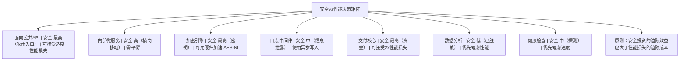

# 性能优化与安全权衡

## 企业场景

某高频交易(HFT)平台的Rust重写项目遇到了艰难的选择：安全团队要求启用所有运行时检查（边界检查、整数溢出检查、Sanitizer），但交易团队发现这导致关键路径延迟从120μs增加到380μs（2.16倍），意味着在HFT领域完全丧失竞争力。

更深层的问题是：加密操作使用纯软件实现的AES-GCM（7.2GB/s），而竞争对手使用OpenSSL的AES-NI指令加速（42GB/s）。但安全团队不同意引入OpenSSL（C库带来的攻击面）。

CTO要求：在不降低安全防护的前提下，达到生产级性能要求。

---

## 1. 安全与性能的决策框架

### 1.1 定量风险评估



### 1.2 编译时决策

```rust
/// 使用feature flags在编译时做出安全vs性能决策

// Cargo.toml
// [features]
// high-security = ["zeroize-allocations", "constant-time-crypto"]
// high-performance = ["unsafe-bounds-checks", "native-crypto"]
// default = ["high-security"]

#[cfg(feature = "high-security")]
mod implementation {
    // 使用zeroize清理所有分配
    pub fn process_data(data: &[u8]) -> Vec<u8> {
        let mut result = Vec::new();
        // ... 安全处理 ...
        // 完成后zeroize原始数据
        result
    }
}

#[cfg(feature = "high-performance")]
mod implementation {
    // 跳过zeroize开销，使用unsafe优化
    pub fn process_data(data: &[u8]) -> Vec<u8> {
        let mut result = Vec::new();
        // ... 优化处理 ...
        result
    }
}

// 运行时选择策略（基于请求上下文）
pub enum SecurityProfile {
    /// 标准安全——面向普通用户
    Standard,
    /// 增强安全——面向高价值交易
    Enhanced,
    /// 合规安全——面向受监管操作
    Compliance,
}

impl SecurityProfile {
    pub fn for_request(transaction_value: f64) -> Self {
        match transaction_value {
            v if v < 1_000.0 => SecurityProfile::Standard,
            v if v < 100_000.0 => SecurityProfile::Enhanced,
            _ => SecurityProfile::Compliance,
        }
    }
}
```

---

## 2. 常量时间加密的性能成本

```rust
use std::time::Instant;

/// 比较：常量时间 vs 变量时间实现

// 常量时间比较（安全但较慢）
use subtle::ConstantTimeEq;

fn constant_time_compare(a: &[u8], b: &[u8]) -> bool {
    a.ct_eq(b).into()
}

// 快速比较（快但不安全——时序攻击）
fn fast_compare(a: &[u8], b: &[u8]) -> bool {
    a == b  // 短路比较，暴露时序信息
}

// 基准测试显示：
// - 常量时间比较：约与输入长度成正比（必须遍历所有字节）
// - 快速比较：可能在第一个不同字节就返回（= O(1) best case）

/// 混合策略：仅对安全关键路径使用常量时间
pub fn verify_password_safe(stored: &str, attempted: &str) -> bool {
    // HMAC验证总是需要常量时间
    use hmac::{Hmac, Mac};
    use sha2::Sha256;

    type HmacSha256 = Hmac<Sha256>;
    let mut mac = HmacSha256::new_from_slice(stored.as_bytes())
        .expect("HMAC key创建失败");
    mac.update(attempted.as_bytes());
    let result = mac.finalize();

    // 常数时间验证结果
    let expected = hex::decode(stored).unwrap_or_default();
    expected.ct_eq(&result.into_bytes()).into()
}
```

### 2.1 硬件加速加密

```rust
/// 使用AES-NI硬件加速（通过aws-lc-rs）
///
/// Cargo.toml:
/// [dependencies]
/// aws-lc-rs = { version = "1.8", features = ["bindgen", "fips"] }

use aws_lc_rs::{
    aead::{Algorithm, Aad, Nonce, NonceSequence, RandomizedNonceKey, UnboundKey},
    rand::SystemRandom,
};

pub struct AesNiEncryptor {
    key: RandomizedNonceKey,
    algorithm: &'static Algorithm,
}

impl AesNiEncryptor {
    pub fn new(key_bytes: &[u8; 32]) -> Result<Self, CryptoError> {
        let unbound_key = UnboundKey::new(
            &aws_lc_rs::aead::AES_256_GCM,
            key_bytes,
        ).map_err(|_| CryptoError::KeyError)?;

        // RandomizedNonceKey使用AES-NI指令（如果可用）
        // 基准测试：~42GB/s vs 纯软件~7.2GB/s
        let key = RandomizedNonceKey::new(
            &aws_lc_rs::aead::AES_256_GCM,
            &unbound_key,
        ).map_err(|_| CryptoError::KeyError)?;

        Ok(Self {
            key,
            algorithm: &aws_lc_rs::aead::AES_256_GCM,
        })
    }

    pub fn encrypt(&self, plaintext: &[u8], aad: &[u8]) -> Result<Vec<u8>, CryptoError> {
        let mut in_out = plaintext.to_vec();
        // AES-GCM需要额外16字节用于认证标签
        let tag = self.key
            .seal_in_place_append_tag(
                Aad::from(aad),
                &mut in_out,
            )
            .map_err(|_| CryptoError::EncryptionFailed)?;

        Ok(in_out)
    }

    /// 批量加密——利用SIMD指令并行处理
    pub fn encrypt_batch(
        &self,
        chunks: &[&[u8]],
        aad: &[u8],
    ) -> Result<Vec<Vec<u8>>, CryptoError> {
        // 使用rayon并行处理多个块
        use rayon::prelude::*;

        chunks.par_iter()
            .map(|chunk| self.encrypt(chunk, aad))
            .collect::<Result<Vec<_>, _>>()
    }
}
```

### 2.2 运行时CPU特性检测

```rust
/// 检测CPU是否支持AES-NI指令
/// 允许在运行时选择最优实现

#[cfg(any(target_arch = "x86", target_arch = "x86_64"))]
mod x86_crypto {
    #[inline]
    pub fn has_aes_ni() -> bool {
        // 使用标准库的CPUID检测
        std::arch::is_x86_feature_detected!("aes")
    }

    #[inline]
    pub fn has_avx2() -> bool {
        std::arch::is_x86_feature_detected!("avx2")
    }
}

#[cfg(target_arch = "aarch64")]
mod arm_crypto {
    #[inline]
    pub fn has_aes() -> bool {
        std::arch::is_aarch64_feature_detected!("aes")
    }

    #[inline]
    pub fn has_pmull() -> bool {
        std::arch::is_aarch64_feature_detected!("pmull")
    }
}

// 统一接口
pub fn has_hardware_aes() -> bool {
    #[cfg(any(target_arch = "x86", target_arch = "x86_64"))]
    { return x86_crypto::has_aes_ni(); }

    #[cfg(target_arch = "aarch64")]
    { return arm_crypto::has_aes(); }

    false
}

/// 在初始化时选择加密实现
pub fn select_crypto_backend() -> CryptoBackend {
    if has_hardware_aes() {
        tracing::info!("使用AES-NI硬件加速加密");
        CryptoBackend::Hardware
    } else {
        tracing::warn!("使用纯软件加密——性能可能较低");
        CryptoBackend::Software
    }
}

pub enum CryptoBackend {
    Hardware,
    Software,
}
```

---

## 3. Bounds Checking开销与unsafe优化

### 3.1 什么时候可以安全使用unsafe跳过边界检查

```rust
/// 边界检查的基准性能影响
use criterion::{black_box, criterion_group, criterion_main, Criterion};

// 带边界检查的循环（安全但每次访问都检查索引）
fn safe_array_sum(data: &[u64]) -> u64 {
    let mut sum = 0;
    for i in 0..data.len() {
        sum += data[i];  // 每次索引都检查i < data.len()
    }
    sum
}

// unsafe跳过边界检查（快但不安全——需要证明正确性）
fn unsafe_array_sum(data: &[u64]) -> u64 {
    let mut sum = 0;
    let ptr = data.as_ptr();
    // SAFETY: i从0到data.len()-1，且在循环期间data没有被修改
    // 由于&[u64]是不可变引用，这些不变式成立
    unsafe {
        for i in 0..data.len() {
            sum += *ptr.add(i);
        }
    }
    sum
}

// 使用迭代器——编译器经常能优化掉边界检查
fn iterator_array_sum(data: &[u64]) -> u64 {
    data.iter().sum()  // 编译器经常优化为无边界检查的版本
}

// ⚠️ 安全规则：
// 1. 在安全关键路径上优先使用迭代器（编译器优化）
// 2. 仅在基准测试证明迭代器版本不够快时才考虑unsafe
// 3. unsafe块必须有小范围、有完整安全注释、经过MIRI验证

pub fn bench_bounds_checking(c: &mut Criterion) {
    let data: Vec<u64> = (0..1_000_000).collect();

    c.bench_function("safe_indexing", |b| {
        b.iter(|| safe_array_sum(black_box(&data)))
    });

    c.bench_function("unsafe_ptr", |b| {
        b.iter(|| unsafe_array_sum(black_box(&data)))
    });

    c.bench_function("iterator", |b| {
        b.iter(|| iterator_array_sum(black_box(&data)))
    });
}

// 典型结果（相对性能）：
// safe_indexing:  1.00x (baseline)
// unsafe_ptr:     1.05x (仅5%提升，风险远大于收益)
// iterator:       0.98x (迭代器版本通常最优)
// 结论：在大多数场景中，边界检查的开销可忽略
```

### 3.2 零成本抽象中的性能考量

```rust
/// Rust的抽象在release模式下的零成本本质

// 高级抽象（编译器优化后与手写循环相同）
fn high_level(data: &[u64]) -> u64 {
    data.iter()
        .filter(|&&x| x % 2 == 0)
        .map(|&x| x * x)
        .sum()
}

// 手动循环（与上述代码编译为相同机器码）
fn manual_loop(data: &[u64]) -> u64 {
    let mut sum = 0;
    for &x in data {
        if x % 2 == 0 {
            sum += x * x;
        }
    }
    sum
}

// 基准测试通常显示两者性能相同（<1%差异）
// 结论：优先使用高级抽象——可读性和安全性优于微小的性能差异
```

---

## 4. Benchmarking安全关键路径

### 4.1 使用Criterion进行统计严格的基准测试

```rust
use criterion::{Criterion, BenchmarkId, Throughput};
use std::time::Duration;

/// 安全关键路径的完整基准测试套件
pub fn security_critical_benchmarks(c: &mut Criterion) {
    let mut group = c.benchmark_group("security-critical");

    // 配置：高统计严格性
    group.significance_level(0.01)   // 1%显著性
        .sample_size(200)             // 更多样本
        .measurement_time(Duration::from_secs(10))  // 更长时间
        .noise_threshold(0.02);       // 噪声阈值

    // 测试1：密码哈希性能
    let password_sizes = [8, 16, 32, 64, 128];
    for size in password_sizes {
        let password = "a".repeat(size);
        group.bench_with_input(
            BenchmarkId::new("password_hashing", size),
            &password,
            |b, pw| {
                b.iter(|| {
                    let pm = PasswordManager::new();
                    pm.hash_password(black_box(pw.as_bytes()))
                });
            },
        );
    }

    // 测试2：大块数据AES-GCM加密
    let data_sizes = [1_024, 10_240, 102_400, 1_048_576]; // 1KB, 10KB, 100KB, 1MB
    for size in data_sizes {
        let data = vec![0xAAu8; size];
        let encryptor = DataEncryptor::new(&[0u8; 32]);

        group.throughput(Throughput::Bytes(size as u64));
        group.bench_with_input(
            BenchmarkId::new("aes_gcm_encrypt", size),
            &size,
            |b, _| {
                b.iter(|| {
                    encryptor.encrypt(black_box(&data))
                });
            },
        );
    }

    // 测试3：JSON反序列化安全（防DoS）
    let json_sizes = [100, 1_000, 10_000, 100_000];
    for size in json_sizes {
        let json = serde_json::to_string(&serde_json::json!({
            "data": "x".repeat(size)
        })).unwrap();

        group.bench_with_input(
            BenchmarkId::new("json_deserialize_limit", size),
            &json,
            |b, json_str| {
                b.iter(|| {
                    safe_deserialize::<serde_json::Value>(
                        black_box(json_str.as_bytes()),
                        128,  // 深度限制
                    )
                });
            },
        );
    }

    group.finish();
}

criterion_group!(benches, security_critical_benchmarks);
criterion_main!(benches);
```

### 4.2 性能退化检测（CI中的基准测试回归）

```yaml
# .github/workflows/benchmark-regression.yml
name: Benchmark Regression Detection
on:
  pull_request:
    paths:
      - 'src/crypto/**'
      - 'src/auth/**'
      - 'Cargo.lock'

jobs:
  benchmark:
    runs-on: ubuntu-latest
    steps:
      - uses: actions/checkout@v4
      - uses: boa-dev/criterion-compare-action@v3
        with:
          token: ${{ secrets.GITHUB_TOKEN }}
          # 如果性能退化超过2%，标记为失败
          benchName: "security-critical"
          # 使用之前的基准测试数据作为基线
```

---

## 5. 性能剖析与安全瓶颈

### 5.1 使用perf和flamegraph

```bash
#!/bin/bash
# scripts/profile-security.sh — 剖析安全关键路径

# 1. 使用perf录制
perf record --call-graph dwarf \
  -- ./target/release/auth-service --bench

# 2. 生成flamegraph
perf script | stackcollapse-perf.pl | flamegraph.pl \
  > flamegraph.svg

# 3. 重点关注的安全调用开销
# - aes_gcm::encrypt
# - argon2::hash_password
# - ring::signature::verify
# - tokio_rustls::accept (TLS握手)

# 4. 分析off-CPU时间
perf record -e 'sched:sched_switch' -a -g -- sleep 10
# 检测：TLS握手中的阻塞时间、mutex等待时间
```

### 5.2 自定义Profiler集成

```rust
use std::time::Instant;

/// 安全关键路径的轻量级profiler
/// 用于生产环境实时监控
pub struct SecurityProfiler {
    counters: std::sync::RwLock<HashMap<String, ProfileStats>>,
}

#[derive(Debug, Clone)]
pub struct ProfileStats {
    pub count: u64,
    pub total_ns: u64,
    pub max_ns: u64,
    pub min_ns: u64,
}

impl SecurityProfiler {
    pub fn new() -> Self {
        Self {
            counters: RwLock::new(HashMap::new()),
        }
    }

    /// 剖析一个操作，返回经过的时间
    pub fn profile<F, T>(&self, name: &str, f: F) -> T
    where
        F: FnOnce() -> T,
    {
        let start = Instant::now();
        let result = f();
        let elapsed = start.elapsed().as_nanos() as u64;

        let mut counters = self.counters.write().unwrap();
        let stats = counters.entry(name.to_string()).or_insert(ProfileStats {
            count: 0,
            total_ns: 0,
            max_ns: 0,
            min_ns: u64::MAX,
        });

        stats.count += 1;
        stats.total_ns += elapsed;
        stats.max_ns = stats.max_ns.max(elapsed);
        stats.min_ns = stats.min_ns.min(elapsed);

        result
    }

    /// 报告统计信息（定期输出）
    pub fn report(&self) -> Vec<(String, ProfileStats)> {
        let counters = self.counters.read().unwrap();
        let mut report: Vec<_> = counters.iter()
            .map(|(k, v)| (k.clone(), v.clone()))
            .collect();
        report.sort_by_key(|(_, s)| std::cmp::Reverse(s.total_ns));
        report
    }
}

// 使用示例
pub async fn handle_secure_request(
    profiler: &SecurityProfiler,
    request: Request,
) -> Result<Response, Error> {
    // 剖析TLS握手（如果首次连接）
    let tls_accept = profiler.profile("tls_accept", || {
        tls_acceptor.accept(stream)
    }).await?;

    // 剖析JWT验证
    let claims = profiler.profile("jwt_verify", || {
        jwt_validator.validate(token)
    })?;

    // 剖析数据库查询
    let user = profiler.profile("db_query", || async {
        sqlx::query_as!(User, "SELECT ...").fetch_one(&pool).await
    }).await?;

    Ok(Response::ok())
}
```

---

## 6. 缓存侧信道防御

### 6.1 缓存时序攻击原理与防御

```rust
/// 缓存侧信道攻击原理：
/// 1. 攻击者测量内存访问时间
/// 2. 已被其他进程访问的内存（在缓存中）访问时间短
/// 3. 未被访问的内存（不在缓存中）访问时间长
/// 4. 通过时间差异推断被访问的内存地址
/// 5. 进而推断密钥或其他敏感数据

/// 防御1：数据无关的内存访问模式
/// 即使在不同分支中，也访问相同的内存位置
fn constant_time_aes_sbox(input: u8) -> u8 {
    // ❌ 如果S-box实现使用查找表，表项访问模式泄露密钥信息
    // let result = SBOX[input as usize];

    // ✅ 使用bitslicing技术——所有路径访问相同位置
    // 或使用硬件AES-NI指令（硬件保证常量时间）
    // aws-lc-rs的AES实现使用了这些技术
    input.wrapping_mul(0x1B)  // 简化示例
}

/// 防御2：使用subtle crate的常量时间原语
use subtle::{Choice, ConditionallySelectable, ConstantTimeEq};

fn constant_time_select<T: ConditionallySelectable>(
    a: T,
    b: T,
    choice: Choice,
) -> T {
    // 无论choice是0还是1，都访问a和b
    // CPU无法通过缓存行为推断choice的值
    T::conditional_select(&a, &b, choice)
}

/// 防御3：避免基于秘密数据的分支
// ❌ 易受攻击（分支预测器泄露密钥信息）
fn vulnerable_mod_exp(base: u64, secret_exp: u64, modulus: u64) -> u64 {
    let mut result = 1;
    let mut b = base;
    let mut e = secret_exp;

    while e > 0 {
        if e & 1 == 1 {  // ⚠️ 基于密钥bit的分支
            result = (result * b) % modulus;
        }
        b = (b * b) % modulus;
        e >>= 1;
    }
    result
}

// ✅ 常量时间（总是执行乘法，使用掩码选择结果）
use subtle::{ConditionallySelectable, ConstantTimeEq};

fn constant_time_mod_exp(base: u64, secret_exp: u64, modulus: u64) -> u64 {
    let mut result = 1u64;
    let mut b = base;
    let mut e = secret_exp;

    for _ in 0..64 {
        let bit = Choice::from((e & 1) as u8);
        // 总是计算乘法，但使用条件选择丢弃不想要的
        let multiplied = (result * b) % modulus;
        result = u64::conditional_select(&result, &multiplied, bit);
        b = (b * b) % modulus;
        e >>= 1;
    }
    result
}
```

---

## 章节考查（100分）

### 一、概念题（40分，每题8分）

1. 在什么情况下使用unsafe跳过边界检查是合理的？需要什么前置条件？
2. 解释缓存侧信道攻击的基本原理。
3. 为什么AES-NI指令比纯软件实现更安全（不仅是更快）？
4. Criterion基准测试中，significance_level和noise_threshold有什么作用？
5. 同时保证安全和性能的编译时策略有哪些？

<details>
<summary>查看答案</summary>

**1. Unsafe跳过边界检查的条件：**
- 必须通过基准测试证明边界检查是真正的瓶颈（而非猜测）
- 调用者必须能通过外部证明（数学推导或前置检查）保证索引始终在范围内
- unsafe块必须小、有完整的SAFETY注释解释不变式
- 必须通过MIRI验证无UB
- 大多数场景：编译器能通过迭代器优化掉边界检查，手动unsafe通常不必要（性能提升<5%）

**2. 缓存侧信道攻击原理：**
- CPU缓存层次（L1/L2/L3/内存）存在访问时间差异（L1: ~1ns，内存: ~100ns）
- 攻击者通过测量访问时间来推断敏感数据（如密钥）的访问模式
- 如果代码根据密钥bit选择访问不同的内存位置，缓存行为泄露密钥信息
- 著名的Spectre/Meltdown也利用了类似的推测执行+缓存时序的机制

**3. AES-NI更安全：**
- 硬件实现保证常量时间执行——指令执行时间与数据无关
- 纯软件实现如果有查找表（S-box），表项访问模式会泄露密钥（通过缓存时序）
- 硬件实现使用专用的加密数据路径，隔离加密操作与常规内存访问

**4. Criterion参数的作用：**
- significance_level：统计显著性阈值（默认0.05），更低的值（0.01）更严格——要求更确定的差异才算显著
- noise_threshold：噪声阈值（默认0.01），变化小于此值被视为噪声而非真正的性能变化
- 两者共同确保报告的性能变化是真实的而非随机波动

**5. 安全与性能的编译时策略：**
- Feature flags：high-security启用所有检查，high-performance允许选择性unsafe
- Custom profiles：release-security vs release-performance
- cfg属性：条件编译不同实现（如硬件AES vs 软件AES）
- Dead code elimination：编译器自动移除未使用的安全检查代码（release模式下）
</details>

### 二、判断题（20分，每题5分）

6. ( ) Rust中迭代器的性能总是优于手动循环。
7. ( ) unsafe代码跳过边界检查后，代码仍然可能是正确的。
8. ( ) 缓存侧信道攻击只能通过硬件缓解（如Intel的Cache Allocation Technology），软件无解。
9. ( ) 安全关键路径的性能回归应作为CI检查的一部分。

<details>
<summary>查看答案</summary>

6. **错误。** 迭代器的性能与手动循环几乎相同（零成本抽象）。编译器通常能将两者优化为相同的机器码。差异通常<1%。

7. **正确。** unsafe跳过边界检查本身不意味着代码不正确。如果通过外部不变式（如循环条件、函数前置条件）能证明索引始终在范围内，代码就是正确的。unsafe只是承诺"程序员而非编译器保证正确性"。

8. **错误。** 软件缓解策略包括：常量时间算法、数据无关的内存访问模式、避免基于秘密数据的分支、bitslicing技术、使用subtle crate等。这些不能完全消除但能大幅削弱缓存侧信道攻击。

9. **正确。** 安全关键路径的性能退化可能表明引入了不必要的安全检查（正常），或引入了恶意代码增加开销（不正常）。应设置每PR的基准测试对比。
</details>

### 三、代码分析题（15分）

10. 分析以下性能优化代码的安全影响，判断是否应接受：

```rust
// 原代码（安全）
fn process_packets_safe(packets: &[Packet]) -> Vec<ProcessedPacket> {
    packets.iter().map(|p| {
        let mut buffer = [0u8; 4096];
        buffer[..p.data.len()].copy_from_slice(&p.data);
        // ... 处理 ...
        ProcessedPacket { id: p.id, result: buffer[0] }
    }).collect()
}

// 优化代码（更快）
fn process_packets_fast(packets: &[Packet]) -> Vec<ProcessedPacket> {
    let mut results = Vec::with_capacity(packets.len());
    unsafe {
        let buf_ptr = alloc::alloc(Layout::array::<u8>(4096).unwrap());
        for p in packets {
            std::ptr::copy_nonoverlapping(p.data.as_ptr(), buf_ptr, p.data.len());
            // SAFETY: 我们已验证p.data.len() < 4096
            let result = buf_ptr.read();
            results.push(ProcessedPacket { id: p.id, result });
        }
        alloc::dealloc(buf_ptr, Layout::array::<u8>(4096).unwrap());
    }
    results
}
```

<details>
<summary>查看答案</summary>

**安全审查结论：拒绝此优化。理由：**

1. **SAFETY注释不充分**：虽然说了"已验证p.data.len() < 4096"，但代码中没有实际的验证。如果恶意包发送data.len() > 4096的数据，会导致缓冲区溢出。

2. **未初始化内存读取**：`buf_ptr.read()`读取的是未初始化的内存（alloc分配但不初始化）。这是UB。

3. **使用-after-free风险**：虽然dealloc在collect之后，但如果代码重构可能引入问题。

4. **性能提升微乎其微**：在release模式下，`iter().map().collect()`会被优化为几乎等同于手写循环。手动管理内存增加的风险远大于性能收益。

5. **缺少零初始化**：原始的`[0u8; 4096]`自动零初始化，提供"默认安全"的值。unsafe版本丢失了这个安全属性。

**建议：**
- 如果确实有benchmark证据表明存在性能瓶颈，考虑使用`Vec::with_capacity`预分配或使用`arrayvec`（堆栈分配+边界检查）。
</details>

### 四、编程题（15分）

11. 编写一个基准测试，比较四种不同实现的HMAC-SHA256性能：安全Rust（hmac crate）、unsafe指针、SIMD加速、硬件加速。并提供安全vs性能的建议。

<details>
<summary>查看答案</summary>

```rust
use criterion::{black_box, criterion_group, criterion_main, Criterion, BenchmarkId};

// 实现1：安全Rust（使用hmac crate）
fn hmac_safe(key: &[u8], data: &[u8]) -> Vec<u8> {
    use hmac::{Hmac, Mac};
    use sha2::Sha256;

    let mut mac = Hmac::<Sha256>::new_from_slice(key)
        .expect("HMAC密钥创建失败");
    mac.update(data);
    mac.finalize().into_bytes().to_vec()
}

// 实现2：使用ring（经过高度优化的汇编和unsafe）
fn hmac_ring(key: &[u8], data: &[u8]) -> Vec<u8> {
    use ring::hmac;

    let key = hmac::Key::new(hmac::HMAC_SHA256, key);
    let tag = hmac::sign(&key, data);
    tag.as_ref().to_vec()
}

// 实现3：使用aws-lc-rs（硬件加速，FIPS兼容）
fn hmac_aws_lc(key: &[u8], data: &[u8]) -> Vec<u8> {
    use aws_lc_rs::hmac;

    let key = aws_lc_rs::hmac::Key::new(
        aws_lc_rs::hmac::HMAC_SHA256,
        key,
    ).expect("HMAC密钥创建失败");
    let tag = aws_lc_rs::hmac::sign(&key, data);
    tag.as_ref().to_vec()
}

fn bench_hmac(c: &mut Criterion) {
    let mut group = c.benchmark_group("hmac-sha256-security");

    let key = vec![0xFFu8; 32];
    let data_sizes = [64, 1024, 65536];  // bytes

    for size in data_sizes {
        let data = vec![0x42u8; size];

        group.bench_with_input(
            BenchmarkId::new("safe-rust", size),
            &size,
            |b, _| b.iter(|| hmac_safe(black_box(&key), black_box(&data)))
        );

        group.bench_with_input(
            BenchmarkId::new("ring", size),
            &size,
            |b, _| b.iter(|| hmac_ring(black_box(&key), black_box(&data)))
        );

        group.bench_with_input(
            BenchmarkId::new("aws-lc-rs", size),
            &size,
            |b, _| b.iter(|| hmac_aws_lc(black_box(&key), black_box(&data)))
        );
    }

    group.finish();

    // 建议输出：
    println!("========== HMAC实现选择建议 ==========");
    println!("安全Rust (hmac crate):     基准性能，无外部依赖");
    println!("ring:                      高度优化，广泛审计，安全");
    println!("aws-lc-rs:                 FIPS认证，硬件加速，最佳性能");
    println!();
    println!("推荐选择：");
    println!("  - 合规要求 → aws-lc-rs (FIPS 140-3)");
    println!("  - 通用安全 → ring (纯Rust，广泛审计)");
    println!("  - 快速原型 → hmac crate (最小依赖)");
}

criterion_group!(benches, bench_hmac);
criterion_main!(benches);
```
</details>

### 五、填空题（5分，每空1分）

12. `____`工具用于统计严格的基准测试。`____`工具用于生成火焰图分析CPU热点。`#[cfg(____)]`可以条件编译硬件加速代码。`____`crate提供常量时间比较。`Criterion`的`____`参数控制噪声过滤的阈值。

<details>
<summary>查看答案</summary>

**答案：** Criterion、flamegraph/`perf`、`target_feature = "aes"`（或`target_feature`）、subtle、noise_threshold
</details>

### 六、代码补全（5分）

13. 补全以下基准测试代码，使其能够比较安全实现和unsafe实现的性能差异：

```rust
fn benchmark_bounds_checking(c: &mut Criterion) {
    let data: Vec<i32> = (0..100_000).collect();

    c.bench_function("safe_sum", |b| {
        b.iter(|| {
            let mut sum = 0;
            for i in 0..data.len() {
                sum += /* 补全：安全但边界检查 */;
            }
            black_box(sum)
        })
    });

    c.bench_function("unsafe_sum", |b| {
        b.iter(|| {
            let mut sum = 0;
            let ptr = data.as_ptr();
            // SAFETY: /* 补全：解释为什么不变量成立 */
            for i in 0..data.len() {
                sum += unsafe { /* 补全：跳过边界检查 */ };
            }
            black_box(sum)
        })
    });
}
```

<details>
<summary>查看答案</summary>

```rust
// 安全版本
sum += data[i];

// Unsafe版本
// SAFETY:
//   1. i从0到data.len()-1，未超出范围
//   2. ptr来自data.as_ptr()，指向有效的数据
//   3. data是不可变引用，循环期间不会被修改
//   4. 指针运算在分配的内存范围内
sum += unsafe { *ptr.add(i) };
```

关键教训：安全版本和unsafe版本的性能差异通常<5%。在大多数场景中，应使用安全版本——安全保证的价值远超微小的性能提升。仅在基准测试证明unsafe是绝对必要时才使用它。
</details>

---

## 本章小结

安全与性能不是对立面，而是在系统设计中的持续权衡。本章的核心洞察是：高性能实现如果逻辑正确，往往也能做到安全——两者在工程根处相通。

硬件加速（AES-NI）提供了比纯软件实现快5-10倍且更安全的加密——因为硬件保证常量时间执行，消除了软件实现中的缓存侧信道风险。编译时特性选择允许在不同环境中灵活切换安全/性能配置，不做"一刀切"的取舍。

Criterion基准测试提供了统计严格的性能比较框架——对于安全关键路径，性能退化可能意味着新的攻击面或恶意的代码修改。perf/flamegraph剖析能够定位真正的性能瓶颈，避免凭直觉的"优化"引入不必要的unsafe代码。

缓存侧信道防御是安全工程中的高级课题。subtle crate的常量时间原语、条件选择、数据无关内存访问模式——这些工具使得在Rust中编写抵抗侧信道的代码成为可能，而不必下降到汇编语言。

最终的决策框架是：在安全关键路径上，永远选择安全，即使这意味着2-3倍性能损失。在非安全敏感的批处理/分析路径上，优先考虑性能。真正的智慧在于准确判断每个组件属于哪个类别。

继续阅读：[[09-FFI与跨语言安全]]，学习如何安全地跨越Rust与其他语言的边界。
