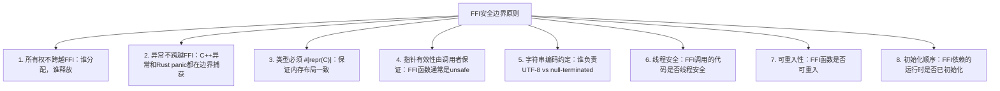

# FFI与跨语言安全

## 企业场景

某金融机构的遗留C++交易引擎已运行15年，代码库约50万行。管理层决定用Rust逐步重写关键模块，但不可能一次性替换所有C++代码。他们采用了"绞杀者模式"：新功能用Rust实现，通过FFI调用剩余C++模块。

然而，在集成的第一周就发生严重事故：
1. Rust通过FFI传递的字符串在C++侧被`free()`而非Rust的`dealloc`释放 → 双重释放崩溃
2. C++异常穿透FFI边界进入Rust → 未定义行为
3. C++代码持有的Rust对象的引用在Rust侧被drop → Use-After-Free

本章深入探讨Rust FFI的安全实践和这些问题的解决方案。

---

## 1. FFI安全基础：安全边界设计

### 1.1 FFI安全原则



### 1.2 安全封装模式

```rust
/// FFI安全封装的基本模式
/// 将unsafe的FFI调用包装在安全的Rust API中

mod ffi {
    use std::ffi::{CStr, CString};
    use std::os::raw::c_char;

    // 1. 声明外部C函数
    extern "C" {
        // C库函数：计算SHA256
        fn compute_sha256(data: *const u8, len: usize, output: *mut u8) -> i32;
        // 释放C分配的内存
        fn free_c_buffer(ptr: *mut u8);
    }

    // 2. 安全的Rust包装
    pub fn safe_compute_sha256(data: &[u8]) -> Result<[u8; 32], Sha256Error> {
        if data.is_empty() {
            return Err(Sha256Error::EmptyInput);
        }

        let mut output = [0u8; 32];

        // SAFETY:
        // - data.as_ptr()指向有效内存，长度为data.len()
        // - output.as_mut_ptr()指向有效的32字节缓冲区
        // - C函数承诺不修改输入数据（只读）
        // - C函数写入恰好32字节到output
        let ret = unsafe {
            compute_sha256(
                data.as_ptr(),
                data.len(),
                output.as_mut_ptr(),
            )
        };

        if ret != 0 {
            return Err(Sha256Error::ComputationFailed(ret));
        }

        Ok(output)
    }

    #[derive(Debug, thiserror::Error)]
    pub enum Sha256Error {
        #[error("空输入")]
        EmptyInput,
        #[error("计算失败: 错误码 {0}")]
        ComputationFailed(i32),
    }
}

// 使用安全的API（无需unsafe标记）
fn use_safe_api() -> Result<(), Sha256Error> {
    let hash = ffi::safe_compute_sha256(b"hello world")?;
    println!("SHA256: {:?}", hash);
    Ok(())
}
```

---

## 2. 调用C代码：bindgen与手动FFI

### 2.1 bindgen自动生成绑定

```rust
// build.rs — 使用bindgen从C头文件生成Rust绑定
fn main() {
    // 告诉cargo在头文件改变时重新运行
    println!("cargo:rerun-if-changed=include/trading_engine.h");

    let bindings = bindgen::Builder::default()
        .header("include/trading_engine.h")
        // 仅生成需要使用的函数
        .allowlist_function("trade_execute")
        .allowlist_function("trade_cancel")
        .allowlist_type("TradeOrder")
        .allowlist_type("TradeResult")
        // 设置类型映射
        .size_t_is_usize(true)
        // 生成PartialEq以便测试
        .derive_partialeq(true)
        .derive_debug(true)
        // 阻止生成layout测试（在某些平台有问题）
        .layout_tests(false)
        // 添加安全注释模板
        .generate_comments(true)
        .parse_callbacks(Box::new(bindgen::CargoCallbacks::new()))
        .generate()
        .expect("无法生成绑定");

    bindings
        .write_to_file("src/ffi/trading_engine_bindings.rs")
        .expect("无法写入绑定文件");
}

// C头文件示例: include/trading_engine.h
// typedef struct {
//     uint64_t order_id;
//     char symbol[16];
//     double price;
//     double quantity;
//     int32_t side;  // 0=buy, 1=sell
// } TradeOrder;
//
// typedef struct {
//     uint64_t order_id;
//     int32_t status;  // 0=success, 1=rejected
//     char error_message[256];
// } TradeResult;
//
// TradeResult* trade_execute(const TradeOrder* order);
// void trade_result_free(TradeResult* result);
```

### 2.2 安全的Rust包装层

```rust
// src/ffi/trading_engine.rs
// 在自动生成的原始绑定之上构建安全抽象

use std::ffi::{CStr, CString};
use std::fmt;

// 安全枚举（而非C的int32）
#[derive(Debug, Clone, Copy, PartialEq)]
pub enum OrderSide {
    Buy,
    Sell,
}

// 安全的订单结构（而非C的裸struct）
pub struct Order {
    pub order_id: u64,
    pub symbol: String,     // 所有权属于Rust
    pub price: f64,
    pub quantity: f64,
    pub side: OrderSide,
}

// 安全的交易结果
pub struct TradeOutcome {
    pub order_id: u64,
    pub status: TradeStatus,
    pub error_message: Option<String>,
}

#[derive(Debug, Clone, Copy, PartialEq)]
pub enum TradeStatus {
    Success,
    Rejected,
}

// 安全包装层
pub fn execute_trade(order: &Order) -> Result<TradeOutcome, TradingError> {
    // 验证输入（在FFI调用前，防止传递无效数据到C代码）
    validate_order(order)?;

    // 准备C兼容的结构
    let c_symbol = CString::new(order.symbol.as_str())
        .map_err(|_| TradingError::InvalidSymbol)?;

    let c_order = ffi_raw::TradeOrder {
        order_id: order.order_id,
        // ⚠️ CString.as_ptr()返回的指针在c_order存活期间有效
        // 但需要确保C代码不持有该指针超过此函数调用
        symbol: {
            let mut buf = [0i8; 16];
            let bytes = c_symbol.as_bytes_with_nul();
            let len = bytes.len().min(16);
            // SAFETY: buf.len() >= len，两个区域都不重叠
            unsafe {
                std::ptr::copy_nonoverlapping(
                    bytes.as_ptr() as *const i8,
                    buf.as_mut_ptr(),
                    len,
                );
            }
            buf
        },
        price: order.price,
        quantity: order.quantity,
        side: match order.side {
            OrderSide::Buy => 0,
            OrderSide::Sell => 1,
        },
    };

    // SAFETY:
    // - c_order的所有字段已正确初始化
    // - C函数不持有c_order的引用超过此调用
    // - C函数返回的TradeResult需要由我们的代码释放
    let c_result = unsafe {
        ffi_raw::trade_execute(&c_order as *const ffi_raw::TradeOrder)
    };

    if c_result.is_null() {
        return Err(TradingError::ExecutionFailed("空结果".to_string()));
    }

    // 读取C结果并立即释放
    let outcome = unsafe {
        let status = match (*c_result).status {
            0 => TradeStatus::Success,
            _ => TradeStatus::Rejected,
        };

        let error_message = if status == TradeStatus::Rejected {
            // SAFETY: C代码保证error_message是以null结尾的有效字符串
            let c_err = CStr::from_ptr((*c_result).error_message.as_ptr());
            c_err.to_str().ok().map(|s| s.to_string())
        } else {
            None
        };

        // 释放C分配的内存
        ffi_raw::trade_result_free(c_result);

        TradeOutcome {
            order_id: (*c_result).order_id,
            status,
            error_message,
        }
    };

    Ok(outcome)
}

fn validate_order(order: &Order) -> Result<(), TradingError> {
    if order.price <= 0.0 || order.price.is_nan() {
        return Err(TradingError::InvalidPrice(order.price));
    }
    if order.quantity <= 0.0 || order.quantity.is_nan() {
        return Err(TradingError::InvalidQuantity(order.quantity));
    }
    if order.symbol.is_empty() || order.symbol.len() > 15 {
        return Err(TradingError::InvalidSymbol);
    }
    // 检查symbol是否只包含允许的字符
    if !order.symbol.chars().all(|c| c.is_ascii_alphanumeric()) {
        return Err(TradingError::InvalidSymbol);
    }
    Ok(())
}

#[derive(Debug, thiserror::Error)]
pub enum TradingError {
    #[error("无效价格: {0}")]
    InvalidPrice(f64),
    #[error("无效数量: {0}")]
    InvalidQuantity(f64),
    #[error("无效交易对")]
    InvalidSymbol,
    #[error("执行失败: {0}")]
    ExecutionFailed(String),
}
```

---

## 3. 内存所有权跨越FFI

### 3.1 谁分配，谁释放

```rust
/// 所有权模式1：Rust分配，C使用(不持有)
pub fn rust_to_c_readonly(data: &[u8]) {
    // SAFETY: data在函数执行期间有效，C只读不持有
    unsafe {
        c_process_data(data.as_ptr(), data.len());
    }
    // data在此作用域结束自动释放（Rust所有权）
}

/// 所有权模式2：C分配，Rust释放
pub fn receive_c_allocated_data() -> Result<Vec<u8>, FfiError> {
    let mut data_ptr: *mut u8 = std::ptr::null_mut();
    let mut data_len: usize = 0;

    // C函数分配内存并设置指针
    unsafe {
        c_generate_data(&mut data_ptr, &mut data_len);
    }

    if data_ptr.is_null() || data_len == 0 {
        return Err(FfiError::NullData);
    }

    // ⚠️ 关键：将C分配的内存转换为Rust所有
    // 方法1：复制到Rust堆（安全但多一次复制）
    let owned_data = unsafe {
        let slice = std::slice::from_raw_parts(data_ptr, data_len);
        let vec = slice.to_vec();

        // 使用正确的C释放函数
        c_free_data(data_ptr);

        vec
    };

    Ok(owned_data)
}

/// 所有权模式3：Rust分配，传递给C，C接管所有权
pub fn transfer_ownership_to_c(data: Vec<u8>) {
    // 将Vec转换为C拥有的原始指针
    let ptr = data.as_ptr();
    let len = data.len();
    let capacity = data.capacity();

    // ⚠️ 阻止Rust的drop
    std::mem::forget(data);

    // SAFETY: ptr现在由C代码拥有
    // C代码必须调用我们导出的rust_free_vec来释放
    unsafe {
        c_take_ownership(ptr, len, capacity);
    }
}

// C代码应该调用的释放函数
#[no_mangle]
pub extern "C" fn rust_free_vec(ptr: *mut u8, len: usize, capacity: usize) {
    if ptr.is_null() {
        return;
    }
    // SAFETY: ptr最初由Vec分配，len和capacity正确
    unsafe {
        // 重新构造Vec然后drop它
        let _ = Vec::from_raw_parts(ptr, len, capacity);
        // Vec::drop在这里自动调用
    }
}

/// 所有权模式4：共享所有权（引用计数）
use std::sync::Arc;

pub struct SharedData {
    inner: std::sync::Mutex<Vec<u8>>,
}

// Rust分配Arc，将原始指针传给C
pub fn create_shared_data(data: Vec<u8>) -> *mut SharedData {
    let shared = Arc::new(SharedData {
        inner: std::sync::Mutex::new(data),
    });

    // 将Arc转换为原始指针——增加引用计数的手动控制
    let ptr = Arc::into_raw(shared) as *mut SharedData;

    // C代码持有此指针
    ptr
}

// C代码使用完后调用
#[no_mangle]
pub extern "C" fn shared_data_release(ptr: *mut SharedData) {
    if ptr.is_null() {
        return;
    }
    // SAFETY: ptr由Arc::into_raw创建
    unsafe {
        // 重建Arc然后释放它（减少引用计数）
        let _ = Arc::from_raw(ptr as *const SharedData);
    }
}
```

---

## 4. 异常安全跨越FFI

### 4.1 C++异常 → Rust边界

```rust
// C++侧的包装（extern "C"中间层）
// wrapper.cpp
//
// // C++可能抛出异常的实现
// void cpp_risky_operation(const char* input) {
//     if (!input) throw std::invalid_argument("null input");
//     // ... 可能抛出异常的操作 ...
// }
//
// // 安全的C包装（捕获所有C++异常）
// extern "C" int safe_cpp_risky_operation(const char* input, char** error_msg) {
//     try {
//         cpp_risky_operation(input);
//         return 0; // 成功
//     } catch (const std::exception& e) {
//         // 将C++异常信息复制到C字符串
//         *error_msg = strdup(e.what());
//         return -1; // 失败
//     } catch (...) {
//         *error_msg = strdup("未知C++异常");
//         return -2;
//     }
// }

// Rust侧调用
mod cpp_ffi {
    use std::ffi::{CStr, CString};
    use std::os::raw::c_char;

    extern "C" {
        fn safe_cpp_risky_operation(
            input: *const c_char,
            error_msg: *mut *mut c_char,
        ) -> i32;

        fn free_c_string(ptr: *mut c_char);
    }

    pub fn call_cpp_safely(input: &str) -> Result<(), String> {
        let c_input = CString::new(input)
            .expect("CString创建失败");

        let mut error_ptr: *mut c_char = std::ptr::null_mut();

        let ret = unsafe {
            safe_cpp_risky_operation(
                c_input.as_ptr(),
                &mut error_ptr as *mut *mut c_char,
            )
        };

        if ret != 0 {
            // 读取C++侧设置的错误信息
            let error_msg = if !error_ptr.is_null() {
                let msg = unsafe {
                    CStr::from_ptr(error_ptr)
                        .to_string_lossy()
                        .into_owned()
                };
                unsafe { free_c_string(error_ptr) };
                msg
            } else {
                format!("C++操作失败: 错误码 {}", ret)
            };
            return Err(error_msg);
        }

        Ok(())
    }
}
```

### 4.2 Rust Panic → C边界

```rust
// ⚠️ Rust panic跨越FFI边界 = 未定义行为
// extern "C"函数不能unwind

// ❌ 错误：直接导出的Rust函数可能panic
#[no_mangle]
pub extern "C" fn dangerous_rust_function(input: *const c_char) -> i32 {
    let s = unsafe { CStr::from_ptr(input) }
        .to_str()
        .unwrap();  // ⚠️ 如果UTF-8无效→panic→跨FFI→UB

    // ... 可能panic的其他操作 ...
    0
}

// ✅ 正确：使用catch_unwind保护FFI边界
#[no_mangle]
pub extern "C" fn safe_rust_function(
    input: *const c_char,
    error_msg: *mut *mut c_char,
) -> i32 {
    // 在闭包中执行所有Rust代码，捕获panic
    let result = std::panic::catch_unwind(std::panic::AssertUnwindSafe(|| {
        let s = unsafe { CStr::from_ptr(input) }
            .to_str()
            .map_err(|e| format!("无效UTF-8: {}", e))?;

        // 实际业务逻辑
        process_input(s)
    }));

    match result {
        Ok(Ok(value)) => value,
        Ok(Err(business_error)) => {
            // 业务错误——通过error_msg返回
            if !error_msg.is_null() {
                let c_msg = CString::new(business_error)
                    .unwrap_or_else(|_| CString::new("error").unwrap());
                unsafe {
                    *error_msg = c_msg.into_raw();
                }
            }
            -1
        }
        Err(panic_payload) => {
            // Rust panic——安全地捕获并报告
            let panic_msg = panic_payload
                .downcast_ref::<&str>()
                .map(|s| s.to_string())
                .or_else(|| {
                    panic_payload
                        .downcast_ref::<String>()
                        .cloned()
                })
                .unwrap_or_else(|| "未知Rust panic".to_string());

            if !error_msg.is_null() {
                let c_msg = CString::new(format!("Rust panic: {}", panic_msg))
                    .unwrap_or_else(|_| CString::new("rust panic").unwrap());
                unsafe {
                    *error_msg = c_msg.into_raw();
                }
            }
            -2  // 特殊错误码表示panic
        }
    }
}

/// 为C代码释放Rust分配的字符串
#[no_mangle]
pub extern "C" fn rust_free_string(ptr: *mut c_char) {
    if ptr.is_null() {
        return;
    }
    unsafe {
        let _ = CString::from_raw(ptr);
    }
}
```

---

## 5. 字符串跨越FFI

### 5.1 UTF-8 ↔ Null-terminated

```rust
/// 字符串跨越FFI的完整安全处理

// 方向1：C → Rust（Null-terminated → UTF-8 String）
pub fn c_str_to_rust(c_str: *const c_char) -> Result<String, StringError> {
    if c_str.is_null() {
        return Err(StringError::NullPointer);
    }

    // SAFETY: 调用者保证c_str是有效的null-terminated字符串
    let c_str = unsafe { CStr::from_ptr(c_str) };

    // 验证UTF-8
    match c_str.to_str() {
        Ok(s) => {
            // 检查长度限制
            if s.len() > 4096 {
                return Err(StringError::TooLong(s.len()));
            }
            // 检查是否包含null字节（已在CStr中处理）
            // 检查控制字符（取决于需求）
            if s.chars().any(|c| c.is_control() && c != '\n' && c != '\r' && c != '\t') {
                return Err(StringError::ContainsControlCharacters);
            }
            Ok(s.to_owned())
        }
        Err(e) => Err(StringError::InvalidUtf8(e)),
    }
}

// 方向2：Rust → C（UTF-8 String → Null-terminated）
pub fn rust_str_to_c(rust_str: &str) -> Result<CString, StringError> {
    if rust_str.contains('\0') {
        return Err(StringError::ContainsNullByte);
    }
    CString::new(rust_str)
        .map_err(|e| StringError::CStringError(e.to_string()))
}

// 方向3：Rust Vec<u8> → C缓冲区（不要求null终止）
pub fn rust_bytes_to_c_buffer(
    bytes: &[u8],
    c_buffer: *mut u8,
    buffer_size: usize,
) -> Result<usize, StringError> {
    if c_buffer.is_null() {
        return Err(StringError::NullPointer);
    }
    if bytes.len() > buffer_size {
        return Err(StringError::BufferTooSmall {
            needed: bytes.len(),
            available: buffer_size,
        });
    }

    // SAFETY: c_buffer有buffer_size字节的有效空间
    unsafe {
        std::ptr::copy_nonoverlapping(
            bytes.as_ptr(),
            c_buffer,
            bytes.len(),
        );
    }
    Ok(bytes.len())
}

#[derive(Debug, thiserror::Error)]
pub enum StringError {
    #[error("空指针")]
    NullPointer,
    #[error("字符串过长: {0}")]
    TooLong(usize),
    #[error("包含null字节")]
    ContainsNullByte,
    #[error("包含控制字符")]
    ContainsControlCharacters,
    #[error("无效UTF-8: {0}")]
    InvalidUtf8(std::str::Utf8Error),
    #[error("CString错误: {0}")]
    CStringError(String),
    #[error("缓冲区太小: 需要{needed}, 可用{available}")]
    BufferTooSmall { needed: usize, available: usize },
}
```

---

## 6. DLL/SO注入防范

```rust
/// DLL/SO注入是攻击者在运行时加载恶意代码的常见手段
/// Rust程序需要防范未授权的动态库加载

#[cfg(target_os = "linux")]
mod linux_injection_prevention {
    use std::fs;
    use std::os::unix::fs::PermissionsExt;

    /// 检查LD_PRELOAD（常见的注入向量）
    pub fn check_ld_preload() -> Vec<String> {
        let mut warnings = Vec::new();

        if let Ok(preload) = std::env::var("LD_PRELOAD") {
            warnings.push(format!(
                "⚠️ LD_PRELOAD已设置: {} —— 可能为library注入攻击",
                preload
            ));
        }

        Ok(warnings)
    }

    /// 验证已加载的共享库的完整性
    pub fn verify_loaded_libraries() -> Vec<String> {
        let mut violations = Vec::new();

        // 读取/proc/self/maps检查已加载的库
        if let Ok(maps) = fs::read_to_string("/proc/self/maps") {
            for line in maps.lines() {
                // 检测来自可疑路径的库
                let suspicious_paths = [
                    "/tmp/", "/dev/shm/", "/var/tmp/", "/home/", "/root/",
                ];

                for suspicious in &suspicious_paths {
                    if line.contains(suspicious) && line.ends_with(".so") {
                        violations.push(format!(
                            "可疑库加载: {}",
                            line.split_whitespace().last().unwrap_or(line)
                        ));
                    }
                }
            }
        }

        violations
    }

    /// 设置安全的库加载策略
    pub fn secure_dlopen() {
        // 在程序启动时尽早调用
        // 设置库搜索路径为仅系统路径
        unsafe {
            // Linux: 清除LD_LIBRARY_PATH
            // 使用setenv在代码中设置（而非依赖shell）
        }

        // 确保/etc/ld.so.preload不可写
        if let Ok(metadata) = fs::metadata("/etc/ld.so.preload") {
            let permissions = metadata.permissions();
            if permissions.mode() & 0o022 != 0 {
                // 文件对group/other可写——安全风险
                tracing::error!("ld.so.preload权限过于宽松");
            }
        }
    }
}

#[cfg(target_os = "windows")]
mod windows_injection_prevention {
    /// Windows DLL注入防范
    pub fn check_appinit_dlls() -> Vec<String> {
        // 检查AppInit_DLLs注册表键（常见注入点）
        let key_path = "SOFTWARE\\Microsoft\\Windows NT\\CurrentVersion\\Windows";
        // 使用winreg crate检查
        Vec::new()
    }
}

/// 安全启动时的注入检查
pub fn startup_injection_check() {
    let mut issues = Vec::new();

    #[cfg(target_os = "linux")]
    {
        issues.extend(linux_injection_prevention::check_ld_preload());
        issues.extend(linux_injection_prevention::verify_loaded_libraries());
    }

    #[cfg(target_os = "windows")]
    {
        issues.extend(windows_injection_prevention::check_appinit_dlls());
    }

    if !issues.is_empty() {
        for issue in &issues {
            tracing::warn!(
                security_event = true,
                event_type = "injection_detected",
                detail = issue,
            );
        }

        // 在安全关键环境中，检测到注入后立即abort
        if std::env::var("SECURE_MODE").unwrap_or_default() == "strict" {
            tracing::error!("严格模式：检测到潜在注入，aborting");
            std::process::abort();
        }
    }
}
```

---

## 章节考查（100分）

### 一、概念题（40分，每题8分）

1. FFI安全边界的核心原则有哪些？列举至少三个。
2. 为什么Rust panic不能跨越extern "C"函数边界？
3. 解释"谁分配，谁释放"原则在FFI中的重要性。
4. C++异常与Rust panic在FFI中的处理有什么区别？
5. DLL/SO注入的常见攻击向量有哪些？

<details>
<summary>查看答案</summary>

**1. FFI安全边界的核心原则：**
- 所有权不跨越FFI：分配者负责释放（Rust分配→Rust释放，C分配→C释放）
- 异常不跨越FFI：Rust panic和C++异常在语言边界被捕获转换
- 类型必须#[repr(C)]：确保FFI两侧对struct布局的理解一致
- 指针有效性由调用者保证：unsafe FFI调用依赖调用者维护前置条件
- 字符串编码约定明确：谁负责转换UTF-8↔null-terminated

**2. Panic不能跨越extern "C"：**
- Rust的panic使用unwind机制（栈展开），这依赖Rust特定的ABI
- C ABI没有unwind的概念——跨过extern "C"边界的unwind是未定义行为
- 解决方法：使用catch_unwind在FFI函数内部捕获panic，转换为错误码返回

**3. 谁分配谁释放的重要性：**
- 不同的分配器有不同的内部状态（jemalloc、mimalloc、系统malloc）
- Rust默认使用jemalloc而C使用系统malloc——用错误分配器的free是UB
- 跨语言的free可能导致堆损坏、double-free或use-after-free
- 解决方案：要么在同一侧分配和释放，要么导出专用的释放函数

**4. C++异常 vs Rust panic在FFI中的处理：**
- C++异常：需要在C wrapper中try-catch，转换为错误码+错误消息
- Rust panic：需要使用catch_unwind在extern "C"函数内捕获，转换为错误码
- 共同点：两者都不能跨越FFI边界，必须在进入对方的语言区域前捕获

**5. DLL/SO注入攻击向量：**
- LD_PRELOAD（Linux）：在程序启动前加载恶意共享库
- LD_LIBRARY_PATH：修改库搜索路径指向恶意版本
- /etc/ld.so.preload：全局预加载配置
- AppInit_DLLs（Windows）：注册表配置自动加载DLL
- SetWindowsHookEx：注入DLL到目标进程
- dlopen劫持：替换合法的动态库
</details>

### 二、判断题（20分，每题5分）

6. ( ) 使用#[repr(C)]标记的struct可以安全地在Rust和C之间传递，无需担心内存布局差异。
7. ( ) CString::from_raw可以接收任何*const c_char并将其转换为拥有的String。
8. ( ) 在extern "C"函数中使用?运算符传播错误是安全的。
9. ( ) bindgen生成的绑定可以直接在安全代码中使用。

<details>
<summary>查看答案</summary>

6. **错误。** #[repr(C)]确保内存布局与C兼容，但不保证安全性。struct中包含的指针可能无效、所有权语义不明、需要特定生命周期管理。#[repr(C)]解决的是ABI问题，不是安全问题。

7. **错误。** CString::from_raw只能接收由CString::into_raw产生的指针。随意传入C字符串指针会导致未定义行为（因为into_raw使用了特定的分配方式）。

8. **错误。** ?运算符在Err时可能触发unwind（如果之后还有代码），而unwind跨越extern "C"是UB。在extern "C"函数中必须手动处理错误或使用catch_unwind。

9. **错误。** bindgen生成的FFI函数声明（extern "C"块中的函数）本质上是unsafe的。bindgen只是自动化生成，这些函数仍然需要unsafe块调用，并需要安全注释解释前置条件。
</details>

### 三、代码分析题（15分）

10. 找出以下FFI代码中的所有安全问题并修正：

```rust
extern "C" {
    fn process_data(ptr: *const u8, len: i32) -> *mut u8;
    fn free_data(ptr: *mut u8);
}

pub fn safe_process(data: &str) -> String {
    let result = unsafe {
        let c_str = std::ffi::CString::new(data).unwrap();
        let ptr = process_data(c_str.as_ptr(), data.len() as i32);
        let result = std::ffi::CStr::from_ptr(ptr as *const i8)
            .to_str().unwrap().to_string();
        free_data(ptr);
        result
    };
    result
}
```

<details>
<summary>查看答案</summary>

**安全问题分析：**

1. **len类型错误**：`data.len() as i32`在有符号截断且len可能超过i32范围时丢失字节
2. **返回指针未检查**：`process_data`可能返回null，直接传给`CStr::from_ptr`是UB
3. **Unwrap导致panic**：`CString::new`在data含null字节时panic、`CStr.to_str()`在无效UTF-8时panic——可能跨越FFI
4. **c_str生命周期**：`c_str`在unsafe块结束时drop，但`process_data`可能持有`c_str.as_ptr()`——时序危险

**修正版本：**

```rust
pub fn safe_process_fixed(data: &str) -> Result<String, ProcessError> {
    if data.len() > i32::MAX as usize {
        return Err(ProcessError::InputTooLarge);
    }

    let c_str = std::ffi::CString::new(data)
        .map_err(|_| ProcessError::InvalidInput)?;

    unsafe {
        let ptr = process_data(c_str.as_ptr(), data.len() as i32);

        if ptr.is_null() {
            return Err(ProcessError::ProcessingFailed);
        }

        let result = std::ffi::CStr::from_ptr(ptr as *const i8)
            .to_str()
            .map_err(|_| ProcessError::InvalidOutput)?
            .to_string();

        free_data(ptr);
        Ok(result)
    }
}
```
</details>

### 四、编程题（15分）

11. 实现一个安全的Rust包装，封装C语言的OpenSSL变体libfoo_crypto（模拟），要求：
    - 库分配的内存通过Rust的包装层正确释放
    - 使用Newtype模式包装C指针
    - 实现Drop确保资源释放
    - 防止double-free

<details>
<summary>查看答案</summary>

```rust
use std::fmt;
use std::marker::PhantomData;
use std::ptr::NonNull;

// 模拟的C库
mod ffi {
    use std::os::raw::c_char;

    extern "C" {
        pub fn crypto_ctx_new() -> *mut CryptoContext;
        pub fn crypto_ctx_free(ctx: *mut CryptoContext);
        pub fn crypto_encrypt(
            ctx: *mut CryptoContext,
            plaintext: *const u8,
            plaintext_len: usize,
            ciphertext: *mut u8,
            ciphertext_len: *mut usize,
        ) -> i32;
        pub fn crypto_get_error(ctx: *mut CryptoContext) -> *const c_char;
    }

    #[repr(C)]
    pub struct CryptoContext {
        _private: [u8; 0],  // opaque类型——不对Rust暴露内部
    }
}

/// 安全的Rust包装——使用Newtype模式
pub struct CryptoContext {
    inner: NonNull<ffi::CryptoContext>,
}

// 不应实现Copy、Clone（所有权唯一）
// impl Copy for CryptoContext {}  // 故意不实现

impl CryptoContext {
    pub fn new() -> Result<Self, CryptoError> {
        let ptr = unsafe { ffi::crypto_ctx_new() };
        let inner = NonNull::new(ptr)
            .ok_or(CryptoError::AllocationFailed)?;
        Ok(Self { inner })
    }

    /// 加密数据
    pub fn encrypt(&self, plaintext: &[u8]) -> Result<Vec<u8>, CryptoError> {
        if plaintext.is_empty() {
            return Err(CryptoError::EmptyInput);
        }

        // 预估密文大小（AES-GCM: plaintext + 16 tag）
        let max_output = plaintext.len() + 32;
        let mut ciphertext = vec![0u8; max_output];
        let mut actual_len: usize = 0;

        let ret = unsafe {
            ffi::crypto_encrypt(
                self.inner.as_ptr(),
                plaintext.as_ptr(),
                plaintext.len(),
                ciphertext.as_mut_ptr(),
                &mut actual_len as *mut usize,
            )
        };

        if ret != 0 {
            let error_msg = unsafe {
                let c_err = ffi::crypto_get_error(self.inner.as_ptr());
                if c_err.is_null() {
                    "未知错误".to_string()
                } else {
                    std::ffi::CStr::from_ptr(c_err)
                        .to_string_lossy()
                        .into_owned()
                }
            };
            return Err(CryptoError::EncryptionFailed(error_msg));
        }

        ciphertext.truncate(actual_len);
        Ok(ciphertext)
    }
}

impl Drop for CryptoContext {
    fn drop(&mut self) {
        unsafe {
            ffi::crypto_ctx_free(self.inner.as_ptr());
        }
    }
}

// 安全：Send + Sync（取决于底层C库是否为线程安全）
// ⚠️ 这需要对C库的线程安全有确信的认知
unsafe impl Send for CryptoContext {}
unsafe impl Sync for CryptoContext {}

// 安全调试输出（不泄露内部状态）
impl fmt::Debug for CryptoContext {
    fn fmt(&self, f: &mut fmt::Formatter<'_>) -> fmt::Result {
        f.debug_struct("CryptoContext")
            .field("ptr", &self.inner.as_ptr())
            .finish()
    }
}

#[derive(Debug, thiserror::Error)]
pub enum CryptoError {
    #[error("内存分配失败")]
    AllocationFailed,
    #[error("空输入")]
    EmptyInput,
    #[error("加密失败: {0}")]
    EncryptionFailed(String),
}

#[test]
fn test_crypto_context() {
    let ctx = CryptoContext::new().unwrap();
    let plaintext = b"hello world";

    let encrypted = ctx.encrypt(plaintext).unwrap();
    assert!(!encrypted.is_empty());
    // ctx在此drop——自动调用crypto_ctx_free

    // 验证double-free不会发生（如果ctx实现了Copy就不会安全）
    // let ctx2 = ctx; // 这会有问题——所以不实现Copy
}
```
</details>

### 五、填空题（5分，每空1分）

12. 使用`____`crate可以从C头文件自动生成Rust绑定。`____`类型确保struct在Rust和C之间有相同的布局。`____`函数可以从C字符串创建Rust `&str`。`____`模式将C指针包装在安全的Rust类型中并提供Drop实现。`____`函数用于在extern "C"函数中安全地处理可能的panic。

<details>
<summary>查看答案</summary>

**答案：** bindgen、`#[repr(C)]`、`CStr::from_ptr().to_str()`、Newtype、catch_unwind
</details>

### 六、代码补全（5分）

13. 补全以下extern "C"函数，使其安全地处理Rust panic：

```rust
#[no_mangle]
pub extern "C" fn rust_process(
    input: *const c_char,
    output: *mut *mut c_char,
) -> i32 {
    // 补全：使用catch_unwind包装所有Rust代码
    let result = /* _________________________ */;

    match result {
        Ok(Ok(out_str)) => {
            if !output.is_null() {
                unsafe { *output = CString::new(out_str).unwrap().into_raw(); }
            }
            0
        }
        Ok(Err(e)) => {
            if !output.is_null() {
                unsafe { *output = CString::new(format!("错误: {}", e)).unwrap().into_raw(); }
            }
            -1
        }
        Err(_) => {
            if !output.is_null() {
                let msg = CString::new("内部panic").unwrap_or_default();
                unsafe { *output = msg.into_raw(); }
            }
            -2
        }
    }
}
```

<details>
<summary>查看答案</summary>

```rust
let result = std::panic::catch_unwind(std::panic::AssertUnwindSafe(|| {
    let s = unsafe { CStr::from_ptr(input) }
        .to_str()
        .map_err(|e| format!("无效UTF-8: {}", e))?;
    actual_rust_processing(s)
}));
```

关键点：`AssertUnwindSafe`告诉编译器闭包中的操作在panic后不会产生UB（对于从C字符串读取和简单字符串处理，这是安全的）。`catch_unwind`确保任何panic转换为`Err`变体，不会被传播到extern "C"边界外。
</details>

---

## 本章小结

FFI是Rust生态中不可避免的组成部分——许多关键库（OpenSSL、PostgreSQL客户端、GPU驱动等）仍用C/C++编写。FFI安全不是禁止跨越语言边界，而是在边界建立坚固的检查站。

本章建立了五个核心安全原则：所有权不跨越FFI（谁分配谁释放）、异常不跨越FFI（cactch_unwind和try-catch）、类型布局一致（#[repr(C)]）、字符串编码约定明确（UTF-8 vs null-terminated）、注入攻击防范（LD_PRELOAD等）。

Newtype模式将裸C指针封装在拥有明确所有权语义和Drop保证的Rust类型中。bindgen自动化了类型声明的生成，但安全注释和不变式验证仍需要人工判断。异常处理在FFI中尤其重要——Rust panic和C++异常都不能跨越语言边界，必须在各自側的wrapper中捕获转换。

DLL/S O注入防范在部署环境中至关重要——检查LD_PRELOAD、验证加载的库来自可信路径、监控运行时动态链接行为。这些运行时检查与编译时安全保证形成纵深防御。

记住：FFI中的大部分漏洞来自于假设——"C函数返回的指针总是有效的"、"传递的字符串总是UTF-8"、"C代码不会持有我给的指针"。在FFI边界，永远验证每一个假设，永远不信任来自"另一侧"的数据。

继续阅读：[[10-嵌入式与no_std企业应用]]，学习资源受限环境下的安全挑战。
