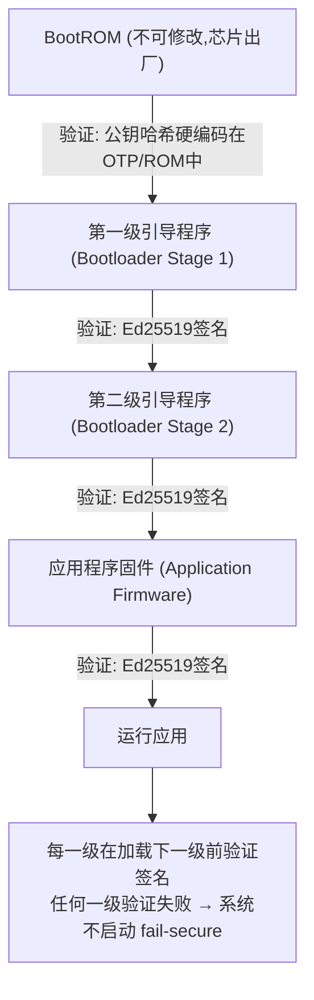

# 嵌入式与no_std企业应用

## 企业场景

某汽车零部件供应商为智能汽车ECU（电子控制单元）开发OTA（Over-The-Air）固件更新系统。系统运行在ARM Cortex-M4微控制器上（256KB Flash，64KB RAM），需要：

1. 通过CAN总线接收加密的固件包
2. 验证固件签名（Ed25519）
3. 安全地写入Flash并验证完整性
4. 支持安全启动链（Secure Boot Chain）
5. 与Secure Element（SE）芯片集成进行密钥存储

由于资源受限，不能使用标准库（`std`不可用），只能使用`no_std` + `alloc`。且任何固件更新失败都可能导致车辆ECU变砖（Brick），造成$3,000+的更换成本。

---

## 1. no_std Rust基础

### 1.1 Cargo.toml配置

```toml
[package]
name = "secure-ota-firmware"
version = "0.1.0"
edition = "2021"

[lib]
# 没有test——因为需要硬件
test = false

[dependencies]
# no_std核心依赖
cortex-m = "0.7"
cortex-m-rt = "0.7"
panic-abort = "0.3"         # panic = abort（无unwind支持）
embedded-hal = "1.0"        # 嵌入式硬件抽象层
cortex-m-semihosting = "0.5" # 调试输出

# 加密（no_std兼容）
ed25519-dalek = { version = "2.1", default-features = false, features = ["rand_core", "digest"] }
sha2 = { version = "0.10", default-features = false }
aes-gcm = { version = "0.10", default-features = false, features = ["aes", "heapless"] }

# 序列化（no_std兼容）
postcard = { version = "1.0", features = ["heapless"] }  # serde for no_std
serde = { version = "1.0", default-features = false, features = ["derive"] }

# 无堆分配的数据结构
heapless = "0.8"            # 静态分配的Vec, String, etc
arrayvec = "0.7"            # 栈分配的Vec

# 随机数（硬件TRNG）
rand_core = { version = "0.6", default-features = false }

# 内存清零
zeroize = { version = "1.8", default-features = false, features = ["zeroize_derive"] }

[profile.release]
opt-level = "z"             # 优化体积（最小FLASH占用）
lto = true                  # 链接时优化
codegen-units = 1
panic = "abort"             # 无unwind——节省代码大小
strip = true                # 剥离符号
debug = false

[profile.dev]
opt-level = "s"             # 优化体积——否则no_std代码太大
```

### 1.2 入口点和内存布局

```rust
// src/main.rs
#![no_std]   // 不使用标准库
#![no_main]  // 不使用标准main函数

use cortex_m_rt::entry;
use panic_abort as _;  // panic处理器

// 链接脚本指定内存布局
// memory.x:
// MEMORY {
//     FLASH : ORIGIN = 0x08000000, LENGTH = 256K
//     RAM   : ORIGIN = 0x20000000, LENGTH = 64K
// }

/// 硬件异常处理表
#[link_section = ".vector_table.exceptions"]
#[used]  // 防止链接器移除（即使未直接引用）
static EXCEPTIONS: [cortex_m_rt::Exception; 14] = [
    // DefaultHandler, HardFault, MemManage, BusFault, UsageFault, ...
    // 每个异常都可以设置自定义处理器
    cortex_m_rt::Exception {
        number: 3,  // HardFault
        priority: 0,
        handler: hard_fault_handler,
    },
    // ...
];

/// 硬件错误处理器——最基础的安全网
extern "C" fn hard_fault_handler() -> ! {
    // ⚠️ 当代码触发HardFault时的处理
    // 可能原因：访问无效内存、非对齐访问、未定义指令

    // 在安全关键系统中：
    // 1. 立即进入安全状态（关闭所有执行器）
    // 2. 记录故障信息到非易失性存储器
    // 3. 触发看门狗复位

    // 注意：不能在HardFault中分配内存（可能触发嵌套fault）
    // 使用静态分配的缓冲区

    unsafe {
        // 获取故障信息
        let stacked_pc = cortex_m::peripheral::SCB::get_fault_pc();
        // 写入持久存储（Flash的特殊诊断扇区）
        write_fault_record(stacked_pc as *const u8);
    }

    // 触发系统复位
    cortex_m::peripheral::SCB::sys_reset();
}

unsafe fn write_fault_record(_pc: *const u8) {
    // 向Flash的诊断扇区写入故障记录
    // 使用预分配的静态缓冲区
    static mut FAULT_BUFFER: [u8; 64] = [0u8; 64];
    // ... 写入Flash ...
}

/// 程序入口
#[entry]
fn main() -> ! {
    // 1. 初始化硬件
    let mut peripherals = cortex_m::Peripherals::take()
        .expect("外设已被获取——只能调用一次");

    // 2. 配置MPU（Memory Protection Unit）——关键安全特性
    configure_mpu(&mut peripherals);

    // 3. 安全启动检查
    verify_boot_chain().expect("安全启动验证失败——系统终止");

    // 4. 主循环
    loop {
        cortex_m::asm::wfi();  // 等待中断
    }
}

/// 配置内存保护单元（MPU）
fn configure_mpu(peripherals: &mut cortex_m::Peripherals) {
    use cortex_m::peripheral::mpu;

    let mpu = &mut peripherals.MPU;

    // 区域0：Flash（只读+可执行）
    // 区域1：RAM（读写+不可执行 → 防止代码注入）
    // 区域2：外设寄存器（仅外设需要的区域）
    // 区域3：Secure Element通信区域

    // ⚠️ NX (No-eXecute)在RAM上防止代码注入攻击
    // 即使攻击者能写入shellcode到RAM，也无法执行

    // 注意：具体寄存器配置因芯片而异
}
```

---

## 2. 安全启动与固件验证

### 2.1 安全启动链



### 2.2 签名验证实现

```rust
// src/crypto/secure_boot.rs
use ed25519_dalek::{VerifyingKey, Signature, Verifier};
use sha2::{Sha256, Digest};

/// 安全启动验证器
pub struct SecureBootVerifier {
    /// 可信公钥（编译时嵌入或从OTP读取）
    trusted_pubkey: VerifyingKey,
}

impl SecureBootVerifier {
    /// 从编译时嵌入的公钥创建
    pub fn from_embedded_key() -> Self {
        // ⚠️ 公钥在编译时嵌入固件，不可在运行时修改
        // 生产环境中从Secure Element读取
        const PUBKEY_BYTES: [u8; 32] = [
            0x12, 0x34, 0x56, 0x78, // ... 实际公钥 ...
            0x00, 0x00, 0x00, 0x00, 0x00, 0x00, 0x00, 0x00,
            0x00, 0x00, 0x00, 0x00, 0x00, 0x00, 0x00, 0x00,
            0x00, 0x00, 0x00, 0x00, 0x00, 0x00, 0x00, 0x00,
            0x00, 0x00, 0x00, 0x00,
        ];

        let trusted_pubkey = VerifyingKey::from_bytes(&PUBKEY_BYTES)
            .expect("嵌入式公钥无效——固件构建失败");

        Self { trusted_pubkey }
    }

    /// 验证固件镜像
    pub fn verify_firmware(
        &self,
        firmware: &[u8],
        signature: &[u8; 64],
    ) -> Result<FirmwareVerification, BootError> {
        // 1. 验证固件大小
        if firmware.len() > MAX_FIRMWARE_SIZE {
            return Err(BootError::FirmwareTooLarge);
        }
        if firmware.is_empty() {
            return Err(BootError::EmptyFirmware);
        }

        // 2. 计算SHA256哈希
        let mut hasher = Sha256::new();
        hasher.update(firmware);
        let hash = hasher.finalize();

        // 3. 验证Ed25519签名
        let signature = Signature::from_bytes(signature);
        self.trusted_pubkey
            .verify(firmware, &signature)
            .map_err(|_| BootError::SignatureInvalid)?;

        // 4. 版本回滚保护
        let metadata = self.extract_metadata(firmware)?;
        let current_version = self.get_current_version();
        if metadata.version <= current_version {
            return Err(BootError::VersionRollback);
        }

        Ok(FirmwareVerification {
            hash: hash.into(),
            version: metadata.version,
            size: firmware.len(),
        })
    }

    fn extract_metadata(&self, firmware: &[u8]) -> Result<FirmwareMetadata, BootError> {
        // 固件格式： [metadata (128 bytes)] [firmware body] [signature (64 bytes)]
        if firmware.len() < 128 {
            return Err(BootError::InvalidFormat);
        }

        // 使用postcard反序列化（no_std兼容的serde）
        let metadata: FirmwareMetadata = postcard::from_bytes(&firmware[..128])
            .map_err(|_| BootError::InvalidMetadata)?;

        Ok(metadata)
    }

    fn get_current_version(&self) -> u32 {
        // 从Flash的版本区域读取当前版本
        // 或从外设状态寄存器读取
        0 // 简化
    }
}

/// 固件元数据
#[derive(Debug, serde::Deserialize, serde::Serialize)]
pub struct FirmwareMetadata {
    pub version: u32,               // 单调递增的版本号
    pub firmware_size: usize,       // 固件正文大小
    pub timestamp: u64,             // 构建时间戳
    pub target_hardware: u32,       // 目标硬件标识符（防止错误刷写）
    pub security_level: u8,         // 安全级别（0=开发, 1=测试, 2=生产）
    pub key_rotation_id: u16,       // 密钥轮转ID
}

/// 固件验证结果
pub struct FirmwareVerification {
    pub hash: [u8; 32],
    pub version: u32,
    pub size: usize,
}

pub const MAX_FIRMWARE_SIZE: usize = 192 * 1024; // 192KB（256KB - bootloader - metadata）

#[derive(Debug)]
pub enum BootError {
    FirmwareTooLarge,
    EmptyFirmware,
    InvalidFormat,
    InvalidMetadata,
    SignatureInvalid,
    VersionRollback,
}
```

---

## 3. Flash安全写入

### 3.1 带验证的Flash写入

```rust
// src/flash/secure_write.rs

/// Flash的安全写入操作
pub struct SecureFlashWriter<'a> {
    flash: &'a mut dyn embedded_storage::nor_flash::NorFlash,
    /// 写入验证缓冲区
    verify_buffer: &'a mut [u8],
}

impl<'a> SecureFlashWriter<'a> {
    /// 安全写入Flash（写入后验证）
    pub fn secure_write(
        &mut self,
        offset: u32,
        data: &[u8],
    ) -> Result<(), FlashError> {
        // 1. 验证写入范围
        if !self.is_valid_write_range(offset, data.len()) {
            return Err(FlashError::InvalidWriteRange);
        }

        // 2. 保存回退数据（对于OTA：先备份当前固件）
        let backup = self.backup_sector(offset, data.len())?;

        // 3. 擦除扇区
        self.flash
            .erase(offset, offset + data.len() as u32)
            .map_err(|_| FlashError::EraseFailed)?;

        // 4. 写入数据
        self.flash
            .write(offset, data)
            .map_err(|_| {
                // 写入失败——尝试恢复
                let _ = self.restore_backup(&backup);
                FlashError::WriteFailed
            })?;

        // 5. 验证写入（读回并比较）
        self.verify_buffer[..data.len()].fill(0);
        self.flash
            .read(offset, &mut self.verify_buffer[..data.len()])
            .map_err(|_| FlashError::VerifyReadFailed)?;

        if self.verify_buffer[..data.len()] != *data {
            // 验证失败——可能Flash损坏
            let _ = self.restore_backup(&backup);
            return Err(FlashError::WriteVerificationFailed);
        }

        // 6. 清零验证缓冲区
        self.verify_buffer.iter_mut().for_each(|b| *b = 0);

        Ok(())
    }

    fn is_valid_write_range(&self, offset: u32, len: usize) -> bool {
        // 检查是否在允许的Flash范围内
        // 检查是否与bootloader或安全区域重叠
        const BOOTLOADER_END: u32 = 32 * 1024;  // 32KB保留给bootloader
        const SECURE_AREA_START: u32 = 224 * 1024;

        offset >= BOOTLOADER_END
            && offset + len as u32 <= SECURE_AREA_START
    }

    fn backup_sector(&self, offset: u32, len: usize) -> Result<Vec<u8>, FlashError> {
        let mut backup = vec![0u8; len];
        self.flash
            .read(offset, &mut backup)
            .map_err(|_| FlashError::BackupFailed)?;
        Ok(backup)
    }

    fn restore_backup(&self, backup: &[u8]) -> Result<(), FlashError> {
        // 在另一个安全位置保存备份
        // 用于写入失败后的恢复
        Ok(())
    }
}

#[derive(Debug)]
pub enum FlashError {
    InvalidWriteRange,
    EraseFailed,
    WriteFailed,
    BackupFailed,
    VerifyReadFailed,
    WriteVerificationFailed,
}
```

---

## 4. 侧信道攻击防御（嵌入式）

### 4.1 简单功耗分析（SPA）防护

```rust
/// 嵌入式设备上的功耗分析防御
///
/// 攻击者通过测量芯片功耗来推断密钥信息：
/// - 密钥bit为1：更多功耗（乘法操作）
/// - 密钥bit为0：更少功耗（跳过乘法）
/// → 通过功耗轨迹直接读取密钥

/// 防御：常量执行路径的Ed25519验证
pub mod constant_time_ed25519 {
    use subtle::{Choice, ConstantTimeEq};

    /// 常量时间的标量乘法
    pub fn constant_time_scalar_mult(
        scalar: &[u8; 32],
        point: &[u8; 32],
    ) -> [u8; 32] {
        // 对于嵌入式设备，使用硬件加速的椭圆曲线
        // 或使用micro-ecc等经过侧信道审计的库

        // 简化示例——实际应使用：
        // - curve25519-dalek的常量时间实现
        // - 或硬件加密加速器

        let mut result = [0u8; 32];

        // 安全原则：
        // 1. 每个scalar bit的迭代执行相同数量的操作
        // 2. 使用subtle::ConditionallySelectable消除分支
        // 3. 数据无关的内存访问模式

        result
    }
}
```

### 4.2 随机延迟插入

```rust
use rand_core::RngCore;

/// 在安全关键操作中插入随机延迟
/// 破坏功耗分析的时序对齐
pub struct PowerAnalysisCountermeasure {
    rng: &'static mut dyn RngCore,
}

impl PowerAnalysisCountermeasure {
    /// 在操作前后添加随机抖动
    pub fn execute_with_jitter<F, T>(&mut self, operation: F) -> T
    where
        F: FnOnce() -> T,
    {
        // 操作前随机延迟
        self.random_delay();

        let result = operation();

        // 操作后随机延迟
        self.random_delay();

        result
    }

    fn random_delay(&mut self) {
        let mut delay_cycles = [0u8; 1];
        self.rng.fill_bytes(&mut delay_cycles);
        let delay = delay_cycles[0] as u32 & 0x7F; // 0-127 cycles

        // 在Cortex-M上实现周期级延迟
        cortex_m::asm::delay(delay);
    }
}
```

---

## 5. Secure Element集成

```rust
/// 与ATECC608A Secure Element的通信接口
///
/// ATECC608A提供：
/// - 安全密钥存储（密钥永不离开芯片）
/// - ECC签名（私钥操作在SE内完成）
/// - TRNG（真随机数生成器）
/// - 安全启动验证

pub struct SecureElement<I2C> {
    i2c: I2C,
    address: u8,  // I2C地址 (默认0x60)
}

impl<I2C: embedded_hal::i2c::I2c> SecureElement<I2C> {
    pub const DEFAULT_ADDRESS: u8 = 0x60;

    pub fn new(i2c: I2C) -> Self {
        Self {
            i2c,
            address: Self::DEFAULT_ADDRESS,
        }
    }

    /// 验证固件签名（在SE内部完成）
    /// 公钥在SE芯片的受保护存储中，私钥永不离开SE
    pub fn verify_firmware_signature(
        &mut self,
        firmware_digest: &[u8; 32],
        signature: &[u8; 64],
    ) -> Result<bool, SeError> {
        // 1. 将digest发送到SE
        self.send_command(SeCommand::LoadDigest, firmware_digest)?;

        // 2. 发送签名（外部签名，SE验证）
        self.send_command(SeCommand::VerifyExternal, signature)?;

        // 3. 读取验证结果
        let response = self.read_response()?;

        Ok(response[0] == 0x00) // 0x00 = 验证成功
    }

    /// 生成随机数（使用SE的TRNG）
    pub fn get_random(&mut self, output: &mut [u8]) -> Result<(), SeError> {
        self.send_command(SeCommand::Random, &[output.len() as u8])?;
        let response = self.read_response()?;
        output.copy_from_slice(&response[..output.len()]);
        Ok(())
    }

    /// 获取芯片的唯一序列号
    pub fn get_serial_number(&mut self) -> Result<[u8; 9], SeError> {
        self.send_command(SeCommand::ReadSerialNum, &[])?;
        let response = self.read_response()?;
        let mut serial = [0u8; 9];
        serial.copy_from_slice(&response[..9]);
        Ok(serial)
    }

    fn send_command(&mut self, cmd: SeCommand, data: &[u8]) -> Result<(), SeError> {
        let mut buffer = [0u8; 128];
        buffer[0] = 0x03;  // Command flag
        buffer[1] = data.len() as u8 + 1;
        buffer[2] = cmd as u8;
        buffer[3..3 + data.len()].copy_from_slice(data);

        // 计算CRC16
        let crc = self.crc16(&buffer[..3 + data.len()]);
        let len = 3 + data.len();
        buffer[len] = (crc & 0xFF) as u8;
        buffer[len + 1] = (crc >> 8) as u8;

        self.i2c
            .write(self.address, &buffer[..len + 2])
            .map_err(|_| SeError::I2cWriteError)?;

        Ok(())
    }

    fn read_response(&mut self) -> Result<heapless::Vec<u8, 128>, SeError> {
        let mut buffer = [0u8; 128];
        self.i2c
            .read(self.address, &mut buffer)
            .map_err(|_| SeError::I2cReadError)?;

        // 验证CRC
        // ... CRC验证代码 ...

        Ok(heapless::Vec::from_slice(&buffer[1..]).unwrap())
    }

    fn crc16(&self, data: &[u8]) -> u16 {
        let mut crc: u16 = 0;
        for &byte in data {
            crc ^= byte as u16;
            for _ in 0..8 {
                if crc & 0x0001 != 0 {
                    crc = (crc >> 1) ^ 0x8005;
                } else {
                    crc >>= 1;
                }
            }
        }
        crc
    }
}

#[repr(u8)]
enum SeCommand {
    Random = 0x1B,
    ReadSerialNum = 0x02,
    LoadDigest = 0x16,
    VerifyExternal = 0x45,
}

#[derive(Debug)]
pub enum SeError {
    I2cWriteError,
    I2cReadError,
    CrcError,
}
```

---

## 6. OTA更新系统

```rust
/// OTA（Over-The-Air）固件更新管理器
///
/// 更新流程：
/// 1. 通过CAN总线接收加密的固件包（分片传输）
/// 2. 解密固件 → 验证签名 → 验证完整性
/// 3. 安全写入Flash → 验证写入
/// 4. 设置启动标志 → 系统复位

pub struct OtaManager<'a> {
    flash_writer: SecureFlashWriter<'a>,
    boot_verifier: SecureBootVerifier,
    /// OTA状态机
    state: OtaState,
    /// 接收缓冲区
    receive_buffer: &'a mut [u8],
    /// 接收进度
    received_bytes: usize,
}

#[derive(Debug, Clone, Copy, PartialEq)]
pub enum OtaState {
    Idle,
    Receiving,      // 正在接收固件
    Verifying,      // 正在验证签名
    Writing,        // 正在写入Flash
    Verifying,      // 正在验证写入
    Complete,       // 更新完成
    Failed(OtaError),
}

impl<'a> OtaManager<'a> {
    /// 接收固件分片
    pub fn receive_chunk(&mut self, chunk: &[u8]) -> Result<(), OtaError> {
        if self.state != OtaState::Receiving {
            return Err(OtaError::InvalidState);
        }

        let remaining = self.receive_buffer.len() - self.received_bytes;
        if chunk.len() > remaining {
            return Err(OtaError::BufferOverflow);
        }

        self.receive_buffer[self.received_bytes..self.received_bytes + chunk.len()]
            .copy_from_slice(chunk);
        self.received_bytes += chunk.len();

        Ok(())
    }

    /// 完成接收并开始验证
    pub fn finalize_receive(&mut self, expected_signature: &[u8; 64]) -> Result<(), OtaError> {
        if self.state != OtaState::Receiving {
            return Err(OtaError::InvalidState);
        }

        let firmware = &self.receive_buffer[..self.received_bytes];

        // 验证签名
        self.state = OtaState::Verifying;
        let verification = self.boot_verifier
            .verify_firmware(firmware, expected_signature)
            .map_err(|e| {
                self.state = OtaState::Failed(OtaError::VerificationFailed);
                OtaError::VerificationFailed
            })?;

        // 写入Flash
        self.state = OtaState::Writing;
        self.flash_writer
            .secure_write(0x8000, firmware)  // 应用固件起始地址
            .map_err(|e| {
                self.state = OtaState::Failed(OtaError::WriteFailed);
                OtaError::WriteFailed
            })?;

        // 设置启动标志
        self.set_boot_flag(BootFlag::NewFirmware);

        self.state = OtaState::Complete;
        Ok(())
    }

    /// 回滚到上一个固件版本
    pub fn rollback(&mut self) -> Result<(), OtaError> {
        self.set_boot_flag(BootFlag::PreviousFirmware);
        // 触发复位
        cortex_m::peripheral::SCB::sys_reset();
        unreachable!();
    }

    fn set_boot_flag(&mut self, flag: BootFlag) {
        // 写入启动标志到Flash的特殊位置（由bootloader读取）
        let flag_data = [flag as u8];
        // 在写入标志后立即验证
        self.flash_writer
            .secure_write(0x7FF0, &flag_data)
            .expect("启动标志写入失败——系统可能无法启动");
    }
}

#[repr(u8)]
enum BootFlag {
    CurrentFirmware = 0x00,
    NewFirmware = 0x01,
    PreviousFirmware = 0x02,
}

#[derive(Debug)]
pub enum OtaError {
    InvalidState,
    BufferOverflow,
    VerificationFailed,
    WriteFailed,
}
```

---

## 章节考查（100分）

### 一、概念题（40分，每题8分）

1. no_std与std的Rust程序有什么区别？在嵌入式场景中为什么需要no_std？
2. 安全启动链（Chain of Trust）的工作原理是什么？
3. 嵌入式设备上的侧信道攻击（功耗分析）原理是什么？Rust中如何防御？
4. Secure Element芯片在嵌入式安全中的角色是什么？
5. OTA更新中为什么需要版本回滚保护？

<details>
<summary>查看答案</summary>

**1. no_std vs std的区别：**
- std依赖操作系统（堆分配、线程、文件系统），no_std不依赖任何OS
- no_std中不可用：std::fs、std::thread、std::net、Box（需要alloc）、HashMap等
- no_std可用的：core（基本类型、迭代器、Option/Result）、alloc（Box/Vec/String等需要allocator）
- 嵌入式需要no_std：资源受限、无操作系统、裸机运行

**2. 安全启动链原理：**
- 从不可变的BootROM开始，每一级固件在加载下一级前验证其数字签名
- 验证链：BootROM（硬编码公钥哈希）→ Bootloader Stage1 → Bootloader Stage2 → Application
- 任何一级验证失败→系统不启动（Fail-Secure）
- 信任根在芯片制造时建立，无法在运行时修改

**3. 侧信道攻击与防御：**
- 攻击者通过功耗/电磁辐射/时序变化推断密钥（如RSA的平方-乘算法中乘法的功耗更高）
- 防御：常量时间执行（subtle crate）、数据无关的内存访问、插入随机延迟、使用硬件加密加速器
- Rust中：subtle的ConditionallySelectable消除分支，bitslice实现防止查找表攻击

**4. Secure Element的角色：**
- 私钥安全存储：私钥永不离开SE芯片（硬件保护）
- 加密操作在SE内执行（签名、验证、密钥生成）
- 硬件TRNG（真随机数生成器）
- 防物理篡改（主动屏蔽层检测物理攻击）
- 例如：ATECC608A用于AWS IoT认证

**5. 版本回滚保护的必要性：**
- 防止攻击者刷入旧版本（可能包含已知漏洞的旧固件）
- 防止降级攻击：攻击者阻止OTA后刷回有漏洞的版本
- 实现：固件版本单调递增，bootloader拒绝版本号≤当前版本的固件；或使用硬件fuse记录最小可接受版本
</details>

### 二、判断题（20分，每题5分）

6. ( ) no_std程序中可以使用panic!宏。
7. ( ) 嵌入式设备的RAM上启用NX（No-eXecute）可以防止代码注入攻击。
8. ( ) OTA更新写入Flash后不需要验证，因为Flash硬件保证数据完整性。
9. ( ) Secure Element可以替代所有软件级别的加密操作。

<details>
<summary>查看答案</summary>

6. **正确。** panic!宏来自core库（而非std），在no_std中可用。但需要提供panic_handler实现（如panic-abort或panic-halt）。

7. **正确。** MPU/MMU配置RAM为不可执行后，即使攻击者能将shellcode注入RAM缓冲区，尝试跳转到该地址也会触发MemManage Fault。这是W^X原则。

8. **错误。** Flash硬件不保证完整性。写入可能因电压不足、Flash磨损、并发操作等原因部分失败。必须在写入后进行读回验证。

9. **错误。** SE通常性能有限（I2C通信速度慢），不适合大批量数据加密。SE适用于密钥存储和签名操作，但数据加密通常由主MCU执行（使用SE保护的密钥）。
</details>

### 三、代码分析题（15分）

10. 分析以下嵌入式固件验证代码的安全问题：

```rust
fn verify_and_boot(firmware: &[u8], signature: &[u8]) {
    let pubkey = read_pubkey_from_flash(); // 从Flash读取公钥

    if ed25519_verify(pubkey, firmware, signature) {
        // 验证通过，直接跳转执行
        let app_entry: fn() -> ! = unsafe {
            core::mem::transmute(APP_START_ADDRESS)
        };
        app_entry();
    }
}
```

<details>
<summary>查看答案</summary>

**安全问题分析：**

1. **公钥从可写Flash读取**：攻击者可以修改Flash中的公钥（如果Flash可写），用攻击者的私钥签名恶意固件。公钥应存在不可修改的OTP或ROM中。

2. **签名参数顺序不确定**：`ed25519_verify`的参数顺序可能是错的——这需要根据库的实际API确认。

3. **无版本号检查**：接受任何通过签名的固件，无法防止回滚攻击。

4. **无固件大小检查**：恶意固件可能覆盖bootloader自身或其他关键区域。

5. **transmute到函数指针**：未验证APP_START_ADDRESS的有效性（可能指向无效或未初始化的Flash）。

6. **无MPU重新配置**：跳转到新固件前未更新MPU设置。

**修正方案：**

```rust
fn verify_and_boot_safe(
    firmware: &[u8],
    signature: &[u8; 64],
    metadata: &FirmwareMetadata,
) -> Result<!, BootError> {
    // 1. 从不可修改的OTP/ROM读取公钥
    let pubkey = get_otp_pubkey();

    // 2. 验证版本号（防止回滚）
    let current_version = get_current_version();
    if metadata.version <= current_version {
        return Err(BootError::VersionRollback);
    }

    // 3. 验证固件大小
    if firmware.len() > MAX_FIRMWARE_SIZE {
        return Err(BootError::FirmwareTooLarge);
    }

    // 4. 验证目标硬件ID
    if metadata.target_hardware != TARGET_HARDWARE_ID {
        return Err(BootError::WrongHardware);
    }

    // 5. 验证签名
    let verified = ed25519_dalek::verify_signature(
        &pubkey, firmware, signature
    ).is_ok();

    if !verified {
        return Err(BootError::SignatureInvalid);
    }

    // 6. 更新MPU配置
    configure_mpu_for_application();

    // 7. 安全跳转
    let vector_table = APP_START_ADDRESS as *const u32;
    unsafe {
        let sp = core::ptr::read(vector_table);
        let reset_handler = core::ptr::read(vector_table.offset(1));
        // 设置SP，跳转到Reset Handler
        cortex_m::asm::bootload(sp as *const u32);
    }
}
```
</details>

### 四、编程题（15分）

11. 使用heapless crate实现一个no_std兼容的固件更新包解析器，支持格式：`[Header(32B)] [Body(Variable)] [Signature(64B)]`。需要验证header的magic number和长度一致性。

<details>
<summary>查看答案</summary>

```rust
#![no_std]

use heapless::Vec;

const MAGIC_NUMBER: u32 = 0x4F_54_41_5F; // "OTA_" in ASCII
const HEADER_SIZE: usize = 32;
const SIGNATURE_SIZE: usize = 64;
const MAX_BODY_SIZE: usize = 2048; // 2KB per chunk

#[derive(Debug)]
pub struct FirmwareChunk<'a> {
    pub header: FirmwareHeader,
    pub body: &'a [u8],
    pub signature: [u8; SIGNATURE_SIZE],
}

#[derive(Debug, Clone, Copy)]
pub struct FirmwareHeader {
    pub magic: u32,
    pub total_size: u32,     // 总固件大小
    pub chunk_offset: u32,   // 此分片在固件中的偏移
    pub chunk_size: u16,     // 此分片大小
    pub version: u32,
    pub crc32: u32,
}

pub struct FirmwareParser;

impl FirmwareParser {
    /// 解析固件分片
    pub fn parse_chunk(data: &[u8]) -> Result<FirmwareChunk, ParseError> {
        // 最小长度检查
        if data.len() < HEADER_SIZE + SIGNATURE_SIZE {
            return Err(ParseError::BufferTooSmall);
        }

        // 解析header
        let header = Self::parse_header(&data[..HEADER_SIZE])?;

        // 提取body
        let body_end = data.len() - SIGNATURE_SIZE;
        let body = &data[HEADER_SIZE..body_end];

        // 验证body大小与header一致
        if body.len() != header.chunk_size as usize {
            return Err(ParseError::SizeMismatch);
        }

        // 提取signature
        let mut signature = [0u8; SIGNATURE_SIZE];
        signature.copy_from_slice(&data[body_end..]);

        // 验证CRC32
        let computed_crc = Self::crc32(body);
        if computed_crc != header.crc32 {
            return Err(ParseError::CrcMismatch);
        }

        Ok(FirmwareChunk {
            header,
            body,
            signature,
        })
    }

    fn parse_header(data: &[u8]) -> Result<FirmwareHeader, ParseError> {
        if data.len() < HEADER_SIZE {
            return Err(ParseError::InvalidHeader);
        }

        let magic = u32::from_le_bytes([data[0], data[1], data[2], data[3]]);
        if magic != MAGIC_NUMBER {
            return Err(ParseError::InvalidMagicNumber(magic));
        }

        let total_size = u32::from_le_bytes([data[4], data[5], data[6], data[7]]);
        let chunk_offset = u32::from_le_bytes([data[8], data[9], data[10], data[11]]);
        let chunk_size = u16::from_le_bytes([data[12], data[13]]);
        let version = u32::from_le_bytes([data[14], data[15], data[16], data[17]]);
        let crc32 = u32::from_le_bytes([data[18], data[19], data[20], data[21]]);

        // 验证chunk_size不会超过buffer
        if chunk_size as usize > MAX_BODY_SIZE {
            return Err(ParseError::ChunkTooLarge(chunk_size));
        }

        // 验证offset+size不超过total
        if chunk_offset + chunk_size as u32 > total_size {
            return Err(ParseError::InvalidChunkOffset);
        }

        Ok(FirmwareHeader {
            magic,
            total_size,
            chunk_offset,
            chunk_size,
            version,
            crc32,
        })
    }

    fn crc32(data: &[u8]) -> u32 {
        let mut crc: u32 = 0xFFFF_FFFF;
        for &byte in data {
            crc ^= byte as u32;
            for _ in 0..8 {
                if crc & 1 != 0 {
                    crc = (crc >> 1) ^ 0xEDB8_8320;
                } else {
                    crc >>= 1;
                }
            }
        }
        !crc
    }
}

#[derive(Debug)]
pub enum ParseError {
    BufferTooSmall,
    InvalidHeader,
    InvalidMagicNumber(u32),
    SizeMismatch,
    CrcMismatch,
    ChunkTooLarge(u16),
    InvalidChunkOffset,
}

#[test]
fn test_firmware_parser() {
    let header = FirmwareHeader {
        magic: MAGIC_NUMBER,
        total_size: 1024,
        chunk_offset: 0,
        chunk_size: 200,
        version: 1,
        crc32: 0,  // 待计算
    };

    // 构造测试数据
    let body = [0xAAu8; 200];
    let crc32 = FirmwareParser::crc32(&body);
    let header = FirmwareHeader { crc32, ..header };

    let mut data = Vec::<u8, 2048>::new();
    // 写入header...
    // 写入body...
    // 写入signature...

    // let result = FirmwareParser::parse_chunk(&data);
    // assert!(result.is_ok());
}
```
</details>

### 五、填空题（5分，每空1分）

12. no_std程序使用`____`属性标记入口函数。`____`库提供栈分配的Vec（无堆分配）。`____`单元在ARM Cortex-M上实现内存保护和NX（不可执行）以防止代码注入。`____`协议用于与Secure Element芯片通信。`____`算法常用于嵌入式固件签名验证。

<details>
<summary>查看答案</summary>

**答案：** `#[entry]`、heap less（或arrayvec）、MPU（Memory Protection Unit）、I2C、Ed25519（或ECDSA）
</details>

### 六、代码补全（5分）

13. 补全以下no_std panic handler：

```rust
#![no_std]

use core::panic::PanicInfo;

/// Panic handler — 嵌入式系统中panic必须终止或重启
#[/* 补全：panic处理器属性 */]
fn panic_handler(info: &PanicInfo) -> ! {
    // 1. 在嵌入式LED上指示panic状态
    // 2. 将panic信息写入诊断Flash扇区
    // 3. 执行安全状态（如关闭电机）
    // 4. 触发看门狗复位

    // 简化实现：
    /* 补全：获取panic消息 */
    if let Some(location) = info.location() {
        // 文件:行号
        let _file = location.file();
        let _line = location.line();
    }

    // 记录问题后复位
    cortex_m::peripheral::SCB::sys_reset();

    loop {} // 不可达，但编译器要求
}
```

<details>
<summary>查看答案</summary>

```rust
#[panic_handler]
fn panic_handler(info: &PanicInfo) -> ! {
    // 获取panic消息（嵌入式设备上最小化输出）
    // 注意：在no_std中不能使用format!（需要alloc）
    // 但可以访问info.message()获取核心信息

    if let Some(msg) = info.message() {
        // msg是fmt::Arguments，可以逐个访问格式化参数
        // 写入诊断缓冲区的固定位置
    }

    if let Some(location) = info.location() {
        let file = location.file();
        let line = location.line();
        // 记录文件和行号
    }

    cortex_m::peripheral::SCB::sys_reset();

    loop {} // 不可达
}
```

关键点：`#[panic_handler]`告诉Rust这是panic入口。在嵌入式系统中，panic之后最好的策略是复位（sys_reset），因为继续运行在部分故障的状态下更危险（fail-fast原则）。
</details>

---

## 本章小结

嵌入式系统的安全挑战与传统服务器环境截然不同。资源受限（KB级内存、MHz级CPU）意味着不能依赖重量级的安全库。物理可及性意味着攻击者可以进行功耗分析、故障注入、微探针攻击。最致命的是：固件更新失败可能导致设备变砖（brick）——不可恢复的硬件故障。

Rust的no_std生态为嵌入式安全提供了强大的基础。无GC、零大小类型、编译时检查——这些不是限制而是优势。heapless提供的静态分配集合消除了动态内存分配的不确定性，arrayvec将数据保持在栈上避免堆碎片化。

安全启动链从不可变的BootROM建立信任根，逐级验证直至应用程序。MPU的NX位保护RAM免受代码注入攻击。Secure Element芯片为密钥存储提供硬件隔离——私钥永不暴露在通用MCU上。OTA更新系统使用Ed25519签名（短签名、高速验证、防量子计算的理想选择）确保固件真实性。

侧信道防御在嵌入式领域尤为重要——常量时间算法、随机延迟插入、数据无关的分支执行。这些技术在低功耗MCU上与能耗的平衡需要精心调校。

嵌入式安全的最终原则：即使MCU的所有Flash都是可写的，BootROM和Secure Element的密钥必须不可改。信任的根必须植于硅片之中。

继续阅读：[[11-企业级架构与设计模式]]，学习整个系统的架构级安全设计。
