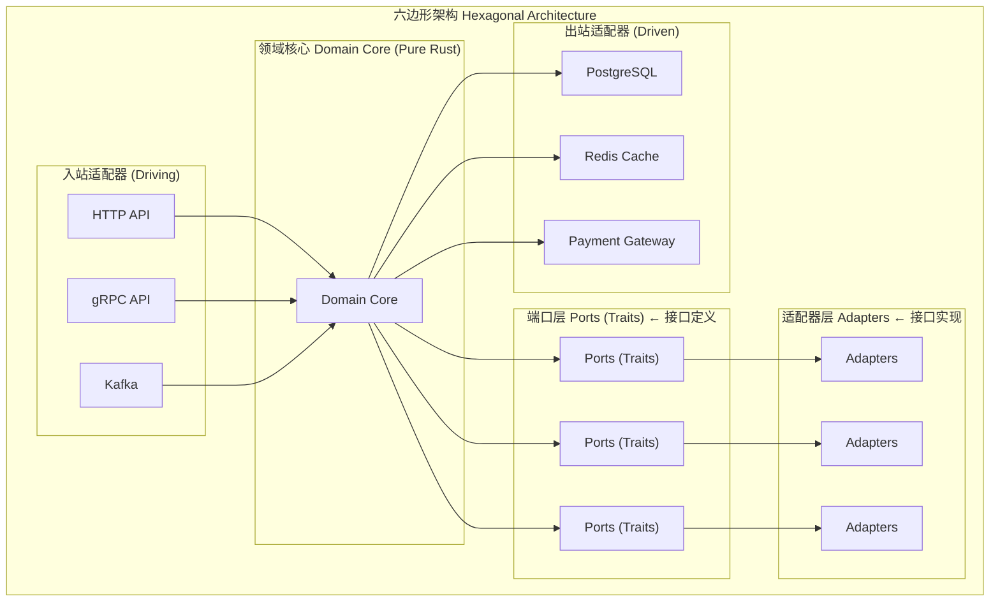

# 企业级架构与设计模式

## 企业场景

某电商平台经历了从单体Rails应用到Rust微服务的3年迁移。然而架构演变中积累了严重的技术债务：
- 12个微服务各自实现了不同的认证逻辑（有的用JWT，有的用Session，有的无认证）
- 服务间调用链深达7层，一次"下单"请求经过8个微服务，熔断器配置各自为政
- 可观测性严重不足——当订单丢失时，需要3名工程师查询8个日志系统才能定位

新的架构团队决定实施统一的企业级架构标准，借鉴领域驱动设计（DDD）和六边形架构思想，用Rust的类型系统强制执行这些标准。

---

## 1. 六边形架构（端口与适配器）在Rust中的实现

### 1.1 架构概览



### 1.2 领域核心（纯业务逻辑，无外部依赖）

```rust
// src/domain/mod.rs
// 领域核心：纯Rust，无IO，无框架依赖

pub mod order;
pub mod payment;
pub mod user;

// ─── 领域实体 ───
#[derive(Debug, Clone, PartialEq)]
pub struct Order {
    pub id: OrderId,
    pub user_id: UserId,
    pub items: Vec<OrderItem>,
    pub status: OrderStatus,
    pub total_amount: Money,
    pub created_at: chrono::DateTime<chrono::Utc>,
}

// 使用Newtype模式封装基本类型（类型安全）
#[derive(Debug, Clone, Copy, PartialEq, Eq, Hash)]
pub struct OrderId(pub uuid::Uuid);

#[derive(Debug, Clone, Copy, PartialEq, Eq, Hash)]
pub struct UserId(pub uuid::Uuid);

#[derive(Debug, Clone, Copy, PartialEq)]
pub struct Money {
    pub amount: i64,      // 以分为单位
    pub currency: Currency,
}

#[derive(Debug, Clone, Copy, PartialEq)]
pub enum Currency {
    Usd,
    Eur,
    Cny,
}

#[derive(Debug, Clone, PartialEq)]
pub struct OrderItem {
    pub product_id: ProductId,
    pub quantity: u32,
    pub unit_price: Money,
}

#[derive(Debug, Clone, Copy, PartialEq, Eq)]
pub struct ProductId(pub String);

#[derive(Debug, Clone, Copy, PartialEq, Eq)]
pub enum OrderStatus {
    Created,
    PaymentPending,
    Paid,
    Shipped,
    Delivered,
    Cancelled,
}

// ─── 领域服务（纯函数，无副作用） ───
impl Order {
    /// 创建新订单
    pub fn create(
        user_id: UserId,
        items: Vec<OrderItem>,
        pricing_service: &impl PricingService,
    ) -> Result<Self, OrderError> {
        if items.is_empty() {
            return Err(OrderError::NoItems);
        }

        let total = pricing_service.calculate_total(&items)?;

        // 业务规则：订单必须大于0且不超过限额
        if total.amount <= 0 {
            return Err(OrderError::InvalidTotal);
        }
        if total.amount > 1_000_000_00 { // $10,000 限额
            return Err(OrderError::ExceedsMaxTotal);
        }

        Ok(Order {
            id: OrderId(uuid::Uuid::new_v4()),
            user_id,
            items,
            status: OrderStatus::Created,
            total_amount: total,
            created_at: chrono::Utc::now(),
        })
    }

    /// 取消订单（领域逻辑，处理状态转换）
    pub fn cancel(&mut self, reason: CancellationReason) -> Result<(), OrderError> {
        match self.status {
            OrderStatus::Created | OrderStatus::PaymentPending => {
                // 仅未支付的订单可以取消
                self.status = OrderStatus::Cancelled;
                Ok(())
            }
            OrderStatus::Paid => {
                // 已支付需要退款后才能取消
                Err(OrderError::CancelRequiresRefund)
            }
            OrderStatus::Shipped | OrderStatus::Delivered => {
                Err(OrderError::CannotCancelShipped)
            }
            OrderStatus::Cancelled => {
                Err(OrderError::AlreadyCancelled)
            }
        }
    }
}

pub enum CancellationReason {
    UserRequest,
    FraudDetected,
    OutOfStock,
}

#[derive(Debug, thiserror::Error)]
pub enum OrderError {
    #[error("订单至少需要一个商品")]
    NoItems,
    #[error("订单总额无效")]
    InvalidTotal,
    #[error("超过最大订单限额")]
    ExceedsMaxTotal,
    #[error("取消需要先退款")]
    CancelRequiresRefund,
    #[error("已发货的订单不可取消")]
    CannotCancelShipped,
    #[error("订单已取消")]
    AlreadyCancelled,
}
```

### 1.3 端口定义（Traits）

```rust
// src/ports.rs
// 端口 = 领域定义的接口，由外部适配器实现

use async_trait::async_trait;
use crate::domain::*;

/// 订单仓储端口
#[async_trait]
pub trait OrderRepository: Send + Sync {
    async fn save(&self, order: &Order) -> Result<(), RepositoryError>;
    async fn find_by_id(&self, id: OrderId) -> Result<Option<Order>, RepositoryError>;
    async fn find_by_user(&self, user_id: UserId) -> Result<Vec<Order>, RepositoryError>;
    async fn update_status(
        &self,
        id: OrderId,
        status: OrderStatus,
    ) -> Result<(), RepositoryError>;
}

/// 定价服务端口
pub trait PricingService: Send + Sync {
    fn calculate_total(&self, items: &[OrderItem]) -> Result<Money, OrderError>;
}

/// 支付网关端口
#[async_trait]
pub trait PaymentGateway: Send + Sync {
    async fn charge(
        &self,
        order_id: OrderId,
        amount: Money,
        payment_method: PaymentMethod,
    ) -> Result<PaymentResult, PaymentError>;

    async fn refund(
        &self,
        transaction_id: &str,
        amount: Money,
    ) -> Result<(), PaymentError>;
}

/// 通知服务端口
#[async_trait]
pub trait NotificationService: Send + Sync {
    async fn send_order_confirmation(
        &self,
        user_id: UserId,
        order: &Order,
    ) -> Result<(), NotificationError>;
}

/// 欺诈检测端口
#[async_trait]
pub trait FraudDetectionService: Send + Sync {
    async fn analyze_order(&self, order: &Order) -> Result<FraudRisk, FraudError>;
}

#[derive(Debug)]
pub struct PaymentMethod {
    pub card_token: String,
    pub last_four: String,
}

#[derive(Debug)]
pub struct PaymentResult {
    pub transaction_id: String,
    pub status: PaymentStatus,
}

#[derive(Debug, Clone, Copy, PartialEq)]
pub enum PaymentStatus {
    Success,
    Declined,
    Pending,
}

#[derive(Debug)]
pub struct FraudRisk {
    pub score: f64,    // 0.0 = 安全, 1.0 = 确定欺诈
    pub flags: Vec<String>,
}

// ─── 端口错误类型 ───
#[derive(Debug, thiserror::Error)]
pub enum RepositoryError {
    #[error("存储错误: {0}")]
    StorageError(String),
    #[error("并发冲突")]
    ConcurrencyConflict,
}

#[derive(Debug, thiserror::Error)]
pub enum PaymentError {
    #[error("支付被拒绝: {0}")]
    Declined(String),
    #[error("支付网关不可用")]
    GatewayUnavailable,
}

#[derive(Debug, thiserror::Error)]
pub enum NotificationError {
    #[error("发送失败: {0}")]
    SendFailed(String),
}

#[derive(Debug, thiserror::Error)]
pub enum FraudError {
    #[error("分析失败: {0}")]
    AnalysisFailed(String),
}
```

### 1.4 适配器实现

```rust
// src/adapters/postgres_order_repository.rs
// Postgres适配器——实现OrderRepository端口

use sqlx::PgPool;
use async_trait::async_trait;
use crate::ports::{OrderRepository, RepositoryError};
use crate::domain::*;

pub struct PostgresOrderRepository {
    pool: PgPool,
}

impl PostgresOrderRepository {
    pub fn new(pool: PgPool) -> Self {
        Self { pool }
    }
}

#[async_trait]
impl OrderRepository for PostgresOrderRepository {
    async fn save(&self, order: &Order) -> Result<(), RepositoryError> {
        sqlx::query!(
            r#"
            INSERT INTO orders (id, user_id, status, total_amount, created_at)
            VALUES ($1, $2, $3, $4, $5)
            ON CONFLICT (id) DO UPDATE SET
                status = EXCLUDED.status,
                total_amount = EXCLUDED.total_amount
            "#,
            order.id.0,
            order.user_id.0,
            order.status as i32,
            order.total_amount.amount,
            order.created_at,
        )
        .execute(&self.pool)
        .await
        .map_err(|e| RepositoryError::StorageError(e.to_string()))?;

        Ok(())
    }

    async fn find_by_id(&self, id: OrderId) -> Result<Option<Order>, RepositoryError> {
        let row = sqlx::query!(
            "SELECT id, user_id, status, total_amount, created_at FROM orders WHERE id = $1",
            id.0,
        )
        .fetch_optional(&self.pool)
        .await
        .map_err(|e| RepositoryError::StorageError(e.to_string()))?;

        // 转换数据库行→领域对象（适配器职责）
        Ok(row.map(|r| Order {
            id: OrderId(r.id),
            user_id: UserId(r.user_id),
            items: Vec::new(), // 从order_items表join获取
            status: OrderStatus::from_i32(r.status),
            total_amount: Money {
                amount: r.total_amount,
                currency: Currency::Usd,
            },
            created_at: r.created_at,
        }))
    }

    async fn find_by_user(&self, user_id: UserId) -> Result<Vec<Order>, RepositoryError> {
        // ... 实现 ...
        Ok(Vec::new())
    }

    async fn update_status(
        &self,
        id: OrderId,
        status: OrderStatus,
    ) -> Result<(), RepositoryError> {
        sqlx::query!(
            "UPDATE orders SET status = $1 WHERE id = $2",
            status as i32,
            id.0,
        )
        .execute(&self.pool)
        .await
        .map_err(|e| RepositoryError::StorageError(e.to_string()))?;

        Ok(())
    }
}

impl OrderStatus {
    fn from_i32(val: i32) -> Self {
        match val {
            0 => OrderStatus::Created,
            1 => OrderStatus::PaymentPending,
            2 => OrderStatus::Paid,
            3 => OrderStatus::Shipped,
            4 => OrderStatus::Delivered,
            5 => OrderStatus::Cancelled,
            _ => OrderStatus::Created,
        }
    }
}
```

---

## 2. 依赖注入：无运行时开销

### 2.1 编译时依赖注入

```rust
/// Rust中的依赖注入不需要框架或运行时反射
/// 使用泛型+traits实现编译时DI——零运行时开销
use std::sync::Arc;

/// 应用上下文——编译时DI容器
pub struct AppContext<R, P, N, F> {
    pub order_repo: Arc<R>,
    pub payment_gateway: Arc<P>,
    pub notifier: Arc<N>,
    pub fraud_detector: Arc<F>,
}

// 使用where子句约束类型
impl<R, P, N, F> AppContext<R, P, N, F>
where
    R: OrderRepository + 'static,
    P: PaymentGateway + 'static,
    N: NotificationService + 'static,
    F: FraudDetectionService + 'static,
{
    pub fn new(
        order_repo: R,
        payment_gateway: P,
        notifier: N,
        fraud_detector: F,
    ) -> Self {
        Self {
            order_repo: Arc::new(order_repo),
            payment_gateway: Arc::new(payment_gateway),
            notifier: Arc::new(notifier),
            fraud_detector: Arc::new(fraud_detector),
        }
    }

    // 组合领域服务
    pub fn order_service(&self) -> OrderService<R, P, N, F> {
        OrderService {
            order_repo: Arc::clone(&self.order_repo),
            payment_gateway: Arc::clone(&self.payment_gateway),
            notifier: Arc::clone(&self.notifier),
            fraud_detector: Arc::clone(&self.fraud_detector),
        }
    }
}

/// 组合服务（Application Service）
pub struct OrderService<R, P, N, F> {
    order_repo: Arc<R>,
    payment_gateway: Arc<P>,
    notifier: Arc<N>,
    fraud_detector: Arc<F>,
}

impl<R, P, N, F> OrderService<R, P, N, F>
where
    R: OrderRepository,
    P: PaymentGateway,
    N: NotificationService,
    F: FraudDetectionService,
{
    /// 处理下单请求（编排领域对象和外部服务）
    pub async fn place_order(
        &self,
        user_id: UserId,
        items: Vec<OrderItem>,
        payment_method: PaymentMethod,
        pricing: &impl PricingService,
    ) -> Result<Order, OrderError> {
        // 1. 创建订单（纯领域逻辑）
        let mut order = Order::create(user_id, items, pricing)?;

        // 2. 欺诈检测
        let fraud_risk = self.fraud_detector
            .analyze_order(&order)
            .await
            .map_err(|_| OrderError::InvalidTotal)?; // 映射错误

        if fraud_risk.score > 0.8 {
            order.cancel(CancellationReason::FraudDetected)?;
            self.order_repo.save(&order).await.ok();
            return Err(OrderError::CannotCancelShipped); // 用合适的错误
        }

        // 3. 处理支付
        let payment_result = self.payment_gateway
            .charge(order.id, order.total_amount, payment_method)
            .await
            .map_err(|_| OrderError::InvalidTotal)?;

        match payment_result.status {
            PaymentStatus::Success => {
                order.status = OrderStatus::Paid;
            }
            PaymentStatus::Declined => {
                order.status = OrderStatus::Cancelled;
            }
            PaymentStatus::Pending => {
                order.status = OrderStatus::PaymentPending;
            }
        }

        // 4. 持久化
        self.order_repo.save(&order).await.ok();

        // 5. 发送通知（异步，不阻塞响应）
        let notifier = Arc::clone(&self.notifier);
        let order_clone = order.clone();
        tokio::spawn(async move {
            let _ = notifier.send_order_confirmation(user_id, &order_clone).await;
        });

        Ok(order)
    }
}
```

### 2.2 生产环境的组装

```rust
// src/main.rs
use std::sync::Arc;

#[tokio::main]
async fn main() -> Result<(), Box<dyn std::error::Error>> {
    // 初始化基础设施
    let pool = PgPool::connect(&std::env::var("DATABASE_URL")?).await?;
    let redis = redis::Client::open("redis://localhost:6379")?;

    // 构建适配器
    let order_repo = PostgresOrderRepository::new(pool.clone());
    let payment_gateway = StripePaymentGateway::new(
        std::env::var("STRIPE_SECRET_KEY")?
    );
    let notifier = EmailNotifier::new(
        std::env::var("SENDGRID_API_KEY")?
    );
    let fraud_detector = MlFraudDetector::new("model/fraud_model.onnx");

    // 编译时DI——组装应用上下文
    let app = AppContext::new(
        order_repo,
        payment_gateway,
        notifier,
        fraud_detector,
    );

    // 获取服务
    let order_service = app.order_service();

    // 启动HTTP服务器
    start_server(order_service).await?;

    Ok(())
}
```

---

## 3. Feature-Based项目结构

### 3.1 按功能组织（而非按层）

```mermaid
graph TD
    SRC["src/"] --> MAIN["main.rs - 入口点"]
    SRC --> LIB["lib.rs - 库根"]
    SRC --> DOMAIN["domain/ - 领域层（所有业务逻辑）"]
    SRC --> APP["application/ - 应用层（用例编排）"]
    SRC --> PORTS["ports/ - 端口定义（接口/traits）"]
    SRC --> ADAPT["adapters/ - 适配器层（基础设施实现）"]
    SRC --> INFRA["infrastructure/ - 基础设施"]
    SRC --> API["api/ - 入口适配器（HTTP/gRPC）"]
    DOMAIN --> ORDER["order/ - entity.rs, service.rs, error.rs"]
    DOMAIN --> PAYMENT["payment/ - entity.rs, error.rs"]
    DOMAIN --> USER["user/ - entity.rs"]
    APP --> OSVC["order_service.rs - 下单、取消订单"]
    APP --> PSVC["payment_service.rs"]
    PORTS --> POR["order_repository.rs - trait OrderRepository"]
    PORTS --> PPG["payment_gateway.rs - trait PaymentGateway"]
    PORTS --> PNO["notification.rs - trait NotificationService"]
    ADAPT --> PG["postgres/ - impl OrderRepository"]
    ADAPT --> STRIPE["stripe/ - impl PaymentGateway"]
    ADAPT --> SG["sendgrid/ - impl NotificationService"]
    ADAPT --> REDIS["redis/ - cache.rs"]
    INFRA --> CFG["config.rs - 配置管理"]
    INFRA --> LOG["logging.rs - 审计日志"]
    INFRA --> MET["metrics.rs - Prometheus指标"]
    INFRA --> TRC["tracing.rs - 分布式追踪"]
    API --> HTTP["http/ - router, handlers, middleware"]
    API --> GRPC["grpc/ - order_service.rs"]
```



---

## 4. 可观测性：结构化日志、指标、分布式追踪

```rust
use tracing::{info, warn, error, span, Level, instrument};
use tracing_subscriber::{layer::SubscriberExt, util::SubscriberInitExt, EnvFilter};
use opentelemetry::global;

/// 初始化可观测性（日志+指标+追踪）
pub fn init_observability(service_name: &str) -> Result<(), Box<dyn std::error::Error>> {
    // 1. 分布式追踪（OpenTelemetry）
    let tracer = opentelemetry_otlp::new_pipeline()
        .tracing()
        .with_exporter(
            opentelemetry_otlp::new_exporter()
                .tonic()
                .with_endpoint("http://jaeger:4317")
        )
        .install_batch(opentelemetry_sdk::runtime::Tokio)?;

    let telemetry = tracing_opentelemetry::layer().with_tracer(tracer);

    // 2. 结构化日志
    let env_filter = EnvFilter::try_from_default_env()
        .unwrap_or_else(|_| EnvFilter::new("info"));

    let fmt_layer = tracing_subscriber::fmt::layer()
        .json()
        .with_current_span(true)
        .with_span_list(true);

    tracing_subscriber::registry()
        .with(env_filter)
        .with(telemetry)
        .with(fmt_layer)
        .try_init()?;

    Ok(())
}

/// 使用instrument宏自动追踪函数
#[instrument(
    name = "order.place",
    skip(order_service, payment_method),
    fields(
        user_id = %user_id.0,
        item_count = items.len(),
    )
)]
pub async fn place_order(
    order_service: &OrderService<impl OrderRepository, impl PaymentGateway, impl NotificationService, impl FraudDetectionService>,
    user_id: UserId,
    items: Vec<OrderItem>,
    payment_method: PaymentMethod,
) -> Result<Order, OrderError> {
    // instrument宏自动创建span、记录参数、测量执行时间
    // 所有内部的info!/error!自动关联到这个span

    info!("开始处理下单请求");

    let order = order_service
        .place_order(user_id, items, payment_method, &DefaultPricing)
        .await?;

    info!(
        order_id = %order.id.0,
        total = order.total_amount.amount,
        "下单成功"
    );

    Ok(order)
}
```

---

## 5. 弹性模式：熔断器、重试、舱壁

```rust
use std::time::Duration;
use tokio::sync::Semaphore;
use std::sync::Arc;

/// 组合弹性模式：重试 + 熔断器 + 舱壁
pub struct ResilientService<S> {
    inner: Arc<S>,
    // 舱壁：限制并发调用数
    semaphore: Arc<Semaphore>,
    // 熔断器配置
    circuit_breaker: CircuitBreaker,
    // 重试配置
    retry_config: RetryConfig,
}

#[derive(Debug, Clone)]
pub struct RetryConfig {
    pub max_retries: u32,
    pub initial_backoff: Duration,
    pub max_backoff: Duration,
    pub backoff_multiplier: f64,
}

impl Default for RetryConfig {
    fn default() -> Self {
        Self {
            max_retries: 3,
            initial_backoff: Duration::from_millis(100),
            max_backoff: Duration::from_secs(10),
            backoff_multiplier: 2.0,
        }
    }
}

impl<S: PaymentGateway> ResilientService<S> {
    /// 带弹性模式的支付调用
    pub async fn resilient_charge(
        &self,
        order_id: OrderId,
        amount: Money,
        method: PaymentMethod,
    ) -> Result<PaymentResult, PaymentError> {
        // 1. 获取舱壁许可（并发限制）
        let _permit = self.semaphore
            .acquire()
            .await
            .map_err(|_| PaymentError::GatewayUnavailable)?;

        // 2. 重试 + 指数退避
        let mut attempt = 0;
        let mut backoff = self.retry_config.initial_backoff;

        loop {
            match self.inner.charge(order_id, amount, method.clone()).await {
                Ok(result) => {
                    self.circuit_breaker.on_success().await;
                    return Ok(result);
                }
                Err(e) => {
                    attempt += 1;
                    if attempt >= self.retry_config.max_retries {
                        self.circuit_breaker.on_failure().await;
                        return Err(e);
                    }

                    // 指数退避
                    tracing::warn!(
                        attempt = attempt,
                        backoff_ms = backoff.as_millis(),
                        "支付调用失败，准备重试"
                    );

                    tokio::time::sleep(backoff).await;
                    backoff = (backoff.mul_f64(
                        self.retry_config.backoff_multiplier
                    )).min(self.retry_config.max_backoff);
                }
            }
        }
    }
}

/// 舱壁模式（Bulkhead）——隔离资源
/// 不同下游服务使用独立的连接池和信号量
/// 一个服务的故障不会耗尽其他服务的资源
pub struct BulkheadConfig {
    pub max_concurrent_calls: usize,
    pub max_queue_size: usize,
    pub timeout: Duration,
}
```

---

## 6. 健康检查与优雅关闭

```rust
use tokio::signal;
use std::time::Duration;

/// 健康检查端点
/// Kubernetes使用此端点判断Pod是否健康
pub async fn health_check_handler() -> actix_web::HttpResponse {
    // 检查关键依赖
    let db_healthy = check_database().await;
    let redis_healthy = check_redis().await;
    let payment_gateway_healthy = check_payment_gateway().await;

    let overall = db_healthy && redis_healthy && payment_gateway_healthy;

    let status = if overall {
        actix_web::http::StatusCode::OK
    } else {
        actix_web::http::StatusCode::SERVICE_UNAVAILABLE
    };

    actix_web::HttpResponse::build(status)
        .json(serde_json::json!({
            "status": if overall { "healthy" } else { "unhealthy" },
            "checks": {
                "database": db_healthy,
                "redis": redis_healthy,
                "payment_gateway": payment_gateway_healthy,
            }
        }))
}

/// 就绪检查端点
/// Kubernetes使用此端点判断Pod是否可接受流量
pub async fn readiness_check_handler() -> actix_web::HttpResponse {
    // 仅检查服务自身是否就绪（而非所有依赖）
    actix_web::HttpResponse::Ok().json(serde_json::json!({
        "status": "ready"
    }))
}

/// 优雅关闭
pub async fn graceful_shutdown(server: actix_web::dev::Server) {
    let mut sigterm = signal::unix::signal(signal::unix::SignalKind::terminate())
        .expect("无法注册SIGTERM处理器");
    let mut sigint = signal::unix::signal(signal::unix::SignalKind::interrupt())
        .expect("无法注册SIGINT处理器");

    tokio::select! {
        _ = sigterm.recv() => {
            tracing::info!("收到SIGTERM——开始优雅关闭");
        }
        _ = sigint.recv() => {
            tracing::info!("收到SIGINT——开始优雅关闭");
        }
    }

    // 1. 停止接收新请求（K8s已在endpoint列表移除此Pod）
    // 2. 等待进行中的请求完成（最多30秒）
    let shutdown_timeout = Duration::from_secs(30);
    tracing::info!("等待进行中的请求完成（{}秒超时）", shutdown_timeout.as_secs());

    // 3. 使用graceful shutdown
    server.stop(true).await;

    // 4. 清理资源（关闭数据库连接池、刷新缓冲区等）
    tracing::info!("服务已优雅关闭");
}
```

---

## 章节考查（100分）

### 一、概念题（40分，每题8分）

1. 六边形架构（端口与适配器）的核心思想是什么？领域核心为什么应该"纯"（无IO）？
2. Rust中如何实现无运行时开销的依赖注入？
3. Feature-Based项目结构与Layer-Based结构相比有哪些优势？
4. 可观测性（Observability）的三大支柱是什么？
5. 熔断器（Circuit Breaker）和舱壁（Bulkhead）模式分别解决什么问题？

<details>
<summary>查看答案</summary>

**1. 六边形架构核心思想：**
- 领域核心独立于外部系统（数据库、HTTP、消息队列等）
- 端口（Ports）= 领域定义的接口（traits），适配器（Adapters）= 外部系统的具体实现
- 领域核心应该"纯"（无IO）：便于单元测试（不需真实数据库）、便于推理（无副作用）、便于替换（换数据库不需改业务逻辑）

**2. Rust无运行时开销的DI：**
- 使用泛型+traits在编译时确定具体类型（monomorphization）
- 无需反射、无需注解、无需运行时容器
- Arc包装trait对象实现共享（只有一层指针间接）
- 编译器内联优化使得调用trait方法几乎与直接调用相同

**3. Feature-Based vs Layer-Based：**
- Feature-Based按业务领域组织（orders/、payments/、users/），Layer-Based按技术层组织（models/、services/、handlers/）
- Feature-Based优势：功能内聚性高（改一个功能只需关注一个目录）、便于团队分工、便于提取微服务
- Feature-Based中每个feature包含自己的domain、ports、adapters的微型六边形

**4. 可观测性三大支柱：**
- Logging（日志）：离散事件的记录（"用户X在时间Y做了Z"）
- Metrics（指标）：聚合数据（QPS、延迟P99、错误率）
- Tracing（追踪）：请求在分布式系统中的完整路径（Span→Trace）
- 三者互补：日志回答"发生了什么"，指标回答"有多频繁"，追踪回答"在哪里发生"

**5. 熔断器与舱壁：**
- 熔断器：检测下游服务的故障模式（连续失败N次），停止调用一段时间（防止无效调用浪费资源并增加下游压力），周期性尝试恢复
- 舱壁：限制对特定下游服务的并发调用数，防止一个慢服务耗尽所有连接/线程资源，隔离故障（一个下游慢不影响其他下游）
</details>

### 二、判断题（20分，每题5分）

6. ( ) 六边形架构中，领域核心可以直接使用sqlx查询数据库。
7. ( ) Rust的trait对象（dyn Trait）性能与泛型完全相同。
8. ( ) 优雅关闭时应该立即断开所有连接以保证快速重启。
9. ( ) 分布式追踪可以在不修改业务代码的情况下全自动实现。

<details>
<summary>查看答案</summary>

6. **错误。** 领域核心不应直接依赖任何基础设施（数据库、HTTP客户端等）。数据库访问应通过端口trait（如OrderRepository）声明，由适配器实现。这保证了领域核心的可测试性和可移植性。

7. **错误。** trait对象使用动态分发（vtable查找），泛型使用静态分发（编译时单态化）。泛型无运行时开销且允许编译器内联优化，trait对象有一次指针间接开销。在性能敏感路径上优先使用泛型。

8. **错误。** 优雅关闭应等待进行中的请求完成（在超时内）。立即断开会导致请求失败、数据不一致。Kubernetes的preStop hook应先从Service endpoints中移除Pod，再等待一段时间后SIGTERM。

9. **错误。** 虽然OpenTelemetry提供了自动插桩（auto-instrumentation），但业务相关的span（如下单、支付等关键操作）需要手动添加。自动追踪覆盖HTTP/grpc/数据库调用，但不知道"这是一次支付操作"。
</details>

### 三、代码分析题（15分）

10. 以下"六边形架构"实现有哪些问题？

```rust
pub struct OrderService {
    db: PgPool,
}

impl OrderService {
    pub async fn create_order(&self, user_id: Uuid, items: Vec<Item>) -> Result<Order, Error> {
        let user = sqlx::query!("SELECT * FROM users WHERE id = $1", user_id)
            .fetch_one(&self.db).await?;

        let total = items.iter().map(|i| i.price).sum();

        let order = sqlx::query!(
            "INSERT INTO orders (user_id, total) VALUES ($1, $2) RETURNING id",
            user_id, total
        ).fetch_one(&self.db).await?;

        let email = user.email;
        reqwest::get(format!("https://email-service/send?to={}&subject=order", email)).await?;

        Ok(Order { id: order.id, total })
    }
}
```

<details>
<summary>查看答案</summary>

**问题分析（非六边形架构）：**

1. **直接依赖数据库连接池**：`db: PgPool` 是基础设施细节，违反依赖倒置原则
2. **直接写SQL**：SQL在"服务"层而非仓储适配器中，更换数据库需改业务逻辑
3. **直接HTTP调用**：`reqwest::get` 是基础设施，应通过NotificationService端口抽象
4. **无领域模型**：total计算散落在服务中（应封装在Order领域方法中）
5. **不可测试**：单元测试需要真实PostgreSQL和email服务

**修正方向：**
- 注入OrderRepository trait（而非PgPool）
- 注入NotificationService trait（而非直接HTTP调用）
- 领域逻辑（如总额计算）移到Order实体中
- OrderService仅做用例编排（调用端口+领域方法）
</details>

### 四、编程题（15分）

11. 实现一个带Feature Toggle的订单服务，要求：
    - 新功能（如AI欺诈检测）可以通过配置开关
    - 未启用的功能编译时不引入（使用feature flags）
    - 运行时可通过配置中心动态切换

<details>
<summary>查看答案</summary>

```rust
use std::sync::atomic::{AtomicBool, Ordering};
use std::sync::Arc;

/// Feature Toggle 管理器
pub struct FeatureToggles {
    /// 运行时开关
    runtime_toggles: Arc<Vec<FeatureToggle>>,
}

pub struct FeatureToggle {
    pub name: String,
    pub enabled: AtomicBool,
}

impl FeatureToggles {
    pub fn new(toggles: Vec<(&str, bool)>) -> Self {
        let runtime_toggles: Vec<_> = toggles.into_iter().map(|(name, enabled)| {
            FeatureToggle {
                name: name.to_string(),
                enabled: AtomicBool::new(enabled),
            }
        }).collect();

        Self {
            runtime_toggles: Arc::new(runtime_toggles),
        }
    }

    /// 检查功能是否启用
    pub fn is_enabled(&self, feature_name: &str) -> bool {
        self.runtime_toggles
            .iter()
            .find(|t| t.name == feature_name)
            .map(|t| t.enabled.load(Ordering::Relaxed))
            .unwrap_or(false)
    }

    /// 动态切换（可被配置中心调用）
    pub fn set_enabled(&self, feature_name: &str, enabled: bool) {
        if let Some(toggle) = self.runtime_toggles
            .iter()
            .find(|t| t.name == feature_name)
        {
            toggle.enabled.store(enabled, Ordering::Relaxed);
            tracing::info!(
                feature = feature_name,
                enabled = enabled,
                "Feature toggle changed"
            );
        }
    }
}

/// 下单服务（Feature Toggle版）
pub struct FeatureToggledOrderService<R, P, N, F> {
    order_repo: Arc<R>,
    payment_gateway: Arc<P>,
    notifier: Arc<N>,
    fraud_detector: Arc<F>,
    toggles: FeatureToggles,
}

impl<R, P, N, F> FeatureToggledOrderService<R, P, N, F>
where
    R: OrderRepository,
    P: PaymentGateway,
    N: NotificationService,
    F: FraudDetectionService,
{
    pub async fn place_order(
        &self,
        user_id: UserId,
        items: Vec<OrderItem>,
        payment_method: PaymentMethod,
        pricing: &impl PricingService,
    ) -> Result<Order, OrderError> {
        let mut order = Order::create(user_id, items, pricing)?;

        // 1. AI欺诈检测（Feature Toggle控制）
        if self.toggles.is_enabled("ai_fraud_detection") {
            let risk = self.fraud_detector.analyze_order(&order).await
                .unwrap_or(FraudRisk { score: 0.0, flags: vec![] });

            if risk.score > 0.8 {
                order.cancel(CancellationReason::FraudDetected)?;
                return Err(OrderError::InvalidTotal);
            }
        } else {
            // 回退到基本规则检测
            if order.total_amount.amount > 500_000_00 {
                // $5,000以上需要人工审核
                tracing::info!("高额订单——需要人工审核");
            }
        }

        // 2. 处理支付
        // 编译时feature toggle：如果启用了新的支付集成
        #[cfg(feature = "new-payment-integration")]
        {
            let result = self.payment_gateway
                .charge_v2(order.id, order.total_amount, payment_method)
                .await?;
            // ... 新版本的支付处理 ...
        }

        #[cfg(not(feature = "new-payment-integration"))]
        {
            let result = self.payment_gateway
                .charge(order.id, order.total_amount, payment_method)
                .await?;
            // ... 旧版本的支付处理 ...
        }

        // 3. 灰度发布：基于用户ID的百分比切换
        if self.toggles.is_enabled("canary_deployment")
            && self.is_in_canary_group(user_id, 10.0)
        {
            // 10%的用户使用新代码路径
            self.process_with_new_logic(&mut order).await;
        }

        self.order_repo.save(&order).await.ok();
        Ok(order)
    }

    /// 灰度分组（基于用户ID哈希的一致性分组）
    fn is_in_canary_group(&self, user_id: UserId, percentage: f64) -> bool {
        use std::hash::{Hash, Hasher};
        let mut hasher = std::collections::hash_map::DefaultHasher::new();
        user_id.0.hash(&mut hasher);
        let hash = hasher.finish();
        (hash % 100) as f64 < percentage
    }

    async fn process_with_new_logic(&self, order: &mut Order) {
        // 新代码路径
    }
}
```
</details>

### 五、填空题（5分，每空1分）

12. 六边形架构中，业务逻辑封装在`____`层中。外部系统（数据库、消息队列）通过`____`层与领域交互。Feature-based项目结构中，每个功能目录包含自己的微型`____`架构。分布式追踪的`____`数据结构表示一个操作的完整路径。健康检查的`____`端点用于告知Kubernetes Pod是否可接受流量。

<details>
<summary>查看答案</summary>

**答案：** 领域（Domain）、适配器（Adapter）、六边形、Trace、Readiness（就绪检查）
</details>

### 六、代码补全（5分）

13. 补全以下优雅关闭的实现：

```rust
pub async fn graceful_shutdown(server: Server) {
    let mut sigterm = signal(SignalKind::terminate())?;
    let mut sigint = signal(SignalKind::interrupt())?;

    // 补全：等待终止信号
    /* _________________________ */

    tracing::info!("开始优雅关闭...");

    // 补全：执行优雅关闭
    /* _________________________ */

    tracing::info!("服务已关闭");
}
```

<details>
<summary>查看答案</summary>

```rust
tokio::select! {
    _ = sigterm.recv() => {
        tracing::info!("收到SIGTERM");
    }
    _ = sigint.recv() => {
        tracing::info!("收到SIGINT");
    }
}

// 等待进行中的请求完成（30秒超时）
let shutdown_result = tokio::time::timeout(
    Duration::from_secs(30),
    server.stop(true),
).await;

match shutdown_result {
    Ok(_) => tracing::info!("优雅关闭完成"),
    Err(_) => tracing::warn!("优雅关闭超时——强制终止"),
}
```

关键点：`server.stop(true)` 的 `true` 参数表示graceful——停止接收新连接，但等待已有连接完成。30秒超时防止无限等待。收到SIGTERM后，Kubernetes会在terminationGracePeriodSeconds（默认30秒）后发送SIGKILL强制终止。
</details>

---

## 本章小结

企业级架构的核心是管理复杂性。六边形架构通过端口与适配器的分离，将业务逻辑从基础设施中解耦——领域核心变得可测试、可推理、可替换。Rust的类型系统和trait机制天然适配这种模式：端口是traits，适配器是实现，编译时单态化消除了所有运行时开销。

依赖注入在Rust中不需要重量级框架。泛型+Arc的组合提供了编译时检查和运行时灵活性的完美平衡。Newtype模式（OrderId、UserId、Money）用类型系统强制执行领域规则——你不可能不小心将UserId当作OrderId使用，因为编译器会阻止。

可靠的服务不仅仅是"正确运行"，还需要"可观测运行"。结构化日志、Prometheus指标、分布式追踪形成了三位一体的可观测性体系。弹性模式（熔断器、舱壁、重试、指数退避）确保系统在部分故障时仍然安全降级。

Feature Toggle是持续交付的关键工具——编译时特性控制重大功能的引入，运行时开关实现灰度发布和A/B测试。优雅关闭确保了即使在容器编排器的无情调度中，请求也不会半途而废。

最终，好的架构是安全的基础。当领域逻辑纯净、端口定义明确、适配器可替换时，安全审查可以聚焦于真正需要关注的地方——而不是迷失在数千行交织着SQL和业务逻辑的代码中。

继续阅读：[[../重构/01-C代码阅读理解方法论]]，学习如何安全地理解和重构遗留系统。
