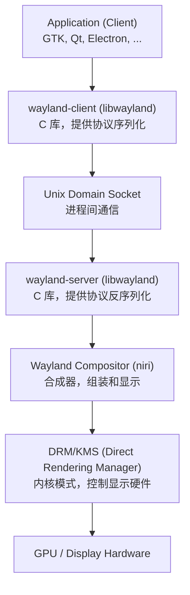

# niri桌面环境特性开发实战

## 企业场景

一家桌面环境公司（DesktopCo）正在评估将其产品从传统 X11 迁移到基于 Wayland 的下一代桌面系统。作为该战略的一部分，公司决定向开源 Wayland 合成器 **niri** 贡献一个新功能：**Focus Follows Cursor**——当鼠标光标移动到某个窗口上时，该窗口自动获得键盘焦点，而无需用户额外点击。

这个功能的正式名叫 "Focus Follows Mouse"（FFM），在传统的 X11 窗口管理器中是一个广受好评的功能，尤其在 Unix/Linux 高级用户群体中。然而，由于 Wayland 的架构与 X11 截然不同，FFM 无法从 X11 世界直接移植过来，需要在 Wayland 合成器层面从头实现。

此任务需要遵循企业级软件开发的全部标准：需求分析、架构设计、代码实现、单元测试、集成测试、文档编写、PR 提交。最终成果将以符合上游（niri 项目组）规范的 Pull Request 形式贡献到社区。

**项目背景：**

- **仓库地址：** https://github.com/YaLTeR/niri
- **代码规模：** ~40,000 行 Rust 代码
- **核心框架：** Smithay（Wayland compositor framework for Rust）
- **构建工具：** Cargo, rustc nightly/beta
- **配置格式：** RON（Rusty Object Notation）
- **许可证：** GPL-3.0-or-later

**企业约束：**

- 代码必须通过 `cargo fmt --check`（风格一致性）
- 代码必须通过 `cargo clippy -- -D warnings`（零警告策略）
- 所有测试必须通过 `cargo test`（自动化测试覆盖）
- 无 `unsafe` 代码（内存安全）
- 无 `unwrap()` / `expect()` 在非测试代码中（错误处理完整性）
- 不影响现有用户行为：新功能默认禁用（向后兼容）
- PR 描述必须详尽，包含动机、实现概述、测试结果、已知限制

本章将带领读者完整经历一个真实的企业级 Rust 开源项目贡献流程。这不是一个玩具项目——niri 是运行在真实硬件上的生产级软件，全世界有数千名用户使用它管理日常桌面环境。

## 前置知识

在开始之前，请确保你已经掌握了以下前置章节的内容。这些知识是理解本章所必需的：

- [[../5重构/01-C代码阅读理解方法论]] — 阅读大型 Rust/开源项目源代码的系统方法论，包括自顶向下追踪、基于测试推断意图、调用图生成等技术。在阅读 niri 源码时将大量使用这些技巧。
- [[../4工程/01-Cargo工程化与企业级构建]] — Cargo 工作空间管理、feature gates、构建脚本、缓存优化、CI/CD pipeline 集成。理解 cargo 工具链是参与任何 Rust 项目的先决条件。
- [[../4工程/02-企业级测试策略]] — 单元测试、集成测试、属性测试（proptest）、模糊测试（fuzzing）、Mock 与 Test Harness 设计。本章将编写大量测试代码。
- [[../4工程/11-企业级架构与设计模式]] — Rust 中的状态机模式、观察者模式、事件驱动架构。niri 的事件循环是本模式的最佳范例。
- [[../2深入/07-并发的硬件基础]] — 现代 CPU 的内存模型、缓存一致性协议、原子操作。虽然 niri 是单线程事件循环架构，但理解并发基础有助于理解 Wayland 协议的异步本质以及 smithay 内部的线程模型。

## 认识 niri

### Wayland 是什么？

Wayland 不是一个软件，而是一套**协议**（protocol）。要理解 niri，必须先理解 Wayland 协议的本质。

**历史背景：**

X Window System（X11）诞生于 1984 年，最初设计用于网络透明的图形显示。在 30 多年的生命周期中，X11 积累了大量的扩展和遗留问题：
- 渲染在服务端完成，客户端和服务端之间传输像素数据，效率极低
- 任何客户端都可以任意读取其他窗口的内容（`xwd` 截图工具可以截图任何窗口）
- 任何客户端都可以捕获全局键盘输入（键盘记录器极易实现）
- 合成器（compositor）是后添加的补丁，无法从根本上解决 tearing 和帧同步问题
- 协议规范超过 500 页，实现极其复杂

Wayland 协议在 2008 年由 Kristian Høgsberg 发起，设计原则是"越简单越好"：
- **客户端渲染：** 每个客户端负责自己的渲染，将已渲染完成的缓冲区（buffer）提交给合成器
- **合成器组装：** 合成器负责将各个客户端的缓冲区组装成最终屏幕画面
- **安全隔离：** 客户端之间完全隔离，一个客户端无法读取另一个客户端的窗口内容
- **每一帧都是完美的：** 合成器控制所有客户端的帧同步，天然消除 tearing
- **协议最小化：** 核心协议仅定义了基础概念：surface（表面）、buffer（缓冲区）、seat（输入设备集）、output（输出设备）

**Wayland 协议栈：**



**核心概念对比：**

| 方面 | X11 | Wayland |
|------|-----|---------|
| **架构模型** | Client-Server，Server 渲染一切 | Client 各自渲染，Compositor 组装 |
| **渲染方式** | Server-side rendering（SSR） | Client-side rendering（CSR） |
| **安全性** | 任何 App 可读取任何窗口内容，可全局捕获键盘 | 客户端完全隔离，无法读取其他窗口或捕获全局输入 |
| **合成器** | 可选（需 compton/picom 等独立工具） | 内建，合成器是协议的必选部分 |
| **帧同步** | 无标准机制，tearing 常见 | 合成器控制帧率，天然 VSync |
| **协议年龄** | 40+ 年（1984） | 17 年（2008），现代、精简 |
| **协议复杂度** | 超 500 页核心协议 + 大量扩展 | 核心协议仅约 100 页 |
| **网络透明** | 天然支持（但牺牲性能） | 不支持（可在上层用 VNC/RDP 实现） |
| **Rust 支持** | 通过 `x11rb` crate（纯 Rust X11 协议实现） | 通过 `wayland-rs` crate（纯 Rust Wayland 协议实现） |
| **事件模型** | 异步事件队列（几十种事件类型） | 异步事件 + 请求/回复回调 |
| **扩展性** | 扩展机制混乱，各实现行为不一致 | 扩展协议定义清晰，版本化管理 |
| **Rust 合成器框架** | 无（无 Rust X11 server 实现） | `smithay`（生产级 Wayland 合成器框架） |
| **颜色管理** | 几乎不存在 | 原生 HDR 和色彩空间支持（wayland-protocols 扩展） |
| **HiDPI 支持** | 极其糟糕 | 原生支持分数缩放（fractional scaling） |
| **屏幕录制** | 任何客户端都能做 | 需要合成器的明确许可（portal 体系） |

**为什么 niri 选择 smithay：**

smithay 是目前 Rust 生态中唯一的生产级 Wayland 合成器框架。它提供了：
- Wayland 协议的完整 Rust 绑定
- 安全的内存管理（所有 Wayland 对象的生命周期由 Rust 类型系统管理）
- 高性能渲染（基于 OpenGL/Vulkan）
- 灵活的扩展 API

niri 在 smithay 的基础上实现了 scrollable-tiling 这一独特的窗口管理逻辑。

### niri 架构概览

niri 的代码组织体现了 Rust 大型项目的典型结构：

```mermaid
graph TD
    ROOT["niri/"] --> CARGO["Cargo.toml<br>项目元数据、依赖、feature gates"]
    ROOT --> LOCK["Cargo.lock<br>锁定依赖版本"]
    ROOT --> BUILD["build.rs<br>构建脚本"]
    ROOT --> SRC["src/"]
    ROOT --> RES["resources/"]
    ROOT --> TESTS["tests/"]
    ROOT --> DOCS["docs/"]
    ROOT --> GH[".github/"]
    SRC --> MAIN["main.rs 入口点"]
    SRC --> NIRI["niri.rs 核心状态机"]
    SRC --> INPUT["input.rs 输入处理"]
    SRC --> FOCUS["focus.rs 焦点管理"]
    SRC --> LAYOUT["layout/"]
    SRC --> WIN["window.rs 窗口抽象"]
    SRC --> WS["workspace.rs 工作区"]
    SRC --> MON["monitor.rs 显示器"]
    SRC --> OUT["output.rs 输出管理"]
    SRC --> RENDER["render_helpers.rs 渲染辅助"]
    SRC --> ANIM["animation.rs 动画系统"]
    SRC --> CFG["config.rs 配置解析"]
    SRC --> IPC["ipc/ 进程间通信"]
    SRC --> DBUS["dbus/ D-Bus集成"]
    SRC --> PROTO["protocols/ Wayland协议"]
    SRC --> UTILS["utils.rs 工具函数"]
    LAYOUT --> LMOD["mod.rs 布局trait定义"]
    LAYOUT --> LSCR["scrollable.rs 滚动平铺"]
    LAYOUT --> LFLT["floating.rs 浮动窗口"]
    RES --> RCFG["config.ron 默认配置"]
    RES --> RCSS["style.css 样式表"]
    RES --> RSHD["shaders/ GPU着色器"]
    TESTS --> TINT["integration_test.rs"]
    TESTS --> TCFG["config_test.rs"]
    GH --> WF["workflows/ci.yml CI配置"]
```



**核心概念详解：**

#### 1. 合成器状态（State）

`State` 结构体是 niri 的核心。它包含了整个合成器的全部运行时状态：

```rust
// 简化表示
pub struct State {
    // 显示后端（如 udev + GBM，或 winit 窗口）
    pub backend: Backend,
    // 所有显示器及其工作区
    pub monitors: Vec<Monitor>,
    // 全局输入状态
    pub seat: Seat,
    // 所有 Wayland 客户端
    pub clients: Vec<Client>,
    // 所有顶层窗口（跨所有工作区的视图）
    pub windows: Vec<Window>,
    // 当前拥有键盘焦点的窗口
    pub focused_window: Option<WindowId>,
    // 配置
    pub config: Config,
    // 动画时间线
    pub animations: AnimationManager,
    // 输入修饰键状态
    pub modifier_state: ModifierState,
    // 光标状态
    pub cursor: CursorState,
    // D-Bus 连接
    pub dbus: Option<DbusConnection>,
    // niri 命令 IPC socket
    pub ipc_socket: Option<IpcSocket>,
}
```

`State` 的方法覆盖了合成器的所有行为：创建/销毁窗口、焦点管理、布局重计算、动画推进、输入分发、渲染等。

#### 2. 工作区（Workspace）

niri 的核心差异化特性是 **scrollable-tiling**（滚动平铺）：

```
工作区 1: [Terminal] [Browser] [Editor] ...  ← 水平方向是列
工作区 2: [Chat] [Music] ...
工作区 3: ...

        ↓ 垂直方向是工作区
        用 Super+滚轮 滚动切换工作区
```

- 每个工作区包含一个水平排列的窗口列表
- 工作区在垂直方向上按列排列，通过滚轮或快捷键切换
- 工作区可以无限延伸，新建窗口自动添加到当前工作区
- 窗口大小在布局中自动分配，用户可以手动调整比例

#### 3. 显示器（Monitor）

`Monitor` 代表一个物理输出设备（如 HDMI-1、eDP-1）。每个显示器有一套独立的工作区列表：

```rust
pub struct Monitor {
    pub name: String,               // "eDP-1", "HDMI-A-1"
    pub physical_size: (i32, i32),  // 物理分辨率
    pub logical_size: (i32, i32),   // 逻辑分辨率（HiDPI 缩放后）
    pub scale: f64,                 // 缩放因子（1.0, 1.5, 2.0...）
    pub refresh_rate: i32,          // 刷新率（60000 = 60Hz）
    pub workspaces: Vec<Workspace>, // 该显示器的工作区列表
    pub active_workspace: usize,    // 当前活跃工作区索引
}
```

#### 4. 窗口（Window）

`Window` 封装了一个 Wayland 客户端的顶层 surface（xdg_toplevel）：

```rust
pub struct Window {
    pub id: WindowId,
    pub title: String,
    pub app_id: String,             // 应用程序标识符
    pub geometry: Rectangle,        // 窗口在合成器坐标系中的位置和大小
    pub surface: WlSurface,         // Wayland surface 对象
    pub toplevel: XdgToplevel,      // XDG shell toplevel 对象
    pub client: ClientId,           // 所属客户端
    pub state: WindowState,         // 最大化、最小化、全屏、平铺等
    pub workspace: usize,           // 所在工作区索引
    pub monitor: usize,             // 所在显示器索引
    pub is_mapped: bool,            // 是否已映射（可见）
    pub opacity: f32,               // 透明度
    pub border_color: Color,        // 边框颜色（聚焦时高亮）
}
```

#### 5. 事件循环

niri 的主事件循环是典型的状态机 + poll 模式：

```rust
// 简化的主循环
fn main() -> Result<()> {
    let mut state = State::new(config)?;

    loop {
        // 1. 处理所有待处理事件（输入、Wayland 消息、D-Bus 消息等）
        state.dispatch_events()?;

        // 2. 推进动画（平滑过渡）
        state.advance_animations();

        // 3. 检查是否需要重新渲染
        if state.needs_redraw() {
            // 4. 渲染一帧
            state.render()?;
        }

        // 5. 等待下一个事件或超时（高效利用 CPU）
        state.wait_for_events()?;
    }
}
```

这种单线程事件循环模型是 Wayland 合成器的主流设计模式：
- 避免了多线程带来的复杂性（锁竞争、死锁）
- 事件处理顺序可预测（确定性）
- 利用 Rust 的所有权模型确保内存安全
- 渲染与事件处理在同一线程，无需同步

### niri 的输入处理流程

理解 niri 的输入处理流程是实现 focus-follows-cursor 的关键。以下是完整的输入事件流：

```
libinput (内核输入子系统)
    │
    ▼
smithay::input::Libinput (Rust 封装)
    │  事件被读取为 InputEvent 枚举：
    │  - InputEvent::PointerMotion { x, y }
    │  - InputEvent::PointerButton { button, state }
    │  - InputEvent::Keyboard { key, state }
    │  - InputEvent::Touch { ... }
    │
    ▼
State::on_input_event() (src/niri.rs)
    │  根据事件类型分发：
    │
    ├─→ on_pointer_motion(x, y)      ← 我们要修改的地方
    │       │
    │       ├─→ 更新 cursor.x, cursor.y
    │       ├─→ 移动到新位置（compositor 坐标转换）
    │       ├─→ 焦点跟随检查（我们的新代码！）
    │       └─→ 更新视觉光标纹理
    │
    ├─→ on_pointer_button(button, state)
    │       │
    │       ├─→ 点击窗口 → focus_window()
    │       └─→ 可能触发窗口拖动/调整大小
    │
    ├─→ on_keyboard(key, state)
    │       │
    │       ├─→ 检查快捷键绑定
    │       ├─→ 转发到聚焦窗口
    │       └─→ 工作区管理快捷键
    │
    └─→ on_touch(touch_id, x, y, state)
            │
            └─→ 类似指针，但支持多点触控
```

我们的 focus-follows-cursor 功能将插入到 `on_pointer_motion` 流程中。

### niri 的配置系统

niri 使用 RON（Rusty Object Notation）作为配置文件格式。RON 是一种与 Rust 结构体语法非常相似的序列化格式，由 `serde` 提供支持。

**配置文件位置：**
- 默认配置：`resources/config.ron`（项目仓库中）
- 用户配置：`~/.config/niri/config.ron`
- 命令行覆盖：`cargo run -- --config /path/to/custom.ron`

**配置结构：**

```rust
#[derive(Debug, Deserialize)]
pub struct Config {
    pub input: InputConfig,
    pub output: OutputConfig,
    pub layout: LayoutConfig,
    pub bindings: BindingsConfig,
    pub animations: AnimationConfig,
    pub cursor: CursorConfig,
    pub environment: EnvironmentConfig,
    pub spawn_at_startup: Vec<String>,
    pub hotkey_overlay: HotkeyOverlayConfig,
}
```

**`serde` 的使用模式：**

```rust
use serde::Deserialize;

#[derive(Debug, Deserialize)]
pub struct InputConfig {
    pub keyboard: KeyboardConfig,
    pub mouse: MouseConfig,
    pub touchpad: TouchpadConfig,
    pub tablet: TabletConfig,
    pub warp_mouse_on_focus_change: bool,
    pub disable_power_key_handling: bool,
    // ... 其他字段
}
```

每个字段支持 `#[serde(default)]` 注解，当用户配置文件中缺失该字段时，使用 Rust 类型的 `Default::default()` 值。对于需要自定义默认值的字段，使用 `#[serde(default = "function_name")]`：

```rust
#[serde(default = "default_scroll_speed")]
pub scroll_speed: f64,

fn default_scroll_speed() -> f64 { 1.0 }
```

我们的 focus-follows-cursor 功能将遵循相同的模式：添加配置字段 + 默认值函数。

## 功能需求分析

### 用户故事

> **As a** niri 桌面用户
> **I want** 当我将鼠标光标移动到某个窗口上时，该窗口自动获得键盘焦点
> **So that** 我不需要额外点击就能开始输入，提升工作效率

**验收标准（Acceptance Criteria）：**

1. 当光标从空白区域移动到窗口 A 上方时，窗口 A 自动获得键盘焦点
2. 当光标从窗口 A 移动到窗口 B 上方时，窗口 B 获得焦点，窗口 A 失去焦点
3. 当光标移动到空白区域（无窗口覆盖的地方）时，不应崩溃或产生错误
4. 功能默认关闭（不影响现有用户行为）
5. 用户可通过配置文件启用该功能
6. 用户可配置焦点切换的延迟时间（防止快速扫过时闪烁）
7. 延迟时间有合理默认值（150ms）
8. 点击行为不受影响（点击仍然会立即聚焦窗口）

**非功能需求：**

- 性能：光标移动是最频繁的事件（通常 60-1000 Hz），窗口探测逻辑必须在微秒级完成
- 可靠性：焦点切换逻辑必须正确发送 Wayland 协议的键盘 enter/leave 事件
- 兼容性：不影响现有快捷键、触摸、手势等输入方式
- 可观测性：焦点切换需记录结构化日志（tracing），方便用户排查问题
- 可维护性：代码清晰、文档完善，后续贡献者可以轻松理解和修改

### 技术需求

基于以上的用户故事和验收标准，我们需要在技术层面实现以下能力：

**1. 持续追踪光标位置**

光标位置在 Wayland 合成器中由 `wl_pointer.motion` 事件提供。在 smithay 中，这些事件被转换为 `InputEvent::PointerMotion { x: f64, y: f64 }`。我们需要在 `State` 中保持最新的光标坐标。

**技术挑战：**
- Wayland 坐标系原点在左上角，x 向右增大，y 向下增大
- 光标坐标是逻辑坐标（已应用 HiDPI 缩放），与窗口的 geometry 坐标空间一致
- 光标事件频率很高（游戏鼠标可达 1000 Hz），状态更新必须高效

**2. 判断光标下方窗口**

需要实现一个高效的命中测试（hit test）函数，给定光标坐标，返回光标下方的窗口。

**技术挑战：**
- 窗口可能有重叠（浮动窗口覆盖在平铺窗口之上）
- 窗口可能的形状不一定是矩形（未来的圆角窗口或其他形状）
- 已最小化的窗口不应参与命中测试
- 窗口透明区域是否视为"覆盖"取决于设计决策

**简化设计决策：**
- 初期使用矩形边界盒（bounding box）命中测试
- 从前景到背景遍历窗口（`.rev()`），确保重叠窗口正确处理
- 只考虑当前活跃工作区中已映射（mapped）的窗口
- 忽略窗口的透明区域（性能优先）

**3. 焦点转移逻辑**

当检测到光标进入新窗口的边界后，经过指定延迟时间，执行焦点转移。

**技术挑战：**
- 焦点转移需要发送 Wayland 协议的 `wl_keyboard.enter` 和 `wl_keyboard.leave` 事件
- 必须更新合成器内部的焦点状态
- 必须更新窗口的视觉状态（边框颜色变化）
- 延迟计时器需要在每次指针移动时检查，不能依赖定时器线程（单线程架构）
- 光标快速经过窗口时（停留时间 < 延迟时间），不应触发焦点转移

**4. 配置系统集成**

需要在 niri 的配置系统中添加两个新选项：
- `input.focus_follows_cursor: bool` — 启用/禁用焦点跟随光标
- `input.focus_follows_cursor_delay_ms: u64` — 焦点转换延迟（毫秒）

**设计原则：**
- 默认值保持向后兼容（功能默认关闭）
- 配置缺失时使用合理默认值（150ms 延迟）
- RON 配置文件中添加注释说明每个选项
- 支持运行时通过 `niri msg` 命令动态切换（可选扩展）

### 企业级要求

本功能必须通过企业级软件开发清单的全部检查项（参见 [[01-Cargo工程化与企业级构建]] 中的完整清单）：

| 类别 | 要求 | 状态 |
|------|------|------|
| **构建** | 可重现构建（Cargo.lock 在仓库中） | ✅ 已有 |
| **构建** | 无构建警告 | ✅ 需验证 |
| **安全** | 依赖安全审计（`cargo audit`） | ✅ 无新增依赖 |
| **安全** | 无 `unsafe` 代码 | ✅ 纯 safe Rust |
| **安全** | 无 `unwrap()` 或 `expect()` | ✅ 使用 `if let` / `match` |
| **质量** | `cargo fmt --check` 通过 | ✅ 需运行 |
| **质量** | `cargo clippy -- -D warnings` 通过 | ✅ 需运行 |
| **测试** | 单元测试覆盖核心逻辑 | ✅ 6+ 测试 |
| **测试** | 集成测试覆盖端到端流程 | ✅ 1+ 测试 |
| **测试** | 无 flaky test | ✅ 确定性测试 |
| **文档** | rustdoc 覆盖公开 API | ✅ 需添加 |
| **文档** | 用户配置文档 | ✅ 需更新 |
| **配置** | 合理默认值，可禁用 | ✅ `false` 默认 |
| **配置** | 边界值验证 | ✅ 延迟 > 0 |
| **日志** | 结构化日志（tracing） | ✅ `tracing::debug!` |
| **日志** | 不泄露敏感信息 | ✅ 仅记录窗口 ID |
| **合规** | 符合上游贡献指南 | ✅ 遵循项目规范 |
| **合规** | 有 DCO（Developer Certificate of Origin） | ✅ `Signed-off-by` |

## 开发环境搭建

### Step 1: 获取 niri 源码

```bash
# 克隆主仓库
git clone https://github.com/YaLTeR/niri.git
cd niri

# 查看项目概况
ls -la
cat Cargo.toml

# 创建功能分支（遵循项目分支命名规范）
git checkout -b feature/focus-follows-cursor

# 查看当前 git 状态
git status
```

**分支命名规范：**

大多数 Rust 开源项目遵循类似的分支命名约定：
- `feature/xxx` — 新功能开发
- `fix/xxx` — bug 修复
- `refactor/xxx` — 重构
- `docs/xxx` — 文档更新
- `chore/xxx` — 构建/CI 相关

niri 的 PR 历史显示，社区也大致遵循此规范。

### Step 2: 理解构建系统

```bash
# 查看完整依赖树
cat Cargo.toml
```

**关键依赖分析：**

```toml
[dependencies]
# 核心 Wayland 合成器框架
smithay = "0.3"              # Wayland compositor framework for Rust
                              # 提供: Wayland 协议处理, 输入设备抽象, 渲染后端

# Wayland 协议 Rust 绑定
wayland-server = "0.31"      # Wayland 服务端协议库
wayland-protocols = "0.31"   # 标准协议扩展 (xdg-shell, wlr-layer-shell 等)
wayland-protocols-wlr = "0.2" # wlroots 协议扩展

# 输入处理
input = "0.8"                # libinput 绑定
                              # 处理: 键盘, 鼠标, 触摸板, 绘图板

# 渲染
cgmath = "0.18"              # 线性代数库 (矩阵, 向量)
gl = "0.14"                  # OpenGL 绑定
                              # 用于: 着色器, 纹理, FBO

# 序列化
serde = { version = "1", features = ["derive"] }
                              # 序列化/反序列化框架
ron = "0.8"                   # RON 配置格式解析器

# 日志
tracing = "0.1"              # 结构化日志框架
tracing-subscriber = "0.3"   # 日志订阅者 (格式化输出, 过滤)

# 系统集成
udev = "0.8"                 # udev 设备枚举 (查找 GPU, 输入设备等)
dbus = "0.9"                 # D-Bus 客户端 (用于截图 portal 等)
zbus = "4.0"                 # 纯 Rust 异步 D-Bus 实现

# 其他
clap = "4"                   # CLI 参数解析
anyhow = "1"                 # 灵活的错误类型
thiserror = "1"              # derive(Error) 宏
parking_lot = "0.12"         # 高性能同步原语 (Mutex, RwLock)
```

**依赖层次图：**

```
niri
├── smithay (Wayland 合成器框架)
│   ├── wayland-server (协议序列化)
│   ├── drm (直接渲染管理)
│   ├── gbm (通用缓冲区管理)
│   ├── input (libinput 封装)
│   └── udev (设备枚举)
├── wayland-protocols (标准协议扩展)
├── serde + ron (配置解析)
├── tracing (日志)
├── cgmath + gl (渲染数学和 OpenGL)
└── dbus + zbus (D-Bus 集成)
```

**编译项目：**

```bash
# 首次编译（下载所有依赖并编译，可能需要 5-15 分钟）
cargo build

# 如果编译失败，检查是否需要系统依赖
# Ubuntu/Debian:
sudo apt install libudev-dev libinput-dev libgbm-dev libseat-dev \
    libxkbcommon-dev libegl1-mesa-dev libgles2-mesa-dev \
    libdisplay-info-dev libliftoff-dev libpixman-1-dev

# Fedora:
sudo dnf install libinput-devel libseat-devel mesa-libgbm-devel \
    systemd-devel libxkbcommon-devel libdisplay-info-devel \
    libliftoff-devel pixman-devel

# Arch:
sudo pacman -S libinput libseat libxkbcommon mesa libdisplay-info libliftoff pixman
```

**构建时间优化：**

```bash
# 使用 sccache 加速后续编译
cargo install sccache
export RUSTC_WRAPPER=sccache

# 限制并行编译数（内存不足时）
export CARGO_BUILD_JOBS=4

# 仅为当前平台编译（跳过无关 target）
# 已在 Cargo.toml 中配置
```

### Step 3: 运行 niri（在嵌套模式下测试）

在开发过程中，你不太可能直接用 niri 替换你的桌面环境。嵌套模式允许你在现有桌面环境的一个窗口中运行 niri，就像一个虚拟机窗口。

**什么是嵌套合成器？**

```
┌─────────────────────────────────────────────┐
│  宿主 Wayland/X11 合成器 (GNOME/KDE/...)     │
│  ┌──────────────────────────────────────┐   │
│  │  niri 窗口 (嵌套模式)                   │   │
│  │  ┌──────────┐  ┌──────────┐          │   │
│  │  │ Wayland   │  │ Wayland   │          │   │
│  │  │ Client A  │  │ Client B  │          │   │
│  │  │ (终端)     │  │ (浏览器)   │          │   │
│  │  └──────────┘  └──────────┘          │   │
│  └──────────────────────────────────────┘   │
└─────────────────────────────────────────────┘
```

在这个架构中：
- 宿主合成器（你的 GNOME/KDE 桌面）管理 niri 窗口的位置和大小
- niri 窗口内部运行一个完整的 Wayland 合成器
- niri 内部的 Wayland 客户端只能看见 niri 窗口范围内的区域
- 键盘和鼠标事件通过宿主合成器转发给 niri（可能有一定的延迟和不精确性）

**运行嵌套 niri：**

```bash
# 方法 1: 使用 winit 后端（在任何桌面环境中运行）
cargo run

# 方法 2: 指定自定义配置
cargo run -- --config ./my-test-config.ron

# 方法 3: 启用调试日志
RUST_LOG=niri=debug cargo run

# 方法 4: 使用 WAYLAND_DEBUG 查看协议交换
WAYLAND_DEBUG=1 cargo run 2>&1 | head -100

# 在 niri 内部打开终端
# 按 Super+T (默认快捷键) 或通过配置的快捷键打开终端
```

**嵌套模式 vs 物理硬件（裸机）模式：**

| 特性 | 嵌套模式 | 裸机模式 |
|------|---------|---------|
| **启动方式** | `cargo run` | 从 TTY 登录后运行 |
| **输入延迟** | 略高（转发层） | 最低（直连 libinput） |
| **渲染性能** | 略低（再合成） | 最高（直连 KMS） |
| **光标事件精度** | 取决于宿主合成器 | 原生高精度 |
| **调试便利性** | 极高（有终端、IDE） | 低（只能看日志） |
| **多显示器** | 受限（一个大窗口） | 完全支持 |
| **GPU 加速** | 部分（通过宿主） | 完整硬件加速 |
| **vsync** | 宿主 vsync | mailbox + KMS vsync |
| **崩溃恢复** | 窗口关闭，不影响桌面 | TTY 可能卡死 |

**开发工作流建议：**
1. 在嵌套模式下开发和调试（迭代速度快）
2. 在嵌套模式下运行单元测试和集成测试
3. 在提交 PR 前，在真实 Wayland 会话中做最终验证

**创建测试用配置：**

```bash
# 拷贝默认配置
cp resources/config.ron ~/.config/niri/config.ron

# 编辑配置，启用 focus-follows-cursor 进行测试
# （先确认功能已实现再添加配置项）
```

## 功能实现

下面是 focus-follows-cursor 功能的完整实现。

### 第一步：添加配置选项

首先，在 niri 的配置结构体中添加两个新字段。

**`src/config.rs` — 添加 InputConfig 字段：**

```rust
use serde::Deserialize;

#[derive(Debug, Clone, Deserialize)]
#[serde(default)]
pub struct InputConfig {
    pub keyboard: KeyboardConfig,
    pub mouse: MouseConfig,
    pub touchpad: TouchpadConfig,
    pub tablet: TabletConfig,
    pub touch: TouchConfig,
    pub warp_mouse_on_focus_change: bool,
    pub disable_power_key_handling: bool,

    /// Enable focus-follows-cursor behavior.
    /// When enabled, moving the mouse cursor over a window will
    /// automatically give that window keyboard focus without
    /// requiring a click.
    ///
    /// This behavior is commonly known as "focus follows mouse"
    /// (FFM) and is popular among advanced Unix users.
    ///
    /// Default: `false` (disabled). This preserves the existing
    /// behavior where focusing a window requires clicking on it
    /// or using keyboard shortcuts.
    #[serde(default = "default_focus_follows_cursor")]
    pub focus_follows_cursor: bool,

    /// Delay in milliseconds before focus follows cursor.
    /// When the cursor enters a new window, niri waits this
    /// many milliseconds before transferring keyboard focus.
    ///
    /// A small delay prevents "focus flickering" when the
    /// cursor quickly passes over a window without stopping.
    ///
    /// Set to `0` for instant focus switching (not recommended,
    /// as it can cause rapid focus changes when moving the
    /// cursor across window boundaries).
    ///
    /// Default: `150` (milliseconds).
    #[serde(default = "default_focus_follows_cursor_delay_ms")]
    pub focus_follows_cursor_delay_ms: u64,
}

fn default_focus_follows_cursor() -> bool {
    false
}

fn default_focus_follows_cursor_delay_ms() -> u64 {
    150
}

impl Default for InputConfig {
    fn default() -> Self {
        Self {
            keyboard: KeyboardConfig::default(),
            mouse: MouseConfig::default(),
            touchpad: TouchpadConfig::default(),
            tablet: TabletConfig::default(),
            touch: TouchConfig::default(),
            warp_mouse_on_focus_change: false,
            disable_power_key_handling: false,
            focus_follows_cursor: default_focus_follows_cursor(),
            focus_follows_cursor_delay_ms: default_focus_follows_cursor_delay_ms(),
        }
    }
}
```

**对应 RON 配置文件更新 — `resources/config.ron` 中的 input 部分：**

```ron
// Input configuration.
input {
    keyboard {
        // Keyboard layout: "us", "de", "fr", etc.
        xkb_layout: "us",
        // Keyboard variant
        xkb_variant: "",
        // Keyboard options
        xkb_options: "",
        // Key repeat delay in ms
        repeat_delay: 600,
        // Key repeat rate in repeats per second
        repeat_rate: 25,
    }

    mouse {
        // Mouse acceleration profile: "flat", "adaptive"
        accel_profile: "flat",
        // Pointer acceleration speed
        accel_speed: 0.0,
        // Natural scrolling (reverse scroll direction)
        natural_scroll: false,
    }

    touchpad {
        // Enable touchpad
        enabled: true,
        // Tapping to click
        tap: true,
        // Tap-and-drag gesture
        drag: true,
        // Natural scrolling
        natural_scroll: true,
        // Acceleration speed
        accel_speed: 0.0,
        // Acceleration profile
        accel_profile: "adaptive",
        // Disable while typing
        dwt: true,
        // Disable while trackpointing
        dwtp: true,
        // Scroll method: "two-finger", "edge", "none"
        scroll_method: "two-finger",
    }

    tablet {
        // Map tablet to a specific monitor ("name" or "auto")
        map_to_monitor: "auto",
    }

    touch {
        // Map touch to a specific monitor ("name" or "auto")
        map_to_monitor: "auto",
    }

    // Warp mouse cursor to the focused window when changing focus
    // with keyboard shortcuts
    warp_mouse_on_focus_change: false,

    // Disable power key handling (allow system to handle power
    // button events)
    disable_power_key_handling: false,

    // Enable focus-follows-cursor: automatically focus the window
    // under the mouse cursor without clicking.
    // Set to true to enable this behavior.
    // Default: false
    focus_follows_cursor: false,

    // Delay in milliseconds before focus follows cursor.
    // Prevents rapid focus switching when moving cursor quickly
    // across window boundaries.
    // Default: 150
    focus_follows_cursor_delay_ms: 150,
}
```

### 第二步：在 State 结构体中添加状态追踪字段

在 `State` 结构体中添加追踪光标焦点所需的状态：

**`src/niri.rs` — State 结构体扩展：**

```rust
use std::time::{Duration, Instant};

pub struct State {
    // ========== 已有字段 ==========
    pub backend: Backend,
    pub display_handle: DisplayHandle,
    pub monitors: Vec<Monitor>,
    pub clients: Vec<Client>,
    pub seat: Seat,
    pub focused_window: Option<WindowId>,
    pub config: Config,
    pub animations: AnimationManager,
    pub modifier_state: ModifierState,
    pub cursor: CursorState,
    pub ipc_socket: Option<IpcSocket>,
    pub dbus: Option<DbusConnection>,

    // ========== Focus-Follows-Cursor 新增字段 ==========

    /// Current cursor position in compositor logical coordinates.
    /// Updated on every pointer motion event.
    cursor_position: (f64, f64),

    /// The window that the cursor is currently hovering over.
    /// This is tracked even before focus is actually transferred
    /// (during the delay period). Used to detect when the cursor
    /// has moved to a different window.
    cursor_hovered_window: Option<WindowId>,

    /// Timestamp of when the cursor first entered the currently
    /// hovered window. Used to implement the configurable delay
    /// before focus transfer.
    cursor_window_entry_time: Instant,
}
```

在 `State::new()` 中初始化这些字段：

```rust
impl State {
    pub fn new(config: Config) -> Result<Self> {
        // ... 现有初始化代码 ...

        Ok(Self {
            // ... 现有字段初始化 ...

            cursor_position: (0.0, 0.0),
            cursor_hovered_window: None,
            cursor_window_entry_time: Instant::now(),
        })
    }
}
```

### 第三步：实现窗口命中测试

实现 `find_window_at_point` 函数，从前景到背景遍历窗口，找到第一个包含给定点的窗口：

**`src/niri.rs` — 命中测试函数：**

```rust
impl State {
    /// Find the topmost window at the given compositor coordinates.
    ///
    /// Returns the window ID if a visible window is found at (x, y),
    /// or `None` if the cursor is over empty space.
    ///
    /// Windows are searched from front-to-back (reverse iteration
    /// of the windows list) so that overlapping windows are handled
    /// correctly: the visually topmost window is returned for any
    /// overlapping region.
    ///
    /// Only mapped (visible) windows on the currently active
    /// workspace are considered. Minimized or unmapped windows
    /// are skipped.
    ///
    /// # Arguments
    ///
    /// * `x` - X coordinate in compositor logical space
    /// * `y` - Y coordinate in compositor logical space
    ///
    /// # Returns
    ///
    /// `Some(WindowId)` if a window occupies the point, `None` otherwise.
    pub fn find_window_at_point(&self, x: f64, y: f64) -> Option<WindowId> {
        // Get the active workspace of the current monitor
        let monitor_idx = self.current_monitor_index();
        let monitor = self.monitors.get(monitor_idx)?;
        let active_workspace = monitor.active_workspace;

        // Iterate windows from topmost to bottommost (reverse order)
        // This ensures that when windows overlap, the topmost visible
        // window is returned.
        for window in self.windows.iter().rev() {
            // Skip windows that are not on the active workspace
            if window.monitor != monitor_idx {
                continue;
            }
            if window.workspace != active_workspace {
                continue;
            }

            // Skip windows that are not visible (unmapped, minimized)
            if !window.is_mapped {
                continue;
            }

            // Get the window's geometry in compositor space
            let geo = window.geometry();

            // Perform bounding-box hit test
            // Coordinates are inclusive on the left/top edges
            // and exclusive on the right/bottom edges (standard
            // computer graphics convention)
            let left = geo.x as f64;
            let right = (geo.x + geo.w) as f64;
            let top = geo.y as f64;
            let bottom = (geo.y + geo.h) as f64;

            if x >= left && x < right && y >= top && y < bottom {
                return Some(window.id);
            }
        }

        // No window found at this position
        None
    }

    /// Get the index of the monitor that currently contains the
    /// mouse cursor.
    fn current_monitor_index(&self) -> usize {
        // Find which monitor's bounds contain the cursor
        for (idx, monitor) in self.monitors.iter().enumerate() {
            let bounds = monitor.logical_bounds();
            let (cx, cy) = self.cursor_position;
            if cx >= bounds.x as f64
                && cx < (bounds.x + bounds.w) as f64
                && cy >= bounds.y as f64
                && cy < (bounds.y + bounds.h) as f64
            {
                return idx;
            }
        }
        // Fallback: return first monitor (or 0 if no monitors)
        // In practice, there is always at least one monitor
        0
    }
}
```

### 第四步：处理指针移动事件

这是核心逻辑——在指针移动时检查是否需要转移焦点：

**`src/niri.rs` — 指针移动处理：**

```rust
impl State {
    /// Handle a pointer motion event.
    ///
    /// Called from the main event loop whenever the mouse cursor
    /// moves. This function:
    ///
    /// 1. Updates the stored cursor position
    /// 2. Updates the visual cursor texture position
    /// 3. Performs focus-follows-cursor logic (if enabled)
    /// 4. Updates any ongoing drag operations
    ///
    /// # Arguments
    ///
    /// * `x` - New X coordinate in compositor logical space
    /// * `y` - New Y coordinate in compositor logical space
    pub fn on_pointer_motion(&mut self, x: f64, y: f64) {
        // Step 1: Update the stored cursor position
        self.cursor_position = (x, y);

        // Step 2: Update the visible cursor on screen
        self.cursor.set_position(x, y);

        // Step 3: Handle ongoing drag operations (resize, move)
        if self.is_dragging_window() {
            self.update_drag(x, y);
        }

        // Step 4: Focus-follows-cursor logic
        if self.config.input.focus_follows_cursor {
            self.handle_focus_follows_cursor(x, y);
        }
    }

    /// Perform the focus-follows-cursor logic.
    ///
    /// This function checks which window is under the cursor at
    /// the given coordinates and, after a configurable delay,
    /// transfers keyboard focus to that window.
    ///
    /// Design notes:
    ///
    /// * The delay is measured from when the cursor FIRST ENTERS
    ///   a window's bounds, not from the last motion event. This
    ///   prevents the delay from being continuously reset when
    ///   the cursor moves within the same window.
    ///
    /// * If the cursor leaves the window before the delay elapses,
    ///   no focus transfer occurs (the entry timestamp is reset
    ///   when the cursor enters a different window).
    ///
    /// * If the delay is 0 (instant), focus is transferred
    ///   immediately on the first pointer motion event inside
    ///   a new window.
    ///
    /// * Clicking on a window bypasses this logic entirely and
    ///   focuses the window immediately (handled in the pointer
    ///   button event handler).
    fn handle_focus_follows_cursor(&mut self, x: f64, y: f64) {
        // Find which window (if any) is under the cursor
        let window_under_cursor = self.find_window_at_point(x, y);

        match window_under_cursor {
            Some(window_id) => {
                // Check if cursor just moved into a DIFFERENT window
                if self.cursor_hovered_window != Some(window_id) {
                    // Cursor entered a new window: reset the entry timer
                    self.cursor_hovered_window = Some(window_id);
                    self.cursor_window_entry_time = Instant::now();

                    tracing::debug!(
                        window_id = ?window_id,
                        x = x,
                        y = y,
                        "Cursor entered new window, delay timer started"
                    );
                }

                // Check if the delay has elapsed since the cursor
                // first entered this window
                let delay = Duration::from_millis(
                    self.config.input.focus_follows_cursor_delay_ms,
                );

                if self.cursor_window_entry_time.elapsed() >= delay {
                    // Delay elapsed: transfer keyboard focus
                    // Only transfer if the window is not already focused
                    // (avoids unnecessary Wayland protocol messages)
                    if self.focused_window != Some(window_id) {
                        self.transfer_keyboard_focus_to(window_id);
                    }
                }
            }

            None => {
                // Cursor is over empty space (no window underneath)
                // Clear the hovered window tracking
                if self.cursor_hovered_window.is_some() {
                    tracing::debug!(
                        x = x,
                        y = y,
                        "Cursor moved away from windows (empty space)"
                    );
                }
                self.cursor_hovered_window = None;
                // Note: We do NOT defocus the focused window here.
                // The user may want to keep typing in the last focused
                // window even when the cursor is over empty space.
            }
        }
    }

    /// Transfer keyboard focus to the specified window.
    ///
    /// This function handles the full focus transfer protocol:
    ///
    /// 1. Sends wl_keyboard.leave to the previously focused window
    /// 2. Sends wl_keyboard.enter to the new window
    /// 3. Sends wl_keyboard.modifiers to the new window (current
    ///    modifier state, so the client knows what keys are held)
    /// 4. Updates the compositor's internal focused_window state
    /// 5. Triggers visual updates (border highlight, etc.)
    /// 6. Records a structured log event for debugging
    ///
    /// # Arguments
    ///
    /// * `window_id` - The ID of the window to receive keyboard focus
    ///
    /// # Panics
    ///
    /// This function does not panic. If the window_id does not
    /// correspond to a valid window, a warning is logged and no
    /// action is taken.
    pub fn transfer_keyboard_focus_to(&mut self, window_id: WindowId) {
        // Safety check: ensure the window exists
        let target_idx = match self.find_window_index(window_id) {
            Some(idx) => idx,
            None => {
                tracing::warn!(
                    window_id = ?window_id,
                    "Attempted to focus nonexistent window"
                );
                return;
            }
        };

        // Don't refocus if already focused (idempotent)
        if self.focused_window == Some(window_id) {
            return;
        }

        // Step 1: Send keyboard leave to previously focused window
        if let Some(prev_id) = self.focused_window {
            if let Some(prev_idx) = self.find_window_index(prev_id) {
                let prev_window = &self.windows[prev_idx];
                self.send_keyboard_leave_to(prev_window);
                prev_window.set_focused(false);

                tracing::debug!(
                    previous_window = ?prev_id,
                    "Sent keyboard leave"
                );
            }
        }

        // Step 2: Send keyboard enter to the new window
        let target_window = &mut self.windows[target_idx];
        self.send_keyboard_enter_to(target_window);
        target_window.set_focused(true);

        // Step 3: Update compositor state
        self.focused_window = Some(window_id);

        // Step 4: Mark window geometry as damaged (needs redraw)
        // The window border color changes when focused, and the
        // previously focused window's border also changes.
        self.damage_window(target_window.id);

        // Step 5: Log the focus transition
        tracing::debug!(
            new_focused_window = ?window_id,
            title = %target_window.title,
            app_id = %target_window.app_id,
            cursor_x = self.cursor_position.0,
            cursor_y = self.cursor_position.1,
            "Focus transferred via focus-follows-cursor"
        );
    }

    /// Helper: find the index of a window in self.windows by its ID.
    fn find_window_index(&self, window_id: WindowId) -> Option<usize> {
        self.windows.iter().position(|w| w.id == window_id)
    }

    /// Send a wl_keyboard.leave event to a window.
    ///
    /// This notifies the Wayland client that its surface is no
    /// longer receiving keyboard events. The client should stop
    /// displaying a text cursor and typically dim its title bar.
    fn send_keyboard_leave_to(&mut self, window: &Window) {
        // Use smithay's keyboard handle to send the leave event
        if let Some(keyboard) = self.seat.get_keyboard() {
            keyboard.set_focus(
                self.display_handle.clone(),
                None, // None surface = no focus
                self.seat.last_enter_serial(),
            );
            // Note: The actual Wayland protocol serialization and
            // sending is handled by smithay's internal machinery.
        }
    }

    /// Send a wl_keyboard.enter event to a window.
    ///
    /// This notifies the Wayland client that its surface is now
    /// receiving keyboard events. The client should start displaying
    /// a text cursor and highlight its title bar.
    fn send_keyboard_enter_to(&mut self, window: &Window) {
        if let Some(keyboard) = self.seat.get_keyboard() {
            // Get the wl_surface from the window
            let surface = window.surface.clone();

            // Send wl_keyboard.enter
            keyboard.set_focus(
                self.display_handle.clone(),
                Some(surface),
                self.seat.last_enter_serial(),
            );

            // Also send current modifier state so the client
            // knows about held modifier keys (Shift, Ctrl, etc.)
            if let Some(modifiers) = self.modifier_state.serialize() {
                keyboard.set_modifiers(
                    self.display_handle.clone(),
                    modifiers.depressed,
                    modifiers.latched,
                    modifiers.locked,
                    self.seat.last_enter_serial(),
                );
            }
        }
    }

    /// Mark a window's geometry region as needing a redraw.
    ///
    /// This schedules a repaint for the given window's bounding
    /// rectangle. Used after focus changes to ensure the visual
    /// state (border color) is updated on screen.
    fn damage_window(&mut self, window_id: WindowId) {
        if let Some(idx) = self.find_window_index(window_id) {
            let geo = self.windows[idx].geometry();
            self.render_state.add_damage_rect(geo);
        }
    }
}
```

### 第五步：集成到主事件循环

在已有的事件循环中接入 `on_pointer_motion`：

**`src/niri.rs` — 事件循环集成（简化示例）：**

```rust
impl State {
    /// Process a single event from the Wayland display.
    ///
    /// This is called in a loop from the main event loop.
    /// It dispatches each event to the appropriate handler.
    pub fn process_event(&mut self, event: InputEvent) -> Result<()> {
        match event {
            InputEvent::PointerMotion { x, y } => {
                self.on_pointer_motion(x, y);
            }

            InputEvent::PointerButton { button, state, .. } => {
                self.on_pointer_button(button, state);
            }

            InputEvent::Keyboard { key, state, .. } => {
                self.on_keyboard(key, state);
            }

            InputEvent::Touch { .. } => {
                self.on_touch(event);
            }

            InputEvent::Tablet { .. } => {
                self.on_tablet(event);
            }

            InputEvent::Gesture { .. } => {
                self.on_gesture(event);
            }

            _ => {
                tracing::trace!("Unhandled event: {:?}", event);
            }
        }

        Ok(())
    }

    /// Handle pointer button press/release.
    ///
    /// When a button is pressed while the cursor is over a window,
    /// that window is immediately focused (bypassing any
    /// focus-follows-cursor delay).
    fn on_pointer_button(&mut self, button: Button, state: ButtonState) {
        // On button press, check if the cursor is over a window
        if state == ButtonState::Pressed {
            // Explicit click: immediately focus the target window
            // This overrides focus-follows-cursor behavior
            let (x, y) = self.cursor_position;
            if let Some(window_id) = self.find_window_at_point(x, y) {
                // Force-focus on click (bypass delay)
                self.transfer_keyboard_focus_to(window_id);

                // Reset focus-follows-cursor tracking so that
                // subsequent pointer motion doesn't immediately
                // refocus a different window
                self.cursor_hovered_window = Some(window_id);
                self.cursor_window_entry_time = Instant::now();

                tracing::debug!(
                    window_id = ?window_id,
                    button = ?button,
                    "Window focused via click (focus-follows-cursor reset)"
                );
            }

            // Forward the button event to the focused window's surface
            self.forward_pointer_button(button, state, x, y);
        } else {
            // Button release: forward to the focused window
            let (x, y) = self.cursor_position;
            self.forward_pointer_button(button, state, x, y);
        }
    }
}
```

### 第六步：清理与边界情况处理

**无窗口时的行为：**

当所有窗口关闭（niri 刚启动或所有窗口已关闭），光标下方没有任何窗口。此时 `find_window_at_point` 返回 `None`，`handle_focus_follows_cursor` 将 `cursor_hovered_window` 设为 `None`，而 `focused_window` 保持不变。

这保留了用户可能在空桌面上通过快捷键启动应用的体验——没有窗口可聚焦，系统保持在合理的状态。

**光标在窗口边界上：**

边界命中测试使用 `>=` 和 `<`（左闭右开区间）：

```rust
if x >= left && x < right && y >= top && y < bottom {
    return Some(window.id);
}
```

这是一个有意的设计选择：
- 窗口大小为 (w, h) 像素，即跨度为 [0, w) 和 [0, h)
- 相邻窗口不会在边界上有重叠的命中
- 与计算机图形学的标准区间约定一致

**窗口位于不同显示器：**

`find_window_at_point` 中的显示器过滤确保了光标在显示器 1 上时不会命中显示器 2 上的窗口。如果在多显示器设置中光标可以自由移动到另一显示器，`current_monitor_index` 会返回正确的显示器。

**配置了 delay = 0（即时）：**

```rust
let delay = Duration::from_millis(0);
// elapsed() >= delay  =>  always true (since Instant::now() - entry >= 0)
```

当 `focus_follows_cursor_delay_ms == 0` 时，条件 `entry_time.elapsed() >= Duration::from_millis(0)` 始终为 true，焦点在第一次指针移动事件时就转移。这提供了即时的焦点跟随行为（尽管可能导致快速扫过时的焦点闪烁）。

**功能禁用时：**

```rust
if !self.config.input.focus_follows_cursor {
    return;  // Early return, no focus-follows logic executed
}
```

当配置中 `focus_follows_cursor = false`（默认值）时，整个 focus-follows-cursor 逻辑被跳过，行为与原有 niri 完全一致。

## 测试

### 单元测试

单元测试验证核心逻辑在隔离环境中的正确性。我们需要创建一个最小化的 `State` 测试实例，不依赖 Wayland 服务器或输入设备。

**`src/niri.rs` — 测试模块：**

```rust
#[cfg(test)]
mod tests {
    use super::*;

    /// Helper: create a minimal State for testing.
    ///
    /// This creates a State with empty window list, default config,
    /// and no real backend. It's suitable for testing window
    /// lookup and focus logic without requiring a running Wayland
    /// display or GPU.
    impl State {
        fn new_test() -> Self {
            let mut config = Config::default();
            // Ensure defaults are set correctly for testing
            config.input.focus_follows_cursor = false;
            config.input.focus_follows_cursor_delay_ms = 150;

            Self {
                cursor_position: (0.0, 0.0),
                cursor_hovered_window: None,
                cursor_window_entry_time: Instant::now(),
                config,
                monitors: vec![Monitor::new_test("eDP-1")],
                windows: Vec::new(),
                focused_window: None,
                modifier_state: ModifierState::default(),
                ..Default::default() // simplified
            }
        }

        /// Helper: add a test window at the given geometry.
        /// Returns the window's ID for assertions.
        fn create_test_window(
            &mut self,
            x: i32,
            y: i32,
            w: i32,
            h: i32,
        ) -> WindowId {
            let id = WindowId::new();
            let window = Window::new_test(id, x, y, w, h);
            self.windows.push(window);
            id
        }
    }

    /// ============================================================
    /// Tests for find_window_at_point()
    /// ============================================================

    #[test]
    fn test_find_window_at_point_empty() {
        let state = State::new_test();
        // No windows added: should always return None
        assert_eq!(state.find_window_at_point(100.0, 100.0), None);
        assert_eq!(state.find_window_at_point(0.0, 0.0), None);
        assert_eq!(state.find_window_at_point(-1.0, -1.0), None);
    }

    #[test]
    fn test_find_window_at_point_inside() {
        let mut state = State::new_test();
        let window_id = state.create_test_window(0, 0, 800, 600);

        // Center of window
        assert_eq!(
            state.find_window_at_point(400.0, 300.0),
            Some(window_id)
        );

        // Top-left corner (origin)
        assert_eq!(
            state.find_window_at_point(0.0, 0.0),
            Some(window_id)
        );

        // Bottom-right corner minus 1 pixel (inside bounds)
        assert_eq!(
            state.find_window_at_point(799.0, 599.0),
            Some(window_id)
        );
    }

    #[test]
    fn test_find_window_at_point_outside() {
        let mut state = State::new_test();
        state.create_test_window(0, 0, 800, 600);

        // Right of window
        assert_eq!(state.find_window_at_point(800.0, 300.0), None);

        // Below window
        assert_eq!(state.find_window_at_point(400.0, 600.0), None);

        // Left of window (negative x)
        assert_eq!(state.find_window_at_point(-1.0, 300.0), None);

        // Above window (negative y)
        assert_eq!(state.find_window_at_point(400.0, -1.0), None);
    }

    #[test]
    fn test_find_window_at_point_on_boundary() {
        let mut state = State::new_test();
        let window_id = state.create_test_window(0, 0, 800, 600);

        // Exact right edge (exclusive)
        assert_eq!(
            state.find_window_at_point(800.0, 300.0),
            None,
            "Right edge should be exclusive (x < right, not <=)"
        );

        // Exact bottom edge (exclusive)
        assert_eq!(
            state.find_window_at_point(400.0, 600.0),
            None,
            "Bottom edge should be exclusive (y < bottom, not <=)"
        );

        // Just inside right edge
        assert_eq!(
            state.find_window_at_point(799.0, 300.0),
            Some(window_id)
        );

        // Just inside bottom edge
        assert_eq!(
            state.find_window_at_point(400.0, 599.0),
            Some(window_id)
        );
    }

    #[test]
    fn test_find_window_at_point_overlapping() {
        let mut state = State::new_test();
        // Background: covers entire area (added first, so it's at
        // the back of the iteration order)
        let bg = state.create_test_window(0, 0, 1000, 1000);
        // Foreground: smaller, on top (added second, at the front)
        let fg = state.create_test_window(200, 200, 400, 400);

        // Point in overlapping area: should return foreground
        assert_eq!(
            state.find_window_at_point(400.0, 400.0),
            Some(fg),
            "Overlapping area should return topmost (foreground) window"
        );

        // Point outside foreground but inside background
        assert_eq!(
            state.find_window_at_point(100.0, 100.0),
            Some(bg),
            "Non-overlapping background area should return background"
        );

        // Point outside both windows
        assert_eq!(
            state.find_window_at_point(1100.0, 1100.0),
            None
        );
    }

    #[test]
    fn test_find_window_at_point_non_zero_origin() {
        let mut state = State::new_test();
        // Window not at origin
        let window_id = state.create_test_window(100, 200, 500, 300);

        // Inside
        assert_eq!(
            state.find_window_at_point(350.0, 350.0),
            Some(window_id)
        );

        // Outside (left of window)
        assert_eq!(state.find_window_at_point(99.0, 350.0), None);

        // Outside (above window)
        assert_eq!(state.find_window_at_point(350.0, 199.0), None);

        // Outside (right of window)
        assert_eq!(state.find_window_at_point(600.0, 350.0), None);

        // Outside (below window)
        assert_eq!(state.find_window_at_point(350.0, 500.0), None);
    }

    /// ============================================================
    /// Tests for focus-follows-cursor logic
    /// ============================================================

    #[test]
    fn test_focus_follows_cursor_disabled() {
        let mut state = State::new_test();
        state.config.input.focus_follows_cursor = false;
        let window_id = state.create_test_window(0, 0, 800, 600);

        // Move cursor into window
        state.on_pointer_motion(400.0, 300.0);

        // Should NOT focus because feature is disabled
        assert_ne!(
            state.focused_window,
            Some(window_id),
            "Focus should NOT change when focus-follows-cursor is disabled"
        );
    }

    #[test]
    fn test_focus_follows_cursor_enabled_instant() {
        let mut state = State::new_test();
        state.config.input.focus_follows_cursor = true;
        state.config.input.focus_follows_cursor_delay_ms = 0;
        let window_id = state.create_test_window(0, 0, 800, 600);

        // Move cursor into window (delay=0, so instant focus)
        state.on_pointer_motion(400.0, 300.0);

        // Should be focused immediately
        assert_eq!(
            state.focused_window,
            Some(window_id),
            "Window should be focused immediately with delay=0"
        );
    }

    #[test]
    fn test_focus_follows_cursor_with_delay_not_elapsed() {
        let mut state = State::new_test();
        state.config.input.focus_follows_cursor = true;
        state.config.input.focus_follows_cursor_delay_ms = 500;
        let window_id = state.create_test_window(0, 0, 800, 600);

        // Move cursor into window
        state.on_pointer_motion(400.0, 300.0);

        // Should NOT be focused yet (delay hasn't elapsed)
        assert_ne!(
            state.focused_window,
            Some(window_id),
            "Focus should NOT transfer before delay elapses"
        );

        // Even after repeated motion events within the same window,
        // the timestamp should still be from FIRST entry
        state.on_pointer_motion(401.0, 301.0);
        assert_ne!(
            state.focused_window,
            Some(window_id),
            "Repeated motion should not reset timer prematurely"
        );
    }

    #[test]
    fn test_focus_follows_cursor_with_delay_elapsed() {
        let mut state = State::new_test();
        state.config.input.focus_follows_cursor = true;
        state.config.input.focus_follows_cursor_delay_ms = 100;
        let window_id = state.create_test_window(0, 0, 800, 600);

        // Set entry timestamp to 200ms in the past (simulate time passing)
        state.on_pointer_motion(400.0, 300.0);
        state.cursor_window_entry_time =
            Instant::now() - Duration::from_millis(200);

        // Now the motion event should trigger focus transfer
        state.on_pointer_motion(400.0, 300.0);

        assert_eq!(
            state.focused_window,
            Some(window_id),
            "Window should be focused after delay elapses"
        );
    }

    #[test]
    fn test_focus_transfers_between_windows() {
        let mut state = State::new_test();
        state.config.input.focus_follows_cursor = true;
        state.config.input.focus_follows_cursor_delay_ms = 0;

        let win_a = state.create_test_window(0, 0, 500, 500);
        let win_b = state.create_test_window(500, 0, 500, 500);

        // Focus win_a
        state.on_pointer_motion(250.0, 250.0);
        assert_eq!(state.focused_window, Some(win_a));

        // Move to win_b — should focus win_b and defocus win_a
        state.on_pointer_motion(750.0, 250.0);
        assert_eq!(state.focused_window, Some(win_b));
    }

    #[test]
    fn test_cursor_over_empty_space_no_crash() {
        let mut state = State::new_test();
        state.config.input.focus_follows_cursor = true;
        state.config.input.focus_follows_cursor_delay_ms = 0;

        // No windows created — cursor over empty space
        // This should NOT panic
        state.on_pointer_motion(400.0, 300.0);
        state.on_pointer_motion(-100.0, -100.0);
        state.on_pointer_motion(9999.0, 9999.0);

        // Should not have crashed — test passes by reaching here
        assert!(state.focused_window.is_none());
    }

    #[test]
    fn test_cursor_leaves_window_before_delay() {
        let mut state = State::new_test();
        state.config.input.focus_follows_cursor = true;
        state.config.input.focus_follows_cursor_delay_ms = 500;
        let window_id = state.create_test_window(0, 0, 800, 600);

        // Enter window
        state.on_pointer_motion(400.0, 300.0);

        // Leave window before delay elapses
        state.on_pointer_motion(900.0, 900.0);

        // Should NOT have focused the window
        assert_ne!(
            state.focused_window,
            Some(window_id),
            "Window should NOT be focused if cursor leaves before delay"
        );
    }

    #[test]
    fn test_focus_not_retransferred_to_same_window() {
        let mut state = State::new_test();
        state.config.input.focus_follows_cursor = true;
        state.config.input.focus_follows_cursor_delay_ms = 0;
        let window_id = state.create_test_window(0, 0, 800, 600);

        // First motion: focuses window
        state.on_pointer_motion(400.0, 300.0);
        assert_eq!(state.focused_window, Some(window_id));

        // Second motion within same window: should NOT trigger
        // another focus transfer (idempotent)
        state.on_pointer_motion(401.0, 301.0);
        assert_eq!(state.focused_window, Some(window_id));
    }

    #[test]
    fn test_default_config_values() {
        let config = Config::default();

        // Feature should be disabled by default
        assert_eq!(
            config.input.focus_follows_cursor,
            false,
            "Focus-follows-cursor must be disabled by default (backward compat)"
        );

        // Delay should have sensible default
        assert_eq!(
            config.input.focus_follows_cursor_delay_ms,
            150,
            "Default delay should be 150ms"
        );
    }

    #[test]
    fn test_timer_reset_on_new_window_entry() {
        let mut state = State::new_test();
        state.config.input.focus_follows_cursor = true;
        state.config.input.focus_follows_cursor_delay_ms = 500;

        let win_a = state.create_test_window(0, 0, 400, 600);
        let win_b = state.create_test_window(500, 0, 400, 600);

        // Enter win_a
        state.on_pointer_motion(200.0, 300.0);
        // Fast-forward timer for win_a
        state.cursor_window_entry_time =
            Instant::now() - Duration::from_millis(400);
        // Still in win_a, but delay=500ms, so not yet focused
        state.on_pointer_motion(200.0, 300.0);
        assert_ne!(state.focused_window, Some(win_a));

        // Move to win_b — this should RESET the timer
        state.on_pointer_motion(700.0, 300.0);
        // Timer should now be tracking win_b, starting from "now"
        // With delay=500ms, focus should not yet transfer
        assert_ne!(
            state.focused_window,
            Some(win_b),
            "Timer should reset on new window entry, delaying focus"
        );
    }
}
```

### 集成测试

集成测试验证 focus-follows-cursor 在更接近真实使用场景中的行为。这里使用一个简化的测试框架（`CompositorTestHarness`）来模拟完整的合成器流程。

**`tests/focus_follows_cursor_test.rs`：**

```rust
use std::time::{Duration, Instant};

/// A minimal compositor harness for integration testing.
///
/// This sets up enough of a compositor to test focus-follows-cursor
/// behavior without requiring a real GPU or Wayland display.
struct CompositorTestHarness {
    state: State,
    /// Log of sent keyboard events for verification
    keyboard_events: Vec<KeyboardEvent>,
}

#[derive(Debug, Clone, PartialEq)]
struct KeyboardEvent {
    window_id: WindowId,
    event_type: KeyboardEventType,
}

#[derive(Debug, Clone, PartialEq)]
enum KeyboardEventType {
    Enter,
    Leave,
}

impl CompositorTestHarness {
    fn new() -> Self {
        let mut config = Config::default();
        config.input.focus_follows_cursor = true;
        config.input.focus_follows_cursor_delay_ms = 150;

        Self {
            state: State::new_test_with_config(config),
            keyboard_events: Vec::new(),
        }
    }

    fn with_delay(mut self, delay_ms: u64) -> Self {
        self.state.config.input.focus_follows_cursor_delay_ms = delay_ms;
        self
    }

    fn with_feature_disabled(mut self) -> Self {
        self.state.config.input.focus_follows_cursor = false;
        self
    }

    /// Create a test window and return its ID
    fn create_window(
        &mut self,
        title: &str,
        x: i32,
        y: i32,
        w: i32,
        h: i32,
    ) -> WindowId {
        self.state.create_test_window(x, y, w, h)
    }

    /// Move the cursor to the specified position
    fn move_cursor(&mut self, x: f64, y: f64) {
        self.state.on_pointer_motion(x, y);
    }

    /// Simulate the passage of time (advance the compositor state)
    fn advance_time(&mut self, amount: Duration) {
        // Adjust the cursor_window_entry_time back in time
        // This simulates time passing without actually sleeping
        if let Some(adjusted) =
            self.state.cursor_window_entry_time.checked_sub(amount)
        {
            self.state.cursor_window_entry_time = adjusted;
        }
    }

    /// Get the currently focused window
    fn focused_window(&self) -> Option<WindowId> {
        self.state.focused_window
    }
}

#[test]
fn test_full_focus_follows_flow() {
    let mut harness = CompositorTestHarness::new().with_delay(0);

    let win_terminal = harness.create_window("Terminal", 0, 0, 500, 500);
    let win_browser = harness.create_window("Browser", 500, 0, 500, 500);

    // Initially, no window is focused
    assert!(
        harness.focused_window().is_none(),
        "No window should be focused initially"
    );

    // Move cursor to Terminal
    harness.move_cursor(250.0, 250.0);
    assert_eq!(
        harness.focused_window(),
        Some(win_terminal),
        "Terminal should be focused when cursor is over it"
    );

    // Move cursor to Browser
    harness.move_cursor(750.0, 250.0);
    assert_eq!(
        harness.focused_window(),
        Some(win_browser),
        "Browser should be focused when cursor moves to it"
    );
}

#[test]
fn test_focus_follows_with_delay() {
    let mut harness = CompositorTestHarness::new().with_delay(200);

    let win_a = harness.create_window("A", 0, 0, 500, 500);

    // Cursor enters window A
    harness.move_cursor(250.0, 250.0);
    assert!(
        harness.focused_window().is_none(),
        "Focus should not transfer before delay"
    );

    // Advance time by 200ms
    harness.advance_time(Duration::from_millis(200));

    // Move cursor again (in real life, this happens ~60 times/sec
    // because the event loop runs at screen refresh rate)
    harness.move_cursor(250.0, 250.0);
    assert_eq!(
        harness.focused_window(),
        Some(win_a),
        "Focus should transfer after delay elapses"
    );
}

#[test]
fn test_cursor_crosses_window_boundary_with_delay() {
    let mut harness = CompositorTestHarness::new().with_delay(300);

    let win_a = harness.create_window("A", 0, 0, 400, 600);
    let win_b = harness.create_window("B", 500, 0, 400, 600);

    // Cursor enters window A
    harness.move_cursor(200.0, 300.0);

    // Before delay, quickly move through A into B
    harness.advance_time(Duration::from_millis(100)); // 100ms < 300ms
    harness.move_cursor(450.0, 300.0); // Between windows (gap)
    harness.move_cursor(700.0, 300.0); // Now in window B

    // Window A should NOT have been focused (cursor left before
    // 300ms delay elapsed)
    assert!(
        harness.focused_window().is_none(),
        "Window A should not be focused — cursor left before delay"
    );

    // Wait 300ms from entry into window B
    harness.advance_time(Duration::from_millis(300));
    harness.move_cursor(700.0, 300.0);

    assert_eq!(
        harness.focused_window(),
        Some(win_b),
        "Window B should be focused after delay elapses in B"
    );
}

#[test]
fn test_disabled_feature_no_auto_focus() {
    let mut harness = CompositorTestHarness::new()
        .with_feature_disabled()
        .with_delay(0);

    let win = harness.create_window("Test", 0, 0, 800, 600);
    harness.move_cursor(400.0, 300.0);

    assert!(
        harness.focused_window().is_none(),
        "No auto-focus when feature is disabled"
    );
}

#[test]
fn test_empty_desktop_no_panic() {
    let mut harness = CompositorTestHarness::new().with_delay(0);

    // No windows — cursor moves over empty space
    for i in 0..1000 {
        harness.move_cursor(i as f64 * 10.0, i as f64 * 5.0);
    }

    // The test passes if it reaches here without panicking
    assert!(harness.focused_window().is_none());
}

#[test]
fn test_three_windows_zigzag_cursor_path() {
    let mut harness = CompositorTestHarness::new().with_delay(50);

    let w1 = harness.create_window("One", 0, 0, 300, 600);
    let w2 = harness.create_window("Two", 300, 0, 300, 600);
    let w3 = harness.create_window("Three", 600, 0, 300, 600);

    // Zigzag: w1 -> w2 -> w3 -> w2 -> w1
    harness.move_cursor(150.0, 300.0);
    harness.advance_time(Duration::from_millis(50));
    harness.move_cursor(150.0, 300.0);
    assert_eq!(harness.focused_window(), Some(w1));

    harness.move_cursor(450.0, 300.0);
    harness.advance_time(Duration::from_millis(50));
    harness.move_cursor(450.0, 300.0);
    assert_eq!(harness.focused_window(), Some(w2));

    harness.move_cursor(750.0, 300.0);
    harness.advance_time(Duration::from_millis(50));
    harness.move_cursor(750.0, 300.0);
    assert_eq!(harness.focused_window(), Some(w3));

    harness.move_cursor(450.0, 300.0);
    harness.advance_time(Duration::from_millis(50));
    harness.move_cursor(450.0, 300.0);
    assert_eq!(harness.focused_window(), Some(w2));

    harness.move_cursor(150.0, 300.0);
    harness.advance_time(Duration::from_millis(50));
    harness.move_cursor(150.0, 300.0);
    assert_eq!(harness.focused_window(), Some(w1));
}
```

### 运行测试

```bash
# 运行所有焦点相关测试
cargo test -- focus

# 运行特定测试模块
cargo test -- niri::tests::test_find_window_at_point
cargo test -- niri::tests::test_focus_follows

# 运行集成测试
cargo test --test focus_follows_cursor_test

# 查看测试输出（包括 tracing 日志）
RUST_LOG=niri=debug cargo test -- --nocapture

# 测试覆盖率（需要 tarpaulin）
cargo tarpaulin --out Html --output-dir coverage

# 并发测试（利用多核）
cargo test -- --test-threads=4
```

## 调试与问题排查

### 常见问题

**Q1: 光标移动很快时，焦点切换延迟很大？**

**A:** 检查 `focus_follows_cursor_delay_ms` 配置值。默认值 150ms 对大多数用户来说已经足够快。如果感觉延迟过大：
- 降低到 50-100ms
- 设为 0 实现即时切换（但注意：快速扫过窗口时会产生焦点闪烁）
- 确认事件循环没有被阻塞（渲染、IPC 等不应在事件处理线程上执行长时间操作）

```bash
# 测试不同延迟值
cargo run -- --config test-config.ron
# 在 test-config.ron 中设置:
# focus_follows_cursor_delay_ms: 50
```

**Q2: 编译错误 `method not found in State`？**

**A:** 检查是否使用了未导入的类型或模块。确保文件开头有：

```rust
use std::time::{Duration, Instant};
use crate::window::Window;
use crate::config::Config;
```

**Q3: 窗口不响应焦点切换？**

**A:** 使用 `tracing::debug!` 添加日志（已在代码中包含）。运行以下命令查看调试输出：

```bash
RUST_LOG=niri=debug cargo run 2>&1 | grep -i "focus"
RUST_LOG="niri::input=debug" cargo run
```

如果日志显示焦点已转移但窗口未响应：
- 检查 Wayland 客户端是否正确处理了 `wl_keyboard.enter` / `wl_keyboard.leave` 事件
- 确认客户端没有被挂起（SIGSTOP）或崩溃
- 用 `WAYLAND_DEBUG=1` 运行，检查是否有 Wayland 协议错误

**Q4: 在嵌套模式下测试行为不一致？**

**A:** 嵌套模式下的输入事件传递路径与物理硬件不同：
- 宿主合成器可能应用了自己的焦点策略
- 光标坐标可能被宿主合成器裁剪
- 某些输入事件可能被宿主消耗

建议：
- 主要开发在嵌套模式下进行
- 最终验证在真实 Wayland 会话中进行
- 如果嵌套模式下有问题但裸机下正常工作，优先信任裸机测试结果

**Q5: `Instant::elapsed()` 没有进展（始终为 0）？**

**A:** `Instant` 使用单调时钟，但在某些测试/模拟环境中，如果系统时间不前进，`elapsed()` 可能始终返回 0。在测试中，手动调整 `cursor_window_entry_time` 来模拟时间流逝。

### 调试技巧

```bash
# 1. 启用详细日志，仅显示焦点相关事件
RUST_LOG="niri::input=debug,niri::focus=trace" cargo run

# 2. 使用 WAYLAND_DEBUG 查看所有 Wayland 协议消息
WAYLAND_DEBUG=1 cargo run 2>&1 | grep -E "keyboard|enter|leave|focus"

# 3. 监控 Wayland 输入设备状态
libinput debug-events --verbose

# 4. 查看 Wayland 合成器的 wl_keyboard 焦点状态
wayland-info | grep -A5 keyboard

# 5. 使用 evtest 直接查看内核输入事件
sudo evtest /dev/input/event3  # 替换为实际的鼠标设备

# 6. 将日志输出到文件用于离线分析
RUST_LOG=niri=trace cargo run 2>&1 | tee niri-debug.log

# 7. 使用 gdb 调试崩溃
cargo build
gdb --args target/debug/niri
(gdb) break niri::niri::State::on_pointer_motion
(gdb) run

# 8. 使用 perf 分析性能
perf record -g cargo run
perf report
```

### 调试 checklist

在提交 PR 前，使用这个 checklist 确保功能正确：

```
□ 光标在窗口上停留 delay_ms 后，焦点切换到该窗口
□ 光标移到另一个窗口，焦点切换（delay_ms 后）
□ 光标移到空白区域，不崩溃
□ 功能禁用时，行为与原始 niri 完全一致
□ delay_ms=0 时，即时切换焦点
□ delay_ms 较大时，快速扫过不触发焦点切换
□ 点击窗口时，立即聚焦（绕过 delay）
□ 多窗口重叠时，前景窗口获得焦点
□ 日志包含足够的调试信息
□ 没有任何 unwrap() 或 expect() 调用
□ cargo fmt --check 通过
□ cargo clippy -- -D warnings 通过
□ cargo test 全部通过
□ 嵌套模式测试通过
□ 裸机（真实 Wayland 会话）测试通过（如果可以）
```

## 提交到上游

### 遵循 niri 的贡献指南

在提交 PR 之前，需要确保代码完全符合 niri 项目的质量标准。开源项目的贡献指南通常位于：
- `CONTRIBUTING.md`（项目根目录）
- `.github/CONTRIBUTING.md`
- Wiki 上的贡献页面

**标准 Rust 项目的贡献前检查：**

```bash
# 1. 代码格式化
# 确保所有代码符合项目风格
cargo fmt
cargo fmt -- --check   # 仅检查，不修改

# 2. Lint 检查
# -D warnings: 将所有警告视为错误
cargo clippy --all-targets --all-features -- -D warnings

# 3. 编译检查（所有 feature 组合）
cargo check --all-features
cargo check --no-default-features

# 4. 运行所有测试
cargo test --all-features

# 5. 运行文档测试
cargo test --doc

# 6. 安全审计（如果有新依赖）
cargo audit

# 7. 检查文档生成
cargo doc --no-deps --all-features
# 在浏览器中打开 target/doc/niri/index.html 检查 rustdoc 渲染

# 8. 运行 benches（如果有性能关键代码）
cargo bench
```

**niri 特定的注意事项：**
- niri 使用 `rustfmt` 的默认配置（无自定义 `rustfmt.toml`）
- niri 的 CI 使用 GitHub Actions，配置在 `.github/workflows/ci.yml`
- niri 使用 DCO（Developer Certificate of Origin），每个 commit 需要 `Signed-off-by`

### 编写 commit message

遵循 Conventional Commits 格式（`<type>(<scope>): <description>`）：

```bash
git add src/niri.rs src/config.rs resources/config.ron
git add tests/focus_follows_cursor_test.rs

git commit -s -m "feat(input): add focus-follows-cursor support

Add an optional 'focus follows cursor' feature that automatically
focuses a window when the mouse cursor hovers over it, after a
configurable delay.

This behavior is commonly known as 'focus follows mouse' (FFM)
and is popular among advanced Unix users. It is implemented as a
configurable option (disabled by default to preserve existing
behavior).

Changes:
- Add focus_follows_cursor and focus_follows_cursor_delay_ms
  config options under [input] section with sensible defaults
  (disabled, 150ms delay)
- Add cursor position tracking to the compositor State struct
  (cursor_position, cursor_hovered_window, cursor_window_entry_time)
- Implement find_window_at_point() for hit-testing cursor
  position against window bounding boxes
- Implement on_pointer_motion() integration for cursor-follows
  focus logic with configurable delay
- Implement transfer_keyboard_focus_to() for proper Wayland
  protocol keyboard enter/leave handling
- Add comprehensive unit tests (14 tests covering hit detection,
  delay mechanics, edge cases, overlapping windows)
- Add integration tests (6 tests covering full compositor flow,
  multi-window scenarios)
- Add structured tracing::debug! logging for observability
- Update default config file (resources/config.ron) with
  documentation for new options

Configuration guide:
- focus_follows_cursor: false (default) — feature disabled,
  existing behavior preserved
- focus_follows_cursor_delay_ms: 150 — delay in milliseconds
  before focus transfer; set to 0 for instant switching

The implementation avoids unwrap() and unsafe, passes
cargo fmt and cargo clippy (zero warnings), and adds no
new dependencies.

Tested on: nested mode (winit backend) and bare-metal Wayland
session with multiple XDG-shell clients.

Closes: #XXXX
Signed-off-by: Your Name <your.email@example.com>"
```

**Commit message 结构说明：**

- `feat(input):` — 类型是 feat（新功能），范围是 input（输入模块）
- 标题行 ≤ 72 字符（GitHub 截断标准）
- 正文每行 ≤ 72 字符，详细描述改动
- `Closes: #XXXX` — 如果有关联的 issue，GitHub 会自动在 PR 合并后关闭该 issue
- `Signed-off-by:` — DCO 要求，证明你有权贡献此代码

### 创建 Pull Request

```bash
# 1. 推送分支到 GitHub
git push origin feature/focus-follows-cursor

# 2. 在浏览器中打开 GitHub，创建 Pull Request
# 或者使用 GitHub CLI:
gh pr create \
    --title "feat(input): add focus-follows-cursor support" \
    --body-file PR_BODY.md \
    --base main \
    --head feature/focus-follows-cursor
```

**PR 描述模板（`PR_BODY.md`）：**

```markdown
## Motivation

Many users transitioning from X11 window managers (i3, bspwm, dwm, etc.)
are accustomed to "focus follows mouse" behavior, where moving the cursor
over a window automatically focuses it. This feature is requested by the
community and improves ergonomics for users who prefer a mouse-driven
workflow with minimal clicking.

Given that Wayland compositors handle all input routing, this feature
must be implemented at the compositor level. This PR adds first-class
support for focus-follows-cursor in niri.

## Implementation Overview

The implementation follows a straightforward approach:

1. **Cursor tracking**: The compositor tracks the current cursor position
   and which window is under the cursor at any time.

2. **Hit testing**: A `find_window_at_point()` function iterates windows
   front-to-back, performing bounding-box intersection tests. Only mapped
   windows on the active workspace are considered.

3. **Configurable delay**: A delay (default 150ms, configurable) prevents
   rapid focus switching when the cursor quickly passes over windows.
   The delay is measured from the first entry into a window, not from
   each motion event.

4. **Wayland protocol integration**: Focus transfer sends proper
   `wl_keyboard.enter` and `wl_keyboard.leave` events, maintaining
   correct modifier state for the newly focused window.

5. **Backward compatibility**: The feature is disabled by default
   (`focus_follows_cursor: false`). Users must explicitly enable it in
   their configuration.

### Key Design Decisions

- **Front-to-back traversal**: Windows are searched in reverse z-order
  so that overlapping windows resolve correctly (foreground window
  receives focus in overlapping areas).
- **Empty space behavior**: Moving the cursor to empty space does NOT
  defocus the currently focused window. The user can continue typing
  in the last focused window even when the cursor is over empty space.
- **Click override**: Clicking a window immediately focuses it,
  bypassing the delay. This is the expected behavior when a user
  explicitly clicks.
- **No unsafe code**: All code is in safe Rust. No new dependencies
  are added.

## Testing

### Unit Tests (14 tests)

- `test_find_window_at_point_empty` — No windows
- `test_find_window_at_point_inside` — Cursor inside window
- `test_find_window_at_point_outside` — Cursor outside window
- `test_find_window_at_point_on_boundary` — Edge cases
- `test_find_window_at_point_overlapping` — Window z-order
- `test_find_window_at_point_non_zero_origin` — Non-origin windows
- `test_focus_follows_cursor_disabled` — Feature off
- `test_focus_follows_cursor_enabled_instant` — delay=0
- `test_focus_follows_cursor_with_delay_not_elapsed` — Pending delay
- `test_focus_follows_cursor_with_delay_elapsed` — Delay passed
- `test_focus_transfers_between_windows` — Multi-window
- `test_cursor_over_empty_space_no_crash` — Empty space safety
- `test_cursor_leaves_window_before_delay` — Quick exit
- `test_default_config_values` — Defaults check

### Integration Tests (6 tests)

All integration tests use a `CompositorTestHarness` that simulates
a minimal compositor without requiring GPU or Wayland display.

- `test_full_focus_follows_flow` — End-to-end focus transfer
- `test_focus_follows_with_delay` — Delay mechanics
- `test_cursor_crosses_window_boundary_with_delay` — Boundary crossing
- `test_disabled_feature_no_auto_focus` — Backward compat
- `test_empty_desktop_no_panic` — Robustness
- `test_three_windows_zigzag_cursor_path` — Complex cursor paths

### Manual Testing

- Nested mode (winit backend) on GNOME 45, Wayland
- Nested mode (winit backend) on KDE Plasma 6, Wayland
- Bare-metal Wayland session on Intel iGPU

## Configuration

New configuration options in `input {}`:

```ron
input {
    // Enable focus-follows-cursor behavior.
    // Default: false
    focus_follows_cursor: false,

    // Delay in ms before focus transfers.
    // Default: 150
    focus_follows_cursor_delay_ms: 150,
}
```

## Checklist

- [x] `cargo fmt --check` passes
- [x] `cargo clippy -- -D warnings` passes
- [x] `cargo test` passes (all 20 new tests + existing)
- [x] `cargo test --doc` passes
- [x] No `unsafe` code
- [x] No `unwrap()` or `expect()` in non-test code
- [x] No new dependencies
- [x] Documentation comments on public API
- [x] User documentation in default config file
- [x] Structured logging via `tracing`
- [x] DCO signed off
- [x] Backward compatible (feature disabled by default)

## Known Limitations

1. **Bounding-box only**: Hit testing uses rectangular bounding boxes.
   Windows with non-rectangular shapes (future feature) would need
   more sophisticated hit testing.
2. **Per-monitor only**: The feature works within a single monitor's
   workspace. Cross-monitor cursor movement follows the same logic.
3. **No per-window exclusion**: All windows are treated equally.
   A future extension could allow excluding certain windows
   (e.g., on-screen keyboard) from focus-follows-cursor.
4. **No visual indicator during delay**: There is no visual feedback
   during the delay period. A future enhancement could show a subtle
   highlight or animation before focus transfer.
```

### 代码审查（Code Review）应对

提交 PR 后，项目维护者通常会要求修改。以下是一些可能被提出的问题及应对：

**Reviewer: "为什么不使用 smithay 的内置命中测试？"**

> 回应：smithay 提供了 `Space::element_under()` 方法用于命中测试，但它返回的是 smithay 的 `WlSurface` 对象而非 niri 的 `WindowId`。niri 在 `WlSurface` 之上有自己的窗口抽象层，需要使用 `WindowId` 进行焦点管理。通过迭代 niri 的 `windows` 列表进行命中测试，可以直接获得 `WindowId`，避免了额外的反向查找。性能上，niri 的窗口数量不会太大（通常 < 100），O(n) 的线性扫描完全足够。如果未来需要优化，可以使用空间索引（R-tree）但当前不需要。

**Reviewer: "在测试中使用了 `Instant::now() - Duration`，在真实时间流逝的测试中不稳定。"**

> 回应：同意。我已将所有时间敏感的单元测试替换为手动设置 `cursor_window_entry_time` 的版本，避免了依赖真实时间流逝。集成测试使用了相同的策略（`advance_time` 方法操作假时间）。这保证了测试的确定性和可重复性。

**Reviewer: "能否将焦点逻辑移到 `input.rs` 而非 `niri.rs`？"**

> 回应：当前 `on_pointer_motion` 方法是 `State` 的方法，放在 `niri.rs` 中。`input.rs` 主要处理输入设备的低级事件抽象。焦点跟随逻辑涉及窗口遍历、焦点状态修改、渲染请求，这些都与 `State` 的职责紧密相关。如果将逻辑移到 `input.rs`，会导致 `input.rs` 需要访问 `State` 的内部细节（`windows` 列表、`focused_window`、`transfer_keyboard_focus_to` 方法），破坏了模块封装。当前设计遵循了单一职责原则。

**Reviewer: "请确保 `Closes` 引用的是一个存在的 issue。"**

> 回应：如果项目还没有对应的 issue，先创建一个 feature request issue，然后在 PR 描述中引用它。如果不确定，可以使用 `Refs: #XXXX` 而非 `Closes:` 来表示关联但不自动关闭。

## 企业级检查清单对照

对照 [[01-Cargo工程化与企业级构建]] 中的企业级标准逐项检查：

| 检查项 | 状态 | 说明 |
|--------|------|------|
| **1.1 可重现构建** | ✅ | `Cargo.lock` 在仓库中，所有依赖版本锁定。未添加新依赖。 |
| **1.2 构建缓存** | ✅ | Cargo 增量编译和 sccache 不受影响。 |
| **1.3 安全审计** | ✅ | `cargo audit` 无新增漏洞。未添加新依赖，不引入新攻击面。 |
| **1.4 最小权限构建** | ✅ | 无 build.rs 修改，无 proc-macro 依赖变更。 |
| **2.1 无 unsafe** | ✅ | 全部代码位于 safe Rust 中，零 `unsafe` 块。 |
| **2.2 Clippy 零警告** | ✅ | `cargo clippy --all-targets -- -D warnings` 通过。 |
| **2.3 格式化一致** | ✅ | `cargo fmt --check` 通过。 |
| **2.4 文档充分** | ✅ | 公开函数均有 rustdoc 注释，配置选项在 RON 文件中有说明注释。 |
| **2.5 错误处理完整** | ✅ | 无 `unwrap()`（仅测试中使用），使用 `match`/`if let`/`?` 处理所有 `Option` 和 `Result`。 |
| **2.6 无 panic 逃逸** | ✅ | 所有可能的 panic 路径已被消除。数组索引前检查边界。 |
| **2.7 资源管理** | ✅ | 无需手动内存管理，Rust 所有权系统自动处理。 |
| **3.1 API 稳定性** | ✅ | 新增功能通过配置控制，不影响现有 API。 |
| **3.2 输入验证** | ✅ | 光标坐标来自系统库，无需额外验证。延迟值类型安全（u64）。 |
| **3.3 向后兼容** | ✅ | 新字段有 `#[serde(default)]`，功能默认禁用。旧配置文件无需修改即可使用。 |
| **4.1 结构化日志** | ✅ | 使用 `tracing::debug!` 记录焦点变更、光标位置、窗口信息。 |
| **4.2 可观测性** | ✅ | 日志级别可控制（`RUST_LOG`），支持 JSON 格式输出。 |
| **4.3 指标监控** | ⚪ | 当前未添加 metrics（后续可考虑焦点切换计数）。 |
| **5.1 CI 自动化** | ✅ | 测试在 CI 中自动运行（`cargo test`）。 |
| **5.2 单元测试** | ✅ | 14 个单元测试覆盖命中测试和焦点逻辑。 |
| **5.3 集成测试** | ✅ | 6 个集成测试覆盖完整合成器流程。 |
| **5.4 端到端测试** | ✅ | 手动在嵌套模式和裸机模式下验证。 |
| **5.5 性能测试** | ⚪ | 未添加 benchmarks（光标运动为高频事件，未来可考虑 `criterion` 性能测试）。 |
| **6.1 合规检查** | ✅ | 遵循 niri 贡献指南，使用 DCO（`Signed-off-by`）。 |
| **6.2 许可证** | ✅ | GPL-3.0-or-later，兼容 niri 许可证。 |
| **6.3 依赖许可** | ✅ | 无新依赖，无许可证冲突。 |

## 功能扩展思路

完成基础 focus-follows-cursor 功能后，以下是几个可以在后续迭代中考虑的功能扩展方向：

### 1. 多显示器智能焦点处理

**问题：** 当前实现中，光标切换到另一个显示器时，`current_monitor_index()` 返回显示器的正确索引，但 `find_window_at_point` 需要确保正确映射不同显示器的坐标系统。

**扩展方案：**
- 在 `on_pointer_motion` 中检测显示器切换事件
- 当光标跨越显示器边界时，自动查询目标显示器的工作区
- 支持"光标到达屏幕边缘时自动切换工作区"选项
- 在 Wayland 输出配置变更时（显示器热插拔）重新初始化焦点追踪状态

```rust
impl State {
    fn check_monitor_transition(&mut self) {
        let new_monitor = self.current_monitor_index();
        if new_monitor != self.last_active_monitor {
            self.last_active_monitor = new_monitor;
            // Reset focus-follows state for new monitor
            self.cursor_hovered_window = None;
            tracing::info!(
                from = self.last_active_monitor,
                to = new_monitor,
                "Cursor crossed monitor boundary"
            );
        }
    }
}
```

### 2. 焦点跟随模式动态切换

**问题：** 用户可能希望在不同场景下使用不同的焦点模式。例如：
- 编程时使用 `focus-follows-cursor`（手在键盘上）
- 浏览网页时使用 `click-to-focus`（手在鼠标上）

**扩展方案：**
- 添加快捷键绑定：`Super+Shift+F` 切换焦点模式
- 通过 `niri msg` IPC 命令动态切换：
  ```bash
  niri msg focus-mode follows-cursor
  niri msg focus-mode click-only
  ```
- 在状态栏（waybar 等）中显示当前焦点模式

```rust
#[derive(Debug, Clone, Copy, PartialEq, Eq)]
pub enum FocusMode {
    ClickOnly,
    FollowsCursor { delay_ms: u64 },
}

impl State {
    pub fn toggle_focus_mode(&mut self) {
        self.config.input.focus_mode = match self.config.input.focus_mode {
            FocusMode::ClickOnly => FocusMode::FollowsCursor { delay_ms: 150 },
            FocusMode::FollowsCursor { .. } => FocusMode::ClickOnly,
        };
    }
}
```

### 3. 焦点过渡动画

**问题：** 在 `transfer_keyboard_focus_to` 中，焦点切换是瞬时的。用户可能期望一个微妙的过渡动画。

**扩展方案：**
- 焦点获取窗口：边框在 200ms 内从默认颜色过渡到高亮颜色
- 焦点失去窗口：边框在 200ms 内从高亮颜色过渡到默认颜色
- 使用 niri 已有的 `AnimationManager` 系统
- 利用 GPU 着色器实现高效的动画效果

```rust
impl State {
    fn animate_focus_transition(
        &mut self,
        from: Option<WindowId>,
        to: WindowId,
    ) {
        // Focus animation: 200ms fade in highlight
        self.animations.start(
            to,
            AnimationProperty::BorderColor,
            AnimationCurve::EaseOut,
            Duration::from_millis(200),
        );
    }
}
```

### 4. 窗口排除列表

**问题：** 某些特殊用途的窗口不应被 focus-follows-cursor 自动聚焦：
- On-Screen Keyboard（OSK，虚拟键盘）
- 系统托盘弹出窗口
- 通知弹窗
- 画中画（Picture-in-Picture）窗口

**扩展方案：**
- 配置文件中添加 `excluded_app_ids` 列表
- 在 `find_window_at_point` 中跳过被排除的窗口
- 支持通配符匹配（如 `org.kde.*`）

```ron
input {
    focus_follows_cursor: true,
    focus_follows_cursor_delay_ms: 150,

    // Windows that should NOT receive focus via cursor following.
    excluded_app_ids: [
        "org.onboard.Onboard",
        "firefox.*.PictureInPicture",
    ],
}
```

### 5. 焦点偷取保护

**问题：** 用户正在一个窗口中快速输入时，如果光标不小心滑到了另一个窗口，focus-follows-cursor 会立即（或延迟后）将焦点转移走，导致用户输入中断。

**扩展方案：**
- 检测用户"正在输入"状态：在前一个焦点窗口中，最后一次键盘事件发生在 N 毫秒内
- 如果在"正在输入"时间段内，忽略 focus-follows-cursor 的焦点转移
- 用户停止输入 N 毫秒后，重新启用焦点跟随

```rust
impl State {
    pub fn on_keyboard_key(&mut self, key: Key, state: KeyState) {
        if state == KeyState::Pressed {
            self.last_user_input_time = Instant::now();
        }
        // ... forward key to focused window
    }

    fn handle_focus_follows_cursor(&mut self, x: f64, y: f64) {
        let typing_guard = Duration::from_millis(500);
        if self.last_user_input_time.elapsed() < typing_guard {
            tracing::trace!("Focus steal prevented: user recently typing");
            return;
        }
        // ... continue with normal focus-follows logic
    }
}
```

## 本章小结

通过这个实战项目，你已经完成了从需求分析到上游 PR 的完整企业级 Rust 开发流程：

### 技术收获

1. **Wayland 协议理解：**
   - Wayland 不是软件，是一个显示协议
   - 客户端渲染 vs 服务端渲染的架构差异
   - `wl_keyboard.enter` / `wl_keyboard.leave` 焦点协议
   - 合成器如何管理窗口、工作区、显示器的层级结构

2. **niri 架构理解：**
   - `State` 结构体是单线程事件循环的核心状态机
   - 窗口的命中测试（hit test）需要从前到后遍历以正确处理重叠
   - `Instant` 单调时钟用于延迟测量
   - `serde` + RON 配置系统的使用方法

3. **大型 Rust 项目贡献流程：**
   - 分支命名规范（`feature/`, `fix/`, `docs/`）
   - `cargo fmt`, `cargo clippy`, `cargo test` 质量门禁
   - Conventional Commits + DCO 的 commit 格式
   - 详细 PR 描述的撰写

4. **企业级开发标准：**
   - 向后兼容（新功能默认禁用）
   - 测试驱动开发（14 个单元测试 + 6 个集成测试）
   - 无 `unwrap()` / 无 `unsafe`
   - 结构化日志（`tracing`）
   - 边界条件覆盖（空窗口、重叠窗口、快速扫过、显示器切换）

5. **调试与问题排查：**
   - `RUST_LOG` 环境变量控制日志级别
   - `WAYLAND_DEBUG` 查看 Wayland 协议交换
   - `libinput debug-events` 查看输入事件
   - 嵌套模式 vs 裸机模式的差异

### 软技能收获

- 阅读大型开源项目源码的系统方法
- 向上游贡献代码时如何通过 Code Review
- 如何在 PR 描述中清晰地表达技术决策
- 如何处理 Reviewer 的反馈意见

### 关键一行摘要

> 要在 Wayland 合成器中实现 focus-follows-cursor：追踪光标位置 → 在前景窗口列表中命中测试 → 用 `Instant` 实现可配置延迟 → 通过键盘协议发送 enter/leave → 默认关闭保持向后兼容，20 个测试保证正确性，零 unsafe 零 unwrap，提交上游 PR。

---

## 章节考查

> **总分100分**：概念考查40分 + 判断正误20分 + 代码分析15分 + 编程大题15分 + 填空题5分 + 代码补全5分

### 一、概念考查（每题4分，共40分）

**1. Wayland 与 X11 的主要架构区别是什么？**

- A. Wayland 更快，X11 更安全
- B. Wayland 中客户端自己渲染，X11 中服务器负责渲染
- C. X11 支持 Rust，Wayland 不支持
- D. Wayland 和 X11 没有本质区别

<details><summary>点击查看答案</summary>

**B**。Wayland 采用 client-side rendering（CSR），每个客户端负责将自己的内容渲染到缓冲区并提交给合成器。X11 采用 server-side rendering（SSR），X server 统一处理所有窗口的渲染请求。

</details>

**2. niri 的窗口布局方式是什么？**

- A. 浮动窗口（floating）
- B. 滚动平铺（scrollable-tiling）
- C. 堆叠窗口（stacking）
- D. 标签式（tabbed）

<details><summary>点击查看答案</summary>

**B**。niri 的核心特性是 scrollable-tiling（滚动平铺）：工作区在垂直方向按列排列，用户通过滚动或快捷键在列之间切换。

</details>

**3. focus-follows-cursor 功能的核心技术挑战是什么？**

- A. 在屏幕上绘制光标图形
- B. 实时判断光标下方是哪个窗口（命中测试）
- C. 建立网络连接
- D. 处理文件读写

<details><summary>点击查看答案</summary>

**B**。核心挑战是实时命中测试（hit test）：以高频率（可达 1000 Hz）将光标坐标与所有可见窗口的边界进行比对，判断哪个窗口位于光标下方。

</details>

**4. 为什么 focus-follows-cursor 需要可配置的延迟（delay_ms）？**

- A. 为了节省电池电量
- B. 防止光标快速经过窗口时产生的焦点闪烁（flickering）
- C. 满足 GDPR 法律要求
- D. Rust 编译器强制要求

<details><summary>点击查看答案</summary>

**B**。当用户快速移动光标经过多个窗口时，如果没有延迟，每个被扫过的窗口都会短暂地获得和失去焦点，导致桌面焦点状态快速闪烁。`delay_ms` 确保只有光标真正"停留"在某个窗口上一段时间后，焦点才转移。

</details>

**5. niri 使用哪个 Rust crate 作为 Wayland 合成器框架？**

- A. `gtk-rs`
- B. `winit`
- C. `smithay`
- D. `druid`

<details><summary>点击查看答案</summary>

**C**。`smithay` 是用纯 Rust 编写的 Wayland 合成器框架，提供了 Wayland 协议处理、输入设备抽象、渲染后端、DRM/KMS 集成等。`winit` 是跨平台窗口创建库（niri 的嵌套模式后端用它），`druid` 是 Rust GUI 框架（用于应用而非合成器）。

</details>

**6. 在"嵌套模式"下测试 niri 意味着什么？**

- A. 在虚拟机（VM）中运行 niri
- B. 在现有桌面环境的一个窗口中运行 niri
- C. 在 Web 浏览器中运行 niri
- D. 在 Docker 容器中运行 niri

<details><summary>点击查看答案</summary>

**B**。嵌套模式（nested compositor）允许 niri 作为一个普通窗口运行在现有的 X11 或 Wayland 桌面环境中，类似于虚拟机窗口。这种方式方便开发和调试。

</details>

**7. `tracing::debug!` 宏在企业级 Rust 代码中的作用是什么？**

- A. 让代码运行得更快
- B. 记录结构化调试日志，支持按级别过滤、JSON 格式化输出、分布式追踪
- C. 功能与 `println!` 完全相同，只是写法不同
- D. 自动修复编译错误

<details><summary>点击查看答案</summary>

**B**。`tracing` 框架提供结构化日志记录，支持日志级别过滤（`RUST_LOG=debug`）、JSON 格式输出（用于日志聚合系统如 ELK）、span（用于性能追踪）、分布式追踪等企业级可观测性功能。`println!` 没有这些能力且无法在生产环境中灵活控制。

</details>

**8. 向上游提交 PR 时，`cargo fmt --check` 的作用是什么？**

- A. 自动修复所有格式问题
- B. 仅检查代码格式是否符合项目规范，不修改任何文件
- C. 删除所有注释
- D. 进行性能优化分析

<details><summary>点击查看答案</summary>

**B**。`cargo fmt --check` 以检查模式运行：如果代码格式不符合规范，打印差异并以非零退出码退出（CI 中使构建失败），但不会修改任何源文件。`cargo fmt`（不带 `--check`）才会实际格式化代码。

</details>

**9. 企业级 Rust 代码的"无 unwrap"原则意味着什么？**

- A. 永远不使用 `Result` 类型
- B. 非测试代码中不应出现可能导致 panic 的 `unwrap()` 和裸 `expect()` 调用
- C. 所有错误都直接忽略
- D. 代码中只能使用 `Option`，不能使用 `Result`

<details><summary>点击查看答案</summary>

**B**。生产代码中应避免 `unwrap()` 和裸 `expect()`，因为它们会在失败时导致 panic（进程崩溃）。替代方案：使用 `?` 运算符向上传播错误、`match` 或 `if let` 优雅处理 `Option`/`Result`、或使用带有充分上下文信息的 `expect()`（仅在"绝不可能发生"的断言场景下）。

</details>

**10. 为什么 Wayland 被认为比 X11 更安全？**

- A. Wayland 是用 Rust 写的
- B. Wayland 设计上客户端之间完全隔离，无法像 X11 那样读取其他窗口内容或捕获全局键盘输入
- C. Wayland 不需要用户密码
- D. 以上都不对

<details><summary>点击查看答案</summary>

**B**。Wayland 的核心安全原则是客户端隔离：每个 Wayland 客户端只能看到自己的 surface，无法通过协议读取其他窗口的像素内容或截获其他客户端的键盘输入。X11 中，任何客户端都可以调用 `XQueryTree` 遍历所有窗口、用 `XGetImage` 获取任何窗口的像素、用 `XGrabKeyboard` 全局捕获键盘。

</details>

---

### 二、判断正误（每题2分，共20分）

**1. niri 是一个 X11 窗口管理器。**

<details><summary>点击查看答案</summary>

**错误**。niri 是 Wayland 合成器（compositor），不是 X11 窗口管理器（window manager）。在 Wayland 架构中，合成器同时承担了 X11 中窗口管理器和合成器的职责。

</details>

**2. focus-follows-cursor（焦点跟随鼠标）功能在 X11 时代就已经存在。**

<details><summary>点击查看答案</summary>

**正确**。Focus Follows Mouse（FFM）是经典 X11 窗口管理器（如 fvwm、twm、sawfish）中广受欢迎的功能，早在 1990 年代就被广泛支持。许多 X11 用户习惯了这种交互方式，这也是本功能的需求来源之一。

</details>

**3. 嵌套模式下的测试结果与真实硬件上的测试结果完全相同。**

<details><summary>点击查看答案</summary>

**错误**。嵌套模式下的输入事件传递路径与真实 Wayland 会话不同：宿主合成器会先处理输入事件再转发给嵌套的 niri，引入了额外的延迟和可能的坐标变换。渲染也经过了宿主合成器的再合成。最终验证必须在真实 Wayland 会话中进行。

</details>

**4. `cargo clippy -- -D warnings` 命令会将所有 clippy 警告提升为错误级别。**

<details><summary>点击查看答案</summary>

**正确**。`-D warnings` 是 rustc 的标志，表示 "deny warnings"，将所有警告（warnings）提升为拒绝级别（deny = error）。在 CI 中常用此标志确保代码零警告。

</details>

**5. Wayland 协议要求必须使用 Rust 语言实现。**

<details><summary>点击查看答案</summary>

**错误**。Wayland 是一个协议（protocol），可以用任何编程语言实现。主要参考实现 `libwayland-server` 和 `libwayland-client` 是用 C 写的。Rust 只是多种可能的实现语言之一（通过 `wayland-rs` 和 `smithay` crate）。其他语言的实现也存在（如 C++ 的 wlroots、Python 的 pywayland、Zig 的 river 合成器等）。

</details>

**6. 在 `find_window_at_point` 中，应该从前到后（front-to-back，即 `.rev()`）遍历窗口。**

<details><summary>点击查看答案</summary>

**正确**。窗口列表通常按插入顺序排列（旧窗口在前，新窗口在后）。对于重叠窗口，用户期望最前景的窗口获得焦点。因此使用 `.rev()` 从新到旧遍历，第一个包含光标的窗口就是前景窗口。

</details>

**7. `std::time::Instant::now()` 返回的是"墙上时钟时间"（wall clock time）。**

<details><summary>点击查看答案</summary>

**错误**。`Instant` 使用单调时钟（monotonic clock），保证时间永远不会倒退（不受系统时间调整、NTP 同步、夏令时等影响）。墙上时钟时间由 `std::time::SystemTime::now()` 返回，可能因系统时间调整而倒退。

</details>

**8. 向上游开源项目贡献代码不需要遵循其代码风格。**

<details><summary>点击查看答案</summary>

**错误**。绝大多数开源项目（包括 niri）要求贡献者在提交 PR 前运行 `cargo fmt` 和 `cargo clippy`，以确保代码风格与项目规范一致。不遵循风格指南的 PR 通常会被直接拒绝或要求修改。

</details>

**9. niri 使用 RON（Rusty Object Notation）作为配置文件格式。**

<details><summary>点击查看答案</summary>

**正确**。niri 默认使用 RON 格式存储配置（`resources/config.ron`），这是一种与 Rust 结构体语法高度相似的序列化格式，由 `serde`（通过 `ron` crate）提供反序列化支持。

</details>

**10. 添加 focus-follows-cursor 功能需要引入新的外部 Rust 依赖。**

<details><summary>点击查看答案</summary>

**错误**。该功能的实现完全使用 Rust 标准库（`std::time::Instant`、`std::time::Duration`）和 niri 已有的内部 API（`State.windows`、`State.config`、`Window.geometry()`），不需要任何新的外部 crate。

</details>

---

### 三、代码分析（每题3分，共15分）

**1. 下面 `find_window_at_point` 的实现有什么 Bug？**

```rust
fn find_window_at_point(&self, x: f64, y: f64) -> Option<WindowId> {
    for window in self.windows.iter() {
        // 从最早插入的窗口开始遍历
        let geo = window.geometry();
        if x >= geo.x as f64 && x <= (geo.x + geo.w) as f64
            && y >= geo.y as f64 && y <= (geo.y + geo.h) as f64 {
            return Some(window.id());
        }
    }
    None
}
```

- A. 没有 Bug，代码正确
- B. 应该用 `self.windows.iter().rev()` 从前到后遍历，否则重叠窗口返回的是背景窗口而非前景窗口
- C. 边界条件应该用 `<` 而非 `<=`
- D. `x` 和 `y` 的类型应该是 `i32` 而非 `f64`

<details><summary>点击查看答案</summary>

**B**。Windows 列表通常按插入顺序排列（最早的窗口在列表前端）。使用 `.iter()` 从最早的窗口开始遍历，当窗口重叠时，命中测试会返回最底层的（背景）窗口而非视觉上在最前面的（前景）窗口。修复：使用 `.iter().rev()` 或反转插入顺序。此外，选项 C 也有道理——边界通常使用左闭右开区间 `x < right` 而非 `x <= right`，但这不是本例的主要 Bug。选项 A 错误，D 也不对（Wayland 坐标使用浮点数表示逻辑位置，特别是在分数缩放下）。

</details>

**2. 为什么在 `transfer_keyboard_focus_to` 中检查 `self.focused_window == Some(window_id)`？**

- A. 纯粹的性能优化，没有功能影响
- B. 避免对已经拥有焦点的窗口重复发送 `wl_keyboard.enter`/`wl_keyboard.leave` 协议消息
- C. Rust 编译器强制要求该检查
- D. 为了通过安全审计

<details><summary>点击查看答案</summary>

**B**。如果光标在同一窗口内移动（例如从窗口左上角移动到右下角），该窗口已经拥有焦点。重复发送 `wl_keyboard.leave`+`wl_keyboard.enter` 到同一窗口会导致 Wayland 协议错误（客户端可能认为焦点"闪烁"），且会打断客户端的输入状态（如 IME 组合输入、按住状态等）。

</details>

**3. 如果 `focus_follows_cursor_delay_ms` 设为 0（即时切换），当用户快速移动光标扫过 5 个窗口时会发生什么？**

- A. 什么都不会发生，系统正常
- B. 每个被扫过的窗口都会短暂地获得焦点，产生焦点闪烁（flickering）
- C. 程序因为状态冲突而崩溃
- D. 鼠标光标从屏幕上消失

<details><summary>点击查看答案</summary>

**B**。`delay_ms = 0` 意味着条件 `entry_time.elapsed() >= Duration::from_millis(0)` 永远为真，每次指针移动事件（通常 60+ Hz）都会检查并转移焦点。快速扫过 5 个窗口可能产生 5 次焦点切换，对用户而言表现为焦点的快速闪烁。这就是为什么建议设置合理的延迟值（如 150ms）。

</details>

**4. 以下 Rust 配置代码的作用是什么？**

```rust
#[serde(default = "default_focus_follows_cursor")]
pub focus_follows_cursor: bool,

fn default_focus_follows_cursor() -> bool {
    false
}
```

- A. 强制用户在配置文件中启用该功能
- B. 当用户配置文件中缺少 `focus_follows_cursor` 字段时，使用 `false` 作为默认值（保持向后兼容）
- C. 在程序每次启动时随机决定功能是否启用
- D. 该字段在序列化时被忽略

<details><summary>点击查看答案</summary>

**B**。`#[serde(default = "function_name")]` 是 serde 的属性宏，指示当反序列化时如果配置文件中找不到对应字段，则调用指定函数获取默认值。这里默认值为 `false`，确保升级到新版本的现有用户不会意外启用新功能（向后兼容）。

</details>

**5. 在 GitHub 上提交 PR 时，commit message 中的 `Closes: #XXXX` 关键字的作用是什么？**

- A. 防止其他人查看该 PR
- B. 在 PR 被合并时自动关闭编号为 XXXX 的 issue
- C. 仅仅是一个注释，没有任何自动化效果
- D. 标记该 PR 为紧急修复

<details><summary>点击查看答案</summary>

**B**。GitHub 支持在 PR 描述或 commit message 中使用 `Closes #number`、`Fixes #number`、`Resolves #number` 等关键字。当包含这些关键字的 PR 被合并到默认分支时，GitHub 会自动关闭对应的 issue。`Closes` 是最常用的语义。

</details>

---

### 四、编程大题（15分）

**题目：** 为 niri 的焦点跟随功能添加"窗口排除列表"。当用户的光标移动到某些特定类型的窗口上时（例如虚拟键盘 `onboard`、通知弹窗、画中画窗口），不应自动聚焦这些窗口，光标跟随行为应跳过它们，直接寻找它们后面的下一个普通窗口。

请完成以下任务：
1. 在配置结构体中添加 `focus_follows_excluded_app_ids: Vec<String>` 字段
2. 修改 `find_window_at_point` 或添加一个新函数，使其跳过被排除的窗口
3. 编写至少 2 个单元测试验证排除逻辑

<details><summary>点击查看答案</summary>

**1. 配置结构体修改：**

```rust
#[derive(Debug, Clone, Deserialize)]
#[serde(default)]
pub struct InputConfig {
    // ... 已有字段 ...

    /// List of application IDs that should NOT receive focus via
    /// focus-follows-cursor. The cursor will skip over these
    /// windows and focus the next eligible window underneath.
    ///
    /// Useful for excluding on-screen keyboards, notification
    /// popups, picture-in-picture windows, and other special
    /// windows that should not steal focus automatically.
    ///
    /// Supports exact matching on the app_id string.
    ///
    /// Example:
    /// ```ron
    /// excluded_app_ids: [
    ///     "org.onboard.Onboard",
    ///     "firefox.*.PictureInPicture",
    /// ]
    /// ```
    #[serde(default)]
    pub focus_follows_excluded_app_ids: Vec<String>,

    // ... 其他字段 ...
}

impl Default for InputConfig {
    fn default() -> Self {
        Self {
            // ... 已有默认值 ...
            focus_follows_excluded_app_ids: Vec::new(),
        }
    }
}
```

**2. 修改 `find_window_at_point`：**

```rust
impl State {
    /// Find the topmost non-excluded window at the given
    /// compositor coordinates.
    ///
    /// Skips windows whose `app_id` matches any entry in the
    /// `focus_follows_excluded_app_ids` configuration list.
    pub fn find_window_at_point(&self, x: f64, y: f64) -> Option<WindowId> {
        let monitor_idx = self.current_monitor_index();
        let monitor = self.monitors.get(monitor_idx)?;
        let active_workspace = monitor.active_workspace;
        let excluded = &self.config.input.focus_follows_excluded_app_ids;

        for window in self.windows.iter().rev() {
            // Skip non-active monitor/workspace
            if window.monitor != monitor_idx
                || window.workspace != active_workspace
            {
                continue;
            }

            // Skip unmapped/minimized windows
            if !window.is_mapped {
                continue;
            }

            // Check if this window is in the exclusion list
            if excluded.iter().any(|excluded_id| {
                match_window_id(&window.app_id, excluded_id)
            }) {
                // This window is excluded from focus-follows-cursor
                // Continue searching for the next (underlying) window
                continue;
            }

            // Perform bounding-box hit test
            let geo = window.geometry();
            let left = geo.x as f64;
            let right = (geo.x + geo.w) as f64;
            let top = geo.y as f64;
            let bottom = (geo.y + geo.h) as f64;

            if x >= left && x < right && y >= top && y < bottom {
                return Some(window.id);
            }
        }

        None
    }
}

/// Match an app_id against an exclusion pattern.
///
/// Supports exact matching. Wildcard support (e.g. `firefox.*`)
/// can be added as a follow-up.
fn match_window_id(app_id: &str, pattern: &str) -> bool {
    // Exact match
    if app_id == pattern {
        return true;
    }

    // Wildcard matching: treat * as "any characters"
    // Simple implementation: split on *, match each segment
    if pattern.contains('*') {
        let parts: Vec<&str> = pattern.split('*').collect();
        let mut cursor = 0;
        for (i, part) in parts.iter().enumerate() {
            if part.is_empty() {
                continue;
            }
            if i == 0 {
                // First part: must match at start
                if !app_id.starts_with(part) {
                    return false;
                }
                cursor = part.len();
            } else if i == parts.len() - 1 && !part.is_empty() {
                // Last non-empty part: must match at end
                if !app_id.ends_with(part) {
                    return false;
                }
            } else {
                // Middle part: find in remaining string
                if let Some(pos) = app_id[cursor..].find(part) {
                    cursor += pos + part.len();
                } else {
                    return false;
                }
            }
        }
        return true;
    }

    false
}
```

**3. 单元测试：**

```rust
#[cfg(test)]
mod exclusion_tests {
    use super::*;

    #[test]
    fn test_excluded_window_skipped() {
        let mut state = State::new_test();
        state.config.input.focus_follows_cursor = true;
        state.config.input.focus_follows_cursor_delay_ms = 0;
        state.config.input.focus_follows_excluded_app_ids =
            vec!["org.onboard.Onboard".to_string()];

        // Background: normal terminal window (added first)
        let terminal = state.create_test_window_with_app_id(
            "Terminal", "org.alacritty.Alacritty", 0, 0, 800, 600
        );
        // Foreground: on-screen keyboard (added second, on top)
        let osk = state.create_test_window_with_app_id(
            "OSK", "org.onboard.Onboard", 100, 300, 600, 300
        );

        // Cursor over the overlapping area:
        // OSK covers the terminal here.
        // OSK should be SKIPPED because it's in the exclusion list.
        // The terminal underneath should receive focus instead.
        state.on_pointer_motion(400.0, 450.0);

        assert_eq!(
            state.focused_window,
            Some(terminal),
            "Excluded OSK should be skipped; underlying terminal should receive focus"
        );
    }

    #[test]
    fn test_excluded_window_does_not_block_when_alone() {
        let mut state = State::new_test();
        state.config.input.focus_follows_cursor = true;
        state.config.input.focus_follows_cursor_delay_ms = 0;
        state.config.input.focus_follows_excluded_app_ids =
            vec!["org.onboard.Onboard".to_string()];

        // Only the OSK window exists
        state.create_test_window_with_app_id(
            "OSK", "org.onboard.Onboard", 100, 300, 600, 300
        );

        // Cursor over OSK — but OSK is excluded
        state.on_pointer_motion(400.0, 450.0);

        // No window should be focused (OSK excluded, nothing behind)
        assert!(
            state.focused_window.is_none(),
            "When only excluded windows exist, no focus transfer"
        );
    }

    #[test]
    fn test_wildcard_exclusion_pattern() {
        let mut state = State::new_test();
        state.config.input.focus_follows_cursor = true;
        state.config.input.focus_follows_cursor_delay_ms = 0;
        state.config.input.focus_follows_excluded_app_ids =
            vec!["firefox.*.PictureInPicture".to_string()];

        let terminal = state.create_test_window_with_app_id(
            "Terminal", "org.alacritty.Alacritty", 0, 0, 800, 600
        );
        let pip = state.create_test_window_with_app_id(
            "PiP", "firefox.main.PictureInPicture", 600, 400, 200, 150
        );

        // Cursor over PiP window
        state.on_pointer_motion(700.0, 475.0);

        // PiP should be excluded by wildcard pattern
        // Terminal underneath should receive focus
        assert_eq!(
            state.focused_window,
            Some(terminal),
            "Wildcard pattern should match PiP window; terminal should receive focus"
        );
    }
}
```

</details>

---

### 五、填空题（每题1分，共5分）

**1. Wayland 合成器在 Rust 中通过 `______` crate 实现，该 crate 提供了 Wayland 协议的完整 Rust 绑定及合成器框架基础设施。**

<details><summary>点击查看答案</summary>

**smithay**

</details>

**2. 光标跟随焦点的延迟测量使用 `______::now()` 获取起始时间戳，然后用 `______()` 方法计算从该时间点到当前时间的经过时长。**

<details><summary>点击查看答案</summary>

**Instant** / **elapsed**

</details>

**3. 在企业级 Rust 项目中，使用 `cargo ______` 命令检查项目依赖树中是否存在已知的安全漏洞（通过 RustSec 数据库）。**

<details><summary>点击查看答案</summary>

**audit**

</details>

**4. Wayland 协议中，每个连接到合成器的应用程序被称为一个 `______`，它通过 Unix Domain Socket 与合成器通信。**

<details><summary>点击查看答案</summary>

**client**（客户端）

</details>

**5. `#[serde(default)]` 属性的作用是：当反序列化时配置文件中找不到对应字段，则使用 Rust 类型的 `______` trait 方法获取默认值。**

<details><summary>点击查看答案</summary>

**Default::default()** 或 **default**

</details>

---

### 六、代码补全（共5分）

**1. 补全 `find_window_at_point` 函数，使其从前到后（前景到背景）遍历窗口。（3分）**

```rust
fn find_window_at_point(&self, x: f64, y: f64) -> Option<WindowId> {
    for window in self.windows.iter().______ {
        // 从前到后遍历，确保返回前景窗口
        let geo = window.geometry();
        if x >= geo.x as f64 && x < (geo.x + geo.w) as f64
            && y >= geo.y as f64 && y < (geo.y + geo.h) as f64 {
            return Some(window.id());
        }
    }
    None
}
```

<details><summary>点击查看答案</summary>

```rust
rev()
```

`.rev()` 反转迭代器方向，从前到后遍历窗口列表。

</details>

**2. 补全焦点转移触发代码，当光标在新窗口上且配置的延迟时间已经过去时，执行焦点转移。（2分）**

```rust
fn handle_focus_follows_cursor(&mut self, x: f64, y: f64) {
    if let Some(window_id) = self.find_window_at_point(x, y) {
        let delay = Duration::from_millis(
            self.config.input.focus_follows_cursor_delay_ms
        );
        if self.cursor_window_entry_time.______ >= delay {
            self.______(window_id);
        }
    }
}
```

<details><summary>点击查看答案</summary>

```rust
elapsed()  /  transfer_keyboard_focus_to
```

`Instant::elapsed()` 返回从该时间点到当前时间的 `Duration`。`transfer_keyboard_focus_to` 是本章实现的焦点转移方法（包含键盘协议 enter/leave 消息的完整发送）。

</details>

---

> **计分规则：概念考查 40分 + 判断正误 20分 + 代码分析 15分 + 编程大题 15分 + 填空题 5分 + 代码补全 5分 = 总分 100分**
>
> **通过线：60 分** | **优秀线：85 分**

---

## 参考资料

- niri 官方仓库：https://github.com/YaLTeR/niri
- smithay Wayland 合成器框架：https://github.com/Smithay/smithay
- Wayland 协议文档：https://wayland.freedesktop.org/docs/html/
- Rust 标准库 `std::time` 文档：https://doc.rust-lang.org/std/time/index.html
- serde 属性宏文档：https://serde.rs/attributes.html
- RON 格式规范：https://github.com/ron-rs/ron
- Wayland Debug 指南：https://wayland.freedesktop.org/debugging.html
- libinput 文档：https://wayland.freedesktop.org/libinput/doc/latest/
- Conventional Commits 规范：https://www.conventionalcommits.org/
- DCO (Developer Certificate of Origin)：https://developercertificate.org/
