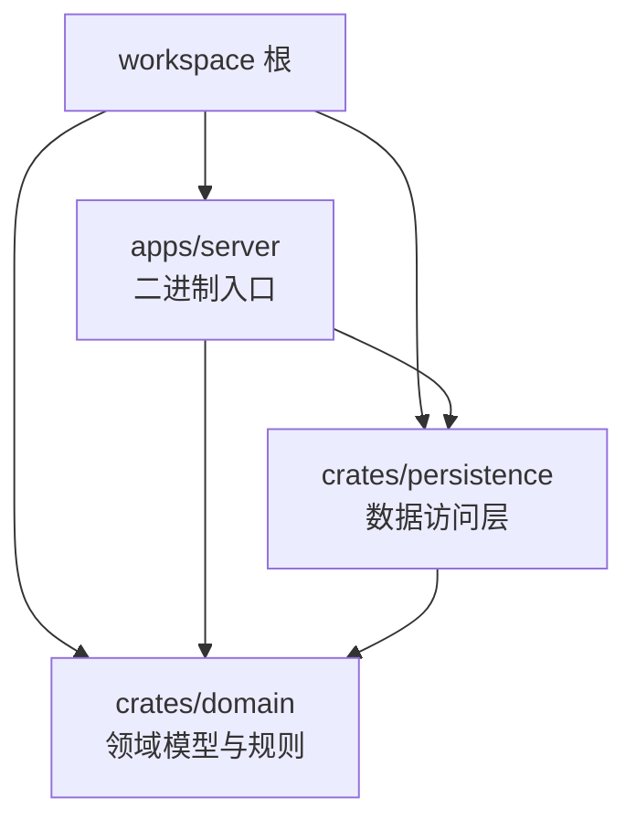
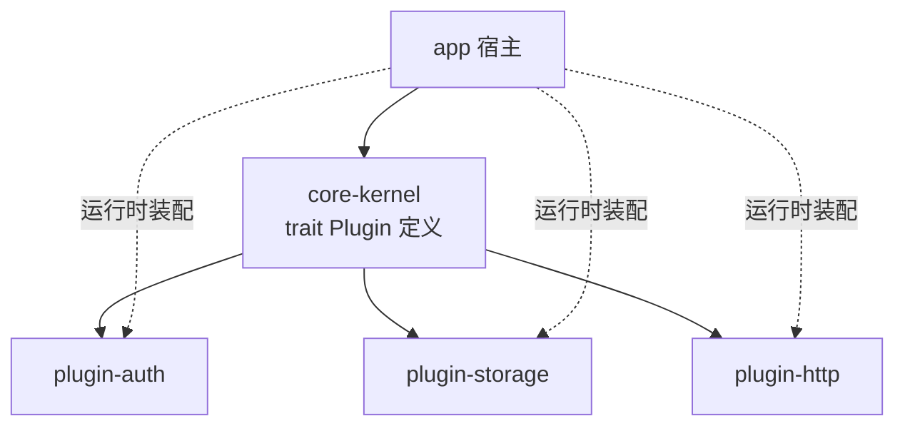

# 14 - Cargo workspace 多包管理

## 原理

### 为什么需要 workspace

单 crate 项目超过两三万行后，编译时间线性恶化、模块边界全靠自觉、
无法把可复用部分单独发布。Cargo workspace（工作空间）允许一个仓库里管理
多个 crate：**统一构建、统一锁文件、统一版本、共享 target 缓存**。

对照 Java 世界：workspace 就是 Maven 的多模块聚合工程（父 pom + modules），
根 `Cargo.toml` 相当于父 pom，`[workspace.dependencies]` 相当于
`<dependencyManagement>`。

### 什么时候该拆

| 信号 | 说明 |
|------|------|
| 编译慢 | 改一行业务代码却要重编全部依赖链 |
| 职责混杂 | domain/api/工具函数搅在一个 lib.rs 里 |
| 需要复用 | 某个 crate 想被其他仓库引用或发 crates.io |
| 团队分工 | 不同成员负责不同 crate，边界需要硬约束 |

### 典型布局模式

模式一：app + libs 分层（最常见）——二进制壳薄，逻辑全在库 crate：



模式二：微内核 + 插件式——核心定义 trait，功能以独立 crate 实现：



两种模式可以组合：先分层、再在层内做插件化。

---

## 语法

### 根 Cargo.toml：[workspace]

```toml
# 根 Cargo.toml —— 它本身不是包（没有 [package]），只描述工作空间

[workspace]
# 成员列表；支持 glob，如 "crates/*"
members = [
    "apps/server",
    "crates/domain",
    "crates/persistence",
]
# exclude 用于剔除不想纳入 workspace 的子目录（如示例代码）
exclude = ["examples/legacy"]
```

> 约定俗成：根目录的 `Cargo.lock` 和共享的 `target/` 由 workspace 统一持有，
> 成员目录下不再各自生成。

### [workspace.dependencies]：统一版本管理（重点）

这是 workspace 最大的价值点。依赖版本只在根声明一次，成员用 `workspace = true`
继承——升级一个库只改一处，彻底消灭"各成员版本漂移"：

```toml
# 根 Cargo.toml 追加
[workspace.dependencies]
serde = { version = "1", features = ["derive"] }
serde_json = "1"
tokio = { version = "1", features = ["full"] }
anyhow = "1"
thiserror = "1"

# 内部 crate 也在此声明，成员间互相引用同样走这里
domain = { path = "crates/domain" }

[workspace.package]   # 包元数据也能统一
version = "0.3.0"
edition = "2021"
license = "MIT"
```

```toml
# crates/domain/Cargo.toml —— 成员侧写法
[package]
name = "domain"
version.workspace = true      # 继承 workspace 版本
edition.workspace = true

[dependencies]
serde = { workspace = true }  # 版本/features 全部继承自根定义
thiserror = { workspace = true }
```

### 成员间 path 依赖引用

成员之间通过相对路径引用，配合 `[workspace.dependencies]` 是标准姿势：

```toml
# apps/server/Cargo.toml
[package]
name = "server"               # 二进制 crate 名
version.workspace = true
edition.workspace = true

[dependencies]
domain = { workspace = true }       # 内部领域层
persistence = { workspace = true }  # 内部持久层
axum = { workspace = true }
tokio = { workspace = true }
```

path 依赖发布到 crates.io 时 cargo 会要求补上 version 字段，否则发布报错——
这是刻意的防呆设计。

### Feature 统一声明

feature 可以在 workspace 级别聚合，成员按需开启：

```toml
# 根 Cargo.toml：为内部 crate 预定义 feature 组合
[workspace.dependencies]
persistence = { path = "crates/persistence", default-features = false }
sqlx = { version = "0.8", default-features = false, features = ["runtime-tokio"] }
```

```toml
# crates/persistence/Cargo.toml：自身声明可选能力
[features]
default = []
postgres = ["sqlx/postgres"]   # 转发给底层 sqlx
mysql = ["sqlx/mysql"]

[dependencies]
sqlx = { workspace = true, optional = true }
```

```bash
# 使用方按需选择后端，不用的数据库驱动不参与编译
cargo build -p persistence --features postgres
```

---

## 实践

### cargo 命令与 --workspace / -p

```bash
cargo build                    # 只构建当前目录所在成员（含其依赖）
cargo build --workspace        # 构建 workspace 全部成员
cargo build -p domain          # 只构建指定成员（-p 即 --package）
cargo test --workspace         # 全仓测试，CI 必备
cargo run -p server            # 运行指定二进制
cargo tree -p server           # 查看某成员完整依赖树
cargo doc --workspace --no-deps # 为所有成员生成文档（跳过第三方）

# 新增成员脚手架；记得加进根 members 或让 glob 规则覆盖
cargo new crates/new-module --lib
```

### 实战：臃肿单 crate 拆分为多成员 workspace

初始状态：一个 8000 行的 `shop-api` 单 crate，src 下 api/models/repository
三个目录混居。目标拆成 domain / core / api / server 四个成员。
第一步，创建目标结构并初始化 workspace：

```bash
mkdir -p apps/server crates/api crates/core crates/domain
cargo init crates/domain --lib
cargo init crates/core  --lib
cargo init crates/api   --lib
cargo init apps/server  --bin
```

第二步，编写根 Cargo.toml（统一版本与发布配置）：

```toml
[workspace]
members = ["apps/server", "crates/api", "crates/core", "crates/domain"]
resolver = "2"   # edition2021 默认；显式写出避免老版本警告

[workspace.dependencies]
serde = { version = "1", features = ["derive"] }
tokio = { version = "1", features = ["full"] }
anyhow = "1"
axum = "0.7"
domain = { path = "crates/domain" }
core = { path = "crates/core" }
api = { path = "crates/api" }

[profile.release]
lto = true     # 链接期优化：跨 crate 内联，产物更小更快
strip = true   # 移除符号表，二进制体积减半
```

第三步，搬运代码。原则：**模型进 domain、仓储进 core、handler 进 api、
main 只留装配**：

```rust
// crates/domain/src/lib.rs —— 最底层，零框架依赖，谁都能依赖它
pub mod user;

// crates/domain/src/user.rs
use serde::{Deserialize, Serialize};

/// 用户实体：纯数据 + 领域规则，不感知 HTTP 与数据库
#[derive(Debug, Clone, Serialize, Deserialize)]
pub struct User {
    pub id: u64,
    pub name: String,
    pub email: String,
}

impl User {
    /// 业务规则收敛在 domain 层，上层只调用不重复实现
    pub fn validate(&self) -> Result<(), String> {
        if !self.email.contains('@') {
            return Err("email 格式非法".into());
        }
        Ok(())
    }
}
```

```rust
// crates/core/src/lib.rs —— 依赖 domain，实现存储逻辑
pub mod repo;
pub use repo::UserRepo;

// crates/core/src/repo.rs
use domain::User;
use std::collections::HashMap;
use std::sync::{Arc, RwLock};

/// 内存仓储（演示用）；真实项目替换为 sqlx 实现，接口不变
#[derive(Clone, Default)]
pub struct UserRepo {
    inner: Arc<RwLock<HashMap<u64, User>>>,
}

impl UserRepo {
    pub fn save(&self, user: User) -> Result<(), String> {
        user.validate()?; // 复用 domain 层规则
        self.inner.write().unwrap().insert(user.id, user);
        Ok(())
    }

    pub fn find(&self, id: u64) -> Option<User> {
        self.inner.read().unwrap().get(&id).cloned()
    }
}
```

```rust
// crates/api/src/lib.rs —— 依赖 core + domain，暴露 HTTP 层
pub mod routes;

// crates/api/src/routes.rs
use axum::{extract::{Path, State}, http::StatusCode, Json};
use core::UserRepo;
use domain::User;

/// axum handler：从 State 拿仓储完成查询
pub async fn get_user(
    State(repo): State<UserRepo>,
    Path(id): Path<u64>,
) -> Result<Json<User>, StatusCode> {
    match repo.find(id) {
        Some(u) => Ok(Json(u)),
        None => Err(StatusCode::NOT_FOUND),
    }
}
```

```rust
// apps/server/src/main.rs —— 薄壳：组合根负责装配并启动
#[tokio::main]
async fn main() -> anyhow::Result<()> {
    // 组合根在这里把所有依赖"接线"，其余模块保持纯净可测试
    let repo = core::UserRepo::default();
    let _ = repo.save(domain::User {
        id: 1,
        name: "alice".into(),
        email: "a@example.com".into(),
    });

    let app = axum::Router::new()
        .route("/users/{id}", axum::routing::get(api::routes::get_user))
        .with_state(repo);

    let listener = tokio::net::TcpListener::bind("0.0.0.0:3000").await?;
    axum::serve(listener, app).await?;
    Ok(())
}
```

第四步，验证拆分收益：

```bash
cargo build --workspace   # 一条命令构建四个成员
# 只改 api 层时 domain/core 不重编——增量编译时间大幅下降
cargo build -p server
```

### crates.io 发布流程

workspace 中每个成员独立发布，且必须先发被依赖者（domain -> core -> api）：

```bash
# 1. 发布前自检：dry-run 模拟打包，检查许可/文档/依赖版本是否齐全
cargo publish -p domain --dry-run

# 2. 登录一次即可（token 存本地凭据）
cargo login

# 3. 按依赖顺序逐个发布
cargo publish -p domain
cargo publish -p core
cargo publish -p api

# 4. 发完后 yank 可以撤回损坏版本（已下载者不受影响）
cargo yank --vers 0.3.0 api
```

注意事项：

1. path 依赖发布时会自动改写为 `version` 依赖，所以内部 crate 必须有明确版本号；
2. 版本号建议配合 `cargo release` 或 `release-plz` 自动化，避免手滑；
3. 私有代码不要发——workspace 的价值不依赖发布，path 引用本身就够了。

### CI 缓存：Swatinem/rust-cache

Rust CI 最大的痛点是依赖编译慢。GitHub Actions 用 Swatinem/rust-cache 缓存
`~/.cargo` 与 `target`，命中缓存后全量构建从十几分钟降到一两分钟：

```yaml
# .github/workflows/ci.yml
name: ci
on: [push, pull_request]

jobs:
  test:
    runs-on: ubuntu-latest
    steps:
      - uses: actions/checkout@v4

      # 安装工具链；rust-cache 以 Cargo.lock 为缓存 key
      - uses: dtolnay/rust-toolchain@stable
      - uses: Swatinem/rust-cache@v2

      # 全仓静态检查 + 测试 + 构建，一条流水线全覆盖
      - run: cargo clippy --workspace --all-targets -- -D warnings
      - run: cargo test --workspace
      - run: cargo build --workspace --release
```

### clippy 全仓一键

```bash
# --all-targets 覆盖 lib/bin/test/example/bench 所有产物
# -D warnings 把所有 lint 告警升级为错误，防止带病合入
cargo clippy --workspace --all-targets -- -D warnings

# 只查某个成员
cargo clippy -p domain -- -D warnings

# 自动修复可安全处理的告警
cargo clippy --workspace --fix --allow-dirty
```

把这条命令放进 pre-commit hook 和 CI 双保险，
workspace 保证任何角落的代码都逃不出检查范围。

---

## 小结

- **定位**：workspace = Maven 多模块聚合，统一构建/锁文件/版本/target；
- **根配置**：`[workspace] members/exclude` 圈地，`[workspace.dependencies]` 统一版本；
- **引用**：成员间走 `{ workspace = true }` 继承根定义，杜绝版本漂移；
- **拆分实战**：models->domain、repo->core、handler->api、main 只装配；
- **CI**：Swatinem/rust-cache 缓存 + `clippy --workspace --all-targets` 全仓一键。

配套阅读：单 crate 工程化基础见 [[rust/4工程/01-Cargo工程化与企业级构建|Cargo 工程化章]]，
持久层拆分参考 [[rust/4工程/13-sqlx数据库操作|sqlx 数据库操作章]]。
