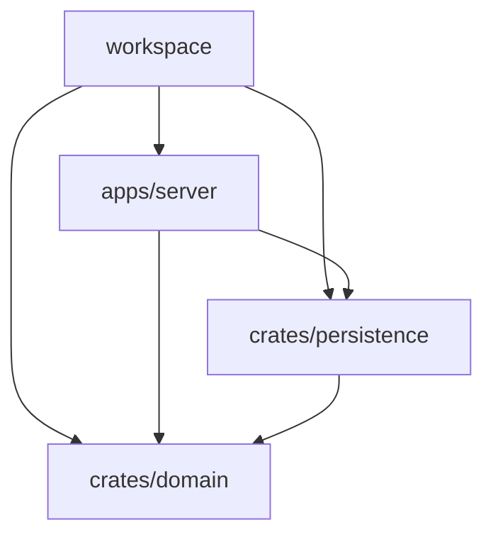
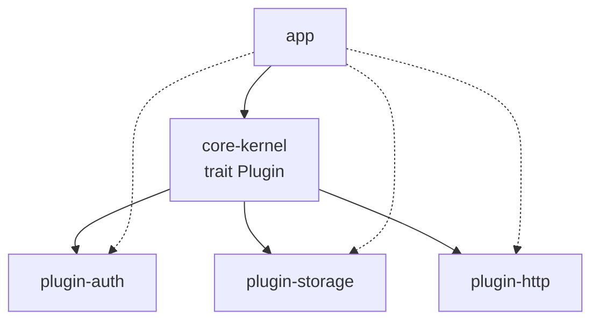

# 14 - Cargo workspace 

## 

###  workspace

 crate 
Cargo workspace
 crate** target **

 Java workspace  Maven  pom + modules
 `Cargo.toml`  pom`[workspace.dependencies]` 
`<dependencyManagement>`

### 

|  |  |
|------|------|
|  |  |
|  | domain/api/ lib.rs  |
|  |  crate  crates.io |
|  |  crate |

### 

app + libs —— crate



 + —— trait crate 




---

## 

###  Cargo.toml[workspace]

```toml
#  Cargo.toml ——  [package]

[workspace]
#  glob "crates/*"
members = [
    "apps/server",
    "crates/domain",
    "crates/persistence",
]
# exclude  workspace 
exclude = ["examples/legacy"]
```

>  `Cargo.lock`  `target/`  workspace 
> 

### [workspace.dependencies]

 workspace  `workspace = true`
——""

```toml
#  Cargo.toml 
[workspace.dependencies]
serde = { version = "1", features = ["derive"] }
serde_json = "1"
tokio = { version = "1", features = ["full"] }
anyhow = "1"
thiserror = "1"

#  crate 
domain = { path = "crates/domain" }

[workspace.package]   # 
version = "0.3.0"
edition = "2021"
license = "MIT"
```

```toml
# crates/domain/Cargo.toml —— 
[package]
name = "domain"
version.workspace = true      #  workspace 
edition.workspace = true

[dependencies]
serde = { workspace = true }  # /features 
thiserror = { workspace = true }
```

###  path 

 `[workspace.dependencies]` 

```toml
# apps/server/Cargo.toml
[package]
name = "server"               #  crate 
version.workspace = true
edition.workspace = true

[dependencies]
domain = { workspace = true }       # 
persistence = { workspace = true }  # 
axum = { workspace = true }
tokio = { workspace = true }
```

path  crates.io  cargo  version ——


### Feature 

feature  workspace 

```toml
#  Cargo.toml crate  feature 
[workspace.dependencies]
persistence = { path = "crates/persistence", default-features = false }
sqlx = { version = "0.8", default-features = false, features = ["runtime-tokio"] }
```

```toml
# crates/persistence/Cargo.toml
[features]
default = []
postgres = ["sqlx/postgres"]   #  sqlx
mysql = ["sqlx/mysql"]

[dependencies]
sqlx = { workspace = true, optional = true }
```

```bash
# 
cargo build -p persistence --features postgres
```

---

## 

### cargo  --workspace / -p

```bash
cargo build                    # 
cargo build --workspace        #  workspace 
cargo build -p domain          # -p  --package
cargo test --workspace         # CI 
cargo run -p server            # 
cargo tree -p server           # 
cargo doc --workspace --no-deps # 

#  members  glob 
cargo new crates/new-module --lib
```

###  crate  workspace

 8000  `shop-api`  cratesrc  api/models/repository
 domain / core / api / server 
 workspace

```bash
mkdir -p apps/server crates/api crates/core crates/domain
cargo init crates/domain --lib
cargo init crates/core  --lib
cargo init crates/api   --lib
cargo init apps/server  --bin
```

 Cargo.toml

```toml
[workspace]
members = ["apps/server", "crates/api", "crates/core", "crates/domain"]
resolver = "2"   # edition2021 

[workspace.dependencies]
serde = { version = "1", features = ["derive"] }
tokio = { version = "1", features = ["full"] }
anyhow = "1"
axum = "0.7"
domain = { path = "crates/domain" }
core = { path = "crates/core" }
api = { path = "crates/api" }

[profile.release]
lto = true     #  crate 
strip = true   # 
```

** domain corehandler  api
main **

```rust
// crates/domain/src/lib.rs —— 
pub mod user;

// crates/domain/src/user.rs
use serde::{Deserialize, Serialize};

///  +  HTTP 
#[derive(Debug, Clone, Serialize, Deserialize)]
pub struct User {
    pub id: u64,
    pub name: String,
    pub email: String,
}

impl User {
    ///  domain 
    pub fn validate(&self) -> Result<(), String> {
        if !self.email.contains('@') {
            return Err("email ".into());
        }
        Ok(())
    }
}
```

```rust
// crates/core/src/lib.rs ——  domain
pub mod repo;
pub use repo::UserRepo;

// crates/core/src/repo.rs
use domain::User;
use std::collections::HashMap;
use std::sync::{Arc, RwLock};

///  sqlx 
#[derive(Clone, Default)]
pub struct UserRepo {
    inner: Arc<RwLock<HashMap<u64, User>>>,
}

impl UserRepo {
    pub fn save(&self, user: User) -> Result<(), String> {
        user.validate()?; //  domain 
        self.inner.write().unwrap().insert(user.id, user);
        Ok(())
    }

    pub fn find(&self, id: u64) -> Option<User> {
        self.inner.read().unwrap().get(&id).cloned()
    }
}
```

```rust
// crates/api/src/lib.rs ——  core + domain HTTP 
pub mod routes;

// crates/api/src/routes.rs
use axum::{extract::{Path, State}, http::StatusCode, Json};
use core::UserRepo;
use domain::User;

/// axum handler State 
pub async fn get_user(
    State(repo): State<UserRepo>,
    Path(id): Path<u64>,
) -> Result<Json<User>, StatusCode> {
    match repo.find(id) {
        Some(u) => Ok(Json(u)),
        None => Err(StatusCode::NOT_FOUND),
    }
}
```

```rust
// apps/server/src/main.rs —— 
#[tokio::main]
async fn main() -> anyhow::Result<()> {
    // ""
    let repo = core::UserRepo::default();
    let _ = repo.save(domain::User {
        id: 1,
        name: "alice".into(),
        email: "a@example.com".into(),
    });

    let app = axum::Router::new()
        .route("/users/{id}", axum::routing::get(api::routes::get_user))
        .with_state(repo);

    let listener = tokio::net::TcpListener::bind("0.0.0.0:3000").await?;
    axum::serve(listener, app).await?;
    Ok(())
}
```


```bash
cargo build --workspace   # 
#  api  domain/core ——
cargo build -p server
```

### crates.io 

workspace domain -> core -> api

```bash
# 1. dry-run //
cargo publish -p domain --dry-run

# 2. token 
cargo login

# 3. 
cargo publish -p domain
cargo publish -p core
cargo publish -p api

# 4.  yank 
cargo yank --vers 0.3.0 api
```


1. path  `version`  crate 
2.  `cargo release`  `release-plz` 
3. ——workspace path 

### CI Swatinem/rust-cache

Rust CI GitHub Actions  Swatinem/rust-cache 
`~/.cargo`  `target`

```yaml
# .github/workflows/ci.yml
name: ci
on: [push, pull_request]

jobs:
  test:
    runs-on: ubuntu-latest
    steps:
      - uses: actions/checkout@v4

      # rust-cache  Cargo.lock  key
      - uses: dtolnay/rust-toolchain@stable
      - uses: Swatinem/rust-cache@v2

      #  +  + 
      - run: cargo clippy --workspace --all-targets -- -D warnings
      - run: cargo test --workspace
      - run: cargo build --workspace --release
```

### clippy 

```bash
# --all-targets  lib/bin/test/example/bench 
# -D warnings  lint 
cargo clippy --workspace --all-targets -- -D warnings

# 
cargo clippy -p domain -- -D warnings

# 
cargo clippy --workspace --fix --allow-dirty
```

 pre-commit hook  CI 
workspace 

---

## 

- ****workspace = Maven ///target
- ****`[workspace] members/exclude` `[workspace.dependencies]` 
- **** `{ workspace = true }` 
- ****models->domainrepo->corehandler->apimain 
- **CI**Swatinem/rust-cache  + `clippy --workspace --all-targets` 

 crate  [[rust/4/01-Cargo|Cargo ]]
 [[rust/4/13-sqlx|sqlx ]]
