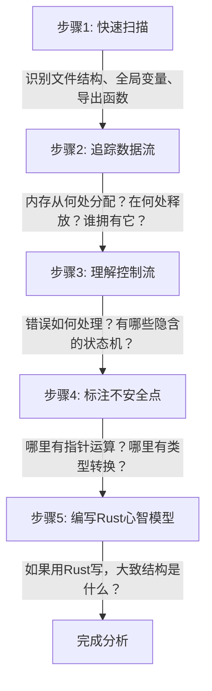

# C代码阅读理解方法论

## 学习目标

1. 掌握系统化阅读陌生C代码的方法论
2. 识别C语言中的常见模式及其在Rust中的等价表达
3. 理解C代码中隐含的设计意图
4. 学会使用工具辅助分析C代码
5. 能够标注C代码中的不安全因素并为重构做准备

---

## 一、为什么需要方法论？

阅读C代码是Rust系统程序员的核心技能。大多数需要重写的项目、需要绑定的库、需要理解的底层机制都使用C语言。但C代码缺乏许多Rust程序员习惯的保障——没有所有权系统、没有trait、没有模式匹配。因此我们需要一套系统化的方法来"解码"C代码。

### 1.1 C代码阅读的三层模型

```
第一层：语法层 —— 这段代码在语法上做了什么？
第二层：语义层 —— 这段代码的意图是什么？
第三层：安全层 —— 这段代码有哪些隐含的不安全假设？
```

大多数程序员停在第1层。优秀的Rust程序员必须深入到第3层。

### 1.2 阅读C代码的推荐流程



---

## 二、常见C模式及其Rust等价物

### 2.1 动态内存管理

**C模式：malloc/free**

```c
#include <stdlib.h>
#include <string.h>

typedef struct {
    char* name;
    int   age;
} Person;

Person* person_new(const char* name, int age) {
    Person* p = (Person*)malloc(sizeof(Person));
    if (p == NULL) return NULL;
    p->name = (char*)malloc(strlen(name) + 1);
    if (p->name == NULL) {
        free(p);
        return NULL;
    }
    strcpy(p->name, name);
    p->age = age;
    return p;
}

void person_free(Person* p) {
    if (p != NULL) {
        free(p->name);
        free(p);
    }
}
```

**Rust等价：所有权系统 + Box/ String**

```rust
struct Person {
    name: String,
    age:  u32,
}

impl Person {
    fn new(name: &str, age: u32) -> Self {
        Person {
            name: name.to_string(),
            age,
        }
    }
}
// 无需 person_free —— Drop trait 自动处理
```

**对照分析：**

| 方面 | C版本 | Rust版本 |
|------|-------|----------|
| 分配 | 两次malloc，需检查NULL | String自动分配，无NULL |
| 释放 | 必须手动调用person_free | Drop自动释放 |
| 忘记释放 | 内存泄漏 | 编译期防止 |
| 重复释放 | 未定义行为 | 编译期防止（use after move） |
| 部分失败回滚 | 手动free已分配资源 | 自动回滚 |

### 2.2 函数指针与void* → Trait

**C模式：回调函数 + void*上下文**

```c
#include <stdio.h>

typedef void (*callback_t)(void* ctx, int value);

void process_numbers(int* arr, int len, callback_t cb, void* ctx) {
    for (int i = 0; i < len; i++) {
        cb(ctx, arr[i]);
    }
}

/* 使用示例 */
typedef struct {
    int sum;
} SumContext;

void sum_callback(void* ctx, int value) {
    ((SumContext*)ctx)->sum += value;
}

int main(void) {
    int arr[] = {1, 2, 3, 4, 5};
    SumContext ctx = {0};
    process_numbers(arr, 5, sum_callback, &ctx);
    printf("Sum: %d\n", ctx.sum);
    return 0;
}
```

**Rust等价：FnMut闭包或Trait**

```rust
fn process_numbers(arr: &[i32], mut cb: impl FnMut(i32)) {
    for &val in arr {
        cb(val);
    }
}

fn main() {
    let arr = [1, 2, 3, 4, 5];
    let mut sum = 0;
    process_numbers(&arr, |v| sum += v);
    println!("Sum: {}", sum);
}
```

**对照分析：**

| 方面 | C版本 | Rust版本 |
|------|-------|----------|
| 类型安全 | void*擦除所有类型信息 | 泛型在编译期保留类型 |
| 空指针 | ctx可为NULL（运行时错误） | 编译期保证非空 |
| 闭包捕获 | 必须手动传context | 编译器自动捕获环境 |
| 内联优化 | 函数指针难以内联 | impl FnMut支持单态化 |

### 2.3 结构体+函数指针 → Trait对象

**C模式：手工虚表（vtable）**

```c
#include <stdio.h>
#include <stdlib.h>

typedef struct Animal Animal;

typedef struct {
    void (*speak)(Animal* self);
    void (*destroy)(Animal* self);
} AnimalVtable;

typedef struct Animal {
    const AnimalVtable* vtable;
} Animal;

/* Dog */
typedef struct {
    Animal base;
    const char* name;
} Dog;

void dog_speak(Animal* self) {
    Dog* dog = (Dog*)self;
    printf("%s says: Woof!\n", dog->name);
}

void dog_destroy(Animal* self) {
    free((Dog*)self);
}

static const AnimalVtable dog_vtable = {
    .speak = dog_speak,
    .destroy = dog_destroy,
};

Animal* dog_new(const char* name) {
    Dog* dog = (Dog*)malloc(sizeof(Dog));
    dog->base.vtable = &dog_vtable;
    dog->name = name;
    return &dog->base;
}
```

**Rust等价：Trait对象**

```rust
trait Animal {
    fn speak(&self);
}

struct Dog {
    name: String,
}

impl Animal for Dog {
    fn speak(&self) {
        println!("{} says: Woof!", self.name);
    }
}

fn dog_new(name: &str) -> Box<dyn Animal> {
    Box::new(Dog { name: name.to_string() })
}
```

**对照分析：**

| 方面 | C版本 | Rust版本 |
|------|-------|----------|
| 虚表构造 | 手工创建vtable结构体 | 编译器自动生成 |
| 类型转换 | 强制指针转换 (Dog*) | 编译期检查的类型转换 |
| 虚表一致性 | 可能错误设置vtable | 编译器保证正确 |
| 析构 | 手工调用destroy | Drop自动分发 |
| 安全性 | 完全无保障 | 类型安全保证 |

### 2.4 #define常量 → const

**C模式：预处理宏常量**

```c
#define MAX_BUFFER_SIZE 4096
#define DEFAULT_PORT    8080
#define APP_NAME        "MyServer"
#define PI              3.14159265358979323846

char buffer[MAX_BUFFER_SIZE];
```

**Rust等价：const / static**

```rust
const MAX_BUFFER_SIZE: usize = 4096;
const DEFAULT_PORT: u16 = 8080;
const APP_NAME: &str = "MyServer";
const PI: f64 = 3.14159265358979323846;

let mut buffer = [0u8; MAX_BUFFER_SIZE];
```

**关键差异：**

| 方面 | #define | const/static |
|------|---------|--------------|
| 类型 | 无类型（文本替换） | 强类型 |
| 作用域 | 全局（除非#undef） | 模块级作用域 |
| 调试 | 符号不存在于调试信息中 | 正常调试符号 |
| 命名空间 | 全局污染 | 模块隔离 |
| 重定义 | 无警告覆盖 | 编译错误 |

### 2.5 #define宏 → 泛型函数/内联函数

**C模式：函数式宏**

```c
#define MIN(a, b) ((a) < (b) ? (a) : (b))
#define MAX(a, b) ((a) > (b) ? (a) : (b))
#define SWAP(a, b, type) do { \
    type temp = (a); \
    (a) = (b); \
    (b) = temp; \
} while(0)
#define ARRAY_LEN(arr) (sizeof(arr) / sizeof((arr)[0]))
```

**Rust等价：泛型函数**

```rust
use std::cmp::{min, max};
use std::mem::swap;

// std::cmp::min/max 已存在
// std::mem::swap 已存在
// 数组长度直接用 .len()
```

**C宏的典型陷阱：**

```c
/* 陷阱1: 双重求值 */
int x = 5;
int y = MIN(x++, 10);  /* x++ 求值几次？取决于实现 */

/* 陷阱2: 运算符优先级 */
int z = MIN(3 & 5, 4); /* 展开为 (3 & 5 < 4 ? 3 & 5 : 4) */
                       /* < 优先级高于 &，结果错误！ */

/* 陷阱3: 类型不安全 */
SWAP(a, b, int);       /* 如果a是double，不会有警告 */
SWAP(a, b, double);    /* 类型错误只能靠注释保证 */
```

### 2.6 goto cleanup → Drop trait

**C模式：goto错误处理**

```c
#include <stdio.h>
#include <stdlib.h>
#include <string.h>

typedef struct {
    FILE* file;
    char* buffer;
    int*  data;
} Resource;

int process_resource(const char* path) {
    Resource res = {0};
    int ret = -1;

    res.file = fopen(path, "r");
    if (res.file == NULL) goto cleanup;

    res.buffer = (char*)malloc(4096);
    if (res.buffer == NULL) goto cleanup;

    res.data = (int*)malloc(1024 * sizeof(int));
    if (res.data == NULL) goto cleanup;

    /* 使用资源... */
    size_t n = fread(res.buffer, 1, 4096, res.file);
    if (n == 0 && ferror(res.file)) goto cleanup;

    ret = 0;

cleanup:
    if (res.data)   free(res.data);
    if (res.buffer) free(res.buffer);
    if (res.file)   fclose(res.file);
    return ret;
}
```

**Rust等价：RAII + Drop + `?` 运算符**

```rust
use std::fs::File;
use std::io::Read;

fn process_resource(path: &str) -> Result<(), std::io::Error> {
    let mut file = File::open(path)?;
    let mut buffer = vec![0u8; 4096];
    let mut data = vec![0i32; 1024];

    let n = file.read(&mut buffer)?;
    // 使用n...

    Ok(())
    // buffer、data、file 自动释放，即使发生错误
}
```

### 2.7 错误码 → Result/Option

**C模式：整型错误码 + 输出参数**

```c
#include <errno.h>
#include <string.h>
#include <stdlib.h>

/**
 * 解析整数
 * @param s 输入字符串
 * @param out 输出参数
 * @return 0表示成功，-1表示失败
 */
int parse_int(const char* s, int* out) {
    if (s == NULL || out == NULL) return -1;

    char* endptr = NULL;
    long val = strtol(s, &endptr, 10);
    if (endptr == s || *endptr != '\0') return -1;
    if (val > INT_MAX || val < INT_MIN) return -1;

    *out = (int)val;
    return 0;
}
```

**Rust等价：Result<T, E>**

```rust
fn parse_int(s: &str) -> Result<i32, ParseIntError> {
    s.parse::<i32>()
}

// 或者更详细的错误处理：
fn parse_int_verbose(s: &str) -> Result<i32, String> {
    let trimmed = s.trim();
    if trimmed.is_empty() {
        return Err("empty string".to_string());
    }
    trimmed.parse::<i32>()
        .map_err(|e| format!("parse error: {}", e))
}
```

**对照分析：**

| 方面 | C错误码 | Rust Result |
|------|---------|-------------|
| 返回多个错误信息 | 全局errno（线程不安全） | 枚举变体携带数据 |
| 忘记检查错误 | 编译通过，运行时出错 | #[must_use]警告 |
| 输出参数空指针 | 运行时segfault | Option<T>编译期检查 |
| 错误传播 | 多层if检查或goto | ?运算符一行搞定 |

### 2.8 空指针检查 → Option

**C模式：到处检查NULL**

```c
#include <stdio.h>
#include <stdlib.h>

typedef struct Node {
    int data;
    struct Node* next;
} Node;

Node* list_find(Node* head, int target) {
    Node* current = head;
    while (current != NULL) {
        if (current->data == target) {
            return current;
        }
        current = current->next;
    }
    return NULL;  /* 未找到 */
}

void process_list(Node* head) {
    if (head == NULL) {
        fprintf(stderr, "List is empty\n");
        return;
    }
    /* 处理列表 */
}
```

**Rust等价：Option<T>**

```rust
#[derive(Debug)]
struct Node {
    data: i32,
    next: Option<Box<Node>>,
}

fn list_find(head: &Option<Box<Node>>, target: i32) -> Option<&Node> {
    let mut current = head.as_ref();
    while let Some(node) = current {
        if node.data == target {
            return Some(node);
        }
        current = node.next.as_ref();
    }
    None
}

fn process_list(head: &Option<Box<Node>>) {
    match head {
        None => eprintln!("List is empty"),
        Some(node) => {
            /* 处理列表，编译器保证node非空 */
        }
    }
}
```

---

## 三、辅助工具

### 3.1 工具矩阵

| 工具 | 用途 | 输入 | 输出 |
|------|------|------|------|
| **c2rust** | C到Rust自动翻译 | C源码 | 不安全Rust代码 |
| **bindgen** | 从C头文件生成Rust FFI绑定 | .h头文件 | Rust extern声明 |
| **cbindgen** | 从Rust导出C ABI | Rust源码 | .h头文件 |
| **corrode** | C到Rust语义翻译（实验性） | C源码 | 部分安全Rust |
| **objdump** | 查看编译后汇编 | 二进制文件 | 汇编代码 |
| **valgrind** | 检测C内存错误 | C二进制 | 内存报告 |
| **AddressSanitizer** | 编译时内存检测 | C源码 | 运行时检测 |

### 3.2 c2rust使用示例

```bash
# 安装 c2rust
cargo install c2rust

# 转译单个C文件
c2rust transpile input.c --emit=builders -o output.rs

# 生成编译数据库
intercept-build make
c2rust transpile compile_commands.json
```

> **注意**：c2rust生成的是大量使用`unsafe`的Rust代码。这仅仅是起点。
> 真正的工作在于逐步将unsafe代码重构为安全Rust。

### 3.3 bindgen使用示例

```rust
// build.rs
fn main() {
    println!("cargo:rustc-link-lib=foo");
    let bindings = bindgen::Builder::default()
        .header("foo.h")
        .generate()
        .expect("Unable to generate bindings");
    bindings
        .write_to_file("src/bindings.rs")
        .expect("Couldn't write bindings!");
}
```

---

## 四、实战演练：阅读小型C字符串库

### 4.1 原始C代码

```c
/* mystring.h */
#ifndef MYSTRING_H
#define MYSTRING_H

#include <stddef.h>

typedef struct {
    char* data;
    size_t len;
    size_t cap;
} MyString;

MyString* mystr_new(const char* init);
void mystr_free(MyString* s);
int mystr_append(MyString* s, const char* suffix);
int mystr_append_char(MyString* s, char c);
const char* mystr_cstr(const MyString* s);
size_t mystr_len(const MyString* s);
int mystr_reserve(MyString* s, size_t extra);

#endif
```

```c
/* mystring.c */
#include "mystring.h"
#include <stdlib.h>
#include <string.h>
#include <stdio.h>

#define MYSTR_INIT_CAP 16

MyString* mystr_new(const char* init) {
    MyString* s = (MyString*)malloc(sizeof(MyString));
    if (s == NULL) return NULL;

    size_t init_len = init ? strlen(init) : 0;
    size_t cap = init_len + 1;
    if (cap < MYSTR_INIT_CAP) cap = MYSTR_INIT_CAP;

    s->data = (char*)malloc(cap);
    if (s->data == NULL) {
        free(s);
        return NULL;
    }

    if (init) {
        memcpy(s->data, init, init_len);
    }
    s->data[init_len] = '\0';
    s->len = init_len;
    s->cap = cap;
    return s;
}

void mystr_free(MyString* s) {
    if (s) {
        free(s->data);
        free(s);
    }
}

static int mystr_grow(MyString* s, size_t need) {
    size_t new_cap = s->cap;
    while (new_cap < s->len + need + 1) {
        new_cap *= 2;
        if (new_cap < s->cap) return -1; /* 溢出 */
    }
    char* new_data = (char*)realloc(s->data, new_cap);
    if (new_data == NULL) return -1;
    s->data = new_data;
    s->cap = new_cap;
    return 0;
}

int mystr_append(MyString* s, const char* suffix) {
    if (s == NULL || suffix == NULL) return -1;
    size_t slen = strlen(suffix);
    if (mystr_grow(s, slen) != 0) return -1;
    memcpy(s->data + s->len, suffix, slen);
    s->len += slen;
    s->data[s->len] = '\0';
    return 0;
}

int mystr_append_char(MyString* s, char c) {
    if (s == NULL) return -1;
    if (mystr_grow(s, 1) != 0) return -1;
    s->data[s->len] = c;
    s->len++;
    s->data[s->len] = '\0';
    return 0;
}

const char* mystr_cstr(const MyString* s) {
    return s ? s->data : NULL;
}

size_t mystr_len(const MyString* s) {
    return s ? s->len : 0;
}

int mystr_reserve(MyString* s, size_t extra) {
    if (s == NULL) return -1;
    return mystr_grow(s, extra);
}
```

### 4.2 逐函数分析

#### mystr_new —— 构造函数

```
语义：创建一个新的MyString，用C字符串初始化
内存：两次malloc —— 结构体 + 缓冲区
不安全点：
  1. malloc可能返回NULL → 已检查，但调用者可能忘记检查返回值
  2. init可能为NULL → 已处理特殊情况
  3. 如果第二个malloc失败，需要释放第一个 → 已正确回滚
Rust心智模型：fn new() -> Option<MyString>
              实际上Rust的String::from()不会失败（除非OOM）
```

#### mystr_free —— 析构函数

```
语义：释放MyString的所有资源
不安全点：
  1. 必须被调用，否则内存泄漏 → C无法强制
  2. 调用后指针成为悬垂指针 → 后续使用是UB
  3. data和s的释放顺序必须正确
Rust心智模型：impl Drop for MyString { ... }
              编译器保证在值离开作用域时自动调用
```

#### mystr_grow —— 内部扩容

```
语义：确保缓冲区有足够的空间
不安全点：
  1. realloc可能返回NULL（原始内存仍有效？实现相关）
  2. new_cap *= 2可能溢出 → 已检查
  3. s->len + need + 1可能溢出 → 未检查
  4. 计算过程中如果new_cap变成0，while(true)死循环
Rust心智模型：Vec的reserve方法，内部已处理所有边界条件
```

#### mystr_append —— 追加字符串

```
语义：在MyString末尾追加C字符串
不安全点：
  1. s和suffix可能为NULL → 已检查
  2. memcpy的目标地址可能越界 → 依赖grow保证空间
  3. s->data + s->len如果没有grow成功，指向无效内存
Rust心智模型：s.push_str(suffix)，完全安全
```

### 4.3 标注重构优先级

```
╔══════════════════╦══════════════════╦══════════════════╗
║ 函数             ║ 不安全因素数量    ║ 重构优先级       ║
╠══════════════════╬══════════════════╬══════════════════╣
║ mystr_new        ║ 3 (malloc×2, NULL)║ 高               ║
║ mystr_free       ║ 2 (忘记调用, 顺序)║ 最高             ║
║ mystr_grow       ║ 4 (溢出×2, realloc,死循环)║ 最高  ║
║ mystr_append     ║ 3 (NULL,越界,无效指针)║ 高           ║
║ mystr_append_char║ 2 (NULL,越界)    ║ 中               ║
║ mystr_cstr       ║ 1 (NULL返回)     ║ 低               ║
║ mystr_len        ║ 1 (NULL返回)     ║ 低               ║
║ mystr_reserve    ║ 1 (NULL,溢出)    ║ 中               ║
╚══════════════════╩══════════════════╩══════════════════╝
```

---

## 五、练习：标注C代码

请阅读以下C代码片段，找出所有不安全因素并用注释标注：

```c
#include <stdio.h>
#include <stdlib.h>
#include <string.h>

typedef struct {
    int* items;
    int  count;
    int  capacity;
} IntList;

IntList* list_new(void) {
    IntList* list = malloc(sizeof(IntList));
    list->items = malloc(8 * sizeof(int));
    list->count = 0;
    list->capacity = 8;
    return list;
}

void list_add(IntList* list, int value) {
    if (list->count >= list->capacity) {
        list->capacity *= 2;
        list->items = realloc(list->items,
                              list->capacity * sizeof(int));
    }
    list->items[list->count++] = value;
}

int list_get(IntList* list, int index) {
    return list->items[index];
}

void list_destroy(IntList* list) {
    free(list->items);
    free(list);
}

int main(void) {
    IntList* list = list_new();
    for (int i = 0; i < 20; i++) {
        list_add(list, i * 10);
    }
    printf("Item at 15: %d\n", list_get(list, 15));
    printf("Item at 25: %d\n", list_get(list, 25)); /* Oops */
    list_destroy(list);
    printf("After free: %p\n", (void*)list); /* Oops again */
    return 0;
}
```

> **参考答案**：
> 1. `list_new`: malloc返回值未检查
> 2. `list_add`: capacity溢出未检查；realloc返回值未检查；count溢出未检查
> 3. `list_get`: 索引越界未检查
> 4. `list_destroy`: 空指针未检查
> 5. `main`: 访问越界索引25；释放后使用list指针

---

## 六、总结

| 步骤 | 方法 | 输出 |
|------|------|------|
| 1. 快速扫描 | grep函数定义、全局变量、include | 结构概览 |
| 2. 追踪数据流 | 追踪每个malloc对应的free | 所有权图 |
| 3. 理解控制流 | 画出状态机、分析goto | 控制流图 |
| 4. 标注不安全 | 列出所有裸指针操作、类型转换 | 不安全清单 |
| 5. Rust心智模型 | 思考每个C结构的Rust等价物 | 重构策略 |

---

## 章节考查（共100分）

### 一、概念题（40分，每题8分）

1. 阅读C代码的"三层模型"是哪三层？请简要描述每一层关注的内容。
2. C语言中`goto cleanup`模式的目的是什么？在Rust中用什么机制等价实现？
3. 解释C语言中`void*`指针在回调函数中的作用，以及它带来的风险。
4. C语言`#define MIN(a,b)`宏有哪些常见陷阱？Rust如何避免？
5. 使用c2rust工具转译C代码后，生成的Rust代码有什么特点？为什么不能直接用于生产？

<details>
<summary>参考答案</summary>

1. **三层模型**：
   - 语法层：代码在语法上做了什么（函数调用、循环、条件等）
   - 语义层：代码的意图是什么（业务逻辑、算法意图）
   - 安全层：代码有哪些隐含的不安全假设（null检查缺失、缓冲区溢出风险、use-after-free等）

2. **goto cleanup**用于在多个资源分配步骤中，任何一步失败时都能统一跳转到清理代码，释放已分配的资源。Rust使用RAII + Drop trait + `?`运算符实现等价功能，编译器自动在作用域结束时释放资源。

3. `void*`允许回调函数接收任意类型的上下文数据，但它完全擦除了类型信息。风险包括：类型转换错误导致未定义行为、传入NULL导致段错误、调用者与被调用者之间类型约定完全靠注释/文档保证。

4. 常见陷阱：
   - 双重求值：`MIN(x++, 10)`中x++可能被执行两次
   - 运算符优先级：`MIN(3 & 5, 4)`展开后由于运算符优先级导致错误结果
   - 缺少类型检查：任何类型都可传入无编译错误
   Rust通过泛型函数和内联特性避免这些问题，类型在编译期检查，表达式只求值一次。

5. c2rust生成的Rust代码大量使用`unsafe`块和裸指针，本质上是C代码在Rust语法中的机械映射。它不能利用Rust的安全保证，需要开发者逐步将unsafe代码重构为安全Rust惯用写法。它只是起点，不是终点。

</details>

### 二、判断题（20分，每题5分，正确打√错误打×）

1. C语言中的`#define`常量在编译后保留类型信息，可以用调试器查看。（ ）
2. C语言的`goto cleanup`模式在Rust中可以用`?`运算符和`Drop` trait自然替代。（ ）
3. c2rust工具可以自动将C代码转换为完全安全的Rust代码。（ ）
4. 阅读C代码时，最重要的分析维度是语法层面。（ ）

<details>
<summary>参考答案</summary>

1. × — `#define`是预处理指令，在编译前完成文本替换，编译后的二进制中不存在该符号，调试时看不到。
2. √ — Drop trait提供RAII自动清理，`?`运算符提供简洁的错误传播，二者结合可替代goto cleanup。
3. × — c2rust只能做语法层面的机械翻译，生成的Rust代码充满了unsafe和裸指针，需要人工重构。
4. × — 语法层只是基础，语义层和安全层才是最终目标，特别是理解代码中的不安全假设。

</details>

### 三、代码分析题（15分，每题7.5分）

1. 分析以下C代码中的内存管理问题：

```c
char* concat(const char* a, const char* b) {
    size_t len = strlen(a) + strlen(b) + 1;
    char* result = (char*)malloc(len);
    strcpy(result, a);
    strcat(result, b);
    return result;
}
```

<details>
<summary>参考答案</summary>

存在的问题：
1. `a`或`b`可能为NULL，直接传入`strlen`会导致段错误
2. `malloc`可能返回NULL，未检查就直接使用
3. `strcpy`和`strcat`如果内部逻辑依赖NULL终止符，但没有边界检查
4. 调用者必须记得`free(result)`，否则内存泄漏
5. 如果`len`计算溢出（两个很大的字符串长度相加），malloc可能分配不足的空间

正确的Rust版本：
```rust
fn concat(a: &str, b: &str) -> String {
    let mut result = String::with_capacity(a.len() + b.len());
    result.push_str(a);
    result.push_str(b);
    result
}
```
完全避免了上述所有问题。
</details>

2. 以下C代码中的手工虚表有什么问题？

```c
typedef void (*draw_fn)(void* self);

typedef struct {
    draw_fn draw;
} ShapeVtable;

typedef struct {
    ShapeVtable* vtable;
    double radius;
} Circle;

Circle* circle_new(double r) {
    Circle* c = malloc(sizeof(Circle));
    c->vtable = NULL; /* 忘记设置虚表 */
    c->radius = r;
    return c;
}
```

<details>
<summary>参考答案</summary>

问题：
1. vtable被设为NULL，后续调用`c->vtable->draw(c)`将是空指针解引用
2. 没有为Circle设置实际的绘制函数
3. 没有检查malloc返回值
4. 没有析构函数，内存泄漏
5. 虚表是可变的指针（`ShapeVtable*`而非`const ShapeVtable*`），可能被意外修改

Rust版本通过trait系统在编译期保证这些：
```rust
trait Shape {
    fn draw(&self);
}
struct Circle { radius: f64 }
impl Shape for Circle {
    fn draw(&self) {
        println!("Drawing circle with radius {}", self.radius);
    }
}
// 编译器强制所有trait方法都有实现，不存在"忘记设置虚表"的情况
```
</details>

### 四、编程题（15分）

请将以下C语言链表查找函数改写为Rust，要求使用`Option<Box<Node>>`：

```c
typedef struct Node {
    int data;
    struct Node* next;
} Node;

Node* find_last(Node* head) {
    if (head == NULL) return NULL;
    Node* curr = head;
    while (curr->next != NULL) {
        curr = curr->next;
    }
    return curr;
}
```

<details>
<summary>参考答案</summary>

```rust
#[derive(Debug)]
struct Node {
    data: i32,
    next: Option<Box<Node>>,
}

fn find_last(head: &Option<Box<Node>>) -> Option<&Node> {
    let mut curr = head.as_ref()?;
    while let Some(ref next) = curr.next {
        curr = next;
    }
    Some(curr)
}

// 或者使用迭代器风格：
fn find_last_iter(head: &Option<Box<Node>>) -> Option<&Node> {
    let mut curr = head.as_ref()?;
    while curr.next.is_some() {
        curr = curr.next.as_ref().unwrap();
    }
    Some(curr)
}

#[cfg(test)]
mod tests {
    use super::*;

    #[test]
    fn test_find_last_single() {
        let list = Some(Box::new(Node { data: 42, next: None }));
        assert_eq!(find_last(&list).unwrap().data, 42);
    }

    #[test]
    fn test_find_last_multiple() {
        let list = Some(Box::new(Node {
            data: 1,
            next: Some(Box::new(Node {
                data: 2,
                next: Some(Box::new(Node { data: 3, next: None })),
            })),
        }));
        assert_eq!(find_last(&list).unwrap().data, 3);
    }

    #[test]
    fn test_find_last_empty() {
        let list: Option<Box<Node>> = None;
        assert!(find_last(&list).is_none());
    }
}
```

关键安全改进：
- C代码中head为NULL时手动检查，Rust用Option<T>编译期保证
- C代码可能返回悬垂指针，Rust的生命周期系统阻止了这一点
- 测试中无需担心内存释放，Box自动管理
</details>

### 五、填空题（5分，每空1分）

1. C语言的`malloc`对应Rust的`Box::new`或`Vec`，而`free`由Rust的______ trait自动处理。
2. C语言中`void*`用作泛型参数，在Rust中应使用______或______。
3. C语言的`#define`宏函数（如`MIN(a,b)`）在Rust中应替换为______。
4. C语言的错误码返回模式在Rust中应替换为______类型。
5. c2rust工具的作用是将C代码______转换为Rust代码，但生成的代码需要大量______才能达到生产级别。

<details>
<summary>参考答案</summary>

1. Drop
2. 泛型（generics）、trait对象（dyn Trait）
3. 泛型函数（generic function）
4. Result<T, E>
5. 机械（语法层面）、人工重构

</details>

### 六、代码补全题（5分）

补全以下Rust代码，使其等价于给定的C代码：

```c
/* C代码 */
int sum_positive(int* arr, int len, int* out) {
    if (arr == NULL || out == NULL) return -1;
    int sum = 0;
    for (int i = 0; i < len; i++) {
        if (arr[i] > 0) sum += arr[i];
    }
    *out = sum;
    return 0;
}
```

```rust
/* 请补全Rust代码 */
fn sum_positive(______) -> ______ {
    // 你的代码
}
```

<details>
<summary>参考答案</summary>

```rust
fn sum_positive(arr: &[i32]) -> i32 {
    arr.iter().filter(|&&x| x > 0).sum()
}

// 或者更明确的版本：
fn sum_positive_explicit(arr: &[i32]) -> i32 {
    let mut sum = 0;
    for &val in arr {
        if val > 0 {
            sum += val;
        }
    }
    sum
}

#[cfg(test)]
mod tests {
    use super::*;

    #[test]
    fn test_empty() {
        assert_eq!(sum_positive(&[]), 0);
    }

    #[test]
    fn test_mixed() {
        assert_eq!(sum_positive(&[-1, 2, -3, 4, 5]), 11);
    }
}
```
</details>

---

## 本章小结

本章建立了系统化阅读C代码的方法论。核心要点：

1. **三层模型**是理解C代码的框架：语法→语义→安全
2. **模式识别**是高效阅读的关键：将常见C模式映射到Rust等价物
3. **内存管理**是C代码审查的重中之重：追踪每个`malloc`对应的`free`
4. **工具辅助**（c2rust、bindgen、valgrind）可以加速分析过程
5. **标注不安全点**是重构的第一步：先看清问题，再动手改写

阅读C代码不是目的，理解其设计意图并安全地移植到Rust才是目标。

[[02-简单C函数重构实战]]
