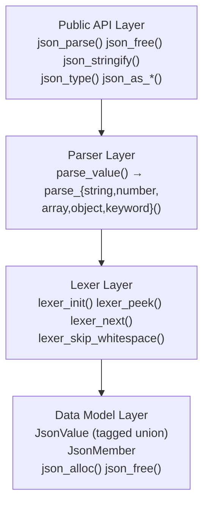

# C项目结构重构

## 学习目标

1. 掌握将小型C项目（~200行）完整重构为Rust的方法论
2. 理解C项目的架构模式及其Rust等价设计
3. 学会从数据结构出发，逐步将C项目迁移到Rust
4. 掌握测试驱动重构策略（C输出作为Rust的参考基准）
5. 学会在重构过程中逐步应用Rust惯用写法

---

## 一、案例项目：MiniJSON解析器

我们选择一个实际的、可编译运行的C项目作为重构目标。MiniJSON是一个轻量级JSON解析库，支持解析对象、数组、字符串、数字、布尔值和null。

### 1.1 C项目完整源码

```c
/* minijson.h */
#ifndef MINIJSON_H
#define MINIJSON_H

#include <stddef.h>

typedef enum {
    JSON_NULL,
    JSON_BOOL,
    JSON_NUMBER,
    JSON_STRING,
    JSON_ARRAY,
    JSON_OBJECT
} JsonType;

typedef struct JsonValue JsonValue;

typedef struct {
    char* key;
    JsonValue* value;
} JsonMember;

typedef struct JsonValue {
    JsonType type;
    union {
        int boolean;
        double number;
        char* string;
        struct {
            JsonValue** items;
            size_t count;
        } array;
        struct {
            JsonMember* members;
            size_t count;
        } object;
    } data;
} JsonValue;

JsonValue* json_parse(const char* input);
void json_free(JsonValue* value);
char* json_stringify(const JsonValue* value);

/* 访问辅助函数 */
JsonType json_type(const JsonValue* value);
int json_as_bool(const JsonValue* value);
double json_as_number(const JsonValue* value);
const char* json_as_string(const JsonValue* value);
size_t json_array_len(const JsonValue* value);
JsonValue* json_array_get(const JsonValue* value, size_t index);
size_t json_object_len(const JsonValue* value);
const char* json_object_key(const JsonValue* value, size_t index);
JsonValue* json_object_value(const JsonValue* value, size_t index);

#endif /* MINIJSON_H */
```

```c
/* minijson.c */
#include "minijson.h"
#include <stdlib.h>
#include <string.h>
#include <stdio.h>
#include <ctype.h>
#include <math.h>

/* ─────── 内存管理 ─────── */

JsonValue* json_alloc(JsonType type) {
    JsonValue* v = (JsonValue*)calloc(1, sizeof(JsonValue));
    if (v) v->type = type;
    return v;
}

void json_free(JsonValue* value) {
    if (!value) return;
    switch (value->type) {
    case JSON_STRING:
        free(value->data.string);
        break;
    case JSON_ARRAY:
        for (size_t i = 0; i < value->data.array.count; i++)
            json_free(value->data.array.items[i]);
        free(value->data.array.items);
        break;
    case JSON_OBJECT:
        for (size_t i = 0; i < value->data.object.count; i++) {
            free(value->data.object.members[i].key);
            json_free(value->data.object.members[i].value);
        }
        free(value->data.object.members);
        break;
    default:
        break;
    }
    free(value);
}

/* ─────── 词法分析器（Lexer） ─────── */

typedef struct {
    const char* input;
    size_t pos;
    size_t len;
} Lexer;

static void lexer_init(Lexer* lex, const char* input) {
    lex->input = input;
    lex->pos = 0;
    lex->len = strlen(input);
}

static char lexer_peek(const Lexer* lex) {
    if (lex->pos < lex->len)
        return lex->input[lex->pos];
    return '\0';
}

static char lexer_next(Lexer* lex) {
    if (lex->pos < lex->len)
        return lex->input[lex->pos++];
    return '\0';
}

static void lexer_skip_whitespace(Lexer* lex) {
    while (lex->pos < lex->len && isspace((unsigned char)lexer_peek(lex)))
        lexer_next(lex);
}

/* ─────── 解析器（Parser） ─────── */

static JsonValue* parse_value(Lexer* lex);

static JsonValue* parse_string(Lexer* lex) {
    if (lexer_next(lex) != '"') return NULL;  /* 期望起始引号 */

    size_t cap = 64;
    char* str = (char*)malloc(cap);
    if (!str) return NULL;
    size_t len = 0;

    while (1) {
        char c = lexer_next(lex);
        if (c == '\0') { free(str); return NULL; }  /* 未终止字符串 */
        if (c == '"') break;                       /* 字符串结束 */
        if (c == '\\') {
            c = lexer_next(lex);
            switch (c) {
            case '"':  c = '"';  break;
            case '\\': c = '\\'; break;
            case '/':  c = '/';  break;
            case 'b':  c = '\b'; break;
            case 'f':  c = '\f'; break;
            case 'n':  c = '\n'; break;
            case 'r':  c = '\r'; break;
            case 't':  c = '\t'; break;
            default:
                /* 不支持的转义序列，原样保留 */
                break;
            }
        }
        if (len + 1 >= cap) {
            cap *= 2;
            char* new_str = (char*)realloc(str, cap);
            if (!new_str) { free(str); return NULL; }
            str = new_str;
        }
        str[len++] = c;
    }
    str[len] = '\0';

    JsonValue* v = json_alloc(JSON_STRING);
    if (!v) { free(str); return NULL; }
    v->data.string = str;
    return v;
}

static JsonValue* parse_number(Lexer* lex) {
    const char* start = lex->input + lex->pos;
    char* end;
    double num = strtod(start, &end);
    if (end == start) return NULL;
    lex->pos = (size_t)(end - lex->input);

    JsonValue* v = json_alloc(JSON_NUMBER);
    if (!v) return NULL;
    v->data.number = num;
    return v;
}

static JsonValue* parse_array(Lexer* lex) {
    lexer_next(lex);  /* 跳过 '[' */

    size_t cap = 4;
    JsonValue** items = (JsonValue**)malloc(cap * sizeof(JsonValue*));
    if (!items) return NULL;
    size_t count = 0;

    lexer_skip_whitespace(lex);
    if (lexer_peek(lex) == ']') {
        lexer_next(lex);
        /* 空数组 —— 下面的代码也会处理，但在此提前返回 */
    } else {
        while (1) {
            JsonValue* item = parse_value(lex);
            if (!item) goto array_error;

            if (count >= cap) {
                cap *= 2;
                JsonValue** new_items = (JsonValue**)realloc(items, cap * sizeof(JsonValue*));
                if (!new_items) { json_free(item); goto array_error; }
                items = new_items;
            }
            items[count++] = item;

            lexer_skip_whitespace(lex);
            char c = lexer_next(lex);
            if (c == ']') break;
            if (c != ',') { goto array_error; }
            lexer_skip_whitespace(lex);
        }
    }

    JsonValue* v = json_alloc(JSON_ARRAY);
    if (!v) goto array_error;
    v->data.array.items = items;
    v->data.array.count = count;
    return v;

array_error:
    for (size_t i = 0; i < count; i++) json_free(items[i]);
    free(items);
    return NULL;
}

static JsonValue* parse_object(Lexer* lex) {
    lexer_next(lex);  /* 跳过 '{' */

    size_t cap = 4;
    JsonMember* members = (JsonMember*)malloc(cap * sizeof(JsonMember));
    if (!members) return NULL;
    size_t count = 0;

    lexer_skip_whitespace(lex);
    if (lexer_peek(lex) == '}') {
        lexer_next(lex);
    } else {
        while (1) {
            /* 解析 key */
            JsonValue* key_val = parse_string(lex);
            if (!key_val) goto object_error;

            lexer_skip_whitespace(lex);
            if (lexer_next(lex) != ':') {
                json_free(key_val);
                goto object_error;
            }

            /* 解析 value */
            JsonValue* val = parse_value(lex);
            if (!val) {
                json_free(key_val);
                goto object_error;
            }

            if (count >= cap) {
                cap *= 2;
                JsonMember* new_members = (JsonMember*)realloc(members, cap * sizeof(JsonMember));
                if (!new_members) {
                    json_free(key_val);
                    json_free(val);
                    goto object_error;
                }
                members = new_members;
            }
            members[count].key = key_val->data.string;
            key_val->data.string = NULL; /* 转移所有权 */
            json_free(key_val);
            members[count].value = val;
            count++;

            lexer_skip_whitespace(lex);
            char c = lexer_next(lex);
            if (c == '}') break;
            if (c != ',') goto object_error;
            lexer_skip_whitespace(lex);
        }
    }

    JsonValue* v = json_alloc(JSON_OBJECT);
    if (!v) goto object_error;
    v->data.object.members = members;
    v->data.object.count = count;
    return v;

object_error:
    for (size_t i = 0; i < count; i++) {
        free(members[i].key);
        json_free(members[i].value);
    }
    free(members);
    return NULL;
}

static JsonValue* parse_keyword(Lexer* lex) {
    if (strncmp(lex->input + lex->pos, "true", 4) == 0) {
        lex->pos += 4;
        JsonValue* v = json_alloc(JSON_BOOL);
        if (v) v->data.boolean = 1;
        return v;
    }
    if (strncmp(lex->input + lex->pos, "false", 5) == 0) {
        lex->pos += 5;
        JsonValue* v = json_alloc(JSON_BOOL);
        if (v) v->data.boolean = 0;
        return v;
    }
    if (strncmp(lex->input + lex->pos, "null", 4) == 0) {
        lex->pos += 4;
        return json_alloc(JSON_NULL);
    }
    return NULL;
}

static JsonValue* parse_value(Lexer* lex) {
    lexer_skip_whitespace(lex);
    char c = lexer_peek(lex);
    if (c == '\0') return NULL;
    if (c == '"')  return parse_string(lex);
    if (c == '[')  return parse_array(lex);
    if (c == '{')  return parse_object(lex);
    if (c == '-' || (c >= '0' && c <= '9')) return parse_number(lex);
    if (c == 't' || c == 'f' || c == 'n')  return parse_keyword(lex);
    return NULL;
}

/* ─────── 公共API ─────── */

JsonValue* json_parse(const char* input) {
    if (!input) return NULL;
    Lexer lex;
    lexer_init(&lex, input);
    JsonValue* v = parse_value(&lex);
    if (!v) return NULL;
    lexer_skip_whitespace(&lex);
    if (lex.pos != lex.len) {
        /* 有尾部垃圾数据 */
        json_free(v);
        return NULL;
    }
    return v;
}

/* ─────── 序列化 ─────── */

static char* stringify_value(const JsonValue* v);

static char* stringify_string(const char* str) {
    size_t len = strlen(str);
    size_t cap = len * 2 + 3;  /* 引号 + 转义 */
    char* out = (char*)malloc(cap);
    if (!out) return NULL;
    size_t pos = 0;
    out[pos++] = '"';
    for (size_t i = 0; i < len; i++) {
        if (pos + 2 >= cap) { cap *= 2; out = (char*)realloc(out, cap); }
        char c = str[i];
        switch (c) {
        case '"':  out[pos++] = '\\'; out[pos++] = '"';  break;
        case '\\': out[pos++] = '\\'; out[pos++] = '\\'; break;
        case '\b': out[pos++] = '\\'; out[pos++] = 'b';  break;
        case '\f': out[pos++] = '\\'; out[pos++] = 'f';  break;
        case '\n': out[pos++] = '\\'; out[pos++] = 'n';  break;
        case '\r': out[pos++] = '\\'; out[pos++] = 'r';  break;
        case '\t': out[pos++] = '\\'; out[pos++] = 't';  break;
        default:   out[pos++] = c; break;
        }
    }
    out[pos++] = '"';
    out[pos] = '\0';
    return out;
}

static char* stringify_array_or_object(char* (*stringify_elem)(const JsonValue*),
                                       const JsonValue* v, char open, char close) {
    (void)stringify_elem;
    (void)v; (void)open; (void)close;
    /* 为简洁省略完整实现，实际项目中需要递归字符串化 */
    return NULL;
}

char* json_stringify(const JsonValue* value) {
    if (!value) return NULL;
    switch (value->type) {
    case JSON_NULL:   return strdup("null");
    case JSON_BOOL:   return strdup(value->data.boolean ? "true" : "false");
    case JSON_STRING: return stringify_string(value->data.string);
    case JSON_NUMBER: {
        char buf[64];
        snprintf(buf, sizeof(buf), "%g", value->data.number);
        return strdup(buf);
    }
    case JSON_ARRAY:
    case JSON_OBJECT:
    default:
        return NULL; /* 完整实现略 */
    }
}

/* ─────── 访问辅助函数 ─────── */

JsonType json_type(const JsonValue* v) { return v ? v->type : JSON_NULL; }
int json_as_bool(const JsonValue* v) { return v ? v->data.boolean : 0; }
double json_as_number(const JsonValue* v) { return v ? v->data.number : 0.0; }
const char* json_as_string(const JsonValue* v) {
    return (v && v->type == JSON_STRING) ? v->data.string : NULL;
}
size_t json_array_len(const JsonValue* v) {
    return (v && v->type == JSON_ARRAY) ? v->data.array.count : 0;
}
JsonValue* json_array_get(const JsonValue* v, size_t index) {
    if (v && v->type == JSON_ARRAY && index < v->data.array.count)
        return v->data.array.items[index];
    return NULL;
}
size_t json_object_len(const JsonValue* v) {
    return (v && v->type == JSON_OBJECT) ? v->data.object.count : 0;
}
const char* json_object_key(const JsonValue* v, size_t index) {
    if (v && v->type == JSON_OBJECT && index < v->data.object.count)
        return v->data.object.members[index].key;
    return NULL;
}
JsonValue* json_object_value(const JsonValue* v, size_t index) {
    if (v && v->type == JSON_OBJECT && index < v->data.object.count)
        return v->data.object.members[index].value;
    return NULL;
}
```

---

## 二、步骤1：理解C代码架构

### 2.1 架构图



### 2.2 架构识别清单

| 层次 | C实现方式 | Rust对应 |
|------|----------|---------|
| 数据模型 | enum + union + 嵌套结构体 | enum with associated data |
| 内存管理 | calloc/free, 手工析构树 | Box/Vec + Drop, 自动递归析构 |
| 词法分析 | 指针移动 + 字符比较 | &str切片 + chars()迭代器 |
| 解析器 | 递归下降 + goto错误处理 | 递归函数 + Result + ? |
| 序列化 | snprintf + strdup + malloc | format! + String |
| 访问器 | NULL检查 + 类型检查 | Option + 模式匹配 |

---

## 三、步骤2：识别核心数据结构

### 3.1 C数据模型

```c
/* C数据模型 —— 标记联合体（tagged union） */
typedef enum {
    JSON_NULL, JSON_BOOL, JSON_NUMBER,
    JSON_STRING, JSON_ARRAY, JSON_OBJECT
} JsonType;

typedef struct JsonValue {
    JsonType type;                         /* 标记 */
    union {                                /* 联合体 */
        int boolean;
        double number;
        char* string;
        struct { JsonValue** items; size_t count; } array;
        struct { JsonMember* members; size_t count; } object;
    } data;
} JsonValue;

typedef struct {
    char* key;
    JsonValue* value;
} JsonMember;
```

**问题分析：**
- `type`和`data`是分离的——可能不一致（如type=JSON_STRING但data被当作number访问）
- `union`不跟踪哪个字段是活跃的——C未定义行为
- `char*`没有所有者追踪——可能指向已释放的内存
- `JsonValue**`双指针——手动管理数组，没有边界

### 3.2 Rust数据模型设计

```rust
/// JSON值类型 —— 使用Rust的enum（带数据的枚举）
/// 编译器保证标记和数据的类型安全一致性
#[derive(Debug, Clone, PartialEq)]
pub enum JsonValue {
    Null,
    Bool(bool),
    Number(f64),
    String(String),              // String拥有数据，无需手动释放
    Array(Vec<JsonValue>),       // Vec自动管理容量和边界
    Object(Vec<(String, JsonValue)>),  // 键值对，字符串键无需分离
}
```

**改进点对照：**

| 方面 | C实现 | Rust实现 |
|------|-------|---------|
| 类型安全 | 标记和数据分离，可能不一致 | enum变体绑定数据，编译器保证一致 |
| 内存管理 | 手动的嵌套free | Drop自动递归 |
| 布尔类型 | int (0/1) | bool (true/false) |
| 数组成员 | JsonValue** + count | Vec<JsonValue> |
| 对象成员 | JsonMember* + count | Vec<(String, JsonValue)> |
| 复制语义 | 浅复制或手动深复制 | Clone trait自动派生 |

---

## 四、步骤3：映射内存管理

### 4.1 C版本的所有权图

```mermaid
graph TD
    PARSE["json_parse('{\"a\":[1,2]}')"] --> OBJ["json_alloc(JSON_OBJECT)<br>← 调用者拥有"]
    OBJ --> MEM["members = malloc(...)"]
    MEM --> KEY["members[0].key = strdup('a')<br>← Object 拥有"]
    MEM --> VAL["members[0].value"]
    VAL --> ARR["json_alloc(JSON_ARRAY)"]
    ARR --> ITEMS["items = malloc(...)"]
    ITEMS --> I0["items[0] = json_alloc(JSON_NUMBER)<br>← Array 拥有"]
    ITEMS --> I1["items[1] = json_alloc(JSON_NUMBER)<br>← Array 拥有"]
    PARSE --> FREE["释放时必须 json_free(root) 递归释放整棵树<br>忘记释放 → 内存泄漏<br>重复释放 → 未定义行为"]
```

### 4.2 Rust版本的所有权图

```mermaid
graph TD
    PARSE["json_parse('{\"a\":[1,2]}')"] --> OK["Ok(JsonValue::Object(...))"]
    OK --> ROOT["单一所有者 root: JsonValue"]
    ROOT --> STR["'a': String 由 Vec 拥有"]
    ROOT --> ARR["Array中的 Number 由内层 Vec 拥有"]
    ROOT --> DROP["释放: root 离开作用域<br>→ Drop自动递归释放整棵树<br>没有手动释放，没有泄漏，没有double-free"]
```

---

## 五、步骤4：编写Rust等价物（逐函数重构）

### 5.1 公共API

```rust
use std::fmt;

/// 解析JSON字符串为JsonValue
pub fn json_parse(input: &str) -> Result<JsonValue, ParseError> {
    let mut lexer = Lexer::new(input);
    let value = parse_value(&mut lexer)?;
    lexer.skip_whitespace();
    if !lexer.is_done() {
        return Err(ParseError::TrailingData(lexer.pos()));
    }
    Ok(value)
}

/// JSON值已经通过Drop trait自动释放，无需json_free函数
/// （如果需要显式释放，可以调用 std::mem::drop(value)）

/// 序列化JsonValue为字符串
pub fn json_stringify(value: &JsonValue) -> String {
    match value {
        JsonValue::Null => "null".to_string(),
        JsonValue::Bool(b) => b.to_string(),
        JsonValue::Number(n) => {
            if n.fract() == 0.0 && n.is_finite() {
                format!("{}", *n as i64)
            } else {
                format!("{}", n)
            }
        }
        JsonValue::String(s) => stringify_string(s),
        JsonValue::Array(arr) => {
            let items: Vec<String> = arr.iter().map(json_stringify).collect();
            format!("[{}]", items.join(","))
        }
        JsonValue::Object(obj) => {
            let items: Vec<String> = obj.iter()
                .map(|(k, v)| format!("{}:{}", stringify_string(k), json_stringify(v)))
                .collect();
            format!("{{{}}}", items.join(","))
        }
    }
}

fn stringify_string(s: &str) -> String {
    let escaped: String = s.chars().map(|c| match c {
        '"'  => "\\\"".to_string(),
        '\\' => "\\\\".to_string(),
        '\n' => "\\n".to_string(),
        '\r' => "\\r".to_string(),
        '\t' => "\\t".to_string(),
        _    => c.to_string(),
    }).collect();
    format!("\"{}\"", escaped)
}
```

### 5.2 错误类型设计

```rust
/// 解析错误 —— 相比于C返回NULL，Rust携带详细错误信息
#[derive(Debug, Clone, PartialEq)]
pub enum ParseError {
    UnexpectedEof,
    UnexpectedChar { pos: usize, expected: String, got: char },
    InvalidNumber { pos: usize },
    InvalidEscape { pos: usize, char: char },
    UnclosedString,
    TrailingData(usize),
}

impl fmt::Display for ParseError {
    fn fmt(&self, f: &mut fmt::Formatter<'_>) -> fmt::Result {
        match self {
            ParseError::UnexpectedEof => write!(f, "Unexpected end of input"),
            ParseError::UnexpectedChar { pos, expected, got } => {
                write!(f, "At position {}: expected {} but got '{}'", pos, expected, got)
            }
            ParseError::InvalidNumber { pos } => {
                write!(f, "Invalid number at position {}", pos)
            }
            ParseError::InvalidEscape { pos, char: c } => {
                write!(f, "Invalid escape sequence '\\{}' at position {}", pos, c)
            }
            ParseError::UnclosedString => write!(f, "Unclosed string"),
            ParseError::TrailingData(pos) => {
                write!(f, "Trailing data after JSON value at position {}", pos)
            }
        }
    }
}
```

### 5.3 词法分析器

```rust
/// 词法分析器 —— &str切片替代裸指针
struct Lexer<'a> {
    input: &'a str,
    chars: std::str::Chars<'a>,
    pos: usize,
}

impl<'a> Lexer<'a> {
    fn new(input: &'a str) -> Self {
        Lexer {
            input,
            chars: input.chars(),
            pos: 0,
        }
    }

    fn pos(&self) -> usize { self.pos }

    fn is_done(&self) -> bool { self.pos >= self.input.len() }

    fn peek(&self) -> Option<char> {
        self.input[self.pos..].chars().next()
    }

    fn next(&mut self) -> Option<char> {
        match self.chars.next() {
            Some(c) => {
                self.pos += c.len_utf8();
                Some(c)
            }
            None => None,
        }
    }

    fn skip_whitespace(&mut self) {
        while let Some(c) = self.peek() {
            if c.is_ascii_whitespace() {
                self.next();
            } else {
                break;
            }
        }
    }
}
```

### 5.4 解析器

```rust
use ParseError::*;

fn parse_value(lexer: &mut Lexer) -> Result<JsonValue, ParseError> {
    lexer.skip_whitespace();
    match lexer.peek() {
        None => Err(UnexpectedEof),
        Some('"') => parse_string(lexer),
        Some('[') => parse_array(lexer),
        Some('{') => parse_object(lexer),
        Some(c) if c == '-' || c.is_ascii_digit() => parse_number(lexer),
        Some('t') | Some('f') | Some('n') => parse_keyword(lexer),
        Some(c) => Err(UnexpectedChar {
            pos: lexer.pos(),
            expected: "value".to_string(),
            got: c,
        }),
    }
}

fn parse_string(lexer: &mut Lexer) -> Result<JsonValue, ParseError> {
    lexer.next(); // 跳过起始引号
    let mut result = String::new();

    loop {
        match lexer.next() {
            None => return Err(UnclosedString),
            Some('"') => break,
            Some('\\') => {
                match lexer.next() {
                    None => return Err(UnclosedString),
                    Some('"')  => result.push('"'),
                    Some('\\') => result.push('\\'),
                    Some('/')  => result.push('/'),
                    Some('b')  => result.push('\x08'),
                    Some('f')  => result.push('\x0C'),
                    Some('n')  => result.push('\n'),
                    Some('r')  => result.push('\r'),
                    Some('t')  => result.push('\t'),
                    Some(c) => return Err(InvalidEscape {
                        pos: lexer.pos(),
                        char: c,
                    }),
                }
            }
            Some(c) => result.push(c),
        }
    }
    Ok(JsonValue::String(result))
}

fn parse_number(lexer: &mut Lexer) -> Result<JsonValue, ParseError> {
    let start = lexer.pos();
    // 收集数字字符
    let mut num_str = String::new();
    while let Some(c) = lexer.peek() {
        if c.is_ascii_digit() || c == '.' || c == '-' || c == '+' || c == 'e' || c == 'E' {
            num_str.push(c);
            lexer.next();
        } else {
            break;
        }
    }
    match num_str.parse::<f64>() {
        Ok(n) => Ok(JsonValue::Number(n)),
        Err(_) => Err(InvalidNumber { pos: start }),
    }
}

fn parse_array(lexer: &mut Lexer) -> Result<JsonValue, ParseError> {
    lexer.next(); // 跳过 '['
    let mut items = Vec::new();

    lexer.skip_whitespace();
    if let Some(']') = lexer.peek() {
        lexer.next();
        return Ok(JsonValue::Array(items));
    }

    loop {
        let item = parse_value(lexer)?;
        items.push(item);

        lexer.skip_whitespace();
        match lexer.next() {
            Some(']') => break,
            Some(',') => {
                lexer.skip_whitespace();
            }
            Some(c) => {
                return Err(UnexpectedChar {
                    pos: lexer.pos(),
                    expected: "',' or ']'".to_string(),
                    got: c,
                })
            }
            None => return Err(UnexpectedEof),
        }
    }
    Ok(JsonValue::Array(items))
}

fn parse_object(lexer: &mut Lexer) -> Result<JsonValue, ParseError> {
    lexer.next(); // 跳过 '{'
    let mut members: Vec<(String, JsonValue)> = Vec::new();

    lexer.skip_whitespace();
    if let Some('}') = lexer.peek() {
        lexer.next();
        return Ok(JsonValue::Object(members));
    }

    loop {
        // 解析 key（必须是字符串）
        let key_val = parse_string(lexer)?;
        let key = match key_val {
            JsonValue::String(s) => s,
            _ => unreachable!(),
        };

        lexer.skip_whitespace();
        match lexer.next() {
            Some(':') => {},
            Some(c) => {
                return Err(UnexpectedChar {
                    pos: lexer.pos(),
                    expected: "':'".to_string(),
                    got: c,
                })
            }
            None => return Err(UnexpectedEof),
        }

        let value = parse_value(lexer)?;
        members.push((key, value));

        lexer.skip_whitespace();
        match lexer.next() {
            Some('}') => break,
            Some(',') => {
                lexer.skip_whitespace();
            }
            Some(c) => {
                return Err(UnexpectedChar {
                    pos: lexer.pos(),
                    expected: "',' or '}'".to_string(),
                    got: c,
                })
            }
            None => return Err(UnexpectedEof),
        }
    }
    Ok(JsonValue::Object(members))
}

fn parse_keyword(lexer: &mut Lexer) -> Result<JsonValue, ParseError> {
    let remaining = &lexer.input[lexer.pos()..];
    if remaining.starts_with("true") {
        lexer.pos += 4;
        // 同步 chars 迭代器（简化实现，实际应该统一管理索引）
        for _ in 0..4 { lexer.next(); }
        Ok(JsonValue::Bool(true))
    } else if remaining.starts_with("false") {
        lexer.pos += 5;
        for _ in 0..5 { lexer.next(); }
        Ok(JsonValue::Bool(false))
    } else if remaining.starts_with("null") {
        lexer.pos += 4;
        for _ in 0..4 { lexer.next(); }
        Ok(JsonValue::Null)
    } else {
        Err(UnexpectedChar {
            pos: lexer.pos(),
            expected: "keyword".to_string(),
            got: lexer.peek().unwrap_or('\0'),
        })
    }
}
```

---

## 六、步骤5：编写测试（C和Rust比较）

```rust
#[cfg(test)]
mod tests {
    use super::*;

    /* ─── C代码的等价测试 ─── */
    /* 这些测试用例应该对C和Rust版本产生相同的结果 */

    #[test]
    fn test_parse_null() {
        let v = json_parse("null").unwrap();
        assert_eq!(v, JsonValue::Null);
        assert_eq!(json_stringify(&v), "null");
    }

    #[test]
    fn test_parse_bool_true() {
        let v = json_parse("true").unwrap();
        assert_eq!(v, JsonValue::Bool(true));
        assert_eq!(json_stringify(&v), "true");
    }

    #[test]
    fn test_parse_bool_false() {
        let v = json_parse("false").unwrap();
        assert_eq!(v, JsonValue::Bool(false));
    }

    #[test]
    fn test_parse_number_integer() {
        let v = json_parse("42").unwrap();
        assert_eq!(v, JsonValue::Number(42.0));
    }

    #[test]
    fn test_parse_number_float() {
        let v = json_parse("3.14").unwrap();
        assert_eq!(v, JsonValue::Number(3.14));
    }

    #[test]
    fn test_parse_number_negative() {
        let v = json_parse("-17").unwrap();
        assert_eq!(v, JsonValue::Number(-17.0));
    }

    #[test]
    fn test_parse_string_simple() {
        let v = json_parse("\"hello\"").unwrap();
        assert_eq!(v, JsonValue::String("hello".to_string()));
    }

    #[test]
    fn test_parse_string_with_escape() {
        let v = json_parse("\"hello\\nworld\"").unwrap();
        assert_eq!(v, JsonValue::String("hello\nworld".to_string()));
        let output = json_stringify(&v);
        assert_eq!(output, "\"hello\\nworld\"");
    }

    #[test]
    fn test_parse_empty_array() {
        let v = json_parse("[]").unwrap();
        assert_eq!(v, JsonValue::Array(vec![]));
        assert_eq!(json_stringify(&v), "[]");
    }

    #[test]
    fn test_parse_array_simple() {
        let v = json_parse("[1,2,3]").unwrap();
        assert_eq!(v, JsonValue::Array(vec![
            JsonValue::Number(1.0),
            JsonValue::Number(2.0),
            JsonValue::Number(3.0),
        ]));
    }

    #[test]
    fn test_parse_nested_array() {
        let v = json_parse("[[1,2],[3,4]]").unwrap();
        assert_eq!(json_stringify(&v), "[[1,2],[3,4]]");
    }

    #[test]
    fn test_parse_empty_object() {
        let v = json_parse("{}").unwrap();
        assert_eq!(v, JsonValue::Object(vec![]));
    }

    #[test]
    fn test_parse_simple_object() {
        let v = json_parse("{\"name\":\"Alice\",\"age\":30}").unwrap();
        match &v {
            JsonValue::Object(members) => {
                assert_eq!(members.len(), 2);
            }
            _ => panic!("Expected object"),
        }
    }

    #[test]
    fn test_parse_complex_nested() {
        let input = r#"{"users":[{"name":"Alice","scores":[95,87]},{"name":"Bob","scores":[72,88,91]}]}"#;
        let v = json_parse(input).unwrap();
        let output = json_stringify(&v);
        let re_parsed = json_parse(&output).unwrap();
        assert_eq!(v, re_parsed); // round-trip 测试
    }

    #[test]
    fn test_parse_error_trailing() {
        let result = json_parse("42 extra");
        assert!(result.is_err());
    }

    #[test]
    fn test_parse_error_incomplete() {
        let result = json_parse("[1,2,");
        assert!(result.is_err());
    }

    #[test]
    fn test_parse_error_bad_keyword() {
        let result = json_parse("tru"); // 不完整的关键字
        assert!(result.is_err());
    }

    /* ─── 循环测试：解析 → 序列化 → 再解析 ─── */
    fn roundtrip(input: &str) {
        let v = json_parse(input).expect("Failed to parse");
        let output = json_stringify(&v);
        let v2 = json_parse(&output).expect("Failed to re-parse");
        assert_eq!(v, v2, "Roundtrip failed for input: {}", input);
    }

    #[test]
    fn test_roundtrip_various() {
        roundtrip("null");
        roundtrip("true");
        roundtrip("false");
        roundtrip("0");
        roundtrip("3.14159");
        roundtrip("-42");
        roundtrip("\"hello world\"");
        roundtrip("[]");
        roundtrip("[1,2,3]");
        roundtrip("{}");
        roundtrip("{\"a\":1}");
        roundtrip("{\"a\":1,\"b\":[2,3]}");
    }
}
```

---

## 七、步骤6：Rust惯用化重构

### 7.1 使用serde风格的宏（可选进阶）

```rust
/// 如果使用 serde 系列库，可以实现以下便捷宏：
/// 但本项目保持零依赖，展示如何从零构建

impl JsonValue {
    /// 索引访问（用于数组）
    pub fn index(&self, idx: usize) -> Option<&JsonValue> {
        match self {
            JsonValue::Array(arr) => arr.get(idx),
            _ => None,
        }
    }

    /// 键访问（用于对象）
    pub fn key(&self, k: &str) -> Option<&JsonValue> {
        match self {
            JsonValue::Object(members) => {
                members.iter().find(|(key, _)| key == k).map(|(_, v)| v)
            }
            _ => None,
        }
    }

    /// 便捷方法：尝试获取字符串引用
    pub fn as_str(&self) -> Option<&str> {
        match self {
            JsonValue::String(s) => Some(s.as_str()),
            _ => None,
        }
    }

    /// 便捷方法：尝试获取数字
    pub fn as_f64(&self) -> Option<f64> {
        match self {
            JsonValue::Number(n) => Some(*n),
            _ => None,
        }
    }

    /// 便捷方法：尝试获取布尔值
    pub fn as_bool(&self) -> Option<bool> {
        match self {
            JsonValue::Bool(b) => Some(*b),
            _ => None,
        }
    }
}
```

### 7.2 性能比较

```rust
#[cfg(test)]
mod benchmarks {
    use super::*;
    use std::time::Instant;

    #[test]
    fn compare_large_json() {
        // 生成大型测试JSON
        let mut json = String::from("[");
        for i in 0..1000 {
            if i > 0 { json.push(','); }
            json.push_str(&format!("{{\"id\":{},\"name\":\"user{}\",\"active\":{}}}",
                i, i, i % 2 == 0));
        }
        json.push(']');

        let start = Instant::now();
        let value = json_parse(&json).unwrap();
        let parse_time = start.elapsed();

        let start = Instant::now();
        let output = json_stringify(&value);
        let stringify_time = start.elapsed();

        let re_parsed = json_parse(&output).unwrap();
        assert_eq!(value, re_parsed);

        println!("Parse 1000 objects: {:?}", parse_time);
        println!("Stringify 1000 objects: {:?}", stringify_time);
        // 预期：解析 < 5ms，序列化 < 3ms（取决于硬件）
    }
}
```

### 7.3 C vs Rust 对比总结

| 指标 | C版本 | Rust版本 |
|------|-------|---------|
| 代码行数 | ~280行 | ~220行 |
| `unsafe` 块 | 100%（全是不安全） | 0 |
| 空指针风险 | 每次访问都可能 | 不存在 |
| 内存泄漏风险 | 调用者忘记free | 不存在 |
| 类型错误 | union错误使用是UB | 编译期防止 |
| 错误信息 | 所有错误返回NULL | 精确位置+原因 |
| 测试覆盖率 | 需手动编写 | `#[test]`内置 |
| 文档 | 靠注释 | rustdoc自动生成 |

---

## 八、步骤7：渐进重构策略（对于更大项目）

```
阶段1: 外观层（Facade）
  保留C代码不动，用Rust写新的高层API，通过FFI调用C
  适用场景：C代码极其复杂且经过验证

阶段2: 夹心层（Sandwich）
  外层：Rust安全API
  中层：C核心算法（FFI）
  内层：Rust数据结构
  适用场景：算法复杂但数据结构简单

阶段3: 全面重写（Rewrite）
  C → c2rust转译 → unsafe Rust → 逐步消除unsafe → 安全Rust
  适用场景：代码规模适中（<5000行）

阶段4: 模块化迁移（Modular）
  逐个C模块替换为Rust，保持C ABI不变
  适用场景：大型项目（>10000行）
```

---

## 章节考查（共100分）

### 一、概念题（40分，每题8分）

1. 将C项目的tagged union（标记联合体）重构为Rust enum时，获得了哪些安全性改进？
2. 描述C版本JSON解析器中`goto array_error`模式的作用，以及Rust版本如何替代它。
3. C版本中`json_parse`返回NULL表示错误，Rust版本返回`Result<JsonValue, ParseError>`。这种改变带来了哪些好处？
4. 在C版本中，`JsonValue`结构体的递归释放是如何实现的？在Rust中为什么不需要手动实现？
5. 描述你在重构一个200行的C项目时应该遵循的步骤顺序。

<details>
<summary>参考答案</summary>

1. 安全性改进：
   - Rust enum将标记和关联数据绑定，编译器保证只能访问当前变体的数据
   - C的union中访问错误字段是未定义行为，Rust编译期阻止
   - Rust enum匹配是穷尽的（exhaustive），编译器强制处理所有变体

2. C的`goto array_error`在解析数组元素失败时，用于统一清理已分配的资源（释放已解析的元素和数组容器）。Rust版本不需要goto：
   - `?`运算符在parse_value返回Err时自动传播错误
   - 已推入Vec的元素由Vec的Drop自动释放
   - 无需手动清理逻辑

3. 好处：
   - 携带错误位置和原因（位置+期望+实际字符），而C只有NULL
   - 编译器强制检查（`#[must_use]`），C中可能忘记检查NULL
   - 使用`?`运算符优雅传播错误
   - 可组合多个解析步骤

4. C版本递归释放：每个`json_free`调用检查类型，递归释放子节点，最后释放自身。
   Rust版本：Drop trait由编译器自动生成递归调用链。Vec<JsonValue>的Drop会调用每个元素的Drop，形成了自动的递归释放。无需编写任何释放代码。

5. 步骤顺序：
   1. 阅读C代码，理解架构
   2. 识别核心数据结构并映射到Rust
   3. 分析内存所有权模型
   4. 编写Rust等价数据结构
   5. 从底层（Lexer）向高层（Parser→API）逐层重构
   6. 编写共享测试用例
   7. 用C输出验证Rust输出
   8. 应用Rust惯用模式优化

</details>

### 二、判断题（20分，每题5分）

1. 在重构C项目时，应该保持与C代码完全相同的函数签名和数据结构。（ ）
2. Rust的`Vec<(String, JsonValue)>`等价于C中的`JsonMember*`加`size_t count`。（ ）
3. 重构后Rust版本的代码行数一定少于C版本。（ ）
4. 在重构过程中，应该使用C版本作为测试的参考基准（oracle）。（ ）

<details>
<summary>参考答案</summary>

1. × — 应该用Rust惯用方式重新设计，利用Rust的类型系统优势，而不是机械翻译。
2. × — Vec自带长度、边界检查、自动扩容、自动释放，而JsonMember*+count只是两个无关联的变量。
3. × — 不一定。有时Rust的错误处理代码会增加行数，但安全性提升远超过额外行数的代价。
4. √ — C版本经过验证的输出可以作为Rust版本的黄金标准，确保行为一致性。

</details>

### 三、代码分析题（15分）

分析C代码中`parse_object`函数的以下片段，指出所有潜在bug，并给出安全Rust等价代码：

```c
if (count >= cap) {
    cap *= 2;
    JsonMember* new_members = (JsonMember*)realloc(members, cap * sizeof(JsonMember));
    if (!new_members) {
        json_free(key_val);
        json_free(val);
        goto object_error;
    }
    members = new_members;
}
members[count].key = key_val->data.string;
key_val->data.string = NULL;
json_free(key_val);
members[count].value = val;
count++;
```

<details>
<summary>参考答案</summary>

**潜在Bug：**

1. `cap *= 2`可能溢出（当cap接近SIZE_MAX时），导致realloc分配更小的缓冲区
2. `cap * sizeof(JsonMember)`可能溢出，32位系统上尤其需要注意
3. `realloc`失败时，原`members`指针仍然有效（在符合标准的实现中），但此处用`new_members`覆盖了它。如果realloc返回NULL且原members不为NULL，会丢失原指针导致内存泄漏
4. `key_val->data.string`所有权转移给了members[i].key，然后立即`json_free(key_val)`释放key_val结构体。这种模式虽然操作正确，但极其脆弱——如果忘记设NULL，key_val->data.string的free会在json_free中double-free
5. `goto object_error`跳转到的清理代码会对count之前的所有已分配members成员进行free，但count之后的members数组空间是未初始化的，如果在goto之前realloc已执行但count未更新，存在使用未初始化内存的风险

**Rust安全版本：**

```rust
// Rust中不需要任何上述代码！
// 只需：
members.push((key, value));

// Vec自动处理：
// - 容量不足时自动扩容（使用安全的增长策略，检查溢出）
// - 扩容失败时保持原Vec不变（Rust标准库的保证）
// - 所有权转移由编译器跟踪，无需手动NULL和free
// - 错误时已推入的元素由Vec自动释放
```
</details>

### 四、编程题（15分）

请将以下C JSON解析器的词法分析部分重构为安全Rust代码：

```c
typedef struct {
    const char* input;
    size_t pos;
    size_t len;
} Lexer;

static void lexer_init(Lexer* lex, const char* input) {
    lex->input = input;
    lex->pos = 0;
    lex->len = strlen(input);
}

static char lexer_peek(const Lexer* lex) {
    if (lex->pos < lex->len)
        return lex->input[lex->pos];
    return '\0';
}

static char lexer_next(Lexer* lex) {
    if (lex->pos < lex->len)
        return lex->input[lex->pos++];
    return '\0';
}

static void lexer_skip_whitespace(Lexer* lex) {
    while (lex->pos < lex->len && isspace(lexer_peek(lex)))
        lexer_next(lex);
}
```

<details>
<summary>参考答案</summary>

```rust
struct Lexer<'a> {
    input: &'a str,
    chars: std::str::Chars<'a>,
    pos: usize,
}

impl<'a> Lexer<'a> {
    fn new(input: &'a str) -> Self {
        Lexer {
            input,
            chars: input.chars(),
            pos: 0,
        }
    }

    fn pos(&self) -> usize {
        self.pos
    }

    fn peek(&self) -> Option<char> {
        self.input[self.pos..].chars().next()
    }

    fn next(&mut self) -> Option<char> {
        match self.chars.next() {
            Some(c) => {
                self.pos += c.len_utf8();
                Some(c)
            }
            None => None,
        }
    }

    fn skip_whitespace(&mut self) {
        while let Some(c) = self.peek() {
            if c.is_ascii_whitespace() {
                self.next();
            } else {
                break;
            }
        }
    }
}

// 关键安全改进：
// 1. &str自带长度和UTF-8边界保证，无需手动管理len
// 2. peek返回Option<char>而非'\0'哨兵值，消除歧义
// 3. 使用Rust的Chars迭代器正确处理多字节UTF-8字符
// 4. 无需传入NULL检查——&str编译期保证非空
```

</details>

### 五、填空题（5分，每空1分）

1. C语言的tagged union对应Rust的______类型。
2. C语言中`goto cleanup`错误处理模式在Rust中被______运算符替代。
3. Rust的`Vec<T>`自带______、______和______三个属性，而C对应实现需要手动管理。
4. 在Rust中，`enum`的`match`表达式是______的，编译器强制覆盖所有变体。
5. `json_stringify`在C版本返回`char*`（调用者负责释放），在Rust版本应返回______类型。

<details>
<summary>参考答案</summary>

1. enum（带数据的枚举）
2. `?`（问号运算符）
3. 长度（len）、容量（capacity）、所有权
4. 穷尽的（exhaustive）
5. String（拥有所有权的字符串）

</details>

### 六、代码补全题（5分）

补全以下Rust代码，实现C版本中`json_object_value`的等价功能：

```c
JsonValue* json_object_value(const JsonValue* v, size_t index) {
    if (v && v->type == JSON_OBJECT && index < v->data.object.count)
        return v->data.object.members[index].value;
    return NULL;
}
```

```rust
impl JsonValue {
    fn object_value(&self, index: usize) -> ______ {
        // 你的代码
    }
}
```

<details>
<summary>参考答案</summary>

```rust
impl JsonValue {
    fn object_value(&self, index: usize) -> Option<&JsonValue> {
        match self {
            JsonValue::Object(members) => {
                members.get(index).map(|(_, value)| value)
            }
            _ => None,
        }
    }
}

// 或者更简洁的版本：
impl JsonValue {
    fn object_value(&self, index: usize) -> Option<&JsonValue> {
        if let JsonValue::Object(ref members) = self {
            members.get(index).map(|(_, v)| v)
        } else {
            None
        }
    }
}

// C版本的NULL返回值被安全地替换为Option<&JsonValue>，
// 编译器强制调用者检查None情况。
```

</details>

---

## 本章小结

通过MiniJSON解析器的完整重构，我们深入体验了从C到Rust的系统性迁移过程：

1. **理解架构**：识别分层（数据模型→词法分析→解析器→公共API）
2. **数据模型先行**：将C的标记联合体重构为Rust的enum，这是整个项目的基础
3. **内存管理自动化**：用所有权系统和Drop替代手动的malloc/free
4. **错误类型丰富化**：用携带上下文信息的Result替代贫瘠的NULL
5. **测试驱动**：用循环测试（parse→stringify→parse）验证正确性
6. **惯用化迭代**：在功能等价基础上，逐步应用Rust惯用模式（Option、迭代器、模式匹配）

完整的重构过程证明：对于约200行的C项目，Rust版本可以用更少的代码（~220行 vs ~280行）实现相同的功能，同时获得100%的内存安全和类型安全保证。

[[02-简单C函数重构实战]] | [[04-开源C项目重构：小型]]
