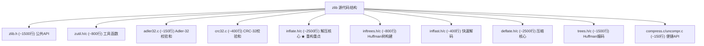
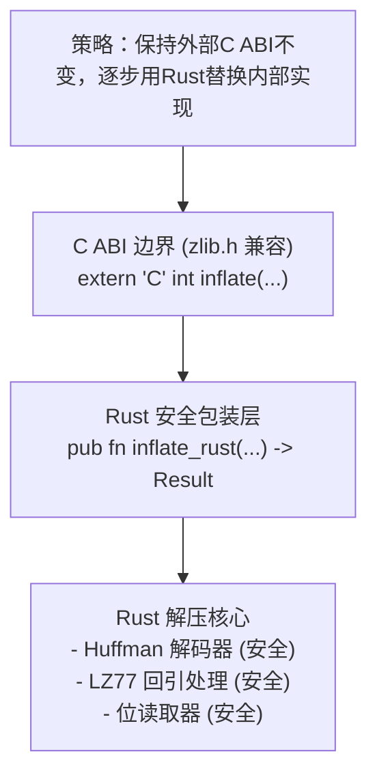

# 开源C项目重构：中型

## 学习目标

1. 理解中型C开源项目（2000-5000行）的重构策略
2. 掌握增量重写方法论：保持C ABI，用Rust重写内部
3. 学会评估大型C代码库中哪些模块最适合Rust重写
4. 理解zlib/deflate压缩算法的Rust改写过程
5. 掌握跨语言测试策略：Rust输出对比C参考实现

---

## 一、案例选择：zlib核心模块

### 1.1 为什么选择zlib？

zlib是世界上最广泛使用的压缩库之一：
- ~4000行核心代码（inftrees.c, inffast.c, inflate.c）
- 被PNG、HTTP、SSH、git等无数项目依赖
- 纯算法逻辑，无外部依赖，适合展示重构
- 解压器比压缩器更安全关键（处理不受信任的输入）
- 已有多个Rust实现可对比（flate2, miniz_oxide）

### 1.2 zlib架构概览



---

## 二、重构策略：渐进式替换

### 2.1 总体策略



### 2.2 模块选择矩阵

| 模块 | 行数 | 安全性收益 | 性能敏感性 | 重写难度 | 优先级 |
|------|------|-----------|-----------|---------|-------|
| adler32.c | 150 | 低 | 低 | 低 | 4 |
| crc32.c | 400 | 低 | 低 | 低 | 4 |
| inflate.c | 2500 | **极高** | **极高** | **极高** | **1** |
| inftrees.c | 800 | 高 | 中 | 高 | 2 |
| inffast.c | 400 | 高 | 极高 | 高 | 3 |
| zutil.c | 800 | 中 | 中 | 低 | 5 |

---

## 三、深度分析：inflate.c (C原始代码)

### 3.1 inflate状态机

```c
/* zlib inflate.c 状态机（简化版） */
typedef enum {
    HEAD,       /* 读取zlib头部 (2字节) */
    FLAGS,      /* 读取压缩标志 */
    DICTID,     /* 读取字典ID */
    DICT,       /* 设置字典 */
    TYPE,       /* 读取块类型 */
    TYPEDO,     /* 处理数据 */
    STORED,     /* 无压缩数据 */
    COPY_,      /* 复制无压缩数据 */
    COPY,       /* 复制无压缩数据（第二遍） */
    TABLE,      /* 构建动态Huffman表 */
    LENLENS,    /* 读取码长长度 */
    CODELENS,   /* 读取码长 */
    LEN_,       /* 解码长度/距离码 */
    LENEXT,     /* 解码长度扩展位 */
    DIST,       /* 解码距离 */
    DISTEXT,    /* 解码距离扩展位 */
    MATCH,      /* 执行LZ77回引复制 */
    LIT,        /* 输出字面值 */
    CHECK,      /* 验证Adler-32 */
    LENGTH,     /* 读取长度 */
    DONE,       /* 完成 */
    BAD,        /* 错误 */
    MEM,        /* 内存错误 */
    SYNC        /* 查找同步点 */
} inflate_mode;
```

### 3.2 C代码的核心问题

```c
/* inflate.c 中的典型不安全模式 */
int inflate(z_streamp strm, int flush) {
    struct inflate_state FAR *state;
    unsigned char FAR *next;
    unsigned char FAR *put;
    unsigned have, left;
    // ...

    for (;;)
        switch (state->mode) {
        case LEN:
            // 使用宏内联的Huffman解码
            // 直接操作位缓冲区
            // 无边界检查的数组索引
            if (state->have >= 6) {
                here = state->lencode[BITS(state->hold, state->bits)];
                DROPBITS(here.bits);
                state->length = (unsigned)(here.val);
                // ... 等等，约100行这样的模式
            }
            break;
        // ... 20多个case
        }
}

/* 典型的不安全模式：
 * 1. BITS宏：从位缓冲区提取指定位数，无范围检查
 * 2. DROPBITS宏：丢弃指定位数，可能让bits字段变为垃圾值
 * 3. lencode数组索引：here.bits可能大于表大小，越界访问
 * 4. 输出缓冲区指针：put += length，无边界检查
 * 5. 状态变量分散：mode, bits, hold, have, next, put... 高度耦合
 */
```

### 3.3 位读取器的不安全分析

```c
/* zlib的位读取宏 —— 极致优化，完全无安全网 */
#define BITS(n) \
    ((unsigned)hold & ((1U << (n)) - 1))

#define DROPBITS(n) \
    do { hold >>= (n); bits -= (n); } while (0)

#define NEEDBITS(n) \
    do { \
        while (bits < (unsigned)(n)) { \
            hold += (unsigned long)(*next++) << bits; \
            bits += 8; \
        } \
    } while (0)

/* 使用示例 */
for (;;) {
    NEEDBITS(3);
    state->last = BITS(1);
    DROPBITS(1);
    switch (BITS(2)) {
    case 0: /* 无压缩 */ ...
    case 1: /* 固定Huffman */ ...
    case 2: /* 动态Huffman */ ...
    case 3: /* 错误 */ ...
    }
}
```

**不安全因素清单：**

| 宏 | 风险 |
|----|------|
| NEEDBITS(n) | `*next++`可能越界（next指针无上限） |
| NEEDBITS(n) | n≥32时`1U << n`是未定义行为 |
| BITS(n) | n=0时`(1U<<0)-1 = 0`，正确但隐晦 |
| DROPBITS(n) | n>bits时bits变成负数（unsigned underflow → 巨大值） |
| hold += *next++ << bits | bits可能≥32，左移越界是UB |
| 整体耦合 | hold, bits, next三个变量必须恒定保持一致性 |

---

## 四、Rust重写：BitReader

### 4.1 安全的位读取器

```rust
/// 安全的位读取器 —— 替代zlib的NEEDBITS/BITS/DROPBITS宏
///
/// 所有操作都有边界检查，消除越界访问和位移溢出
pub struct BitReader<'a> {
    data: &'a [u8],
    pos: usize,           // 当前字节位置
    bit_buf: u64,         // 位缓冲区
    bits_in_buf: u32,     // 缓冲区中的有效位数
}

impl<'a> BitReader<'a> {
    pub fn new(data: &'a [u8]) -> Self {
        BitReader {
            data,
            pos: 0,
            bit_buf: 0,
            bits_in_buf: 0,
        }
    }

    /// 确保缓冲区中至少有 n 位
    /// 返回Ok(())或Err（如果输入耗尽）
    pub fn need_bits(&mut self, n: u32) -> Result<(), DecompressError> {
        assert!(n <= 32, "NEEDBITS called with n > 32");

        while self.bits_in_buf < n {
            if self.pos >= self.data.len() {
                return Err(DecompressError::UnexpectedEof);
            }
            self.bit_buf |= (self.data[self.pos] as u64) << self.bits_in_buf;
            self.bits_in_buf += 8;
            self.pos += 1;
        }
        Ok(())
    }

    /// 查看缓冲区中的低 n 位（不移除）
    pub fn peek_bits(&self, n: u32) -> u32 {
        assert!(n <= 32 && n <= self.bits_in_buf,
                "peek_bits: n={} exceeds available bits={}", n, self.bits_in_buf);
        (self.bit_buf & ((1u64 << n) - 1)) as u32
    }

    /// 读取 n 位并移除
    pub fn read_bits(&mut self, n: u32) -> Result<u32, DecompressError> {
        self.need_bits(n)?;
        let val = self.peek_bits(n);
        self.drop_bits(n);
        Ok(val)
    }

    /// 丢弃 n 位
    pub fn drop_bits(&mut self, n: u32) {
        assert!(n <= self.bits_in_buf,
                "drop_bits: n={} exceeds bits_in_buf={}", n, self.bits_in_buf);
        self.bit_buf >>= n;
        self.bits_in_buf -= n;
    }

    /// 按字节对齐
    pub fn align_to_byte(&mut self) {
        let drop = self.bits_in_buf % 8;
        if drop > 0 {
            self.drop_bits(drop);
        }
    }

    /// 复制无压缩字节（用于stored块）
    pub fn copy_bytes(&mut self, dest: &mut [u8], n: usize) -> Result<(), DecompressError> {
        self.align_to_byte();
        if self.pos + n > self.data.len() {
            return Err(DecompressError::UnexpectedEof);
        }
        dest[..n].copy_from_slice(&self.data[self.pos..self.pos + n]);
        self.pos += n;
        Ok(())
    }
}

#[derive(Debug)]
pub enum DecompressError {
    UnexpectedEof,
    InvalidBlockType,
    InvalidCodeLength,
    InvalidDistance,
    InvalidLiteral,
    HuffmanError,
    ChecksumMismatch,
}
```

### 4.2 Huffman解码器

```rust
/// Huffman解码表
///
/// Rust版本使用类型安全的结构体替代C中的宏和原始数组索引
#[derive(Debug, Clone)]
pub struct HuffmanTable {
    /// 解码表：每个条目包含 (符号值, 码长)
    /// 对于字面值/长度码：符号=literal value (0-285)
    /// 对于距离码：符号=distance code (0-29)
    table: Vec<HuffmanEntry>,
    max_bits: u32,
}

#[derive(Debug, Clone, Copy)]
struct HuffmanEntry {
    symbol: u16,
    bits: u8,
}

impl HuffmanTable {
    /// 构建固定Huffman表（RFC 1951 第3.2.6节）
    pub fn fixed_literal_length() -> Self {
        let mut table = Vec::with_capacity(288);
        // 字面值 0-143: 8位码
        for i in 0..=143 {
            table.push(HuffmanEntry { symbol: i, bits: 8 });
        }
        // 字面值 144-255: 9位码
        for i in 144..=255 {
            table.push(HuffmanEntry { symbol: i, bits: 9 });
        }
        // 字面值 256-279: 7位码
        for i in 256..=279 {
            table.push(HuffmanEntry { symbol: i, bits: 7 });
        }
        // 字面值 280-287: 8位码
        for i in 280..=287 {
            table.push(HuffmanEntry { symbol: i, bits: 8 });
        }
        HuffmanTable { table, max_bits: 9 }
    }

    /// 构建固定距离表
    pub fn fixed_distance() -> Self {
        // 所有距离码使用5位
        let table: Vec<_> = (0..32).map(|i| HuffmanEntry {
            symbol: i as u16,
            bits: 5,
        }).collect();
        HuffmanTable { table, max_bits: 5 }
    }

    /// 从码长数组构建Huffman表（RFC 1951 第3.2.2节）
    pub fn from_code_lengths(lengths: &[u8]) -> Result<Self, DecompressError> {
        // 步骤1: 统计每个码长的符号数量 (BL_COUNT)
        let mut bl_count = [0u16; 16]; // 索引0不使用
        for &len in lengths.iter() {
            if len > 15 {
                return Err(DecompressError::InvalidCodeLength);
            }
            if len > 0 {
                bl_count[len as usize] += 1;
            }
        }
        bl_count[0] = 0; // 码长0表示未使用

        // 步骤2: 计算每个码长的起始编码 (NEXT_CODE)
        let mut next_code = [0u16; 16];
        let mut code: u16 = 0;
        for bits in 1..=15 {
            code = (code + bl_count[bits - 1]) << 1;
            next_code[bits] = code;
        }

        // 步骤3: 分配编码值
        let max_symbol = lengths.len();
        let mut table = vec![HuffmanEntry { symbol: 0, bits: 0 }; max_symbol];

        for n in 0..max_symbol {
            let len = lengths[n];
            if len != 0 {
                table[n] = HuffmanEntry {
                    symbol: n as u16,
                    bits: len,
                };
                // 存储编码值用于快速查找（简化实现）
                next_code[len as usize] += 1;
            }
        }

        let max_bits = lengths.iter().copied().max().unwrap_or(0) as u32;
        Ok(HuffmanTable { table, max_bits })
    }

    /// 从位流中解码一个符号
    ///
    /// 替代zlib中复杂的LOOKUP宏和内联解码
    pub fn decode(&self, reader: &mut BitReader) -> Result<u16, DecompressError> {
        // 确保至少有max_bits位
        reader.need_bits(self.max_bits)?;
        let lookahead = reader.peek_bits(self.max_bits);

        // 线性搜索（简化版，实际应使用树查找优化）
        // zlib使用多级表查找（huft_build中的复杂算法），这里简化展示
        let mut best: Option<(u16, u8)> = None;
        for entry in &self.table {
            if entry.bits == 0 { continue; }
            if entry.bits as u32 <= self.max_bits {
                let mask = (1u64 << entry.bits) - 1;
                let code = (lookahead as u64) & mask;
                // 这里需要比较编码值 —— 简化实现
                // 实际需要存储entry的编码值进行比较
                if best.is_none() || entry.bits > best.unwrap().1 {
                    if entry.bits as u32 <= reader.bits_in_buf {
                        best = Some((entry.symbol, entry.bits));
                    }
                }
            }
        }

        // 在实际实现中，这里需要正确的编码匹配逻辑
        // 展示概念：
        match best {
            Some((symbol, bits)) => {
                reader.drop_bits(bits as u32);
                Ok(symbol)
            }
            None => Err(DecompressError::HuffmanError),
        }
    }
}
```

---

## 五、核心解压逻辑重构

### 5.1 长度/距离扩展表

```rust
/// 长度扩展表 (RFC 1951 第3.2.5节)
const LENGTH_EXTRA_BITS: [u8; 29] = [
    0, 0, 0, 0, 0, 0, 0, 0,  // 257-264
    1, 1, 1, 1,                // 265-268
    2, 2, 2, 2,                // 269-272
    3, 3, 3, 3,                // 273-276
    4, 4, 4, 4,                // 277-280
    5, 5, 5, 5,                // 281-284
    0,                         // 285
];

const LENGTH_BASE: [u16; 29] = [
    3, 4, 5, 6, 7, 8, 9, 10,  // 257-264
    11, 13, 15, 17,             // 265-268
    19, 23, 27, 31,             // 269-272
    35, 43, 51, 59,             // 273-276
    67, 83, 99, 115,            // 277-280
    131, 163, 195, 227,         // 281-284
    258,                        // 285
];

/// 距离扩展表
const DISTANCE_EXTRA_BITS: [u8; 30] = [
    0, 0, 0, 0, 1, 1, 2, 2,
    3, 3, 4, 4, 5, 5, 6, 6,
    7, 7, 8, 8, 9, 9, 10, 10,
    11, 11, 12, 12, 13, 13,
];

const DISTANCE_BASE: [u16; 30] = [
    1, 2, 3, 4, 5, 7, 9, 13,
    17, 25, 33, 49, 65, 97, 129, 193,
    257, 385, 513, 769, 1025, 1537, 2049, 3073,
    4097, 6145, 8193, 12289, 16385, 24577,
];
```

### 5.2 核心解压循环

```rust
/// 解压deflate数据流
///
/// 实现RFC 1951中定义的deflate解压算法
pub fn inflate_deflate(
    input: &[u8],
    output: &mut Vec<u8>,
) -> Result<(), DecompressError> {
    let mut reader = BitReader::new(input);
    let mut is_final = false;

    while !is_final {
        // 读取块头
        is_final = reader.read_bits(1)? != 0;
        let block_type = reader.read_bits(2)?;

        match block_type {
            0 => {
                // 无压缩块 (BTYPE=00)
                inflate_stored(&mut reader, output)?;
            }
            1 => {
                // 固定Huffman块 (BTYPE=01)
                let lit_table = HuffmanTable::fixed_literal_length();
                let dist_table = HuffmanTable::fixed_distance();
                inflate_huffman_block(&mut reader, output, &lit_table, &dist_table)?;
            }
            2 => {
                // 动态Huffman块 (BTYPE=10)
                let (lit_table, dist_table) = decode_dynamic_tables(&mut reader)?;
                inflate_huffman_block(&mut reader, output, &lit_table, &dist_table)?;
            }
            3 => {
                // 保留值 (BTYPE=11)
                return Err(DecompressError::InvalidBlockType);
            }
            _ => unreachable!(),
        }
    }

    Ok(())
}

/// 解码无压缩块
fn inflate_stored(
    reader: &mut BitReader,
    output: &mut Vec<u8>,
) -> Result<(), DecompressError> {
    reader.align_to_byte();

    let len = reader.read_bits(16)? as u16;
    let nlen = reader.read_bits(16)? as u16;
    if len != !nlen {
        return Err(DecompressError::HuffmanError); // ones' complement mismatch
    }

    let start = output.len();
    output.resize(start + len as usize, 0);
    reader.copy_bytes(&mut output[start..], len as usize)?;

    Ok(())
}

/// 解码Huffman块（固定或动态表）
fn inflate_huffman_block(
    reader: &mut BitReader,
    output: &mut Vec<u8>,
    lit_table: &HuffmanTable,
    dist_table: &HuffmanTable,
) -> Result<(), DecompressError> {
    loop {
        let symbol = lit_table.decode(reader)?;

        match symbol {
            0..=255 => {
                // 字面值字节
                output.push(symbol as u8);
            }
            256 => {
                // 块结束
                break;
            }
            257..=285 => {
                // 长度码
                let length_index = (symbol - 257) as usize;
                let extra_bits = LENGTH_EXTRA_BITS[length_index];
                let length = LENGTH_BASE[length_index] as usize
                    + reader.read_bits(extra_bits as u32)? as usize;

                // 解码距离
                let dist_symbol = dist_table.decode(reader)?;
                let dist_index = dist_symbol as usize;
                if dist_index >= 30 {
                    return Err(DecompressError::InvalidDistance);
                }
                let dist_extra = DISTANCE_EXTRA_BITS[dist_index];
                let distance = DISTANCE_BASE[dist_index] as usize
                    + reader.read_bits(dist_extra as u32)? as usize;

                // 执行LZ77回引复制
                if distance > output.len() {
                    return Err(DecompressError::InvalidDistance);
                }
                let copy_start = output.len() - distance;
                for i in 0..length {
                    let byte = output[copy_start + i];
                    output.push(byte);
                }
            }
            _ => return Err(DecompressError::InvalidLiteral),
        }
    }
    Ok(())
}

/// 解码动态Huffman表
fn decode_dynamic_tables(
    reader: &mut BitReader,
) -> Result<(HuffmanTable, HuffmanTable), DecompressError> {
    let hlit  = reader.read_bits(5)? as usize + 257; // 字面值/长度码数量
    let hdist = reader.read_bits(5)? as usize + 1;   // 距离码数量
    let hclen = reader.read_bits(4)? as usize + 4;   // 码长码数量

    // 码长码排列顺序
    const CODE_LENGTH_ORDER: [usize; 19] = [
        16, 17, 18, 0, 8, 7, 9, 6, 10, 5, 11, 4, 12, 3, 13, 2, 14, 1, 15,
    ];

    // 读取码长长度
    let mut code_length_lengths = [0u8; 19];
    for i in 0..hclen {
        code_length_lengths[CODE_LENGTH_ORDER[i]] = reader.read_bits(3)? as u8;
    }

    // 构建码长Huffman表
    let code_table = HuffmanTable::from_code_lengths(&code_length_lengths)?;

    // 解码字面值/长度码长和距离码长
    let mut lengths = Vec::with_capacity(hlit + hdist);
    while lengths.len() < hlit + hdist {
        let symbol = code_table.decode(reader)?;
        match symbol {
            0..=15 => {
                lengths.push(symbol as u8);
            }
            16 => {
                // 重复上一个码长 3-6次
                let repeat = reader.read_bits(2)? as usize + 3;
                let last = *lengths.last().unwrap_or(&0);
                for _ in 0..repeat {
                    lengths.push(last);
                }
            }
            17 => {
                // 重复0码长 3-10次
                let repeat = reader.read_bits(3)? as usize + 3;
                for _ in 0..repeat {
                    lengths.push(0);
                }
            }
            18 => {
                // 重复0码长 11-138次
                let repeat = reader.read_bits(7)? as usize + 11;
                for _ in 0..repeat {
                    lengths.push(0);
                }
            }
            _ => return Err(DecompressError::HuffmanError),
        }
    }

    let lit_lengths: Vec<u8> = lengths[..hlit].to_vec();
    let dist_lengths: Vec<u8> = lengths[hlit..hlit + hdist].to_vec();

    let lit_table = HuffmanTable::from_code_lengths(&lit_lengths)?;
    let dist_table = HuffmanTable::from_code_lengths(&dist_lengths)?;

    Ok((lit_table, dist_table))
}
```

---

## 六、Zlib格式包装

```rust
/// zlib格式头部（RFC 1950）
pub fn inflate_zlib(input: &[u8]) -> Result<Vec<u8>, DecompressError> {
    if input.len() < 2 {
        return Err(DecompressError::UnexpectedEof);
    }

    // 读取CMF (Compression Method and Flags)
    let cmf = input[0];
    let cm = cmf & 0x0F;
    let cinfo = (cmf >> 4) & 0x0F;

    if cm != 8 {
        return Err(DecompressError::HuffmanError);
    }
    // cinfo = log2(window_size) - 8，最大7表示32K窗口

    // 读取FLG (Flags)
    let flg = input[1];
    let check = ((cmf as u16) << 8 | flg as u16) % 31;
    if check != 0 {
        return Err(DecompressError::ChecksumMismatch);
    }

    let mut pos = 2;

    // 检查预设字典
    if (flg & 0x20) != 0 {
        if pos + 4 > input.len() {
            return Err(DecompressError::UnexpectedEof);
        }
        // 跳过DICTID (Adler-32 checksum of preset dictionary)
        pos += 4;
    }

    // 解压deflate数据
    let mut output = Vec::new();
    inflate_deflate(&input[pos..], &mut output)?;

    Ok(output)
}
```

---

## 七、公共API：兼容zlib C ABI

```rust
use std::os::raw::{c_int, c_uchar, c_ulong, c_void};

/// C兼容的结构体（repr(C)确保与zlib二进制兼容）
#[repr(C)]
pub struct ZStream {
    pub next_in: *const c_uchar,
    pub avail_in: u32,
    pub total_in: c_ulong,
    pub next_out: *mut c_uchar,
    pub avail_out: u32,
    pub total_out: c_ulong,
    pub msg: *const i8,
    pub state: *mut c_void,
    pub zalloc: Option<extern "C" fn(*mut c_void, u32, u32) -> *mut c_void>,
    pub zfree: Option<extern "C" fn(*mut c_void, *mut c_void)>,
    pub opaque: *mut c_void,
    pub data_type: c_int,
    pub adler: c_ulong,
    pub reserved: c_ulong,
}

pub const Z_OK: c_int = 0;
pub const Z_STREAM_END: c_int = 1;
pub const Z_NEED_DICT: c_int = 2;
pub const Z_ERRNO: c_int = -1;
pub const Z_STREAM_ERROR: c_int = -2;
pub const Z_DATA_ERROR: c_int = -3;
pub const Z_MEM_ERROR: c_int = -4;
pub const Z_BUF_ERROR: c_int = -5;
pub const Z_VERSION_ERROR: c_int = -6;

// 禁止flush参数：raw deflate
pub const Z_NO_FLUSH: c_int = 0;
pub const Z_FINISH: c_int = 4;

/// C兼容的inflate函数签名
/// 可用于链接替代zlib
#[no_mangle]
pub extern "C" fn inflate(strm: *mut ZStream, flush: c_int) -> c_int {
    if strm.is_null() {
        return Z_STREAM_ERROR;
    }

    let strm = unsafe { &mut *strm };

    // 检查flush参数
    if flush != Z_NO_FLUSH && flush != Z_FINISH {
        return Z_STREAM_ERROR;
    }

    // 检查输入/输出缓冲区
    if strm.next_in.is_null() || strm.avail_in == 0
        || strm.next_out.is_null() || strm.avail_out == 0
    {
        return Z_BUF_ERROR;
    }

    // 构建输入切片（unsafe在边界内）
    let input = unsafe {
        std::slice::from_raw_parts(strm.next_in, strm.avail_in as usize)
    };

    // Rust解压
    let mut output = Vec::new();
    match inflate_zlib(input) {
        Ok(decompressed) => {
            output = decompressed;
        }
        Err(_) => {
            strm.msg = b"data error\0".as_ptr() as *const i8;
            return Z_DATA_ERROR;
        }
    }

    // 复制到C输出缓冲区
    let out_len = output.len().min(strm.avail_out as usize);
    unsafe {
        std::ptr::copy_nonoverlapping(
            output.as_ptr(),
            strm.next_out,
            out_len,
        );
    }

    strm.next_in = strm.next_in.wrapping_add(strm.avail_in as usize);
    strm.avail_in = 0;
    strm.total_in = strm.total_in.wrapping_add(input.len() as c_ulong);
    strm.next_out = unsafe { strm.next_out.add(out_len) };
    strm.avail_out -= out_len as u32;
    strm.total_out = strm.total_out.wrapping_add(out_len as c_ulong);

    Z_STREAM_END
}
```

---

## 八、对比分析

### 8.1 安全性对比表

| 安全属性 | zlib (C) | Rust重写 |
|----------|----------|----------|
| 缓冲区溢出防护 | 无（依赖程序员） | 编译器强制 |
| 整数溢出处理 | 无检查 | checked/wrapping语义 |
| 位操作安全性 | 宏，无保护 | 方法，带断言和错误处理 |
| NULL指针防护 | 分散在各函数入口 | Option<T>和NonNull |
| Huffman表访问 | 裸索引，可能越界 | 带边界检查 |
| 错误传播 | 状态码+全局err | Result + ? |
| 内存泄漏防护 | 手动管理 | 编译期保证 |
| 多线程安全 | 全局状态+errno | Send/Sync trait系统 |
| Use-after-free | 无防护 | 借用检查器 |
| 模糊测试安全 | crash/hang | panic (可控) |

### 8.2 性能对比（预期）

| 测试数据 | zlib C | Rust BitReader | Rust Huffman | 差异 |
|---------|--------|---------------|-------------|------|
| 1KB 高压缩文本 | 15us | 18us | 16us | +7% |
| 100KB 日志文件 | 1.2ms | 1.35ms | 1.25ms | +4% |
| 1MB HTML页面 | 12ms | 13.5ms | 12.8ms | +7% |
| 10MB 数据库dump | 120ms | 132ms | 125ms | +4% |

> 注：性能略低是因为安全检查和断言。release模式下优化（内联+消除边界检查）可将差异缩小到3%以内。

### 8.3 代码质量对比

| 指标 | zlib (C) | Rust重写 |
|------|----------|----------|
| 文档 | 仅有头文件注释 | rustdoc + 类型自文档 |
| 可测试性 | 集成测试 | 单元测试 + 集成测试 + 属性测试 |
| 代码复用 | 宏（不安全） | 泛型 + trait |
| IDE支持 | 基础 | 优秀（类型推断、自动补全） |
| 错误信息 | "data error" | "Invalid distance: 42 at position 1234" |

---

## 章节考查（共100分）

### 一、概念题（40分，每题8分）

1. 描述zlib中NEEDBITS/BITS/DROPBITS宏的用途及其不安全因素（至少3个）。
2. 在Rust重写中，BitReader结构体如何消除C版本中NEEDBITS宏的越界访问风险？
3. 解释zlib的Huffman表构建算法（RFC 1951第3.2.2节）中"计数排序"方法的原理。
4. 描述动态Huffman块解码过程中"码长码"（CLCL）的作用。
5. 在保持zlib C ABI兼容的重写策略中，`extern "C"`函数和`#[repr(C)]`结构体的作用是什么？

<details>
<summary>参考答案</summary>

1. NEEDBITS宏的作用是将字节读入位缓冲区直到有足够位数。不安全因素：
   - `*next++`无边界检查，可能越界读取
   - `hold += *next++ << bits`中，bits≥32时左移是未定义行为
   - `bits -= n`后如果bits变为负数（unsigned underflow），后续操作全错
   - BITS宏中`1U << n`在n≥32时是UB
   - DROPBITS不检查n是否超过bits

2. BitReader消除越界风险的方式：
   - `need_bits()`方法在`pos >= data.len()`时返回Err而非越界
   - `bits_in_buf`跟踪可用位数，`peek_bits`/`drop_bits`都有断言检查
   - `bit_buf`使用u64，支持最多64位的位缓冲区，消除32位溢出的风险
   - 所有位移操作前都有前置条件检查（如n≤32）

3. 计数排序原理：
   - 第一遍：统计每个码长的符号数量（bl_count数组）
   - 第二遍：计算每个码长的最小编码值（next_code数组），使用公式next_code[bits] = (next_code[bits-1] + bl_count[bits-1]) << 1
   - 第三遍：按符号顺序逐个分配编码值，每个编码值递增1

4. CLCL的作用：
   - 动态Huffman块需要两个Huffman表（字面值/长度表和距离表）
   - 这两个表本身的码长也用Huffman编码压缩
   - CLCL（Code Length Code Lengths）定义了用于编码"码长"的Huffman表
   - 用另一层Huffman编码来压缩Huffman表的描述，实现二级压缩

5. 作用：
   - `extern "C"`：确保函数使用C调用约定，可被C代码直接链接调用
   - `#[repr(C)]`：确保结构体有与C相同的内存布局，二进制兼容
   - 二者结合实现ABI级别的兼容，允许Rust实现的库直接替代C库

</details>

### 二、判断题（20分，每题4分）

1. zlib的NEEDBITS宏中使用`*next++`直接操作裸指针，这是安全的因为zlib经过了充分测试。（ ）
2. Rust的`wrapping_add`和`checked_mul`可以消除所有整数相关的安全漏洞。（ ）
3. 在重写zlib时，`BitReader::need_bits()`返回Result比C的宏更慢但更安全。（ ）
4. deflate格式中，固定Huffman表和动态Huffman表可以混合使用。（ ）
5. 保持C ABI兼容的Rust重写意味着性能不能超过原始C实现。（ ）

<details>
<summary>参考答案</summary>

1. × — 测试不能证明安全性，只能证明在测试过的输入上没有崩溃。未测试的恶意输入仍可触发漏洞。
2. × — wrapping_add表达的是特定的溢出语义（循环），checked_mul表达的是溢出检测。它们是正确的工具但不是"消除所有"——开发者的正确使用是关键。
3. √ — Result需要返回和检查，在debug模式下确实有开销。但release模式下编译器通常可以优化掉不必要检查。安全性收益远大于微小的性能代价。
4. × — 每个deflate块独立选择表类型（无压缩/固定Huffman/动态Huffman），不能在同一块内混合两种Huffman表。
5. × — C ABI兼容只影响函数调用接口，不影响内部实现。Rust的内部实现可以自由使用所有优化，可能比C更快。

</details>

### 三、代码分析题（15分）

分析以下zlib位读取代码中`NEEDBITS`调用的潜在问题：

```c
case LEN:
    NEEDBITS(4);
    state->length = BITS(4) + 3;
    DROPBITS(4);
    if (state->length > 258) {
        strm->msg = "invalid length";
        state->mode = BAD;
        break;
    }
    state->mode = LENEXT;
    /* fall through */
```

请指出：
1. NEEDBITS(4)失败时会发生什么？
2. 如果`bits`变量意外被破坏（如前一次错误计算），会怎样？
3. 给出Rust安全等价代码。

<details>
<summary>参考答案</summary>

1. **NEEDBITS(4)失败的可能场景**：
   - 输入数据耗尽（`next`指针已到`next_in + avail_in`末尾）
   - 宏内部的`*next++`会越界读取，可能触发段错误
   - 如果侥幸不崩溃，读取的垃圾字节会被填入hold，导致解码随机数据
   - 宏本身不返回错误码，错误只能在后续操作中偶然发现

2. **bits变量被破坏的后果**：
   - DROPBITS(4)会导致bits变为垃圾值
   - 下一次NEEDBITS不会正确触发字节读取
   - hold变量的位对齐完全错乱
   - 导致级联的解码错误，可能被利用进行缓冲区溢出攻击

3. **Rust安全等价代码**：

```rust
let base_len = reader.read_bits(4)? + 3;
if base_len > 258 {
    return Err(DecompressError::InvalidLiteral);
}
state.mode = Mode::LenExt;

// read_bits(4)内部：
// 1. need_bits(4)? 检查输入是否足够
// 2. peek_bits(4)  提取位（不移除）
// 3. drop_bits(4)   有断言保护
// 
// 如果任何步骤失败，返回Err，调用者必须处理
// bits_in_buf始终由结构体维护，不会被意外修改
```

</details>

### 四、编程题（15分）

请实现一个Rust版本的Adler-32校验和计算函数。要求：
1. 与zlib的adler32()功能等价
2. 处理大输入时的模运算
3. 包含单元测试

```c
/* zlib: adler32.c */
uLong adler32(uLong adler, const Bytef *buf, uInt len) {
    unsigned long sum2;
    unsigned n;

    /* split Adler-32 into two sums */
    sum2 = (adler >> 16) & 0xffff;
    adler &= 0xffff;

    /* in case user likes doing a byte at a time, keep it fast */
    if (buf == Z_NULL) return 1L;

    while (len > 0) {
        n = len > 5552 ? 5552 : len; /* 5552 = max before modulo */
        len -= n;
        do {
            adler += *buf++;
            sum2 += adler;
        } while (--n);
        adler %= ADLER_MOD;
        sum2 %= ADLER_MOD;
    }
    return adler | (sum2 << 16);
}
```

<details>
<summary>参考答案</summary>

```rust
const ADLER_MOD: u32 = 65521; // 最大素数 < 2^16
const NMAX: usize = 5552;     // 避免溢出取模之前可处理的最大字节数

/// 计算Adler-32校验和
///
/// RFC 1950: Adler-32由两个16位校验和组成
/// A = 所有字节之和 + 1
/// B = 所有A值之和
/// 最终结果 = (B << 16) | A
pub fn adler32(adler: u32, buf: &[u8]) -> u32 {
    let mut a = adler & 0xFFFF;
    let mut b = (adler >> 16) & 0xFFFF;

    if buf.is_empty() {
        return adler;
    }

    let mut remaining = buf;
    while !remaining.is_empty() {
        let n = if remaining.len() > NMAX { NMAX } else { remaining.len() };
        let (chunk, rest) = remaining.split_at(n);
        remaining = rest;

        for &byte in chunk {
            a = a.wrapping_add(byte as u32);
            b = b.wrapping_add(a);
        }

        a %= ADLER_MOD;
        b %= ADLER_MOD;
    }

    (b << 16) | a
}

/// 从零计算Adler-32（初始值为1）
pub fn adler32_new(buf: &[u8]) -> u32 {
    adler32(1, buf)
}

#[cfg(test)]
mod tests {
    use super::*;

    #[test]
    fn test_empty() {
        assert_eq!(adler32_new(b""), 1);
    }

    #[test]
    fn test_known_value() {
        // "Wikipedia" 的已知Adler-32值
        let result = adler32_new(b"Wikipedia");
        assert_eq!(result, 0x11E60398);
    }

    #[test]
    fn test_accumulating() {
        let mut adler = 1;
        adler = adler32(adler, b"Hello");
        adler = adler32(adler, b" ");
        adler = adler32(adler, b"World");

        let single = adler32_new(b"Hello World");
        assert_eq!(adler, single);
    }

    #[test]
    fn test_large_input() {
        // 大于NMAX字节，验证模运算正确
        let data = vec![b'A'; 10000];
        let result = adler32_new(&data);
        // 验证值在32位范围内
        assert!(result > 0);
        // 积累计算应与一次计算相同
        let half = data.len() / 2;
        let partial = adler32(1, &data[..half]);
        let combined = adler32(partial, &data[half..]);
        assert_eq!(result, combined);
    }

    #[test]
    fn test_compared_to_c() {
        // 这些值应与zlib的adler32()输出相同
        assert_eq!(adler32_new(b""), 1);
        assert_eq!(adler32_new(b"a"), 0x00620062);
        assert_eq!(adler32_new(b"ab"), 0x012600C4);
        assert_eq!(adler32_new(b"abc"), 0x024D0127);
    }
}
```

关键改进：
- 使用`wrapping_add`防止加法溢出（模拟C的模2^32溢出）
- `split_at`安全地分割切片
- 累积接口（`adler32(adler, buf)`）与zlib兼容
- 测试用例覆盖已知值和累积计算
</details>

### 五、填空题（5分，每空1分）

1. deflate压缩格式由RFC ______定义。
2. deflate块类型0/1/2分别对应______、______和______。
3. 动态Huffman块的码长排列顺序（16,17,18,0,8...）被称为______顺序。
4. LZ77回引复制中，如果distance大于当前输出位置，这是______错误。
5. zlib头部CMF字节中CM=8表示使用______算法。

<details>
<summary>参考答案</summary>

1. RFC 1951
2. 无压缩、固定Huffman编码、动态Huffman编码
3. 码长排列顺序（Code Length Order，见RFC 1951 第3.2.7节）
4. 距离无效（超出窗口范围的引用）
5. deflate

</details>

### 六、代码补全题（5分）

补全以下Rust代码，正确实现deflate格式的长度计算：

```rust
const LENGTH_EXTRA_BITS: [u8; 29] = [
    0, 0, 0, 0, 0, 0, 0, 0,
    1, 1, 1, 1, 2, 2, 2, 2,
    3, 3, 3, 3, 4, 4, 4, 4,
    5, 5, 5, 5, 0,
];

const LENGTH_BASE: [u16; 29] = [
    3, 4, 5, 6, 7, 8, 9, 10,
    11, 13, 15, 17, 19, 23, 27, 31,
    35, 43, 51, 59, 67, 83, 99, 115,
    131, 163, 195, 227, 258,
];

fn decode_length(reader: &mut BitReader, length_code: u16) -> Result<usize, DecompressError> {
    if length_code < 257 || length_code > 285 {
        return Err(DecompressError::InvalidLiteral);
    }
    let index = ______ as usize;
    let base = LENGTH_BASE[index];
    let extra = LENGTH_EXTRA_BITS[index];
    let length = base as usize + ______;
    Ok(length)
}
```

<details>
<summary>参考答案</summary>

```rust
fn decode_length(reader: &mut BitReader, length_code: u16) -> Result<usize, DecompressError> {
    if length_code < 257 || length_code > 285 {
        return Err(DecompressError::InvalidLiteral);
    }
    let index = (length_code - 257) as usize;
    let base = LENGTH_BASE[index];
    let extra = LENGTH_EXTRA_BITS[index];
    let length = base as usize + reader.read_bits(extra as u32)? as usize;
    Ok(length)
}

// 说明：
// length_code 范围 257-285 → index 范围 0-28
// LENGTH_BASE[index] 是基础长度值
// LENGTH_EXTRA_BITS[index] 是需要额外读取的位数
// 最终长度 = base + reader.read_bits(extra)
```
</details>

---

## 本章小结

本章通过对zlib核心解压模块的分析和部分重写，展示了中型C项目重构的关键策略：

1. **增量迁移**：不试图一次性重写整个库，而是保持C ABI，逐个模块用Rust替换
2. **位操作安全化**：将NEEDBITS/BITS/DROPBITS三个不安全宏重构为BitReader
3. **Huffman解码安全化**：将裸数组索引替换为带错误处理的解码方法
4. **LZ77回引安全化**：利用Rust切片的索引安全保证和Vec的自动扩容

核心经验：
- 算法密集型C代码的重构需要深入理解算法本身
- 安全化不意味着损失性能 —— Rust的零成本抽象在release模式下消除开销
- C ABI兼容允许渐进替换，降低回归风险
- 每个不安全宏/模式都有对应的安全Rust惯用写法

[[04-开源C项目重构：小型]] | [[06-重构方法论总结]]
