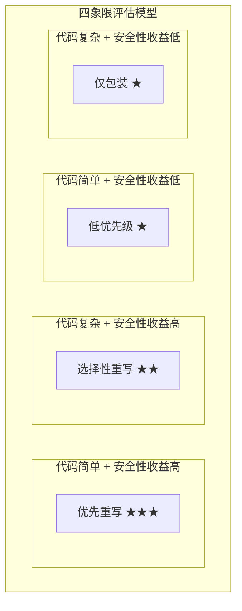
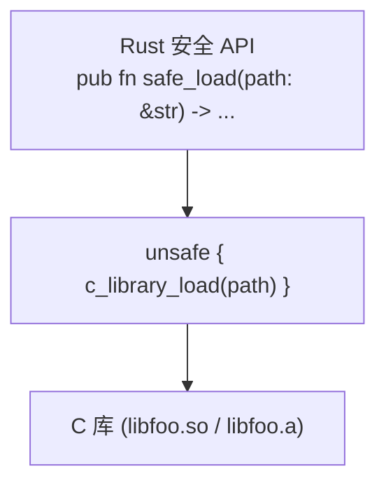
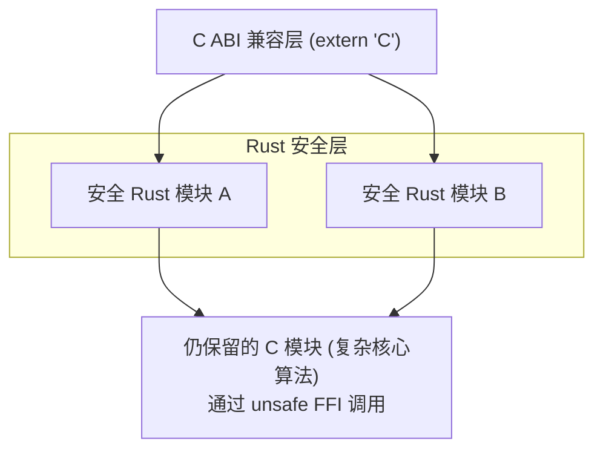
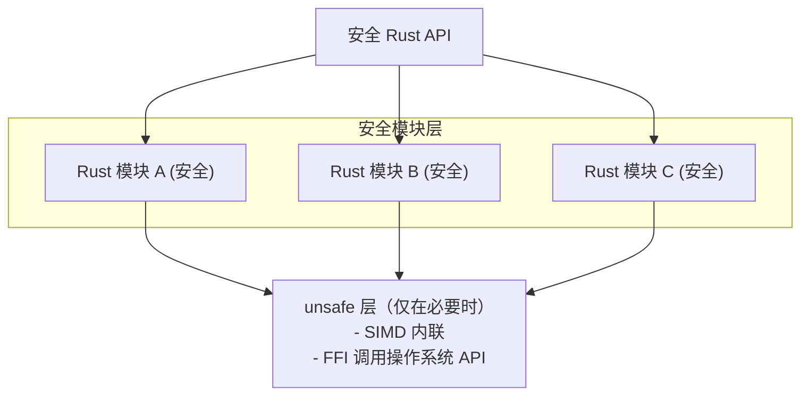
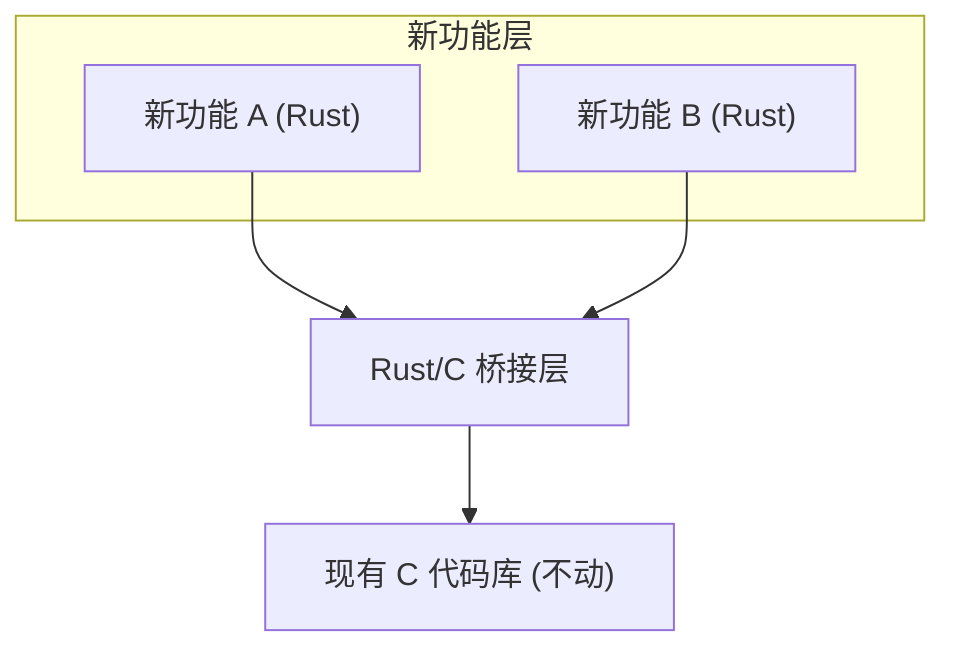
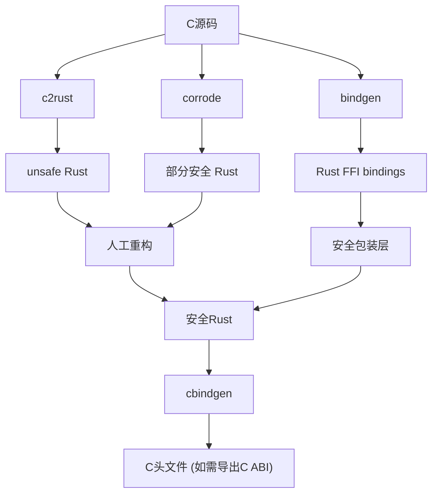
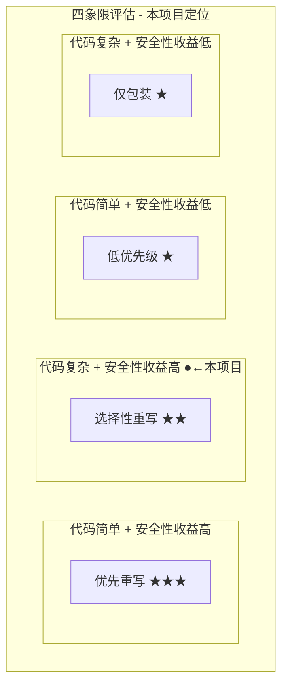

# 重构方法论总结

## 学习目标

1. 掌握C到Rust重构的决策框架（何时重写，何时保留）
2. 理解四种重构模式的适用场景和成本
3. 学会评估重构项目的风险和收益
4. 了解真实世界大型C→Rust重写的案例
5. 建立自己的重构工具链和性能对比方法论

---

## 一、决策框架：重写还是保留？

### 1.1 四象限评估模型



### 1.2 量化评估矩阵

| 评估维度 | 权重 | 评分 (1-5) | 加权分 |
|----------|------|-----------|--------|
| 内存安全风险 | ×3 | ___ | ___ |
| 输入来源（是否可被攻击者控制） | ×2 | ___ | ___ |
| 代码复杂度（C版本） | ×1.5 | ___ | ___ |
| 变更频率（是否活跃维护） | ×1.5 | ___ | ___ |
| 团队Rust熟练度 | ×1 | ___ | ___ |
| 现有测试覆盖率 | ×1 | ___ | ___ |
| **总分** | | | **___/50** |

```
评分参考：
  ≥35分  → 强烈建议重写
  25-34  → 建议部分重写或安全包装
  15-24  → 使用FFI包装即可
  <15分  → 保留C代码
```

### 1.3 何时保留C代码

以下情况保留C代码比重写更明智：

1. **经过形式化验证的代码**（如seL4微内核）：重写可能引入新bug
2. **硬件相关代码**（如设备驱动）：C与硬件接口更直接
3. **极端性能要求且已验证**（如HPC内核）：手写汇编+C
4. **遗产代码且无人理解**：缺少规格说明，无法保证重写正确
5. **短期项目**：投资回报不足以覆盖重写成本
6. **标准化实现**（如参考实现）：需要与其他实现完全一致

### 1.4 何时必须重写

以下情况重写通常是最佳选择：

1. **处理不受信任输入**：解析器、网络协议、文件格式
2. **已知有CVE历史**：存在多轮补丁仍修不尽的模块
3. **并发复杂**：多线程C代码通常有难以发现的竞争条件
4. **内存管理复杂**：复杂的生命周期/所有权关系
5. **需要长期维护**：新功能开发速度受C安全性拖累
6. **团队愿意投入**：有资源学习和维护Rust

---

## 二、四种重构模式详解

### 2.1 模式1：FFI包装（Wrapper）



**适用场景：**
- C代码已经过充分测试和验证
- C代码极其复杂（如视频编码器）
- 只需要调用几个关键API

**实现步骤：**
1. 使用bindgen生成FFI绑定
2. 从`*const c_char`转换为`&str`
3. 从返回的`*mut T`转移到`Box<T>`或`Vec<T>`
4. 用Result替换整型错误码
5. 编写集成测试

**示例代码：**
```rust
// 为libfoo编写安全包装
pub struct FooHandle {
    inner: *mut ffi::foo_handle_t,
}

impl FooHandle {
    pub fn open(path: &str) -> Result<Self, FooError> {
        let c_path = CString::new(path)
            .map_err(|_| FooError::InvalidPath)?;
        let handle = unsafe { ffi::foo_open(c_path.as_ptr()) };
        if handle.is_null() {
            return Err(FooError::OpenFailed);
        }
        Ok(FooHandle { inner: handle })
    }

    pub fn process(&mut self, data: &[u8]) -> Result<Vec<u8>, FooError> {
        let mut out_len: usize = 0;
        let mut out_ptr: *mut u8 = std::ptr::null_mut();
        let ret = unsafe {
            ffi::foo_process(
                self.inner,
                data.as_ptr(),
                data.len(),
                &mut out_ptr,
                &mut out_len,
            )
        };
        if ret != 0 || out_ptr.is_null() {
            return Err(FooError::ProcessFailed);
        }
        // 将C分配的内存转移到Rust所有权
        unsafe { Ok(Vec::from_raw_parts(out_ptr, out_len, out_len)) }
    }
}

impl Drop for FooHandle {
    fn drop(&mut self) {
        unsafe { ffi::foo_close(self.inner); }
    }
}
```

**优点：** 最快的安全化路径，代码量最小
**缺点：** C库的漏洞仍存在，unsafe在FFI边界

### 2.2 模式2：部分重写（Partial Rewrite）



**适用场景：**
- 大型项目（>10000行）
- 部分模块安全性风险高，部分复杂但已稳定
- 团队需要逐步学习和迁移

**实现步骤：**
1. 识别安全性收益最高的模块
2. 定义模块间的接口（C ABI或内部trait）
3. 逐个用Rust重写目标模块
4. 使用条件编译切换C和Rust实现
5. 运行持续集成验证行为一致性

**示例架构：**
```rust
// 内部接口定义
trait Decompressor {
    fn decompress(&mut self, input: &[u8], output: &mut Vec<u8>)
        -> Result<usize, DecompressError>;
}

// Rust实现
struct RustDecompressor { /* ... */ }
impl Decompressor for RustDecompressor { /* ... */ }

// C实现（通过FFI）
struct CDecompressor { /* ... */ }
impl Decompressor for CDecompressor {
    fn decompress(&mut self, input: &[u8], output: &mut Vec<u8>)
        -> Result<usize, DecompressError> {
        // unsafe FFI call to C library
        unsafe { c_decompress(input, output) }
    }
}

// 运行时选择
enum Backend {
    Rust(RustDecompressor),
    C(CDecompressor),
}

impl Decompressor for Backend {
    fn decompress(&mut self, input: &[u8], output: &mut Vec<u8>)
        -> Result<usize, DecompressError> {
        match self {
            Backend::Rust(d) => d.decompress(input, output),
            Backend::C(d) => d.decompress(input, output),
        }
    }
}
```

### 2.3 模式3：完全重写（Full Rewrite）



**适用场景：**
- 中小型项目（<5000行）
- 内存密集型代码
- 新项目从零开始
- C版本未被广泛依赖（无API兼容性需求）

**实现步骤：**
1. 深入理解C代码的架构和算法
2. 从头用Rust设计等价但更安全的数据结构
3. 以C版本为参考实现（Oracle），编写测试
4. 应用Rust惯用模式优化
5. 性能对比并调优

### 2.4 模式4：新功能Rust，旧代码C（Greenfield）



**适用场景：**
- 大型遗留C代码库
- 不允许修改现有C代码（风险规避）
- 新功能独立于现有代码

**实现步骤：**
1. 用Rust实现新功能模块
2. 通过cbindgen导出C ABI
3. 在现有C代码中调用Rust函数
4. 数据在C和Rust之间通过`#[repr(C)]`结构体传递

---

## 三、成本收益分析

### 3.1 成本构成

| 成本项 | 估算 | 说明 |
|--------|------|------|
| 学习曲线 | 2-6个月 | 团队掌握Rust所需时间 |
| 代码翻译 | 1行C ≈ 0.8-1.5行Rust | 取决于代码类型 |
| 安全设计 | 额外20-40%工作量 | 设计安全抽象 |
| 测试编写 | 额外30-50%工作量 | 更多边界情况测试 |
| FFI维护 | 持续成本 | 如保留C代码 |
| 构建系统 | 1-2周 | 设置cargo + build.rs |
| 持续集成 | 1-3天 | 配置CI/CD管道 |

### 3.2 收益估算

| 收益项 | 量化方式 | 典型效果 |
|--------|---------|---------|
| 内存安全bug减少 | CVE数量对比 | 减少70-90% |
| 开发效率提升 | 新功能开发时间 | 加速30-50%（长期） |
| 代码审查效率 | 审查时间/千行 | 减少40-60%（类型系统协助） |
| 并发安全 | 数据竞争bug | 减少95%+ |
| 文档质量 | 开发者理解时间 | 减少30%（rustdoc + 类型自文档） |
| 社区贡献 | 外部贡献者数量 | 增加（Rust生态活跃） |

### 3.3 ROI计算模型

```
ROI = (Bug减少节省的时间 + 开发效率提升 + 维护成本降低)
      ─────────────────────────────────────────────────────
      (学习成本 + 重写成本 + FFI维护成本 + 构建系统变更成本)

经验法则：
  - 小型项目（<2000行）：ROI在3-6个月内转正
  - 中型项目（2000-10000行）：ROI在6-18个月内转正
  - 大型项目（>10000行）：ROI需逐模块计算
```

---

## 四、真实世界案例研究

### 4.1 librsvg

| 项目信息 | 详情 |
|----------|------|
| 原语言 | C |
| 重构时间 | 2016-2019 |
| 规模 | ~100000行 |
| 策略 | 渐进式重写 |
| 效果 | 消除所有CVE（此后无新安全漏洞） |

**关键经验：**
- 从解析器开始重写（SVG解析、CSS解析）—— 处理不受信任输入
- 保持API兼容性（GNOME生态依赖它）
- 利用Rust的类型系统重新设计对象层次结构

### 4.2 fish shell

| 项目信息 | 详情 |
|----------|------|
| 原语言 | C++ |
| 重构时间 | 2020-2023 |
| 规模 | ~80000行 |
| 策略 | 从C++逐步迁移（保留C++模块，新功能用Rust） |
| 效果 | 多线程安全，新增功能开发速度提升 |

**关键经验：**
- 并发密集型代码（作业控制、信号处理）迁移到Rust收益最大
- 使用CXX桥接库在Rust和C++之间传递复杂类型
- 构建系统从CMake迁移到CMake+cargo混合

### 4.3 uutils/coreutils

| 项目信息 | 详情 |
|----------|------|
| 原语言 | C (GNU coreutils) |
| 重构时间 | 2013至今 |
| 规模 | ~100000行Rust |
| 策略 | 完全重写（每个工具独立） |
| 效果 | 跨平台（Linux/macOS/Windows），零unsafe（大多数工具） |

**关键经验：**
- 小工具独立重写降低了单体项目的风险
- 用户测试是发现行为差异的关键
- 性能在大多数工具上达到或超过GNU版本

### 4.4 Rust for Linux (内核)

| 项目信息 | 详情 |
|----------|------|
| 原语言 | C (Linux内核) |
| 开始时间 | 2020 |
| 策略 | 模式4：新驱动用Rust，现有C不动 |
| 效果 | 首个生产Rust驱动合并到6.1内核 |

**关键经验：**
- 内核级Rust需要特殊的allocator和panic处理
- `#[no_std]` + 定制alloc是内核Rust的基础
- C ABI是必须的（内核内部接口都是C）

---

## 五、工具生态系统

### 5.1 工具全景图



### 5.2 工具详细说明

| 工具 | 版本 | 用途 | 状态 |
|------|------|------|------|
| **c2rust** | 0.18+ | C → unsafe Rust 自动转译 | 活跃维护 |
| **bindgen** | 0.69+ | C头文件 → Rust FFI绑定 | 标准工具 |
| **cbindgen** | 0.26+ | Rust → C头文件（导出C ABI） | 标准工具 |
| **corrode** | 实验性 | C → 部分安全Rust（语义级） | 实验阶段 |
| **c2rust-refactor** | 0.18+ | unsafe→safe Rust自动重构 | 活跃开发 |
| **cargo-asm** | 0.1+ | 查看Rust函数的汇编输出 | 辅助工具 |
| **miri** | nightly | Rust MIR解释器（检测UB） | 活跃开发 |
| **loom** | 0.7+ | 并发代码的排列测试 | 成熟 |

### 5.3 推荐工作流

```bash
# 阶段1: 分析
bindgen wrapper.h -o src/bindings.rs    # 生成FFI绑定
valgrind --leak-check=full ./c_program  # 检测C内存问题

# 阶段2: 转译
c2rust transpile compile_commands.json  # 自动转译C到Rust

# 阶段3: 安全化
cargo clippy -- -W clippy::all         # Rust代码质量检查
cargo miri test                         # 检测unsafe代码中的UB
cargo audit                             # 检查依赖安全性

# 阶段4: 验证
# 编写测试对比C和Rust输出
# 使用proptest进行属性测试
# 使用cargo-fuzz进行模糊测试

# 阶段5: 部署
cargo build --release                   # 编译发布版本
cbindgen --config cbindgen.toml         # 生成C头文件（如需）
```

---

## 六、性能对比方法论

### 6.1 正确的性能对比

```rust
use std::time::Instant;

/// 基准测试的正确方式：
/// 1. 预热：让CPU缓存和分支预测器适应
/// 2. 多次迭代：减少测量噪声
/// 3. 隔离IO：只测量计算密集型部分
fn benchmark_compare<F1, F2>(
    name: &str,
    iterations: u32,
    c_version: F1,
    rust_version: F2,
) where
    F1: Fn() -> Vec<u8>,
    F2: Fn() -> Vec<u8>,
{
    // 预热
    let expect = c_version();
    assert_eq!(rust_version(), expect); // 行为一致性检查

    // C版本
    let start = Instant::now();
    for _ in 0..iterations {
        let _ = c_version();
    }
    let c_time = start.elapsed();

    // Rust版本
    let start = Instant::now();
    for _ in 0..iterations {
        let _ = rust_version();
    }
    let rust_time = start.elapsed();

    let c_per_iter = c_time / iterations;
    let rust_per_iter = rust_time / iterations;
    let diff_pct = if c_per_iter.as_nanos() > 0 {
        ((rust_per_iter.as_nanos() as f64 / c_per_iter.as_nanos() as f64) - 1.0) * 100.0
    } else {
        0.0
    };

    println!("=== {} ===", name);
    println!("C:    {:?} per iteration", c_per_iter);
    println!("Rust: {:?} per iteration", rust_per_iter);
    println!("Diff: {:.1}% {}", diff_pct.abs(), if diff_pct > 0.0 { "slower" } else { "faster" });
}
```

### 6.2 常见的性能陷阱

| 陷阱 | 说明 | 解决方法 |
|------|------|---------|
| debug构建对比 | Rust debug模式极慢 | 使用`--release` |
| 未内联函数边界 | Rust的泛型需单态化 | 确保跨crate内联 |
| 过度clone | `to_string()`/`clone()`隐式 | 使用引用和Cow |
| 收集器触发 | Vec反复realloc | 使用`with_capacity`预分配 |
| 迭代器链开销 | 长迭代器链可能不优化 | 检查汇编输出 |
| 字符串处理 | Rust字符串UTF-8验证开销 | 使用`&[u8]`处理字节数据 |
| 错误的比较基准 | 对比的是算法不是语言 | 确保实现的是相同算法 |

### 6.3 性能优化技巧

```rust
// 技巧1: 使用with_capacity避免重复分配
let mut result = Vec::with_capacity(estimated_size);

// 技巧2: 使用extend_from_slice而非逐元素push
result.extend_from_slice(&source[..len]);

// 技巧3: 使用迭代器而非索引循环
let sum: u64 = data.iter().map(|&x| x as u64).sum();

// 技巧4: 使用copy_from_slice进行字节级复制
dest[..n].copy_from_slice(&src[..n]);

// 技巧5: 使用#![forbid(unsafe_code)]确保安全
// 在需要极致优化的热点使用unsafe并大量注释

// 技巧6: 使用bytemuck进行安全位转换
use bytemuck::{cast_slice, Pod, Zeroable};
#[derive(Copy, Clone, Pod, Zeroable)]
#[repr(C)]
struct Pixel { r: u8, g: u8, b: u8, a: u8 }
let pixels: &[Pixel] = cast_slice(raw_bytes);

// 技巧7: 使用rayon进行数据并行
use rayon::prelude::*;
data.par_iter_mut().for_each(|x| *x = process(*x));
```

---

## 七、团队转型指南

### 7.1 渐进式学习路径

```
阶段1: 个人学习 (1-2个月)
  □ 完成Rust官方书籍 (The Book)
  □ 完成Rustlings练习
  □ 完成Rust by Example
  □ 写一个个人小项目（CLI工具）

阶段2: 团队试点 (2-3个月)
  □ 选择一个小型C模块（<300行）进行Rust重写
  □ 在内部评审中分享经验
  □ 建立团队的Rust编码规范
  □ 设置CI/CD（clippy、fmt、test）

阶段3: 生产试点 (3-4个月)
  □ 选择非关键路径的C模块重写
  □ 部署到生产环境并监控
  □ 记录bug减少和性能数据
  □ 建立Rust/C互操作的最佳实践

阶段4: 全面推广 (长期)
  □ 新模块默认使用Rust
  □ 逐步重写高风险C模块
  □ 培训新成员Rust
  □ 贡献上游Rust生态
```

### 7.2 常见阻力和应对

| 阻力 | 应对策略 |
|------|---------|
| "学不会" | 提供培训、结对编程、code review指导 |
| "太慢了" | 展示release模式性能数据、分享案例 |
| "生态不成熟" | 列出替代crate、评估成熟度 |
| "和现有C不兼容" | 演示FFI互操作、渐进迁移策略 |
| "编译器太慢" | sccache、增量编译、CI缓存 |
| "社区太小" | Rust社区实际非常活跃，列出资源 |

---

## 八、风险管理框架

### 8.1 风险清单

```
技术风险:
□ 性能退化 → 建立基准线，不接受超过5%的性能损失
□ 功能回归 → C版本作为Oracle，完整测试覆盖
□ 新bug引入 → 模糊测试、sanitizer、miri

项目风险:
□ 时间超支 → 分阶段交付，每阶段有可运行的中间产物
□ 人员流失 → 文档化设计决策、交叉培训
□ 工具链不稳定 → 锁定Rust版本（rust-toolchain.toml）

业务风险:
□ 用户不兼容 → 保持API/ABI兼容性
□ 部署困难 → 静态链接、musl目标
□ 回滚困难 → 特性开关、A/B测试
```

### 8.2 应急预案

```
如果Rust版本性能不足:
  → 回退到C版本（如果有FFI桥接）
  → profile热点并用unsafe优化
  → 使用SIMD加速（std::simd或core::arch）

如果发现功能差异:
  → 用C版本的输入输出构建fuzz测试
  → 逐函数对比中间状态

如果构建系统问题:
  → 分离cargo和CMake/Make
  → 使用makefile桥接层

如果需要紧急回滚:
  → 使用feature flag切换C/Rust实现
  → 保持C版本并行构建
```

---

## 章节考查（共100分）

### 一、概念题（40分，每题8分）

1. 请详细描述C到Rust重构的四种模式，并为每种模式提供一个典型的适用场景。
2. 在评估是否重写C代码时，哪些量化指标最重要？请解释如何计算重构的ROI。
3. 解释librsvg重写项目中选择从SVG解析器开始的原因，以及这个选择对项目成功的影响。
4. 性能对比中常见的"分析错误"有哪些？如何避免？
5. 描述团队从C迁移到Rust的渐进式学习路径，以及每个阶段的关键目标。

<details>
<summary>参考答案</summary>

1. 四种模式：
   - **FFI包装**：Rust安全层包装C库。适用于C代码极复杂但只需调用少量API（如视频编解码库）
   - **部分重写**：保持C ABI，部分模块用Rust。适用于大型项目中逐步迁移（如zlib风格的重构）
   - **完全重写**：从零用Rust写。适用于中小型项目或不需API兼容的新项目（如coreutils替代）
   - **新功能Rust**：不动现有C，新功能用Rust。适用于不允许修改现有C代码的大型遗留系统（如Linux内核）

2. 关键量化指标：
   - 内存安全风险评分（权重最高）
   - 输入是否可控（攻击面大小）
   - C版本的历史CVE数量
   - 代码变更频率
   - ROI = (Bug节省时间 + 效率提升 + 维护降低) / (学习成本 + 重写成本 + 维护成本)

3. librsvg从SVG解析器开始的原因：
   - 解析器处理不受信任的XML/SVG输入，是最大的安全攻击面
   - 解析器相对独立，可以隔离重写
   - 成功消除了解析相关的所有CVE
   - 为后续模块的重写建立了信心和模式

4. 常见分析错误：
   - debug模式对比（Rust debug模式慢许多倍）
   - 对比不同算法（应确保两个实现使用相同算法）
   - 忽略预热效果（首次运行受冷缓存影响）
   - 样本太小（偶然波动被误解为性能差异）
   - 避免方法：使用`--release`、预热、多次迭代、隔离IO

5. 渐进式学习路径：
   - 阶段1（个人学习，1-2月）：完成The Book + Rustlings，写个人小项目
   - 阶段2（团队试点，2-3月）：选择小C模块重写，建立编码规范
   - 阶段3（生产试点，3-4月）：非关键模块重写并部署，记录数据
   - 阶段4（全面推广）：新模块默认Rust，逐步重写高风险模块

</details>

### 二、判断题（20分，每题4分）

1. 所有C代码都应该尽快重写为Rust以获得安全性。（ ）
2. 使用FFI包装C库是一种"不够彻底"的重构方式，不应推荐。（ ）
3. c2rust生成的Rust代码可以直接用于生产环境。（ ）
4. librsvg重写后出现了新的安全漏洞（CVE），说明Rust并非万能的。（ ）
5. 在性能敏感的代码中，必要的unsafe是可以接受的，关键是要做好文档和测试。（ ）

<details>
<summary>参考答案</summary>

1. × — 需要根据成本收益分析决策。已在生产环境稳定运行、处理可信输入且非内存密集的C代码可能不值得重写。
2. × — FFI包装是最快的安全化路径，适合C代码复杂且稳定的场景。是四种有效策略之一。
3. × — c2rust生成大量unsafe代码和裸指针操作，必须经过人工重构才能达到生产质量。
4. × — 实际上，librsvg自Rust重写后未报告新的内存安全CVE。这与原C代码频繁出现安全漏洞形成鲜明对比。
5. √ — unsafe是Rust的重要组成部分。在性能关键路径且经过充分验证的情况下，合理使用unsafe是工程上正确的选择。

</details>

### 三、代码分析题（15分）

分析以下在Rust中包装C库的模式代码，指出潜在的不足和改进方案：

```rust
pub struct Image {
    ptr: *mut ffi::Image,
}

impl Image {
    pub fn load(path: &str) -> Result<Image, String> {
        let c_path = CString::new(path).unwrap();
        let ptr = unsafe { ffi::image_load(c_path.as_ptr()) };
        if ptr.is_null() {
            return Err("Load failed".into());
        }
        Ok(Image { ptr })
    }

    pub fn width(&self) -> u32 {
        unsafe { (*self.ptr).width }
    }
}

impl Drop for Image {
    fn drop(&mut self) {
        unsafe { ffi::image_free(self.ptr); }
    }
}
```

<details>
<summary>参考答案</summary>

**不足之处：**

1. **`CString::new().unwrap()`** — 如果path包含内部null字节会panic。应使用`map_err`转换为Result。
2. **错误信息丢失** — C库可能通过errno或专用错误函数提供更多信息。应调用`ffi::image_get_error()`获取详细错误。
3. **缺少Send/Sync实现** — Image可能不满足Send/Sync，需要根据C库的线程安全性手动实现或排除。
4. **width()无NULL检查** — self.ptr理论上可能为NULL（如果Image被移动后Drop未运行），应加断言。
5. **缺少Clone行为** — 如果C库支持，可以添加深复制函数。如果不支持，应显式阻止Clone。
6. **缺少unsafe文档** — 每个unsafe块应说明安全前置条件。

**改进版本：**

```rust
use std::ffi::CStr;

pub struct Image {
    // NonNull保证非空，优化Option大小
    ptr: std::ptr::NonNull<ffi::Image>,
}

impl Image {
    /// 加载图像文件
    ///
    /// # 安全性
    /// 调用C库的image_load，假设它是线程安全的（内部使用互斥锁）
    pub fn load(path: &str) -> Result<Image, String> {
        let c_path = CString::new(path)
            .map_err(|e| format!("Invalid path: {}", e))?;

        let ptr = unsafe { ffi::image_load(c_path.as_ptr()) };

        let ptr = std::ptr::NonNull::new(ptr)
            .ok_or_else(|| {
                let err = unsafe { CStr::from_ptr(ffi::image_last_error()) };
                format!("Failed to load image: {}", err.to_string_lossy())
            })?;

        Ok(Image { ptr })
    }

    pub fn width(&self) -> u32 {
        // Safety: ptr is NonNull, guaranteed by constructor
        unsafe { self.ptr.as_ref().width }
    }

    pub fn height(&self) -> u32 {
        unsafe { self.ptr.as_ref().height }
    }
}

impl Drop for Image {
    fn drop(&mut self) {
        unsafe { ffi::image_free(self.ptr.as_ptr()); }
    }
}

// C库文档说image_load是线程安全的，所以Image也是
unsafe impl Send for Image {}
unsafe impl Sync for Image {}
```

</details>

### 四、编程题（15分）

假设你正在评估一个C网络服务器项目（~3000行C代码，处理HTTP请求，已知有3个缓冲区溢出CVE）是否应该重写为Rust。请完成以下任务：

1. 用四象限模型评估该项目
2. 推荐一种重构策略，并给出理由
3. 给出重构计划的前3个步骤

<details>
<summary>参考答案</summary>

1. **四象限评估：**



量化评估：
- 内存安全风险：5 × 3 = 15（HTTP解析处理不受信任输入）
- 输入来源：5 × 2 = 10（直接来自网络）
- 代码复杂度：3 × 1.5 = 4.5（3000行中等）
- 变更频率：4 × 1.5 = 6（网络服务器需持续维护）
- 团队Rust熟练度：3 × 1 = 3
- 测试覆盖率：2 × 1 = 2（已有CVE说明测试不足）
- **总分：40.5/50 → 强烈建议重写**

2. **推荐策略：部分重写（模式2）**

理由：
- HTTP请求解析器（攻击面）必须完全重写为安全Rust
- 保持C ABI兼容，允许现有客户端代码无缝迁移
- 其他模块（如配置管理、日志）可后续迁移
- 渐进式方法降低部署风险

3. **前3个步骤：**

**步骤1：隔离HTTP解析器**
- 定义解析器模块的输入输出接口
- 将C解析器替换为Rust实现（使用httparse或手写）
- 编写fuzz测试：大量畸形HTTP请求对比新旧解析器输出

**步骤2：内存管理模块重写**
- 将连接缓冲区管理从手动malloc/free重写为Rust的Vec<u8>
- 请求/响应结构体用Rust String替代char*
- 验证所有缓冲区溢出路径被消除

**步骤3：编写集成测试**
- 建立测试基础设施：常见HTTP请求场景
- 引入proptest进行属性测试
- 使用C版本作为Oracle运行并行模糊测试
</details>

### 五、填空题（5分，每空1分）

1. 在C到Rust重构的四种模式中，______模式需要的unsafe代码量最大，______模式需要的unsafe代码量最小。
2. c2rust的输出是______代码，需要______才能达到生产质量。
3. librsvg选择从______模块开始Rust重写，因为这是最大的______。
4. `cargo miri test`用于检测______代码中的______行为。
5. 在性能对比中，应该使用______构建模式，并且进行______以消除冷缓存的影响。

<details>
<summary>参考答案</summary>

1. FFI包装（Wrapper）、完全重写（Full Rewrite）—— 或：FFI包装中unsafe在边界，完全重写中可做到零unsafe
2. 不安全的（unsafe）、人工重构（安全化/refactoring）
3. 解析器（SVG/CSS parser）、安全攻击面（attack surface）
4. unsafe、未定义（undefined behavior/UB）
5. release（--release）、预热（warm-up）

</details>

### 六、代码补全题（5分）

补全以下性能基准测试的模板代码：

```rust
use std::time::Instant;

fn benchmark<F>(name: &str, iterations: u32, mut f: F)
where
    F: FnMut(),
{
    // 预热（消除冷缓存影响）
    for _ in 0..______ {
        f();
    }

    let start = Instant::now();
    for _ in 0..iterations {
        f();
    }
    let duration = start.elapsed();

    println!(
        "{}: {:?} total for {} iterations, {:?} per iteration",
        name,
        duration,
        iterations,
        ______
    );
}

// 使用示例
fn main() {
    let data = vec![0u8; 1024 * 1024]; // 1MB
    
    benchmark("checksum_c", 1000, || {
        // 调用C版本的校验和函数
    });
    
    benchmark("checksum_rust", 1000, || {
        // 调用Rust版本的校验和函数
    });
}
```

<details>
<summary>参考答案</summary>

```rust
fn benchmark<F>(name: &str, iterations: u32, mut f: F)
where
    F: FnMut(),
{
    // 预热：运行少量迭代让CPU缓存和分支预测器适应
    for _ in 0..10 {   // 或 (iterations / 10).max(3)
        f();
    }

    let start = Instant::now();
    for _ in 0..iterations {
        f();
    }
    let duration = start.elapsed();

    println!(
        "{}: {:?} total for {} iterations, {:?} per iteration",
        name,
        duration,
        iterations,
        duration / iterations   // 每次迭代的平均时间
    );
}

// 更健壮的版本应该：
// 1. 使用 std::hint::black_box 防止编译器优化掉结果
// 2. 多次预热（如总迭代数的10%）
// 3. 使用统计方法（多次运行取中位数）
// 4. 在专用基准测试框架中运行（如 criterion）
```
</details>

---

## 本章小结

本章系统化地总结了C到Rust重构的方法论体系：

### 核心框架
1. **决策框架**：四象限评估模型 + 量化评分 → 科学决定重写还是保留
2. **四种模式**：FFI包装→部分重写→完全重写→新功能Rust，递进式安全化
3. **成本收益**：ROI计算模型帮助团队做理性的资源投入决策

### 最佳实践
4. **真实案例**：librsvg、fish shell、coreutils、Linux内核的成功经验
5. **工具链**：c2rust→人工重构→clippy→miri→fuzz，完整的安全化流水线
6. **性能对比**：正确的基准测试方法论，避免常见陷阱

### 团队转型
7. **渐进学习**：个人→团队→生产→推广，四阶段学习路径
8. **风险管理**：技术/项目/业务三级风险清单和应急预案

### 终极原则

> 重写不是为了重写而重写，而是为了用更好的类型系统表达设计意图。

好的Rust代码不仅仅是将C"翻译"成Rust语法，而是利用Rust的所有权系统、trait系统、枚举类型和错误处理机制，重新表达代码的设计意图，让编译器帮你验证正确性。

[[05-开源C项目重构：中型]] | [[../内核/01-Linux内核Rust支持概述]]
