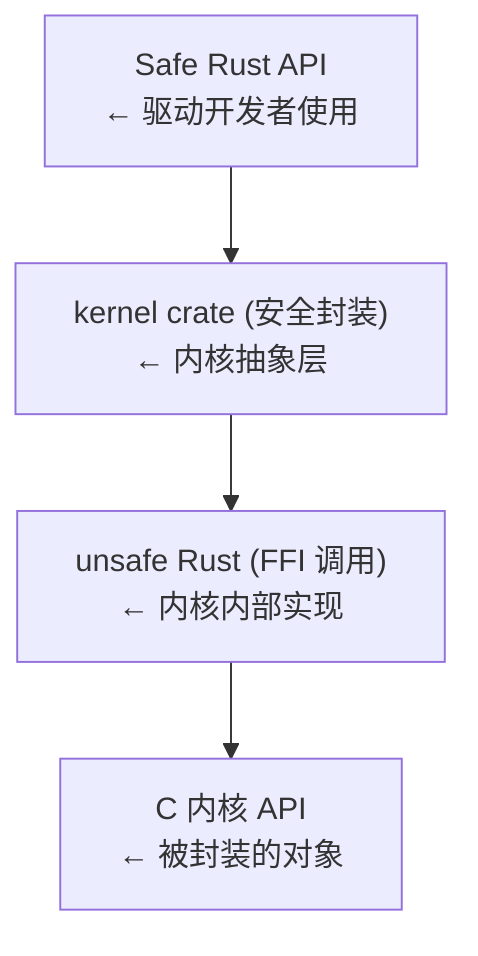

# Linux 内核 Rust 支持概述

## 1. 为什么要在内核中使用 Rust？

### 1.1 内存安全的困境

Linux 内核是世界上最庞大的 C 语言代码库之一，超过 3000 万行代码。几十年来，内存安全漏洞——use-after-free（UAF）、缓冲区溢出、空指针解引用——一直是内核漏洞的主要来源。根据 Google 的统计，Chrome 和 Android 中约 70% 的高危安全漏洞都是内存安全 bug。微软的研究表明，他们修补的漏洞中约 70% 也是内存安全问题。

> **C语言内核编程**：Linux内核是世界上最大的C语言项目。要理解Rust在内核中的意义，必须先理解C语言在内核中的实践方式。请参阅 [[../../内核/系统内核/01_C语言与操作系统|C语言教程: C语言与操作系统]] 以及 [[../../内核/系统内核/07_Linux内核源码导读|C语言教程: Linux内核源码导读]]。

内核中的内存安全漏洞尤其危险，因为它们通常导致：
- **权限提升**（privilege escalation）：普通用户获得 root 权限
- **信息泄露**（information leak）：内核内存暴露给用户空间
- **拒绝服务**（denial of service）：内核崩溃（kernel panic）

### 1.2 Linus 的接纳之路

Linus Torvalds 最初对在 Linux 内核中使用 Rust 持谨慎态度。他的主要顾虑包括：

1. **编译器成熟度**：Rust 编译器（rustc）需要 LLVM 后端，而 LLVM 对某些内核目标架构的支持不如 GCC 完善
2. **维护负担**：在内核中维护两套语言的基础设施会增加维护成本
3. **社区分裂**：Rust 代码可能形成一个"二等公民"的子社区

转折点出现在 2021 年。Google 资助了"Rust for Linux"项目，由 Miguel Ojeda 领导。经过一年多的 RFC（Request for Comments）讨论和补丁迭代，Linus 最终接受了 Rust 进入内核。

关键时间线：
- **2020 年 7 月**：Nick Desaulniers 在 Linux Plumbers Conference 讨论内核中的 Rust
- **2021 年 4 月**：Miguel Ojeda 发送"Rust for Linux"RFC 补丁系列
- **2021 年 12 月**：RFC v2 发布，获得更广泛的社区支持
- **2022 年 9 月**：Linus 在 Kernel Maintainers Summit 上表示接受 Rust
- **Linux 6.1（2022 年 12 月）**：Rust 基础设施正式合并入主线内核

### 1.3 Linus 原话

> "Unless something odd happens, it [Rust support] will make it into 6.1."
> — Linus Torvalds, 2022 年 9 月

> "I think the whole Rust infrastructure has been in great shape, and I'm hoping that we'll get the first Rust drivers merged soon."
> — Linus Torvalds, LKML, 2023 年

## 2. Linux 6.1：Initial Rust Support

Linux 6.1（发布于 2022 年 12 月 11 日）是第一个包含 Rust 支持的主线内核版本。该版本包含的 Rust 基础设施主要包括：

### 2.1 合并的内容

内核源码树 `rust/` 目录中最初的提交包含：

- **`rust/Makefile`**：内核构建系统对 Rust 的集成
- **`rust/kernel/`**：Rust 内核抽象层
- **`rust/bindings/`**：自动生成的 C FFI 绑定
- **`rust/macros/`**：过程宏（如 `module!`）
- **`rust/alloc/`**：为内核环境定制的 alloc crate 分支
- **文档**：`Documentation/rust/` 中的 Rust 内核开发文档

### 2.2 合并时的限制

最初合并时，Rust 支持被标记为"实验性"：
- 仅支持 x86_64 和 aarch64 架构
- 需要 LLVM/Clang 工具链（`LLVM=1`）
- 需要特定版本的 `rustc`（通常比发行版自带的版本新）
- Rust 代码不能依赖 `std` 库

### 2.3 构建系统的关键提交

几个关键的 commit（可在 `git log` 中查到）：

```
commit 8aebac82933ff641c5cca6b4825e6c1df28da293
Merge: ... 
Author: Linus Torvalds
Date: Mon Oct 10 2022

 Merge tag 'rust-v6.1-rc1' of https://github.com/Rust-for-Linux/linux
 
 Rust introduction for v6.1-rc1
```

这是将 Rust 支持合并入主线的合并提交。它引入了约 12,500 行 Rust 代码，涵盖内核 crate、alloc 分支和构建系统集成。

## 3. 当前内核中已有的 Rust 代码

### 3.1 内核 Rust 抽象层（`rust/kernel/`）

这是所有内核 Rust 代码的基础。它提供了对 C 内核 API 的 Rust 安全封装，包括：

| 模块 | 封装的 C API | 功能 |
|------|-------------|------|
| `sync::Arc` | `struct kref` + `kref_get/put` | 内核引用计数智能指针 |
| `sync::Lock` | `spinlock_t` / `mutex` | 内核同步原语 |
| `error::Error` | `errno.h` 错误码 | 内核错误处理 |
| `str::CStr` | `char *` 字符串 | 安全的 C 字符串处理 |
| `file::File` | `struct file *` | 文件描述符操作 |
| `task::Task` | `struct task_struct *` | 进程/线程抽象 |
| `init::InPlaceInit` | 内核对象初始化宏 | 安全的对象初始化 |
| `io_buffer` | `struct iov_iter` | 用户态/内核态缓冲区 |

### 3.2 Samsung 的 Android Binder 驱动重写

Android Binder 是 Android 系统中最重要的 IPC（进程间通信）机制。原 C 版本的 Binder 驱动约有 6,000 行，是内核中最复杂的驱动之一。

Samsung 的工程师（Alice Ryhl 等人）将 Binder 驱动在 Rust 中重新实现，并在 Linux 6.8（2024 年 3 月）合入主线。

关键事实：
- **提交者**：Alice Ryhl `<aliceryhl@google.com>`
- **代码行数**：Rust 版本约 4,500 行（比 C 版本减少约 25%）
- **安全改进**：消除了至少 3 类已知的 UAF 漏洞模式
- **性能**：基本持平，某些场景甚至优于 C 版本

这是 Linux 内核历史上第一个用 Rust 编写的重要子系统驱动。

### 3.3 Asahi Linux GPU 驱动

Asahi Linux 项目为 Apple Silicon（M1/M2/M3）芯片开发了首个开源 GPU 驱动。该驱动的内核部分大量使用 Rust。

- 驱动架构：用户态 Mesa Gallium 驱动 + 内核态 DRM 驱动
- 内核部分代码位于 `drivers/gpu/drm/asahi/`
- 使用 Rust 的 `drm` crate 抽象
- 这是首个在主线内核中使用 `rust-bindgen` 生成 GPU 相关绑定的驱动

Asahi Linux GPU 驱动是 Rust 在复杂内核驱动中可行性的重要证明。

### 3.4 NVMe 驱动

PCI NVMe 驱动也有 Rust 实现正在开发中。核心开发者包括 Wedson Almeida Filho（前 Google，现 Microsoft）。Rust NVMe 驱动展现了 Rust 如何处理：

- DMA 操作
- 中断处理
- 设备内存映射（MMIO）
- 复杂的硬件状态机

## 4. 内核构建系统如何集成 Rust

### 4.1 Makefile 机制

内核的 Kbuild 系统通过顶层 `Makefile` 检测 Rust 工具链：

```makefile
# 顶层 Makefile（简化）
has_rust := $(shell rustc --version 2>/dev/null)

ifdef has_rust
 core-y += rust/
endif
```

`rust/Makefile` 负责：

1. **检查 Rust 编译器版本**：要求特定版本的 rustc
2. **检查 bindgen**：需要 `bindgen` 工具生成 FFI 绑定
3. **编译 Rust 代码**：使用 `rustc` 编译为 `.o` 对象文件
4. **链接**：Rust 对象文件与 C 对象文件一起链接到 `vmlinux`

### 4.2 关键构建变量

```makefile
# rust/Makefile 中的关键变量（简化示意）
RUSTC_FLAGS := \
 --edition 2021 \
 --crate-type rlib \
 -C opt-level=2 \
 -C panic=abort \
 -C no-redzone=y \
 -C code-model=kernel \
 -C relocation-model=static \
 --emit=obj
```

注意：
- `panic=abort`：内核中不能 unwind，panic 直接 abort
- `no-redzone=y`：内核栈没有 red zone
- `code-model=kernel`：使用内核代码模型（适用于负地址偏移）

### 4.3 条件编译

```makefile
# 通过 Kconfig 启用 Rust
config RUST
 bool "Rust support"
 depends on HAVE_RUST
 depends on !MODVERSIONS
 help
 This option enables support for Rust in the kernel.
```

配置选项：
- `CONFIG_RUST=y`：启用 Rust 支持
- `CONFIG_RUST_IS_AVAILABLE=y`：自动设置，表示工具链就绪
- `CONFIG_SAMPLE_RUST_MINIMAL=y`：启用示例模块

## 5. 内核 crate 结构

### 5.1 `rust/` 目录布局

```mermaid
graph TD
 ROOT["rust/"] --> MK["Makefile - Rust 构建规则"]
 ROOT --> KERNEL["kernel/ - 内核抽象层（核心）"]
 ROOT --> MACROS["macros/ - 过程宏"]
 ROOT --> BINDINGS["bindings/ - 自动生成的 FFI 绑定"]
 ROOT --> ALLOC["alloc/ - alloc crate 分支"]
 ROOT --> EXPORTS["exports.c - C 侧导出符号"]
 KERNEL --> KLIB["lib.rs - kernel crate 入口"]
 KERNEL --> KPRE["prelude.rs - 便捷导入"]
 KERNEL --> KALLOC["alloc/ - 内存分配器封装"]
 KERNEL --> KSYNC["sync/ - 同步原语"]
 KERNEL --> KERR["error.rs - 错误类型"]
 KERNEL --> KSTR["str.rs - 字符串类型"]
 KERNEL --> KTYP["types.rs - 通用类型"]
 KERNEL --> KINIT["init.rs - 原地初始化"]
 KERNEL --> KIO["io_buffer.rs - I/O 缓冲区"]
 KERNEL --> KFILE["file.rs - 文件操作"]
 KERNEL --> KTASK["task.rs - 进程抽象"]
 KERNEL --> KPRINT["print.rs - pr_info!/pr_err!"]
 KERNEL --> KMOD["module_param.rs - 模块参数宏"]
 KALLOC --> KALLOCRS["allocator.rs - GFP_KERNEL 等"]
 KALLOC --> KBOX["box_ext.rs - Box 扩展"]
 KSYNC --> KARC["arc.rs - Arc 实现"]
 KSYNC --> KLOCK["lock.rs - Lock 实现"]
 KSYNC --> KCOND["condvar.rs - 条件变量"]
 MACROS --> MLIB["lib.rs"]
 MACROS --> MMOD["module.rs - module! 宏"]
 MACROS --> MHELP["helpers.rs"]
 BINDINGS --> BH["bindings_helper.h - bindgen 输入"]
 BINDINGS --> BG["bindings_generated.rs - 生成的绑定"]
 BINDINGS --> BLIB["lib.rs"]
```



### 5.2 `kernel` crate 提供的关键抽象

`kernel` crate 是整个 Rust 内核开发的基础。从源代码中，它通过以下模块组织：

```rust
// rust/kernel/lib.rs（简化示意）
#![no_std]
#![feature(...)] // 使用多个 nightly 特性

extern crate alloc;

pub mod error;
pub mod prelude;
pub mod print;
pub mod str;
pub mod sync;
pub mod types;
pub mod init;
pub mod io_buffer;
pub mod file;
pub mod task;

// 重新导出 C 绑定
pub mod bindings {
 // 使用 bindgen 从 C 头文件生成的 FFI 绑定
 pub use crate::bindings::*;
}
```

## 6. 阅读内核 Rust 代码的位置

### 6.1 主线内核源码树

在内核源码树中，Rust 相关代码分布在以下位置：

| 路径 | 内容 |
|------|------|
| `rust/` | Rust 基础设施和抽象层 |
| `samples/rust/` | Rust 内核模块示例 |
| `drivers/android/rust/` | Binder Rust 驱动（6.8+） |
| `drivers/gpu/drm/asahi/` | Asahi GPU 驱动 |
| `drivers/block/rnull.rs` | Rust null block 驱动 |
| `Documentation/rust/` | 官方文档 |
| `scripts/rust_is_available.sh` | 工具链检测脚本 |

### 6.2 在线阅读

- **GitHub mirror**：`https://github.com/Rust-for-Linux/linux`（包含最新开发分支）
- **kernel.org**：`https://git.kernel.org/pub/scm/linux/kernel/git/torvalds/linux.git`
- **elixir.bootlin.com**：代码交叉引用，支持 Rust 符号搜索

### 6.3 关键文件推荐阅读顺序

如果你是第一次阅读内核 Rust 代码，建议按以下顺序：

1. `samples/rust/rust_minimal.rs` — 最小内核模块，约 20 行
2. `samples/rust/rust_print.rs` — 内核打印宏使用
3. `rust/kernel/prelude.rs` — 了解提供的便利导入
4. `rust/kernel/error.rs` — 理解内核错误处理模型
5. `rust/kernel/sync/arc.rs` — 理解内核引用计数
6. `rust/kernel/print.rs` — 理解内核日志

## 7. Rust 内核开发的哲学

### 7.1 "安全封装不安全操作"

内核 Rust 代码的核心哲学是：**用 Rust 的安全类型系统封装不安全的 C API**。



### 7.2 Zero-Cost Abstraction

与某些高级语言不同，Rust 的内核抽象旨在零成本：
- `Arc<T>` 对 `struct kref` 的封装不增加额外间接层
- `Lock<T>` 编译后与原始 `spin_lock()` / `mutex_lock()` 等效
- `Error` 类型编译为与 C `errno` 相同的整数表示

### 7.3 渐进式采用

Rust for Linux 项目不要求一次性重写整个内核。相反：
- **新驱动**可以用 Rust 编写
- **现有 C 驱动**保持不变
- **安全关键部分**可以优先迁移

## 8. 与用户态 Rust 的关键差异

| 特性 | 用户态 Rust | 内核 Rust |
|------|-----------|----------|
| 标准库 | `std` | 无（`#![no_std]`） |
| 内存分配 | `std::alloc` | `kernel::alloc` + GFP flags |
| 线程 | `std::thread` | 内核线程（kthread） |
| 同步 | `std::sync` | `kernel::sync`（基于内核原语） |
| Panic | Unwind + catch | Abort（不能 unwind） |
| 栈大小 | 可扩展 | 固定（8KB/16KB） |
| 浮点 | 可用 | 内核中禁用（默认） |
| I/O | `std::fs` / `println!` | `pr_info!` / `kernel::file` |
| SIMD | 可用 | 内核中禁用（默认） |

### 8.1 为什么内核不能用 `std`

Rust 的 `std` 库假设存在操作系统：
- `std::fs` 需要文件系统（内核本身就是文件系统提供者）
- `std::thread` 需要 pthread（内核本身就是调度器）
- `std::net` 需要 socket（内核本身就是网络栈）

因此内核 Rust 只能使用 `core`（无分配）和 `alloc`（支持堆分配但无 OS 依赖）这两个 crate。

## 9. 工具链要求

### 9.1 当前 RUSTC 版本要求

内核使用最新的 Rust 编译器（通常在 nightly 频道）来获取必需的 nightly 特性：

```bash
# 检出 rustc 版本要求
cat Documentation/rust/quick-start.rst
```

关键特性需求（在源码中实际使用的 nightly features）：
- `new_uninit`：原地初始化
- `allocator_api`：自定义分配器
- `pin_macro`：Pin 宏
- `arbitrary_self_types`：自定义 self 类型
- `coerce_unsized`：unsized 强制转换
- `dispatch_from_dyn`：动态分发支持

### 9.2 Bindgen

`bindgen` 工具从 C 头文件自动生成 Rust FFI 绑定。内核有自己的 bindgen 配置：

```rust
// 生成的绑定示例（简化）
// 来自 include/linux/kref.h
extern "C" {
 pub fn kref_init(kref: *mut kref);
 pub fn kref_get(kref: *mut kref);
 pub fn kref_put(kref: *mut kref, release: unsafe extern "C" fn(*mut kref)) -> c_int;
}
```

## 10. 社区和资源

### 10.1 邮件列表

- **rust-for-linux@vger.kernel.org**：Rust for Linux 的主邮件列表
- **linux-kernel@vger.kernel.org**：通用内核开发列表

### 10.2 Git 仓库

- **主仓库**：`https://github.com/Rust-for-Linux/linux`（包含所有 WIP 分支）
- **子系统分叉**：每个子系统维护者可能有自己的仓库

### 10.3 会议和活动

- **Linux Plumbers Conference**：每年有 Rust for Linux 微会议
- **Kangrejos**：Rust for Linux 的年度聚会
- **Linaro Connect**：ARM/RISC-V 相关的 Rust 讨论

### 10.4 在线社区

- **Zulip**：`rust-for-linux.zulipchat.com`（实时讨论）
- **Discord**：非官方但活跃的 Rust 内核开发 Discord
- **Lore**：`lore.kernel.org/rust-for-linux/`（邮件存档）

---

## [[02-内核Rust抽象层]]

---

## 章节考查（100分）

**1. 选择题（20分，每题5分）**

**1.1** Linux 内核中 Rust 支持首次合并入主线是在哪个版本？
<details>
<summary>答案</summary>
Linux 6.1（2022年12月）。
</details>

**1.2** "Rust for Linux"项目最初由谁领导？
<details>
<summary>答案</summary>
Miguel Ojeda。
</details>

**1.3** 内核 Rust 代码不能使用哪个 Rust 标准组件？
<details>
<summary>答案</summary>
`std` 标准库。内核 Rust 只能使用 `core` 和 `alloc`。
</details>

**1.4** 以下哪个是内核 Rust 模块中 `panic` 的行为？
<details>
<summary>答案</summary>
`panic=abort`：直接中止，不允许 unwind。因为内核栈有限，且 unwind 依赖不适用于内核的运行时支持。
</details>

---

**2. 简答题（40分，每题10分）**

**2.1** 解释为什么 Linux 内核开发者对使用 Rust 感兴趣。提供至少两个具体原因。

<details>
<summary>答案</summary>
1. **内存安全**：Rust 的所有权和借用系统在编译时防止 UAF、缓冲区溢出、空指针解引用等内存安全问题，这些漏洞在内核 C 代码中占比约 70%。
2. **并发安全**：Rust 的类型系统防止数据竞争（data race），内核中多核并发和中断处理是常态，Rust 的 `Send`/`Sync` trait 能在编译时检查共享状态的正确性。
3. **错误处理**：Rust 的 `Result<T, E>` 类型强制显式处理错误，避免 C 中"检查返回值"被遗忘导致的漏洞。
4. **现代化**：Rust 提供了模式匹配、代数数据类型、trait 系统等现代语言特性，能表达更安全的设计模式。
</details>

**2.2** 描述内核构建系统（Kbuild）如何集成 Rust 代码。关键步骤有哪些？

<details>
<summary>答案</summary>
1. **工具链检测**：`Makefile` 检查 `rustc`、`bindgen` 是否可用，版本是否满足要求
2. **配置检查**：`CONFIG_RUST=y` 启用 Rust 支持
3. **绑定生成**：`bindgen` 从 `bindings_helper.h`（包含必要的 C 头文件）生成 Rust FFI 绑定
4. **Rust 编译**：使用 `rustc` 编译 `rust/` 下的 crate，输出 `.o` 目标文件，编译标志包括 `panic=abort`、`no-redzone=y`、`code-model=kernel`
5. **链接**：Rust 的 `.o` 文件与 C 的 `.o` 文件一起链接到 `vmlinux` 内核镜像
</details>

**2.3** Android Binder 驱动用 Rust 重写有什么重要意义？列出了哪些具体改进？

<details>
<summary>答案</summary>
Binder 驱动重写是第一个被合入主线的重要内核子系统 Rust 驱动，具有里程碑意义：
- **代码减少**：Rust 版本约 4,500 行 vs C 版本约 6,000 行（减少约 25%）
- **安全改进**：消除了至少 3 类已知的 UAF 漏洞模式，这些在 C 版本中需要复杂的生命周期管理
- **证明可行性**：证明 Rust 可以用于复杂的内核驱动（Binder 涉及 IPC、文件系统接口、内存映射等）
- **性能持平**：没有因为使用 Rust 而产生明显的性能退化
</details>

**2.4** 比较用户态 Rust 和内核 Rust 在以下方面的差异：标准库、内存分配、栈大小、panic 处理。

<details>
<summary>答案</summary>
| 方面 | 用户态 Rust | 内核 Rust |
|------|-----------|----------|
| 标准库 | 使用 `std` | `#![no_std]`，仅 `core` + `alloc` |
| 内存分配 | `std::alloc` | `kernel::alloc`，需要指定 GFP 标志（如 GFP_KERNEL） |
| 栈大小 | 可扩展（通常 1-8MB） | 固定且小（通常 8KB 或 16KB） |
| Panic 处理 | 默认 unwind + 可 catch | `panic=abort`，直接中止 |
</details>

---

**3. 论述题（40分，每题20分）**

**3.1** 论述 Rust 进入 Linux 内核的过程和意义。从 Linus 的初始态度、社区讨论、技术挑战、到最终合并的过程进行分析。从软件工程和安全角度论证为什么这个转变对操作系统发展至关重要。

<details>
<summary>答案</summary>
**过程分析**：

2020年，业界对内存安全问题的关注达到新高。Google 和 Microsoft 的数据显示约70%的严重漏洞来自内存安全问题。在这种背景下，Google 资助了"Rust for Linux"项目，由 Miguel Ojeda 领导。

Linus Torvalds 最初持谨慎态度——他担心 Rust 编译器对非 x86 架构的支持、维护负担、以及社区可能分裂。但他没有拒绝，而是要求社区证明可行性。

2021年4月，第一版 RFC 补丁发布，引起广泛讨论。社区关注点包括：rustc 的 nightly 特性依赖、bindgen 的可靠性、与 C 代码的互操作性。经过多轮迭代，2022年9月 Linus 在内核维护者峰会上表示接受，Linux 6.1（2022年12月）正式合入 Rust 基础设施。

**意义分析**：

从软件工程角度：Rust 的类型系统将大量运行时检查移到编译时（借用检查、Send/Sync检查），这在内核这种对性能敏感的环境中尤为宝贵——零运行时开销的安全保证。

从安全角度：操作系统内核是安全最关键的软件层。内核漏洞可以绕过所有用户态防护。Rust 在编译时消除内存安全漏洞，从根本上减少了攻击面。

从历史角度：这是自C语言在Unix内核中使用以来，操作系统内核编程语言的最重要转变。如果成功，Linux 将成为第一个在主线内核中广泛使用内存安全语言的通用操作系统。
</details>

**3.2** 有人担心"在 Linux 内核中引入 Rust 会分裂内核社区"。请分析这个担忧的合理性，并提出你认为促进社区融合的策略。

<details>
<summary>答案</summary>
**担忧的合理性**：

这个担忧有一定道理，但不必然导致分裂。历史上有先例：某些项目引入新语言后形成了两个几乎不交流的子社区，导致维护困难。具体风险包括：
- C 开发者不愿学习 Rust，导致 Rust 代码的审查者不足
- Rust 抽象层和 C API 的演化不同步
- "Rust 方式"与"内核方式"的设计哲学冲突

**促进融合的策略**：

1. **现有维护者参与**：Rust 抽象层的开发必须有对应子系统的 C 维护者参与审查，确保设计符合内核惯例
2. **双向学习**：C 开发者不需要成为 Rust 专家，但需要理解 Rust 抽象封装了什么 C API；Rust 开发者必须理解内核架构（内存模型、调度、RCU等）
3. **渐进式采用**：不重写现有代码，只在新驱动中使用 Rust。这避免了"重写一切"的对抗心态
4. **共享基础设施**：绑定生成（bindgen）、构建系统、测试框架是共享的，不是两种语言各自一套
5. **社区活动**：Kangrejos 等聚会同时邀请 C 和 Rust 内核开发者
6. **文档和教学**：为 C 内核开发者编写"Rust 视角看内核"的文档

实际上，Binder 驱动的成功合入（由 C 子系统的维护者 Greg KH 审查和合并）已经证明融合是可行的。
</details>

---

## 本章小结

本章概述了 Rust 在 Linux 内核中的引入历史、现状和架构。从 Linus Torvalds 的初步接受到 Linux 6.1 的正式合并，从 Samsung 的 Binder 驱动重写到 Asahi GPU 驱动，Rust 正在逐步证明其在内核开发中的价值。

关键要点：
- Linux 6.1 标志着 Rust 正式进入主线内核
- `kernel` crate 封装了内核 C API，提供安全抽象
- 内核 Rust 使用 `#![no_std]`，不能依赖标准库
- 构建系统通过 Kbuild + bindgen + rustc 集成 Rust
- Android Binder 驱动是第一个重要的 Rust 内核驱动
- 社区仍处于早期阶段，贡献机会丰富

下一章将深入 `rust/kernel/` 目录，详细介绍内核 Rust 抽象层的各个组成部分及其设计原理。
