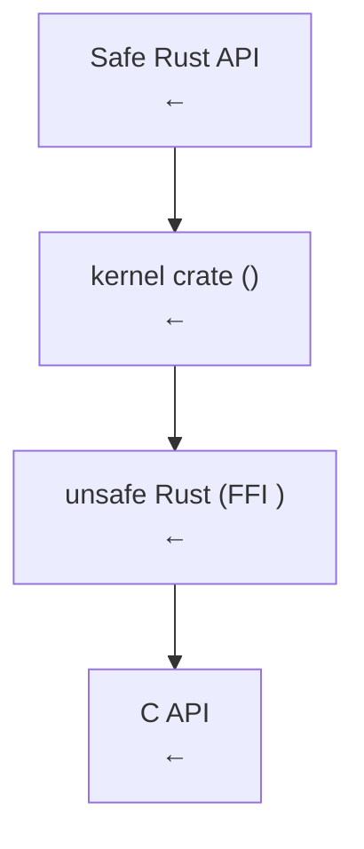

# Linux  Rust 

## 1.  Rust

### 1.1 

Linux  C  3000 ——use-after-freeUAF—— Google Chrome  Android  70%  bug 70% 

> **C**LinuxCRustC [[../..///01_C|C: C]]  [[../..///07_Linux|C: Linux]]


- ****privilege escalation root 
- ****information leak
- ****denial of servicekernel panic

### 1.2 Linus 

Linus Torvalds  Linux  Rust 

1. ****Rust rustc LLVM  LLVM  GCC 
2. ****
3. ****Rust ""

 2021 Google "Rust for Linux" Miguel Ojeda  RFCRequest for CommentsLinus  Rust 


- **2020  7 **Nick Desaulniers  Linux Plumbers Conference  Rust
- **2021  4 **Miguel Ojeda "Rust for Linux"RFC 
- **2021  12 **RFC v2 
- **2022  9 **Linus  Kernel Maintainers Summit  Rust
- **Linux 6.12022  12 **Rust 

### 1.3 Linus 

> "Unless something odd happens, it [Rust support] will make it into 6.1."
> — Linus Torvalds, 2022  9 

> "I think the whole Rust infrastructure has been in great shape, and I'm hoping that we'll get the first Rust drivers merged soon."
> — Linus Torvalds, LKML, 2023 

## 2. Linux 6.1Initial Rust Support

Linux 6.1 2022  12  11  Rust  Rust 

### 2.1 

 `rust/` 

- **`rust/Makefile`** Rust 
- **`rust/kernel/`**Rust 
- **`rust/bindings/`** C FFI 
- **`rust/macros/`** `module!`
- **`rust/alloc/`** alloc crate 
- ****`Documentation/rust/`  Rust 

### 2.2 

Rust ""
-  x86_64  aarch64 
-  LLVM/Clang `LLVM=1`
-  `rustc`
- Rust  `std` 

### 2.3 

 commit `git log` 

```
commit 8aebac82933ff641c5cca6b4825e6c1df28da293
Merge: ... 
Author: Linus Torvalds
Date: Mon Oct 10 2022

 Merge tag 'rust-v6.1-rc1' of https://github.com/Rust-for-Linux/linux
 
 Rust introduction for v6.1-rc1
```

 Rust  12,500  Rust  cratealloc 

## 3.  Rust 

### 3.1  Rust `rust/kernel/`

 Rust  C  API  Rust 

|  |  C API |  |
|------|-------------|------|
| `sync::Arc` | `struct kref` + `kref_get/put` |  |
| `sync::Lock` | `spinlock_t` / `mutex` |  |
| `error::Error` | `errno.h`  |  |
| `str::CStr` | `char *`  |  C  |
| `file::File` | `struct file *` |  |
| `task::Task` | `struct task_struct *` | / |
| `init::InPlaceInit` |  |  |
| `io_buffer` | `struct iov_iter` | / |

### 3.2 Samsung  Android Binder 

Android Binder  Android  IPC C  Binder  6,000 

Samsung Alice Ryhl  Binder  Rust  Linux 6.82024  3 


- ****Alice Ryhl `<aliceryhl@google.com>`
- ****Rust  4,500  C  25%
- **** 3  UAF 
- **** C 

 Linux  Rust 

### 3.3 Asahi Linux GPU 

Asahi Linux  Apple SiliconM1/M2/M3 GPU  Rust

-  Mesa Gallium  +  DRM 
-  `drivers/gpu/drm/asahi/`
-  Rust  `drm` crate 
-  `rust-bindgen`  GPU 

Asahi Linux GPU  Rust 

### 3.4 NVMe 

PCI NVMe  Rust  Wedson Almeida Filho Google MicrosoftRust NVMe  Rust 

- DMA 
- 
- MMIO
- 

## 4.  Rust

### 4.1 Makefile 

 Kbuild  `Makefile`  Rust 

```makefile
#  Makefile
has_rust := $(shell rustc --version 2>/dev/null)

ifdef has_rust
 core-y += rust/
endif
```

`rust/Makefile` 

1. ** Rust ** rustc
2. ** bindgen** `bindgen`  FFI 
3. ** Rust ** `rustc`  `.o` 
4. ****Rust  C  `vmlinux`

### 4.2 

```makefile
# rust/Makefile 
RUSTC_FLAGS := \
 --edition 2021 \
 --crate-type rlib \
 -C opt-level=2 \
 -C panic=abort \
 -C no-redzone=y \
 -C code-model=kernel \
 -C relocation-model=static \
 --emit=obj
```


- `panic=abort` unwindpanic  abort
- `no-redzone=y` red zone
- `code-model=kernel`

### 4.3 

```makefile
#  Kconfig  Rust
config RUST
 bool "Rust support"
 depends on HAVE_RUST
 depends on !MODVERSIONS
 help
 This option enables support for Rust in the kernel.
```


- `CONFIG_RUST=y` Rust 
- `CONFIG_RUST_IS_AVAILABLE=y`
- `CONFIG_SAMPLE_RUST_MINIMAL=y`

## 5.  crate 

### 5.1 `rust/` 

```mermaid
graph TD
 ROOT["rust/"] --> MK["Makefile - Rust "]
 ROOT --> KERNEL["kernel/ - "]
 ROOT --> MACROS["macros/ - "]
 ROOT --> BINDINGS["bindings/ -  FFI "]
 ROOT --> ALLOC["alloc/ - alloc crate "]
 ROOT --> EXPORTS["exports.c - C "]
 KERNEL --> KLIB["lib.rs - kernel crate "]
 KERNEL --> KPRE["prelude.rs - "]
 KERNEL --> KALLOC["alloc/ - "]
 KERNEL --> KSYNC["sync/ - "]
 KERNEL --> KERR["error.rs - "]
 KERNEL --> KSTR["str.rs - "]
 KERNEL --> KTYP["types.rs - "]
 KERNEL --> KINIT["init.rs - "]
 KERNEL --> KIO["io_buffer.rs - I/O "]
 KERNEL --> KFILE["file.rs - "]
 KERNEL --> KTASK["task.rs - "]
 KERNEL --> KPRINT["print.rs - pr_info!/pr_err!"]
 KERNEL --> KMOD["module_param.rs - "]
 KALLOC --> KALLOCRS["allocator.rs - GFP_KERNEL "]
 KALLOC --> KBOX["box_ext.rs - Box "]
 KSYNC --> KARC["arc.rs - Arc "]
 KSYNC --> KLOCK["lock.rs - Lock "]
 KSYNC --> KCOND["condvar.rs - "]
 MACROS --> MLIB["lib.rs"]
 MACROS --> MMOD["module.rs - module! "]
 MACROS --> MHELP["helpers.rs"]
 BINDINGS --> BH["bindings_helper.h - bindgen "]
 BINDINGS --> BG["bindings_generated.rs - "]
 BINDINGS --> BLIB["lib.rs"]
```



### 5.2 `kernel` crate 

`kernel` crate  Rust 

```rust
// rust/kernel/lib.rs
#![no_std]
#![feature(...)] //  nightly 

extern crate alloc;

pub mod error;
pub mod prelude;
pub mod print;
pub mod str;
pub mod sync;
pub mod types;
pub mod init;
pub mod io_buffer;
pub mod file;
pub mod task;

//  C 
pub mod bindings {
 //  bindgen  C  FFI 
 pub use crate::bindings::*;
}
```

## 6.  Rust 

### 6.1 

Rust 

|  |  |
|------|------|
| `rust/` | Rust  |
| `samples/rust/` | Rust  |
| `drivers/android/rust/` | Binder Rust 6.8+ |
| `drivers/gpu/drm/asahi/` | Asahi GPU  |
| `drivers/block/rnull.rs` | Rust null block  |
| `Documentation/rust/` |  |
| `scripts/rust_is_available.sh` |  |

### 6.2 

- **GitHub mirror**`https://github.com/Rust-for-Linux/linux`
- **kernel.org**`https://git.kernel.org/pub/scm/linux/kernel/git/torvalds/linux.git`
- **elixir.bootlin.com** Rust 

### 6.3 

 Rust 

1. `samples/rust/rust_minimal.rs` —  20 
2. `samples/rust/rust_print.rs` — 
3. `rust/kernel/prelude.rs` — 
4. `rust/kernel/error.rs` — 
5. `rust/kernel/sync/arc.rs` — 
6. `rust/kernel/print.rs` — 

## 7. Rust 

### 7.1 ""

 Rust ** Rust  C API**



### 7.2 Zero-Cost Abstraction

Rust 
- `Arc<T>`  `struct kref` 
- `Lock<T>`  `spin_lock()` / `mutex_lock()` 
- `Error`  C `errno` 

### 7.3 

Rust for Linux 
- **** Rust 
- ** C **
- ****

## 8.  Rust 

|  |  Rust |  Rust |
|------|-----------|----------|
|  | `std` | `#![no_std]` |
|  | `std::alloc` | `kernel::alloc` + GFP flags |
|  | `std::thread` | kthread |
|  | `std::sync` | `kernel::sync` |
| Panic | Unwind + catch | Abort unwind |
|  |  | 8KB/16KB |
|  |  |  |
| I/O | `std::fs` / `println!` | `pr_info!` / `kernel::file` |
| SIMD |  |  |

### 8.1  `std`

Rust  `std` 
- `std::fs` 
- `std::thread`  pthread
- `std::net`  socket

 Rust  `core` `alloc` OS  crate

## 9. 

### 9.1  RUSTC 

 Rust  nightly  nightly 

```bash
#  rustc 
cat Documentation/rust/quick-start.rst
```

 nightly features
- `new_uninit`
- `allocator_api`
- `pin_macro`Pin 
- `arbitrary_self_types` self 
- `coerce_unsized`unsized 
- `dispatch_from_dyn`

### 9.2 Bindgen

`bindgen`  C  Rust FFI  bindgen 

```rust
// 
//  include/linux/kref.h
extern "C" {
 pub fn kref_init(kref: *mut kref);
 pub fn kref_get(kref: *mut kref);
 pub fn kref_put(kref: *mut kref, release: unsafe extern "C" fn(*mut kref)) -> c_int;
}
```

## 10. 

### 10.1 

- **rust-for-linux@vger.kernel.org**Rust for Linux 
- **linux-kernel@vger.kernel.org**

### 10.2 Git 

- ****`https://github.com/Rust-for-Linux/linux` WIP 
- ****

### 10.3 

- **Linux Plumbers Conference** Rust for Linux 
- **Kangrejos**Rust for Linux 
- **Linaro Connect**ARM/RISC-V  Rust 

### 10.4 

- **Zulip**`rust-for-linux.zulipchat.com`
- **Discord** Rust  Discord
- **Lore**`lore.kernel.org/rust-for-linux/`

---

## [[02-Rust]]

---
