# 内核 Rust 抽象层

## 1. 概述：为什么需要抽象层？

内核 Rust 不能直接调用 C 内核函数。原因包括：

1. **类型安全**：C API 大量使用原始指针（`*mut T`），直接使用会失去 Rust 的安全保证
2. **所有权模型**：C 没有所有权概念，内核对象的生命周期管理依赖隐式约定
3. **错误处理**：C 使用整数错误码（-EINVAL, -ENOMEM），Rust 使用 `Result<T, Error>`
4. **并发模型**：内核有自己的锁和同步原语，需要与 Rust 的 `Send`/`Sync` 集成
5. **内存分配**：内核使用 `kmalloc(GFP_KERNEL)` 等，需要适配 `alloc` crate

抽象层的设计目标：
- **零成本**：编译后与直接调用 C 代码无性能差异
- **安全**：不安全代码局限在抽象层内部，外部暴露安全 API
- **符合内核风格**：不强行改变内核既有的设计模式

> **C语言作为参照**：Rust的内核抽象层（如Pin、Arc、锁机制等）的设计，很大程度上是对C语言内核模式的封装。要理解这些抽象的背后逻辑，请参阅 [[../../内核/系统内核/06_并发与同步|C语言教程: 并发与同步（C视角）]] 和 [[../../c语言教程/2深化/07_面向对象C编程|C语言教程: C语言中的面向对象编程]]。

## 2. `rust/kernel/` 目录结构详解

以下是主线内核 `rust/kernel/` 的实际布局（基于 Linux 6.8+）：

```mermaid
graph TD
 ROOT["rust/kernel/"] --> LIB["lib.rs - crate根"]
 ROOT --> PRE["prelude.rs - 便利导入"]
 ROOT --> ALLOC["alloc/ - 内存分配"]
 ROOT --> SYNC["sync/ - 同步原语"]
 ROOT --> ERR["error.rs - 内核错误码"]
 ROOT --> STR["str.rs - CStr, CString"]
 ROOT --> TYPES["types.rs - ForeignOwnable, ARef"]
 ROOT --> INIT["init.rs + init/macros.rs - 原地初始化"]
 ROOT --> IOBUF["io_buffer.rs + io_buffer/vec.rs"]
 ROOT --> FILE["file.rs + file/operations.rs"]
 ROOT --> TASK["task.rs + task/work.rs"]
 ROOT --> PRINT["print.rs - pr_info! 等日志宏"]
 ROOT --> MODP["module_param.rs"]
 ROOT --> NET["net.rs - 网络抽象"]
 ROOT --> RB["rbtree.rs - 红黑树"]
 ROOT --> PAGE["page.rs - 物理页"]
 ROOT --> LIST["list.rs - 链表"]
 ROOT --> PREEMPT["preempt.rs - 抢占控制"]
 ROOT --> UACCESS["uaccess.rs - copy_from_user"]
 ROOT --> KUNIT["kunit.rs - KUnit测试"]
 ROOT --> WQ["workqueue.rs - 工作队列"]
 ALLOC --> A1["allocator.rs - Kmalloc/GFP"]
 ALLOC --> A2["allocator_test.rs"]
 ALLOC --> A3["box_ext.rs"]
 ALLOC --> A4["vec_ext.rs"]
 SYNC --> S1["arc.rs - Arc实现"]
 SYNC --> S2["condvar.rs - 条件变量"]
 SYNC --> S3["lock.rs - Lock实现"]
 SYNC --> S4["lock/ - 各锁类型"]
 SYNC --> S5["locked_by.rs"]
 S4 --> S4A["global.rs / mutex.rs / spinlock.rs"]
```



## 3. 关键抽象详解

### 3.1 `bindings::*` — 自动生成的 FFI 绑定

`bindings` 模块由 `bindgen` 工具从 C 头文件自动生成。内核使用自己的头文件 `bindings_helper.h`：

```c
// rust/bindings/bindings_helper.h（简化示意）
#include <linux/kernel.h>
#include <linux/slab.h>
#include <linux/errno.h>
#include <linux/mutex.h>
#include <linux/spinlock.h>
#include <linux/kref.h>
#include <linux/file.h>
#include <linux/fs.h>
#include <linux/sched.h>
#include <linux/printk.h>
// ... 更多头文件 ...
```

生成后的 Rust 代码（简化示例，展示实际生成风格）：

```rust
// rust/bindings/bindings_generated.rs（自动生成，简化）
/* automatically generated by bindgen */
#[allow(non_upper_case_globals)]
#[allow(non_camel_case_types)]
#[allow(non_snake_case)]
#[allow(dead_code)]
pub mod bindings_raw {
 // 类型定义
 pub type gfp_t = core::ffi::c_uint;
 
 // 常量
 pub const GFP_KERNEL: gfp_t = 0xcc0;
 pub const GFP_ATOMIC: gfp_t = 0xdc0;
 pub const EINVAL: i32 = 22;
 pub const ENOMEM: i32 = 12;
 
 // 结构体
 #[repr(C)]
 #[derive(Copy, Clone)]
 pub struct kref {
 pub refcount: atomic_t,
 }
 
 #[repr(C)]
 pub struct mutex {
 pub owner: atomic_long_t,
 pub wait_lock: spinlock_t,
 // ... 更多字段
 }
 
 // 函数声明
 extern "C" {
 pub fn kref_init(kref: *mut kref);
 pub fn kref_get(kref: *mut kref);
 pub fn kref_put(kref: *mut kref, release: ...) -> c_int;
 pub fn mutex_lock(lock: *mut mutex);
 pub fn mutex_unlock(lock: *mut mutex);
 pub fn kmalloc(size: usize, flags: gfp_t) -> *mut c_void;
 pub fn kfree(ptr: *const c_void);
 pub fn printk(fmt: *const c_char, ...) -> c_int;
 }
}
```

**使用注意事项**：
- `bindings_raw` 模块中的内容几乎全部是 `unsafe` 的
- 内核抽象层封装这些原始绑定，提供安全 API
- 驱动开发者**不直接**使用 `bindings_raw`，而是使用 `kernel::` 中的安全封装

### 3.2 `sync::Arc<T>` — 内核引用计数

`Arc<T>`（Atomic Reference Counted）封装了内核的 `struct kref`。这是内核 Rust 中使用最广泛的抽象之一。

**C 侧**：
```c
// include/linux/kref.h
struct kref {
 refcount_t refcount;
};

static inline void kref_init(struct kref *kref);
static inline void kref_get(struct kref *kref);
static inline int kref_put(struct kref *kref, void (*release)(struct kref *));
```

**Rust 封装**（简化自 `rust/kernel/sync/arc.rs`）：
```rust
// rust/kernel/sync/arc.rs（概念性简化）
use crate::bindings;

/// 基于 kref 的内核引用计数智能指针
/// 
/// `Arc<T>` 与标准库的 `Arc<T>` 类似，但基于内核的 `struct kref`。
/// 当最后一个引用被释放时，内嵌的 release 回调释放对象。
///
/// # 安全性
///
/// Arc 保证：
/// - 对象只能在所有引用都释放后才被析构（无 UAF）
/// - 通过 `&self` 访问是安全的（不可变引用无竞争）
/// - 通过 `Arc<T>` 进行 `Send`/`Sync` 派发，取决于 `T`
pub struct Arc<T: ?Sized> {
 ptr: NonNull<ArcInner<T>>,
}

#[repr(C)]
struct ArcInner<T: ?Sized> {
 refcount: bindings::kref,
 data: T,
}

impl<T> Arc<T> {
 /// 从值创建新的 Arc（用 GFP_KERNEL 分配）
 pub fn new(contents: T, flags: Flags) -> Result<Self> {
 let inner = Kmalloc::alloc(
 ArcInner {
 // SAFETY: kref_init 在此调用时是安全的
 refcount: unsafe { core::mem::zeroed() },
 data: contents,
 },
 flags,
 )?;
 
 // SAFETY: inner 刚刚分配，refcount 归零后调用 kref_init
 unsafe { bindings::kref_init(&mut (*inner).refcount) };
 
 Ok(Arc {
 ptr: inner.into(),
 })
 }
}

impl<T: ?Sized> Clone for Arc<T> {
 fn clone(&self) -> Self {
 // SAFETY: self.ptr 有效，因为我们持有此 Arc 的一个引用
 unsafe { bindings::kref_get(&(*self.ptr.as_ptr()).refcount) };
 Self { ptr: self.ptr }
 }
}

impl<T: ?Sized> Drop for Arc<T> {
 fn drop(&mut self) {
 // SAFETY: 在 Drop 时仍持有引用，所以可以安全操作 kref
 // 当 refcount 减到 0 时，release 回调会释放内存
 unsafe {
 bindings::kref_put(
 &mut (*self.ptr.as_ptr()).refcount,
 Some(dec_ref_and_free::<T>),
 );
 }
 }
}

unsafe extern "C" fn dec_ref_and_free<T: ?Sized>(kref: *mut bindings::kref) {
 // SAFETY: 从 kref 指针计算 ArcInner 指针（使用 container_of! 宏）
 let ptr = container_of!(kref, ArcInner<T>, refcount);
 // 释放分配
 unsafe { Kmalloc::free(ptr as *mut c_void) };
}
```

**关键特性**：

1. **`Send` 和 `Sync` 的自动派生**：
```rust
// Arc<T> 是 Send，如果 T 是 Send + Sync
unsafe impl<T: ?Sized + Send + Sync> Send for Arc<T> {}
// Arc<T> 是 Sync，如果 T 是 Send + Sync
unsafe impl<T: ?Sized + Send + Sync> Sync for Arc<T> {}
```

2. **`ARef<T>` — 借用的引用**：
```rust
// rust/kernel/types.rs（概念性简化）
/// 从 Arc<T> 借用的引用，生命周期绑定到 Arc
/// 这允许函数接收对 Arc 内部数据的借用而不获取 Arc 的所有权
pub struct ARef<T: AlwaysRefCounted + ?Sized> {
 ptr: NonNull<T>,
 _phantom: PhantomData<T>,
}

impl<T: AlwaysRefCounted + ?Sized> Drop for ARef<T> {
 fn drop(&mut self) {
 // 释放借用计数（减引用）
 T::dec_ref(unsafe { &*self.ptr.as_ptr() });
 }
}
```

3. **`AlwaysRefCounted` trait**：
```rust
/// 表示一个类型总是通过 Arc 引用计数的
pub unsafe trait AlwaysRefCounted {
 fn inc_ref(&self);
 unsafe fn dec_ref(obj: NonNull<Self>);
}
```

### 3.3 `sync::Lock<T, B>` — 内核同步

`Lock<T, B>` 封装了内核的锁原语（自旋锁、互斥锁），同时自动保护内部数据。

**设计对比**：

```rust
// C 中的典型模式
// extern spinlock_t my_lock;
// extern struct my_data shared_data;
// 
// void update_data(int val) {
// spin_lock(&my_lock);
// shared_data.value = val; // 如果忘记拿锁，UB 静默发生
// spin_unlock(&my_lock);
// }

// Rust 核内模式（简化自 rust/kernel/sync/lock.rs）
pub struct Lock<T: ?Sized, B: Backend> {
 // 锁的内部表示
 pub(crate) state: B::State,
 // 受保护的数据
 pub(crate) data: UnsafeCell<T>,
}

pub trait Backend {
 type State; // 锁的状态类型（spinlock_t, mutex 等）
 type GuardState; // guard 携带的状态

 unsafe fn init(ptr: *mut Self::State, name: *const c_char, key: *mut bindings::lock_class_key);
 unsafe fn lock(ptr: *const Self::State) -> Self::GuardState;
 unsafe fn unlock(ptr: *const Self::State, guard_state: &Self::GuardState);
}

impl<T: ?Sized, B: Backend> Lock<T, B> {
 /// 获取锁，返回一个 guard，解锁时自动释放
 pub fn lock(&self) -> Guard<'_, T, B> {
 // SAFETY: 锁被正确初始化
 let guard_state = unsafe { B::lock(self.state.get()) };
 Guard {
 lock: self,
 state: guard_state,
 }
 }
}

pub struct Guard<'a, T: ?Sized, B: Backend> {
 pub(crate) lock: &'a Lock<T, B>,
 pub(crate) state: B::GuardState,
}

// Guard 实现 Deref 和 DerefMut，自动提供对内部数据的访问
impl<T: ?Sized, B: Backend> Deref for Guard<'_, T, B> {
 type Target = T;
 fn deref(&self) -> &T {
 // SAFETY: 持有锁时对数据的访问是安全的
 unsafe { &*self.lock.data.get() }
 }
}

impl<T: ?Sized, B: Backend> DerefMut for Guard<'_, T, B> {
 fn deref_mut(&mut self) -> &mut T {
 unsafe { &mut *self.lock.data.get() }
 }
}

impl<T: ?Sized, B: Backend> Drop for Guard<'_, T, B> {
 fn drop(&mut self) {
 // SAFETY: Guard 持有锁的状态
 unsafe { B::unlock(self.lock.state.get(), &self.state) };
 }
}
```

**具体锁类型**：

```rust
// Mutex（互斥锁）- 基于 struct mutex
// rust/kernel/sync/lock/mutex.rs（概念性简化）
pub struct MutexBackend;
impl Backend for MutexBackend {
 type State = bindings::mutex;
 type GuardState = ();

 unsafe fn init(ptr: *mut Self::State, name: *const c_char, key: *mut bindings::lock_class_key) {
 // SAFETY: 调用者保证指针有效
 unsafe { bindings::__mutex_init(ptr, name, key) };
 }
 unsafe fn lock(ptr: *const Self::State) {
 unsafe { bindings::mutex_lock(ptr as *mut _) };
 }
 unsafe fn unlock(ptr: *const Self::State, _: &Self::GuardState) {
 unsafe { bindings::mutex_unlock(ptr as *mut _) };
 }
}

pub type Mutex<T> = Lock<T, MutexBackend>;

// SpinLock（自旋锁）- 基于 raw_spinlock_t
// rust/kernel/sync/lock/spinlock.rs（概念性简化）
pub struct SpinLockBackend;
impl Backend for SpinLockBackend {
 type State = bindings::spinlock_t;
 type GuardState = ();

 unsafe fn init(ptr: *mut Self::State, name: *const c_char, key: *mut bindings::lock_class_key) {
 unsafe { bindings::__raw_spin_lock_init(ptr, name, key) };
 }
 unsafe fn lock(ptr: *const Self::State) {
 unsafe { bindings::spin_lock(ptr as *mut _) };
 }
 unsafe fn unlock(ptr: *const Self::State, _: &Self::GuardState) {
 unsafe { bindings::spin_unlock(ptr as *mut _) };
 }
}

pub type SpinLock<T> = Lock<T, SpinLockBackend>;
```

**为什么这是安全的**：
- 编译器强制：访问 `Lock<T>` 保护的数据必须通过 `lock()` 获取 `Guard`
- `Guard` 的 `Drop` 自动释放锁，不可能（像 C 一样）忘记 unlock
- `Sync` trait 确保 `Lock<T>` 可以在线程间共享

### 3.4 `sync::CondVar` — 条件变量

```rust
// rust/kernel/sync/condvar.rs（概念性简化）
pub struct CondVar {
 pub(crate) wait_list: WaitList,
}

impl CondVar {
 pub fn new() -> Self { /* ... */ }

 /// 等待条件变量（释放锁、睡眠、被唤醒后重新获取锁）
 /// 注意：这与 C 的 wait_event() 宏不同——它基于 wait_list
 pub fn wait<B: Backend>(
 &self,
 guard: &mut Guard<'_, T, B>,
 ) -> Result<()> { /* ... */ }

 /// 唤醒一个等待者
 pub fn notify_one(&self) { /* ... */ }

 /// 唤醒所有等待者
 pub fn notify_all(&self) { /* ... */ }
}
```

实际的内核 Rust 条件变量基于 `wait_queue_head_t`，但封装方式不同——通常使用 `Lock` + `CondVar` 的组合模式。

### 3.5 `error::Error` 和 `error::Result` — 内核错误处理

这是内核 Rust 中重要的部分。内核 C API 使用负整数表示错误（如 -EINVAL = -22），Rust 将其封装为类型安全的 Error 类型。

```rust
// rust/kernel/error.rs（简化自实际代码）
use core::fmt;

/// 内核错误码
///
/// 本质上是一个 i32，但通过类型系统确保错误码的有效性
/// 可以与 C 的 errno 值互换
#[derive(Clone, Copy, PartialEq, Eq)]
pub struct Error(core::ffi::c_int);

impl Error {
 /// 从 C 返回的 errno 创建 Error
 /// 返回 `-errno`（即正值表示错误码）
 pub fn from_errno(errno: core::ffi::c_int) -> Error {
 if errno < 0 {
 Error(errno)
 } else {
 // 不应该发生：调用者传入的已经是 -errno
 Error(-errno)
 }
 }

 /// 从内核 errno 值创建（如 EINVAL = 22）
 pub fn from_kernel_errno(errno: core::ffi::c_int) -> Error {
 Error(-errno) // C 值为正，Rust Error 内部存储负数
 }

 /// 转为 C 的 int 返回值格式（内核函数通常 return -EXXX）
 pub fn to_kernel_errno(self) -> core::ffi::c_int {
 self.0
 }

 /// 转为 errno 绝对值（如 22 代表 EINVAL）
 pub fn to_errno(self) -> core::ffi::c_int {
 -self.0
 }

 // 常用错误构造函数
 pub const EINVAL: Error = Error(-(bindings::EINVAL as i32));
 pub const ENOMEM: Error = Error(-(bindings::ENOMEM as i32));
 pub const ENODEV: Error = Error(-(bindings::ENODEV as i32));
 pub const EIO: Error = Error(-(bindings::EIO as i32));
 pub const ERANGE: Error = Error(-(bindings::ERANGE as i32));
 pub const EBUSY: Error = Error(-(bindings::EBUSY as i32));
 pub const ENOSPC: Error = Error(-(bindings::ENOSPC as i32));
 pub const EAGAIN: Error = Error(-(bindings::EAGAIN as i32));
 pub const EPERM: Error = Error(-(bindings::EPERM as i32));
 pub const ENOENT: Error = Error(-(bindings::ENOENT as i32));
 pub const ENXIO: Error = Error(-(bindings::ENXIO as i32));
 pub const ENOTTY: Error = Error(-(bindings::ENOTTY as i32));
 pub const EEXIST: Error = Error(-(bindings::EEXIST as i32));
}

impl fmt::Debug for Error {
 fn fmt(&self, f: &mut fmt::Formatter<'_>) -> fmt::Result {
 write!(f, "Error({})", self.to_errno())
 }
}

impl fmt::Display for Error {
 fn fmt(&self, f: &mut fmt::Formatter<'_>) -> fmt::Result {
 // 实际实现可能使用 errname() 获取字符串名称
 write!(f, "errno {}", self.to_errno())
 }
}

impl From<core::alloc::AllocError> for Error {
 fn from(_: core::alloc::AllocError) -> Error {
 Error::ENOMEM
 }
}

/// 内核 Result 类型别名
pub type Result<T = ()> = core::result::Result<T, Error>;

/// 将 C 函数返回的指针转为 Result
/// 
/// C 内核函数常用 NULL 或 ERR_PTR 表示错误
/// 此函数处理这种惯例
pub fn from_result_ptr<T>(ptr: *mut T) -> Result<*mut T> {
 if ptr.is_null() {
 return Err(Error::ENOMEM);
 }
 // 检查是否为 ERR_PTR 值
 let addr = ptr as usize;
 if addr >= usize::MAX - MAX_ERRNO {
 return Err(Error::from_kernel_errno((-(addr as isize)) as i32));
 }
 Ok(ptr)
}
```

**关键设计**：
- `Error` 是零成本的——编译后等价于 `i32`（一个寄存器大小）
- `Result<T>` 提供 `?` 运算符，自动传播错误
- 与 C 的互操作：`.to_kernel_errno()` 可转为 C 函数的 `return -EXXX`

### 3.6 `str::CStr` — 内核 C 字符串

```rust
// rust/kernel/str.rs（概念性简化）
use core::ffi::CStr as CoreCStr;
use core::fmt;

/// 内核 C 字符串 —— core::ffi::CStr 的 newtype
/// 
/// 封装来自 C 的字符串，确保：
/// 1. 不以 NUL 开头（除非是空字符串）
/// 2. 长度合理（不超过 isize::MAX）
///
/// 典型来源：
/// — 内核日志消息
/// — 系统调用参数
/// — proc 和 sysfs 交互
#[derive(PartialEq, Eq)]
pub struct CStr<'a>(&'a CoreCStr);

impl<'a> CStr<'a> {
 /// 从字节切片创建 CStr（必须NUL结尾，长度不含NUL）
 pub fn from_bytes_with_nul(bytes: &'a [u8]) -> Result<Self> {
 let core_cstr = CoreCStr::from_bytes_with_nul(bytes)
 .map_err(|_| Error::EINVAL)?;
 Ok(CStr(core_cstr))
 }

 /// 转为字节切片（不含 NUL）
 pub fn as_bytes(&self) -> &[u8] {
 self.0.to_bytes()
 }

 /// 转为 &str（如果内容为有效 UTF-8）
 pub fn to_str(&self) -> Result<&str> {
 self.0.to_str().map_err(|_| Error::EINVAL)
 }

 /// 从裸指针创建 CStr
 /// 
 /// # Safety
 /// 
 /// 指针必须指向一个以 NUL 结尾的有效 C 字符串
 pub unsafe fn from_ptr<'b>(ptr: *const u8) -> &'b Self {
 // 使用 core::ffi::CStr::from_ptr
 let core_ref = unsafe { CoreCStr::from_ptr(ptr as *const i8) };
 // 转换为 &CStr（零成本 transmute）
 unsafe { &*(core_ref as *const CoreCStr as *const CStr) }
 }
}

impl fmt::Display for CStr<'_> {
 fn fmt(&self, f: &mut fmt::Formatter<'_>) -> fmt::Result {
 // 以字节显示，非 UTF-8 字节显示为 �
 for &b in self.as_bytes() {
 let c = b as char;
 if c.is_ascii_graphic() || c == ' ' {
 write!(f, "{}", c)?;
 } else {
 write!(f, "\u{FFFD}")?;
 }
 }
 Ok(())
 }
}
```

### 3.7 `types::ForeignOwnable` — 外部所有权类型

内核 Rust 一个常见模式是**从 C 侧借用/拥有 Rust 对象**。例如，一个 Rust `struct` 嵌入在 `struct file` 中，当 C 代码调用 `f_ops->open()` 时，需要将 `struct file *` 返回为 Rust 类型。

```rust
// rust/kernel/types.rs（概念性简化）
use core::marker::PhantomData;

/// 表示一个 Rust 类型被外部代码"拥有"时
/// 外部代码可以是 C 内核或其他内核子系统
///
/// # Safety
/// 
/// 实现者必须保证：
/// — `into_foreign` 正确地交出所有权
/// — `from_foreign` 正确地收回所有权
/// — `borrow` 在借用期间保证安全性
pub unsafe trait ForeignOwnable: Sized {
 /// 将 Self 转为 C 侧指针（移交所有权）
 fn into_foreign(self) -> *const core::ffi::c_void;

 /// 从 C 侧指针取回所有权
 /// 
 /// # Safety
 /// 
 /// 调用者必须保证：
 /// — 指针由此类型的 `into_foreign` 产生
 /// — 指针尚未被 `from_foreign` 消耗
 unsafe fn from_foreign(ptr: *const core::ffi::c_void) -> Self;

 /// 借用 C 侧指针指向的对象
 /// 
 /// # Safety
 /// 
 /// 指针必须有效，且借用期间不被释放
 unsafe fn borrow<'a>(ptr: *const core::ffi::c_void) -> &'a Self;
}

// 对 Arc<T> 的 ForeignOwnable 实现
unsafe impl<T: Send + Sync + 'static> ForeignOwnable for Arc<T> {
 fn into_foreign(self) -> *const core::ffi::c_void {
 let ptr = Arc::into_raw(self);
 ptr as *const core::ffi::c_void
 }

 unsafe fn from_foreign(ptr: *const core::ffi::c_void) -> Self {
 unsafe { Arc::from_raw(ptr as *const T) }
 }

 unsafe fn borrow<'a>(ptr: *const core::ffi::c_void) -> &'a Self {
 // 从 ArcInner 中获取 T 的引用
 unsafe { &*(ptr as *const Self) }
 }
}

// 对 Box<T> 的 ForeignOwnable 实现
unsafe impl<T: 'static> ForeignOwnable for Box<T> {
 fn into_foreign(self) -> *const core::ffi::c_void {
 Box::into_raw(self) as *const core::ffi::c_void
 }

 unsafe fn from_foreign(ptr: *const core::ffi::c_void) -> Self {
 unsafe { Box::from_raw(ptr as *mut T) }
 }

 unsafe fn borrow<'a>(ptr: *const core::ffi::c_void) -> &'a Self {
 panic!("Borrow of Box is not allowed");
 }
}
```

### 3.8 `init::InPlaceInit` — 内核对象初始化

内核对象初始化是一个重要问题。C 中使用 `kzalloc` + 字段赋值，或 `kmalloc` + 显式初始化。Rust 必须保证在初始化完成前，不会调用 `Drop`。

```rust
// rust/kernel/init.rs（概念性简化）
use core::pin::Pin;

/// 表示类型可以在原地（已分配的存储空间上）初始化
/// 
/// 用于在内核分配的内存上直接构造对象
pub trait InPlaceInit<T>: Sized {
 /// 通过原地初始化器写入对象
 fn init(self, init: impl PinInit<T, Error>) -> Result<Pin<Self>>;
}

/// 不可失败（infallible）的原地初始化器
pub trait PinInit<T: ?Sized, E> {
 /// 在给定指针上初始化对象
 unsafe fn __pinned_init(self, slot: *mut T) -> Result<(), E>;
}

/// 使用 PinInit 的宏：pin_init!
///
/// 类似 C 中的初始化宏（如 INIT_LIST_HEAD），但类型安全
///
/// ```ignore
/// let obj = Box::pin_init(
/// pin_init!(MyStruct {
/// value: 42,
/// name: CStr::from_bytes_with_nul(b"hello\0").unwrap(),
/// list: ListHead::new(),
/// }),
/// GFP_KERNEL,
/// )?;
/// ```
#[macro_export]
macro_rules! pin_init {
 ($($fields:tt)*) => { /* 展开为 PinInit 实现 */ };
}
```

### 3.9 `file::*` — 文件操作

```rust
// rust/kernel/file.rs（概念性简化）
use crate::bindings;

/// 内核 struct file 的安全封装
#[derive(Debug)]
pub struct File {
 ptr: NonNull<bindings::file>,
 _p: PhantomData<bindings::file>,
}

impl File {
 /// 从 raw 指针创建 File
 /// 
 /// # Safety
 /// 
 /// 调用者确保 ptr 有效且非空
 pub unsafe fn from_ptr(ptr: *mut bindings::file) -> Self {
 File {
 ptr: NonNull::new_unchecked(ptr),
 _p: PhantomData,
 }
 }

 pub fn as_ptr(&self) -> *mut bindings::file {
 self.ptr.as_ptr()
 }

 /// 获取文件描述符的 flags（如 O_RDONLY, O_CLOEXEC）
 pub fn flags(&self) -> i32 {
 // SAFETY: self.ptr 保证非空
 unsafe { (*self.ptr.as_ptr()).f_flags }
 }
}

/// 文件操作的 trait
/// 驱动实现此 trait 来提供文件操作
///
/// 对应 C 中的 `struct file_operations`
pub trait FileOperations: Sized {
 type Data: ForeignOwnable + Send + Sync;
 type OpenData: Sync;

 /// 打开文件时调用
 fn open(context: &Self::OpenData, file: &File) -> Result<Self::Data>;

 /// 读取数据
 fn read(
 data: <Self::Data as ForeignOwnable>::Borrowed<'_>,
 _file: &File,
 writer: &mut impl IoBufferWriter,
 offset: u64,
 ) -> Result<usize> {
 Err(Error::EINVAL) // 默认：不支持
 }

 /// 写入数据
 fn write(
 data: <Self::Data as ForeignOwnable>::Borrowed<'_>,
 _file: &File,
 reader: &mut impl IoBufferReader,
 offset: u64,
 ) -> Result<usize> {
 Err(Error::EINVAL)
 }

 /// ioctl 支持
 fn ioctl(
 data: <Self::Data as ForeignOwnable>::Borrowed<'_>,
 _file: &File,
 cmd: u32,
 arg: usize,
 ) -> Result<u32> {
 Err(Error::ENOTTY)
 }

 /// 释放文件时调用
 fn release(
 data: Self::Data,
 _file: &File,
 ) {
 // 默认：data 被 drop
 }
}
```

### 3.10 `task::Task` — 进程抽象

```rust
// rust/kernel/task.rs（概念性简化）
use crate::bindings;

/// 对 C `struct task_struct` 的安全封装
/// 表示内核中的一个任务（进程或线程）
#[derive(Debug)]
pub struct Task {
 ptr: NonNull<bindings::task_struct>,
 _p: PhantomData<bindings::task_struct>,
}

impl Task {
 /// 获取当前任务（current）
 pub fn current() -> TaskRef {
 // SAFETY: get_current() 返回的指针在任务退出前都有效
 // 由于当前任务正在执行此代码，它不会退出
 let ptr = unsafe { bindings::get_current() };
 TaskRef {
 task: Task {
 ptr: NonNull::new(ptr).unwrap(),
 _p: PhantomData,
 },
 _not_send: PhantomData,
 }
 }

 /// 唤醒任务（wake_up_process）
 pub fn wake_up(&self) {
 // SAFETY: self.ptr 保证非空
 unsafe { bindings::wake_up_process(self.ptr.as_ptr()) };
 }

 pub fn pid(&self) -> i32 {
 unsafe { (*self.ptr.as_ptr()).pid as i32 }
 }
}

/// 对当前任务的引用（非 Send，因为仅对当前上下文有效）
pub struct TaskRef {
 task: Task,
 _not_send: PhantomData<*const ()>,
}

impl Deref for TaskRef {
 type Target = Task;
 fn deref(&self) -> &Task {
 &self.task
 }
}
```

## 4. 内存分配模型

### 4.1 `alloc` crate 的内核适配

Rust 的 `alloc` crate 提供了 `Box`、`Vec`、`String` 等集合类型。内核不能使用默认的全局分配器（libc 的 `malloc`），需要适配内核分配器。

```rust
// rust/kernel/alloc/allocator.rs（概念性简化）
use core::alloc::{GlobalAlloc, Layout};

/// 内核全局分配器
/// 调用 kmalloc/kfree 而非 malloc/free
struct KernelAllocator;

unsafe impl GlobalAlloc for KernelAllocator {
 unsafe fn alloc(&self, layout: Layout) -> *mut u8 {
 // 大型分配使用 kvmalloc（可 fallback 到 vmalloc）
 // 小型分配使用 kmalloc
 let size = layout.size();
 let ptr = if size > PAGE_SIZE {
 unsafe { bindings::kvmalloc(size, bindings::GFP_KERNEL) }
 } else {
 unsafe { bindings::kmalloc(size, bindings::GFP_KERNEL) }
 };
 ptr as *mut u8
 }

 unsafe fn dealloc(&self, ptr: *mut u8, layout: Layout) {
 let size = layout.size();
 if size > PAGE_SIZE {
 unsafe { bindings::kvfree(ptr as *const c_void) };
 } else {
 unsafe { bindings::kfree(ptr as *const c_void) };
 }
 }
}

// 注册为全局分配器
#[global_allocator]
static ALLOCATOR: KernelAllocator = KernelAllocator;
```

### 4.2 GFP 标志

内核分配需要指定 GFP（Get Free Page）标志，控制分配行为：

| GFP 标志 | 含义 | 使用场景 |
|----------|------|---------|
| `GFP_KERNEL` | 可能睡眠，可回收页面 | 进程上下文、大多数分配 |
| `GFP_ATOMIC` | 不睡眠，使用紧急预留 | 中断上下文、持有自旋锁时 |
| `GFP_NOWAIT` | 不睡眠，不回收 | 需快速返回时 |
| `GFP_NOIO` | 可睡眠，但不启动 I/O | 避免递归进入文件系统 |
| `GFP_NOFS` | 可睡眠，但不调用文件系统 | 文件系统内部路径 |
| `GFP_USER` | 用户空间内存分配 | 为用户空间分配 |
| `GFP_DMA` | DMA 可用内存 | 设备 DMA 缓冲区 |

在内核 Rust 中：

```rust
use kernel::alloc::flags;

// 使用 GFP_KERNEL（进程上下文）
let boxed = Box::try_new(42, flags::GFP_KERNEL)?;

// 使用 GFP_ATOMIC（不可睡眠）
let boxed = Box::try_new(42, flags::GFP_ATOMIC)?;
```

## 5. C vs Rust：并排比较

### 5.1 错误处理

**C 版本**：
```c
// 经典的 C 内核错误处理
static int my_driver_probe(struct platform_device *pdev)
{
 struct my_device *dev;
 void __iomem *regs;
 int irq, ret;

 dev = devm_kzalloc(&pdev->dev, sizeof(*dev), GFP_KERNEL);
 if (!dev)
 return -ENOMEM;

 regs = devm_platform_ioremap_resource(pdev, 0);
 if (IS_ERR(regs))
 return PTR_ERR(regs);

 irq = platform_get_irq(pdev, 0);
 if (irq < 0)
 return irq; // 如果忘记检查，负值会传播

 ret = devm_request_irq(&pdev->dev, irq, my_irq_handler,
 0, "my_driver", dev);
 if (ret)
 return ret;

 platform_set_drvdata(pdev, dev);
 return 0;
}
```

**Rust 版本使用 `?` 运算符**：
```rust
// 等价的 Rust 内核驱动
fn probe(pdev: &platform::Device) -> Result<Self> {
 let regs = pdev.ioremap_resource(0)?; // 自动传播错误
 let irq = pdev.get_irq(0)?; // 不会忘记检查
 let dev = Arc::pin_init(/* ... */, GFP_KERNEL)?;

 irq.request(my_irq_handler, "my_driver", dev.clone())?;

 Ok(MyDriver { dev })
}
```

**关键改进**：
- `?` 运算符不能忘记使用——编译器会警告未使用的结果
- 没有 `goto` 风格的清理路径（Rust 的 `Drop` 自动处理）
- 错误类型统一为 `Error`，不需要混合检查指针和整数错误

### 5.2 并发安全

**C 版本（经典竞态条件）**：
```c
// 这个 C 代码有竞态条件
struct shared_counter {
 spinlock_t lock;
 int count;
};

static int get_count(struct shared_counter *sc)
{
 int val;
 spin_lock(&sc->lock);
 val = sc->count;
 spin_unlock(&sc->lock);
 return val;
}

// 问题：count 字段可以在没有拿锁的情况下被访问
// 编译器不能强制锁保护数据
static void bad_access(struct shared_counter *sc)
{
 sc->count++; // 竞态条件！编译器不报错
}
```

**Rust 版本**：
```rust
use kernel::sync::SpinLock;

struct SharedCounter {
 count: SpinLock<i32>, // 锁和数据绑定在一起
}

impl SharedCounter {
 fn get_count(&self) -> i32 {
 let guard = self.count.lock();
 *guard // 通过 guard 访问数据
 }
 // lock() 在 guard 离开作用域时自动释放
}

// 编译器阻止的代码：
// fn bad_access(sc: &SharedCounter) {
// *sc.count = 5; // 编译错误！不能绕过 Lock<T> 访问内部数据
// }
```

### 5.3 资源清理

**C 版本（容易出错的清理路径）**：
```c
static int my_probe(struct pci_dev *pdev, const struct pci_device_id *id)
{
 int err;
 void *mem1, *mem2;

 mem1 = kzalloc(SIZE1, GFP_KERNEL);
 if (!mem1) {
 err = -ENOMEM;
 goto err_mem1;
 }

 err = pci_enable_device(pdev);
 if (err)
 goto err_enable;

 mem2 = kzalloc(SIZE2, GFP_KERNEL);
 if (!mem2) {
 err = -ENOMEM;
 goto err_mem2;
 }

 err = register_driver();
 if (err)
 goto err_register;

 return 0;

err_register:
 kfree(mem2);
err_mem2:
 pci_disable_device(pdev);
err_enable:
 kfree(mem1);
err_mem1:
 return err;
}
```

**Rust 版本（自动清理）**：
```rust
fn my_probe(pdev: &pci::Device) -> Result<Self> {
 let mem1 = KBox::new_zeroed(SIZE1, GFP_KERNEL)?; // ? 出错自动返回，mem1 自动释放

 pdev.enable()?; // 出错自动返回

 let mem2 = KBox::new_zeroed(SIZE2, GFP_KERNEL)?; // 出错自动返回
 // mem1 和 pdev 状态自动清理

 register_driver()?; // 出错自动返回
 // 所有资源自动清理

 Ok(MyDevice { mem1, mem2 })
}
// 无需 goto，无需写清理路径！
// Drop 在出错时自动调用，确保 mem1, mem2 释放、pdev 禁用
```

## 6. 编译时保证总结

| 安全性保证 | C 内核 | Rust 内核 |
|-----------|--------|----------|
| 空指针检查 | 编译时无 | Option/NonNull 强制 |
| 缓冲区溢出 | 编译时无 | 切片边界检查 |
| UAF（释放后使用） | 编译时无 | 所有权/借用检查 |
| 数据竞争 | 编译时无 | Send/Sync trait 检查 |
| 忘记释放锁 | 编译器不检查 | Guard Drop 自动释放 |
| 忘记检查返回值 | 编译器不检查（有 -Wunused-result） | ? 运算符强制检查 |
| 未初始化内存 | 编译器不检查 | 类型系统强制初始化 |
| 整数溢出 | 未定义行为（有符号） | Debug 模式 panic，Release 可配 |

## 7. 实际参考：Linux 源码中的抽象使用

### 7.1 Binder 驱动如何使用 Arc

来自实际的 Binder Rust 驱动（`drivers/android/rust/` 于 Linux 6.8+）：

```rust
// Binder 进程结构的简化示例
// 展示 Arc、Mutex、CondVar 的实际组合使用

use kernel::sync::{Arc, Mutex, CondVar};

pub struct Process {
 // 用 Mutex 保护的状态
 inner: Mutex<ProcessInner>,
}

struct ProcessInner {
 // Binder 线程池
 threads: u32,
 max_threads: u32,
 // 等待工作队列
 wait: CondVar,
 // ... 更多字段
}

impl Process {
 pub fn new() -> Result<Arc<Self>> {
 Arc::new(Process {
 inner: Mutex::new(ProcessInner {
 threads: 0,
 max_threads: 4,
 wait: CondVar::new(),
 }),
 }, GFP_KERNEL)
 }

 // 线程安全地增加线程计数
 pub fn register_thread(self: &Arc<Self>) -> Result {
 let mut inner = self.inner.lock();
 if inner.threads >= inner.max_threads {
 return Err(Error::EBUSY);
 }
 inner.threads += 1;
 Ok(())
 }

 // 等待有工作可用
 pub fn wait_for_work(self: &Arc<Self>) {
 let mut inner = self.inner.lock();
 // 在 condvar 上等待，自动释放/重新获取锁
 // 实际实现中使用 wait_event 风格的模式
 }
}
```

### 7.2 Null Block 驱动中的设备注册

来自 `drivers/block/rnull.rs`（一个内存 null block 驱动，作为 Rust 块设备示例）：

```rust
// 简化自 drivers/block/rnull.rs
// 展示如何使用内核的块设备 API

use kernel::block::gendisk;
use kernel::sync::SpinLock;

struct NullBlkDevice {
 // 自旋锁保护的数据
 data: SpinLock<Vec<u8>>,
 // 块设备对象
 disk: gendisk::GenDisk<Self>,
 // 内存标签
 tagset: SpinLock<Option<Box<blk_mq_tag_set>>>,
}

impl NullBlkDevice {
 fn new(capacity: u64) -> Result<Box<Self>> {
 let data = SpinLock::new(vec![0u8; capacity as usize]);
 // ... 初始化块设备
 Ok(Box::try_new(Self {
 data,
 disk: todo!(),
 tagset: SpinLock::new(None),
 }, GFP_KERNEL)?)
 }
}

// 实现块设备操作
impl blk_mq::Operations for NullBlkDevice {
 fn queue_rq(
 _hctx: &blk_mq::HardwareContext,
 bd: &blk_mq::QueueData<Self>,
 ) -> blk_mq::Status {
 // 处理 I/O 请求
 blk_mq::Status::Ok
 }
}
```

---

## [[01-Linux内核Rust支持概述]] | [[03-内核模块开发实战]]

---

## 章节考查（100分）

**1. 选择题（20分，每题5分）**

**1.1** 内核 Rust 的 `Arc<T>` 封装了哪个 C 内核原语？
<details>
<summary>答案</summary>
`struct kref`（内核引用计数结构）。
</details>

**1.2** 内核 Rust 中的 `Lock<T, B>` 如何防止"忘记释放锁"？
<details>
<summary>答案</summary>
通过 RAII 模式：`lock()` 返回一个 `Guard` 对象，当 `Guard` 离开作用域时其 `Drop` 实现自动解锁。编译器保证 `Guard` 的析构函数一定被调用。
</details>

**1.3** `ForeignOwnable` trait 用于什么场景？
<details>
<summary>答案</summary>
用于 Rust 对象被外部代码（C 内核代码）拥有的场景。允许将 Rust 对象的所有权转为 C 风格的裸指针（`into_foreign`），并从裸指针取回所有权（`from_foreign`）。典型应用是文件操作的 private_data。
</details>

**1.4** 内核 Rust 中的 `Error` 类型在编译后的大小是多少？
<details>
<summary>答案</summary>
与 `i32` 相同（4 字节），是一个寄存器大小。它是 C 内核 errno 的零成本封装。
</details>

---

**2. 简答题（40分，每题10分）**

**2.1** 解释 `bindings` 模块是如何生成的，以及为什么驱动开发者不应该直接使用它。

<details>
<summary>答案</summary>
`bindings` 模块由 `bindgen` 工具从 C 头文件（`bindings_helper.h`）自动生成，它将 C 结构体、函数、常量翻译为 Rust 的 `extern "C"` 声明和 `#[repr(C)]` 类型。生成的代码全部是 `unsafe` 的。

驱动开发者不应该直接使用 `bindings` 而应该使用 `kernel` crate 的安全封装，因为：
1. 原始绑定都是 `unsafe` 的，直接使用失去了 Rust 的安全保证
2. 原始绑定不遵循 Rust 的所有权和借用规则
3. 安全封装提供了更好的 API（如 `?` 运算符支持、类型安全等）
4. 安全封装在内核 API 发生变化时可以隔离影响
</details>

**2.2** 比较 C 内核的 `kref` API 和 Rust 的 `Arc<T>` 封装。Rust 版本增加了哪些安全检查？

<details>
<summary>答案</summary>
C 的 `kref` API：
- `kref_init()` — 初始化引用计数
- `kref_get()` — 增加引用计数
- `kref_put(release_callback)` — 减少引用计数，为0时调用回调

C 版本的问题：
- 不强制`kref_init`必须在对象使用前调用
- 不检查`kref_get`/`kref_put`是否平衡
- 手动调用 release 回调，容易写错

Rust `Arc<T>` 的改进：
- `Arc::new()` 自动调用 `kref_init`，不暴露给用户
- `Clone` 自动调用 `kref_get`（编译器保证每次 clone 有对应 drop）
- `Drop` 自动调用 `kref_put`（不可能忘记释放引用）
- 通过 `NonNull<T>` 保证指针非空
- 自动实现 `Send`/`Sync`，编译器检查线程安全性
</details>

**2.3** 解释内核 Rust 的内存分配模型。为什么不能使用 `std::alloc::Global`？

<details>
<summary>答案</summary>
不能使用 `std::alloc` 的原因：
1. `std` 库在 `#![no_std]` 环境中不可用
2. `std::alloc` 依赖操作系统的 `malloc`/`free`（通过 libc），内核即是操作系统，无法使用自己尚未提供的服务
3. 内核的内存分配有特殊的语义：需要 GFP 标志控制分配行为（是否可睡眠、是否可回收等）

内核 Rust 的解决方案：
- 使用 `alloc` crate（`core` 的超集，提供 `Box`、`Vec` 等但不依赖 OS）
- 注册一个自定义 `#[global_allocator]`，将 `alloc::alloc::alloc` 调用转发到 `kmalloc`，`dealloc` 转发到 `kfree`
- 对于大分配（>PAGE_SIZE），使用 `kvmalloc`/`kvfree`
- 通过 `alloc::flags` 模块暴露 GFP 标志的选择
</details>

**2.4** 描述 `Lock<T, B>` 的 `Backend` trait 的设计。为什么使用 trait 而不是具体的锁类型？

<details>
<summary>答案</summary>
`Backend` trait 的设计使用策略模式，将锁的具体实现与 `Lock` 的通用逻辑分离：

```rust
pub trait Backend {
 type State;
 type GuardState;
 unsafe fn init(...);
 unsafe fn lock(...) -> Self::GuardState;
 unsafe fn unlock(...);
}
```

使用 trait 的优势：
1. **代码复用**：`Lock<T>` 的实现（`lock()`、`Guard`、`Deref`/`DerefMut`、`Drop`）对所有锁类型通用，不需要为 Mutex 和 SpinLock 各写一遍
2. **类型安全**：每个锁类型有独立的类型（`Mutex<T>` = `Lock<T, MutexBackend>`，`SpinLock<T>` = `Lock<T, SpinLockBackend>`），编译器不会混淆
3. **可扩展**：新增锁类型（如 `RwLock`、`SeqLock`）只需实现 `Backend` trait
4. **Zero-cost**：`B::lock()` 等调用是编译时静态分发的（monomorphization），无虚函数开销
</details>

---

**3. 论述题（40分，每题20分）**

**3.1** 分析内核 Rust 抽象层的设计原则：为什么选择"封装不安全操作"而非"重写安全版本"？讨论零成本抽象在内核环境中的重要性，并举例说明。

<details>
<summary>答案</summary>
**为什么选择封装而非重写**：

内核 Rust 的策略是在现有 C 内核 API 之上构建安全的 Rust 封装，而非从零重写安全的内核设施。原因包括：

1. **与现有内核共存**：内核有千万行 C 代码，Rust 代码必须能调用 C API 和数据结构。封装策略允许 Rust 代码无缝集成。

2. **不重复造轮子**：内核的锁、分配器、调度器等经过数十年优化和测试。重写不仅工作量巨大，而且可能引入新 bug。

3. **维护同步**：C API 的演化可以由相应的 C 维护者继续负责，Rust 封装层只需跟随变化即可。

4. **渐进式采用**：封装策略允许逐步引入 Rust，不需要一次性替换整个子系统。

**零成本抽象的重要性**：

内核是性能最敏感的软件。任何抽象如果有运行时开销，就可能不被接受。

零成本抽象的体现：
- `Arc<T>` 编译后等价于 `kref_get`/`kref_put` 的直接调用，无虚表、无动态分发
- `Lock<T, B>` 的 `lock()` 编译为静态分发，与直接调用 `mutex_lock()` 性能相同
- `Error` 类型的大小与 `i32` 相同，`Result<T, Error>` 通过寄存器传递（与 C 的 errno 一样）
- `?` 运算符编译为条件分支，与 C 的 `if (err) return err` 生成的机器码相同

**举例**：

```rust
// Rust 代码
let guard = my_mutex.lock();
*guard += 1;
// guard 离开作用域，自动解锁

// 编译后等价于
// mutex_lock(&my_mutex);
// (*my_mutex.data) += 1;
// mutex_unlock(&my_mutex);
```

抽象层只存在于编译时，运行时不存在额外开销。
</details>

**3.2** 选择一个内核抽象（Arc、Lock、Error 或 ForeignOwnable），详细分析其安全性设计：哪些地方使用了 `unsafe`、为什么这些 `unsafe` 是合理的、外部 API 如何保持安全。

<details>
<summary>答案</summary>
选择 `Arc<T>` 分析：

**unsafe 的使用点**：

1. **分配内存**：`Arc::new()` 使用 `Kmalloc::alloc()` 分配 `ArcInner<T>` 的内存，这是 `unsafe` 的因为内核分配器返回裸指针。

2. **初始化 kref**：`unsafe { bindings::kref_init(...) }` — 调用 C 函数操作裸指针，需要保证 `kref` 指向的内存已分配且对齐。

3. **增加引用计数（Clone）**：`unsafe { bindings::kref_get(...) }` — 操作 internal 指针的裸引用。

4. **减少引用计数（Drop）**：`unsafe { bindings::kref_put(...) }` — 同上，且注册的回调函数 `dec_ref_and_free` 也标记为 `unsafe extern "C"`。

5. **内存释放（dec_ref_and_free）**：`container_of!` 宏从 `kref` 指针计算 `ArcInner` 指针，涉及指针算法和类型转换。

6. **Send/Sync 实现**：`unsafe impl Send for Arc<T>` — 手动承诺 Arc 的线程安全性条件。

**为什么这些 unsafe 是合理的**：

每个 `unsafe` 块都有明确的 SAFETY 注释说明前提条件：

- `kref_init`：前提是"inner 刚刚分配，refcount 归零"
- `kref_get`：前提是"我们持有此 Arc 的一个引用，所以 ptr 有效"
- `kref_put`：前提是"在 Drop 时仍持有引用"
- `container_of!`：前提是"kref 是 ArcInner 的第一个字段（通过 `#[repr(C)]` 保证布局）"

**外部 API 的安全性**：

对外暴露的 API 全部是安全的：
- `Arc::new()` — 安全（内部 unsafe 已满足前提）
- `clone()` — 安全（自动从 Clone trait 派生）
- `drop()` — 安全（由编译器自动调用）
- `deref()` — 用于访问内部数据

**安全保证的层次**：

```
用户代码（安全） → Arc::new() → unsafe { kref_init() } → C API
用户代码（安全） → clone() → unsafe { kref_get() } → C API
编译器自动 → drop() → unsafe { kref_put() } → C API
```

用户永远不需要自己调用 `unsafe` 块，所有的安全性由抽象层内部的 `unsafe` 块与 Rust 的所有权系统共同保证。这就是"用 unsafe 封装出 safe API"的核心理念。
</details>

---

## 本章小结

本章深入分析了 `rust/kernel/` 目录中的关键抽象层，这些抽象层是 Rust 内核开发的基础设施。我们详细研究了：

- **FFI 绑定机制**：bindgen 从 C 头文件自动生成 Rust 声明，提供原始但完整的 C API 访问
- **同步原语**：`Arc<T>` 封装 `kref`，`Lock<T, B>` 封装自旋锁/互斥锁，提供编译时并发安全
- **错误处理**：`Error` 类型零成本封装内核 errno，`Result<T>` + `?` 运算符消除错误遗漏
- **字符串处理**：`CStr` 提供安全的 C 字符串接口
- **外部所有权**：`ForeignOwnable` trait 连接 Rust 所有权与 C 风格的指针传递
- **初始化**：`pin_init!` 宏和 `InPlaceInit` trait 保证内核对象的正确初始化
- **内存分配**：内核适配的 `alloc` crate，支持 GFP 标志
- **文件操作和任务**：安全封装 `struct file` 和 `struct task_struct`

这些抽象遵循统一的设计原则：**零成本、安全性、兼容性**。每一层抽象都通过精心设计的 `unsafe` 边界将不安全的 C 操作封装为安全的 Rust API，使得驱动开发者可以在不牺牲性能的前提下获得 Rust 的内存安全和并发安全保证。

下一章将通过实际的内核模块开发练习，将本章的理论知识付诸实践。
