#  Rust 

## 1. 

 Rust  C 

1. ****C API `*mut T` Rust 
2. ****C 
3. ****C -EINVAL, -ENOMEMRust  `Result<T, Error>`
4. **** Rust  `Send`/`Sync` 
5. **** `kmalloc(GFP_KERNEL)`  `alloc` crate


- **** C 
- **** API
- ****

> **C**RustPinArcC [[../..///06_|C: C]]  [[../../c/2/07_C|C: C]]

## 2. `rust/kernel/` 

 `rust/kernel/`  Linux 6.8+

```mermaid
graph TD
 ROOT["rust/kernel/"] --> LIB["lib.rs - crate"]
 ROOT --> PRE["prelude.rs - "]
 ROOT --> ALLOC["alloc/ - "]
 ROOT --> SYNC["sync/ - "]
 ROOT --> ERR["error.rs - "]
 ROOT --> STR["str.rs - CStr, CString"]
 ROOT --> TYPES["types.rs - ForeignOwnable, ARef"]
 ROOT --> INIT["init.rs + init/macros.rs - "]
 ROOT --> IOBUF["io_buffer.rs + io_buffer/vec.rs"]
 ROOT --> FILE["file.rs + file/operations.rs"]
 ROOT --> TASK["task.rs + task/work.rs"]
 ROOT --> PRINT["print.rs - pr_info! "]
 ROOT --> MODP["module_param.rs"]
 ROOT --> NET["net.rs - "]
 ROOT --> RB["rbtree.rs - "]
 ROOT --> PAGE["page.rs - "]
 ROOT --> LIST["list.rs - "]
 ROOT --> PREEMPT["preempt.rs - "]
 ROOT --> UACCESS["uaccess.rs - copy_from_user"]
 ROOT --> KUNIT["kunit.rs - KUnit"]
 ROOT --> WQ["workqueue.rs - "]
 ALLOC --> A1["allocator.rs - Kmalloc/GFP"]
 ALLOC --> A2["allocator_test.rs"]
 ALLOC --> A3["box_ext.rs"]
 ALLOC --> A4["vec_ext.rs"]
 SYNC --> S1["arc.rs - Arc"]
 SYNC --> S2["condvar.rs - "]
 SYNC --> S3["lock.rs - Lock"]
 SYNC --> S4["lock/ - "]
 SYNC --> S5["locked_by.rs"]
 S4 --> S4A["global.rs / mutex.rs / spinlock.rs"]
```



## 3. 

### 3.1 `bindings::*` —  FFI 

`bindings`  `bindgen`  C  `bindings_helper.h`

```c
// rust/bindings/bindings_helper.h
#include <linux/kernel.h>
#include <linux/slab.h>
#include <linux/errno.h>
#include <linux/mutex.h>
#include <linux/spinlock.h>
#include <linux/kref.h>
#include <linux/file.h>
#include <linux/fs.h>
#include <linux/sched.h>
#include <linux/printk.h>
// ...  ...
```

 Rust 

```rust
// rust/bindings/bindings_generated.rs
/* automatically generated by bindgen */
#[allow(non_upper_case_globals)]
#[allow(non_camel_case_types)]
#[allow(non_snake_case)]
#[allow(dead_code)]
pub mod bindings_raw {
 // 
 pub type gfp_t = core::ffi::c_uint;
 
 // 
 pub const GFP_KERNEL: gfp_t = 0xcc0;
 pub const GFP_ATOMIC: gfp_t = 0xdc0;
 pub const EINVAL: i32 = 22;
 pub const ENOMEM: i32 = 12;
 
 // 
 #[repr(C)]
 #[derive(Copy, Clone)]
 pub struct kref {
 pub refcount: atomic_t,
 }
 
 #[repr(C)]
 pub struct mutex {
 pub owner: atomic_long_t,
 pub wait_lock: spinlock_t,
 // ... 
 }
 
 // 
 extern "C" {
 pub fn kref_init(kref: *mut kref);
 pub fn kref_get(kref: *mut kref);
 pub fn kref_put(kref: *mut kref, release: ...) -> c_int;
 pub fn mutex_lock(lock: *mut mutex);
 pub fn mutex_unlock(lock: *mut mutex);
 pub fn kmalloc(size: usize, flags: gfp_t) -> *mut c_void;
 pub fn kfree(ptr: *const c_void);
 pub fn printk(fmt: *const c_char, ...) -> c_int;
 }
}
```

****
- `bindings_raw`  `unsafe` 
-  API
- **** `bindings_raw` `kernel::` 

### 3.2 `sync::Arc<T>` — 

`Arc<T>`Atomic Reference Counted `struct kref` Rust 

**C **
```c
// include/linux/kref.h
struct kref {
 refcount_t refcount;
};

static inline void kref_init(struct kref *kref);
static inline void kref_get(struct kref *kref);
static inline int kref_put(struct kref *kref, void (*release)(struct kref *));
```

**Rust ** `rust/kernel/sync/arc.rs`
```rust
// rust/kernel/sync/arc.rs
use crate::bindings;

///  kref 
/// 
/// `Arc<T>`  `Arc<T>`  `struct kref`
///  release 
///
/// # 
///
/// Arc 
/// -  UAF
/// -  `&self` 
/// -  `Arc<T>`  `Send`/`Sync`  `T`
pub struct Arc<T: ?Sized> {
 ptr: NonNull<ArcInner<T>>,
}

#[repr(C)]
struct ArcInner<T: ?Sized> {
 refcount: bindings::kref,
 data: T,
}

impl<T> Arc<T> {
 ///  Arc GFP_KERNEL 
 pub fn new(contents: T, flags: Flags) -> Result<Self> {
 let inner = Kmalloc::alloc(
 ArcInner {
 // SAFETY: kref_init 
 refcount: unsafe { core::mem::zeroed() },
 data: contents,
 },
 flags,
 )?;
 
 // SAFETY: inner refcount  kref_init
 unsafe { bindings::kref_init(&mut (*inner).refcount) };
 
 Ok(Arc {
 ptr: inner.into(),
 })
 }
}

impl<T: ?Sized> Clone for Arc<T> {
 fn clone(&self) -> Self {
 // SAFETY: self.ptr  Arc 
 unsafe { bindings::kref_get(&(*self.ptr.as_ptr()).refcount) };
 Self { ptr: self.ptr }
 }
}

impl<T: ?Sized> Drop for Arc<T> {
 fn drop(&mut self) {
 // SAFETY:  Drop  kref
 //  refcount  0 release 
 unsafe {
 bindings::kref_put(
 &mut (*self.ptr.as_ptr()).refcount,
 Some(dec_ref_and_free::<T>),
 );
 }
 }
}

unsafe extern "C" fn dec_ref_and_free<T: ?Sized>(kref: *mut bindings::kref) {
 // SAFETY:  kref  ArcInner  container_of! 
 let ptr = container_of!(kref, ArcInner<T>, refcount);
 // 
 unsafe { Kmalloc::free(ptr as *mut c_void) };
}
```

****

1. **`Send`  `Sync` **
```rust
// Arc<T>  Send T  Send + Sync
unsafe impl<T: ?Sized + Send + Sync> Send for Arc<T> {}
// Arc<T>  Sync T  Send + Sync
unsafe impl<T: ?Sized + Send + Sync> Sync for Arc<T> {}
```

2. **`ARef<T>` — **
```rust
// rust/kernel/types.rs
///  Arc<T>  Arc
///  Arc  Arc 
pub struct ARef<T: AlwaysRefCounted + ?Sized> {
 ptr: NonNull<T>,
 _phantom: PhantomData<T>,
}

impl<T: AlwaysRefCounted + ?Sized> Drop for ARef<T> {
 fn drop(&mut self) {
 // 
 T::dec_ref(unsafe { &*self.ptr.as_ptr() });
 }
}
```

3. **`AlwaysRefCounted` trait**
```rust
///  Arc 
pub unsafe trait AlwaysRefCounted {
 fn inc_ref(&self);
 unsafe fn dec_ref(obj: NonNull<Self>);
}
```

### 3.3 `sync::Lock<T, B>` — 

`Lock<T, B>` 

****

```rust
// C 
// extern spinlock_t my_lock;
// extern struct my_data shared_data;
// 
// void update_data(int val) {
// spin_lock(&my_lock);
// shared_data.value = val; // UB 
// spin_unlock(&my_lock);
// }

// Rust  rust/kernel/sync/lock.rs
pub struct Lock<T: ?Sized, B: Backend> {
 // 
 pub(crate) state: B::State,
 // 
 pub(crate) data: UnsafeCell<T>,
}

pub trait Backend {
 type State; // spinlock_t, mutex 
 type GuardState; // guard 

 unsafe fn init(ptr: *mut Self::State, name: *const c_char, key: *mut bindings::lock_class_key);
 unsafe fn lock(ptr: *const Self::State) -> Self::GuardState;
 unsafe fn unlock(ptr: *const Self::State, guard_state: &Self::GuardState);
}

impl<T: ?Sized, B: Backend> Lock<T, B> {
 ///  guard
 pub fn lock(&self) -> Guard<'_, T, B> {
 // SAFETY: 
 let guard_state = unsafe { B::lock(self.state.get()) };
 Guard {
 lock: self,
 state: guard_state,
 }
 }
}

pub struct Guard<'a, T: ?Sized, B: Backend> {
 pub(crate) lock: &'a Lock<T, B>,
 pub(crate) state: B::GuardState,
}

// Guard  Deref  DerefMut
impl<T: ?Sized, B: Backend> Deref for Guard<'_, T, B> {
 type Target = T;
 fn deref(&self) -> &T {
 // SAFETY: 
 unsafe { &*self.lock.data.get() }
 }
}

impl<T: ?Sized, B: Backend> DerefMut for Guard<'_, T, B> {
 fn deref_mut(&mut self) -> &mut T {
 unsafe { &mut *self.lock.data.get() }
 }
}

impl<T: ?Sized, B: Backend> Drop for Guard<'_, T, B> {
 fn drop(&mut self) {
 // SAFETY: Guard 
 unsafe { B::unlock(self.lock.state.get(), &self.state) };
 }
}
```

****

```rust
// Mutex-  struct mutex
// rust/kernel/sync/lock/mutex.rs
pub struct MutexBackend;
impl Backend for MutexBackend {
 type State = bindings::mutex;
 type GuardState = ();

 unsafe fn init(ptr: *mut Self::State, name: *const c_char, key: *mut bindings::lock_class_key) {
 // SAFETY: 
 unsafe { bindings::__mutex_init(ptr, name, key) };
 }
 unsafe fn lock(ptr: *const Self::State) {
 unsafe { bindings::mutex_lock(ptr as *mut _) };
 }
 unsafe fn unlock(ptr: *const Self::State, _: &Self::GuardState) {
 unsafe { bindings::mutex_unlock(ptr as *mut _) };
 }
}

pub type Mutex<T> = Lock<T, MutexBackend>;

// SpinLock-  raw_spinlock_t
// rust/kernel/sync/lock/spinlock.rs
pub struct SpinLockBackend;
impl Backend for SpinLockBackend {
 type State = bindings::spinlock_t;
 type GuardState = ();

 unsafe fn init(ptr: *mut Self::State, name: *const c_char, key: *mut bindings::lock_class_key) {
 unsafe { bindings::__raw_spin_lock_init(ptr, name, key) };
 }
 unsafe fn lock(ptr: *const Self::State) {
 unsafe { bindings::spin_lock(ptr as *mut _) };
 }
 unsafe fn unlock(ptr: *const Self::State, _: &Self::GuardState) {
 unsafe { bindings::spin_unlock(ptr as *mut _) };
 }
}

pub type SpinLock<T> = Lock<T, SpinLockBackend>;
```

****
-  `Lock<T>`  `lock()`  `Guard`
- `Guard`  `Drop`  C  unlock
- `Sync` trait  `Lock<T>` 

### 3.4 `sync::CondVar` — 

```rust
// rust/kernel/sync/condvar.rs
pub struct CondVar {
 pub(crate) wait_list: WaitList,
}

impl CondVar {
 pub fn new() -> Self { /* ... */ }

 /// 
 ///  C  wait_event() —— wait_list
 pub fn wait<B: Backend>(
 &self,
 guard: &mut Guard<'_, T, B>,
 ) -> Result<()> { /* ... */ }

 /// 
 pub fn notify_one(&self) { /* ... */ }

 /// 
 pub fn notify_all(&self) { /* ... */ }
}
```

 Rust  `wait_queue_head_t`—— `Lock` + `CondVar` 

### 3.5 `error::Error`  `error::Result` — 

 Rust  C API  -EINVAL = -22Rust  Error 

```rust
// rust/kernel/error.rs
use core::fmt;

/// 
///
///  i32
///  C  errno 
#[derive(Clone, Copy, PartialEq, Eq)]
pub struct Error(core::ffi::c_int);

impl Error {
 ///  C  errno  Error
 ///  `-errno`
 pub fn from_errno(errno: core::ffi::c_int) -> Error {
 if errno < 0 {
 Error(errno)
 } else {
 //  -errno
 Error(-errno)
 }
 }

 ///  errno  EINVAL = 22
 pub fn from_kernel_errno(errno: core::ffi::c_int) -> Error {
 Error(-errno) // C Rust Error 
 }

 ///  C  int  return -EXXX
 pub fn to_kernel_errno(self) -> core::ffi::c_int {
 self.0
 }

 ///  errno  22  EINVAL
 pub fn to_errno(self) -> core::ffi::c_int {
 -self.0
 }

 // 
 pub const EINVAL: Error = Error(-(bindings::EINVAL as i32));
 pub const ENOMEM: Error = Error(-(bindings::ENOMEM as i32));
 pub const ENODEV: Error = Error(-(bindings::ENODEV as i32));
 pub const EIO: Error = Error(-(bindings::EIO as i32));
 pub const ERANGE: Error = Error(-(bindings::ERANGE as i32));
 pub const EBUSY: Error = Error(-(bindings::EBUSY as i32));
 pub const ENOSPC: Error = Error(-(bindings::ENOSPC as i32));
 pub const EAGAIN: Error = Error(-(bindings::EAGAIN as i32));
 pub const EPERM: Error = Error(-(bindings::EPERM as i32));
 pub const ENOENT: Error = Error(-(bindings::ENOENT as i32));
 pub const ENXIO: Error = Error(-(bindings::ENXIO as i32));
 pub const ENOTTY: Error = Error(-(bindings::ENOTTY as i32));
 pub const EEXIST: Error = Error(-(bindings::EEXIST as i32));
}

impl fmt::Debug for Error {
 fn fmt(&self, f: &mut fmt::Formatter<'_>) -> fmt::Result {
 write!(f, "Error({})", self.to_errno())
 }
}

impl fmt::Display for Error {
 fn fmt(&self, f: &mut fmt::Formatter<'_>) -> fmt::Result {
 //  errname() 
 write!(f, "errno {}", self.to_errno())
 }
}

impl From<core::alloc::AllocError> for Error {
 fn from(_: core::alloc::AllocError) -> Error {
 Error::ENOMEM
 }
}

///  Result 
pub type Result<T = ()> = core::result::Result<T, Error>;

///  C  Result
/// 
/// C  NULL  ERR_PTR 
/// 
pub fn from_result_ptr<T>(ptr: *mut T) -> Result<*mut T> {
 if ptr.is_null() {
 return Err(Error::ENOMEM);
 }
 //  ERR_PTR 
 let addr = ptr as usize;
 if addr >= usize::MAX - MAX_ERRNO {
 return Err(Error::from_kernel_errno((-(addr as isize)) as i32));
 }
 Ok(ptr)
}
```

****
- `Error` —— `i32`
- `Result<T>`  `?` 
-  C `.to_kernel_errno()`  C  `return -EXXX`

### 3.6 `str::CStr` —  C 

```rust
// rust/kernel/str.rs
use core::ffi::CStr as CoreCStr;
use core::fmt;

///  C  —— core::ffi::CStr  newtype
/// 
///  C 
/// 1.  NUL 
/// 2.  isize::MAX
///
/// 
/// — 
/// — 
/// — proc  sysfs 
#[derive(PartialEq, Eq)]
pub struct CStr<'a>(&'a CoreCStr);

impl<'a> CStr<'a> {
 ///  CStrNULNUL
 pub fn from_bytes_with_nul(bytes: &'a [u8]) -> Result<Self> {
 let core_cstr = CoreCStr::from_bytes_with_nul(bytes)
 .map_err(|_| Error::EINVAL)?;
 Ok(CStr(core_cstr))
 }

 ///  NUL
 pub fn as_bytes(&self) -> &[u8] {
 self.0.to_bytes()
 }

 ///  &str UTF-8
 pub fn to_str(&self) -> Result<&str> {
 self.0.to_str().map_err(|_| Error::EINVAL)
 }

 ///  CStr
 /// 
 /// # Safety
 /// 
 ///  NUL  C 
 pub unsafe fn from_ptr<'b>(ptr: *const u8) -> &'b Self {
 //  core::ffi::CStr::from_ptr
 let core_ref = unsafe { CoreCStr::from_ptr(ptr as *const i8) };
 //  &CStr transmute
 unsafe { &*(core_ref as *const CoreCStr as *const CStr) }
 }
}

impl fmt::Display for CStr<'_> {
 fn fmt(&self, f: &mut fmt::Formatter<'_>) -> fmt::Result {
 //  UTF-8  
 for &b in self.as_bytes() {
 let c = b as char;
 if c.is_ascii_graphic() || c == ' ' {
 write!(f, "{}", c)?;
 } else {
 write!(f, "\u{FFFD}")?;
 }
 }
 Ok(())
 }
}
```

### 3.7 `types::ForeignOwnable` — 

 Rust ** C / Rust ** Rust `struct`  `struct file`  C  `f_ops->open()`  `struct file *`  Rust 

```rust
// rust/kernel/types.rs
use core::marker::PhantomData;

///  Rust ""
///  C 
///
/// # Safety
/// 
/// 
/// — `into_foreign` 
/// — `from_foreign` 
/// — `borrow` 
pub unsafe trait ForeignOwnable: Sized {
 ///  Self  C 
 fn into_foreign(self) -> *const core::ffi::c_void;

 ///  C 
 /// 
 /// # Safety
 /// 
 /// 
 /// —  `into_foreign` 
 /// —  `from_foreign` 
 unsafe fn from_foreign(ptr: *const core::ffi::c_void) -> Self;

 ///  C 
 /// 
 /// # Safety
 /// 
 /// 
 unsafe fn borrow<'a>(ptr: *const core::ffi::c_void) -> &'a Self;
}

//  Arc<T>  ForeignOwnable 
unsafe impl<T: Send + Sync + 'static> ForeignOwnable for Arc<T> {
 fn into_foreign(self) -> *const core::ffi::c_void {
 let ptr = Arc::into_raw(self);
 ptr as *const core::ffi::c_void
 }

 unsafe fn from_foreign(ptr: *const core::ffi::c_void) -> Self {
 unsafe { Arc::from_raw(ptr as *const T) }
 }

 unsafe fn borrow<'a>(ptr: *const core::ffi::c_void) -> &'a Self {
 //  ArcInner  T 
 unsafe { &*(ptr as *const Self) }
 }
}

//  Box<T>  ForeignOwnable 
unsafe impl<T: 'static> ForeignOwnable for Box<T> {
 fn into_foreign(self) -> *const core::ffi::c_void {
 Box::into_raw(self) as *const core::ffi::c_void
 }

 unsafe fn from_foreign(ptr: *const core::ffi::c_void) -> Self {
 unsafe { Box::from_raw(ptr as *mut T) }
 }

 unsafe fn borrow<'a>(ptr: *const core::ffi::c_void) -> &'a Self {
 panic!("Borrow of Box is not allowed");
 }
}
```

### 3.8 `init::InPlaceInit` — 

C  `kzalloc` +  `kmalloc` + Rust  `Drop`

```rust
// rust/kernel/init.rs
use core::pin::Pin;

/// 
/// 
/// 
pub trait InPlaceInit<T>: Sized {
 /// 
 fn init(self, init: impl PinInit<T, Error>) -> Result<Pin<Self>>;
}

/// infallible
pub trait PinInit<T: ?Sized, E> {
 /// 
 unsafe fn __pinned_init(self, slot: *mut T) -> Result<(), E>;
}

///  PinInit pin_init!
///
///  C  INIT_LIST_HEAD
///
/// ```ignore
/// let obj = Box::pin_init(
/// pin_init!(MyStruct {
/// value: 42,
/// name: CStr::from_bytes_with_nul(b"hello\0").unwrap(),
/// list: ListHead::new(),
/// }),
/// GFP_KERNEL,
/// )?;
/// ```
#[macro_export]
macro_rules! pin_init {
 ($($fields:tt)*) => { /*  PinInit  */ };
}
```

### 3.9 `file::*` — 

```rust
// rust/kernel/file.rs
use crate::bindings;

///  struct file 
#[derive(Debug)]
pub struct File {
 ptr: NonNull<bindings::file>,
 _p: PhantomData<bindings::file>,
}

impl File {
 ///  raw  File
 /// 
 /// # Safety
 /// 
 ///  ptr 
 pub unsafe fn from_ptr(ptr: *mut bindings::file) -> Self {
 File {
 ptr: NonNull::new_unchecked(ptr),
 _p: PhantomData,
 }
 }

 pub fn as_ptr(&self) -> *mut bindings::file {
 self.ptr.as_ptr()
 }

 ///  flags O_RDONLY, O_CLOEXEC
 pub fn flags(&self) -> i32 {
 // SAFETY: self.ptr 
 unsafe { (*self.ptr.as_ptr()).f_flags }
 }
}

///  trait
///  trait 
///
///  C  `struct file_operations`
pub trait FileOperations: Sized {
 type Data: ForeignOwnable + Send + Sync;
 type OpenData: Sync;

 /// 
 fn open(context: &Self::OpenData, file: &File) -> Result<Self::Data>;

 /// 
 fn read(
 data: <Self::Data as ForeignOwnable>::Borrowed<'_>,
 _file: &File,
 writer: &mut impl IoBufferWriter,
 offset: u64,
 ) -> Result<usize> {
 Err(Error::EINVAL) // 
 }

 /// 
 fn write(
 data: <Self::Data as ForeignOwnable>::Borrowed<'_>,
 _file: &File,
 reader: &mut impl IoBufferReader,
 offset: u64,
 ) -> Result<usize> {
 Err(Error::EINVAL)
 }

 /// ioctl 
 fn ioctl(
 data: <Self::Data as ForeignOwnable>::Borrowed<'_>,
 _file: &File,
 cmd: u32,
 arg: usize,
 ) -> Result<u32> {
 Err(Error::ENOTTY)
 }

 /// 
 fn release(
 data: Self::Data,
 _file: &File,
 ) {
 // data  drop
 }
}
```

### 3.10 `task::Task` — 

```rust
// rust/kernel/task.rs
use crate::bindings;

///  C `struct task_struct` 
/// 
#[derive(Debug)]
pub struct Task {
 ptr: NonNull<bindings::task_struct>,
 _p: PhantomData<bindings::task_struct>,
}

impl Task {
 /// current
 pub fn current() -> TaskRef {
 // SAFETY: get_current() 
 // 
 let ptr = unsafe { bindings::get_current() };
 TaskRef {
 task: Task {
 ptr: NonNull::new(ptr).unwrap(),
 _p: PhantomData,
 },
 _not_send: PhantomData,
 }
 }

 /// wake_up_process
 pub fn wake_up(&self) {
 // SAFETY: self.ptr 
 unsafe { bindings::wake_up_process(self.ptr.as_ptr()) };
 }

 pub fn pid(&self) -> i32 {
 unsafe { (*self.ptr.as_ptr()).pid as i32 }
 }
}

///  Send
pub struct TaskRef {
 task: Task,
 _not_send: PhantomData<*const ()>,
}

impl Deref for TaskRef {
 type Target = Task;
 fn deref(&self) -> &Task {
 &self.task
 }
}
```

## 4. 

### 4.1 `alloc` crate 

Rust  `alloc` crate  `Box``Vec``String` libc  `malloc`

```rust
// rust/kernel/alloc/allocator.rs
use core::alloc::{GlobalAlloc, Layout};

/// 
///  kmalloc/kfree  malloc/free
struct KernelAllocator;

unsafe impl GlobalAlloc for KernelAllocator {
 unsafe fn alloc(&self, layout: Layout) -> *mut u8 {
 //  kvmalloc fallback  vmalloc
 //  kmalloc
 let size = layout.size();
 let ptr = if size > PAGE_SIZE {
 unsafe { bindings::kvmalloc(size, bindings::GFP_KERNEL) }
 } else {
 unsafe { bindings::kmalloc(size, bindings::GFP_KERNEL) }
 };
 ptr as *mut u8
 }

 unsafe fn dealloc(&self, ptr: *mut u8, layout: Layout) {
 let size = layout.size();
 if size > PAGE_SIZE {
 unsafe { bindings::kvfree(ptr as *const c_void) };
 } else {
 unsafe { bindings::kfree(ptr as *const c_void) };
 }
 }
}

// 
#[global_allocator]
static ALLOCATOR: KernelAllocator = KernelAllocator;
```

### 4.2 GFP 

 GFPGet Free Page

| GFP  |  |  |
|----------|------|---------|
| `GFP_KERNEL` |  |  |
| `GFP_ATOMIC` |  |  |
| `GFP_NOWAIT` |  |  |
| `GFP_NOIO` |  I/O |  |
| `GFP_NOFS` |  |  |
| `GFP_USER` |  |  |
| `GFP_DMA` | DMA  |  DMA  |

 Rust 

```rust
use kernel::alloc::flags;

//  GFP_KERNEL
let boxed = Box::try_new(42, flags::GFP_KERNEL)?;

//  GFP_ATOMIC
let boxed = Box::try_new(42, flags::GFP_ATOMIC)?;
```

## 5. C vs Rust

### 5.1 

**C **
```c
//  C 
static int my_driver_probe(struct platform_device *pdev)
{
 struct my_device *dev;
 void __iomem *regs;
 int irq, ret;

 dev = devm_kzalloc(&pdev->dev, sizeof(*dev), GFP_KERNEL);
 if (!dev)
 return -ENOMEM;

 regs = devm_platform_ioremap_resource(pdev, 0);
 if (IS_ERR(regs))
 return PTR_ERR(regs);

 irq = platform_get_irq(pdev, 0);
 if (irq < 0)
 return irq; // 

 ret = devm_request_irq(&pdev->dev, irq, my_irq_handler,
 0, "my_driver", dev);
 if (ret)
 return ret;

 platform_set_drvdata(pdev, dev);
 return 0;
}
```

**Rust  `?` **
```rust
//  Rust 
fn probe(pdev: &platform::Device) -> Result<Self> {
 let regs = pdev.ioremap_resource(0)?; // 
 let irq = pdev.get_irq(0)?; // 
 let dev = Arc::pin_init(/* ... */, GFP_KERNEL)?;

 irq.request(my_irq_handler, "my_driver", dev.clone())?;

 Ok(MyDriver { dev })
}
```

****
- `?` ——
-  `goto` Rust  `Drop` 
-  `Error`

### 5.2 

**C **
```c
//  C 
struct shared_counter {
 spinlock_t lock;
 int count;
};

static int get_count(struct shared_counter *sc)
{
 int val;
 spin_lock(&sc->lock);
 val = sc->count;
 spin_unlock(&sc->lock);
 return val;
}

// count 
// 
static void bad_access(struct shared_counter *sc)
{
 sc->count++; // 
}
```

**Rust **
```rust
use kernel::sync::SpinLock;

struct SharedCounter {
 count: SpinLock<i32>, // 
}

impl SharedCounter {
 fn get_count(&self) -> i32 {
 let guard = self.count.lock();
 *guard //  guard 
 }
 // lock()  guard 
}

// 
// fn bad_access(sc: &SharedCounter) {
// *sc.count = 5; //  Lock<T> 
// }
```

### 5.3 

**C **
```c
static int my_probe(struct pci_dev *pdev, const struct pci_device_id *id)
{
 int err;
 void *mem1, *mem2;

 mem1 = kzalloc(SIZE1, GFP_KERNEL);
 if (!mem1) {
 err = -ENOMEM;
 goto err_mem1;
 }

 err = pci_enable_device(pdev);
 if (err)
 goto err_enable;

 mem2 = kzalloc(SIZE2, GFP_KERNEL);
 if (!mem2) {
 err = -ENOMEM;
 goto err_mem2;
 }

 err = register_driver();
 if (err)
 goto err_register;

 return 0;

err_register:
 kfree(mem2);
err_mem2:
 pci_disable_device(pdev);
err_enable:
 kfree(mem1);
err_mem1:
 return err;
}
```

**Rust **
```rust
fn my_probe(pdev: &pci::Device) -> Result<Self> {
 let mem1 = KBox::new_zeroed(SIZE1, GFP_KERNEL)?; // ? mem1 

 pdev.enable()?; // 

 let mem2 = KBox::new_zeroed(SIZE2, GFP_KERNEL)?; // 
 // mem1  pdev 

 register_driver()?; // 
 // 

 Ok(MyDevice { mem1, mem2 })
}
//  goto
// Drop  mem1, mem2 pdev 
```

## 6. 

|  | C  | Rust  |
|-----------|--------|----------|
|  |  | Option/NonNull  |
|  |  |  |
| UAF |  | / |
|  |  | Send/Sync trait  |
|  |  | Guard Drop  |
|  |  -Wunused-result | ?  |
|  |  |  |
|  |  | Debug  panicRelease  |

## 7. Linux 

### 7.1 Binder  Arc

 Binder Rust `drivers/android/rust/`  Linux 6.8+

```rust
// Binder 
//  ArcMutexCondVar 

use kernel::sync::{Arc, Mutex, CondVar};

pub struct Process {
 //  Mutex 
 inner: Mutex<ProcessInner>,
}

struct ProcessInner {
 // Binder 
 threads: u32,
 max_threads: u32,
 // 
 wait: CondVar,
 // ... 
}

impl Process {
 pub fn new() -> Result<Arc<Self>> {
 Arc::new(Process {
 inner: Mutex::new(ProcessInner {
 threads: 0,
 max_threads: 4,
 wait: CondVar::new(),
 }),
 }, GFP_KERNEL)
 }

 // 
 pub fn register_thread(self: &Arc<Self>) -> Result {
 let mut inner = self.inner.lock();
 if inner.threads >= inner.max_threads {
 return Err(Error::EBUSY);
 }
 inner.threads += 1;
 Ok(())
 }

 // 
 pub fn wait_for_work(self: &Arc<Self>) {
 let mut inner = self.inner.lock();
 //  condvar /
 //  wait_event 
 }
}
```

### 7.2 Null Block 

 `drivers/block/rnull.rs` null block  Rust 

```rust
//  drivers/block/rnull.rs
//  API

use kernel::block::gendisk;
use kernel::sync::SpinLock;

struct NullBlkDevice {
 // 
 data: SpinLock<Vec<u8>>,
 // 
 disk: gendisk::GenDisk<Self>,
 // 
 tagset: SpinLock<Option<Box<blk_mq_tag_set>>>,
}

impl NullBlkDevice {
 fn new(capacity: u64) -> Result<Box<Self>> {
 let data = SpinLock::new(vec![0u8; capacity as usize]);
 // ... 
 Ok(Box::try_new(Self {
 data,
 disk: todo!(),
 tagset: SpinLock::new(None),
 }, GFP_KERNEL)?)
 }
}

// 
impl blk_mq::Operations for NullBlkDevice {
 fn queue_rq(
 _hctx: &blk_mq::HardwareContext,
 bd: &blk_mq::QueueData<Self>,
 ) -> blk_mq::Status {
 //  I/O 
 blk_mq::Status::Ok
 }
}
```

---

## [[01-LinuxRust]] | [[03-]]

---
