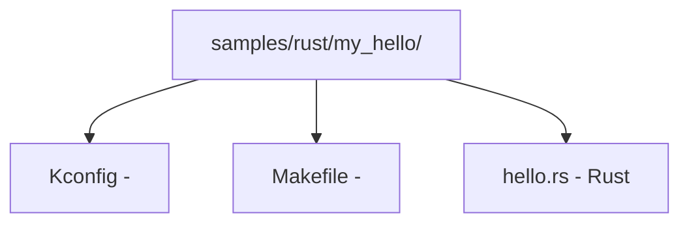

# 

> **C**RustLinuxC [[../..///04_|C: C]]  [[../..///05_|C: ]] 

## 1. 

### 1.1 

- **CPU**x86_64  aarch64RISC-V 
- **** 30GB 5GB 15GB
- **** 8GB

### 1.2 

****

```bash
# Debian/Ubuntu
sudo apt install -y \
 build-essential \
 flex bison \
 libelf-dev libssl-dev \
 bc \
 cpio \
 clang lld \
 llvm-dev \
 libclang-dev

# Rust  rustup
curl --proto '=https' --tlsv1.2 -sSf https://sh.rustup.rs | sh
source ~/.cargo/env

#  rustc 
# 
cat Documentation/rust/quick-start.rst
# 
rustup override set $(scripts/min-tool-version.sh rustc)
rustup component add rust-src
rustup component add rustfmt
rustup component add clippy

#  bindgen
cargo install bindgen-cli

# 
rustc --version
bindgen --version
clang --version
```

****

```bash
# 
make LLVM=1 rustavailable
# Rust is available!
# 
```

### 1.3 

```bash
#  3-5GB
git clone https://git.kernel.org/pub/scm/linux/kernel/git/torvalds/linux.git
cd linux

#  Rust for Linux  WIP 
git clone https://github.com/Rust-for-Linux/linux.git rust-for-linux
cd rust-for-linux
```

### 1.4 

```bash
# 
make LLVM=1 x86_64_defconfig

#  Rust 
make LLVM=1 menuconfig
# General setup -> Rust support -> [*] Rust support
# Kernel hacking -> Rust hacking -> [*] Rust hacking

#  .config
scripts/config --enable CONFIG_RUST
scripts/config --enable CONFIG_SAMPLES
scripts/config --enable CONFIG_SAMPLE_RUST_MINIMAL
scripts/config --enable CONFIG_SAMPLE_RUST_PRINT
scripts/config --enable CONFIG_SAMPLE_RUST_HOSTPROGS

# 
make LLVM=1 olddefconfig
```


```
CONFIG_RUST=y #  Rust 
CONFIG_RUST_IS_AVAILABLE=y # 
CONFIG_SAMPLE_RUST_MINIMAL=y # 
CONFIG_SAMPLE_RUST_PRINT=y # 
CONFIG_SAMPLE_RUST_HOSTPROGS=y #  Rust 
CONFIG_RUSTC_VERSION=... # rustc 
CONFIG_BINDGEN_VERSION=... # bindgen 
```

## 

```bash
echo "===  Rust  ==="
rustc --version
echo "Rust : $(rustc --print sysroot)/lib/rustlib/src/rust/library"

echo ""
echo "===  bindgen ==="
bindgen --version

echo ""
echo "===  ==="
ls linux/Makefile 2>/dev/null && echo ": " || echo ":  clone"
```

**API**

---

## 2. Step 1

### 2.1  Rust 

```rust
// SPDX-License-Identifier: GPL-2.0
//! Hello World kernel module in Rust.
//!
//! This module demonstrates the minimal structure:
//! - module! macro for registration
//! - Module trait implementation
//! - pr_info! for kernel logging

use kernel::prelude::*;

module! {
 type: HelloModule,
 name: "hello_rust",
 author: "Rust for Linux Contributors",
 description: "A hello world kernel module in Rust",
 license: "GPL",
}

struct HelloModule;

impl kernel::Module for HelloModule {
 fn init(_module: &'static ThisModule) -> Result<Self> {
 pr_info!("Hello from Rust kernel module!\n");
 pr_info!(" Module name: {}\n", _module.name());
 Ok(HelloModule)
 }
}

impl Drop for HelloModule {
 fn drop(&mut self) {
 pr_info!("Goodbye from Rust kernel module!\n");
 }
}
```

### 2.2  Kconfig  Makefile




**Kconfig**
```kconfig
# samples/rust/my_hello/Kconfig
config SAMPLE_RUST_MY_HELLO
 tristate "My Hello World Module (Rust)"
 depends on RUST
 help
 This option builds a hello world kernel module in Rust.

 To compile this as a module, choose M here:
 the module will be called my_hello.
```

**Makefile**
```makefile
# samples/rust/my_hello/Makefile
obj-$(CONFIG_SAMPLE_RUST_MY_HELLO) += my_hello.o
```

### 2.3 

```bash
# 
# 1. 
scripts/config --enable CONFIG_SAMPLE_RUST_MY_HELLO

# 2. 
make LLVM=1 -j$(nproc) modules

# 3.  .ko 
ls samples/rust/my_hello/my_hello.ko

# 4.  root
sudo insmod samples/rust/my_hello/my_hello.ko

# 5. 
sudo dmesg | tail -5
# 
# [timestamp] Hello from Rust kernel module!
# [timestamp] Module name: my_hello

# 6. 
sudo rmmod my_hello
sudo dmesg | tail -3
# 
# [timestamp] Goodbye from Rust kernel module!
```

### 2.4 

`module!`  `rust/macros/module.rs`


|  |  |  |  |
|------|------|------|------|
| `type` | Rust  |  |  `Module` trait  |
| `name` |  |  |  insmod/rmmod |
| `author` |  |  |  |
| `description` |  |  |  |
| `license` |  |  | GPL, GPL v2, Dual MIT/GPL  |
| `alias` |  |  |  |
| `firmware` |  |  |  |
| `params` |  |  |  |

 C 

```c
static struct module __this_module
__attribute__((section(".gnu.linkonce.this_module"))) = {
 .name = KBUILD_MODNAME,
 .init = init_module, // Rust Module::init
 .exit = cleanup_module, //  Drop::drop
 .arch = MODULE_ARCH_INIT,
};
```

## 3. Step 2

### 3.1 

 `println!`  `pr_*!` 

| Rust  |  | C  |  |
|---------|---------|--------|------|
| `pr_emerg!` | KERN_EMERG (0) | `pr_emerg()` |  |
| `pr_alert!` | KERN_ALERT (1) | `pr_alert()` |  |
| `pr_crit!` | KERN_CRIT (2) | `pr_crit()` |  |
| `pr_err!` | KERN_ERR (3) | `pr_err()` |  |
| `pr_warn!` | KERN_WARNING (4) | `pr_warn()` |  |
| `pr_notice!` | KERN_NOTICE (5) | `pr_notice()` |  |
| `pr_info!` | KERN_INFO (6) | `pr_info()` |  |
| `pr_debug!` | KERN_DEBUG (7) | `pr_debug()` |  |

### 3.2 

```rust
use kernel::prelude::*;
//  pr_*!  Rust 

module! {
 type: LogModule,
 name: "rust_log_demo",
 author: "Demo",
 description: "Logging demo",
 license: "GPL",
}

struct LogModule;

impl kernel::Module for LogModule {
 fn init(_module: &'static ThisModule) -> Result<Self> {
 // 
 pr_info!("Integer: {}, Hex: {:#x}\n", 42, 0xDEAD);

 // 
 let x: i32 = 0;
 pr_info!("Address of x: {:p}\n", &x);

 //  ——  CONFIG_DYNAMIC_DEBUG  #define DEBUG 
 pr_debug!("This debug message may not appear by default\n");

 //  debug 
 pr_debug!(
 "Compiled with: {}\n",
 option_env!("RUSTC_COMMIT_HASH").unwrap_or("unknown")
 );

 // dev_*  —— 
 // pr_err!("Device error on device {}\n", device_name);

 Ok(LogModule)
 }
}

impl Drop for LogModule {
 fn drop(&mut self) {
 pr_info!("Log demo module unloaded\n");
 }
}
```

### 3.3 


- ****`pr_info!`  `\n`
- **** `CONFIG_LOG_BUF_SHIFT` 256KB
- ****

```rust
//  pr_info_ratelimited!  API
//  Rust 
use kernel::pr_info;

// 
static mut RATE_LIMIT_COUNT: u32 = 0;
//  __ratelimit  printk_ratelimit
```

## 4. Step 3

### 4.1 `module_param!` 

 `insmod hello.ko my_param=42` Rust  `module_param!` 

```rust
// SPDX-License-Identifier: GPL-2.0
//! Module with parameters

use kernel::prelude::*;

module! {
 type: ParamModule,
 name: "rust_params",
 author: "Demo",
 description: "Module parameters demo",
 license: "GPL",
 params: {
 my_int: i32 {
 default: 42,
 permissions: 0o644,
 description: "An integer parameter",
 },
 my_bool: bool {
 default: true,
 permissions: 0,
 description: "A boolean parameter (no sysfs)",
 },
 my_str: str {
 default: kernel::module_param::ByteParam::borrowed(b"hello\0"),
 permissions: 0o644,
 description: "A string parameter",
 },
 },
}

struct ParamModule;

impl kernel::Module for ParamModule {
 fn init(module: &'static ThisModule) -> Result<Self> {
 //  module 
 let params = module.param_my_int();
 // 

 pr_info!("Parameters loaded:\n");
 pr_info!(" my_int: {}\n", my_int()); // 
 pr_info!(" my_bool: {}\n", my_bool());
 pr_info!(" my_str: {:?}\n", my_str());

 Ok(ParamModule)
 }
}

impl Drop for ParamModule {
 fn drop(&mut self) {
 pr_info!("Param module unloaded\n");
 }
}
```

### 4.2 

 Rust 

| Rust  | C  |  |
|-----------|-----------|------|
| `i8`, `i16`, `i32`, `i64` | `s8`, `s16`, `s32`, `s64` |  |
| `u8`, `u16`, `u32`, `u64` | `u8`, `u16`, `u32`, `u64` |  |
| `bool` | `bool` |  |
| `str` | `charp` | C  |
| `ByteParam` | `charp` |  |
|  |  `ModuleParam` trait |  |

### 4.3 

```rust
use kernel::module_param::ModuleParam;

// 
#[derive(Copy, Clone)]
enum Mode {
 Fast,
 Slow,
 Safe,
}

impl ModuleParam for Mode {
 type SysFsType = i32;

 fn from_param_arg(arg: Option<&'static [u8]>) -> Result<Self> {
 match arg {
 Some(b"fast") => Ok(Mode::Fast),
 Some(b"slow") => Ok(Mode::Slow),
 Some(b"safe") => Ok(Mode::Safe),
 _ => Err(Error::EINVAL),
 }
 }
}
```

## 5. Step 4 /proc 

### 5.1  /proc 

`/proc`  `/proc` 

### 5.2 Rust  /proc 

```rust
// SPDX-License-Identifier: GPL-2.0
//! /proc file interface demo

use kernel::prelude::*;
use kernel::sync::Mutex;

module! {
 type: ProcModule,
 name: "rust_proc",
 author: "Demo",
 description: "/proc file demo",
 license: "GPL",
}

struct ProcModule {
 // 
 counter: Mutex<u64>,
 buffer: Mutex<Vec<u8>>,
}

impl kernel::Module for ProcModule {
 fn init(_module: &'static ThisModule) -> Result<Self> {
 //  FileOperations trait  /proc 
 //  Rust /proc API 

 pr_info!("Creating /proc/rust_demo\n");

 let state = Self {
 counter: Mutex::new(0),
 buffer: Mutex::new(Vec::new()),
 };

 //  proc  API 
 // proc::create_proc_entry("rust_demo", state)?;

 Ok(state)
 }
}

impl Drop for ProcModule {
 fn drop(&mut self) {
 //  proc 
 // proc::remove_proc_entry("rust_demo");
 pr_info!("Removed /proc/rust_demo\n");
 }
}

//  proc 
struct ProcFileOps;

impl kernel::file::FileOperations for ProcFileOps {
 type Data = ();
 type OpenData = ();

 // 
 fn read(
 _data: (),
 _file: &kernel::file::File,
 writer: &mut impl kernel::io_buffer::IoBufferWriter,
 offset: u64,
 ) -> Result<usize> {
 if offset != 0 {
 return Ok(0); // EOF 0 
 }

 let msg = b"Rust kernel module active\n";
 let len = msg.len();

 // 
 writer.write_slice(msg)?;
 Ok(len)
 }

 // 
 fn write(
 _data: (),
 _file: &kernel::file::File,
 reader: &mut impl kernel::io_buffer::IoBufferReader,
 _offset: u64,
 ) -> Result<usize> {
 let mut buf = [0u8; 128];
 let n = reader.read_slice(&mut buf)?;

 pr_info!("Received {} bytes via /proc\n", n);
 // ...
 Ok(n)
 }
}
```

## 6. Step 5

### 6.1 

Character Device `/dev/hello`  read/write/ioctl 

1. major number
2.  `file_operations` 
3. cdev
4. 

### 6.2 Rust 

```rust
// SPDX-License-Identifier: GPL-2.0
//! Character device driver in Rust
//!
//! Creates /dev/rust_char device that supports:
//! - open/release
//! - read/write
//! - ioctl

use kernel::prelude::*;
use kernel::{
 chrdev,
 file::{self, File},
 io_buffer::{IoBufferReader, IoBufferWriter},
 sync::Mutex,
};

module! {
 type: CharDeviceModule,
 name: "rust_char",
 author: "Demo",
 description: "Character device demo in Rust",
 license: "GPL",
}

///  open 
struct DeviceData {
 /// 
 content: Mutex<Vec<u8>>,
 /// 
 capacity: usize,
}

impl DeviceData {
 fn new(capacity: usize) -> Result<Self> {
 Ok(Self {
 content: Mutex::new(Vec::new()),
 capacity,
 })
 }
}

/// 
#[vtable]
impl file::FileOperations for DeviceData {
 type Data = kernel::sync::Arc<Self>;
 type OpenData = ();

 fn open(_context: &Self::OpenData, _file: &File) -> Result<Self::Data> {
 pr_info!("rust_char: device opened\n");
 let data = Arc::new(
 DeviceData::new(4096)?,
 kernel::alloc::flags::GFP_KERNEL,
 )?;
 Ok(data)
 }

 fn read(
 data: <Self::Data as kernel::types::ForeignOwnable>::Borrowed<'_>,
 _file: &File,
 writer: &mut impl IoBufferWriter,
 offset: u64,
 ) -> Result<usize> {
 let offset = offset as usize;
 let guard = data.content.lock();

 if offset >= guard.len() {
 return Ok(0); // EOF
 }

 let available = &guard[offset..];
 let to_read = available.len();
 writer.write_slice(available)?;

 pr_info!("rust_char: read {} bytes at offset {}\n", to_read, offset);
 Ok(to_read)
 }

 fn write(
 data: <Self::Data as kernel::types::ForeignOwnable>::Borrowed<'_>,
 _file: &File,
 reader: &mut impl IoBufferReader,
 offset: u64,
 ) -> Result<usize> {
 let offset = offset as usize;
 let mut guard = data.content.lock();

 //  ENOSPC
 if offset >= data.capacity {
 return Err(kernel::error::Error::ENOSPC);
 }

 // 
 if guard.len() < offset + reader.len() {
 // 
 let needed = offset + reader.len();
 if needed > data.capacity {
 return Err(kernel::error::Error::ENOSPC);
 }
 guard.resize(needed, 0);
 }

 let buf = &mut guard[offset..];
 let n = reader.read_slice(buf)?;

 pr_info!("rust_char: wrote {} bytes at offset {}\n", n, offset);
 Ok(n)
 }

 fn release(data: Self::Data, _file: &File) {
 // Arc  drop
 pr_info!("rust_char: device released\n");
 }
}

/// 
struct CharDeviceModule {
 _dev: kernel::chrdev::Registration<1>, // 
}

impl kernel::Module for CharDeviceModule {
 fn init(module: &'static ThisModule) -> Result<Self> {
 pr_info!("rust_char: initializing\n");

 // 
 // 
 let chrdev_reg = chrdev::Registration::new_pinned(
 module,
 "rust_char",
 0, // 0 = 
 //  builder 
 // kernel::chrdev::Registration::builder("rust_char", 0..1)?
 // .with_owner(module)
 // .register::<DeviceData>()?,
 )?;

 // 
 let region = chrdev_reg.as_ref();
 let major = region.major();

 pr_info!(
 "rust_char: registered with major {}, minor 0 (use `mknod /dev/rust_char c {} 0`)\n",
 major, major
 );

 Ok(CharDeviceModule {
 _dev: chrdev_reg,
 })
 }
}

impl Drop for CharDeviceModule {
 fn drop(&mut self) {
 pr_info!("rust_char: unloaded\n");
 }
}
```

### 6.3 

```bash
#  dmesg
sudo dmesg | grep "rust_char"
# rust_char: registered with major 240, minor 0

# 
sudo mknod /dev/rust_char c 240 0
sudo chmod 666 /dev/rust_char

# 
echo "Hello from userspace!" > /dev/rust_char

# 
cat /dev/rust_char
# Hello from userspace!

# 
sudo dmesg | tail -5
# rust_char: wrote 22 bytes at offset 0
# rust_char: device opened
# rust_char: read 22 bytes at offset 0
# rust_char: device released

# 
sudo rm /dev/rust_char
```

### 6.4  ioctl 

```rust
//  DeviceData  FileOperations 

const IOCTL_CLEAR: u32 = 0x7001; // 
const IOCTL_GET_SIZE: u32 = 0x7002; // 
const IOCTL_SET_CAPACITY: u32 = 0x7003; // 

#[vtable]
impl file::FileOperations for DeviceData {
 // ...  open/read/write/release ...

 fn ioctl(
 data: <Self::Data as kernel::types::ForeignOwnable>::Borrowed<'_>,
 _file: &File,
 cmd: u32,
 arg: usize,
 ) -> Result<u32> {
 match cmd {
 IOCTL_CLEAR => {
 let mut guard = data.content.lock();
 guard.clear();
 pr_info!("rust_char: buffer cleared via ioctl\n");
 Ok(0)
 }
 IOCTL_GET_SIZE => {
 let guard = data.content.lock();
 let size = guard.len() as u32;
 //  size  arg 
 //  copy_to_user
 pr_info!("rust_char: ioctl get_size = {}\n", size);
 Ok(size)
 }
 _ => Err(kernel::error::Error::ENOTTY), //  ioctl
 }
 }
}
```

## 7. Step 6LKM 

### 7.1  vs 

|  |  |  |
|------|---------|----|
|  |  `samples/rust/` |  |
|  | `make modules` |  |
|  |  |  |
|  |  |  |
|  |  |  |

### 7.2  Makefile

```makefile
#  Rust  Makefile 
# 

KDIR ?= /lib/modules/$(shell uname -r)/build
# 
# KDIR ?= /path/to/linux

RUSTFLAGS_my_module.o := \
 -C panic=abort \
 -C opt-level=2

obj-m := my_module.o

all:
 $(MAKE) -C $(KDIR) M=$(PWD) LLVM=1 modules

clean:
 $(MAKE) -C $(KDIR) M=$(PWD) clean

load:
 sudo insmod my_module.ko

unload:
 sudo rmmod my_module

test: load
 cat /proc/my_module && sudo rmmod my_module
```

### 7.3 Kbuild 

 Kbuild  `.rs` 

1.  `rustc`  `.rs`  `.o`
2.  `.o`  C 
3.  `.ko` 

 `rust/Makefile` 

```makefile
#  rust/Makefile 
KBUILD_RUSTFLAGS += -Copt-level=2
KBUILD_RUSTFLAGS += -Cdebuginfo=2
KBUILD_RUSTFLAGS += -Cpanic=abort
KBUILD_RUSTFLAGS += -Cno-redzone=y
KBUILD_RUSTFLAGS += -Ccode-model=kernel
KBUILD_RUSTFLAGS += -Clink-arg=-z -Clink-arg=nostartfiles
KBUILD_RUSTFLAGS += --edition 2021
```

## 8. Step 7 Rust 

### 8.1 

```rust
// 
#[cfg(CONFIG_DEBUG_RUST)]
macro_rules! debug_log {
 ($($arg:tt)*) => {
 pr_debug!($($arg)*);
 };
}

#[cfg(not(CONFIG_DEBUG_RUST))]
macro_rules! debug_log {
 ($($arg:tt)*) => { () };
}

// 
debug_log!("Entering function with value: {}\n", x);
```

### 8.2  Oops

 Oops 

```
BUG: unable to handle page fault at 0000000000000010
#PF: supervisor read access in kernel mode
#PF: error_code(0x0000) - not-present page
PGD 0 P4D 0
Oops: 0000 [#1] PREEMPT SMP NOPTI
CPU: 0 PID: 1234 Comm: insmod Tainted: G OE
RIP: 0010:rust_char_read+0x42/0x80 [rust_char]
...
RSP: 0018:ffffc9000014bd30 EFLAGS: 00010246
RAX: 0000000000000000 RBX: ffff8881003e0000 RCX: 0000000000000000
RDX: ffff8881003e0000 RSI: 0000000000000000 RDI: ffff8881003e0000
...
```

** Oops**
1. `RIP` 
2.  `addr2line` 

```bash
# 
addr2line -e samples/rust/my_module/my_module.o -f 0x42
```

### 8.3  QEMU 

```bash
#  QEMU 
# 
mkdir initramfs
cd initramfs
#  init 
cat > init << 'EOF'
#!/bin/sh
mount -t proc none /proc
mount -t sysfs none /sys
mount -t devtmpfs none /dev

# 
insmod /my_module.ko

#  shell
exec /bin/sh
EOF
chmod +x init

# 
find . | cpio -o -H newc > ../initramfs.cpio

#  QEMU 
cd ..
qemu-system-x86_64 \
 -kernel linux/arch/x86/boot/bzImage \
 -initrd initramfs.cpio \
 -nographic \
 -append "console=ttyS0" \
 -m 512M
```

### 8.4 KUnit 

 KUnit Rust 

```rust
//  KUnit  Rust 
/// KUnit test for DeviceData
#[cfg(CONFIG_RUST_KUNIT_TEST)]
mod tests {
 use super::*;
 use kernel::kunit::*;

 #[test]
 fn test_device_data_new() {
 let data = DeviceData::new(1024).expect("Failed to create device data");
 kunit_assert_eq!(data.capacity, 1024);
 let guard = data.content.lock();
 kunit_assert!(guard.is_empty());
 }

 #[test]
 fn test_device_data_write_read() {
 let data = DeviceData::new(1024).expect("Failed to create device data");
 // 
 {
 let mut guard = data.content.lock();
 guard.extend_from_slice(b"Hello");
 }
 let guard = data.content.lock();
 kunit_assert_eq!(&guard[..], b"Hello");
 }
}
```

## 9. Step 8

### 9.1 Rust 

 Rust

1. **Unsigned **`x / y`  y=0  panicabort
2. **** panicabort
3. ****Debug  panicRelease  wrapping
4. ****`kmalloc`  `ENOMEM` Error
5. ****

### 9.2 

```rust
// 1.  .try_into()  as 
fn safe_conversion(x: u64) -> Result<usize> {
 usize::try_from(x).map_err(|_| kernel::error::Error::ERANGE)
}

// 2. 
fn safe_divide(a: u32, b: u32) -> Result<u32> {
 b.checked_div(a).ok_or(kernel::error::Error::EINVAL)
}

// 3. 
fn validate_offset(offset: u64, max_size: usize) -> Result<usize> {
 if offset > max_size as u64 {
 return Err(kernel::error::Error::ERANGE);
 }
 Ok(offset as usize)
}

// 4.  NonNull  *mut T
use core::ptr::NonNull;
fn process_ptr(ptr: *mut u8) -> Result<NonNull<u8>> {
 NonNull::new(ptr).ok_or(kernel::error::Error::EINVAL)
}

// 5. 
const MAX_ALLOC: usize = 4096;
fn safe_kernel_alloc(size: usize) -> Result<Vec<u8>> {
 if size > MAX_ALLOC {
 return Err(kernel::error::Error::ENOMEM);
 }
 let mut v = Vec::new();
 v.try_reserve(size)?;
 v.resize(size, 0);
 Ok(v)
}
```

### 9.3 

|  | Rust  |  |
|------|-----------|-------------|
| UAF |  | `unsafe`  |
|  |  | `unsafe { get_unchecked }` |
|  | Send/Sync |  |
|  | RAII / Drop | `forget` |
|  |  | FFI  C  |

---

## [[02-Rust]] | [[04-Rust vs C]]

---
