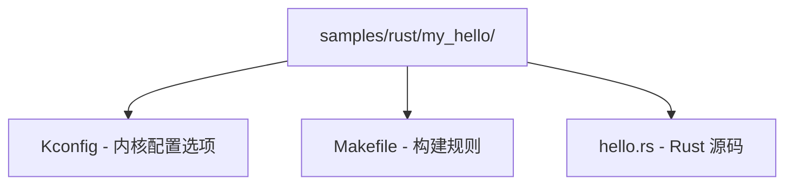

# 内核模块开发实战

> 📌 **C语言驱动作为基础**：本章的Rust驱动开发建立在Linux已有的C驱动基础设施之上。请参阅 [[../../内核/系统内核/04_设备驱动|C语言教程: C设备驱动开发]] 理解底层驱动模型，以及 [[../../内核/系统内核/05_中断与系统调用|C语言教程: 中断与系统调用]] 理解中断处理机制。

## 1. 开发环境准备

### 1.1 硬件要求

- **CPU**：x86_64 或 aarch64（RISC-V 正在开发中）
- **磁盘空间**：至少 30GB（内核源码约 5GB，编译后约 15GB）
- **内存**：至少 8GB（编译时并行可减少时间）

### 1.2 软件依赖

**基础工具链**：

```bash
# Debian/Ubuntu
sudo apt install -y \
    build-essential \
    flex bison \
    libelf-dev libssl-dev \
    bc \
    cpio \
    clang lld \
    llvm-dev \
    libclang-dev

# Rust 工具链（使用 rustup）
curl --proto '=https' --tlsv1.2 -sSf https://sh.rustup.rs | sh
source ~/.cargo/env

# 安装内核所需的 rustc 版本
# 查看内核要求的版本：
cat Documentation/rust/quick-start.rst
# 根据文档安装对应版本，例如：
rustup override set $(scripts/min-tool-version.sh rustc)
rustup component add rust-src
rustup component add rustfmt
rustup component add clippy

# 安装 bindgen
cargo install bindgen-cli

# 确认工具可用
rustc --version
bindgen --version
clang --version
```

**验证环境**：

```bash
# 内核源码中提供了检测脚本
make LLVM=1 rustavailable
# 成功输出：Rust is available!
# 失败会给出具体原因
```

### 1.3 获取内核源码

```bash
# 克隆主线内核（约 3-5GB）
git clone https://git.kernel.org/pub/scm/linux/kernel/git/torvalds/linux.git
cd linux

# 或者使用 Rust for Linux 的开发仓库（包含更多 WIP 分支）
git clone https://github.com/Rust-for-Linux/linux.git rust-for-linux
cd rust-for-linux
```

### 1.4 内核配置

```bash
# 生成默认配置
make LLVM=1 x86_64_defconfig

# 启用 Rust 支持
make LLVM=1 menuconfig
# General setup -> Rust support -> [*] Rust support
# Kernel hacking -> Rust hacking -> [*] Rust hacking

# 或直接修改 .config
scripts/config --enable CONFIG_RUST
scripts/config --enable CONFIG_SAMPLES
scripts/config --enable CONFIG_SAMPLE_RUST_MINIMAL
scripts/config --enable CONFIG_SAMPLE_RUST_PRINT
scripts/config --enable CONFIG_SAMPLE_RUST_HOSTPROGS

# 确认配置
make LLVM=1 olddefconfig
```

关键内核配置项：

```
CONFIG_RUST=y                      # 启用 Rust 支持
CONFIG_RUST_IS_AVAILABLE=y         # 工具链可用
CONFIG_SAMPLE_RUST_MINIMAL=y       # 最小示例模块
CONFIG_SAMPLE_RUST_PRINT=y         # 打印示例
CONFIG_SAMPLE_RUST_HOSTPROGS=y     # 主机 Rust 程序
CONFIG_RUSTC_VERSION=...           # rustc 版本
CONFIG_BINDGEN_VERSION=...         # bindgen 版本
```

## 🛑 暂停：请先完成以下环境检查，再继续学习！

```bash
echo "=== 检查 Rust 工具链 ==="
rustc --version
echo "Rust 标准库源码: $(rustc --print sysroot)/lib/rustlib/src/rust/library"

echo ""
echo "=== 检查 bindgen ==="
bindgen --version

echo ""
echo "=== 检查内核源码 ==="
ls linux/Makefile 2>/dev/null && echo "内核源码: ✓" || echo "内核源码: ✗ 需要 clone"
```

**如果你不打算编译真实内核，没关系！本章的代码可以直接对照阅读，理解结构和API即可。后续参与内核开发时再搭建环境。**

---

## 2. Step 1：创建最小内核模块

### 2.1 最简单的 Rust 内核模块

```rust
// SPDX-License-Identifier: GPL-2.0
//! Hello World kernel module in Rust.
//!
//! This module demonstrates the minimal structure:
//! - module! macro for registration
//! - Module trait implementation
//! - pr_info! for kernel logging

use kernel::prelude::*;

module! {
    type: HelloModule,
    name: "hello_rust",
    author: "Rust for Linux Contributors",
    description: "A hello world kernel module in Rust",
    license: "GPL",
}

struct HelloModule;

impl kernel::Module for HelloModule {
    fn init(_module: &'static ThisModule) -> Result<Self> {
        pr_info!("Hello from Rust kernel module!\n");
        pr_info!("    Module name: {}\n", _module.name());
        Ok(HelloModule)
    }
}

impl Drop for HelloModule {
    fn drop(&mut self) {
        pr_info!("Goodbye from Rust kernel module!\n");
    }
}
```

### 2.2 创建 Kconfig 和 Makefile

模块目录结构：


**Kconfig**：
```kconfig
# samples/rust/my_hello/Kconfig
config SAMPLE_RUST_MY_HELLO
    tristate "My Hello World Module (Rust)"
    depends on RUST
    help
      This option builds a hello world kernel module in Rust.

      To compile this as a module, choose M here:
      the module will be called my_hello.
```

**Makefile**：
```makefile
# samples/rust/my_hello/Makefile
obj-$(CONFIG_SAMPLE_RUST_MY_HELLO) += my_hello.o
```

### 2.3 编译和加载

```bash
# 在内核源码根目录
# 1. 启用我们新增的配置
scripts/config --enable CONFIG_SAMPLE_RUST_MY_HELLO

# 2. 构建模块
make LLVM=1 -j$(nproc) modules

# 3. 确认生成了 .ko 文件
ls samples/rust/my_hello/my_hello.ko

# 4. 加载模块（需要 root）
sudo insmod samples/rust/my_hello/my_hello.ko

# 5. 查看内核日志
sudo dmesg | tail -5
# 输出应包含：
# [timestamp] Hello from Rust kernel module!
# [timestamp]     Module name: my_hello

# 6. 卸载模块
sudo rmmod my_hello
sudo dmesg | tail -3
# 输出应包含：
# [timestamp] Goodbye from Rust kernel module!
```

### 2.4 模块宏详解

`module!` 宏展开后注册了内核模块结构。实际实现位于 `rust/macros/module.rs`。

宏支持的字段：

| 字段 | 类型 | 必填 | 说明 |
|------|------|------|------|
| `type` | Rust 类型 | 是 | 实现 `Module` trait 的结构体 |
| `name` | 字符串 | 是 | 模块名称（用于 insmod/rmmod） |
| `author` | 字符串 | 是 | 作者名 |
| `description` | 字符串 | 是 | 模块描述 |
| `license` | 字符串 | 是 | 许可证（GPL, GPL v2, Dual MIT/GPL 等） |
| `alias` | 字符串 | 否 | 模块别名 |
| `firmware` | 字符串 | 否 | 需要的固件文件 |
| `params` | 块 | 否 | 模块参数 |

模块展开后大致等价于以下 C 结构体初始化：

```c
static struct module __this_module
__attribute__((section(".gnu.linkonce.this_module"))) = {
    .name = KBUILD_MODNAME,
    .init = init_module,      // Rust Module::init
    .exit = cleanup_module,   // 触发 Drop::drop
    .arch = MODULE_ARCH_INIT,
};
```

## 3. Step 2：理解内核日志宏

### 3.1 日志级别

内核日志与 `println!` 不同，使用 `pr_*!` 系列宏：

| Rust 宏 | 日志级别 | C 等效 | 用途 |
|---------|---------|--------|------|
| `pr_emerg!` | KERN_EMERG (0) | `pr_emerg()` | 系统即将崩溃 |
| `pr_alert!` | KERN_ALERT (1) | `pr_alert()` | 需要立即操作 |
| `pr_crit!` | KERN_CRIT (2) | `pr_crit()` | 严重情况 |
| `pr_err!` | KERN_ERR (3) | `pr_err()` | 错误条件 |
| `pr_warn!` | KERN_WARNING (4) | `pr_warn()` | 警告条件 |
| `pr_notice!` | KERN_NOTICE (5) | `pr_notice()` | 正常但重要的条件 |
| `pr_info!` | KERN_INFO (6) | `pr_info()` | 信息性消息 |
| `pr_debug!` | KERN_DEBUG (7) | `pr_debug()` | 调试信息（默认不打印） |

### 3.2 格式化支持

```rust
use kernel::prelude::*;
// 注意：内核 pr_*! 宏支持类似 Rust 标准库的格式化

module! {
    type: LogModule,
    name: "rust_log_demo",
    author: "Demo",
    description: "Logging demo",
    license: "GPL",
}

struct LogModule;

impl kernel::Module for LogModule {
    fn init(_module: &'static ThisModule) -> Result<Self> {
        // 基本格式化
        pr_info!("Integer: {}, Hex: {:#x}\n", 42, 0xDEAD);

        // 指针地址
        let x: i32 = 0;
        pr_info!("Address of x: {:p}\n", &x);

        // 调试宏 —— 仅在 CONFIG_DYNAMIC_DEBUG 或 #define DEBUG 时打印
        pr_debug!("This debug message may not appear by default\n");

        // 条件编译宏（与 debug 行为类似）
        pr_debug!(
            "Compiled with: {}\n",
            option_env!("RUSTC_COMMIT_HASH").unwrap_or("unknown")
        );

        // dev_* 系列宏 —— 关联设备
        // pr_err!("Device error on device {}\n", device_name);

        Ok(LogModule)
    }
}

impl Drop for LogModule {
    fn drop(&mut self) {
        pr_info!("Log demo module unloaded\n");
    }
}
```

### 3.3 内核中的打印限制

重要限制：
- **行缓冲**：`pr_info!` 不会自动换行，需要显式 `\n`
- **消息大小**：内核日志缓冲区有限（通常 `CONFIG_LOG_BUF_SHIFT`，默认 256KB），过长消息会被截断
- **速率限制**：避免日志洪水：

```rust
// 实际内核中，可以使用 pr_info_ratelimited! 或类似 API
// 当前内核 Rust 抽象可能通过以下方式实现：
use kernel::pr_info;

// 简单版本：手动限制
static mut RATE_LIMIT_COUNT: u32 = 0;
// 实际应使用内核的 __ratelimit 或 printk_ratelimit
```

## 4. Step 3：模块参数

### 4.1 `module_param!` 宏

内核模块可以通过 `insmod hello.ko my_param=42` 传递参数。Rust 通过 `module_param!` 宏支持此功能。

```rust
// SPDX-License-Identifier: GPL-2.0
//! Module with parameters

use kernel::prelude::*;

module! {
    type: ParamModule,
    name: "rust_params",
    author: "Demo",
    description: "Module parameters demo",
    license: "GPL",
    params: {
        my_int: i32 {
            default: 42,
            permissions: 0o644,
            description: "An integer parameter",
        },
        my_bool: bool {
            default: true,
            permissions: 0,
            description: "A boolean parameter (no sysfs)",
        },
        my_str: str {
            default: kernel::module_param::ByteParam::borrowed(b"hello\0"),
            permissions: 0o644,
            description: "A string parameter",
        },
    },
}

struct ParamModule;

impl kernel::Module for ParamModule {
    fn init(module: &'static ThisModule) -> Result<Self> {
        // 通过 module 指针访问参数
        let params = module.param_my_int();
        // 直接读取编译时固定的模块参数结构

        pr_info!("Parameters loaded:\n");
        pr_info!("  my_int: {}\n", my_int());    // 宏生成的访问函数
        pr_info!("  my_bool: {}\n", my_bool());
        pr_info!("  my_str: {:?}\n", my_str());

        Ok(ParamModule)
    }
}

impl Drop for ParamModule {
    fn drop(&mut self) {
        pr_info!("Param module unloaded\n");
    }
}
```

### 4.2 参数类型支持

内核 Rust 支持的模块参数类型：

| Rust 类型 | C 等效类型 | 说明 |
|-----------|-----------|------|
| `i8`, `i16`, `i32`, `i64` | `s8`, `s16`, `s32`, `s64` | 有符号整数 |
| `u8`, `u16`, `u32`, `u64` | `u8`, `u16`, `u32`, `u64` | 无符号整数 |
| `bool` | `bool` | 布尔类型 |
| `str` | `charp` | 字符串指针（C 风格） |
| `ByteParam` | `charp` | 字节序列 |
| 自定义 | 实现 `ModuleParam` trait | 自定义类型 |

### 4.3 自定义参数类型

```rust
use kernel::module_param::ModuleParam;

// 自定义参数类型示例
#[derive(Copy, Clone)]
enum Mode {
    Fast,
    Slow,
    Safe,
}

impl ModuleParam for Mode {
    type SysFsType = i32;

    fn from_param_arg(arg: Option<&'static [u8]>) -> Result<Self> {
        match arg {
            Some(b"fast") => Ok(Mode::Fast),
            Some(b"slow") => Ok(Mode::Slow),
            Some(b"safe") => Ok(Mode::Safe),
            _ => Err(Error::EINVAL),
        }
    }
}
```

## 5. Step 4：创建 /proc 文件接口

### 5.1 什么是 /proc 文件系统

`/proc` 是一个伪文件系统，提供内核运行时信息的访问。读写 `/proc` 文件即读写内核数据结构。

### 5.2 Rust 实现 /proc 文件

```rust
// SPDX-License-Identifier: GPL-2.0
//! /proc file interface demo

use kernel::prelude::*;
use kernel::sync::Mutex;

module! {
    type: ProcModule,
    name: "rust_proc",
    author: "Demo",
    description: "/proc file demo",
    license: "GPL",
}

struct ProcModule {
    // 使用内核同步原语保护共享数据
    counter: Mutex<u64>,
    buffer: Mutex<Vec<u8>>,
}

impl kernel::Module for ProcModule {
    fn init(_module: &'static ThisModule) -> Result<Self> {
        // 通过 FileOperations trait 创建 /proc 文件
        // 注意：实际内核 Rust /proc API 可能通过以下模式

        pr_info!("Creating /proc/rust_demo\n");

        let state = Self {
            counter: Mutex::new(0),
            buffer: Mutex::new(Vec::new()),
        };

        // 注册 proc 文件（简化示意，实际 API 见内核源码）
        // proc::create_proc_entry("rust_demo", state)?;

        Ok(state)
    }
}

impl Drop for ProcModule {
    fn drop(&mut self) {
        // 移除 proc 文件
        // proc::remove_proc_entry("rust_demo");
        pr_info!("Removed /proc/rust_demo\n");
    }
}

// 描述 proc 文件操作（概念性代码）
struct ProcFileOps;

impl kernel::file::FileOperations for ProcFileOps {
    type Data = ();
    type OpenData = ();

    // 读取时提供数据
    fn read(
        _data: (),
        _file: &kernel::file::File,
        writer: &mut impl kernel::io_buffer::IoBufferWriter,
        offset: u64,
    ) -> Result<usize> {
        if offset != 0 {
            return Ok(0);  // EOF：只支持从偏移 0 读取
        }

        let msg = b"Rust kernel module active\n";
        let len = msg.len();

        // 将数据写入用户空间缓冲区
        writer.write_slice(msg)?;
        Ok(len)
    }

    // 写入时更新数据
    fn write(
        _data: (),
        _file: &kernel::file::File,
        reader: &mut impl kernel::io_buffer::IoBufferReader,
        _offset: u64,
    ) -> Result<usize> {
        let mut buf = [0u8; 128];
        let n = reader.read_slice(&mut buf)?;

        pr_info!("Received {} bytes via /proc\n", n);
        // 处理输入...
        Ok(n)
    }
}
```

## 6. Step 5：创建字符设备

### 6.1 字符设备架构

字符设备（Character Device）通过 `/dev/hello` 这样的设备文件提供 read/write/ioctl 接口。内核需要：

1. 分配一个主设备号（major number）
2. 提供 `file_operations` 实现
3. 创建设备节点（cdev）
4. 管理设备数据

### 6.2 Rust 字符设备完整实现

```rust
// SPDX-License-Identifier: GPL-2.0
//! Character device driver in Rust
//!
//! Creates /dev/rust_char device that supports:
//! - open/release
//! - read/write
//! - ioctl

use kernel::prelude::*;
use kernel::{
    chrdev,
    file::{self, File},
    io_buffer::{IoBufferReader, IoBufferWriter},
    sync::Mutex,
};

module! {
    type: CharDeviceModule,
    name: "rust_char",
    author: "Demo",
    description: "Character device demo in Rust",
    license: "GPL",
}

/// 设备内部数据（每个 open 的实例）
struct DeviceData {
    /// 设备存储的内部缓冲区
    content: Mutex<Vec<u8>>,
    /// 最大容量
    capacity: usize,
}

impl DeviceData {
    fn new(capacity: usize) -> Result<Self> {
        Ok(Self {
            content: Mutex::new(Vec::new()),
            capacity,
        })
    }
}

/// 文件操作实现
#[vtable]
impl file::FileOperations for DeviceData {
    type Data = kernel::sync::Arc<Self>;
    type OpenData = ();

    fn open(_context: &Self::OpenData, _file: &File) -> Result<Self::Data> {
        pr_info!("rust_char: device opened\n");
        let data = Arc::new(
            DeviceData::new(4096)?,
            kernel::alloc::flags::GFP_KERNEL,
        )?;
        Ok(data)
    }

    fn read(
        data: <Self::Data as kernel::types::ForeignOwnable>::Borrowed<'_>,
        _file: &File,
        writer: &mut impl IoBufferWriter,
        offset: u64,
    ) -> Result<usize> {
        let offset = offset as usize;
        let guard = data.content.lock();

        if offset >= guard.len() {
            return Ok(0); // EOF
        }

        let available = &guard[offset..];
        let to_read = available.len();
        writer.write_slice(available)?;

        pr_info!("rust_char: read {} bytes at offset {}\n", to_read, offset);
        Ok(to_read)
    }

    fn write(
        data: <Self::Data as kernel::types::ForeignOwnable>::Borrowed<'_>,
        _file: &File,
        reader: &mut impl IoBufferReader,
        offset: u64,
    ) -> Result<usize> {
        let offset = offset as usize;
        let mut guard = data.content.lock();

        // 如果偏移超出容量，返回 ENOSPC
        if offset >= data.capacity {
            return Err(kernel::error::Error::ENOSPC);
        }

        // 准备缓冲区
        if guard.len() < offset + reader.len() {
            // 截断到容量
            let needed = offset + reader.len();
            if needed > data.capacity {
                return Err(kernel::error::Error::ENOSPC);
            }
            guard.resize(needed, 0);
        }

        let buf = &mut guard[offset..];
        let n = reader.read_slice(buf)?;

        pr_info!("rust_char: wrote {} bytes at offset {}\n", n, offset);
        Ok(n)
    }

    fn release(data: Self::Data, _file: &File) {
        // Arc 在这里被 drop，当最后一个文件关闭时设备数据释放
        pr_info!("rust_char: device released\n");
    }
}

/// 模块结构
struct CharDeviceModule {
    _dev: kernel::chrdev::Registration<1>,  // 注册一个次设备号
}

impl kernel::Module for CharDeviceModule {
    fn init(module: &'static ThisModule) -> Result<Self> {
        pr_info!("rust_char: initializing\n");

        // 注册字符设备区域
        // 内核自动分配主设备号
        let chrdev_reg = chrdev::Registration::new_pinned(
            module,
            "rust_char",
            0,  // 0 = 自动分配主设备号
            // 一些版本中使用 builder 模式：
            // kernel::chrdev::Registration::builder("rust_char", 0..1)?
            //     .with_owner(module)
            //     .register::<DeviceData>()?,
        )?;

        // 获取分配到的设备号
        let region = chrdev_reg.as_ref();
        let major = region.major();

        pr_info!(
            "rust_char: registered with major {}, minor 0 (use `mknod /dev/rust_char c {} 0`)\n",
            major, major
        );

        Ok(CharDeviceModule {
            _dev: chrdev_reg,
        })
    }
}

impl Drop for CharDeviceModule {
    fn drop(&mut self) {
        pr_info!("rust_char: unloaded\n");
    }
}
```

### 6.3 创建设备节点并测试

```bash
# 获取主设备号（从 dmesg）
sudo dmesg | grep "rust_char"
# 输出：rust_char: registered with major 240, minor 0

# 创建设备节点
sudo mknod /dev/rust_char c 240 0
sudo chmod 666 /dev/rust_char

# 写入数据
echo "Hello from userspace!" > /dev/rust_char

# 读取数据
cat /dev/rust_char
# 输出：Hello from userspace!

# 再次查看日志
sudo dmesg | tail -5
# rust_char: wrote 22 bytes at offset 0
# rust_char: device opened
# rust_char: read 22 bytes at offset 0
# rust_char: device released

# 清理
sudo rm /dev/rust_char
```

### 6.4 添加 ioctl 支持

```rust
// 在 DeviceData 的 FileOperations 实现中添加：

const IOCTL_CLEAR: u32 = 0x7001;    // 清空缓冲区
const IOCTL_GET_SIZE: u32 = 0x7002;  // 获取当前大小
const IOCTL_SET_CAPACITY: u32 = 0x7003; // 调整容量

#[vtable]
impl file::FileOperations for DeviceData {
    // ... 前面的 open/read/write/release ...

    fn ioctl(
        data: <Self::Data as kernel::types::ForeignOwnable>::Borrowed<'_>,
        _file: &File,
        cmd: u32,
        arg: usize,
    ) -> Result<u32> {
        match cmd {
            IOCTL_CLEAR => {
                let mut guard = data.content.lock();
                guard.clear();
                pr_info!("rust_char: buffer cleared via ioctl\n");
                Ok(0)
            }
            IOCTL_GET_SIZE => {
                let guard = data.content.lock();
                let size = guard.len() as u32;
                // 注意：需要将 size 写入用户空间的 arg 指针
                // 实际实现需要使用 copy_to_user
                pr_info!("rust_char: ioctl get_size = {}\n", size);
                Ok(size)
            }
            _ => Err(kernel::error::Error::ENOTTY),  // 不支持的 ioctl
        }
    }
}
```

## 7. Step 6：LKM 与内核编译集成

### 7.1 树外模块 vs 树内模块

| 属性 | 树内模块 | 树外模块 |
|------|---------|----|
| 位置 | 内核源码树内（如 `samples/rust/`） | 任意目录 |
| 构建 | `make modules` | 需要指向内核构建目录 |
| 测试 | 与内核一起构建 | 需要编译好的内核头文件 |
| 贡献 | 可提交到主线 | 仅为本地开发 |
| 推荐 | 正式开发 | 快速原型 |

### 7.2 树外模块的 Makefile

```makefile
# 树外 Rust 模块的 Makefile 示例
# 用于独立于内核源码树构建

KDIR ?= /lib/modules/$(shell uname -r)/build
# 或者指向自定义内核构建目录：
# KDIR ?= /path/to/linux

RUSTFLAGS_my_module.o := \
    -C panic=abort \
    -C opt-level=2

obj-m := my_module.o

all:
    $(MAKE) -C $(KDIR) M=$(PWD) LLVM=1 modules

clean:
    $(MAKE) -C $(KDIR) M=$(PWD) clean

load:
    sudo insmod my_module.ko

unload:
    sudo rmmod my_module

test: load
    cat /proc/my_module && sudo rmmod my_module
```

### 7.3 Kbuild 集成细节

当 Kbuild 发现 `.rs` 文件时，它：

1. 使用 `rustc` 将 `.rs` 编译为 `.o`
2. 将 `.o` 与可能的 C 辅助文件链接
3. 产生标准的 `.ko` 内核模块

编译标志由 `rust/Makefile` 控制，关键标志：

```makefile
# 这些标志在 rust/Makefile 中定义
KBUILD_RUSTFLAGS += -Copt-level=2
KBUILD_RUSTFLAGS += -Cdebuginfo=2
KBUILD_RUSTFLAGS += -Cpanic=abort
KBUILD_RUSTFLAGS += -Cno-redzone=y
KBUILD_RUSTFLAGS += -Ccode-model=kernel
KBUILD_RUSTFLAGS += -Clink-arg=-z -Clink-arg=nostartfiles
KBUILD_RUSTFLAGS += --edition 2021
```

## 8. Step 7：调试 Rust 内核模块

### 8.1 日志调试

```rust
// 条件调试
#[cfg(CONFIG_DEBUG_RUST)]
macro_rules! debug_log {
    ($($arg:tt)*) => {
        pr_debug!($($arg)*);
    };
}

#[cfg(not(CONFIG_DEBUG_RUST))]
macro_rules! debug_log {
    ($($arg:tt)*) => { () };
}

// 使用
debug_log!("Entering function with value: {}\n", x);
```

### 8.2 理解内核 Oops

当内核模块出错时，会产生 Oops 消息。如果你足够幸运（或不幸），会看到类似：

```
BUG: unable to handle page fault at 0000000000000010
#PF: supervisor read access in kernel mode
#PF: error_code(0x0000) - not-present page
PGD 0 P4D 0
Oops: 0000 [#1] PREEMPT SMP NOPTI
CPU: 0 PID: 1234 Comm: insmod Tainted: G           OE
RIP: 0010:rust_char_read+0x42/0x80 [rust_char]
...
RSP: 0018:ffffc9000014bd30 EFLAGS: 00010246
RAX: 0000000000000000 RBX: ffff8881003e0000 RCX: 0000000000000000
RDX: ffff8881003e0000 RSI: 0000000000000000 RDI: ffff8881003e0000
...
```

**分析 Oops**：
1. `RIP` 指向出错的指令地址
2. 使用 `addr2line` 翻译为源码位置：

```bash
# 将地址翻译为源码行号
addr2line -e samples/rust/my_module/my_module.o -f 0x42
```

### 8.3 使用 QEMU 调试

```bash
# 在 QEMU 中测试模块（避免破坏主机系统）
# 构建最小文件系统
mkdir initramfs
cd initramfs
# 创建 init 脚本
cat > init << 'EOF'
#!/bin/sh
mount -t proc none /proc
mount -t sysfs none /sys
mount -t devtmpfs none /dev

# 加载测试模块
insmod /my_module.ko

# 启动 shell
exec /bin/sh
EOF
chmod +x init

# 打包
find . | cpio -o -H newc > ../initramfs.cpio

# 在 QEMU 中启动
cd ..
qemu-system-x86_64 \
    -kernel linux/arch/x86/boot/bzImage \
    -initrd initramfs.cpio \
    -nographic \
    -append "console=ttyS0" \
    -m 512M
```

### 8.4 KUnit 测试

内核有 KUnit 测试框架，Rust 也支持：

```rust
// 使用内核 KUnit 框架进行 Rust 单元测试
/// KUnit test for DeviceData
#[cfg(CONFIG_RUST_KUNIT_TEST)]
mod tests {
    use super::*;
    use kernel::kunit::*;

    #[test]
    fn test_device_data_new() {
        let data = DeviceData::new(1024).expect("Failed to create device data");
        kunit_assert_eq!(data.capacity, 1024);
        let guard = data.content.lock();
        kunit_assert!(guard.is_empty());
    }

    #[test]
    fn test_device_data_write_read() {
        let data = DeviceData::new(1024).expect("Failed to create device data");
        // 测试写入和读取
        {
            let mut guard = data.content.lock();
            guard.extend_from_slice(b"Hello");
        }
        let guard = data.content.lock();
        kunit_assert_eq!(&guard[..], b"Hello");
    }
}
```

## 9. Step 8：安全实践

### 9.1 Rust 内核模块的安全契约

即使使用 Rust，内核模块仍然需要关注：

1. **Unsigned 除法**：`x / y` 如果 y=0 会触发 panic（abort）
2. **数组越界**：带边界检查，越界会 panic（abort）
3. **整数溢出**：Debug 模式 panic，Release 模式 wrapping
4. **大分配失败**：`kmalloc` 失败返回 `ENOMEM` Error
5. **栈溢出**：内核栈很小，避免深层递归或大局部变量

### 9.2 防御性编程模式

```rust
// 1. 使用 .try_into() 而非 as 转换
fn safe_conversion(x: u64) -> Result<usize> {
    usize::try_from(x).map_err(|_| kernel::error::Error::ERANGE)
}

// 2. 检查除零
fn safe_divide(a: u32, b: u32) -> Result<u32> {
    b.checked_div(a).ok_or(kernel::error::Error::EINVAL)
}

// 3. 处理用户提供的偏移
fn validate_offset(offset: u64, max_size: usize) -> Result<usize> {
    if offset > max_size as u64 {
        return Err(kernel::error::Error::ERANGE);
    }
    Ok(offset as usize)
}

// 4. 使用 NonNull 而非 *mut T
use core::ptr::NonNull;
fn process_ptr(ptr: *mut u8) -> Result<NonNull<u8>> {
    NonNull::new(ptr).ok_or(kernel::error::Error::EINVAL)
}

// 5. 限制分配大小
const MAX_ALLOC: usize = 4096;
fn safe_kernel_alloc(size: usize) -> Result<Vec<u8>> {
    if size > MAX_ALLOC {
        return Err(kernel::error::Error::ENOMEM);
    }
    let mut v = Vec::new();
    v.try_reserve(size)?;
    v.resize(size, 0);
    Ok(v)
}
```

### 9.3 避免常见的陷阱

| 陷阱 | Rust 保护 | 仍需要关注的 |
|------|-----------|-------------|
| UAF | 借用检查器 | `unsafe` 块中手动管理 |
| 缓冲区溢出 | 切片边界检查 | `unsafe { get_unchecked }` |
| 竞争条件 | Send/Sync | 中断上下文中的死锁 |
| 内存泄漏 | RAII / Drop | 引用计数循环、`forget` |
| 未初始化 | 类型系统 | FFI 接收的 C 结构体 |

---

## [[02-内核Rust抽象层]] | [[04-内核驱动：Rust vs C对比]]

---

## 章节考查（100分）

**1. 选择题（20分，每题5分）**

**1.1** 加载内核模块的命令是？
<details>
<summary>答案</summary>
`insmod`（或 `modprobe`，后者会处理依赖）。
</details>

**1.2** 内核 Rust 模块的入口点通过哪个 trait 实现？
<details>
<summary>答案</summary>
`kernel::Module` trait，需要实现 `fn init()` 方法。
</details>

**1.3** 内核模块卸载时，Rust 如何执行清理工作？
<details>
<summary>答案</summary>
通过实现 `Drop` trait。当模块卸载时，模块结构体被 drop，`Drop::drop()` 自动被调用。
</details>

**1.4** 内核日志中，`pr_err!` 和 `pr_debug!` 的区别是什么？
<details>
<summary>答案</summary>
`pr_err!` 总是输出（日志级别 KERN_ERR），`pr_debug!` 仅在配置了 `DYNAMIC_DEBUG` 或 `DEBUG` 时才输出（日志级别 KERN_DEBUG）。`pr_err!` 用于错误条件，`pr_debug!` 用于开发调试。
</details>

---

**2. 简答题（40分，每题10分）**

**2.1** `module!` 宏的作用是什么？列出至少 5 个可配置的字段。

<details>
<summary>答案</summary>
`module!` 宏用于注册内核模块的元数据和入口点。它展开后生成 C 风格的 `struct module` 初始化代码，注册 `init` 和 `exit` 函数。

可配置的字段：
1. `type` — 实现 Module trait 的 Rust 类型
2. `name` — 模块名称（用于 insmod/rmmod）
3. `author` — 作者信息
4. `description` — 模块描述
5. `license` — 许可证标识
6. `alias` — 模块别名（用于 modprobe）
7. `firmware` — 需要的固件文件名
8. `params` — 模块参数定义块
</details>

**2.2** 编写一个支持 read/write 操作的 Rust 字符设备驱动需要实现哪些关键组件？

<details>
<summary>答案</summary>
需要实现以下关键组件：

1. **设备数据结构体**：包含设备状态（缓冲区、锁等），需要实现 `ForeignOwnable`
2. **FileOperations trait 实现**：
   - `type Data` — 设备数据类型
   - `fn open()` — 打开设备，返回设备数据
   - `fn read()` — 通过 `IoBufferWriter` 将数据传递给用户空间
   - `fn write()` — 通过 `IoBufferReader` 接收用户空间数据
   - `fn release()` — 关闭设备时释放资源
3. **模块注册**：
   - `chrdev::Registration` 注册字符设备区域
   - `module!` 宏注册模块元数据
4. **Module trait 实现**：在 `init()` 中注册设备区域
</details>

**2.3** 解释内核栈大小限制对 Rust 内核开发的影响。

<details>
<summary>答案</summary>
内核栈大小通常为 8KB（x86_64）或 16KB（某些配置），远小于用户态线程栈（通常 1-8MB）。这带来以下影响：

1. **避免深层递归**：递归可能快速耗尽栈空间。应使用迭代替代递归。
2. **避免大型局部变量**：大型数组或结构体应放在堆上（Box/Vec）而非栈上。
3. **避免栈上的大型类型**：如 `[u8; 4096]` 就占用了栈的一半。
4. **Box 不能 unwind**：panic=abort 意味着栈展开不会发生，所以大型局部变量的清理也可能不完整。
5. **异步操作的影响**：复杂的 future 链可能占用大量栈，内核 Rust 不鼓励使用 async（至少目前如此）。

最佳实践：
- 大型分配使用 `kmalloc`（即 Rust 的 `Box`/`Vec`）
- 关注编译后的栈帧大小（`-Z emit-stack-sizes` + 工具分析）
- 使用 `KBox` 或 `Box` 将大对象放在堆上
</details>

**2.4** 描述如何使用 QEMU 测试 Rust 内核模块，以及为什么推荐这样做。

<details>
<summary>答案</summary>
使用 QEMU 测试的步骤：
1. 构建内核（含 Rust 模块）
2. 创建 initramfs（包含 init 脚本和测试模块 .ko 文件）
3. 使用 QEMU 启动内核 `qemu-system-x86_64 -kernel bzImage -initrd initramfs.cpio`
4. 在内核启动后 insmod 加载模块
5. 检查 dmesg 输出验证行为
6. 使用 QEMU monitor 或串口控制台进行调试

推荐原因：
1. **安全隔离**：模块 bug（panic/Oops）只会影响虚拟机，不会损坏主机系统
2. **可重现**：虚拟机状态可以快照和恢复，便于调试
3. **无硬件依赖**：不依赖特定的物理设备
4. **跨架构测试**：可以模拟不同 CPU 架构（QEMU 支持 x86_64、aarch64、riscv64）
5. **CI 集成**：可以集成到持续集成流水线中
</details>

---

**3. 论述题（40分，每题20分）**

**3.1** 设计一个完整的 Rust 内核模块：实现一个"内核环形缓冲区"设备，暴露为 `/dev/ringbuf`，支持多读者和写者。描述：数据结构设计、并发控制、read/write 语义、边界条件处理。

<details>
<summary>答案</summary>
**数据结构设计**：

```rust
struct RingBufDevice {
    buf: Mutex<Vec<u8>>,
    read_pos: Mutex<usize>,
    write_pos: Mutex<usize>,
    capacity: usize,
    not_empty: CondVar,   // 等待数据可用
    not_full: CondVar,    // 等待空间可用
}
```

使用 `Mutex<Vec<u8>>` 保护实际缓冲区数据，`read_pos` 和 `write_pos` 跟踪环形缓冲区的读写位置。

**并发控制**：
- 读操作：获取 `read_pos` 锁和 `buf` 锁；如果 `read_pos == write_pos`，在 `not_empty` 条件变量上等待
- 写操作：获取 `write_pos` 锁和 `buf` 锁；如果缓冲区满（`(write_pos + len) % capacity == read_pos`），在 `not_full` 上等待
- 使用 `CondVar` 而非忙等轮询，避免 CPU 浪费

**read/write 语义**：
- `read()`：将数据从 `buf[read_pos..]` 复制到用户空间，更新 `read_pos`；如果数据跨环边界，分两次复制；读取后通知 `not_full`
- `write()`：将用户空间数据复制到 `buf[write_pos..]`；如果写跨环边界，分两次复制；写后通知 `not_empty`
- 支持并发：多个读者通过各自的文件描述符消费数据（独立读位置），或多个读者共享同一读位置（需要额外的锁设计）
- `ioctl` 可以查询缓冲区使用情况

**边界条件处理**：
- 空缓冲区读：阻塞在条件变量上（或非阻塞返回 `EAGAIN`）
- 满缓冲区写：阻塞在条件变量上（或非阻塞返回 `EAGAIN`）
- 环形回绕：正确处理 `read_pos` 和 `write_pos` 在环形缓冲区末端的回绕
- 设备关闭时唤醒所有等待者并返回错误
- 防止整数溢出：读/写位置使用 wrapping add 和取模运算
</details>

**3.2** 有人声称"在内核中使用 Rust 会因为 panic 导致内核崩溃，所以不安全"。请从技术角度分析这个说法的正误，讨论 Rust 内核代码中 panic 的处理策略。

<details>
<summary>答案</summary>
**说法分析**：

这个说法有一定道理但被夸大了。需要区分几种情况：

**1. 内核中的 panic = abort**

Rust 内核以 `panic=abort` 编译，这意味着：
- panic 不会 unwind（unwind 需要栈展开，被禁用）
- panic 直接导致当前上下文 abort
- 如果是进程上下文，结果类似 BUG() —— 当前进程被杀死
- 如果是中断上下文，结果类似 panic() —— 整个内核可能崩溃

**2. 哪些操作会 panic**

内核 Rust 代码中可能 panic 的操作：
- 显式 `panic!()` / `unwrap()` / `expect()` —— **由开发者控制**，可以避免
- 数组越界访问（`a[i]`） —— 应使用 `a.get(i)` 返回 `Option`
- 整数除零（`x / y`） —— 应使用 `checked_div`
- 失败的 `assert!()` —— 与 C 的 BUG_ON() 等价
- 切片索引越界（`s[i..j]`） —— 应使用 `s.get(i..j)`

**3. 实际编写的 Rust 内核代码如何避免 panic**

```rust
// 不好：可能 panic
let value = config[option]; // 索引越界 → panic
let ratio = count / divisor; // 除零 → panic
let ptr = maybe_null.unwrap(); // unwrap None → panic

// 好：显式处理
let value = config.get(option).ok_or(Error::EINVAL)?;
let ratio = count.checked_div(divisor).ok_or(Error::EINVAL)?;
let ptr = maybe_null.ok_or(Error::EINVAL)?;
```

**4. C 内核中的等价问题**

C 内核中也有等价问题：
- `BUG()` / `BUG_ON()` —— 明确的内核崩溃
- 空指针解引用 —— 内核 oops（在 x86 上可能 panic）
- 除零 —— 在 x86 上产生 #DE 异常，可能导致 SIGFPE 或 kernel oops
- 缓冲区溢出 —— 可能导致静默损坏（比 panic 更糟！）

**结论**：

Rust 内核代码中禁止 unwrap/expect 是一个编码规范问题，类似于 C 内核中禁止 BUG_ON 用于可恢复的错误。通过 code review 和 clippy lint 可以强制执行。实际上，Rust 的显式错误处理（`?` 运算符）比 C 的隐式错误传播（忘记检查返回值）更安全。**真正的问题不是 panic，而是 C 中的未定义行为静默发生而不被检测。**
</details>

---

## 本章小结

本章通过实际的代码示例，从环境搭建到完整字符设备驱动，演示了 Rust 内核模块开发的完整流程。

**关键收获**：
- 内核模块开发需要特定的工具链（rustc + bindgen + LLVM/clang）
- `module!` 宏是模块注册的核心入口
- `Module` trait 的 `init()` 和 `Drop::drop()` 分别处理初始化和清理
- 内核日志使用 `pr_*!` 系列宏，非 `println!`
- `/proc` 文件和字符设备通过 `FileOperations` trait 实现
- 内核栈大小有限，避免递归和大局部变量
- QEMU 是安全的测试环境
- Rust 的安全保证需要配合防御性编程（避免 unwrap、使用 checked 操作）

**下一步**：下一章将通过实际驱动对比，展示 Rust 和 C 在相同场景下的代码差异和安全性优势。
