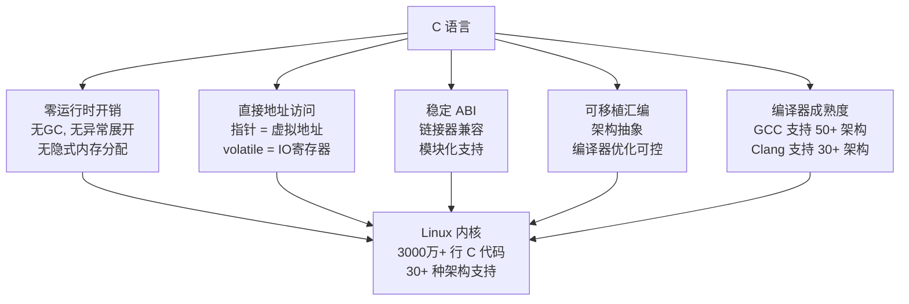
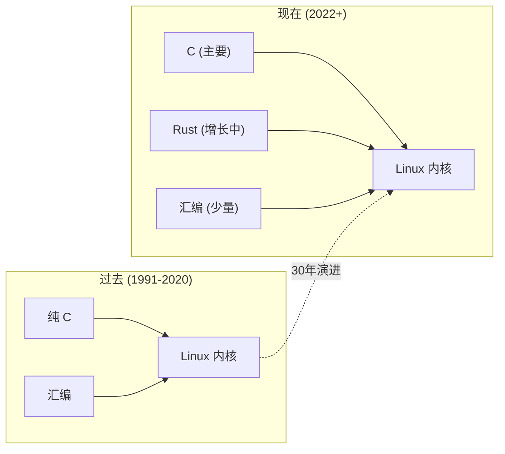
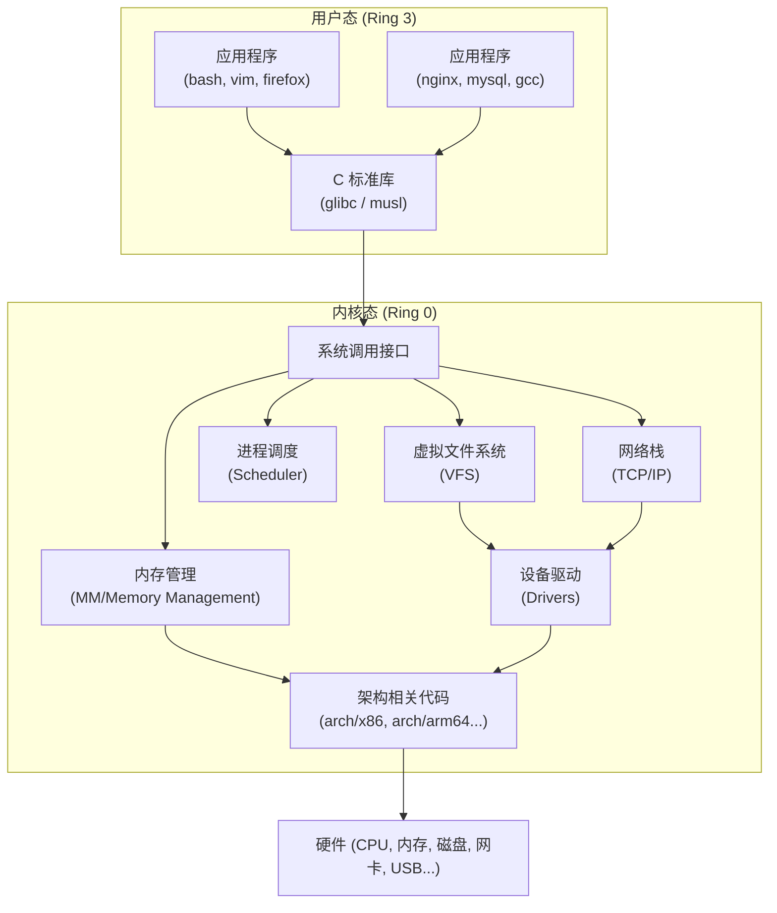
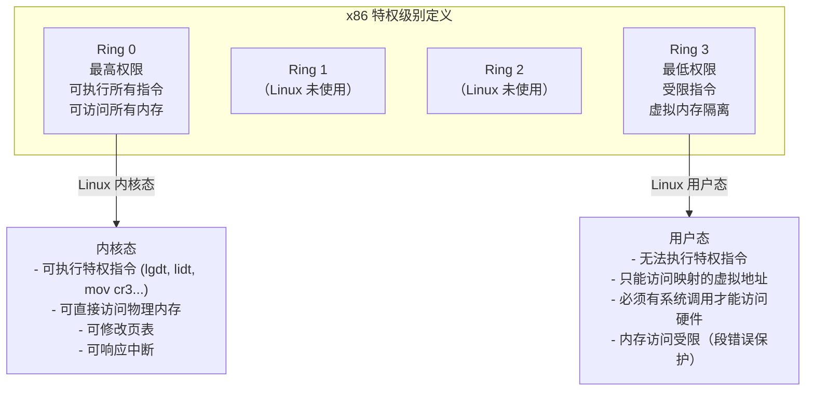
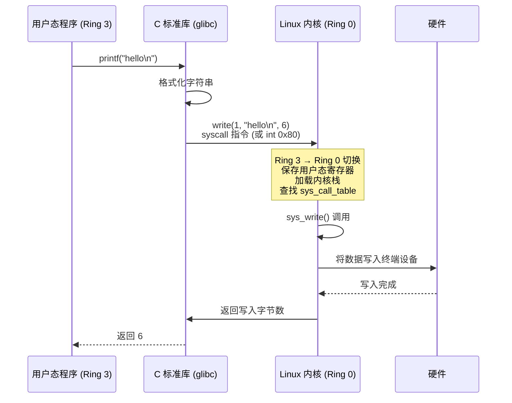
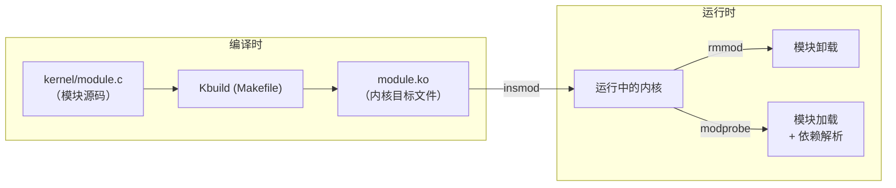

# C语言与操作系统  (C Language and Operating Systems)
---

##  章节概述

>  **本章是第四部分"内核"的入口**。前三部分（[[../../c语言教程/1入门/01_环境配置|1入门]] → [[../../c语言教程/2深化/01_指针深度剖析|2深化]] → [[../../c语言教程/3数据结构/01_动态数组|3数据结构]]）为你打下了坚实的 C 语言基础。现在，我们将进入 C 语言最辉煌的战场——Linux 内核。在写第一行内核代码之前，你需要先理解：为什么是 C？内核是什么？内核态和用户态的区别是什么？

Linux 内核是世界上最大的 C 语言项目（超过 3000 万行代码）。它运行在全球数十亿台设备上——从超级计算机到手机，从路由器到嵌入式传感器。理解为什么内核选择 C，以及 C 语言如何承载如此复杂的系统，是成为系统级工程师的第一步。

本章内容：
- **C 语言的历史地位**：为什么内核用 C 而不是 C++、Rust 或汇编
- **操作系统架构概览**：内核在系统中的位置和职责
- **内核态与用户态**：权限级别、上下文切换、系统调用
- **开发环境搭建**：下载内核源码、交叉编译、QEMU 调试
- **第一个内核模块**：从 hello world 开始触摸内核
- **GNU C 扩展**：内核中使用的非标准 C 特性

**前置要求**：
- 已学完 [[../../c语言教程/2深化/02_内存模型与布局|内存模型与布局]]（理解虚拟地址空间）
- 已学完 [[../../c语言教程/2深化/05_位运算与硬件操作|位运算与硬件操作]]（理解位操作和 volatile）
- 已学完 [[../../c语言教程/2深化/06_编译链接与ELF|编译链接与ELF]]（理解编译和链接过程）
- 建议同时阅读 [[../../汇编基础/ASM_02_栈与调用约定|ASM: 系统调用]]（理解用户态到内核态的切换）

---
###  第一节：为什么 Linux 内核用 C 语言编写
---

### 1.1 历史的选择：从汇编到 C

Linux 内核诞生于 1991 年。当时，Unix 已经在 1973 年被 Dennis Ritchie 用 C 语言重写。Linus Torvalds 在 comp.os.minix 新闻组发布的第一条消息中写道：

> "I'm doing a (free) operating system (just a hobby, won't be big and professional like gnu) for 386(486) AT clones."

他选择 C 语言是必然的：
1. **Unix 传统**：Unix 已经是 C 语言的标志性项目。K&R C（《The C Programming Language》）定义了系统编程的标准范式。
2. **编译器支持**：GCC（GNU C Compiler）已经成熟，且是自由软件。
3. **C 与硬件的天然亲近**：C 语言被称为"可移植的汇编语言"（portable assembly），它允许直接操作内存地址、使用指针与硬件寄存器交互，同时由编译器负责寄存器分配和指令选择。

```c
// C 语言的"可移植汇编"特质示例
// 这段代码在不同架构上编译出不同的指令序列，但语义完全相同

// x86-64 上: movl $0xDEAD, (%rax)
// ARM64 上:  mov w0, #0xDEAD; str w0, [x1]
// RISC-V 上: li a0, 0xDEAD; sw a0, 0(a1)
void write_register(volatile unsigned int *reg) {
    *reg = 0xDEAD;
}
```

### 1.2 C 语言在系统编程中的不可替代性

让我们从几个维度分析为什么 C 语言至今仍是内核编程的首选：

**维度一：零运行时开销（Zero-cost Abstraction）**

```c
// C 语言没有：
// - 异常处理（try/catch）—— 不允许内核中有不可控的栈展开
// - RTTI（运行时类型识别）—— 内核不需要动态类型信息
// - 构造函数/析构函数自动调用 —— 内核需要精确控制初始化顺序
// - 虚函数表自动生成 —— 虽然内核用结构体函数指针实现了"手工多态"

// 每一条 C 语句都对应可预测的汇编指令
int abs_val(int x) {
    return (x < 0) ? -x : x;  // 编译为 cmov 或分支，无任何隐藏开销
}
```

**维度二：直接内存访问**

内核需要管理物理内存、配置 MMU、建立页表。这些操作要求语言能够直接操作任意内存地址：

```c
// 内核中设置页表项（简化示例）
// 这需要直接写入物理地址 —— Java/Python/Go 都无法做到
static inline void set_pte(pte_t *ptep, pte_t pte) {
    // WRITE_ONCE 防止编译器优化掉这次写入
    WRITE_ONCE(*ptep, pte);
    // 在 x86 上这会编译为 mov %rsi, (%rdi)
}
```

**维度三：ABI 稳定性**

C 语言的 ABI（Application Binary Interface）在每种平台上高度稳定。.c 文件编译为 .o 文件后，只要函数签名不变，不同版本编译出的目标文件可以互相链接。这使得内核模块（LKM）可以在不同内核版本间保持兼容（需要重新编译，但不需要修改代码）。

**C 语言不可替代性总结（mermaid 图）：**



### 1.3 C++ 和 Rust 为什么没有取代 C

**C++ 的困境**：
- Linus Torvalds 在 2007 年的一封著名邮件中解释了内核不使用 C++ 的原因：C++ 的异常、模板膨胀、隐式内存分配与内核编程的哲学相悖
- C++ 的 STL 使用异常和动态内存分配，不适合内核环境
- 但 C++ 的某些模式（面向对象、RAII）被"手工翻译"成 C 语言模式在内核中使用

**Rust 的崛起与定位**：
- Linux 6.1（2022 年 12 月）正式合入 Rust 支持——这是内核史上最具里程碑意义的合并之一
- Rust 解决的是 C 语言最大的痛点：**内存安全**。根据 Google 和 Microsoft 的统计，约 70% 的严重安全漏洞源于内存问题（UAF、缓冲区溢出、未初始化读取）
- 但 Rust 不取代 C，而是与 C 共存：详见 Linux 内核 Rust 基础设施相关文档
- Rust 编译器对不安全操作的显式标注（unsafe {}）使得代码审查更聚焦
- C 语言仍然是内核的主要语言，Rust 从新驱动开始逐步渗透

>  **核心观点**：C 和 Rust 不是敌人。C 是系统编程的"通用语"（lingua franca），Rust 是在其肩膀上构建的安全增强层。理解 C 语言的内核编程模式，才能理解 Rust 在内核中的设计为什么是这样。



---
###  第二节：操作系统架构与内核
---

### 2.1 内核在系统中的位置

操作系统是硬件和应用程序之间的中间层。内核（Kernel）是操作系统的核心，运行在最高特权级别（Ring 0）。



**内核的五大核心子系统**：
| 子系统 | 内核目录 | 职责 |
|--------|---------|------|
| 进程管理 | `kernel/` | 进程创建/销毁、调度、信号 |
| 内存管理 | `mm/` | 虚拟内存、页表、分配器 |
| 文件系统 | `fs/` | VFS、具体文件系统驱动 |
| 网络栈 | `net/` | 协议栈、socket |
| 设备驱动 | `drivers/` | 硬件抽象、字符/块/网络设备 |

### 2.2 x86 特权级别：Ring 0 ~ Ring 3

x86 架构定义了 4 个特权级别（Rings），但 Linux 只使用两个：



**特权指令示例**：

```c
// 以下操作只能在 Ring 0（内核态）执行
// 用户态程序尝试执行会导致 General Protection Fault (#GP)

// 1. 设置 CR3 寄存器（切换页表）
//    mov %rax, %cr3   ← 特权指令

// 2. 启用/禁用中断
//    cli / sti        ← 特权指令

// 3. 读写 MSR（Model Specific Register）
//    rdmsr / wrmsr    ← 特权指令

// 4. I/O 端口访问（可配置为 Ring 3 也能执行）
//    in / out         ← IOPL 控制
```

### 2.3 系统调用：用户态与内核态的桥梁

用户程序如何请求内核服务？通过**系统调用**（system call）。这是跨越 Ring 3 到 Ring 0 的唯一方式。



**系统调用全过程（汇编视角）**：

```c
// 用户态 C 代码
#include <unistd.h>
int main(void) {
    write(1, "Hello", 5);
    return 0;
}

// 编译后，write() 在 glibc 中的实现大致等价于：
//
// mov    $1, %rax        # 系统调用号: 1 = __NR_write
// mov    $1, %rdi        # 参数1: fd = stdout
// mov    $0x401000, %rsi # 参数2: buf = "Hello"的地址
// mov    $5, %rdx        # 参数3: count = 5
// syscall                # 进入内核
//
// syscall 指令执行后:
//   1. CPU 从 IA32_LSTAR MSR 加载内核入口地址
//   2. 切换 CS 选择子 → Ring 0
//   3. 将用户 RFLAGS 保存到 R11
//   4. 将用户 RIP 保存到 RCX
//   5. 跳转到 entry_SYSCALL_64 (arch/x86/entry/entry_64.S)
```

>  关于系统调用的汇编层细节，详见 [[../../汇编基础/ASM_02_栈与调用约定|ASM: 系统调用]]。本章第三部分将有更深入的追踪。

```c
// 练习 1: 使用 strace 跟踪系统调用
// 在终端执行:
//   strace ls
//   strace -c ls      (统计各系统调用次数)
//   strace -e write ls (只看 write 系统调用)
//
// 你会发现一个简单的 ls 命令也会触发数十个系统调用:
// execve, brk, mmap, access, openat, fstat, read, write, close...
```

---
###  第三节：搭建 Linux 内核开发环境
---

### 3.1 获取内核源码

```bash
# 方法 1: 从 kernel.org 下载（推荐新手）
wget https://cdn.kernel.org/pub/linux/kernel/v6.x/linux-6.6.tar.xz
tar xf linux-6.6.tar.xz
cd linux-6.6

# 方法 2: 从 GitHub 镜像克隆（方便浏览历史）
git clone --depth=1 https://github.com/torvalds/linux.git
# 或用国内镜像:
git clone --depth=1 https://git.kernel.org/pub/scm/linux/kernel/git/torvalds/linux.git

# 方法 3: 发行版的内核源码
# Ubuntu/Debian:
apt-get source linux-image-$(uname -r)
```

### 3.2 内核源码目录初览

```
linux/
├── arch/           # 架构相关代码（x86, arm64, riscv, mips...）
│   └── x86/        #   ├── boot/    (启动代码)
│                   #   ├── kernel/  (架构特定内核代码)
│                   #   ├── mm/      (页表/TLB 管理)
│                   #   └── entry/   (系统调用入口)
├── block/          # 块设备层
├── crypto/         # 加密 API
├── Documentation/  # 内核文档（极其重要！）
├── drivers/        # 设备驱动（内核最大的目录，占约 60% 代码量）
├── fs/             # 文件系统（VFS, ext4, btrfs, nfs...）
├── include/        # 内核头文件
│   └── linux/      #   通用内核头文件
├── init/           # 初始化代码（start_kernel() 在这里）
├── ipc/            # 进程间通信（信号量、消息队列、共享内存）
├── kernel/         # 核心内核（调度器、信号、cgroup...）
├── lib/            # 内核库函数（字符串、位图、红黑树...）
├── mm/             # 内存管理（伙伴系统、slab、页面回收...）
├── net/            # 网络栈
├── scripts/        # 构建脚本
├── security/       # 安全模块（SELinux, AppArmor...）
├── sound/          # 音频子系统（ALSA）
├── tools/          # 用户态工具（perf, objtool...）
└── usr/            # initramfs 生成
```

### 3.3 配置与编译最小化内核

```bash
# 1. 生成默认配置（推荐使用当前运行系统的配置作为起点）
# 如果你在虚拟机中：make defconfig 生成最小配置
make defconfig

# 或者复制当前系统的配置（如果可用）
# zcat /proc/config.gz > .config
# make olddefconfig

# 2. 进一步裁剪（可选，减小编译时间）
make menuconfig    # 基于 ncurses 的图形配置界面
# 在 menuconfig 中：
#   - 禁用不需要的驱动（Device Drivers → 只保留关键驱动）
#   - 启用内核模块支持 (Enable loadable module support)
#   - 启用调试信息 (Kernel hacking → Compile-time checks and compiler options → Compile the kernel with debug info)

# 3. 编译
make -j$(nproc)    # -j$(nproc) 使用所有 CPU 核心并行编译

# 编译产物：
#   vmlinux        - 未压缩的内核 ELF 可执行文件（可用于 gdb 调试）
#   arch/x86/boot/bzImage - 压缩后的可引导内核镜像
#   System.map     - 内核符号表（所有导出符号的地址映射）
#   *.ko           - 内核模块

# 4. 安装（在本地系统上，慎用！建议在 VM 或容器中）
# make modules_install
# make install

# 5. 使用 QEMU 测试（推荐方式）
qemu-system-x86_64 \
    -kernel arch/x86/boot/bzImage \
    -initrd /boot/initrd.img-$(uname -r) \
    -append "console=ttyS0 nokaslr" \
    -nographic
```

### 3.4 使用 GDB 调试内核

```bash
# 1. 用 QEMU 启动，开启 GDB stub
qemu-system-x86_64 \
    -kernel arch/x86/boot/bzImage \
    -s -S \                    # -s: 在 :1234 端口开启 gdb server
                               # -S: 启动时暂停 CPU
    -nographic

# 2. 另一个终端中连接 GDB
gdb vmlinux                    # vmlinux 包含所有调试符号
(gdb) target remote :1234
(gdb) break start_kernel
(gdb) continue
(gdb) info registers
(gdb) list
```

---
###  第四节：第一个内核模块（Hello World LKM）
---

### 4.1 什么是内核模块

LKM（Loadable Kernel Module）是可以在运行时动态加载到内核中的代码。它运行在内核态（Ring 0），可以访问内核的所有符号和函数。设备驱动通常以模块的形式存在。



### 4.2 编写第一个模块

```c
// ============================================
// 文件: hello_kernel.c
// 一个最简内核模块示例
// ============================================

#include <linux/module.h>    // MODULE_LICENSE, MODULE_AUTHOR 等宏
#include <linux/kernel.h>    // KERN_INFO, printk
#include <linux/init.h>      // __init, __exit 宏

// 模块许可证（GPL 才能访问内核 GPL-only 符号）
MODULE_LICENSE("GPL");
MODULE_AUTHOR("Your Name");
MODULE_DESCRIPTION("A simple Hello World kernel module");
MODULE_VERSION("0.1");

/*
 * 模块初始化函数
 * 当执行 insmod hello_kernel.ko 时被调用
 *
 * __init 宏: 告诉编译器此函数只在初始化时使用
 *   函数代码被放在 .init.text 段
 *   初始化完成后内核可释放此段内存（free_initmem()）
 */
static int __init hello_init(void)
{
    /*
     * printk 是内核的"printf"
     *
     * 与 printf 的区别:
     *   1. 没有 C 标准库 —— printk 由内核自身实现（kernel/printk/printk.c）
     *   2. 日志级别前缀：KERN_EMERG, KERN_ALERT, KERN_CRIT, KERN_ERR,
     *      KERN_WARNING, KERN_NOTICE, KERN_INFO, KERN_DEBUG
     *   3. 输出到内核环形缓冲区（dmesg 查看），也可配置输出到控制台
     *   4. 支持浮点吗？不支持！内核态一般不使用浮点运算
     *      （浮点需要保存 FPU 状态，在中断上下文中代价高昂）
     */
    printk(KERN_INFO "hello_kernel: Module loaded successfully\n");
    printk(KERN_INFO "hello_kernel: Current process: %s (pid: %d)\n",
           current->comm, current->pid);
    // current 是一个宏，指向当前进程的 task_struct
    // 这是内核中最重要的全局"变量"之一

    return 0;  // 返回 0 表示成功，负数表示错误码（-ENOMEM 等）
}

/*
 * 模块清理函数
 * 当执行 rmmod hello_kernel 时被调用
 *
 * __exit 宏: 如果是静态编译的内核（非模块），此段可以被丢弃
 */
static void __exit hello_exit(void)
{
    printk(KERN_INFO "hello_kernel: Module unloaded. Goodbye!\n");
}

// 注册初始化和清理函数
module_init(hello_init);
module_exit(hello_exit);
```

### 4.3 编写 Makefile

```makefile
# ============================================
# 文件: Makefile
# 内核模块的 Makefile 与用户态 Makefile 完全不同
# 它使用内核构建系统 (Kbuild)
# ============================================

# 目标模块名（不含 .ko 后缀）
obj-m := hello_kernel.o

# 内核源码目录（根据你的系统调整）
# 常见路径:
#   /lib/modules/$(shell uname -r)/build   (当前运行内核)
#   /home/user/linux-6.6/                   (自己编译的内核)
KERNEL_DIR := /lib/modules/$(shell uname -r)/build

# 当前目录
PWD := $(shell pwd)

# 默认目标
all:
	$(MAKE) -C $(KERNEL_DIR) M=$(PWD) modules
	# -C: 切换到内核源码目录
	# M=: 告诉 Kbuild 模块源码在哪里
	# modules: 只编译模块（不编译整个内核）

# 清理编译产物
clean:
	$(MAKE) -C $(KERNEL_DIR) M=$(PWD) clean

# 可选：显示模块信息
info:
	modinfo hello_kernel.ko

# 编译并加载（需要 root 权限）
load: all
	sudo insmod hello_kernel.ko
	dmesg | tail -5

# 卸载模块
unload:
	sudo rmmod hello_kernel
	dmesg | tail -5

# 显示内核消息
log:
	dmesg | tail -20
```

### 4.4 加载和测试

```bash
# 1. 编译模块
make

# 2. 查看模块信息
modinfo hello_kernel.ko
# 输出:
#   filename:       /path/to/hello_kernel.ko
#   version:        0.1
#   license:        GPL
#   description:    A simple Hello World kernel module
#   author:         Your Name
#   vermagic:       6.5.0-14-generic SMP preempt mod_unload

# 3. 加载模块（需要 root）
sudo insmod hello_kernel.ko
# 或使用 modprobe（自动处理依赖）:
# sudo modprobe hello_kernel

# 4. 查看内核日志
dmesg | tail
# 输出:
#   [ 1234.567890] hello_kernel: Module loaded successfully
#   [ 1234.567891] hello_kernel: Current process: insmod (pid: 5678)

# 5. 查看已加载的模块
lsmod | grep hello_kernel
# 或查看 /proc/modules
cat /proc/modules | grep hello

# 6. 卸载模块
sudo rmmod hello_kernel
dmesg | tail
# 输出:
#   [ 1290.123456] hello_kernel: Module unloaded. Goodbye!
```

### 4.5 模块的 ELF 结构

```bash
# 查看模块的段信息
objdump -h hello_kernel.ko

# 典型输出:
#   .text         代码段（你的函数）
#   .init.text    初始化代码（hello_init）
#   .exit.text    退出代码（hello_exit）
#   .rodata.str1.1 只读字符串
#   .modinfo      模块元信息（许可证、作者等）
#   __versions    内核版本校验信息（防止 ABI 不兼容）

# 查看模块符号
nm hello_kernel.ko
# U printk            ← 未定义符号，由内核在加载时解析
# T init_module       ← module_init 生成的别名
# T cleanup_module    ← module_exit 生成的别名
```

>  关于 ELF 格式的深入讲解，参见 [[../../c语言教程/2深化/06_编译链接与ELF|编译链接与ELF]]。

```c
// 练习 2: 增强模块信息
// 修改 hello_kernel.c，添加：
// 1. 输出当前内核版本号（使用 UTS_RELEASE 宏 或 utsname()）
// 2. 输出当前 jiffies 值（内核的"心跳"计数器）
// 3. 统计模块被加载的次数（使用静态变量 —— 思考：卸载后再加载会累加吗？）

// 提示: #include <linux/utsname.h>
//       #include <linux/jiffies.h>
//       使用 utsname()->release 获取版本字符串
```

---
###  第五节：GNU C 扩展 —— 内核中常用的非标准 C
---

内核代码不是标准 C（C89/C99/C11），而是 **GNU C**（GCC 扩展）。以下扩展在内核中随处可见。理解它们对于阅读内核源码至关重要。

### 5.1 `__attribute__` 机制

`__attribute__` 是 GCC 的扩展语法，用于给函数、变量、类型附加元信息。内核定义了一系列便捷宏来封装 `__attribute__`：

```c
// ============================================
// 内核中常见的 __attribute__ 用法
// ============================================

// 1. __init / __exit —— 将函数放到特定代码段
//    定义在 include/linux/init.h
//    #define __init  __section(".init.text")
//    #define __exit  __section(".exit.text")
static int __init my_init(void) { return 0; }  // 放到 .init.text 段

// 2. __user —— 标记用户空间指针（Sparse 静态检查用）
//    #define __user  __attribute__((noderef, address_space(1)))
//    编译器不会检查，但 Sparse 工具会验证
int copy_from_user(void *to, const void __user *from, unsigned long n);

// 3. __maybe_unused —— 可能用不到的变量/函数，禁止编译器警告
//    #define __maybe_unused  __attribute__((unused))
static int __maybe_unused debug_level = 3;

// 4. __printf —— 告诉编译器此函数的参数是 printf 风格
//    GCC 可以据此检查格式字符串和参数类型是否匹配
//    __attribute__((format(printf, fmt_argno, first_check_argno)))
//    #define __printf(a, b)  __attribute__((format(printf, a, b)))
extern int printk(const char *fmt, ...)
    __printf(1, 2);  // 第1个参数(fmt)是格式串，从第2个参数开始检查

// 5. __aligned —— 对齐要求
//    #define __aligned(x)  __attribute__((aligned(x)))
struct my_struct {
    char c;
    int x __attribute__((aligned(64)));  // 64字节对齐（缓存行对齐）
};

// 6. __packed —— 紧凑模式，取消对齐填充
struct __attribute__((__packed__)) network_packet {
    uint8_t  version;      // 1 byte
    uint16_t length;       // 2 bytes (不填充到4)
    uint32_t sequence;     // 4 bytes
}; // sizeof = 7, 而非通常的 8

// 7. likely / unlikely —— 分支预测提示
//    #define likely(x)   __builtin_expect(!!(x), 1)
//    #define unlikely(x) __builtin_expect(!!(x), 0)
//    告诉编译器哪个分支更可能发生，优化代码布局
if (unlikely(ptr == NULL)) {
    return -ENOMEM;  // 不会发生的错误路径放在函数尾部
}
if (likely(count > 0)) {
    // 正常路径，CPU 会预测这个分支
    process_data(data, count);
}
```

### 5.2 `__builtin_*` 内建函数

GCC 提供了一系列内建函数，编译器直接将其替换为高效指令序列：

```c
// ============================================
// 内核中常用的 __builtin_* 函数
// ============================================

// 1. __builtin_constant_p(expr)
//    如果 expr 是编译时常量，返回 1；否则返回 0
//    用于编译时优化——对常量选择特定实现路径
#define min(x, y) ({                            \
    typeof(x) _min1 = (x);                      \
    typeof(y) _min2 = (y);                      \
    (void)(&_min1 == &_min2);  /* 类型安全检查 */ \
    _min1 < _min2 ? _min1 : _min2; })
// 如果 x 和 y 是编译时常量，编译器可以用更高效的指令

// 2. __builtin_clz / __builtin_ctz / __builtin_popcount
//    计算前导零 / 后缀零 / 二进制中 1 的个数
//    编译为: bsr (x86) 或 clz (ARM) 单条指令
static inline int ilog2(unsigned long n) {
    return 8 * sizeof(n) - __builtin_clzl(n) - 1;
}

// 3. __builtin_offsetof —— 结构体成员偏移
//    #define offsetof(TYPE, MEMBER) __builtin_offsetof(TYPE, MEMBER)
//    offsetof(struct task_struct, pid)  → 该成员的字节偏移
//    与 container_of 配合使用，是内核链表的基石
//    详见: [[../../c语言教程/3数据结构/02_链表|内核链表]] 和 [[07_Linux内核源码导读|内核源码导读]]

// 4. __builtin_types_compatible_p —— 检查两个类型是否兼容
//    typeof 的同类型安全检查（_Generic 的底层基础）

// 5. __builtin_choose_expr —— 编译时条件选择（类似三目运算符但更严格）
```

### 5.3 内联汇编（Inline Assembly）

虽然我们尽量用 C 语言，但某些操作必须用汇编指令。GCC 的内联汇编语法如下：

```c
/*
 * 内联汇编基本语法:
 *
 * asm [volatile] (
 *     汇编模板
 *     : 输出操作数列表 (可空)
 *     : 输入操作数列表 (可空)
 *     : 被破坏的寄存器列表 (clobber list)
 * );
 */

// 示例 1: 简单的 NOP 指令
static inline void cpu_relax(void) {
    asm volatile("rep; nop" ::: "memory");
    // rep; nop = pause 指令，用于自旋等待（降低功耗）
    // "memory" clobber 告诉编译器内存可能被修改
}

// 示例 2: 读取 MSR（Model Specific Register）
static inline unsigned long long native_read_msr(unsigned int msr) {
    unsigned long long val;
    asm volatile("rdmsr" : "=A"(val) : "c"(msr));
    // rdmsr: 从 MSR 读取
    // ecx = MSR 编号
    // edx:eax = 返回值
    // "=A": 表示 eax 和 edx 联合到 val (仅在32位下有效)
    return val;
}

// 示例 3: WRITE_ONCE —— 防止编译器优化掉内存写入
//    定义在 include/linux/compiler.h
static __always_inline void __write_once_size(volatile void *p,
                                               void *res, int size) {
    switch (size) {
    case 1: *(volatile __u8 *)p = *(__u8 *)res; break;
    case 2: *(volatile __u16 *)p = *(__u16 *)res; break;
    case 4: *(volatile __u32 *)p = *(__u32 *)res; break;
    case 8: *(volatile __u64 *)p = *(__u64 *)res; break;
    default:
        barrier();  // 编译器屏障
        __builtin_memcpy((void *)p, (const void *)res, size);
        barrier();
    }
}
#define WRITE_ONCE(x, val) \
({                        \
    union { typeof(x) __val; char __c[1]; } __u =  \
        { .__val = (val) };                       \
    __write_once_size(&(x), __u.__c, sizeof(x));  \
    __u.__val;                                    \
})

// 示例 4: 内存屏障
// mb() - 全内存屏障 (mfence / dmb)
// rmb() - 读内存屏障
// wmb() - 写内存屏障
#define mb()  asm volatile("mfence":::"memory")
#define rmb() asm volatile("lfence":::"memory")
#define wmb() asm volatile("sfence":::"memory")
// 在 ARM64 上编译为 dmb ish / dmb ishld / dmb ishst
```

### 5.4 语句表达式（Statement Expressions）

```c
// ({ ... }) 是 GCC 扩展，允许在宏定义中使用复合语句并返回值
// 这使得宏可以像函数一样使用，同时保持类型安全

// 经典示例: min/max 宏的安全实现
#define max(a, b) ({                    \
    typeof(a) _a = (a);                 \
    typeof(b) _b = (b);                 \
    _a > _b ? _a : _b;                  \
})

// 使用示例: max(a++, b) 不会导致 a 被求值两次
// 因为 _a = (a) 只求值一次（相比 #define max(a,b) ((a)>(b)?(a):(b))）

// 另一个经典示例：container_of 宏（详见第7章）
#define container_of(ptr, type, member) ({          \
    const typeof(((type *)0)->member) *__mptr = (ptr); \
    (type *)((char *)__mptr - offsetof(type, member)); })
```

### 5.5 `asm goto` —— 内联汇编中的跳转

```c
// asm goto 是 GCC 4.5+ 引入的扩展
// 允许内联汇编代码跳转到 C 语言标签
// 主要用于实现 likely/unlikely 和编译时指令调度

// 示例：简化的 arch_static_branch（内核静态分支优化）
// 定义在 include/linux/jump_label.h
//
// 静态分支是一种内核优化技术:
//   编译器生成一条 NOP 指令
//   运行时如果需要启用某个特性，将 NOP 替换为 JMP
//   几乎零开销的条件检查
```

```c
// 练习 3: GNU C 扩展实验
// 编写一个用户态 C 程序，测试以下 GCC 扩展:
// 1. 使用 __attribute__((constructor)) 在 main 前执行函数
// 2. 使用 typeof 实现类型安全的 swap 宏
// 3. 使用 __builtin_clz 计算一个数的二进制最高位位置
// 4. 使用 ({ }) 语句表达式实现一个可以打印变量名的 DEBUG_PRINT 宏

// 示例框架:
#include <stdio.h>

// 在 main() 之前自动执行
__attribute__((constructor))
static void before_main(void) {
    printf("Before main()! Kernel module uses this pattern.\n");
}

// typeof + 语句表达式 实现安全 swap
#define swap(a, b) ({                           \
    typeof(a) _tmp = (a);                       \
    (a) = (b);                                  \
    (b) = _tmp;                                 \
})

int main(void) {
    int x = 10, y = 20;
    swap(x, y);
    printf("x=%d, y=%d\n", x, y);  // x=20, y=10
    printf("msb of 256 = %d\n", 32 - __builtin_clz(256));
    return 0;
}
```

---
###  第六节：内核编程的基本约束
---

### 6.1 没有标准 C 库

内核中不能使用 `<stdio.h>`, `<stdlib.h>`, `<string.h>` 等标准库头文件。内核有自己的实现：

| 用户态 | 内核态 | 说明 |
|--------|--------|------|
| `printf()` | `printk()` | 带有日志级别的打印 |
| `malloc()` | `kmalloc()` / `vmalloc()` | 内核内存分配，指定标志(GFP_KERNEL 等) |
| `free()` | `kfree()` / `vfree()` | 分别对应 kmalloc/vmalloc |
| `memcpy()` | `memcpy()` | 内核有自己的实现（lib/string.c） |
| `memset()` | `memset()` | 同上 |
| `strlen()` | `strlen()` | 同上 |
| `sprintf()` | `sprintf()` | 同上（lib/vsprintf.c） |
| `atoi()` | `simple_strtol()` | 内核版本 |
| `exit()` | `do_exit()` | 终止当前进程（不是程序退出） |

### 6.2 不能使用浮点

```c
// 错误！内核态一般不能使用浮点运算
// float f = 3.14;  // 编译可能通过但行为未定义

// 原因:
// 1. 浮点寄存器（x87/XMM）的使用需要上下文切换时保存/恢复
// 2. 如果在内核代码中使用了浮点但没有保存 FPU 状态，
//    用户进程的浮点计算结果可能被破坏
// 3. 内核设计哲学：驱动程序不需要浮点运算

// 正确做法：使用定点数或整数运算替代
// 例如: 3.14 可以表示为 314/100 用整数运算
```

### 6.3 有限的栈空间

```c
// 内核栈通常只有 8KB 或 16KB（取决于配置）
// (x86-64: 16KB, 加上中断栈)

// 错误做法：在栈上分配大数组
// static void process_data(void) {
//     unsigned char buffer[64 * 1024];  // 64KB! 栈溢出!
//     ...
// }

// 正确做法：使用堆内存
static void process_data(void) {
    unsigned char *buffer = kmalloc(64 * 1024, GFP_KERNEL);
    if (!buffer)
        return;
    // ... 处理数据 ...
    kfree(buffer);
}
```

### 6.4 并发无处不在

```c
// 用户态程序通常是单线程的（除非显式创建线程）
// 内核代码几乎总是在并发环境中运行
// 你的模块可能同时在多个 CPU 核心上被执行
// 中断处理程序可能与你的代码并发运行

// 因此内核编程需要格外的并发安全意识
// 详见 [[06_并发与同步|并发与同步]]
```

---
##  章节测试
---

> [!question] 判断题 1
> Linux 内核完全使用标准 C（C89/C99）编写，不使用任何 GCC 扩展。 （ ）
> - [ ]  正确
> - [ ]  错误
>
> > [!success]- 点击查看答案
> > 答案: 错误
> >
> > **解析**: Linux 内核大量使用 GNU C 扩展，包括 `__attribute__`、`__builtin_*`、语句表达式 `({...})`、内联汇编、`typeof`、`asm goto` 等。标准 C 无法表达内核对硬件操作和编译优化的需求。

> [!question] 判断题 2
> 用户态程序可以直接访问物理内存地址。 （ ）
> - [ ]  正确
> - [ ]  错误
>
> > [!success]- 点击查看答案
> > 答案: 错误
> >
> > **解析**: 用户态程序运行在 Ring 3，只能访问通过 MMU 映射的虚拟地址空间。物理内存访问需要 Ring 0 特权级别（内核态），用户程序必须通过系统调用请求内核代为操作。

> [!question] 判断题 3
> syscall 指令执行后，CPU 自动从 Ring 3 切换到 Ring 0。 （ ）
> - [ ]  正确
> - [ ]  错误
>
> > [!success]- 点击查看答案
> > 答案: 正确
> >
> > **解析**: syscall（x86-64）或 sysenter（x86-32）指令会自动将特权级别从 Ring 3 提升到 Ring 0，同时跳转到内核预设的系统调用入口地址（entry_SYSCALL_64）。这是硬件保证的安全机制。

> [!question] 判断题 4
> 内核模块（LKM）运行在用户态，通过系统调用请求内核服务。 （ ）
> - [ ]  正确
> - [ ]  错误
>
> > [!success]- 点击查看答案
> > 答案: 错误
> >
> > **解析**: 内核模块直接运行在内核态（Ring 0），是内核的一部分。它可以调用内核中的任何非静态函数、访问内核数据结构，不需要通过系统调用。这正是 insmod/rmmod 需要 root 权限的原因。

> [!question] 判断题 5
> 内核态代码可以安全地使用 printf() 函数输出调试信息。 （ ）
> - [ ]  正确
> - [ ]  错误
>
> > [!success]- 点击查看答案
> > 答案: 错误
> >
> > **解析**: 内核中不能使用标准 C 库函数。应该使用 `printk()`，它是内核自己实现的日志函数，输出到内核环形缓冲区（通过 `dmesg` 查看）。printk 还支持日志级别前缀（KERN_ERR, KERN_INFO 等）。

> [!question] 判断题 6
> 内核中使用浮点运算是安全的，编译器会自动保存和恢复 FPU 上下文。 （ ）
> - [ ]  正确
> - [ ]  错误
> >
> > > [!success]- 点击查看答案
> > > 答案: 错误
> > > 
> > > **解析**: 内核一般禁用浮点运算。浮点寄存器（x87/XMM/XMM）的保存和恢复需要在上下文切换时处理。如果内核代码使用浮点而没有显式保存/恢复 FPU 上下文，可能破坏用户进程的浮点状态。需要使用 `kernel_fpu_begin()/kernel_fpu_end()` 包裹浮点操作。

> [!question] 判断题 7
> 内核模块加载后可以通过 `lsmod` 命令查看。 （ ）
> - [ ]  正确
> - [ ]  错误
> >
> > > [!success]- 点击查看答案
> > > 答案: 正确
> > > 
> > > **解析**: `lsmod` 读取 `/proc/modules` 文件，列出当前所有已加载的内核模块及其信息（名称、大小、被引用次数、依赖模块）。

> [!question] 判断题 8
> `__attribute__((aligned(64)))` 是标准 C 的一部分，在 C11 标准中定义。 （ ）
> - [ ]  正确
> - [ ]  错误
> >
> > > [!success]- 点击查看答案
> > > 答案: 错误
> > > 
> > > **解析**: `__attribute__` 是 GCC 扩展，不是标准 C。标准 C11 中的对应功能是 `_Alignas` 关键字，但 Linux 内核不依赖 C11 标准，而是继续使用 GCC 的 `__attribute__` 扩展语法。

> [!question] 判断题 9
> Rust 自 Linux 6.1 起正式支持内核模块开发，用于替代 C 语言。 （ ）
> - [ ]  正确
> - [ ]  错误
> >
> > > [!success]- 点击查看答案
> > > 答案: 错误
> > > 
> > > **解析**: Linux 6.1 合入了 Rust 支持，但它是作为 C 语言的**补充**而不是替代。Rust 主要用于编写新的设备驱动，利用其内存安全特性减少漏洞，而 C 仍然是内核的主要语言。两者通过 C ABI 互操作。

> [!question] 判断题 10
> 内核模块的 `module_init()` 函数在模块加载时被调用，`module_exit()` 在卸载时被调用。 （ ）
> - [ ]  正确
> - [ ]  错误
> >
> > > [!success]- 点击查看答案
> > > 答案: 正确
> > > 
> > > **解析**: `module_init(fn)` 生成一个名为 `init_module` 的别名，内核在加载模块时通过此符号找到初始化函数。`module_exit(fn)` 生成 `cleanup_module` 别名，用于模块卸载时的清理。

---

> [!question] 选择题 1
> 以下哪项不是 Linux 选择 C 语言作为内核主要语言的原因？
> - [ ] A. C 语言编译后无运行时开销（无 GC、无异常展开、无隐式内存分配）
> - [ ] B. C 语言有 ABI 稳定性，不同版本编译的目标文件可以链接
> - [ ] C. C 语言的 RAII 和智能指针机制适合资源管理
> - [ ] D. C 语言允许直接操作内存地址和硬件寄存器
>
> > [!success]- 点击查看答案
> > 正确答案: C
> >
> > **解析**: RAII（Resource Acquisition Is Initialization）和智能指针是 C++ 的特性，不是 C 语言的特性。C 语言需要手动管理资源（malloc/free），这也是 Rust 设计者认为 C 语言需要改进的地方。选项 A、B、D 都是 C 语言在系统级编程中的核心优势。

> [!question] 选择题 2
> x86-64 Linux 中，系统调用使用哪条指令？
> - [ ] A. `int 0x80`
> - [ ] B. `sysenter`
> - [ ] C. `syscall`
> - [ ] D. `call gate`
>
> > [!success]- 点击查看答案
> > 正确答案: C
> >
> > **解析**: x86-64 Linux 使用 `syscall` 指令进行系统调用。`int 0x80` 是老的 x86-32 系统调用方式（速度较慢）。`sysenter` 是 Intel 在 32 位模式下的快速系统调用方案。`call gate` 是一种更老的机制，Linux 不使用。

> [!question] 选择题 3
> 以下哪个宏用于告诉 GCC 某个分支更可能发生？
> - [ ] A. `__builtin_expect(x, 0)`
> - [ ] B. `likely(x)`
> - [ ] C. `__attribute__((hot))`
> - [ ] D. `__section(".fast")`
>
> > [!success]- 点击查看答案
> > 正确答案: B
> >
> > **解析**: `likely(x)` 和 `unlikely(x)` 是 Linux 内核定义的宏，底层使用 `__builtin_expect(!!(x), 1)` 和 `__builtin_expect(!!(x), 0)`。它们告诉编译器对分支概率进行优化，将更常见的分支放在直行路径上。选项 C 的 `__attribute__((hot))` 用于标记频繁调用的函数。

> [!question] 选择题 4
> `container_of(ptr, type, member)` 宏的作用是什么？
> - [ ] A. 检查一个指针是否在指定的内存区间内
> - [ ] B. 通过结构体成员的指针反推出包含该成员的结构体的指针
> - [ ] C. 将一块内存转换为指定类型
> - [ ] D. 计算结构体成员相对于结构体起始地址的偏移量
>
> > [!success]- 点击查看答案
> > 正确答案: B
> >
> > **解析**: `container_of` 是 Linux 内核中最重要的宏之一。给定一个成员的指针、结构体类型和成员名，它可以计算出包含该成员的结构体的地址。这是内核链表实现的基础。详见 [[../../c语言教程/2深化/07_面向对象C编程|面向对象C编程]] 和 [[07_Linux内核源码导读|内核源码导读]]。

> [!question] 选择题 5
> 内核模块的 Makefile 中 `obj-m := hello_kernel.o` 的含义是？
> - [ ] A. 将 hello_kernel.o 作为目标文件（object）编译
> - [ ] B. 将 hello_kernel.o 作为内核模块（module）目标（不是直接链接进内核，而是生成 .ko）
> - [ ] C. 将 hello_kernel.o 标记为多线程编译
> - [ ] D. 将 hello_kernel.o 的所有依赖标记为必须模块
>
> > [!success]- 点击查看答案
> > 正确答案: B
> >
> > **解析**: 在 Kbuild 系统中，`obj-m` 表示编译为独立的可加载内核模块（生成 .ko 文件），`obj-y` 表示直接编译进内核镜像（vmlinux），`obj-n` 表示不编译。

> [!question] 选择题 6
> x86-64 Linux 使用多少个特权级别？
> - [ ] A. 1 个
> - [ ] B. 2 个（Ring 0 和 Ring 3）
> - [ ] C. 3 个（Ring 0, Ring 1, Ring 3）
> - [ ] D. 4 个（全部使用）
>
> > [!success]- 点击查看答案
> > 正确答案: B
> >
> > **解析**: 虽然 x86 架构定义了 4 个特权级别（Ring 0~3），但 Linux 只使用了 Ring 0（内核态）和 Ring 3（用户态）。Ring 1 和 Ring 2 未被使用。这种设计简化了 Linux 的可移植性——ARM 和 RISC-V 只有两个特权级别。

> [!question] 选择题 7
> 以下哪种情况会导致内核模块编译失败？
> - [ ] A. 在模块中使用 `printk`
> - [ ] B. 调用 `printf` 而不是 `printk`
> - [ ] C. 使用 `malloc` 而不是 `kmalloc`
> - [ ] D. B 和 C 都会导致编译失败
>
> > [!success]- 点击查看答案
> > 正确答案: D
> >
> > **解析**: 内核态不能使用用户空间的 C 标准库函数。`printf` 和 `malloc` 都是标准库函数，在内核模块中不可用（链接时会找不到符号）。应该使用内核提供的等价函数 `printk` 和 `kmalloc`。

> [!question] 选择题 8
> 以下关于 Rust 在 Linux 内核中角色的描述，哪个是正确的？
> - [ ] A. Rust 在 Linux 5.0 中就已合入，是内核的主要语言
> - [ ] B. Rust 被设计为替代所有 C 代码，内核将从 C 完全迁移到 Rust
> - [ ] C. Rust 自 Linux 6.1 合入，主要用于编写新的设备驱动，作为 C 的补充
> - [ ] D. Rust 在内核中只用于文档编写，不用于实际代码
>
> > [!success]- 点击查看答案
> > 正确答案: C
> >
> > **解析**: Linux 6.1（2022年12月）正式合入了 Rust 基础设施，允许用 Rust 编写内核模块。Rust 是 C 的补充而非替代——它主要用于编写新的设备驱动，利用其编译时内存安全检查减少 UAF 和缓冲区溢出漏洞。详见 Linux 内核 Rust 基础设施相关文档。

> [!question] 选择题 9
> `printk(KERN_ERR "error: %s\n", msg)` 中的 `KERN_ERR` 的作用是？
> - [ ] A. 指定此消息只输出到特定内核模块
> - [ ] B. 设置消息的日志级别（此例为错误级别）
> - [ ] C. 指示 printk 只输出到控制台而不写日志
> - [ ] D. 指定错误码转换格式
>
> > [!success]- 点击查看答案
> > 正确答案: B
> >
> > **解析**: `KERN_ERR` 是日志级别字符串前缀，定义在 `<linux/kern_levels.h>` 中。日志级别从高到低为：KERN_EMERG(0)、KERN_ALERT(1)、KERN_CRIT(2)、KERN_ERR(3)、KERN_WARNING(4)、KERN_NOTICE(5)、KERN_INFO(6)、KERN_DEBUG(7)。数字越小优先级越高。用户可以通过 `echo N > /proc/sys/kernel/printk` 配置控制台输出阈值。

> [!question] 选择题 10
> 内核模块加载后，其 .init.text 段中的函数会怎样？
> - [ ] A. 永远保留，随时可以调用
> - [ ] B. 只有 module_init 调用的函数才会保留
> - [ ] C. 初始化完成后，如果配置了 CONFIG_STRICT_MEMORY，内核可能释放 .init 段以节省内存
> - [ ] D. 每次此函数被调用时，内核会重新从磁盘加载到内存
>
> > [!success]- 点击查看答案
> > 正确答案: C
> >
> > **解析**: `__init` 修饰的函数放在 `.init.text` 段中。初始化完成后，内核调用 `free_initmem()` 释放 `.init` 段占用的内存。对于模块，如果模块没有被标记为"初始化后可释放"，则代码保留在内存中。但静态编译进内核的 `__init` 函数在启动完成后被释放。

---

### ️ 编程练习题

> [!example] 练习题 1：增强版内核模块（）
> **难度**: 
>
> 编写一个内核模块 `sysinfo_mod.c`，在加载时输出以下系统信息：
> 1. 当前内核版本（使用 `UTS_RELEASE` 或 `init_uts_ns.name.release`）
> 2. 当前进程名和 PID（使用 `current->comm` 和 `current->pid`）
> 3. 系统自启动以来的 jiffies 数
> 4. 当前在线 CPU 数量（使用 `num_online_cpus()`）
> 5. 统计此模块被加载的次数（思考：模块卸载后静态变量会丢失吗？为什么？）
>
> **要求**: 使用 `__init` 和 `__exit` 标记函数。编写 Makefile 和测试脚本。

> [!example] 练习题 2：用 strace 追踪系统调用（）
> **难度**: 
>
> 写出以下操作涉及的系统调用链：
> 1. `echo "hello" > /tmp/test.txt`
> 2. `cat /tmp/test.txt`
> 3. `ls -l /tmp`
>
> 使用 `strace -f -e trace=openat,write,read,close` 验证你的答案。写出每个命令对应的系统调用序列（调用号、参数含义）。

> [!example] 练习题 3：GNU C 扩展练习（）
> **难度**: 
>
> 编写用户态 C 程序，实现以下功能（使用 GNU C 扩展）：
> 1. 使用 `({...})` 语句表达式实现类型安全的 `max3(a, b, c)` 宏，返回三个数的最大值
> 2. 使用 `__attribute__((constructor))` 和 `__attribute__((destructor))` 在 main 前后执行函数
> 3. 使用 `__builtin_choose_expr` 配合 `__builtin_types_compatible_p` 实现编译时类型派发
> 4. 编译时使用 `gcc -S` 查看生成的汇编代码，理解每个扩展如何转化为 CPU 指令
>
> **提示**: `__builtin_choose_expr(cond, expr1, expr2)` 类似编译时的三目运算符，但要求 cond 必须是编译时常量。

***
##  知识网络
***

- **下一章**: [[02_进程与内存管理|进程与内存管理]]
- **返回**: [[../内核索引|返回总目录]]
- **相关**: [[../../c语言教程/2深化/02_内存模型与布局|内存模型与布局]] | [[../../c语言教程/2深化/05_位运算与硬件操作|位运算与硬件操作]] | [[../../c语言教程/2深化/06_编译链接与ELF|编译链接与ELF]]
- **汇编参考**: [[../../汇编基础/ASM_02_栈与调用约定|ASM: 系统调用]] | [[../../汇编基础/ASM_01_寄存器与指令基础|ASM: 体系结构与寄存器]]
- **内核源码**: 内核入口 `init/main.c:start_kernel()`
- **在线资源**: [kernel.org](https://www.kernel.org/) | [elixir.bootlin.com](https://elixir.bootlin.com/linux/latest/source)
