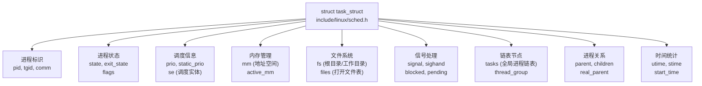
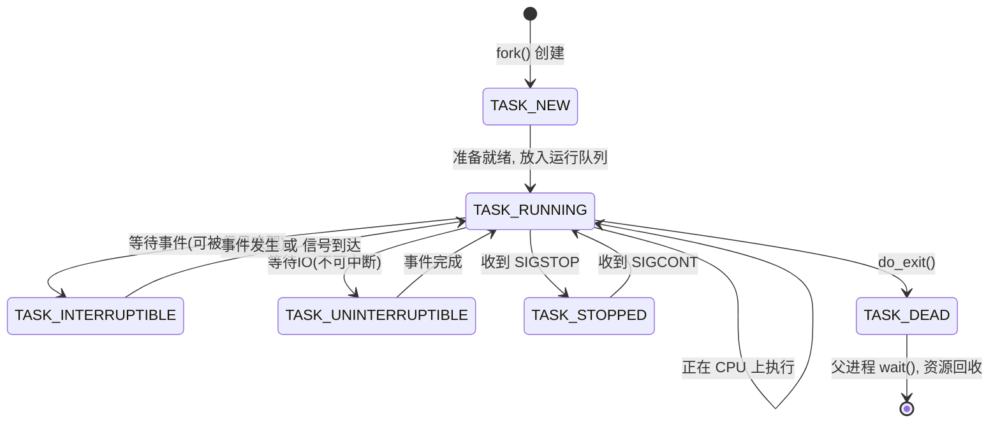
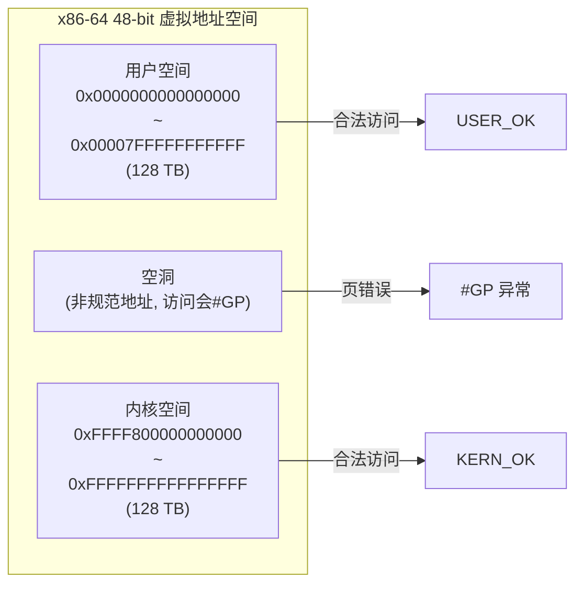
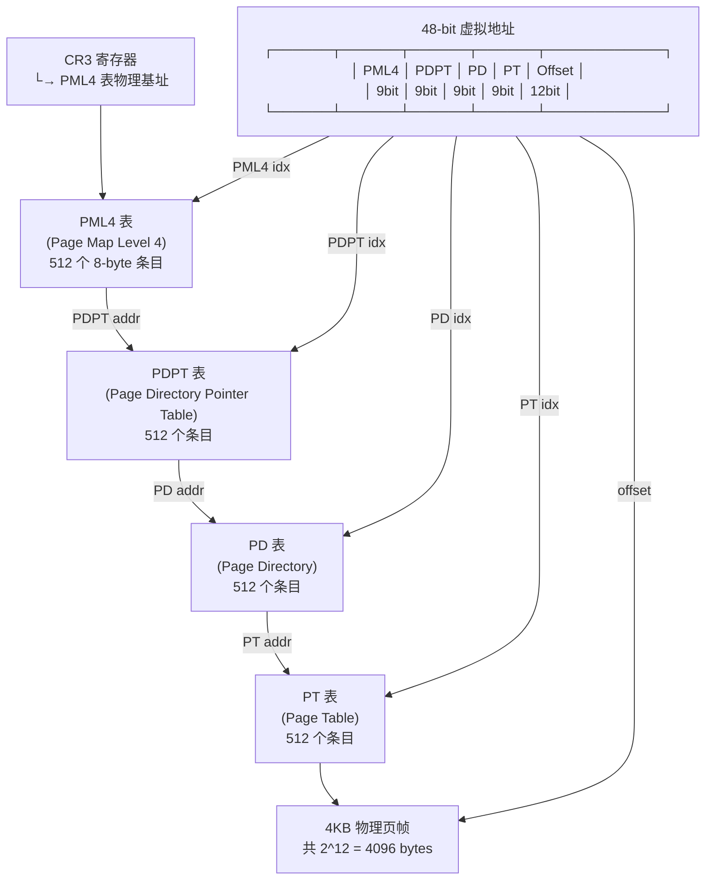
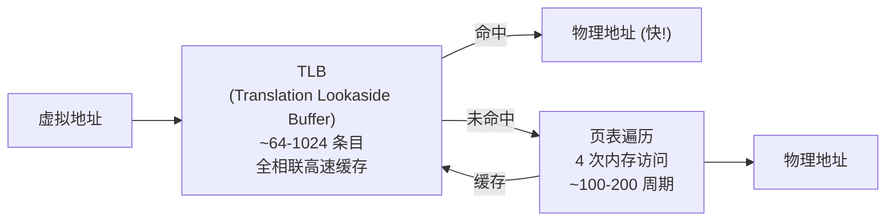
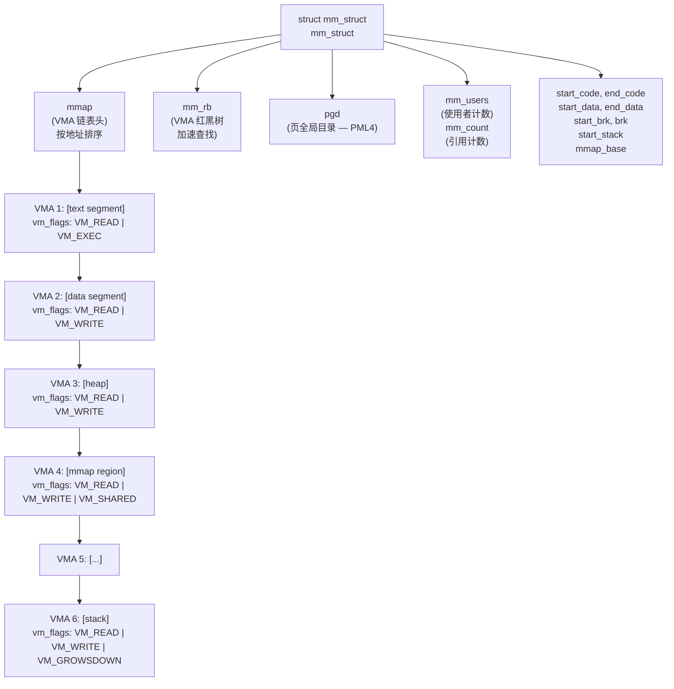
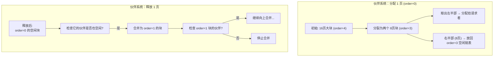
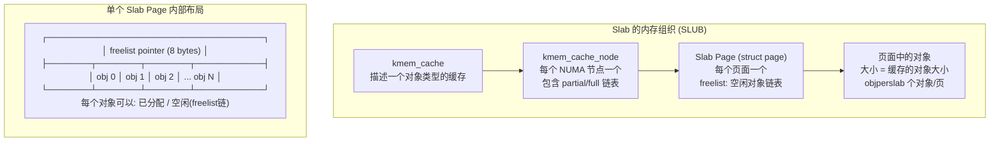

# 进程与内存管理 (Process and Memory Management)
---

## 章节概述

> **本章是内核编程的核心**。进程和内存是操作系统最重要的两个抽象。理解 `task_struct`、页表、伙伴系统和 slab 分配器，是阅读和编写任何内核代码的基础。本章将把你在 [[../../c语言教程/2深化/02_内存模型与布局|内存模型与布局]] 中学到的虚拟内存概念扩展到内核层面。

进程是"运行中的程序"，内存是"程序的舞台"。内核负责创建进程、调度进程、为进程分配/回收内存。这些操作必须高效、安全、公平——因为内核同时为数百个进程提供服务。

本章内容：
- **task_struct 深度解析**：进程在内存中的完整描述
- **进程状态与调度**：从创建到消亡的生命周期
- **虚拟内存管理**：四级页表、TLB、页面错误（page fault）
- **内核内存分配器**：伙伴系统（Buddy System）和 slab 分配器
- **内核内存 API**：kmalloc、vmalloc、kmem_cache_*

**前置要求**：
- 已学完 [[../../c语言教程/2深化/02_内存模型与布局|内存模型与布局]]（虚拟地址空间、页机制）
- 已学完 [[../../c语言教程/2深化/03_动态内存管理|动态内存管理]]（用户态内存管理概念）
- 已学完 [[../../c语言教程/2深化/07_面向对象C编程|面向对象C编程]]（理解结构体作为"对象"的思想）
- 建议阅读 [[../../汇编基础/1基础/01_寄存器与指令基础|ASM: 内存与IO]]（MMU、页表硬件层理解）

---
### 第一节：进程表示 —— task_struct 深度剖析
---

### 1.1 进程是内核中最核心的数据结构

在 Linux 内核中，每个进程（线程）都由一个 `struct task_struct` 来描述。这个结构体定义在 `include/linux/sched.h`，是内核中最大的结构体之一（约 500 个字段），也是理解内核一切行为的关键。



### 1.2 关键字段详解

```c
// ============================================
// task_struct 关键字段梳理
// 完整定义: include/linux/sched.h
// 在线查看: https://elixir.bootlin.com/linux/latest/source/include/linux/sched.h
// ============================================

struct task_struct {
 // ------------- 进程标识 -------------
 pid_t pid; // 进程 ID（对线程来说是线程 ID）
 pid_t tgid; // 线程组 ID（用户视角的 PID）
 char comm[TASK_COMM_LEN]; // 进程名（16 字节，prctl 可设置）
 
 // ------------- 状态信息 -------------
 volatile long state; // 进程状态位图
 
 // ------------- 进程关系 -------------
 struct task_struct __rcu *real_parent; // 真实的父进程
 struct task_struct __rcu *parent; // 被通知的父进程（ptrace 时可能不同）
 struct list_head children; // 所有子进程链表
 struct list_head sibling; // 兄弟进程链表
 
 // ------------- 调度器 -------------
 int prio; // 动态优先级
 int static_prio; // 静态优先级 (nice 值)
 int normal_prio; // 归一化优先级
 unsigned int rt_priority; // 实时优先级 (1-99)
 struct sched_entity se; // CFS 调度器使用的实体
 struct sched_rt_entity rt; // 实时调度器使用的实体
 
 // ------------- 内存管理 -------------
 struct mm_struct *mm; // 进程地址空间（描述虚拟内存）
 struct mm_struct *active_mm; // 当前使用的地址空间
 // 注意: 内核线程的 mm 为 NULL（它们使用前一个进程的页表）
 
 // ------------- 文件系统 -------------
 struct fs_struct *fs; // 文件系统信息（根目录、当前工作目录）
 struct files_struct *files; // 打开的文件表
 
 // ------------- 信号 -------------
 struct signal_struct *signal; // 信号描述符
 struct sighand_struct *sighand; // 信号处理函数表
 sigset_t blocked; // 当前被阻塞的信号
 sigset_t real_blocked; // 临时阻塞（rt_sigtimedwait 用）
 struct sigpending pending; // 待处理的私有信号
 
 // ------------- 统计 -------------
 u64 utime; // 用户态运行时间 (ns)
 u64 stime; // 内核态运行时间 (ns)
 u64 start_time; // 进程启动时间 (ns)
 u64 nvcsw; // 自愿上下文切换次数
 u64 nivcsw; // 非自愿上下文切换次数
 ...
};
```

### 1.3 current —— 内核中最神奇的"全局变量"

在内核代码中，`current` 是一个宏，它"神奇地"返回当前正在 CPU 上执行的进程的 `task_struct` 指针。不同架构实现不同：

```c
// ============================================
// current 的实现原理（x86-64）
// ============================================

// 方法: 利用内核栈布局
//
// x86-64 内核栈底部（低地址）保留了一个 struct thread_info，
// 其中包含指向 task_struct 的指针
//
// 内存布局 (x86-64, 无 CONFIG_THREAD_INFO_IN_TASK):
// ┌─────────────────────────┐ 高地址
// │ 内核栈 (16KB) │ 
// │ (向下增长) │
// │ ... 栈帧 ... │ ← rsp (栈指针)
// ├─────────────────────────┤
// │ thread_info │ 低地址
// │ ├── flags │
// │ └── *task ─────────────│──→ task_struct
// └─────────────────────────┘

// 简化实现:
static __always_inline struct task_struct *get_current(void)
{
 // 取当前栈指针，屏蔽栈大小位（16KB 对齐）
 // 栈底部就是 thread_info
 return (struct task_struct *)(current_stack_pointer & ~(THREAD_SIZE - 1))
 ->thread_info.task;
}

// 现代 x86-64 使用 per-CPU 变量存储 current
// (CONFIG_THREAD_INFO_IN_TASK=y 时的实现)
// 通过 GS 段寄存器访问 per-CPU 区域:
#define current get_current()
static __always_inline struct task_struct *get_current(void)
{
 struct task_struct *cur;
 asm volatile("movq %%gs:%c1, %0"
 : "=r"(cur)
 : "i"(offsetof(struct pcpu_hot, current_task)));
 return cur;
}
```

**current 的典型使用场景**：

```c
// 内核模块中随处可见的 current 用法
printk(KERN_INFO "PID: %d, COMM: %s\n", current->pid, current->comm);

// 检查当前进程是否有特定的权限
if (current->cred->uid.val != 0) { // 不是 root
 return -EPERM;
}

// 检查系统调用是否被信号中断
if (signal_pending(current)) {
 return -ERESTARTSYS;
}
```

### 1.4 进程状态与转换



```c
// 进程状态宏定义 (include/linux/sched.h)
#define TASK_RUNNING 0x0000 // 正在执行 或 就绪
#define TASK_INTERRUPTIBLE 0x0001 // 可中断睡眠
#define TASK_UNINTERRUPTIBLE 0x0002 // 不可中断睡眠 (D 状态)
#define __TASK_STOPPED 0x0004 // 被停止
#define __TASK_TRACED 0x0008 // 被调试器跟踪
#define EXIT_DEAD 0x0010 // 完全死亡
#define EXIT_ZOMBIE 0x0020 // 僵尸进程 (已退出, 父进程尚未 wait)
#define TASK_DEAD 0x0040 // 正在死亡
#define TASK_WAKEKILL 0x0100 // 可被致命信号唤醒
#define TASK_NOLOAD 0x0200 // 不计入负载统计

// 设置进程状态的内核 API
// set_current_state(TASK_INTERRUPTIBLE); // 睡眠前设置状态
// __set_current_state(TASK_RUNNING); // 被唤醒后设置状态
```

```c
// 练习 1: 进程状态观察
// 使用 ps 命令和 /proc 文件系统观察进程状态
//
// ps aux → STAT 栏显示进程状态字母
// R = TASK_RUNNING
// S = TASK_INTERRUPTIBLE (可中断睡眠)
// D = TASK_UNINTERRUPTIBLE (不可中断睡眠, 通常等待磁盘 IO)
// T = TASK_STOPPED
// Z = EXIT_ZOMBIE (僵尸进程)
//
// 创建一个僵尸进程观察:
// int pid = fork();
// if (pid == 0) exit(0); // 子进程立即退出
// sleep(100); // 父进程不 wait - 子进程为僵尸态
// 在另一个终端: ps aux | grep 'Z'
```

---
### 第二节：虚拟内存 —— 内核视角
---

### 2.1 虚拟内存地址空间划分

x86-64 架构使用 48 位有效地址（Linux 内核的默认配置），寻址空间为 256 TB。内核将地址空间一分为二：



```c
// 内核空间中的重要区域 (include/asm/pgtable_64.h)
//
// 内核虚拟地址布局 (简化):
// 0xFFFF888000000000 - 0xFFFFC87FFFFFFFFF : direct mapping (物理内存直接映射)
// 0xFFFFC90000000000 - 0xFFFFE8FFFFFFFFFF : vmalloc/ioremap 空间
// 0xFFFFE90000000000 - 0xFFFFE9FFFFFFFFFF : 虚拟内存映射 (VMMAP)
// 0xFFFFEA0000000000 - 0xFFFFEAFFFFFFFFFF : per-CPU 变量
// 0xFFFFFE0000000000 - 0xFFFFFE7FFFFFFFFF : KASAN 影子内存
// 0xFFFFFFEF00000000 - 0xFFFFFFFFFFFFFFFF : 内核代码/数据/BSS

// 物理地址 → 虚拟地址转换宏
#define __va(x) ((void *)((unsigned long)(x) + PAGE_OFFSET))
#define __pa(x) ((unsigned long)(x) - PAGE_OFFSET)
// PAGE_OFFSET = 0xFFFF888000000000 (取决于配置)
```

### 2.2 四级页表详解

x86-64 使用四级页表将虚拟地址转换为物理地址。这是理解虚拟内存管理的基础：



```c
// 页表项 (Page Table Entry) 格式 (x86-64)
// 每个表项 8 字节 (64 bits):
//
// 位 0 (P): Present —— 页是否在内存中
// 位 1 (R/W): Read/Write —— 可写
// 位 2 (U/S): User/Supervisor —— 用户态可访问
// 位 3 (PWT): Page-level Write-Through
// 位 4 (PCD): Page-level Cache Disable
// 位 5 (A): Accessed —— 被访问过
// 位 6 (D): Dirty —— 被写过
// 位 7 (PAT): Page Attribute Table (仅在 PT 层级)
// 位 8 (G): Global —— 全局页（不刷新 TLB）
// 位 9-11: 可用位（内核用 bit 10 做 swap 标记）
// 位 12-51: 物理页帧号 (PFN, 40 bits → 1PB 可寻址)
// 位 52-62: 可用 / 保护密钥
// 位 63 (XD): eXecute Disable (NX bit)

// 内核中操作页表的函数
pte_t *pte = pte_offset_map(pmd, addr); // 获取 PT 表项
pte_t pte_val = ptep_get(pte); // 读取表项
set_pte(pte, __pte(phys_addr | prot)); // 设置表项
unsigned long pfn = pte_pfn(pte_val); // 提取物理页帧号
struct page *page = pfn_to_page(pfn); // 转换为 page 结构

// 检查页面是否在内存中
if (pte_present(pte_val)) {
 // 页面在内存中
}
```

### 2.3 TLB —— 地址翻译的缓存



```c
// TLB 相关操作
//
// 1. 切换进程时（上下文切换）
// mov %rax, %cr3 ← 写入新页表基址 → 自动刷新非全局 TLB 条目
// 全局页（G=1）不受影响 → 内核页表映射保持有效

// 2. 显式刷新 TLB 条目 (x86 INVLPG 指令)
// invlpg (%rax) ← 刷新指一个虚拟地址对应的 TLB 条目

// 3. 跨 CPU TLB 刷新 (TLB shootdown)
// 内核需要向所有 CPU 发送 IPI (Inter-Processor Interrupt)
// 让它们刷新特定的 TLB 条目
// flush_tlb_page(vma, addr); // 刷新单个页面
// flush_tlb_mm(mm); // 刷新整个地址空间
// flush_tlb_all(); // 刷新所有 TLB (慎用!)
```

### 2.4 页错误处理（Page Fault）

当 CPU 的 MMU 无法将虚拟地址翻译为物理地址时，触发页错误异常（#PF, 向量 14）。内核的页错误处理程序是内存管理的核心：

```c
// 页错误处理流程 (简化, 实际在 arch/x86/mm/fault.c:do_user_addr_fault())
//
// 1. CPU 将出错的虚拟地址存入 CR2 寄存器
// 2. 跳转到 #PF 异常处理程序
// 3. 判断错误类型:
// - 页面不存在 (P=0) → 合法访问合法地址 → 按需调页 (demand paging)
// - 页面保护违规 (R/W=0 但执行了写操作) → 可能是 COW
// - 用户态访问内核态地址 → SEGFAULT
// - 非规范地址 → SEGFAULT

// 页错误处理的可能结果:
// ┌───────────────────┬──────────────────────────────────────┐
// │ 场景 │ 内核处理 │
// ├───────────────────┼──────────────────────────────────────┤
// │ 匿名页首次访问 │ 分配物理页 → 清零 → 映射 │
// │ 文件映射首次访问 │ 从磁盘读到 page cache → 映射 │
// │ 写只读页 (COW) │ 复制页面 → 断开共享 → 允许写入 │
// │ 访问已 swap 出的页 │ 从 swap 设备读回 → 重新映射 │
// │ 非法地址 │ 发送 SIGSEGV 给进程 │
// └───────────────────┴──────────────────────────────────────┘

// COW (Copy-On-Write) 是 fork() 高效实现的基石:
// 父进程调用 fork() 时，子进程的页表复制父进程的页表，
// 但所有页面都被标记为只读 (Read-Only)。
// 当父子任一方尝试写入时，触发页错误，
// COW 处理程序分配新页面，复制内容，更新页表。
// 这样 fork() 可以在 O(1) 时间内完成（只复制页表，不复制物理页）。

void do_cow_fault(struct vm_fault *vmf) {
 // 1. 分配新物理页
 struct page *new_page = alloc_page_vma(GFP_HIGHUSER_MOVABLE, vma, vmf->address);
 
 // 2. 复制原页面内容
 copy_user_highpage(new_page, vmf->page, vmf->address, vma);
 
 // 3. 将新页面映射到虚拟地址（替换旧的只读映射）
 // 用户进程现在可以写入自己的私有副本
}
```

```c
// 练习 2: 观察页面错误
// 编写用户态程序，触发并观察不同类型的页错误：
//
// 1. 访问 NULL 指针 → SIGSEGV
// int *p = NULL;
// *p = 42; // 内核: 发送 SIGSEGV
//
// 2. 写入只读内存 → SIGSEGV
// const int x = 10;
// *(int*)&x = 20; // 未定义行为, 可能 SIGSEGV
//
// 3. 大量 malloc + 写入 → 观察缺页性能
// 使用 perf stat -e page-faults ./program
//
// 4. 使用 /proc/PID/smaps 查看进程的虚拟内存映射详情
// cat /proc/self/smaps
```

---
### 第三节：struct mm_struct 与 VMA
---

### 3.1 进程地址空间管理

每个用户进程都有一个 `struct mm_struct`，其中包含该进程的页表指针和虚拟内存区域（VMA）的红黑树/链表：



### 3.2 vm_area_struct 详解

```c
// struct vm_area_struct (include/linux/mm_types.h)
// 每个 VMA 描述一段连续的、具有相同属性的虚拟地址范围

struct vm_area_struct {
 unsigned long vm_start; // 起始虚拟地址
 unsigned long vm_end; // 结束虚拟地址 (不包含)
 
 struct vm_area_struct *vm_next, *vm_prev; // 链表
 
 struct mm_struct *vm_mm; // 所属地址空间
 pgprot_t vm_page_prot; // 页保护标志 (读/写/执行)
 
 unsigned long vm_flags; // VMA 属性标志
 // VM_READ, VM_WRITE, VM_EXEC, VM_SHARED, VM_MAYREAD, ...
 // VM_GROWSDOWN (栈向下增长), VM_GROWSUP (brk向上增长)
 // VM_LOCKED (mlock 锁定的页面)
 // VM_HUGETLB (大页)
 
 struct vm_operations_struct *vm_ops; // 操作函数表 (类似 C++ 虚函数)
 // vm_ops->open(), vm_ops->close(), vm_ops->fault()
 
 struct file *vm_file; // 文件映射对应的文件 (匿名映射为 NULL)
 unsigned long vm_pgoff; // 在映射文件中的偏移 (页为单位)
 ...
};
```

```c
// 练习 3: 查看进程地址空间布局
// 编写 C 程序打印自己的内存布局:
#include <stdio.h>
#include <stdlib.h>

int global_var = 10;
static int static_var = 20;

int main() {
 int stack_var = 30;
 int *heap_var = malloc(sizeof(int));
 
 printf("=== 进程地址空间布局 ===\n");
 printf("text (main): %p\n", main);
 printf("data (global): %p\n", &global_var);
 printf("bss (static): %p\n", &static_var);
 printf("heap (malloc): %p\n", heap_var);
 printf("stack (local): %p\n", &stack_var);
 
 free(heap_var);
 return 0;
}
// 编译运行后:
// 1. gcc -o layout layout.c -no-pie
// 2. ./layout
// 3. 在另一个终端: cat /proc/$(pidof layout)/maps
// 4. 对照 maps 输出理解内存布局
```

---
### 第四节：伙伴系统 —— 内核物理页分配器
---

### 4.1 为什么需要伙伴系统

内核需要管理所有物理页面（每页通常 4KB）。分配和释放请求的大小不同（1页、2页、4页……128页）。伙伴系统（Buddy System）解决的关键问题是**外碎片**——通过合并相邻的空闲伙伴（buddy）来形成更大的连续块。



### 4.2 伙伴系统数据结构

```c
// 伙伴系统的核心数据结构 (include/linux/mmzone.h)
//
// 每个内存区域 (zone) 维护一个 free_area 数组
// free_area[N] 包含所有大小为 2^N 页的空闲块

struct zone {
 struct free_area free_area[MAX_ORDER]; // MAX_ORDER = 11 (通常)
 // free_area[0] → 1页 (4KB) 的空闲块
 // free_area[1] → 2页 (8KB) 的空闲块
 // ...
 // free_area[10] → 1024页 (4MB) 的空闲块
 
 unsigned long managed_pages; // 可管理的总页数
 unsigned long _watermark[NR_WMARK]; // 水位线
 // WMARK_MIN: 紧急水位 (触发 kswapd/OOM)
 // WMARK_LOW: 后台回收水位 (唤醒 kswapd)
 // WMARK_HIGH: 健康水位
 ...
};

struct free_area {
 struct list_head free_list[MIGRATE_TYPES]; // 不同迁移类型的空闲链表
 unsigned long nr_free; // 此 order 的空闲块数量
};
```

### 4.3 核心分配函数

```c
// ============================================
// 伙伴系统核心 API
// ============================================

// 1. alloc_pages —— 分配 2^order 个连续物理页面
// gfp_mask: GFP_KERNEL, GFP_ATOMIC, GFP_DMA...
// 返回 struct page* (不是虚拟地址!)
#include <linux/gfp.h>
struct page *page = alloc_pages(GFP_KERNEL, 3); // 分配 8 页 (32KB)
if (!page)
 return -ENOMEM;

// 2. __free_pages —— 释放物理页面
__free_pages(page, 3); // 释放 8 页

// 3. get_free_pages —— 分配并返回虚拟地址（内部调用 alloc_pages + page_address）
unsigned long addr = __get_free_pages(GFP_KERNEL, 3); // 返回线性映射的虚拟地址
free_pages(addr, 3);

// 4. page_address —— 将 struct page* 转换为虚拟地址
void *kaddr = page_address(page);
// 这只对直接映射区有效 (ZONE_NORMAL / ZONE_DMA)
// 对于 HIGHMEM（32位）页面，可能需要 kmap/kunmap

// 5. __get_free_page / __free_page —— 单页分配/释放
// alloc_page / __free_page - 单页版本的宏
#define __get_free_page(gfp_mask) __get_free_pages((gfp_mask), 0)
#define __free_page(page) __free_pages((page), 0)

// 6. GFP mask 标志 (Get Free Pages flags)
//
// GFP_KERNEL: 最常用的标志。可以睡眠，会触发页面回收
// GFP_ATOMIC: 原子分配，不能睡眠。用于中断上下文或持有自旋锁时
// GFP_NOWAIT: 不等待，不触发回收
// GFP_NOFS: 不允许文件系统操作（防止递归死锁）
// GFP_NOIO: 不允许 IO 操作
// GFP_DMA: 必须在 DMA 区域分配（用于 ISA 设备等）
// GFP_USER: 用户进程触发的分配
// GFP_HIGHUSER: 从 HIGHMEM 区分配（如果有的话）

// 组合标志:
// __GFP_ZERO: 分配后清零
// __GFP_NOWARN: 分配失败时不输出警告
// __GFP_REPEAT: 重试分配（默认行为）
// __GFP_NOFAIL: 永不失败（无限重试，极其危险，仅用于关键路径）
```

### 4.4 /proc/buddyinfo —— 查看伙伴系统状态

```bash
# 查看伙伴系统的空闲块分布
cat /proc/buddyinfo
# 输出:
# Node 0, zone DMA 0 0 0 0 0 0 0 0 0 1 3
# Node 0, zone DMA32 12 45 23 18 9 4 2 1 0 0 0
# Node 0, zone Normal 234 1456 7893 3456 1234 567 234 123 56 23 12
#
# 列含义: order 0, 1, 2, 3, 4, 5, 6, 7, 8, 9, 10 的空闲块数量

# 查看内存区域信息
cat /proc/zoneinfo

# 查看整体内存信息
cat /proc/meminfo
```

```c
// 练习 4: 伙伴系统观察实验
// 1. 编写内核模块，调用 alloc_pages 分配不同 order 的页面
// 2. 在分配前后分别读取 /proc/buddyinfo，观察空闲块变化
// 3. 理解为什么 order=3 的分配会导致 order=3 计数减少
//
// 提示:
// #include <linux/gfp.h>
// #include <linux/mm.h>
//
// struct page *p = alloc_pages(GFP_KERNEL, order);
// __free_pages(p, order);
```

---
### 第五节：slab 分配器 —— 内核的"对象缓存"
---

### 5.1 从伙伴系统到 slab

伙伴系统以"页面"为单位管理物理内存——最小分配单位是 4KB。但内核中绝大部分数据结构都远小于 4KB（如 `task_struct` 约 2KB，`struct inode` 约 500 字节，网络缓冲区约 200 字节）。如果每次都用伙伴系统分配整页，会浪费大量内存。

**slab 分配器**在伙伴系统之上构建——它从伙伴系统获取整页，然后将页面细分为小对象进行分配和管理。


### 5.2 slab 分配器的三个版本

Linux 内核历史上出现了三种 slab 分配器实现：

| 名称 | 配置文件 | 特点 |
|------|---------|------|
| **SLAB** | `mm/slab.c` | 原始实现（SunOS 设计），管理复杂但历史悠久 |
| **SLUB** | `mm/slub.c` | 简化版（当前默认），去掉了对象队列，更简单更快 |
| **SLOB** | `mm/slob.c` | 极度简化版，用于嵌入式系统（内存极小的设备） |

当前内核默认使用 **SLUB** 分配器。

### 5.3 kmem_cache —— slab 的核心抽象

```c
// ============================================
// kmem_cache 创建与使用
// ============================================

#include <linux/slab.h>

struct my_data {
 int id;
 char name[64];
 struct list_head list;
};

// 全局缓存指针
static struct kmem_cache *my_cache;

// 模块初始化时创建缓存
static int __init my_init(void)
{
 // kmem_cache_create: 创建一个专用 slab 缓存
 my_cache = kmem_cache_create(
 "my_data_cache", // 缓存名称 (显示在 /proc/slabinfo 中)
 sizeof(struct my_data), // 对象大小
 0, // 对齐要求 (0 = 默认)
 SLAB_HWCACHE_ALIGN, // 标志: 按缓存行对齐
 NULL // 构造函数 (已废弃, NULL)
 );
 if (!my_cache)
 return -ENOMEM;
 
 // 分配对象
 struct my_data *data = kmem_cache_alloc(my_cache, GFP_KERNEL);
 if (!data) {
 kmem_cache_destroy(my_cache);
 return -ENOMEM;
 }
 
 // 使用对象...
 data->id = 42;
 snprintf(data->name, sizeof(data->name), "test");
 
 // 释放对象
 kmem_cache_free(my_cache, data);
 
 return 0;
}

// 模块卸载时销毁缓存
static void __exit my_exit(void)
{
 kmem_cache_destroy(my_cache);
}
```

### 5.4 kmalloc 的底层实现

```c
// kmalloc 并不是独立的分配器
// 它内部使用内置的 kmem_cache 数组
// 
// 当调用 kmalloc(128, GFP_KERNEL) 时:
// 1. 查找 128 字节对应的 kmem_cache (可能是 kmalloc-128)
// 2. 调用 kmem_cache_alloc 从该缓存中分配
// 3. 返回对象指针
//
// 内置缓存 (通用缓存) 定义在 mm/slab_common.c:
// kmalloc-8, kmalloc-16, kmalloc-32, kmalloc-64,
// kmalloc-96, kmalloc-128, kmalloc-192, kmalloc-256,
// kmalloc-512, kmalloc-1k, kmalloc-2k, kmalloc-4k, kmalloc-8k

// /proc/slabinfo 查看 slab 缓存状态
// cat /proc/slabinfo
// 输出列:
// name <active_objs> <num_objs> <objsize> <objperslab> <pagesperslab>
// :t-0000128 56 56 128 32 1
// ...
```

### 5.5 slab 的内存布局



### 5.6 kmalloc vs vmalloc

```c
// kmalloc: 分配物理连续、虚拟也连续的内存
// 来源: 直接映射区 (ZONE_NORMAL/ZONE_DMA)
// 优点: 高效 (不需要修改页表)
// 缺点: 最大分配大小受限制 (通常 ≤ 4MB), 物理连续可能在有碎片时失败
//
// vmalloc: 分配虚拟连续但物理不一定连续的内存
// 来源: vmalloc 区域 (内核虚拟地址空间的独立区域)
// 优点: 可以分配很大的范围，不要求物理连续
// 缺点: 需要修改页表 (TLB 刷新)，每次访问可能缺页，比 kmalloc 慢
// 不能在原子上下文中使用 (可能会睡眠)
//
// 规则: 优先使用 kmalloc，只在需要很大空间或物理碎片导致 kmalloc 失败时用 vmalloc

void *p1 = kmalloc(4096, GFP_KERNEL); // OK
// void *p2 = kmalloc(16 * 1024 * 1024, GFP_KERNEL); // 可能失败!
void *p2 = vmalloc(16 * 1024 * 1024); // OK, 分配 16MB
vfree(p2); // vmalloc 必须用 vfree 释放
```

```c
// 练习 5: slab 和使用分析
// 1. 编写用户态程序，大量分配/释放小块内存 (malloc(64))
// 使用 perf 观察 page-fault, kmem:mm_page_alloc 等事件
// 理解用户态 malloc 和内核 slab 的关系 (glibc 的 ptmalloc)
//
// 2. 观察 slab 分配的"冷热"效应:
// cat /proc/slabinfo | sort -n -k 2 | tail -20
// 找出系统中最大的 slab 缓存
//
// 3. 编写内核模块，创建自己的 kmem_cache
// 测试 kmem_cache_alloc/kmem_cache_free 的性能
// 使用 ktime_get() 测量分配/释放的延迟
```

---
### 第六节：KASLR与内核安全
---

### 6.1 KASLR (Kernel Address Space Layout Randomization)

```c
// KASLR 将内核在启动时随机放置在虚拟地址空间中
// 使攻击者无法预测内核代码和数据的地址
//
// 在 x86-64 上:
// 1. 引导加载器 (bootloader) 从 EFI 获取随机种子
// 2. 内核解压阶段生成随机偏移
// 3. 将内核代码/数据段放在随机化的位置
// 4. 调整所有符号引用
//
// 随机化范围: 1GB 的粒度 (对于 x86-64)
// 可以通过内核命令行参数 nokaslr 禁用

// 使用 kallsyms 查看内核符号地址 (需要 root)
// sudo cat /proc/kallsyms | head -20
// 每次重启, 地址都会不同 (当 KASLR 启用时)
```

```c
// 练习 6: 验证 KASLR
// 1. cat /proc/cmdline 检查是否启用了 KASLR
// 2. sudo cat /proc/kallsyms | head -5
// 3. 重启系统, 再次查看 kallsyms
// 4. 比较两次的地址 (不同即为 KASLR 生效)
// 5. 在 QEMU 中添加 nokaslr 内核参数, 重复实验
```

---
## 章节测试
---

> [!question] 判断题 1
> 内核线程（如 kworker）的 `task_struct.mm` 字段与普通进程一样，指向有效的 `mm_struct`。 （ ）
> - [ ] 正确
> - [ ] 错误
>
> > [!success]- 点击查看答案
> > 答案: 错误
> >
> > **解析**: 内核线程没有自己的地址空间，其 `mm` 字段为 `NULL`。当调度器切换到内核线程时，它借用前一个进程的页表（通过 `active_mm` 引用）。这避免了不必要的 TLB 刷新——内核空间的映射在所有进程中相同。

> [!question] 判断题 2
> kmalloc 返回的内存在物理上和虚拟上都是连续的。 （ ）
> - [ ] 正确
> - [ ] 错误
>
> > [!success]- 点击查看答案
> > 答案: 正确
> >
> > **解析**: `kmalloc` 直接使用伙伴系统分配物理连续的内存，返回的虚拟地址通过直接映射 (direct mapping) 与物理地址对应。这与 `vmalloc` 不同——后者物理上不一定连续，但虚拟地址连续。

> [!question] 判断题 3
> 四级页表遍历中，如果任意一级的表项 Present 位为 0，CPU 触发页错误异常。 （ ）
> - [ ] 正确
> - [ ] 错误
>
> > [!success]- 点击查看答案
> > 答案: 正确
> >
> > **解析**: 页表遍历在任何一级如果发现 P=0 的条目，都会触发 #PF (Page Fault) 异常，异常信息中包含出错的虚拟地址（CR2 寄存器）和错误码（区分不存在 vs 权限问题）。

> [!question] 判断题 4
> `GFP_KERNEL` 标志可以在中断处理程序中使用。 （ ）
> - [ ] 正确
> - [ ] 错误
>
> > [!success]- 点击查看答案
> > 答案: 错误
> >
> > **解析**: `GFP_KERNEL` 可能触发页面回收（需要写磁盘，会睡眠）。中断处理程序（top half）不能睡眠——必须使用 `GFP_ATOMIC`。违反此规则可能导致内核死锁或崩溃。

> [!question] 判断题 5
> slab 分配器从 vmalloc 区域获取内存来创建对象缓存。 （ ）
> - [ ] 正确
> - [ ] 错误
>
> > [!success]- 点击查看答案
> > 答案: 错误
> >
> > **解析**: slab 分配器从伙伴系统（alloc_pages）获取物理页面，然后细分为对象。它使用直接映射区，不涉及 vmalloc。vmalloc 有自己独立的虚拟地址空间区域。

> [!question] 判断题 6
> x86-64 下 Linux 内核使用全部 64 位地址空间进行内存寻址。 （ ）
> - [ ] 正确
> - [ ] 错误
>
> > [!success]- 点击查看答案
> > 答案: 错误
> >
> > **解析**: x86-64 当前使用 48 位有效地址（未来可扩展到 57 位，通过 5 级页表）。使用 48 位时，虚拟地址的高 16 位必须是第 47 位的符号扩展（规范地址）。非规范地址会触发 #GP 异常。256 TB 的空间在此阶段已经足够。

> [!question] 判断题 7
> COW (Copy-On-Write) 使得 fork() 可以 O(1) 完成，因为不需要立即复制父进程的所有物理页面。 （ ）
> - [ ] 正确
> - [ ] 错误
>
> > [!success]- 点击查看答案
> > 答案: 正确
> >
> > **解析**: fork() 创建子进程时，只需复制页表（标记所有页面为只读），不复制物理页面。只有当父或子进程尝试写入时，才触发 COW 页面错误，分配新页面。这使得 fork 非常快。

> [!question] 判断题 8
> `current` 是一个全局变量 `struct task_struct *current`。 （ ）
> - [ ] 正确
> - [ ] 错误
>
> > [!success]- 点击查看答案
> > 答案: 错误
> >
> > **解析**: `current` 是一个宏，不同架构实现不同。x86-64 上通过 GS 段寄存器访问 per-CPU 变量来获取，或通过内核栈底部的 thread_info 查找。它不是全局变量，而是 per-CPU 的概念——每个 CPU 核心上的"当前进程"不同。

> [!question] 判断题 9
> 伙伴系统可以分配任意大小的连续物理内存块。 （ ）
> - [ ] 正确
> - [ ] 错误
>
> > [!success]- 点击查看答案
> > 答案: 错误
> >
> > **解析**: 伙伴系统分配的单位是 `2^order` 页。例如 1 页 (4KB)、2 页 (8KB)、4 页 (16KB)、...、1024 页 (4MB)。不能分配 3 页 (12KB) 或 5 页 (20KB)——这些请求会被向上取整到 2 的幂。

> [!question] 判断题 10
> 进程处于 `TASK_UNINTERRUPTIBLE`（D 状态）时，即使收到 SIGKILL 信号也不会被杀死。 （ ）
> - [ ] 正确
> - [ ] 错误
>
> > [!success]- 点击查看答案
> > 答案: 正确
> >
> > **解析**: D 状态（不可中断睡眠）设计用来等待硬件 IO 完成。此状态下进程不处理任何信号（包括 SIGKILL）。这就是为什么有时 `kill -9` 都无法杀死一个进程——它正处于 D 状态等待磁盘响应。正常情况下 IO 很快完成，但 NFS 卡住等异常情况会导致 D 状态持续。

---

> [!question] 选择题 1
> `struct task_struct` 定义在哪个头文件中？
> - [ ] A. `include/linux/task.h`
> - [ ] B. `include/linux/sched.h`
> - [ ] C. `include/linux/process.h`
> - [ ] D. `include/linux/thread.h`
>
> > [!success]- 点击查看答案
> > 正确答案: B
> >
> > **解析**: `task_struct` 定义在 `include/linux/sched.h`。该头文件也包含进程调度、优先级、cgroup 等核心定义。`schedule()` 函数也定义在这里。

> [!question] 选择题 2
> 伙伴系统中，order=3 的分配请求相当于多少连续的物理内存？
> - [ ] A. 4KB
> - [ ] B. 12KB
> - [ ] C. 32KB
> - [ ] D. 64KB
>
> > [!success]- 点击查看答案
> > 正确答案: C
> >
> > **解析**: order=N 表示分配 2^N 个页面。order=3 → 2^3 = 8 页，每页通常 4KB，所以是 8 × 4KB = 32KB。

> [!question] 选择题 3
> kmalloc 的最大分配大小通常受什么限制？
> - [ ] A. 伙伴系统的 MAX_ORDER
> - [ ] B. vmalloc 的空间大小
> - [ ] C. 内核栈大小
> - [ ] D. 物理内存总量
>
> > [!success]- 点击查看答案
> > 正确答案: A
> >
> > **解析**: kmalloc 最终调用伙伴系统分配物理连续内存，受 `MAX_ORDER` 限制（通常为 11，即最多 2^10 × 4KB = 4MB）。如果需要更大的虚拟连续但物理不连续的内存，应使用 vmalloc。

> [!question] 选择题 4
> 以下哪个标志组合能表示"在中断上下文中分配内存，不触发页面回收"？
> - [ ] A. `GFP_KERNEL | __GFP_ZERO`
> - [ ] B. `GFP_ATOMIC`
> - [ ] C. `GFP_USER`
> - [ ] D. `GFP_KERNEL | __GFP_RECLAIM`
>
> > [!success]- 点击查看答案
> > 正确答案: B
> >
> > **解析**: `GFP_ATOMIC` 是为原子上下文（中断、自旋锁持有中）设计的内存分配标志，它不会睡眠，也不会触发页面回收（页回收涉及磁盘 IO，需要睡眠）。如果内存不足，GFP_ATOMIC 可能更早失败。

> [!question] 选择题 5
> 四级页表中，如果 PTE 的 Dirty 位为 1，表示什么？
> - [ ] A. 此页面的数据需要从磁盘读取
> - [ ] B. 此页面已被写入（修改过），需要回写磁盘
> - [ ] C. 此页面内容包含错误数据
> - [ ] D. 此页面正在被清理
>
> > [!success]- 点击查看答案
> > 正确答案: B
> >
> > **解析**: Dirty 位（D 位）由 CPU 硬件在页面被写入时自动设置。如果页面被换出到 swap 或写回文件，D=0 意味着可以直接丢弃（内容没变），D=1 意味着必须先写回磁盘。

> [!question] 选择题 6
> 以下哪个工具可以观察 slab 缓存的实时状态？
> - [ ] A. `/proc/buddyinfo`
> - [ ] B. `/proc/slabinfo`
> - [ ] C. `/proc/vmallocinfo`
> - [ ] D. `/proc/page_owner`
>
> > [!success]- 点击查看答案
> > 正确答案: B
> >
> > **解析**: `/proc/slabinfo` 显示每个 slab 缓存（kmem_cache）的详细信息：活跃对象数、总对象数、对象大小、每个 slab 页面中的对象数等。`/proc/buddyinfo` 显示伙伴系统状态，`/proc/vmallocinfo` 显示 vmalloc 分配详情。

> [!question] 选择题 7
> 内核线程的 `mm` 字段为 NULL 时，上下文切换如何处理页表？
> - [ ] A. 内核线程不需要页表，清空 CR3
> - [ ] B. 使用前一个进程的 `active_mm`，避免 TLB 刷新
> - [ ] C. 使用特殊的内核线程页表
> - [ ] D. 每次上下文切换到内核线程时重建完整页表
>
> > [!success]- 点击查看答案
> > 正确答案: B
> >
> > **解析**: 内核线程没有自己的页表，但内核空间映射在所有进程中是相同的。上下文切换到内核线程时，调度器借用前一个进程的页表（通过 `active_mm` 引用），无需切换 CR3，从而避免昂贵的 TLB 刷新。

> [!question] 选择题 8
> vmalloc 相对于 kmalloc 的主要缺点是什么？
> - [ ] A. 不能分配大于 4KB 的内存
> - [ ] B. 需要修改页表，涉及 TLB 刷新，速度较慢
> - [ ] C. 不能在内核模块中使用
> - [ ] D. 内存泄漏风险更高
>
> > [!success]- 点击查看答案
> > 正确答案: B
> >
> > **解析**: vmalloc 通过修改页表将分散的物理页面映射到连续的虚拟地址空间。每次 vmalloc/vfree 都需要修改页表和刷新 TLB（跨 CPU 的 TLB shootdown），这比 kmalloc 的直接映射慢得多。vmalloc 分配的内存也可能在首次访问时触发缺页。

> [!question] 选择题 9
> `ps aux` 输出中，STAT 列的 D 表示什么状态？
> - [ ] A. 进程已死亡 (Dead)
> - [ ] B. 进程处于不可中断睡眠 (TASK_UNINTERRUPTIBLE)
> - [ ] C. 进程被调试 (Debugged)
> - [ ] D. 进程被暂停 (Stopped)
>
> > [!success]- 点击查看答案
> > 正确答案: B
> >
> > **解析**: D (Disk Sleep) = TASK_UNINTERRUPTIBLE，进程正在等待 IO（通常是磁盘），不响应任何信号。这是正常的短期状态，但长期处于 D 状态通常是 IO 问题的信号（如 NFS 服务宕机）。

> [!question] 选择题 10
> 以下哪种做法是正确的内核内存管理方式？
> - [ ] A. 在中断处理程序中使用 GFP_KERNEL 分配内存
> - [ ] B. 用 kfree 释放 vmalloc 分配的内存
> - [ ] C. 用 kmem_cache_free 释放 kmem_cache_alloc 分配的对象
> - [ ] D. 在持有自旋锁时分配 GFP_KERNEL 内存
>
> > [!success]- 点击查看答案
> > 正确答案: C
> >
> > **解析**: kmem_cache_alloc 和 kmem_cache_free 是配对使用的 API。A 错误——中断上下文不能睡眠（GFP_KERNEL 可能阻塞）。B 错误——vmalloc 必须用 vfree 释放。D 错误——持有自旋锁时也不能睡眠。

---

### 编程练习题

> [!example] 练习题 1：task_struct 信息探查模块（）
> **难度**: 简单
>
> 编写内核模块，加载时遍历所有进程，打印每个进程的 PID、进程名、状态和父进程 PID。
>
> **提示**:
> - 使用 `for_each_process(task)` 宏遍历进程列表
> - 使用 `task->pid`, `task->comm`, `task->state`, `task->parent->pid`
> - 使用 read_lock(&tasklist_lock) / read_unlock(&tasklist_lock) 保护遍历
> - 对比输出是否与 `ps aux` 一致

> [!example] 练习题 2：测量内存分配性能（）
> **难度**: 简单
>
> 编写内核模块，测试以下分配器的性能：
> 1. kmalloc: 循环 10000 次 kmalloc(64, GFP_KERNEL) / kfree
> 2. kmem_cache: 创建专用缓存，循环 10000 次 alloc/free
> 3. alloc_pages: 循环 10000 次 alloc_pages(GFP_KERNEL, 0) / __free_pages
>
> 使用 `ktime_get()` 测量每种方案的耗时，打印比较结果。
> 分析为什么 kmem_cache_alloc 比 kmalloc 稍快（跳过通用缓存查找）。

> [!example] 练习题 3：VMA 探查（）
> **难度**: 简单
>
> 编写内核模块，给定一个进程 PID，遍历其所有 VMA，打印每个区域的起始/结束地址、大小、权限标志（R/W/X/SHARED）。
>
> **提示**:
> - 使用 `find_task_by_vpid(pid)` 获取 task_struct
> - 使用 `get_task_mm(task)` 获取 mm_struct（需要 mmput 归还）
> - 遍历 `mm->mmap` 链表
> - 打印 `vma->vm_start`, `vma->vm_end`, `vma->vm_flags`
> - 对比 `/proc/PID/maps` 输出

***
## 知识网络
***

- **下一章**: [[03_文件系统|文件系统]]
- **上一章**: [[01_C语言与操作系统|C语言与操作系统]]
- **返回**: [[../内核索引|返回总目录]]
- **相关**: [[../../c语言教程/2深化/02_内存模型与布局|内存模型与布局]] | [[../../c语言教程/2深化/03_动态内存管理|动态内存管理]] | [[../../c语言教程/2深化/07_面向对象C编程|面向对象C编程]]
- **汇编参考**: [[../../汇编基础/1基础/01_寄存器与指令基础|ASM: 内存与IO]] | [[../../汇编基础/1基础/01_寄存器与指令基础|ASM: 体系结构与寄存器]]
- **内核源码**: `include/linux/sched.h` (task_struct) | `include/linux/mm_types.h` (mm_struct) | `mm/page_alloc.c` (伙伴系统) | `mm/slub.c` (SLUB分配器)
