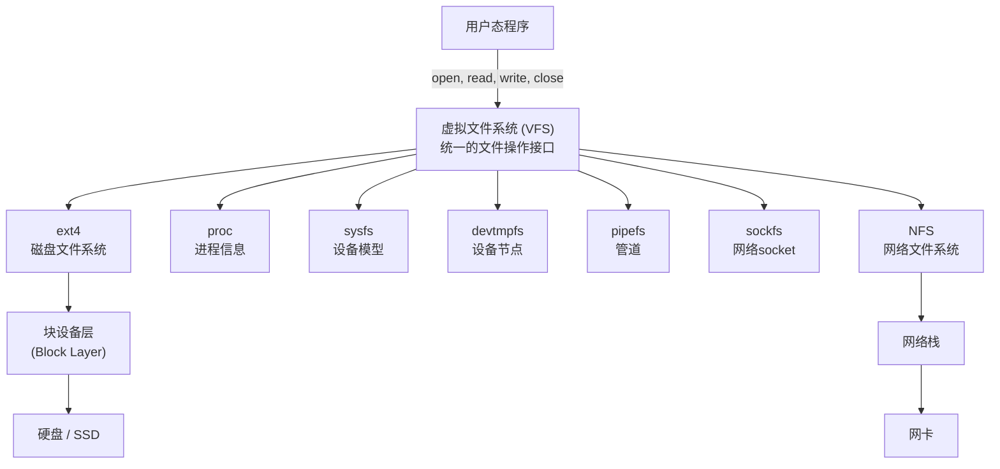
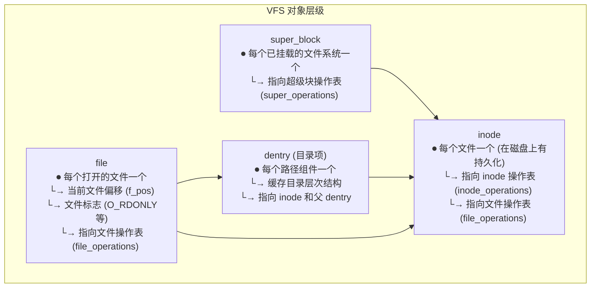
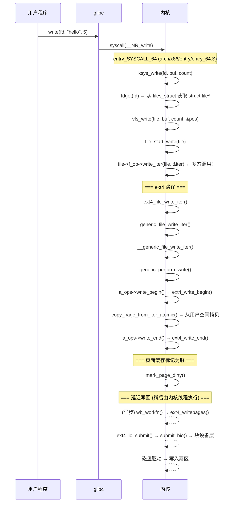
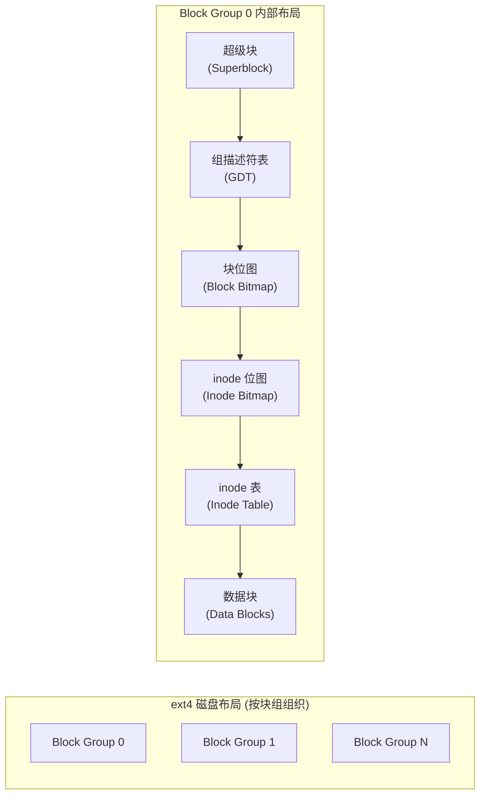
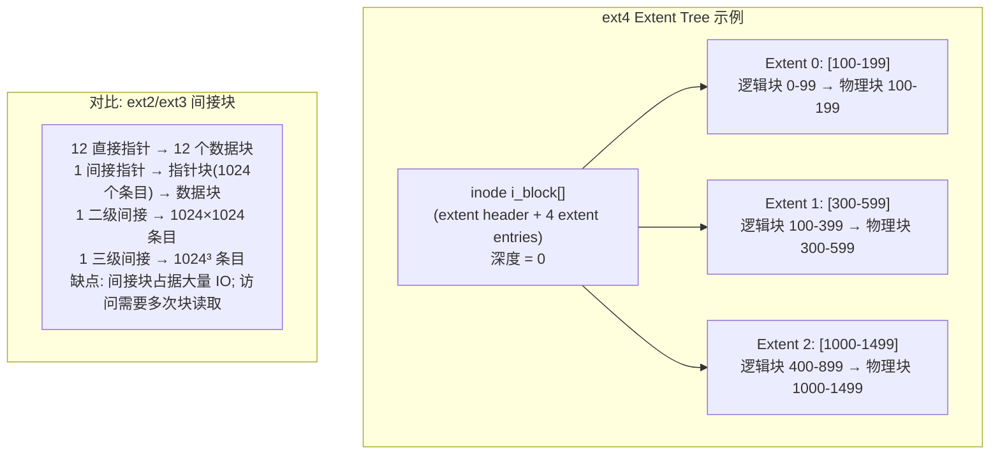
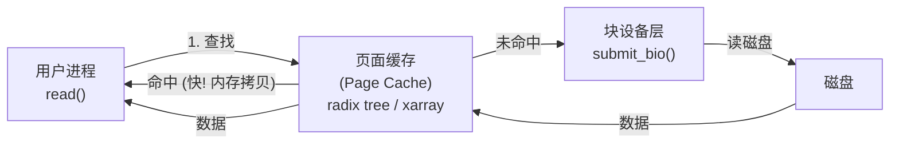

# 文件系统  (Filesystem)
---

##  章节概述

>  **本章探讨"一切皆文件"的基石**。Linux 最著名的设计哲学——"一切皆文件"——由虚拟文件系统（VFS）实现。VFS 是一个纯 C 语言实现的面向对象框架，它是 Linux 内核中最优雅的设计之一，完美展示了 [[../../c语言教程/2深化/07_面向对象C编程|面向对象C编程]] 中我们学到的"用 C 实现多态"思想。

文件系统是用户感知最直接的内核子系统。无论是打开一个文本文件、读取 `/proc/cpuinfo`、还是访问 USB 设备——所有这些操作都经过 VFS 层。

本章内容：
- **VFS 架构**：四层结构（系统调用 → VFS → 具体文件系统 → 块设备）
- **核心数据结构**：super_block、inode、dentry、file——面向对象的 C 实现
- **file_operations**：C 语言的"虚函数表"，实现多态的关键
- **系统调用传播路径**：从 open() 到文件系统驱动的完整链路
- **ext4 文件系统概览**：inode、extent tree、journal
- **页面缓存（Page Cache）**：加速文件 IO 的关键机制
- **实现一个简单文件系统**：类似 ramfs 的内存文件系统

**前置要求**：
- 已学完 [[../../c语言教程/2深化/07_面向对象C编程|面向对象C编程]]（理解函数指针表 = 虚函数表）
- 已学完 [[../../c语言教程/2深化/04_函数指针与回调|函数指针与回调]]（理解函数指针语法）
- 已学完 [[01_C语言与操作系统|C语言与操作系统]]（理解内核模块基础）
- 建议阅读 [[../../汇编基础/ASM_02_栈与调用约定|ASM: 系统调用]]（理解 open/read/write 的用户态入口）

---
###  第一节：VFS —— 内核中的面向对象设计
---

### 1.1 "一切皆文件"的哲学



VFS 的核心思想：**每种"文件"都提供相同的一组操作（open、read、write……），但由各自的对象实现具体的操作方法**。这正是面向对象编程的"多态"——通过函数指针表实现。

### 1.2 VFS 四大核心对象



**对象关系示例**：

```c
// 同一个文件的多次 open 产生多个 file 对象
// open("/home/bob/notes.txt", O_RDONLY)
// open("/home/bob/notes.txt", O_WRONLY)
//
// 文件系统树:
// super_block(ext4, /dev/sda1)
//   └── root dentry: "/"
//       └── dentry: "home"
//           └── dentry: "bob"
//               └── dentry: "notes.txt" → inode# 12345
//                                            ↑
//                                      file (fd=3, O_RDONLY, f_pos=0)
//                                      file (fd=4, O_WRONLY, f_pos=0)
```

### 1.3 四大结构体核心字段

```c
// ============================================
// VFS 四大核心结构体 (简化版)
// 完整定义在 include/linux/fs.h
// ============================================

#include <linux/types.h>
#include <linux/fs.h>

// 1. super_block —— 文件系统超级块
//    每个挂载的文件系统有一个 super_block
struct super_block {
    dev_t           s_dev;          // 设备标识符
    unsigned long   s_blocksize;    // 块大小 (字节)
    unsigned char   s_blocksize_bits;
    loff_t          s_maxbytes;     // 最大文件大小
    
    struct file_system_type *s_type; // 文件系统类型 (ext4/proc/sysfs...)
    const struct super_operations *s_op; // 超级块操作
    
    struct dentry   *s_root;        // 挂载点的根目录项
    
    struct list_head s_inodes;      // 所有 inode 链表
    struct list_head s_dirty_lists; // 脏 inode 链表
    
    void            *s_fs_info;     // 文件系统私有数据
                                    // ext4: struct ext4_sb_info
                                    // proc: struct pid_namespace
    ...
};

// 2. inode —— 索引节点 (磁盘上也有对应的结构)
//    每个文件/目录/设备文件都有一个 inode
struct inode {
    umode_t         i_mode;         // 文件类型和权限 (S_IFREG, S_IFDIR, ...)
    kuid_t          i_uid;          // 所有者
    kgid_t          i_gid;          // 所属组
    unsigned int    i_flags;
    
    const struct inode_operations *i_op;    // inode 操作表
    struct super_block *i_sb;               // 所属超级块
    struct address_space *i_mapping;        // 页面缓存 (数据)
    struct address_space i_data;            // inode 自身的页面缓存
    
    unsigned long   i_ino;          // inode 编号
    loff_t          i_size;         // 文件大小 (字节)
    blkcnt_t        i_blocks;       // 文件占用块数
    
    union {
        struct pipe_inode_info  *i_pipe;    // 管道
        struct block_device     *i_bdev;    // 块设备
        struct cdev             *i_cdev;    // 字符设备
    };
    
    // 时间戳
    struct timespec64 i_atime;     // 访问时间
    struct timespec64 i_mtime;     // 修改时间
    struct timespec64 i_ctime;     // 变更时间 (元数据修改)
    
    void            *i_private;    // 文件系统私有数据
    ...
};

// 3. dentry —— 目录项缓存 (dentry cache, dcache)
//    加速路径名查找，避免每次都要遍历磁盘目录
struct dentry {
    unsigned int d_flags;
    struct inode *d_inode;          // 关联的 inode
    struct dentry *d_parent;        // 父目录
    struct qstr d_name;             // 文件名
    
    struct list_head d_child;       // 父目录的子项链表
    struct list_head d_subdirs;     // 子目录链表
    
    const struct dentry_operations *d_op;  // dentry 操作
    struct super_block *d_sb;       // 所属超级块
    
    struct hlist_bl_node d_hash;   // 哈希链表节点 (用于 dcache 哈希表)
    ...
};

// 4. file —— 打开的文件描述
struct file {
    loff_t          f_pos;          // 当前文件位置偏移
    fmode_t         f_mode;         // 访问模式 (FMODE_READ, FMODE_WRITE)
    unsigned int    f_flags;        // O_RDONLY, O_NONBLOCK, O_SYNC...
    
    struct path     f_path;         // 文件路径 (dentry + vfsmount)
    struct inode    *f_inode;       // 关联的 inode (f_path.dentry->d_inode)
    
    const struct file_operations *f_op;  //  文件操作表 —— 多态的核心!
    void            *private_data;  // 文件私有数据 (驱动程序常用)
    
    atomic_long_t   f_count;        // 引用计数
    ...
};
```

---
###  第二节：file_operations —— C 语言的虚函数表
---

### 2.1 file_operations 结构体

```c
// ============================================
// file_operations —— 文件系统的"vtable"
// 定义在 include/linux/fs.h
// 这是 VFS 实现多态的核心!
// ============================================

struct file_operations {
    struct module *owner;       // 所属模块 (THIS_MODULE)
    
    // 文件位置操作
    loff_t (*llseek) (struct file *, loff_t, int);
    // 读写
    ssize_t (*read) (struct file *, char __user *, size_t, loff_t *);
    ssize_t (*write) (struct file *, const char __user *, size_t, loff_t *);
    ssize_t (*read_iter) (struct kiocb *, struct iov_iter *);  // 现代接口
    ssize_t (*write_iter) (struct kiocb *, struct iov_iter *); // 现代接口
    // ioctl —— 设备控制
    long (*unlocked_ioctl) (struct file *, unsigned int, unsigned long);
    long (*compat_ioctl) (struct file *, unsigned int, unsigned long);
    // 内存映射
    int (*mmap) (struct file *, struct vm_area_struct *);
    // 打开 / 释放
    int (*open) (struct inode *, struct file *);
    int (*release) (struct inode *, struct file *);
    // 同步
    int (*fsync) (struct file *, loff_t, loff_t, int datasync);
    // 轮询 (select/poll/epoll)
    __poll_t (*poll) (struct file *, struct poll_table_struct *);
    // 异步 IO
    int (*aio_read) (struct kiocb *, const struct iovec *, unsigned long, loff_t);
    int (*aio_write) (struct kiocb *, const struct iovec *, unsigned long, loff_t);
    ...
};
```

### 2.2 多态的体现

```c
// ============================================
// 不同文件类型实现不同的 file_operations
// ============================================

// ext4 普通文件操作 (fs/ext4/file.c)
const struct file_operations ext4_file_operations = {
    .read_iter    = ext4_file_read_iter,    // 从 ext4 读数据
    .write_iter   = ext4_file_write_iter,   // 写到 ext4
    .mmap         = ext4_file_mmap,
    .open         = ext4_file_open,
    .release      = ext4_file_release,
    .fsync        = ext4_sync_file,
    .unlocked_ioctl = ext4_ioctl,
    ...
};

// proc 文件系统的文件操作 (fs/proc/inode.c)
const struct file_operations proc_reg_file_ops = {
    .read_iter    = proc_reg_read_iter,     // 从内核数据结构生成文本
    .write        = proc_reg_write,          // 写入时修改内核参数
    .splice_read  = proc_reg_splice_read,
    .poll         = proc_reg_poll,
    .unlocked_ioctl = proc_reg_unlocked_ioctl,
    .mmap         = proc_reg_mmap,
    ...
};

// pipe 操作 (fs/pipe.c)
const struct file_operations pipefifo_fops = {
    .read_iter    = pipe_read,              // 从管道缓冲区读
    .write_iter   = pipe_write,             // 写到管道缓冲区
    .poll         = pipe_poll,
    .unlocked_ioctl = pipe_ioctl,
    .release      = pipe_release,
    .fasync       = pipe_fasync,
    ...
};
```

```c
// ============================================
// VFS 调用 file_operations 的方式——完全等同于
// C++ 的虚函数调用 vtable->method(object, args)
// ============================================

// 对应关系:
// C++:  file->vtable->read(file, buf, count, &pos)
// C:    file->f_op->read(file, buf, count, &pos)
//
// 内核中实际调用:
ssize_t vfs_read(struct file *file, char __user *buf, size_t count, loff_t *pos)
{
    ssize_t ret;
    
    if (!(file->f_mode & FMODE_READ))
        return -EBADF;
    if (!file->f_op->read && !file->f_op->read_iter)
        return -EINVAL;
    
    //  这里就是多态调用!
    // 对 ext4 文件: 调用 ext4_file_read_iter
    // 对 pipe:       调用 pipe_read
    // 对 socket:     调用 sock_read
    // 对 proc 文件:  调用 proc_reg_read_iter
    
    if (file->f_op->read)
        ret = file->f_op->read(file, buf, count, pos);        // 传统接口
    else if (file->f_op->read_iter)
        ret = new_sync_read(file, buf, count, pos);            // 迭代器接口
    else
        ret = -EINVAL;
    
    if (ret > 0) {
        fsnotify_access(file);  // inotify 通知
        add_rchar(current, ret); // 统计
    }
    inc_syscr(current);  // 系统调用计数
    return ret;
}
```

>  这与 [[../../c语言教程/2深化/07_面向对象C编程|面向对象C编程]] 中手动实现虚函数表的方法完全一致！如果你还没读过那一章，现在是一个很好的交叉阅读时机。

---
###  第三节：系统调用到文件系统的完整路径
---

### 3.1 write() 系统调用的内核追踪

从用户态 `write(fd, buf, count)` 到磁盘扇区的完整旅程：



### 3.2 open() 的完整路径

```c
// ============================================
// open() 系统调用的核心流程
// ============================================

// 用户态: int fd = open("/home/user/test.txt", O_RDONLY);
//
// 内核处理流程:
//
// 1. do_sys_open() / do_sys_openat2()        (fs/open.c)
//    ↓ 解析模式位和标志
//
// 2. getname()                                - 从用户空间拷贝路径名
//    ↓ 内核中复制一份路径字符串
//
// 3. file_open_name() / do_filp_open()
//    ↓
//    path_openat()                            (fs/namei.c)
//
//    a. 分配 struct file 对象 (get_empty_filp)
//    b. link_path_walk() —— 路径名解析!
//       - 逐组件解析: "home" → "user" → "test.txt"
//       - 每个组件通过 d_lookup() 查找 dcache
//       - 缺失时从磁盘读取目录内容:
//         inode->i_op->lookup(inode, dentry, flags)
//    c. 权限检查: may_open()
//    d. vfs_open() + do_dentry_open()
//       - 设置 file->f_op = inode->i_fop
//         (对于 ext4: ext4_file_operations)
//         (对于 proc: proc_reg_file_ops)
//       - 调用 file->f_op->open(inode, file)
//
// 4. fsnotify_open(file)                      - inotify 通知
//
// 5. fd_install(fd, file)                     - 将 file* 放入进程的文件描述符表
//
// 6. 返回文件描述符 (int fd)
```

### 3.3 路径查找与 dentry cache

```c
// ============================================
// dentry cache (dcache) —— 路径名解析加速器
// ============================================

// 路径名解析是文件系统中最频繁的操作
// 每次 open/stat/chmod/exec 都需要将路径字符串解析为 inode
//
// 如果不缓存: 需要从磁盘读取每个目录的数据块, 查询文件名
// 使用 dcache: 内存中哈希表, O(1) 查找

// dcache 的核心结构 (fs/dcache.c):
//   全局哈希表: dentry_hashtable
//   哈希键: (父dentry, 文件名哈希)  →  dentry 对象
//
//   查找: __d_lookup(parent, name)
//   未命中: 调用文件系统的 ->lookup() 方法
//           从磁盘读取目录内容，创建新的 dentry

// VFS 的 dentry 管理:
//   - 已使用的 dentry: d_inode != NULL, 在 dcache 哈希表中
//   - 未使用的 dentry (negative dentry):
//     证明某目录下不存在某文件名的 dentry (d_inode == NULL)
//     加速"文件不存在"的判断 (避免每次查磁盘)
//   - 未使用的 dentry: 在 LRU 链表上, 内存紧张时被回收
```

```c
// 练习 1: 追踪文件系统操作
// 使用 strace 观察文件操作的系统调用:
//
// 1. strace -e trace=openat,read,write,close cat /etc/hostname
//    观察 cat 命令触发的系统调用序列
//
// 2. strace -e trace=openat,stat,mmap,close ls -l /
//    观察 ls 触发的文件系统调用
//
// 3. strace -c find /usr/include -name "*.h" 2>/dev/null | head -20
//    统计 find 命令最频繁的系统调用
//
// 4. 使用 perf 追踪内核函数:
//    sudo perf record -e 'syscalls:sys_enter_openat' -- my_program
//    sudo perf script
```

---
###  第四节：ext4 文件系统概览
---

### 4.1 ext4 的磁盘布局



### 4.2 ext4 inode 结构

```c
// ext4 inode (磁盘结构, 简化版)
// 完整定义在 fs/ext4/ext4.h: struct ext4_inode
//
// 大小: 256 字节 (vs ext2/ext3 的 128 字节)
//
struct ext4_inode {
    __le16  i_mode;        // 文件模式 (类型 + 权限)
    __le16  i_uid;         // 所有者
    __le32  i_size_lo;     // 文件大小低 32 位
    __le32  i_atime;       // 访问时间
    __le32  i_ctime;       // 变更时间
    __le32  i_mtime;       // 修改时间
    __le32  i_dtime;       // 删除时间
    __le16  i_gid;
    __le16  i_links_count;  // 硬链接数
    __le32  i_blocks_lo;   // 占用的 512-byte 块数 (低 32 位)
    __le32  i_flags;
    
    union {
        struct {
            __le32  l_i_version;
        } linux1;
        ...
    } osd1;
    
    //  数据块指针 (关键!)
    // ext2/ext3 使用直接+间接块指针
    // ext4 使用 extent tree (更高效)
    union {
        // ext2/ext3 风格: 60 字节存储 12 个直接指针 + 间接块指针
        struct {
            __le32  i_block[EXT4_N_BLOCKS]; // 15 个 4-byte 块指针
        };
        // ext4 extent tree: 根节点 (60 字节)
        struct {
            __le16  eh_magic;     // 魔数 = 0xF30A
            __le16  eh_entries;   // extent 条目数
            __le16  eh_max;       // 最大条目数
            __le16  eh_depth;     // 树深度
            __le32  eh_generation;
        };
    } i_block;
    
    __le32  i_generation;  // 文件版本号 (NFS 用)
    __le32  i_file_acl;    // 扩展属性块
    __le32  i_size_high;   // 文件大小高 32 位 (支持 >4GB 文件)
    ...
};
```

### 4.3 Extent Tree —— ext4 的数据块管理



```c
// extent: 一个范围描述 (起始物理块, 长度, 逻辑偏移)
struct ext4_extent {
    __le32  ee_block;      // 文件内的起始逻辑块号
    __le16  ee_len;        // extent 包含的块数 (最大 32768)
    __le16  ee_start_hi;   // 起始物理块号高 16 位
    __le32  ee_start_lo;   // 起始物理块号低 32 位
};

// ext4 的 extent tree 极大减少了元数据开销
// 一个 100MB 的文件:
//   ext2/ext3: 需要多层间接块, 访问第 50000 块需要 3 次元数据 IO
//   ext4: 单个 extent 可以覆盖 128MB, 仅 1 次元数据 IO
```

### 4.4 ext4 日志 (Journal)

```c
// ext4 使用日志 (journaling) 保证文件系统一致性
// 防止断电/崩溃导致文件系统损坏
//
// 日志模式:
//   1. journal (data=journal):  数据和元数据都日志 — 最安全, 最慢
//   2. ordered (data=ordered):  元数据日志, 数据先写 — 默认模式
//   3. writeback (data=writeback): 仅元数据日志 — 最快, 可能数据损坏
//
// 日志区域在磁盘上是循环缓冲区:
//   ┌──────────┬──────────────────────────┐
//   │ 超级块   │ 日志区域 (Journal Area)   │  ... 正常数据块
//   └──────────┴──────────────────────────┘
//
// 写入流程 (ordered 模式):
//   1. 将文件数据块写入磁盘
//   2. 将元数据变更写入日志
//   3. 提交日志项 (commit)
//   4. 异步将元数据写入实际位置 (checkpoint)
//   5. 回收日志空间

// 崩溃恢复: 重放 (replay) 已提交的日志项
// 确保元数据状态一致
```

---
###  第五节：页面缓存 (Page Cache)
---

### 5.1 页面缓存的作用

页面缓存是内核中最重要也是最大的缓存——它将磁盘上的文件数据缓存在内存中，大幅减少磁盘 IO。



### 5.2 address_space —— 页面缓存的抽象

```c
// ============================================
// address_space —— 将页面缓存关联到文件
// 每个 inode 有一个 address_space
// ============================================

struct address_space {
    struct inode        *host;       // 所属 inode
    struct xarray       i_pages;     //  页面缓存! (之前是 radix tree)
    // i_pages 是一个索引结构，键 = 页索引 (文件偏移/页大小)
    //                   值 = struct page*
    
    unsigned long       nrpages;     // 缓存的页面数量
    unsigned long       nrexceptional; // shadow/swap 条目
    
    // 地址空间操作 — 与具体文件系统交互
    const struct address_space_operations *a_ops;
    // a_ops->readpage()   — 读一页数据
    // a_ops->writepage()  — 写一页数据
    // a_ops->readpages()  — 批量读
    // a_ops->writepages() — 批量写
    // a_ops->write_begin() — 准备写某位置
    // a_ops->write_end()   — 完成写操作
    ...
};

// 页面与 address_space 的双向关系:
//   page->mapping → 指向 address_space
//   page->index   → 页面在文件中的偏移索引
//
// 这使得可以:
//   1. 给定 inode，通过 i_mapping 找到所有缓存的页面
//   2. 给定一个物理页，通过 page->mapping 反查它属于哪个文件
```

### 5.3 文件读操作与页面缓存

```c
// ============================================
// generic_file_read_iter —— 通用文件读
// ============================================

// 简化流程:
ssize_t generic_file_read_iter(struct kiocb *iocb, struct iov_iter *iter)
{
    struct file *file = iocb->ki_filp;
    struct address_space *mapping = file->f_mapping;
    loff_t pos = iocb->ki_pos;
    size_t count = iov_iter_count(iter);
    ssize_t retval = 0;
    
    while (count > 0) {
        struct page *page;
        pgoff_t index = pos >> PAGE_SHIFT;     // 计算页索引
        unsigned long offset = pos & (PAGE_SIZE - 1); // 页内偏移
        unsigned long bytes = min(count, PAGE_SIZE - offset);
        
        // 1. 在页面缓存中查找
        page = find_get_page(mapping, index);
        
        if (!page) {
            // 2. 未命中 → 从磁盘读取
            // filemap_fault() → a_ops->readpage() → 提交 bio
            // 这会触发页面错误处理
            page = page_cache_sync_readahead(mapping, ra, file, index, nr_pages);
            
            // 3. 如果需要的页不在内存 → 等待 IO
            error = wait_on_page_locked_killable(page);
        }
        
        // 4. 将页数据拷贝到用户空间
        bytes = copy_page_to_iter(page, offset, bytes, iter);
        
        pos += bytes;
        count -= bytes;
        put_page(page);
    }
    
    return retval;
}
```

### 5.4 写操作与脏页管理

```c
// 内核使用"写回 (write-back)"策略, 而不是"写穿 (write-through)"策略
//
// 写操作流程:
// 1. 将用户数据拷贝到页面缓存中的页面
// 2. 标记页面为脏 (SetPageDirty)
// 3. 立即返回成功 (数据还在内存中)
//
// 后台写回:
// 内核线程 (flusher threads) 定期将脏页写回磁盘
// 触发条件:
//   - 脏页比例超过 threshold (dirty_ratio / dirty_background_ratio)
//   - 脏页存在时间超过 dirty_expire_centisecs
//   - 显式 fsync() / sync()
//   - 内存回收压力
//
// /proc/sys/vm/ 下可调参数:
//   dirty_ratio          — 触发同步写回的脏页百分比
//   dirty_background_ratio — 触发后台写回的脏页百分比
//   dirty_expire_centisecs — 脏页过期时间 (1/100秒)
//   dirty_writeback_centisecs — 后台写回周期

// 读取 /proc/meminfo 查看页面缓存使用:
// cat /proc/meminfo | grep -E "(Cached|Dirty|Writeback)"
// Cached:    页面缓存总量 (包括文件页和 tmpfs)
// Dirty:     已修改但尚未写回磁盘的页面
// Writeback: 正在写回磁盘的页面
```

```c
// 练习 2: 观察页面缓存
// 1. 创建一个大文件并读取两次, 观察 IO 差异:
//    dd if=/dev/zero of=/tmp/testfile bs=1M count=100
//    echo 3 > /proc/sys/vm/drop_caches  # 清空页面缓存
//    time cat /tmp/testfile > /dev/null   # 第一次: 慢 (磁盘 IO)
//    time cat /tmp/testfile > /dev/null   # 第二次: 快 (页面缓存)
//
// 2. 观察清空缓存前后的 Cached 值变化:
//    cat /proc/meminfo | grep Cached
//    echo 3 > /proc/sys/vm/drop_caches
//    cat /proc/meminfo | grep Cached   # Cached 显著减少
//
// 3. 使用 fincore 工具查看文件哪些部分被缓存:
//    fincore /tmp/testfile
```

---
###  第六节：实现一个简单的内存文件系统
---

### 6.1 ramfs 的简化实现

以下是一个极简的内存文件系统实现，展示如何使用 VFS 接口：

```c
// ============================================
// mini_ramfs.c —— 一个教学用的极简内存文件系统
// 功能: 挂载后可以创建文件、读写数据
//       所有数据存储在内存中
//       只支持普通文件 (不支持目录递归)
// ============================================

#include <linux/module.h>
#include <linux/fs.h>
#include <linux/pagemap.h>
#include <linux/version.h>

MODULE_LICENSE("GPL");
MODULE_AUTHOR("Tutorial");
MODULE_DESCRIPTION("Minimal in-memory filesystem for learning VFS");

#define MINI_RAMFS_MAGIC 0x4D524146  // "MRAF"

// ===========================================
// 文件系统私有数据: 模拟"磁盘上的 inode"
// ===========================================
struct mini_inode {
    int ino;              // inode 编号
    void *data;           // 指向文件数据 (简化: 全部在内存中)
    size_t size;          // 文件大小
    size_t capacity;      // 已分配容量
};

// ===========================================
// 数据索引: 通过 inode 编号查找数据
// 真实文件系统用 extent tree / indirect blocks
// 这里简化: 直接存在 i_private 中
// ===========================================

// ===========================================
// 文件操作实现
// ===========================================
static ssize_t mini_read(struct file *filp, char __user *buf,
                          size_t len, loff_t *ppos)
{
    struct inode *inode = file_inode(filp);
    struct mini_inode *mi = inode->i_private;
    
    if (*ppos >= mi->size)
        return 0;  // EOF
    
    if (*ppos + len > mi->size)
        len = mi->size - *ppos;
    
    if (copy_to_user(buf, mi->data + *ppos, len))
        return -EFAULT;
    
    *ppos += len;
    return len;
}

static ssize_t mini_write(struct file *filp, const char __user *buf,
                           size_t len, loff_t *ppos)
{
    struct inode *inode = file_inode(filp);
    struct mini_inode *mi = inode->i_private;
    
    // 需要扩展空间?
    if (*ppos + len > mi->capacity) {
        size_t new_cap = max(mi->capacity * 2, *ppos + len);
        void *new_data = krealloc(mi->data, new_cap, GFP_KERNEL);
        if (!new_data)
            return -ENOMEM;
        mi->data = new_data;
        mi->capacity = new_cap;
    }
    
    if (copy_from_user(mi->data + *ppos, buf, len))
        return -EFAULT;
    
    *ppos += len;
    if (*ppos > mi->size)
        mi->size = *ppos;
    
    inode->i_size = mi->size;
    return len;
}

// ===========================================
// 文件操作表 —— 这就是 C 语言的虚函数表!
// ===========================================
static const struct file_operations mini_file_ops = {
    .read    = mini_read,
    .write   = mini_write,
    .llseek  = default_llseek,
};

// ===========================================
// 创建 inode: 在超级块上创建一个新文件
// ===========================================
static struct inode *mini_get_inode(struct super_block *sb)
{
    struct inode *inode = new_inode(sb);
    if (!inode)
        return NULL;
    
    inode->i_ino = get_next_ino();  // 获取唯一 inode 编号
    // 设置文件类型和权限 (rw-r--r--)
    inode->i_mode = S_IFREG | 0644;
    
    // 初始化私有数据
    struct mini_inode *mi = kzalloc(sizeof(*mi), GFP_KERNEL);
    if (!mi) {
        iput(inode);
        return NULL;
    }
    mi->ino = inode->i_ino;
    mi->data = NULL;
    mi->size = 0;
    mi->capacity = 0;
    
    inode->i_private = mi;
    inode->i_fop = &mini_file_ops;  // 绑定文件操作表
    
    return inode;
}

// ===========================================
// 超级块操作
// ===========================================
static int mini_fill_super(struct super_block *sb, void *data, int silent)
{
    sb->s_magic = MINI_RAMFS_MAGIC;
    sb->s_blocksize = PAGE_SIZE;
    sb->s_blocksize_bits = PAGE_SHIFT;
    sb->s_maxbytes = MAX_LFS_FILESIZE;
    
    // 创建根 inode (目录)
    struct inode *root = mini_get_inode(sb);
    if (!root)
        return -ENOMEM;
    root->i_mode = S_IFDIR | 0755;  // 目录类型
    // 目录使用简单操作 (此例中目录不展开子文件)
    root->i_op = &simple_dir_inode_operations;
    root->i_fop = &simple_dir_operations;
    
    // 创建根目录项
    sb->s_root = d_make_root(root);
    if (!sb->s_root)
        return -ENOMEM;
    
    return 0;
}

// ===========================================
// 挂载入口
// ===========================================
static struct dentry *mini_mount(struct file_system_type *fs_type,
                                  int flags, const char *dev_name, void *data)
{
    return mount_nodev(fs_type, flags, data, mini_fill_super);
}

// ===========================================
// 文件系统类型注册
// ===========================================
static struct file_system_type mini_fs_type = {
    .owner    = THIS_MODULE,
    .name     = "mini_ramfs",
    .mount    = mini_mount,
    .kill_sb  = kill_litter_super,  // 简单清理
};

static int __init mini_init(void)
{
    int ret = register_filesystem(&mini_fs_type);
    if (ret)
        printk(KERN_ERR "mini_ramfs: register failed\n");
    else
        printk(KERN_INFO "mini_ramfs: registered\n");
    return ret;
}

static void __exit mini_exit(void)
{
    unregister_filesystem(&mini_fs_type);
    printk(KERN_INFO "mini_ramfs: unregistered\n");
}

module_init(mini_init);
module_exit(mini_exit);
```

### 6.2 测试 mini_ramfs

```bash
# 编译模块后:
sudo insmod mini_ramfs.ko

# 创建挂载点并挂载
mkdir -p /tmp/mini
sudo mount -t mini_ramfs none /tmp/mini

# 验证
mount | grep mini
# mini_ramfs on /tmp/mini type mini_ramfs (rw,relatime)

# 使用文件系统
echo "Hello VFS!" > /tmp/mini/hello.txt
cat /tmp/mini/hello.txt
# Hello VFS!

# 卸载
sudo umount /tmp/mini
sudo rmmod mini_ramfs
```

```c
// 练习 3: 扩展 mini_ramfs
// 
// 1. 添加目录支持: 让 mini_ramfs 支持创建子目录
//    提示: 需要实现 inode_operations 的 lookup, mkdir
//
// 2. 添加文件删除支持: 处理 kfree(mi->data) + clear_inode
//    提示: 需要实现 inode_operations 的 unlink
//
// 3. 添加 stat 支持: 实现 getattr
//    使得 ls -l 能显示文件大小
//
// 4. 思考: 如果要支持多个文件, 如何组织文件索引?
//    链表? 哈希表? 还是像 ext4 一样的 extent tree?
```

---
##  章节测试
---

> [!question] 判断题 1
> VFS 中的 `file_operations` 结构体是 C++ 虚函数表的内核等价物，通过函数指针实现运行时多态。 （ ）
> - [ ]  正确
> - [ ]  错误
>
> > [!success]- 点击查看答案
> > 答案: 正确
> >
> > **解析**: 每个文件类型（ext4、proc、pipe、socket）定义自己的 `file_operations` 表，`open()` 时将文件对应的 `f_op` 指针设置为相应的操作表。之后 `vfs_read()` 调用 `file->f_op->read()` 时就走到了不同文件系统的具体实现——这正是多态的握手。

> [!question] 判断题 2
> 同一个磁盘文件被打开两次（两个 fd），内核中只有一个 `struct file` 对象。 （ ）
> - [ ]  正确
> - [ ]  错误
>
> > [!success]- 点击查看答案
> > 答案: 错误
> >
> > **解析**: 每次 `open()` 系统调用都会创建一个新的 `struct file` 对象（通过 `get_empty_filp()`）。虽然它们指向同一个 inode 和 dentry，但 `file` 对象各自维护独立的 `f_pos`（文件位置偏移）。

> [!question] 判断题 3
> ext4 的 extent tree 比 ext2 的间接块效率更高，因为一个 extent 可以描述一大段连续的物理块。 （ ）
> - [ ]  正确
> - [ ]  错误
>
> > [!success]- 点击查看答案
> > 答案: 正确
> >
> > **解析**: extent 使用"起始物理块+长度"描述连续区间，一个 extent 最多覆盖 128MB（32768 个 4KB 块）。使用间接块则需要为每个块维护一个指针——100MB 文件的间接块本身就可能占数页。

> [!question] 判断题 4
> 页面缓存中，脏页（dirty page）是已被写入完毕、永久有效的数据副本。 （ ）
> - [ ]  正确
> - [ ]  错误
>
> > [!success]- 点击查看答案
> > 答案: 错误
> >
> > **解析**: 脏页是内存中的页面内容比磁盘上的更新（已修改但尚未写回）。它们必须被写回磁盘才能保持一致。如果系统崩溃，未写回的脏页会导致数据丢失。这是为什么服务器需要不间断电源和数据中心使用电池备份写缓存的原因。

> [!question] 判断题 5
> dentry cache 只缓存已存在的文件，不缓存"此文件不存在"的信息。 （ ）
> - [ ]  正确
> - [ ]  错误
>
> > [!success]- 点击查看答案
> > 答案: 错误
> >
> > **解析**: dcache 也缓存 negative dentry——记录"某目录下不存在某文件名"的信息（d_inode == NULL）。这避免了对不存在的文件反复进行磁盘查询（例如 shell 的 PATH 查找）。

> [!question] 判断题 6
> `file->f_op` 在整个文件生命周期中是不变的。 （ ）
> - [ ]  正确
> - [ ]  错误
>
> > [!success]- 点击查看答案
> > 答案: 错误
> >
> > **解析**: `f_op` 可以在文件生命周期中被修改。例如，`do_dentry_open()` 设置 `f_op = inode->i_fop`，但某些驱动可能在 `open()` 回调中将其替换为不同的操作表。

> [!question] 判断题 7
> ext4 默认使用 write-through 策略（每次写操作都直接写入磁盘）。 （ ）
> - [ ]  正确
> - [ ]  错误
>
> > [!success]- 点击查看答案
> > 答案: 错误
> >
> > **解析**: Linux 使用 write-back 策略。写操作只更新页面缓存中的页面，将其标记为脏，然后立即返回。实际磁盘写入由后台的 flusher 线程异步完成。这也是为什么突然断电可能丢失最近几秒的写入数据。

> [!question] 判断题 8
> 进程的文件描述符表（`files_struct`）存储的是 `struct file*` 指针。 （ ）
> - [ ]  正确
> - [ ]  错误
>
> > [!success]- 点击查看答案
> > 答案: 正确
> >
> > **解析**: 进程的 `files_struct->fd_array[fd]`（或 `fdt->fd[fd]`）存储的是 `struct file*` 指针。文件描述符数字本质上就是此数组的索引。`dup2()`、`close()` 等操作直接操作此数组。

> [!question] 判断题 9
> VFS 是 Linux 独有的设计，其他操作系统没有类似的概念。 （ ）
> - [ ]  正确
> - [ ]  错误
>
> > [!success]- 点击查看答案
> > 答案: 错误
> >
> > **解析**: VFS（虚拟文件系统层）的概念也存在于其他操作系统中。例如 FreeBSD 的 VFS、Solaris 的 VFS、Windows 的 I/O Manager。但 Linux VFS 的实现（特别是 dentry cache 和页面缓存设计）有独特的工程优化。

> [!question] 判断题 10
> 内核模块可以通过挂载为文件系统来暴露内核数据（类似 /proc 和 /sys）。 （ ）
> - [ ]  正确
> - [ ]  错误
>
> > [!success]- 点击查看答案
> > 答案: 正确
> >
> > **解析**: 创建一个内核模块并注册为文件系统类型（`register_filesystem()`），可以直接暴露内核数据结构为文件。proc、sysfs、debugfs 都是这样实现的。这是一种强大的内核调试和数据暴露手段。

---

> [!question] 选择题 1
> 以下哪个是 VFS 中 `struct file_operations` 的作用？
> - [ ] A. 描述超级块的挂载选项
> - [ ] B. 提供文件操作的多态接口，使 open/read/write 在不同文件系统中有不同实现
> - [ ] C. 管理文件系统在磁盘上的块分配
> - [ ] D. 缓存目录路径名
>
> > [!success]- 点击查看答案
> > 正确答案: B
> >
> > **解析**: `file_operations` 是函数指针表，为不同的文件类型（普通文件、pipe、socket、proc 文件）提供各自的操作实现。VFS 的 `vfs_read()` 通过调用 `file->f_op->read()` 实现多态派发。

> [!question] 选择题 2
> ext4 文件系统使用以下哪种数据结构描述文件的数据块位置？
> - [ ] A. 间接块 (indirect blocks)
> - [ ] B. 红黑树 (red-black tree)
> - [ ] C. extent tree (区间树)
> - [ ] D. 位图 (bitmap)
>
> > [!success]- 点击查看答案
> > 正确答案: C
> >
> > **解析**: ext4 使用 extent tree。与 ext2/ext3 的间接块不同，extent 以"起始块+长度"的方式描述一段连续区间，减少了元数据开销和 IO 次数。红黑树用于 VMA 管理，位图用于块分配。

> [!question] 选择题 3
> dentry 的主要作用是什么？
> - [ ] A. 存储文件内容
> - [ ] B. 加速路径名到 inode 的转换（缓存目录层次结构）
> - [ ] C. 管理磁盘块分配
> - [ ] D. 处理文件的访问权限
>
> > [!success]- 点击查看答案
> > 正确答案: B
> >
> > **解析**: dentry (directory entry) 缓存目录层次结构，将路径名组件映射到 inode。dcache 哈希表通过 (父dentry, 文件名) 快速查找，避免了每次路径解析都要从磁盘读取目录数据块。

> [!question] 选择题 4
> 以下哪个不是 VFS 四大核心对象？
> - [ ] A. super_block
> - [ ] B. inode
> - [ ] C. dentry
> - [ ] D. buffer_head
>
> > [!success]- 点击查看答案
> > 正确答案: D
> >
> > **解析**: VFS 四大核心对象是 super_block（文件系统）、inode（文件）、dentry（目录项）、file（打开的文件）。`buffer_head` 是块设备层的数据结构，用于描述磁盘块，不属于 VFS 核心对象。

> [!question] 选择题 5
> `vfs_write()` 通过哪个字段实现多态调用？
> - [ ] A. `file->private_data`
> - [ ] B. `file->f_op`
> - [ ] C. `inode->i_op`
> - [ ] D. `inode->i_fop`
>
> > [!success]- 点击查看答案
> > 正确答案: B
> >
> > **解析**: `vfs_write()` 调用 `file->f_op->write()` 或 `file->f_op->write_iter()`。`i_fop` 是 inode 的默认文件操作表（在 `open()` 时被复制到 `f_op`）。`i_op` 是 inode 的操作表（创建、删除、链接等），不用于读写。

> [!question] 选择题 6
> 以下哪种说法正确描述了 ext4 的日志（journal）功能？
> - [ ] A. 日志用于记录用户登录信息
> - [ ] B. 日志保证文件元数据的一致性，即使系统崩溃
> - [ ] C. 日志替代了页面缓存
> - [ ] D. 日志只记录大文件的修改
>
> > [!success]- 点击查看答案
> > 正确答案: B
> >
> > **解析**: ext4 的日志（journal）记录元数据变更。系统崩溃后，日志恢复（replay）可以将文件系统恢复到一致状态。这避免了 fsck 需要扫描整个磁盘的情况——日志重放通常只需几秒。

> [!question] 选择题 7
> 页面缓存中的页面通过什么数据结构与文件关联？
> - [ ] A. 链表 (linked list)
> - [ ] B. 哈希表 (hash table)
> - [ ] C. xarray / radix tree
> - [ ] D. 红黑树 (red-black tree)
>
> > [!success]- 点击查看答案
> > 正确答案: C
> >
> > **解析**: 页面缓存使用 xarray（新内核，之前是 radix tree）存储文件偏移到 `struct page*` 的映射。键是页索引（文件偏移/页大小），支持高效的查找、插入和范围扫描。xarray 是一种增强的数组/树混合结构。

> [!question] 选择题 8
> 以下关于 `struct inode.i_private` 的描述，哪个正确？
> - [ ] A. 存储文件的访问权限
> - [ ] B. 由具体文件系统使用的私有数据，VFS 不解析它
> - [ ] C. 存储文件的物理块地址
> - [ ] D. 指向进程的文件描述符表
>
> > [!success]- 点击查看答案
> > 正确答案: B
> >
> > **解析**: `i_private` 是一个 `void*` 指针，由具体文件系统使用。VFS 层面不关心它的类型和内容。ext4 用 `i_private` 存储 `struct ext4_inode_info`，proc 用其存储 `struct proc_dir_entry`，我们在 mini_ramfs 中用其存储 `struct mini_inode`。

> [!question] 选择题 9
> `echo 3 > /proc/sys/vm/drop_caches` 中的数字 3 表示什么？
> - [ ] A. 等待 3 秒后清理
> - [ ] B. 清理页缓存 (1) + dentry/inode 缓存 (2) = 3
> - [ ] C. 分 3 次迭代清理
> - [ ] D. 保留 3% 的缓存
>
> > [!success]- 点击查看答案
> > 正确答案: B
> >
> > **解析**: 1 = 清理页面缓存，2 = 清理 dentry 和 inode 缓存，3 = 清理两者（1+2）。这是调试 IO 性能时常用的手段——但生产环境不要随意使用，会导致性能骤降。

> [!question] 选择题 10
> 以下哪个 is NOT a valid `file_operations` 成员函数指针？
> - [ ] A. `read`
> - [ ] B. `write`
> - [ ] C. `ioctl`
> - [ ] D. `schedule`
>
> > [!success]- 点击查看答案
> > 正确答案: D
> >
> > **解析**: `schedule()` 是内核的进程调度函数，不是文件操作。`file_operations` 包含 `read`, `write`, `open`, `release`, `mmap`, `ioctl(unlocked_ioctl)`, `llseek`, `fsync`, `poll`, `read_iter` 等方法。`schedule` 属于调度器子系统。

---

### ️ 编程练习题

> [!example] 练习题 1：strace 系统调用分析（）
> **难度**: 
>
> 使用 strace 分析以下命令的系统调用，记录所有涉及文件系统的调用：
> 1. `cp /etc/passwd /tmp/passwd_copy`
> 2. `ln /tmp/passwd_copy /tmp/passwd_link`
> 3. `ln -s /tmp/passwd_copy /tmp/passwd_symlink`
>
> 分析输出中 `openat`, `read`, `write`, `close`, `linkat`, `symlinkat` 的调用序列。
> 解释普通链接和符号链接的内核处理差异。

> [!example] 练习题 2：扩展 mini_ramfs 文件系统（）
> **难度**: 
>
> 在 mini_ramfs 基础上实现以下功能：
> 1. 支持创建子目录 (`mkdir`)
> 2. 支持在子目录中创建/打开文件
> 3. 支持文件删除 (`rm`)
> 4. 实现 `inode_operations` 的 `lookup`、`mkdir`、`unlink`
> 5. 实现 `getattr` 使得 `ls -l` 显示正确
>
> **提示**: 目录的实现需要维护文件列表（推荐使用内核链表 `list_head`）。
> 参考 `fs/ramfs/inode.c` 中 ramfs 的实现。

> [!example] 练习题 3：页面缓存实验（）
> **难度**: 
>
> 编写 C 程序，通过以下实验测量页面缓存效果：
> 1. 创建一个 500MB 文件，写入随机数据
> 2. 通过 `posix_fadvise()` 使用不同建议策略读取文件
> 3. 使用 `mincore()` 检查文件哪些部分在页面缓存中
> 4. 测量 `O_DIRECT` 读写与普通读写的性能差异
> 5. 写实验报告，对比时序结果
>
> **参考命令**: `perf stat -e cache-misses,cache-references` 观察缓存命中率

***
##  知识网络
***

- **下一章**: [[04_设备驱动|设备驱动]]
- **上一章**: [[02_进程与内存管理|进程与内存管理]]
- **返回**: [[../内核索引|返回总目录]]
- **相关**: [[../../c语言教程/2深化/07_面向对象C编程|面向对象C编程]] | [[../../c语言教程/2深化/04_函数指针与回调|函数指针与回调]]
- **汇编参考**: [[../../汇编基础/ASM_02_栈与调用约定|ASM: 系统调用]]
- **内核源码**: `include/linux/fs.h` (VFS 结构体) | `fs/open.c` (open syscall) | `fs/read_write.c` (vfs_read, vfs_write) | `fs/ext4/` (ext4 实现) | `mm/filemap.c` (页面缓存)
