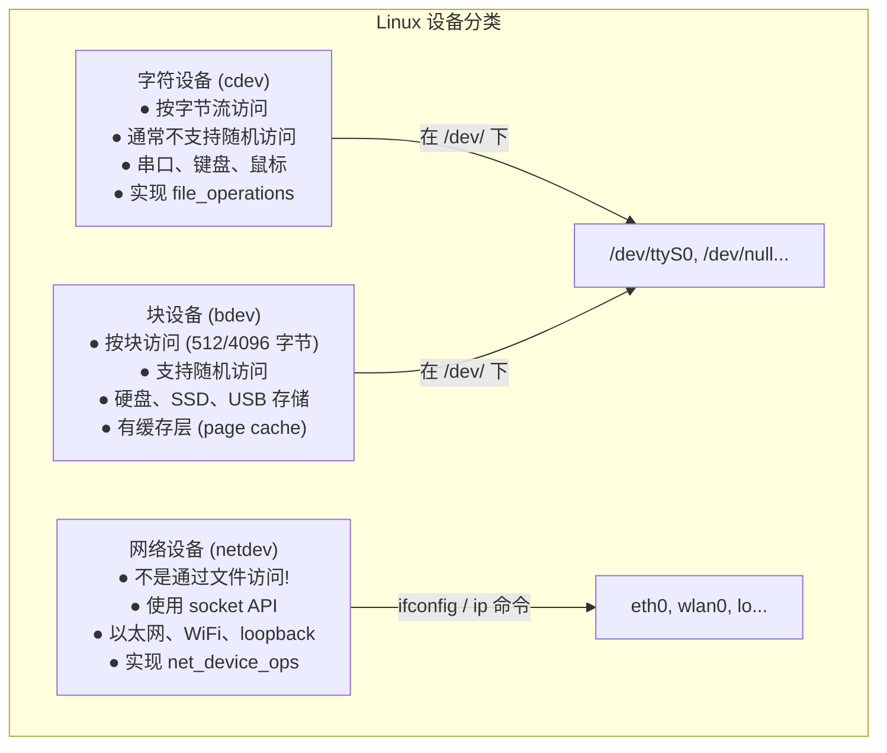
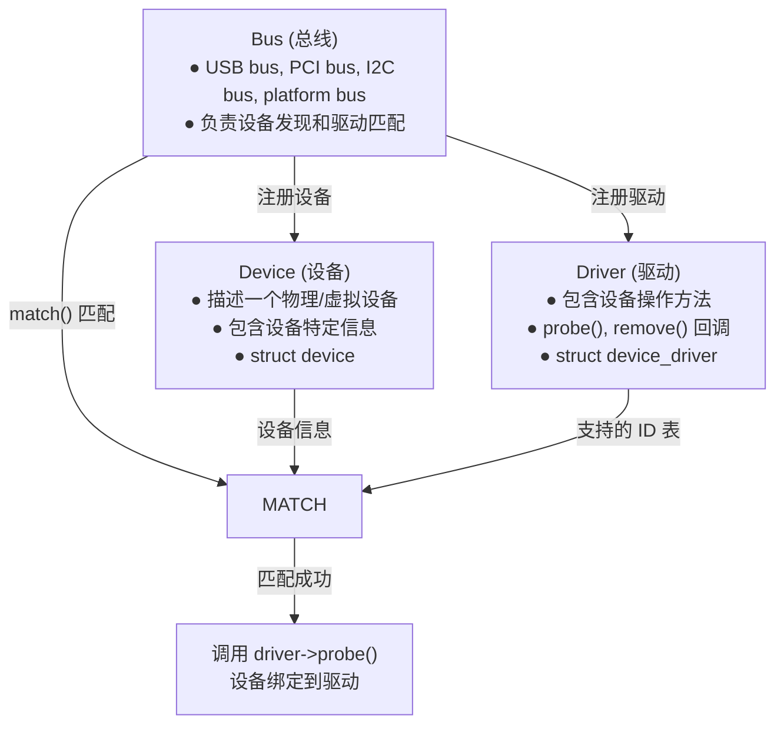
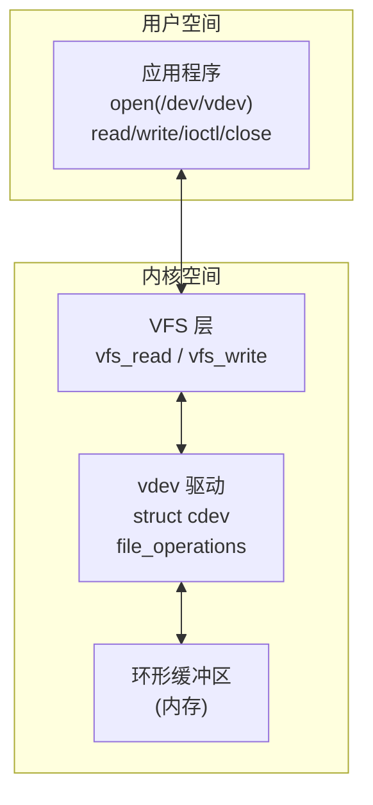
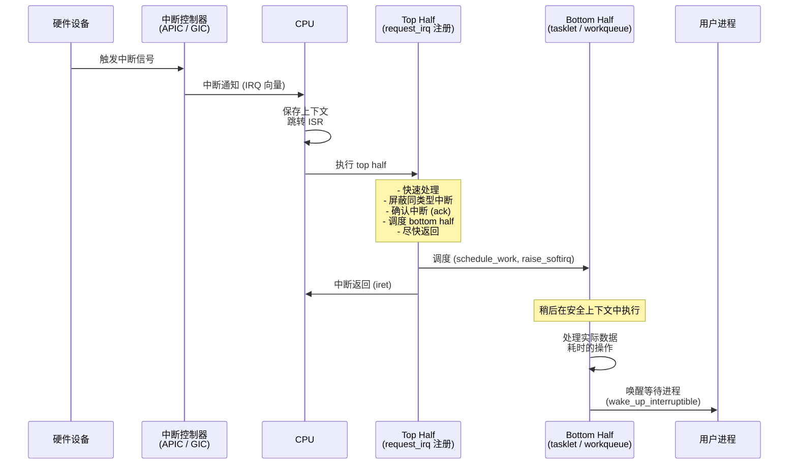

# 设备驱动  (Device Drivers)
---

##  章节概述

>  **本章进入硬件交互的世界**。设备驱动是 Linux 内核中代码量最庞大的子系统（占总代码量的 60% 以上）。它连接了硬件和用户空间——将物理设备抽象为文件，使用户程序可以通过标准的 open/read/write/ioctl 操作硬件。

设备驱动是 C 语言"可移植汇编"特质的最佳展示：它需要操作硬件寄存器、处理中断、管理 DMA，同时向用户空间提供统一的文件接口。本章将带你从零编写一个完整的字符设备驱动，并深入理解内核的设备模型。

本章内容：
- **Linux 设备模型**：bus、device、driver 的绑定机制
- **字符设备驱动**：完整的 file_operations 实现
- **设备文件**：major/minor 编号、/dev 目录、device_create
- **ioctl 接口**：设备控制命令
- **中断处理**：request_irq、top half / bottom half
- **Rust 对比**：同一驱动的 C 和 Rust 实现对比

**前置要求**：
- 已学完 [[03_文件系统|文件系统]]（彻底理解 file_operations 和 VFS）
- 已学完 [[../../c语言教程/2深化/05_位运算与硬件操作|位运算与硬件操作]]（volatile、内存映射 IO、位操作）
- 已学完 [[../../c语言教程/2深化/07_面向对象C编程|面向对象C编程]]（理解驱动中的"对象"——每个设备实例的结构体）
- 建议阅读 [[../../cpp教程/cpp深化教程/05_面向对象(一)类与对象基础|CPP: 类与对象]]（对比 C 和 C++ 的封装方式）

---
###  第一节：Linux 设备模型
---

### 1.1 三种设备类型



### 1.2 设备模型三要素：Bus、Device、Driver



```c
// ============================================
// 设备模型的注册与匹配
// ============================================

// 1. 平台总线 (platform bus) — 最常用的虚拟总线
//    用于 SoC 上集成的外设 (没有物理热插拔总线的设备)
//    如: 串口、GPIO、I2C 控制器等

#include <linux/platform_device.h>

// 平台设备: 描述一个 SoC 外设的资源 (MMIO 地址, IRQ 号等)
static struct resource my_device_resources[] = {
    [0] = DEFINE_RES_MEM(0xF0000000, 0x1000),  // MMIO 寄存器区域
    [1] = DEFINE_RES_IRQ(42),                    // 中断号
};

static struct platform_device my_device = {
    .name           = "my_device",      // 用于与驱动匹配
    .id             = -1,               // -1 = 只有一个实例
    .num_resources  = ARRAY_SIZE(my_device_resources),
    .resource       = my_device_resources,
};

// 平台驱动: 实现设备操作
static int my_probe(struct platform_device *pdev)
{
    struct resource *res;
    void __iomem *regs;
    
    // 获取 MMIO 资源
    res = platform_get_resource(pdev, IORESOURCE_MEM, 0);
    // 映射物理地址到内核虚拟地址
    regs = devm_ioremap_resource(&pdev->dev, res);
    if (IS_ERR(regs))
        return PTR_ERR(regs);
    
    // 获取 IRQ 资源
    int irq = platform_get_irq(pdev, 0);
    
    // 注册中断处理程序
    int ret = devm_request_irq(&pdev->dev, irq, my_isr,
                                0, "my_device", pdev);
    
    dev_info(&pdev->dev, "Device probed successfully\n");
    return 0;
}

static int my_remove(struct platform_device *pdev)
{
    dev_info(&pdev->dev, "Device removed\n");
    return 0;
}

// 匹配表: 定义驱动支持的设备名称
static const struct of_device_id my_of_match[] = {
    { .compatible = "vendor,my-device" },  // 设备树匹配
    {},
};
MODULE_DEVICE_TABLE(of, my_of_match);

static struct platform_driver my_driver = {
    .probe    = my_probe,
    .remove   = my_remove,
    .driver   = {
        .name  = "my_device",
        .of_match_table = my_of_match,
        .owner = THIS_MODULE,
    },
};

module_platform_driver(my_driver);  // 注册/注销 platform_driver
```

### 1.3 设备和驱动的 sysfs 表示

```bash
# sysfs 将设备模型暴露为用户可查看的文件系统
ls /sys/bus/          # 所有总线类型
ls /sys/bus/pci/devices/  # PCI 总线上的所有设备
ls /sys/bus/platform/drivers/  # 平台总线上的所有驱动
ls /sys/devices/      # 所有设备的层次结构

# 查看设备树信息 (如果有)
ls /sys/firmware/devicetree/

# 查看某个设备的信息
cat /sys/devices/system/cpu/cpu0/uevent

# 设备事件 (热插拔)
udevadm monitor --property  # 监听设备热插拔事件
```

---
###  第二节：字符设备驱动完整示例
---

### 2.1 驱动概述

我们将实现一个"虚拟字符设备"——它在内存中模拟一个简单的环形缓冲区，支持常规的文件读写操作。这是一个完整的、可以直接编译加载的驱动。



### 2.2 完整驱动代码

```c
// ============================================
// vdev.c —— 一个完整的内核字符设备驱动
// 功能: 环形缓冲, 支持 read/write/ioctl/llseek
// 编译: 作为独立内核模块
// ============================================

#include <linux/module.h>
#include <linux/kernel.h>
#include <linux/init.h>
#include <linux/fs.h>           // file_operations, struct cdev
#include <linux/cdev.h>         // cdev_init, cdev_add
#include <linux/device.h>       // device_create, class_create
#include <linux/slab.h>         // kmalloc, kfree
#include <linux/uaccess.h>      // copy_to_user, copy_from_user
#include <linux/mutex.h>        // mutex (替代自旋锁用于可睡眠上下文)
#include <linux/sched.h>

MODULE_LICENSE("GPL");
MODULE_AUTHOR("Tutorial");
MODULE_DESCRIPTION("A virtual character device with ring buffer");

// ============================================
// 设备参数
// ============================================
#define VDEV_NAME       "vdev"
#define VDEV_CLASS      "vdev_class"
#define VDEV_BUF_SIZE   4096        // 环形缓冲区大小 (4KB)
#define VDEV_DEV_MAJOR  0           // 0 = 动态分配主设备号

// ============================================
// 驱动私有数据结构
// 每个设备实例一个 (这里只有一个实例)
// ============================================
struct vdev_device {
    struct cdev     cdev;             // 字符设备核心结构
    struct device   *device;          // 设备节点
    dev_t           devno;            // 设备号 (major + minor)
    
    char            *buf;             // 环形缓冲区
    size_t          size;             // 缓冲区大小
    size_t          head;             // 写指针 (下一个写入位置)
    size_t          tail;             // 读指针 (下一个读取位置)
    size_t          count;            // 缓冲区中当前可读字节数
    
    struct mutex    lock;             // 互斥锁 (保护并发访问)
    wait_queue_head_t read_wq;       // 读等待队列 (阻塞读)
    wait_queue_head_t write_wq;      // 写等待队列 (阻塞写)
};

static struct vdev_device *vdev_dev;

// ============================================
// 辅助函数: 环形缓冲区操作
// ============================================

// 判断缓冲区是否为空/满
static inline bool buf_is_empty(struct vdev_device *d) {
    return d->count == 0;
}
static inline bool buf_is_full(struct vdev_device *d) {
    return d->count == d->size;
}
// 获取可写空间
static inline size_t buf_avail_write(struct vdev_device *d) {
    return d->size - d->count;
}
// 获取可读字节数
static inline size_t buf_avail_read(struct vdev_device *d) {
    return d->count;
}

// 写入一个字节到环形缓冲区
static int buf_write_byte(struct vdev_device *d, char byte)
{
    if (buf_is_full(d))
        return -ENOSPC;
    
    d->buf[d->head] = byte;
    d->head = (d->head + 1) % d->size;
    d->count++;
    return 1;
}

// 从环形缓冲区读取一个字节
static int buf_read_byte(struct vdev_device *d, char *byte)
{
    if (buf_is_empty(d))
        return -EAGAIN;
    
    *byte = d->buf[d->tail];
    d->tail = (d->tail + 1) % d->size;
    d->count--;
    return 1;
}

// ============================================
// file_operations 实现
// ============================================

// 打开设备
static int vdev_open(struct inode *inode, struct file *filp)
{
    struct vdev_device *d;
    
    // 从 inode 获取设备实例
    d = container_of(inode->i_cdev, struct vdev_device, cdev);
    filp->private_data = d;  // 保存到 file, 供后续操作使用
    
    // 非阻塞模式?
    if (filp->f_flags & O_NONBLOCK)
        pr_debug("vdev: opened in non-blocking mode\n");
    
    pr_info("vdev: device opened\n");
    return 0;
}

// 释放设备 (对应 close)
static int vdev_release(struct inode *inode, struct file *filp)
{
    pr_info("vdev: device closed\n");
    return 0;
}

// 从设备读取数据
static ssize_t vdev_read(struct file *filp, char __user *buf,
                          size_t count, loff_t *ppos)
{
    struct vdev_device *d = filp->private_data;
    ssize_t retval = 0;
    
    if (count == 0)
        return 0;
    
    // 获取互斥锁
    if (mutex_lock_interruptible(&d->lock))
        return -ERESTARTSYS;  // 被信号中断
    
    // 等待数据可用 (非阻塞模式直接返回)
    while (buf_is_empty(d)) {
        mutex_unlock(&d->lock);
        if (filp->f_flags & O_NONBLOCK)
            return -EAGAIN;
        
        pr_debug("vdev: read blocking, no data\n");
        // 睡眠, 等待 write 方写入数据后唤醒
        if (wait_event_interruptible(d->read_wq,
                                      !buf_is_empty(d)))
            return -ERESTARTSYS;  // 被信号唤醒
        
        if (mutex_lock_interruptible(&d->lock))
            return -ERESTARTSYS;
    }
    
    // 逐字节读取 (生产代码中应该批量拷贝)
    while (count > 0 && !buf_is_empty(d)) {
        char byte;
        buf_read_byte(d, &byte);
        
        if (copy_to_user(buf, &byte, 1)) {
            retval = retval ? : -EFAULT;
            break;
        }
        
        buf++;
        count--;
        retval++;
    }
    
    mutex_unlock(&d->lock);
    
    // 唤醒等待的写者 (因为现在有空间了)
    if (!buf_is_full(d))
        wake_up_interruptible(&d->write_wq);
    
    return retval;
}

// 向设备写入数据
static ssize_t vdev_write(struct file *filp, const char __user *buf,
                           size_t count, loff_t *ppos)
{
    struct vdev_device *d = filp->private_data;
    ssize_t retval = 0;
    
    if (count == 0)
        return 0;
    
    if (mutex_lock_interruptible(&d->lock))
        return -ERESTARTSYS;
    
    // 等待空间可用
    while (buf_is_full(d)) {
        mutex_unlock(&d->lock);
        if (filp->f_flags & O_NONBLOCK)
            return -EAGAIN;
        
        pr_debug("vdev: write blocking, buffer full\n");
        if (wait_event_interruptible(d->write_wq,
                                      !buf_is_full(d)))
            return -ERESTARTSYS;
        
        if (mutex_lock_interruptible(&d->lock))
            return -ERESTARTSYS;
    }
    
    // 逐字节写入
    while (count > 0 && !buf_is_full(d)) {
        char byte;
        if (copy_from_user(&byte, buf, 1)) {
            retval = retval ? : -EFAULT;
            break;
        }
        
        buf_write_byte(d, byte);
        
        buf++;
        count--;
        retval++;
    }
    
    mutex_unlock(&d->lock);
    
    // 唤醒等待的读者 (因为现在有数据了)
    if (!buf_is_empty(d))
        wake_up_interruptible(&d->read_wq);
    
    return retval;
}

// ioctl —— 设备控制接口
#define VDEV_IOC_MAGIC  'V'
#define VDEV_IOC_RESET      _IO(VDEV_IOC_MAGIC, 0)   // 重置缓冲区
#define VDEV_IOC_GET_SIZE   _IOR(VDEV_IOC_MAGIC, 1, int)  // 获取缓冲区大小
#define VDEV_IOC_GET_COUNT  _IOR(VDEV_IOC_MAGIC, 2, int)  // 获取可读字节数
#define VDEV_IOC_MAXNR      2

static long vdev_ioctl(struct file *filp, unsigned int cmd, unsigned long arg)
{
    struct vdev_device *d = filp->private_data;
    int retval = 0;
    int val;
    
    // 检查魔数
    if (_IOC_TYPE(cmd) != VDEV_IOC_MAGIC)
        return -ENOTTY;
    if (_IOC_NR(cmd) > VDEV_IOC_MAXNR)
        return -ENOTTY;
    
    mutex_lock(&d->lock);
    
    switch (cmd) {
    case VDEV_IOC_RESET:
        // 清空缓冲区
        d->head = 0;
        d->tail = 0;
        d->count = 0;
        pr_info("vdev: buffer reset\n");
        break;
        
    case VDEV_IOC_GET_SIZE:
        val = (int)d->size;
        retval = put_user(val, (int __user *)arg);
        break;
        
    case VDEV_IOC_GET_COUNT:
        val = (int)d->count;
        retval = put_user(val, (int __user *)arg);
        break;
        
    default:
        retval = -ENOTTY;
    }
    
    mutex_unlock(&d->lock);
    return retval;
}

// llseek — 定位文件偏移
// 对于串行设备通常不支持 seek，但这里我们返回当前位置
static loff_t vdev_llseek(struct file *filp, loff_t off, int whence)
{
    loff_t newpos;
    
    switch (whence) {
    case SEEK_SET: newpos = off; break;
    case SEEK_CUR: newpos = filp->f_pos + off; break;
    case SEEK_END: return -EINVAL;  // 无大小概念
    default: return -EINVAL;
    }
    
    if (newpos < 0)
        return -EINVAL;
    
    filp->f_pos = newpos;
    return newpos;
}

// ============================================
// file_operations 注册表
// ============================================
static const struct file_operations vdev_fops = {
    .owner          = THIS_MODULE,
    .open           = vdev_open,
    .release        = vdev_release,
    .read           = vdev_read,
    .write          = vdev_write,
    .unlocked_ioctl = vdev_ioctl,
    .llseek         = vdev_llseek,
};

// ============================================
// 驱动初始化和清理
// ============================================

static struct class *vdev_class;

static int __init vdev_init(void)
{
    int ret;
    
    // === 1. 分配设备结构 ===
    vdev_dev = kzalloc(sizeof(*vdev_dev), GFP_KERNEL);
    if (!vdev_dev)
        return -ENOMEM;
    
    // === 2. 分配设备号 ===
    ret = alloc_chrdev_region(&vdev_dev->devno, 0, 1, VDEV_NAME);
    if (ret < 0) {
        pr_err("vdev: alloc_chrdev_region failed: %d\n", ret);
        goto err_alloc_dev;
    }
    
    pr_info("vdev: major=%d, minor=%d\n",
            MAJOR(vdev_dev->devno), MINOR(vdev_dev->devno));
    
    // === 3. 初始化字符设备 ===
    cdev_init(&vdev_dev->cdev, &vdev_fops);
    vdev_dev->cdev.owner = THIS_MODULE;
    ret = cdev_add(&vdev_dev->cdev, vdev_dev->devno, 1);
    if (ret) {
        pr_err("vdev: cdev_add failed: %d\n", ret);
        goto err_unreg_region;
    }
    
    // === 4. 创建设备类 (/sys/class/vdev_class/) ===
    vdev_class = class_create(VDEV_CLASS);
    if (IS_ERR(vdev_class)) {
        ret = PTR_ERR(vdev_class);
        pr_err("vdev: class_create failed: %d\n", ret);
        goto err_cdev_del;
    }
    
    // === 5. 创建设备文件 (/dev/vdev) ===
    vdev_dev->device = device_create(vdev_class, NULL,
                                      vdev_dev->devno, NULL,
                                      VDEV_NAME);
    if (IS_ERR(vdev_dev->device)) {
        ret = PTR_ERR(vdev_dev->device);
        pr_err("vdev: device_create failed: %d\n", ret);
        goto err_class_destroy;
    }
    
    // === 6. 初始化环形缓冲区 ===
    vdev_dev->buf = kzalloc(VDEV_BUF_SIZE, GFP_KERNEL);
    if (!vdev_dev->buf) {
        ret = -ENOMEM;
        goto err_device_destroy;
    }
    vdev_dev->size = VDEV_BUF_SIZE;
    vdev_dev->head = 0;
    vdev_dev->tail = 0;
    vdev_dev->count = 0;
    
    // === 7. 初始化同步原语 ===
    mutex_init(&vdev_dev->lock);
    init_waitqueue_head(&vdev_dev->read_wq);
    init_waitqueue_head(&vdev_dev->write_wq);
    
    pr_info("vdev: device initialized successfully\n");
    return 0;
    
err_device_destroy:
    device_destroy(vdev_class, vdev_dev->devno);
err_class_destroy:
    class_destroy(vdev_class);
err_cdev_del:
    cdev_del(&vdev_dev->cdev);
err_unreg_region:
    unregister_chrdev_region(vdev_dev->devno, 1);
err_alloc_dev:
    kfree(vdev_dev);
    return ret;
}

static void __exit vdev_exit(void)
{
    kfree(vdev_dev->buf);
    device_destroy(vdev_class, vdev_dev->devno);
    class_destroy(vdev_class);
    cdev_del(&vdev_dev->cdev);
    unregister_chrdev_region(vdev_dev->devno, 1);
    kfree(vdev_dev);
    pr_info("vdev: device removed\n");
}

module_init(vdev_init);
module_exit(vdev_exit);
```

### 2.3 测试驱动

```c
// ============================================
// test_vdev.c —— 用户态测试程序
// ============================================
#include <stdio.h>
#include <stdlib.h>
#include <fcntl.h>
#include <unistd.h>
#include <string.h>
#include <sys/ioctl.h>

// 与驱动中相同的 ioctl 定义
#define VDEV_IOC_MAGIC  'V'
#define VDEV_IOC_RESET      _IO(VDEV_IOC_MAGIC, 0)
#define VDEV_IOC_GET_SIZE   _IOR(VDEV_IOC_MAGIC, 1, int)
#define VDEV_IOC_GET_COUNT  _IOR(VDEV_IOC_MAGIC, 2, int)

int main(void)
{
    int fd, val;
    char buf[128];
    
    fd = open("/dev/vdev", O_RDWR);
    if (fd < 0) {
        perror("open");
        return 1;
    }
    
    // 测试写入
    if (write(fd, "Hello, kernel device!", 21) != 21) {
        perror("write");
    }
    
    // 测试 ioctl: 获取可读字节数
    if (ioctl(fd, VDEV_IOC_GET_COUNT, &val) == 0) {
        printf("Bytes available to read: %d\n", val);
    }
    
    // 测试读取
    memset(buf, 0, sizeof(buf));
    if (read(fd, buf, sizeof(buf)) > 0) {
        printf("Read from device: '%s'\n", buf);
    }
    
    // 测试 ioctl: 重置
    ioctl(fd, VDEV_IOC_RESET, NULL);
    ioctl(fd, VDEV_IOC_GET_COUNT, &val);
    printf("After reset, count = %d\n", val);
    
    close(fd);
    return 0;
}
```

```bash
# 编译和测试步骤:
# 1. make                (编译驱动模块)
# 2. sudo insmod vdev.ko
# 3. ls -l /dev/vdev     (查看设备文件)
#    crw------- 1 root root 242, 0 Jun 16 10:00 /dev/vdev
#    ↑ c = 字符设备, 242 = 主设备号, 0 = 次设备号
# 4. sudo chmod 666 /dev/vdev  (允许普通用户访问)
# 5. gcc -o test_vdev test_vdev.c
# 6. ./test_vdev
# 7. dmesg | tail        (查看内核日志)
# 8. sudo rmmod vdev
```

```c
// 练习 1: 调试与追踪
// 1. 观察 /proc/devices 中注册的字符设备
//    cat /proc/devices | grep vdev
//
// 2. 观察 sysfs 中设备的属性
//    ls /sys/class/vdev_class/vdev/
//    cat /sys/class/vdev_class/vdev/dev
//
// 3. 使用 strace 观察测试程序对设备文件的系统调用
//    strace ./test_vdev
//
// 4. 使用 perf 追踪驱动函数
//    sudo perf record -e 'sched:*' -g -- ./test_vdev
```

---
###  第三节：主设备号与次设备号
---

### 3.1 设备号的本质

```c
// Linux 的设备号是 32 位整数 (dev_t)
//   - 高 12 位: 主设备号 (Major) —— 标识驱动程序
//   - 低 20 位: 次设备号 (Minor) —— 标识设备实例
//
// 例如: 主=242, 次=0 → MKDEV(242,0) = 242 << 20 | 0

// 设备号相关宏和函数
dev_t devno;

// MKDEV(major, minor) —— 构造设备号
devno = MKDEV(242, 0);

// MAJOR(devno) —— 获取主设备号
unsigned int major = MAJOR(devno);  // = 242

// MINOR(devno) —— 获取次设备号
unsigned int minor = MINOR(devno);  // = 0

// 分配设备号 (动态)
int alloc_chrdev_region(&devno, baseminor, count, name);
// 释放设备号
void unregister_chrdev_region(devno, count);

// 注册设备号 (静态, 需要指定)
int register_chrdev_region(devno, count, name);
```

### 3.2 /dev 下的设备文件

```bash
# 查看已注册的字符/块设备
cat /proc/devices

# Character devices:
#   1 mem
#   4 tty
#   5 /dev/tty
#   7 vcs
#  10 misc
#  13 input
# 242 vdev           ← 我们的设备!

# Block devices:
#   8 sd
#   9 md
# 259 blkext

# 手动创建节点 (mknod):
# mknod /tmp/mydev c 242 0
# c = 字符设备, 242 = 主设备号, 0 = 次设备号
```

---
###  第四节：中断处理
---

### 4.1 Top Half 与 Bottom Half



### 4.2 中断处理核心代码

```c
// ============================================
// 中断处理示例: 假设一个数据采集设备
// ============================================

#include <linux/interrupt.h>
#include <linux/workqueue.h>

// 设备私有数据 (扩展版)
struct my_device {
    void __iomem    *regs;      // MMIO 寄存器
    int             irq;        // 中断号
    
    // Bottom half 选项 1: work_struct (进程上下文, 可睡眠)
    struct work_struct bh_work;
    struct workqueue_struct *wq;
    
    // Bottom half 选项 2: tasklet (中断上下文, 不可睡眠)
    struct tasklet_struct bh_tasklet;
    
    // 中断统计数据
    unsigned long   irq_count;
    
    // 数据缓冲
    unsigned char   *rx_buf;
    size_t          rx_len;
    
    wait_queue_head_t data_wq;  // 等待数据的进程队列
};

// ============================================
// Top Half: 中断服务例程 (ISR)
// ============================================

// 中断处理函数 (top half)
// 要求:
//   - 快速执行 (不能做耗时操作)
//   - 不能睡眠 (不能调用可能阻塞的函数)
//   - 不能访问用户空间内存
//   - 在此期间相同 IRQ 线被屏蔽
static irqreturn_t my_device_isr(int irq, void *dev_id)
{
    struct my_device *dev = (struct my_device *)dev_id;
    u32 status;
    
    // 1. 读取中断状态寄存器, 确认是否是我们的中断
    status = ioread32(dev->regs + IRQ_STATUS_REG);
    
    if (!(status & IRQ_DATA_READY))
        return IRQ_NONE;  // 不是我们的中断 (共享 IRQ 线的情况)
    
    // 2. 确认 (ack) 中断 — 清除硬件中断标志
    iowrite32(IRQ_ACK, dev->regs + IRQ_ACK_REG);
    
    // 3. 快速读取数据到缓冲区 (少量)
    //    (大多数数据拷贝留给 bottom half)
    dev->irq_count++;
    
    // 4. 调度 bottom half
    // 选项 A: 使用 work_struct (进程上下文)
    queue_work(dev->wq, &dev->bh_work);
    
    // 选项 B: 使用 tasklet (中断上下文, 更轻量)
    // tasklet_schedule(&dev->bh_tasklet);
    
    return IRQ_HANDLED;
}

// ============================================
// Bottom Half 选项 1: work_struct (进程上下文)
// ============================================

static void my_device_work_handler(struct work_struct *work)
{
    // container_of 从 work_struct 反推设备结构
    struct my_device *dev = container_of(work, struct my_device, bh_work);
    u32 data;
    
    // 可以在进程上下文中执行耗时操作:
    //   - 读取大量数据
    //   - 进行复杂计算
    //   - 调用可能睡眠的函数
    //   - 复制数据到用户空间 (但不能直接这样做)
    
    // 读取硬件数据
    data = ioread32(dev->regs + DATA_REG);
    
    // 存储到缓冲区
    if (dev->rx_len < BUFFER_SIZE) {
        // (简化) 存储数据
        dev->rx_len++;
    }
    
    // 唤醒等待数据的进程
    wake_up_interruptible(&dev->data_wq);
}

// ============================================
// Bottom Half 选项 2: tasklet (中断上下文)
// ============================================

static void my_device_tasklet_handler(unsigned long data)
{
    struct my_device *dev = (struct my_device *)data;
    u32 val;
    
    // tasklet 运行在中断上下文:
    //   - 不能睡眠
    //   - 不能调用 schedule()
    //   - 可以使用 GFP_ATOMIC 分配内存
    //   - 比 work_struct 轻量 (调度开销更小)
    
    val = ioread32(dev->regs + DATA_REG);
    // 快速处理...
}

// ============================================
// 初始化: 注册中断
// ============================================

static int my_device_init(struct my_device *dev, int irq)
{
    int ret;
    
    dev->irq = irq;
    
    // 初始化 work_struct
    INIT_WORK(&dev->bh_work, my_device_work_handler);
    
    // 创建专用工作队列 (也可以使用系统默认的 system_wq)
    dev->wq = alloc_workqueue("my_device_wq", WQ_UNBOUND, 1);
    if (!dev->wq)
        return -ENOMEM;
    
    // 初始化 tasklet
    tasklet_init(&dev->bh_tasklet, my_device_tasklet_handler,
                 (unsigned long)dev);
    
    // 初始化等待队列
    init_waitqueue_head(&dev->data_wq);
    
    // 注册中断处理
    // flags:
    //   IRQF_SHARED  — 允许多个设备共享此 IRQ 线
    //   IRQF_ONESHOT — 中断处理期间保持屏蔽
    //   IRQF_TRIGGER_RISING — 上升沿触发
    ret = request_irq(irq,          // IRQ 号
                      my_device_isr, // ISR 函数
                      IRQF_SHARED,   // 标志
                      "my_device",   // 名称 (显示在 /proc/interrupts)
                      dev);          // dev_id (传给 ISR, 用于区分共享设备)
    if (ret) {
        destroy_workqueue(dev->wq);
        return ret;
    }
    
    return 0;
}

// ============================================
// 清理: 释放中断
// ============================================
static void my_device_cleanup(struct my_device *dev)
{
    // 释放 IRQ (确保没有正在执行的 ISR)
    free_irq(dev->irq, dev);
    
    // 等待 work 执行完毕并清理
    cancel_work_sync(&dev->bh_work);
    destroy_workqueue(dev->wq);
    
    // tasklet 在 module_exit 时会自动清理
    tasklet_kill(&dev->bh_tasklet);
}
```

### 4.3 中断统计与调试

```bash
# 查看中断统计
cat /proc/interrupts
#            CPU0       CPU1       CPU2       CPU3
#   0:         34          0          0          0   IO-APIC   2-edge      timer
#   1:          9          0          0          0   IO-APIC   1-edge      i8042
#   8:          0          1          0          0   IO-APIC   8-edge      rtc0
#   9:          0          0          0          0   IO-APIC   9-fasteoi   acpi
#  16:         33          0          1          0   IO-APIC  16-fasteoi   ehci_hcd:usb1
#  42:        123          0          0          0   IO-APIC  42-fasteoi   my_device
#   ↑         ↑                                  ↑
#  IRQ号    各CPU中断次数                      设备名

# 查看中断中消耗的 CPU 时间
cat /proc/stat | grep -E "^intr|^softirq"

# 查看 bottom half (softirq) 统计
cat /proc/softirqs
#                CPU0       CPU1
#        HI:          0          0
#     TIMER:    1234567     987654
#    NET_TX:       1234       5678
#    NET_RX:      56789      12345
#     BLOCK:       1234       2345
#   TASKLET:        100         50
#     SCHED:       1234       2345
#   HRTIMER:      56789      12345
#       RCU:     123456     654321

# 使用 perf 追踪中断
sudo perf record -e irq:irq_handler_entry -e irq:irq_handler_exit -a -- sleep 10
sudo perf script
```

```c
// 练习 2: 中断实验
// 1. 编写一个简单的内核模块, 使用 timer (非硬件中断) 模拟中断:
//    - 使用 setup_timer 每秒触发一次定时器
//    - 在定时器回调中模拟"硬件中断" → 调度 work_struct
//    - 观察 /proc/interrupts 和 /proc/softirqs 的变化
//
// 2. 测量 bottom half 的调度延迟:
//    在 top half 中记录 ktime_get()
//    在 bottom half 中计算差值
//
// 3. 对比 tasklet 和 work_struct 的性能:
//    分别测量两者从调度到执行的平均延迟
```

---
###  第五节：C 驱动 vs Rust 驱动对比
---

### 5.1 为什么对比

关于 Rust 与 C 驱动开发的对比，Rust 正在进入 Linux 内核驱动程序开发。以下是一个精简的对比：

```c
// ============================================
// C 驱动中常见的错误模式
// ============================================

// 错误 1: 使用后释放 (Use-After-Free)
static void c_use_after_free(struct my_dev *dev)
{
    char *buf = kmalloc(1024, GFP_KERNEL);
    // ... 使用 buf ...
    kfree(buf);
    // BUG! buf 已释放
    printk(KERN_INFO "data: %c\n", buf[0]);  // UAF! C 编译器不检查
}

// 错误 2: 忘记检查返回值
static int c_forget_check(void *ptr)
{
    // 如果 ptr == NULL, 下面的访问导致内核崩溃
    void *new_ptr = krealloc(ptr, 1024, GFP_KERNEL);
    memcpy(new_ptr, data, 1024);  // BUG! new_ptr 可能为 NULL
    return 0;
}

// 错误 3: 并发数据竞争
static int c_race_condition(struct my_dev *dev)
{
    // 多个 CPU 可能同时执行这里
    dev->counter++;  // BUG! 非原子操作, 需要加锁或使用 atomic_t
    return dev->counter;
}

// 错误 4: 忘记释放资源 (goto 错误处理)
static int c_resource_leak(void)
{
    void *a = kmalloc(256, GFP_KERNEL);
    if (!a) return -ENOMEM;
    
    void *b = kmalloc(512, GFP_KERNEL);
    if (!b) {
        // BUG! 忘记 kfree(a)
        return -ENOMEM;
    }
    // ...
    kfree(b);
    kfree(a);
    return 0;
}
```

```c
// ============================================
// C 驱动中的正确模式
// ============================================

// 模式: 使用 goto 进行统一错误处理
static int c_correct_error_handling(void)
{
    void *a = NULL, *b = NULL;
    int ret = 0;
    
    a = kmalloc(256, GFP_KERNEL);
    if (!a) {
        ret = -ENOMEM;
        goto out;
    }
    
    b = kmalloc(512, GFP_KERNEL);
    if (!b) {
        ret = -ENOMEM;
        goto out_free_a;
    }
    
    // ... 正常操作 ...
    
out_free_a:
    kfree(b);
out:
    kfree(a);
    return ret;
}

// 模式: 使用 devm_* 系列函数 (managed resources)
// 当设备从系统中移除时, 内核自动释放这些资源
static int c_managed_resources(struct platform_device *pdev)
{
    void __iomem *regs;
    
    // devm_ioremap_resource 会自动管理映射
    regs = devm_platform_ioremap_resource(pdev, 0);
    if (IS_ERR(regs))
        return PTR_ERR(regs);
    
    // devm_kzalloc 在设备移除时自动释放
    struct my_dev *dev = devm_kzalloc(&pdev->dev, sizeof(*dev), GFP_KERNEL);
    if (!dev)
        return -ENOMEM;
    
    return 0;
    // 不需要显式清理! 设备移除时内核自动分析 devm_* 链表并释放
}

// 模式: 使用 RCU 实现无锁读
// (详见 [[06_并发与同步|并发与同步]])
```

```c
// ============================================
// Rust 驱动对应实现 (关键优势对比)

// ============================================

// 在 Rust 中:
// 
// 1. 使用后释放 → 编译时拒绝
//    let data = kmalloc(1024)?;
//    kfree(data);  // data 的所有权被转移
//    printk!("{}", data[0]);  // 编译错误! data 已被移动
//
// 2. 空指针 → 使用 Option<T> 和 Result<T>
//    let ptr = krealloc(ptr, 1024)?;  // ? 操作符在失败时传播错误
//    memcpy(ptr, data, 1024);         // ptr 保证非空
//
// 3. 数据竞争 → 所有权和借用检查
//    let mut guard = dev.lock.lock();
//    guard.counter += 1;  // 互斥锁保证独占访问
//
// 4. 资源泄漏 → RAII (Drop trait)
//    资源在离开作用域时自动释放
//
// 这意味着约 70% 的 C 安全漏洞 (根据 Google/MS 统计)
// 在 Rust 中根本无法编译通过!

// C 和 Rust 的关系: 互补而非替代
//
// C 的优势:
//   - 30 年内核代码积累
//   - 所有架构的完整支持
//   - 开发者生态成熟
//   - 更简单的编译模型
//
// Rust 的优势:
//   - 编译时的内存安全保证
//   - 现代化类型系统 (泛型、trait)
//   - 更好的错误处理
//   - 新驱动代码更少的 CVE
//
// 未来: C 负责核心和现有驱动, Rust 负责新驱动
```

```c
// 练习 3: 驱动对比分析
// 1. 阅读 fs/nvme/ 下的 NVMe 驱动 (C 版本)
// 2. 比较 Rust 版本 (如果可用)
// 3. 找出 C 版本中可能需要人工审查的内存安全点 (5 处以上)
// 4. 阅读内核邮件列表, 了解最近因内存问题引入的 CVE
//    搜索: git log --grep="CVE" --oneline drivers/
```

---
##  章节测试
---

> [!question] 判断题 1
> 字符设备驱动通过实现 `file_operations` 结构体来向用户空间提供文件操作接口。 （ ）
> - [ ]  正确
> - [ ]  错误
>
> > [!success]- 点击查看答案
> > 答案: 正确
> >
> > **解析**: 字符设备驱动必须实现 `file_operations`（至少 open、release、read、write 中的部分），然后通过 `cdev_add()` 注册到 VFS。用户空间程序在 `/dev/` 下打开设备文件时，VFS 将调用派发到驱动的对应方法。

> [!question] 判断题 2
> 中断处理程序（top half）中可以安全地调用 `kmalloc(..., GFP_KERNEL)`。 （ ）
> - [ ]  正确
> - [ ]  错误
>
> > [!success]- 点击查看答案
> > 答案: 错误
> >
> > **解析**: 中断处理程序运行在中断上下文中，不能睡眠。`GFP_KERNEL` 可能触发页面回收（需要磁盘 IO，会睡眠）。在 ISR 中应使用 `GFP_ATOMIC`。更好的做法是将耗时的内存分配移到 bottom half（work_struct）中。

> [!question] 判断题 3
> Linux 内核使用 32 位 `dev_t`，其中高 12 位为主设备号，低 20 位为次设备号。 （ ）
> - [ ]  正确
> - [ ]  错误
>
> > [!success]- 点击查看答案
> > 答案: 正确
> >
> > **解析**: dev_t 是 32 位整数。12 位主设备号 (0-4095) 标识驱动，20 位次设备号 (0-1048575) 标识设备实例。这意味着理论上每种驱动可以支持超过 100 万个设备实例。

> [!question] 判断题 4
> tasklet 和 work_struct 的 bottom half 都可以睡眠。 （ ）
> - [ ]  正确
> - [ ]  错误
>
> > [!success]- 点击查看答案
> > 答案: 错误
> >
> > **解析**: tasklet 运行在中断上下文（bottom half 通过 softirq 实现），不能睡眠。work_struct 运行在进程上下文（内核线程），可以睡眠。因此耗时操作应使用 work_struct，极轻量操作可以使用 tasklet。

> [!question] 判断题 5
> `request_irq()` 注册的中断处理函数可以通过 dev_id 参数在共享中断线时区分设备。 （ ）
> - [ ]  正确
> - [ ]  错误
>
> > [!success]- 点击查看答案
> > 答案: 正确
> >
> > **解析**: 当多个设备共享同一 IRQ 线时，每个设备的 ISR 都会被调用。ISR 通过检查设备自己的中断状态寄存器来判断中断是否来自本设备。如果不是，返回 `IRQ_NONE`。`dev_id` 参数用于区分和传递设备上下文。

> [!question] 判断题 6
> `copy_to_user()` 和 `copy_from_user()` 可以在中断上下文中安全使用。 （ ）
> - [ ]  正确
> - [ ]  错误
>
> > [!success]- 点击查看答案
> > 答案: 错误
> >
> > **解析**: `copy_to_user()` 和 `copy_from_user()` 可能触发页面错误（如果用户空间页面被换出），导致进程睡眠。它们必须在进程上下文中使用（即 current 必须指向一个用户进程）。在中断上下文中，没有"当前进程"的概念。

> [!question] 判断题 7
> 平台总线（platform bus）用于连接 USB 和 PCI 等热插拔设备。 （ ）
> - [ ]  正确
> - [ ]  错误
>
> > [!success]- 点击查看答案
> > 答案: 错误
> >
> > **解析**: 平台总线用于 SoC 上集成的非可发现外设（没有标准总线枚举机制）。知道设备存在是因为设备树（Device Tree）或静态平台设备注册。USB 和 PCI 有自己的专用总线（usb_bus_type、pci_bus_type）和热插拔发现机制。

> [!question] 判断题 8
> `devm_*` 系列函数（如 `devm_kzalloc`）分配的资源在模块卸载时由模块作者手动释放。 （ ）
> - [ ]  正确
> - [ ]  错误
>
> > [!success]- 点击查看答案
> > 答案: 错误
> >
> > **解析**: devm_* (managed device resources) 在设备移除（`driver->remove()` 返回后）由设备模型自动释放。开发者不需要（也不应该）在这些资源上调用对应的释放函数。这极大地简化了错误处理，减少了资源泄漏。

> [!question] 判断题 9
> 网络设备驱动程序像字符设备一样通过 `/dev/` 下的文件节点访问。 （ ）
> - [ ]  正确
> - [ ]  错误
>
> > [!success]- 点击查看答案
> > 答案: 错误
> >
> > **解析**: 网络设备（如 eth0、wlan0）不是通过文件系统访问的，而是通过 socket API（`socket()`, `send()`, `recv()` 等）。网络设备模型使用 `struct net_device` 和 `struct net_device_ops`，与字符/块设备模型完全不同。

> [!question] 判断题 10
> Rust 内核驱动的一个关键优势是其所有权系统在编译时防止了 UAF 和内存泄漏漏洞。 （ ）
> - [ ]  正确
> - [ ]  错误
>
> > [!success]- 点击查看答案
> > 答案: 正确
> >
> > **解析**: Rust 的所有权系统（ownership）、借用检查器（borrow checker）和生命周期（lifetimes）在编译时保证了内存安全——不存在 use-after-free、double-free、buffer overflow（在 safe Rust 中）。这些是 C 驱动中最常见的严重漏洞类别（约 70%）。详见 Linux 内核 Rust 基础设施相关文档。

---

> [!question] 选择题 1
> 以下哪个函数用于向内核注册一个字符设备？
> - [ ] A. `register_blkdev()`
> - [ ] B. `alloc_chrdev_region() + cdev_init() + cdev_add()`
> - [ ] C. `register_netdev()`
> - [ ] D. `device_create()`
>
> > [!success]- 点击查看答案
> > 正确答案: B
> >
> > **解析**: 完整的字符设备注册流程是：`alloc_chrdev_region()` 分配设备号 → `cdev_init()` 初始化 `struct cdev` 并绑定 `file_operations` → `cdev_add()` 将设备添加到 VFS。`device_create()` 是后续步骤，用于在 `/dev` 下创建设备文件。

> [!question] 选择题 2
> 设备驱动中对硬件寄存器的访问应该使用哪个关键字修饰指针？
> - [ ] A. `restrict`
> - [ ] B. `const`
> - [ ] C. `volatile`
> - [ ] D. `static`
>
> > [!success]- 点击查看答案
> > 正确答案: C
> >
> > **解析**: `volatile` 告诉编译器不要优化对指定地址的读写——每次访问都必须生成实际的内存访问指令，不能缓存到寄存器中。硬件寄存器的值可能在任何时刻变化（由硬件修改），编译器不知道这一点。详见 [[../../c语言教程/2深化/05_位运算与硬件操作|位运算与硬件操作]]。

> [!question] 选择题 3
> 以下哪种 bottom half 机制可以睡眠？
> - [ ] A. tasklet
> - [ ] B. softirq
> - [ ] C. work_struct (workqueue)
> - [ ] D. timer callback
>
> > [!success]- 点击查看答案
> > 正确答案: C
> >
> > **解析**: work_struct 通过工作队列（workqueue）在内核线程的进程上下文中执行，可以睡眠。tasklet、softirq 和 timer 回调都运行在中断上下文（或 softirq 上下文）中，不能睡眠。

> [!question] 选择题 4
> `container_of` 宏在内核驱动中的主要用途是什么？
> - [ ] A. 检查内存是否在容器范围内
> - [ ] B. 从内嵌的结构体成员指针反推出包含它的父结构体指针
> - [ ] C. 计算结构体的内存占用大小
> - [ ] D. 比较两个结构体是否相等
>
> > [!success]- 点击查看答案
> > 正确答案: B
> >
> > **解析**: `container_of(ptr, type, member)` 是内核中最常用的宏之一。给定一个内嵌成员的指针，它计算出包含该成员的父结构体的地址。例如从 `struct cdev` 的指针反推出包含它的 `struct vdev_device` 指针。

> [!question] 选择题 5
> `ioctl` 命令中，`_IO`, `_IOR`, `_IOW`, `_IOWR` 宏的区别是什么？
> - [ ] A. 分别对应 0/1/2/3 号命令
> - [ ] B. 指示数据传输方向：无数据/读/写/读写
> - [ ] C. 指定不同的中断优先级
> - [ ] D. 区分不同的设备类型（字符/块/网络）
>
> > [!success]- 点击查看答案
> > 正确答案: B
> >
> > **解析**: `_IO(type, nr)` = 无数据传输；`_IOR(type, nr, datatype)` = 从设备读取数据到用户空间；`_IOW(...)` = 从用户空间写入数据到设备；`_IOWR(...)` = 双向传输。内核用这些信息验证用户传递的缓冲区大小和方向。

> [!question] 选择题 6
> 以下哪种情况适合使用 `GFP_ATOMIC`？
> - [ ] A. 在文件系统 write() 路径中分配内存
> - [ ] B. 在中断处理程序（ISR）中分配内存
> - [ ] C. 在用户进程上下文中分配大块内存
> - [ ] D. 在模块初始化函数中分配内存
>
> > [!success]- 点击查看答案
> > 正确答案: B
> >
> > **解析**: `GFP_ATOMIC` 是为原子上下文设计的——分配不会睡眠，但可能更快失败。中断处理程序、持有自旋锁时、tasklet 中都必须使用它。其他选项都在进程上下文中，可以使用 `GFP_KERNEL`。

> [!question] 选择题 7
> 如果驱动需要注册一个中断处理函数，应该使用哪个函数？
> - [ ] A. `register_irq()`
> - [ ] B. `request_irq()`
> - [ ] C. `add_interrupt()`
> - [ ] D. `setup_irq()`
>
> > [!success]- 点击查看答案
> > 正确答案: B
> >
> > **解析**: `request_irq()` (或 `devm_request_irq()`) 是注册中断处理的标准函数。它接受 IRQ 号、处理函数指针、标志、名称和 dev_id 参数。`free_irq()` 用于释放。`request_threaded_irq()` 是较新的变体，支持线程化中断处理。

> [!question] 选择题 8
> 关于设备树（Device Tree）在 Linux 驱动中的作用，以下哪项正确？
> - [ ] A. 设备树只用于 x86 架构
> - [ ] B. 设备树描述硬件拓扑（设备、中断、寄存器地址），驱动通过 of_* 函数读取
> - [ ] C. 设备树是编译进内核的二进制代码
> - [ ] D. 设备树存储用户空间应用程序的配置
>
> > [!success]- 点击查看答案
> > 正确答案: B
> >
> > **解析**: 设备树（.dts/.dtb）是描述硬件拓扑的数据结构，广泛用于 ARM、RISC-V 等非自发现总线架构。驱动通过 `of_property_read_u32()` 等 `of_*` API 读取设备树中的属性。设备树将硬件描述从内核镜像中解耦出来。

> [!question] 选择题 9
> 以下关于 Rust 内核驱动的说法，哪个是正确的？
> - [ ] A. Rust 驱动不需要实现 `file_operations`，Rust 有自己的文件抽象
> - [ ] B. Rust 驱动通过 FFI 调用 C 函数，最终挂接到内核的 C 设备模型上
> - [ ] C. Rust 驱动运行在独立的 Rust 内核中，与 C 内核通过 IPC 通信
> - [ ] D. Rust 驱动不能使用 `request_irq`，必须用 Rust 的重写版本
>
> > [!success]- 点击查看答案
> > 正确答案: B
> >
> > **解析**: Rust 驱动通过 Rust-for-Linux 提供的抽象层（bindings + wrappers）与 C 内核互操作。底层的设备模型（`cdev`、`file_operations`、request_irq 等）仍然是 C 的，Rust 通过 FFI 调用它们，并在上层提供更安全的 Rust API。

> [!question] 选择题 10
> 内核中 `wake_up_interruptible(&wq)` 的作用是什么？
> - [ ] A. 唤醒一个中断处理程序
> - [ ] B. 唤醒等待在等待队列 wq 上的所有进程（且只唤醒 TASK_INTERRUPTIBLE 的进程）
> - [ ] C. 触发一个 IRQ
> - [ ] D. 使 CPU 进入中断睡眠状态
>
> > [!success]- 点击查看答案
> > 正确答案: B
> >
> > **解析**: `wake_up_interruptible()` 唤醒所有在指定等待队列上睡眠的、状态为 TASK_INTERRUPTIBLE 的进程。这些进程之前调用了 `wait_event_interruptible()` 或类似函数。这是实现阻塞 IO 的关键——读方睡眠直到写方写入数据后唤醒它。

---

### ️ 编程练习题

> [!example] 练习题 1：增强 vdev 驱动（）
> **难度**: 
>
> 为 vdev 驱动添加以下功能：
> 1. 支持多个设备实例（使用 minor 号区分）
> 2. 支持 epoll/select/poll（实现 `.poll` 回调）
> 3. 添加 `/sys/class/vdev_class/vdev/count` 属性（使用 `DEVICE_ATTR`）
> 4. 编写 bash 脚本自动化测试（读写 + ioctl + 并发）

> [!example] 练习题 2：编写按键中断模拟驱动（）
> **难度**: 
>
> 编写一个字符设备驱动，使用内核定时器模拟按键中断：
> 1. 每隔 1-3 秒随机触发"中断"（timer callback）
> 2. Timer callback 中调度 work_struct
> 3. work_struct 生成一个随机按键码，写入环形缓冲区
> 4. 用户空间程序读取按键事件
> 5. 支持非阻塞读和 epoll
>
> **提示**: 使用 `mod_timer()`, `get_random_bytes()`, `wake_up_interruptible()`

> [!example] 练习题 3：C vs Rust 安全检查清单制作（）
> **难度**: 
>
> 阅读一个真实的 Linux 驱动（如 `drivers/tty/serial/8250/8250_core.c`），制作一个安全检查清单：
> 1. 列出所有 `kmalloc`/`kfree` 配对，检查是否有潜在的 double-free 或 leak
> 2. 列出所有 `copy_from_user` 调用，检查是否有缓冲区溢出风险
> 3. 列出所有锁的获取/释放，检查是否有潜在的死锁
> 4. 分析每个 `container_of` 的使用是否安全
>
> 对比：如果这个驱动用 Rust 重写，以上哪些问题会被编译器自动发现？

***
##  知识网络
***

- **下一章**: [[05_中断与系统调用|中断与系统调用]]
- **上一章**: [[03_文件系统|文件系统]]
- **返回**: [[../内核索引|返回总目录]]
- **相关**: [[../../c语言教程/2深化/05_位运算与硬件操作|位运算与硬件操作]] | [[../../c语言教程/2深化/07_面向对象C编程|面向对象C编程]] | [[../../c语言教程/2深化/04_函数指针与回调|函数指针与回调]]
- **CPP 对比**: [[../../cpp教程/cpp深化教程/05_面向对象(一)类与对象基础|CPP: 类与对象]]
- **汇编参考**: [[../../汇编基础/ASM_02_栈与调用约定|ASM: 系统调用]] | [[../../汇编基础/ASM_01_寄存器与指令基础|ASM: 内存与IO]]
- **内核源码**: `drivers/base/` (设备模型) | `include/linux/cdev.h` | `include/linux/fs.h` (file_operations) | `drivers/char/` (字符设备示例)
