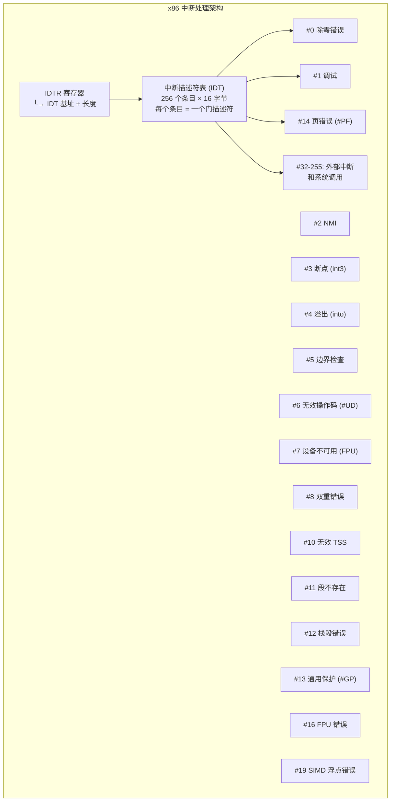
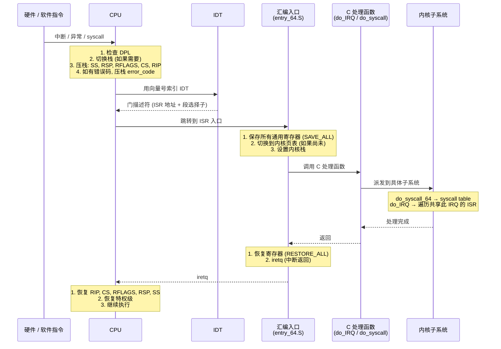
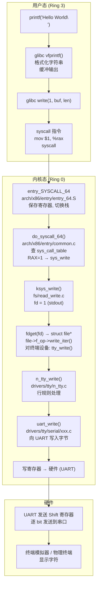

# 中断与系统调用  (Interrupts and System Calls)
---

##  章节概述

>  **本章揭开系统调用的神秘面纱**。在 [[01_C语言与操作系统|第一章]] 中，我们提到系统调用是用户态进入内核态的唯一合法途径。在本章，我们将从 CPU 中断架构开始，逐层追踪 `printf("hello")` 如何一步步触发硬件中断、进入内核、找到处理函数、操作硬件、最终返回用户态。这是一次从 C 代码到硅片的完整旅程。

中断是 CPU 与外部世界交互的核心机制。系统调用本质上是一种"软件中断"——用户程序主动触发，请求内核提供服务。理解中断框架，对于编写正确的内核代码（尤其是驱动和同步相关）至关重要。

本章内容：
- **x86 中断架构**：IDT、中断门、异常向量
- **异常 vs 中断**：CPU 故障、陷阱、外部中断
- **系统调用机制**：syscall 指令、syscall table、参数传递
- **完整追踪**：从 printf → write → syscall → 内核 → 设备 → 返回
- **strace 深度使用**：用户态系统调用追踪
- **添加自定义系统调用**：教育目的
- **上下文切换开销测量**

**前置要求**：
- 已学完 [[01_C语言与操作系统|C语言与操作系统]]（理解用户态 vs 内核态）
- 已学完 [[../../c语言教程/2深化/06_编译链接与ELF|编译链接与ELF]]（理解符号和链接）
- 已学完 [[../../汇编基础/1基础/02_栈与调用约定|ASM: 系统调用]]（汇编层理解）
- 建议阅读 [[../../汇编基础/1基础/01_寄存器与指令基础|ASM: 体系结构与寄存器]]（理解 CPU 寄存器）

---
###  第一节：x86 中断体系结构
---

### 1.1 中断描述符表 (IDT)



### 1.2 中断门描述符 (Gate Descriptor)

```c
// x86-64 中断门描述符 (128 位, 16 字节)
//
// 结构:
// ┌─────────────────────────────────────────────────────────────┐
// │ 63                 32│31    16│15   8│7 6 5   4   3    0   │
// ├─────────────────────────────────────────────────────────────┤
// │   ISR 地址 [63:32]   │ 保留    │ IST  │DPL│P│ GateType(0xE) │
// ├─────────────────────────────────────────────────────────────┤
// │ 段选择子              │ ISR 地址 [31:16]                    │
// ├─────────────────────────────────────────────────────────────┤
// │ ISR 地址 [15:0]      │                                       │
// └─────────────────────────────────────────────────────────────┘
//
// 字段说明:
//   - ISR 地址: 中断服务例程的入口虚拟地址 (64 位)
//   - 段选择子: 必须指向内核代码段 (__KERNEL_CS = 0x10)
//   - DPL (Descriptor Privilege Level): 门的特权级
//       0: 只能内核态触发
//       3: 用户态也能触发 (如 int3, int 0x80)
//   - P (Present): 1 = 此门有效
//   - GateType: 0xE = 中断门 (禁用中断), 0xF = 陷阱门 (不禁用中断)
//   - IST (Interrupt Stack Table): 要使用的内核栈索引 (0-7)

// Intel 和 AMD 手册中有完整定义:
//   Intel SDM Vol. 3, Chapter 6: Interrupt and Exception Handling
```

### 1.3 异常分类

```c
// ============================================
// x86 异常分类 (按 Intel 分类)
// ============================================

// 1. 故障 (Fault) —— 可纠正的异常
//    保存的 RIP 指向出错指令本身
//    处理完毕后重新执行该指令
//    例如:
//      - #PF (页错误): 页面不存在 → 调入 → 重试访问
//      - #GP (一般保护): 段访问违规
//      - #NM (设备不可用): FPU 首次使用 → 初始化 → 重试

// 2. 陷阱 (Trap) —— 用于调试和系统调用
//    保存的 RIP 指向出错指令的下一条
//    例如:
//      - #BP (int3): 软件断点 → 执行断点处理 → 继续执行下一条
//      - #OF (into): 溢出检查 → 溢出处理
//      - 系统调用: syscall → 内核处理 → 返回到下一条指令

// 3. 中止 (Abort) —— 不可恢复的错误
//    RIP 不可靠，进程/系统可能不稳定
//    例如:
//      - #DF (双重错误): 在处理一个异常时又发生异常
//      - 机器检查 (Machine Check): 硬件错误

// Linux 中的异常处理示例:
// arch/x86/kernel/traps.c  — 异常处理入口
// arch/x86/mm/fault.c      — #PF 页错误处理
// arch/x86/kernel/idt.c    — IDT 初始化
```

### 1.4 中断处理的总流程



---
###  第二节：系统调用机制
---

### 2.1 系统调用表 (sys_call_table)

```c
// ============================================
// Linux 系统调用表
// 定义在 arch/x86/entry/syscalls/syscall_64.tbl
// 编译后生成 arch/x86/include/generated/asm/syscalls_64.h
// ============================================

// 系统调用表的本质:
//   sys_call_table 是一个函数指针数组
//   每个索引对应一个系统调用号
//
//   简化定义:
//   typedef long (*sys_call_ptr_t)(unsigned long, unsigned long,
//                                   unsigned long, unsigned long,
//                                   unsigned long, unsigned long);
//   extern const sys_call_ptr_t sys_call_table[];

// 常用系统调用及其编号 (x86-64):
//
// #0   sys_read     — 读文件
// #1   sys_write    — 写文件
// #2   sys_open     — 打开文件
// #3   sys_close    — 关闭文件
// #8   sys_lseek    — 文件定位
// #9   sys_mmap     — 内存映射
// #10  sys_mprotect — 修改内存保护
// #11  sys_munmap   — 取消内存映射
// #12  sys_brk      — 修改堆边界
// #56  sys_clone    — 创建子进程/线程
// #57  sys_fork     — 创建子进程 (已淘汰, 由 clone 取代)
// #59  sys_execve   — 执行程序
// #60  sys_exit     — 进程退出
// #61  sys_wait4    — 等待子进程
// #62  sys_kill     — 发送信号
// #63  sys_uname    — 获取系统名
// #79  sys_getcwd   — 获取当前工作目录
// #231  sys_exit_group — 所有线程退出

// 查看你的系统的 syscall 编号:
// /usr/include/asm-generic/unistd.h
// /usr/include/x86_64-linux-gnu/asm/unistd_64.h
```

### 2.2 系统调用的内核入口

```c
// ============================================
// entry_SYSCALL_64 (arch/x86/entry/entry_64.S)
// 简化伪代码表示
// ============================================

void entry_SYSCALL_64(void)
{
    // syscall 指令已经:
    //   - RCX = 用户 RIP (syscall 的下一条指令)
    //   - R11 = 用户 RFLAGS
    //   - CS  = 内核代码段选择子
    //   - SS  = 内核栈段选择子
    
    // 1. 切换栈
    //    swapgs_restore_regs_and_return_to_usermode
    //    从 per-CPU 区域加载内核栈指针
    //    mov %rsp, PER_CPU_VAR(cpu_tss_rw + TSS_sp0)
    
    // 2. 构建 pt_regs 结构体 (保存所有用户态寄存器)
    //    按照 pt_regs 的顺序压栈
    //    pushq $__USER_DS          // ss
    //    pushq PER_CPU_VAR(cpu_tss_rw + TSS_sp0)  // rsp
    //    pushq %r11                // rflags
    //    pushq $__USER_CS          // cs
    //    pushq %rcx                // rip
    //    pushq $0                  // orig_ax
    //    pushq %rdi, %rsi, %rdx, %rcx, %rax, %r8, %r9, %r10, %r11
    //    pushq %rbx, %rbp, %r12, %r13, %r14, %r15
    
    // 3. 调用 C 处理函数
    //    movq %rsp, %rdi          // 第一个参数: pt_regs *
    //    call do_syscall_64
    
    // 4. 返回用户态
    //    movq %rax, (pt_regs->orig_ax 位置)
    //    jmp syscall_return_via_sysret 或 iretq
}

// 内核 C 处理函数 (arch/x86/entry/common.c)
__visible noinstr void do_syscall_64(struct pt_regs *regs, int nr)
{
    // nr = 系统调用号 (用户态 RAX 的值)
    
    if (likely(nr < NR_syscalls)) {
        sys_call_ptr_t fn = sys_call_table[nr];  //  查表!
        
        if (unlikely(!fn))  // 调用号在范围内但未实现
            goto invoc;
        
        // 调用实际的系统调用实现
        // 参数: regs->di, regs->si, regs->dx,
        //       regs->r10(代替rcx, 因为syscall破坏了rcx),
        //       regs->r8, regs->r9
        regs->ax = fn(regs->di, regs->si, regs->dx,
                      regs->r10, regs->r8, regs->r9);
        return;
    }
    
invoc:
    regs->ax = -ENOSYS;  // 调用号不存在
}
```

### 2.3 参数传递规则

```c
// ============================================
// x86-64 系统调用参数传递
// ============================================
//
// 寄存器使用约定:
//   RAX: 系统调用号
//   RDI: 参数 1 (arg0)
//   RSI: 参数 2 (arg1)
//   RDX: 参数 3 (arg2)
//   R10: 参数 4 (arg3)  ← 注意: 不是 RCX!
//   R8:  参数 5 (arg4)
//   R9:  参数 6 (arg5)
//
//   为什么 R10 而不是 RCX?
//   因为 syscall 指令自动用 RCX 保存返回地址(RIP)!
//   所以 RCX 被破坏了, 第4个参数改用 R10
//
//   返回值: RAX (成功时) / -errno (错误时)

// 示例: write(1, "hello", 5) 的汇编等价:
//
// mov $1,  %rax     # 系统调用号: __NR_write
// mov $1,  %rdi     # fd = stdout
// mov $buf, %rsi    # 用户空间缓冲区地址
// mov $5,  %rdx     # 长度
// syscall           # 进入内核
// cmp $-4096, %rax  # 检查返回值
// ja  error         # 如果 > -4096, 表示错误
```

### 2.4 系统调用号的演变

```c
// 对比不同架构的系统调用号:

// x86-64 (unistd_64.h):
#define __NR_read   0
#define __NR_write  1
#define __NR_open   2
#define __NR_close  3

// ARM64 (unistd.h):
// (架构独立编号, 从 asm-generic 继承)
#define __NR_read   63
#define __NR_write  64
#define __NR_openat 56

// 注意: 不同架构的系统调用号不同!
// 但 C 标准库 (glibc) 隐藏了这一差异
// 用户程序只需要调用 write(), glibc 负责选择正确的调用号
```

---
###  第三节：从 printf 到 write —— 完整追踪
---

### 3.1 完整的调用链



### 3.2 逐层代码分析

```c
// ============================================
// Layer 1: 用户态 printf
// ============================================
#include <stdio.h>
int main(void) {
    printf("Hello, World!\n");
    return 0;
}

// printf 在 glibc 中的实现路径 (简化):
// printf → vfprintf → __do_fprintf → 格式化处理 → _IO_file_write → __write

// ============================================
// Layer 2: glibc 的 write 包装
// ============================================

// glibc/sysdeps/unix/sysv/linux/write.c (简化):
ssize_t __libc_write(int fd, const void *buf, size_t count)
{
    // 1. 检查是否有缓冲区需要刷新 (stdio 缓冲)
    // 2. 设置系统调用号和参数
    // 3. 执行 syscall 指令
    // 4. 处理返回值和 errno
    
    long int result;
    
    // 对于 x86-64:
    result = INLINE_SYSCALL_CALL(write, fd, buf, count);
    // 展开为:
    // {
    //     unsigned long int resultvar;
    //     asm volatile (
    //         "syscall\n\t"
    //         : "=a" (resultvar)
    //         : "a" (__NR_write),    // RAX = 1
    //           "D" (fd),             // RDI = fd
    //           "S" (buf),            // RSI = buf
    //           "d" (count)           // RDX = count
    //         : "rcx", "r11", "memory"
    //     );
    //     resultvar;
    // }
    //
    // 注意: rcx 和 r11 被 clobber!
    // rcx = 内核返回后保存的用户 RIP
    // r11 = 内核返回后保存的用户 RFLAGS
    
    // 错误处理
    if (result >= (unsigned long int) -4095) {
        __set_errno(-result);
        return -1;
    }
    
    return result;
}
weak_alias(__libc_write, __write)
libc_hidden_weak(__write)
```

```c
// ============================================
// Layer 3: 内核端 — sys_write 实现
// ============================================
// 实际实现在 fs/read_write.c

SYSCALL_DEFINE3(write, unsigned int, fd, 
                const char __user *, buf, size_t, count)
{
    // SYSCALL_DEFINE3 宏展开为:
    // asmlinkage long sys_write(unsigned int fd,
    //                            const char __user *buf,
    //                            size_t count)
    // { return ksys_write(fd, buf, count); }
    
    return ksys_write(fd, buf, count);
}

ssize_t ksys_write(unsigned int fd, const char __user *buf, size_t count)
{
    struct fd f = fdget_pos(fd);  // 从文件描述符表获取 struct file*
    ssize_t ret = -EBADF;
    
    if (f.file) {
        loff_t pos, *ppos = file_ppos(f.file);
        // 对于 stdout (终端): file->f_pos 没有意义, ppos = NULL
        
        //  调用 VFS 层, 最终走到终端驱动
        ret = vfs_write(f.file, buf, count, ppos);
        
        fdput_pos(f);  // 释放 fd 引用
    }
    
    return ret;
}

// ============================================
// Layer 4: VFS — vfs_write
// ============================================
// 详见 [[03_文件系统|文件系统]] 中的完整分析

ssize_t vfs_write(struct file *file, const char __user *buf,
                  size_t count, loff_t *pos)
{
    ssize_t ret;
    
    if (!(file->f_mode & FMODE_WRITE))
        return -EBADF;
    if (!(file->f_mode & FMODE_CAN_WRITE))
        return -EINVAL;
    
    // ...rw_verify_area 权限检查...
    // ...security_file_permission...
    
    //  多态调用: 对终端设备, file->f_op = tty_fops
    if (file->f_op->write)
        ret = file->f_op->write(file, buf, count, pos);
    else if (file->f_op->write_iter)
        ret = new_sync_write(file, buf, count, pos);
    else
        ret = -EINVAL;
    
    if (ret > 0) {
        fsnotify_modify(file);  // inotify 通知
        add_wchar(current, ret);
    }
    
    return ret;
}

// ============================================
// Layer 5: TTY 层 — tty_write
// ============================================
// drivers/tty/tty_io.c

static ssize_t tty_write(struct file *file, const char __user *buf,
                          size_t count, loff_t *ppos)
{
    struct tty_struct *tty = file_tty(file);
    struct tty_ldisc *ld;
    ssize_t ret;
    
    if (tty->ops->write_room)
        tty->ops->write_room(tty);  // 检查缓冲区空间
    
    ld = tty_ldisc_ref_wait(tty);  // 获取行规则模块 (line discipline)
    
    // 调用行规则模块的 write 方法
    ret = do_tty_write(ld->ops->write, tty, file, buf, count);
    
    tty_ldisc_deref(ld);
    return ret;
}

// ============================================
// Layer 6: N_TTY 行规则 — n_tty_write
// ============================================
// drivers/tty/n_tty.c

// ============================================
// Layer 7: UART 驱动 — 最终写入硬件寄存器
// ============================================
// drivers/tty/serial/8250/8250_port.c
static void serial8250_console_putchar(struct uart_port *port,
                                        unsigned char ch)
{
    struct uart_8250_port *up = up_to_u8250p(port);
    
    // 等待发送器就绪 (UART 状态寄存器)
    wait_for_xmitr(up, UART_LSR_THRE);
    
    // 写入数据到 UART 的发送保持寄存器
    // 这就是最终的操作! 一个 outb 或 writel 指令
    serial_port_out(port, UART_TX, ch);
}
```

```c
// 练习 1: 追踪系统调用
// 1. 使用 strace 观察一个简单程序的系统调用:
//    strace -tt -T -o trace.log ./hello
//    cat trace.log
//
// 2. 使用 ftrace (内核函数追踪器) 追踪内核函数:
//    echo function_graph > /sys/kernel/debug/tracing/current_tracer
//    echo SyS_write > /sys/kernel/debug/tracing/set_ftrace_filter
//    echo 1 > /sys/kernel/debug/tracing/tracing_on
//    ./hello
//    echo 0 > /sys/kernel/debug/tracing/tracing_on
//    cat /sys/kernel/debug/tracing/trace
//
// 3. 使用 bpftrace 追踪系统调用:
//    sudo bpftrace -e 'tracepoint:syscalls:sys_enter_write
//                       { printf("%d: %s\n", pid, str(args->buf)); }'
```

---
###  第四节：strace 深度使用
---

### 4.1 strace 基础

```bash
# strace 是理解系统调用的头号工具
# 它追踪用户态程序和内核之间的系统调用接口

# 基础用法
strace ls                          # 显示所有系统调用
strace -c ls                       # 统计摘要
strace -e trace=open,read,write ls # 只看特定调用
strace -e trace=file ls            # 所有文件相关调用
strace -e trace=network curl example.com  # 网络相关
strace -e trace=signal kill -TERM $$  # 信号相关
strace -e trace=process bash -c 'ls'  # 进程管理相关

# 时间分析
strace -T ls     # 显示每个调用的耗时
strace -tt ls    # 显示精确时间戳
strace -c -w ls  # 按耗时排序

# 子进程追踪
strace -f make   # 同时追踪子进程 (-f = follow forks)
strace -ff -o trace make  # 每个子进程输出到单独的 trace.PID 文件

# 过滤和格式化
strace -e trace=write -e write=1 ls  # 只看 fd=1 (stdout) 的 write
strace -v ls     # 详细模式 (显示结构体内容)
strace -s 1024 ls  # 显示更多字符串内容 (默认 32 字节)
strace -x ls     # 十六进制显示
strace -y ls     # 显示 fd 关联的路径
strace -yy ls    # 显示更详细的 fd 信息

# 注入
strace -e inject=write:error=EIO cat /etc/hostname  
# 注入错误: 让 write 返回 EIO
strace -e inject=write:delay_enter=1000000 cat /etc/hostname
# 注入延迟: 让 write 延迟 1 秒
```

### 4.2 分析真实案例

```bash
# 案例 1: 理解 shell 管道的系统调用
strace -f bash -c 'echo hello | wc -c' 2>&1 | head -50
# 关键系统调用序列:
#   pipe()       → 创建管道
#   clone()      → 创建子进程 (echo)
#   clone()      → 创建子进程 (wc)
#   dup2/close   → 重定向 stdin/stdout
#   execve()     → 执行 echo
#   execve()     → 执行 wc
#   read/write   → 数据传输
#   wait4()      → 等待子进程结束

# 案例 2: 理解动态链接器的系统调用
strace /bin/true 2>&1 | grep -E "openat|mmap|mprotect"
# 可以看到:
#   openat 加载 ld-linux.so, libc.so...
#   mmap  将 library 映射到地址空间
#   mprotect 设置代码段为只读/可执行

# 案例 3: 追踪性能瓶颈
strace -c -w dd if=/dev/zero of=/dev/null bs=1M count=1000
# 观察哪个系统调用消耗最多时间
```

```c
// 练习 2: strace 分析实验
// 1. 对比以下两个操作的系统调用开销:
//    a. 循环 1000 次 write(1, "x", 1)
//    b. 单次 write(1, "xxxx...", 1000)
//    strace -c 来统计, 解释为什么 b 比 a 快得多
//
// 2. 追踪一个 C 程序的 full execution lifecycle:
//    - execve 开始
//    - mmap 加载共享库
//    - brk 扩展堆
//    - write 输出结果
//    - exit_group 退出
//
// 3. 使用 strace 调试 "too many open files" 错误:
//    strace -e trace=open,close ./fd_leak_program
```

---
###  第五节：添加自定义系统调用（教学）
---

> ️ **警告**: 以下操作仅用于教育目的。不要在生产内核上添加自定义系统调用。内核的系统调用表是 ABI 稳定接口，不可随意修改。推荐使用内核模块 + `/proc` 或 `/sys` 接口暴露自定义功能。

### 5.1 添加步骤

```c
// ============================================
// 步骤 1: 实现系统调用函数
// 在 kernel/ 下新建 sys_hello.c
// ============================================

#include <linux/kernel.h>
#include <linux/syscalls.h>  // SYSCALL_DEFINE 宏

/*
 * sys_hello — 一个教学用的自定义系统调用
 * 输入:  无
 * 返回值: 0 成功
 *
 * SYSCALL_DEFINE0 宏(无参数), 实际定义:
 *   asmlinkage long sys_hello(void)
 */
SYSCALL_DEFINE0(hello)
{
    printk(KERN_INFO "sys_hello: Called by process %s (pid=%d)\n",
           current->comm, current->pid);
    
    printk(KERN_INFO "Hello from kernel space!\n");
    
    // 返回信息给用户态
    // 注意: 系统调用不能返回负数作为成功值
    //       负数会被解释为 -errno
    return 42;  // 返回一个有趣的值
}

/*
 * sys_set_my_nice — 带参数的系统调用
 * 将当前进程的 nice 值设置并返回旧的 nice 值
 *
 * SYSCALL_DEFINE1 宏(1个参数)
 */
SYSCALL_DEFINE1(set_my_nice, int, new_nice)
{
    int old_nice;
    
    if (new_nice < -20 || new_nice > 19)
        return -EINVAL;
    
    // task_nice(current) 返回当前 nice 值
    old_nice = task_nice(current);
    
    // set_user_nice 修改进程的 nice 值
    int ret = set_user_nice(current, new_nice);
    if (ret)
        return ret;
    
    printk(KERN_INFO "sys_set_my_nice: pid=%d, old=%d, new=%d\n",
           current->pid, old_nice, new_nice);
    
    return old_nice;
}

// ============================================
// 步骤 2: 更新内核 Makefile
// kernel/Makefile 中添加:
//   obj-y += sys_hello.o
// ============================================

// ============================================
// 步骤 3: 注册系统调用号
// arch/x86/entry/syscalls/syscall_64.tbl 中添加:
//
// 335 common  hello           sys_hello
// 336 common  set_my_nice     sys_set_my_nice
//
// 注意: 选择未使用的编号, 并增加 NR_syscalls
// arch/x86/include/generated/asm/syscalls_64.h 中的:
//   #define __NR_syscalls  337
// 
// 在 include/linux/syscalls.h 中添加声明:
//   asmlinkage long sys_hello(void);
//   asmlinkage long sys_set_my_nice(int new_nice);
// ============================================
```

### 5.2 测试自定义系统调用

```c
// ============================================
// test_syscall.c —— 用户态测试程序
// ============================================
#include <stdio.h>
#include <unistd.h>
#include <sys/syscall.h>

int main(void)
{
    long ret;
    
    // 调用自定义系统调用
    // 使用 syscall() 函数 (glibc 提供的通用系统调用接口)
    
    printf("Calling sys_hello()...\n");
    ret = syscall(335);  // 335 = __NR_hello (我们的自定义编号)
    printf("sys_hello returned: %ld\n", ret);
    
    printf("\nCalling sys_set_my_nice(5)...\n");
    ret = syscall(336, 5);
    printf("Old nice value: %ld\n", ret);
    
    printf("\nCalling sys_set_my_nice(30)... (invalid)\n");
    ret = syscall(336, 30);
    printf("Return: %ld (should be -EINVAL = -22)\n", ret);
    
    return 0;
}

// 输出:
//   Calling sys_hello()...
//   sys_hello returned: 42
//
//   在 dmesg 中:
//   [xxxxx] sys_hello: Called by process test_syscall (pid=12345)
//   [xxxxx] Hello from kernel space!
```

### 5.3 为什么不推荐添加系统调用

```c
// 1. ABI 稳定性: 系统调用号一旦分配, 就不能修改或移除
//    这是 Linux 的"永不破坏用户空间"承诺
//
// 2. 更好的替代方案:
//    - 内核模块 + ioctl: 灵活, 不需要修改内核源码
//    - procfs / sysfs: 简单的读写接口
//    - debugfs: 调试和开发用
//    - BPF: Linux 6.0+ 可通过 BPF 创建安全的内核函数
//    - io_uring: 高性能异步 IO 框架
//
// 3. 系统调用是全局的, 加载在内核空间不能像模块一样卸载
//
// 4. 维护成本: 新 syscall 需要跨所有架构实现 (x86, ARM, RISC-V...)
```

```c
// 练习 3: syscall 深度实验
// 1. 列出你的系统中所有系统调用的编号和名称:
//    使用 ausyscall --dump (如果可用)
//    或写 C 程序遍历 /usr/include/x86_64-linux-gnu/asm/unistd_64.h
//
// 2. 使用 syscall() 函数直接调用内核的系统调用,
//    不依赖 glibc:
//    - 用 syscall(__NR_getpid) 代替 getpid()
//    - 用 syscall(__NR_mmap, ...) 自己实现 mini-malloc
//
// 3. 查看内核编译后的 sys_call_table:
//    cat /proc/kallsyms | grep sys_call_table
//    (可能需要 root 和 CONFIG_KALLSYMS_ALL=y)
```

---
###  第六节：上下文切换开销
---

### 6.1 上下文切换的类型

```c
// ============================================
// 三种上下文切换
// ============================================

// 1. 进程上下文切换 (最昂贵)
//    进程 A → 内核 → 进程 B
//    开销:
//      - 保存/恢复通用寄存器 (~16个 64-bit)
//      - 保存/恢复 FPU/SSE/AVX 寄存器 (~512-2048 bytes)
//      - 切换页表 (mov to CR3) → TLB 刷新 (非全局页)
//      - 切换内核栈
//      - 可能的缓存污染 (L1/L2/L3 cache misses)
//    总开销: ~1-5 微秒 (取决于架构和缓存状态)
//
//    触发原因:
//      - 时间片耗尽 (调度器抢占)
//      - 进程阻塞 (等待 IO/锁)
//      - 高优先级进程就绪 (抢占)
//      - 进程主动让出 CPU (sched_yield)
//
// 2. 线程上下文切换 (较便宜)
//    相同进程的线程 A → 内核 → 线程 B
//    开销:
//      - 保存/恢复通用寄存器
//      - 保存/恢复 FPU
//      - 不需要切换 CR3 (共享地址空间!)
//      - 切换内核栈
//    总开销: ~0.5-2 微秒
//
// 3. 系统调用 (最轻量, 但仍是上下文切换)
//    用户态 → 内核态 → 用户态 (同一个进程)
//    开销:
//      - syscall 指令 (~250 周期)
//      - 保存/恢复部分寄存器
//      - 切换栈
//      - iret/sysret (~250 周期)
//    总开销: ~0.05-0.5 微秒 (不包括系统调用内部操作)
```

### 6.2 测量上下文切换开销

```c
// ============================================
// 测量系统调用开销 (使用 rdtsc)
// ============================================
#include <stdio.h>
#include <stdint.h>
#include <unistd.h>

// 读取时间戳计数器 (TSC)
static __inline__ uint64_t rdtsc(void)
{
    uint32_t lo, hi;
    __asm__ __volatile__("rdtsc" : "=a"(lo), "=d"(hi));
    return ((uint64_t)hi << 32) | lo;
}

int main(void)
{
    const int N = 1000000;
    uint64_t start, end, sum = 0;
    int i;
    
    // 预热 (避免第一次调用的冷开销)
    getpid();
    
    start = rdtsc();
    for (i = 0; i < N; i++) {
        // 测量空系统调用的开销
        // getpid() 是最便宜的系统调用之一
        // (不涉及 IO, 只是读取 current->pid)
        getpid();
    }
    end = rdtsc();
    
    uint64_t total_cycles = end - start;
    double cycles_per_call = (double)total_cycles / N;
    
    printf("getpid() x %d:\n", N);
    printf("  Total cycles: %lu\n", total_cycles);
    printf("  Per call: %.1f cycles\n", cycles_per_call);
    
    // 对比: 测量空函数调用的开销
    sum = 0;
    start = rdtsc();
    for (i = 0; i < N; i++) {
        sum += i;  // 简单的运算, 不会离开 Ring 3
    }
    end = rdtsc();
    
    uint64_t func_cycles = end - start;
    printf("\nSimple loop x %d:\n", N);
    printf("  Total cycles: %lu\n", func_cycles);
    printf("  Per iter: %.1f cycles\n", (double)func_cycles / N);
    printf("  Syscall overhead: %.1fx\n",
           cycles_per_call / ((double)func_cycles / N));
    
    // 典型结果 (现代 CPU):
    // - 空系统调用: ~100-300 周期
    // - 简单循环: ~0.25-1 周期 (IPC ~2-4)
    // - 系统调用比普通函数至少慢 100 倍
    
    return 0;
}
```

```bash
# 使用 perf 测量系统调用的上下文切换
perf stat -e cycles:u,cycles:k,instructions:u,instructions:k \
    -e context-switches,cpu-migrations \
    ./syscall_bench

# 使用 lmbench 套件 (更专业的测量工具)
# git clone https://github.com/intel/lmbench
# cd lmbench && make
# ./bin/x86_64-linux-gnu/lat_syscall null
# ./bin/x86_64-linux-gnu/lat_ctx -s 0 2
```

```c
// 练习 4: 上下文切换实验
// 1. 编写程序, 使用 pthread 测量线程上下文切换开销:
//    - 两个线程通过 pipe 互相 ping-pong
//    - 每次 ping-pong 涉及 2 个线程的上下文切换
//    - 打时间戳并计算平均开销
//
// 2. 编写程序测量进程上下文切换开销:
//    - 两个进程通过 pipe 或 shared memory + futex
//    - 对比进程切换和线程切换的开销差异
//    解释为什么进程切换慢 (TLB flush!)
//
// 3. 使用 perf 比较:
//    perf stat -e context-switches -e dTLB-load-misses -- ./your_program
```

---
##  章节测试
---

> [!question] 判断题 1
> syscall 指令执行后，CPU 自动从 Ring 3 切换到 Ring 0，并将用户态 RIP 保存在 RCX 寄存器中。 （ ）
> - [ ]  正确
> - [ ]  错误
>
> > [!success]- 点击查看答案
> > 答案: 正确
> >
> > **解析**: syscall 指令从 IA32_LSTAR MSR 加载内核入口地址 → 将用户 RIP（syscall 的下一条指令地址）存入 RCX → 将用户 RFLAGS 存入 R11 → 加载内核 CS/SS → 跳转到内核入口。RCX 和 R11 被修改，这就是为什么第 4 个系统调用参数使用 R10 而不是 RCX。

> [!question] 判断题 2
> IDT (中断描述符表) 有 4096 个条目，即 4096 种中断/异常。 （ ）
> - [ ]  正确
> - [ ]  错误
>
> > [!success]- 点击查看答案
> > 答案: 错误
> >
> > **解析**: x86 IDT 有 256 个条目（向量 0-255）。前 32 个 (0-31) 保留给 CPU 异常，32-255 用于外部硬件中断和软件陷阱。每个条目 16 字节（64 位模式下），IDT 总大小 256 × 16 = 4096 字节。

> [!question] 判断题 3
> 系统调用表 `sys_call_table` 是一个函数指针数组，索引为系统调用号。 （ ）
> - [ ]  正确
> - [ ]  错误
>
> > [!success]- 点击查看答案
> > 答案: 正确
> >
> > **解析**: sys_call_table 的定义为 `sys_call_ptr_t sys_call_table[__NR_syscalls]`，每个元素是指向系统调用实现函数的指针。do_syscall_64() 通过 `sys_call_table[nr](args...)` 的方式分发调用。

> [!question] 判断题 4
> 页错误 (#PF) 是不可恢复的异常，总是导致进程崩溃。 （ ）
> - [ ]  正确
> - [ ]  错误
>
> > [!success]- 点击查看答案
> > 答案: 错误
> >
> > **解析**: 页错误是一种**故障 (Fault)**——它是可恢复的。例如，页面在 swap 分区时被访问 → `#PF` → do_page_fault 将页面换入 → 重新执行访问指令。只有当访问地址真的无效时（如 NULL 指针），#PF 才会导致 SIGSEGV。

> [!question] 判断题 5
> glibc 中的 `write()` 函数直接执行 write 系统调用，没有额外的缓冲层。 （ ）
> - [ ]  正确
> - [ ]  错误
>
> > [!success]- 点击查看答案
> > 答案: 错误
> >
> > **解析**: glibc 有 `stdio` 缓冲层。`printf()` 先写入用户态缓冲区（通常 4KB 或 8KB），当缓冲区满、遇到 `\n`（行缓冲）或 `fflush()` 时才调用 `write()` 系统调用。直接调用 `write()`（不经过 printf）没有此缓冲，但文件系统有页面缓存。

> [!question] 判断题 6
> 不同的 CPU 架构（x86-64、ARM64、RISC-V）使用不同的系统调用号，但 glibc 自动处理差异。 （ ）
> - [ ]  正确
> - [ ]  错误
>
> > [!success]- 点击查看答案
> > 答案: 正确
> >
> > **解析**: x86-64 的 `__NR_write = 1`，ARM64 的 `__NR_write = 64`。glibc 在编译时为不同架构选择正确的 `__NR_*` 定义，使得源代码中的 `write(fd, buf, len)` 在所有架构上都能正确编译和执行。

> [!question] 判断题 7
> `strace` 使用 ptrace 系统调用来追踪目标进程，因此会显著减慢目标进程执行。 （ ）
> - [ ]  正确
> - [ ]  错误
>
> > [!success]- 点击查看答案
> > 答案: 正确
> >
> > **解析**: strace 使用 `ptrace()`，它在每次系统调用进出时暂停目标进程，将控制权交给 strace，strace 解码参数后恢复目标进程。这导致巨大的性能开销（10-100 倍慢）。对于性能敏感的分析，应使用 `perf` 或 `bpftrace`。

> [!question] 判断题 8
> 中断门 (Interrupt Gate) 和陷阱门 (Trap Gate) 的唯一区别是 trap 会禁用中断。 （ ）
> - [ ]  正确
> - [ ]  错误
>
> > [!success]- 点击查看答案
> > 答案: 错误
> >
> > **解析**: 恰恰相反！中断门（GateType=0xE）在进入 ISR 时会**清除 IF 标志**（禁用可屏蔽中断）。陷阱门（GateType=0xF）**不改变 IF 标志**，允许中断嵌套。Linux 使用中断门处理硬件中断，防止同一中断线重入。

> [!question] 判断题 9
> 系统调用的参数通过栈传递，在 x86-64 上均是如此。 （ ）
> - [ ]  正确
> - [ ]  错误
>
> > [!success]- 点击查看答案
> > 答案: 错误
> >
> > **解析**: x86-64 的系统调用参数通过寄存器传递：RDI, RSI, RDX, R10, R8, R9（最多 6 个参数）。这遵循 x86-64 ABI 约定，但 RCX 被 R10 替代（因为 syscall 指令破坏了 RCX）。所有现代架构（ARM64, RISC-V）都使用寄存器传参。

> [!question] 判断题 10
> 内核空间可以通过 `syscall()` 函数调用任意系统调用，就像用户空间一样。 （ ）
> - [ ]  正确
> - [ ]  错误
>
> > [!success]- 点击查看答案
> > 答案: 错误
> >
> > **解析**: 内核代码已经在 Ring 0 执行，不需要通过系统调用机制。内核代码可以直接调用 `ksys_write()`、`do_fork()` 等内部函数。实际上，某些系统调用的内核实现会调用其他系统调用的内核内部版本。但从内核态执行 `syscall` 指令是不正确的——它假设从用户态进入。

---

> [!question] 选择题 1
> x86-64 系统调用使用哪条指令进入内核？
> - [ ] A. `int $0x80`
> - [ ] B. `sysenter`
> - [ ] C. `syscall`
> - [ ] D. `svc`
>
> > [!success]- 点击查看答案
> > 正确答案: C
> >
> > **解析**: x86-64 使用 `syscall` 指令。`int $0x80` 是老的 32 位 x86 方法（仍然支持但慢 3 倍），`sysenter` 是 Intel 32 位的快速替代方案，`svc` 是 ARM64 的系统调用指令。在内核源码中，入口点是 `arch/x86/entry/entry_64.S` 中的 `entry_SYSCALL_64`。

> [!question] 选择题 2
> 以下哪个异常是"故障 (Fault)"类型，处理器会在处理后重新执行出错指令？
> - [ ] A. #BP (断点)
> - [ ] B. #PF (页错误)
> - [ ] C. #MC (机器检查)
> - [ ] D. #DB (调试)
>
> > [!success]- 点击查看答案
> > 正确答案: B
> >
> > **解析**: 页错误是最典型的 Fault——指令因缺页而无法完成，内核调入页面后重新执行。断点 (#BP) 和调试 (#DB) 是 Trap，保存的 RIP 指向下一条指令。机器检查 (#MC) 是 Abort，系统状态可能不可恢复。

> [!question] 选择题 3
> syscall 指令执行后，哪个寄存器保存了用户态 RIP？
> - [ ] A. RAX
> - [ ] B. RCX
> - [ ] C. R10
> - [ ] D. R11
>
> > [!success]- 点击查看答案
> > 正确答案: B
> >
> > **解析**: syscall 将用户返回地址（syscall 的下一条指令地址）保存到 RCX，将用户 RFLAGS 保存到 R11。这两个寄存器被 clobber，所以在系统调用 ABI 中第 4 个参数不使用 RCX 而使用 R10。

> [!question] 选择题 4
> `strace -e trace=openat,read,write cat /etc/hostname` 的作用是什么？
> - [ ] A. 只追踪 cat 命令中的 openat、read 和 write 系统调用
> - [ ] B. 追踪 cat 命令，并只显示以 "openat"、"read"、"write" 开头的函数
> - [ ] C. 向 cat 命令注入 openat/read/write 系统调用
> - [ ] D. 统计 cat 命令中所有 openat/read/write 调用的数量
>
> > [!success]- 点击查看答案
> > 正确答案: A
> >
> > **解析**: `-e trace=...` 选项指定 strace 只显示匹配的系统调用。这是性能分析中最有用的选项之一——过滤掉不关心的系统调用，聚焦于特定类别（文件、网络、进程、信号等）。

> [!question] 选择题 5
> 页错误 (#PF) 发生时，出错的虚拟地址被保存在哪个寄存器中？
> - [ ] A. RAX
> - [ ] B. CR2
> - [ ] C. CR3
> - [ ] D. RIP
>
> > [!success]- 点击查看答案
> > 正确答案: B
> >
> > **解析**: CR2（Control Register 2）在 x86 中保存最近一次页错误的线性地址。页错误处理函数（`do_user_addr_fault`）从中读取出错地址，判断是合法缺页还是非法访问。

> [!question] 选择题 6
> 以下正确描述了"上下文切换"的是？
> - [ ] A. 进程从用户态进入内核态（如系统调用）的过程
> - [ ] B. CPU 从一个进程切换到另一个进程，包括保存/恢复寄存器和切换页表
> - [ ] C. 函数调用的现场保存和恢复
> - [ ] D. IDE 中的文件切换
>
> > [!success]- 点击查看答案
> > 正确答案: B
> >
> > **解析**: 上下文切换（context switch）指 CPU 从一个进程/线程切换到另一个，需要保存当前任务的所有状态（寄存器、栈指针、页表等）并加载新任务的状态。进程切换还涉及 CR3 页表切换（TLB flush），开销最大。

> [!question] 选择题 7
> `SYSCALL_DEFINE3(write, unsigned int, fd, const char __user *, buf, size_t, count)` 宏的作用是什么？
> - [ ] A. 定义用户态 write 函数的包装
> - [ ] B. 在内核中定义 sys_write 系统调用的实现
> - [ ] C. 声明系统调用编号
> - [ ] D. 在系统调用表中注册新的调用号
>
> > [!success]- 点击查看答案
> > 正确答案: B
> >
> > **解析**: `SYSCALL_DEFINE3` 宏定义了一个带有 3 个参数的系统调用实现。它自动生成 `asmlinkage long sys_write(...)` 的声明和所有必需的包装函数（如 `__se_sys_write` 和 `__do_sys_write`），处理符号可见性和参数签名。

> [!question] 选择题 8
> 以下哪种追踪器不需要修改内核源码？
> - [ ] A. kprobes / ftrace
> - [ ] B. 添加 printk 到内核
> - [ ] C. 重新编译内核
> - [ ] D. 修改 sys_call_table
>
> > [!success]- 点击查看答案
> > 正确答案: A
> >
> > **解析**: kprobes 和 ftrace 是内核内置的动态追踪基础设施，可以在运行时动态插入追踪点，不需要重新编译内核。ftrace 通过 debugfs 控制，kprobes 通过 debugfs 或 bpftrace 使用。ebpf/bpftrace 则提供了更高级的追踪抽象。

> [!question] 选择题 9
> 从 printf("hello\n") 到字符出现在终端上，不涉及以下哪个内核子系统？
> - [ ] A. VFS (虚拟文件系统)
> - [ ] B. TTY 子系统
> - [ ] C. UART 驱动
> - [ ] D. 网络栈
>
> > [!success]- 点击查看答案
> > 正确答案: D
> >
> > **解析**: printf → write(1, ...) → VFS → TTY 子系统 → 行规则 (N_TTY) → UART 驱动 → 硬件。不涉及网络栈。如果输出到 SSH 终端伪终端 (pty)，则涉及 socket 层但不涉及物理网络。

> [!question] 选择题 10
> 为什么现代内核倾向于使用 BPF 而不是添加新的系统调用？
> - [ ] A. BPF 比系统调用更安全，可以在运行时验证和加载
> - [ ] B. 系统调用号有限，且一旦分配不能修改
> - [ ] C. BPF 程序可以动态加载/卸载，不需要重新编译内核
> - [ ] D. 以上全部
>
> > [!success]- 点击查看答案
> > 正确答案: D
> >
> > **解析**: BPF 是一个安全的沙盒虚拟机，运行在内核中。它不需要固定系统调用号（ABI 可演化），可以通过验证器确保安全性（不会崩溃内核），支持动态加载和卸载。这使得 BPF 成为现代 Linux 中扩展内核功能的推荐方式。

---

### ️ 编程练习题

> [!example] 练习题 1：汇编级系统调用实现（）
> **难度**: 
>
> 不使用 glibc，纯汇编编写一个程序，调用 write 和 exit 系统调用输出 "Hello from pure syscall!"。
>
> **要求**:
> 1. 使用 x86-64 AT&T 汇编语法
> 2. 不链接任何 C 库（`gcc -nostdlib -static`）
> 3. 直接使用 `syscall` 指令
> 4. 实现第二个版本使用 `int $0x80`（老 32 位方法），比较差异
>
> **提示**: 程序入口点需要自己定义 `_start`，使用 `syscall` 指令。

> [!example] 练习题 2：系统调用延迟测量（）
> **难度**: 
>
> 编写程序测量以下系统调用的开销（循环次数/周期）：
> 1. getpid() —— 最轻
> 2. read(0, NULL, 0) —— 带参数但无实际操作
> 3. write(1, buf, 1) —— 有实际输出
> 4. open/close 一个 tmpfs 文件
> 5. mmap/munmap 一个小区域
>
> 使用 `rdtsc` 测量，绘制柱状图对比。解释为什么某些调用慢得多（VFS 开销、权限检查、锁等）。

> [!example] 练习题 3：构建最小 Linux 引导程序（）
> **难度**: 
>
> 编写一个在 QEMU 中运行的极简程序，不使用操作系统：
> 1. 在 x86-64 保护模式下自行设置 IDT
> 2. 实现一个基本的键盘中断处理程序（IRQ 1）
> 3. 从键盘接收输入并回显到屏幕（使用 VGA 文本缓冲区 0xB8000）
> 4. 当按下 ESC 键时退出（通过 QEMU debugcon）
>
> **提示**: 这是一个引导扇区或 ELF 引导程序。需要设置 GDT、IDT、PIC（可编程中断控制器）。这本质上是一个微型操作系统内核——也是理解 Linux 内核设计的最佳方式。

***
##  知识网络
***

- **下一章**: [[06_并发与同步|并发与同步]]
- **上一章**: [[04_设备驱动|设备驱动]]
- **返回**: [[../内核索引|返回总目录]]
- **相关**: [[../../c语言教程/2深化/06_编译链接与ELF|编译链接与ELF]] | [[../../c语言教程/2深化/05_位运算与硬件操作|位运算与硬件操作]]
- **汇编参考**: [[../../汇编基础/1基础/02_栈与调用约定|ASM: 系统调用]] | [[../../汇编基础/1基础/01_寄存器与指令基础|ASM: 体系结构与寄存器]]
- **内核源码**: `arch/x86/entry/entry_64.S` (系统调用入口) | `arch/x86/entry/common.c` (do_syscall_64) | `arch/x86/kernel/idt.c` (IDT初始化) | `arch/x86/entry/syscalls/syscall_64.tbl` (系统调用表)
